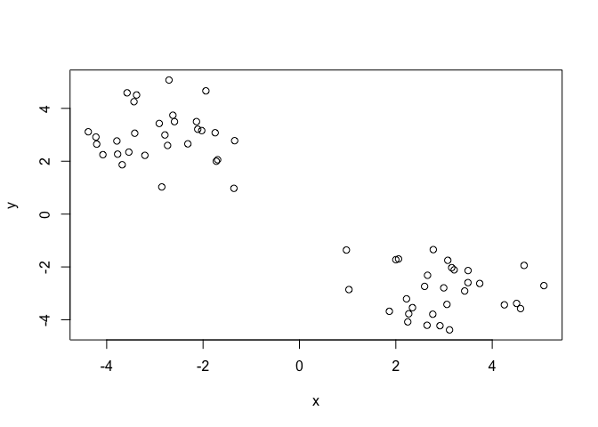
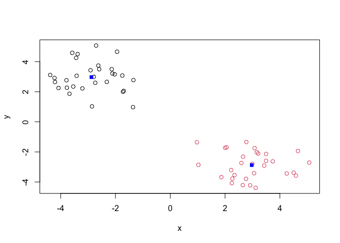
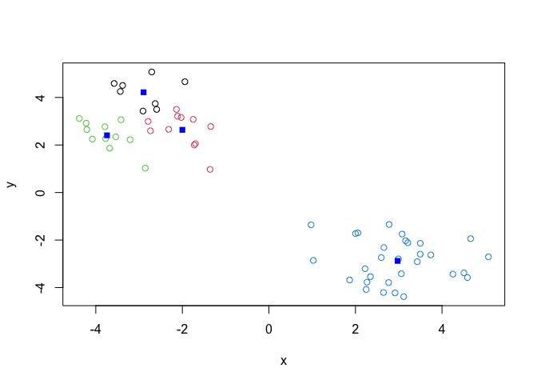
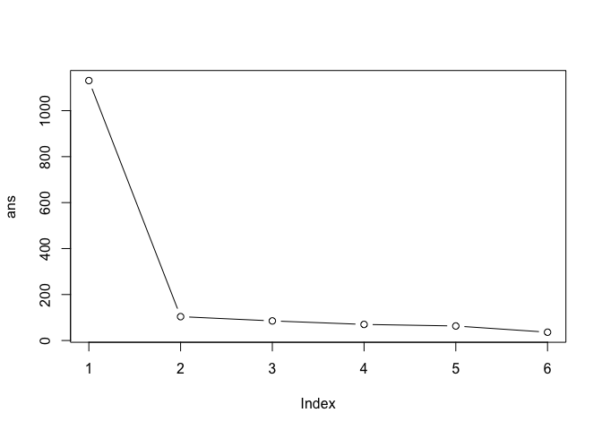
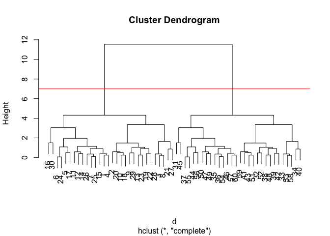
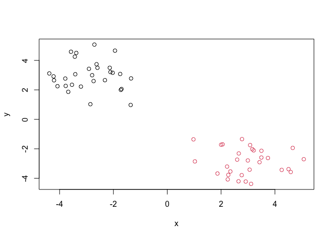
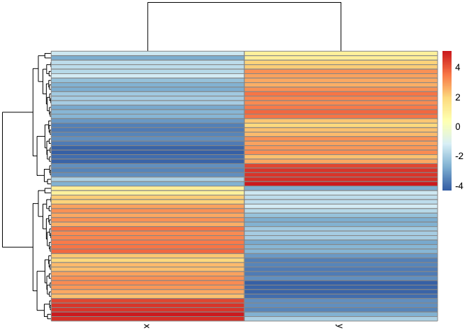
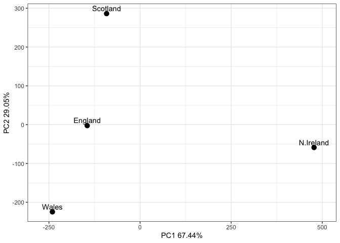
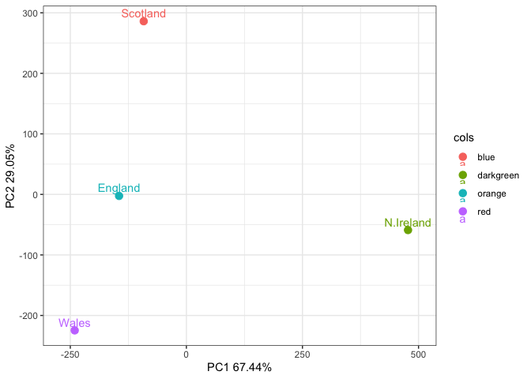

# Class 7: Introduction to machine learning for Bioinformatics
Libby Gilmore pid: A69047570

``` r
x <- c(rnorm(30,mean=-3), rnorm(30, mean=3))
y <- rev(x) # reverses the argument; so y should be +3 for 30 then -3 for next 30

x <- cbind(x,y)
head(x)
```

                 x        y
    [1,] -2.626175 3.740669
    [2,] -3.207179 2.221996
    [3,] -3.576714 4.588034
    [4,] -2.593333 3.496694
    [5,] -1.748922 3.078018
    [6,] -1.725193 1.999959

``` r
# a look at x with `plot()`
plot(x)
```



The main function in “base” R for K-means clustering is called
`kmeans()`

``` r
# kmeans has two required arguments, data, and centers 
#(centers is k, the amount of clusters you want)
k <- kmeans(x,centers=2) # these cluster means end up at ~+/- 3
# clustering vector: is a vector of integers from 1:k indicating the cluster 
# to which each point is allocated
k
```

    K-means clustering with 2 clusters of sizes 30, 30

    Cluster means:
              x         y
    1 -2.877023  2.974330
    2  2.974330 -2.877023

    Clustering vector:
     [1] 1 1 1 1 1 1 1 1 1 1 1 1 1 1 1 1 1 1 1 1 1 1 1 1 1 1 1 1 1 1 2 2 2 2 2 2 2 2
    [39] 2 2 2 2 2 2 2 2 2 2 2 2 2 2 2 2 2 2 2 2 2 2

    Within cluster sum of squares by cluster:
    [1] 51.88541 51.88541
     (between_SS / total_SS =  90.8 %)

    Available components:

    [1] "cluster"      "centers"      "totss"        "withinss"     "tot.withinss"
    [6] "betweenss"    "size"         "iter"         "ifault"      

> Q. How big are the clusters (i.e. their size)?

``` r
k$size
```

    [1] 30 30

> Q. What clusters do my data points reside in?

``` r
# A vector of integers (from 1:k) indicating the cluster to which each point is allocated.
k$cluster
```

     [1] 1 1 1 1 1 1 1 1 1 1 1 1 1 1 1 1 1 1 1 1 1 1 1 1 1 1 1 1 1 1 2 2 2 2 2 2 2 2
    [39] 2 2 2 2 2 2 2 2 2 2 2 2 2 2 2 2 2 2 2 2 2 2

> Q. Make a plot of our data colored by cluster assignment – i.e. Make a
> result figure…

``` r
plot(x, col=k$cluster)
points(k$centers, col="blue", pch=15)
```



``` r
# plot(x, col=2) # you can also color by number
```

> Q. Cluster with kmeans into 4 clusters and plot your results above

``` r
k4 <- kmeans(x, centers=4)
plot(x, col=k4$cluster)
points(k4$centers, col="blue", pch=15)
```



> Q. Run kmeans with center (i.e values of k) equal to 1 to 6

``` r
k$tot.withinss # sum of squares you want to store those values for all of sum of centers; and I want to plot this against each k
```

    [1] 103.7708

``` r
k1 <- kmeans(x,centers=1)$tot.withinss
k2 <- kmeans(x,centers=2)$tot.withinss
k3 <- kmeans(x,centers=3)$tot.withinss
k4 <- kmeans(x,centers=4)$tot.withinss
k5 <- kmeans(x,centers=5)$tot.withinss
k6 <- kmeans(x,centers=6)$tot.withinss
```

``` r
ans <- NULL
for(i in 1:6){
  # cat(i) to check each integer is being incremented
  ans <- c(ans, kmeans(x, centers = i)$tot.withinss)
}
ans
```

    [1] 1130.92076  103.77082   85.22457   69.91684   63.07841   36.03890

``` r
# Make a scree-plot, used for PCAs, you get the most bang for your buck when k is 2. After that it becomes inconsequential
plot(ans, typ="b")
```



## Hierarchical Clustering

The main function in base R for this is called `hclust()`

``` r
# hclust(x)
d <- dist(x)
hc <- hclust(d) # input needs to be a distance matrix
hc
```


    Call:
    hclust(d = d)

    Cluster method   : complete 
    Distance         : euclidean 
    Number of objects: 60 

you can just call `plot()` on your hc object. It produces a cluster
dendrogram, and the ordering in this labeling is random, but what does
matter is the bar lengths (height)

``` r
plot(hc)
abline(h=7,col="red")
```



To obtain clusters from out `hclust` object **hc** we “cut” the tree to
yield different sub branches. For this we use `cutree()` function.

``` r
grps <- cutree(hc, h=7)
grps
```

     [1] 1 1 1 1 1 1 1 1 1 1 1 1 1 1 1 1 1 1 1 1 1 1 1 1 1 1 1 1 1 1 2 2 2 2 2 2 2 2
    [39] 2 2 2 2 2 2 2 2 2 2 2 2 2 2 2 2 2 2 2 2 2 2

``` r
plot(x, col=grps)
```



``` r
library(pheatmap)
pheatmap(x)
```



### Principal Component Analysis

``` r
# data import
url <- "https://tinyurl.com/UK-foods"
x <- read.csv(url)
# View(x)
```

> Q1. How many rows and columns are in your new data frame named x? What
> R functions could you use to answer this questions?

``` r
dim(x)
```

    [1] 17  5

``` r
## Preview the first 6 rows
head(x)
```

                   X England Wales Scotland N.Ireland
    1         Cheese     105   103      103        66
    2  Carcass_meat      245   227      242       267
    3    Other_meat      685   803      750       586
    4           Fish     147   160      122        93
    5 Fats_and_oils      193   235      184       209
    6         Sugars     156   175      147       139

``` r
# Note how the minus indexing works
rownames(x) <- x[,1] # sets rownames to first column
x <- x[,-1] # everything but the first column; thereby removes the first column
head(x)
```

                   England Wales Scotland N.Ireland
    Cheese             105   103      103        66
    Carcass_meat       245   227      242       267
    Other_meat         685   803      750       586
    Fish               147   160      122        93
    Fats_and_oils      193   235      184       209
    Sugars             156   175      147       139

``` r
dim(x) # it has one less column
```

    [1] 17  4

``` r
# An alternative approach to setting the correct row-names when importing dataset
x <- read.csv(url, row.names=1)
head(x)
```

                   England Wales Scotland N.Ireland
    Cheese             105   103      103        66
    Carcass_meat       245   227      242       267
    Other_meat         685   803      750       586
    Fish               147   160      122        93
    Fats_and_oils      193   235      184       209
    Sugars             156   175      147       139

> Q2. Which approach to solving the ‘row-names problem’ mentioned above
> do you prefer and why? Is one approach more robust than another under
> certain circumstances?

`read.csv(url, row.names=1)` is more robust under certain circumstances;
whereas `x<-x[,-1]` will keep removing columns

``` r
# Using base R
barplot(as.matrix(x), beside=T, col=rainbow(nrow(x))) # effectively makes a new color for each food group
```


> Q3. Changing what optional argument in the above barplot() function
> results in the following plot?

``` r
# change beside argument to false
barplot(as.matrix(x), beside=F, col=rainbow(nrow(x)))
```


``` r
# Currently we have wide format
dim(x)
```

    [1] 17  4

``` r
head(x)
```

                   England Wales Scotland N.Ireland
    Cheese             105   103      103        66
    Carcass_meat       245   227      242       267
    Other_meat         685   803      750       586
    Fish               147   160      122        93
    Fats_and_oils      193   235      184       209
    Sugars             156   175      147       139

``` r
library(tidyr)

# Convert data to long format for gpglot with `pivot_longer()`

x_long <- x |> 
  tibble::rownames_to_column("Food") |> 
  pivot_longer(cols = -Food,
               names_to = "Country",
               values_to = "Consumption")

dim(x_long)
```

    [1] 68  3

``` r
head(x_long)
```

    # A tibble: 6 × 3
      Food            Country   Consumption
      <chr>           <chr>           <int>
    1 "Cheese"        England           105
    2 "Cheese"        Wales             103
    3 "Cheese"        Scotland          103
    4 "Cheese"        N.Ireland          66
    5 "Carcass_meat " England           245
    6 "Carcass_meat " Wales             227

``` r
# Create grouped bar plot
library(ggplot2)
```

    Warning: package 'ggplot2' was built under R version 4.5.2

``` r
ggplot(x_long) +
  aes(x = Country, y = Consumption, fill = Food) +
  geom_col(position = "dodge") +
  theme_bw()
```


> Q4: Changing what optional argument in the above ggplot() code results
> in a stacked barplot figure?

``` r
ggplot(x_long) +
  aes(x = Country, y = Consumption, fill = Food) +
  geom_col() + # no more position = "dodge"
  theme_bw()
```


## Pairs plots and heatmaps

> Q5: We can use the pairs() function to generate all pairwise plots for
> our countries. Can you make sense of the following code and resulting
> figure? What does it mean if a given point lies on the diagonal for a
> given plot?

``` r
pairs(x, col=rainbow(nrow(x)), pch=16)
```


``` r
# if a given point lies along the diagonal for a given plot it means those two countries have similar consumption habits for that food group, high similarity

# England is all in the y-axis of the top row, and the x-axis of the first column
```

``` r
library(pheatmap)

pheatmap( as.matrix(x) )
```


> Q6. Based on the pairs and heatmap figures, which countries cluster
> together and what does this suggest about their food consumption
> patterns? Can you easily tell what the main differences between N.
> Ireland and the other countries of the UK in terms of this data-set?

``` r
# You can see more dissimilarities in N. Ireland in comparison to Scotland, England, and Wales; but the colors with the scale make it hard to definitively interpret them aside from alcoholic drinks, fresh potatoes, and fresh fruit differences. 
```

## PCA to the rescue

The main function in “base” R for PCA is called `prcomp()`

As we want to do PCA on the food data for the different countries we
will want the goods in the columns.

``` r
# Use the prcomp() PCA function 
pca <- prcomp( t(x) ) # so we transpose it to get foods in columns, otherwise we do the wrong analysis.
summary(pca)
```

    Importance of components:
                                PC1      PC2      PC3       PC4
    Standard deviation     324.1502 212.7478 73.87622 2.921e-14
    Proportion of Variance   0.6744   0.2905  0.03503 0.000e+00
    Cumulative Proportion    0.6744   0.9650  1.00000 1.000e+00

Our result object is called `pca` and it has a `$x` component that we
will look at first

``` r
pca$x
```

                     PC1         PC2        PC3           PC4
    England   -144.99315   -2.532999 105.768945 -9.152022e-15
    Wales     -240.52915 -224.646925 -56.475555  5.560040e-13
    Scotland   -91.86934  286.081786 -44.415495 -6.638419e-13
    N.Ireland  477.39164  -58.901862  -4.877895  1.329771e-13

> Q7. Complete the code below to generate a plot of PC1 vs PC2. The
> second line adds text labels over the data points.

``` r
# Create a data frame for plotting
df <- as.data.frame(pca$x)
df$Country <- rownames(df)

# Plot PC1 vs PC2 with ggplot
ggplot(pca$x) +
  aes(x = PC1, y = PC2, label = rownames(pca$x)) +
  geom_point(size = 3) +
  geom_text(vjust = -0.5) +
  xlim(-270, 500) +
  xlab("PC1 67.44%") +
  ylab("PC2 29.05%") +
  theme_bw()
```



> Q8. Customize your plot so that the colors of the country names match
> the colors in our UK and Ireland map and table at start of this
> document.

``` r
cols <- c("orange", "red", "blue", "darkgreen")

# Plot PC1 vs PC2 with ggplot
ggplot(pca$x) +
  aes(x = PC1, y = PC2, label = rownames(pca$x), col=cols) +
  geom_point(size = 3) +
  geom_text(vjust = -0.5) +
  xlim(-270, 500) +
  xlab("PC1 67.44%") +
  ylab("PC2 29.05%") +
  theme_bw()
```



Another major results of PCA is the so-called “variable loadings” or
`$rotation` that tells us how the original variables (foods) contribute
to PCs (i.e. our new axis)

> Q9: Generate a similar ‘loadings plot’ for PC2. What two food groups
> feature prominantely and what does PC2 maninly tell us about?

``` r
# remember since N. Ireland is on the plus size, so the things that make it more distinct are soft_drinks, fresh_potatoes, and carcass_meat
ggplot(pca$rotation) +
  aes(PC1, rownames(pca$rotation)) +
  geom_col()
```


``` r
v <- round( pca$sdev^2/sum(pca$sdev^2) * 100 )
v
```

    [1] 67 29  4  0

``` r
## or the second row here...
z <- summary(pca)
z$importance
```

                                 PC1       PC2      PC3          PC4
    Standard deviation     324.15019 212.74780 73.87622 2.921348e-14
    Proportion of Variance   0.67444   0.29052  0.03503 0.000000e+00
    Cumulative Proportion    0.67444   0.96497  1.00000 1.000000e+00

``` r
# Create a scree plot
variance_df <- data.frame(
  PC = factor(paste0("PC", 1:length(v)), levels = paste0("PC", 1:length(v))),
  Variance = v
)

ggplot(variance_df) +
  aes(x = PC, y = Variance) +
  geom_col(fill = "steelblue") +
  xlab("Principal Component") +
  ylab("Percent Variation") +
  theme_bw() +
  theme(axis.text.x = element_text(angle = 0))
```


``` r
## Lets focus on PC1 as it accounts for > 90% of variance 
ggplot(pca$rotation) +
  aes(x = PC1, 
      y = reorder(rownames(pca$rotation), PC1)) +
  geom_col(fill = "steelblue") +
  xlab("PC1 Loading Score") +
  ylab("") +
  theme_bw() +
  theme(axis.text.y = element_text(size = 9))
```


