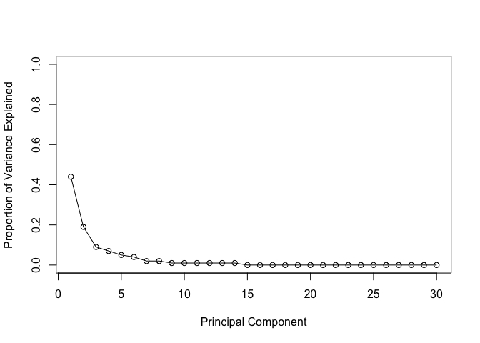
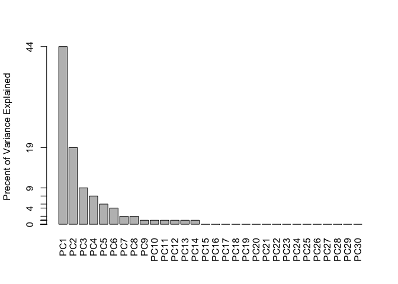
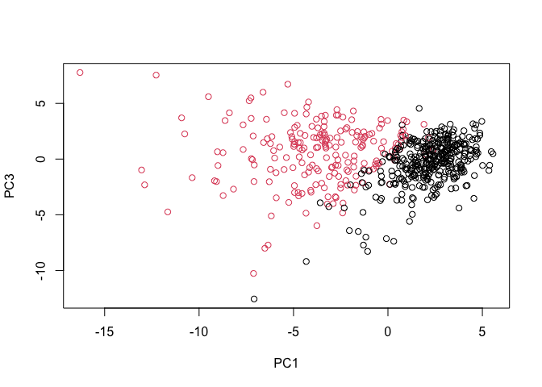
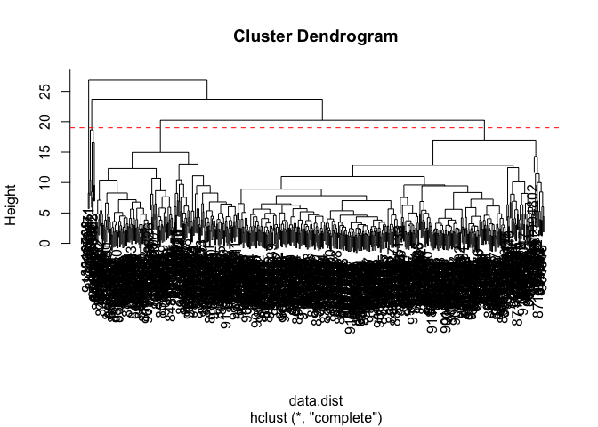
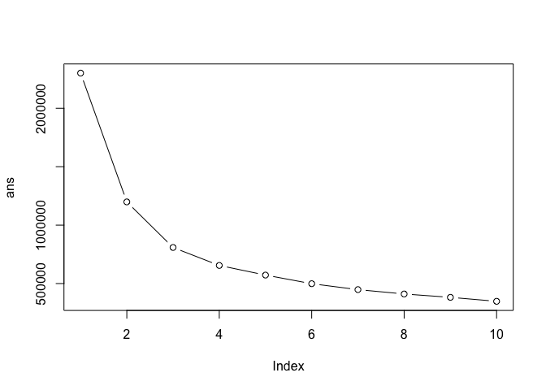
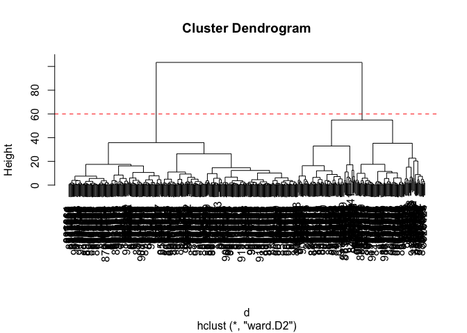

# Class08 mini project: Breast Cancer Analysis Project
Libby Gilmore pid: A69047570
2025-12-05

- [Background](#background)
- [Data import](#data-import)
- [Exploratory data analysis](#exploratory-data-analysis)
- [Principal Component Analysis](#principal-component-analysis)
- [plot main result figure](#plot-main-result-figure)
- [Hierarchical clustering](#hierarchical-clustering)
- [Combining PCA and clustering](#combining-pca-and-clustering)

## Background

The goal of this mini-project is for you to explore a complete analysis
using the unsupervised learning techniques covered in class. We will
extend what we learned by combining PCA as a preprocessing step to
clustering using data that consist of measurements of cell nuclei of
human breast masses.

The data itself comes from the Wisconsin Breast Cancer Diagnostic Data
Set first reported by K. P. Benne and O. L. Mangasarian: “Robust Linear
Programming Discrimination of Two Linearly Inseparable Sets”.

Values in this data set describe characteristics of the cell nuclei
present in digitized images of a fine needle aspiration (FNA) of a
breast mass.

## Data import

``` r
library(readr)
```

    Warning: package 'readr' was built under R version 4.5.2

``` r
# Complete the following code to input the data and store as wisc.df
# sets patient id as row names too
wisc.df <- read.csv("WisconsinCancer.csv", row.names=1)

#View(wisc.df)
```

Make sure we do not include patient or sample id or the diagnosis for
further analysis:

``` r
diagnosis <- as.factor(wisc.df$diagnosis)
# gives you everything but the first column
wisc.data <- wisc.df[, -1]
dim(wisc.data)
```

    [1] 569  30

``` r
head(wisc.data)
```

             radius_mean texture_mean perimeter_mean area_mean smoothness_mean
    842302         17.99        10.38         122.80    1001.0         0.11840
    842517         20.57        17.77         132.90    1326.0         0.08474
    84300903       19.69        21.25         130.00    1203.0         0.10960
    84348301       11.42        20.38          77.58     386.1         0.14250
    84358402       20.29        14.34         135.10    1297.0         0.10030
    843786         12.45        15.70          82.57     477.1         0.12780
             compactness_mean concavity_mean concave.points_mean symmetry_mean
    842302            0.27760         0.3001             0.14710        0.2419
    842517            0.07864         0.0869             0.07017        0.1812
    84300903          0.15990         0.1974             0.12790        0.2069
    84348301          0.28390         0.2414             0.10520        0.2597
    84358402          0.13280         0.1980             0.10430        0.1809
    843786            0.17000         0.1578             0.08089        0.2087
             fractal_dimension_mean radius_se texture_se perimeter_se area_se
    842302                  0.07871    1.0950     0.9053        8.589  153.40
    842517                  0.05667    0.5435     0.7339        3.398   74.08
    84300903                0.05999    0.7456     0.7869        4.585   94.03
    84348301                0.09744    0.4956     1.1560        3.445   27.23
    84358402                0.05883    0.7572     0.7813        5.438   94.44
    843786                  0.07613    0.3345     0.8902        2.217   27.19
             smoothness_se compactness_se concavity_se concave.points_se
    842302        0.006399        0.04904      0.05373           0.01587
    842517        0.005225        0.01308      0.01860           0.01340
    84300903      0.006150        0.04006      0.03832           0.02058
    84348301      0.009110        0.07458      0.05661           0.01867
    84358402      0.011490        0.02461      0.05688           0.01885
    843786        0.007510        0.03345      0.03672           0.01137
             symmetry_se fractal_dimension_se radius_worst texture_worst
    842302       0.03003             0.006193        25.38         17.33
    842517       0.01389             0.003532        24.99         23.41
    84300903     0.02250             0.004571        23.57         25.53
    84348301     0.05963             0.009208        14.91         26.50
    84358402     0.01756             0.005115        22.54         16.67
    843786       0.02165             0.005082        15.47         23.75
             perimeter_worst area_worst smoothness_worst compactness_worst
    842302            184.60     2019.0           0.1622            0.6656
    842517            158.80     1956.0           0.1238            0.1866
    84300903          152.50     1709.0           0.1444            0.4245
    84348301           98.87      567.7           0.2098            0.8663
    84358402          152.20     1575.0           0.1374            0.2050
    843786            103.40      741.6           0.1791            0.5249
             concavity_worst concave.points_worst symmetry_worst
    842302            0.7119               0.2654         0.4601
    842517            0.2416               0.1860         0.2750
    84300903          0.4504               0.2430         0.3613
    84348301          0.6869               0.2575         0.6638
    84358402          0.4000               0.1625         0.2364
    843786            0.5355               0.1741         0.3985
             fractal_dimension_worst
    842302                   0.11890
    842517                   0.08902
    84300903                 0.08758
    84348301                 0.17300
    84358402                 0.07678
    843786                   0.12440

## Exploratory data analysis

> Q1. How many observations are in this dataset

``` r
dim(wisc.data)
```

    [1] 569  30

> Q2. How many of the observations have a malignant diagnosis

``` r
sum(diagnosis == "M")
```

    [1] 212

``` r
table(diagnosis) # same answer but shows all clusters!!
```

    diagnosis
      B   M 
    357 212 

> Q3. How many variables/features in the data are suffixed with \_mean?

``` r
# grep same as unix command
# value = T prints the actual matches; and have to use length() because sum() would return the sum of each index

length(grep("_mean", colnames(wisc.data))) 
```

    [1] 10

``` r
# or can break it up to improve readability
n <- colnames(wisc.data)
inds <- grep("_mean", colnames(wisc.data))
length(inds)
```

    [1] 10

## Principal Component Analysis

The main function in base R for PCA is called `prcomp()`. In general you
always want to scale our data prior to PCA to ensure that each feature
contributes equally to the analysis. `prcomp(x, scale = TRUE)`

Except for very few cases, you always want to use scaling for this
function.

``` r
wisc.pr <- prcomp(wisc.data, scale = TRUE)
summary(wisc.pr)
```

    Importance of components:
                              PC1    PC2     PC3     PC4     PC5     PC6     PC7
    Standard deviation     3.6444 2.3857 1.67867 1.40735 1.28403 1.09880 0.82172
    Proportion of Variance 0.4427 0.1897 0.09393 0.06602 0.05496 0.04025 0.02251
    Cumulative Proportion  0.4427 0.6324 0.72636 0.79239 0.84734 0.88759 0.91010
                               PC8    PC9    PC10   PC11    PC12    PC13    PC14
    Standard deviation     0.69037 0.6457 0.59219 0.5421 0.51104 0.49128 0.39624
    Proportion of Variance 0.01589 0.0139 0.01169 0.0098 0.00871 0.00805 0.00523
    Cumulative Proportion  0.92598 0.9399 0.95157 0.9614 0.97007 0.97812 0.98335
                              PC15    PC16    PC17    PC18    PC19    PC20   PC21
    Standard deviation     0.30681 0.28260 0.24372 0.22939 0.22244 0.17652 0.1731
    Proportion of Variance 0.00314 0.00266 0.00198 0.00175 0.00165 0.00104 0.0010
    Cumulative Proportion  0.98649 0.98915 0.99113 0.99288 0.99453 0.99557 0.9966
                              PC22    PC23   PC24    PC25    PC26    PC27    PC28
    Standard deviation     0.16565 0.15602 0.1344 0.12442 0.09043 0.08307 0.03987
    Proportion of Variance 0.00091 0.00081 0.0006 0.00052 0.00027 0.00023 0.00005
    Cumulative Proportion  0.99749 0.99830 0.9989 0.99942 0.99969 0.99992 0.99997
                              PC29    PC30
    Standard deviation     0.02736 0.01153
    Proportion of Variance 0.00002 0.00000
    Cumulative Proportion  1.00000 1.00000

## plot main result figure

Let’s make our main result figure - the “PC Plot” or “score plot”,
“ordientation plot”

``` r
library(ggplot2)
```

    Warning: package 'ggplot2' was built under R version 4.5.2

``` r
ggplot(wisc.pr$x) +
  aes(x=PC1, y=PC2, col=diagnosis) +
  geom_point()
```


> Q4. From your results, what proportion of the original variance is
> captured by the PC1

``` r
pr.var <- wisc.pr$sdev^2
head(pr.var)
```

    [1] 13.281608  5.691355  2.817949  1.980640  1.648731  1.207357

``` r
round(pr.var / sum(pr.var), 2)
```

     [1] 0.44 0.19 0.09 0.07 0.05 0.04 0.02 0.02 0.01 0.01 0.01 0.01 0.01 0.01 0.00
    [16] 0.00 0.00 0.00 0.00 0.00 0.00 0.00 0.00 0.00 0.00 0.00 0.00 0.00 0.00 0.00

``` r
# 0.44 captured

# check with summary
summary(wisc.pr)$importance[,"PC1"]
```

        Standard deviation Proportion of Variance  Cumulative Proportion 
                  3.644394               0.442720               0.442720 

``` r
# .4427 proportion captured
```

``` r
# Variance explained by each principal component: pve
pve <- round(pr.var / sum(pr.var), 2)

# Plot variance explained for each principal component
plot(pve, xlab = "Principal Component", 
     ylab = "Proportion of Variance Explained", 
     ylim = c(0, 1), type = "o")
```



``` r
# Alternative scree plot of the same data, note data driven y-axis
barplot(pve, ylab = "Precent of Variance Explained",
     names.arg=paste0("PC",1:length(pve)), las=2, axes = FALSE)
axis(2, at=pve, labels=round(pve,2)*100 )
```



> Q5. How many PCs are required to describe at least 70% of the original
> variance in the data?

``` r
summary(wisc.pr)$importance
```

                                PC1      PC2      PC3      PC4      PC5      PC6
    Standard deviation     3.644394 2.385656 1.678675 1.407352 1.284029 1.098798
    Proportion of Variance 0.442720 0.189710 0.093930 0.066020 0.054960 0.040250
    Cumulative Proportion  0.442720 0.632430 0.726360 0.792390 0.847340 0.887590
                                 PC7       PC8       PC9      PC10      PC11
    Standard deviation     0.8217178 0.6903746 0.6456739 0.5921938 0.5421399
    Proportion of Variance 0.0225100 0.0158900 0.0139000 0.0116900 0.0098000
    Cumulative Proportion  0.9101000 0.9259800 0.9398800 0.9515700 0.9613700
                                PC12      PC13      PC14      PC15      PC16
    Standard deviation     0.5110395 0.4912815 0.3962445 0.3068142 0.2826001
    Proportion of Variance 0.0087100 0.0080500 0.0052300 0.0031400 0.0026600
    Cumulative Proportion  0.9700700 0.9781200 0.9833500 0.9864900 0.9891500
                                PC17      PC18      PC19      PC20      PC21
    Standard deviation     0.2437192 0.2293878 0.2224356 0.1765203 0.1731268
    Proportion of Variance 0.0019800 0.0017500 0.0016500 0.0010400 0.0010000
    Cumulative Proportion  0.9911300 0.9928800 0.9945300 0.9955700 0.9965700
                                PC22      PC23      PC24      PC25      PC26
    Standard deviation     0.1656484 0.1560155 0.1343689 0.1244238 0.0904303
    Proportion of Variance 0.0009100 0.0008100 0.0006000 0.0005200 0.0002700
    Cumulative Proportion  0.9974900 0.9983000 0.9989000 0.9994200 0.9996900
                                 PC27      PC28       PC29       PC30
    Standard deviation     0.08306903 0.0398665 0.02736427 0.01153451
    Proportion of Variance 0.00023000 0.0000500 0.00002000 0.00000000
    Cumulative Proportion  0.99992000 0.9999700 1.00000000 1.00000000

``` r
# It will take 3 PCs, to get at least 70% percent of the original variance
```

> Q6. How many PCs are required to describe at least 90% of the original
> variance in the data?

``` r
summary(wisc.pr)
```

    Importance of components:
                              PC1    PC2     PC3     PC4     PC5     PC6     PC7
    Standard deviation     3.6444 2.3857 1.67867 1.40735 1.28403 1.09880 0.82172
    Proportion of Variance 0.4427 0.1897 0.09393 0.06602 0.05496 0.04025 0.02251
    Cumulative Proportion  0.4427 0.6324 0.72636 0.79239 0.84734 0.88759 0.91010
                               PC8    PC9    PC10   PC11    PC12    PC13    PC14
    Standard deviation     0.69037 0.6457 0.59219 0.5421 0.51104 0.49128 0.39624
    Proportion of Variance 0.01589 0.0139 0.01169 0.0098 0.00871 0.00805 0.00523
    Cumulative Proportion  0.92598 0.9399 0.95157 0.9614 0.97007 0.97812 0.98335
                              PC15    PC16    PC17    PC18    PC19    PC20   PC21
    Standard deviation     0.30681 0.28260 0.24372 0.22939 0.22244 0.17652 0.1731
    Proportion of Variance 0.00314 0.00266 0.00198 0.00175 0.00165 0.00104 0.0010
    Cumulative Proportion  0.98649 0.98915 0.99113 0.99288 0.99453 0.99557 0.9966
                              PC22    PC23   PC24    PC25    PC26    PC27    PC28
    Standard deviation     0.16565 0.15602 0.1344 0.12442 0.09043 0.08307 0.03987
    Proportion of Variance 0.00091 0.00081 0.0006 0.00052 0.00027 0.00023 0.00005
    Cumulative Proportion  0.99749 0.99830 0.9989 0.99942 0.99969 0.99992 0.99997
                              PC29    PC30
    Standard deviation     0.02736 0.01153
    Proportion of Variance 0.00002 0.00000
    Cumulative Proportion  1.00000 1.00000

``` r
# It will take 7 PCs to get at least 90% of the original variance in the data
```

> Q7. What stands out to you about this plot? Is it easy or difficult to
> understand? Why?

It’s very condensed, and not readable making it hard to interpret or
even see what is being plotted. The row names as a plotting character
makes it hard to see where the dots are, and the different axes but not
knowing which points they correspond to is also weird.

> Q8. Generate a similar plot for principal components 1 and 3. What do
> you notice about these plots

The range is less variable in PC3, for example the y-axis no longer
extends to -10 as it does in PC2. Showing the values are more condensed.
Also the data has a cleaner line of differentiation in PC1 v PC2,
whereas in PC1 v PC3 the points are more diffused between clusters.

``` r
# Scatter plot observations by components 1 and 3
plot( wisc.pr$x, col = diagnosis , 
     xlab = "PC1", ylab = "PC3")
```



``` r
ggplot(wisc.pr$x) + 
  aes(PC1, PC3, col = diagnosis) +
  geom_point()
```


``` r
# The range is less variable in PC3, for example the y-axis no longer extends to -10 as it does in PC2. Showing the values are more condensed. Also the data has a cleaner line of differentiation in PC1 v PC2, whereas in PC1 v PC3 the points are more diffused between clusters.
```

> Q9. For the first principal component, what is the component of the
> loading vector (i.e. wisc.pr\$rotation\[,1\]) for the feature
> concave.points_mean? This tells us how much this original feature
> contributes to the first PC.

``` r
wisc.pr$rotation[ ,1]
```

                radius_mean            texture_mean          perimeter_mean 
                -0.21890244             -0.10372458             -0.22753729 
                  area_mean         smoothness_mean        compactness_mean 
                -0.22099499             -0.14258969             -0.23928535 
             concavity_mean     concave.points_mean           symmetry_mean 
                -0.25840048             -0.26085376             -0.13816696 
     fractal_dimension_mean               radius_se              texture_se 
                -0.06436335             -0.20597878             -0.01742803 
               perimeter_se                 area_se           smoothness_se 
                -0.21132592             -0.20286964             -0.01453145 
             compactness_se            concavity_se       concave.points_se 
                -0.17039345             -0.15358979             -0.18341740 
                symmetry_se    fractal_dimension_se            radius_worst 
                -0.04249842             -0.10256832             -0.22799663 
              texture_worst         perimeter_worst              area_worst 
                -0.10446933             -0.23663968             -0.22487053 
           smoothness_worst       compactness_worst         concavity_worst 
                -0.12795256             -0.21009588             -0.22876753 
       concave.points_worst          symmetry_worst fractal_dimension_worst 
                -0.25088597             -0.12290456             -0.13178394 

``` r
wisc.pr$rotation[8,1]
```

    [1] -0.2608538

``` r
# -0.26085376
```

## Hierarchical clustering

> Q10. Using the plot() and abline() functions, what is the height at
> which the clustering model has 4 clusters?

``` r
data.scaled <- scale(wisc.data) # if you scale for PCA scale for clustering too
data.dist <- dist(data.scaled)
wisc.hclust <- hclust(data.dist, method="complete")

plot(wisc.hclust)
abline(h=19, col="red", lty=2)
```



``` r
wisc.hclust.clusters <- cutree(wisc.hclust, k=4)
table(wisc.hclust.clusters, diagnosis)
```

                        diagnosis
    wisc.hclust.clusters   B   M
                       1  12 165
                       2   2   5
                       3 343  40
                       4   0   2

> Q11. OPTIONAL: Can you find a better cluster vs diagnoses match by
> cutting into a different number of clusters between 2 and 10? How do
> you judge the quality of your result in each case?

Cluster 2 may have the best payoff, because it has the largest change
between 2 and its predecessors in the graph. I also think a cluster of 3
may be better than 2 and 4 because it still provides a decent increase
that begins to level off after.

``` r
ans <- NULL
for(i in 1:10){
# cat(i) to check each integer is being incremented
ans <- c(ans, kmeans(data.dist, centers = i)$tot.withinss)
}
ans
```

     [1] 2301010.7 1198907.6  808778.5  654979.1  572592.0  498772.8  448116.5
     [8]  410915.7  382110.0  348080.8

``` r
plot(ans, typ="b")
```



> Q12. Which method gives your favorite results for the same data.dist
> dataset? Explain your reasoning.

WARD.2 is the method that gives me my favorite results. Mainly because
it shows 2 distinct groups, rather than forcing the 4 clusters, and it
is easier to look at.

## Combining PCA and clustering

``` r
d <- dist( wisc.pr$x[,1:3] ) # distance matrix on x values from PC1, PC2, and PC3
wisc.pr.hclust <- hclust(d, method = "ward.D2") # performs hierarchical clustering
plot(wisc.pr.hclust) # plotting dendrogram
abline(h=60, col = "red", lt = "dashed")
```



``` r
## Use the distance along the first 7 PCs for clustering i.e. wisc.pr$x[, 1:7]
d7 <- dist(wisc.pr$x[, 1:7])
wisc.pr.hclust_7 <- hclust(d7, method="ward.D2")
wisc.pr.hclust.clusters <- cutree(wisc.pr.hclust_7, k=2)
```

> Q13. How well does the newly created model with four clusters separate
> out the two diagnoses?

The newly created model does

``` r
table(cutree(wisc.pr.hclust,k=2), diagnosis)
```

       diagnosis
          B   M
      1  24 179
      2 333  33

``` r
table(wisc.pr.hclust.clusters, diagnosis)
```

                           diagnosis
    wisc.pr.hclust.clusters   B   M
                          1  28 188
                          2 329  24

Get my cluster membership vector

``` r
grps <- cutree(wisc.pr.hclust, h=60)
table(grps) # tells you how many patients in each cluster
```

    grps
      1   2 
    203 366 

``` r
table(diagnosis)
```

    diagnosis
      B   M 
    357 212 

> Q.14 How well do the hierarchical clustering models you created in
> previous sections (i.e. before PCA) do in terms of separating the
> diagnoses? Again, use the table() function to compare the output of
> each model (wisc.km\$cluster and wisc.hclust.clusters) with the vector
> containing the actual diagnoses.

They are better at separating in terms of diagnoses

Is the clustering catching the difference between benign and malignant.
Make a “cross-table”

``` r
# compare grps to diagnosis
table(grps, diagnosis)
```

        diagnosis
    grps   B   M
       1  24 179
       2 333  33

TP (true positive): 179 FP (false positive): 24 FN (false negative) So
which mechanism to optimize, to make bigger? - A : TP, you want more
true positives and minimize false positives.

Sensitivity: TP / ( TP + FN )

> Q16. Which of these new patients should we prioritize for follow up
> based on your results?

``` r
url <- "https://tinyurl.com/new-samples-CSV"
new <- read.csv(url)
npc <- predict(wisc.pr, newdata=new)
npc
```

               PC1       PC2        PC3        PC4       PC5        PC6        PC7
    [1,]  2.576616 -3.135913  1.3990492 -0.7631950  2.781648 -0.8150185 -0.3959098
    [2,] -4.754928 -3.009033 -0.1660946 -0.6052952 -1.140698 -1.2189945  0.8193031
                PC8       PC9       PC10      PC11      PC12      PC13     PC14
    [1,] -0.2307350 0.1029569 -0.9272861 0.3411457  0.375921 0.1610764 1.187882
    [2,] -0.3307423 0.5281896 -0.4855301 0.7173233 -1.185917 0.5893856 0.303029
              PC15       PC16        PC17        PC18        PC19       PC20
    [1,] 0.3216974 -0.1743616 -0.07875393 -0.11207028 -0.08802955 -0.2495216
    [2,] 0.1299153  0.1448061 -0.40509706  0.06565549  0.25591230 -0.4289500
               PC21       PC22       PC23       PC24        PC25         PC26
    [1,]  0.1228233 0.09358453 0.08347651  0.1223396  0.02124121  0.078884581
    [2,] -0.1224776 0.01732146 0.06316631 -0.2338618 -0.20755948 -0.009833238
                 PC27        PC28         PC29         PC30
    [1,]  0.220199544 -0.02946023 -0.015620933  0.005269029
    [2,] -0.001134152  0.09638361  0.002795349 -0.019015820

``` r
#plot(wisc.pr$x[,1:2], col=g)
# points(npc[,1], npc[,2], col="blue", pch=16, cex=3)
# text(npc[,1], npc[,2], c(1,2), col="white")
```
