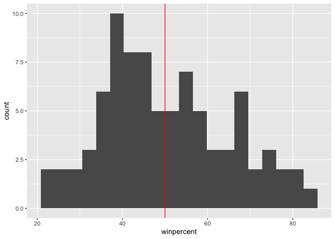
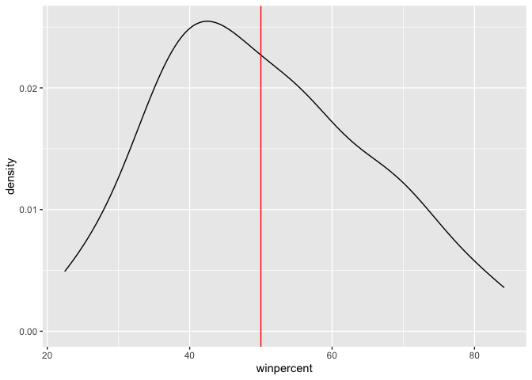
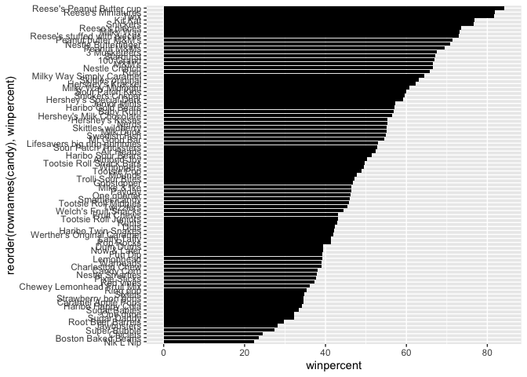
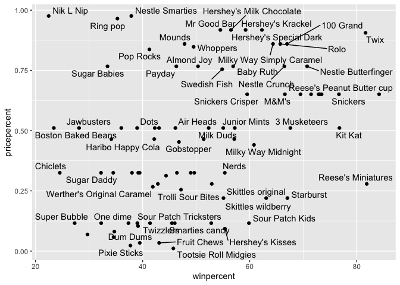
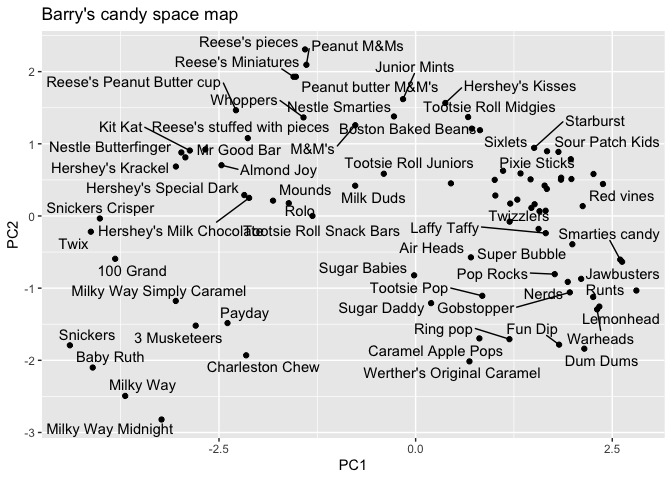

# Class 10: Halloween Mini Project
Libby (pid: A69047570 )

## Libraries

``` r
library(readr)
```

    Warning: package 'readr' was built under R version 4.5.2

``` r
library(ggplot2)
```

    Warning: package 'ggplot2' was built under R version 4.5.2

``` r
library(tidyverse)
```

## Importing candy data

``` r
candy <- read.csv("candy-data.txt", row.names = 1)
head(candy)
```

                 chocolate fruity caramel peanutyalmondy nougat crispedricewafer
    100 Grand            1      0       1              0      0                1
    3 Musketeers         1      0       0              0      1                0
    One dime             0      0       0              0      0                0
    One quarter          0      0       0              0      0                0
    Air Heads            0      1       0              0      0                0
    Almond Joy           1      0       0              1      0                0
                 hard bar pluribus sugarpercent pricepercent winpercent
    100 Grand       0   1        0        0.732        0.860   66.97173
    3 Musketeers    0   1        0        0.604        0.511   67.60294
    One dime        0   0        0        0.011        0.116   32.26109
    One quarter     0   0        0        0.011        0.511   46.11650
    Air Heads       0   0        0        0.906        0.511   52.34146
    Almond Joy      0   1        0        0.465        0.767   50.34755

``` r
flextable::flextable(head(candy))
```


> q1: how many different candy types are in this dataset?

``` r
nrow(candy)
```

    [1] 85

> q2: how many fruity candy types are in the dataset

``` r
sum(candy$fruity)
```

    [1] 38

## Section 2: what is your favorite candy?

> q3. What is your favorite candy in the dataset and what is it’s
> winpercent value?

``` r
candy["Laffy Taffy", ]$winpercent
```

    [1] 41.38956

> Q4. What is the winpercent value for “Kit Kat”?

``` r
candy["Kit Kat", ]$winpercent
```

    [1] 76.7686

> Q5. What is the winpercent value for “Tootsie Roll Snack Bars”?

``` r
candy["Tootsie Roll Snack Bars", ]$winpercent
```

    [1] 49.6535

``` r
library("skimr")
# skim() function in the skimr package that can help give you a quick overview of a given dataset
skim(candy)
```

|                                                  |       |
|:-------------------------------------------------|:------|
| Name                                             | candy |
| Number of rows                                   | 85    |
| Number of columns                                | 12    |
| \_\_\_\_\_\_\_\_\_\_\_\_\_\_\_\_\_\_\_\_\_\_\_   |       |
| Column type frequency:                           |       |
| numeric                                          | 12    |
| \_\_\_\_\_\_\_\_\_\_\_\_\_\_\_\_\_\_\_\_\_\_\_\_ |       |
| Group variables                                  | None  |

Data summary

**Variable type: numeric**

| skim_variable | n_missing | complete_rate | mean | sd | p0 | p25 | p50 | p75 | p100 | hist |
|:---|---:|---:|---:|---:|---:|---:|---:|---:|---:|:---|
| chocolate | 0 | 1 | 0.44 | 0.50 | 0.00 | 0.00 | 0.00 | 1.00 | 1.00 | ▇▁▁▁▆ |
| fruity | 0 | 1 | 0.45 | 0.50 | 0.00 | 0.00 | 0.00 | 1.00 | 1.00 | ▇▁▁▁▆ |
| caramel | 0 | 1 | 0.16 | 0.37 | 0.00 | 0.00 | 0.00 | 0.00 | 1.00 | ▇▁▁▁▂ |
| peanutyalmondy | 0 | 1 | 0.16 | 0.37 | 0.00 | 0.00 | 0.00 | 0.00 | 1.00 | ▇▁▁▁▂ |
| nougat | 0 | 1 | 0.08 | 0.28 | 0.00 | 0.00 | 0.00 | 0.00 | 1.00 | ▇▁▁▁▁ |
| crispedricewafer | 0 | 1 | 0.08 | 0.28 | 0.00 | 0.00 | 0.00 | 0.00 | 1.00 | ▇▁▁▁▁ |
| hard | 0 | 1 | 0.18 | 0.38 | 0.00 | 0.00 | 0.00 | 0.00 | 1.00 | ▇▁▁▁▂ |
| bar | 0 | 1 | 0.25 | 0.43 | 0.00 | 0.00 | 0.00 | 0.00 | 1.00 | ▇▁▁▁▂ |
| pluribus | 0 | 1 | 0.52 | 0.50 | 0.00 | 0.00 | 1.00 | 1.00 | 1.00 | ▇▁▁▁▇ |
| sugarpercent | 0 | 1 | 0.48 | 0.28 | 0.01 | 0.22 | 0.47 | 0.73 | 0.99 | ▇▇▇▇▆ |
| pricepercent | 0 | 1 | 0.47 | 0.29 | 0.01 | 0.26 | 0.47 | 0.65 | 0.98 | ▇▇▇▇▆ |
| winpercent | 0 | 1 | 50.32 | 14.71 | 22.45 | 39.14 | 47.83 | 59.86 | 84.18 | ▃▇▆▅▂ |

> Q6. Is there any variable/column that looks to be on a different scale
> to the majority of the other columns in the dataset?

winpercent looks like it is on a 0-100% scale whereas the other columns
are 0-1.

> Q7. What do you think a zero and one represent for the
> candy\$chocolate column?

They are representing conditionals. TRUE is 1 and FALSE is 0.

A good place to start any exploratory analysis is with a histogram. You
can do this most easily with the base R function hist(). Alternatively,
you can use ggplot() with geom_hist(). Either works well in this case
and (as always) its your choice.

> Q8. Plot a histogram of winpercent values

``` r
ggplot(candy, aes(x=winpercent)) +
  geom_histogram(bins=20) +
  geom_vline(xintercept = 50, color="red")
```



> Q9. Is the distribution of winpercent values symmetrical?

It’s not perfectly symmetrical, let’s try a density plot. As you can see
it is skewed to the left a bit.

``` r
ggplot(candy, aes(x=winpercent)) +
  geom_density(bins=20) +
  geom_vline(xintercept = 50, color="red")
```

    Warning in geom_density(bins = 20): Ignoring unknown parameters: `bins`



> Q10. Is the center of the distribution above or below 50%?

Although the mean is above 50 (slightly at 50.3 %) due to outliers, the
center of the distribution (median) is below 50% at 47.82%

``` r
win <- candy$winpercent

summary(win)
```

       Min. 1st Qu.  Median    Mean 3rd Qu.    Max. 
      22.45   39.14   47.83   50.32   59.86   84.18 

> Q11. On average is chocolate candy higher or lower ranked than fruit
> candy?

Chocolate candy is ranked higher than fruit candy on average at a win
percent of 60.02% for chocolate compared to 44.12% of fruity candy

``` r
# 1. Find all chocolate candy in the dataset
# 2. Extract their winpercent values
# 3. Find the mean of the values
chocolate <- candy |> 
  filter(chocolate == 1) |> 
  summary(winpercent)
# Mean :60.92

fruity <- candy |> 
  filter(fruity == 1) |> 
  summary(winpercent)
# Mean :44.12
 
# Alternative:
# 1. Find all chocolate candy in the dataset
choc.inds <- as.logical(candy$chocolate)
choc.candy <- candy[choc.inds, ]
# 2. Extract their winpercent values
choc.win  <- choc.candy$winpercent
# 3. Find the mean of the values
mean(choc.win)
```

    [1] 60.92153

``` r
# 1. Find all fruity candy in the dataset
fruity.inds <- as.logical(candy$fruity)
fruity.candy <- candy[fruity.inds, ]
# 2. Extract their winpercent values
fruity.win  <- fruity.candy$winpercent
# 3. Find the mean of the values
mean(fruity.win)
```

    [1] 44.11974

> Q12. Is this difference statistically significant?

Yes the answer is statistically significant, so chocolate candy is
ranked higher than fruity candy, suggested here by the pvalue of
2.871e-08

``` r
t.test(choc.win, fruity.win)
```


        Welch Two Sample t-test

    data:  choc.win and fruity.win
    t = 6.2582, df = 68.882, p-value = 2.871e-08
    alternative hypothesis: true difference in means is not equal to 0
    95 percent confidence interval:
     11.44563 22.15795
    sample estimates:
    mean of x mean of y 
     60.92153  44.11974 

## 3. Overall Candy Rankings

> Q13. What are the five least liked candy types in this set?

``` r
# with base R
head(candy[order(candy$winpercent),], n=5)
```

                       chocolate fruity caramel peanutyalmondy nougat
    Nik L Nip                  0      1       0              0      0
    Boston Baked Beans         0      0       0              1      0
    Chiclets                   0      1       0              0      0
    Super Bubble               0      1       0              0      0
    Jawbusters                 0      1       0              0      0
                       crispedricewafer hard bar pluribus sugarpercent pricepercent
    Nik L Nip                         0    0   0        1        0.197        0.976
    Boston Baked Beans                0    0   0        1        0.313        0.511
    Chiclets                          0    0   0        1        0.046        0.325
    Super Bubble                      0    0   0        0        0.162        0.116
    Jawbusters                        0    1   0        1        0.093        0.511
                       winpercent
    Nik L Nip            22.44534
    Boston Baked Beans   23.41782
    Chiclets             24.52499
    Super Bubble         27.30386
    Jawbusters           28.12744

``` r
# with dplyr
candy |>  
  arrange(winpercent) |>  
  head(5)
```

                       chocolate fruity caramel peanutyalmondy nougat
    Nik L Nip                  0      1       0              0      0
    Boston Baked Beans         0      0       0              1      0
    Chiclets                   0      1       0              0      0
    Super Bubble               0      1       0              0      0
    Jawbusters                 0      1       0              0      0
                       crispedricewafer hard bar pluribus sugarpercent pricepercent
    Nik L Nip                         0    0   0        1        0.197        0.976
    Boston Baked Beans                0    0   0        1        0.313        0.511
    Chiclets                          0    0   0        1        0.046        0.325
    Super Bubble                      0    0   0        0        0.162        0.116
    Jawbusters                        0    1   0        1        0.093        0.511
                       winpercent
    Nik L Nip            22.44534
    Boston Baked Beans   23.41782
    Chiclets             24.52499
    Super Bubble         27.30386
    Jawbusters           28.12744

> Q14. What are the top 5 all time favorite candy types out of this set?

``` r
candy |>  
  arrange(-winpercent) |>  
  head(5)
```

                              chocolate fruity caramel peanutyalmondy nougat
    Reese's Peanut Butter cup         1      0       0              1      0
    Reese's Miniatures                1      0       0              1      0
    Twix                              1      0       1              0      0
    Kit Kat                           1      0       0              0      0
    Snickers                          1      0       1              1      1
                              crispedricewafer hard bar pluribus sugarpercent
    Reese's Peanut Butter cup                0    0   0        0        0.720
    Reese's Miniatures                       0    0   0        0        0.034
    Twix                                     1    0   1        0        0.546
    Kit Kat                                  1    0   1        0        0.313
    Snickers                                 0    0   1        0        0.546
                              pricepercent winpercent
    Reese's Peanut Butter cup        0.651   84.18029
    Reese's Miniatures               0.279   81.86626
    Twix                             0.906   81.64291
    Kit Kat                          0.511   76.76860
    Snickers                         0.651   76.67378

> Q15. Make a first barplot of candy ranking based on winpercent values

``` r
ggplot(candy) +
  aes(winpercent, rownames(candy)) +
  geom_col()
```


``` r
x <- c(10,2,5,1)
order(x)
```

    [1] 4 2 3 1

``` r
ord.ind <- order(candy$winpercent)
head(candy[ord.ind, ], 5)
```

                       chocolate fruity caramel peanutyalmondy nougat
    Nik L Nip                  0      1       0              0      0
    Boston Baked Beans         0      0       0              1      0
    Chiclets                   0      1       0              0      0
    Super Bubble               0      1       0              0      0
    Jawbusters                 0      1       0              0      0
                       crispedricewafer hard bar pluribus sugarpercent pricepercent
    Nik L Nip                         0    0   0        1        0.197        0.976
    Boston Baked Beans                0    0   0        1        0.313        0.511
    Chiclets                          0    0   0        1        0.046        0.325
    Super Bubble                      0    0   0        0        0.162        0.116
    Jawbusters                        0    1   0        1        0.093        0.511
                       winpercent
    Nik L Nip            22.44534
    Boston Baked Beans   23.41782
    Chiclets             24.52499
    Super Bubble         27.30386
    Jawbusters           28.12744

> Q16. This is quite ugly, use the reorder() function to get the bars
> sorted by winpercent?

``` r
ggplot(candy) +
  aes(winpercent, reorder(rownames(candy), winpercent)) +
  geom_col()
```


``` r
my_cols=rep("black", nrow(candy))
my_cols[as.logical(candy$chocolate)] = "chocolate"
my_cols[as.logical(candy$bar)] = "brown"
my_cols[as.logical(candy$fruity)] = "pink"
```

``` r
ggplot(candy) + 
  aes(winpercent, reorder(rownames(candy),winpercent)) +
  geom_col(fill=my_cols) 
```


> Q17. What is the worst ranked chocolate candy?

Sixlets are the worst ranked chocolate candy!

``` r
my_cols <- rep("black", nrow(candy))
candy$chocolate==1
```

     [1]  TRUE  TRUE FALSE FALSE FALSE  TRUE  TRUE FALSE FALSE FALSE  TRUE FALSE
    [13] FALSE FALSE FALSE FALSE FALSE FALSE FALSE FALSE FALSE FALSE  TRUE  TRUE
    [25]  TRUE  TRUE FALSE  TRUE  TRUE FALSE FALSE FALSE  TRUE  TRUE FALSE  TRUE
    [37]  TRUE  TRUE  TRUE  TRUE  TRUE FALSE  TRUE  TRUE FALSE FALSE FALSE  TRUE
    [49] FALSE FALSE FALSE  TRUE  TRUE  TRUE  TRUE FALSE  TRUE FALSE FALSE  TRUE
    [61] FALSE FALSE  TRUE FALSE  TRUE  TRUE FALSE FALSE FALSE FALSE FALSE FALSE
    [73] FALSE FALSE  TRUE  TRUE  TRUE  TRUE FALSE  TRUE FALSE FALSE FALSE FALSE
    [85]  TRUE

``` r
my_cols
```

     [1] "black" "black" "black" "black" "black" "black" "black" "black" "black"
    [10] "black" "black" "black" "black" "black" "black" "black" "black" "black"
    [19] "black" "black" "black" "black" "black" "black" "black" "black" "black"
    [28] "black" "black" "black" "black" "black" "black" "black" "black" "black"
    [37] "black" "black" "black" "black" "black" "black" "black" "black" "black"
    [46] "black" "black" "black" "black" "black" "black" "black" "black" "black"
    [55] "black" "black" "black" "black" "black" "black" "black" "black" "black"
    [64] "black" "black" "black" "black" "black" "black" "black" "black" "black"
    [73] "black" "black" "black" "black" "black" "black" "black" "black" "black"
    [82] "black" "black" "black" "black"

``` r
ggplot(candy) +
  aes(winpercent, reorder(rownames(candy),winpercent)) +
  geom_col(fill=my_cols) 
```



> Q18. What is the best ranked fruity candy?

Starburst is the best ranked fruity candy!

# Section 4

## Winpercent v PricePercent

> Q19. Which candy type is the highest ranked in terms of winpercent for
> the least money - i.e. offers the most bang for your buck?

The fruity candies offer more band for your buck, with Starburst seeming
to be the highest ranked for best cost, reeses miniatures may contend
with it too, but it does have a slightly higher price percent.

``` r
library(ggrepel)
ggplot(candy) +
  aes(winpercent, pricepercent, label=rownames(candy)) +
  geom_point(col=my_cols) +
  geom_text_repel(col=my_cols)
```

    Warning: ggrepel: 29 unlabeled data points (too many overlaps). Consider
    increasing max.overlaps



> Q20. What are the top 5 most expensive candy types in the dataset and
> of these which is the least popular?

``` r
ord <- order(candy$pricepercent, decreasing = TRUE)
head( candy[ord,c(11,12)], n=5 )
```

                             pricepercent winpercent
    Nik L Nip                       0.976   22.44534
    Nestle Smarties                 0.976   37.88719
    Ring pop                        0.965   35.29076
    Hershey's Krackel               0.918   62.28448
    Hershey's Milk Chocolate        0.918   56.49050

## Correlation structure

> Q22. Examining this plot what two variables are anti-correlated
> (i.e. have minus values)?

fruity and chocolate are anti-correlated, also pluribus and bar but less
so than fruity and chocolate

``` r
cij <- cor(candy) # takes all cols in dataset, so an nxn correlation matrix
```

``` r
library(corrplot)
```

    corrplot 0.95 loaded

``` r
corrplot(cij)
```


> Q23. Similarly, what two variables are most positively correlated?

Aside from the 1:1 match, when items are paired against themselves,
chocolate and winpercent are most positively correlated.

# 6. Principal Component Analysis

The main function in base R for this `prcomp()` remember it has a scale
parameter you basically always want to use; `scale=TRUE`

``` r
pca <- prcomp(candy, scale=TRUE)
summary(pca)
```

    Importance of components:
                              PC1    PC2    PC3     PC4    PC5     PC6     PC7
    Standard deviation     2.0788 1.1378 1.1092 1.07533 0.9518 0.81923 0.81530
    Proportion of Variance 0.3601 0.1079 0.1025 0.09636 0.0755 0.05593 0.05539
    Cumulative Proportion  0.3601 0.4680 0.5705 0.66688 0.7424 0.79830 0.85369
                               PC8     PC9    PC10    PC11    PC12
    Standard deviation     0.74530 0.67824 0.62349 0.43974 0.39760
    Proportion of Variance 0.04629 0.03833 0.03239 0.01611 0.01317
    Cumulative Proportion  0.89998 0.93832 0.97071 0.98683 1.00000

Let’s first look at our first main result figure - the “PC Plot” or PC1
v PC2 plot

``` r
ggplot(pca$x) + # shows where candies lie
  aes(PC1, PC2, label=rownames(pca$x)) +
  geom_point(col=my_cols) +
  geom_text_repel(col=my_cols) +
  labs(title = "Barry's candy space map")
```

    Warning: ggrepel: 24 unlabeled data points (too many overlaps). Consider
    increasing max.overlaps



Don’t forget about your variable loadings – how the original variables
contribute to your new PCs….

> Q24. What original variables are picked up strongly by PC1 in the
> positive direction? Do these make sense to you?

Fruity, hard, and pluribus are most strongly picked up by PC1 in the
positive direction. This makes sense because most fruity candy does seem
to be hard, and because it is cheaper comes in multiples more than
chocolate candy.

``` r
ggplot(pca$rotation) +
  aes(PC1, rownames(pca$rotation)) +
  geom_col()
```


