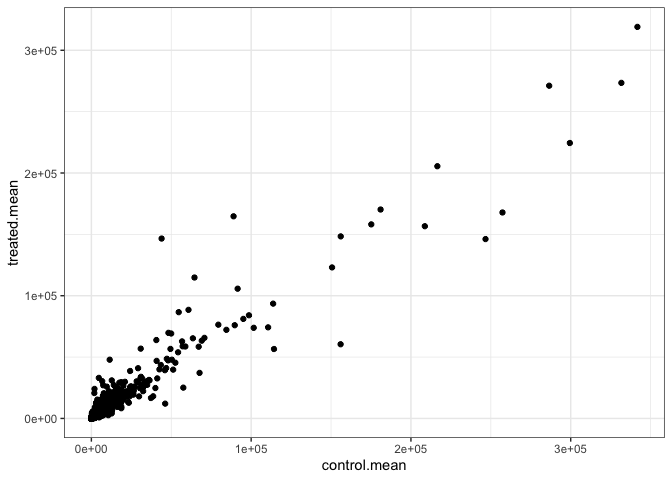
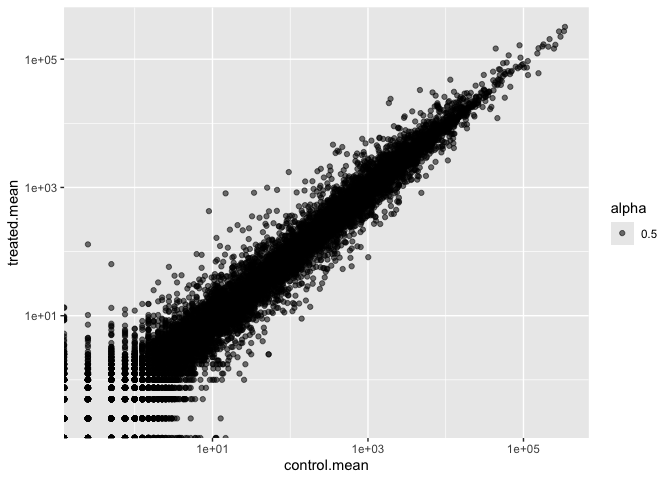
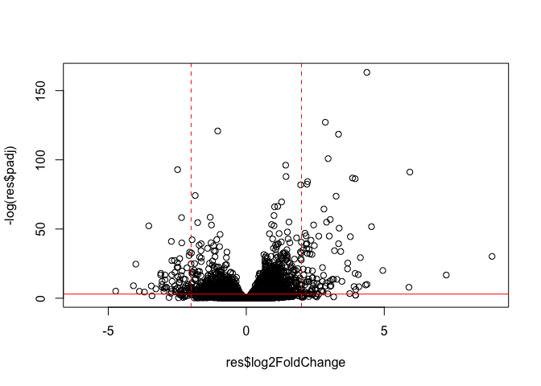
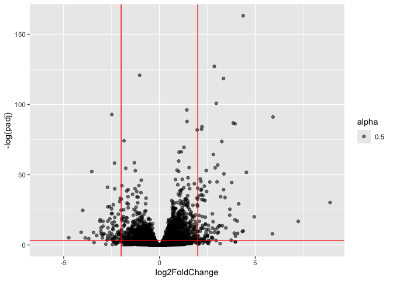
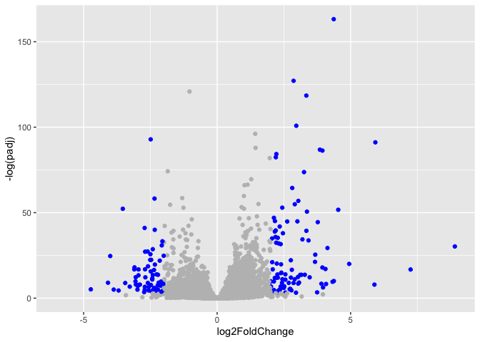
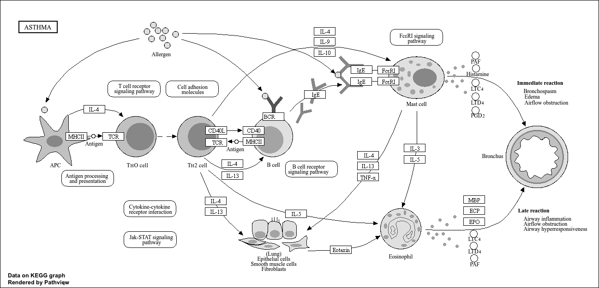

# Class 12: Transcriptomics and the analysis of RNA-Seq data
Libby Gilmore A69047570

- [Background](#background)
  - [Bioconductor setup](#bioconductor-setup)
  - [Data Import](#data-import)
- [Toy differential gene expression](#toy-differential-gene-expression)
  - [Filter out zero count genes](#filter-out-zero-count-genes)
- [DESeq analysis](#deseq-analysis)
- [Volcano plot](#volcano-plot)
- [Save our results](#save-our-results)
- [Pathway analysis](#pathway-analysis)
- [Follow-up from last week’s class](#follow-up-from-last-weeks-class)
  - [annotation data](#annotation-data)

## Background

Today we will analyze some RNASeq data from Himes at al. on the effects
of the common steroid (dexamethasone, also called “dex”) on airway
smooth muscle cells (ASMs).

For this analysis we need two main inputs

- `countData`: a table of counts per gene (in rows) across experiments
  (in columns)

- `colData` : **metadata** about the design of the experiments. The rows
  here must match the columns in `countData`

### Bioconductor setup

    Warning: package 'BiocManager' was built under R version 4.5.2

    Warning: package 'DESeq2' was built under R version 4.5.2

    Loading required package: S4Vectors

    Loading required package: stats4

    Loading required package: BiocGenerics

    Loading required package: generics


    Attaching package: 'generics'

    The following objects are masked from 'package:base':

        as.difftime, as.factor, as.ordered, intersect, is.element, setdiff,
        setequal, union


    Attaching package: 'BiocGenerics'

    The following objects are masked from 'package:stats':

        IQR, mad, sd, var, xtabs

    The following objects are masked from 'package:base':

        anyDuplicated, aperm, append, as.data.frame, basename, cbind,
        colnames, dirname, do.call, duplicated, eval, evalq, Filter, Find,
        get, grep, grepl, is.unsorted, lapply, Map, mapply, match, mget,
        order, paste, pmax, pmax.int, pmin, pmin.int, Position, rank,
        rbind, Reduce, rownames, sapply, saveRDS, table, tapply, unique,
        unsplit, which.max, which.min


    Attaching package: 'S4Vectors'

    The following object is masked from 'package:utils':

        findMatches

    The following objects are masked from 'package:base':

        expand.grid, I, unname

    Loading required package: IRanges

    Loading required package: GenomicRanges

    Loading required package: Seqinfo

    Loading required package: SummarizedExperiment

    Loading required package: MatrixGenerics

    Loading required package: matrixStats


    Attaching package: 'MatrixGenerics'

    The following objects are masked from 'package:matrixStats':

        colAlls, colAnyNAs, colAnys, colAvgsPerRowSet, colCollapse,
        colCounts, colCummaxs, colCummins, colCumprods, colCumsums,
        colDiffs, colIQRDiffs, colIQRs, colLogSumExps, colMadDiffs,
        colMads, colMaxs, colMeans2, colMedians, colMins, colOrderStats,
        colProds, colQuantiles, colRanges, colRanks, colSdDiffs, colSds,
        colSums2, colTabulates, colVarDiffs, colVars, colWeightedMads,
        colWeightedMeans, colWeightedMedians, colWeightedSds,
        colWeightedVars, rowAlls, rowAnyNAs, rowAnys, rowAvgsPerColSet,
        rowCollapse, rowCounts, rowCummaxs, rowCummins, rowCumprods,
        rowCumsums, rowDiffs, rowIQRDiffs, rowIQRs, rowLogSumExps,
        rowMadDiffs, rowMads, rowMaxs, rowMeans2, rowMedians, rowMins,
        rowOrderStats, rowProds, rowQuantiles, rowRanges, rowRanks,
        rowSdDiffs, rowSds, rowSums2, rowTabulates, rowVarDiffs, rowVars,
        rowWeightedMads, rowWeightedMeans, rowWeightedMedians,
        rowWeightedSds, rowWeightedVars

    Loading required package: Biobase

    Welcome to Bioconductor

        Vignettes contain introductory material; view with
        'browseVignettes()'. To cite Bioconductor, see
        'citation("Biobase")', and for packages 'citation("pkgname")'.


    Attaching package: 'Biobase'

    The following object is masked from 'package:MatrixGenerics':

        rowMedians

    The following objects are masked from 'package:matrixStats':

        anyMissing, rowMedians


    Attaching package: 'dplyr'

    The following object is masked from 'package:Biobase':

        combine

    The following object is masked from 'package:matrixStats':

        count

    The following objects are masked from 'package:GenomicRanges':

        intersect, setdiff, union

    The following object is masked from 'package:Seqinfo':

        intersect

    The following objects are masked from 'package:IRanges':

        collapse, desc, intersect, setdiff, slice, union

    The following objects are masked from 'package:S4Vectors':

        first, intersect, rename, setdiff, setequal, union

    The following objects are masked from 'package:BiocGenerics':

        combine, intersect, setdiff, setequal, union

    The following object is masked from 'package:generics':

        explain

    The following objects are masked from 'package:stats':

        filter, lag

    The following objects are masked from 'package:base':

        intersect, setdiff, setequal, union

    Warning: package 'readr' was built under R version 4.5.2

    Warning: package 'ggplot2' was built under R version 4.5.2

### Data Import

``` r
# Complete the missing code
counts <- read.csv("airway_scaledcounts.csv", row.names=1)
metadata <-  read_csv("airway_metadata.csv")
```

    Rows: 8 Columns: 4
    ── Column specification ────────────────────────────────────────────────────────
    Delimiter: ","
    chr (4): id, dex, celltype, geo_id

    ℹ Use `spec()` to retrieve the full column specification for this data.
    ℹ Specify the column types or set `show_col_types = FALSE` to quiet this message.

``` r
head(counts)
```

                    SRR1039508 SRR1039509 SRR1039512 SRR1039513 SRR1039516
    ENSG00000000003        723        486        904        445       1170
    ENSG00000000005          0          0          0          0          0
    ENSG00000000419        467        523        616        371        582
    ENSG00000000457        347        258        364        237        318
    ENSG00000000460         96         81         73         66        118
    ENSG00000000938          0          0          1          0          2
                    SRR1039517 SRR1039520 SRR1039521
    ENSG00000000003       1097        806        604
    ENSG00000000005          0          0          0
    ENSG00000000419        781        417        509
    ENSG00000000457        447        330        324
    ENSG00000000460         94        102         74
    ENSG00000000938          0          0          0

``` r
head(metadata)
```

    # A tibble: 6 × 4
      id         dex     celltype geo_id    
      <chr>      <chr>   <chr>    <chr>     
    1 SRR1039508 control N61311   GSM1275862
    2 SRR1039509 treated N61311   GSM1275863
    3 SRR1039512 control N052611  GSM1275866
    4 SRR1039513 treated N052611  GSM1275867
    5 SRR1039516 control N080611  GSM1275870
    6 SRR1039517 treated N080611  GSM1275871

> Q1. How many genes are in this dataset?

``` r
nrow(counts)
```

    [1] 38694

> Q2. How many experiments (i.e columns in `counts` or rows in
> `metadata`)?

``` r
ncol(counts)
```

    [1] 8

> Q3. How many ‘control’ cell lines do we have?

``` r
sum(metadata$dex=="control")
```

    [1] 4

``` r
table(metadata$dex)
```


    control treated 
          4       4 

## Toy differential gene expression

> Q4 Extract the “control” columns from `counts`. Calculate the mean
> value for each gene in these “control” columns

``` r
control.inds <- metadata$dex == "control"
control.counts <- counts[, control.inds]
```

2.  Calculate the mean value for each gene in these “control” columns

``` r
control.mean <- rowMeans(control.counts)
head(control.mean)
```

    ENSG00000000003 ENSG00000000005 ENSG00000000419 ENSG00000000457 ENSG00000000460 
             900.75            0.00          520.50          339.75           97.25 
    ENSG00000000938 
               0.75 

> Q 5. Do the same with the “treated” columns

``` r
treated.inds <- metadata$dex == "treated"
treated.counts <- counts[, treated.inds]
treated.mean <- rowMeans(treated.counts)
head(treated.mean)
```

    ENSG00000000003 ENSG00000000005 ENSG00000000419 ENSG00000000457 ENSG00000000460 
             658.00            0.00          546.00          316.50           78.75 
    ENSG00000000938 
               0.00 

For ease of book-keeing we can store these together in one dataframe
`meanCounts`

> Q5 (a). Create a scatter plot showing the mean of the treated samples
> against the mean of the control samples. Your plot should look
> something like the following.

``` r
meanCounts <- data.frame(control.mean, treated.mean)
head(meanCounts)
```

                    control.mean treated.mean
    ENSG00000000003       900.75       658.00
    ENSG00000000005         0.00         0.00
    ENSG00000000419       520.50       546.00
    ENSG00000000457       339.75       316.50
    ENSG00000000460        97.25        78.75
    ENSG00000000938         0.75         0.00

``` r
plot(meanCounts)
```


> Q5 (b).You could also use the ggplot2 package to make this figure
> producing the plot below. What geom\_?() function would you use for
> this plot?

``` r
ggplot(meanCounts) +
  aes(x=control.mean, y=treated.mean) +
  geom_point() +
  theme_bw()
```



Log transform the data

> Q6. Try plotting both axes on a log scale. What is the argument to
> plot() that allows you to do this?

`logxy` parameter

``` r
plot(meanCounts, log="xy")
```

    Warning in xy.coords(x, y, xlabel, ylabel, log): 15032 x values <= 0 omitted
    from logarithmic plot

    Warning in xy.coords(x, y, xlabel, ylabel, log): 15281 y values <= 0 omitted
    from logarithmic plot


``` r
ggplot(meanCounts, aes(x =control.mean, y=treated.mean, alpha = .5))+
  geom_point() +
  scale_x_log10() +
  scale_y_log10()
```

    Warning in scale_x_log10(): log-10 transformation introduced infinite values.

    Warning in scale_y_log10(): log-10 transformation introduced infinite values.



We use log2 “fold change” as a way to compare

``` r
# treated/control
log2(10/10) # if the drug had no effect (1/1) than it is zero
```

    [1] 0

``` r
log2(20/10) # if you have twice as much when the drug is around
```

    [1] 1

``` r
log2(10/20) # if you have half as much transcript when drug is around
```

    [1] -1

``` r
log2(40/10)
```

    [1] 2

``` r
meanCounts <- meanCounts |> 
  mutate(log2FC = log2(treated.mean/control.mean))

meanCounts$log2FC <- log2(meanCounts$treated.mean/meanCounts$control.mean)
```

A common “rule-of-thumb” threshold for calling something “up” regulated
is a log2-fold-change of +2 or greater. For “down” regulated -2 or
lower.

### Filter out zero count genes

> Q7. What is the purpose of the arr.ind argument in the which()
> function call above? Why would we then take the first column of the
> output and need to call the unique() function?

arr.ind tells you the row and column position

``` r
# y <- data.frame(a = c(1,5,0,5), b=c(1,0,5,5))
# which(y==0, arr.ind=T) # tells you row and column that is 0

zero.inds <- which(meanCounts[,1:2] == 0, arr.ind=T)[,1]
mygenes <- meanCounts[-zero.inds,]
sum(mygenes$log2FC >= 2)
```

    [1] 314

``` r
sum(mygenes$log2FC <= -2)
```

    [1] 485

> Q8 How many genes are “up” regulated at the +2 log2FC threshold.

``` r
meanCounts_noNA <- meanCounts |> 
  filter(control.mean != 0.0 & treated.mean != 0.0)
  
sum(meanCounts_noNA$log2FC >= 2)
```

    [1] 314

``` r
# alternative lab method:
# zero.vals <- which(meancounts[,1:2]==0, arr.ind=TRUE)
# 
# to.rm <- unique(zero.vals[,1])
# mycounts <- meancounts[-to.rm,]
# head(mycounts)
```

> Q9 How many genes are “down” regulated (at the -2 log2FC threshold)

``` r
sum(meanCounts_noNA$log2FC <= -2)
```

    [1] 485

> Q 10.Do you trust these results? Why or why not?

Not particularly, I would trust them more with significance values

## DESeq analysis

Let’s do this with DESeq and put some stats behind these numbers.

``` r
library(DESeq2)
```

DESeq wants 3 things for analysis, countData, colData and design.

``` r
dds <- DESeqDataSetFromMatrix(countData = counts,
                       colData = metadata,
                       design = ~dex)
```

    converting counts to integer mode

    Warning in DESeqDataSet(se, design = design, ignoreRank): some variables in
    design formula are characters, converting to factors

The main function in the DESeq package to run analysis is called
`DESeq()`

``` r
# dds, has a slot in it for results
dds <- DESeq(dds)
```

    estimating size factors

    estimating dispersions

    gene-wise dispersion estimates

    mean-dispersion relationship

    final dispersion estimates

    fitting model and testing

Get the results of this DESeq object with the function `results()`

``` r
res <- results(dds)
head(res)
```

    log2 fold change (MLE): dex treated vs control 
    Wald test p-value: dex treated vs control 
    DataFrame with 6 rows and 6 columns
                      baseMean log2FoldChange     lfcSE      stat    pvalue
                     <numeric>      <numeric> <numeric> <numeric> <numeric>
    ENSG00000000003 747.194195      -0.350703  0.168242 -2.084514 0.0371134
    ENSG00000000005   0.000000             NA        NA        NA        NA
    ENSG00000000419 520.134160       0.206107  0.101042  2.039828 0.0413675
    ENSG00000000457 322.664844       0.024527  0.145134  0.168996 0.8658000
    ENSG00000000460  87.682625      -0.147143  0.256995 -0.572550 0.5669497
    ENSG00000000938   0.319167      -1.732289  3.493601 -0.495846 0.6200029
                         padj
                    <numeric>
    ENSG00000000003  0.163017
    ENSG00000000005        NA
    ENSG00000000419  0.175937
    ENSG00000000457  0.961682
    ENSG00000000460  0.815805
    ENSG00000000938        NA

``` r
# baseMean is the mean across all 8 columns
# lof2FC across treated/control
# lfcSE
#stat
#pvalue from statistical test
#padj is the adjusted pvalue, which is what we will use bc 0.05 of 36000 is still a very big number; we scale to keep ourselves safe
```

## Volcano plot

This is a plot of log2FC v adjusted p-value

``` r
# have to take the log because all the values you care about are very compressed. You do -log bc it is easier to look at
plot(res$log2FoldChange, -log(res$padj)) +
  abline(v=c(-2,2), col="red", lt="dashed") +
  abline(h=-log(0.05), col="red")
```



    integer(0)

``` r
ggplot(res, aes(x=log2FoldChange, y=-log(padj), alpha=0.5)) +
  geom_point() +
  geom_hline(yintercept=-log(0.05), colour="red") +
  geom_vline(xintercept = c(2,-2), colour="red")
```

    Warning: Removed 23549 rows containing missing values or values outside the scale range
    (`geom_point()`).



``` r
mycols<-rep("grey", nrow(res))
mycols[ abs(res$log2FoldChange) >= 2] <- "blue"
mycols [res$padj >= 0.05] <- "grey"

ggplot(res, aes(x=log2FoldChange, y=-log(padj))) +
  geom_point(col=mycols)
```

    Warning: Removed 23549 rows containing missing values or values outside the scale range
    (`geom_point()`).



## Save our results

``` r
write.csv(res, file = "myresults.csv")
```

We skipped the PCA section to be resumed Wednesday.

## Pathway analysis

``` r
library(pathview)
```

    ##############################################################################
    Pathview is an open source software package distributed under GNU General
    Public License version 3 (GPLv3). Details of GPLv3 is available at
    http://www.gnu.org/licenses/gpl-3.0.html. Particullary, users are required to
    formally cite the original Pathview paper (not just mention it) in publications
    or products. For details, do citation("pathview") within R.

    The pathview downloads and uses KEGG data. Non-academic uses may require a KEGG
    license agreement (details at http://www.kegg.jp/kegg/legal.html).
    ##############################################################################

``` r
library(gage)
```

``` r
library(gageData)

data(kegg.sets.hs)

# Examine the first 2 pathways in this kegg set for humans
head(kegg.sets.hs, 2)
```

    $`hsa00232 Caffeine metabolism`
    [1] "10"   "1544" "1548" "1549" "1553" "7498" "9"   

    $`hsa00983 Drug metabolism - other enzymes`
     [1] "10"     "1066"   "10720"  "10941"  "151531" "1548"   "1549"   "1551"  
     [9] "1553"   "1576"   "1577"   "1806"   "1807"   "1890"   "221223" "2990"  
    [17] "3251"   "3614"   "3615"   "3704"   "51733"  "54490"  "54575"  "54576" 
    [25] "54577"  "54578"  "54579"  "54600"  "54657"  "54658"  "54659"  "54963" 
    [33] "574537" "64816"  "7083"   "7084"   "7172"   "7363"   "7364"   "7365"  
    [41] "7366"   "7367"   "7371"   "7372"   "7378"   "7498"   "79799"  "83549" 
    [49] "8824"   "8833"   "9"      "978"   

``` r
foldchanges = res$log2FoldChange
names(foldchanges) = res$entrez
head(foldchanges)
```

    [1] -0.35070296          NA  0.20610728  0.02452701 -0.14714263 -1.73228897

``` r
# Get the results
keggres = gage(foldchanges, gsets=kegg.sets.hs)
```

``` r
attributes(keggres)
```

    $names
    [1] "greater" "less"    "stats"  

``` r
# Look at the first three down (less) pathways
head(keggres$less, 3)
```

                                             p.geomean stat.mean p.val q.val
    hsa00232 Caffeine metabolism                    NA       NaN    NA    NA
    hsa00983 Drug metabolism - other enzymes        NA       NaN    NA    NA
    hsa01100 Metabolic pathways                     NA       NaN    NA    NA
                                             set.size exp1
    hsa00232 Caffeine metabolism                    0   NA
    hsa00983 Drug metabolism - other enzymes        0   NA
    hsa01100 Metabolic pathways                     0   NA

``` r
pathview(gene.data=foldchanges, pathway.id="hsa05310")
```

    Warning: None of the genes or compounds mapped to the pathway!
    Argument gene.idtype or cpd.idtype may be wrong.

    'select()' returned 1:1 mapping between keys and columns

    Info: Working in directory /Users/elizabethgilmore/Desktop/UCSD_Salk/BGGN213/BGGN213_github/Class12

    Info: Writing image file hsa05310.pathview.png

``` r
# A different PDF based output of the same data
pathview(gene.data=foldchanges, pathway.id="hsa05310", kegg.native=FALSE)
```

    Warning: None of the genes or compounds mapped to the pathway!
    Argument gene.idtype or cpd.idtype may be wrong.

    'select()' returned 1:1 mapping between keys and columns

    Info: Working in directory /Users/elizabethgilmore/Desktop/UCSD_Salk/BGGN213/BGGN213_github/Class12

    Info: Writing image file hsa05310.pathview.pdf



## Follow-up from last week’s class

### annotation data

we need to add gene symbols, gene names and otheer databases ids to make
my results useful to further analysis

``` r
head(res)
```

    log2 fold change (MLE): dex treated vs control 
    Wald test p-value: dex treated vs control 
    DataFrame with 6 rows and 6 columns
                      baseMean log2FoldChange     lfcSE      stat    pvalue
                     <numeric>      <numeric> <numeric> <numeric> <numeric>
    ENSG00000000003 747.194195      -0.350703  0.168242 -2.084514 0.0371134
    ENSG00000000005   0.000000             NA        NA        NA        NA
    ENSG00000000419 520.134160       0.206107  0.101042  2.039828 0.0413675
    ENSG00000000457 322.664844       0.024527  0.145134  0.168996 0.8658000
    ENSG00000000460  87.682625      -0.147143  0.256995 -0.572550 0.5669497
    ENSG00000000938   0.319167      -1.732289  3.493601 -0.495846 0.6200029
                         padj
                    <numeric>
    ENSG00000000003  0.163017
    ENSG00000000005        NA
    ENSG00000000419  0.175937
    ENSG00000000457  0.961682
    ENSG00000000460  0.815805
    ENSG00000000938        NA

We have ENSEMBLE database ids in out `res` object

``` r
head(rownames(res))
```

    [1] "ENSG00000000003" "ENSG00000000005" "ENSG00000000419" "ENSG00000000457"
    [5] "ENSG00000000460" "ENSG00000000938"

We can use the `mapIds()` function from bioconductor to help us

``` r
library(AnnotationDbi)
```


    Attaching package: 'AnnotationDbi'

    The following object is masked from 'package:dplyr':

        select

``` r
library(org.Hs.eg.db)
```

Let’s see what database id formats we can translate between

``` r
columns(org.Hs.eg.db)
```

     [1] "ACCNUM"       "ALIAS"        "ENSEMBL"      "ENSEMBLPROT"  "ENSEMBLTRANS"
     [6] "ENTREZID"     "ENZYME"       "EVIDENCE"     "EVIDENCEALL"  "GENENAME"    
    [11] "GENETYPE"     "GO"           "GOALL"        "IPI"          "MAP"         
    [16] "OMIM"         "ONTOLOGY"     "ONTOLOGYALL"  "PATH"         "PFAM"        
    [21] "PMID"         "PROSITE"      "REFSEQ"       "SYMBOL"       "UCSCKG"      
    [26] "UNIPROT"     

``` r
# takes as input x, keys, columnn, keytypes
mapIds(org.Hs.eg.db,
       keys=row.names(res),
       keytype="ENSEMBL", # format of our genes
       column="SYMBOL") # new format we want to add
```

    'select()' returned 1:many mapping between keys and columns

      ENSG00000000003   ENSG00000000005   ENSG00000000419   ENSG00000000457 
             "TSPAN6"            "TNMD"            "DPM1"           "SCYL3" 
      ENSG00000000460   ENSG00000000938   ENSG00000000971   ENSG00000001036 
              "FIRRM"             "FGR"             "CFH"           "FUCA2" 
      ENSG00000001084   ENSG00000001167   ENSG00000001460   ENSG00000001461 
               "GCLC"            "NFYA"           "STPG1"          "NIPAL3" 
      ENSG00000001497   ENSG00000001561   ENSG00000001617   ENSG00000001626 
              "LAS1L"           "ENPP4"          "SEMA3F"            "CFTR" 
      ENSG00000001629   ENSG00000001630   ENSG00000001631   ENSG00000002016 
             "ANKIB1"         "CYP51A1"           "KRIT1"           "RAD52" 
      ENSG00000002079   ENSG00000002330   ENSG00000002549   ENSG00000002586 
                   NA             "BAD"            "LAP3"            "CD99" 
      ENSG00000002587   ENSG00000002726   ENSG00000002745   ENSG00000002746 
             "HS3ST1"            "AOC1"           "WNT16"           "HECW1" 
      ENSG00000002822   ENSG00000002834   ENSG00000002919   ENSG00000002933 
             "MAD1L1"           "LASP1"           "SNX11"        "TMEM176A" 
      ENSG00000003056   ENSG00000003096   ENSG00000003137   ENSG00000003147 
               "M6PR"          "KLHL13"         "CYP26B1"            "ICA1" 
      ENSG00000003249   ENSG00000003393   ENSG00000003400   ENSG00000003402 
             "DBNDD1"            "ALS2"          "CASP10"           "CFLAR" 
      ENSG00000003436   ENSG00000003509   ENSG00000003756   ENSG00000003987 
               "TFPI"         "NDUFAF7"            "RBM5"           "MTMR7" 
      ENSG00000003989   ENSG00000004059   ENSG00000004139   ENSG00000004142 
             "SLC7A2"            "ARF5"           "SARM1"         "POLDIP2" 
      ENSG00000004399   ENSG00000004455   ENSG00000004468   ENSG00000004478 
             "PLXND1"             "AK2"            "CD38"           "FKBP4" 
      ENSG00000004487   ENSG00000004534   ENSG00000004660   ENSG00000004700 
              "KDM1A"            "RBM6"          "CAMKK1"           "RECQL" 
      ENSG00000004766   ENSG00000004776   ENSG00000004777   ENSG00000004779 
              "VPS50"           "HSPB6"        "ARHGAP33"         "NDUFAB1" 
      ENSG00000004799   ENSG00000004809   ENSG00000004838   ENSG00000004846 
               "PDK4"        "SLC22A16"         "ZMYND10"           "ABCB5" 
      ENSG00000004848   ENSG00000004864   ENSG00000004866   ENSG00000004897 
                "ARX"        "SLC25A13"             "ST7"           "CDC27" 
      ENSG00000004939   ENSG00000004948   ENSG00000004961   ENSG00000004975 
             "SLC4A1"           "CALCR"            "HCCS"            "DVL2" 
      ENSG00000005001   ENSG00000005007   ENSG00000005020   ENSG00000005022 
             "PRSS22"            "UPF1"           "SKAP2"         "SLC25A5" 
      ENSG00000005059   ENSG00000005073   ENSG00000005075   ENSG00000005100 
               "MCUB"          "HOXA11"          "POLR2J"           "DHX33" 
      ENSG00000005102   ENSG00000005108   ENSG00000005156   ENSG00000005175 
              "MEOX1"          "THSD7A"            "LIG3"           "RPAP3" 
      ENSG00000005187   ENSG00000005189   ENSG00000005194   ENSG00000005206 
              "ACSM3"           "REXO5"         "CIAPIN1"          "SPPL2B" 
      ENSG00000005238   ENSG00000005243   ENSG00000005249   ENSG00000005302 
              "ATOSB"           "COPZ2"         "PRKAR2B"            "MSL3" 
      ENSG00000005339   ENSG00000005379   ENSG00000005381   ENSG00000005421 
             "CREBBP"         "TSPOAP1"             "MPO"            "PON1" 
      ENSG00000005436   ENSG00000005448   ENSG00000005469   ENSG00000005471 
              "GCFC2"           "WDR54"            "CROT"           "ABCB4" 
      ENSG00000005483   ENSG00000005486   ENSG00000005513   ENSG00000005700 
              "KMT2E"          "RHBDD2"            "SOX8"            "IBTK" 
      ENSG00000005801   ENSG00000005810   ENSG00000005812   ENSG00000005844 
             "ZNF195"          "MYCBP2"           "FBXL3"           "ITGAL" 
      ENSG00000005882   ENSG00000005884   ENSG00000005889   ENSG00000005893 
               "PDK2"           "ITGA3"             "ZFX"           "LAMP2" 
      ENSG00000005961   ENSG00000005981   ENSG00000006007   ENSG00000006015 
             "ITGA2B"            "ASB4"            "GDE1"          "REX1BD" 
      ENSG00000006016   ENSG00000006025   ENSG00000006042   ENSG00000006047 
              "CRLF1"          "OSBPL7"          "TMEM98"            "YBX2" 
      ENSG00000006059   ENSG00000006062   ENSG00000006071   ENSG00000006116 
             "KRT33A"         "MAP3K14"           "ABCC8"          "CACNG3" 
      ENSG00000006118   ENSG00000006125   ENSG00000006128   ENSG00000006194 
           "TMEM132A"           "AP2B1"            "TAC1"          "ZNF263" 
      ENSG00000006210   ENSG00000006282   ENSG00000006283   ENSG00000006327 
             "CX3CL1"         "SPATA20"         "CACNA1G"       "TNFRSF12A" 
      ENSG00000006377   ENSG00000006432   ENSG00000006451   ENSG00000006453 
               "DLX6"          "MAP3K9"            "RALA"        "BAIAP2L1" 
      ENSG00000006459   ENSG00000006468   ENSG00000006530   ENSG00000006534 
              "KDM7A"            "ETV1"             "AGK"         "ALDH3B1" 
      ENSG00000006555   ENSG00000006576   ENSG00000006606   ENSG00000006607 
              "TTC22"           "PHTF2"           "CCL26"           "FARP2" 
      ENSG00000006611   ENSG00000006625   ENSG00000006634   ENSG00000006638 
              "USH1C"            "GGCT"            "DBF4"          "TBXA2R" 
      ENSG00000006652   ENSG00000006659   ENSG00000006695   ENSG00000006704 
              "IFRD1"         "LGALS14"           "COX10"        "GTF2IRD1" 
      ENSG00000006712   ENSG00000006715   ENSG00000006740   ENSG00000006744 
               "PAF1"           "VPS41"        "ARHGAP44"           "ELAC2" 
      ENSG00000006747   ENSG00000006756   ENSG00000006757   ENSG00000006788 
               "SCIN"            "ARSD"          "PNPLA4"           "MYH13" 
      ENSG00000006831   ENSG00000006837   ENSG00000007001   ENSG00000007038 
            "ADIPOR2"           "CDKL3"            "UPP2"          "PRSS21" 
      ENSG00000007047   ENSG00000007062   ENSG00000007080   ENSG00000007129 
              "MARK4"           "PROM1"         "CCDC124"        "CEACAM21" 
      ENSG00000007168   ENSG00000007171   ENSG00000007174   ENSG00000007202 
           "PAFAH1B1"            "NOS2"           "DNAH9"           "BLTP2" 
      ENSG00000007216   ENSG00000007237   ENSG00000007255   ENSG00000007264 
            "SLC13A2"            "GAS7"        "TRAPPC6A"            "MATK" 
      ENSG00000007306   ENSG00000007312   ENSG00000007314   ENSG00000007341 
            "CEACAM7"           "CD79B"           "SCN4A"            "ST7L" 
      ENSG00000007350   ENSG00000007372   ENSG00000007376   ENSG00000007384 
              "TKTL1"            "PAX6"          "RPUSD1"          "RHBDF1" 
      ENSG00000007392   ENSG00000007402   ENSG00000007516   ENSG00000007520 
              "LUC7L"        "CACNA2D2"          "BAIAP3"            "TSR3" 
      ENSG00000007541   ENSG00000007545   ENSG00000007866   ENSG00000007908 
               "PIGQ"          "CRAMP1"           "TEAD3"            "SELE" 
      ENSG00000007923   ENSG00000007933   ENSG00000007944   ENSG00000007952 
            "DNAJC11"            "FMO3"           "MYLIP"            "NOX1" 
      ENSG00000007968   ENSG00000008018   ENSG00000008056   ENSG00000008083 
               "E2F2"           "PSMB1"            "SYN1"          "JARID2" 
      ENSG00000008086   ENSG00000008118   ENSG00000008128   ENSG00000008130 
              "CDKL5"          "CAMK1G"          "CDK11A"            "NADK" 
      ENSG00000008196   ENSG00000008197   ENSG00000008226   ENSG00000008256 
             "TFAP2B"          "TFAP2D"           "DLEC1"           "CYTH3" 
      ENSG00000008277   ENSG00000008282   ENSG00000008283   ENSG00000008294 
             "ADAM22"           "SYPL1"          "CYB561"           "SPAG9" 
      ENSG00000008300   ENSG00000008311   ENSG00000008323   ENSG00000008324 
             "CELSR3"            "AASS"         "PLEKHG6"          "SS18L2" 
      ENSG00000008382   ENSG00000008394   ENSG00000008405   ENSG00000008438 
               "MPND"           "MGST1"            "CRY1"         "PGLYRP1" 
      ENSG00000008441   ENSG00000008513   ENSG00000008516   ENSG00000008517 
               "NFIX"         "ST3GAL1"           "MMP25"            "IL32" 
      ENSG00000008710   ENSG00000008735   ENSG00000008838   ENSG00000008853 
               "PKD1"        "MAPK8IP2"           "MED24"         "RHOBTB2" 
      ENSG00000008869   ENSG00000008952   ENSG00000008988   ENSG00000009307 
            "HEATR5B"           "SEC62"           "RPS20"           "CSDE1" 
      ENSG00000009335   ENSG00000009413   ENSG00000009694   ENSG00000009709 
              "UBE3C"           "REV3L"           "TENM1"            "PAX7" 
      ENSG00000009724   ENSG00000009765   ENSG00000009780   ENSG00000009790 
              "MASP2"             "IYD"          "FAM76A"        "TRAF3IP3" 
      ENSG00000009830   ENSG00000009844   ENSG00000009950   ENSG00000009954 
              "POMT2"            "VTA1"          "MLXIPL"           "BAZ1B" 
      ENSG00000010017   ENSG00000010030   ENSG00000010072   ENSG00000010165 
             "RANBP9"            "ETV7"           "SPRTN"         "METTL13" 
      ENSG00000010219   ENSG00000010244   ENSG00000010256   ENSG00000010270 
              "DYRK4"          "ZNF207"          "UQCRC1"        "STARD3NL" 
      ENSG00000010278   ENSG00000010282   ENSG00000010292   ENSG00000010295 
                "CD9"           "HHATL"          "NCAPD2"           "IFFO1" 
      ENSG00000010310   ENSG00000010318   ENSG00000010319   ENSG00000010322 
               "GIPR"            "PHF7"          "SEMA3G"           "NISCH" 
      ENSG00000010327   ENSG00000010361   ENSG00000010379   ENSG00000010404 
              "STAB1"             "FUZ"         "SLC6A13"             "IDS" 
      ENSG00000010438   ENSG00000010539   ENSG00000010610   ENSG00000010626 
              "PRSS3"          "ZNF200"             "CD4"          "LRRC23" 
      ENSG00000010671   ENSG00000010704   ENSG00000010803   ENSG00000010810 
                "BTK"             "HFE"           "SCMH1"             "FYN" 
      ENSG00000010818   ENSG00000010932   ENSG00000011007   ENSG00000011009 
             "HIVEP2"            "FMO1"            "ELOA"          "LYPLA2" 
      ENSG00000011021   ENSG00000011028   ENSG00000011052   ENSG00000011083 
              "CLCN6"            "MRC2"       "NME1-NME2"          "SLC6A7" 
      ENSG00000011105   ENSG00000011114   ENSG00000011132   ENSG00000011143 
             "TSPAN9"           "BTBD7"           "APBA3"            "MKS1" 
      ENSG00000011198   ENSG00000011201   ENSG00000011243   ENSG00000011258 
              "ABHD5"           "ANOS1"          "AKAP8L"           "MBTD1" 
      ENSG00000011260   ENSG00000011275   ENSG00000011295   ENSG00000011304 
              "UTP18"          "RNF216"           "TTC19"           "PTBP1" 
      ENSG00000011332   ENSG00000011347   ENSG00000011376   ENSG00000011405 
               "DPF1"            "SYT7"           "LARS2"         "PIK3C2A" 
      ENSG00000011422   ENSG00000011426   ENSG00000011451   ENSG00000011454 
              "PLAUR"            "ANLN"             "WIZ"         "RABGAP1" 
      ENSG00000011465   ENSG00000011478   ENSG00000011485   ENSG00000011523 
                "DCN"           "QPCTL"           "PPP5C"           "CEP68" 
      ENSG00000011566   ENSG00000011590   ENSG00000011600   ENSG00000011638 
             "MAP4K3"          "ZBTB32"          "TYROBP"           "LDAF1" 
      ENSG00000011677   ENSG00000012048   ENSG00000012061   ENSG00000012124 
             "GABRA3"           "BRCA1"           "ERCC1"            "CD22" 
      ENSG00000012171   ENSG00000012174   ENSG00000012211   ENSG00000012223 
             "SEMA3B"          "MBTPS2"        "PRICKLE3"             "LTF" 
      ENSG00000012232   ENSG00000012504   ENSG00000012660   ENSG00000012779 
              "EXTL3"           "NR1H4"          "ELOVL5"           "ALOX5" 
      ENSG00000012817   ENSG00000012822   ENSG00000012963   ENSG00000012983 
              "KDM5D"        "CALCOCO1"            "UBR7"          "MAP4K5" 
      ENSG00000013016   ENSG00000013275   ENSG00000013288   ENSG00000013293 
               "EHD3"           "PSMC4"          "MAN2B2"         "SLC7A14" 
      ENSG00000013297   ENSG00000013306   ENSG00000013364   ENSG00000013374 
             "CLDN11"        "SLC25A39"             "MVP"            "NUB1" 
      ENSG00000013375   ENSG00000013392   ENSG00000013441   ENSG00000013503 
               "PGM3"          "RWDD2A"            "CLK1"          "POLR3B" 
      ENSG00000013523   ENSG00000013561   ENSG00000013563   ENSG00000013573 
             "ANGEL1"           "RNF14"        "DNASE1L1"           "DDX11" 
      ENSG00000013583   ENSG00000013588   ENSG00000013619   ENSG00000013725 
              "HEBP1"          "GPRC5A"          "MAMLD1"             "CD6" 
      ENSG00000013810   ENSG00000014123   ENSG00000014138   ENSG00000014164 
              "TACC3"            "UFL1"           "POLA2"           "ZC3H3" 
      ENSG00000014216   ENSG00000014257   ENSG00000014641   ENSG00000014824 
              "CAPN1"            "ACP3"            "MDH1"         "SLC30A9" 
      ENSG00000014914   ENSG00000014919   ENSG00000015133   ENSG00000015153 
             "MTMR11"           "COX15"         "CCDC88C"            "YAF2" 
      ENSG00000015171   ENSG00000015285   ENSG00000015413   ENSG00000015475 
            "ZMYND11"             "WAS"           "DPEP1"             "BID" 
      ENSG00000015479   ENSG00000015520   ENSG00000015532   ENSG00000015568 
              "MATR3"          "NPC1L1"           "XYLT2"           "RGPD5" 
      ENSG00000015592   ENSG00000015676   ENSG00000016082   ENSG00000016391 
              "STMN4"          "NUDCD3"            "ISL1"            "CHDH" 
      ENSG00000016402   ENSG00000016490   ENSG00000016602   ENSG00000016864 
             "IL20RA"           "CLCA1"           "CLCA4"          "GLT8D1" 
      ENSG00000017260   ENSG00000017427   ENSG00000017483   ENSG00000017797 
             "ATP2C1"            "IGF1"         "SLC38A5"          "RALBP1" 
      ENSG00000018189   ENSG00000018236   ENSG00000018280   ENSG00000018408 
              "RUFY3"           "CNTN1"         "SLC11A1"           "WWTR1" 
      ENSG00000018510   ENSG00000018607   ENSG00000018610   ENSG00000018625 
               "AGPS"                NA          "STEEP1"          "ATP1A2" 
      ENSG00000018699   ENSG00000018869   ENSG00000019102   ENSG00000019144 
              "TTC27"          "ZNF582"           "VSIG2"          "PHLDB1" 
      ENSG00000019169   ENSG00000019186   ENSG00000019485   ENSG00000019505 
              "MARCO"         "CYP24A1"          "PRDM11"           "SYT13" 
      ENSG00000019549   ENSG00000019582   ENSG00000019991   ENSG00000019995 
              "SNAI2"            "CD74"             "HGF"          "ZRANB1" 
      ENSG00000020129   ENSG00000020181   ENSG00000020219   ENSG00000020256 
               "NCDN"          "ADGRA2"         "CCT8L1P"           "ZFP64" 
      ENSG00000020426   ENSG00000020577   ENSG00000020633   ENSG00000020922 
              "MNAT1"          "SAMD4A"           "RUNX3"           "MRE11" 
      ENSG00000021300   ENSG00000021355   ENSG00000021461   ENSG00000021488 
            "PLEKHB1"        "SERPINB1"         "CYP3A43"          "SLC7A9" 
      ENSG00000021574   ENSG00000021645   ENSG00000021762   ENSG00000021776 
              "SPAST"           "NRXN3"          "OSBPL5"             "AQR" 
      ENSG00000021826   ENSG00000021852   ENSG00000022267   ENSG00000022277 
               "CPS1"             "C8B"            "FHL1"            "RTF2" 
      ENSG00000022355   ENSG00000022556   ENSG00000022567   ENSG00000022840 
             "GABRA1"           "NLRP2"         "SLC45A4"           "RNF10" 
      ENSG00000022976   ENSG00000023041   ENSG00000023171   ENSG00000023191 
             "ZNF839"          "ZDHHC6"         "GRAMD1B"            "RNH1" 
      ENSG00000023228   ENSG00000023287   ENSG00000023318   ENSG00000023330 
             "NDUFS1"          "RB1CC1"           "ERP44"           "ALAS1" 
      ENSG00000023445   ENSG00000023516   ENSG00000023572   ENSG00000023608 
              "BIRC3"          "AKAP11"           "GLRX2"          "SNAPC1" 
      ENSG00000023697   ENSG00000023734   ENSG00000023839   ENSG00000023892 
               "DERA"           "STRAP"           "ABCC2"            "DEF6" 
      ENSG00000023902   ENSG00000023909   ENSG00000024048   ENSG00000024422 
            "PLEKHO1"            "GCLM"            "UBR2"            "EHD2" 
      ENSG00000024526   ENSG00000024862   ENSG00000025039   ENSG00000025156 
             "DEPDC1"         "CCDC28A"           "RRAGD"            "HSF2" 
      ENSG00000025293   ENSG00000025423   ENSG00000025434   ENSG00000025708 
              "PHF20"         "HSD17B6"           "NR1H3"            "TYMP" 
      ENSG00000025770   ENSG00000025772   ENSG00000025796   ENSG00000025800 
             "NCAPH2"          "TOMM34"           "SEC63"           "KPNA6" 
      ENSG00000026025   ENSG00000026036   ENSG00000026103   ENSG00000026297 
                "VIM"  "RTEL1-TNFRSF6B"             "FAS"         "RNASET2" 
      ENSG00000026508   ENSG00000026559   ENSG00000026652   ENSG00000026751 
               "CD44"           "KCNG1"          "AGPAT4"          "SLAMF7" 
      ENSG00000026950   ENSG00000027001   ENSG00000027075   ENSG00000027644 
             "BTN3A1"           "MIPEP"           "PRKCH"           "INSRR" 
      ENSG00000027697   ENSG00000027847   ENSG00000027869   ENSG00000028116 
             "IFNGR1"         "B4GALT7"          "SH2D2A"            "VRK2" 
      ENSG00000028137   ENSG00000028203   ENSG00000028277   ENSG00000028310 
           "TNFRSF1B"            "VEZT"          "POU2F2"            "BRD9" 
      ENSG00000028528   ENSG00000028839   ENSG00000029153   ENSG00000029363 
               "SNX1"           "TBPL1"           "BMAL2"          "BCLAF1" 
      ENSG00000029364   ENSG00000029534   ENSG00000029559   ENSG00000029639 
            "SLC39A9"            "ANK1"            "IBSP"           "TFB1M" 
      ENSG00000029725   ENSG00000029993   ENSG00000030066   ENSG00000030110 
             "RABEP1"           "HMGB3"          "NUP160"            "BAK1" 
      ENSG00000030304   ENSG00000030419   ENSG00000030582   ENSG00000031003 
               "MUSK"           "IKZF2"             "GRN"          "FAM13B" 
      ENSG00000031081   ENSG00000031691   ENSG00000031698   ENSG00000031823 
           "ARHGAP31"           "CENPQ"           "SARS1"          "RANBP3" 
      ENSG00000032219   ENSG00000032389   ENSG00000032444   ENSG00000032742 
             "ARID4A"           "EIPR1"          "PNPLA6"           "IFT88" 
      ENSG00000033011   ENSG00000033030   ENSG00000033050   ENSG00000033100 
               "ALG1"          "ZCCHC8"           "ABCF2"           "CHPF2" 
      ENSG00000033122   ENSG00000033170   ENSG00000033178   ENSG00000033327 
              "LRRC7"            "FUT8"            "UBA6"            "GAB2" 
      ENSG00000033627   ENSG00000033800   ENSG00000033867   ENSG00000034053 
           "ATP6V0A1"           "PIAS1"          "SLC4A7"           "APBA2" 
      ENSG00000034152   ENSG00000034239   ENSG00000034510   ENSG00000034533 
             "MAP2K3"            "CLXN"          "TMSB10"           "ASTE1" 
      ENSG00000034677   ENSG00000034693   ENSG00000034713   ENSG00000034971 
             "RNF19A"            "PEX3"       "GABARAPL2"            "MYOC" 
      ENSG00000035115   ENSG00000035141   ENSG00000035403   ENSG00000035499 
             "SH3YL1"         "FAM136A"             "VCL"         "DEPDC1B" 
      ENSG00000035664   ENSG00000035681   ENSG00000035687   ENSG00000035720 
              "DAPK2"           "NSMAF"           "ADSS2"           "STAP1" 
      ENSG00000035862   ENSG00000035928   ENSG00000036054   ENSG00000036257 
              "TIMP2"            "RFC1"         "TBC1D23"            "CUL3" 
      ENSG00000036448   ENSG00000036473   ENSG00000036530   ENSG00000036549 
              "MYOM2"             "OTC"         "CYP46A1"            "ZZZ3" 
      ENSG00000036565   ENSG00000036672   ENSG00000036828   ENSG00000037042 
            "SLC18A1"            "USP2"            "CASR"           "TUBG2" 
      ENSG00000037241   ENSG00000037280   ENSG00000037474   ENSG00000037637 
            "RPL26L1"            "FLT4"           "NSUN2"          "FBXO42" 
      ENSG00000037749   ENSG00000037757   ENSG00000037897   ENSG00000037965 
              "MFAP3"            "MRI1"          "METTL1"           "HOXC8" 
      ENSG00000038002   ENSG00000038210   ENSG00000038219   ENSG00000038274 
                "AGA"          "PI4K2B"          "BOD1L1"           "MAT2B" 
      ENSG00000038295   ENSG00000038358   ENSG00000038382   ENSG00000038427 
               "TLL1"            "EDC4"            "TRIO"            "VCAN" 
      ENSG00000038532   ENSG00000038945   ENSG00000039068   ENSG00000039123 
            "CLEC16A"            "MSR1"            "CDH1"           "MTREX" 
      ENSG00000039139   ENSG00000039319   ENSG00000039523   ENSG00000039537 
              "DNAH5"         "ZFYVE16"          "RIPOR1"              "C6" 
      ENSG00000039560   ENSG00000039600   ENSG00000039650   ENSG00000039987 
              "RAI14"           "SOX30"            "PNKP"           "BEST2" 
      ENSG00000040199   ENSG00000040275   ENSG00000040341   ENSG00000040487 
             "PHLPP2"           "SPDL1"           "STAU2"         "SLC66A1" 
      ENSG00000040531   ENSG00000040608   ENSG00000040633   ENSG00000040731 
               "CTNS"           "RTN4R"           "PHF23"           "CDH10" 
      ENSG00000040933   ENSG00000041353   ENSG00000041357   ENSG00000041515 
             "INPP4A"          "RAB27B"           "PSMA4"           "MYO16" 
      ENSG00000041802   ENSG00000041880   ENSG00000041982   ENSG00000041988 
               "LSG1"           "PARP3"             "TNC"           "THAP3" 
      ENSG00000042062   ENSG00000042088   ENSG00000042286   ENSG00000042304 
             "RIPOR3"            "TDP1"           "AIFM2"                NA 
      ENSG00000042317   ENSG00000042429   ENSG00000042445   ENSG00000042493 
             "SPATA7"           "MED17"          "RETSAT"            "CAPG" 
      ENSG00000042753   ENSG00000042781   ENSG00000042813   ENSG00000042832 
              "AP2S1"           "USH2A"            "ZPBP"              "TG" 
      ENSG00000042980   ENSG00000043039   ENSG00000043093   ENSG00000043143 
             "ADAM28"           "BARX2"         "DCUN1D1"           "JADE2" 
      ENSG00000043355   ENSG00000043462   ENSG00000043514   ENSG00000043591 
               "ZIC2"            "LCP2"           "TRIT1"           "ADRB1" 
      ENSG00000044012   ENSG00000044090   ENSG00000044115   ENSG00000044446 
             "GUCA2B"            "CUL7"          "CTNNA1"           "PHKA2" 
      ENSG00000044459   ENSG00000044524   ENSG00000044574   ENSG00000046604 
              "CNTLN"           "EPHA3"           "HSPA5"            "DSG2" 
      ENSG00000046647   ENSG00000046651   ENSG00000046653   ENSG00000046774 
             "GEMIN8"            "OFD1"           "GPM6B"          "MAGEC2" 
      ENSG00000046889   ENSG00000047056   ENSG00000047188   ENSG00000047230 
              "PREX2"           "WDR37"          "YTHDC2"           "CTPS2" 
      ENSG00000047249   ENSG00000047315   ENSG00000047346   ENSG00000047365 
            "ATP6V1H"          "POLR2B"           "ATOSA"           "ARAP2" 
      ENSG00000047410   ENSG00000047457   ENSG00000047578   ENSG00000047579 
                "TPR"              "CP"          "KATNIP"          "DTNBP1" 
      ENSG00000047597   ENSG00000047617   ENSG00000047621   ENSG00000047634 
                 "XK"            "ANO2"          "FERRY3"           "SCML1" 
      ENSG00000047644   ENSG00000047648   ENSG00000047662   ENSG00000047849 
               "WWC3"         "ARHGAP6"         "FAM184B"            "MAP4" 
      ENSG00000047932   ENSG00000047936   ENSG00000048028   ENSG00000048052 
               "GOPC"            "ROS1"           "USP28"           "HDAC9" 
      ENSG00000048140   ENSG00000048162   ENSG00000048342   ENSG00000048392 
            "TSPAN17"           "NOP16"          "CC2D2A"           "RRM2B" 
      ENSG00000048405   ENSG00000048462   ENSG00000048471   ENSG00000048540 
             "ZNF800"        "TNFRSF17"           "SNX29"            "LMO3" 
      ENSG00000048544   ENSG00000048545   ENSG00000048649   ENSG00000048707 
             "MRPS10"          "GUCA1A"            "RSF1"          "VPS13D" 
      ENSG00000048740   ENSG00000048828   ENSG00000048991   ENSG00000049089 
              "CELF2"         "FAM120A"          "R3HDM1"          "COL9A2" 
      ENSG00000049130   ENSG00000049167   ENSG00000049192   ENSG00000049239 
              "KITLG"           "ERCC8"         "ADAMTS6"            "H6PD" 
      ENSG00000049245   ENSG00000049246   ENSG00000049247   ENSG00000049249 
              "VAMP3"            "PER3"            "UTS2"         "TNFRSF9" 
      ENSG00000049283   ENSG00000049323   ENSG00000049449   ENSG00000049540 
               "EPN3"           "LTBP1"            "RCN1"             "ELN" 
      ENSG00000049541   ENSG00000049618   ENSG00000049656   ENSG00000049759 
               "RFC2"          "ARID1B"         "CLPTM1L"          "NEDD4L" 
      ENSG00000049768   ENSG00000049769   ENSG00000049860   ENSG00000049883 
              "FOXP3"         "PPP1R3F"            "HEXB"           "PTCD2" 
      ENSG00000050030   ENSG00000050130   ENSG00000050165   ENSG00000050327 
             "NEXMIF"           "JKAMP"            "DKK3"         "ARHGEF5" 
      ENSG00000050344   ENSG00000050393   ENSG00000050405   ENSG00000050426 
             "NFE2L3"           "MCUR1"           "LIMA1"          "LETMD1" 
      ENSG00000050438   ENSG00000050555   ENSG00000050628   ENSG00000050730 
             "SLC4A8"           "LAMC3"          "PTGER3"           "TNIP3" 
      ENSG00000050748   ENSG00000050767   ENSG00000050820   ENSG00000051009 
              "MAPK9"         "COL23A1"           "BCAR1"          "FHIP1B" 
      ENSG00000051108   ENSG00000051128   ENSG00000051180   ENSG00000051341 
            "HERPUD1"          "HOMER3"           "RAD51"            "POLQ" 
      ENSG00000051382   ENSG00000051523   ENSG00000051596   ENSG00000051620 
             "PIK3CB"            "CYBA"           "THOC3"           "HEBP2" 
      ENSG00000051825   ENSG00000052126   ENSG00000052344   ENSG00000052723 
           "MPHOSPH9"         "PLEKHA5"           "PRSS8"           "SIKE1" 
      ENSG00000052749   ENSG00000052795   ENSG00000052802   ENSG00000052841 
              "RRP12"           "FNIP2"           "MSMO1"           "TTC17" 
      ENSG00000052850   ENSG00000053108   ENSG00000053254   ENSG00000053328 
               "ALX4"           "FSTL4"           "FOXN3"         "METTL24" 
      ENSG00000053371   ENSG00000053372   ENSG00000053438   ENSG00000053501 
             "AKR7A2"           "MRTO4"            "NNAT"            "USE1" 
      ENSG00000053524   ENSG00000053702   ENSG00000053747   ENSG00000053770 
             "MCF2L2"           "NRIP2"           "LAMA3"           "AP5M1" 
      ENSG00000053900   ENSG00000053918   ENSG00000054116   ENSG00000054118 
             "ANAPC4"           "KCNQ1"         "TRAPPC3"          "THRAP3" 
      ENSG00000054148   ENSG00000054179   ENSG00000054219   ENSG00000054267 
              "PHPT1"          "ENTPD2"            "LY75"          "ARID4B" 
      ENSG00000054277   ENSG00000054282   ENSG00000054356   ENSG00000054392 
               "OPN3"         "SDCCAG8"           "PTPRN"            "HHAT" 
      ENSG00000054523   ENSG00000054598   ENSG00000054611   ENSG00000054654 
              "KIF1B"           "FOXC1"        "TBC1D22A"           "SYNE2" 
      ENSG00000054690   ENSG00000054793   ENSG00000054796   ENSG00000054803 
            "PLEKHH1"           "ATP9A"           "SPO11"           "CBLN4" 
      ENSG00000054938   ENSG00000054965   ENSG00000054967   ENSG00000054983 
             "CHRDL2"         "FAM168A"            "RELT"            "GALC" 
      ENSG00000055044   ENSG00000055070   ENSG00000055118   ENSG00000055130 
              "NOP58"           "SZRD1"           "KCNH2"            "CUL1" 
      ENSG00000055147   ENSG00000055163   ENSG00000055208   ENSG00000055211 
           "FAM114A2"          "CYFIP2"            "TAB2"           "GINM1" 
      ENSG00000055332   ENSG00000055483   ENSG00000055609   ENSG00000055732 
            "EIF2AK2"           "USP36"           "KMT2C"          "MCOLN3" 
      ENSG00000055813   ENSG00000055917   ENSG00000055950   ENSG00000055955 
            "CCDC85A"            "PUM2"          "MRPL43"           "ITIH4" 
      ENSG00000055957   ENSG00000056050   ENSG00000056097   ENSG00000056277 
              "ITIH1"            "HPF1"             "ZFR"         "ZNF280C" 
      ENSG00000056291   ENSG00000056487   ENSG00000056558   ENSG00000056586 
             "NPFFR2"          "PHF21B"           "TRAF1"           "RC3H2" 
      ENSG00000056736   ENSG00000056972   ENSG00000056998   ENSG00000057019 
             "IL17RB"        "TRAF3IP2"            "GYG2"          "DCBLD2" 
      ENSG00000057149   ENSG00000057252   ENSG00000057294   ENSG00000057468 
           "SERPINB3"           "SOAT1"            "PKP2"            "MSH4" 
      ENSG00000057593   ENSG00000057608   ENSG00000057657   ENSG00000057663 
                 "F7"            "GDI2"           "PRDM1"            "ATG5" 
      ENSG00000057704   ENSG00000057757   ENSG00000057935   ENSG00000058056 
              "TMCC3"          "PITHD1"            "MTA3"           "USP13" 
      ENSG00000058063   ENSG00000058085   ENSG00000058091   ENSG00000058262 
             "ATP11B"           "LAMC2"           "CDK14"         "SEC61A1" 
      ENSG00000058272   ENSG00000058335   ENSG00000058404   ENSG00000058453 
           "PPP1R12A"         "RASGRF1"          "CAMK2B"           "CROCC" 
      ENSG00000058600   ENSG00000058668   ENSG00000058673   ENSG00000058729 
             "POLR3E"          "ATP2B4"         "ZC3H11A"           "RIOK2" 
      ENSG00000058799   ENSG00000058804   ENSG00000058866   ENSG00000059122 
              "YIPF1"            "NDC1"            "DGKG"         "FLYWCH1" 
      ENSG00000059145   ENSG00000059377   ENSG00000059378   ENSG00000059573 
               "UNKL"          "TBXAS1"          "PARP12"        "ALDH18A1" 
      ENSG00000059588   ENSG00000059691   ENSG00000059728   ENSG00000059758 
             "TARBP1"            "GATB"            "MXD1"           "CDK17" 
      ENSG00000059769   ENSG00000059804   ENSG00000059915   ENSG00000060069 
            "DNAJC25"          "SLC2A3"             "PSD"           "CTDP1" 
      ENSG00000060138   ENSG00000060140   ENSG00000060237   ENSG00000060303 
               "YBX3"           "STYK1"            "WNK1"         "RPS17P5" 
      ENSG00000060339   ENSG00000060491   ENSG00000060558   ENSG00000060566 
              "CCAR1"            "OGFR"           "GNA15"         "CREB3L3" 
      ENSG00000060642   ENSG00000060656   ENSG00000060688   ENSG00000060709 
               "PIGV"           "PTPRU"         "SNRNP40"          "RIMBP2" 
      ENSG00000060718   ENSG00000060749   ENSG00000060762   ENSG00000060971 
            "COL11A1"           "QSER1"            "MPC1"           "ACAA1" 
      ENSG00000060982   ENSG00000061273   ENSG00000061337   ENSG00000061455 
              "BCAT1"           "HDAC7"           "LZTS1"           "PRDM6" 
      ENSG00000061492   ENSG00000061656   ENSG00000061676   ENSG00000061794 
              "WNT8A"           "SPAG4"          "NCKAP1"          "MRPS35" 
      ENSG00000061918   ENSG00000061936   ENSG00000061938   ENSG00000061987 
            "GUCY1B1"          "SFSWAP"            "TNK2"            "MON2" 
      ENSG00000062038   ENSG00000062096   ENSG00000062194   ENSG00000062282 
               "CDH3"            "ARSF"           "GPBP1"           "DGAT2" 
      ENSG00000062370   ENSG00000062485   ENSG00000062524   ENSG00000062582 
             "ZNF112"              "CS"             "LTK"          "MRPS24" 
      ENSG00000062598   ENSG00000062650   ENSG00000062716   ENSG00000062725 
              "ELMO2"            "WAPL"            "VMP1"          "APPBP2" 
      ENSG00000062822   ENSG00000063015   ENSG00000063046   ENSG00000063127 
              "POLD1"            "SEZ6"           "EIF4B"         "SLC6A16" 
      ENSG00000063169   ENSG00000063176   ENSG00000063177   ENSG00000063180 
              "BICRA"           "SPHK2"           "RPL18"            "CA11" 
      ENSG00000063241   ENSG00000063244   ENSG00000063245   ENSG00000063322 
              "ISOC2"           "U2AF2"            "EPN1"           "MED29" 
      ENSG00000063438   ENSG00000063515   ENSG00000063587   ENSG00000063601 
               "AHRR"            "GSC2"          "ZNF275"           "MTMR1" 
      ENSG00000063660   ENSG00000063761   ENSG00000063854   ENSG00000063978 
               "GPC1"           "ADCK1"            "HAGH"            "RNF4" 
      ENSG00000064012   ENSG00000064042   ENSG00000064102   ENSG00000064115 
              "CASP8"          "LIMCH1"          "INTS13"          "TM7SF3" 
      ENSG00000064195   ENSG00000064199   ENSG00000064201   ENSG00000064205 
               "DLX3"           "SPA17"         "TSPAN32"            "CCN5" 
      ENSG00000064218   ENSG00000064225   ENSG00000064270   ENSG00000064300 
              "DMRT3"         "ST3GAL6"          "ATP2C2"            "NGFR" 
      ENSG00000064309   ENSG00000064313   ENSG00000064393   ENSG00000064419 
               "CDON"            "TAF2"           "HIPK2"           "TNPO3" 
      ENSG00000064489   ENSG00000064490   ENSG00000064545   ENSG00000064547 
                   NA          "RFXANK"        "TMEM161A"           "LPAR2" 
      ENSG00000064601   ENSG00000064607   ENSG00000064651   ENSG00000064652 
               "CTSA"           "SUGP2"         "SLC12A2"           "SNX24" 
      ENSG00000064655   ENSG00000064666   ENSG00000064687   ENSG00000064692 
               "EYA2"            "CNN2"           "ABCA7"          "SNCAIP" 
      ENSG00000064703   ENSG00000064726   ENSG00000064763   ENSG00000064787 
              "DDX20"           "BTBD1"            "FAR2"           "BCAS1" 
      ENSG00000064835   ENSG00000064886   ENSG00000064932   ENSG00000064933 
             "POU1F1"          "CHI3L2"           "SBNO2"            "PMS1" 
      ENSG00000064961   ENSG00000064989   ENSG00000064995   ENSG00000064999 
             "HMG20B"          "CALCRL"           "TAF11"          "ANKS1A" 
      ENSG00000065000   ENSG00000065029   ENSG00000065054   ENSG00000065057 
              "AP3D1"           "ZNF76"          "NHERF2"           "NTHL1" 
      ENSG00000065060   ENSG00000065135   ENSG00000065150   ENSG00000065154 
             "BLTP3A"           "GNAI3"            "IPO5"             "OAT" 
      ENSG00000065183   ENSG00000065243   ENSG00000065268   ENSG00000065308 
               "WDR3"            "PKN2"           "WDR18"           "TRAM2" 
      ENSG00000065320   ENSG00000065325   ENSG00000065328   ENSG00000065357 
               "NTN1"           "GLP2R"           "MCM10"            "DGKA" 
      ENSG00000065361   ENSG00000065371   ENSG00000065413   ENSG00000065427 
              "ERBB3"           "ROPN1"         "ANKRD44"           "KARS1" 
      ENSG00000065457   ENSG00000065485   ENSG00000065491   ENSG00000065518 
              "ADAT1"           "PDIA5"        "TBC1D22B"          "NDUFB4" 
      ENSG00000065526   ENSG00000065534   ENSG00000065548   ENSG00000065559 
               "SPEN"            "MYLK"          "ZC3H15"          "MAP2K4" 
      ENSG00000065600   ENSG00000065609   ENSG00000065613   ENSG00000065615 
              "PACC1"          "SNAP91"             "SLK"          "CYB5R4" 
      ENSG00000065618   ENSG00000065621   ENSG00000065665   ENSG00000065675 
            "COL17A1"           "GSTO2"         "SEC61A2"           "PRKCQ" 
      ENSG00000065717   ENSG00000065802   ENSG00000065809   ENSG00000065833 
               "TLE2"            "ASB1"         "FAM107B"             "ME1" 
      ENSG00000065882   ENSG00000065883   ENSG00000065911   ENSG00000065923 
             "TBC1D1"           "CDK13"          "MTHFD2"          "SLC9A7" 
      ENSG00000065970   ENSG00000065978   ENSG00000065989   ENSG00000066027 
              "FOXJ2"            "YBX1"           "PDE4A"         "PPP2R5A" 
      ENSG00000066032   ENSG00000066044   ENSG00000066056   ENSG00000066084 
             "CTNNA2"          "ELAVL1"            "TIE1"           "DIP2B" 
      ENSG00000066117   ENSG00000066135   ENSG00000066136   ENSG00000066185 
            "SMARCD1"           "KDM4A"            "NFYC"         "ZMYND12" 
      ENSG00000066230   ENSG00000066248   ENSG00000066279   ENSG00000066294 
             "SLC9A3"            "NGEF"            "ASPM"            "CD84" 
      ENSG00000066322   ENSG00000066336   ENSG00000066379   ENSG00000066382 
             "ELOVL1"            "SPI1"          "POLR1H"          "MPPED2" 
      ENSG00000066405   ENSG00000066422   ENSG00000066427   ENSG00000066455 
             "CLDN18"          "ZBTB11"           "ATXN3"          "GOLGA5" 
      ENSG00000066468   ENSG00000066557   ENSG00000066583   ENSG00000066629 
              "FGFR2"          "LRRC40"           "ISOC1"            "EML1" 
      ENSG00000066651   ENSG00000066654   ENSG00000066697   ENSG00000066735 
             "TRMT11"         "THUMPD1"         "MSANTD3"          "KIF26A" 
      ENSG00000066739   ENSG00000066777   ENSG00000066813   ENSG00000066827 
              "ATG2B"         "ARFGEF1"          "ACSM2B"            "ZFAT" 
      ENSG00000066855   ENSG00000066923   ENSG00000066926   ENSG00000066933 
              "MTFR1"           "STAG3"            "FECH"           "MYO9A" 
      ENSG00000067048   ENSG00000067057   ENSG00000067064   ENSG00000067066 
              "DDX3Y"            "PFKP"            "IDI1"           "SP100" 
      ENSG00000067082   ENSG00000067113   ENSG00000067141   ENSG00000067167 
               "KLF6"           "PLPP1"            "NEO1"           "TRAM1" 
      ENSG00000067177   ENSG00000067182   ENSG00000067191   ENSG00000067208 
              "PHKA1"        "TNFRSF1A"          "CACNB1"            "EVI5" 
      ENSG00000067221   ENSG00000067225   ENSG00000067248   ENSG00000067334 
             "STOML1"             "PKM"           "DHX29"         "DNTTIP2" 
      ENSG00000067365   ENSG00000067369   ENSG00000067445   ENSG00000067533 
            "METTL22"         "TP53BP1"             "TRO"           "RRP15" 
      ENSG00000067560   ENSG00000067596   ENSG00000067601   ENSG00000067606 
               "RHOA"            "DHX8"                NA           "PRKCZ" 
      ENSG00000067646   ENSG00000067704   ENSG00000067715   ENSG00000067798 
                "ZFY"           "IARS2"            "SYT1"            "NAV3" 
      ENSG00000067829   ENSG00000067836   ENSG00000067840   ENSG00000067842 
              "IDH3G"           "ROGDI"           "PDZD4"          "ATP2B3" 
      ENSG00000067900   ENSG00000067955   ENSG00000067992   ENSG00000068001 
              "ROCK1"            "CBFB"            "PDK3"           "HYAL2" 
      ENSG00000068024   ENSG00000068028   ENSG00000068078   ENSG00000068079 
              "HDAC4"          "RASSF1"           "FGFR3"           "IFI35" 
      ENSG00000068097   ENSG00000068120   ENSG00000068137   ENSG00000068305 
             "HEATR6"           "COASY"         "PLEKHH3"           "MEF2A" 
      ENSG00000068308   ENSG00000068323   ENSG00000068354   ENSG00000068366 
              "OTUD5"            "TFE3"         "TBC1D25"           "ACSL4" 
      ENSG00000068383   ENSG00000068394   ENSG00000068400   ENSG00000068438 
             "INPP5A"           "GPKOW"         "GRIPAP1"           "FTSJ1" 
      ENSG00000068489   ENSG00000068615   ENSG00000068650   ENSG00000068654 
              "PRR11"           "REEP1"          "ATP11A"          "POLR1A" 
      ENSG00000068697   ENSG00000068724   ENSG00000068745   ENSG00000068781 
            "LAPTM4A"           "TTC7A"           "IP6K2"   "STON1-GTF2A1L" 
      ENSG00000068784   ENSG00000068796   ENSG00000068831   ENSG00000068878 
              "SRBD1"           "KIF2A"         "RASGRP2"           "PSME4" 
      ENSG00000068885   ENSG00000068903   ENSG00000068912   ENSG00000068971 
              "IFT80"           "SIRT2"          "ERLEC1"         "PPP2R5B" 
      ENSG00000068976   ENSG00000068985   ENSG00000069011   ENSG00000069018 
               "PYGM"           "PAGE1"           "PITX1"           "TRPC7" 
      ENSG00000069020   ENSG00000069122   ENSG00000069188   ENSG00000069206 
              "MAST4"          "ADGRF5"            "SDK2"           "ADAM7" 
      ENSG00000069248   ENSG00000069275   ENSG00000069329   ENSG00000069345 
             "NUP133"          "NUCKS1"           "VPS35"          "DNAJA2" 
      ENSG00000069399   ENSG00000069424   ENSG00000069431   ENSG00000069482 
               "BCL3"          "KCNAB2"           "ABCC9"             "GAL" 
      ENSG00000069493   ENSG00000069509   ENSG00000069535   ENSG00000069667 
             "CLEC2D"          "FUNDC1"            "MAOB"            "RORA" 
      ENSG00000069696   ENSG00000069702   ENSG00000069712   ENSG00000069764 
               "DRD4"          "TGFBR3"                NA         "PLA2G10" 
      ENSG00000069812   ENSG00000069849   ENSG00000069869   ENSG00000069943 
               "HES2"          "ATP1B3"           "NEDD4"            "PIGB" 
      ENSG00000069956   ENSG00000069966   ENSG00000069974   ENSG00000069998 
              "MAPK6"            "GNB5"          "RAB27A"           "HDHD5" 
      ENSG00000070010   ENSG00000070018   ENSG00000070019   ENSG00000070031 
               "UFD1"            "LRP6"          "GUCY2C"             "SCT" 
      ENSG00000070047   ENSG00000070061   ENSG00000070081   ENSG00000070087 
              "PHRF1"            "ELP1"           "NUCB2"            "PFN2" 
      ENSG00000070159   ENSG00000070182   ENSG00000070190   ENSG00000070193 
              "PTPN3"            "SPTB"           "DAPP1"           "FGF10" 
      ENSG00000070214   ENSG00000070269   ENSG00000070366   ENSG00000070367 
            "SLC44A1"         "TMEM260"            "SMG6"           "EXOC5" 
      ENSG00000070371   ENSG00000070388   ENSG00000070404   ENSG00000070413 
             "CLTCL1"           "FGF22"           "FSTL3"           "DGCR2" 
      ENSG00000070423   ENSG00000070444   ENSG00000070476   ENSG00000070495 
             "RNF126"             "MNT"            "ZXDC"           "JMJD6" 
      ENSG00000070501   ENSG00000070526   ENSG00000070540   ENSG00000070601 
               "POLB"      "ST6GALNAC1"           "WIPI1"          "FRMPD1" 
      ENSG00000070610   ENSG00000070614   ENSG00000070669   ENSG00000070718 
               "GBA2"           "NDST1"            "ASNS"           "AP3M2" 
      ENSG00000070729   ENSG00000070731   ENSG00000070748   ENSG00000070756 
              "CNGB1"      "ST6GALNAC2"            "CHAT"          "PABPC1" 
      ENSG00000070759   ENSG00000070761   ENSG00000070770   ENSG00000070778 
              "TESK2"          "CFAP20"         "CSNK2A2"          "PTPN21" 
      ENSG00000070785   ENSG00000070808   ENSG00000070814   ENSG00000070831 
             "EIF2B3"          "CAMK2A"           "TCOF1"           "CDC42" 
      ENSG00000070882   ENSG00000070886   ENSG00000070915   ENSG00000070950 
             "OSBPL3"           "EPHA8"         "SLC12A3"           "RAD18" 
      ENSG00000070961   ENSG00000070985   ENSG00000071051   ENSG00000071054 
             "ATP2B1"           "TRPM5"            "NCK2"          "MAP4K4" 
      ENSG00000071073   ENSG00000071082   ENSG00000071127   ENSG00000071189 
             "MGAT4A"           "RPL31"            "WDR1"           "SNX13" 
      ENSG00000071203   ENSG00000071205   ENSG00000071242   ENSG00000071243 
             "MS4A12"        "ARHGAP10"         "RPS6KA2"            "ING3" 
      ENSG00000071246   ENSG00000071282   ENSG00000071462   ENSG00000071537 
              "VASH1"           "LMCD1"           "BUD23"           "SEL1L" 
      ENSG00000071539   ENSG00000071553   ENSG00000071564   ENSG00000071575 
             "TRIP13"         "ATP6AP1"            "TCF3"           "TRIB2" 
      ENSG00000071626   ENSG00000071655   ENSG00000071677   ENSG00000071794 
             "DAZAP1"            "MBD3"            "PRLH"            "HLTF" 
      ENSG00000071859   ENSG00000071889   ENSG00000071894   ENSG00000071909 
             "FAM50A"           "FAM3A"           "CPSF1"           "MYO3B" 
      ENSG00000071967   ENSG00000071991   ENSG00000071994   ENSG00000072041 
             "CYBRD1"           "CDH19"           "PDCD2"         "SLC6A15" 
      ENSG00000072042   ENSG00000072062   ENSG00000072071   ENSG00000072080 
              "RDH11"          "PRKACA"          "ADGRL1"            "SPP2" 
      ENSG00000072110   ENSG00000072121   ENSG00000072133   ENSG00000072134 
              "ACTN1"         "ZFYVE26"         "RPS6KA6"            "EPN2" 
      ENSG00000072135   ENSG00000072163   ENSG00000072182   ENSG00000072195 
             "PTPN18"           "LIMS2"           "ASIC4"            "SPEG" 
      ENSG00000072201   ENSG00000072210   ENSG00000072274   ENSG00000072310 
               "LNX1"         "ALDH3A2"            "TFRC"          "SREBF1" 
      ENSG00000072315   ENSG00000072364   ENSG00000072401   ENSG00000072415 
              "TRPC5"            "AFF4"          "UBE2D1"           "PALS1" 
      ENSG00000072422   ENSG00000072501   ENSG00000072506   ENSG00000072518 
            "RHOBTB1"           "SMC1A"        "HSD17B10"           "MARK2" 
      ENSG00000072571   ENSG00000072609   ENSG00000072657   ENSG00000072682 
               "HMMR"            "CHFR"           "TRHDE"           "P4HA2" 
      ENSG00000072694   ENSG00000072736   ENSG00000072756   ENSG00000072778 
             "FCGR2B"          "NFATC3"           "TRNT1"          "ACADVL" 
      ENSG00000072786   ENSG00000072803   ENSG00000072818   ENSG00000072832 
              "STK10"          "FBXW11"           "ACAP1"           "CRMP1" 
      ENSG00000072840   ENSG00000072849   ENSG00000072858   ENSG00000072864 
                "EVC"           "DERL2"           "SIDT1"            "NDE1" 
      ENSG00000072952   ENSG00000072954   ENSG00000072958   ENSG00000073008 
              "IRAG1"         "TMEM38A"           "AP1M1"             "PVR" 
      ENSG00000073050   ENSG00000073060   ENSG00000073067   ENSG00000073111 
              "XRCC1"          "SCARB1"          "CYP2W1"            "MCM2" 
      ENSG00000073146   ENSG00000073150   ENSG00000073169   ENSG00000073282 
            "MOV10L1"           "PANX2"         "SELENOO"            "TP63" 
      ENSG00000073331   ENSG00000073350   ENSG00000073417   ENSG00000073464 
              "ALPK1"           "LLGL2"           "PDE8A"           "CLCN4" 
      ENSG00000073536   ENSG00000073578   ENSG00000073584   ENSG00000073598 
               "NLE1"            "SDHA"         "SMARCE1"           "FNDC8" 
      ENSG00000073605   ENSG00000073614   ENSG00000073670   ENSG00000073711 
              "GSDMB"           "KDM5A"          "ADAM11"         "PPP2R3A" 
      ENSG00000073712   ENSG00000073734   ENSG00000073737   ENSG00000073754 
             "FERMT2"          "ABCB11"           "DHRS9"            "CD5L" 
      ENSG00000073756   ENSG00000073792   ENSG00000073803   ENSG00000073849 
              "PTGS2"         "IGF2BP2"         "MAP3K13"         "ST6GAL1" 
      ENSG00000073861   ENSG00000073905   ENSG00000073910   ENSG00000073921 
              "TBX21"                NA             "FRY"          "PICALM" 
      ENSG00000073969   ENSG00000074047   ENSG00000074054   ENSG00000074071 
                "NSF"            "GLI2"          "CLASP1"          "MRPS34" 
      ENSG00000074181   ENSG00000074201   ENSG00000074211   ENSG00000074219 
             "NOTCH3"          "CLNS1A"         "PPP2R2C"           "TEAD2" 
      ENSG00000074266   ENSG00000074276   ENSG00000074317   ENSG00000074319 
                "EED"           "CDHR2"            "SNCB"          "TSG101" 
      ENSG00000074356   ENSG00000074370   ENSG00000074410   ENSG00000074416 
              "NCBP3"          "ATP2A3"            "CA12"            "MGLL" 
      ENSG00000074527   ENSG00000074582   ENSG00000074590   ENSG00000074603 
               "NTN4"           "BCS1L"           "NUAK1"            "DPP8" 
      ENSG00000074621   ENSG00000074657   ENSG00000074660   ENSG00000074695 
            "SLC24A1"          "ZNF532"          "SCARF1"           "LMAN1" 
      ENSG00000074696   ENSG00000074706   ENSG00000074755   ENSG00000074771 
              "HACD3"          "IPCEF1"           "ZZEF1"            "NOX3" 
      ENSG00000074800   ENSG00000074803   ENSG00000074842   ENSG00000074855 
               "ENO1"         "SLC12A1"           "MYDGF"            "ANO8" 
      ENSG00000074935   ENSG00000074964   ENSG00000074966   ENSG00000075035 
              "TUBE1"       "ARHGEF10L"             "TXK"           "WSCD2" 
      ENSG00000075043   ENSG00000075073   ENSG00000075089   ENSG00000075131 
              "KCNQ2"           "TACR2"           "ACTR6"           "TIPIN" 
      ENSG00000075142   ENSG00000075151   ENSG00000075188   ENSG00000075213 
                "SRI"          "EIF4G3"           "NUP37"          "SEMA3A" 
      ENSG00000075218   ENSG00000075223   ENSG00000075234   ENSG00000075239 
              "GTSE1"          "SEMA3C"           "TTC38"           "ACAT1" 
      ENSG00000075240   ENSG00000075275   ENSG00000075290   ENSG00000075292 
             "GRAMD4"          "CELSR1"           "WNT8B"          "ZNF638" 
      ENSG00000075303   ENSG00000075336   ENSG00000075340   ENSG00000075388 
           "SLC25A40"          "TIMM21"            "ADD2"            "FGF4" 
      ENSG00000075391   ENSG00000075399   ENSG00000075407   ENSG00000075413 
             "RASAL2"          "VPS9D1"          "ZNF37A"           "MARK3" 
      ENSG00000075415   ENSG00000075420   ENSG00000075426   ENSG00000075429 
            "SLC25A3"          "FNDC3B"           "FOSL2"          "CACNG5" 
      ENSG00000075461   ENSG00000075539   ENSG00000075568   ENSG00000075618 
             "CACNG4"            "FRYL"         "TMEM131"           "FSCN1" 
      ENSG00000075624   ENSG00000075643   ENSG00000075651   ENSG00000075673 
               "ACTB"           "MOCOS"            "PLD1"          "ATP12A" 
      ENSG00000075702   ENSG00000075711   ENSG00000075785   ENSG00000075790 
              "WDR62"            "DLG1"           "RAB7A"          "BCAP29" 
      ENSG00000075826   ENSG00000075856   ENSG00000075884   ENSG00000075886 
             "SEC31B"           "SART3"        "ARHGAP15"          "TUBA3D" 
      ENSG00000075891   ENSG00000075914   ENSG00000075945   ENSG00000075975 
               "PAX2"          "EXOSC7"          "KIFAP3"           "MKRN2" 
      ENSG00000076003   ENSG00000076043   ENSG00000076053   ENSG00000076067 
               "MCM6"           "REXO2"            "RBM7"           "RBMS2" 
      ENSG00000076108   ENSG00000076201   ENSG00000076242   ENSG00000076248 
              "BAZ2A"          "PTPN23"            "MLH1"             "UNG" 
      ENSG00000076258   ENSG00000076321   ENSG00000076344   ENSG00000076351 
               "FMO4"          "KLHL20"           "RGS11"         "SLC46A1" 
      ENSG00000076356   ENSG00000076382   ENSG00000076513   ENSG00000076554 
             "PLXNA2"           "SPAG5"        "ANKRD13A"           "TPD52" 
      ENSG00000076555   ENSG00000076604   ENSG00000076641   ENSG00000076650 
              "ACACB"           "TRAF4"            "PAG1"         "GPATCH1" 
      ENSG00000076662   ENSG00000076685   ENSG00000076706   ENSG00000076716 
              "ICAM3"           "NT5C2"            "MCAM"            "GPC4" 
      ENSG00000076770   ENSG00000076826   ENSG00000076864   ENSG00000076924 
              "MBNL3"         "CAMSAP3"         "RAP1GAP"            "XAB2" 
      ENSG00000076928   ENSG00000076944   ENSG00000076984   ENSG00000077009 
            "ARHGEF1"          "STXBP2"          "MAP2K7"           "NMRK2" 
      ENSG00000077044   ENSG00000077063   ENSG00000077080   ENSG00000077092 
               "DGKD"         "CTTNBP2"          "ACTL6B"            "RARB" 
      ENSG00000077097   ENSG00000077147   ENSG00000077150   ENSG00000077152 
              "TOP2B"          "TM9SF3"           "NFKB2"           "UBE2T" 
      ENSG00000077157   ENSG00000077232   ENSG00000077235   ENSG00000077238 
           "PPP1R12B"         "DNAJC10"          "GTF3C1"            "IL4R" 
      ENSG00000077254   ENSG00000077264   ENSG00000077274   ENSG00000077279 
              "USP33"            "PAK3"           "CAPN6"             "DCX" 
      ENSG00000077312   ENSG00000077327   ENSG00000077348   ENSG00000077380 
              "SNRPA"           "SPAG6"          "EXOSC5"         "DYNC1I2" 
      ENSG00000077420   ENSG00000077454   ENSG00000077458   ENSG00000077463 
            "APBB1IP"           "LRCH4"          "FAM76B"           "SIRT6" 
      ENSG00000077498   ENSG00000077514   ENSG00000077522   ENSG00000077549 
                "TYR"           "POLD3"           "ACTN2"           "CAPZB" 
      ENSG00000077585   ENSG00000077616   ENSG00000077684   ENSG00000077713 
            "GPR137B"         "NAALAD2"           "JADE1"        "SLC25A43" 
      ENSG00000077721   ENSG00000077782   ENSG00000077800   ENSG00000077935 
              "UBE2A"           "FGFR1"           "FKBP6"           "SMC1B" 
      ENSG00000077942   ENSG00000077943   ENSG00000077984   ENSG00000078018 
              "FBLN1"           "ITGA8"            "CST7"            "MAP2" 
      ENSG00000078043   ENSG00000078053   ENSG00000078061   ENSG00000078070 
              "PIAS2"            "AMPH"            "ARAF"           "MCCC1" 
      ENSG00000078081   ENSG00000078098   ENSG00000078114   ENSG00000078124 
              "LAMP3"             "FAP"            "NEBL"           "ACER3" 
      ENSG00000078140   ENSG00000078142   ENSG00000078177   ENSG00000078237 
              "UBE2K"          "PIK3C3"           "N4BP2"           "TIGAR" 
      ENSG00000078246   ENSG00000078269   ENSG00000078295   ENSG00000078304 
              "TULP3"           "SYNJ2"           "ADCY2"         "PPP2R5C" 
      ENSG00000078319   ENSG00000078328   ENSG00000078369   ENSG00000078399 
                   NA          "RBFOX1"            "GNB1"           "HOXA9" 
      ENSG00000078401   ENSG00000078403   ENSG00000078487   ENSG00000078549 
               "EDN1"          "MLLT10"          "ZCWPW1"       "ADCYAP1R1" 
      ENSG00000078579   ENSG00000078589   ENSG00000078596   ENSG00000078618 
              "FGF20"          "P2RY10"           "ITM2A"            "NRDC" 
      ENSG00000078668   ENSG00000078674   ENSG00000078687   ENSG00000078699 
              "VDAC3"            "PCM1"          "TNRC6C"         "CBFA2T2" 
      ENSG00000078725   ENSG00000078747   ENSG00000078795   ENSG00000078804 
             "BRINP1"            "ITCH"          "PKD2L2"        "TP53INP2" 
      ENSG00000078808   ENSG00000078814   ENSG00000078898   ENSG00000078900 
               "SDF4"           "MYH7B"          "BPIFB2"            "TP73" 
      ENSG00000078902   ENSG00000078967   ENSG00000079101   ENSG00000079102 
             "TOLLIP"          "UBE2D4"           "CLUL1"         "RUNX1T1" 
      ENSG00000079112   ENSG00000079134   ENSG00000079150   ENSG00000079156 
              "CDH17"           "THOC1"           "FKBP7"          "OSBPL6" 
      ENSG00000079215   ENSG00000079246   ENSG00000079257   ENSG00000079263 
             "SLC1A3"           "XRCC5"             "LXN"           "SP140" 
      ENSG00000079277   ENSG00000079308   ENSG00000079313   ENSG00000079332 
              "MKNK1"            "TNS1"           "REXO1"           "SAR1A" 
      ENSG00000079335   ENSG00000079337   ENSG00000079385   ENSG00000079387 
             "CDC14A"         "RAPGEF3"         "CEACAM1"           "SENP1" 
      ENSG00000079393   ENSG00000079432   ENSG00000079435   ENSG00000079459 
            "DUSP13B"             "CIC"            "LIPE"           "FDFT1" 
      ENSG00000079462   ENSG00000079482   ENSG00000079557   ENSG00000079616 
           "PAFAH1B3"           "OPHN1"             "AFM"           "KIF22" 
      ENSG00000079689   ENSG00000079691   ENSG00000079739   ENSG00000079785 
               "SCGN"         "CARMIL1"            "PGM1"            "DDX1" 
      ENSG00000079805   ENSG00000079819   ENSG00000079841   ENSG00000079931 
               "DNM2"         "EPB41L2"           "RIMS1"           "MOXD1" 
      ENSG00000079950   ENSG00000079974   ENSG00000079999   ENSG00000080007 
               "STX7"          "RABL2B"           "KEAP1"           "DDX43" 
      ENSG00000080031   ENSG00000080166   ENSG00000080189   ENSG00000080200 
              "PTPRH"             "DCT"         "SLC35H1"          "CRYBG3" 
      ENSG00000080224   ENSG00000080293   ENSG00000080298   ENSG00000080345 
              "EPHA6"            "SCTR"            "RFX3"            "RIF1" 
      ENSG00000080371   ENSG00000080493   ENSG00000080503   ENSG00000080511 
              "RAB21"          "SLC4A4"         "SMARCA2"            "RDH8" 
      ENSG00000080546   ENSG00000080561   ENSG00000080572   ENSG00000080573 
              "SESN1"            "MID2"          "DNAAF6"          "COL5A3" 
      ENSG00000080603   ENSG00000080608   ENSG00000080618   ENSG00000080644 
              "SRCAP"            "PUM3"            "CPB2"          "CHRNA3" 
      ENSG00000080709   ENSG00000080802   ENSG00000080815   ENSG00000080819 
              "KCNN2"           "CNOT4"           "PSEN1"            "CPOX" 
      ENSG00000080822   ENSG00000080823   ENSG00000080824   ENSG00000080839 
             "CLDND1"             "MOK"        "HSP90AA1"            "RBL1" 
      ENSG00000080845   ENSG00000080854   ENSG00000080910   ENSG00000080947 
             "DLGAP4"          "IGSF9B"           "CFHR2"         "CROCCP3" 
      ENSG00000080986   ENSG00000081014   ENSG00000081019   ENSG00000081026 
              "NDC80"           "AP4E1"           "RSBN1"           "MAGI3" 
      ENSG00000081041   ENSG00000081051   ENSG00000081052   ENSG00000081059 
              "CXCL2"             "AFP"          "COL4A4"            "TCF7" 
      ENSG00000081087   ENSG00000081138   ENSG00000081148   ENSG00000081154 
              "OSTM1"            "CDH7"           "IMPG2"            "PCNP" 
      ENSG00000081177   ENSG00000081181   ENSG00000081189   ENSG00000081237 
               "EXD2"            "ARG2"           "MEF2C"           "PTPRC" 
      ENSG00000081248   ENSG00000081277   ENSG00000081307   ENSG00000081320 
            "CACNA1S"            "PKP1"            "UBA5"          "STK17B" 
      ENSG00000081377   ENSG00000081386   ENSG00000081479   ENSG00000081665 
             "CDC14B"          "ZNF510"            "LRP2"          "ZNF506" 
      ENSG00000081692   ENSG00000081721   ENSG00000081760   ENSG00000081791 
              "JMJD4"          "DUSP12"            "AACS"           "DELE1" 
      ENSG00000081800   ENSG00000081803   ENSG00000081818   ENSG00000081842 
            "SLC13A1"          "CADPS2"          "PCDHB4"          "PCDHA6" 
      ENSG00000081853   ENSG00000081870   ENSG00000081913   ENSG00000081923 
            "PCDHGA2"           "IFT25"          "PHLPP1"          "ATP8B1" 
      ENSG00000081985   ENSG00000082014   ENSG00000082068   ENSG00000082074 
            "IL12RB2"         "SMARCD3"           "WDR70"            "FYB1" 
      ENSG00000082126   ENSG00000082146   ENSG00000082153   ENSG00000082175 
               "MPP4"          "STRADB"            "BZW1"             "PGR" 
      ENSG00000082196   ENSG00000082212   ENSG00000082213   ENSG00000082258 
            "C1QTNF3"             "ME2"         "C5orf22"           "CCNT2" 
      ENSG00000082269   ENSG00000082293   ENSG00000082397   ENSG00000082438 
            "FAM135A"         "COL19A1"         "EPB41L3"          "COBLL1" 
      ENSG00000082458   ENSG00000082482   ENSG00000082497   ENSG00000082512 
               "DLG3"           "KCNK2"         "SERTAD4"           "TRAF5" 
      ENSG00000082515   ENSG00000082516   ENSG00000082556   ENSG00000082641 
             "MRPL22"          "GEMIN5"           "OPRK1"          "NFE2L1" 
      ENSG00000082684   ENSG00000082701   ENSG00000082781   ENSG00000082805 
             "SEMA5B"           "GSK3B"           "ITGB5"            "ERC1" 
      ENSG00000082898   ENSG00000082996   ENSG00000083067   ENSG00000083093 
               "XPO1"           "RNF13"           "TRPM3"           "PALB2" 
      ENSG00000083097   ENSG00000083099   ENSG00000083123   ENSG00000083168 
              "DOP1A"           "LYRM2"          "BCKDHB"           "KAT6A" 
      ENSG00000083223   ENSG00000083290   ENSG00000083307   ENSG00000083312 
               "TUT7"            "ULK2"           "GRHL2"           "TNPO1" 
      ENSG00000083444   ENSG00000083454   ENSG00000083457   ENSG00000083520 
              "PLOD1"           "P2RX5"           "ITGAE"            "DIS3" 
      ENSG00000083535   ENSG00000083544   ENSG00000083635   ENSG00000083642 
              "PIBF1"           "TDRD3"          "NUFIP1"           "PDS5B" 
      ENSG00000083720   ENSG00000083750   ENSG00000083782   ENSG00000083799 
              "OXCT1"           "RRAGB"            "EPYC"            "CYLD" 
      ENSG00000083807   ENSG00000083812   ENSG00000083814   ENSG00000083817 
            "SLC27A5"          "ZNF324"          "ZNF671"          "ZNF416" 
      ENSG00000083828   ENSG00000083838   ENSG00000083844   ENSG00000083845 
             "ZNF586"          "ZNF446"          "ZNF264"            "RPS5" 
      ENSG00000083857   ENSG00000083896   ENSG00000083937   ENSG00000084070 
               "FAT1"          "YTHDC1"          "CHMP2B"           "SMAP2" 
      ENSG00000084072   ENSG00000084073   ENSG00000084090   ENSG00000084092 
               "PPIE"        "ZMPSTE24"          "STARD7"            "NOA1" 
      ENSG00000084093   ENSG00000084110   ENSG00000084112   ENSG00000084207 
               "REST"             "HAL"            "SSH1"           "GSTP1" 
      ENSG00000084234   ENSG00000084444   ENSG00000084453   ENSG00000084463 
              "APLP2"         "FAM234B"         "SLCO1A2"           "WBP11" 
      ENSG00000084623   ENSG00000084628   ENSG00000084636   ENSG00000084652 
              "EIF3I"          "NKAIN1"         "COL16A1"           "TXLNA" 
      ENSG00000084674   ENSG00000084676   ENSG00000084693   ENSG00000084710 
               "APOB"           "NCOA1"           "AGBL5"           "EFR3B" 
      ENSG00000084731   ENSG00000084733   ENSG00000084734   ENSG00000084754 
              "KIF3C"           "RAB10"            "GCKR"           "HADHA" 
      ENSG00000084764   ENSG00000084774   ENSG00000085063   ENSG00000085117 
             "MAPRE3"             "CAD"            "CD59"            "CD82" 
      ENSG00000085185   ENSG00000085224   ENSG00000085231   ENSG00000085265 
             "BCORL1"            "ATRX"             "AK6"            "FCN1" 
      ENSG00000085274   ENSG00000085276   ENSG00000085365   ENSG00000085377 
               "MYNN"           "MECOM"          "SCAMP1"            "PREP" 
      ENSG00000085382   ENSG00000085415   ENSG00000085433   ENSG00000085449 
              "HACE1"           "SEH1L"           "WDR47"           "WDFY1" 
      ENSG00000085465   ENSG00000085491   ENSG00000085511   ENSG00000085514 
              "OVGP1"        "SLC25A24"          "MAP3K4"           "PILRA" 
      ENSG00000085552   ENSG00000085563   ENSG00000085644   ENSG00000085662 
              "IGSF9"           "ABCB1"          "ZNF213"          "AKR1B1" 
      ENSG00000085719   ENSG00000085721   ENSG00000085733   ENSG00000085741 
              "CPNE3"            "RRN3"            "CTTN"           "WNT11" 
      ENSG00000085760   ENSG00000085788   ENSG00000085831   ENSG00000085832 
              "MTIF2"           "DDHD2"          "TTC39A"           "EPS15" 
      ENSG00000085840   ENSG00000085871   ENSG00000085872   ENSG00000085978 
               "ORC1"           "MGST2"           "CHERP"         "ATG16L1" 
      ENSG00000085982   ENSG00000085998   ENSG00000085999   ENSG00000086015 
              "USP40"         "POMGNT1"          "RAD54L"           "MAST2" 
      ENSG00000086061   ENSG00000086062   ENSG00000086065   ENSG00000086102 
             "DNAJA1"         "B4GALT1"           "CHMP5"            "NFX1" 
      ENSG00000086159   ENSG00000086189   ENSG00000086200   ENSG00000086205 
               "AQP6"           "DIMT1"           "IPO11"           "FOLH1" 
      ENSG00000086232   ENSG00000086288   ENSG00000086289   ENSG00000086300 
            "EIF2AK1"            "NME8"           "EPDR1"           "SNX10" 
      ENSG00000086475   ENSG00000086504   ENSG00000086506   ENSG00000086544 
             "SEPHS1"          "MRPL28"            "HBQ1"           "ITPKC" 
      ENSG00000086548   ENSG00000086570   ENSG00000086589   ENSG00000086598 
            "CEACAM6"            "FAT2"           "RBM22"           "TMED2" 
      ENSG00000086619   ENSG00000086666   ENSG00000086696   ENSG00000086712 
              "ERO1B"          "ZFAND6"         "HSD17B2"           "TXLNG" 
      ENSG00000086717   ENSG00000086730   ENSG00000086758   ENSG00000086827 
              "PPEF1"            "LAT2"           "HUWE1"            "ZW10" 
      ENSG00000086848   ENSG00000086967   ENSG00000086991   ENSG00000087008 
               "ALG9"          "MYBPC2"            "NOX4"           "ACOX3" 
      ENSG00000087053   ENSG00000087074   ENSG00000087076   ENSG00000087077 
              "MTMR2"        "PPP1R15A"        "HSD17B14"           "TRIP6" 
      ENSG00000087085   ENSG00000087086   ENSG00000087087   ENSG00000087088 
               "ACHE"             "FTL"            "SRRT"             "BAX" 
      ENSG00000087095   ENSG00000087111   ENSG00000087116   ENSG00000087128 
                "NLK"            "PIGS"         "ADAMTS2"       "TMPRSS11E" 
      ENSG00000087152   ENSG00000087157   ENSG00000087191   ENSG00000087206 
            "ATXN7L3"            "PGS1"           "PSMC5"           "UIMC1" 
      ENSG00000087237   ENSG00000087245   ENSG00000087250   ENSG00000087253 
               "CETP"            "MMP2"             "MT3"          "LPCAT2" 
      ENSG00000087258   ENSG00000087263   ENSG00000087266   ENSG00000087269 
              "GNAO1"          "OGFOD1"          "SH3BP2"           "NOP14" 
      ENSG00000087274   ENSG00000087299   ENSG00000087301   ENSG00000087302 
               "ADD1"          "L2HGDH"         "TXNDC16"           "RTRAF" 
      ENSG00000087303   ENSG00000087338   ENSG00000087365   ENSG00000087448 
               "NID2"           "GMCL1"           "SF3B2"          "KLHL42" 
      ENSG00000087460   ENSG00000087470   ENSG00000087494   ENSG00000087495 
               "GNAS"           "DNM1L"           "PTHLH"         "PHACTR3" 
      ENSG00000087502   ENSG00000087510   ENSG00000087586   ENSG00000087589 
             "ERGIC2"          "TFAP2C"           "AURKA"           "CASS4" 
      ENSG00000087842   ENSG00000087884   ENSG00000087903   ENSG00000087995 
                "PIR"           "AAMDC"            "RFX2"         "METTL2A" 
      ENSG00000088002   ENSG00000088035   ENSG00000088038   ENSG00000088053 
            "SULT2B1"            "ALG6"           "CNOT3"             "GP6" 
      ENSG00000088179   ENSG00000088205   ENSG00000088247   ENSG00000088256 
              "PTPN4"           "DDX18"           "KHSRP"           "GNA11" 
      ENSG00000088280   ENSG00000088298   ENSG00000088305   ENSG00000088320 
              "ASAP3"           "EDEM2"          "DNMT3B"            "REM1" 
      ENSG00000088325   ENSG00000088340   ENSG00000088356   ENSG00000088367 
               "TPX2"          "FER1L4"           "PDRG1"         "EPB41L1" 
      ENSG00000088386   ENSG00000088387   ENSG00000088448   ENSG00000088451 
            "SLC15A1"           "DOCK9"         "ANKRD10"            "TGDS" 
      ENSG00000088538   ENSG00000088543   ENSG00000088682   ENSG00000088726 
              "DOCK3"         "C3orf18"            "COQ9"          "TMEM40" 
      ENSG00000088727   ENSG00000088756   ENSG00000088766   ENSG00000088782 
               "KIF9"        "ARHGAP28"           "CRLS1"         "DEFB127" 
      ENSG00000088808   ENSG00000088812   ENSG00000088826   ENSG00000088827 
           "PPP1R13B"            "ATRN"            "SMOX"         "SIGLEC1" 
      ENSG00000088832   ENSG00000088833   ENSG00000088836   ENSG00000088854 
             "FKBP1A"          "NSFL1C"         "SLC4A11"          "DNAAF9" 
      ENSG00000088876   ENSG00000088881   ENSG00000088882   ENSG00000088888 
             "ZNF343"            "EBF4"           "CPXM1"            "MAVS" 
      ENSG00000088899   ENSG00000088926   ENSG00000088930   ENSG00000088970 
              "LZTS3"             "F11"            "XRN2"             "KIZ" 
      ENSG00000088986   ENSG00000088992   ENSG00000089006   ENSG00000089009 
             "DYNLL1"            "TESC"            "SNX5"            "RPL6" 
      ENSG00000089012   ENSG00000089022   ENSG00000089041   ENSG00000089048 
              "SIRPG"        "MAPKAPK5"           "P2RX7"            "ESF1" 
      ENSG00000089050   ENSG00000089053   ENSG00000089057   ENSG00000089060 
              "RBBP9"          "ANAPC5"         "SLC23A2"          "SLC8B1" 
      ENSG00000089063   ENSG00000089091   ENSG00000089094   ENSG00000089101 
            "TMEM230"          "DZANK1"           "KDM2B"          "CFAP61" 
      ENSG00000089116   ENSG00000089123   ENSG00000089127   ENSG00000089154 
               "LHX5"           "TASP1"            "OAS1"            "GCN1" 
      ENSG00000089157   ENSG00000089159   ENSG00000089163   ENSG00000089169 
              "RPLP0"             "PXN"           "SIRT4"           "RPH3A" 
      ENSG00000089177   ENSG00000089195   ENSG00000089199   ENSG00000089220 
             "KIF16B"           "TRMT6"            "CHGB"           "PEBP1" 
      ENSG00000089225   ENSG00000089234   ENSG00000089248   ENSG00000089250 
               "TBX5"            "BRAP"           "ERP29"            "NOS1" 
      ENSG00000089280   ENSG00000089289   ENSG00000089327   ENSG00000089335 
                "FUS"           "IGBP1"           "FXYD5"          "ZNF302" 
      ENSG00000089351   ENSG00000089356   ENSG00000089472   ENSG00000089486 
            "GRAMD1A"           "FXYD3"            "HEPH"           "CDIP1" 
      ENSG00000089505   ENSG00000089558   ENSG00000089597   ENSG00000089639 
              "CMTM1"           "KCNH4"           "GANAB"            "GMIP" 
      ENSG00000089682   ENSG00000089685   ENSG00000089692   ENSG00000089693 
              "RBM41"           "BIRC5"            "LAG3"            "MLF2" 
      ENSG00000089723   ENSG00000089737   ENSG00000089775   ENSG00000089818 
              "OTUB2"           "DDX24"          "ZBTB25"          "NECAP1" 
      ENSG00000089820   ENSG00000089847   ENSG00000089876   ENSG00000089902 
            "ARHGAP4"         "ANKRD24"           "DHX32"           "RCOR1" 
      ENSG00000089916   ENSG00000090006   ENSG00000090013   ENSG00000090020 
           "GPATCH2L"           "LTBP4"           "BLVRB"          "SLC9A1" 
      ENSG00000090054   ENSG00000090060   ENSG00000090061   ENSG00000090097 
             "SPTLC1"          "PAPOLA"            "CCNK"           "PCBP4" 
      ENSG00000090104   ENSG00000090238   ENSG00000090263   ENSG00000090266 
               "RGS1"           "YPEL3"          "MRPS33"          "NDUFB2" 
      ENSG00000090273   ENSG00000090316   ENSG00000090339   ENSG00000090372 
               "NUDC"            "MAEA"           "ICAM1"           "STRN4" 
      ENSG00000090376   ENSG00000090382   ENSG00000090402   ENSG00000090432 
              "IRAK3"             "LYZ"              "SI"            "MUL1" 
      ENSG00000090447   ENSG00000090470   ENSG00000090487   ENSG00000090512 
              "TFAP4"           "PDCD7"           "SPG21"           "FETUB" 
      ENSG00000090520   ENSG00000090530   ENSG00000090534   ENSG00000090539 
            "DNAJB11"            "P3H2"            "THPO"            "CHRD" 
      ENSG00000090554   ENSG00000090565   ENSG00000090581   ENSG00000090612 
             "FLT3LG"       "RAB11FIP3"           "GNPTG"          "ZNF268" 
      ENSG00000090615   ENSG00000090621   ENSG00000090659   ENSG00000090661 
             "GOLGA3"          "PABPC4"           "CD209"           "CERS4" 
      ENSG00000090674   ENSG00000090686   ENSG00000090776   ENSG00000090857 
             "MCOLN1"           "USP48"           "EFNB1"            "PDPR" 
      ENSG00000090861   ENSG00000090863   ENSG00000090889   ENSG00000090905 
              "AARS1"            "GLG1"           "KIF4A"          "TNRC6A" 
      ENSG00000090924   ENSG00000090932   ENSG00000090971   ENSG00000090975 
            "PLEKHG2"            "DLL3"           "NAT14"         "PITPNM2" 
      ENSG00000090989   ENSG00000091009   ENSG00000091010   ENSG00000091039 
              "EXOC1"           "RBM27"          "POU4F3"          "OSBPL8" 
      ENSG00000091073   ENSG00000091106   ENSG00000091127   ENSG00000091128 
               "DTX2"           "NLRC4"            "PUS7"           "LAMB4" 
      ENSG00000091129   ENSG00000091136   ENSG00000091137   ENSG00000091138 
              "NRCAM"           "LAMB1"         "SLC26A4"         "SLC26A3" 
      ENSG00000091140   ENSG00000091157   ENSG00000091164   ENSG00000091181 
                "DLD"            "WDR7"           "TXNL1"           "IL5RA" 
      ENSG00000091262   ENSG00000091317   ENSG00000091409   ENSG00000091428 
              "ABCC6"           "CMTM6"           "ITGA6"         "RAPGEF4" 
      ENSG00000091436   ENSG00000091482   ENSG00000091483   ENSG00000091490 
            "MAP3K20"            "SMPX"              "FH"          "SEL1L3" 
      ENSG00000091513   ENSG00000091527   ENSG00000091536   ENSG00000091542 
                 "TF"            "CDV3"          "MYO15A"          "ALKBH5" 
      ENSG00000091583   ENSG00000091592   ENSG00000091622   ENSG00000091640 
               "APOH"           "NLRP1"         "PITPNM3"           "SPAG7" 
      ENSG00000091651   ENSG00000091656   ENSG00000091664   ENSG00000091704 
               "ORC6"           "ZFHX4"         "SLC17A6"            "CPA1" 
      ENSG00000091732   ENSG00000091831   ENSG00000091844   ENSG00000091879 
             "ZC3HC1"            "ESR1"           "RGS17"          "ANGPT2" 
      ENSG00000091947   ENSG00000091972   ENSG00000091986   ENSG00000092009 
            "TMEM101"           "CD200"          "CCDC80"            "CMA1" 
      ENSG00000092010   ENSG00000092020   ENSG00000092036   ENSG00000092051 
              "PSME1"         "PPP2R3C"           "HAUS4"            "JPH4" 
      ENSG00000092054   ENSG00000092067   ENSG00000092068   ENSG00000092094 
               "MYH7"           "CEBPE"          "SLC7A8"           "OSGEP" 
      ENSG00000092096   ENSG00000092098   ENSG00000092108   ENSG00000092140 
           "SLC22A17"           "RNF31"           "SCFD1"            "G2E3" 
      ENSG00000092148   ENSG00000092199   ENSG00000092200   ENSG00000092201 
             "HECTD1"          "HNRNPC"         "RPGRIP1"         "SUPT16H" 
      ENSG00000092203   ENSG00000092208   ENSG00000092295   ENSG00000092330 
               "TOX4"          "GEMIN2"            "TGM1"           "TINF2" 
      ENSG00000092345   ENSG00000092377   ENSG00000092421   ENSG00000092439 
               "DAZL"           "TBL1Y"          "SEMA6A"           "TRPM7" 
      ENSG00000092445   ENSG00000092470   ENSG00000092529   ENSG00000092531 
              "TYRO3"           "WDR76"           "CAPN3"          "SNAP23" 
      ENSG00000092607   ENSG00000092621   ENSG00000092758   ENSG00000092820 
              "TBX15"           "PHGDH"          "COL9A3"             "EZR" 
      ENSG00000092841   ENSG00000092847   ENSG00000092850   ENSG00000092853 
               "MYL6"            "AGO1"           "TEKT2"           "CLSPN" 
      ENSG00000092871   ENSG00000092929   ENSG00000092931   ENSG00000092964 
               "RFFL"          "UNC13D"          "MFSD11"          "DPYSL2" 
      ENSG00000092969   ENSG00000092978   ENSG00000093000   ENSG00000093009 
              "TGFB2"         "GPATCH2"           "NUP50"           "CDC45" 
      ENSG00000093010   ENSG00000093072   ENSG00000093134   ENSG00000093144 
               "COMT"            "ADA2"                NA          "ECHDC1" 
      ENSG00000093167   ENSG00000093183   ENSG00000093217   ENSG00000094631 
            "LRRFIP2"          "SEC22C"            "XYLB"           "HDAC6" 
      ENSG00000094661   ENSG00000094755   ENSG00000094796   ENSG00000094804 
              "OR1I1"           "GABRP"           "KRT31"            "CDC6" 
      ENSG00000094841   ENSG00000094880   ENSG00000094914   ENSG00000094916 
               "UPRT"           "CDC23"            "AAAS"            "CBX5" 
      ENSG00000094963   ENSG00000094975   ENSG00000095002   ENSG00000095015 
               "FMO2"            "SUCO"            "MSH2"          "MAP3K1" 
      ENSG00000095059   ENSG00000095066   ENSG00000095110   ENSG00000095139 
               "DHPS"           "HOOK2"           "NXPE1"           "ARCN1" 
      ENSG00000095203   ENSG00000095209   ENSG00000095261   ENSG00000095303 
           "EPB41L4B"         "TMEM38B"           "PSMD5"           "PTGS1" 
      ENSG00000095319   ENSG00000095321   ENSG00000095370   ENSG00000095380 
             "NUP188"            "CRAT"          "SH2D3C"            "NANS" 
      ENSG00000095383   ENSG00000095397   ENSG00000095464   ENSG00000095485 
             "TBC1D2"            "WHRN"           "PDE6C"         "CWF19L1" 
      ENSG00000095539   ENSG00000095564   ENSG00000095574   ENSG00000095585 
             "SEMA4G"           "BTAF1"           "IKZF5"            "BLNK" 
      ENSG00000095587   ENSG00000095596   ENSG00000095627   ENSG00000095637 
               "TLL2"         "CYP26A1"           "TDRD1"          "SORBS1" 
      ENSG00000095713   ENSG00000095739   ENSG00000095752   ENSG00000095777 
             "CRTAC1"           "BAMBI"            "IL11"           "MYO3A" 
      ENSG00000095787   ENSG00000095794   ENSG00000095906   ENSG00000095917 
                "WAC"            "CREM"           "NUBP2"           "TPSD1" 
      ENSG00000095932   ENSG00000095951   ENSG00000095970   ENSG00000095981 
             "SMIM24"          "HIVEP1"           "TREM2"          "KCNK16" 
      ENSG00000096006   ENSG00000096060   ENSG00000096063   ENSG00000096070 
             "CRISP3"           "FKBP5"           "SRPK1"           "BRPF3" 
      ENSG00000096080   ENSG00000096088   ENSG00000096092   ENSG00000096093 
            "MRPS18A"             "PGC"         "TMEM14A"           "EFHC1" 
      ENSG00000096150   ENSG00000096155   ENSG00000096171   ENSG00000096264 
              "RPS18"            "BAG6"           "VARS1"            "NCR2" 
      ENSG00000096384   ENSG00000096395   ENSG00000096401   ENSG00000096433 
           "HSP90AB1"             "MLN"           "CDC5L"           "ITPR3" 
      ENSG00000096654   ENSG00000096696   ENSG00000096717   ENSG00000096746 
             "ZNF184"             "DSP"           "SIRT1"         "HNRNPH3" 
      ENSG00000096872   ENSG00000096968   ENSG00000096996   ENSG00000097007 
              "IFT74"            "JAK2"         "IL12RB1"            "ABL1" 
      ENSG00000097021   ENSG00000097033   ENSG00000097046   ENSG00000097096 
              "ACOT7"         "SH3GLB1"            "CDC7"           "SYDE2" 
      ENSG00000099139   ENSG00000099194   ENSG00000099203   ENSG00000099204 
              "PCSK5"             "SCD"           "TMED1"          "ABLIM1" 
      ENSG00000099219   ENSG00000099246   ENSG00000099250   ENSG00000099251 
              "ERMP1"           "RAB18"            "NRP1"                NA 
      ENSG00000099256   ENSG00000099260   ENSG00000099282   ENSG00000099284 
            "PRTFDC1"           "PALMD"         "TSPAN15"       "MACROH2A2" 
      ENSG00000099290   ENSG00000099308   ENSG00000099326   ENSG00000099330 
            "WASHC2C"           "MAST3"            "MZF1"           "OCEL1" 
      ENSG00000099331   ENSG00000099337   ENSG00000099338   ENSG00000099341 
              "MYO9B"           "KCNK6"        "CATSPERG"           "PSMD8" 
      ENSG00000099364   ENSG00000099365   ENSG00000099377   ENSG00000099381 
             "FBXL19"           "STX1B"          "HSD3B7"          "SETD1A" 
      ENSG00000099385   ENSG00000099399   ENSG00000099617   ENSG00000099622 
              "BCL7C"          "MAGEB2"           "EFNA2"           "CIRBP" 
      ENSG00000099624   ENSG00000099625   ENSG00000099715   ENSG00000099721 
            "ATP5F1D"           "CBARP"         "PCDH11X"           "AMELY" 
      ENSG00000099725   ENSG00000099769   ENSG00000099783   ENSG00000099785 
                   NA          "IGFALS"          "HNRNPM"         "MARCHF2" 
      ENSG00000099795   ENSG00000099797   ENSG00000099800   ENSG00000099804 
             "NDUFB7"            "TECR"          "TIMM13"           "CDC34" 
      ENSG00000099810   ENSG00000099812   ENSG00000099814   ENSG00000099817 
               "MTAP"            "MISP"         "CEP170B"          "POLR2E" 
      ENSG00000099821   ENSG00000099822   ENSG00000099834   ENSG00000099840 
             "POLRMT"            "HCN2"           "CDHR5"          "IZUMO4" 
      ENSG00000099849   ENSG00000099860   ENSG00000099864   ENSG00000099866 
             "RASSF7"         "GADD45B"            "PALM"         "MADCAM1" 
      ENSG00000099875   ENSG00000099889   ENSG00000099899   ENSG00000099901 
              "MKNK2"           "ARVCF"          "TRMT2A"          "RANBP1" 
      ENSG00000099904   ENSG00000099910   ENSG00000099917   ENSG00000099937 
             "ZDHHC8"          "KLHL22"           "MED15"        "SERPIND1" 
      ENSG00000099940   ENSG00000099942   ENSG00000099949   ENSG00000099953 
             "SNAP29"            "CRKL"           "LZTR1"           "MMP11" 
      ENSG00000099954   ENSG00000099956   ENSG00000099957   ENSG00000099958 
              "CECR2"         "SMARCB1"           "P2RX6"           "DERL3" 
      ENSG00000099960   ENSG00000099968   ENSG00000099974   ENSG00000099977 
             "SLC7A4"         "BCL2L13"            "DDTL"             "DDT" 
      ENSG00000099984   ENSG00000099985   ENSG00000099991   ENSG00000099992 
              "GSTT2"             "OSM"          "CABIN1"        "TBC1D10A" 
      ENSG00000099994   ENSG00000099995   ENSG00000099998   ENSG00000099999 
              "SUSD2"           "SF3A1"            "GGT5"          "RNF215" 
      ENSG00000100003   ENSG00000100012   ENSG00000100014   ENSG00000100023 
            "SEC14L2"         "SEC14L3"         "SPECC1L"           "PPIL2" 
      ENSG00000100024   ENSG00000100027   ENSG00000100028   ENSG00000100029 
               "UPB1"           "YPEL1"          "SNRPD3"            "PES1" 
      ENSG00000100030   ENSG00000100031   ENSG00000100033   ENSG00000100034 
              "MAPK1"            "GGT1"           "PRODH"           "PPM1F" 
      ENSG00000100036   ENSG00000100038   ENSG00000100053   ENSG00000100055 
            "SLC35E4"           "TOP3B"          "CRYBB3"           "CYTH4" 
      ENSG00000100056   ENSG00000100058   ENSG00000100060   ENSG00000100065 
               "ESS2"                NA            "MFNG"          "CARD10" 
      ENSG00000100068   ENSG00000100075   ENSG00000100077   ENSG00000100078 
                   NA         "SLC25A1"            "GRK3"          "PLA2G3" 
      ENSG00000100079   ENSG00000100083   ENSG00000100084   ENSG00000100092 
             "LGALS2"            "GGA1"            "HIRA"          "SH3BP1" 
      ENSG00000100095   ENSG00000100097   ENSG00000100099   ENSG00000100100 
              "SEZ6L"          "LGALS1"            "HPS4"         "PIK3IP1" 
      ENSG00000100101   ENSG00000100104   ENSG00000100105   ENSG00000100106 
                   NA            "SRRD"           "PATZ1"          "TRIOBP" 
      ENSG00000100109   ENSG00000100116   ENSG00000100121   ENSG00000100122 
             "TFIP11"            "GCAT"          "GGTLC2"          "CRYBB1" 
      ENSG00000100124   ENSG00000100129   ENSG00000100138   ENSG00000100139 
            "ANKRD54"           "EIF3L"           "SNU13"         "MICALL1" 
      ENSG00000100142   ENSG00000100146   ENSG00000100147   ENSG00000100150 
             "POLR2F"           "SOX10"         "CCDC134"          "DEPDC5" 
      ENSG00000100151   ENSG00000100154   ENSG00000100156   ENSG00000100162 
              "PICK1"           "TTC28"         "SLC16A8"           "CENPM" 
      ENSG00000100167   ENSG00000100170   ENSG00000100191   ENSG00000100196 
            "SEPTIN3"          "SLC5A1"          "SLC5A4"          "KDELR3" 
      ENSG00000100197   ENSG00000100201   ENSG00000100206   ENSG00000100207 
             "CYP2D6"           "DDX17"            "DMC1"           "TCF20" 
      ENSG00000100209   ENSG00000100211   ENSG00000100216   ENSG00000100218 
               "HSCB"            "CBY1"          "TOMM22"          "RSPH14" 
      ENSG00000100219   ENSG00000100220   ENSG00000100221   ENSG00000100225 
               "XBP1"            "RTCB"           "JOSD1"           "FBXO7" 
      ENSG00000100226   ENSG00000100227   ENSG00000100228   ENSG00000100234 
             "GTPBP1"         "POLDIP3"           "RAB36"           "TIMP3" 
      ENSG00000100239   ENSG00000100241   ENSG00000100242   ENSG00000100243 
             "PPP6R2"            "SBF1"            "SUN2"          "CYB5R3" 
      ENSG00000100246   ENSG00000100249   ENSG00000100253   ENSG00000100258 
              "DNAL4"        "C22orf31"            "MIOX"            "LMF2" 
      ENSG00000100263   ENSG00000100266   ENSG00000100271   ENSG00000100276 
             "RHBDD3"         "PACSIN2"           "TTLL1"         "RASL10A" 
      ENSG00000100280   ENSG00000100281   ENSG00000100284   ENSG00000100285 
              "AP1B1"          "HMGXB4"            "TOM1"            "NEFH" 
      ENSG00000100288   ENSG00000100290   ENSG00000100292   ENSG00000100294 
               "CHKB"             "BIK"           "HMOX1"            "MCAT" 
      ENSG00000100296   ENSG00000100297   ENSG00000100298   ENSG00000100299 
              "THOC5"            "MCM5"        "APOBEC3H"            "ARSA" 
      ENSG00000100300   ENSG00000100302   ENSG00000100304   ENSG00000100307 
               "TSPO"           "RASD2"          "TTLL12"            "CBX7" 
      ENSG00000100311   ENSG00000100312   ENSG00000100314   ENSG00000100316 
              "PDGFB"             "ACR"           "CABP7"            "RPL3" 
      ENSG00000100319   ENSG00000100320   ENSG00000100321   ENSG00000100324 
              "ZMAT5"          "RBFOX2"          "SYNGR1"            "TAB1" 
      ENSG00000100325   ENSG00000100330   ENSG00000100335   ENSG00000100336 
              "ASCC2"           "MTMR3"           "MIEF1"           "APOL4" 
      ENSG00000100341   ENSG00000100342   ENSG00000100344   ENSG00000100345 
             "PNPLA5"           "APOL1"          "PNPLA3"            "MYH9" 
      ENSG00000100346   ENSG00000100347   ENSG00000100348   ENSG00000100350 
            "CACNA1I"          "SAMM50"            "TXN2"         "FOXRED2" 
      ENSG00000100351   ENSG00000100353   ENSG00000100354   ENSG00000100359 
              "GRAP2"           "EIF3D"          "TNRC6B"           "SGSM3" 
      ENSG00000100360   ENSG00000100362   ENSG00000100364   ENSG00000100365 
              "IFT27"           "PVALB"        "KIAA0930"            "NCF4" 
      ENSG00000100368   ENSG00000100372   ENSG00000100373   ENSG00000100376 
             "CSF2RB"        "SLC25A17"           "UPK3A"         "FAM118A" 
      ENSG00000100379   ENSG00000100380   ENSG00000100385   ENSG00000100387 
             "KCTD17"            "ST13"           "IL2RB"            "RBX1" 
      ENSG00000100393   ENSG00000100395   ENSG00000100399   ENSG00000100401 
              "EP300"         "L3MBTL2"           "CHADL"         "RANGAP1" 
      ENSG00000100403   ENSG00000100410   ENSG00000100412   ENSG00000100413 
             "ZC3H7B"           "PHF5A"            "ACO2"          "POLR3H" 
      ENSG00000100416   ENSG00000100417   ENSG00000100418   ENSG00000100422 
               "TRMU"            "PMM1"           "DESI1"            "CERK" 
      ENSG00000100425   ENSG00000100426   ENSG00000100427   ENSG00000100429 
               "BRD1"           "ZBED4"            "MLC1"          "HDAC10" 
      ENSG00000100433   ENSG00000100439   ENSG00000100441   ENSG00000100442 
             "KCNK10"           "ABHD4"           "KHNYN"           "FKBP3" 
      ENSG00000100445   ENSG00000100448   ENSG00000100450   ENSG00000100453 
            "SDR39U1"            "CTSG"            "GZMH"            "GZMB" 
      ENSG00000100461   ENSG00000100462   ENSG00000100473   ENSG00000100478 
              "RBM23"           "PRMT5"            "COCH"           "AP4S1" 
      ENSG00000100479   ENSG00000100483   ENSG00000100485   ENSG00000100490 
              "POLE2"          "VCPKMT"            "SOS2"           "CDKL1" 
      ENSG00000100503   ENSG00000100504   ENSG00000100505   ENSG00000100519 
                "NIN"            "PYGL"           "TRIM9"           "PSMC6" 
      ENSG00000100522   ENSG00000100523   ENSG00000100526   ENSG00000100528 
            "GNPNAT1"           "DDHD1"           "CDKN3"           "CNIH1" 
      ENSG00000100532   ENSG00000100554   ENSG00000100557   ENSG00000100558 
             "CGRRF1"         "ATP6V1D"         "CCDC198"           "PLEK2" 
      ENSG00000100564   ENSG00000100565   ENSG00000100567   ENSG00000100568 
               "PIGH"         "LRRC74A"           "PSMA3"           "VTI1B" 
      ENSG00000100575   ENSG00000100577   ENSG00000100578   ENSG00000100580 
              "TIMM9"           "GSTZ1"        "KIAA0586"           "TMED8" 
      ENSG00000100583   ENSG00000100591   ENSG00000100592   ENSG00000100593 
             "SAMD15"           "AHSA1"           "DAAM1"            "ISM2" 
      ENSG00000100596   ENSG00000100599   ENSG00000100600   ENSG00000100601 
             "SPTLC2"            "RIN3"            "LGMN"          "ALKBH1" 
      ENSG00000100603   ENSG00000100604   ENSG00000100605   ENSG00000100612 
               "SNW1"            "CHGA"           "ITPK1"           "DHRS7" 
      ENSG00000100614   ENSG00000100625   ENSG00000100626   ENSG00000100628 
              "PPM1A"            "SIX4"         "GALNT16"            "ASB2" 
      ENSG00000100629   ENSG00000100632   ENSG00000100644   ENSG00000100647 
             "CEP128"             "ERH"           "HIF1A"           "SUSD6" 
      ENSG00000100650   ENSG00000100652   ENSG00000100664   ENSG00000100665 
              "SRSF5"         "SLC10A1"            "EIF5"        "SERPINA4" 
      ENSG00000100678   ENSG00000100697   ENSG00000100711   ENSG00000100714 
             "SLC8A3"          "DICER1"         "ZFYVE21"          "MTHFD1" 
      ENSG00000100721   ENSG00000100722   ENSG00000100726   ENSG00000100731 
              "TCL1A"          "ZC3H14"           "TELO2"           "PCNX1" 
      ENSG00000100739   ENSG00000100744   ENSG00000100749   ENSG00000100764 
             "BDKRB1"           "GSKIP"            "VRK1"           "PSMC1" 
      ENSG00000100767   ENSG00000100784   ENSG00000100796   ENSG00000100802 
              "PAPLN"         "RPS6KA5"         "PPP4R3A"        "C14orf93" 
      ENSG00000100804   ENSG00000100811   ENSG00000100813   ENSG00000100814 
              "PSMB5"             "YY1"           "ACIN1"        "CCNB1IP1" 
      ENSG00000100815   ENSG00000100823   ENSG00000100836   ENSG00000100842 
             "TRIP11"           "APEX1"          "PABPN1"             "EFS" 
      ENSG00000100852   ENSG00000100865   ENSG00000100867   ENSG00000100883 
            "ARHGAP5"            "CINP"           "DHRS2"           "SRP54" 
      ENSG00000100884   ENSG00000100888   ENSG00000100889   ENSG00000100890 
              "CPNE6"            "CHD8"            "PCK2"           "PRORP" 
      ENSG00000100897   ENSG00000100902   ENSG00000100906   ENSG00000100908 
             "DCAF11"           "PSMA6"          "NFKBIA"            "EMC9" 
      ENSG00000100911   ENSG00000100916   ENSG00000100918   ENSG00000100926 
              "PSME2"          "BRMS1L"            "REC8"          "TM9SF1" 
      ENSG00000100934   ENSG00000100938   ENSG00000100941   ENSG00000100949 
             "SEC23A"           "GMPR2"             "PNN"         "RABGGTA" 
      ENSG00000100968   ENSG00000100979   ENSG00000100982   ENSG00000100983 
             "NFATC4"            "PLTP"           "PCIF1"             "GSS" 
      ENSG00000100985   ENSG00000100987   ENSG00000100991   ENSG00000100994 
               "MMP9"            "VSX1"         "TRPC4AP"            "PYGB" 
      ENSG00000100997   ENSG00000101000   ENSG00000101003   ENSG00000101004 
             "ABHD12"           "PROCR"           "GINS1"            "NINL" 
      ENSG00000101017   ENSG00000101019   ENSG00000101040   ENSG00000101049 
               "CD40"           "UQCC1"          "ZMYND8"            "SGK2" 
      ENSG00000101052   ENSG00000101057   ENSG00000101074   ENSG00000101076 
              "IFT52"           "MYBL2"          "R3HDML"           "HNF4A" 
      ENSG00000101079   ENSG00000101082   ENSG00000101084   ENSG00000101096 
              "NDRG3"            "SLA2"          "RAB5IF"          "NFATC2" 
      ENSG00000101098   ENSG00000101104   ENSG00000101109   ENSG00000101115 
              "RIMS4"         "PABPC1L"            "STK4"           "SALL4" 
      ENSG00000101126   ENSG00000101132   ENSG00000101134   ENSG00000101138 
               "ADNP"           "PFDN4"            "DOK5"           "CSTF1" 
      ENSG00000101144   ENSG00000101146   ENSG00000101150   ENSG00000101152 
               "BMP7"            "RAE1"         "TPD52L2"          "DNAJC5" 
      ENSG00000101158   ENSG00000101160   ENSG00000101161   ENSG00000101162 
             "NELFCD"            "CTSZ"           "PRPF6"           "TUBB1" 
      ENSG00000101166   ENSG00000101180   ENSG00000101181   ENSG00000101182 
           "PRELID3B"            "HRH3"            "MTG2"           "PSMA7" 
      ENSG00000101187   ENSG00000101188   ENSG00000101189   ENSG00000101190 
            "SLCO4A1"           "NTSR1"           "MRGBP"           "TCFL5" 
      ENSG00000101191   ENSG00000101193   ENSG00000101194   ENSG00000101197 
              "DIDO1"            "GID8"         "SLC17A9"           "BIRC7" 
      ENSG00000101198   ENSG00000101199   ENSG00000101200   ENSG00000101203 
             "NKAIN4"         "ARFGAP1"             "AVP"         "COL20A1" 
      ENSG00000101204   ENSG00000101210   ENSG00000101213   ENSG00000101216 
             "CHRNA4"          "EEF1A2"            "PTK6"           "GMEB2" 
      ENSG00000101220   ENSG00000101222   ENSG00000101224   ENSG00000101230 
             "ADISSP"           "SPEF1"          "CDC25B"            "ISM1" 
      ENSG00000101236   ENSG00000101246   ENSG00000101247   ENSG00000101251 
              "RNF24"          "ARFRP1"         "NDUFAF5"          "SEL1L2" 
      ENSG00000101255   ENSG00000101265   ENSG00000101266   ENSG00000101276 
              "TRIB3"          "RASSF2"         "CSNK2A1"         "SLC52A3" 
      ENSG00000101278   ENSG00000101280   ENSG00000101282   ENSG00000101290 
            "RPS10P5"          "ANGPT4"           "RSPO4"            "CDS2" 
      ENSG00000101292   ENSG00000101294   ENSG00000101298   ENSG00000101306 
             "PROKR2"            "HM13"            "SNPH"           "MYLK2" 
      ENSG00000101307   ENSG00000101310   ENSG00000101311   ENSG00000101323 
             "SIRPB1"          "SEC23B"          "FERMT1"            "HAO1" 
      ENSG00000101327   ENSG00000101331   ENSG00000101333   ENSG00000101335 
               "PDYN"           "CCM2L"           "PLCB4"            "MYL9" 
      ENSG00000101336   ENSG00000101337   ENSG00000101342   ENSG00000101343 
                "HCK"          "TM9SF4"           "TLDC2"          "CRNKL1" 
      ENSG00000101346   ENSG00000101347   ENSG00000101349   ENSG00000101350 
             "POFUT1"          "SAMHD1"            "PAK5"           "KIF3B" 
      ENSG00000101353   ENSG00000101361   ENSG00000101363   ENSG00000101365 
              "MROH8"           "NOP56"          "MANBAL"           "IDH3B" 
      ENSG00000101367   ENSG00000101384   ENSG00000101391   ENSG00000101400 
             "MAPRE1"            "JAG1"        "CDK5RAP1"           "SNTA1" 
      ENSG00000101405   ENSG00000101407   ENSG00000101412   ENSG00000101413 
                "OXT"            "TTI1"            "E2F1"          "RPRD1B" 
      ENSG00000101417   ENSG00000101421   ENSG00000101425   ENSG00000101435 
              "PXMP4"          "CHMP4B"             "BPI"           "CST9L" 
      ENSG00000101438   ENSG00000101439   ENSG00000101440   ENSG00000101441 
            "SLC32A1"            "CST3"            "ASIP"            "CST4" 
      ENSG00000101442   ENSG00000101443   ENSG00000101444   ENSG00000101445 
              "ACTR5"           "WFDC2"            "AHCY"        "PPP1R16B" 
      ENSG00000101446   ENSG00000101447   ENSG00000101448   ENSG00000101452 
             "SPINT3"          "FAM83D"           "EPPIN"           "DHX35" 
      ENSG00000101457   ENSG00000101460   ENSG00000101463   ENSG00000101464 
            "DNTTIP1"        "MAP1LC3A"         "SYNDIG1"            "PIGU" 
      ENSG00000101470   ENSG00000101473   ENSG00000101474   ENSG00000101489 
              "TNNC2"           "ACOT8"           "APMAP"           "CELF4" 
      ENSG00000101493   ENSG00000101542   ENSG00000101544   ENSG00000101546 
             "ZNF516"           "CDH20"           "ADNP2"            "RBFA" 
      ENSG00000101557   ENSG00000101558   ENSG00000101574   ENSG00000101577 
              "USP14"            "VAPA"          "METTL4"           "LPIN2" 
      ENSG00000101596   ENSG00000101605   ENSG00000101608   ENSG00000101624 
             "SMCHD1"           "MYOM1"          "MYL12A"           "CEP76" 
      ENSG00000101638   ENSG00000101639   ENSG00000101654   ENSG00000101665 
            "ST8SIA5"          "CEP192"            "RNMT"           "SMAD7" 
      ENSG00000101670   ENSG00000101680   ENSG00000101695   ENSG00000101745 
               "LIPG"           "LAMA1"          "RNF125"         "ANKRD12" 
      ENSG00000101746   ENSG00000101751   ENSG00000101752   ENSG00000101773 
               "NOL4"            "POLI"            "MIB1"           "RBBP8" 
      ENSG00000101782   ENSG00000101811   ENSG00000101812   ENSG00000101825 
              "RIOK3"           "CSTF2"           "H2BW2"           "MXRA5" 
      ENSG00000101842   ENSG00000101843   ENSG00000101844   ENSG00000101846 
              "VSIG1"          "PSMD10"           "ATG4A"             "STS" 
      ENSG00000101849   ENSG00000101850   ENSG00000101856   ENSG00000101868 
              "TBL1X"          "GPR143"          "PGRMC1"           "POLA1" 
      ENSG00000101871   ENSG00000101882   ENSG00000101883   ENSG00000101888 
               "MID1"            "NKAP"          "RHOXF1"            "NXT2" 
      ENSG00000101890   ENSG00000101892   ENSG00000101898   ENSG00000101901 
             "GUCY2F"          "ATP1B4"           "MCTS2"           "ALG13" 
      ENSG00000101911   ENSG00000101916   ENSG00000101928   ENSG00000101935 
              "PRPS2"            "TLR8"          "MOSPD1"         "AMMECR1" 
      ENSG00000101938   ENSG00000101940   ENSG00000101945   ENSG00000101951 
             "CHRDL1"           "WDR13"         "SUV39H1"           "PAGE4" 
      ENSG00000101955   ENSG00000101958   ENSG00000101966   ENSG00000101972 
               "SRPX"           "GLRA2"            "XIAP"           "STAG2" 
      ENSG00000101974   ENSG00000101977   ENSG00000101981   ENSG00000101986 
             "ATP11C"            "MCF2"              "F9"           "ABCD1" 
      ENSG00000101997   ENSG00000102001   ENSG00000102003   ENSG00000102007 
             "CCDC22"         "CACNA1F"             "SYP"            "PLP2" 
      ENSG00000102010   ENSG00000102021   ENSG00000102024   ENSG00000102030 
                "BMX"           "LUZP4"            "PLS3"           "NAA10" 
      ENSG00000102032   ENSG00000102034   ENSG00000102038   ENSG00000102043 
              "RENBP"            "ELF4"         "SMARCA1"           "MTMR8" 
      ENSG00000102048   ENSG00000102053   ENSG00000102054   ENSG00000102055 
               "ASB9"         "ZC3H12B"           "RBBP7"         "PPP1R2C" 
      ENSG00000102057   ENSG00000102076   ENSG00000102078   ENSG00000102081 
              "KCND1"          "OPN1LW"        "SLC25A14"            "FMR1" 
      ENSG00000102096   ENSG00000102098   ENSG00000102100   ENSG00000102103 
               "PIM2"           "SCML2"         "SLC35A2"           "PQBP1" 
      ENSG00000102104   ENSG00000102109   ENSG00000102119   ENSG00000102125 
                "RS1"          "PCSK1N"             "EMD"        "TAFAZZIN" 
      ENSG00000102128   ENSG00000102144   ENSG00000102145   ENSG00000102158 
            "RAB40AL"            "PGK1"           "GATA1"           "MAGT1" 
      ENSG00000102172   ENSG00000102174   ENSG00000102178   ENSG00000102181 
                "SMS"            "PHEX"           "UBL4A"          "CD99L2" 
      ENSG00000102189   ENSG00000102195   ENSG00000102218   ENSG00000102221 
               "EEA1"           "GPR50"             "RP2"           "JADE3" 
      ENSG00000102225   ENSG00000102226   ENSG00000102230   ENSG00000102239 
              "CDK16"           "USP11"          "PCYT1B"            "BRS3" 
      ENSG00000102241   ENSG00000102243   ENSG00000102245   ENSG00000102265 
            "HTATSF1"           "VGLL1"          "CD40LG"           "TIMP1" 
      ENSG00000102271   ENSG00000102287   ENSG00000102290   ENSG00000102302 
              "KLHL4"           "GABRE"         "PCDH11X"            "FGD1" 
      ENSG00000102309   ENSG00000102312   ENSG00000102313   ENSG00000102316 
               "PIN4"           "PORCN"           "ITIH6"          "MAGED2" 
      ENSG00000102317   ENSG00000102349   ENSG00000102359   ENSG00000102362 
               "RBM3"            "KLF8"           "SRPX2"           "SYTL4" 
      ENSG00000102383   ENSG00000102384   ENSG00000102385   ENSG00000102387 
            "ZDHHC15"           "CENPI"            "DRP2"           "TAF7L" 
      ENSG00000102390   ENSG00000102393   ENSG00000102401   ENSG00000102409 
              "PBDC1"             "GLA"          "ARMCX3"            "BEX4" 
      ENSG00000102445   ENSG00000102452   ENSG00000102466   ENSG00000102468 
             "RUBCNL"           "NALCN"           "FGF14"           "HTR2A" 
      ENSG00000102471   ENSG00000102524   ENSG00000102531   ENSG00000102539 
             "NDFIP2"        "TNFSF13B"          "FNDC3A"            "MLNR" 
      ENSG00000102543   ENSG00000102547   ENSG00000102554   ENSG00000102572 
             "CDADC1"          "CAB39L"            "KLF5"           "STK24" 
      ENSG00000102575   ENSG00000102580   ENSG00000102595   ENSG00000102606 
               "ACP5"          "DNAJC3"           "UGGT2"         "ARHGEF7" 
      ENSG00000102678   ENSG00000102683   ENSG00000102699   ENSG00000102710 
               "FGF9"            "SGCG"           "PARP4"         "SUPT20H" 
      ENSG00000102738   ENSG00000102743   ENSG00000102753   ENSG00000102755 
             "MRPS31"        "SLC25A15"           "KPNA3"            "FLT1" 
      ENSG00000102760   ENSG00000102763   ENSG00000102780   ENSG00000102781 
               "RGCC"            "VWA8"            "DGKH"         "KATNAL1" 
      ENSG00000102786   ENSG00000102794   ENSG00000102796   ENSG00000102802 
              "INTS6"           "ACOD1"          "DHRS12"           "MEDAG" 
      ENSG00000102804   ENSG00000102805   ENSG00000102837   ENSG00000102854 
            "TSC22D1"            "CLN5"           "OLFM4"            "MSLN" 
      ENSG00000102858   ENSG00000102870   ENSG00000102871   ENSG00000102878 
              "MGRN1"          "ZNF629"           "TRADD"            "HSF4" 
      ENSG00000102879   ENSG00000102882   ENSG00000102886   ENSG00000102890 
             "CORO1A"           "MAPK3"           "GDPD3"           "ELMO3" 
      ENSG00000102891   ENSG00000102893   ENSG00000102897   ENSG00000102898 
                "MT4"            "PHKB"           "LYRM1"           "NUTF2" 
      ENSG00000102900   ENSG00000102901   ENSG00000102904   ENSG00000102908 
              "NUP93"           "CENPT"        "TSNAXIP1"           "NFAT5" 
      ENSG00000102910   ENSG00000102921   ENSG00000102924   ENSG00000102931 
              "LONP2"           "N4BP1"           "CBLN1"          "ARL2BP" 
      ENSG00000102934   ENSG00000102935   ENSG00000102962   ENSG00000102967 
               "PLLP"          "ZNF423"           "CCL22"           "DHODH" 
      ENSG00000102970   ENSG00000102974   ENSG00000102977   ENSG00000102978 
              "CCL17"            "CTCF"             "ACD"          "POLR2C" 
      ENSG00000102981   ENSG00000102984   ENSG00000102996   ENSG00000103005 
             "PARD6A"          "ZNF821"           "MMP15"            "USB1" 
      ENSG00000103018   ENSG00000103021   ENSG00000103023   ENSG00000103024 
              "CYB5B"         "CFAP263"          "PRSS54"            "NME3" 
      ENSG00000103034   ENSG00000103035   ENSG00000103037   ENSG00000103042 
              "NDRG4"           "PSMD7"           "SETD6"         "SLC38A7" 
      ENSG00000103043   ENSG00000103044   ENSG00000103047   ENSG00000103051 
              "VAC14"            "HAS3"          "TANGO6"            "COG4" 
      ENSG00000103056   ENSG00000103061   ENSG00000103064   ENSG00000103066 
              "SMPD3"        "SLC7A6OS"          "SLC7A6"         "PLA2G15" 
      ENSG00000103067   ENSG00000103089   ENSG00000103091   ENSG00000103111 
              "ESRP2"            "FA2H"           "WDR59"           "MON1B" 
      ENSG00000103121   ENSG00000103126   ENSG00000103145   ENSG00000103148 
               "CMC2"           "AXIN1"         "HCFC1R1"           "NPRL3" 
      ENSG00000103150   ENSG00000103152   ENSG00000103154   ENSG00000103160 
              "MLYCD"             "MPG"          "NECAB2"           "HSDL1" 
      ENSG00000103168   ENSG00000103174   ENSG00000103175   ENSG00000103184 
              "TAF1C"           "NAGPA"           "WFDC1"         "SEC14L5" 
      ENSG00000103187   ENSG00000103194   ENSG00000103196   ENSG00000103197 
              "COTL1"           "USP10"        "CRISPLD2"            "TSC2" 
      ENSG00000103199   ENSG00000103200   ENSG00000103202   ENSG00000103222 
             "ZNF500"                NA            "NME4"           "ABCC1" 
      ENSG00000103226   ENSG00000103227   ENSG00000103241   ENSG00000103245 
              "NOMO3"            "LMF1"           "FOXF1"           "CIAO3" 
      ENSG00000103248   ENSG00000103249   ENSG00000103253   ENSG00000103254 
             "MTHFSD"           "CLCN7"           "HAGHL"          "ANTKMT" 
      ENSG00000103257   ENSG00000103260   ENSG00000103264   ENSG00000103266 
             "SLC7A5"           "METRN"          "FBXO31"           "STUB1" 
      ENSG00000103269   ENSG00000103274   ENSG00000103275   ENSG00000103310 
             "RHBDL1"           "NUBP1"           "UBE2I"             "ZP2" 
      ENSG00000103313   ENSG00000103316   ENSG00000103319   ENSG00000103326 
               "MEFV"            "CRYM"           "EEF2K"          "CAPN15" 
      ENSG00000103335   ENSG00000103342   ENSG00000103343   ENSG00000103351 
             "PIEZO1"           "GSPT1"          "ZNF174"          "CLUAP1" 
      ENSG00000103353   ENSG00000103355   ENSG00000103356   ENSG00000103363 
              "UBFD1"          "PRSS33"           "EARS2"            "ELOB" 
      ENSG00000103365   ENSG00000103375   ENSG00000103381   ENSG00000103404 
               "GGA2"            "AQP8"          "CPPED1"           "USP31" 
      ENSG00000103415   ENSG00000103423   ENSG00000103426   ENSG00000103429 
              "HMOX2"          "DNAJA3"     "CORO7-PAM16"            "BFAR" 
      ENSG00000103449   ENSG00000103460   ENSG00000103472   ENSG00000103479 
              "SALL1"            "TOX3"         "SNX29P2"            "RBL2" 
      ENSG00000103485   ENSG00000103489   ENSG00000103490   ENSG00000103494 
               "QPRT"           "XYLT1"          "PYCARD"        "RPGRIP1L" 
      ENSG00000103495   ENSG00000103496   ENSG00000103502   ENSG00000103507 
                "MAZ"            "STX4"           "CDIPT"           "BCKDK" 
      ENSG00000103510   ENSG00000103512   ENSG00000103522   ENSG00000103528 
               "KAT8"           "NOMO1"           "IL21R"           "SYT17" 
      ENSG00000103534   ENSG00000103540   ENSG00000103544   ENSG00000103546 
               "TMC5"          "CCP110"          "VPS35L"          "SLC6A2" 
      ENSG00000103549   ENSG00000103550   ENSG00000103569   ENSG00000103591 
              "RNF40"           "KNOP1"            "AQP9"           "AAGAB" 
      ENSG00000103599   ENSG00000103642   ENSG00000103647   ENSG00000103653 
               "IQCH"           "LACTB"          "CORO2B"             "CSK" 
      ENSG00000103657   ENSG00000103671   ENSG00000103707   ENSG00000103710 
              "HERC1"           "TRIP4"           "MTFMT"          "RASL12" 
      ENSG00000103723   ENSG00000103740   ENSG00000103742   ENSG00000103769 
              "AP3B2"          "ACSBG1"          "IGDCC4"          "RAB11A" 
      ENSG00000103811   ENSG00000103832   ENSG00000103852   ENSG00000103855 
               "CTSH"                NA           "TTC23"           "CD276" 
      ENSG00000103876   ENSG00000103888   ENSG00000103932   ENSG00000103942 
                "FAH"           "CEMIP"           "RPAP1"          "HOMER2" 
      ENSG00000103966   ENSG00000103978   ENSG00000103994   ENSG00000103995 
               "EHD4"         "TMEM87A"          "ZNF106"          "CEP152" 
      ENSG00000104043   ENSG00000104044   ENSG00000104047   ENSG00000104055 
             "ATP8B4"            "OCA2"           "DTWD1"            "TGM5" 
      ENSG00000104059   ENSG00000104064   ENSG00000104067   ENSG00000104081 
            "ENTREP2"          "GABPB1"            "TJP1"             "BMF" 
      ENSG00000104093   ENSG00000104112   ENSG00000104129   ENSG00000104131 
              "DMXL2"            "SCG3"         "DNAJC17"           "EIF3J" 
      ENSG00000104133   ENSG00000104140   ENSG00000104142   ENSG00000104147 
              "SPG11"            "RHOV"           "VPS18"            "OIP5" 
      ENSG00000104154   ENSG00000104164   ENSG00000104177   ENSG00000104205 
            "SLC30A4"         "BLOC1S6"           "MYEF2"            "SGK3" 
      ENSG00000104213   ENSG00000104218   ENSG00000104219   ENSG00000104221 
             "PDGFRL"           "CSPP1"          "ZDHHC2"            "BRF2" 
      ENSG00000104228   ENSG00000104231   ENSG00000104237   ENSG00000104267 
             "TRIM35"          "ZFAND1"             "RP1"             "CA2" 
      ENSG00000104290   ENSG00000104299   ENSG00000104312   ENSG00000104313 
               "FZD3"           "INTS9"           "RIPK2"            "EYA1" 
      ENSG00000104320   ENSG00000104321   ENSG00000104324   ENSG00000104325 
                "NBN"           "TRPA1"             "CPQ"           "DECR1" 
      ENSG00000104327   ENSG00000104331   ENSG00000104332   ENSG00000104341 
              "CALB1"           "BPNT2"           "SFRP1"         "LAPTM4B" 
      ENSG00000104343   ENSG00000104356   ENSG00000104361   ENSG00000104365 
              "UBE2W"            "POP1"          "NIPAL2"           "IKBKB" 
      ENSG00000104368   ENSG00000104369   ENSG00000104371   ENSG00000104375 
               "PLAT"            "JPH1"            "DKK4"            "STK3" 
      ENSG00000104381   ENSG00000104388   ENSG00000104408   ENSG00000104412 
              "GDAP1"           "RAB2A"           "EIF3E"            "EMC2" 
      ENSG00000104413   ENSG00000104415   ENSG00000104419   ENSG00000104427 
              "ESRP1"            "CCN4"           "NDRG1"         "ZC2HC1A" 
      ENSG00000104432   ENSG00000104435   ENSG00000104442   ENSG00000104447 
                "IL7"           "STMN2"           "ARMC1"           "TRPS1" 
      ENSG00000104450   ENSG00000104472   ENSG00000104490   ENSG00000104497 
              "SPAG1"          "CHRAC1"           "NCALD"           "SNX16" 
      ENSG00000104499   ENSG00000104517   ENSG00000104518   ENSG00000104522 
                "GML"            "UBR5"           "GSDMD"            "GFUS" 
      ENSG00000104524   ENSG00000104529   ENSG00000104537   ENSG00000104549 
              "PYCR3"           "EEF1D"          "ANXA13"            "SQLE" 
      ENSG00000104611   ENSG00000104613   ENSG00000104626   ENSG00000104635 
             "SH2D4A"          "INTS10"            "ERI1"        "SLC39A14" 
      ENSG00000104643   ENSG00000104660   ENSG00000104671   ENSG00000104679 
              "MTMR9"        "LEPROTL1"           "DCTN6"          "R3HCC1" 
      ENSG00000104687   ENSG00000104689   ENSG00000104691   ENSG00000104695 
                "GSR"       "TNFRSF10A"           "UBXN8"          "PPP2CB" 
      ENSG00000104714   ENSG00000104722   ENSG00000104723   ENSG00000104728 
             "ERICH1"            "NEFM"           "TUSC3"        "ARHGEF10" 
      ENSG00000104731   ENSG00000104738   ENSG00000104755   ENSG00000104756 
             "KLHDC4"            "MCM4"           "ADAM2"           "KCTD9" 
      ENSG00000104760   ENSG00000104763   ENSG00000104765   ENSG00000104774 
               "FGL1"           "ASAH1"          "BNIP3L"          "MAN2B1" 
      ENSG00000104783   ENSG00000104804   ENSG00000104805   ENSG00000104808 
              "KCNN4"           "TULP2"           "NUCB1"            "DHDH" 
      ENSG00000104812   ENSG00000104814   ENSG00000104818   ENSG00000104823 
               "GYS1"          "MAP4K1"            "CGB2"            "ECH1" 
      ENSG00000104824   ENSG00000104825   ENSG00000104826   ENSG00000104827 
             "HNRNPL"          "NFKBIB"             "LHB"            "CGB3" 
      ENSG00000104833   ENSG00000104835   ENSG00000104848   ENSG00000104852 
             "TUBB4A"           "SARS2"           "KCNA7"         "SNRNP70" 
      ENSG00000104853   ENSG00000104856   ENSG00000104859   ENSG00000104863 
             "CLPTM1"            "RELB"          "CLASRP"           "LIN7B" 
      ENSG00000104866   ENSG00000104870   ENSG00000104872   ENSG00000104879 
            "PPP1R37"           "FCGRT"          "PIH1D1"             "CKM" 
      ENSG00000104880   ENSG00000104881   ENSG00000104883   ENSG00000104884 
           "ARHGEF18"        "PPP1R13L"          "PEX11G"           "ERCC2" 
      ENSG00000104885   ENSG00000104886   ENSG00000104888   ENSG00000104889 
              "DOT1L"         "PLEKHJ1"         "SLC17A7"        "RNASEH2A" 
      ENSG00000104892   ENSG00000104894   ENSG00000104897   ENSG00000104899 
               "KLC3"            "CD37"           "SF3A2"             "AMH" 
      ENSG00000104901   ENSG00000104903   ENSG00000104904   ENSG00000104907 
              "DKKL1"            "LYL1"            "OAZ1"           "TRMT1" 
      ENSG00000104915   ENSG00000104918   ENSG00000104921   ENSG00000104936 
              "STX10"            "RETN"           "FCER2"            "DMPK" 
      ENSG00000104938   ENSG00000104941   ENSG00000104946   ENSG00000104951 
             "CLEC4M"          "RSPH6A"         "TBC1D17"           "IL4I1" 
      ENSG00000104953   ENSG00000104957   ENSG00000104960   ENSG00000104964 
               "TLE6"           "YJU2B"           "PTOV1"            "TLE5" 
      ENSG00000104967   ENSG00000104969   ENSG00000104970   ENSG00000104972 
              "NOVA2"            "SGTA"                NA          "LILRB1" 
      ENSG00000104973   ENSG00000104974   ENSG00000104976   ENSG00000104979 
              "MED25"          "LILRA1"          "SNAPC2"        "C19orf53" 
      ENSG00000104980   ENSG00000104983   ENSG00000104998   ENSG00000105011 
             "TIMM44"          "CCDC61"          "IL27RA"           "ASF1B" 
      ENSG00000105048   ENSG00000105053   ENSG00000105058   ENSG00000105063 
              "TNNT1"            "VRK3"          "FAM32A"          "PPP6R1" 
      ENSG00000105072   ENSG00000105085   ENSG00000105088   ENSG00000105122 
           "C19orf44"           "MED26"           "OLFM2"          "RASAL3" 
      ENSG00000105127   ENSG00000105131   ENSG00000105135   ENSG00000105136 
              "AKAP8"           "EPHX3"           "HACL2"          "ZNF419" 
      ENSG00000105137   ENSG00000105141   ENSG00000105143   ENSG00000105146 
              "SYDE1"          "CASP14"          "SLC1A6"           "AURKC" 
      ENSG00000105171   ENSG00000105173   ENSG00000105176   ENSG00000105185 
               "POP4"           "CCNE1"            "URI1"           "PDCD5" 
      ENSG00000105186   ENSG00000105193   ENSG00000105197   ENSG00000105198 
            "ANKRD27"           "RPS16"          "TIMM50"         "LGALS13" 
      ENSG00000105202   ENSG00000105204   ENSG00000105205   ENSG00000105219 
                "FBL"          "DYRK1B"             "CLC"            "CCNP" 
      ENSG00000105220   ENSG00000105221   ENSG00000105223   ENSG00000105227 
                "GPI"            "AKT2"            "PLD3"             "PRX" 
      ENSG00000105229   ENSG00000105245   ENSG00000105246   ENSG00000105248 
              "PIAS4"           "NUMBL"            "EBI3"            "YJU2" 
      ENSG00000105251   ENSG00000105254   ENSG00000105255   ENSG00000105258 
                "SHD"            "TBCB"            "FSD1"          "POLR2I" 
      ENSG00000105261   ENSG00000105270   ENSG00000105278   ENSG00000105281 
              "OVOL3"           "CLIP3"            "ZFR2"          "SLC1A5" 
      ENSG00000105287   ENSG00000105289   ENSG00000105290   ENSG00000105298 
              "PRKD2"            "TJP3"           "APLP1"          "CACTIN" 
      ENSG00000105321   ENSG00000105323   ENSG00000105325   ENSG00000105327 
              "CCDC9"        "HNRNPUL1"            "FZR1"            "BBC3" 
      ENSG00000105329   ENSG00000105339   ENSG00000105341   ENSG00000105352 
              "TGFB1"          "DENND3"           "DMAC2"         "CEACAM4" 
      ENSG00000105355   ENSG00000105357   ENSG00000105364   ENSG00000105366 
              "PLIN3"           "MYH14"           "MRPL4"         "SIGLEC8" 
      ENSG00000105369   ENSG00000105370   ENSG00000105371   ENSG00000105372 
              "CD79A"            "LIM2"           "ICAM4"           "RPS19" 
      ENSG00000105373   ENSG00000105374   ENSG00000105376   ENSG00000105379 
              "NOP53"            "NKG7"           "ICAM5"            "ETFB" 
      ENSG00000105383   ENSG00000105388   ENSG00000105392   ENSG00000105393 
               "CD33"         "CEACAM5"             "CRX"          "BABAM1" 
      ENSG00000105397   ENSG00000105398   ENSG00000105401   ENSG00000105402 
               "TYK2"         "SULT2A1"           "CDC37"            "NAPA" 
      ENSG00000105404   ENSG00000105409   ENSG00000105419   ENSG00000105426 
             "RABAC1"          "ATP1A3"           "MEIS3"           "PTPRS" 
      ENSG00000105427   ENSG00000105428   ENSG00000105429   ENSG00000105438 
               "CNFN"           "ZNRF4"           "MEGF8"          "KDELR1" 
      ENSG00000105443   ENSG00000105447   ENSG00000105464   ENSG00000105467 
              "CYTH2"           "GRWD1"          "GRIN2D"          "SYNGR4" 
      ENSG00000105472   ENSG00000105479   ENSG00000105483   ENSG00000105486 
            "CLEC11A"           "ODAD1"           "CARD8"            "LIG1" 
      ENSG00000105492   ENSG00000105497   ENSG00000105499   ENSG00000105501 
            "SIGLEC6"          "ZNF175"         "PLA2G4C"                NA 
      ENSG00000105507   ENSG00000105509   ENSG00000105514   ENSG00000105516 
              "CABP5"            "HAS1"           "RAB3D"             "DBP" 
      ENSG00000105518   ENSG00000105519   ENSG00000105520   ENSG00000105523 
            "TMEM205"            "CAPS"          "PLPPR2"          "FAM83E" 
      ENSG00000105538   ENSG00000105549   ENSG00000105550   ENSG00000105552 
             "RASIP1"          "SPMAP2"           "FGF21"           "BCAT2" 
      ENSG00000105556   ENSG00000105559   ENSG00000105568   ENSG00000105576 
              "MIER2"         "PLEKHA4"         "PPP2R1A"           "TNPO2" 
      ENSG00000105583   ENSG00000105605   ENSG00000105607   ENSG00000105609 
            "WDR83OS"          "CACNG7"            "GCDH"          "LILRB5" 
      ENSG00000105610   ENSG00000105612   ENSG00000105613   ENSG00000105617 
               "KLF1"          "DNASE2"           "MAST1"           "LENG1" 
      ENSG00000105618   ENSG00000105619   ENSG00000105639   ENSG00000105640 
             "PRPF31"            "TFPT"            "JAK3"          "RPL18A" 
      ENSG00000105641   ENSG00000105642   ENSG00000105643   ENSG00000105647 
             "SLC5A5"           "KCNN1"          "ARRDC2"          "PIK3R2" 
      ENSG00000105649   ENSG00000105650   ENSG00000105655   ENSG00000105656 
              "RAB3A"           "PDE4C"          "ISYNA1"             "ELL" 
      ENSG00000105662   ENSG00000105664   ENSG00000105668   ENSG00000105669 
              "CRTC1"            "COMP"           "UPK1A"            "COPE" 
      ENSG00000105671   ENSG00000105672   ENSG00000105675   ENSG00000105676 
              "DDX49"            "ETV2"           "ATP4A"           "ARMC6" 
      ENSG00000105677   ENSG00000105679   ENSG00000105694   ENSG00000105695 
            "TMEM147"          "GAPDHS"                NA             "MAG" 
      ENSG00000105696   ENSG00000105697   ENSG00000105698   ENSG00000105699 
            "TMEM59L"            "HAMP"            "USF2"             "LSR" 
      ENSG00000105700   ENSG00000105701   ENSG00000105705   ENSG00000105707 
               "KXD1"           "FKBP8"           "SUGP1"             "HPN" 
      ENSG00000105708   ENSG00000105711   ENSG00000105717   ENSG00000105722 
              "ZNF14"           "SCN1B"            "PBX4"             "ERF" 
      ENSG00000105723   ENSG00000105726   ENSG00000105732   ENSG00000105737 
              "GSK3A"         "ATP13A1"          "ZNF574"           "GRIK5" 
      ENSG00000105738   ENSG00000105750   ENSG00000105755   ENSG00000105767 
            "SIPA1L3"           "ZNF85"           "ETHE1"           "CADM4" 
      ENSG00000105771   ENSG00000105778   ENSG00000105784   ENSG00000105792 
               "SMG9"            "AVL9"         "RUNDC3B"          "CFAP69" 
      ENSG00000105793   ENSG00000105808   ENSG00000105810   ENSG00000105819 
            "GTPBP10"           "RASA4"            "CDK6"           "PMPCB" 
      ENSG00000105821   ENSG00000105825   ENSG00000105829   ENSG00000105835 
             "DNAJC2"           "TFPI2"            "BET1"           "NAMPT" 
      ENSG00000105849   ENSG00000105851   ENSG00000105852   ENSG00000105854 
             "POLR1F"          "PIK3CG"            "PON3"            "PON2" 
      ENSG00000105855   ENSG00000105856   ENSG00000105865   ENSG00000105866 
              "ITGB8"            "HBP1"           "DUS4L"             "SP4" 
      ENSG00000105875   ENSG00000105877   ENSG00000105879   ENSG00000105880 
              "WDR91"          "DNAH11"           "CBLL1"            "DLX5" 
      ENSG00000105887   ENSG00000105889   ENSG00000105894   ENSG00000105926 
               "MTPN"         "STEAP1B"             "PTN"           "PALS2" 
      ENSG00000105928   ENSG00000105929   ENSG00000105939   ENSG00000105948 
              "GSDME"        "ATP6V0A4"         "ZC3HAV1"           "IFT56" 
      ENSG00000105953   ENSG00000105954   ENSG00000105963   ENSG00000105967 
               "OGDH"            "NPVF"           "ADAP1"            "TFEC" 
      ENSG00000105968   ENSG00000105971   ENSG00000105974   ENSG00000105976 
              "H2AZ2"            "CAV2"            "CAV1"             "MET" 
      ENSG00000105982   ENSG00000105983   ENSG00000105988   ENSG00000105989 
              "RNF32"           "LMBR1"                NA            "WNT2" 
      ENSG00000105991   ENSG00000105993   ENSG00000105996   ENSG00000105997 
              "HOXA1"          "DNAJB6"           "HOXA2"           "HOXA3" 
      ENSG00000106003   ENSG00000106004   ENSG00000106006   ENSG00000106009 
               "LFNG"           "HOXA5"           "HOXA6"           "BRAT1" 
      ENSG00000106012   ENSG00000106013   ENSG00000106018   ENSG00000106025 
               "IQCE"          "ANKRD7"           "VIPR2"         "TSPAN12" 
      ENSG00000106028   ENSG00000106031   ENSG00000106034   ENSG00000106038 
              "SSBP1"          "HOXA13"           "CPED1"            "EVX1" 
      ENSG00000106049   ENSG00000106052   ENSG00000106066   ENSG00000106069 
             "HIBADH"         "TAX1BP1"            "CPVL"            "CHN2" 
      ENSG00000106070   ENSG00000106077   ENSG00000106078   ENSG00000106080 
              "GRB10"          "ABHD11"            "COBL"          "FKBP14" 
      ENSG00000106086   ENSG00000106089   ENSG00000106100   ENSG00000106105 
            "PLEKHA8"           "STX1A"            "NOD1"           "GARS1" 
      ENSG00000106113   ENSG00000106123   ENSG00000106125   ENSG00000106128 
              "CRHR2"           "EPHB6"          "MINDY4"           "GHRHR" 
      ENSG00000106133   ENSG00000106144   ENSG00000106153   ENSG00000106178 
                   NA           "CASP2"          "CHCHD2"           "CCL24" 
      ENSG00000106211   ENSG00000106236   ENSG00000106244   ENSG00000106245 
              "HSPB1"           "NPTX2"           "PDAP1"           "BUD31" 
      ENSG00000106246   ENSG00000106258   ENSG00000106261   ENSG00000106263 
              "PTCD1"          "CYP3A5"         "ZKSCAN1"           "EIF3B" 
      ENSG00000106266   ENSG00000106268   ENSG00000106278   ENSG00000106290 
               "SNX8"           "NUDT1"          "PTPRZ1"            "TAF6" 
      ENSG00000106299   ENSG00000106302   ENSG00000106304   ENSG00000106305 
               "WASL"           "HYAL4"           "SPAM1"           "AIMP2" 
      ENSG00000106327   ENSG00000106328   ENSG00000106330   ENSG00000106331 
               "TFR2"           "FSCN3"          "MOSPD3"            "PAX4" 
      ENSG00000106333   ENSG00000106336   ENSG00000106341   ENSG00000106344 
             "PCOLCE"          "FBXO24"         "PPP1R17"           "RBM28" 
      ENSG00000106346   ENSG00000106348   ENSG00000106351   ENSG00000106355 
              "USP42"          "IMPDH1"           "AGFG2"            "LSM5" 
      ENSG00000106366   ENSG00000106367   ENSG00000106384   ENSG00000106392 
           "SERPINE1"           "AP1S1"          "MOGAT3"         "C1GALT1" 
      ENSG00000106397   ENSG00000106399   ENSG00000106400   ENSG00000106404 
              "PLOD3"            "RPA3"          "ZNHIT1"          "CLDN15" 
      ENSG00000106410   ENSG00000106415   ENSG00000106436   ENSG00000106443 
              "NOBOX"          "GLCCI1"           "MYL10"           "PHF14" 
      ENSG00000106459   ENSG00000106460   ENSG00000106462   ENSG00000106477 
               "NRF1"        "TMEM106B"            "EZH2"           "CEP41" 
      ENSG00000106479   ENSG00000106483   ENSG00000106484   ENSG00000106511 
             "ZNF862"           "SFRP4"            "MEST"           "MEOX2" 
      ENSG00000106524   ENSG00000106526   ENSG00000106536   ENSG00000106537 
             "ANKMY2"          "ACTR3C"          "POU6F2"         "TSPAN13" 
      ENSG00000106538   ENSG00000106540   ENSG00000106541   ENSG00000106546 
            "RARRES2"                NA            "AGR2"             "AHR" 
      ENSG00000106554   ENSG00000106560   ENSG00000106565   ENSG00000106571 
             "CHCHD3"          "GIMAP2"        "TMEM176B"            "GLI3" 
      ENSG00000106588   ENSG00000106591   ENSG00000106603   ENSG00000106605 
              "PSMA2"          "MRPL32"            "COA1"           "BLVRA" 
      ENSG00000106608   ENSG00000106609   ENSG00000106610   ENSG00000106615 
              "URGCP"         "TMEM248"                NA            "RHEB" 
      ENSG00000106617   ENSG00000106624   ENSG00000106628   ENSG00000106631 
             "PRKAG2"           "AEBP1"           "POLD2"            "MYL7" 
      ENSG00000106633   ENSG00000106635   ENSG00000106636   ENSG00000106638 
                "GCK"           "BCL7B"            "YKT6"            "TBL2" 
      ENSG00000106648   ENSG00000106665   ENSG00000106682   ENSG00000106683 
            "GALNTL5"           "CLIP2"           "EIF4H"           "LIMK1" 
      ENSG00000106686   ENSG00000106688   ENSG00000106689   ENSG00000106692 
            "SPATA6L"          "SLC1A1"            "LHX2"            "FKTN" 
      ENSG00000106701   ENSG00000106714   ENSG00000106723   ENSG00000106733 
              "FSD1L"         "CNTNAP3"           "SPIN1"           "NMRK1" 
      ENSG00000106771   ENSG00000106772   ENSG00000106780   ENSG00000106785 
            "TMEM245"          "PRUNE2"           "MEGF9"          "TRIM14" 
      ENSG00000106789   ENSG00000106799   ENSG00000106803   ENSG00000106804 
             "CORO2A"          "TGFBR1"          "SEC61B"              "C5" 
      ENSG00000106809   ENSG00000106819   ENSG00000106823   ENSG00000106829 
                "OGN"            "ASPN"            "ECM2"            "TLE4" 
      ENSG00000106852   ENSG00000106853   ENSG00000106868   ENSG00000106927 
               "LHX6"           "PTGR1"           "SUSD1"            "AMBP" 
      ENSG00000106948   ENSG00000106952   ENSG00000106976   ENSG00000106991 
               "AKNA"          "TNFSF8"            "DNM1"             "ENG" 
      ENSG00000106992   ENSG00000106993   ENSG00000107014   ENSG00000107018 
                "AK1"         "CDC37L1"            "RLN2"            "RLN1" 
      ENSG00000107020   ENSG00000107021   ENSG00000107036   ENSG00000107077 
             "PLGRKT"         "TBC1D13"            "RIC1"           "KDM4C" 
      ENSG00000107099   ENSG00000107104   ENSG00000107105   ENSG00000107130 
              "DOCK8"           "KANK1"          "ELAVL2"            "NCS1" 
      ENSG00000107140   ENSG00000107147   ENSG00000107159   ENSG00000107164 
              "TESK1"           "KCNT1"             "CA9"           "FUBP3" 
      ENSG00000107165   ENSG00000107175   ENSG00000107185   ENSG00000107186 
              "TYRP1"           "CREB3"            "RGP1"            "MPDZ" 
      ENSG00000107187   ENSG00000107201   ENSG00000107223   ENSG00000107242 
               "LHX3"            "RIGI"            "EDF1"         "PIP5K1B" 
      ENSG00000107249   ENSG00000107262   ENSG00000107263   ENSG00000107281 
              "GLIS3"            "BAG1"         "RAPGEF1"           "NPDC1" 
      ENSG00000107282   ENSG00000107290   ENSG00000107295   ENSG00000107317 
              "APBA1"            "SETX"          "SH3GL2"           "PTGDS" 
      ENSG00000107331   ENSG00000107338   ENSG00000107341   ENSG00000107362 
              "ABCA2"             "SHB"          "UBE2R2"         "ABHD17B" 
      ENSG00000107371   ENSG00000107372   ENSG00000107404   ENSG00000107438 
             "EXOSC3"          "ZFAND5"            "DVL1"          "PDLIM1" 
      ENSG00000107443   ENSG00000107447   ENSG00000107485   ENSG00000107518 
               "CCNJ"            "DNTT"           "GATA3"          "ATRNL1" 
      ENSG00000107521   ENSG00000107537   ENSG00000107551   ENSG00000107554 
               "HPS1"            "PHYH"          "RASSF4"           "DNMBP" 
      ENSG00000107560   ENSG00000107562   ENSG00000107566   ENSG00000107581 
          "RAB11FIP2"          "CXCL12"          "ERLIN1"           "EIF3A" 
      ENSG00000107593   ENSG00000107611   ENSG00000107614   ENSG00000107625 
             "PKD2L1"            "CUBN"          "TRDMT1"           "DDX50" 
      ENSG00000107643   ENSG00000107651   ENSG00000107669   ENSG00000107672 
              "MAPK8"         "SEC23IP"            "ATE1"         "NSMCE4A" 
      ENSG00000107679   ENSG00000107719   ENSG00000107731   ENSG00000107736 
            "PLEKHA1"           "PALD1"           "UNC5B"           "CDH23" 
      ENSG00000107738   ENSG00000107742   ENSG00000107745   ENSG00000107758 
               "VSIR"          "SPOCK2"           "MICU1"          "PPP3CB" 
      ENSG00000107771   ENSG00000107779   ENSG00000107789   ENSG00000107796 
             "CCSER2"          "BMPR1A"          "MINPP1"           "ACTA2" 
      ENSG00000107798   ENSG00000107807   ENSG00000107815   ENSG00000107816 
               "LIPA"            "TLX1"            "TWNK"           "LZTS2" 
      ENSG00000107819   ENSG00000107821   ENSG00000107829   ENSG00000107831 
              "SFXN3"         "KAZALD1"           "FBXW4"            "FGF8" 
      ENSG00000107833   ENSG00000107854   ENSG00000107859   ENSG00000107862 
               "NPM3"           "TNKS2"           "PITX3"            "GBF1" 
      ENSG00000107863   ENSG00000107864   ENSG00000107872   ENSG00000107874 
           "ARHGAP21"           "CPEB3"          "FBXL15"          "CUEDC2" 
      ENSG00000107882   ENSG00000107890   ENSG00000107897   ENSG00000107902 
               "SUFU"         "ANKRD26"           "ACBD5"            "LHPP" 
      ENSG00000107929   ENSG00000107937   ENSG00000107938   ENSG00000107949 
             "LARP4B"          "GTPBP4"           "EDRF1"           "BCCIP" 
      ENSG00000107951   ENSG00000107954   ENSG00000107957   ENSG00000107959 
              "MTPAP"          "NEURL1"        "SH3PXD2A"          "PITRM1" 
      ENSG00000107960   ENSG00000107968   ENSG00000107984   ENSG00000108001 
               "STN1"          "MAP3K8"            "DKK1"            "EBF3" 
      ENSG00000108010   ENSG00000108018   ENSG00000108021   ENSG00000108039 
              "GLRX3"          "SORCS1"          "TASOR2"         "XPNPEP1" 
      ENSG00000108055   ENSG00000108061   ENSG00000108064   ENSG00000108091 
               "SMC3"           "SHOC2"            "TFAM"           "CCDC6" 
      ENSG00000108094   ENSG00000108100   ENSG00000108106   ENSG00000108107 
               "CUL2"            "CCNY"           "UBE2S"           "RPL28" 
      ENSG00000108175   ENSG00000108176   ENSG00000108179   ENSG00000108187 
              "ZMIZ1"         "DNAJC12"            "PPIF"            "PBLD" 
      ENSG00000108219   ENSG00000108231   ENSG00000108239   ENSG00000108242 
            "TSPAN14"            "LGI1"         "TBC1D12"         "CYP2C18" 
      ENSG00000108244   ENSG00000108255   ENSG00000108256   ENSG00000108262 
              "KRT23"          "CRYBA1"          "NUFIP2"            "GIT1" 
      ENSG00000108298   ENSG00000108306   ENSG00000108309   ENSG00000108312 
              "RPL19"          "FBXL20"         "RUNDC3A"            "UBTF" 
      ENSG00000108342   ENSG00000108344   ENSG00000108349   ENSG00000108352 
               "CSF3"           "PSMD3"           "CASC3"        "RAPGEFL1" 
      ENSG00000108370   ENSG00000108375   ENSG00000108379   ENSG00000108381 
               "RGS9"           "RNF43"            "WNT3"            "ASPA" 
      ENSG00000108384   ENSG00000108387   ENSG00000108389   ENSG00000108395 
             "RAD51C"         "SEPTIN4"           "MTMR4"          "TRIM37" 
      ENSG00000108405   ENSG00000108406   ENSG00000108417   ENSG00000108423 
              "P2RX1"           "DHX40"           "KRT37"           "TUBD1" 
      ENSG00000108424   ENSG00000108433   ENSG00000108439   ENSG00000108442 
              "KPNB1"           "GOSR2"            "PNPO"                NA 
      ENSG00000108443   ENSG00000108448   ENSG00000108452   ENSG00000108465 
            "RPS6KB1"                NA          "ZNF29P"        "CDK5RAP3" 
      ENSG00000108468   ENSG00000108469   ENSG00000108474   ENSG00000108479 
               "CBX1"          "RECQL5"            "PIGL"           "GALK1" 
      ENSG00000108506   ENSG00000108509   ENSG00000108510   ENSG00000108511 
              "INTS2"          "CAMTA2"           "MED13"           "HOXB6" 
      ENSG00000108515   ENSG00000108516   ENSG00000108518   ENSG00000108523 
               "ENO3"                NA            "PFN1"          "RNF167" 
      ENSG00000108528   ENSG00000108551   ENSG00000108556   ENSG00000108557 
           "SLC25A11"           "RASD1"           "CHRNE"            "RAI1" 
      ENSG00000108559   ENSG00000108561   ENSG00000108576   ENSG00000108578 
              "NUP88"           "C1QBP"          "SLC6A4"            "BLMH" 
      ENSG00000108582   ENSG00000108587   ENSG00000108588   ENSG00000108590 
                "CPD"           "GOSR1"          "CCDC47"           "MED31" 
      ENSG00000108591   ENSG00000108592   ENSG00000108599   ENSG00000108602 
               "DRG2"           "FTSJ3"          "AKAP10"         "ALDH3A1" 
      ENSG00000108604   ENSG00000108622   ENSG00000108639   ENSG00000108641 
            "SMARCD2"           "ICAM2"          "SYNGR2"            "B9D1" 
      ENSG00000108651   ENSG00000108654   ENSG00000108666   ENSG00000108669 
               "UTP6"            "DDX5"        "C17orf75"           "CYTH1" 
      ENSG00000108671   ENSG00000108679   ENSG00000108684   ENSG00000108688 
             "PSMD11"        "LGALS3BP"           "ASIC2"            "CCL7" 
      ENSG00000108691   ENSG00000108700   ENSG00000108702   ENSG00000108733 
               "CCL2"            "CCL8"            "CCL1"           "PEX12" 
      ENSG00000108759   ENSG00000108771   ENSG00000108773   ENSG00000108774 
              "KRT32"           "DHX58"           "KAT2A"           "RAB5C" 
      ENSG00000108784   ENSG00000108785   ENSG00000108786   ENSG00000108788 
              "NAGLU"                NA         "HSD17B1"             "MLX" 
      ENSG00000108797   ENSG00000108798   ENSG00000108799   ENSG00000108813 
            "CNTNAP1"            "ABI3"            "EZH1"            "DLX4" 
      ENSG00000108819   ENSG00000108821   ENSG00000108823   ENSG00000108825 
            "PPP1R9B"          "COL1A1"            "SGCA"  "PTGES3L-AARSD1" 
      ENSG00000108826   ENSG00000108828   ENSG00000108829   ENSG00000108830 
             "MRPL27"            "VAT1"          "LRRC59"            "RND2" 
      ENSG00000108839   ENSG00000108840   ENSG00000108846   ENSG00000108848 
             "ALOX12"           "HDAC5"           "ABCC3"          "LUC7L3" 
      ENSG00000108849   ENSG00000108852   ENSG00000108854   ENSG00000108861 
                "PPY"            "MPP2"          "SMURF2"           "DUSP3" 
      ENSG00000108878   ENSG00000108883   ENSG00000108924   ENSG00000108932 
             "CACNG1"          "EFTUD2"             "HLF"         "SLC16A6" 
      ENSG00000108946   ENSG00000108947   ENSG00000108950   ENSG00000108953 
            "PRKAR1A"           "EFNB3"          "FAM20A"           "YWHAE" 
      ENSG00000108958   ENSG00000108960   ENSG00000108961   ENSG00000108963 
                   NA             "MMD"          "RANGRF"            "DPH1" 
      ENSG00000108984   ENSG00000109016   ENSG00000109046   ENSG00000109047 
             "MAP2K6"          "DHRS7B"            "WSB1"           "RCVRN" 
      ENSG00000109061   ENSG00000109062   ENSG00000109063   ENSG00000109065 
               "MYH1"          "NHERF1"            "MYH3"            "NAT9" 
      ENSG00000109066   ENSG00000109072   ENSG00000109079   ENSG00000109083 
           "SLC38A12"             "VTN"         "TNFAIP1"           "IFT20" 
      ENSG00000109084   ENSG00000109089   ENSG00000109099   ENSG00000109101 
             "TMEM97"           "CDR2L"           "PMP22"           "FOXN1" 
      ENSG00000109103   ENSG00000109107   ENSG00000109111   ENSG00000109113 
             "UNC119"           "ALDOC"          "SUPT6H"           "RAB34" 
      ENSG00000109118   ENSG00000109132   ENSG00000109133   ENSG00000109158 
              "PHF12"          "PHOX2B"          "TMEM33"          "GABRA4" 
      ENSG00000109163   ENSG00000109171   ENSG00000109180   ENSG00000109181 
              "GNRHR"          "SLAIN2"          "OCIAD1"         "UGT2B10" 
      ENSG00000109182   ENSG00000109184   ENSG00000109189   ENSG00000109193 
              "CWH43"         "DCUN1D4"           "USP46"         "SULT1E1" 
      ENSG00000109205   ENSG00000109208   ENSG00000109220   ENSG00000109255 
               "ODAM"           "SMR3A"           "CHIC2"             "NMU" 
      ENSG00000109265   ENSG00000109270   ENSG00000109272   ENSG00000109320 
              "CRACD"         "LAMTOR3"           "PF4V1"           "NFKB1" 
      ENSG00000109321   ENSG00000109323   ENSG00000109332   ENSG00000109339 
               "AREG"           "MANBA"          "UBE2D3"          "MAPK10" 
      ENSG00000109381   ENSG00000109390   ENSG00000109424   ENSG00000109436 
               "ELF2"          "NDUFC1"            "UCP1"          "TBC1D9" 
      ENSG00000109445   ENSG00000109452   ENSG00000109458   ENSG00000109466 
             "ZNF330"          "INPP4B"            "GAB1"           "KLHL2" 
      ENSG00000109471   ENSG00000109472   ENSG00000109475   ENSG00000109501 
                "IL2"             "CPE"           "RPL34"            "WFS1" 
      ENSG00000109511   ENSG00000109519   ENSG00000109534   ENSG00000109536 
             "ANXA10"          "GRPEL1"            "GAR1"            "FRG1" 
      ENSG00000109572   ENSG00000109576   ENSG00000109586   ENSG00000109606 
              "CLCN3"           "AADAT"          "GALNT7"           "DHX15" 
      ENSG00000109610   ENSG00000109618   ENSG00000109625   ENSG00000109654 
               "SOD3"         "SEPSECS"             "CPZ"           "TRIM2" 
      ENSG00000109667   ENSG00000109670   ENSG00000109674   ENSG00000109680 
             "SLC2A9"           "FBXW7"           "NEIL3"         "TBC1D19" 
      ENSG00000109684   ENSG00000109685   ENSG00000109686   ENSG00000109689 
               "CLNK"            "NSD2"          "SH3D19"           "STIM2" 
      ENSG00000109705   ENSG00000109736   ENSG00000109738   ENSG00000109743 
             "NKX3-2"         "SLC75A1"            "GLRB"            "BST1" 
      ENSG00000109756   ENSG00000109758   ENSG00000109762   ENSG00000109771 
            "RAPGEF2"           "HGFAC"           "SNX25"          "LRP2BP" 
      ENSG00000109775   ENSG00000109787   ENSG00000109790   ENSG00000109794 
              "UFSP2"            "KLF3"           "KLHL5"         "FAM149A" 
      ENSG00000109805   ENSG00000109814   ENSG00000109819   ENSG00000109832 
              "NCAPG"            "UGDH"        "PPARGC1A"           "DDX25" 
      ENSG00000109846   ENSG00000109851   ENSG00000109854   ENSG00000109861 
              "CRYAB"            "DBX1"         "HTATIP2"            "CTSC" 
      ENSG00000109881   ENSG00000109906   ENSG00000109911   ENSG00000109917 
             "CCDC34"          "ZBTB16"            "ELP4"            "ZPR1" 
      ENSG00000109919   ENSG00000109920   ENSG00000109927   ENSG00000109929 
              "MTCH2"           "FNBP4"           "TECTA"            "SC5D" 
      ENSG00000109943   ENSG00000109944   ENSG00000109956   ENSG00000109971 
              "CRTAM"             "JHY"          "B3GAT1"           "HSPA8" 
      ENSG00000109991   ENSG00000110002   ENSG00000110011   ENSG00000110013 
              "P2RX3"           "VWA5A"          "DNAJC4"            "SIAE" 
      ENSG00000110025   ENSG00000110031   ENSG00000110042   ENSG00000110046 
              "SNX15"            "LPXN"            "DTX4"           "ATG2A" 
      ENSG00000110047   ENSG00000110048   ENSG00000110057   ENSG00000110060 
               "EHD1"            "OSBP"         "UNC93B1"            "PUS3" 
      ENSG00000110063   ENSG00000110066   ENSG00000110074   ENSG00000110075 
               "DCPS"           "KMT5B"         "FOXRED1"          "PPP6R3" 
      ENSG00000110076   ENSG00000110077   ENSG00000110079   ENSG00000110080 
              "NRXN2"          "MS4A6A"          "MS4A4A"         "ST3GAL4" 
      ENSG00000110090   ENSG00000110092   ENSG00000110104   ENSG00000110107 
              "CPT1A"           "CCND1"          "CCDC86"          "PRPF19" 
      ENSG00000110108   ENSG00000110148   ENSG00000110169   ENSG00000110171 
            "TMEM109"           "CCKBR"             "HPX"           "TRIM3" 
      ENSG00000110172   ENSG00000110195   ENSG00000110200   ENSG00000110203 
            "CHORDC1"           "FOLR1"         "ANAPC15"           "FOLR3" 
      ENSG00000110218   ENSG00000110237   ENSG00000110243   ENSG00000110244 
              "PANX1"        "ARHGEF17"           "APOA5"           "APOA4" 
      ENSG00000110245   ENSG00000110274   ENSG00000110315   ENSG00000110318 
              "APOC3"          "CEP164"          "RNF141"          "CEP126" 
      ENSG00000110321   ENSG00000110324   ENSG00000110328   ENSG00000110330 
             "EIF4G2"          "IL10RA"         "GALNT18"           "BIRC2" 
      ENSG00000110344   ENSG00000110367   ENSG00000110375   ENSG00000110395 
              "UBE4A"            "DDX6"            "UPK2"             "CBL" 
      ENSG00000110400   ENSG00000110422   ENSG00000110427   ENSG00000110429 
            "NECTIN1"           "HIPK3"       "KIAA1549L"           "FBXO3" 
      ENSG00000110435   ENSG00000110436   ENSG00000110442   ENSG00000110446 
               "PDHX"          "SLC1A2"          "COMMD9"         "SLC15A3" 
      ENSG00000110448   ENSG00000110455   ENSG00000110484   ENSG00000110492 
                "CD5"            "ACCS"         "SCGB2A2"             "MDK" 
      ENSG00000110497   ENSG00000110514   ENSG00000110536   ENSG00000110583 
             "AMBRA1"            "MADD"          "PTPMT1"           "NAA40" 
      ENSG00000110619   ENSG00000110628   ENSG00000110651   ENSG00000110660 
              "CARS1"         "SLC67A1"            "CD81"         "SLC35F2" 
      ENSG00000110665   ENSG00000110675   ENSG00000110680   ENSG00000110693 
           "C11orf21"          "ELMOD1"           "CALCA"            "SOX6" 
      ENSG00000110696   ENSG00000110697   ENSG00000110700   ENSG00000110711 
           "C11orf58"         "PITPNM1"           "RPS13"             "AIP" 
      ENSG00000110713   ENSG00000110717   ENSG00000110719   ENSG00000110721 
              "NUP98"          "NDUFS8"          "TCIRG1"            "CHKA" 
      ENSG00000110723   ENSG00000110756   ENSG00000110768   ENSG00000110777 
              "EXPH5"            "HPS5"          "GTF2H1"         "POU2AF1" 
      ENSG00000110786   ENSG00000110799   ENSG00000110801   ENSG00000110811 
              "PTPN5"             "VWF"           "PSMD9"            "P3H3" 
      ENSG00000110841   ENSG00000110844   ENSG00000110848   ENSG00000110851 
            "PPFIBP1"         "PRPF40B"            "CD69"           "PRDM4" 
      ENSG00000110852   ENSG00000110871   ENSG00000110876   ENSG00000110880 
             "CLEC2B"            "COQ5"          "SELPLG"          "CORO1C" 
      ENSG00000110881   ENSG00000110887   ENSG00000110888   ENSG00000110900 
              "ASIC1"             "DAO"         "CAPRIN2"         "TSPAN11" 
      ENSG00000110906   ENSG00000110911   ENSG00000110917   ENSG00000110921 
             "KCTD10"         "SLC11A2"            "MLEC"             "MVK" 
      ENSG00000110925   ENSG00000110931   ENSG00000110934   ENSG00000110944 
             "CSRNP2"          "CAMKK2"            "BIN2"           "IL23A" 
      ENSG00000110955   ENSG00000110958   ENSG00000110975   ENSG00000110987 
            "ATP5F1B"          "PTGES3"           "SYT10"           "BCL7A" 
      ENSG00000111011   ENSG00000111012   ENSG00000111046   ENSG00000111049 
              "RSRC2"         "CYP27B1"            "MYF6"            "MYF5" 
      ENSG00000111052   ENSG00000111057   ENSG00000111058   ENSG00000111077 
              "LIN7A"           "KRT18"           "ACSS3"            "TNS2" 
      ENSG00000111087   ENSG00000111110   ENSG00000111142   ENSG00000111144 
               "GLI1"           "PPM1H"          "METAP2"           "LTA4H" 
      ENSG00000111145   ENSG00000111181   ENSG00000111186   ENSG00000111196 
               "ELK3"         "SLC6A12"           "WNT5B"          "MAGOHB" 
      ENSG00000111199   ENSG00000111203   ENSG00000111206   ENSG00000111215 
              "TRPV4"           "ITFG2"           "FOXM1"            "PRH1" 
      ENSG00000111218   ENSG00000111224   ENSG00000111229   ENSG00000111231 
              "PRMT8"          "PARP11"           "ARPC3"            "GPN3" 
      ENSG00000111237   ENSG00000111241   ENSG00000111245   ENSG00000111247 
              "VPS29"            "FGF6"            "MYL2"        "RAD51AP1" 
      ENSG00000111249   ENSG00000111252   ENSG00000111254   ENSG00000111261 
               "CUX2"           "SH2B3"           "AKAP3"          "MANSC1" 
      ENSG00000111262   ENSG00000111266   ENSG00000111269   ENSG00000111271 
              "KCNA1"          "DUSP16"          "CREBL2"          "ACAD10" 
      ENSG00000111275   ENSG00000111276   ENSG00000111291   ENSG00000111300 
              "ALDH2"          "CDKN1B"          "GPRC5D"           "NAA25" 
      ENSG00000111305   ENSG00000111319   ENSG00000111321   ENSG00000111325 
               "GSG1"          "SCNN1A"            "LTBR"          "OGFOD2" 
      ENSG00000111328   ENSG00000111331   ENSG00000111335   ENSG00000111339 
            "CDK2AP1"            "OAS3"            "OAS2"            "ART4" 
      ENSG00000111341   ENSG00000111344   ENSG00000111348   ENSG00000111358 
                "MGP"          "RASAL1"         "ARHGDIB"          "GTF2H3" 
      ENSG00000111361   ENSG00000111364   ENSG00000111371   ENSG00000111404 
             "EIF2B1"           "DDX55"         "SLC38A1"           "RERGL" 
      ENSG00000111405   ENSG00000111412   ENSG00000111424   ENSG00000111432 
              "ENDOU"         "SPRING1"             "VDR"           "FZD10" 
      ENSG00000111445   ENSG00000111450   ENSG00000111452   ENSG00000111481 
               "RFC5"            "STX2"          "ADGRD1"           "COPZ1" 
      ENSG00000111490   ENSG00000111530   ENSG00000111536   ENSG00000111537 
            "TBC1D30"           "CAND1"            "IL26"            "IFNG" 
      ENSG00000111540   ENSG00000111554   ENSG00000111581   ENSG00000111596 
              "RAB5B"            "MDM1"          "NUP107"           "CNOT2" 
      ENSG00000111602   ENSG00000111605   ENSG00000111615   ENSG00000111639 
           "TIMELESS"           "CPSF6"            "KRR1"          "MRPL51" 
      ENSG00000111640   ENSG00000111641   ENSG00000111642   ENSG00000111644 
              "GAPDH"            "NOP2"            "CHD4"           "ACRBP" 
      ENSG00000111647   ENSG00000111652   ENSG00000111653   ENSG00000111664 
             "BLTP3B"          "COPS7A"            "ING4"            "GNB3" 
      ENSG00000111665   ENSG00000111666   ENSG00000111667   ENSG00000111669 
              "CDCA3"           "CHPT1"            "USP5"            "TPI1" 
      ENSG00000111670   ENSG00000111671   ENSG00000111674   ENSG00000111676 
             "GNPTAB"           "SPSB2"            "ENO2"            "ATN1" 
      ENSG00000111678   ENSG00000111679   ENSG00000111684   ENSG00000111696 
           "C12orf57"           "PTPN6"          "LPCAT3"          "NT5DC3" 
      ENSG00000111700   ENSG00000111701   ENSG00000111704   ENSG00000111707 
            "SLCO1B3"         "APOBEC1"           "NANOG"           "SUDS3" 
      ENSG00000111711   ENSG00000111713   ENSG00000111716   ENSG00000111725 
             "GOLT1B"            "GYS2"            "LDHB"          "PRKAB1" 
      ENSG00000111726   ENSG00000111727   ENSG00000111728   ENSG00000111729 
               "CMAS"           "HCFC2"         "ST8SIA1"          "CLEC4A" 
      ENSG00000111731   ENSG00000111732   ENSG00000111737   ENSG00000111752 
              "C2CD5"           "AICDA"           "RAB35"            "PHC1" 
      ENSG00000111775   ENSG00000111780   ENSG00000111783   ENSG00000111785 
             "COX6A1"                NA            "RFX4"           "RIC8B" 
      ENSG00000111786   ENSG00000111788   ENSG00000111790   ENSG00000111796 
              "SRSF9"                NA        "FGFR1OP2"           "KLRB1" 
      ENSG00000111799   ENSG00000111801   ENSG00000111802   ENSG00000111816 
            "COL12A1"          "BTN3A3"            "TDP2"             "FRK" 
      ENSG00000111817   ENSG00000111832   ENSG00000111834   ENSG00000111837 
                "DSE"           "RWDD1"          "RSPH4A"             "MAK" 
      ENSG00000111843   ENSG00000111845   ENSG00000111846   ENSG00000111850 
            "TMEM14C"         "PAK1IP1"           "GCNT2"           "SMIM8" 
      ENSG00000111859   ENSG00000111860   ENSG00000111863   ENSG00000111875 
              "NEDD9"          "CEP85L"           "ADTRP"           "ASF1A" 
      ENSG00000111877   ENSG00000111879   ENSG00000111880   ENSG00000111885 
               "MCM9"         "FAM184A"           "RNGTT"          "MAN1A1" 
      ENSG00000111886   ENSG00000111897   ENSG00000111906   ENSG00000111907 
             "GABRR2"         "SERINC1"           "HDDC2"         "TPD52L1" 
      ENSG00000111911   ENSG00000111912   ENSG00000111913   ENSG00000111961 
              "HINT3"           "NCOA7"          "RIPOR2"           "SASH1" 
      ENSG00000111962   ENSG00000111971   ENSG00000111981   ENSG00000112029 
                "UST"          "LY6G5C"           "ULBP1"           "FBXO5" 
      ENSG00000112031   ENSG00000112033   ENSG00000112038   ENSG00000112039 
             "MTRF1L"           "PPARD"           "OPRM1"           "FANCE" 
      ENSG00000112041   ENSG00000112053   ENSG00000112062   ENSG00000112077 
              "TULP1"         "SLC26A8"          "MAPK14"            "RHAG" 
      ENSG00000112078   ENSG00000112079   ENSG00000112081   ENSG00000112096 
             "KCTD20"           "STK38"           "SRSF3"                NA 
      ENSG00000112110   ENSG00000112115   ENSG00000112116   ENSG00000112118 
             "MRPL18"           "IL17A"           "IL17F"            "MCM3" 
      ENSG00000112130   ENSG00000112137   ENSG00000112139   ENSG00000112144 
               "RNF8"         "PHACTR1"           "MDGA1"           "CILK1" 
      ENSG00000112146   ENSG00000112149   ENSG00000112159   ENSG00000112164 
              "FBXO9"            "CD83"            "MDN1"           "GLP1R" 
      ENSG00000112167   ENSG00000112175   ENSG00000112182   ENSG00000112183 
             "SAYSD1"            "BMP5"           "BACH2"           "RBM24" 
      ENSG00000112186   ENSG00000112195   ENSG00000112200   ENSG00000112208 
               "CAP2"          "TREML2"          "ZNF451"            "BAG2" 
      ENSG00000112210   ENSG00000112212   ENSG00000112214   ENSG00000112218 
              "RAB23"           "TSPO2"            "FHL5"           "GPR63" 
      ENSG00000112232   ENSG00000112234   ENSG00000112237   ENSG00000112238 
            "KHDRBS2"           "FBXL4"            "CCNC"          "PRDM13" 
      ENSG00000112242   ENSG00000112245   ENSG00000112246   ENSG00000112249 
               "E2F3"          "PTP4A1"            "SIM1"           "ASCC3" 
      ENSG00000112273   ENSG00000112276   ENSG00000112280   ENSG00000112282 
             "HDGFL1"          "POPDC1"          "COL9A1"           "MED23" 
      ENSG00000112290   ENSG00000112293   ENSG00000112294   ENSG00000112297 
              "WASF1"           "GPLD1"         "ALDH5A1"          "CRYBG1" 
      ENSG00000112299   ENSG00000112303   ENSG00000112304   ENSG00000112305 
               "VNN1"            "VNN2"          "ACOT13"           "SMAP1" 
      ENSG00000112306   ENSG00000112308   ENSG00000112309   ENSG00000112312 
              "RPS12"         "C6orf62"          "B3GAT2"            "GMNN" 
      ENSG00000112319   ENSG00000112320   ENSG00000112333   ENSG00000112335 
               "EYA4"            "SOBP"           "NR2E1"            "SNX3" 
      ENSG00000112337   ENSG00000112339   ENSG00000112343   ENSG00000112357 
            "SLC17A2"           "HBS1L"          "TRIM38"            "PEX7" 
      ENSG00000112365   ENSG00000112367   ENSG00000112378   ENSG00000112379 
             "ZBTB24"            "FIG4"            "PERP"         "ARFGEF3" 
      ENSG00000112394   ENSG00000112406   ENSG00000112414   ENSG00000112419 
           "SLC16A10"            "HECA"          "ADGRG6"         "PHACTR2" 
      ENSG00000112425   ENSG00000112459   ENSG00000112461   ENSG00000112462 
              "EPM2A"          "OR14J1"           "OR5V1"          "OR12D3" 
      ENSG00000112473   ENSG00000112474   ENSG00000112486   ENSG00000112493 
            "SLC39A7"         "HSD17B8"            "CCR6"           "TAPBP" 
      ENSG00000112494   ENSG00000112499   ENSG00000112511   ENSG00000112514 
             "UNC93A"         "SLC22A2"            "PHF1"            "CUTA" 
      ENSG00000112530   ENSG00000112531   ENSG00000112539   ENSG00000112541 
              "PACRG"             "QKI"        "C6orf118"          "PDE10A" 
      ENSG00000112559   ENSG00000112561   ENSG00000112562   ENSG00000112576 
               "MDFI"            "TFEB"           "SMOC2"           "CCND3" 
      ENSG00000112578   ENSG00000112584   ENSG00000112592   ENSG00000112599 
               "BYSL"         "FAM120B"             "TBP"          "GUCA1B" 
      ENSG00000112619   ENSG00000112624   ENSG00000112640   ENSG00000112651 
              "PRPH2"          "BICRAL"         "PPP2R5D"           "MRPL2" 
      ENSG00000112655   ENSG00000112658   ENSG00000112659   ENSG00000112667 
               "PTK7"             "SRF"            "CUL9"           "DNPH1" 
      ENSG00000112679   ENSG00000112685   ENSG00000112695   ENSG00000112697 
             "DUSP22"           "EXOC2"          "COX7A2"         "TMEM30A" 
      ENSG00000112699   ENSG00000112701   ENSG00000112706   ENSG00000112715 
               "GMDS"           "SENP6"           "IMPG1"           "VEGFA" 
      ENSG00000112739   ENSG00000112742   ENSG00000112759   ENSG00000112761 
              "PRP4K"             "TTK"         "SLC29A1"            "CCN6" 
      ENSG00000112763   ENSG00000112769   ENSG00000112773   ENSG00000112782 
             "BTN2A1"           "LAMA4"          "TENT5A"           "CLIC5" 
      ENSG00000112787   ENSG00000112796   ENSG00000112799   ENSG00000112812 
             "FBRSL1"           "ENPP5"            "LY86"          "PRSS16" 
      ENSG00000112818   ENSG00000112837   ENSG00000112851   ENSG00000112852 
              "MEP1A"           "TBX18"           "ERBIN"          "PCDHB2" 
      ENSG00000112855   ENSG00000112874   ENSG00000112877   ENSG00000112893 
              "HARS2"          "NUDT12"           "CEP72"          "MAN2A1" 
      ENSG00000112902   ENSG00000112936   ENSG00000112941   ENSG00000112964 
             "SEMA5A"              "C7"          "TENT4A"             "GHR" 
      ENSG00000112972   ENSG00000112977   ENSG00000112981   ENSG00000112983 
             "HMGCS1"             "DAP"            "NME5"            "BRD8" 
      ENSG00000112984   ENSG00000112992   ENSG00000112996   ENSG00000113013 
             "KIF20A"             "NNT"          "MRPS30"           "HSPA9" 
      ENSG00000113048   ENSG00000113068   ENSG00000113070   ENSG00000113073 
             "MRPS27"           "PFDN1"           "HBEGF"          "SLC4A9" 
      ENSG00000113083   ENSG00000113088   ENSG00000113100   ENSG00000113108 
                "LOX"            "GZMK"            "CDH9"           "APBB3" 
      ENSG00000113119   ENSG00000113140   ENSG00000113141   ENSG00000113161 
              "TMCO6"           "SPARC"              "IK"           "HMGCR" 
      ENSG00000113163   ENSG00000113194   ENSG00000113196   ENSG00000113205 
              "CERT1"            "FAF2"           "HAND1"          "PCDHB3" 
      ENSG00000113209   ENSG00000113211   ENSG00000113212   ENSG00000113231 
             "PCDHB5"          "PCDHB6"          "PCDHB7"           "PDE8B" 
      ENSG00000113240   ENSG00000113248   ENSG00000113249   ENSG00000113262 
               "CLK4"         "PCDHB15"          "HAVCR1"            "GRM6" 
      ENSG00000113263   ENSG00000113269   ENSG00000113272   ENSG00000113273 
                "ITK"          "RNF130"           "THG1L"            "ARSB" 
      ENSG00000113282   ENSG00000113296   ENSG00000113300   ENSG00000113302 
             "CLINT1"           "THBS4"           "CNOT6"           "IL12B" 
      ENSG00000113303   ENSG00000113312   ENSG00000113318   ENSG00000113319 
              "BTNL8"            "TTC1"            "MSH3"         "RASGRF2" 
      ENSG00000113327   ENSG00000113328   ENSG00000113356   ENSG00000113360 
             "GABRG2"           "CCNG1"          "POLR3G"          "DROSHA" 
      ENSG00000113361   ENSG00000113368   ENSG00000113369   ENSG00000113384 
               "CDH6"           "LMNB1"          "ARRDC3"          "GOLPH3" 
      ENSG00000113387   ENSG00000113389   ENSG00000113391   ENSG00000113396 
               "SUB1"            "NPR3"           "ARB2A"         "SLC27A6" 
      ENSG00000113407   ENSG00000113430   ENSG00000113441   ENSG00000113448 
              "TARS1"            "IRX4"           "LNPEP"           "PDE4D" 
      ENSG00000113456   ENSG00000113460   ENSG00000113492   ENSG00000113494 
               "RAD1"           "BRIX1"           "AGXT2"            "PRLR" 
      ENSG00000113504   ENSG00000113520   ENSG00000113522   ENSG00000113525 
            "SLC12A7"             "IL4"           "RAD50"             "IL5" 
      ENSG00000113532   ENSG00000113552   ENSG00000113555   ENSG00000113558 
            "ST8SIA4"          "GNPDA1"          "PCDH12"            "SKP1" 
      ENSG00000113569   ENSG00000113575   ENSG00000113578   ENSG00000113580 
             "NUP155"          "PPP2CA"            "FGF1"           "NR3C1" 
      ENSG00000113583   ENSG00000113593   ENSG00000113594   ENSG00000113595 
            "C5orf15"           "PPWD1"            "LIFR"          "TRIM23" 
      ENSG00000113597   ENSG00000113600   ENSG00000113615   ENSG00000113621 
           "TRAPPC13"              "C9"          "SEC24A"         "TXNDC15" 
      ENSG00000113638   ENSG00000113643   ENSG00000113645   ENSG00000113648 
              "TTC33"           "RARS1"            "WWC1"       "MACROH2A1" 
      ENSG00000113649   ENSG00000113657   ENSG00000113658   ENSG00000113712 
             "TCERG1"          "DPYSL3"           "SMAD5"         "CSNK1A1" 
      ENSG00000113716   ENSG00000113719   ENSG00000113721   ENSG00000113722 
             "HMGXB3"          "ERGIC1"          "PDGFRB"            "CDX1" 
      ENSG00000113732   ENSG00000113734   ENSG00000113739   ENSG00000113742 
           "ATP6V0E1"           "BNIP1"            "STC2"           "CPEB4" 
      ENSG00000113749   ENSG00000113758   ENSG00000113761   ENSG00000113763 
               "HRH2"            "DBN1"          "ZNF346"           "UNC5A" 
      ENSG00000113790   ENSG00000113805   ENSG00000113810   ENSG00000113811 
             "EHHADH"           "CNTN3"            "SMC4"         "SELENOK" 
      ENSG00000113812   ENSG00000113838   ENSG00000113845   ENSG00000113851 
              "ACTR8"          "TBCCD1"         "TIMMDC1"            "CRBN" 
      ENSG00000113889   ENSG00000113905   ENSG00000113916   ENSG00000113924 
               "KNG1"             "HRG"            "BCL6"             "HGD" 
      ENSG00000113946   ENSG00000113966   ENSG00000113971   ENSG00000114013 
             "CLDN16"            "ARL6"           "NPHP3"            "CD86" 
      ENSG00000114019   ENSG00000114021   ENSG00000114023   ENSG00000114026 
             "AMOTL2"            "NIT2"         "FAM162A"            "OGG1" 
      ENSG00000114030   ENSG00000114054   ENSG00000114062   ENSG00000114098 
              "KPNA1"            "PCCB"           "UBE3A"           "ARMC8" 
      ENSG00000114107   ENSG00000114113   ENSG00000114115   ENSG00000114120 
              "CEP70"            "RBP2"            "RBP1"        "SLC25A36" 
      ENSG00000114124   ENSG00000114125   ENSG00000114126   ENSG00000114127 
               "GRK7"            "RNF7"           "TFDP2"            "XRN1" 
      ENSG00000114166   ENSG00000114200   ENSG00000114204   ENSG00000114209 
              "KAT2B"            "BCHE"        "SERPINI2"          "PDCD10" 
      ENSG00000114248   ENSG00000114251   ENSG00000114268   ENSG00000114270 
             "LRRC31"           "WNT5A"          "PFKFB4"          "COL7A1" 
      ENSG00000114279   ENSG00000114302   ENSG00000114315   ENSG00000114316 
              "FGF12"         "PRKAR2A"            "HES1"            "USP4" 
      ENSG00000114331   ENSG00000114346   ENSG00000114349   ENSG00000114353 
              "ACAP2"            "ECT2"           "GNAT1"           "GNAI2" 
      ENSG00000114354   ENSG00000114374   ENSG00000114378   ENSG00000114383 
                "TFG"           "USP9Y"           "HYAL1"           "TUSC2" 
      ENSG00000114388   ENSG00000114391   ENSG00000114395   ENSG00000114405 
              "NPRL2"           "RPL24"        "CYB561D2"           "CEP15" 
      ENSG00000114416   ENSG00000114423   ENSG00000114439   ENSG00000114446 
               "FXR1"            "CBLB"             "BBX"           "IFT57" 
      ENSG00000114450   ENSG00000114455   ENSG00000114473   ENSG00000114480 
               "GNB4"           "HHLA2"            "DRC9"            "GBE1" 
      ENSG00000114487   ENSG00000114491   ENSG00000114503   ENSG00000114520 
              "MORC1"            "UMPS"           "NCBP2"            "SNX4" 
      ENSG00000114529   ENSG00000114541   ENSG00000114544   ENSG00000114547 
            "C3orf52"          "FRMD4B"         "SLC41A3"          "ROPN1B" 
      ENSG00000114554   ENSG00000114573   ENSG00000114626   ENSG00000114631 
             "PLXNA1"         "ATP6V1A"           "ABTB1"          "PODXL2" 
      ENSG00000114638   ENSG00000114646   ENSG00000114648   ENSG00000114650 
              "UPK1B"           "CSPG5"          "KLHL18"            "SCAP" 
      ENSG00000114654   ENSG00000114656   ENSG00000114670   ENSG00000114686 
              "EFCC1"          "CFAP92"           "NEK11"           "MRPL3" 
      ENSG00000114698   ENSG00000114735   ENSG00000114737   ENSG00000114738 
             "PLSCR4"           "HEMK1"            "CISH"        "MAPKAPK3" 
      ENSG00000114739   ENSG00000114742   ENSG00000114744   ENSG00000114745 
             "ACVR2B"           "WDR48"          "COMMD2"         "GORASP1" 
      ENSG00000114757   ENSG00000114767   ENSG00000114770   ENSG00000114771 
              "PEX5L"            "RRP9"           "ABCC5"           "AADAC" 
      ENSG00000114779   ENSG00000114784   ENSG00000114786   ENSG00000114790 
            "ABHD14B"           "EIF1B"    "ABHD14A-ACY1"        "ARHGEF26" 
      ENSG00000114796   ENSG00000114805   ENSG00000114812   ENSG00000114841 
             "KLHL24"           "PLCH1"           "VIPR1"           "DNAH1" 
      ENSG00000114850   ENSG00000114853   ENSG00000114854   ENSG00000114857 
               "SSR3"          "ZBTB47"           "TNNC1"            "NKTR" 
      ENSG00000114859   ENSG00000114861   ENSG00000114867   ENSG00000114902 
              "CLCN2"           "FOXP1"          "EIF4G1"           "SPCS1" 
      ENSG00000114904   ENSG00000114923   ENSG00000114933   ENSG00000114942 
               "NEK4"          "SLC4A3"          "INO80D"          "EEF1B2" 
      ENSG00000114948   ENSG00000114956   ENSG00000114978   ENSG00000114982 
             "ADAM23"           "DGUOK"           "MOB1A"          "KANSL3" 
      ENSG00000114988   ENSG00000114993   ENSG00000114999   ENSG00000115008 
             "LMAN2L"            "RTKN"             "TTL"            "IL1A" 
      ENSG00000115009   ENSG00000115020   ENSG00000115041   ENSG00000115042 
              "CCL20"         "PIKFYVE"          "KCNIP3"          "FAHD2A" 
      ENSG00000115053   ENSG00000115073   ENSG00000115084   ENSG00000115085 
                "NCL"          "ACTR1B"         "SLC35F5"           "ZAP70" 
      ENSG00000115091   ENSG00000115107   ENSG00000115109   ENSG00000115112 
              "ACTR3"          "STEAP3"         "EPB41L5"         "TFCP2L1" 
      ENSG00000115128   ENSG00000115129   ENSG00000115137   ENSG00000115138 
              "SF3B6"          "TP53I3"         "DNAJC27"            "POMC" 
      ENSG00000115145   ENSG00000115155   ENSG00000115159   ENSG00000115163 
              "STAM2"            "OTOF"            "GPD2"           "CENPA" 
      ENSG00000115165   ENSG00000115170   ENSG00000115183   ENSG00000115194 
              "CYTIP"           "ACVR1"           "TANC1"         "SLC30A3" 
      ENSG00000115204   ENSG00000115207   ENSG00000115211   ENSG00000115216 
              "MPV17"          "GTF3C2"          "EIF2B4"           "NRBP1" 
      ENSG00000115221   ENSG00000115226   ENSG00000115232   ENSG00000115233 
              "ITGB6"           "FNDC4"           "ITGA4"          "PSMD14" 
      ENSG00000115234   ENSG00000115239   ENSG00000115241   ENSG00000115252 
              "SNX17"            "ASB3"           "PPM1G"           "PDE1A" 
      ENSG00000115255   ENSG00000115257   ENSG00000115263   ENSG00000115266 
              "REEP6"           "PCSK4"             "GCG"            "APC2" 
      ENSG00000115267   ENSG00000115268   ENSG00000115271   ENSG00000115274 
              "IFIH1"           "RPS15"             "GCA"          "INO80B" 
      ENSG00000115275   ENSG00000115282   ENSG00000115286   ENSG00000115289 
               "MOGS"           "TTC31"          "NDUFS7"           "PCGF1" 
      ENSG00000115290   ENSG00000115295   ENSG00000115297   ENSG00000115306 
              "GRB14"           "CLIP4"            "TLX2"          "SPTBN1" 
      ENSG00000115307   ENSG00000115310   ENSG00000115317   ENSG00000115318 
               "AUP1"            "RTN4"           "HTRA2"           "LOXL3" 
      ENSG00000115325   ENSG00000115339   ENSG00000115350   ENSG00000115353 
               "DOK1"          "GALNT3"           "POLE4"           "TACR1" 
      ENSG00000115355   ENSG00000115361   ENSG00000115363   ENSG00000115364 
            "CCDC88A"           "ACADL"           "EVA1A"          "MRPL19" 
      ENSG00000115365   ENSG00000115368   ENSG00000115380   ENSG00000115386 
             "LANCL1"           "WDR75"          "EFEMP1"           "REG1A" 
      ENSG00000115392   ENSG00000115414   ENSG00000115415   ENSG00000115419 
              "FANCL"             "FN1"           "STAT1"             "GLS" 
      ENSG00000115421   ENSG00000115423   ENSG00000115425   ENSG00000115446 
             "PAPOLG"           "DNAH6"            "PECR"           "UNC50" 
      ENSG00000115457   ENSG00000115459   ENSG00000115461   ENSG00000115464 
             "IGFBP2"          "ELMOD3"          "IGFBP5"           "USP34" 
      ENSG00000115468   ENSG00000115474   ENSG00000115484   ENSG00000115486 
              "EFHD1"          "KCNJ13"            "CCT4"            "GGCX" 
      ENSG00000115488   ENSG00000115504   ENSG00000115507   ENSG00000115514 
               "NEU2"           "EHBP1"            "OTX1"          "TXNDC9" 
      ENSG00000115520   ENSG00000115523   ENSG00000115524   ENSG00000115525 
             "COQ10B"            "GNLY"           "SF3B1"         "ST3GAL5" 
      ENSG00000115526   ENSG00000115539   ENSG00000115540   ENSG00000115541 
             "CHST10"           "PDCL3"            "MOB4"           "HSPE1" 
      ENSG00000115548   ENSG00000115556   ENSG00000115561   ENSG00000115568 
              "KDM3A"           "PLCD4"           "CHMP3"          "ZNF142" 
      ENSG00000115590   ENSG00000115592   ENSG00000115593   ENSG00000115594 
              "IL1R2"          "PRKAG3"           "SMYD1"           "IL1R1" 
      ENSG00000115596   ENSG00000115598   ENSG00000115602   ENSG00000115604 
               "WNT6"          "IL1RL2"          "IL1RL1"          "IL18R1" 
      ENSG00000115607   ENSG00000115616   ENSG00000115641   ENSG00000115648 
            "IL18RAP"          "SLC9A2"            "FHL2"            "MLPH" 
      ENSG00000115649   ENSG00000115652   ENSG00000115657   ENSG00000115661 
             "CNPPD1"            "UXS1"           "ABCB6"           "STK16" 
      ENSG00000115665   ENSG00000115677   ENSG00000115685   ENSG00000115687 
             "SLC5A7"           "HDLBP"          "PPP1R7"            "PASK" 
      ENSG00000115694   ENSG00000115705   ENSG00000115718   ENSG00000115738 
              "STK25"             "TPO"            "PROC"             "ID2" 
      ENSG00000115750   ENSG00000115756   ENSG00000115758   ENSG00000115760 
              "TAF1B"          "HPCAL1"            "ODC1"           "BIRC6" 
      ENSG00000115761   ENSG00000115762   ENSG00000115806   ENSG00000115808 
              "NOL10"         "PLEKHB2"         "GORASP2"            "STRN" 
      ENSG00000115816   ENSG00000115825   ENSG00000115827   ENSG00000115828 
              "CEBPZ"           "PRKD3"          "DCAF17"            "QPCT" 
      ENSG00000115839   ENSG00000115840   ENSG00000115841   ENSG00000115844 
           "RAB3GAP1"        "SLC25A12"           "RMDN2"            "DLX2" 
      ENSG00000115850   ENSG00000115866   ENSG00000115875   ENSG00000115884 
                "LCT"           "DARS1"           "SRSF7"            "SDC1" 
      ENSG00000115896   ENSG00000115902   ENSG00000115904   ENSG00000115919 
              "PLCL1"          "SLC1A4"            "SOS1"            "KYNU" 
      ENSG00000115935   ENSG00000115942   ENSG00000115944   ENSG00000115946 
              "WIPF1"            "ORC2"         "COX7A2L"            "PNO1" 
      ENSG00000115947   ENSG00000115956   ENSG00000115963   ENSG00000115966 
               "ORC4"            "PLEK"            "RND3"            "ATF2" 
      ENSG00000115970   ENSG00000115977   ENSG00000115993   ENSG00000115998 
              "THADA"            "AAK1"           "TRAK2"         "C2orf42" 
      ENSG00000116001   ENSG00000116005   ENSG00000116014   ENSG00000116016 
               "TIA1"          "PCYOX1"          "KISS1R"           "EPAS1" 
      ENSG00000116017   ENSG00000116030   ENSG00000116031   ENSG00000116032 
             "ARID3A"           "SUMO1"           "CD207"          "GRIN3B" 
      ENSG00000116035   ENSG00000116039   ENSG00000116044   ENSG00000116062 
               "VAX2"        "ATP6V1B1"          "NFE2L2"            "MSH6" 
      ENSG00000116095   ENSG00000116096   ENSG00000116106   ENSG00000116117 
            "PLEKHA3"             "SPR"           "EPHA4"          "PARD3B" 
      ENSG00000116120   ENSG00000116127   ENSG00000116128   ENSG00000116132 
              "FARSB"           "ALMS1"            "BCL9"           "PRRX1" 
      ENSG00000116133   ENSG00000116138   ENSG00000116141   ENSG00000116147 
             "DHCR24"         "DNAJC16"           "MARK1"             "TNR" 
      ENSG00000116151   ENSG00000116157   ENSG00000116161   ENSG00000116171 
              "MORN1"            "GPX7"          "CACYBP"            "SCP2" 
      ENSG00000116176   ENSG00000116183   ENSG00000116191   ENSG00000116194 
              "TPSG1"          "PAPPA2"         "RALGPS2"         "ANGPTL1" 
      ENSG00000116198   ENSG00000116199   ENSG00000116205   ENSG00000116209 
             "CEP104"          "FAM20B"         "TCEANC2"          "TMEM59" 
      ENSG00000116212   ENSG00000116213   ENSG00000116218   ENSG00000116221 
             "LRRC42"          "WRAP73"           "NPHS2"          "MRPL37" 
      ENSG00000116237   ENSG00000116251   ENSG00000116254   ENSG00000116260 
               "ICMT"           "RPL22"            "CHD5"           "QSOX1" 
      ENSG00000116266   ENSG00000116273   ENSG00000116285   ENSG00000116288 
             "STXBP3"           "PHF13"          "ERRFI1"           "PARK7" 
      ENSG00000116299   ENSG00000116329   ENSG00000116337   ENSG00000116350 
            "ELAPOR1"           "OPRD1"           "AMPD2"           "SRSF4" 
      ENSG00000116353   ENSG00000116396   ENSG00000116406   ENSG00000116455 
               "MECR"           "KCNC4"           "EDEM3"           "WDR77" 
      ENSG00000116459   ENSG00000116473   ENSG00000116478   ENSG00000116489 
             "ATP5PB"           "RAP1A"           "HDAC1"          "CAPZA1" 
      ENSG00000116497   ENSG00000116514   ENSG00000116521   ENSG00000116525 
            "S100PBP"          "RNF19B"          "SCAMP3"          "TRIM62" 
      ENSG00000116539   ENSG00000116544   ENSG00000116560   ENSG00000116574 
              "ASH1L"          "DLGAP3"            "SFPQ"            "RHOU" 
      ENSG00000116580   ENSG00000116584   ENSG00000116586   ENSG00000116604 
              "GON4L"         "ARHGEF2"         "LAMTOR2"           "MEF2D" 
      ENSG00000116641   ENSG00000116649   ENSG00000116661   ENSG00000116663 
              "DOCK7"             "SRM"           "FBXO2"           "FBXO6" 
      ENSG00000116667   ENSG00000116668   ENSG00000116670   ENSG00000116675 
            "C1orf21"            "SWT1"          "MAD2L2"          "DNAJC6" 
      ENSG00000116678   ENSG00000116679   ENSG00000116685   ENSG00000116688 
               "LEPR"        "IVNS1ABP"        "KIAA2013"            "MFN2" 
      ENSG00000116690   ENSG00000116691   ENSG00000116698   ENSG00000116701 
               "PRG4"            "MIIP"            "SMG7"            "NCF2" 
      ENSG00000116703   ENSG00000116704   ENSG00000116711   ENSG00000116717 
                "PDC"         "SLC35D1"         "PLA2G4A"         "GADD45A" 
      ENSG00000116721   ENSG00000116726   ENSG00000116729   ENSG00000116731 
            "PRAMEF1"        "PRAMEF12"             "WLS"           "PRDM2" 
      ENSG00000116741   ENSG00000116745   ENSG00000116747   ENSG00000116748 
               "RGS2"           "RPE65"            "RO60"           "AMPD1" 
      ENSG00000116750   ENSG00000116752   ENSG00000116754   ENSG00000116761 
              "UCHL5"           "BCAS2"          "SRSF11"             "CTH" 
      ENSG00000116771   ENSG00000116774   ENSG00000116783   ENSG00000116785 
              "AGMAT"          "OLFML3"          "TNNI3K"           "CFHR3" 
      ENSG00000116786   ENSG00000116791   ENSG00000116793   ENSG00000116809 
            "PLEKHM2"            "CRYZ"           "PHTF1"          "ZBTB17" 
      ENSG00000116815   ENSG00000116819   ENSG00000116824   ENSG00000116830 
               "CD58"          "TFAP2E"             "CD2"            "TTF2" 
      ENSG00000116833   ENSG00000116852   ENSG00000116857   ENSG00000116863 
              "NR5A2"          "KIF21B"           "TMEM9"           "ADPRS" 
      ENSG00000116871   ENSG00000116874   ENSG00000116882   ENSG00000116885 
             "MAP7D1"           "WARS2"            "HAO2"           "OSCP1" 
      ENSG00000116898   ENSG00000116903   ENSG00000116906   ENSG00000116918 
             "MRPS15"           "EXOC8"           "GNPAT"           "TSNAX" 
      ENSG00000116922   ENSG00000116954   ENSG00000116957   ENSG00000116962 
              "AIRIM"           "RRAGC"                NA            "NID1" 
      ENSG00000116977   ENSG00000116981   ENSG00000116983   ENSG00000116984 
             "LGALS8"          "NT5C1A"          "HPCAL4"             "MTR" 
      ENSG00000116985   ENSG00000116990   ENSG00000116991   ENSG00000116996 
              "BMP8B"            "MYCL"         "SIPA1L2"             "ZP4" 
      ENSG00000117000   ENSG00000117009   ENSG00000117010   ENSG00000117013 
                "RLF"             "KMO"          "ZNF684"           "KCNQ4" 
      ENSG00000117016   ENSG00000117020   ENSG00000117036   ENSG00000117054 
              "RIMS3"            "AKT3"            "ETV3"           "ACADM" 
      ENSG00000117069   ENSG00000117090   ENSG00000117091   ENSG00000117114 
         "ST6GALNAC5"          "SLAMF1"            "CD48"          "ADGRL2" 
      ENSG00000117115   ENSG00000117118   ENSG00000117122   ENSG00000117133 
              "PADI2"            "SDHB"           "MFAP2"            "RPF1" 
      ENSG00000117139   ENSG00000117143   ENSG00000117148   ENSG00000117151 
              "KDM5B"            "UAP1"           "ACTL8"            "CTBS" 
      ENSG00000117152   ENSG00000117153   ENSG00000117154   ENSG00000117155 
               "RGS4"          "KLHL12"          "IGSF21"          "SSX2IP" 
      ENSG00000117174   ENSG00000117215   ENSG00000117222   ENSG00000117226 
             "ZNHIT6"         "PLA2G2D"           "RBBP5"            "GBP3" 
      ENSG00000117228   ENSG00000117245   ENSG00000117262   ENSG00000117266 
               "GBP1"           "KIF17"          "GPR89B"           "CDK18" 
      ENSG00000117280   ENSG00000117281   ENSG00000117298   ENSG00000117305 
              "RAB29"           "CD160"            "ECE1"           "HMGCL" 
      ENSG00000117308   ENSG00000117318   ENSG00000117322   ENSG00000117335 
               "GALE"             "ID3"             "CR2"            "CD46" 
      ENSG00000117360   ENSG00000117362   ENSG00000117385   ENSG00000117394 
              "PRPF3"           "APH1A"            "P3H1"          "SLC2A1" 
      ENSG00000117395   ENSG00000117399   ENSG00000117400   ENSG00000117407 
           "EBNA1BP2"           "CDC20"             "MPL"            "ARTN" 
      ENSG00000117408   ENSG00000117410   ENSG00000117411   ENSG00000117419 
              "IPO13"         "ATP6V0B"         "B4GALT2"            "ERI3" 
      ENSG00000117425   ENSG00000117448   ENSG00000117450   ENSG00000117461 
              "PTCH2"          "AKR1A1"           "PRDX1"          "PIK3R3" 
      ENSG00000117472   ENSG00000117475   ENSG00000117477   ENSG00000117479 
             "TSPAN1"           "BLZF1"         "CCDC181"         "SLC19A2" 
      ENSG00000117480   ENSG00000117481   ENSG00000117500   ENSG00000117501 
               "FAAH"           "NSUN4"           "TMED5"           "MROH9" 
      ENSG00000117505   ENSG00000117507   ENSG00000117519   ENSG00000117523 
                "DR1"                NA            "CNN3"          "PRRC2C" 
      ENSG00000117525   ENSG00000117528   ENSG00000117533   ENSG00000117543 
                 "F3"           "ABCD3"           "VAMP4"            "DPH5" 
      ENSG00000117560   ENSG00000117569   ENSG00000117586   ENSG00000117592 
              "FASLG"           "PTBP2"          "TNFSF4"           "PRDX6" 
      ENSG00000117593   ENSG00000117594   ENSG00000117595   ENSG00000117597 
              "DARS2"         "HSD11B1"            "IRF6"           "UTP25" 
      ENSG00000117598   ENSG00000117600   ENSG00000117601   ENSG00000117602 
             "PLPPR5"          "PLPPR4"        "SERPINC1"           "RCAN3" 
      ENSG00000117614   ENSG00000117616   ENSG00000117620   ENSG00000117625 
               "SYF2"           "RSRP1"         "SLC35A3"           "RCOR3" 
      ENSG00000117632   ENSG00000117640   ENSG00000117643   ENSG00000117650 
              "STMN1"          "MTFR1L"          "MAN1C1"            "NEK2" 
      ENSG00000117676   ENSG00000117682   ENSG00000117691   ENSG00000117697 
            "RPS6KA1"           "DHDDS"            "NENF"            "NSL1" 
      ENSG00000117707   ENSG00000117713   ENSG00000117724   ENSG00000117748 
              "PROX1"          "ARID1A"           "CENPF"            "RPA2" 
      ENSG00000117751   ENSG00000117758   ENSG00000117791   ENSG00000117834 
             "PPP1R8"           "STX12"          "MTARC2"          "SLC5A9" 
      ENSG00000117859   ENSG00000117862   ENSG00000117868   ENSG00000117877 
             "OSBPL9"         "TXNDC12"           "ESYT2"          "POLR1G" 
      ENSG00000117899   ENSG00000117906   ENSG00000117971   ENSG00000117983 
               "MESD"            "RCN2"          "CHRNB4"           "MUC5B" 
      ENSG00000117984   ENSG00000118004   ENSG00000118007   ENSG00000118017 
               "CTSD"         "COLEC11"           "STAG1"           "A4GNT" 
      ENSG00000118046   ENSG00000118058   ENSG00000118094   ENSG00000118096 
              "STK11"           "KMT2A"            "TREH"           "IFT46" 
      ENSG00000118113   ENSG00000118137   ENSG00000118156   ENSG00000118160 
               "MMP8"           "APOA1"          "ZNF541"          "SLC8A2" 
      ENSG00000118162   ENSG00000118181   ENSG00000118193   ENSG00000118194 
               "KPTN"           "RPS25"           "KIF14"           "TNNT2" 
      ENSG00000118197   ENSG00000118200   ENSG00000118217   ENSG00000118231 
              "DDX59"         "CAMSAP2"            "ATF6"           "CRYGD" 
      ENSG00000118242   ENSG00000118245   ENSG00000118246   ENSG00000118257 
               "MREG"            "TNP1"         "FASTKD2"            "NRP2" 
      ENSG00000118260   ENSG00000118263   ENSG00000118271   ENSG00000118276 
              "CREB1"            "KLF7"             "TTR"         "B4GALT6" 
      ENSG00000118292   ENSG00000118298   ENSG00000118307   ENSG00000118308 
            "C1orf54"            "CA14"           "DNAI7"           "IRAG2" 
      ENSG00000118322   ENSG00000118363   ENSG00000118369   ENSG00000118402 
             "ATP10B"           "SPCS2"           "USP35"          "ELOVL4" 
      ENSG00000118407   ENSG00000118412   ENSG00000118418   ENSG00000118420 
             "FILIP1"        "CASP8AP2"           "HMGN3"           "UBE3D" 
      ENSG00000118432   ENSG00000118434   ENSG00000118454   ENSG00000118473 
               "CNR1"          "SPACA1"        "ANKRD13C"           "SGIP1" 
      ENSG00000118482   ENSG00000118491   ENSG00000118492   ENSG00000118495 
               "PHF3"         "ZC2HC1B"            "ADGB"          "PLAGL1" 
      ENSG00000118496   ENSG00000118503   ENSG00000118507   ENSG00000118508 
             "FBXO30"         "TNFAIP3"           "AKAP7"           "RAB32" 
      ENSG00000118513   ENSG00000118514   ENSG00000118515   ENSG00000118518 
                "MYB"         "ALDH8A1"            "SGK1"          "RNF146" 
      ENSG00000118520   ENSG00000118523   ENSG00000118526   ENSG00000118557 
               "ARG1"            "CCN2"           "TCF21"          "PMFBP1" 
      ENSG00000118564   ENSG00000118579   ENSG00000118596   ENSG00000118600 
              "FBXL5"           "MED28"         "SLC16A7"          "RXYLT1" 
      ENSG00000118620   ENSG00000118640   ENSG00000118655   ENSG00000118680 
             "ZNF430"           "VAMP8"         "DCLRE1B"          "MYL12B" 
      ENSG00000118689   ENSG00000118690   ENSG00000118702   ENSG00000118705 
              "FOXO3"           "ARMC2"            "GHRH"            "RPN2" 
      ENSG00000118707   ENSG00000118729   ENSG00000118733   ENSG00000118762 
              "TGIF2"           "CASQ2"           "OLFM3"            "PKD2" 
      ENSG00000118777   ENSG00000118785   ENSG00000118804   ENSG00000118816 
              "ABCG2"            "SPP1"           "STBD1"            "CCNI" 
      ENSG00000118849   ENSG00000118855   ENSG00000118873   ENSG00000118894 
            "RARRES1"           "MFSD1"        "RAB3GAP2"         "EEF2KMT" 
      ENSG00000118898   ENSG00000118900   ENSG00000118903   ENSG00000118922 
                "PPL"            "UBN1"                NA           "KLF12" 
      ENSG00000118939   ENSG00000118946   ENSG00000118960   ENSG00000118961 
              "UCHL3"          "PCDH17"          "HS1BP3"            "LDAH" 
      ENSG00000118965   ENSG00000118971   ENSG00000118972   ENSG00000118976 
              "WDR35"           "CCND2"           "FGF23"                NA 
      ENSG00000118985   ENSG00000118990   ENSG00000118997   ENSG00000119004 
               "ELL2"                NA           "DNAH7"         "CYP20A1" 
      ENSG00000119013   ENSG00000119041   ENSG00000119042   ENSG00000119048 
             "NDUFB3"          "GTF3C3"           "SATB2"           "UBE2B" 
      ENSG00000119121   ENSG00000119125   ENSG00000119138   ENSG00000119139 
              "TRPM6"             "GDA"            "KLF9"            "TJP2" 
      ENSG00000119147   ENSG00000119185   ENSG00000119203   ENSG00000119227 
              "ECRG4"        "ITGB1BP1"           "CPSF3"            "PIGZ" 
      ENSG00000119231   ENSG00000119242   ENSG00000119280   ENSG00000119283 
              "SENP5"          "CCDC92"        "C1orf198"          "TRIM67" 
      ENSG00000119285   ENSG00000119314   ENSG00000119318   ENSG00000119321 
             "HEATR1"           "PTBP3"          "RAD23B"          "FKBP15" 
      ENSG00000119326   ENSG00000119328   ENSG00000119333   ENSG00000119335 
            "CTNNAL1"         "ABITRAM"         "DYNC2I2"             "SET" 
      ENSG00000119383   ENSG00000119392   ENSG00000119396   ENSG00000119397 
               "PTPA"            "GLE1"           "RAB14"           "CNTRL" 
      ENSG00000119401   ENSG00000119402   ENSG00000119403   ENSG00000119408 
             "TRIM32"           "FBXW2"           "PHF19"            "NEK6" 
      ENSG00000119411   ENSG00000119414   ENSG00000119421   ENSG00000119431 
              "BSPRY"           "PPP6C"          "NDUFA8"           "HDHD3" 
      ENSG00000119440   ENSG00000119446   ENSG00000119457   ENSG00000119471 
             "LCN1P1"           "RBM18"         "SLC46A2"           "HSDL2" 
      ENSG00000119487   ENSG00000119508   ENSG00000119509   ENSG00000119514 
            "MAPKAP1"           "NR4A3"            "INVS"         "GALNT12" 
      ENSG00000119522   ENSG00000119523   ENSG00000119535   ENSG00000119537 
            "DENND1A"            "ALG2"           "CSF3R"            "KDSR" 
      ENSG00000119541   ENSG00000119547   ENSG00000119559   ENSG00000119574 
              "VPS4B"         "ONECUT2"        "C19orf25"          "ZBTB45" 
      ENSG00000119596   ENSG00000119599   ENSG00000119608   ENSG00000119614 
              "YLPM1"           "DCAF4"           "PROX2"            "VSX2" 
      ENSG00000119616   ENSG00000119630   ENSG00000119632   ENSG00000119636 
               "FCF1"             "PGF"         "IFI27L2"           "BBOF1" 
      ENSG00000119638   ENSG00000119640   ENSG00000119650   ENSG00000119655 
               "NEK9"           "ACYP1"           "IFT43"            "NPC2" 
      ENSG00000119660   ENSG00000119661   ENSG00000119669   ENSG00000119673 
                   NA           "DNAL1"         "IRF2BPL"           "ACOT2" 
      ENSG00000119681   ENSG00000119682   ENSG00000119684   ENSG00000119685 
              "LTBP2"           "AREL1"            "MLH3"           "TTLL5" 
      ENSG00000119686   ENSG00000119688   ENSG00000119689   ENSG00000119698 
             "FLVCR2"           "ABCD4"            "DLST"          "PPP4R4" 
      ENSG00000119699   ENSG00000119703   ENSG00000119705   ENSG00000119707 
              "TGFB3"         "ZC2HC1C"           "SLIRP"           "RBM25" 
      ENSG00000119711   ENSG00000119714   ENSG00000119715   ENSG00000119718 
            "ALDH6A1"           "GPR68"           "ESRRB"          "EIF2B2" 
      ENSG00000119720   ENSG00000119723   ENSG00000119725   ENSG00000119729 
              "NRDE2"            "COQ6"          "ZNF410"            "RHOQ" 
      ENSG00000119737   ENSG00000119760   ENSG00000119771   ENSG00000119772 
              "GPR75"          "SUPT7L"          "KLHL29"          "DNMT3A" 
      ENSG00000119777   ENSG00000119778   ENSG00000119782   ENSG00000119787 
            "TMEM214"          "ATAD2B"          "FKBP1B"            "ATL2" 
      ENSG00000119801   ENSG00000119812   ENSG00000119820   ENSG00000119844 
              "YPEL5"          "FAM98A"           "YIPF4"           "AFTPH" 
      ENSG00000119862   ENSG00000119865   ENSG00000119866   ENSG00000119878 
             "LGALSL"          "CNRIP1"          "BCL11A"           "CRIPT" 
      ENSG00000119888   ENSG00000119899   ENSG00000119900   ENSG00000119906 
              "EPCAM"         "SLC17A5"          "OGFRL1"            "SLF2" 
      ENSG00000119912   ENSG00000119913   ENSG00000119915   ENSG00000119917 
                "IDE"           "TECTB"          "ELOVL3"           "IFIT3" 
      ENSG00000119919   ENSG00000119922   ENSG00000119927   ENSG00000119929 
             "NKX2-3"           "IFIT2"            "GPAM"            "CUTC" 
      ENSG00000119938   ENSG00000119943   ENSG00000119946   ENSG00000119950 
            "PPP1R3C"         "PYROXD2"           "CNNM1"            "MXI1" 
      ENSG00000119953   ENSG00000119965   ENSG00000119969   ENSG00000119973 
             "SMNDC1"        "C10orf88"           "HELLS"           "PRLHR" 
      ENSG00000119977   ENSG00000119979   ENSG00000119986   ENSG00000120008 
              "TCTN3"         "DENND10"           "AVPI1"           "WDR11" 
      ENSG00000120029   ENSG00000120049   ENSG00000120051   ENSG00000120053 
              "ARMH3"          "KCNIP2"          "CFAP58"            "GOT1" 
      ENSG00000120054   ENSG00000120057   ENSG00000120063   ENSG00000120068 
               "CPN1"           "SFRP5"           "GNA13"           "HOXB8" 
      ENSG00000120071   ENSG00000120075   ENSG00000120088   ENSG00000120093 
             "KANSL1"           "HOXB5"           "CRHR1"           "HOXB3" 
      ENSG00000120094   ENSG00000120129   ENSG00000120137   ENSG00000120149 
              "HOXB1"           "DUSP1"           "PANK3"            "MSX2" 
      ENSG00000120156   ENSG00000120158   ENSG00000120159   ENSG00000120160 
                "TEK"            "RCL1"           "CAAP1"            "EQTN" 
      ENSG00000120162   ENSG00000120210   ENSG00000120211   ENSG00000120215 
              "MOB3B"           "INSL6"           "INSL4"           "MLANA" 
      ENSG00000120217   ENSG00000120235   ENSG00000120242   ENSG00000120251 
              "CD274"           "IFNA6"           "IFNA8"           "GRIA2" 
      ENSG00000120253   ENSG00000120254   ENSG00000120256   ENSG00000120262 
              "NUP43"         "MTHFD1L"           "LRP11"         "CCDC170" 
      ENSG00000120265   ENSG00000120278   ENSG00000120279   ENSG00000120280 
              "PCMT1"         "PLEKHG1"           "MYCT1"            "TASL" 
      ENSG00000120289   ENSG00000120306   ENSG00000120314   ENSG00000120318 
             "MAGEB4"          "CYSTM1"           "WDR55"           "ARAP3" 
      ENSG00000120322   ENSG00000120324   ENSG00000120327   ENSG00000120328 
             "PCDHB8"         "PCDHB10"         "PCDHB14"         "PCDHB12" 
      ENSG00000120329   ENSG00000120332   ENSG00000120333   ENSG00000120334 
            "SLC25A2"             "TNN"          "MRPS14"           "CENPL" 
      ENSG00000120337   ENSG00000120341   ENSG00000120370   ENSG00000120436 
            "TNFSF18"          "SEC16B"           "GORAB"           "GPR31" 
      ENSG00000120437   ENSG00000120438   ENSG00000120440   ENSG00000120451 
              "ACAT2"            "TCP1"           "TTLL2"           "SNX19" 
      ENSG00000120457   ENSG00000120458   ENSG00000120471   ENSG00000120498 
              "KCNJ5"         "MSANTD2"        "TP53AIP1"           "TEX11" 
      ENSG00000120500   ENSG00000120509   ENSG00000120519   ENSG00000120526 
               "ARR3"          "PDZD11"         "SLC10A7"          "NUDCD1" 
      ENSG00000120533   ENSG00000120539   ENSG00000120549   ENSG00000120555 
               "ENY2"           "MASTL"        "KIAA1217"                NA 
      ENSG00000120563   ENSG00000120594   ENSG00000120616   ENSG00000120645 
              "LYZL1"          "PLXDC2"            "EPC1"          "IQSEC3" 
      ENSG00000120647   ENSG00000120656   ENSG00000120658   ENSG00000120659 
             "CCDC77"           "TAF12"           "ENOX1"         "TNFSF11" 
      ENSG00000120662   ENSG00000120669   ENSG00000120675   ENSG00000120685 
              "MTRF1"          "SOHLH2"         "DNAJC15"         "PROSER1" 
      ENSG00000120686   ENSG00000120688   ENSG00000120690   ENSG00000120693 
               "UFM1"            "WBP4"            "ELF1"           "SMAD9" 
      ENSG00000120694   ENSG00000120696   ENSG00000120697   ENSG00000120699 
              "HSPH1"          "KBTBD7"            "ALG5"          "EXOSC8" 
      ENSG00000120705   ENSG00000120708   ENSG00000120709   ENSG00000120725 
               "ETF1"           "TGFBI"          "FAM53C"            "SIL1" 
      ENSG00000120727   ENSG00000120729   ENSG00000120733   ENSG00000120738 
              "PAIP2"            "MYOT"           "KDM3B"            "EGR1" 
      ENSG00000120742   ENSG00000120756   ENSG00000120784   ENSG00000120798 
              "SERP1"            "PLS1"           "ZFP30"           "NR2C1" 
      ENSG00000120800   ENSG00000120802   ENSG00000120805   ENSG00000120820 
              "UTP20"            "TMPO"            "ARL1"          "GLT8D2" 
      ENSG00000120832   ENSG00000120833   ENSG00000120837   ENSG00000120860 
             "MTERF2"           "SOCS2"            "NFYB"          "WASHC3" 
      ENSG00000120868   ENSG00000120875   ENSG00000120885   ENSG00000120889 
              "APAF1"           "DUSP4"             "CLU"       "TNFRSF10B" 
      ENSG00000120896   ENSG00000120899   ENSG00000120903   ENSG00000120907 
             "SORBS3"           "PTK2B"          "CHRNA2"          "ADRA1A" 
      ENSG00000120910   ENSG00000120913   ENSG00000120915   ENSG00000120925 
             "PPP3CC"          "PDLIM2"           "EPHX2"          "RNF170" 
      ENSG00000120937   ENSG00000120942   ENSG00000120948   ENSG00000120949 
               "NPPB"          "UBIAD1"          "TARDBP"         "TNFRSF8" 
      ENSG00000120952   ENSG00000120963   ENSG00000120992   ENSG00000121005 
            "PRAMEF2"          "ZNF706"          "LYPLA1"        "CRISPLD1" 
      ENSG00000121022   ENSG00000121039   ENSG00000121053   ENSG00000121057 
              "COPS5"           "RDH10"             "EPX"           "AKAP1" 
      ENSG00000121058   ENSG00000121060   ENSG00000121064   ENSG00000121067 
               "COIL"          "TRIM25"          "SCPEP1"            "SPOP" 
      ENSG00000121068   ENSG00000121073   ENSG00000121075   ENSG00000121089 
               "TBX2"         "SLC35B1"            "TBX4"          "NACA3P" 
      ENSG00000121101   ENSG00000121104   ENSG00000121152   ENSG00000121207 
              "TEX14"         "FAM117A"           "NCAPH"            "LRAT" 
      ENSG00000121210   ENSG00000121211   ENSG00000121236   ENSG00000121270 
           "TMEM131L"            "MND1"           "TRIM6"          "ABCC11" 
      ENSG00000121274   ENSG00000121281   ENSG00000121289   ENSG00000121297 
             "TENT4B"           "ADCY7"           "CEP89"           "TSHZ3" 
      ENSG00000121310   ENSG00000121314   ENSG00000121316   ENSG00000121318 
             "ECHDC2"          "TAS2R8"           "PLBD1"         "TAS2R10" 
      ENSG00000121335   ENSG00000121350   ENSG00000121351   ENSG00000121361 
               "PRB2"         "PYROXD1"            "IAPP"           "KCNJ8" 
      ENSG00000121377   ENSG00000121380   ENSG00000121381   ENSG00000121388 
             "TAS2R7"         "BCL2L14"          "TAS2R9"                NA 
      ENSG00000121390   ENSG00000121406   ENSG00000121410   ENSG00000121413 
              "PSPC1"          "ZNF549"            "A1BG"         "ZSCAN18" 
      ENSG00000121417   ENSG00000121440   ENSG00000121446   ENSG00000121454 
             "ZNF211"          "PDZRN3"           "RGSL1"            "LHX4" 
      ENSG00000121481   ENSG00000121486   ENSG00000121542   ENSG00000121552 
               "RNF2"          "TRMT1L"          "SEC22A"            "CSTA" 
      ENSG00000121570   ENSG00000121577   ENSG00000121578   ENSG00000121579 
              "DPPA4"          "POPDC2"         "B4GALT4"           "NAA50" 
      ENSG00000121594   ENSG00000121621   ENSG00000121634   ENSG00000121644 
               "CD80"          "KIF18A"            "GJA8"           "DESI2" 
      ENSG00000121653   ENSG00000121671   ENSG00000121680   ENSG00000121690 
           "MAPK8IP1"            "CRY2"           "PEX16"          "DEPDC7" 
      ENSG00000121691   ENSG00000121716   ENSG00000121741   ENSG00000121742 
                "CAT"           "PILRB"           "ZMYM2"            "GJB6" 
      ENSG00000121743   ENSG00000121749   ENSG00000121753   ENSG00000121764 
               "GJA3"         "TBC1D15"          "ADGRB2"          "HCRTR1" 
      ENSG00000121766   ENSG00000121769   ENSG00000121774   ENSG00000121775 
            "ZCCHC17"           "FABP3"         "KHDRBS1"         "TMEM39B" 
      ENSG00000121797   ENSG00000121807   ENSG00000121851   ENSG00000121853 
              "CCRL2"            "CCR2"         "POLR3GL"            "GHSR" 
      ENSG00000121858   ENSG00000121864   ENSG00000121871   ENSG00000121879 
            "TNFSF10"          "ZNF639"         "SLITRK3"          "PIK3CA" 
      ENSG00000121892   ENSG00000121895   ENSG00000121897   ENSG00000121898 
              "PDS5A"         "TMEM156"            "LIAS"           "CPXM2" 
      ENSG00000121900   ENSG00000121903   ENSG00000121904   ENSG00000121905 
             "TMEM54"         "ZSCAN20"           "CSMD2"            "HPCA" 
      ENSG00000121931   ENSG00000121933   ENSG00000121940   ENSG00000121957 
              "LRIF1"          "TMIGD3"           "CLCC1"           "GPSM2" 
      ENSG00000121964   ENSG00000121966   ENSG00000121988   ENSG00000121989 
              "QTMAN"           "CXCR4"          "ZRANB3"          "ACVR2A" 
      ENSG00000122008   ENSG00000122012   ENSG00000122025   ENSG00000122026 
               "POLK"            "SV2C"            "FLT3"           "RPL21" 
      ENSG00000122033   ENSG00000122034   ENSG00000122035   ENSG00000122042 
              "MTIF3"           "GTF3A"         "RASL11A"            "UBL3" 
      ENSG00000122068   ENSG00000122085   ENSG00000122121   ENSG00000122122 
             "FYTTD1"          "MTERF4"         "XPNPEP2"           "SASH3" 
      ENSG00000122126   ENSG00000122133   ENSG00000122136   ENSG00000122140 
               "OCRL"            "PAEP"           "OBP2A"           "MRPS2" 
      ENSG00000122145   ENSG00000122176   ENSG00000122180   ENSG00000122188 
              "TBX22"            "FMOD"            "MYOG"            "LAX1" 
      ENSG00000122194   ENSG00000122203   ENSG00000122218   ENSG00000122223 
                "PLG"        "KIAA1191"            "COPA"           "CD244" 
      ENSG00000122224   ENSG00000122254   ENSG00000122257   ENSG00000122299 
                "LY9"          "HS3ST2"           "RBBP6"          "ZC3H7A" 
      ENSG00000122304   ENSG00000122335   ENSG00000122359   ENSG00000122367 
               "PRM2"          "SERAC1"          "ANXA11"            "LDB3" 
      ENSG00000122375   ENSG00000122376   ENSG00000122378   ENSG00000122386 
               "OPN4"           "SHLD2"          "PRXL2A"          "ZNF205" 
      ENSG00000122390   ENSG00000122406   ENSG00000122417   ENSG00000122420 
              "NAA60"            "RPL5"           "ODF2L"           "PTGFR" 
      ENSG00000122432   ENSG00000122435   ENSG00000122477   ENSG00000122481 
             "SPATA1"          "TRMT13"          "LRRC39"           "RWDD3" 
      ENSG00000122482   ENSG00000122483   ENSG00000122484   ENSG00000122490 
             "ZNF644"          "CCDC18"           "RPAP2"         "SLC66A2" 
      ENSG00000122507   ENSG00000122512   ENSG00000122515   ENSG00000122543 
               "BBS9"            "PMS2"           "ZMIZ2"             "OCM" 
      ENSG00000122545   ENSG00000122547   ENSG00000122550   ENSG00000122557 
            "SEPTIN7"           "EEPD1"           "KLHL7"         "HERPUD2" 
      ENSG00000122565   ENSG00000122566   ENSG00000122574   ENSG00000122584 
               "CBX3"       "HNRNPA2B1"           "WIPF3"           "NXPH1" 
      ENSG00000122585   ENSG00000122591   ENSG00000122592   ENSG00000122641 
                "NPY"           "HYCC1"           "HOXA7"           "INHBA" 
      ENSG00000122642   ENSG00000122643   ENSG00000122644   ENSG00000122674 
              "FKBP9"          "NT5C3A"           "ARL4A"            "CCZ1" 
      ENSG00000122678   ENSG00000122679   ENSG00000122687   ENSG00000122691 
               "POLM"           "RAMP3"            "MRM2"          "TWIST1" 
      ENSG00000122692   ENSG00000122694   ENSG00000122696   ENSG00000122705 
               "SMU1"          "GLIPR2"        "SLC25A51"            "CLTA" 
      ENSG00000122707   ENSG00000122711   ENSG00000122718   ENSG00000122728 
               "RECK"          "SPINK4"                NA           "TAF1L" 
      ENSG00000122729   ENSG00000122733   ENSG00000122735   ENSG00000122741 
               "ACO1"           "PHF24"           "DNAI1"          "DCAF10" 
      ENSG00000122756   ENSG00000122778   ENSG00000122779   ENSG00000122783 
              "CNTFR"        "KIAA1549"          "TRIM24"           "CYREN" 
      ENSG00000122786   ENSG00000122787   ENSG00000122824   ENSG00000122852 
              "CALD1"          "AKR1D1"          "NUDT10"          "SFTPA1" 
      ENSG00000122859   ENSG00000122861   ENSG00000122862   ENSG00000122863 
            "NEUROG3"            "PLAU"            "SRGN"           "CHST3" 
      ENSG00000122870   ENSG00000122872   ENSG00000122873   ENSG00000122877 
              "BICC1"                NA           "CISD1"            "EGR2" 
      ENSG00000122882   ENSG00000122884   ENSG00000122912   ENSG00000122952 
                "ECD"           "P4HA1"        "SLC25A16"           "ZWINT" 
      ENSG00000122958   ENSG00000122965   ENSG00000122966   ENSG00000122970 
             "VPS26A"           "RBM19"             "CIT"           "IFT81" 
      ENSG00000122971   ENSG00000122986   ENSG00000123009   ENSG00000123064 
              "ACADS"           "HVCN1"                NA           "DDX54" 
      ENSG00000123066   ENSG00000123080   ENSG00000123091   ENSG00000123094 
             "MED13L"          "CDKN2C"           "RNF11"          "RASSF8" 
      ENSG00000123095   ENSG00000123096   ENSG00000123104   ENSG00000123106 
            "BHLHE41"            "SSPN"           "ITPR2"          "CCDC91" 
      ENSG00000123119   ENSG00000123124   ENSG00000123130   ENSG00000123131 
             "NECAB1"            "WWP1"           "ACOT9"           "PRDX4" 
      ENSG00000123136   ENSG00000123143   ENSG00000123144   ENSG00000123146 
             "DDX39A"            "PKN1"            "TRIR"          "ADGRE5" 
      ENSG00000123154   ENSG00000123159   ENSG00000123165   ENSG00000123171 
              "WDR83"           "GIPC1"          "ACTRT1"          "CCDC70" 
      ENSG00000123178   ENSG00000123179   ENSG00000123191   ENSG00000123200 
             "SPRYD7"            "EBPL"           "ATP7B"          "ZC3H13" 
      ENSG00000123201   ENSG00000123213   ENSG00000123219   ENSG00000123240 
                   NA             "NLN"           "CENPK"            "OPTN" 
      ENSG00000123243   ENSG00000123268   ENSG00000123297   ENSG00000123307 
              "ITIH5"            "ATF1"            "TSFM"         "NEUROD4" 
      ENSG00000123329   ENSG00000123338   ENSG00000123342   ENSG00000123349 
            "ARHGAP9"         "NCKAP1L"           "MMP19"           "PFDN5" 
      ENSG00000123352   ENSG00000123353   ENSG00000123358   ENSG00000123360 
             "SPATS2"          "ORMDL2"           "NR4A1"           "PDE1B" 
      ENSG00000123364   ENSG00000123374   ENSG00000123384   ENSG00000123388 
             "HOXC13"            "CDK2"            "LRP1"          "HOXC11" 
      ENSG00000123395   ENSG00000123405   ENSG00000123407   ENSG00000123411 
             "ATG101"            "NFE2"          "HOXC12"           "IKZF4" 
      ENSG00000123415   ENSG00000123416   ENSG00000123427   ENSG00000123444 
              "SMUG1"          "TUBA1B"       "EEF1AKMT3"          "KBTBD4" 
      ENSG00000123447   ENSG00000123453   ENSG00000123454   ENSG00000123472 
                   NA           "SARDH"             "DBH"          "ATPAF1" 
      ENSG00000123473   ENSG00000123485   ENSG00000123496   ENSG00000123500 
               "STIL"           "HJURP"         "IL13RA2"         "COL10A1" 
      ENSG00000123505   ENSG00000123545   ENSG00000123552   ENSG00000123560 
               "AMD1"         "NDUFAF4"           "USP45"            "PLP1" 
      ENSG00000123561   ENSG00000123562   ENSG00000123569   ENSG00000123570 
           "SERPINA7"         "MORF4L2"           "H2BW1"           "RAB9B" 
      ENSG00000123572   ENSG00000123575   ENSG00000123576   ENSG00000123584 
                "NRK"         "FAM199X"            "ESX1"          "MAGEA9" 
      ENSG00000123594   ENSG00000123595   ENSG00000123600   ENSG00000123607 
             "ATXN3L"           "RAB9A"          "METTL8"          "TTC21B" 
      ENSG00000123609   ENSG00000123610   ENSG00000123612   ENSG00000123636 
                "NMI"         "TNFAIP6"          "ACVR1C"           "BAZ2B" 
      ENSG00000123643   ENSG00000123684   ENSG00000123685   ENSG00000123689 
            "SLC36A1"          "LPGAT1"           "BATF3"            "G0S2" 
      ENSG00000123700   ENSG00000123728   ENSG00000123737   ENSG00000123739 
              "KCNJ2"           "RAP2C"          "EXOSC9"        "PLA2G12A" 
      ENSG00000123810   ENSG00000123815   ENSG00000123836   ENSG00000123838 
               "B9D2"           "COQ8B"          "PFKFB2"           "C4BPA" 
      ENSG00000123843   ENSG00000123870   ENSG00000123892   ENSG00000123901 
              "C4BPB"                NA           "RAB38"           "GPR83" 
      ENSG00000123908   ENSG00000123933   ENSG00000123965   ENSG00000123975 
               "AGO2"            "MXD4"                NA            "CKS2" 
      ENSG00000123977   ENSG00000123983   ENSG00000123989   ENSG00000123992 
               "DAW1"           "ACSL3"            "CHPF"           "DNPEP" 
      ENSG00000123999   ENSG00000124003   ENSG00000124006   ENSG00000124019 
               "INHA"          "MOGAT1"           "OBSL1"         "FAM124B" 
      ENSG00000124067   ENSG00000124074   ENSG00000124089   ENSG00000124091 
            "SLC12A4"           "ENKD1"            "MC3R"           "GCNT7" 
      ENSG00000124092   ENSG00000124097   ENSG00000124098   ENSG00000124102 
              "CTCFL"                NA         "FAM210B"             "PI3" 
      ENSG00000124103   ENSG00000124104   ENSG00000124107   ENSG00000124116 
            "FAM209A"           "SNX21"            "SLPI"           "WFDC3" 
      ENSG00000124120   ENSG00000124126   ENSG00000124134   ENSG00000124140 
              "TTPAL"           "PREX1"           "KCNS1"         "SLC12A5" 
      ENSG00000124143   ENSG00000124145   ENSG00000124151   ENSG00000124155 
           "ARHGAP40"            "SDC4"           "NCOA3"            "PIGT" 
      ENSG00000124157   ENSG00000124159   ENSG00000124160   ENSG00000124164 
              "SEMG2"           "MATN4"           "NCOA5"            "VAPB" 
      ENSG00000124171   ENSG00000124172   ENSG00000124177   ENSG00000124181 
             "PARD6B"         "ATP5F1E"            "CHD6"           "PLCG1" 
      ENSG00000124191   ENSG00000124193   ENSG00000124194   ENSG00000124196 
               "TOX2"           "SRSF6"         "GDAP1L1"          "GTSF1L" 
      ENSG00000124198   ENSG00000124201   ENSG00000124203   ENSG00000124205 
            "ARFGEF2"           "ZNFX1"          "ZNF831"            "EDN3" 
      ENSG00000124207   ENSG00000124208   ENSG00000124209   ENSG00000124212 
              "CSE1L"    "PEDS1-UBE2V1"          "RAB22A"           "PTGIS" 
      ENSG00000124214   ENSG00000124215   ENSG00000124216   ENSG00000124217 
              "STAU1"           "CDH26"           "SNAI1"           "MOCS3" 
      ENSG00000124222   ENSG00000124224   ENSG00000124225   ENSG00000124226 
              "STX16"                NA          "PMEPA1"          "RNF114" 
      ENSG00000124227   ENSG00000124228   ENSG00000124232   ENSG00000124233 
            "ANKRD60"           "DDX27"           "RBPJL"           "SEMG1" 
      ENSG00000124237   ENSG00000124243   ENSG00000124249   ENSG00000124251 
             "CIMIP1"           "BCAS4"          "KCNK15"         "TP53TG5" 
      ENSG00000124253   ENSG00000124256   ENSG00000124257   ENSG00000124260 
               "PCK1"            "ZBP1"          "NEURL2"         "MAGEA10" 
      ENSG00000124275   ENSG00000124279   ENSG00000124299   ENSG00000124302 
               "MTRR"         "FASTKD3"            "PEPD"           "CHST8" 
      ENSG00000124313   ENSG00000124333   ENSG00000124334   ENSG00000124343 
             "IQSEC2"           "VAMP7"            "IL9R"              "XG" 
      ENSG00000124356   ENSG00000124357   ENSG00000124370   ENSG00000124374 
             "STAMBP"            "NAGK"            "MCEE"          "PAIP2B" 
      ENSG00000124380   ENSG00000124383   ENSG00000124391   ENSG00000124399 
            "SNRNP27"       "MPHOSPH10"           "IL17C"       "NDUFB4P12" 
      ENSG00000124406   ENSG00000124422   ENSG00000124429   ENSG00000124440 
             "ATP8A1"           "USP22"           "POF1B"           "HIF3A" 
      ENSG00000124444   ENSG00000124449   ENSG00000124459   ENSG00000124466 
             "ZNF576"            "IRGC"           "ZNF45"           "LYPD3" 
      ENSG00000124467   ENSG00000124469   ENSG00000124479   ENSG00000124486 
               "PSG8"         "CEACAM8"             "NDP"           "USP9X" 
      ENSG00000124490   ENSG00000124491   ENSG00000124493   ENSG00000124496 
             "CRISP2"           "F13A1"            "GRM4"          "TRERF1" 
      ENSG00000124507   ENSG00000124508   ENSG00000124523   ENSG00000124532 
            "PACSIN1"          "BTN2A2"           "SIRT5"            "MRS2" 
      ENSG00000124535   ENSG00000124541   ENSG00000124549   ENSG00000124557 
             "WRNIP1"           "RRP36"                NA          "BTN1A1" 
      ENSG00000124562   ENSG00000124564   ENSG00000124568   ENSG00000124570 
              "SNRPC"         "SLC17A3"         "SLC17A1"        "SERPINB6" 
      ENSG00000124571   ENSG00000124574   ENSG00000124575   ENSG00000124587 
               "XPO5"          "ABCC10"            "H1-3"            "PEX6" 
      ENSG00000124588   ENSG00000124593   ENSG00000124596   ENSG00000124602 
               "NQO2"                NA           "OARD1"          "UNC5CL" 
      ENSG00000124608   ENSG00000124610   ENSG00000124613   ENSG00000124614 
              "AARS2"            "H1-1"          "ZNF391"           "RPS10" 
      ENSG00000124615   ENSG00000124635   ENSG00000124641   ENSG00000124657 
              "MOCS1"          "H2BC11"           "MED20"           "OR2B6" 
      ENSG00000124659   ENSG00000124664   ENSG00000124678   ENSG00000124688 
               "TBCC"           "SPDEF"           "TCP11"        "MAD2L1BP" 
      ENSG00000124701   ENSG00000124702   ENSG00000124713   ENSG00000124721 
            "APOBEC2"          "KLHDC3"            "GNMT"           "DNAH8" 
      ENSG00000124731   ENSG00000124733   ENSG00000124743   ENSG00000124749 
              "TREM1"            "MEA1"          "KLHL31"         "COL21A1" 
      ENSG00000124762   ENSG00000124766   ENSG00000124767   ENSG00000124772 
             "CDKN1A"            "SOX4"            "GLO1"           "CPNE5" 
      ENSG00000124780   ENSG00000124782   ENSG00000124783   ENSG00000124784 
             "KCNK17"           "RREB1"            "SSR1"           "RIOK1" 
      ENSG00000124785   ENSG00000124786   ENSG00000124787   ENSG00000124788 
               "NRN1"         "SLC35B3"           "RPP40"           "ATXN1" 
      ENSG00000124789   ENSG00000124795   ENSG00000124802   ENSG00000124812 
             "NUP153"             "DEK"          "EEF1E1"          "CRISP1" 
      ENSG00000124813   ENSG00000124818   ENSG00000124827   ENSG00000124831 
              "RUNX2"            "OPN5"            "GCM2"         "LRRFIP1" 
      ENSG00000124839   ENSG00000124875   ENSG00000124882   ENSG00000124900 
              "RAB17"           "CXCL6"            "EREG"          "TRIM51" 
      ENSG00000124920   ENSG00000124935   ENSG00000124939   ENSG00000124942 
               "MYRF"         "SCGB1D2"         "SCGB2A1"           "AHNAK" 
      ENSG00000125037   ENSG00000125046   ENSG00000125084   ENSG00000125089 
               "EMC3"           "SSUH2"            "WNT1"          "SH3TC1" 
      ENSG00000125107   ENSG00000125122   ENSG00000125124   ENSG00000125144 
              "CNOT1"                NA            "BBS2"            "MT1G" 
      ENSG00000125148   ENSG00000125149   ENSG00000125166   ENSG00000125170 
               "MT2A"           "PHAF1"            "GOT2"            "DOK4" 
      ENSG00000125207   ENSG00000125245   ENSG00000125246   ENSG00000125247 
             "PIWIL1"           "GPR18"           "CLYBL"           "TMTC4" 
      ENSG00000125249   ENSG00000125255   ENSG00000125257   ENSG00000125266 
              "RAP2A"         "SLC10A2"           "ABCC4"           "EFNB2" 
      ENSG00000125285   ENSG00000125304   ENSG00000125319   ENSG00000125337 
              "SOX21"          "TM9SF2"            "HROB"           "KIF25" 
      ENSG00000125347   ENSG00000125351   ENSG00000125352   ENSG00000125354 
               "IRF1"           "UPF3B"         "RNF113A"         "SEPTIN6" 
      ENSG00000125355   ENSG00000125356   ENSG00000125363   ENSG00000125375 
           "TMEM255A"          "NDUFA1"           "AMELX"          "DMAC2L" 
      ENSG00000125378   ENSG00000125384   ENSG00000125385   ENSG00000125386 
               "BMP4"          "PTGER2"                NA         "FAM193A" 
      ENSG00000125388   ENSG00000125398   ENSG00000125409   ENSG00000125414 
               "GRK4"            "SOX9"           "TEKT3"            "MYH2" 
      ENSG00000125430   ENSG00000125434   ENSG00000125445   ENSG00000125447 
           "HS3ST3B1"        "SLC25A35"           "MRPS7"            "GGA3" 
      ENSG00000125449   ENSG00000125450   ENSG00000125454   ENSG00000125457 
              "ARMC7"           "NUP85"        "SLC25A19"          "MIF4GD" 
      ENSG00000125458   ENSG00000125459   ENSG00000125462   ENSG00000125482 
               "NT5C"           "MSTO1"        "MIR9-1HG"            "TTF1" 
      ENSG00000125484   ENSG00000125485   ENSG00000125492   ENSG00000125498 
             "GTF3C4"           "DDX31"          "BARHL1"         "KIR2DL1" 
      ENSG00000125503   ENSG00000125505   ENSG00000125508   ENSG00000125510 
           "PPP1R12C"          "MBOAT7"            "SRMS"           "OPRL1" 
      ENSG00000125520   ENSG00000125522   ENSG00000125531   ENSG00000125533 
           "SLC2A4RG"          "NPBWR2"          "FNDC11"         "BHLHE23" 
      ENSG00000125534   ENSG00000125538   ENSG00000125551   ENSG00000125571 
              "PPDPF"            "IL1B"          "PLGLB2"            "IL37" 
      ENSG00000125611   ENSG00000125618   ENSG00000125629   ENSG00000125630 
             "CHCHD5"            "PAX8"          "INSIG2"          "POLR1B" 
      ENSG00000125631   ENSG00000125633   ENSG00000125637   ENSG00000125648 
             "HTR5BP"          "CCDC93"            "PSD4"        "SLC25A23" 
      ENSG00000125650   ENSG00000125651   ENSG00000125652   ENSG00000125656 
               "PSPN"          "GTF2F1"          "ALKBH7"            "CLPP" 
      ENSG00000125657   ENSG00000125675   ENSG00000125676   ENSG00000125686 
             "TNFSF9"           "GRIA3"           "THOC2"            "MED1" 
      ENSG00000125691   ENSG00000125695   ENSG00000125703   ENSG00000125726 
              "RPL23"                NA           "ATG4C"            "CD70" 
      ENSG00000125730   ENSG00000125731   ENSG00000125733   ENSG00000125734 
                 "C3"          "SH2D3A"          "TRIP10"          "GPR108" 
      ENSG00000125735   ENSG00000125740   ENSG00000125741   ENSG00000125743 
            "TNFSF14"            "FOSB"            "OPA3"          "SNRPD2" 
      ENSG00000125744   ENSG00000125746   ENSG00000125753   ENSG00000125755 
               "RTN2"            "EML2"            "VASP"           "SYMPK" 
      ENSG00000125772   ENSG00000125775   ENSG00000125779   ENSG00000125780 
             "GPCPD1"          "SDCBP2"           "PANK2"            "TGM3" 
      ENSG00000125787   ENSG00000125788   ENSG00000125798   ENSG00000125810 
              "GNRH2"         "DEFB126"           "FOXA2"            "CD93" 
      ENSG00000125812   ENSG00000125813   ENSG00000125814   ENSG00000125815 
               "GZF1"            "PAX1"            "NAPB"            "CST8" 
      ENSG00000125816   ENSG00000125817   ENSG00000125818   ENSG00000125820 
             "NKX2-4"           "CENPB"           "PSMF1"          "NKX2-2" 
      ENSG00000125821   ENSG00000125823   ENSG00000125826   ENSG00000125827 
               "DTD1"           "CSTL1"           "RBCK1"            "TMX4" 
      ENSG00000125831   ENSG00000125834   ENSG00000125835   ENSG00000125841 
              "CST11"           "STK35"           "SNRPB"           "NRSN2" 
      ENSG00000125843   ENSG00000125844   ENSG00000125845   ENSG00000125846 
              "AP5S1"           "RRBP1"            "BMP2"          "ZNF133" 
      ENSG00000125848   ENSG00000125850   ENSG00000125851   ENSG00000125861 
              "FLRT3"           "OVOL2"           "PCSK2"           "GFRA4" 
      ENSG00000125863   ENSG00000125864   ENSG00000125868   ENSG00000125869 
               "MKKS"           "BFSP1"            "DSTN"           "LAMP5" 
      ENSG00000125870   ENSG00000125871   ENSG00000125872   ENSG00000125875 
             "SNRPB2"           "MGME1"           "LRRN4"         "TBC1D20" 
      ENSG00000125877   ENSG00000125878   ENSG00000125879   ENSG00000125885 
               "ITPA"           "TCF15"            "OTOR"            "MCM8" 
      ENSG00000125888   ENSG00000125895   ENSG00000125898   ENSG00000125900 
              "BANF2"         "TMEM74B"         "FAM110A"           "SIRPD" 
      ENSG00000125901   ENSG00000125903   ENSG00000125910   ENSG00000125912 
             "MRPS26"         "DEFB129"           "S1PR4"            "NCLN" 
      ENSG00000125931   ENSG00000125944   ENSG00000125945   ENSG00000125952 
             "CITED1"          "HNRNPR"          "ZNF436"             "MAX" 
      ENSG00000125954   ENSG00000125962   ENSG00000125965   ENSG00000125966 
        "CHURC1-FNTB"          "ARMCX5"            "GDF5"           "MMP24" 
      ENSG00000125967   ENSG00000125968   ENSG00000125970   ENSG00000125971 
             "NECAB3"             "ID1"            "RALY"         "DYNLRB1" 
      ENSG00000125975   ENSG00000125977   ENSG00000125991   ENSG00000125995 
          "C20orf173"          "EIF2S2"          "ERGIC3"           "ROMO1" 
      ENSG00000125997   ENSG00000125998   ENSG00000125999   ENSG00000126001 
            "BPIFB9P"          "FAM83C"          "BPIFB1"          "CEP250" 
      ENSG00000126003   ENSG00000126005   ENSG00000126010   ENSG00000126012 
             "PLAGL2"         "MMP24OS"            "GRPR"           "KDM5C" 
      ENSG00000126016   ENSG00000126062   ENSG00000126067   ENSG00000126070 
               "AMOT"         "TMEM115"           "PSMB2"            "AGO3" 
      ENSG00000126088   ENSG00000126091   ENSG00000126106   ENSG00000126107 
               "UROD"         "ST3GAL3"          "TMEM53"          "HECTD3" 
      ENSG00000126214   ENSG00000126215   ENSG00000126216   ENSG00000126217 
               "KLC1"           "XRCC3"         "TUBGCP3"           "MCF2L" 
      ENSG00000126218   ENSG00000126226   ENSG00000126231   ENSG00000126233 
                "F10"           "PCID2"            "PROZ"          "SLURP1" 
      ENSG00000126243   ENSG00000126246   ENSG00000126247   ENSG00000126249 
              "LRFN3"          "IGFLR1"          "CAPNS1"          "PDCD2L" 
      ENSG00000126251   ENSG00000126254   ENSG00000126259   ENSG00000126261 
              "GPR42"           "RBM42"         "KIRREL2"            "UBA2" 
      ENSG00000126262   ENSG00000126264   ENSG00000126266   ENSG00000126267 
              "FFAR2"            "HCST"           "FFAR1"          "COX6B1" 
      ENSG00000126337   ENSG00000126351   ENSG00000126353   ENSG00000126368 
              "KRT36"            "THRA"            "CCR7"           "NR1D1" 
      ENSG00000126391   ENSG00000126432   ENSG00000126453   ENSG00000126456 
              "FRMD8"           "PRDX5"         "BCL2L12"            "IRF3" 
      ENSG00000126457   ENSG00000126458   ENSG00000126460   ENSG00000126461 
              "PRMT1"            "RRAS"           "PRRG2"           "SCAF1" 
      ENSG00000126464   ENSG00000126467   ENSG00000126500   ENSG00000126522 
              "PRR12"            "TSKS"           "FLRT1"             "ASL" 
      ENSG00000126524   ENSG00000126545   ENSG00000126549   ENSG00000126550 
               "SBDS"          "CSN1S1"           "STATH"            "HTN1" 
      ENSG00000126561   ENSG00000126562   ENSG00000126581   ENSG00000126583 
             "STAT5A"            "WNK4"           "BECN1"           "PRKCG" 
      ENSG00000126602   ENSG00000126603   ENSG00000126653   ENSG00000126698 
              "TRAP1"           "GLIS2"           "NSRP1"          "DNAJC8" 
      ENSG00000126705   ENSG00000126709   ENSG00000126733   ENSG00000126746 
              "AHDC1"            "IFI6"           "DACH2"          "ZNF384" 
      ENSG00000126749   ENSG00000126752   ENSG00000126756   ENSG00000126759 
               "EMG1"            "SSX1"             "UXT"             "CFP" 
      ENSG00000126767   ENSG00000126768   ENSG00000126773   ENSG00000126775 
               "ELK1"         "TIMM17B"           "PCNX4"           "ATG14" 
      ENSG00000126777   ENSG00000126778   ENSG00000126785   ENSG00000126787 
               "KTN1"            "SIX1"            "RHOJ"          "DLGAP5" 
      ENSG00000126790   ENSG00000126803   ENSG00000126804   ENSG00000126814 
            "L3HYPDH"           "HSPA2"           "ZBTB1"           "TRMT5" 
      ENSG00000126821   ENSG00000126822   ENSG00000126838   ENSG00000126856 
              "SGPP1"         "PLEKHG3"             "PZP"           "PRDM7" 
      ENSG00000126858   ENSG00000126860   ENSG00000126861   ENSG00000126870 
              "RHOT1"           "EVI2A"             "OMG"         "DYNC2I1" 
      ENSG00000126878   ENSG00000126882   ENSG00000126883   ENSG00000126890 
              "AIF1L"          "FAM78A"          "NUP214"           "CTAG2" 
      ENSG00000126895   ENSG00000126903   ENSG00000126934   ENSG00000126945 
              "AVPR2"         "SLC10A3"          "MAP2K2"         "HNRNPH2" 
      ENSG00000126947   ENSG00000126950   ENSG00000126952   ENSG00000126953 
             "ARMCX1"         "TMEM35A"                NA          "TIMM8A" 
      ENSG00000126970   ENSG00000127022   ENSG00000127054   ENSG00000127074 
              "ZC4H2"            "CANX"          "INTS11"           "RGS13" 
      ENSG00000127080   ENSG00000127081   ENSG00000127083   ENSG00000127084 
               "IPPK"          "ZNF484"             "OMD"            "FGD3" 
      ENSG00000127124   ENSG00000127125   ENSG00000127129   ENSG00000127152 
             "HIVEP3"            "PPCS"            "EDN2"          "BCL11B" 
      ENSG00000127184   ENSG00000127191   ENSG00000127220   ENSG00000127241 
              "COX7C"           "TRAF2"           "ABHD8"           "MASP1" 
      ENSG00000127249   ENSG00000127252   ENSG00000127311   ENSG00000127314 
            "ATP13A4"          "PLAAT1"            "HELB"           "RAP1B" 
      ENSG00000127318   ENSG00000127324   ENSG00000127325   ENSG00000127328 
               "IL22"          "TSPAN8"           "BEST3"          "RAB3IP" 
      ENSG00000127329   ENSG00000127334   ENSG00000127337   ENSG00000127362 
              "PTPRB"           "DYRK2"          "YEATS4"          "TAS2R3" 
      ENSG00000127364   ENSG00000127366   ENSG00000127377   ENSG00000127399 
             "TAS2R4"          "TAS2R5"           "CRYGN"          "LRRC61" 
      ENSG00000127412   ENSG00000127415   ENSG00000127418   ENSG00000127419 
              "TRPV5"            "IDUA"          "FGFRL1"         "TMEM175" 
      ENSG00000127423   ENSG00000127445   ENSG00000127452   ENSG00000127463 
              "AUNIP"            "PIN1"          "FBXL12"            "EMC1" 
      ENSG00000127472   ENSG00000127481   ENSG00000127483   ENSG00000127507 
             "PLA2G5"            "UBR4"          "HP1BP3"          "ADGRE2" 
      ENSG00000127511   ENSG00000127515   ENSG00000127526   ENSG00000127527 
              "SIN3B"          "OR7A10"         "SLC35E1"         "EPS15L1" 
      ENSG00000127528   ENSG00000127529   ENSG00000127530   ENSG00000127533 
               "KLF2"           "OR7C2"           "OR7C1"           "F2RL3" 
      ENSG00000127540   ENSG00000127554   ENSG00000127561   ENSG00000127564 
             "UQCR11"            "GFER"          "SYNGR3"          "PKMYT1" 
      ENSG00000127578   ENSG00000127580   ENSG00000127585   ENSG00000127586 
            "WFIKKN1"           "WDR24"          "FBXL16"          "CHTF18" 
      ENSG00000127588   ENSG00000127589   ENSG00000127603   ENSG00000127616 
              "GNG13"                NA           "MACF1"         "SMARCA4" 
      ENSG00000127663   ENSG00000127666   ENSG00000127720   ENSG00000127743 
              "KDM4B"          "TICAM1"         "METTL25"           "IL17B" 
      ENSG00000127774   ENSG00000127780   ENSG00000127804   ENSG00000127824 
               "EMC6"           "OR1E2"         "METTL16"          "TUBA4A" 
      ENSG00000127831   ENSG00000127837   ENSG00000127838   ENSG00000127863 
               "VIL1"            "AAMP"            "PNKD"        "TNFRSF19" 
      ENSG00000127870   ENSG00000127884   ENSG00000127903   ENSG00000127914 
               "RNF6"           "ECHS1"          "ZNF835"           "AKAP9" 
      ENSG00000127920   ENSG00000127922   ENSG00000127928   ENSG00000127946 
              "GNG11"            "SEM1"           "GNGT1"            "HIP1" 
      ENSG00000127947   ENSG00000127948   ENSG00000127951   ENSG00000127952 
             "PTPN12"             "POR"            "FGL2"          "STYXL1" 
      ENSG00000127954   ENSG00000127955   ENSG00000127957   ENSG00000127980 
             "STEAP4"           "GNAI1"                NA            "PEX1" 
      ENSG00000127989   ENSG00000127990   ENSG00000127993   ENSG00000127995 
             "MTERF1"            "SGCE"           "RBM48"           "CASD1" 
      ENSG00000128000   ENSG00000128011   ENSG00000128016   ENSG00000128039 
            "ZNF780B"           "LRFN1"           "ZFP36"          "SRD5A3" 
      ENSG00000128040   ENSG00000128045   ENSG00000128050   ENSG00000128052 
             "SPINK2"         "RASL11B"           "PAICS"             "KDR" 
      ENSG00000128059   ENSG00000128159   ENSG00000128165   ENSG00000128185 
               "PPAT"         "TUBGCP6"            "ADM2"          "DGCR6L" 
      ENSG00000128191   ENSG00000128203   ENSG00000128218   ENSG00000128228 
              "DGCR8"          "ASPHD2"          "VPREB3"          "SDF2L1" 
      ENSG00000128242   ENSG00000128245   ENSG00000128250   ENSG00000128253 
            "GAL3ST1"           "YWHAH"           "RFPL1"           "RFPL2" 
      ENSG00000128262   ENSG00000128266   ENSG00000128268   ENSG00000128271 
                   NA            "GNAZ"           "MGAT3"         "ADORA2A" 
      ENSG00000128272   ENSG00000128274   ENSG00000128276   ENSG00000128283 
               "ATF4"          "A4GALT"           "RFPL3"        "CDC42EP1" 
      ENSG00000128284   ENSG00000128285   ENSG00000128294   ENSG00000128298 
              "APOL3"           "MCHR1"           "TPST2"        "BAIAP2L2" 
      ENSG00000128309   ENSG00000128310   ENSG00000128311   ENSG00000128313 
               "MPST"           "GALR3"             "TST"           "APOL5" 
      ENSG00000128322   ENSG00000128335   ENSG00000128340   ENSG00000128342 
              "IGLL1"           "APOL2"            "RAC2"             "LIF" 
      ENSG00000128346   ENSG00000128383   ENSG00000128394   ENSG00000128408 
           "C22orf23"        "APOBEC3A"        "APOBEC3F"           "RIBC2" 
      ENSG00000128422   ENSG00000128438   ENSG00000128463   ENSG00000128482 
              "KRT17"                NA            "EMC4"          "RNF112" 
      ENSG00000128487   ENSG00000128510   ENSG00000128512   ENSG00000128513 
             "SPECC1"            "CPA4"           "DOCK4"            "POT1" 
      ENSG00000128519   ENSG00000128524   ENSG00000128534   ENSG00000128536 
            "TAS2R16"         "ATP6V1F"            "LSM8"           "CDHR3" 
      ENSG00000128563   ENSG00000128564   ENSG00000128567   ENSG00000128573 
            "PRKRIP1"             "VGF"           "PODXL"           "FOXP2" 
      ENSG00000128578   ENSG00000128581   ENSG00000128585   ENSG00000128590 
             "STRIP2"           "IFT22"           "MKLN1"          "DNAJB9" 
      ENSG00000128591   ENSG00000128594   ENSG00000128595   ENSG00000128596 
               "FLNC"           "LRRC4"            "CALU"         "CCDC136" 
      ENSG00000128602   ENSG00000128604   ENSG00000128606   ENSG00000128607 
                "SMO"            "IRF5"          "LRRC17"         "KLHDC10" 
      ENSG00000128609   ENSG00000128610   ENSG00000128617   ENSG00000128626 
             "NDUFA5"           "FEZF1"          "OPN1SW"          "MRPS12" 
      ENSG00000128641   ENSG00000128645   ENSG00000128652   ENSG00000128654 
              "MYO1B"           "HOXD1"           "HOXD3"            "MTX2" 
      ENSG00000128655   ENSG00000128656   ENSG00000128683   ENSG00000128692 
             "PDE11A"            "CHN1"            "GAD1"                NA 
      ENSG00000128694   ENSG00000128699   ENSG00000128708   ENSG00000128709 
            "OSGEPL1"          "ORMDL1"            "HAT1"           "HOXD9" 
      ENSG00000128710   ENSG00000128713   ENSG00000128714   ENSG00000128731 
             "HOXD10"          "HOXD11"          "HOXD13"           "HERC2" 
      ENSG00000128739   ENSG00000128789   ENSG00000128791   ENSG00000128805 
              "SNRPN"           "PSMG2"           "TWSG1"        "ARHGAP22" 
      ENSG00000128815   ENSG00000128829   ENSG00000128833   ENSG00000128849 
              "WDFY4"         "EIF2AK4"           "MYO5C"           "CGNL1" 
      ENSG00000128872   ENSG00000128881   ENSG00000128886   ENSG00000128891 
              "TMOD2"           "TTBK2"            "ELL3"          "CCDC32" 
      ENSG00000128908   ENSG00000128915   ENSG00000128917   ENSG00000128918 
              "INO80"            "ICE2"            "DLL4"         "ALDH1A2" 
      ENSG00000128923   ENSG00000128928   ENSG00000128944   ENSG00000128951 
             "MINDY2"             "IVD"          "KNSTRN"             "DUT" 
      ENSG00000128965   ENSG00000128973   ENSG00000128989   ENSG00000129003 
              "CHAC1"            "CLN6"          "ARPP19"          "VPS13C" 
      ENSG00000129007   ENSG00000129009   ENSG00000129028   ENSG00000129038 
             "CALML4"            "ISLR"          "THAP10"           "LOXL1" 
      ENSG00000129048   ENSG00000129055   ENSG00000129071   ENSG00000129083 
              "ACKR4"         "ANAPC13"            "MBD4"           "COPB1" 
      ENSG00000129084   ENSG00000129103   ENSG00000129116   ENSG00000129128 
              "PSMA1"           "SUMF2"           "PALLD"           "SPCS3" 
      ENSG00000129151   ENSG00000129152   ENSG00000129158   ENSG00000129159 
              "BBOX1"           "MYOD1"          "SERGEF"           "KCNC1" 
      ENSG00000129167   ENSG00000129170   ENSG00000129173   ENSG00000129187 
               "TPH1"           "CSRP3"            "E2F8"            "DCTD" 
      ENSG00000129194   ENSG00000129195   ENSG00000129197   ENSG00000129204 
              "SOX15"          "PIMREG"           "RPAIN"            "USP6" 
      ENSG00000129214   ENSG00000129219   ENSG00000129221   ENSG00000129226 
               "SHBG"            "PLD2"           "AIPL1"            "CD68" 
      ENSG00000129235   ENSG00000129244   ENSG00000129245   ENSG00000129250 
            "TXNDC17"          "ATP1B2"            "FXR2"           "KIF1C" 
      ENSG00000129255   ENSG00000129292   ENSG00000129295   ENSG00000129315 
              "MPDU1"         "PHF20L1"         "DNAAF11"           "CCNT1" 
      ENSG00000129317   ENSG00000129347   ENSG00000129351   ENSG00000129353 
              "PUS7L"            "KRI1"            "ILF3"         "SLC44A2" 
      ENSG00000129354   ENSG00000129355   ENSG00000129422   ENSG00000129437 
              "AP1M2"          "CDKN2D"           "MTUS1"           "KLK14" 
      ENSG00000129450   ENSG00000129451   ENSG00000129455   ENSG00000129460 
            "SIGLEC9"           "KLK10"            "KLK8"            "NGDN" 
      ENSG00000129465   ENSG00000129467   ENSG00000129472   ENSG00000129473 
              "RIPK3"           "ADCY4"           "RAB2B"          "BCL2L2" 
      ENSG00000129474   ENSG00000129480   ENSG00000129484   ENSG00000129493 
              "AJUBA"            "DTD2"           "PARP2"         "HEATR5A" 
      ENSG00000129514   ENSG00000129515   ENSG00000129518   ENSG00000129521 
              "FOXA1"            "SNX6"            "EAPP"           "EGLN3" 
      ENSG00000129534   ENSG00000129535   ENSG00000129538   ENSG00000129559 
           "MIS18BP1"             "NRL"          "RNASE1"           "NEDD8" 
      ENSG00000129562   ENSG00000129566   ENSG00000129595   ENSG00000129596 
               "DAD1"            "TEP1"        "EPB41L4A"            "CDO1" 
      ENSG00000129625   ENSG00000129636   ENSG00000129646   ENSG00000129654 
              "REEP5"           "ITFG1"          "QRICH2"           "FOXJ1" 
      ENSG00000129657   ENSG00000129667   ENSG00000129673   ENSG00000129675 
            "SEC14L1"          "RHBDF2"           "AANAT"         "ARHGEF6" 
      ENSG00000129680   ENSG00000129682   ENSG00000129691   ENSG00000129696 
             "MAP7D3"           "FGF13"           "ASH2L"            "TTI2" 
      ENSG00000129744   ENSG00000129749   ENSG00000129757   ENSG00000129810 
               "ART1"         "CHRNA10"          "CDKN1C"            "SGO1" 
      ENSG00000129824   ENSG00000129862   ENSG00000129864   ENSG00000129873 
             "RPS4Y1"           "VCY1B"             "VCY"           "CDY2B" 
      ENSG00000129910   ENSG00000129911   ENSG00000129925   ENSG00000129932 
              "CDH15"           "KLF16"           "PGAP6"            "DOHH" 
      ENSG00000129933   ENSG00000129946   ENSG00000129951   ENSG00000129965 
               "MAU2"            "SHC2"          "PLPPR3"        "INS-IGF2" 
      ENSG00000129968   ENSG00000129988   ENSG00000129990   ENSG00000129991 
            "ABHD17A"             "LBP"            "SYT5"           "TNNI3" 
      ENSG00000129993   ENSG00000130005   ENSG00000130021   ENSG00000130023 
            "CBFA2T3"            "GAMT"            "PUDP"          "ERMARD" 
      ENSG00000130024   ENSG00000130032   ENSG00000130035   ENSG00000130037 
              "PHF10"           "PRRG3"          "GALNT8"           "KCNA5" 
      ENSG00000130038   ENSG00000130045   ENSG00000130052   ENSG00000130054 
            "CRACR2A"           "NXNL2"          "STARD8"           "NALF2" 
      ENSG00000130055   ENSG00000130066   ENSG00000130119   ENSG00000130147 
              "GDPD2"            "SAT1"           "GNL3L"          "SH3BP4" 
      ENSG00000130150   ENSG00000130158   ENSG00000130159   ENSG00000130164 
             "MOSPD2"           "DOCK6"           "ECSIT"            "LDLR" 
      ENSG00000130165   ENSG00000130167   ENSG00000130173   ENSG00000130175 
              "ELOF1"         "TSPAN16"         "ANGPTL8"          "PRKCSH" 
      ENSG00000130176   ENSG00000130177   ENSG00000130182   ENSG00000130193 
               "CNN1"           "CDC16"         "ZSCAN10"           "THEM6" 
      ENSG00000130201   ENSG00000130202   ENSG00000130203   ENSG00000130204 
                   NA         "NECTIN2"            "APOE"          "TOMM40" 
      ENSG00000130208   ENSG00000130222   ENSG00000130224   ENSG00000130226 
              "APOC1"         "GADD45G"           "LRCH2"            "DPP6" 
      ENSG00000130227   ENSG00000130234   ENSG00000130244   ENSG00000130254 
               "XPO7"            "ACE2"          "FAM98C"           "SAFB2" 
      ENSG00000130255   ENSG00000130270   ENSG00000130283   ENSG00000130287 
              "RPL36"          "ATP8B3"            "GDF1"            "NCAN" 
      ENSG00000130294   ENSG00000130299   ENSG00000130300   ENSG00000130303 
              "KIF1A"          "GTPBP3"           "PLVAP"            "BST2" 
      ENSG00000130304   ENSG00000130305   ENSG00000130307   ENSG00000130309 
            "SLC27A1"           "NSUN5"          "USHBP1"        "COLGALT1" 
      ENSG00000130311   ENSG00000130312   ENSG00000130313   ENSG00000130332 
               "DDA1"          "MRPL34"            "PGLS"            "LSM7" 
      ENSG00000130338   ENSG00000130340   ENSG00000130347   ENSG00000130348 
              "TULP4"            "SNX9"         "RTN4IP1"           "QRSL1" 
      ENSG00000130349   ENSG00000130363   ENSG00000130368   ENSG00000130377 
             "MTRES1"           "RSPH3"            "MAS1"          "ACSBG2" 
      ENSG00000130382   ENSG00000130383   ENSG00000130385   ENSG00000130396 
              "MLLT1"            "FUT5"           "BMP15"            "AFDN" 
      ENSG00000130402   ENSG00000130413   ENSG00000130414   ENSG00000130427 
              "ACTN4"           "STK33"         "NDUFA10"             "EPO" 
      ENSG00000130429   ENSG00000130433   ENSG00000130449   ENSG00000130475 
             "ARPC1B"          "CACNG6"          "ZSWIM6"           "FCHO1" 
      ENSG00000130477   ENSG00000130479   ENSG00000130487   ENSG00000130489 
             "UNC13A"           "MAP1S"         "KLHDC7B"                NA 
      ENSG00000130508   ENSG00000130511   ENSG00000130513   ENSG00000130517 
               "PXDN"           "SSBP4"           "GDF15"          "PGPEP1" 
      ENSG00000130518   ENSG00000130520   ENSG00000130522   ENSG00000130528 
               "IQCN"            "LSM4"            "JUND"             "HRC" 
      ENSG00000130529   ENSG00000130538   ENSG00000130540   ENSG00000130544 
              "TRPM4"          "OR11H1"         "SULT4A1"          "ZNF557" 
      ENSG00000130545   ENSG00000130558   ENSG00000130559   ENSG00000130560 
               "CRB3"           "OLFM1"         "CAMSAP1"           "UBAC1" 
      ENSG00000130561   ENSG00000130584   ENSG00000130589   ENSG00000130590 
                "SAG"          "ZBTB46"           "HELZ2"          "SAMD10" 
      ENSG00000130592   ENSG00000130595   ENSG00000130598   ENSG00000130612 
               "LSP1"           "TNNT3"           "TNNI2"                NA 
      ENSG00000130635   ENSG00000130638   ENSG00000130640   ENSG00000130643 
             "COL5A1"          "ATXN10"         "TUBGCP2"            "CALY" 
      ENSG00000130649   ENSG00000130653   ENSG00000130656   ENSG00000130669 
             "CYP2E1"          "PNPLA7"             "HBZ"            "PAK4" 
      ENSG00000130675   ENSG00000130684   ENSG00000130695   ENSG00000130699 
               "MNX1"          "ZNF337"           "CEP85"            "TAF4" 
      ENSG00000130700   ENSG00000130701   ENSG00000130702   ENSG00000130703 
              "GATA5"         "RBBP8NL"           "LAMA5"          "OSBPL2" 
      ENSG00000130706   ENSG00000130707   ENSG00000130711   ENSG00000130713 
              "ADRM1"            "ASS1"          "PRDM12"          "EXOSC2" 
      ENSG00000130714   ENSG00000130717   ENSG00000130720   ENSG00000130723 
              "POMT1"            "UCK1"          "FIBCD1"                NA 
      ENSG00000130724   ENSG00000130725   ENSG00000130726   ENSG00000130731 
             "CHMP2A"           "UBE2M"          "TRIM28"         "METTL26" 
      ENSG00000130733   ENSG00000130734   ENSG00000130741   ENSG00000130748 
              "YIPF2"           "ATG4D"          "EIF2S3"         "TMEM160" 
      ENSG00000130749   ENSG00000130751   ENSG00000130755   ENSG00000130758 
              "ZC3H4"           "NPAS1"            "GMFG"         "MAP3K10" 
      ENSG00000130762   ENSG00000130764   ENSG00000130766   ENSG00000130768 
           "ARHGEF16"          "LRRC47"           "SESN2"         "SMPDL3B" 
      ENSG00000130770   ENSG00000130772   ENSG00000130775   ENSG00000130779 
            "ATP5IF1"           "MED18"         "THEMIS2"           "CLIP1" 
      ENSG00000130783   ENSG00000130787   ENSG00000130803   ENSG00000130810 
             "CCDC62"           "HIP1R"          "ZNF317"            "PPAN" 
      ENSG00000130811   ENSG00000130812   ENSG00000130813   ENSG00000130816 
              "EIF3G"         "ANGPTL6"            "SHFL"           "DNMT1" 
      ENSG00000130818   ENSG00000130821   ENSG00000130822   ENSG00000130826 
             "ZNF426"          "SLC6A8"            "PNCK"            "DKC1" 
      ENSG00000130827   ENSG00000130829   ENSG00000130830   ENSG00000130844 
             "PLXNA3"           "DUSP9"            "MPP1"          "ZNF331" 
      ENSG00000130856   ENSG00000130876   ENSG00000130881   ENSG00000130921 
             "ZNF236"         "SLC7A10"            "LRP3"           "MTRFR" 
      ENSG00000130935   ENSG00000130939   ENSG00000130940   ENSG00000130943 
              "NOL11"           "UBE4B"           "CASZ1"          "PKDREJ" 
      ENSG00000130948   ENSG00000130950   ENSG00000130956   ENSG00000130957 
            "HSD17B3"          "NUTM2F"           "HABP4"            "FBP2" 
      ENSG00000130958   ENSG00000130962   ENSG00000130985   ENSG00000130988 
            "SLC35D2"           "PRRG1"            "UBA1"             "RGN" 
      ENSG00000130997   ENSG00000131002   ENSG00000131013   ENSG00000131015 
               "POLN"                NA           "PPIL4"           "ULBP2" 
      ENSG00000131016   ENSG00000131018   ENSG00000131019   ENSG00000131023 
             "AKAP12"           "SYNE1"           "ULBP3"           "LATS1" 
      ENSG00000131037   ENSG00000131042   ENSG00000131043   ENSG00000131044 
             "EPS8L1"          "LILRB2"            "AAR2"           "TTLL9" 
      ENSG00000131050   ENSG00000131051   ENSG00000131055   ENSG00000131059 
             "BPIFA2"           "RBM39"          "COX4I2"          "BPIFA3" 
      ENSG00000131061   ENSG00000131067   ENSG00000131068   ENSG00000131069 
             "ZNF341"            "GGT7"         "DEFB118"           "ACSS2" 
      ENSG00000131080   ENSG00000131089   ENSG00000131094   ENSG00000131095 
              "EDA2R"         "ARHGEF9"           "C1QL1"            "GFAP" 
      ENSG00000131096   ENSG00000131097   ENSG00000131100   ENSG00000131115 
                "PYY"          "HIGD1B"        "ATP6V1E1"          "ZNF227" 
      ENSG00000131116   ENSG00000131126   ENSG00000131127   ENSG00000131142 
             "ZNF428"          "TEX101"          "ZNF141"           "CCL25" 
      ENSG00000131143   ENSG00000131148   ENSG00000131149   ENSG00000131152 
             "COX4I1"            "EMC8"            "GSE1"                NA 
      ENSG00000131153   ENSG00000131165   ENSG00000131171   ENSG00000131174 
              "GINS2"          "CHMP1A"         "SH3BGRL"           "COX7B" 
      ENSG00000131183   ENSG00000131187   ENSG00000131188   ENSG00000131196 
            "SLC34A1"             "F12"            "PRR7"          "NFATC1" 
      ENSG00000131203   ENSG00000131233   ENSG00000131236   ENSG00000131238 
               "IDO1"            "GJA9"            "CAP1"            "PPT1" 
      ENSG00000131242   ENSG00000131263   ENSG00000131264   ENSG00000131269 
          "RAB11FIP4"            "RLIM"            "CDX4"           "ABCB7" 
      ENSG00000131323   ENSG00000131351   ENSG00000131355   ENSG00000131368 
              "TRAF3"           "HAUS8"          "ADGRE3"          "MRPS25" 
      ENSG00000131370   ENSG00000131373   ENSG00000131374   ENSG00000131375 
             "SH3BP5"           "HACL1"          "TBC1D5"           "CAPN7" 
      ENSG00000131378   ENSG00000131379   ENSG00000131381   ENSG00000131386 
              "RFTN1"         "C3orf20"            "RBSN"         "GALNT15" 
      ENSG00000131389   ENSG00000131398   ENSG00000131400   ENSG00000131401 
             "SLC6A6"           "KCNC3"           "NAPSA"                NA 
      ENSG00000131408   ENSG00000131409   ENSG00000131435   ENSG00000131437 
              "NR1H2"          "LRRC4B"          "PDLIM4"           "KIF3A" 
      ENSG00000131446   ENSG00000131459   ENSG00000131462   ENSG00000131467 
              "MGAT1"           "GFPT2"           "TUBG1"           "PSME3" 
      ENSG00000131469   ENSG00000131470   ENSG00000131471   ENSG00000131473 
              "RPL27"         "PSMC3IP"            "AOC3"            "ACLY" 
      ENSG00000131475   ENSG00000131477   ENSG00000131480   ENSG00000131482 
              "VPS25"           "RAMP2"            "AOC2"           "G6PC1" 
      ENSG00000131495   ENSG00000131503   ENSG00000131504   ENSG00000131507 
             "NDUFA2"          "ANKHD1"          "DIAPH1"          "NDFIP1" 
      ENSG00000131508   ENSG00000131558   ENSG00000131584   ENSG00000131591 
             "UBE2D2"           "EXOC4"           "ACAP3"        "C1orf159" 
      ENSG00000131620   ENSG00000131626   ENSG00000131634   ENSG00000131650 
               "ANO1"          "PPFIA1"         "TMEM204"         "KREMEN2" 
      ENSG00000131652   ENSG00000131653   ENSG00000131668   ENSG00000131669 
              "THOC6"           "TRAF7"           "BARX1"           "NINJ1" 
      ENSG00000131686   ENSG00000131697   ENSG00000131711   ENSG00000131721 
                "CA6"           "NPHP4"           "MAP1B"          "RHOXF2" 
      ENSG00000131724   ENSG00000131725   ENSG00000131730   ENSG00000131732 
            "IL13RA1"           "WDR44"           "CKMT2"          "ZCCHC9" 
      ENSG00000131737   ENSG00000131738   ENSG00000131746   ENSG00000131747 
              "KRT34"          "KRT33B"            "TNS4"           "TOP2A" 
      ENSG00000131748   ENSG00000131759   ENSG00000131771   ENSG00000131773 
             "STARD3"            "RARA"         "PPP1R1B"         "KHDRBS3" 
      ENSG00000131778   ENSG00000131779   ENSG00000131781   ENSG00000131788 
              "CHD1L"          "PEX11B"            "FMO5"           "PIAS3" 
      ENSG00000131791   ENSG00000131797   ENSG00000131808   ENSG00000131828 
             "PRKAB2"                NA            "FSHB"           "PDHA1" 
      ENSG00000131831   ENSG00000131844   ENSG00000131845   ENSG00000131848 
               "RAI2"           "MCCC2"          "ZNF304"         "ZSCAN5A" 
      ENSG00000131849   ENSG00000131864   ENSG00000131871   ENSG00000131873 
             "ZNF132"           "USP29"         "SELENOS"           "CHSY1" 
      ENSG00000131876   ENSG00000131885   ENSG00000131899   ENSG00000131910 
             "SNRPA1"                NA           "LLGL1"           "NR0B2" 
      ENSG00000131914   ENSG00000131931   ENSG00000131941   ENSG00000131943 
             "LIN28A"           "THAP1"           "RHPN2"        "C19orf12" 
      ENSG00000131944   ENSG00000131951   ENSG00000131966   ENSG00000131969 
             "FAAP24"           "LRRC9"          "ACTR10"         "ABHD12B" 
      ENSG00000131979   ENSG00000131981   ENSG00000131982   ENSG00000132000 
               "GCH1"          "LGALS3"                NA          "PODNL1" 
      ENSG00000132002   ENSG00000132003   ENSG00000132004   ENSG00000132005 
             "DNAJB1"          "ZSWIM4"           "FBXW9"            "RFX1" 
      ENSG00000132010   ENSG00000132016   ENSG00000132017   ENSG00000132024 
              "ZNF20"           "BRME1"          "DCAF15"          "CC2D1A" 
      ENSG00000132026   ENSG00000132031   ENSG00000132109   ENSG00000132122 
              "RTBDN"           "MATN3"          "TRIM21"          "SPATA6" 
      ENSG00000132128   ENSG00000132141   ENSG00000132153   ENSG00000132155 
             "LRRC41"           "CCT6B"           "DHX30"            "RAF1" 
      ENSG00000132164   ENSG00000132170   ENSG00000132182   ENSG00000132185 
            "SLC6A11"           "PPARG"          "NUP210"           "FCRLA" 
      ENSG00000132196   ENSG00000132199   ENSG00000132205   ENSG00000132207 
            "HSD17B7"          "ENOSF1"         "EMILIN2"           "SLX1B" 
      ENSG00000132254   ENSG00000132256   ENSG00000132259   ENSG00000132274 
             "ARFIP2"           "TRIM5"           "CNGA4"          "TRIM22" 
      ENSG00000132275   ENSG00000132286   ENSG00000132294   ENSG00000132297 
               "RRP8"         "TIMM10B"           "EFR3A"           "HHLA1" 
      ENSG00000132300   ENSG00000132305   ENSG00000132313   ENSG00000132321 
              "PTCD3"            "IMMT"          "MRPL35"           "DRC11" 
      ENSG00000132323   ENSG00000132326   ENSG00000132329   ENSG00000132330 
              "ILKAP"            "PER2"           "RAMP1"            "SCLY" 
      ENSG00000132334   ENSG00000132341   ENSG00000132356   ENSG00000132357 
              "PTPRE"             "RAN"          "PRKAA1"           "CARD6" 
      ENSG00000132359   ENSG00000132361   ENSG00000132376   ENSG00000132382 
           "RAP1GAP2"            "CLUH"          "INPP5K"         "MYBBP1A" 
      ENSG00000132383   ENSG00000132386   ENSG00000132388   ENSG00000132394 
               "RPA1"        "SERPINF1"          "UBE2G1"          "EEFSEC" 
      ENSG00000132405   ENSG00000132406   ENSG00000132423   ENSG00000132424 
            "TBC1D14"         "TMEM128"            "COQ3"           "PNISR" 
      ENSG00000132429   ENSG00000132432   ENSG00000132434   ENSG00000132436 
             "POPDC3"          "SEC61G"          "LANCL2"          "FIGNL1" 
      ENSG00000132437   ENSG00000132446   ENSG00000132463   ENSG00000132464 
                "DDC"          "FTHL17"           "GRSF1"            "ENAM" 
      ENSG00000132465   ENSG00000132466   ENSG00000132467   ENSG00000132470 
             "JCHAIN"         "ANKRD17"            "UTP3"           "ITGB4" 
      ENSG00000132471   ENSG00000132475   ENSG00000132478   ENSG00000132481 
               "WBP2"           "H3-3B"             "UNK"          "TRIM47" 
      ENSG00000132485   ENSG00000132507   ENSG00000132510   ENSG00000132514 
             "ZRANB2"           "EIF5A"           "KDM6B"         "CLEC10A" 
      ENSG00000132517   ENSG00000132518   ENSG00000132522   ENSG00000132530 
            "SLC52A1"          "GUCY2D"            "GPS2"            "XAF1" 
      ENSG00000132535   ENSG00000132541   ENSG00000132549   ENSG00000132554 
               "DLG4"            "RIDA"          "VPS13B"           "RGS22" 
      ENSG00000132561   ENSG00000132563   ENSG00000132570   ENSG00000132581 
              "MATN2"           "REEP2"           "PCBD2"            "SDF2" 
      ENSG00000132589   ENSG00000132591   ENSG00000132600   ENSG00000132603 
              "FLOT2"           "ERAL1"           "PRMT7"            "NIP7" 
      ENSG00000132604   ENSG00000132612   ENSG00000132613   ENSG00000132622 
              "TERF2"           "VPS4A"           "MTSS2"         "HSPA12B" 
      ENSG00000132623   ENSG00000132631   ENSG00000132635   ENSG00000132639 
             "ANKEF1"          "SCP2D1"          "PCED1A"          "SNAP25" 
      ENSG00000132640   ENSG00000132646   ENSG00000132661   ENSG00000132664 
              "BTBD3"            "PCNA"            "NXT1"          "POLR3F" 
      ENSG00000132669   ENSG00000132670   ENSG00000132671   ENSG00000132676 
               "RIN2"           "PTPRA"           "SSTR4"            "DAP3" 
      ENSG00000132677   ENSG00000132680   ENSG00000132681   ENSG00000132688 
               "RHBG"           "KHDC4"          "ATP1A4"             "NES" 
      ENSG00000132692   ENSG00000132693   ENSG00000132694   ENSG00000132698 
               "BCAN"             "CRP"        "ARHGEF11"           "RAB25" 
      ENSG00000132702   ENSG00000132703   ENSG00000132704   ENSG00000132716 
             "HAPLN2"            "APCS"           "FCRL2"           "DCAF8" 
      ENSG00000132718   ENSG00000132740   ENSG00000132744   ENSG00000132746 
              "SYT11"         "IGHMBP2"            "ACY3"         "ALDH3B2" 
      ENSG00000132749   ENSG00000132763   ENSG00000132768   ENSG00000132773 
             "TESMIN"          "MMACHC"            "DPH2"            "TOE1" 
      ENSG00000132780   ENSG00000132781   ENSG00000132792   ENSG00000132793 
               "NASP"           "MUTYH"         "CTNNBL1"           "LPIN3" 
      ENSG00000132801   ENSG00000132819   ENSG00000132821   ENSG00000132823 
             "ZSWIM3"           "RBM38"          "VSTM2L"           "OSER1" 
      ENSG00000132824   ENSG00000132825   ENSG00000132837   ENSG00000132840 
            "SERINC3"         "PPP1R3D"           "DMGDH"           "BHMT2" 
      ENSG00000132842   ENSG00000132846   ENSG00000132849   ENSG00000132854 
              "AP3B1"           "ZBED3"            "PATJ"           "KANK4" 
      ENSG00000132855   ENSG00000132872   ENSG00000132874   ENSG00000132879 
            "ANGPTL3"            "SYT4"         "SLC14A2"          "FBXO44" 
      ENSG00000132881   ENSG00000132906   ENSG00000132911   ENSG00000132912 
            "CPLANE2"           "CASP9"           "NMUR2"           "DCTN4" 
      ENSG00000132915   ENSG00000132932   ENSG00000132938   ENSG00000132950 
              "PDE6A"          "ATP8A2"           "MTUS2"           "ZMYM5" 
      ENSG00000132952   ENSG00000132953   ENSG00000132958   ENSG00000132963 
              "USPL1"            "XPO4"           "TPTE2"            "POMP" 
      ENSG00000132964   ENSG00000132965   ENSG00000132967   ENSG00000132970 
               "CDK8"         "ALOX5AP"                NA           "WASF3" 
      ENSG00000132972   ENSG00000132975   ENSG00000133019   ENSG00000133020 
              "RNF17"           "GPR12"           "CHRM3"            "MYH8" 
      ENSG00000133026   ENSG00000133027   ENSG00000133028   ENSG00000133030 
              "MYH10"            "PEMT"            "SCO1"           "MPRIP" 
      ENSG00000133048   ENSG00000133055   ENSG00000133056   ENSG00000133059 
             "CHI3L1"           "MYBPH"         "PIK3C2B"           "DSTYK" 
      ENSG00000133063   ENSG00000133065   ENSG00000133067   ENSG00000133069 
              "CHIT1"         "SLC41A1"            "LGR6"           "TMCC2" 
      ENSG00000133083   ENSG00000133101   ENSG00000133103   ENSG00000133104 
              "DCLK1"           "CCNA1"            "COG6"           "SPART" 
      ENSG00000133105   ENSG00000133106   ENSG00000133107   ENSG00000133110 
              "RXFP2"          "EPSTI1"           "TRPC4"           "POSTN" 
      ENSG00000133111   ENSG00000133112   ENSG00000133114   ENSG00000133115 
              "RFXAP"            "TPT1"         "GPALPP1"          "STOML3" 
      ENSG00000133116   ENSG00000133119   ENSG00000133121   ENSG00000133124 
                 "KL"            "RFC3"         "STARD13"            "IRS4" 
      ENSG00000133131   ENSG00000133134   ENSG00000133135   ENSG00000133136 
              "MORC4"            "BEX2"          "RNF128"           "GNG5B" 
      ENSG00000133138   ENSG00000133142   ENSG00000133169   ENSG00000133193 
            "TBC1D8B"          "TCEAL4"            "BEX1"            "VCF1" 
      ENSG00000133195   ENSG00000133216   ENSG00000133226   ENSG00000133243 
           "SLC39A11"           "EPHB2"           "SRRM1"           "BTBD2" 
      ENSG00000133246   ENSG00000133247   ENSG00000133250   ENSG00000133256 
              "PRAM1"           "KMT5C"          "ZNF414"           "PDE6B" 
      ENSG00000133265   ENSG00000133275   ENSG00000133302   ENSG00000133313 
             "HSPBP1"         "CSNK1G2"            "SLF1"           "CNDP2" 
      ENSG00000133315   ENSG00000133316   ENSG00000133317   ENSG00000133318 
            "MACROD1"           "WDR74"         "LGALS12"            "RTN3" 
      ENSG00000133321   ENSG00000133328   ENSG00000133392   ENSG00000133393 
             "PLAAT4"          "PLAAT2"           "MYH11"           "CEP20" 
      ENSG00000133398   ENSG00000133401   ENSG00000133422   ENSG00000133424 
              "MED10"           "PDZD2"           "MORC2"          "LARGE1" 
      ENSG00000133433   ENSG00000133454   ENSG00000133460   ENSG00000133466 
             "GSTT2B"          "MYO18B"         "SLC2A11"         "C1QTNF6" 
      ENSG00000133475   ENSG00000133477   ENSG00000133488   ENSG00000133519 
                   NA          "FAM83F"         "SEC14L4"                NA 
      ENSG00000133561   ENSG00000133574   ENSG00000133597   ENSG00000133606 
             "GIMAP6"          "GIMAP4"           "ADCK2"           "MKRN1" 
      ENSG00000133612   ENSG00000133619   ENSG00000133624   ENSG00000133627 
              "AGAP3"          "KRABD3"                NA          "ACTR3B" 
      ENSG00000133636   ENSG00000133639   ENSG00000133640   ENSG00000133641 
                "NTS"            "BTG1"          "LRRIQ1"           "RLIG1" 
      ENSG00000133657   ENSG00000133661   ENSG00000133665   ENSG00000133678 
            "ATP13A3"           "SFTPD"           "DYDC2"         "TMEM254" 
      ENSG00000133687   ENSG00000133703   ENSG00000133704   ENSG00000133706 
              "TMTC1"            "KRAS"            "IPO8"           "LARS1" 
      ENSG00000133710   ENSG00000133731   ENSG00000133739   ENSG00000133740 
             "SPINK5"           "IMPA1"          "LRRCC1"            "E2F5" 
      ENSG00000133742   ENSG00000133773   ENSG00000133789   ENSG00000133794 
                "CA1"          "CCDC59"          "SWAP70"           "BMAL1" 
      ENSG00000133800   ENSG00000133805   ENSG00000133808   ENSG00000133812 
              "LYVE1"           "AMPD3"                NA            "SBF2" 
      ENSG00000133816   ENSG00000133818   ENSG00000133835   ENSG00000133858 
             "MICAL2"           "RRAS2"         "HSD17B4"          "ZFC3H1" 
      ENSG00000133863   ENSG00000133872   ENSG00000133874   ENSG00000133878 
              "TEX15"           "SARAF"          "RNF122"          "DUSP26" 
      ENSG00000133884   ENSG00000133895   ENSG00000133935   ENSG00000133937 
               "DPF2"            "MEN1"           "ERG28"             "GSC" 
      ENSG00000133943   ENSG00000133958   ENSG00000133961   ENSG00000133962 
             "DGLUCY"           "UNC79"            "NUMB"        "CATSPERB" 
      ENSG00000133980   ENSG00000133983   ENSG00000133985   ENSG00000133997 
               "VRTN"           "COX16"            "TTC9"            "MED6" 
      ENSG00000134001   ENSG00000134007   ENSG00000134013   ENSG00000134014 
             "EIF2S1"          "ADAM20"           "LOXL2"            "ELP3" 
      ENSG00000134020   ENSG00000134028   ENSG00000134030   ENSG00000134042 
              "PEBP4"        "ADAMDEC1"            "CTIF"             "MRO" 
      ENSG00000134046   ENSG00000134049   ENSG00000134056   ENSG00000134057 
               "MBD2"         "IER3IP1"            "KGD4"           "CCNB1" 
      ENSG00000134058   ENSG00000134061   ENSG00000134070   ENSG00000134072 
               "CDK7"           "CD180"           "IRAK2"           "CAMK1" 
      ENSG00000134077   ENSG00000134086   ENSG00000134107   ENSG00000134108 
            "THUMPD3"             "VHL"         "BHLHE40"           "ARL8B" 
      ENSG00000134109   ENSG00000134115   ENSG00000134121   ENSG00000134138 
              "EDEM1"           "CNTN6"            "CHL1"           "MEIS2" 
      ENSG00000134146   ENSG00000134152   ENSG00000134153   ENSG00000134160 
               "DPH6"         "KATNBL1"            "EMC7"           "TRPM1" 
      ENSG00000134183   ENSG00000134184   ENSG00000134186   ENSG00000134193 
              "GNAT2"           "GSTM1"         "PRPF38B"            "REG4" 
      ENSG00000134198   ENSG00000134200   ENSG00000134201   ENSG00000134202 
             "TSPAN2"            "TSHB"           "GSTM5"           "GSTM3" 
      ENSG00000134207   ENSG00000134215   ENSG00000134216   ENSG00000134222 
               "SYT6"            "VAV3"            "CHIA"           "PSRC1" 
      ENSG00000134240   ENSG00000134242   ENSG00000134243   ENSG00000134245 
             "HMGCS2"          "PTPN22"           "SORT1"           "WNT2B" 
      ENSG00000134247   ENSG00000134248   ENSG00000134249   ENSG00000134250 
             "PTGFRN"         "LAMTOR5"          "ADAM30"          "NOTCH2" 
      ENSG00000134253   ENSG00000134255   ENSG00000134256   ENSG00000134258 
             "TRIM45"           "CEPT1"           "CD101"           "VTCN1" 
      ENSG00000134259   ENSG00000134262   ENSG00000134265   ENSG00000134278 
                "NGF"           "AP4B1"            "NAPG"          "SPIRE1" 
      ENSG00000134283   ENSG00000134285   ENSG00000134287   ENSG00000134291 
             "PPHLN1"          "FKBP11"            "ARF3"        "TMEM106C" 
      ENSG00000134294   ENSG00000134297   ENSG00000134308   ENSG00000134313 
            "SLC38A2"                NA           "YWHAQ"       "KIDINS220" 
      ENSG00000134317   ENSG00000134318   ENSG00000134321   ENSG00000134323 
              "GRHL1"           "ROCK2"           "RSAD2"            "MYCN" 
      ENSG00000134324   ENSG00000134326   ENSG00000134330   ENSG00000134333 
              "LPIN1"           "CMPK2"            "IAH1"            "LDHA" 
      ENSG00000134339   ENSG00000134343   ENSG00000134352   ENSG00000134363 
               "SAA2"            "ANO3"           "IL6ST"             "FST" 
      ENSG00000134365   ENSG00000134369   ENSG00000134371   ENSG00000134375 
              "CFHR4"            "NAV1"           "CDC73"         "TIMM17A" 
      ENSG00000134376   ENSG00000134389   ENSG00000134398   ENSG00000134419 
               "CRB1"           "CFHR5"            "ERN2"          "RPS15A" 
      ENSG00000134438   ENSG00000134440   ENSG00000134443   ENSG00000134444 
                "RAX"           "NARS1"             "GRP"           "RELCH" 
      ENSG00000134452   ENSG00000134453   ENSG00000134460   ENSG00000134461 
               "FBH1"           "RBM17"           "IL2RA"         "ANKRD16" 
      ENSG00000134463   ENSG00000134470   ENSG00000134480   ENSG00000134489 
             "ECHDC3"          "IL15RA"            "CCNH"            "HRH4" 
      ENSG00000134490   ENSG00000134504   ENSG00000134508   ENSG00000134516 
            "SLC35D4"           "KCTD1"         "CABLES1"           "DOCK2" 
      ENSG00000134531   ENSG00000134532   ENSG00000134533   ENSG00000134538 
               "EMP1"            "SOX5"            "RERG"         "SLCO1B1" 
      ENSG00000134539   ENSG00000134545   ENSG00000134548   ENSG00000134551 
              "KLRD1"           "KLRC1"             "SPX"            "PRH2" 
      ENSG00000134569   ENSG00000134571   ENSG00000134574   ENSG00000134575 
               "LRP4"          "MYBPC3"            "DDB2"            "ACP2" 
      ENSG00000134588   ENSG00000134590   ENSG00000134594   ENSG00000134595 
              "USP26"           "RTL8C"          "RAB33A"            "SOX3" 
      ENSG00000134597   ENSG00000134602   ENSG00000134612   ENSG00000134627 
              "RBMX2"           "STK26"                NA          "PIWIL4" 
      ENSG00000134640   ENSG00000134644   ENSG00000134668   ENSG00000134684 
             "MTNR1B"            "PUM1"          "SPOCD1"           "YARS1" 
      ENSG00000134686   ENSG00000134690   ENSG00000134697   ENSG00000134698 
               "PHC2"           "CDCA8"            "GNL2"            "AGO4" 
      ENSG00000134709   ENSG00000134716   ENSG00000134717   ENSG00000134744 
              "HOOK1"          "CYP2J2"          "BTF3L4"            "TUT4" 
      ENSG00000134748   ENSG00000134755   ENSG00000134757   ENSG00000134758 
            "PRPF38A"            "DSC2"            "DSG3"          "RNF138" 
      ENSG00000134759   ENSG00000134760   ENSG00000134762   ENSG00000134765 
               "ELP2"            "DSG1"            "DSC3"            "DSC1" 
      ENSG00000134769   ENSG00000134775   ENSG00000134779   ENSG00000134780 
               "DTNA"           "FHOD3"           "TPGS2"           "DAGLA" 
      ENSG00000134802   ENSG00000134809   ENSG00000134812   ENSG00000134815 
            "SLC43A3"          "TIMM10"           "CBLIF"           "DHX34" 
      ENSG00000134817   ENSG00000134824   ENSG00000134825   ENSG00000134827 
              "APLNR"           "FADS2"         "TMEM258"            "TCN1" 
      ENSG00000134830   ENSG00000134851   ENSG00000134852   ENSG00000134853 
              "C5AR2"         "TMEM165"           "CLOCK"          "PDGFRA" 
      ENSG00000134864   ENSG00000134871   ENSG00000134873   ENSG00000134874 
              "GGACT"          "COL4A2"          "CLDN10"           "DZIP1" 
      ENSG00000134882   ENSG00000134884   ENSG00000134897   ENSG00000134899 
              "UBAC2"          "ARGLU1"            "BIVM"           "ERCC5" 
      ENSG00000134900   ENSG00000134901   ENSG00000134905   ENSG00000134909 
               "TPP2"         "POGLUT2"           "CARS2"        "ARHGAP32" 
      ENSG00000134910   ENSG00000134917   ENSG00000134940   ENSG00000134954 
              "STT3A"         "ADAMTS8"           "ACRV1"            "ETS1" 
      ENSG00000134955   ENSG00000134962   ENSG00000134970   ENSG00000134982 
            "SLC37A2"             "KLB"           "TMED7"             "APC" 
      ENSG00000134986   ENSG00000134987   ENSG00000134996   ENSG00000135002 
               "NREP"           "WDR36"           "OSTF1"             "RFK" 
      ENSG00000135018   ENSG00000135040   ENSG00000135045   ENSG00000135046 
             "UBQLN1"           "NAA35"         "C9orf40"           "ANXA1" 
      ENSG00000135047   ENSG00000135048   ENSG00000135049   ENSG00000135052 
               "CTSL"          "CEMIP2"         "AGTPBP1"           "GOLM1" 
      ENSG00000135063   ENSG00000135069   ENSG00000135070   ENSG00000135074 
            "ENTREP1"           "PSAT1"           "ISCA1"          "ADAM19" 
      ENSG00000135077   ENSG00000135083   ENSG00000135090   ENSG00000135093 
             "HAVCR2"           "CCNJL"           "TAOK3"           "USP30" 
      ENSG00000135094   ENSG00000135097   ENSG00000135100   ENSG00000135108 
                "SDS"            "MSI1"           "HNF1A"          "FBXO21" 
      ENSG00000135111   ENSG00000135114   ENSG00000135116   ENSG00000135119 
               "TBX3"            "OASL"             "HRK"           "RNFT2" 
      ENSG00000135124   ENSG00000135127   ENSG00000135144   ENSG00000135148 
              "P2RX4"          "BICDL1"            "DTX1"          "TRAFD1" 
      ENSG00000135164   ENSG00000135175   ENSG00000135185   ENSG00000135205 
              "DMTF1"            "OCM2"         "TMEM243"         "CCDC146" 
      ENSG00000135211   ENSG00000135218   ENSG00000135220   ENSG00000135222 
             "TMEM60"            "CD36"          "UGT2A3"            "CSN2" 
      ENSG00000135226   ENSG00000135241   ENSG00000135245   ENSG00000135248 
            "UGT2B28"          "PNPLA8"          "HILPDA"         "GARIN1B" 
      ENSG00000135249   ENSG00000135250   ENSG00000135253   ENSG00000135269 
              "RINT1"           "SRPK2"             "KCP"             "TES" 
      ENSG00000135272   ENSG00000135297   ENSG00000135298   ENSG00000135299 
              "MDFIC"            "MTO1"          "ADGRB3"          "ANKRD6" 
      ENSG00000135312   ENSG00000135314   ENSG00000135315   ENSG00000135316 
              "HTR1B"           "KHDC1"          "CEP162"         "SYNCRIP" 
      ENSG00000135317   ENSG00000135318   ENSG00000135324   ENSG00000135333 
              "SNX14"            "NT5E"           "MRAP2"           "EPHA7" 
      ENSG00000135334   ENSG00000135336   ENSG00000135338   ENSG00000135341 
            "AKIRIN2"            "ORC3"            "LCA5"          "MAP3K7" 
      ENSG00000135346   ENSG00000135355   ENSG00000135362   ENSG00000135363 
                "CGA"           "GJA10"           "PRR5L"            "LMO2" 
      ENSG00000135365   ENSG00000135372   ENSG00000135373   ENSG00000135374 
             "PHF21A"           "NAT10"             "EHF"            "ELF5" 
      ENSG00000135378   ENSG00000135387   ENSG00000135390   ENSG00000135392 
              "PRRG4"         "CAPRIN1"         "ATP5MC2"         "DNAJC14" 
      ENSG00000135404   ENSG00000135406   ENSG00000135407   ENSG00000135409 
               "CD63"            "PRPH"            "AVIL"           "AMHR2" 
      ENSG00000135413   ENSG00000135414   ENSG00000135423   ENSG00000135424 
              "LACRT"           "GDF11"            "GLS2"           "ITGA7" 
      ENSG00000135426   ENSG00000135436   ENSG00000135437   ENSG00000135439 
             "TESPA1"         "FAM186B"            "RDH5"           "AGAP2" 
      ENSG00000135441   ENSG00000135443   ENSG00000135446   ENSG00000135447 
            "BLOC1S1"           "KRT85"            "CDK4"         "PPP1R1A" 
      ENSG00000135451   ENSG00000135452   ENSG00000135454   ENSG00000135457 
              "TROAP"         "TSPAN31"        "B4GALNT1"           "TFCP2" 
      ENSG00000135469   ENSG00000135472   ENSG00000135473   ENSG00000135476 
             "COQ10A"           "FAIM2"            "PAN2"           "ESPL1" 
      ENSG00000135477   ENSG00000135480   ENSG00000135482   ENSG00000135486 
             "KRT87P"            "KRT7"          "ZC3H10"         "HNRNPA1" 
      ENSG00000135502   ENSG00000135503   ENSG00000135506   ENSG00000135517 
                   NA          "ACVR1B"             "OS9"             "MIP" 
      ENSG00000135519   ENSG00000135521   ENSG00000135525   ENSG00000135535 
              "KCNH3"            "LTV1"            "MAP7"           "CD164" 
      ENSG00000135537   ENSG00000135540   ENSG00000135541   ENSG00000135547 
              "AFG1L"           "NHSL1"            "AHI1"            "HEY2" 
      ENSG00000135549   ENSG00000135569   ENSG00000135577   ENSG00000135587 
               "PKIB"           "TAAR5"            "NMBR"           "SMPD2" 
      ENSG00000135596   ENSG00000135597   ENSG00000135604   ENSG00000135605 
             "MICAL1"           "REPS1"           "STX11"             "TEC" 
      ENSG00000135617   ENSG00000135622   ENSG00000135624   ENSG00000135625 
             "PRADC1"          "SEMA4F"            "CCT7"            "EGR4" 
      ENSG00000135631   ENSG00000135632   ENSG00000135636   ENSG00000135637 
          "RAB11FIP5"           "SMYD5"            "DYSF"         "CCDC142" 
      ENSG00000135638   ENSG00000135643   ENSG00000135655   ENSG00000135677 
               "EMX1"          "KCNMB4"           "USP15"             "GNS" 
      ENSG00000135678   ENSG00000135679   ENSG00000135686   ENSG00000135697 
                "CPM"            "MDM2"          "KLHL36"            "BCO1" 
      ENSG00000135698   ENSG00000135702   ENSG00000135709   ENSG00000135720 
           "MPHOSPH6"           "CHST5"        "KIAA0513"        "DYNC1LI2" 
      ENSG00000135722   ENSG00000135723   ENSG00000135736   ENSG00000135740 
              "FBXL8"           "FHOD1"        "CCDC102A"          "SLC9A5" 
      ENSG00000135744   ENSG00000135747   ENSG00000135749   ENSG00000135750 
                "AGT"   "ZNF670-ZNF695"           "PCNX2"           "KCNK1" 
      ENSG00000135763   ENSG00000135766   ENSG00000135773   ENSG00000135775 
               "URB2"           "EGLN1"           "CAPN9"            "COG2" 
      ENSG00000135776   ENSG00000135778   ENSG00000135801   ENSG00000135821 
             "ABCB10"           "NTPCR"           "TAF5L"            "GLUL" 
      ENSG00000135823   ENSG00000135824   ENSG00000135828   ENSG00000135829 
               "STX6"            "RGS8"          "RNASEL"            "DHX9" 
      ENSG00000135835   ENSG00000135837   ENSG00000135838   ENSG00000135842 
           "KIAA1614"          "CEP350"             "NPL"          "NIBAN1" 
      ENSG00000135845   ENSG00000135862   ENSG00000135870   ENSG00000135898 
               "PIGC"           "LAMC1"           "RC3H1"           "GPR55" 
      ENSG00000135899   ENSG00000135900   ENSG00000135902   ENSG00000135903 
              "SP110"          "MRPL44"           "CHRND"            "PAX3" 
      ENSG00000135905   ENSG00000135912   ENSG00000135913   ENSG00000135914 
             "DOCK10"           "TTLL4"           "USP37"           "HTR2B" 
      ENSG00000135916   ENSG00000135917   ENSG00000135919   ENSG00000135924 
              "ITM2C"         "SLC19A3"        "SERPINE2"          "DNAJB2" 
      ENSG00000135925   ENSG00000135926   ENSG00000135929   ENSG00000135930 
             "WNT10A"          "TMBIM1"         "CYP27A1"          "EIF4E2" 
      ENSG00000135931   ENSG00000135932   ENSG00000135940   ENSG00000135945 
              "ARMC9"           "CAB39"           "COX5B"            "REV1" 
      ENSG00000135951   ENSG00000135953   ENSG00000135956   ENSG00000135960 
             "TSGA10"         "SLC67A2"         "TMEM127"            "EDAR" 
      ENSG00000135966   ENSG00000135968   ENSG00000135972   ENSG00000135973 
           "TGFBRAP1"            "GCC2"           "MRPS9"           "GPR45" 
      ENSG00000135974   ENSG00000135976   ENSG00000135999   ENSG00000136002 
            "C2orf49"         "ANKRD36"            "EPC2"         "ARHGEF4" 
      ENSG00000136003   ENSG00000136010   ENSG00000136011   ENSG00000136014 
               "ISCU"         "ALDH1L2"           "STAB2"           "USP44" 
      ENSG00000136021   ENSG00000136026   ENSG00000136040   ENSG00000136044 
              "SCYL2"           "CKAP4"          "PLXNC1"           "APPL2" 
      ENSG00000136045   ENSG00000136048   ENSG00000136051   ENSG00000136052 
               "PWP1"           "DRAM1"          "WASHC4"         "SLC41A2" 
      ENSG00000136059   ENSG00000136068   ENSG00000136098   ENSG00000136099 
               "VILL"            "FLNB"            "NEK3"           "PCDH8" 
      ENSG00000136100   ENSG00000136104   ENSG00000136108   ENSG00000136110 
              "VPS36"        "RNASEH2B"           "CKAP2"            "CNMD" 
      ENSG00000136111   ENSG00000136114   ENSG00000136122   ENSG00000136141 
             "TBC1D4"           "THSD1"            "BORA"           "LRCH1" 
      ENSG00000136143   ENSG00000136144   ENSG00000136146   ENSG00000136147 
             "SUCLA2"          "RCBTB1"            "MED4"           "PHF11" 
      ENSG00000136149   ENSG00000136152   ENSG00000136153   ENSG00000136155 
          "RPL13AP25"            "COG3"            "LMO7"            "SCEL" 
      ENSG00000136156   ENSG00000136158   ENSG00000136159   ENSG00000136160 
              "ITM2B"           "SPRY2"          "NUDT15"           "EDNRB" 
      ENSG00000136161   ENSG00000136167   ENSG00000136169   ENSG00000136193 
             "RCBTB2"            "LCP1"          "SETDB2"           "SCRN1" 
      ENSG00000136197   ENSG00000136205   ENSG00000136206   ENSG00000136213 
            "C7orf25"            "TNS3"          "SPDYE1"          "CHST12" 
      ENSG00000136231   ENSG00000136235   ENSG00000136237   ENSG00000136238 
            "IGF2BP3"           "GPNMB"         "RAPGEF5"            "RAC1" 
      ENSG00000136240   ENSG00000136243   ENSG00000136244   ENSG00000136247 
             "KDELR2"           "NUP42"             "IL6"          "ZDHHC4" 
      ENSG00000136250   ENSG00000136261   ENSG00000136267   ENSG00000136270 
               "AOAH"            "BZW2"            "DGKB"           "TBRG4" 
      ENSG00000136271   ENSG00000136273   ENSG00000136274   ENSG00000136279 
              "DDX56"            "HUS1"           "NACAD"            "DBNL" 
      ENSG00000136280   ENSG00000136286   ENSG00000136295   ENSG00000136297 
               "CCM2"           "MYO1G"           "TTYH3"            "MMD2" 
      ENSG00000136305   ENSG00000136319   ENSG00000136327   ENSG00000136352 
              "CIDEB"            "TTC5"          "NKX2-8"          "NKX2-1" 
      ENSG00000136367   ENSG00000136371   ENSG00000136378   ENSG00000136379 
              "ZFHX2"           "MTHFS"         "ADAMTS7"         "ABHD17C" 
      ENSG00000136381   ENSG00000136383   ENSG00000136404   ENSG00000136425 
              "IREB2"           "ALPK3"          "TM6SF1"            "CIB2" 
      ENSG00000136436   ENSG00000136444   ENSG00000136448   ENSG00000136449 
           "CALCOCO2"           "RSAD1"            "NMT1"         "MYCBPAP" 
      ENSG00000136450   ENSG00000136451   ENSG00000136457   ENSG00000136463 
              "SRSF1"           "VEZF1"            "CHAD"           "TACO1" 
      ENSG00000136478   ENSG00000136485   ENSG00000136487   ENSG00000136488 
               "TEX2"           "DCAF7"             "GH2"            "CSH1" 
      ENSG00000136490   ENSG00000136492   ENSG00000136504   ENSG00000136514 
              "LIMD2"           "BRIP1"            "KAT7"            "RTP4" 
      ENSG00000136518   ENSG00000136521   ENSG00000136522   ENSG00000136527 
             "ACTL6A"          "NDUFB5"          "MRPL47"           "TRA2B" 
      ENSG00000136531   ENSG00000136535   ENSG00000136536   ENSG00000136541 
              "SCN2A"            "TBR1"         "MARCHF7"            "ERMN" 
      ENSG00000136542   ENSG00000136546   ENSG00000136560   ENSG00000136573 
             "GALNT5"           "SCN7A"            "TANK"             "BLK" 
      ENSG00000136574   ENSG00000136603   ENSG00000136628   ENSG00000136630 
              "GATA4"            "SKIL"           "EPRS1"             "HLX" 
      ENSG00000136631   ENSG00000136634   ENSG00000136636   ENSG00000136643 
              "VPS45"            "IL10"           "KCTD3"         "RPS6KC1" 
      ENSG00000136682   ENSG00000136688   ENSG00000136689   ENSG00000136694 
              "ZNG1B"           "IL36G"           "IL1RN"           "IL36A" 
      ENSG00000136695   ENSG00000136696   ENSG00000136697   ENSG00000136698 
             "IL36RN"           "IL36B"          "IL1F10"            "CFC1" 
      ENSG00000136699   ENSG00000136709   ENSG00000136710   ENSG00000136715 
              "SMPD4"           "WDR33"           "VMA22"          "SAP130" 
      ENSG00000136717   ENSG00000136718   ENSG00000136720   ENSG00000136731 
               "BIN1"            "IMP4"          "HS6ST1"           "UGGT1" 
      ENSG00000136732   ENSG00000136738   ENSG00000136750   ENSG00000136754 
               "GYPC"            "STAM"            "GAD2"            "ABI1" 
      ENSG00000136758   ENSG00000136770   ENSG00000136783   ENSG00000136802 
             "YME1L1"          "DNAJC1"       "NIPSNAP3A"          "LRRC8A" 
      ENSG00000136807   ENSG00000136810   ENSG00000136811   ENSG00000136813 
               "CDK9"             "TXN"            "ODF2"           "ECPAS" 
      ENSG00000136816   ENSG00000136819   ENSG00000136824   ENSG00000136826 
              "TOR1B"         "C9orf78"            "SMC2"            "KLF4" 
      ENSG00000136827   ENSG00000136828   ENSG00000136830   ENSG00000136834 
              "TOR1A"         "RALGPS1"          "NIBAN2"           "OR1J1" 
      ENSG00000136839   ENSG00000136840   ENSG00000136842   ENSG00000136848 
             "OR13C9"      "ST6GALNAC4"           "TMOD1"          "DAB2IP" 
      ENSG00000136854   ENSG00000136856   ENSG00000136859   ENSG00000136861 
             "STXBP1"          "SLC2A8"         "ANGPTL2"        "CDK5RAP2" 
      ENSG00000136866   ENSG00000136867   ENSG00000136868   ENSG00000136869 
              "ZFP37"         "SLC31A2"         "SLC31A1"            "TLR4" 
      ENSG00000136870   ENSG00000136872   ENSG00000136874   ENSG00000136875 
             "ZNF189"           "ALDOB"           "STX17"           "PRPF4" 
      ENSG00000136877   ENSG00000136878   ENSG00000136881   ENSG00000136883 
               "FPGS"           "USP20"            "BAAT"           "KIF12" 
      ENSG00000136888   ENSG00000136891   ENSG00000136895   ENSG00000136897 
           "ATP6V1G1"           "TEX10"          "GARNL3"          "MRPL50" 
      ENSG00000136908   ENSG00000136918   ENSG00000136925   ENSG00000136928 
               "DPM2"           "WDR38"           "TSTD2"          "GABBR2" 
      ENSG00000136929   ENSG00000136930   ENSG00000136931   ENSG00000136932 
              "HEMGN"           "PSMB7"           "NR5A1"            "TRMO" 
      ENSG00000136933   ENSG00000136935   ENSG00000136936   ENSG00000136937 
             "RABEPK"          "GOLGA1"             "XPA"           "NCBP1" 
      ENSG00000136938   ENSG00000136939   ENSG00000136940   ENSG00000136942 
             "ANP32B"           "OR1L4"            "PDCL"           "RPL35" 
      ENSG00000136943   ENSG00000136944   ENSG00000136950   ENSG00000136960 
               "CTSV"           "LMX1B"          "ARPC5L"           "ENPP2" 
      ENSG00000136982   ENSG00000136986   ENSG00000136997   ENSG00000136999 
              "DSCC1"           "DERL1"             "MYC"            "CCN3" 
      ENSG00000137033   ENSG00000137038   ENSG00000137040   ENSG00000137054 
               "IL33"           "DMAC1"          "RANBP6"          "POLR1E" 
      ENSG00000137055   ENSG00000137070   ENSG00000137073   ENSG00000137074 
               "PLAA"          "IL11RA"           "UBAP2"            "APTX" 
      ENSG00000137075   ENSG00000137076   ENSG00000137077   ENSG00000137078 
              "RNF38"            "TLN1"           "CCL21"            "SIT1" 
      ENSG00000137080   ENSG00000137090   ENSG00000137094   ENSG00000137098 
             "IFNA21"           "DMRT1"          "DNAJB5"           "SPAG8" 
      ENSG00000137100   ENSG00000137101   ENSG00000137103   ENSG00000137106 
              "DCTN3"            "CD72"          "TMEM8B"           "GRHPR" 
      ENSG00000137124   ENSG00000137133   ENSG00000137135   ENSG00000137142 
            "ALDH1B1"           "HINT2"        "ARHGEF39"         "IGFBPL1" 
      ENSG00000137145   ENSG00000137154   ENSG00000137161   ENSG00000137166 
            "DENND4C"            "RPS6"           "CNPY3"           "FOXP4" 
      ENSG00000137168   ENSG00000137171   ENSG00000137177   ENSG00000137185 
              "PPIL1"            "KLC4"          "KIF13A"          "ZSCAN9" 
      ENSG00000137193   ENSG00000137197   ENSG00000137198   ENSG00000137200 
               "PIM1"            "CDSN"            "GMPR"           "CMTR1" 
      ENSG00000137203   ENSG00000137204   ENSG00000137207   ENSG00000137210 
             "TFAP2A"         "SLC22A7"           "YIPF3"         "TMEM14B" 
      ENSG00000137216   ENSG00000137218   ENSG00000137221   ENSG00000137225 
            "TMEM63B"            "FRS3"           "TJAP1"          "CAPN11" 
      ENSG00000137251   ENSG00000137252   ENSG00000137261   ENSG00000137265 
              "TINAG"          "HCRTR2"        "KIAA0319"            "IRF4" 
      ENSG00000137266   ENSG00000137267   ENSG00000137269   ENSG00000137270 
           "SLC22A23"          "TUBB2A"           "LRRC1"            "GCM1" 
      ENSG00000137273   ENSG00000137274   ENSG00000137275   ENSG00000137285 
              "FOXF2"            "BPHL"           "RIPK1"          "TUBB2B" 
      ENSG00000137288   ENSG00000137309   ENSG00000137310   ENSG00000137312 
              "UQCC2"           "HMGA1"           "TCF19"           "FLOT1" 
      ENSG00000137313   ENSG00000137321   ENSG00000137331   ENSG00000137332 
             "TRIM26"                NA            "IER3"            "DDR1" 
      ENSG00000137337   ENSG00000137338   ENSG00000137343   ENSG00000137345 
               "MDC1"           "PGBD1"           "ATAT1"             "MOG" 
      ENSG00000137364   ENSG00000137384   ENSG00000137392   ENSG00000137393 
               "TPMT"          "TRIM15"            "CLPS"         "RNF144B" 
      ENSG00000137394   ENSG00000137397   ENSG00000137403   ENSG00000137404 
             "TRIM10"          "TRIM31"           "HLA-F"             "NRM" 
      ENSG00000137409   ENSG00000137411   ENSG00000137413   ENSG00000137414 
              "MTCH1"           "VARS2"            "TAF8"          "FAM8A1" 
      ENSG00000137434   ENSG00000137440   ENSG00000137441   ENSG00000137449 
            "C6orf52"          "FGFBP1"          "FGFBP2"           "CPEB2" 
      ENSG00000137460   ENSG00000137462   ENSG00000137463   ENSG00000137473 
              "FHDC1"            "TLR2"           "MGARP"           "TTC29" 
      ENSG00000137474   ENSG00000137478   ENSG00000137486   ENSG00000137491 
              "MYO7A"          "FCHSD2"           "ARRB1"         "SLCO2B1" 
      ENSG00000137492   ENSG00000137494   ENSG00000137496   ENSG00000137497 
             "THAP12"         "ANKRD42"          "IL18BP"           "NUMA1" 
      ENSG00000137500   ENSG00000137501   ENSG00000137502   ENSG00000137504 
            "CCDC90B"           "SYTL2"           "RAB30"          "CREBZF" 
      ENSG00000137507   ENSG00000137509   ENSG00000137513   ENSG00000137522 
             "LRRC32"            "PRCP"           "NARS2"          "RNF121" 
      ENSG00000137547   ENSG00000137558   ENSG00000137561   ENSG00000137563 
             "MRPL15"            "PI15"            "TTPA"             "GGH" 
      ENSG00000137571   ENSG00000137573   ENSG00000137574   ENSG00000137575 
            "SLCO5A1"           "SULF1"            "TGS1"           "SDCBP" 
      ENSG00000137601   ENSG00000137628   ENSG00000137634   ENSG00000137642 
               "NEK1"           "DDX60"           "NXPE4"           "SORL1" 
      ENSG00000137648   ENSG00000137656   ENSG00000137672   ENSG00000137673 
            "TMPRSS4"           "BUD13"           "TRPC6"            "MMP7" 
      ENSG00000137674   ENSG00000137675   ENSG00000137691   ENSG00000137692 
              "MMP20"           "MMP27"         "CFAP300"         "DCUN1D5" 
      ENSG00000137693   ENSG00000137699   ENSG00000137700   ENSG00000137707 
               "YAP1"          "TRIM29"         "SLC37A4"            "BTG4" 
      ENSG00000137709   ENSG00000137710   ENSG00000137713   ENSG00000137714 
             "POU2F3"             "RDX"         "PPP2R1B"            "FDX1" 
      ENSG00000137720   ENSG00000137726   ENSG00000137727   ENSG00000137731 
             "CFAP68"           "FXYD6"        "ARHGAP20"           "FXYD2" 
      ENSG00000137745   ENSG00000137747   ENSG00000137752   ENSG00000137757 
              "MMP13"        "TMPRSS13"           "CASP1"           "CASP5" 
      ENSG00000137760   ENSG00000137764   ENSG00000137766   ENSG00000137767 
             "ALKBH8"          "MAP2K5"          "UNC13C"            "SQOR" 
      ENSG00000137770   ENSG00000137776   ENSG00000137801   ENSG00000137802 
            "CTDSPL2"            "SLTM"           "THBS1"         "MAPKBP1" 
      ENSG00000137804   ENSG00000137806   ENSG00000137807   ENSG00000137809 
             "NUSAP1"         "NDUFAF1"           "KIF23"          "ITGA11" 
      ENSG00000137812   ENSG00000137814   ENSG00000137815   ENSG00000137817 
               "KNL1"           "HAUS2"            "RTF1"           "PARP6" 
      ENSG00000137818   ENSG00000137819   ENSG00000137821   ENSG00000137822 
              "RPLP1"           "PAQR5"          "LRRC49"         "TUBGCP4" 
      ENSG00000137824   ENSG00000137825   ENSG00000137831   ENSG00000137834 
              "RMDN3"           "ITPKA"            "UACA"           "SMAD6" 
      ENSG00000137841   ENSG00000137842   ENSG00000137843   ENSG00000137845 
              "PLCB2"          "TMEM62"            "PAK6"          "ADAM10" 
      ENSG00000137857   ENSG00000137860   ENSG00000137868   ENSG00000137869 
              "DUOX1"         "SLC28A2"           "STRA6"         "CYP19A1" 
      ENSG00000137871   ENSG00000137872   ENSG00000137875   ENSG00000137876 
            "ZNF280D"          "SEMA6D"         "BCL2L10"         "RSL24D1" 
      ENSG00000137877   ENSG00000137878   ENSG00000137880   ENSG00000137936 
             "SPTBN5"           "GCOM1"           "GCHFR"           "BCAR3" 
      ENSG00000137941   ENSG00000137942   ENSG00000137944   ENSG00000137947 
              "TTLL7"          "FNBP1L"           "KYAT3"           "GTF2B" 
      ENSG00000137948   ENSG00000137955   ENSG00000137959   ENSG00000137960 
               "BRDT"         "RABGGTB"          "IFI44L"           "GIPC2" 
      ENSG00000137962   ENSG00000137965   ENSG00000137968   ENSG00000137970 
           "ARHGAP29"           "IFI44"         "SLC44A5"          "RPL7P9" 
      ENSG00000137975   ENSG00000137976   ENSG00000137992   ENSG00000137996 
              "CLCA2"         "DNASE2B"             "DBT"            "RTCA" 
      ENSG00000138002   ENSG00000138018   ENSG00000138028   ENSG00000138029 
             "IFT172"         "SELENOI"          "CGREF1"           "HADHB" 
      ENSG00000138030   ENSG00000138031   ENSG00000138032   ENSG00000138035 
                "KHK"           "ADCY3"           "PPM1B"           "PNPT1" 
      ENSG00000138036   ENSG00000138039   ENSG00000138050   ENSG00000138061 
           "DYNC2LI1"           "LHCGR"         "THUMPD2"          "CYP1B1" 
      ENSG00000138068   ENSG00000138069   ENSG00000138071   ENSG00000138073 
            "SULT6B1"           "RAB1A"           "ACTR2"            "PREB" 
      ENSG00000138074   ENSG00000138075   ENSG00000138078   ENSG00000138079 
             "SLC5A6"           "ABCG5"           "PREPL"          "SLC3A1" 
      ENSG00000138080   ENSG00000138081   ENSG00000138083   ENSG00000138085 
            "EMILIN1"          "FBXO11"            "SIX3"          "ATRAID" 
      ENSG00000138092   ENSG00000138095   ENSG00000138100   ENSG00000138101 
              "CENPO"          "LRPPRC"          "TRIM54"            "DTNB" 
      ENSG00000138107   ENSG00000138109   ENSG00000138111   ENSG00000138115 
             "ACTR1A"          "CYP2C9"         "SLC68A1"          "CYP2C8" 
      ENSG00000138119   ENSG00000138131   ENSG00000138134   ENSG00000138135 
               "MYOF"           "LOXL4"        "STAMBPL1"           "CH25H" 
      ENSG00000138136   ENSG00000138138   ENSG00000138152   ENSG00000138160 
               "LBX1"           "ATAD1"          "BTBD16"           "KIF11" 
      ENSG00000138161   ENSG00000138162   ENSG00000138166   ENSG00000138172 
              "CUZD1"           "TACC2"           "DUSP5"          "CALHM2" 
      ENSG00000138175   ENSG00000138180   ENSG00000138182   ENSG00000138185 
               "ARL3"           "CEP55"          "KIF20B"          "ENTPD1" 
      ENSG00000138190   ENSG00000138193   ENSG00000138207   ENSG00000138231 
              "EXOC6"           "PLCE1"            "RBP4"            "DBR1" 
      ENSG00000138246   ENSG00000138271   ENSG00000138279   ENSG00000138286 
            "DNAJC13"           "GPR87"           "ANXA7"        "FAM149B1" 
      ENSG00000138303   ENSG00000138308   ENSG00000138311   ENSG00000138315 
              "ASCC1"        "PLA2G12B"          "ZNF365"            "OIT3" 
      ENSG00000138316   ENSG00000138326   ENSG00000138336   ENSG00000138346 
           "ADAMTS14"           "RPS24"            "TET1"            "DNA2" 
      ENSG00000138347   ENSG00000138356   ENSG00000138363   ENSG00000138375 
               "MYPN"            "AOX1"            "ATIC"        "SMARCAL1" 
      ENSG00000138376   ENSG00000138378   ENSG00000138379   ENSG00000138380 
              "BARD1"           "STAT4"            "MSTN"            "CARF" 
      ENSG00000138381   ENSG00000138382   ENSG00000138385   ENSG00000138386 
             "ASNSD1"          "METTL5"             "SSB"            "NAB1" 
      ENSG00000138395   ENSG00000138398   ENSG00000138399   ENSG00000138400 
              "CDK15"            "PPIG"         "FASTKD1"           "MDH1B" 
      ENSG00000138411   ENSG00000138413   ENSG00000138430   ENSG00000138433 
              "HECW2"            "IDH1"            "OLA1"           "CIRSR" 
      ENSG00000138434   ENSG00000138435   ENSG00000138439   ENSG00000138442 
            "ITPRID2"          "CHRNA1"         "FAM117B"           "WDR12" 
      ENSG00000138443   ENSG00000138448   ENSG00000138449   ENSG00000138459 
               "ABI2"           "ITGAV"         "SLC40A1"         "SLC35A5" 
      ENSG00000138463   ENSG00000138468   ENSG00000138472   ENSG00000138483 
            "SLC49A4"           "SENP7"          "GUCA1C"          "CCDC54" 
      ENSG00000138495   ENSG00000138496   ENSG00000138587   ENSG00000138592 
              "COX17"           "PARP9"            "MNS1"            "USP8" 
      ENSG00000138593   ENSG00000138594   ENSG00000138600   ENSG00000138604 
          "SECISBP2L"           "TMOD3"          "SPPL2A"            "GLCE" 
      ENSG00000138606   ENSG00000138613   ENSG00000138614   ENSG00000138615 
                "SHF"           "APH1B"          "INTS14"            "CILP" 
      ENSG00000138617   ENSG00000138621   ENSG00000138622   ENSG00000138623 
             "PARP16"           "PPCDC"            "HCN4"          "SEMA7A" 
      ENSG00000138629   ENSG00000138639   ENSG00000138640   ENSG00000138641 
               "UBL7"        "ARHGAP24"          "FAM13A"           "HERC3" 
      ENSG00000138642   ENSG00000138646   ENSG00000138650   ENSG00000138653 
              "HERC6"           "HERC5"          "PCDH10"           "NDST4" 
      ENSG00000138658   ENSG00000138660   ENSG00000138663   ENSG00000138668 
              "ZGRF1"           "AP1AR"           "COPS4"          "HNRNPD" 
      ENSG00000138669   ENSG00000138670   ENSG00000138674   ENSG00000138675 
              "PRKG2"        "RASGEF1B"          "SEC31A"            "FGF5" 
      ENSG00000138678   ENSG00000138684   ENSG00000138685   ENSG00000138686 
              "GPAT3"            "IL21"            "FGF2"            "BBS7" 
      ENSG00000138688   ENSG00000138696   ENSG00000138698   ENSG00000138709 
              "BLTP1"          "BMPR1B"        "RAP1GDS1"          "LARP1B" 
      ENSG00000138722   ENSG00000138735   ENSG00000138738   ENSG00000138741 
              "MMRN1"           "PDE5A"           "PRDM5"           "TRPC3" 
      ENSG00000138744   ENSG00000138750   ENSG00000138755   ENSG00000138756 
               "NAAA"           "NUP54"           "CXCL9"           "BMP2K" 
      ENSG00000138757   ENSG00000138758   ENSG00000138759   ENSG00000138760 
              "G3BP2"        "SEPTIN11"           "FRAS1"          "SCARB2" 
      ENSG00000138764   ENSG00000138767   ENSG00000138768   ENSG00000138769 
              "CCNG2"          "CNOT6L"            "USO1"           "CDKL2" 
      ENSG00000138771   ENSG00000138772   ENSG00000138777   ENSG00000138778 
            "SHROOM3"           "ANXA3"            "PPA2"           "CENPE" 
      ENSG00000138780   ENSG00000138785   ENSG00000138792   ENSG00000138794 
              "GSTCD"          "INTS12"           "ENPEP"           "CASP6" 
      ENSG00000138795   ENSG00000138796   ENSG00000138798   ENSG00000138801 
               "LEF1"            "HADH"             "EGF"          "PAPSS1" 
      ENSG00000138802   ENSG00000138813   ENSG00000138814   ENSG00000138821 
             "SEC24B"         "C4orf17"          "PPP3CA"         "SLC39A8" 
      ENSG00000138823   ENSG00000138829   ENSG00000138834   ENSG00000138835 
               "MTTP"            "FBN2"        "MAPK8IP3"            "RGS3" 
      ENSG00000138867   ENSG00000138892   ENSG00000138942   ENSG00000138944 
              "GUCD1"           "TTLL8"          "RNF185"         "SHISAL1" 
      ENSG00000138964   ENSG00000139044   ENSG00000139053   ENSG00000139055 
              "PARVG"        "B4GALNT3"           "PDE6H"           "ERP27" 
      ENSG00000139083   ENSG00000139112   ENSG00000139116   ENSG00000139117 
               "ETV6"       "GABARAPL1"          "KIF21A"           "CPNE8" 
      ENSG00000139131   ENSG00000139132   ENSG00000139133   ENSG00000139144 
              "YARS2"            "FGD4"           "ALG10"         "PIK3C2G" 
      ENSG00000139146   ENSG00000139151   ENSG00000139154   ENSG00000139155 
            "SINHCAF"           "PLCZ1"           "AEBP2"         "SLCO1C1" 
      ENSG00000139160   ENSG00000139163   ENSG00000139168   ENSG00000139173 
            "ETFBKMT"           "ETNK1"           "ZCRB1"         "TMEM117" 
      ENSG00000139174   ENSG00000139178   ENSG00000139180   ENSG00000139182 
           "PRICKLE1"            "C1RL"          "NDUFA9"          "CLSTN3" 
      ENSG00000139187   ENSG00000139190   ENSG00000139192   ENSG00000139193 
              "KLRG1"           "VAMP1"          "TAPBPL"            "CD27" 
      ENSG00000139194   ENSG00000139197   ENSG00000139200   ENSG00000139209 
               "RBP5"            "PEX5"           "PIANP"         "SLC38A4" 
      ENSG00000139211   ENSG00000139218   ENSG00000139219   ENSG00000139220 
             "AMIGO2"          "SCAF11"          "COL2A1"          "PPFIA2" 
      ENSG00000139223   ENSG00000139233   ENSG00000139239   ENSG00000139263 
             "ANP32D"            "LLPH"         "RPL14P1"           "LRIG3" 
      ENSG00000139266   ENSG00000139269   ENSG00000139278   ENSG00000139287 
            "MARCHF9"           "INHBE"          "GLIPR1"            "TPH2" 
      ENSG00000139289   ENSG00000139291   ENSG00000139292   ENSG00000139304 
             "PHLDA1"          "TMEM19"            "LGR5"           "PTPRQ" 
      ENSG00000139318   ENSG00000139323   ENSG00000139324   ENSG00000139329 
              "DUSP6"           "POC1B"           "TMTC3"             "LUM" 
      ENSG00000139330   ENSG00000139343   ENSG00000139344   ENSG00000139350 
               "KERA"           "SNRPF"          "AMDHD1"           "NEDD1" 
      ENSG00000139351   ENSG00000139352   ENSG00000139354   ENSG00000139364 
              "SYCP3"           "ASCL1"          "GAS2L3"        "TMEM132B" 
      ENSG00000139370   ENSG00000139372   ENSG00000139405   ENSG00000139410 
            "SLC15A4"             "TDG"           "RITA1"            "SDSL" 
      ENSG00000139428   ENSG00000139433   ENSG00000139436   ENSG00000139437 
               "MMAB"            "GLTP"            "GIT2"            "TCHP" 
      ENSG00000139438   ENSG00000139445   ENSG00000139496   ENSG00000139505 
            "FAM222A"           "FOXN4"           "NUP58"           "MTMR6" 
      ENSG00000139508   ENSG00000139514   ENSG00000139515   ENSG00000139517 
            "SLC46A3"          "SLC7A1"            "PDX1"            "LNX2" 
      ENSG00000139531   ENSG00000139537   ENSG00000139540   ENSG00000139546 
               "SUOX"            "DRC2"         "SLC39A5"          "TARBP2" 
      ENSG00000139547   ENSG00000139549   ENSG00000139567   ENSG00000139572 
              "RDH16"             "DHH"          "ACVRL1"           "GPR84" 
      ENSG00000139574   ENSG00000139579   ENSG00000139597   ENSG00000139610 
               "NPFF"           "NABP2"         "N4BP2L1"           "CELA1" 
      ENSG00000139613   ENSG00000139618   ENSG00000139620   ENSG00000139624 
            "SMARCC2"           "BRCA2"          "KANSL2"           "CERS5" 
      ENSG00000139625   ENSG00000139626   ENSG00000139629   ENSG00000139631 
            "MAP3K12"           "ITGB7"          "GALNT6"            "CSAD" 
      ENSG00000139636   ENSG00000139637   ENSG00000139641   ENSG00000139644 
             "LMBR1L"            "MYG1"           "ESYT1"          "TMBIM6" 
      ENSG00000139645   ENSG00000139648   ENSG00000139651   ENSG00000139656 
            "ANKRD52"           "KRT71"          "ZNF740"                NA 
      ENSG00000139668   ENSG00000139675   ENSG00000139679   ENSG00000139684 
              "WDFY2"       "HNRNPA1L2"           "LPAR6"             "ESD" 
      ENSG00000139687   ENSG00000139697   ENSG00000139714   ENSG00000139718 
                "RB1"           "SBNO1"           "MORN3"          "SETD1B" 
      ENSG00000139719   ENSG00000139722   ENSG00000139725   ENSG00000139726 
             "VPS33A"          "VPS37B"            "RHOF"            "DENR" 
      ENSG00000139734   ENSG00000139737   ENSG00000139746   ENSG00000139767 
             "DIAPH3"          "SLAIN1"           "RBM26"           "SRRM4" 
      ENSG00000139780   ENSG00000139793   ENSG00000139797   ENSG00000139800 
           "METTL21C"           "MBNL2"         "RNF113B"            "ZIC5" 
      ENSG00000139826   ENSG00000139832   ENSG00000139835   ENSG00000139842 
             "ABHD13"           "RAB20"           "GRTP1"           "CUL4A" 
      ENSG00000139865   ENSG00000139874   ENSG00000139880   ENSG00000139890 
               "TTC6"           "SSTR1"           "CDH24"            "REM2" 
      ENSG00000139899   ENSG00000139908   ENSG00000139910   ENSG00000139914 
              "CBLN3"           "TSSK4"           "NOVA1"           "FITM1" 
      ENSG00000139915   ENSG00000139921   ENSG00000139926   ENSG00000139946 
              "MDGA2"            "TMX1"           "FRMD6"           "PELI2" 
      ENSG00000139970   ENSG00000139971   ENSG00000139973   ENSG00000139974 
               "RTN1"           "ARMH4"           "SYT16"         "SLC38A6" 
      ENSG00000139977   ENSG00000139985   ENSG00000139988   ENSG00000139990 
              "NAA30"          "ADAM21"           "RDH12"           "DCAF5" 
      ENSG00000139998   ENSG00000140006   ENSG00000140009   ENSG00000140015 
              "RAB15"           "WDR89"            "ESR2"           "KCNH5" 
      ENSG00000140022   ENSG00000140025   ENSG00000140030   ENSG00000140043 
              "STON2"         "EFCAB11"           "GPR65"           "PTGR2" 
      ENSG00000140044   ENSG00000140057   ENSG00000140067   ENSG00000140090 
               "JDP2"             "AK7"         "FAM181A"         "SLC24A4" 
      ENSG00000140092   ENSG00000140093   ENSG00000140104   ENSG00000140105 
              "FBLN5"       "SERPINA10"           "CLBA1"           "WARS1" 
      ENSG00000140107   ENSG00000140153   ENSG00000140157   ENSG00000140199 
           "SLC25A47"           "WDR20"           "NIPA2"         "SLC12A6" 
      ENSG00000140254   ENSG00000140259   ENSG00000140262   ENSG00000140263 
             "DUOXA1"           "MFAP1"           "TCF12"            "SORD" 
      ENSG00000140264   ENSG00000140265   ENSG00000140274   ENSG00000140279 
              "SERF2"         "ZSCAN29"          "DUOXA2"           "DUOX2" 
      ENSG00000140280   ENSG00000140284   ENSG00000140285   ENSG00000140287 
             "LYSMD2"         "SLC27A2"            "FGF7"             "HDC" 
      ENSG00000140297   ENSG00000140299   ENSG00000140307   ENSG00000140319 
              "GCNT3"           "BNIP2"          "GTF2A2"           "SRP14" 
      ENSG00000140320   ENSG00000140323   ENSG00000140326   ENSG00000140332 
              "BAHD1"           "DISP2"           "CDAN1"            "TLE3" 
      ENSG00000140350   ENSG00000140365   ENSG00000140367   ENSG00000140368 
             "ANP32A"          "COMMD4"          "UBE2Q2"         "PSTPIP1" 
      ENSG00000140374   ENSG00000140379   ENSG00000140382   ENSG00000140386 
               "ETFA"          "BCL2A1"          "HMG20A"          "SCAPER" 
      ENSG00000140391   ENSG00000140395   ENSG00000140396   ENSG00000140398 
             "TSPAN3"           "SKIC8"           "NCOA2"           "NEIL1" 
      ENSG00000140400   ENSG00000140403   ENSG00000140406   ENSG00000140416 
             "MAN2C1"          "DNAJA4"          "TLNRD1"            "TPM1" 
      ENSG00000140443   ENSG00000140450   ENSG00000140451   ENSG00000140455 
              "IGF1R"          "ARRDC4"            "PIF1"            "USP3" 
      ENSG00000140459   ENSG00000140463   ENSG00000140464   ENSG00000140465 
            "CYP11A1"            "BBS4"             "PML"          "CYP1A1" 
      ENSG00000140470   ENSG00000140471   ENSG00000140474   ENSG00000140478 
           "ADAMTS17"           "LINS1"            "ULK3"         "GOLGA6D" 
      ENSG00000140479   ENSG00000140481   ENSG00000140488   ENSG00000140497 
              "PCSK6"          "CCDC33"           "CELF6"          "SCAMP2" 
      ENSG00000140505   ENSG00000140506   ENSG00000140511   ENSG00000140519 
             "CYP1A2"          "LMAN1L"          "HAPLN3"            "RHCG" 
      ENSG00000140521   ENSG00000140522   ENSG00000140525   ENSG00000140526 
               "POLG"           "RLBP1"           "FANCI"           "ABHD2" 
      ENSG00000140527   ENSG00000140534   ENSG00000140538   ENSG00000140543 
              "WDR93"           "TICRR"           "NTRK3"            "DET1" 
      ENSG00000140545   ENSG00000140548   ENSG00000140553   ENSG00000140557 
              "MFGE8"          "ZNF710"          "UNC45A"         "ST8SIA2" 
      ENSG00000140563   ENSG00000140564   ENSG00000140575   ENSG00000140577 
              "MCTP2"           "FURIN"          "IQGAP1"           "CRTC3" 
      ENSG00000140598   ENSG00000140600   ENSG00000140612   ENSG00000140623 
               "EFL1"          "SH3GL3"          "SEC11A"        "SEPTIN12" 
      ENSG00000140632   ENSG00000140650   ENSG00000140675   ENSG00000140678 
              "GLYR1"            "PMM2"          "SLC5A2"           "ITGAX" 
      ENSG00000140682   ENSG00000140688   ENSG00000140691   ENSG00000140694 
            "TGFB1I1"           "RUSF1"           "ARMC5"            "PARN" 
      ENSG00000140718   ENSG00000140740   ENSG00000140743   ENSG00000140749 
                "FTO"          "UQCRC2"            "CDR2"           "IGSF6" 
      ENSG00000140750   ENSG00000140795   ENSG00000140798   ENSG00000140807 
           "ARHGAP17"           "MYLK3"          "ABCC12"            "NKD1" 
      ENSG00000140829   ENSG00000140830   ENSG00000140832   ENSG00000140835 
              "DHX38"          "TXNL4B"        "MARVELD3"           "CHST4" 
      ENSG00000140836   ENSG00000140839   ENSG00000140848   ENSG00000140853 
              "ZFHX3"         "CLEC18B"           "CPNE2"           "NLRC5" 
      ENSG00000140854   ENSG00000140859   ENSG00000140873   ENSG00000140876 
             "KATNB1"           "KIFC3"        "ADAMTS18"           "NUDT7" 
      ENSG00000140905   ENSG00000140931   ENSG00000140932   ENSG00000140937 
               "GCSH"           "CMTM3"           "CMTM2"           "CDH11" 
      ENSG00000140939   ENSG00000140941   ENSG00000140943   ENSG00000140945 
               "NOL3"        "MAP1LC3B"          "MBTPS1"           "CDH13" 
      ENSG00000140948   ENSG00000140950   ENSG00000140955   ENSG00000140961 
            "ZCCHC14"           "MEAK7"           "ADAD2"          "OSGIN1" 
      ENSG00000140968   ENSG00000140983   ENSG00000140986   ENSG00000140987 
               "IRF8"           "RHOT2"           "RPL3L"         "ZSCAN32" 
      ENSG00000140988   ENSG00000140990   ENSG00000140992   ENSG00000140993 
               "RPS2"         "NDUFB10"           "PDPK1"           "TIGD7" 
      ENSG00000140995   ENSG00000141002   ENSG00000141012   ENSG00000141013 
               "DEF8"           "TCF25"           "GALNS"            "DRC4" 
      ENSG00000141026   ENSG00000141027   ENSG00000141028   ENSG00000141030 
               "MED9"           "NCOR1"                NA           "COPS3" 
      ENSG00000141034   ENSG00000141040   ENSG00000141052   ENSG00000141068 
               "GID4"          "ZNF287"           "MYOCD"            "KSR1" 
      ENSG00000141076   ENSG00000141084   ENSG00000141086   ENSG00000141096 
               "UTP4"         "RANBP10"            "CTRL"           "DPEP3" 
      ENSG00000141098   ENSG00000141101   ENSG00000141127   ENSG00000141161 
              "GFOD2"            "NOB1"         "PRPSAP2"          "UNC45B" 
      ENSG00000141179   ENSG00000141194   ENSG00000141198   ENSG00000141200 
               "PCTP"           "OR4D1"          "TOM1L1"           "KIF2B" 
      ENSG00000141219   ENSG00000141232   ENSG00000141252   ENSG00000141255 
             "MTNAP1"            "TOB1"           "VPS53"         "SPATA22" 
      ENSG00000141258   ENSG00000141279   ENSG00000141293   ENSG00000141294 
              "SGSM2"          "NPEPPS"           "SKAP1"          "LRRC46" 
      ENSG00000141295   ENSG00000141298   ENSG00000141314   ENSG00000141316 
              "SCRN2"            "SSH2"          "RHBDL3"          "SPACA3" 
      ENSG00000141337   ENSG00000141338   ENSG00000141349   ENSG00000141367 
               "ARSG"           "ABCA8"           "G6PC3"            "CLTC" 
      ENSG00000141371   ENSG00000141376   ENSG00000141378   ENSG00000141380 
              "CHCT1"           "BCAS3"           "PTRH2"            "SS18" 
      ENSG00000141384   ENSG00000141385   ENSG00000141391   ENSG00000141401 
              "TAF4B"          "AFG3L2"        "PRELID3A"           "IMPA2" 
      ENSG00000141404   ENSG00000141424   ENSG00000141425   ENSG00000141428 
               "GNAL"         "SLC39A6"          "RPRD1A"           "RMP24" 
      ENSG00000141429   ENSG00000141431   ENSG00000141433   ENSG00000141434 
             "GALNT1"           "ASXL3"         "ADCYAP1"           "MEP1B" 
      ENSG00000141437   ENSG00000141441   ENSG00000141446   ENSG00000141447 
           "SLC25A52"          "GAREM1"           "ESCO1"         "OSBPL1A" 
      ENSG00000141448   ENSG00000141449   ENSG00000141452   ENSG00000141456 
              "GATA6"          "GREB1L"            "RMC1"           "PELP1" 
      ENSG00000141458   ENSG00000141469   ENSG00000141480   ENSG00000141485 
               "NPC1"         "SLC14A1"           "ARRB2"         "SLC13A5" 
      ENSG00000141497   ENSG00000141499   ENSG00000141503   ENSG00000141504 
            "ZMYND15"          "WRAP53"           "MINK1"            "SAT2" 
      ENSG00000141505   ENSG00000141506   ENSG00000141510   ENSG00000141519 
              "ASGR1"          "PIK3R5"            "TP53"          "CCDC40" 
      ENSG00000141522   ENSG00000141524   ENSG00000141526   ENSG00000141527 
            "ARHGDIA"            "TMC6"         "SLC16A3"          "CARD14" 
      ENSG00000141540   ENSG00000141542   ENSG00000141543   ENSG00000141551 
              "TTYH2"          "RAB40B"          "EIF4A3"          "CSNK1D" 
      ENSG00000141552   ENSG00000141556   ENSG00000141560   ENSG00000141562 
            "ANAPC11"            "TBCD"          "FN3KRP"            "NARF" 
      ENSG00000141564   ENSG00000141568   ENSG00000141569   ENSG00000141570 
              "RPTOR"           "FOXK2"          "TRIM65"            "CBX8" 
      ENSG00000141574   ENSG00000141576   ENSG00000141577   ENSG00000141579 
             "SECTM1"          "RNF157"          "CEP131"          "ZNF750" 
      ENSG00000141580   ENSG00000141582   ENSG00000141622   ENSG00000141627 
             "WDR45B"            "CBX4"           "ARK2C"             "DYM" 
      ENSG00000141639   ENSG00000141642   ENSG00000141644   ENSG00000141646 
              "MAPK4"           "ELAC1"            "MBD1"           "SMAD4" 
      ENSG00000141655   ENSG00000141664   ENSG00000141665   ENSG00000141668 
          "TNFRSF11A"          "ZCCHC2"          "FBXO15"           "CBLN2" 
      ENSG00000141682   ENSG00000141696   ENSG00000141698   ENSG00000141699 
             "PMAIP1"            "P3H4"          "NT5C3B"         "RETREG3" 
      ENSG00000141736   ENSG00000141738   ENSG00000141741   ENSG00000141744 
              "ERBB2"            "GRB7"           "MIEN1"            "PNMT" 
      ENSG00000141748   ENSG00000141750   ENSG00000141753   ENSG00000141756 
              "ARL5C"           "STAC2"          "IGFBP4"          "FKBP10" 
      ENSG00000141759   ENSG00000141837   ENSG00000141854   ENSG00000141858 
             "TXNL4A"         "CACNA1A"           "MISP3"           "SAMD1" 
      ENSG00000141867   ENSG00000141873   ENSG00000141905   ENSG00000141933 
               "BRD4"         "SLC39A3"            "NFIC"           "TPGS1" 
      ENSG00000141934   ENSG00000141946   ENSG00000141956   ENSG00000141959 
              "PLPP2"            "ZIM3"          "PRDM15"            "PFKL" 
      ENSG00000141965   ENSG00000141968   ENSG00000141971   ENSG00000141977 
              "FEM1A"            "VAV1"          "MVB12A"            "CIB3" 
      ENSG00000141979   ENSG00000141985   ENSG00000141994   ENSG00000142002 
                   NA          "SH3GL1"           "DUS3L"            "DPP9" 
      ENSG00000142025   ENSG00000142039   ENSG00000142046   ENSG00000142065 
             "DMRTC2"          "CCDC97"          "TMEM91"           "ZFP14" 
      ENSG00000142082   ENSG00000142089   ENSG00000142102   ENSG00000142149 
              "SIRT3"          "IFITM3"           "PGGHG"            "HUNK" 
      ENSG00000142156   ENSG00000142163   ENSG00000142166   ENSG00000142168 
             "COL6A1"           "OR1E3"          "IFNAR1"            "SOD1" 
      ENSG00000142173   ENSG00000142178   ENSG00000142182   ENSG00000142185 
             "COL6A2"            "SIK1"          "DNMT3L"           "TRPM2" 
      ENSG00000142186   ENSG00000142188   ENSG00000142192   ENSG00000142197 
              "SCYL1"         "TMEM50B"             "APP"           "DOP1B" 
      ENSG00000142207   ENSG00000142208   ENSG00000142224   ENSG00000142227 
               "URB1"            "AKT1"            "IL19"            "EMP3" 
      ENSG00000142230   ENSG00000142233   ENSG00000142235   ENSG00000142252 
               "SAE1"            "NTN5"           "LMTK3"          "GEMIN7" 
      ENSG00000142273   ENSG00000142279   ENSG00000142303   ENSG00000142319 
               "CBLC"            "WTIP"        "ADAMTS10"          "SLC6A3" 
      ENSG00000142327   ENSG00000142330   ENSG00000142347   ENSG00000142396 
            "RNPEPL1"          "CAPN10"           "MYO1F"         "ERVK3-1" 
      ENSG00000142405   ENSG00000142408   ENSG00000142409   ENSG00000142444 
             "NLRP12"          "CACNG8"          "ZNF787"          "TIMM29" 
      ENSG00000142449   ENSG00000142453   ENSG00000142459   ENSG00000142484 
               "FBN3"           "CARM1"           "EVI5L"          "TM4SF5" 
      ENSG00000142494   ENSG00000142507   ENSG00000142511   ENSG00000142512 
            "SLC47A1"           "PSMB6"           "GPR32"        "SIGLEC10" 
      ENSG00000142513   ENSG00000142515   ENSG00000142528   ENSG00000142530 
               "ACP4"            "KLK3"          "ZNF473"         "GARIN5A" 
      ENSG00000142534   ENSG00000142538   ENSG00000142539   ENSG00000142541 
              "RPS11"            "PTH2"                NA          "RPL13A" 
      ENSG00000142544   ENSG00000142546   ENSG00000142549   ENSG00000142552 
               "CTU1"           "NOSIP"          "IGLON5"            "RCN3" 
      ENSG00000142556   ENSG00000142583   ENSG00000142599   ENSG00000142606 
             "ZNF614"          "SLC2A5"            "RERE"           "MMEL1" 
      ENSG00000142609   ENSG00000142611   ENSG00000142615   ENSG00000142619 
             "CFAP74"          "PRDM16"          "CELA2A"           "PADI3" 
      ENSG00000142621   ENSG00000142623   ENSG00000142627   ENSG00000142632 
              "FHAD1"           "PADI1"           "EPHA2"        "ARHGEF19" 
      ENSG00000142634   ENSG00000142655   ENSG00000142657   ENSG00000142661 
              "EFHD2"           "PEX14"             "PGD"           "MYOM3" 
      ENSG00000142669   ENSG00000142675   ENSG00000142676   ENSG00000142677 
           "SH3BGRL3"          "CNKSR1"           "RPL11"         "IL22RA1" 
      ENSG00000142684   ENSG00000142686   ENSG00000142687   ENSG00000142694 
             "ZNF593"        "C1orf216"       "KIAA0319L"           "EVA1B" 
      ENSG00000142698   ENSG00000142700   ENSG00000142731   ENSG00000142733 
            "C1orf94"          "DMRTA2"            "PLK4"          "MAP3K6" 
      ENSG00000142748   ENSG00000142751   ENSG00000142765   ENSG00000142784 
               "FCN3"            "GPN2"           "SYTL1"           "WDTC1" 
      ENSG00000142789   ENSG00000142794   ENSG00000142798   ENSG00000142856 
             "CELA3A"           "NBPF3"           "HSPG2"         "ITGB3BP" 
      ENSG00000142864   ENSG00000142867   ENSG00000142871   ENSG00000142875 
             "SERBP1"           "BCL10"            "CCN1"          "PRKACB" 
      ENSG00000142892   ENSG00000142910   ENSG00000142920   ENSG00000142937 
               "PIGK"         "TINAGL1"           "AZIN2"            "RPS8" 
      ENSG00000142945   ENSG00000142949   ENSG00000142959   ENSG00000142961 
              "KIF2C"           "PTPRF"           "BEST4"           "MOB3C" 
      ENSG00000142973   ENSG00000143001   ENSG00000143006   ENSG00000143013 
             "CYP4B1"          "TMEM61"          "DMRTB1"            "LMO4" 
      ENSG00000143028   ENSG00000143032   ENSG00000143033   ENSG00000143036 
              "SYPL2"          "BARHL2"            "MTF2"         "SLC44A3" 
      ENSG00000143061   ENSG00000143067   ENSG00000143079   ENSG00000143093 
              "IGSF3"          "ZNF697"       "CTTNBP2NL"          "STRIP1" 
      ENSG00000143105   ENSG00000143106   ENSG00000143107   ENSG00000143110 
             "KCNA10"           "PSMA5"           "FNDC7"        "C1orf162" 
      ENSG00000143119   ENSG00000143125   ENSG00000143126   ENSG00000143127 
               "CD53"           "PROK1"          "CELSR2"          "ITGA10" 
      ENSG00000143147   ENSG00000143149   ENSG00000143153   ENSG00000143155 
             "GPR161"         "ALDH9A1"          "ATP1B1"           "TIPRL" 
      ENSG00000143156   ENSG00000143157   ENSG00000143158   ENSG00000143162 
               "NME7"            "POGK"            "MPC2"           "CREG1" 
      ENSG00000143164   ENSG00000143167   ENSG00000143171   ENSG00000143178 
              "DCAF6"           "GPA33"            "RXRG"           "TBX19" 
      ENSG00000143179   ENSG00000143183   ENSG00000143184   ENSG00000143185 
               "UCK2"           "TMCO1"            "XCL1"            "XCL2" 
      ENSG00000143190   ENSG00000143194   ENSG00000143195   ENSG00000143196 
             "POU2F1"            "MAEL"           "ILDR2"             "DPT" 
      ENSG00000143198   ENSG00000143199   ENSG00000143207   ENSG00000143217 
              "MGST3"          "ADCY10"            "COP1"         "NECTIN4" 
      ENSG00000143222   ENSG00000143224   ENSG00000143226   ENSG00000143228 
               "UFC1"            "PPOX"          "FCGR2A"            "NUF2" 
      ENSG00000143248   ENSG00000143252   ENSG00000143256   ENSG00000143257 
               "RGS5"            "SDHC"           "PFDN2"           "NR1I3" 
      ENSG00000143258   ENSG00000143278   ENSG00000143294   ENSG00000143297 
              "USP21"            "F13B"            "PRCC"           "FCRL5" 
      ENSG00000143303   ENSG00000143314   ENSG00000143315   ENSG00000143318 
           "METTL25B"          "MRPL24"            "PIGM"           "CASQ1" 
      ENSG00000143319   ENSG00000143320   ENSG00000143321   ENSG00000143322 
            "ISG20L2"          "CRABP2"            "HDGF"            "ABL2" 
      ENSG00000143324   ENSG00000143333   ENSG00000143337   ENSG00000143340 
               "XPR1"           "RGS16"        "TOR1AIP1"         "FAM163A" 
      ENSG00000143341   ENSG00000143344   ENSG00000143353   ENSG00000143355 
              "HMCN1"            "RGL1"         "LYPLAL1"            "LHX9" 
      ENSG00000143363   ENSG00000143365   ENSG00000143367   ENSG00000143368 
             "PRUNE1"            "RORC"           "TUFT1"           "SF3B4" 
      ENSG00000143369   ENSG00000143373   ENSG00000143374   ENSG00000143375 
               "ECM1"          "ZNF687"           "TARS2"             "CGN" 
      ENSG00000143376   ENSG00000143379   ENSG00000143382   ENSG00000143384 
              "SNX27"          "SETDB1"        "ADAMTSL4"            "MCL1" 
      ENSG00000143387   ENSG00000143390   ENSG00000143393   ENSG00000143398 
               "CTSK"            "RFX5"           "PI4KB"         "PIP5K1A" 
      ENSG00000143401   ENSG00000143409   ENSG00000143412   ENSG00000143416 
             "ANP32E"          "MINDY1"           "ANXA9"        "SELENBP1" 
      ENSG00000143418   ENSG00000143420   ENSG00000143429   ENSG00000143434 
              "CERS2"            "ENSA"                NA          "SEMA6C" 
      ENSG00000143436   ENSG00000143437   ENSG00000143442   ENSG00000143443 
              "MRPL9"            "ARNT"            "POGZ"         "C1orf56" 
      ENSG00000143450   ENSG00000143452   ENSG00000143457   ENSG00000143458 
               "OAZ3"         "HORMAD1"         "GOLPH3L"          "GABPB2" 
      ENSG00000143469   ENSG00000143473   ENSG00000143476   ENSG00000143479 
              "SYT14"           "KCNH1"             "DTL"           "DYRK3" 
      ENSG00000143486   ENSG00000143493   ENSG00000143494   ENSG00000143498 
              "EIF2D"           "INTS7"           "VASH2"           "TAF1A" 
      ENSG00000143499   ENSG00000143502   ENSG00000143507   ENSG00000143512 
              "SMYD2"           "SUSD4"          "DUSP10"          "HHIPL2" 
      ENSG00000143514   ENSG00000143515   ENSG00000143520   ENSG00000143536 
            "TP53BP2"          "ATP8B2"            "FLG2"            "CRNN" 
      ENSG00000143537   ENSG00000143543   ENSG00000143545   ENSG00000143546 
             "ADAM15"             "JTB"           "RAB13"          "S100A8" 
      ENSG00000143549   ENSG00000143552   ENSG00000143553   ENSG00000143554 
               "TPM3"         "NUP210L"          "SNAPIN"         "SLC27A3" 
      ENSG00000143556   ENSG00000143569   ENSG00000143570   ENSG00000143575 
             "S100A7"          "UBAP2L"         "SLC39A1"            "HAX1" 
      ENSG00000143578   ENSG00000143590   ENSG00000143595   ENSG00000143603 
            "CREB3L4"           "EFNA3"           "AQP10"           "KCNN3" 
      ENSG00000143612   ENSG00000143614   ENSG00000143621   ENSG00000143622 
              "LTAP1"         "GATAD2B"            "ILF2"            "RIT1" 
      ENSG00000143624   ENSG00000143627   ENSG00000143630   ENSG00000143631 
              "INTS3"            "PKLR"            "HCN3"             "FLG" 
      ENSG00000143632   ENSG00000143633   ENSG00000143641   ENSG00000143643 
              "ACTA1"           "FSAF1"          "GALNT2"           "TTC13" 
      ENSG00000143653   ENSG00000143669   ENSG00000143674   ENSG00000143702 
             "SCCPDH"            "LYST"         "MAP3K21"          "CEP170" 
      ENSG00000143727   ENSG00000143740   ENSG00000143742   ENSG00000143748 
               "ACP1"          "SNAP47"            "SRP9"             "NVL" 
      ENSG00000143751   ENSG00000143753   ENSG00000143756   ENSG00000143761 
               "SDE2"           "DEGS1"          "FBXO28"            "ARF1" 
      ENSG00000143768   ENSG00000143771   ENSG00000143772   ENSG00000143774 
             "LEFTY2"           "CNIH4"           "ITPKB"            "GUK1" 
      ENSG00000143776   ENSG00000143786   ENSG00000143793   ENSG00000143797 
           "CDC42BPA"           "CNIH3"         "C1orf35"          "MBOAT2" 
      ENSG00000143799   ENSG00000143801   ENSG00000143811   ENSG00000143815 
              "PARP1"           "PSEN2"           "PYCR2"             "LBR" 
      ENSG00000143816   ENSG00000143819   ENSG00000143839   ENSG00000143842 
              "WNT9A"           "EPHX1"             "REN"           "SOX13" 
      ENSG00000143845   ENSG00000143847   ENSG00000143850   ENSG00000143851 
              "ETNK2"          "PPFIA4"         "PLEKHA6"           "PTPN7" 
      ENSG00000143858   ENSG00000143862   ENSG00000143867   ENSG00000143869 
               "SYT2"           "ARL8A"            "OSR1"            "GDF7" 
      ENSG00000143870   ENSG00000143878   ENSG00000143882   ENSG00000143889 
              "PDIA6"            "RHOB"        "ATP6V1C2"         "HNRNPLL" 
      ENSG00000143891   ENSG00000143919   ENSG00000143921   ENSG00000143924 
               "GALM"          "CAMKMT"           "ABCG8"            "EML4" 
      ENSG00000143933   ENSG00000143942   ENSG00000143947   ENSG00000143951 
              "CALM2"           "CHAC2"          "RPS27A"           "WDPCP" 
      ENSG00000143952   ENSG00000143954   ENSG00000143970   ENSG00000143971 
              "VPS54"           "REG3G"           "ASXL2"           "ETAA1" 
      ENSG00000143977   ENSG00000143994   ENSG00000143995   ENSG00000144010 
              "SNRPG"           "ABHD1"           "MEIS1"         "TRIM43B" 
      ENSG00000144015   ENSG00000144021   ENSG00000144026   ENSG00000144028 
             "TRIM43"           "CIAO1"          "ZNF514"        "SNRNP200" 
      ENSG00000144029   ENSG00000144031   ENSG00000144034   ENSG00000144035 
              "MRPS5"         "ANKRD53"           "TPRKB"            "NAT8" 
      ENSG00000144036   ENSG00000144040   ENSG00000144043   ENSG00000144045 
             "EXOC6B"           "SFXN5"          "TEX261"            "DQX1" 
      ENSG00000144048   ENSG00000144057   ENSG00000144061   ENSG00000144063 
             "DUSP11"         "ST6GAL2"           "NPHP1"            "MALL" 
      ENSG00000144115   ENSG00000144118   ENSG00000144119   ENSG00000144120 
             "THNSL2"            "RALB"           "C1QL2"         "TMEM177" 
      ENSG00000144130   ENSG00000144134   ENSG00000144136   ENSG00000144152 
             "NT5DC4"          "RABL2B"         "SLC20A1"           "FBLN7" 
      ENSG00000144158   ENSG00000144161   ENSG00000144182   ENSG00000144188 
                   NA           "ZC3H8"           "LIPT1"                NA 
      ENSG00000144191   ENSG00000144199   ENSG00000144214   ENSG00000144218 
              "CNGA3"          "FAHD2B"            "LYG1"            "AFF3" 
      ENSG00000144224   ENSG00000144227   ENSG00000144228   ENSG00000144229 
              "UBXN4"           "NXPH2"           "SPOPL"          "THSD7B" 
      ENSG00000144230   ENSG00000144231   ENSG00000144233   ENSG00000144278 
              "GPR17"          "POLR2D"        "AMMECR1L"         "GALNT13" 
      ENSG00000144283   ENSG00000144285   ENSG00000144290   ENSG00000144306 
               "PKP4"           "SCN1A"         "SLC4A10"           "SCRN3" 
      ENSG00000144320   ENSG00000144331   ENSG00000144339   ENSG00000144354 
               "LNPK"         "ZNF385B"          "TMEFF2"           "CDCA7" 
      ENSG00000144355   ENSG00000144357   ENSG00000144362   ENSG00000144366 
               "DLX1"            "UBR3"        "PHOSPHO2"           "GULP1" 
      ENSG00000144369   ENSG00000144381   ENSG00000144395   ENSG00000144401 
            "FAM171B"           "HSPD1"         "CCDC150"        "METTL21A" 
      ENSG00000144406   ENSG00000144407   ENSG00000144410   ENSG00000144426 
              "UNC80"           "PTH2R"             "CPO"          "NBEAL1" 
      ENSG00000144445   ENSG00000144451   ENSG00000144452   ENSG00000144455 
            "KANSL1L"          "SPAG16"          "ABCA12"           "SUMF1" 
      ENSG00000144460   ENSG00000144468   ENSG00000144476   ENSG00000144481 
              "NYAP2"          "RHBDD1"           "ACKR3"           "TRPM8" 
      ENSG00000144485   ENSG00000144488   ENSG00000144504   ENSG00000144524 
               "HES6"           "ESPNL"          "ANKMY1"          "COPS7B" 
      ENSG00000144535   ENSG00000144550   ENSG00000144554   ENSG00000144559 
             "DIS3L2"           "CPNE9"          "FANCD2"          "TAMM41" 
      ENSG00000144560   ENSG00000144566   ENSG00000144567   ENSG00000144579 
              "VGLL4"           "RAB5A"         "RETREG2"          "CTDSP1" 
      ENSG00000144580   ENSG00000144583   ENSG00000144589   ENSG00000144591 
              "CNOT9"         "MARCHF4"         "STK11IP"           "GMPPA" 
      ENSG00000144596   ENSG00000144597   ENSG00000144619   ENSG00000144635 
              "GRIP2"            "EAF1"           "CNTN4"        "DYNC1LI1" 
      ENSG00000144642   ENSG00000144644   ENSG00000144645   ENSG00000144647 
              "RBMS3"           "GADL1"         "OSBPL10"         "POMGNT2" 
      ENSG00000144648   ENSG00000144649   ENSG00000144655   ENSG00000144659 
              "ACKR2"          "GASK1A"          "CSRNP1"        "SLC25A38" 
      ENSG00000144668   ENSG00000144671   ENSG00000144674   ENSG00000144677 
              "ITGA9"        "SLC22A14"          "GOLGA4"          "CTDSPL" 
      ENSG00000144681   ENSG00000144711   ENSG00000144712   ENSG00000144713 
               "STAC"          "IQSEC1"           "CAND2"           "RPL32" 
      ENSG00000144724   ENSG00000144730   ENSG00000144736   ENSG00000144741 
              "PTPRG"          "IL17RD"            "SHQ1"        "SLC25A26" 
      ENSG00000144744   ENSG00000144746   ENSG00000144747   ENSG00000144749 
               "UBA3"         "ARL6IP5"            "TMF1"           "LRIG1" 
      ENSG00000144771   ENSG00000144785   ENSG00000144791   ENSG00000144792 
              "LRTM1"                NA           "LIMD1"          "ZNF660" 
      ENSG00000144802   ENSG00000144810   ENSG00000144815   ENSG00000144820 
             "NFKBIZ"          "COL8A1"           "NXPE3"          "ADGRG7" 
      ENSG00000144821   ENSG00000144824   ENSG00000144827   ENSG00000144834 
              "MYH15"          "PHLDB2"          "ABHD10"          "TAGLN3" 
      ENSG00000144837   ENSG00000144840   ENSG00000144843   ENSG00000144847 
              "PLA1A"           "RABL3"           "ADPRH"          "IGSF11" 
      ENSG00000144848   ENSG00000144852   ENSG00000144857   ENSG00000144867 
               "ATG3"           "NR1I2"             "BOC"           "SRPRB" 
      ENSG00000144868   ENSG00000144891   ENSG00000144893   ENSG00000144895 
            "TMEM108"           "AGTR1"          "MED12L"           "EIF2A" 
      ENSG00000144908   ENSG00000144909   ENSG00000144935   ENSG00000144959 
            "ALDH1L1"         "OSBPL11"           "TRPC1"           "NCEH1" 
      ENSG00000144962   ENSG00000145002   ENSG00000145012   ENSG00000145014 
            "SPATA16"         "FAM86B2"             "LPP"          "TMEM44" 
      ENSG00000145016   ENSG00000145020   ENSG00000145022   ENSG00000145029 
              "RUBCN"             "AMT"            "TCTA"           "NICN1" 
      ENSG00000145040   ENSG00000145041   ENSG00000145050   ENSG00000145075 
               "UCN2"           "DCAF1"            "MANF"                NA 
      ENSG00000145087   ENSG00000145088   ENSG00000145103   ENSG00000145107 
            "STXBP5L"            "EAF2"           "ILDR1"         "TM4SF19" 
      ENSG00000145113   ENSG00000145147   ENSG00000145191   ENSG00000145192 
               "MUC4"           "SLIT2"          "EIF2B5"            "AHSG" 
      ENSG00000145194   ENSG00000145198   ENSG00000145214   ENSG00000145216 
               "ECE2"          "VWA5B2"            "DGKQ"          "FIP1L1" 
      ENSG00000145217   ENSG00000145220   ENSG00000145241   ENSG00000145242 
            "SLC26A1"            "LYAR"           "CENPC"           "EPHA5" 
      ENSG00000145244   ENSG00000145246   ENSG00000145247   ENSG00000145248 
              "CORIN"          "ATP10D"          "OCIAD2"         "SLC10A4" 
      ENSG00000145283   ENSG00000145284   ENSG00000145287   ENSG00000145293 
            "SLC10A6"            "SCD5"           "PLAC8"          "ENOPH1" 
      ENSG00000145309   ENSG00000145321   ENSG00000145331   ENSG00000145332 
              "CABS1"              "GC"         "TRMT10A"           "KLHL8" 
      ENSG00000145335   ENSG00000145337   ENSG00000145348   ENSG00000145349 
               "SNCA"           "PYURF"            "TBCK"          "CAMK2D" 
      ENSG00000145354   ENSG00000145358   ENSG00000145362   ENSG00000145365 
              "CISD2"          "DDIT4L"            "ANK2"            "TIFA" 
      ENSG00000145375   ENSG00000145384   ENSG00000145386   ENSG00000145388 
              "AFG2A"           "FABP2"           "CCNA2"         "METTL14" 
      ENSG00000145390   ENSG00000145391   ENSG00000145414   ENSG00000145416 
              "USP53"           "SETD7"            "NAF1"         "MARCHF1" 
      ENSG00000145423   ENSG00000145425   ENSG00000145428   ENSG00000145431 
              "SFRP2"           "RPS3A"          "RNF175"           "PDGFC" 
      ENSG00000145439   ENSG00000145451   ENSG00000145476   ENSG00000145491 
               "CBR4"           "GLRA3"          "CYP4V2"          "ROPN1L" 
      ENSG00000145494   ENSG00000145495   ENSG00000145506   ENSG00000145526 
             "NDUFS6"         "MARCHF6"            "NKD2"           "CDH18" 
      ENSG00000145536   ENSG00000145545   ENSG00000145555   ENSG00000145569 
           "ADAMTS16"          "SRD5A1"           "MYO10"         "OTULINL" 
      ENSG00000145592   ENSG00000145604   ENSG00000145623   ENSG00000145626 
              "RPL37"            "SKP2"            "OSMR"          "UGT3A1" 
      ENSG00000145632   ENSG00000145642   ENSG00000145649   ENSG00000145675 
               "PLK2"        "SHISAL2B"            "GZMA"          "PIK3R1" 
      ENSG00000145681   ENSG00000145685   ENSG00000145687   ENSG00000145692 
             "HAPLN1"          "LHFPL2"           "SSBP2"            "BHMT" 
      ENSG00000145700   ENSG00000145703   ENSG00000145708   ENSG00000145715 
            "ANKRD31"          "IQGAP2"           "CRHBP"           "RASA1" 
      ENSG00000145721   ENSG00000145723   ENSG00000145725   ENSG00000145730 
               "LIX1"            "GIN1"         "PPIP5K2"             "PAM" 
      ENSG00000145734   ENSG00000145736   ENSG00000145740   ENSG00000145741 
               "BDP1"          "GTF2H2"         "SLC30A5"            "BTF3" 
      ENSG00000145743   ENSG00000145757   ENSG00000145777   ENSG00000145779 
             "FBXL17"          "SPATA9"            "TSLP"         "TNFAIP8" 
      ENSG00000145780   ENSG00000145781   ENSG00000145782   ENSG00000145794 
              "FEM1C"         "COMMD10"           "ATG12"          "MEGF10" 
      ENSG00000145808   ENSG00000145817   ENSG00000145819   ENSG00000145824 
           "ADAMTS19"           "YIPF5"        "ARHGAP26"          "CXCL14" 
      ENSG00000145826   ENSG00000145832   ENSG00000145833   ENSG00000145835 
              "LECT2"        "SLC25A48"           "DDX46"                NA 
      ENSG00000145839   ENSG00000145850   ENSG00000145860   ENSG00000145861 
                "IL9"           "TIMD4"          "RNF145"         "C1QTNF2" 
      ENSG00000145863   ENSG00000145864   ENSG00000145868   ENSG00000145879 
             "GABRA6"          "GABRB2"          "FBXO38"          "SPINK7" 
      ENSG00000145882   ENSG00000145888   ENSG00000145901   ENSG00000145907 
            "PCYOX1L"           "GLRA1"           "TNIP1"           "G3BP1" 
      ENSG00000145908   ENSG00000145911   ENSG00000145912   ENSG00000145916 
             "ZNF300"           "N4BP3"            "NHP2"          "RMND5B" 
      ENSG00000145919   ENSG00000145920   ENSG00000145934   ENSG00000145936 
               "BOD1"           "CPLX2"           "TENM2"          "KCNMB1" 
      ENSG00000145945   ENSG00000145949   ENSG00000145975   ENSG00000145979 
             "FAM50B"           "MYLK4"         "FAM217A"          "TBC1D7" 
      ENSG00000145982   ENSG00000145990   ENSG00000145996   ENSG00000146001 
              "FARS2"           "GFOD1"          "CDKAL1"                NA 
      ENSG00000146005   ENSG00000146006   ENSG00000146007   ENSG00000146013 
               "PSD2"          "LRRTM2"           "ZMAT2"           "GFRA3" 
      ENSG00000146021   ENSG00000146038   ENSG00000146039   ENSG00000146047 
              "KLHL3"           "DCDC2"         "SLC17A4"           "H2BC1" 
      ENSG00000146049   ENSG00000146054   ENSG00000146063   ENSG00000146066 
              "KAAG1"           "TRIM7"          "TRIM41"          "HIGD2A" 
      ENSG00000146067   ENSG00000146070   ENSG00000146072   ENSG00000146083 
            "FAM193B"          "PLA2G7"        "TNFRSF21"           "RNF44" 
      ENSG00000146085   ENSG00000146090   ENSG00000146094   ENSG00000146109 
               "MMUT"        "RASGEF1C"            "DOK3"            "ABT1" 
      ENSG00000146112   ENSG00000146122   ENSG00000146143   ENSG00000146147 
            "PPP1R18"           "DAAM2"           "PRIM2"            "MLIP" 
      ENSG00000146151   ENSG00000146166   ENSG00000146192   ENSG00000146197 
            "HMGCLL1"            "LGSN"            "FGD2"          "SCUBE3" 
      ENSG00000146205   ENSG00000146215   ENSG00000146216   ENSG00000146221 
               "ANO7"           "CRIP3"           "TTBK1"            "DRC5" 
      ENSG00000146223   ENSG00000146232   ENSG00000146233   ENSG00000146242 
             "RPL7L1"          "NFKBIE"         "CYP39A1"            "TPBG" 
      ENSG00000146243   ENSG00000146247   ENSG00000146250   ENSG00000146263 
           "IRAK1BP1"            "PHIP"          "PRSS35"          "MMS22L" 
      ENSG00000146267   ENSG00000146276   ENSG00000146278   ENSG00000146281 
               "FAXC"          "GABRR1"           "PNRC1"          "PM20D2" 
      ENSG00000146282   ENSG00000146285   ENSG00000146350   ENSG00000146352 
              "RARS2"           "SCML4"         "TBC1D32"           "CLVS2" 
      ENSG00000146360   ENSG00000146373   ENSG00000146374   ENSG00000146376 
               "GPR6"          "RNF217"           "RSPO3"        "ARHGAP18" 
      ENSG00000146378   ENSG00000146383   ENSG00000146385   ENSG00000146386 
              "TAAR2"           "TAAR6"           "TAAR8"          "ABRACL" 
      ENSG00000146399   ENSG00000146409   ENSG00000146410   ENSG00000146411 
              "TAAR1"         "SLC18B1"           "MTFR2"         "SLC2A12" 
      ENSG00000146414   ENSG00000146416   ENSG00000146425   ENSG00000146426 
              "SHPRH"            "AIG1"          "DYNLT1"           "TIAM2" 
      ENSG00000146433   ENSG00000146453   ENSG00000146457   ENSG00000146463 
            "TMEM181"          "PNLDC1"            "WTAP"           "ZMYM4" 
      ENSG00000146469   ENSG00000146476   ENSG00000146477   ENSG00000146530 
                "VIP"           "DCPH1"         "SLC22A3"            "VWDE" 
      ENSG00000146535   ENSG00000146540   ENSG00000146555   ENSG00000146556 
              "GNA12"           "CHLSN"            "SDK1"                NA 
      ENSG00000146574   ENSG00000146576   ENSG00000146587   ENSG00000146592 
              "CCZ1B"          "INTS15"            "RBAK"           "CREB5" 
      ENSG00000146618   ENSG00000146648   ENSG00000146670   ENSG00000146674 
             "FERD3L"            "EGFR"           "CDCA5"          "IGFBP3" 
      ENSG00000146676   ENSG00000146677   ENSG00000146678   ENSG00000146700 
               "PURB"        "RPL32P18"          "IGFBP1"           "SSC4D" 
      ENSG00000146701   ENSG00000146707   ENSG00000146722   ENSG00000146729 
               "MDH2"          "POMZP3"                NA        "NIPSNAP2" 
      ENSG00000146731   ENSG00000146733   ENSG00000146755   ENSG00000146757 
              "CCT6A"            "PSPH"          "TRIM50"           "ZNF92" 
      ENSG00000146776   ENSG00000146802   ENSG00000146809   ENSG00000146826 
            "ATXN7L1"         "TMEM168"           "ASB15"        "TRAPPC14" 
      ENSG00000146828   ENSG00000146830   ENSG00000146833   ENSG00000146834 
            "SLC12A9"          "GIGYF1"           "TRIM4"           "MEPCE" 
      ENSG00000146839   ENSG00000146842   ENSG00000146856   ENSG00000146857 
                "ZAN"         "TMEM209"           "AGBL3"           "STRA8" 
      ENSG00000146858   ENSG00000146859   ENSG00000146872   ENSG00000146904 
           "ZC3HAV1L"         "TMEM140"            "TLK2"           "EPHA1" 
      ENSG00000146909   ENSG00000146910   ENSG00000146918   ENSG00000146926 
               "NOM1"           "CNPY1"          "NCAPG2"           "ASB10" 
      ENSG00000146938   ENSG00000146950   ENSG00000146955   ENSG00000146963 
             "NLGN4X"         "SHROOM2"           "RAB19"          "LUC7L2" 
      ENSG00000146966   ENSG00000147003   ENSG00000147010   ENSG00000147027 
            "DENND2A"           "CLTRN"         "SH3KBP1"          "TMEM47" 
      ENSG00000147036   ENSG00000147041   ENSG00000147044   ENSG00000147050 
             "LANCL3"           "SYTL5"            "CASK"           "KDM6A" 
      ENSG00000147059   ENSG00000147065   ENSG00000147081   ENSG00000147082 
             "SPIN2A"             "MSN"           "AKAP4"           "CCNB3" 
      ENSG00000147099   ENSG00000147100   ENSG00000147113   ENSG00000147117 
              "HDAC8"         "SLC16A2"          "DIPK2B"          "ZNF157" 
      ENSG00000147118   ENSG00000147119   ENSG00000147121   ENSG00000147123 
             "ZNF182"           "CHST7"          "KRABD4"         "NDUFB11" 
      ENSG00000147124   ENSG00000147127   ENSG00000147130   ENSG00000147133 
              "ZNF41"           "RAB41"           "ZMYM3"            "TAF1" 
      ENSG00000147138   ENSG00000147140   ENSG00000147144   ENSG00000147145 
             "GPR174"            "NONO"         "CCDC120"           "LPAR4" 
      ENSG00000147155   ENSG00000147160   ENSG00000147162   ENSG00000147164 
                "EBP"           "AWAT2"             "OGT"           "SNX12" 
      ENSG00000147166   ENSG00000147168   ENSG00000147174   ENSG00000147180 
           "ITGB1BP2"           "IL2RG"            "GCNA"          "ZNF711" 
      ENSG00000147183   ENSG00000147202   ENSG00000147206   ENSG00000147223 
             "CPXCR1"          "DIAPH2"            "NXF3"         "RIPPLY1" 
      ENSG00000147224   ENSG00000147231   ENSG00000147234   ENSG00000147246 
              "PRPS1"            "RADX"          "FRMPD3"           "HTR2C" 
      ENSG00000147251   ENSG00000147255   ENSG00000147256   ENSG00000147257 
             "DOCK11"           "IGSF1"        "ARHGAP36"            "GPC3" 
      ENSG00000147262   ENSG00000147274   ENSG00000147316   ENSG00000147324 
             "GPR119"            "RBMX"           "MCPH1"          "MFHAS1" 
      ENSG00000147364   ENSG00000147378   ENSG00000147381   ENSG00000147383 
             "FBXO25"           "FATE1"          "MAGEA4"           "NSDHL" 
      ENSG00000147394   ENSG00000147400   ENSG00000147403   ENSG00000147408 
             "ZNF185"           "CETN2"           "RPL10"      "CSGALNACT1" 
      ENSG00000147416   ENSG00000147419   ENSG00000147421   ENSG00000147432 
           "ATP6V1B2"          "CCDC25"          "HMBOX1"          "CHRNB3" 
      ENSG00000147434   ENSG00000147437   ENSG00000147439   ENSG00000147443 
             "CHRNA6"           "GNRH1"            "BIN3"            "DOK2" 
      ENSG00000147454   ENSG00000147457   ENSG00000147459   ENSG00000147465 
           "SLC25A37"           "CHMP7"           "DOCK5"            "STAR" 
      ENSG00000147471   ENSG00000147475   ENSG00000147481   ENSG00000147485 
              "PLPBP"          "ERLIN2"           "SNTG1"           "PXDNL" 
      ENSG00000147488   ENSG00000147509   ENSG00000147526   ENSG00000147533 
               "ST18"           "RGS20"           "TACC1"          "GOLGA7" 
      ENSG00000147535   ENSG00000147536   ENSG00000147548   ENSG00000147570 
              "PLPP5"           "GINS4"            "NSD3"         "DNAJC5B" 
      ENSG00000147571   ENSG00000147573   ENSG00000147576   ENSG00000147586 
                "CRH"          "TRIM55"          "ADHFE1"          "MRPS28" 
      ENSG00000147588   ENSG00000147592   ENSG00000147596   ENSG00000147601 
               "PMP2"          "LACTB2"          "PRDM14"           "TERF1" 
      ENSG00000147604   ENSG00000147606   ENSG00000147613   ENSG00000147614 
               "RPL7"         "SLC26A7"           "PSKH2"        "ATP6V0D2" 
      ENSG00000147642   ENSG00000147647   ENSG00000147649   ENSG00000147650 
               "SYBU"            "DPYS"            "MTDH"           "LRP12" 
      ENSG00000147654   ENSG00000147655   ENSG00000147669   ENSG00000147676 
              "EBAG9"           "RSPO2"          "POLR2K"            "MAL2" 
      ENSG00000147677   ENSG00000147679   ENSG00000147684   ENSG00000147687 
              "EIF3H"           "UTP23"          "NDUFB9"          "TATDN1" 
      ENSG00000147689   ENSG00000147697   ENSG00000147724   ENSG00000147789 
             "FAM83A"           "GSDMC"         "FAM135B"            "ZNF7" 
      ENSG00000147799   ENSG00000147804   ENSG00000147813   ENSG00000147852 
           "ARHGAP39"         "SLC39A4"           "NAPRT"           "VLDLR" 
      ENSG00000147853   ENSG00000147854   ENSG00000147862   ENSG00000147869 
                "AK3"           "UHRF2"            "NFIB"            "CER1" 
      ENSG00000147872   ENSG00000147873   ENSG00000147874   ENSG00000147883 
              "PLIN2"           "IFNA5"           "HAUS6"          "CDKN2B" 
      ENSG00000147885   ENSG00000147889   ENSG00000147894   ENSG00000147896 
             "IFNA16"          "CDKN2A"         "C9orf72"            "IFNK" 
      ENSG00000147905   ENSG00000147912   ENSG00000147955   ENSG00000147996 
             "ZCCHC7"          "FBXO10"         "SIGMAR1"           "ZNG1E" 
      ENSG00000148019   ENSG00000148053   ENSG00000148057   ENSG00000148082 
              "CEP78"           "NTRK2"            "IDNK"            "SHC3" 
      ENSG00000148090   ENSG00000148110   ENSG00000148120   ENSG00000148123 
                "AUH"         "SLC71A2"           "AOPEP"          "PLPPR1" 
      ENSG00000148136   ENSG00000148143   ENSG00000148153   ENSG00000148154 
             "OR13C4"          "ZNF462"            "INIP"            "UGCG" 
      ENSG00000148156   ENSG00000148158   ENSG00000148175   ENSG00000148180 
             "ACTL7B"           "SNX30"            "STOM"             "GSN" 
      ENSG00000148187   ENSG00000148200   ENSG00000148204   ENSG00000148215 
               "MRRF"           "NR6A1"            "CRB2"           "OR5C1" 
      ENSG00000148218   ENSG00000148219   ENSG00000148225   ENSG00000148229 
               "ALAD"           "ASTN2"           "WDR31"           "POLE3" 
      ENSG00000148248   ENSG00000148288   ENSG00000148290   ENSG00000148291 
              "SURF4"           "GBGT1"           "SURF1"           "SURF2" 
      ENSG00000148296   ENSG00000148297   ENSG00000148300   ENSG00000148303 
              "SURF6"           "MED22"           "REXO4"           "RPL7A" 
      ENSG00000148308   ENSG00000148331   ENSG00000148334   ENSG00000148335 
             "GTF3C5"            "ASB6"          "PTGES2"           "NTMT1" 
      ENSG00000148337   ENSG00000148339   ENSG00000148341   ENSG00000148343 
               "CIZ1"        "SLC25A25"         "SH3GLB2"           "MIGA2" 
      ENSG00000148344   ENSG00000148346   ENSG00000148356   ENSG00000148357 
              "PTGES"            "LCN2"          "LRSAM1"           "HMCN2" 
      ENSG00000148358   ENSG00000148362   ENSG00000148377   ENSG00000148384 
             "GPR107"                NA            "IDI2"          "INPP5E" 
      ENSG00000148386   ENSG00000148396   ENSG00000148399   ENSG00000148400 
               "LCN9"          "SEC16A"            "DPH7"          "NOTCH1" 
      ENSG00000148408   ENSG00000148411   ENSG00000148426   ENSG00000148429 
            "CACNA1B"           "NACC2"         "PROSER2"          "USP6NL" 
      ENSG00000148444   ENSG00000148450   ENSG00000148459   ENSG00000148468 
             "COMMD3"           "MSRB2"           "PDSS1"        "FAM171A1" 
      ENSG00000148481   ENSG00000148482   ENSG00000148483   ENSG00000148484 
             "MINDY3"        "SLC39A12"         "TMEM236"            "RSU1" 
      ENSG00000148488   ENSG00000148498   ENSG00000148513   ENSG00000148516 
            "ST8SIA6"           "PARD3"        "ANKRD30A"            "ZEB1" 
      ENSG00000148541   ENSG00000148572   ENSG00000148584   ENSG00000148600 
             "FAM13C"           "NRBF2"            "A1CF"           "CDHR1" 
      ENSG00000148602   ENSG00000148604   ENSG00000148606   ENSG00000148634 
              "LRIT1"             "RGR"          "POLR3A"           "HERC4" 
      ENSG00000148655   ENSG00000148660   ENSG00000148671   ENSG00000148672 
              "LRMDA"          "CAMK2G"           "ADIRF"           "GLUD1" 
      ENSG00000148677   ENSG00000148680   ENSG00000148688   ENSG00000148690 
             "ANKRD1"            "HTR7"           "RPP30"        "FRA10AC1" 
      ENSG00000148700   ENSG00000148702   ENSG00000148704   ENSG00000148719 
               "ADD3"           "HABP2"            "VAX1"         "DNAJB12" 
      ENSG00000148730   ENSG00000148734   ENSG00000148735   ENSG00000148737 
           "EIF4EBP2"          "NPFFR1"         "PLEKHS1"          "TCF7L2" 
      ENSG00000148773   ENSG00000148795   ENSG00000148798   ENSG00000148803 
              "MKI67"         "CYP17A1"             "INA"            "FUOM" 
      ENSG00000148814   ENSG00000148824   ENSG00000148826   ENSG00000148832 
             "LRRC27"            "MTG1"          "NKX6-2"            "PAOX" 
      ENSG00000148834   ENSG00000148835   ENSG00000148840   ENSG00000148841 
              "GSTO1"            "TAF5"           "PPRC1"          "ITPRIP" 
      ENSG00000148842   ENSG00000148843   ENSG00000148848   ENSG00000148908 
              "CNNM2"          "PDCD11"          "ADAM12"           "RGS10" 
      ENSG00000148925   ENSG00000148926   ENSG00000148935   ENSG00000148942 
             "BTBD10"             "ADM"            "GAS2"         "SLC5A12" 
      ENSG00000148943   ENSG00000148948   ENSG00000148950   ENSG00000148965 
              "LIN7C"          "LRRC4C"          "IMMP1L"            "SAA4" 
      ENSG00000148985   ENSG00000149016   ENSG00000149021   ENSG00000149043 
              "PGAP2"            "TUT1"         "SCGB1A1"            "SYT8" 
      ENSG00000149050   ENSG00000149054   ENSG00000149084   ENSG00000149089 
             "ZNF214"          "ZNF215"        "HSD17B12"            "APIP" 
      ENSG00000149090   ENSG00000149091   ENSG00000149100   ENSG00000149115 
              "PAMR1"            "DGKZ"           "EIF3M"        "TNKS1BP1" 
      ENSG00000149124   ENSG00000149131   ENSG00000149133   ENSG00000149136 
              "GLYAT"        "SERPING1"           "OR5F1"           "SSRP1" 
      ENSG00000149150   ENSG00000149177   ENSG00000149179   ENSG00000149182 
            "SLC43A1"           "PTPRJ"          "CSTPP1"         "ARFGAP2" 
      ENSG00000149187   ENSG00000149196   ENSG00000149201   ENSG00000149212 
              "CELF1"         "HIKESHI"          "CCDC81"           "SESN3" 
      ENSG00000149218   ENSG00000149231   ENSG00000149243   ENSG00000149256 
             "ENDOD1"          "CCDC82"          "KLHL35"           "TENM4" 
      ENSG00000149257   ENSG00000149260   ENSG00000149262   ENSG00000149269 
           "SERPINH1"           "CAPN5"           "INTS4"            "PAK1" 
      ENSG00000149273   ENSG00000149289   ENSG00000149292   ENSG00000149294 
               "RPS3"         "ZC3H12C"           "TTC12"           "NCAM1" 
      ENSG00000149295   ENSG00000149300   ENSG00000149305   ENSG00000149308 
               "DRD2"        "C11orf52"           "HTR3B"            "NPAT" 
      ENSG00000149311   ENSG00000149313   ENSG00000149328   ENSG00000149346 
                "ATM"        "AASDHPPT"          "GLB1L2"          "SLX4IP" 
      ENSG00000149357   ENSG00000149380   ENSG00000149403   ENSG00000149418 
            "LAMTOR1"           "P4HA3"           "GRIK4"            "ST14" 
      ENSG00000149428   ENSG00000149435   ENSG00000149451   ENSG00000149452 
              "HYOU1"          "GGTLC1"          "ADAM33"         "SLC22A8" 
      ENSG00000149474   ENSG00000149476   ENSG00000149480   ENSG00000149483 
              "KAT14"            "TKFC"            "MTA2"         "TMEM138" 
      ENSG00000149485   ENSG00000149488   ENSG00000149489   ENSG00000149499 
              "FADS1"            "TMC2"            "ROM1"            "EML3" 
      ENSG00000149503   ENSG00000149506   ENSG00000149507   ENSG00000149516 
             "INCENP"             "ZP1"           "OOSP2"           "MS4A3" 
      ENSG00000149527   ENSG00000149531   ENSG00000149532   ENSG00000149534 
              "PLCH2"                NA           "CPSF7"           "MS4A2" 
      ENSG00000149541   ENSG00000149547   ENSG00000149548   ENSG00000149554 
             "B3GAT3"            "EI24"          "CCDC15"           "CHEK1" 
      ENSG00000149557   ENSG00000149564   ENSG00000149571   ENSG00000149573 
               "FEZ1"            "ESAM"         "KIRREL3"           "MPZL2" 
      ENSG00000149575   ENSG00000149577   ENSG00000149582   ENSG00000149591 
              "SCN2B"           "SIDT2"          "TMEM25"           "TAGLN" 
      ENSG00000149596   ENSG00000149599   ENSG00000149600   ENSG00000149609 
               "JPH2"          "DUSP15"          "COMMD7"       "C20orf144" 
      ENSG00000149633   ENSG00000149634   ENSG00000149635   ENSG00000149636 
           "KIAA1755"         "SPATA25"         "OCSTAMP"            "DSN1" 
      ENSG00000149639   ENSG00000149646   ENSG00000149651   ENSG00000149654 
              "MTCL2"           "CNBD2"          "SPINT4"           "CDH22" 
      ENSG00000149657   ENSG00000149658   ENSG00000149679   ENSG00000149716 
             "LSM14B"          "YTHDF1"         "CABLES2"            "LTO1" 
      ENSG00000149735   ENSG00000149742   ENSG00000149743   ENSG00000149761 
              "GPHA2"         "SLC22A9"           "TRPT1"          "NUDT22" 
      ENSG00000149781   ENSG00000149782   ENSG00000149792   ENSG00000149798 
             "FERMT3"           "PLCB3"          "MRPL49"        "CDC42EP2" 
      ENSG00000149806   ENSG00000149809   ENSG00000149823   ENSG00000149922 
                "FAU"          "TM7SF2"           "VPS51"            "TBX6" 
      ENSG00000149923   ENSG00000149925   ENSG00000149926   ENSG00000149927 
              "PPP4C"           "ALDOA"          "TLCD3B"           "DOC2A" 
      ENSG00000149929   ENSG00000149930   ENSG00000149932   ENSG00000149948 
             "HIRIP3"           "TAOK2"         "TMEM219"           "HMGA2" 
      ENSG00000149968   ENSG00000149970   ENSG00000149972   ENSG00000150045 
               "MMP3"          "CNKSR2"           "CNTN5"           "KLRF1" 
      ENSG00000150048   ENSG00000150051   ENSG00000150054   ENSG00000150076 
             "CLEC1A"             "MKX"            "MPP7"                NA 
      ENSG00000150093   ENSG00000150175   ENSG00000150201   ENSG00000150244 
              "ITGB1"                NA           "FXYD4"          "TRIM48" 
      ENSG00000150261   ENSG00000150269   ENSG00000150275   ENSG00000150276 
              "OR8K1"           "OR5M9"          "PCDH15"         "PPIAP26" 
      ENSG00000150281   ENSG00000150316   ENSG00000150337   ENSG00000150347 
               "CTF1"           "CWC15"          "FCGR1A"          "ARID5B" 
      ENSG00000150361   ENSG00000150394   ENSG00000150401   ENSG00000150403 
              "KLHL1"            "CDH8"         "DCUN1D2"          "SLC9D1" 
      ENSG00000150433   ENSG00000150455   ENSG00000150456   ENSG00000150457 
            "TMEM218"           "TIRAP"       "EEF1AKMT1"           "LATS2" 
      ENSG00000150459   ENSG00000150471   ENSG00000150477   ENSG00000150510 
              "SAP18"          "ADGRL3"        "KIAA1328"         "FAM124A" 
      ENSG00000150526   ENSG00000150527   ENSG00000150540   ENSG00000150551 
                   NA            "MIA2"            "HNMT"           "LYPD1" 
      ENSG00000150556   ENSG00000150593   ENSG00000150594   ENSG00000150625 
             "LYPD6B"           "PDCD4"          "ADRA2A"           "GPM6A" 
      ENSG00000150627   ENSG00000150628   ENSG00000150630   ENSG00000150636 
              "WDR17"          "SPATA4"           "VEGFC"        "CCDC102B" 
      ENSG00000150637   ENSG00000150656   ENSG00000150667   ENSG00000150672 
              "CD226"           "CNDP1"           "FSIP1"            "DLG2" 
      ENSG00000150676   ENSG00000150681   ENSG00000150687   ENSG00000150712 
             "CCDC83"           "RGS18"          "PRSS23"          "MTMR12" 
      ENSG00000150722   ENSG00000150732   ENSG00000150750   ENSG00000150753 
            "PPP1R1C"                NA         "POU2AF2"            "CCT5" 
      ENSG00000150756   ENSG00000150760   ENSG00000150764   ENSG00000150768 
           "ATPSCKMT"           "DOCK1"          "DIXDC1"            "DLAT" 
      ENSG00000150773   ENSG00000150776   ENSG00000150779   ENSG00000150782 
             "PIH1D2"          "NKAPD1"          "TIMM8B"            "IL18" 
      ENSG00000150783   ENSG00000150787   ENSG00000150867   ENSG00000150873 
              "TEX12"             "PTS"         "PIP4K2A"          "CIMIP5" 
      ENSG00000150893   ENSG00000150907   ENSG00000150938   ENSG00000150961 
              "FREM2"           "FOXO1"           "CRIM1"          "SEC24D" 
      ENSG00000150967   ENSG00000150977   ENSG00000150990   ENSG00000150991 
              "ABCB9"          "RILPL2"           "DHX37"             "UBC" 
      ENSG00000150995   ENSG00000151005   ENSG00000151006   ENSG00000151012 
              "ITPR1"           "TKTL2"          "PRSS53"         "SLC7A11" 
      ENSG00000151014   ENSG00000151023   ENSG00000151025   ENSG00000151033 
               "NOCT"           "ENKUR"          "GPR158"           "LYZL2" 
      ENSG00000151062   ENSG00000151065   ENSG00000151067   ENSG00000151079 
           "CACNA2D4"           "DCP1B"         "CACNA1C"           "KCNA6" 
      ENSG00000151090   ENSG00000151092   ENSG00000151093   ENSG00000151116 
               "THRB"           "NGLY1"            "OXSM"           "UEVLD" 
      ENSG00000151117   ENSG00000151131   ENSG00000151135   ENSG00000151136 
            "TMEM86A"        "NOPCHAP1"         "TMEM263"           "ABTB3" 
      ENSG00000151148   ENSG00000151150   ENSG00000151151   ENSG00000151164 
              "UBE3B"            "ANK3"            "IPMK"           "RAD9B" 
      ENSG00000151176   ENSG00000151208   ENSG00000151224   ENSG00000151229 
              "PLBD2"            "DLG5"           "MAT1A"         "SLC2A13" 
      ENSG00000151233   ENSG00000151239   ENSG00000151240   ENSG00000151247 
             "GXYLT1"            "TWF1"           "DIP2C"           "EIF4E" 
      ENSG00000151276   ENSG00000151287   ENSG00000151292   ENSG00000151304 
              "MAGI1"           "TEX30"         "CSNK1G3"          "SRFBP1" 
      ENSG00000151320   ENSG00000151322   ENSG00000151327   ENSG00000151332 
              "AKAP6"           "NPAS3"        "FAM177A1"            "MBIP" 
      ENSG00000151338   ENSG00000151348   ENSG00000151353   ENSG00000151360 
             "MIPOL1"            "EXT2"          "TMEM18"            "ALLC" 
      ENSG00000151364   ENSG00000151365   ENSG00000151366   ENSG00000151376 
             "KCTD14"           "THRSP"          "NDUFC2"             "ME3" 
      ENSG00000151379   ENSG00000151388   ENSG00000151413   ENSG00000151414 
              "MSGN1"        "ADAMTS12"           "NUBPL"            "NEK7" 
      ENSG00000151418   ENSG00000151422   ENSG00000151445   ENSG00000151458 
           "ATP6V1G3"             "FER"         "VIPAS39"         "ANKRD50" 
      ENSG00000151461   ENSG00000151465   ENSG00000151466   ENSG00000151468 
               "UPF2"          "CDC123"           "SCLT1"           "CCDC3" 
      ENSG00000151470   ENSG00000151474   ENSG00000151475   ENSG00000151490 
            "C4orf33"          "FRMD4A"        "SLC25A31"           "PTPRO" 
      ENSG00000151491   ENSG00000151498   ENSG00000151500   ENSG00000151502 
               "EPS8"           "ACAD8"           "THYN1"          "VPS26B" 
      ENSG00000151503   ENSG00000151532   ENSG00000151552   ENSG00000151553 
             "NCAPD3"           "VTI1A"            "QDPR"          "FHIP2A" 
      ENSG00000151572   ENSG00000151575   ENSG00000151576   ENSG00000151577 
               "ANO4"            "TEX9"           "QTRT2"            "DRD3" 
      ENSG00000151611   ENSG00000151612   ENSG00000151615   ENSG00000151617 
               "MMAA"          "ZNF827"          "POU4F2"           "EDNRA" 
      ENSG00000151623   ENSG00000151631   ENSG00000151632   ENSG00000151640 
              "NR3C2"                NA          "AKR1C2"          "DPYSL4" 
      ENSG00000151650   ENSG00000151651   ENSG00000151655   ENSG00000151657 
              "VENTX"           "ADAM8"           "ITIH2"             "KIN" 
      ENSG00000151665   ENSG00000151687   ENSG00000151689   ENSG00000151690 
               "PIGF"           "ANKAR"           "INPP1"           "MFSD6" 
      ENSG00000151692   ENSG00000151693   ENSG00000151694   ENSG00000151702 
            "RNF144A"           "ASAP2"          "ADAM17"            "FLI1" 
      ENSG00000151704   ENSG00000151715   ENSG00000151718   ENSG00000151725 
              "KCNJ1"         "TMEM45B"            "WWC2"           "CENPU" 
      ENSG00000151726   ENSG00000151729   ENSG00000151743   ENSG00000151746 
              "ACSL1"         "SLC25A4"            "AMN1"           "BICD1" 
      ENSG00000151748   ENSG00000151773   ENSG00000151778   ENSG00000151779 
               "SAV1"         "CCDC122"           "SERP2"            "NBAS" 
      ENSG00000151789   ENSG00000151790   ENSG00000151806   ENSG00000151812 
            "ZNF385D"            "TDO2"            "GUF1"         "SLC35F4" 
      ENSG00000151834   ENSG00000151835   ENSG00000151838   ENSG00000151846 
             "GABRA2"            "SACS"         "CCDC175"          "PABPC3" 
      ENSG00000151849   ENSG00000151876   ENSG00000151881   ENSG00000151882 
               "CPAP"           "FBXO4"         "TMEM267"           "CCL28" 
      ENSG00000151883   ENSG00000151892   ENSG00000151893   ENSG00000151914 
              "PARP8"           "GFRA1"          "CACUL1"             "DST" 
      ENSG00000151917   ENSG00000151923   ENSG00000151929   ENSG00000151948 
              "BEND6"           "TIAL1"            "BAG3"          "GLT1D1" 
      ENSG00000151952   ENSG00000151962   ENSG00000151963   ENSG00000151967 
           "TMEM132D"           "RBM46"         "ZNF37CP"          "SCHIP1" 
      ENSG00000152034   ENSG00000152049   ENSG00000152056   ENSG00000152061 
              "MCHR2"           "KCNE4"           "AP1S3"        "RABGAP1L" 
      ENSG00000152076   ENSG00000152078   ENSG00000152082   ENSG00000152086 
            "CCDC74B"           "TLCD4"           "MZT2B"          "TUBA3E" 
      ENSG00000152092   ENSG00000152093   ENSG00000152102   ENSG00000152104 
              "ASTN1"           "CFC1B"         "FAM168B"          "PTPN14" 
      ENSG00000152117   ENSG00000152127   ENSG00000152128   ENSG00000152133 
                   NA           "MGAT5"         "TMEM163"        "GPATCH11" 
      ENSG00000152137   ENSG00000152147   ENSG00000152154   ENSG00000152192 
              "HSPB8"          "GEMIN6"        "TMEM178A"          "POU4F1" 
      ENSG00000152193   ENSG00000152207   ENSG00000152208   ENSG00000152213 
               "OBI1"         "CYSLTR2"           "GRID2"           "ARL11" 
      ENSG00000152214   ENSG00000152217   ENSG00000152219   ENSG00000152223 
               "RIT2"          "SETBP1"         "ARL14EP"            "EPG5" 
      ENSG00000152229   ENSG00000152234   ENSG00000152240   ENSG00000152242 
            "PSTPIP2"         "ATP5F1A"           "HAUS1"           "ARK2N" 
      ENSG00000152253   ENSG00000152254   ENSG00000152256   ENSG00000152266 
              "SPC25"           "G6PC2"            "PDK1"             "PTH" 
      ENSG00000152270   ENSG00000152284   ENSG00000152291   ENSG00000152292 
              "PDE3B"          "TCF7L1"          "TGOLN2"           "SH2D6" 
      ENSG00000152315   ENSG00000152332   ENSG00000152348   ENSG00000152359 
             "KCNK13"           "UHMK1"           "ATG10"            "POC5" 
      ENSG00000152377   ENSG00000152380   ENSG00000152382   ENSG00000152402 
             "SPOCK1"         "FAM151B"           "TADA1"         "GUCY1A2" 
      ENSG00000152404   ENSG00000152409   ENSG00000152413   ENSG00000152422 
            "CWF19L2"             "JMY"          "HOMER1"           "XRCC4" 
      ENSG00000152430   ENSG00000152433   ENSG00000152439   ENSG00000152443 
               "BOLL"          "ZNF547"          "ZNF773"          "ZNF776" 
      ENSG00000152454   ENSG00000152455   ENSG00000152457   ENSG00000152463 
             "ZNF256"         "SUV39H2"         "DCLRE1C"            "OLAH" 
      ENSG00000152464   ENSG00000152465   ENSG00000152467   ENSG00000152475 
              "RPP38"            "NMT2"          "ZSCAN1"          "ZNF837" 
      ENSG00000152484   ENSG00000152492   ENSG00000152495   ENSG00000152503 
              "USP12"          "CCDC50"           "CAMK4"          "TRIM36" 
      ENSG00000152518   ENSG00000152520   ENSG00000152527   ENSG00000152556 
            "ZFP36L2"            "PAN3"         "PLEKHH2"            "PFKM" 
      ENSG00000152558   ENSG00000152578   ENSG00000152580   ENSG00000152582 
            "TMEM123"           "GRIA4"          "IGSF10"           "SPEF2" 
      ENSG00000152583   ENSG00000152591   ENSG00000152592   ENSG00000152595 
            "SPARCL1"            "DSPP"            "DMP1"            "MEPE" 
      ENSG00000152601   ENSG00000152611   ENSG00000152620   ENSG00000152642 
              "MBNL1"           "CAPSL"           "NADK2"           "GPD1L" 
      ENSG00000152661   ENSG00000152669   ENSG00000152670   ENSG00000152672 
               "GJA1"            "CCNO"            "DDX4"          "CLEC4F" 
      ENSG00000152683   ENSG00000152684   ENSG00000152689   ENSG00000152700 
            "SLC30A6"            "PELO"         "RASGRP3"           "SAR1B" 
      ENSG00000152705   ENSG00000152749   ENSG00000152760   ENSG00000152763 
           "CATSPER3"          "GPR180"          "DYNLT5"           "DNAI4" 
      ENSG00000152766   ENSG00000152767   ENSG00000152778   ENSG00000152779 
            "ANKRD22"           "FARP1"           "IFIT5"        "SLC16A12" 
      ENSG00000152782   ENSG00000152784   ENSG00000152785   ENSG00000152795 
              "PANK1"           "PRDM8"            "BMP3"         "HNRNPDL" 
      ENSG00000152804   ENSG00000152818   ENSG00000152822   ENSG00000152894 
               "HHEX"            "UTRN"            "GRM1"           "PTPRK" 
      ENSG00000152904   ENSG00000152910   ENSG00000152926   ENSG00000152932 
              "GGPS1"         "CNTNAP4"          "ZNF117"           "RAB3C" 
      ENSG00000152936   ENSG00000152939   ENSG00000152942   ENSG00000152944 
             "LMNTD1"        "MARVELD2"           "RAD17"           "MED21" 
      ENSG00000152952   ENSG00000152953   ENSG00000152954   ENSG00000152969 
              "PLOD2"          "STK32B"           "NRSN1"         "JAKMIP1" 
      ENSG00000152977   ENSG00000152990   ENSG00000153002   ENSG00000153006 
               "ZIC1"          "ADGRA3"            "CPB1"        "SREK1IP1" 
      ENSG00000153012   ENSG00000153015   ENSG00000153029   ENSG00000153037 
               "LGI2"           "CWC27"             "MR1"           "SRP19" 
      ENSG00000153044   ENSG00000153046   ENSG00000153048   ENSG00000153060 
              "CENPH"            "CDYL"         "CARHSP1"           "TEKT5" 
      ENSG00000153064   ENSG00000153066   ENSG00000153071   ENSG00000153086 
              "BANK1"         "TXNDC11"            "DAB2"           "ACMSD" 
      ENSG00000153093   ENSG00000153094   ENSG00000153107   ENSG00000153113 
              "ACOXL"         "BCL2L11"          "ANAPC1"                NA 
      ENSG00000153130   ENSG00000153132   ENSG00000153140   ENSG00000153147 
               "SCOC"            "CLGN"           "CETN3"         "SMARCA5" 
      ENSG00000153157   ENSG00000153162   ENSG00000153165   ENSG00000153179 
             "SYCP2L"            "BMP6"           "RGPD3"          "RASSF3" 
      ENSG00000153187   ENSG00000153201   ENSG00000153207   ENSG00000153208 
             "HNRNPU"          "RANBP2"          "AHCTF1"           "MERTK" 
      ENSG00000153214   ENSG00000153230   ENSG00000153233   ENSG00000153234 
            "TMEM87B"          "OR14K1"           "PTPRR"           "NR4A2" 
      ENSG00000153237   ENSG00000153246   ENSG00000153250   ENSG00000153253 
            "CCDC148"          "PLA2R1"           "RBMS1"           "SCN3A" 
      ENSG00000153266   ENSG00000153283   ENSG00000153291   ENSG00000153292 
              "FEZF2"            "CD96"        "SLC25A27"          "ADGRF1" 
      ENSG00000153294   ENSG00000153303   ENSG00000153310   ENSG00000153317 
             "ADGRF4"           "FRMD1"           "CYRIB"           "ASAP1" 
      ENSG00000153339   ENSG00000153347   ENSG00000153391   ENSG00000153395 
            "TRAPPC8"          "FAM81B"          "INO80C"          "LPCAT1" 
      ENSG00000153404   ENSG00000153406   ENSG00000153443   ENSG00000153446 
           "PLEKHG4B"          "NMRAL1"          "UBALD1"        "C16orf89" 
      ENSG00000153485   ENSG00000153487   ENSG00000153495   ENSG00000153498 
              "LYSET"            "ING1"           "TEX29"          "SPACA7" 
      ENSG00000153531   ENSG00000153551   ENSG00000153558   ENSG00000153560 
            "ADPRHL1"           "CMTM7"           "FBXL2"            "UBP1" 
      ENSG00000153561   ENSG00000153563   ENSG00000153574   ENSG00000153684 
             "RMND5A"            "CD8A"            "RPIA"         "GOLGA8F" 
      ENSG00000153707   ENSG00000153714   ENSG00000153721   ENSG00000153767 
              "PTPRD"         "LURAP1L"          "CNKSR3"          "GTF2E1" 
      ENSG00000153774   ENSG00000153779   ENSG00000153786   ENSG00000153789 
              "CFDP1"         "TGIF2LX"          "ZDHHC7"          "CIBAR2" 
      ENSG00000153790   ENSG00000153802   ENSG00000153814   ENSG00000153815 
             "SPMIP4"       "TMPRSS11D"           "JAZF1"            "CMIP" 
      ENSG00000153820   ENSG00000153822   ENSG00000153823   ENSG00000153827 
             "SPHKAP"          "KCNJ16"            "PID1"          "TRIP12" 
      ENSG00000153832   ENSG00000153879   ENSG00000153885   ENSG00000153896 
             "FBXO36"           "CEBPG"          "KCTD15"          "ZNF599" 
      ENSG00000153898   ENSG00000153902   ENSG00000153904   ENSG00000153914 
             "MCOLN2"            "LGI4"           "DDAH1"           "SREK1" 
      ENSG00000153922   ENSG00000153923   ENSG00000153930   ENSG00000153933 
               "CHD1"                NA          "ANKFN1"            "DGKE" 
      ENSG00000153936   ENSG00000153944   ENSG00000153956   ENSG00000153975 
             "HS2ST1"            "MSI2"        "CACNA2D1"            "ZUP1" 
      ENSG00000153976   ENSG00000153982   ENSG00000153989   ENSG00000153993 
           "HS3ST3A1"           "GDPD1"            "NUS1"          "SEMA3D" 
      ENSG00000154001   ENSG00000154007   ENSG00000154016   ENSG00000154025 
            "PPP2R5E"           "ASB17"            "GRAP"         "SLC5A10" 
      ENSG00000154027   ENSG00000154040   ENSG00000154059   ENSG00000154065 
                "AK5"           "CABYR"          "IMPACT"         "ANKRD29" 
      ENSG00000154079   ENSG00000154080   ENSG00000154096   ENSG00000154099 
             "SDHAF4"           "CHST9"            "THY1"          "DNAAF1" 
      ENSG00000154102   ENSG00000154114   ENSG00000154118   ENSG00000154122 
           "C16orf74"           "TBCEL"            "JPH3"            "ANKH" 
      ENSG00000154124   ENSG00000154127   ENSG00000154133   ENSG00000154134 
             "OTULIN"         "UBASH3B"           "ROBO4"           "ROBO3" 
      ENSG00000154143   ENSG00000154144   ENSG00000154146   ENSG00000154153 
              "PANX3"           "TBRG1"            "NRGN"         "RETREG1" 
      ENSG00000154162   ENSG00000154165   ENSG00000154174   ENSG00000154175 
              "CDH12"           "GPR15"          "TOMM70"          "ABI3BP" 
      ENSG00000154188   ENSG00000154198   ENSG00000154217   ENSG00000154222 
             "ANGPT1"                NA         "PITPNC1"          "CC2D1B" 
      ENSG00000154227   ENSG00000154229   ENSG00000154237   ENSG00000154240 
              "CERS3"           "PRKCA"           "LRRK1"          "CEP112" 
      ENSG00000154252   ENSG00000154258   ENSG00000154262   ENSG00000154263 
            "GAL3ST2"           "ABCA9"           "ABCA6"          "ABCA10" 
      ENSG00000154265   ENSG00000154269   ENSG00000154274   ENSG00000154277 
              "ABCA5"           "ENPP3"          "PGCKA1"           "UCHL1" 
      ENSG00000154305   ENSG00000154309   ENSG00000154310   ENSG00000154316 
               "MIA3"           "DISP1"            "TNIK"             "TDH" 
      ENSG00000154319   ENSG00000154328   ENSG00000154330   ENSG00000154342 
            "FAM167A"           "NEIL2"            "PGM5"           "WNT3A" 
      ENSG00000154358   ENSG00000154359   ENSG00000154370   ENSG00000154380 
              "OBSCN"          "LONRF1"          "TRIM11"            "ENAH" 
      ENSG00000154415   ENSG00000154429   ENSG00000154438   ENSG00000154447 
            "PPP1R3A"           "CCSAP"            "ASZ1"          "SH3RF1" 
      ENSG00000154451   ENSG00000154473   ENSG00000154478   ENSG00000154479 
               "GBP5"            "BUB3"           "GPR26"         "CFAP210" 
      ENSG00000154485   ENSG00000154493   ENSG00000154511   ENSG00000154518 
              "MMP21"        "C10orf90"          "DIPK1A"         "ATP5MC3" 
      ENSG00000154529   ENSG00000154545   ENSG00000154548   ENSG00000154553 
           "CNTNAP3B"          "MAGED4"          "SRSF12"          "PDLIM3" 
      ENSG00000154556   ENSG00000154582   ENSG00000154589   ENSG00000154608 
             "SORBS2"            "ELOC"            "LY96"                NA 
      ENSG00000154611   ENSG00000154620   ENSG00000154639   ENSG00000154640 
              "PSMA8"          "TMSB4Y"           "CXADR"            "BTG3" 
      ENSG00000154642   ENSG00000154645   ENSG00000154646   ENSG00000154654 
           "C21orf91"           "CHODL"        "TMPRSS15"           "NCAM2" 
      ENSG00000154655   ENSG00000154678   ENSG00000154710   ENSG00000154719 
            "L3MBTL4"           "PDE1C"         "RABGEF1"          "MRPL39" 
      ENSG00000154721   ENSG00000154723   ENSG00000154727   ENSG00000154734 
               "JAM2"          "ATP5PF"           "GABPA"         "ADAMTS1" 
      ENSG00000154736   ENSG00000154743   ENSG00000154760   ENSG00000154764 
            "ADAMTS5"           "TSEN2"          "SLFN13"           "WNT7A" 
      ENSG00000154767   ENSG00000154781   ENSG00000154783   ENSG00000154803 
                "XPC"         "CCDC174"            "FGD5"            "FLCN" 
      ENSG00000154813   ENSG00000154814   ENSG00000154822   ENSG00000154832 
               "DPH3"          "OXNAD1"           "PLCL2"           "CXXC1" 
      ENSG00000154839   ENSG00000154845   ENSG00000154856   ENSG00000154864 
               "SKA1"          "PPP4R1"          "APCDD1"          "PIEZO2" 
      ENSG00000154874   ENSG00000154889   ENSG00000154898   ENSG00000154914 
                   NA           "MPPE1"       "CCDC144CP"           "USP43" 
      ENSG00000154917   ENSG00000154920   ENSG00000154928   ENSG00000154930 
              "RAB6B"            "EME1"           "EPHB1"           "ACSS1" 
      ENSG00000154945   ENSG00000154957   ENSG00000154975   ENSG00000154978 
            "ANKRD40"           "ZNF18"            "CA10"           "VOPP1" 
      ENSG00000154997   ENSG00000155008   ENSG00000155011   ENSG00000155016 
           "SEPTIN14"           "APOOL"            "DKK2"          "CYP2U1" 
      ENSG00000155026   ENSG00000155034   ENSG00000155052   ENSG00000155066 
            "RSPH10B"          "FBXL18"         "CNTNAP5"           "PROM2" 
      ENSG00000155070   ENSG00000155085   ENSG00000155087   ENSG00000155090 
                   NA             "AK9"            "ODF1"           "KLF10" 
      ENSG00000155093   ENSG00000155096   ENSG00000155097   ENSG00000155099 
             "PTPRN2"           "AZIN1"        "ATP6V1C1"          "PIP4P2" 
      ENSG00000155100   ENSG00000155111   ENSG00000155115   ENSG00000155158 
             "OTUD6B"           "CDK19"          "GTF3C6"          "TTC39B" 
      ENSG00000155189   ENSG00000155229   ENSG00000155249   ENSG00000155252 
             "AGPAT5"           "MMS19"           "OR4K1"          "PI4K2A" 
      ENSG00000155254   ENSG00000155256   ENSG00000155265   ENSG00000155269 
           "MARVELD1"         "ZFYVE27"         "GOLGA7B"           "GPR78" 
      ENSG00000155275   ENSG00000155287   ENSG00000155304   ENSG00000155307 
             "TRMT44"        "SLC25A28"          "HSPA13"          "SAMSN1" 
      ENSG00000155313   ENSG00000155324   ENSG00000155329   ENSG00000155330 
              "USP25"         "GRAMD2B"         "ZCCHC10"        "C16orf87" 
      ENSG00000155363   ENSG00000155366   ENSG00000155367   ENSG00000155368 
              "MOV10"            "RHOC"           "PPM1J"             "DBI" 
      ENSG00000155380   ENSG00000155393   ENSG00000155428   ENSG00000155438 
            "SLC16A1"          "HEATR3"          "TRIM74"            "NIFK" 
      ENSG00000155463   ENSG00000155465   ENSG00000155495   ENSG00000155506 
              "OXA1L"          "SLC7A7"          "MAGEC1"           "LARP1" 
      ENSG00000155508   ENSG00000155511   ENSG00000155530   ENSG00000155542 
              "CNOT8"           "GRIA1"           "LRGUK"           "SETD9" 
      ENSG00000155545   ENSG00000155561   ENSG00000155592   ENSG00000155621 
              "MIER3"          "NUP205"         "ZKSCAN2"         "C9orf85" 
      ENSG00000155622   ENSG00000155629   ENSG00000155636   ENSG00000155640 
              "XAGE2"         "PIK3AP1"           "RBM45"                NA 
      ENSG00000155657   ENSG00000155659   ENSG00000155660   ENSG00000155666 
                "TTN"           "VSIG4"           "PDIA4"            "KDM8" 
      ENSG00000155714   ENSG00000155719   ENSG00000155729   ENSG00000155744 
              "PDZD9"            "OTOA"          "KCTD18"           "HYCC2" 
      ENSG00000155749   ENSG00000155754   ENSG00000155755   ENSG00000155760 
             "FLACC1"        "CATSPERT"         "TMEM237"            "FZD7" 
      ENSG00000155761   ENSG00000155792   ENSG00000155816   ENSG00000155827 
             "SPAG17"          "DEPTOR"            "FMN2"           "RNF20" 
      ENSG00000155833   ENSG00000155846   ENSG00000155849   ENSG00000155850 
              "CYLC2"        "PPARGC1B"           "ELMO1"         "SLC26A2" 
      ENSG00000155858   ENSG00000155868   ENSG00000155875   ENSG00000155876 
              "LSM11"            "MED7"           "SAXO1"           "RRAGA" 
      ENSG00000155886   ENSG00000155890   ENSG00000155893   ENSG00000155897 
            "SLC24A2"          "TRIM42"          "PXYLP1"           "ADCY8" 
      ENSG00000155903   ENSG00000155906   ENSG00000155918   ENSG00000155926 
              "RASA2"           "RMND1"          "RAET1L"             "SLA" 
      ENSG00000155957   ENSG00000155959   ENSG00000155961   ENSG00000155962 
             "TMBIM4"            "VBP1"          "RAB39B"           "CLIC2" 
      ENSG00000155966   ENSG00000155970   ENSG00000155974   ENSG00000155975 
               "AFF2"           "MICU3"           "GRIP1"          "VPS37A" 
      ENSG00000155980   ENSG00000156006   ENSG00000156009   ENSG00000156011 
              "KIF5A"            "NAT2"          "MAGEA8"            "PSD3" 
      ENSG00000156017   ENSG00000156026   ENSG00000156030   ENSG00000156042 
            "CARNMT1"             "MCU"          "MIDEAS"          "CFAP70" 
      ENSG00000156049   ENSG00000156050   ENSG00000156052   ENSG00000156076 
              "GNA14"         "FAM161B"            "GNAQ"            "WIF1" 
      ENSG00000156096   ENSG00000156097   ENSG00000156103   ENSG00000156110 
             "UGT2B4"           "GPR61"           "MMP16"             "ADK" 
      ENSG00000156113   ENSG00000156127   ENSG00000156136   ENSG00000156140 
             "KCNMA1"            "BATF"             "DCK"         "ADAMTS3" 
      ENSG00000156150   ENSG00000156162   ENSG00000156170   ENSG00000156171 
               "ALX3"         "DPY19L4"         "NDUFAF6"           "DRAM2" 
      ENSG00000156172   ENSG00000156194   ENSG00000156206   ENSG00000156218 
            "CFAP418"           "PPEF2"         "CFAP161"        "ADAMTSL3" 
      ENSG00000156219   ENSG00000156222   ENSG00000156232   ENSG00000156234 
               "ART3"         "SLC28A1"           "WHAMM"          "CXCL13" 
      ENSG00000156239   ENSG00000156253   ENSG00000156256   ENSG00000156261 
              "HEMK2"          "RWDD2B"           "USP16"            "CCT8" 
      ENSG00000156265   ENSG00000156269   ENSG00000156273   ENSG00000156282 
           "MAP3K7CL"           "NAA11"           "BACH1"          "CLDN17" 
      ENSG00000156284   ENSG00000156298   ENSG00000156299   ENSG00000156304 
              "CLDN8"          "TSPAN7"           "TIAM1"           "SCAF4" 
      ENSG00000156313   ENSG00000156345   ENSG00000156374   ENSG00000156381 
               "RPGR"           "CDK20"           "PCGF6"          "ANKRD9" 
      ENSG00000156384   ENSG00000156395   ENSG00000156398   ENSG00000156411 
               "SFR1"          "SORCS3"           "SFXN2"          "ATP5MJ" 
      ENSG00000156413   ENSG00000156414   ENSG00000156427   ENSG00000156453 
               "FUT6"           "TDRD9"           "FGF18"           "PCDH1" 
      ENSG00000156463   ENSG00000156466   ENSG00000156467   ENSG00000156469 
             "SH3RF2"            "GDF6"           "UQCRB"          "MTERF3" 
      ENSG00000156471   ENSG00000156475   ENSG00000156482   ENSG00000156486 
             "PTDSS1"         "PPP2R2B"           "RPL30"           "KCNS2" 
      ENSG00000156500   ENSG00000156502   ENSG00000156504   ENSG00000156508 
             "PABIR3"         "SUPV3L1"          "PABIR2"          "EEF1A1" 
      ENSG00000156509   ENSG00000156510   ENSG00000156515   ENSG00000156521 
             "FBXO43"           "HKDC1"             "HK1"          "TYSND1" 
      ENSG00000156531   ENSG00000156535   ENSG00000156564   ENSG00000156574 
               "PHF6"           "CD109"           "LRFN2"           "NODAL" 
      ENSG00000156575   ENSG00000156587   ENSG00000156599   ENSG00000156603 
               "PRG3"          "UBE2L6"          "ZDHHC5"           "MED19" 
      ENSG00000156639   ENSG00000156642   ENSG00000156650   ENSG00000156671 
             "ZFAND3"            "NPTN"           "KAT6B"           "SAMD8" 
      ENSG00000156675   ENSG00000156687   ENSG00000156689   ENSG00000156697 
          "RAB11FIP1"           "UNC5D"         "GLYATL2"          "UTP14A" 
      ENSG00000156709   ENSG00000156711   ENSG00000156735   ENSG00000156738 
              "AIFM1"          "MAPK13"            "BAG4"           "MS4A1" 
      ENSG00000156755   ENSG00000156787   ENSG00000156795   ENSG00000156802 
          "IGKV1OR-2"         "TBC1D31"           "NTAQ1"           "ATAD2" 
      ENSG00000156804   ENSG00000156831   ENSG00000156853   ENSG00000156858 
             "FBXO32"          "NSMCE2"          "ZNF689"           "PRR14" 
      ENSG00000156860   ENSG00000156869   ENSG00000156873   ENSG00000156875 
               "FBRS"           "FRRS1"           "PHKG2"         "SLC71A1" 
      ENSG00000156876   ENSG00000156885   ENSG00000156886   ENSG00000156920 
              "SASS6"          "COX6A2"           "ITGAD"          "ADGRG4" 
      ENSG00000156925   ENSG00000156928   ENSG00000156931   ENSG00000156958 
               "ZIC3"          "MALSU1"            "VPS8"           "GALK2" 
      ENSG00000156959   ENSG00000156966   ENSG00000156968   ENSG00000156970 
             "LHFPL4"          "B3GNT7"          "MPV17L"           "BUB1B" 
      ENSG00000156973   ENSG00000156976   ENSG00000156983   ENSG00000156990 
              "PDE6D"          "EIF4A2"           "BRPF1"          "RPUSD3" 
      ENSG00000157005   ENSG00000157014   ENSG00000157017   ENSG00000157020 
                "SST"          "TATDN2"            "GHRL"           "SEC13" 
      ENSG00000157021   ENSG00000157036   ENSG00000157045   ENSG00000157060 
                   NA            "EXOG"           "NTAN1"         "SHCBP1L" 
      ENSG00000157064   ENSG00000157077   ENSG00000157087   ENSG00000157093 
             "NMNAT2"          "ZFYVE9"          "ATP2B2"           "LYZL4" 
      ENSG00000157103   ENSG00000157106   ENSG00000157107   ENSG00000157110 
             "SLC6A1"            "SMG1"           "FCHO2"           "RBPMS" 
      ENSG00000157111   ENSG00000157119   ENSG00000157131   ENSG00000157150 
            "TMEM171"          "KLHL40"             "C8A"           "TIMP4" 
      ENSG00000157152   ENSG00000157168   ENSG00000157181   ENSG00000157184 
               "SYN2"            "NRG1"            "ODR4"            "CPT2" 
      ENSG00000157191   ENSG00000157193   ENSG00000157211   ENSG00000157212 
             "NECAP2"            "LRP8"           "CDCP2"          "PAXIP1" 
      ENSG00000157214   ENSG00000157216   ENSG00000157219   ENSG00000157224 
             "STEAP2"           "SSBP3"           "HTR5A"          "CLDN12" 
      ENSG00000157227   ENSG00000157240   ENSG00000157259   ENSG00000157303 
              "MMP14"            "FZD1"          "GATAD1"           "SUSD3" 
      ENSG00000157315   ENSG00000157322   ENSG00000157326   ENSG00000157330 
              "TMED6"         "CLEC18A"           "DHRS4"         "CFAP107" 
      ENSG00000157335   ENSG00000157343   ENSG00000157349   ENSG00000157350 
            "CLEC18C"          "ARMC12"          "DDX19B"         "ST3GAL2" 
      ENSG00000157353   ENSG00000157368   ENSG00000157379   ENSG00000157388 
               "FCSK"            "IL34"           "DHRS1"         "CACNA1D" 
      ENSG00000157399   ENSG00000157404   ENSG00000157423   ENSG00000157426 
               "ARSL"             "KIT"           "HYDIN"           "AASDH" 
      ENSG00000157429   ENSG00000157445   ENSG00000157450   ENSG00000157456 
              "ZNF19"        "CACNA2D3"          "RNF111"           "CCNB2" 
      ENSG00000157470   ENSG00000157483   ENSG00000157500   ENSG00000157502 
             "FAM81A"           "MYO1E"           "APPL1"          "PWWP3B" 
      ENSG00000157510   ENSG00000157514   ENSG00000157538   ENSG00000157540 
            "AFAP1L1"         "TSC22D3"          "VPS26C"          "DYRK1A" 
      ENSG00000157542   ENSG00000157551   ENSG00000157554   ENSG00000157557 
              "KCNJ6"          "KCNJ15"             "ERG"            "ETS2" 
      ENSG00000157570   ENSG00000157578   ENSG00000157593   ENSG00000157600 
            "TSPAN18"           "LCA5L"         "SLC35B2"         "TMEM164" 
      ENSG00000157601   ENSG00000157613   ENSG00000157617   ENSG00000157625 
                "MX1"         "CREB3L1"           "C2CD2"            "TAB3" 
      ENSG00000157637   ENSG00000157653   ENSG00000157654   ENSG00000157657 
           "SLC38A10"         "C9orf43"      "PALM2AKAP2"          "ZNF618" 
      ENSG00000157680   ENSG00000157693   ENSG00000157703   ENSG00000157734 
               "DGKI"         "TMEM268"           "SVOPL"           "SNX22" 
      ENSG00000157741   ENSG00000157764   ENSG00000157765   ENSG00000157766 
               "UBN2"            "BRAF"         "SLC34A2"            "ACAN" 
      ENSG00000157778   ENSG00000157782   ENSG00000157796   ENSG00000157800 
              "PSMG3"           "CABP1"           "WDR19"         "SLC37A3" 
      ENSG00000157823   ENSG00000157827   ENSG00000157833   ENSG00000157837 
              "AP3S2"           "FMNL2"          "GAREM2"           "SPPL3" 
      ENSG00000157851   ENSG00000157856   ENSG00000157869   ENSG00000157870 
             "DPYSL5"            "DRC1"           "RAB28"          "PRXL2B" 
      ENSG00000157873   ENSG00000157881   ENSG00000157884   ENSG00000157890 
           "TNFRSF14"           "PANK4"            "CIB4"          "MEGF11" 
      ENSG00000157895   ENSG00000157911   ENSG00000157916   ENSG00000157927 
           "C12orf43"           "PEX10"            "RER1"           "RADIL" 
      ENSG00000157933   ENSG00000157954   ENSG00000157965   ENSG00000157978 
                "SKI"           "WIPI2"                NA         "LDLRAP1" 
      ENSG00000157985   ENSG00000157992   ENSG00000157999   ENSG00000158006 
              "AGAP1"         "KRTCAP3"         "ANKRD61"          "PAFAH2" 
      ENSG00000158008   ENSG00000158014   ENSG00000158019   ENSG00000158022 
              "EXTL1"         "SLC30A2"          "BABAM2"          "TRIM63" 
      ENSG00000158023   ENSG00000158042   ENSG00000158050   ENSG00000158055 
            "CFAP251"          "MRPL17"           "DUSP2"           "GRHL3" 
      ENSG00000158062   ENSG00000158077   ENSG00000158079   ENSG00000158089 
             "UBXN11"          "NLRP14"          "PTPDC1"         "GALNT14" 
      ENSG00000158092   ENSG00000158104   ENSG00000158106   ENSG00000158109 
               "NCK1"             "HPD"           "RHPN1"          "TPRG1L" 
      ENSG00000158113   ENSG00000158122   ENSG00000158125   ENSG00000158156 
             "LRRC43"          "PRXL2C"             "XDH"            "XKR8" 
      ENSG00000158158   ENSG00000158161   ENSG00000158163   ENSG00000158164 
              "CNNM4"            "EYA3"          "DZIP1L"         "TMSB15A" 
      ENSG00000158169   ENSG00000158186   ENSG00000158195   ENSG00000158201 
              "FANCC"            "MRAS"           "WASF2"           "ABHD3" 
      ENSG00000158220   ENSG00000158234   ENSG00000158246   ENSG00000158258 
              "ESYT3"            "FAIM"          "TENT5B"          "CLSTN2" 
      ENSG00000158270   ENSG00000158286   ENSG00000158290   ENSG00000158292 
            "COLEC12"          "RNF207"           "CUL4B"          "GPR153" 
      ENSG00000158296   ENSG00000158301   ENSG00000158315   ENSG00000158321 
            "SLC13A3"         "GPRASP2"          "RHBDL2"           "AUTS2" 
      ENSG00000158352   ENSG00000158373   ENSG00000158402   ENSG00000158406 
            "SHROOM4"           "H2BC5"          "CDC25C"            "H4C8" 
      ENSG00000158411   ENSG00000158417   ENSG00000158423   ENSG00000158427 
              "MITD1"           "EIF5B"           "RIBC1"         "TMSB15B" 
      ENSG00000158428   ENSG00000158435   ENSG00000158445   ENSG00000158457 
              "CATIP"          "CNOT11"           "KCNB1"         "TSPAN33" 
      ENSG00000158458   ENSG00000158467   ENSG00000158470   ENSG00000158473 
               "NRG2"          "AHCYL2"         "B4GALT5"            "CD1D" 
      ENSG00000158477   ENSG00000158480   ENSG00000158481   ENSG00000158482 
               "CD1A"          "SPATA2"            "CD1C"                NA 
      ENSG00000158483   ENSG00000158485   ENSG00000158486   ENSG00000158488 
           "FAM86C1P"            "CD1B"           "DNAH3"            "CD1E" 
      ENSG00000158497   ENSG00000158516   ENSG00000158517   ENSG00000158525 
              "HMHB1"            "CPA2"            "NCF1"            "CPA5" 
      ENSG00000158526   ENSG00000158528   ENSG00000158545   ENSG00000158552 
               "TSR2"         "PPP1R9A"          "ZC3H18"         "ZFAND2B" 
      ENSG00000158553   ENSG00000158555   ENSG00000158560   ENSG00000158571 
           "POM121L2"           "GDPD5"         "DYNC1I1"          "PFKFB1" 
      ENSG00000158578   ENSG00000158604   ENSG00000158615   ENSG00000158623 
              "ALAS2"           "TMED4"        "PPP1R15B"           "COPG2" 
      ENSG00000158636   ENSG00000158639   ENSG00000158669   ENSG00000158683 
               "EMSY"           "PAGE5"           "GPAT4"          "PKD1L1" 
      ENSG00000158691   ENSG00000158710   ENSG00000158711   ENSG00000158714 
            "ZSCAN12"          "TAGLN2"            "ELK4"          "SLAMF8" 
      ENSG00000158715   ENSG00000158716   ENSG00000158717   ENSG00000158731 
            "SLC45A3"          "DUSP23"          "RNF166"         "OR10J6P" 
      ENSG00000158747   ENSG00000158748   ENSG00000158764   ENSG00000158769 
               "NBL1"            "HTR6"           "ITLN2"            "F11R" 
      ENSG00000158773   ENSG00000158786   ENSG00000158792   ENSG00000158793 
               "USF1"         "PLA2G2F"         "SPATA2L"            "NIT1" 
      ENSG00000158796   ENSG00000158805   ENSG00000158806   ENSG00000158813 
               "DEDD"          "ZNF276"            "NPM2"             "EDA" 
      ENSG00000158815   ENSG00000158816   ENSG00000158825   ENSG00000158828 
              "FGF17"          "VWA5B1"             "CDA"           "PINK1" 
      ENSG00000158850   ENSG00000158856   ENSG00000158859   ENSG00000158863 
            "B4GALT3"            "DMTN"         "ADAMTS4"          "FHIP2B" 
      ENSG00000158864   ENSG00000158865   ENSG00000158869   ENSG00000158874 
             "NDUFS2"         "SLC5A11"          "FCER1G"           "APOA2" 
      ENSG00000158882   ENSG00000158887   ENSG00000158901   ENSG00000158941 
            "TOMM40L"             "MPZ"           "WFDC8"           "CCAR2" 
      ENSG00000158955   ENSG00000158966   ENSG00000158985   ENSG00000158987 
              "WNT9B"          "CACHD1"        "CDC42SE2"         "RAPGEF6" 
      ENSG00000159023   ENSG00000159055   ENSG00000159063   ENSG00000159069 
              "EPB41"          "MIS18A"            "ALG8"           "FBXW5" 
      ENSG00000159079   ENSG00000159082   ENSG00000159086   ENSG00000159110 
            "CFAP298"           "SYNJ1"          "PAXBP1"          "IFNAR2" 
      ENSG00000159111   ENSG00000159128   ENSG00000159131   ENSG00000159140 
             "MRPL10"          "IFNGR2"            "GART"             "SON" 
      ENSG00000159147   ENSG00000159164   ENSG00000159166   ENSG00000159167 
             "DONSON"            "SV2A"            "LAD1"            "STC1" 
      ENSG00000159173   ENSG00000159176   ENSG00000159182   ENSG00000159184 
              "TNNI1"           "CSRP1"           "PRAC1"          "HOXB13" 
      ENSG00000159186   ENSG00000159189   ENSG00000159197   ENSG00000159199 
           "ATP5POP1"            "C1QC"           "KCNE2"         "ATP5MC1" 
      ENSG00000159200   ENSG00000159202   ENSG00000159208   ENSG00000159210 
              "RCAN1"           "UBE2Z"           "CIART"            "SNF8" 
      ENSG00000159212   ENSG00000159214   ENSG00000159216   ENSG00000159217 
              "CLIC6"          "CCDC24"           "RUNX1"         "IGF2BP1" 
      ENSG00000159224   ENSG00000159228   ENSG00000159231   ENSG00000159239 
                "GIP"            "CBR1"            "CBR3"                NA 
      ENSG00000159247   ENSG00000159248   ENSG00000159251   ENSG00000159256 
                   NA            "GJD2"           "ACTC1"           "MORC3" 
      ENSG00000159259   ENSG00000159261   ENSG00000159263   ENSG00000159267 
             "CHAF1B"          "CLDN14"            "SIM2"            "HLCS" 
      ENSG00000159289   ENSG00000159307   ENSG00000159314   ENSG00000159322 
            "GOLGA6A"          "SCUBE1"        "ARHGAP27"           "ADPGK" 
      ENSG00000159335   ENSG00000159337   ENSG00000159339   ENSG00000159346 
               "PTMS"         "PLA2G4D"           "PADI4"         "ADIPOR1" 
      ENSG00000159348   ENSG00000159352   ENSG00000159363   ENSG00000159374 
             "CYB5R1"           "PSMD4"         "ATP13A2"            "M1AP" 
      ENSG00000159377   ENSG00000159387   ENSG00000159388   ENSG00000159398 
              "PSMB4"            "IRX6"            "BTG2"           "CES5A" 
      ENSG00000159399   ENSG00000159403   ENSG00000159409   ENSG00000159423 
                "HK2"             "C1R"           "CELF3"         "ALDH4A1" 
      ENSG00000159433   ENSG00000159445   ENSG00000159450   ENSG00000159455 
             "STARD9"           "THEM4"            "TCHH"           "LCE2B" 
      ENSG00000159459   ENSG00000159461   ENSG00000159479   ENSG00000159495 
               "UBR1"            "AMFR"            "MED8"            "TGM7" 
      ENSG00000159496   ENSG00000159516   ENSG00000159527   ENSG00000159556 
               "RGL4"          "SPRR2G"         "PGLYRP3"            "ISL2" 
      ENSG00000159579   ENSG00000159588   ENSG00000159592   ENSG00000159593 
             "RSPRY1"          "CCDC17"         "GPBP1L1"            "NAE1" 
      ENSG00000159596   ENSG00000159618   ENSG00000159625   ENSG00000159640 
             "TMEM69"          "ADGRG5"            "DRC7"             "ACE" 
      ENSG00000159648   ENSG00000159650   ENSG00000159658   ENSG00000159674 
             "SPMIP8"           "UROC1"         "EFCAB14"           "SPON2" 
      ENSG00000159685   ENSG00000159692   ENSG00000159708   ENSG00000159712 
             "CHCHD6"           "CTBP1"          "LRRC36"                NA 
      ENSG00000159713   ENSG00000159714   ENSG00000159720   ENSG00000159723 
              "TPPP3"          "ZDHHC1"        "ATP6V0D1"            "AGRP" 
      ENSG00000159733   ENSG00000159753   ENSG00000159761   ENSG00000159763 
            "ZFYVE28"         "CARMIL2"        "C16orf86"             "PIP" 
      ENSG00000159784   ENSG00000159788   ENSG00000159792   ENSG00000159840 
            "FAM131B"           "RGS12"           "PSKH1"             "ZYX" 
      ENSG00000159842   ENSG00000159860   ENSG00000159871   ENSG00000159873 
                "ABR"                NA           "LYPD5"         "CCDC117" 
      ENSG00000159882   ENSG00000159884   ENSG00000159885   ENSG00000159899 
             "ZNF230"         "CCDC107"          "ZNF222"            "NPR2" 
      ENSG00000159904   ENSG00000159905   ENSG00000159915   ENSG00000159917 
                   NA          "ZNF221"          "ZNF233"          "ZNF235" 
      ENSG00000159921   ENSG00000159958   ENSG00000159961   ENSG00000160007 
                "GNE"       "TNFRSF13C"           "OR3A3"        "ARHGAP35" 
      ENSG00000160013   ENSG00000160014   ENSG00000160049   ENSG00000160050 
              "PTGIR"           "CALM3"            "DFFA"         "CCDC28B" 
      ENSG00000160051   ENSG00000160055   ENSG00000160058   ENSG00000160062 
               "IQCC"         "TMEM234"           "BSDC1"          "ZBTB8A" 
      ENSG00000160072   ENSG00000160075   ENSG00000160087   ENSG00000160094 
             "ATAD3B"           "SSU72"          "UBE2J2"          "ZNF362" 
      ENSG00000160097   ENSG00000160111   ENSG00000160113   ENSG00000160117 
              "FNDC5"          "CPAMD8"           "NR2F6"          "ANKLE1" 
      ENSG00000160124   ENSG00000160131   ENSG00000160145   ENSG00000160161 
              "MIX23"           "VMA21"           "KALRN"           "CILP2" 
      ENSG00000160172   ENSG00000160179   ENSG00000160180   ENSG00000160181 
                   NA           "ABCG1"            "TFF3"            "TFF2" 
      ENSG00000160182   ENSG00000160183   ENSG00000160185   ENSG00000160188 
               "TFF1"         "TMPRSS3"         "UBASH3A"           "RSPH1" 
      ENSG00000160190   ENSG00000160191   ENSG00000160193   ENSG00000160194 
            "SLC37A1"           "PDE9A"            "WDR4"          "NDUFV3" 
      ENSG00000160199   ENSG00000160200   ENSG00000160201   ENSG00000160202 
             "PKNOX1"             "CBS"           "U2AF1"           "CRYAA" 
      ENSG00000160207   ENSG00000160208   ENSG00000160209   ENSG00000160211 
             "HSF2BP"           "RRP1B"            "PDXK"            "G6PD" 
      ENSG00000160213   ENSG00000160214   ENSG00000160216   ENSG00000160218 
               "CSTB"            "RRP1"          "AGPAT3"        "TRAPPC10" 
      ENSG00000160219   ENSG00000160221   ENSG00000160223   ENSG00000160224 
               "GAB3"           "GATD3"          "ICOSLG"            "AIRE" 
      ENSG00000160226   ENSG00000160229   ENSG00000160233   ENSG00000160255 
            "CFAP410"           "ZNF66"           "LRRC3"           "ITGB2" 
      ENSG00000160256   ENSG00000160271   ENSG00000160282   ENSG00000160284 
               "SLX9"          "RALGDS"            "FTCD"         "SPATC1L" 
      ENSG00000160285   ENSG00000160293   ENSG00000160294   ENSG00000160298 
                "LSS"            "VAV2"          "MCM3AP"        "C21orf58" 
      ENSG00000160299   ENSG00000160305   ENSG00000160307   ENSG00000160310 
               "PCNT"           "DIP2A"           "S100B"           "PRMT2" 
      ENSG00000160318   ENSG00000160321   ENSG00000160323   ENSG00000160325 
             "CLDND2"          "ZNF208"        "ADAMTS13"          "CACFD1" 
      ENSG00000160326   ENSG00000160336   ENSG00000160339   ENSG00000160345 
             "SLC2A6"          "ZNF761"            "FCN2"         "PIERCE1" 
      ENSG00000160349   ENSG00000160352   ENSG00000160360   ENSG00000160392 
               "LCN1"          "ZNF714"           "GPSM1"        "C19orf47" 
      ENSG00000160396   ENSG00000160401   ENSG00000160404   ENSG00000160408 
              "HIPK4"         "CFAP157"           "TOR2A"      "ST6GALNAC6" 
      ENSG00000160410   ENSG00000160439   ENSG00000160445   ENSG00000160446 
             "SHKBP1"           "RDH13"            "ZER1"         "ZDHHC12" 
      ENSG00000160447   ENSG00000160460   ENSG00000160469   ENSG00000160471 
               "PKN3"          "SPTBN4"           "BRSK1"          "COX6B2" 
      ENSG00000160472   ENSG00000160505   ENSG00000160539   ENSG00000160551 
            "TMEM190"           "NLRP4"           "PLPP7"           "TAOK1" 
      ENSG00000160563   ENSG00000160570   ENSG00000160584   ENSG00000160588 
              "MED27"           "DEDD2"            "SIK3"           "MPZL3" 
      ENSG00000160593   ENSG00000160602   ENSG00000160606   ENSG00000160613 
               "JAML"            "NEK8"           "TLCD1"           "PCSK7" 
      ENSG00000160633   ENSG00000160654   ENSG00000160678   ENSG00000160679 
               "SAFB"            "CD3G"          "S100A1"           "CHTOP" 
      ENSG00000160683   ENSG00000160685   ENSG00000160688   ENSG00000160691 
              "CXCR5"          "ZBTB7B"           "FLAD1"            "SHC1" 
      ENSG00000160695   ENSG00000160703   ENSG00000160710   ENSG00000160712 
              "VPS11"           "NLRX1"            "ADAR"            "IL6R" 
      ENSG00000160714   ENSG00000160716   ENSG00000160741   ENSG00000160746 
             "UBE2Q1"          "CHRNB2"           "CRTC2"           "ANO10" 
      ENSG00000160752   ENSG00000160753   ENSG00000160766   ENSG00000160767 
               "FDPS"           "RUSC1"                NA         "ENTREP3" 
      ENSG00000160781   ENSG00000160783   ENSG00000160785   ENSG00000160789 
              "PAQR6"            "PMF1"        "SLC25A44"            "LMNA" 
      ENSG00000160791   ENSG00000160796   ENSG00000160799   ENSG00000160801 
               "CCR5"          "NBEAL2"          "CCDC12"           "PTH1R" 
      ENSG00000160803   ENSG00000160808   ENSG00000160813   ENSG00000160818 
             "UBQLN4"            "MYL3"         "PPP1R35"         "GPATCH4" 
      ENSG00000160838   ENSG00000160856   ENSG00000160862   ENSG00000160867 
             "LRRC71"           "FCRL3"           "AZGP1"           "FGFR4" 
      ENSG00000160868   ENSG00000160870   ENSG00000160877   ENSG00000160882 
             "CYP3A4"          "CYP3A7"           "NACC1"         "CYP11B1" 
      ENSG00000160883   ENSG00000160886   ENSG00000160888   ENSG00000160908 
                "HK3"            "LY6K"            "IER2"          "ZNF394" 
      ENSG00000160917   ENSG00000160932   ENSG00000160948   ENSG00000160949 
              "CPSF4"            "LY6E"           "VPS28"           "TONSL" 
      ENSG00000160951   ENSG00000160953   ENSG00000160957   ENSG00000160959 
             "PTGER1"          "PWWP3A"          "RECQL4"          "LRRC14" 
      ENSG00000160961   ENSG00000160963   ENSG00000160972   ENSG00000160973 
             "ZNF333"         "COL26A1"        "PPP1R16A"           "FOXH1" 
      ENSG00000160991   ENSG00000160993   ENSG00000160994   ENSG00000160999 
              "ORAI2"          "ALKBH4"          "TEKTL1"           "SH2B2" 
      ENSG00000161010   ENSG00000161011   ENSG00000161013   ENSG00000161016 
              "MRNIP"          "SQSTM1"          "MGAT4B"            "RPL8" 
      ENSG00000161021   ENSG00000161031   ENSG00000161036   ENSG00000161040 
              "MAML1"         "PGLYRP2"           "LRWD1"          "FBXL13" 
      ENSG00000161048   ENSG00000161055   ENSG00000161057   ENSG00000161082 
            "NAPEPLD"         "SCGB3A1"           "PSMC2"           "CELF5" 
      ENSG00000161091   ENSG00000161103   ENSG00000161132   ENSG00000161133 
             "MFSD12"                NA         "PRODHLP"          "USP41P" 
      ENSG00000161149   ENSG00000161179   ENSG00000161180   ENSG00000161202 
                   NA            "YDJC"         "CCDC116"            "DVL3" 
      ENSG00000161203   ENSG00000161204   ENSG00000161217   ENSG00000161243 
              "AP2M1"           "ABCF3"          "PCYT1A"          "FBXO27" 
      ENSG00000161249   ENSG00000161265   ENSG00000161267   ENSG00000161270 
               "DMKN"         "U2AF1L4"            "BDH1"           "NPHS1" 
      ENSG00000161277   ENSG00000161281   ENSG00000161298   ENSG00000161328 
              "THAP8"          "COX7A1"          "ZNF382"          "LRRC56" 
      ENSG00000161381   ENSG00000161395   ENSG00000161405   ENSG00000161509 
             "PLXDC1"           "PGAP3"           "IKZF3"          "GRIN2C" 
      ENSG00000161513   ENSG00000161526   ENSG00000161533   ENSG00000161542 
               "FDXR"         "SAP30BP"           "ACOX1"         "PRPSAP1" 
      ENSG00000161544   ENSG00000161547   ENSG00000161551   ENSG00000161558 
               "CYGB"           "SRSF2"          "ZNF577"         "TMEM143" 
      ENSG00000161594   ENSG00000161609   ENSG00000161610   ENSG00000161618 
             "KLHL10"           "KASH5"            "HCRT"        "ALDH16A1" 
      ENSG00000161634   ENSG00000161638   ENSG00000161640   ENSG00000161642 
                "DCD"           "ITGA5"        "SIGLEC11"         "ZNF385A" 
      ENSG00000161643   ENSG00000161647   ENSG00000161649   ENSG00000161652 
           "SIGLEC16"            "MPP3"         "CD300LG"          "IZUMO2" 
      ENSG00000161653   ENSG00000161654   ENSG00000161664   ENSG00000161671 
               "NAGS"           "LSM12"           "ASB16"           "EMC10" 
      ENSG00000161677   ENSG00000161681   ENSG00000161682   ENSG00000161692 
              "JOSD2"          "SHANK1"        "FAM171A2"           "DBF4B" 
      ENSG00000161714   ENSG00000161791   ENSG00000161798   ENSG00000161800 
              "PLCD3"           "FMNL3"            "AQP5"         "RACGAP1" 
      ENSG00000161807   ENSG00000161813   ENSG00000161835   ENSG00000161847 
              "OR7G1"           "LARP4"         "TAMALIN"          "RAVER1" 
      ENSG00000161849   ENSG00000161850   ENSG00000161860   ENSG00000161888 
              "KRT84"           "KRT82"           "SYCE2"           "SPC24" 
      ENSG00000161896   ENSG00000161904   ENSG00000161905   ENSG00000161911 
              "IP6K3"           "LEMD2"          "ALOX15"          "TREML1" 
      ENSG00000161912   ENSG00000161914   ENSG00000161920   ENSG00000161921 
                   NA          "ZNF653"           "MED11"          "CXCL16" 
      ENSG00000161929   ENSG00000161939   ENSG00000161940   ENSG00000161944 
              "SCIMP" "RNASEK-C17orf49"           "BCL6B"           "ASGR2" 
      ENSG00000161955   ENSG00000161956   ENSG00000161958   ENSG00000161960 
            "TNFSF13"           "SENP3"           "FGF11"          "EIF4A1" 
      ENSG00000161970   ENSG00000161973   ENSG00000161980   ENSG00000161981 
              "RPL26"          "CCDC42"          "POLR3K"         "SNRNP25" 
      ENSG00000161992   ENSG00000161996   ENSG00000161999   ENSG00000162004 
              "PRR35"           "WDR90"           "JMJD8"          "CCDC78" 
      ENSG00000162006   ENSG00000162009   ENSG00000162032   ENSG00000162039 
              "MSLNL"           "SSTR5"           "SPSB3"           "MEIOB" 
      ENSG00000162040   ENSG00000162062   ENSG00000162063   ENSG00000162065 
             "HS3ST6"           "TEDC2"            "CCNF"         "TBC1D24" 
      ENSG00000162066   ENSG00000162068   ENSG00000162069   ENSG00000162073 
             "AMDHD2"            "NTN3"          "BICDL2"           "PAQR4" 
      ENSG00000162076   ENSG00000162078   ENSG00000162086   ENSG00000162104 
            "FLYWCH2"           "ZG16B"          "ZNF75A"           "ADCY9" 
      ENSG00000162105   ENSG00000162129   ENSG00000162139   ENSG00000162144 
             "SHANK2"            "CLPB"            "NEU3"        "CYB561A3" 
      ENSG00000162148   ENSG00000162174   ENSG00000162188   ENSG00000162191 
              "SAXO4"          "ASRGL1"            "GNG3"           "UBXN1" 
      ENSG00000162194   ENSG00000162222   ENSG00000162227   ENSG00000162231 
              "LBHD1"           "TTC9C"           "TAF6L"            "NXF1" 
      ENSG00000162236   ENSG00000162241   ENSG00000162244   ENSG00000162267 
               "STX5"        "SLC25A45"           "RPL29"           "ITIH3" 
      ENSG00000162298   ENSG00000162300   ENSG00000162302   ENSG00000162337 
              "SYVN1"           "ZFPL1"         "RPS6KA4"            "LRP5" 
      ENSG00000162341   ENSG00000162344   ENSG00000162365   ENSG00000162366 
              "TPCN2"           "FGF19"         "CYP4A22"        "PDZK1IP1" 
      ENSG00000162367   ENSG00000162368   ENSG00000162373   ENSG00000162374 
               "TAL1"           "CMPK1"           "BEND5"          "ELAVL4" 
      ENSG00000162377   ENSG00000162378   ENSG00000162383   ENSG00000162384 
               "COA7"          "ZYG11B"          "SLC1A7"            "CZIB" 
      ENSG00000162385   ENSG00000162390   ENSG00000162391   ENSG00000162396 
              "MAGOH"          "ACOT11"         "FAM151A"           "PARS2" 
      ENSG00000162398   ENSG00000162399   ENSG00000162402   ENSG00000162407 
             "CIMAP2"            "BSND"           "USP24"           "PLPP3" 
      ENSG00000162408   ENSG00000162409   ENSG00000162413   ENSG00000162415 
               "NOL9"          "PRKAA2"          "KLHL21"          "ZSWIM5" 
      ENSG00000162419   ENSG00000162426   ENSG00000162430   ENSG00000162433 
              "GMEB1"         "SLC45A1"         "SELENON"             "AK4" 
      ENSG00000162434   ENSG00000162437   ENSG00000162438   ENSG00000162441 
               "JAK1"          "RAVER2"            "CTRC"            "LZIC" 
      ENSG00000162444   ENSG00000162456   ENSG00000162458   ENSG00000162460 
               "RBP7"            "KNCN"          "FBLIM1"          "TMEM82" 
      ENSG00000162461   ENSG00000162482   ENSG00000162490   ENSG00000162493 
           "SLC25A34"          "AKR7A3"          "DRAXIN"            "PDPN" 
      ENSG00000162494   ENSG00000162496   ENSG00000162510   ENSG00000162511 
             "LRRC38"           "DHRS3"           "MATN1"          "LAPTM5" 
      ENSG00000162512   ENSG00000162517   ENSG00000162520   ENSG00000162521 
               "SDC3"            "PEF1"            "SYNC"           "RBBP4" 
      ENSG00000162522   ENSG00000162526   ENSG00000162542   ENSG00000162543 
              "NHSL3"           "TSSK3"           "TMCO4"          "UBXN10" 
      ENSG00000162545   ENSG00000162551   ENSG00000162552   ENSG00000162571 
            "CAMK2N1"            "ALPL"            "WNT4"          "TTLL10" 
      ENSG00000162572   ENSG00000162576   ENSG00000162585   ENSG00000162591 
             "SCNN1D"           "MXRA8"          "FAAP20"           "MEGF6" 
      ENSG00000162592   ENSG00000162594   ENSG00000162595   ENSG00000162598 
             "CCDC27"           "IL23R"          "DIRAS3"         "C1orf87" 
      ENSG00000162599   ENSG00000162600   ENSG00000162601   ENSG00000162604 
               "NFIA"            "OMA1"           "MYSM1"           "TM2D1" 
      ENSG00000162607   ENSG00000162613   ENSG00000162614   ENSG00000162616 
               "USP1"           "FUBP1"            "NEXN"          "DNAJB4" 
      ENSG00000162618   ENSG00000162620   ENSG00000162621   ENSG00000162623 
             "ADGRL4"          "LRRIQ3"          "LRRC53"            "TYW3" 
      ENSG00000162624   ENSG00000162627   ENSG00000162630   ENSG00000162631 
               "LHX8"            "SNX7"         "B3GALT2"           "NTNG1" 
      ENSG00000162636   ENSG00000162639   ENSG00000162641   ENSG00000162642 
              "EEIG2"          "HENMT1"          "AKNAD1"         "C1orf52" 
      ENSG00000162643   ENSG00000162645   ENSG00000162650   ENSG00000162654 
              "DNAI3"            "GBP2"         "ATXN7L2"            "GBP4" 
      ENSG00000162664   ENSG00000162669   ENSG00000162670   ENSG00000162676 
             "ZNF326"            "HFM1"          "BRINP3"            "GFI1" 
      ENSG00000162685   ENSG00000162687   ENSG00000162688   ENSG00000162692 
                   NA           "KCNT2"             "AGL"           "VCAM1" 
      ENSG00000162694   ENSG00000162695   ENSG00000162699   ENSG00000162702 
              "EXTL2"         "SLC30A7"                NA          "ZNF281" 
      ENSG00000162704   ENSG00000162706   ENSG00000162711   ENSG00000162714 
              "ARPC5"           "CADM3"           "NLRP3"          "ZNF496" 
      ENSG00000162722   ENSG00000162723   ENSG00000162727   ENSG00000162728 
             "TRIM58"          "SLAMF9"           "OR2M5"           "KCNJ9" 
      ENSG00000162729   ENSG00000162733   ENSG00000162734   ENSG00000162735 
              "IGSF8"            "DDR2"           "PEA15"           "PEX19" 
      ENSG00000162736   ENSG00000162738   ENSG00000162739   ENSG00000162745 
              "NCSTN"          "VANGL2"          "SLAMF6"         "OLFML2B" 
      ENSG00000162746   ENSG00000162747   ENSG00000162753   ENSG00000162755 
              "FCRLB"          "FCGR3B"          "SLC9C2"          "KLHDC9" 
      ENSG00000162757   ENSG00000162761   ENSG00000162763   ENSG00000162769 
            "C1orf74"           "LMX1A"          "LRRC52"          "FLVCR1" 
      ENSG00000162771   ENSG00000162772   ENSG00000162775   ENSG00000162777 
             "GARIN4"            "ATF3"           "RBM15"         "DENND2D" 
      ENSG00000162779   ENSG00000162782   ENSG00000162783   ENSG00000162804 
             "AXDND1"           "TDRD5"            "IER5"           "SNED1" 
      ENSG00000162813   ENSG00000162814   ENSG00000162817   ENSG00000162819 
              "BPNT1"         "SPATA17"        "C1orf115"            "BROX" 
      ENSG00000162825   ENSG00000162836   ENSG00000162840   ENSG00000162843 
             "NBPF20"            "ACP6"                NA           "WDR64" 
      ENSG00000162849   ENSG00000162851   ENSG00000162852   ENSG00000162869 
             "KIF26B"           "TFB2M"            "CNST"         "PPP1R21" 
      ENSG00000162873   ENSG00000162877   ENSG00000162878   ENSG00000162881 
            "KLHDC8A"          "PM20D1"           "PKDCC"           "OXER1" 
      ENSG00000162882   ENSG00000162885   ENSG00000162889   ENSG00000162891 
               "HAAO"        "B3GALNT2"        "MAPKAPK2"            "IL20" 
      ENSG00000162892   ENSG00000162894   ENSG00000162896   ENSG00000162897 
               "IL24"            "FCMR"            "PIGR"           "FCAMR" 
      ENSG00000162909   ENSG00000162910   ENSG00000162913   ENSG00000162923 
              "CAPN2"          "MRPL55"       "OBSCN-AS1"           "WDR26" 
      ENSG00000162924   ENSG00000162927   ENSG00000162928   ENSG00000162929 
                "REL"           "PUS10"           "PEX13"           "SANBR" 
      ENSG00000162931   ENSG00000162944   ENSG00000162946   ENSG00000162949 
             "TRIM17"           "RFTN2"           "DISC1"          "CAPN13" 
      ENSG00000162951   ENSG00000162959   ENSG00000162961   ENSG00000162971 
             "LRRTM1"           "MEMO1"           "DPY30"            "TYW5" 
      ENSG00000162972   ENSG00000162975   ENSG00000162976   ENSG00000162980 
              "MAIP1"           "KCNF1"         "SLC66A3"           "ARL5A" 
      ENSG00000162981   ENSG00000162989   ENSG00000162992   ENSG00000162994 
             "LRATD1"           "KCNJ3"         "NEUROD1"           "CLHC1" 
      ENSG00000162997   ENSG00000162998   ENSG00000162999   ENSG00000163001 
                   NA            "FRZB"          "DUSP19"          "CFAP36" 
      ENSG00000163002   ENSG00000163006   ENSG00000163012   ENSG00000163013 
              "NUP35"         "CCDC138"          "ZSWIM2"          "FBXO41" 
      ENSG00000163016   ENSG00000163017   ENSG00000163026   ENSG00000163029 
                   NA           "ACTG2"            "WDCP"            "SMC6" 
      ENSG00000163032   ENSG00000163040   ENSG00000163041   ENSG00000163046 
              "VSNL1"         "CCDC74A"           "H3-3A"       "ANKRD30BL" 
      ENSG00000163050   ENSG00000163053   ENSG00000163060   ENSG00000163064 
              "COQ8A"        "SLC16A14"           "TEKT4"             "EN1" 
      ENSG00000163069   ENSG00000163071   ENSG00000163072   ENSG00000163075 
               "SGCB"         "SPATA18"         "NOSTRIN"         "CFAP221" 
      ENSG00000163081   ENSG00000163082   ENSG00000163083   ENSG00000163092 
            "CCDC140"           "SGPP2"           "INHBB"           "XIRP2" 
      ENSG00000163093   ENSG00000163098   ENSG00000163104   ENSG00000163106 
               "BBS5"                NA        "SMARCAD1"           "HPGDS" 
      ENSG00000163110   ENSG00000163114   ENSG00000163116   ENSG00000163121 
             "PDLIM5"           "PDHA2"           "STPG2"          "NEURL3" 
      ENSG00000163125   ENSG00000163126   ENSG00000163131   ENSG00000163132 
              "RPRD2"         "ANKRD23"            "CTSS"            "MSX1" 
      ENSG00000163138   ENSG00000163141   ENSG00000163145   ENSG00000163154 
             "PACRGL"           "BNIPL"         "C1QTNF7"       "TNFAIP8L2" 
      ENSG00000163155   ENSG00000163156   ENSG00000163157   ENSG00000163159 
             "LYSMD1"           "SCNM1"           "TMOD4"           "VPS72" 
      ENSG00000163161   ENSG00000163162   ENSG00000163166   ENSG00000163170 
              "ERCC3"          "RNF149"            "IWS1"           "BOLA3" 
      ENSG00000163171   ENSG00000163191   ENSG00000163202   ENSG00000163206 
           "CDC42EP3"         "S100A11"           "LCE3D"            "SMCP" 
      ENSG00000163207   ENSG00000163209   ENSG00000163214   ENSG00000163216 
                "IVL"           "SPRR3"           "DHX57"          "SPRR2D" 
      ENSG00000163217   ENSG00000163218   ENSG00000163219   ENSG00000163220 
              "BMP10"         "PGLYRP4"        "ARHGAP25"          "S100A9" 
      ENSG00000163221   ENSG00000163235   ENSG00000163239   ENSG00000163249 
            "S100A12"            "TGFA"          "TDRD10"          "CCNYL1" 
      ENSG00000163251   ENSG00000163254   ENSG00000163257   ENSG00000163263 
               "FZD5"           "CRYGC"          "DCAF16"         "CFAP141" 
      ENSG00000163273   ENSG00000163281   ENSG00000163283   ENSG00000163285 
               "NPPC"          "GNPDA2"            "ALPP"          "GABRG1" 
      ENSG00000163286   ENSG00000163288   ENSG00000163291   ENSG00000163293 
               "ALPG"          "GABRB1"           "PAQR3"          "NIPAL1" 
      ENSG00000163295   ENSG00000163297   ENSG00000163312   ENSG00000163319 
               "ALPI"          "ANTXR2"            "HELQ"         "MRPS18C" 
      ENSG00000163320   ENSG00000163322   ENSG00000163328   ENSG00000163331 
             "CGGBP1"        "ABRAXAS1"          "GPR155"           "DAPL1" 
      ENSG00000163344   ENSG00000163346   ENSG00000163347   ENSG00000163348 
               "PMVK"          "PBXIP1"           "CLDN1"           "PYGO2" 
      ENSG00000163349   ENSG00000163352   ENSG00000163354   ENSG00000163357 
              "HIPK1"           "LENEP"           "DCST2"           "DCST1" 
      ENSG00000163359   ENSG00000163362   ENSG00000163374   ENSG00000163376 
             "COL6A3"           "INAVA"          "YY1AP1"          "KBTBD8" 
      ENSG00000163377   ENSG00000163378   ENSG00000163380   ENSG00000163382 
              "TAFA4"            "EOGT"           "LMOD3"            "NAXE" 
      ENSG00000163389   ENSG00000163393   ENSG00000163394   ENSG00000163395 
            "POGLUT1"        "SLC22A15"           "CCKAR"           "IGFN1" 
      ENSG00000163399   ENSG00000163406   ENSG00000163412   ENSG00000163421 
             "ATP1A1"         "SLC15A2"          "EIF4E3"           "PROK2" 
      ENSG00000163424   ENSG00000163428   ENSG00000163430   ENSG00000163431 
              "TEX55"          "LRRC58"           "FSTL1"           "LMOD1" 
      ENSG00000163435   ENSG00000163440   ENSG00000163444   ENSG00000163449 
               "ELF3"           "PDCL2"        "TMEM183A"         "TMEM169" 
      ENSG00000163453   ENSG00000163462   ENSG00000163463   ENSG00000163464 
             "IGFBP7"          "TRIM46"         "KRTCAP2"           "CXCR1" 
      ENSG00000163466   ENSG00000163467   ENSG00000163468   ENSG00000163472 
              "ARPC2"           "TSACC"            "CCT3"          "TMEM79" 
      ENSG00000163479   ENSG00000163481   ENSG00000163482   ENSG00000163485 
               "SSR2"           "RNF25"           "STK36"          "ADORA1" 
      ENSG00000163491   ENSG00000163492   ENSG00000163497   ENSG00000163499 
              "NEK10"         "CCDC141"             "FEV"          "CRYBA2" 
      ENSG00000163501   ENSG00000163507   ENSG00000163508   ENSG00000163510 
                "IHH"           "CIP2A"           "EOMES"           "CWC22" 
      ENSG00000163512   ENSG00000163513   ENSG00000163515   ENSG00000163516 
               "AZI2"          "TGFBR2"          "RETNLB"          "ANKZF1" 
      ENSG00000163517   ENSG00000163518   ENSG00000163519   ENSG00000163520 
             "HDAC11"           "FCRL4"           "TRAT1"           "FBLN2" 
      ENSG00000163521   ENSG00000163527   ENSG00000163528   ENSG00000163530 
              "GLB1L"           "STT3B"          "CHCHD4"           "DPPA2" 
      ENSG00000163531   ENSG00000163534   ENSG00000163535   ENSG00000163536 
              "NFASC"           "FCRL1"            "SGO2"        "SERPINI1" 
      ENSG00000163539   ENSG00000163541   ENSG00000163545   ENSG00000163554 
             "CLASP2"          "SUCLG1"           "NUAK2"           "SPTA1" 
      ENSG00000163558   ENSG00000163563   ENSG00000163564   ENSG00000163565 
              "PRKCI"            "MNDA"          "PYHIN1"           "IFI16" 
      ENSG00000163568   ENSG00000163576   ENSG00000163577   ENSG00000163581 
               "AIM2"            "EFHB"          "EIF5A2"          "SLC2A2" 
      ENSG00000163584   ENSG00000163586   ENSG00000163590   ENSG00000163596 
            "RPL22L1"           "FABP1"           "PPM1L"           "ICA1L" 
      ENSG00000163599   ENSG00000163600   ENSG00000163602   ENSG00000163605 
              "CTLA4"            "ICOS"            "RYBP"          "PPP4R2" 
      ENSG00000163606   ENSG00000163607   ENSG00000163608   ENSG00000163611 
            "CD200R1"          "GTPBP8"           "RMP64"          "SPICE1" 
      ENSG00000163612   ENSG00000163617   ENSG00000163618   ENSG00000163623 
            "FAM86KP"         "CCDC191"           "CADPS"          "NKX6-1" 
      ENSG00000163624   ENSG00000163625   ENSG00000163626   ENSG00000163629 
               "CDS1"           "WDFY3"           "COX18"          "PTPN13" 
      ENSG00000163630   ENSG00000163631   ENSG00000163632   ENSG00000163633 
              "SYNPR"             "ALB"         "C3orf49"         "C4orf36" 
      ENSG00000163634   ENSG00000163635   ENSG00000163636   ENSG00000163637 
              "THOC7"           "ATXN7"           "PSMD6"        "PRICKLE2" 
      ENSG00000163638   ENSG00000163644   ENSG00000163645   ENSG00000163646 
            "ADAMTS9"           "PPM1K"          "ERICH6"           "CLRN1" 
      ENSG00000163655   ENSG00000163659   ENSG00000163660   ENSG00000163661 
               "GMPS"          "TIPARP"           "CCNL1"            "PTX3" 
      ENSG00000163666   ENSG00000163673   ENSG00000163681   ENSG00000163682 
              "HESX1"           "DCLK3"           "SLMAP"            "RPL9" 
      ENSG00000163683   ENSG00000163684   ENSG00000163686   ENSG00000163687 
             "SMIM14"           "RPP14"           "ABHD6"        "DNASE1L3" 
      ENSG00000163689   ENSG00000163694   ENSG00000163697   ENSG00000163701 
           "CFAP20DC"           "RBM47"           "APBB2"          "IL17RE" 
      ENSG00000163702   ENSG00000163703   ENSG00000163704   ENSG00000163705 
             "IL17RC"          "CRELD1"           "PRRT3"        "FANCD2OS" 
      ENSG00000163710   ENSG00000163714   ENSG00000163719   ENSG00000163728 
            "PCOLCE2"          "U2SURP"          "MTMR14"           "TTC14" 
      ENSG00000163734   ENSG00000163735   ENSG00000163736   ENSG00000163737 
              "CXCL3"           "CXCL5"            "PPBP"             "PF4" 
      ENSG00000163738   ENSG00000163739   ENSG00000163743   ENSG00000163746 
            "MTHFD2L"           "CXCL1"           "RCHY1"          "PLSCR2" 
      ENSG00000163749   ENSG00000163751   ENSG00000163754   ENSG00000163755 
            "CCDC158"            "CPA3"            "GYG1"            "HPS3" 
      ENSG00000163762   ENSG00000163781   ENSG00000163785   ENSG00000163788 
            "TM4SF18"          "TOPBP1"             "RYK"            "SNRK" 
      ENSG00000163792   ENSG00000163793   ENSG00000163794   ENSG00000163795 
              "TCF23"         "DNAJC5G"             "UCN"          "ZNF513" 
      ENSG00000163798   ENSG00000163803   ENSG00000163806   ENSG00000163807 
           "SLC4A1AP"            "PLB1"           "SPDYA"        "KIAA1143" 
      ENSG00000163808   ENSG00000163810   ENSG00000163811   ENSG00000163812 
              "KIF15"            "TGM4"           "WDR43"          "ZDHHC3" 
      ENSG00000163814   ENSG00000163815   ENSG00000163817   ENSG00000163818 
              "CDCP1"          "CLEC3B"         "SLC6A20"          "LZTFL1" 
      ENSG00000163820   ENSG00000163823   ENSG00000163825   ENSG00000163827 
              "FYCO1"            "CCR1"            "RTP3"           "LRRC2" 
      ENSG00000163832   ENSG00000163833   ENSG00000163840   ENSG00000163848 
               "ELP6"          "FBXO40"           "DTX3L"          "ZNF148" 
      ENSG00000163864   ENSG00000163866   ENSG00000163867   ENSG00000163870 
             "NMNAT3"          "SMIM12"           "ZMYM6"           "TPRA1" 
      ENSG00000163872   ENSG00000163873   ENSG00000163874   ENSG00000163875 
             "YEATS2"           "GRIK3"         "ZC3H12A"           "MEAF6" 
      ENSG00000163877   ENSG00000163879   ENSG00000163882   ENSG00000163884 
              "SNIP1"          "DNALI1"          "POLR2H"           "KLF15" 
      ENSG00000163885   ENSG00000163888   ENSG00000163898   ENSG00000163900 
            "CFAP100"         "CAMK2N2"            "LIPH"         "TMEM41A" 
      ENSG00000163902   ENSG00000163904   ENSG00000163909   ENSG00000163913 
               "RPN1"           "SENP2"            "HEYL"          "IFT122" 
      ENSG00000163914   ENSG00000163918   ENSG00000163923   ENSG00000163930 
                "RHO"            "RFC4"          "RPL39L"            "BAP1" 
      ENSG00000163931   ENSG00000163932   ENSG00000163933   ENSG00000163935 
                "TKT"           "PRKCD"            "RFT1"          "SFMBT1" 
      ENSG00000163938   ENSG00000163939   ENSG00000163945   ENSG00000163946 
               "GNL3"           "PBRM1"           "UVSSA"           "TASOR" 
      ENSG00000163947   ENSG00000163950   ENSG00000163956   ENSG00000163958 
            "ARHGEF3"            "SLBP"          "LRPAP1"         "ZDHHC19" 
      ENSG00000163959   ENSG00000163960   ENSG00000163961   ENSG00000163964 
             "SLC51A"           "UBXN7"          "RNF168"            "PIGX" 
      ENSG00000163975   ENSG00000163982   ENSG00000163993   ENSG00000163995 
              "MELTF"           "OTOP1"           "S100P"          "ABLIM2" 
      ENSG00000164002   ENSG00000164007   ENSG00000164008   ENSG00000164010 
               "EXO5"          "CLDN19"         "C1orf50"           "ERMAP" 
      ENSG00000164011   ENSG00000164022   ENSG00000164023   ENSG00000164024 
             "ZNF691"           "AIMP1"           "SGMS2"          "METAP1" 
      ENSG00000164031   ENSG00000164032   ENSG00000164035   ENSG00000164037 
            "DNAJB14"           "H2AZ1"            "EMCN"          "SLC9B1" 
      ENSG00000164038   ENSG00000164039   ENSG00000164040   ENSG00000164045 
             "SLC9B2"            "BDH2"          "PGRMC2"          "CDC25A" 
      ENSG00000164047   ENSG00000164048   ENSG00000164049   ENSG00000164050 
               "CAMP"          "ZNF589"          "FBXW12"          "PLXNB1" 
      ENSG00000164051   ENSG00000164053   ENSG00000164054   ENSG00000164056 
             "CCDC51"           "ATRIP"          "SHISA5"           "SPRY1" 
      ENSG00000164061   ENSG00000164062   ENSG00000164066   ENSG00000164068 
                "BSN"            "APEH"            "INTU"          "RNF123" 
      ENSG00000164070   ENSG00000164073   ENSG00000164074   ENSG00000164076 
             "HSPA4L"           "MFSD8"          "ABHD18"           "CAMKV" 
      ENSG00000164077   ENSG00000164078   ENSG00000164080   ENSG00000164081 
              "MON1A"           "MST1R"         "RAD54L2"          "TEX264" 
      ENSG00000164082   ENSG00000164086   ENSG00000164087   ENSG00000164088 
               "GRM2"           "DUSP7"           "POC1A"           "PPM1M" 
      ENSG00000164089   ENSG00000164091   ENSG00000164093   ENSG00000164096 
             "ETNPPL"           "WDR82"           "PITX2"            "ARLN" 
      ENSG00000164099   ENSG00000164100   ENSG00000164104   ENSG00000164105 
             "PRSS12"           "NDST3"           "HMGB2"           "SAP30" 
      ENSG00000164106   ENSG00000164107   ENSG00000164109   ENSG00000164111 
              "SCRG1"           "HAND2"          "MAD2L1"           "ANXA5" 
      ENSG00000164112   ENSG00000164113   ENSG00000164114   ENSG00000164116 
             "SMIM43"           "ADAD1"            "MAP9"         "GUCY1A1" 
      ENSG00000164117   ENSG00000164118   ENSG00000164120   ENSG00000164122 
              "FBXO8"           "CEP44"            "HPGD"            "ASB5" 
      ENSG00000164123   ENSG00000164124   ENSG00000164125   ENSG00000164128 
             "SPMIP2"         "TMEM144"          "GASK1B"           "NPY1R" 
      ENSG00000164129   ENSG00000164134   ENSG00000164136   ENSG00000164142 
              "NPY5R"           "NAA15"            "IL15"          "FHIP1A" 
      ENSG00000164144   ENSG00000164151   ENSG00000164161   ENSG00000164162 
             "ARFIP1"            "ICE1"            "HHIP"         "ANAPC10" 
      ENSG00000164163   ENSG00000164164   ENSG00000164167   ENSG00000164168 
              "ABCE1"           "OTUD4"            "LSM6"        "TMEM184C" 
      ENSG00000164169   ENSG00000164171   ENSG00000164172   ENSG00000164175 
              "PRMT9"           "ITGA2"           "MOCS2"         "SLC45A2" 
      ENSG00000164176   ENSG00000164180   ENSG00000164181   ENSG00000164182 
              "EDIL3"        "TMEM161B"          "ELOVL7"         "NDUFAF2" 
      ENSG00000164185   ENSG00000164187   ENSG00000164188   ENSG00000164190 
             "ZNF474"          "LMBRD2"         "RANBP3L"           "NIPBL" 
      ENSG00000164197   ENSG00000164199   ENSG00000164209   ENSG00000164211 
             "RNF180"          "ADGRV1"        "SLC25A46"          "STARD4" 
      ENSG00000164219   ENSG00000164220   ENSG00000164221   ENSG00000164236 
             "PGGT1B"           "F2RL2"         "CCDC112"        "ANKRD33B" 
      ENSG00000164237   ENSG00000164241   ENSG00000164244   ENSG00000164251 
               "CMBL"         "C5orf63"           "PRRC1"           "F2RL1" 
      ENSG00000164252   ENSG00000164253   ENSG00000164256   ENSG00000164258 
              "AGGF1"           "WDR41"           "PRDM9"          "NDUFS4" 
      ENSG00000164265   ENSG00000164266   ENSG00000164270   ENSG00000164283 
            "SCGB3A2"          "SPINK1"            "HTR4"            "ESM1" 
      ENSG00000164284   ENSG00000164287   ENSG00000164291   ENSG00000164292 
             "GRPEL2"          "CDC20B"            "ARSK"         "RHOBTB3" 
      ENSG00000164294   ENSG00000164296   ENSG00000164299   ENSG00000164300 
               "GPX8"           "TIGD6"            "SPZ1"         "SERINC5" 
      ENSG00000164303   ENSG00000164304   ENSG00000164305   ENSG00000164306 
              "ENPP6"           "CAGE1"           "CASP3"         "PRIMPOL" 
      ENSG00000164307   ENSG00000164308   ENSG00000164309   ENSG00000164318 
              "ERAP1"           "ERAP2"           "CMYA5"          "EGFLAM" 
      ENSG00000164323   ENSG00000164325   ENSG00000164326   ENSG00000164327 
             "CFAP97"         "TMEM174"          "CARTPT"          "RICTOR" 
      ENSG00000164329   ENSG00000164330   ENSG00000164331   ENSG00000164332 
              "TENT2"            "EBF1"          "ANKRA2"          "UBLCP1" 
      ENSG00000164334   ENSG00000164338   ENSG00000164342   ENSG00000164344 
            "FAM170A"           "UTP15"            "TLR3"           "KLKB1" 
      ENSG00000164346   ENSG00000164347   ENSG00000164362   ENSG00000164363 
               "NSA2"            "GFM2"            "TERT"         "SLC6A18" 
      ENSG00000164366   ENSG00000164379   ENSG00000164393   ENSG00000164398 
            "CCDC127"           "FOXQ1"                NA           "ACSL6" 
      ENSG00000164399   ENSG00000164400   ENSG00000164402   ENSG00000164403 
                "IL3"            "CSF2"         "SEPTIN8"         "SHROOM1" 
      ENSG00000164404   ENSG00000164405   ENSG00000164406   ENSG00000164411 
               "GDF9"           "UQCRQ"           "LEAP2"            "GJB7" 
      ENSG00000164414   ENSG00000164418   ENSG00000164430   ENSG00000164434 
            "SLC35A1"           "GRIK2"            "CGAS"           "FABP7" 
      ENSG00000164438   ENSG00000164440   ENSG00000164442   ENSG00000164451 
               "TLX3"           "TXLNB"          "CITED2"          "CALHM4" 
      ENSG00000164458   ENSG00000164463   ENSG00000164465   ENSG00000164466 
               "TBXT"          "CREBRF"          "DCBLD1"           "SFXN1" 
      ENSG00000164483   ENSG00000164484   ENSG00000164485   ENSG00000164488 
              "SAMD3"        "TMEM200A"         "IL22RA2"           "DACT2" 
      ENSG00000164494   ENSG00000164500   ENSG00000164506   ENSG00000164508 
              "PDSS2"          "SPMIP7"          "STXBP5"           "H2AC1" 
      ENSG00000164509   ENSG00000164512   ENSG00000164520   ENSG00000164530 
             "IL31RA"         "ANKRD55"          "RAET1E"            "PI16" 
      ENSG00000164532   ENSG00000164535   ENSG00000164542   ENSG00000164543 
              "TBX20"           "DAGLB"         "MATCAP2"          "STK17A" 
      ENSG00000164548   ENSG00000164556   ENSG00000164574   ENSG00000164576 
              "TRA2A"       "CFAP144P1"         "GALNT10"          "SAP30L" 
      ENSG00000164587   ENSG00000164588   ENSG00000164591   ENSG00000164597 
              "RPS14"            "HCN1"           "MYOZ3"            "COG5" 
      ENSG00000164600   ENSG00000164603   ENSG00000164604   ENSG00000164609 
            "NEUROD6"          "SAMTOR"           "GPR85"            "SLU7" 
      ENSG00000164610   ENSG00000164611   ENSG00000164615   ENSG00000164616 
                "RP9"           "PTTG1"           "CAMLG"                NA 
      ENSG00000164619   ENSG00000164620   ENSG00000164626   ENSG00000164627 
              "BMPER"           "RELL2"           "KCNK5"            "KIF6" 
      ENSG00000164631   ENSG00000164638   ENSG00000164645   ENSG00000164647 
              "ZNF12"         "SLC29A4"           "TEX47"          "STEAP1" 
      ENSG00000164649   ENSG00000164651   ENSG00000164654   ENSG00000164659 
             "CDCA7L"             "SP8"            "MIOS"         "ELAPOR2" 
      ENSG00000164663   ENSG00000164669   ENSG00000164674   ENSG00000164675 
              "USP49"                NA           "SYTL3"            "IQUB" 
      ENSG00000164683   ENSG00000164684   ENSG00000164687   ENSG00000164690 
               "HEY1"          "ZNF704"           "FABP5"             "SHH" 
      ENSG00000164691   ENSG00000164692   ENSG00000164694   ENSG00000164695 
              "TAGAP"          "COL1A2"           "FNDC1"          "CHMP4C" 
      ENSG00000164707   ENSG00000164708   ENSG00000164713   ENSG00000164715 
            "SLC13A4"           "PGAM2"            "BRI3"           "LMTK2" 
      ENSG00000164729   ENSG00000164733   ENSG00000164736   ENSG00000164740 
            "SLC35G3"            "CTSB"           "SOX17"       "SEPTIN7P5" 
      ENSG00000164741   ENSG00000164742   ENSG00000164743   ENSG00000164744 
               "DLC1"           "ADCY1"         "C8orf48"            "SUN3" 
      ENSG00000164746   ENSG00000164749   ENSG00000164751   ENSG00000164754 
            "C7orf57"           "HNF4G"            "PEX2"           "RAD21" 
      ENSG00000164756   ENSG00000164758   ENSG00000164761   ENSG00000164764 
            "SLC30A8"           "MED30"       "TNFRSF11B"          "SBSPON" 
      ENSG00000164776   ENSG00000164778   ENSG00000164794   ENSG00000164796 
              "PHKG1"             "EN2"           "KCNV1"           "CSMD3" 
      ENSG00000164808   ENSG00000164815   ENSG00000164816   ENSG00000164818 
              "SPIDR"            "ORC5"           "DEFA5"          "DNAAF5" 
      ENSG00000164821   ENSG00000164822   ENSG00000164823   ENSG00000164825 
              "DEFA4"           "DEFA6"          "OSGIN2"           "DEFB1" 
      ENSG00000164828   ENSG00000164830   ENSG00000164841   ENSG00000164845 
               "SUN1"            "OXR1"          "TMEM74"                NA 
      ENSG00000164849   ENSG00000164850   ENSG00000164853   ENSG00000164855 
             "GPR146"           "GPER1"            "UNCX"        "TMEM184A" 
      ENSG00000164867   ENSG00000164871   ENSG00000164877   ENSG00000164879 
               "NOS3"         "SPAG11B"         "MICALL2"             "CA3" 
      ENSG00000164880   ENSG00000164885   ENSG00000164889   ENSG00000164893 
              "INTS1"            "CDK5"          "SLC4A2"         "SLC7A13" 
      ENSG00000164896   ENSG00000164897   ENSG00000164898   ENSG00000164900 
              "FASTK"           "TMUB1"            "FMC1"            "GBX1" 
      ENSG00000164902   ENSG00000164904   ENSG00000164916   ENSG00000164919 
               "PHAX"         "ALDH7A1"           "FOXK1"           "COX6C" 
      ENSG00000164920   ENSG00000164924   ENSG00000164929   ENSG00000164930 
               "OSR2"           "YWHAZ"           "BAALC"            "FZD6" 
      ENSG00000164932   ENSG00000164933   ENSG00000164934   ENSG00000164935 
             "CTHRC1"        "SLC25A32"          "DCAF13"         "DCSTAMP" 
      ENSG00000164938   ENSG00000164941   ENSG00000164944   ENSG00000164946 
           "TP53INP1"           "INTS8"           "VIRMA"           "FREM1" 
      ENSG00000164949   ENSG00000164951   ENSG00000164953   ENSG00000164961 
                "GEM"            "PDP1"          "TMEM67"          "WASHC5" 
      ENSG00000164967   ENSG00000164970   ENSG00000164972   ENSG00000164975 
             "RPP25L"         "FAM219A"          "SPMIP6"          "SNAPC3" 
      ENSG00000164976   ENSG00000164978   ENSG00000164983   ENSG00000164985 
              "MYORG"           "NUDT2"          "TMEM65"           "PSIP1" 
      ENSG00000164989   ENSG00000165006   ENSG00000165023   ENSG00000165025 
            "CCDC171"           "UBAP1"          "DIRAS2"             "SYK" 
      ENSG00000165028   ENSG00000165029   ENSG00000165030   ENSG00000165046 
          "NIPSNAP3B"           "ABCA1"           "NFIL3"           "LETM2" 
      ENSG00000165055   ENSG00000165059   ENSG00000165060   ENSG00000165061 
            "METTL2B"          "PRKACG"             "FXN"           "ZMAT4" 
      ENSG00000165066   ENSG00000165071   ENSG00000165072   ENSG00000165076 
             "NKX6-3"          "TMEM71"          "MAMDC2"          "PRSS37" 
      ENSG00000165078   ENSG00000165084   ENSG00000165091   ENSG00000165092 
               "CPA6"         "C8orf34"            "TMC1"         "ALDH1A1" 
      ENSG00000165097   ENSG00000165102   ENSG00000165105   ENSG00000165113 
              "KDM1B"          "HGSNAT"           "RASEF"           "GKAP1" 
      ENSG00000165115   ENSG00000165118   ENSG00000165119   ENSG00000165120 
              "KIF27"            "QNG1"          "HNRNPK"          "SSMEM1" 
      ENSG00000165121   ENSG00000165124   ENSG00000165125   ENSG00000165131 
                   NA           "SVEP1"           "TRPV6"          "LLCFC1" 
      ENSG00000165138   ENSG00000165140   ENSG00000165152   ENSG00000165156 
              "ANKS6"            "FBP1"           "PGAP4"            "ZHX1" 
      ENSG00000165164   ENSG00000165168   ENSG00000165169   ENSG00000165171 
             "CFAP47"            "CYBB"          "DYNLT3"         "METTL27" 
      ENSG00000165175   ENSG00000165178   ENSG00000165181   ENSG00000165182 
            "MID1IP1"                NA           "SHOC1"         "CXorf58" 
      ENSG00000165185   ENSG00000165186   ENSG00000165188   ENSG00000165192 
           "KIAA1958"          "PTCHD1"          "RNF183"           "ASB11" 
      ENSG00000165194   ENSG00000165195   ENSG00000165197   ENSG00000165202 
             "PCDH19"            "PIGA"           "VEGFD"           "OR1Q1" 
      ENSG00000165204   ENSG00000165209   ENSG00000165215   ENSG00000165219 
              "OR1K1"           "STRBP"           "CLDN3"          "GAPVD1" 
      ENSG00000165233   ENSG00000165238   ENSG00000165240   ENSG00000165244 
             "CARD19"            "WNK2"           "ATP7A"          "ZNF367" 
      ENSG00000165246   ENSG00000165259   ENSG00000165264   ENSG00000165269 
             "NLGN4Y"             "HDX"          "NDUFB6"            "AQP7" 
      ENSG00000165271   ENSG00000165272   ENSG00000165275   ENSG00000165280 
               "NOL6"            "AQP3"         "TRMT10B"             "VCP" 
      ENSG00000165282   ENSG00000165283   ENSG00000165288   ENSG00000165300 
               "PIGO"          "STOML2"           "BRWD3"         "SLITRK5" 
      ENSG00000165304   ENSG00000165309   ENSG00000165312   ENSG00000165322 
               "MELK"           "ARMC3"           "OTUD1"        "ARHGAP12" 
      ENSG00000165323   ENSG00000165325   ENSG00000165338   ENSG00000165349 
               "FAT3"           "DEUP1"          "HECTD2"          "SLC7A3" 
      ENSG00000165355   ENSG00000165359   ENSG00000165370   ENSG00000165376 
             "FBXO33"          "INTS6L"          "GPR101"           "CLDN2" 
      ENSG00000165379   ENSG00000165383   ENSG00000165389   ENSG00000165392 
              "LRFN5"          "LRRC18"          "SPTSSA"             "WRN" 
      ENSG00000165406   ENSG00000165409   ENSG00000165410   ENSG00000165416 
            "MARCHF8"            "TSHR"            "CFL2"           "SUGT1" 
      ENSG00000165417   ENSG00000165424   ENSG00000165434   ENSG00000165443 
             "GTF2A1"         "ZCCHC24"          "PGM2L1"         "PHYHIPL" 
      ENSG00000165449   ENSG00000165457   ENSG00000165458   ENSG00000165462 
            "SLC16A9"           "FOLR2"          "INPPL1"          "PHOX2A" 
      ENSG00000165471   ENSG00000165474   ENSG00000165475   ENSG00000165476 
               "MBL2"            "GJB2"           "CRYL1"           "REEP3" 
      ENSG00000165478   ENSG00000165480   ENSG00000165487   ENSG00000165490 
            "HEPACAM"            "SKA3"           "MICU2"           "DDIAS" 
      ENSG00000165494   ENSG00000165495   ENSG00000165496   ENSG00000165501 
              "PCF11"          "PKNOX2"          "RPL10L"            "LRR1" 
      ENSG00000165502   ENSG00000165506   ENSG00000165507   ENSG00000165509 
            "RPL36AL"          "DNAAF2"           "DEPP1"          "MAGEC3" 
      ENSG00000165512   ENSG00000165516   ENSG00000165521   ENSG00000165525 
              "ZNF22"          "KLHDC2"            "EML5"            "NEMF" 
      ENSG00000165526   ENSG00000165527   ENSG00000165533   ENSG00000165548 
             "RPUSD4"            "ARF6"            "TTC8"         "TMEM63C" 
      ENSG00000165553   ENSG00000165555   ENSG00000165556   ENSG00000165566 
                "NGB"         "NOXRED1"            "CDX2"           "AMER2" 
      ENSG00000165568   ENSG00000165572   ENSG00000165583   ENSG00000165584 
             "AKR1E2"          "KBTBD6"            "SSX5"            "SSX3" 
      ENSG00000165588   ENSG00000165591   ENSG00000165606   ENSG00000165609 
               "OTX2"           "FAAH2"            "DRGX"           "NUDT5" 
      ENSG00000165617   ENSG00000165621   ENSG00000165623   ENSG00000165626 
              "DACT1"           "OXGR1"            "UCMA"           "BEND7" 
      ENSG00000165629   ENSG00000165630   ENSG00000165632   ENSG00000165633 
            "ATP5F1C"          "PRPF18"            "TAF3"           "VSTM4" 
      ENSG00000165637   ENSG00000165643   ENSG00000165644   ENSG00000165646 
              "VDAC2"          "SOHLH1"          "COMTD1"         "SLC18A2" 
      ENSG00000165650   ENSG00000165655   ENSG00000165660   ENSG00000165661 
              "PDZD8"          "ZNF503"        "ABRAXAS2"           "QSOX2" 
      ENSG00000165669   ENSG00000165671   ENSG00000165672   ENSG00000165675 
            "FAM204A"            "NSD1"           "PRDX3"           "ENOX2" 
      ENSG00000165678   ENSG00000165682   ENSG00000165684   ENSG00000165685 
              "GHITM"          "CLEC1B"          "SNAPC4"         "TMEM52B" 
      ENSG00000165688   ENSG00000165689   ENSG00000165694   ENSG00000165695 
              "PMPCA"           "ENTR1"           "FRMD7"             "AK8" 
      ENSG00000165698   ENSG00000165699   ENSG00000165702   ENSG00000165704 
             "SPACA9"            "TSC1"           "GFI1B"           "HPRT1" 
      ENSG00000165714   ENSG00000165716   ENSG00000165724   ENSG00000165730 
             "BORCS5"          "DIPK1B"         "ZMYND19"           "STOX1" 
      ENSG00000165731   ENSG00000165732   ENSG00000165733   ENSG00000165752 
                "RET"           "DDX21"            "BMS1"          "STK32C" 
      ENSG00000165757   ENSG00000165762   ENSG00000165775   ENSG00000165782 
               "JCAD"           "OR4K2"          "FUNDC2"          "PIP4P1" 
      ENSG00000165792   ENSG00000165794   ENSG00000165795   ENSG00000165799 
            "METTL17"         "SLC39A2"           "NDRG2"          "RNASE7" 
      ENSG00000165801   ENSG00000165802   ENSG00000165804   ENSG00000165805 
           "ARHGEF40"            "NSMF"          "ZNF219"        "C12orf50" 
      ENSG00000165806   ENSG00000165807   ENSG00000165810   ENSG00000165813 
              "CASP7"         "PPP1R36"           "BTNL9"         "CCDC186" 
      ENSG00000165816   ENSG00000165819   ENSG00000165821   ENSG00000165828 
               "VWA2"          "METTL3"           "SALL2"           "PRAP1" 
      ENSG00000165832   ENSG00000165837   ENSG00000165841   ENSG00000165861 
              "TRUB1"         "ERICH6B"         "CYP2C19"          "ZFYVE1" 
      ENSG00000165863   ENSG00000165868   ENSG00000165874   ENSG00000165879 
             "SPMIP5"         "HSPA12A"         "SHLD2P1"           "FRAT1" 
      ENSG00000165886   ENSG00000165887   ENSG00000165891   ENSG00000165895 
              "UBTD1"          "ANKRD2"            "E2F7"        "ARHGAP42" 
      ENSG00000165898   ENSG00000165899   ENSG00000165905   ENSG00000165912 
              "ISCA2"           "OTOGL"          "LARGE2"         "PACSIN3" 
      ENSG00000165914   ENSG00000165915   ENSG00000165916   ENSG00000165917 
              "TTC7B"        "SLC39A13"           "PSMC3"           "RAPSN" 
      ENSG00000165923   ENSG00000165929   ENSG00000165934   ENSG00000165935 
              "AGBL2"            "TC2N"           "CPSF2"           "SMCO2" 
      ENSG00000165943   ENSG00000165948   ENSG00000165949   ENSG00000165953 
              "MOAP1"         "IFI27L1"           "IFI27"       "SERPINA12" 
      ENSG00000165959   ENSG00000165966   ENSG00000165970   ENSG00000165972 
               "CLMN"          "PDZRN4"          "SLC6A5"          "CCDC38" 
      ENSG00000165973   ENSG00000165983   ENSG00000165985   ENSG00000165995 
              "NELL1"            "PTER"           "C1QL3"          "CACNB2" 
      ENSG00000165996   ENSG00000165997   ENSG00000166002   ENSG00000166004 
              "HACD1"           "ARL5B"           "SMCO4"          "CEP295" 
      ENSG00000166006   ENSG00000166007   ENSG00000166012   ENSG00000166013 
              "KCNC2"                NA           "TAF1D"                NA 
      ENSG00000166016   ENSG00000166024   ENSG00000166025   ENSG00000166033 
              "ABTB2"         "R3HCC1L"          "AMOTL1"           "HTRA1" 
      ENSG00000166035   ENSG00000166037   ENSG00000166046   ENSG00000166049 
               "LIPC"           "CEP57"         "TCP11L2"           "PASD1" 
      ENSG00000166068   ENSG00000166069   ENSG00000166073   ENSG00000166086 
             "SPRED1"          "TMCO5A"          "GPR176"            "JAM3" 
      ENSG00000166090   ENSG00000166091   ENSG00000166104   ENSG00000166105 
               "IL25"           "CMTM5"                NA          "GLB1L3" 
      ENSG00000166106   ENSG00000166111   ENSG00000166118   ENSG00000166123 
           "ADAMTS15"            "SVOP"         "SPATA19"            "GPT2" 
      ENSG00000166126   ENSG00000166128   ENSG00000166130   ENSG00000166133 
                "AMN"           "RAB8B"           "IKBIP"          "RPUSD2" 
      ENSG00000166135   ENSG00000166136   ENSG00000166140   ENSG00000166143 
             "HIF1AN"          "NDUFB8"         "ZFYVE19"        "PPP1R14D" 
      ENSG00000166145   ENSG00000166147   ENSG00000166148   ENSG00000166152 
             "SPINT1"            "FBN1"          "AVPR1A"        "C16orf78" 
      ENSG00000166153   ENSG00000166159   ENSG00000166160   ENSG00000166164 
             "DEPDC4"           "LRTM2"         "OPN1MW2"            "BRD7" 
      ENSG00000166165   ENSG00000166166   ENSG00000166167   ENSG00000166169 
                "CKB"         "TRMT61A"            "BTRC"            "POLL" 
      ENSG00000166170   ENSG00000166171   ENSG00000166173   ENSG00000166181 
               "BAG5"            "DPCD"           "LARP6"            "API5" 
      ENSG00000166183   ENSG00000166188   ENSG00000166189   ENSG00000166192 
               "ASPG"          "ZNF319"            "HPS6"           "SENP8" 
      ENSG00000166197   ENSG00000166199   ENSG00000166200   ENSG00000166206 
              "NOLC1"          "ALKBH3"           "COPS2"          "GABRB3" 
      ENSG00000166211   ENSG00000166220   ENSG00000166224   ENSG00000166225 
               "SPIC"           "TBATA"           "SGPL1"            "FRS2" 
      ENSG00000166226   ENSG00000166228   ENSG00000166233   ENSG00000166246 
               "CCT2"           "PCBD1"           "ARIH1"          "DNAAF8" 
      ENSG00000166250   ENSG00000166257   ENSG00000166260   ENSG00000166261 
               "CLMP"           "SCN3B"           "COX11"          "ZNF202" 
      ENSG00000166262   ENSG00000166263   ENSG00000166265   ENSG00000166266 
            "FAM227B"          "STXBP4"           "CYYR1"            "CUL5" 
      ENSG00000166268   ENSG00000166272   ENSG00000166275   ENSG00000166278 
              "MYRFL"           "WBP1L"          "BORCS7"              "C2" 
      ENSG00000166289   ENSG00000166292   ENSG00000166295   ENSG00000166311 
            "PLEKHF1"         "TMEM100"         "ANAPC16"           "SMPD1" 
      ENSG00000166313   ENSG00000166317   ENSG00000166321   ENSG00000166323 
              "APBB1"         "SYNPO2L"          "NUDT13"        "C11orf65" 
      ENSG00000166326   ENSG00000166329   ENSG00000166333   ENSG00000166337 
             "TRIM44"         "CCDC182"             "ILK"           "TAF10" 
      ENSG00000166340   ENSG00000166341   ENSG00000166342   ENSG00000166343 
               "TPP1"           "DCHS1"           "NETO1"           "MSS51" 
      ENSG00000166347   ENSG00000166348   ENSG00000166349   ENSG00000166351 
              "CYB5A"           "USP54"            "RAG1"           "POTED" 
      ENSG00000166352   ENSG00000166359   ENSG00000166363   ENSG00000166368 
              "IFTAP"           "WDR88"          "OR10A5"           "OR2D2" 
      ENSG00000166377   ENSG00000166387   ENSG00000166391   ENSG00000166394 
              "ATP9B"         "PPFIBP2"          "MOGAT2"          "CYB5R2" 
      ENSG00000166396   ENSG00000166398   ENSG00000166401   ENSG00000166402 
           "SERPINB7"          "GARRE1"        "SERPINB8"             "TUB" 
      ENSG00000166405   ENSG00000166407   ENSG00000166408   ENSG00000166411 
               "RIC3"            "LMO1"          "OR5P1P"           "IDH3A" 
      ENSG00000166415   ENSG00000166426   ENSG00000166428   ENSG00000166432 
              "WDR72"          "CRABP1"            "PLD4"           "ZMAT1" 
      ENSG00000166435   ENSG00000166436   ENSG00000166439   ENSG00000166441 
              "XRRA1"          "TRIM66"          "RNF169"          "RPL27A" 
      ENSG00000166444   ENSG00000166446   ENSG00000166448   ENSG00000166450 
            "DENND2B"           "CDYL2"         "TMEM130"            "PRTG" 
      ENSG00000166451   ENSG00000166452   ENSG00000166454   ENSG00000166455 
              "CENPN"           "AKIP1"           "ATMIN"        "C16orf46" 
      ENSG00000166471   ENSG00000166473   ENSG00000166477   ENSG00000166478 
            "TMEM41B"          "PKD1L2"            "LEO1"          "ZNF143" 
      ENSG00000166479   ENSG00000166482   ENSG00000166483   ENSG00000166484 
               "TMX3"           "MFAP4"            "WEE1"           "MAPK7" 
      ENSG00000166492   ENSG00000166501   ENSG00000166503   ENSG00000166507 
            "FAM86GP"           "PRKCB"          "HDGFL3"           "NDST2" 
      ENSG00000166508   ENSG00000166509   ENSG00000166510   ENSG00000166523 
               "MCM7"          "CLEC3A"          "CCDC68"          "CLEC4E" 
      ENSG00000166526   ENSG00000166527   ENSG00000166529   ENSG00000166530 
               "ZNF3"          "CLEC4D"         "ZSCAN21"                NA 
      ENSG00000166532   ENSG00000166535   ENSG00000166546   ENSG00000166548 
             "RIMKLB"           "A2ML1"           "BEAN1"             "TK2" 
      ENSG00000166557   ENSG00000166558   ENSG00000166562   ENSG00000166569 
              "TMED3"         "SLC38A8"          "SEC11C"           "CPLX4" 
      ENSG00000166573   ENSG00000166575   ENSG00000166578   ENSG00000166579 
              "GALR1"         "TMEM135"           "DRC10"           "NDEL1" 
      ENSG00000166582   ENSG00000166589   ENSG00000166592   ENSG00000166595 
              "CENPV"           "CDH16"            "RRAD"          "CIAO2B" 
      ENSG00000166596   ENSG00000166598   ENSG00000166603   ENSG00000166619 
             "CFAP52"         "HSP90B1"            "MC4R"           "BLCAP" 
      ENSG00000166634   ENSG00000166664   ENSG00000166669   ENSG00000166670 
          "SERPINB12"        "CHRFAM7A"         "ATF7IP2"           "MMP10" 
      ENSG00000166676   ENSG00000166681   ENSG00000166682   ENSG00000166685 
             "TVP23A"            "BEX3"         "TMPRSS5"            "COG1" 
      ENSG00000166689   ENSG00000166693   ENSG00000166704   ENSG00000166707 
            "PLEKHA7"                NA          "ZNF606"         "ZCCHC18" 
      ENSG00000166710   ENSG00000166716   ENSG00000166734   ENSG00000166736 
                "B2M"          "ZNF592"           "GOLM2"           "HTR3A" 
      ENSG00000166741   ENSG00000166743   ENSG00000166747   ENSG00000166748 
               "NNMT"           "ACSM1"           "AP1G1"                NA 
      ENSG00000166750   ENSG00000166762   ENSG00000166763   ENSG00000166780 
              "SLFN5"        "CATSPER2"                NA          "BMERB1" 
      ENSG00000166783   ENSG00000166787   ENSG00000166788   ENSG00000166793 
              "MARF1"                NA           "SAAL1"           "YPEL4" 
      ENSG00000166794   ENSG00000166796   ENSG00000166797   ENSG00000166800 
               "PPIB"            "LDHC"          "CIAO2A"         "LDHAL6A" 
      ENSG00000166801   ENSG00000166803   ENSG00000166813   ENSG00000166816 
            "FAM111A"           "PCLAF"            "KIF7"            "LDHD" 
      ENSG00000166819   ENSG00000166821   ENSG00000166822   ENSG00000166823 
              "PLIN1"          "PEX11A"        "TMEM170A"           "MESP1" 
      ENSG00000166825   ENSG00000166828   ENSG00000166831   ENSG00000166833 
              "ANPEP"          "SCNN1G"          "RBPMS2"            "NAV2" 
      ENSG00000166839   ENSG00000166840   ENSG00000166845   ENSG00000166847 
            "ANKDD1A"         "GLYATL1"        "C18orf54"           "DCTN5" 
      ENSG00000166848   ENSG00000166851   ENSG00000166855   ENSG00000166856 
            "TERF2IP"            "PLK1"            "CLPX"           "ACKR5" 
      ENSG00000166860   ENSG00000166862   ENSG00000166863   ENSG00000166866 
             "ZBTB39"          "CACNG2"            "TAC3"           "MYO1A" 
      ENSG00000166869   ENSG00000166881   ENSG00000166884   ENSG00000166886 
               "CHP2"           "NEMP1"           "OR4D6"            "NAB2" 
      ENSG00000166887   ENSG00000166888   ENSG00000166889   ENSG00000166896 
              "VPS39"           "STAT6"           "PATL1"           "ATP23" 
      ENSG00000166897   ENSG00000166900   ENSG00000166902   ENSG00000166908 
              "ELFN2"            "STX3"          "MRPL16"         "PIP4K2C" 
      ENSG00000166912   ENSG00000166913   ENSG00000166920   ENSG00000166922 
             "MTMR10"           "YWHAB"        "COXFA4L3"            "SCG5" 
      ENSG00000166923   ENSG00000166924   ENSG00000166925   ENSG00000166926 
              "GREM1"           "NYAP1"         "TSC22D4"          "MS4A6E" 
      ENSG00000166927   ENSG00000166928   ENSG00000166930   ENSG00000166938 
              "MS4A7"          "MS4A14"           "MS4A5"           "DIS3L" 
      ENSG00000166946   ENSG00000166947   ENSG00000166948   ENSG00000166949 
            "CCNDBP1"           "EPB42"            "TGM6"           "SMAD3" 
      ENSG00000166959   ENSG00000166960   ENSG00000166961   ENSG00000166963 
              "MS4A8"         "CCDC178"          "MS4A15"           "MAP1A" 
      ENSG00000166965   ENSG00000166971   ENSG00000166974   ENSG00000166979 
              "RCCD1"           "AKTIP"          "MAPRE2"           "EVA1C" 
      ENSG00000166984   ENSG00000166986   ENSG00000166987   ENSG00000166997 
                   NA           "MARS1"            "MBD6"           "CNPY4" 
      ENSG00000167004   ENSG00000167005   ENSG00000167011   ENSG00000167014 
              "PDIA3"          "NUDT21"           "NAT16"           "TERB2" 
      ENSG00000167034   ENSG00000167037   ENSG00000167065   ENSG00000167074 
             "NKX3-1"           "SGSM1"          "DUSP18"             "TEF" 
      ENSG00000167077   ENSG00000167080   ENSG00000167081   ENSG00000167083 
               "MEI1"        "B4GALNT2"            "PBX3"           "GNGT2" 
      ENSG00000167085   ENSG00000167088   ENSG00000167094   ENSG00000167098 
               "PHB1"          "SNRPD1"           "TTC16"            "SUN5" 
      ENSG00000167100   ENSG00000167103   ENSG00000167104   ENSG00000167105 
             "SAMD14"         "PIP5KL1"          "BPIFB6"          "TMEM92" 
      ENSG00000167106   ENSG00000167107   ENSG00000167110   ENSG00000167112 
              "EEIG1"           "ACSF2"          "GOLGA2"           "TRUB2" 
      ENSG00000167113   ENSG00000167114   ENSG00000167118   ENSG00000167123 
               "COQ4"         "SLC27A4"            "URM1"          "CERCAM" 
      ENSG00000167130   ENSG00000167131   ENSG00000167136   ENSG00000167139 
             "DOLPP1"         "DNAAF19"           "ENDOG"         "TBC1D21" 
      ENSG00000167157   ENSG00000167165   ENSG00000167173   ENSG00000167178 
              "PRRX2"          "UGT1A6"        "C15orf39"           "ISLR2" 
      ENSG00000167182   ENSG00000167183   ENSG00000167186   ENSG00000167191 
                "SP2"          "PRR15L"            "COQ7"          "GPRC5B" 
      ENSG00000167193   ENSG00000167194   ENSG00000167195   ENSG00000167196 
                "CRK"        "C16orf92"         "GOLGA6C"          "FBXO22" 
      ENSG00000167202   ENSG00000167207   ENSG00000167208   ENSG00000167210 
            "TBC1D2B"            "NOD2"           "SNX20"          "LOXHD1" 
      ENSG00000167216   ENSG00000167220   ENSG00000167232   ENSG00000167244 
            "KATNAL2"           "HDHD2"           "ZNF91"            "IGF2" 
      ENSG00000167257   ENSG00000167258   ENSG00000167261   ENSG00000167264 
             "RNF214"           "CDK12"           "DPEP2"            "DUS2" 
      ENSG00000167272   ENSG00000167280   ENSG00000167281   ENSG00000167283 
               "POP5"          "ENGASE"          "RBFOX3"          "ATP5MG" 
      ENSG00000167286   ENSG00000167291   ENSG00000167302   ENSG00000167306 
               "CD3D"         "TBC1D16"          "TEPSIN"           "MYO5B" 
      ENSG00000167311   ENSG00000167315   ENSG00000167323   ENSG00000167325 
               "ART5"           "ACAA2"           "STIM1"            "RRM1" 
      ENSG00000167332   ENSG00000167333   ENSG00000167346   ENSG00000167359 
             "OR51E2"          "TRIM68"           "MMP26"          "OR51I1" 
      ENSG00000167360   ENSG00000167363   ENSG00000167371   ENSG00000167377 
             "OR51Q1"            "FN3K"           "PRRT2"           "ZNF23" 
      ENSG00000167378   ENSG00000167380   ENSG00000167384   ENSG00000167390 
               "IRGQ"          "ZNF226"          "ZNF180"       "POM121L3P" 
      ENSG00000167393   ENSG00000167394   ENSG00000167395   ENSG00000167397 
            "PPP2R3B"          "ZNF668"          "ZNF646"          "VKORC1" 
      ENSG00000167414   ENSG00000167419   ENSG00000167434   ENSG00000167447 
               "GNG8"             "LPO"             "CA4"            "SMG8" 
      ENSG00000167460   ENSG00000167461   ENSG00000167468   ENSG00000167470 
               "TPM4"           "RAB8A"            "GPX4"            "MIDN" 
      ENSG00000167476   ENSG00000167483   ENSG00000167487   ENSG00000167491 
              "JSRP1"          "NIBAN3"          "KLHL26"         "GATAD2A" 
      ENSG00000167494   ENSG00000167508   ENSG00000167513   ENSG00000167515 
                   NA             "MVD"            "CDT1"        "TRAPPC2L" 
      ENSG00000167522   ENSG00000167523   ENSG00000167524   ENSG00000167525 
            "ANKRD11"         "SPATA33"            "RSKR"          "PROCA1" 
      ENSG00000167526   ENSG00000167528   ENSG00000167531   ENSG00000167535 
              "RPL13"          "ZNF641"           "LALBA"          "CACNB3" 
      ENSG00000167536   ENSG00000167543   ENSG00000167548   ENSG00000167549 
             "DHRS13"         "TP53I13"           "KMT2D"           "CORO6" 
      ENSG00000167550   ENSG00000167552   ENSG00000167553   ENSG00000167554 
             "RHEBL1"          "TUBA1A"          "TUBA1C"          "ZNF610" 
      ENSG00000167555   ENSG00000167562   ENSG00000167565   ENSG00000167566 
             "ZNF528"          "ZNF701"         "SERTAD3"         "NCKAP5L" 
      ENSG00000167578   ENSG00000167580   ENSG00000167588   ENSG00000167595 
              "RAB4B"            "AQP2"            "GPD1"         "PROSER3" 
      ENSG00000167600   ENSG00000167601   ENSG00000167604   ENSG00000167608 
             "CYP2S1"             "AXL"          "NFKBID"            "TMC4" 
      ENSG00000167612   ENSG00000167613   ENSG00000167614   ENSG00000167615 
            "ANKRD33"           "LAIR1"           "TTYH1"           "LENG8" 
      ENSG00000167617   ENSG00000167618   ENSG00000167619   ENSG00000167625 
           "CDC42EP5"           "LAIR2"         "TMEM145"          "ZNF526" 
      ENSG00000167632   ENSG00000167633   ENSG00000167634   ENSG00000167635 
            "TRAPPC9"         "KIR3DL1"           "NLRP7"          "ZNF146" 
      ENSG00000167637   ENSG00000167641   ENSG00000167642   ENSG00000167644 
             "ZNF283"        "PPP1R14A"          "SPINT2"        "C19orf33" 
      ENSG00000167645   ENSG00000167646   ENSG00000167653   ENSG00000167654 
              "YIF1B"          "DNAAF3"            "PSCA"           "ATCAY" 
      ENSG00000167656   ENSG00000167657   ENSG00000167658   ENSG00000167664 
               "LY6D"           "DAPK3"            "EEF2"          "TMIGD2" 
      ENSG00000167670   ENSG00000167671   ENSG00000167674   ENSG00000167676 
             "CHAF1A"           "UBXN6"          "HDGFL2"           "PLIN4" 
      ENSG00000167680   ENSG00000167685   ENSG00000167693   ENSG00000167695 
             "SEMA6B"          "ZNF444"             "NXN"          "TLCD3A" 
      ENSG00000167699   ENSG00000167700   ENSG00000167701   ENSG00000167702 
              "GLOD4"         "SLC33A2"             "GPT"           "KIFC2" 
      ENSG00000167703   ENSG00000167705   ENSG00000167711   ENSG00000167716 
            "SLC43A2"            "RILP"        "SERPINF2"           "WDR81" 
      ENSG00000167720   ENSG00000167721   ENSG00000167723   ENSG00000167733 
                "SRR"            "TSR1"           "TRPV3"        "HSD11B1L" 
      ENSG00000167740   ENSG00000167741   ENSG00000167747   ENSG00000167748 
             "CYB5D2"            "GGT6"                NA            "KLK1" 
      ENSG00000167749   ENSG00000167751   ENSG00000167754   ENSG00000167755 
               "KLK4"            "KLK2"            "KLK5"            "KLK6" 
      ENSG00000167757   ENSG00000167759   ENSG00000167766   ENSG00000167767 
              "KLK11"           "KLK13"           "ZNF83"           "KRT80" 
      ENSG00000167768   ENSG00000167769   ENSG00000167770   ENSG00000167771 
               "KRT1"           "ACER1"           "OTUB1"           "RCOR2" 
      ENSG00000167772   ENSG00000167774   ENSG00000167775   ENSG00000167778 
            "ANGPTL4"                NA           "CD320"          "SPRYD3" 
      ENSG00000167779   ENSG00000167780   ENSG00000167785   ENSG00000167791 
             "IGFBP6"           "SOAT2"          "ZNF558"           "CABP2" 
      ENSG00000167792   ENSG00000167797   ENSG00000167798   ENSG00000167799 
             "NDUFV1"         "CDK2AP2"                NA           "NUDT8" 
      ENSG00000167800   ENSG00000167807   ENSG00000167815   ENSG00000167822 
              "TBX10"                NA           "PRDX2"           "OR8J3" 
      ENSG00000167825   ENSG00000167840   ENSG00000167842   ENSG00000167850 
              "OR5I1"          "ZNF232"           "MIS12"          "CD300C" 
      ENSG00000167851   ENSG00000167858   ENSG00000167861   ENSG00000167862 
             "CD300A"           "TEKT1"            "HID1"          "MRPL58" 
      ENSG00000167863   ENSG00000167874   ENSG00000167880   ENSG00000167881 
             "ATP5PD"          "TMEM88"            "EVPL"           "SRP68" 
      ENSG00000167889   ENSG00000167895   ENSG00000167900   ENSG00000167904 
             "MGAT5B"            "TMC8"             "TK1"          "TMEM68" 
      ENSG00000167910   ENSG00000167914   ENSG00000167916   ENSG00000167920 
             "CYP7A1"           "GSDMA"           "KRT24"       "KRT10-AS1" 
      ENSG00000167925   ENSG00000167930   ENSG00000167941   ENSG00000167945 
               "GHDC"         "FAM234A"            "SOST"                NA 
      ENSG00000167962   ENSG00000167964   ENSG00000167965   ENSG00000167967 
             "ZNF598"           "RAB26"           "MLST8"            "E4F1" 
      ENSG00000167968   ENSG00000167969   ENSG00000167971   ENSG00000167972 
           "DNASE1L2"            "ECI1"         "CASKIN1"           "ABCA3" 
      ENSG00000167977   ENSG00000167978   ENSG00000167981   ENSG00000167984 
              "KCTD5"           "SRRM2"          "ZNF597"           "NLRC3" 
      ENSG00000167985   ENSG00000167986   ENSG00000167987   ENSG00000167992 
             "SDHAF2"            "DDB1"          "VPS37C"            "VWCE" 
      ENSG00000167994   ENSG00000167995   ENSG00000167996   ENSG00000168000 
            "RAB3IL1"           "BEST1"            "FTH1"           "BSCL2" 
      ENSG00000168002   ENSG00000168003   ENSG00000168004   ENSG00000168005 
             "POLR2G"          "SLC3A2"          "PLAAT5"         "SPINDOC" 
      ENSG00000168010   ENSG00000168014   ENSG00000168016   ENSG00000168026 
            "ATG16L2"           "C2CD3"          "TRANK1"          "TTC21A" 
      ENSG00000168028   ENSG00000168032   ENSG00000168036   ENSG00000168038 
               "RPSA"          "ENTPD3"          "CTNNB1"            "ULK4" 
      ENSG00000168040   ENSG00000168056   ENSG00000168060   ENSG00000168061 
               "FADD"           "LTBP3"        "NAALADL1"          "SAC3D1" 
      ENSG00000168062   ENSG00000168065   ENSG00000168066   ENSG00000168067 
              "BATF2"        "SLC22A11"             "SF1"          "MAP4K2" 
      ENSG00000168070   ENSG00000168071   ENSG00000168077   ENSG00000168078 
              "MAJIN"         "CCDC88B"          "SCARA3"             "PBK" 
      ENSG00000168079   ENSG00000168081   ENSG00000168090   ENSG00000168092 
             "SCARA5"            "PNOC"           "COPS6"        "PAFAH1B2" 
      ENSG00000168096   ENSG00000168101   ENSG00000168116   ENSG00000168118 
              "ANKS3"        "NUDT16L1"        "KIAA1586"           "RAB4A" 
      ENSG00000168122   ENSG00000168124   ENSG00000168126   ENSG00000168129 
                   NA           "OR1F1"          "OR2W6P"                NA 
      ENSG00000168131   ENSG00000168135   ENSG00000168137   ENSG00000168140 
              "OR2B2"           "KCNJ4"           "SETD5"            "VASN" 
      ENSG00000168143   ENSG00000168148   ENSG00000168152   ENSG00000168158 
             "FAM83B"            "H3-4"           "THAP9"           "OR2C1" 
      ENSG00000168159   ENSG00000168172   ENSG00000168175   ENSG00000168209 
             "RNF187"           "HOOK3"       "MAPK1IP1L"           "DDIT4" 
      ENSG00000168214   ENSG00000168216   ENSG00000168228   ENSG00000168229 
               "RBPJ"          "LMBRD1"          "ZCCHC4"           "PTGDR" 
      ENSG00000168234   ENSG00000168237   ENSG00000168243   ENSG00000168246 
             "TTC39C"          "GLYCTK"            "GNG4"           "UBTD2" 
      ENSG00000168255   ENSG00000168256   ENSG00000168259   ENSG00000168263 
    "POLR2J3-UPK3BL2"         "NKIRAS2"          "DNAJC7"           "KCNV2" 
      ENSG00000168264   ENSG00000168267   ENSG00000168268   ENSG00000168269 
            "IRF2BP2"           "PTF1A"          "NT5DC2"           "FOXI1" 
      ENSG00000168273   ENSG00000168275   ENSG00000168280   ENSG00000168282 
              "UQCC5"            "COA6"           "KIF5C"           "MGAT2" 
      ENSG00000168283   ENSG00000168286   ENSG00000168288   ENSG00000168291 
               "BMI1"          "THAP11"          "MMADHC"            "PDHB" 
      ENSG00000168297   ENSG00000168298   ENSG00000168300   ENSG00000168301 
                "PXK"            "H1-4"          "PCMTD1"           "KCTD6" 
      ENSG00000168303   ENSG00000168306   ENSG00000168309   ENSG00000168310 
             "MPLKIP"           "ACOX2"         "FAM107A"            "IRF2" 
      ENSG00000168314   ENSG00000168329   ENSG00000168333   ENSG00000168334 
               "MOBP"          "CX3CR1"          "PPDPFL"           "XIRP1" 
      ENSG00000168348   ENSG00000168350   ENSG00000168356   ENSG00000168374 
              "INSM2"           "DEGS2"          "SCN11A"            "ARF4" 
      ENSG00000168379   ENSG00000168384   ENSG00000168385   ENSG00000168386 
           "HLA-DPB2"        "HLA-DPA1"         "SEPTIN2"         "FILIP1L" 
      ENSG00000168389   ENSG00000168393   ENSG00000168394   ENSG00000168395 
             "MFSD2A"           "DTYMK"            "TAP1"            "ING5" 
      ENSG00000168397   ENSG00000168398   ENSG00000168404   ENSG00000168405 
              "ATG4B"          "BDKRB2"            "MLKL"                NA 
      ENSG00000168411   ENSG00000168412   ENSG00000168418   ENSG00000168421 
              "RFWD3"          "MTNR1A"           "KCNG4"            "RHOH" 
      ENSG00000168427   ENSG00000168434   ENSG00000168438   ENSG00000168439 
             "KLHL30"            "COG7"           "CDC40"           "STIP1" 
      ENSG00000168447   ENSG00000168452   ENSG00000168453   ENSG00000168454 
             "SCNN1B"            "PPT2"              "HR"          "TXNDC2" 
      ENSG00000168461   ENSG00000168468   ENSG00000168476   ENSG00000168477 
              "RAB31"           "ATF6B"           "REEP4"            "TNXB" 
      ENSG00000168481   ENSG00000168484   ENSG00000168487   ENSG00000168488 
               "LGI3"           "SFTPC"            "BMP1"          "ATXN2L" 
      ENSG00000168490   ENSG00000168491   ENSG00000168495   ENSG00000168496 
             "PHYHIP"         "CCDC110"          "POLR3D"            "FEN1" 
      ENSG00000168497   ENSG00000168502   ENSG00000168505   ENSG00000168509 
             "CAVIN2"           "MTCL1"            "GBX2"             "HJV" 
      ENSG00000168515   ENSG00000168517   ENSG00000168522   ENSG00000168528 
            "SCGB1D1"          "HEXIM2"            "FNTA"         "SERINC2" 
      ENSG00000168530   ENSG00000168538   ENSG00000168539   ENSG00000168542 
               "MYL1"        "TRAPPC11"           "CHRM1"          "COL3A1" 
      ENSG00000168546   ENSG00000168556   ENSG00000168564   ENSG00000168566 
              "GFRA2"            "ING2"        "CDKN2AIP"         "SNRNP48" 
      ENSG00000168569   ENSG00000168575   ENSG00000168582   ENSG00000168589 
            "TMEM223"         "SLC20A2"           "CRYGA"         "DYNLRB2" 
      ENSG00000168591   ENSG00000168594   ENSG00000168610   ENSG00000168612 
              "TMUB2"          "ADAM29"           "STAT3"          "ZSWIM1" 
      ENSG00000168615   ENSG00000168619   ENSG00000168621   ENSG00000168630 
              "ADAM9"          "ADAM18"            "GDNF"                NA 
      ENSG00000168631   ENSG00000168634   ENSG00000168646   ENSG00000168653 
              "MUCL3"          "WFDC13"           "AXIN2"          "NDUFS5" 
      ENSG00000168658   ENSG00000168661   ENSG00000168671   ENSG00000168672 
              "VWA3B"           "ZNF30"          "UGT3A2"          "LRATD2" 
      ENSG00000168675   ENSG00000168676   ENSG00000168679   ENSG00000168685 
            "LDLRAD4"          "KCTD19"         "SLC16A4"            "IL7R" 
      ENSG00000168701   ENSG00000168702   ENSG00000168703   ENSG00000168710 
            "TMEM208"           "LRP1B"          "WFDC12"          "AHCYL1" 
      ENSG00000168724   ENSG00000168734   ENSG00000168743   ENSG00000168746 
            "DNAJC21"            "PKIG"            "NPNT"       "LINC01620" 
      ENSG00000168748   ENSG00000168754   ENSG00000168757   ENSG00000168758 
                "CA7"         "FAM178B"           "TSPY2"          "SEMA4C" 
      ENSG00000168763   ENSG00000168765   ENSG00000168769   ENSG00000168772 
              "CNNM3"           "GSTM4"            "TET2"           "CXXC4" 
      ENSG00000168778   ENSG00000168779   ENSG00000168781   ENSG00000168785 
              "TCTN2"           "SHOX2"         "PPIP5K1"          "TSPAN5" 
      ENSG00000168787   ENSG00000168792   ENSG00000168795   ENSG00000168802 
                   NA          "ABHD15"           "ZBTB5"           "CHTF8" 
      ENSG00000168803   ENSG00000168806   ENSG00000168807   ENSG00000168811 
              "MAPDA"           "LCMT2"           "SNTB2"           "IL12A" 
      ENSG00000168813   ENSG00000168818   ENSG00000168824   ENSG00000168826 
             "ZNF507"           "STX18"            "NSG1"          "ZBTB49" 
      ENSG00000168827   ENSG00000168828   ENSG00000168830   ENSG00000168843 
               "GFM1"          "OR13J1"           "HTR1E"           "FSTL5" 
      ENSG00000168852   ENSG00000168872   ENSG00000168874   ENSG00000168875 
                   NA          "DDX19A"           "ATOH8"           "SOX14" 
      ENSG00000168876   ENSG00000168878   ENSG00000168883   ENSG00000168884 
            "ANKRD49"           "SFTPB"           "USP39"           "TNIP2" 
      ENSG00000168887   ENSG00000168890   ENSG00000168894   ENSG00000168899 
            "C2orf68"        "TMEM150A"          "RNF181"           "VAMP5" 
      ENSG00000168903   ENSG00000168904   ENSG00000168906   ENSG00000168907 
              "BTNL3"          "LRRC28"           "MAT2A"         "PLA2G4F" 
      ENSG00000168913   ENSG00000168916   ENSG00000168917   ENSG00000168918 
               "ENHO"          "ZNF608"         "SLC35G2"          "INPP5D" 
      ENSG00000168924   ENSG00000168925   ENSG00000168928   ENSG00000168930 
              "LETM1"           "CTRB1"           "CTRB2"          "TRIM49" 
      ENSG00000168936   ENSG00000168938   ENSG00000168939   ENSG00000168944 
            "TMEM129"            "PPIC"           "SPRY3"          "CEP120" 
      ENSG00000168952   ENSG00000168955   ENSG00000168958   ENSG00000168959 
             "STXBP6"         "TM4SF20"             "MFF"            "GRM5" 
      ENSG00000168961   ENSG00000168967   ENSG00000168970   ENSG00000168992 
             "LGALS9"                NA   "JMJD7-PLA2G4B"        "OR7E102P" 
      ENSG00000168993   ENSG00000168994   ENSG00000168995   ENSG00000169006 
              "CPLX1"           "PXDC1"         "SIGLEC7"           "NTSR2" 
      ENSG00000169016   ENSG00000169018   ENSG00000169019   ENSG00000169020 
               "E2F6"           "FEM1B"          "COMMD8"          "ATP5ME" 
      ENSG00000169021   ENSG00000169026   ENSG00000169031   ENSG00000169032 
            "UQCRFS1"         "SLC49A3"          "COL4A3"          "MAP2K1" 
      ENSG00000169035   ENSG00000169040   ENSG00000169045   ENSG00000169047 
               "KLK7"          "PMCHL2"         "HNRNPH1"            "IRS1" 
      ENSG00000169057   ENSG00000169059   ENSG00000169062   ENSG00000169064 
              "MECP2"           "VCX3A"           "UPF3A"            "ZBBX" 
      ENSG00000169067   ENSG00000169071   ENSG00000169075   ENSG00000169083 
             "ACTBL2"            "ROR2"                NA              "AR" 
      ENSG00000169084   ENSG00000169085   ENSG00000169087   ENSG00000169093 
              "DHRSX"             "VXN"         "HSPBAP1"           "ASMTL" 
      ENSG00000169100   ENSG00000169105   ENSG00000169116   ENSG00000169118 
            "SLC25A6"          "CHST14"           "PARM1"         "CSNK1G1" 
      ENSG00000169122   ENSG00000169126   ENSG00000169129   ENSG00000169131 
            "FAM110B"           "ODAD2"         "AFAP1L2"         "ZNF354A" 
      ENSG00000169136   ENSG00000169139   ENSG00000169154   ENSG00000169155 
               "ATF5"          "UBE2V2"          "GOT1L1"          "ZBTB43" 
      ENSG00000169164   ENSG00000169169   ENSG00000169174   ENSG00000169180 
             "XAGE-4"           "CPT1C"           "PCSK9"            "XPO6" 
      ENSG00000169181   ENSG00000169184   ENSG00000169188   ENSG00000169189 
              "GSG1L"             "MN1"           "APEX2"          "NSMCE1" 
      ENSG00000169193   ENSG00000169194   ENSG00000169203   ENSG00000169208 
            "CCDC126"            "IL13"         "NPIPB12"          "OR10G3" 
      ENSG00000169213   ENSG00000169214   ENSG00000169217   ENSG00000169218 
              "RAB3B"           "OR6F1"          "CD2BP2"           "RSPO1" 
      ENSG00000169220   ENSG00000169221   ENSG00000169223   ENSG00000169224 
              "RGS14"        "TBC1D10B"           "LMAN2"          "GCSAML" 
      ENSG00000169228   ENSG00000169230   ENSG00000169231   ENSG00000169239 
              "RAB24"         "PRELID1"           "THBS3"            "CA5B" 
      ENSG00000169241   ENSG00000169242   ENSG00000169245   ENSG00000169246 
            "SLC50A1"           "EFNA1"          "CXCL10"          "NPIPB3" 
      ENSG00000169247   ENSG00000169248   ENSG00000169249   ENSG00000169251 
             "SH3TC2"          "CXCL11"           "ZRSR2"            "NMD3" 
      ENSG00000169252   ENSG00000169253   ENSG00000169255   ENSG00000169258 
              "ADRB2"                NA        "B3GALNT1"          "GPRIN1" 
      ENSG00000169260   ENSG00000169271   ENSG00000169282   ENSG00000169288 
             "ZNF311"           "HSPB3"          "KCNAB1"           "MRPL1" 
      ENSG00000169291   ENSG00000169297   ENSG00000169299   ENSG00000169302 
                "SHE"           "NR0B1"            "PGM2"          "STK32A" 
      ENSG00000169306   ENSG00000169313   ENSG00000169314   ENSG00000169325 
           "IL1RAPL1"          "P2RY12"        "C22orf15"         "GUSBP12" 
      ENSG00000169327   ENSG00000169330   ENSG00000169340   ENSG00000169344 
             "OR5AU1"          "MINAR1"           "PDILT"            "UMOD" 
      ENSG00000169347   ENSG00000169359   ENSG00000169371   ENSG00000169372 
                "GP2"         "SLC33A1"           "SNUPN"           "CRADD" 
      ENSG00000169375   ENSG00000169379   ENSG00000169385   ENSG00000169393 
              "SIN3A"          "ARL13B"          "RNASE2"         "ELSPBP1" 
      ENSG00000169397   ENSG00000169398   ENSG00000169402   ENSG00000169403 
             "RNASE3"            "PTK2"         "RSPH10B"           "PTAFR" 
      ENSG00000169410   ENSG00000169413   ENSG00000169418   ENSG00000169427 
              "PTPN9"          "RNASE6"            "NPR1"           "KCNK9" 
      ENSG00000169429   ENSG00000169432   ENSG00000169435   ENSG00000169436 
              "CXCL8"           "SCN9A"          "RASSF6"         "COL22A1" 
      ENSG00000169439   ENSG00000169442   ENSG00000169446   ENSG00000169469 
               "SDC2"            "CD52"           "MMGT1"          "SPRR1B" 
      ENSG00000169474   ENSG00000169484   ENSG00000169488   ENSG00000169490 
             "SPRR1A"          "OR4K14"          "OR4K15"           "TM2D2" 
      ENSG00000169495   ENSG00000169499   ENSG00000169504   ENSG00000169507 
              "HTRA4"         "PLEKHA2"           "CLIC4"        "SLC38A11" 
      ENSG00000169508   ENSG00000169509   ENSG00000169515   ENSG00000169519 
             "GPR183"           "CRCT1"           "CCDC8"         "METTL15" 
      ENSG00000169548   ENSG00000169550   ENSG00000169551   ENSG00000169554 
            "ZNF280A"           "MUC15"            "CT55"            "ZEB2" 
      ENSG00000169562   ENSG00000169564   ENSG00000169567   ENSG00000169570 
               "GJB1"           "PCBP1"           "HINT1"           "DTWD2" 
      ENSG00000169575   ENSG00000169583   ENSG00000169592   ENSG00000169594 
             "VPREB1"           "CLIC3"          "INO80E"            "BNC1" 
      ENSG00000169598   ENSG00000169599   ENSG00000169604   ENSG00000169605 
               "DFFB"            "NFU1"          "ANTXR1"            "GKN1" 
      ENSG00000169607   ENSG00000169609   ENSG00000169612   ENSG00000169618 
             "CKAP2L"        "C15orf40"           "RAMAC"          "PROKR1" 
      ENSG00000169621   ENSG00000169627   ENSG00000169629   ENSG00000169635 
               "APLF"           "BOLA2"           "RGPD8"            "HIC2" 
      ENSG00000169641   ENSG00000169660   ENSG00000169662   ENSG00000169668 
              "LUZP1"            "HEXD"                NA                NA 
      ENSG00000169676   ENSG00000169679   ENSG00000169682   ENSG00000169683 
               "DRD5"            "BUB1"           "SPNS1"          "LRRC45" 
      ENSG00000169684   ENSG00000169688   ENSG00000169689   ENSG00000169692 
             "CHRNA5"            "MT1B"           "CENPX"          "AGPAT2" 
      ENSG00000169696   ENSG00000169704   ENSG00000169710   ENSG00000169714 
            "ASPSCR1"             "GP9"            "FASN"            "CNBP" 
      ENSG00000169715   ENSG00000169717   ENSG00000169718   ENSG00000169727 
               "MT1E"          "ACTRT2"           "DUS1L"            "GPS1" 
      ENSG00000169733   ENSG00000169738   ENSG00000169740   ENSG00000169744 
               "RFNG"            "DCXR"           "ZNF32"            "LDB2" 
      ENSG00000169750   ENSG00000169752   ENSG00000169756   ENSG00000169758 
               "RAC3"            "NRG4"           "LIMS1"         "TMEM266" 
      ENSG00000169760   ENSG00000169762   ENSG00000169763   ENSG00000169764 
              "NLGN1"           "TAPT1"                NA            "UGP2" 
      ENSG00000169777   ENSG00000169783   ENSG00000169789   ENSG00000169800 
             "TAS2R1"          "LINGO1"                NA          "RBMY1F" 
      ENSG00000169807   ENSG00000169811   ENSG00000169813   ENSG00000169814 
                   NA         "RBMY1HP"          "HNRNPF"             "BTD" 
      ENSG00000169826   ENSG00000169836   ENSG00000169840   ENSG00000169849 
         "CSGALNACT2"           "TACR3"            "GSX1"         "TSPY14P" 
      ENSG00000169851   ENSG00000169855   ENSG00000169856   ENSG00000169857 
              "PCDH7"           "ROBO1"         "ONECUT1"            "AVEN" 
      ENSG00000169860   ENSG00000169862   ENSG00000169871   ENSG00000169876 
              "P2RY1"          "CTNND2"          "TRIM56"           "MUC17" 
      ENSG00000169877   ENSG00000169884   ENSG00000169885   ENSG00000169891 
               "AHSP"          "WNT10B"          "CALML6"           "REPS2" 
      ENSG00000169894   ENSG00000169895   ENSG00000169896   ENSG00000169900 
              "MUC3A"           "SYAP1"           "ITGAM"           "PYDC1" 
      ENSG00000169902   ENSG00000169903   ENSG00000169905   ENSG00000169906 
              "TPST1"          "TM4SF4"        "TOR1AIP2"           "S100G" 
      ENSG00000169908   ENSG00000169914   ENSG00000169918   ENSG00000169919 
             "TM4SF1"           "OTUD3"          "OTUD7A"            "GUSB" 
      ENSG00000169925   ENSG00000169926   ENSG00000169933   ENSG00000169946 
               "BRD3"           "KLF13"          "FRMPD4"           "ZFPM2" 
      ENSG00000169951   ENSG00000169953   ENSG00000169955   ENSG00000169957 
             "ZNF764"           "HSFY2"          "ZNF747"          "ZNF768" 
      ENSG00000169962   ENSG00000169964   ENSG00000169967   ENSG00000169972 
             "TAS1R3"          "TMEM42"          "MAP3K2"           "PUSL1" 
      ENSG00000169976   ENSG00000169981   ENSG00000169989   ENSG00000169991 
              "SF3B5"           "ZNF35"           "TIGD4"           "IFFO2" 
      ENSG00000169992   ENSG00000169994   ENSG00000170004   ENSG00000170006 
              "NLGN2"           "MYO7B"            "CHD3"         "TMEM154" 
      ENSG00000170011   ENSG00000170017   ENSG00000170027   ENSG00000170035 
              "MYRIP"           "ALCAM"           "YWHAG"          "UBE2E3" 
      ENSG00000170037   ENSG00000170043   ENSG00000170044   ENSG00000170049 
             "CNTROB"         "TRAPPC1"           "ZPLD1"          "KCNAB3" 
      ENSG00000170054   ENSG00000170074   ENSG00000170075   ENSG00000170085 
           "SERPINA9"         "FAM153A"         "GPR37L1"           "SIMC1" 
      ENSG00000170088   ENSG00000170089   ENSG00000170091   ENSG00000170092 
            "TMEM192"                NA            "NSG2"          "SPDYE5" 
      ENSG00000170099   ENSG00000170100   ENSG00000170113   ENSG00000170122 
           "SERPINA6"          "ZNF778"           "NIPA1"           "FOXD4" 
      ENSG00000170128   ENSG00000170142   ENSG00000170144   ENSG00000170145 
              "GPR25"          "UBE2E1"         "HNRNPA3"            "SIK2" 
      ENSG00000170152   ENSG00000170153   ENSG00000170160   ENSG00000170162 
                   NA          "RNF150"        "CCDC144A"           "VGLL2" 
      ENSG00000170165   ENSG00000170166   ENSG00000170175   ENSG00000170178 
                   NA           "HOXD4"          "CHRNB1"          "HOXD12" 
      ENSG00000170180   ENSG00000170185   ENSG00000170190   ENSG00000170191 
               "GYPA"           "USP38"         "SLC16A5"            "NANP" 
      ENSG00000170209   ENSG00000170214   ENSG00000170222   ENSG00000170231 
              "ANKK1"          "ADRA1B"           "ADPRM"           "FABP6" 
      ENSG00000170234   ENSG00000170236   ENSG00000170242   ENSG00000170248 
             "PWWP2A"           "USP50"           "USP47"         "PDCD6IP" 
      ENSG00000170255   ENSG00000170260   ENSG00000170262   ENSG00000170264 
            "MRGPRX1"          "ZNF212"            "MRAP"         "FAM161A" 
      ENSG00000170265   ENSG00000170266   ENSG00000170270   ENSG00000170271 
             "ZNF282"            "GLB1"            "GON7"          "FAXDC2" 
      ENSG00000170275   ENSG00000170276   ENSG00000170279   ENSG00000170289 
              "CRTAP"           "HSPB2"         "C7orf33"           "CNGB3" 
      ENSG00000170290   ENSG00000170291   ENSG00000170293   ENSG00000170296 
                "SLN"            "ELP5"           "CMTM8"         "GABARAP" 
      ENSG00000170298   ENSG00000170310   ENSG00000170312   ENSG00000170315 
            "LGALS9B"            "STX8"            "CDK1"             "UBB" 
      ENSG00000170322   ENSG00000170323   ENSG00000170324   ENSG00000170325 
              "NFRKB"           "FABP4"          "FRMPD2"          "PRDM10" 
      ENSG00000170340   ENSG00000170345   ENSG00000170348   ENSG00000170356 
             "B3GNT2"             "FOS"          "TMED10"         "OR2A20P" 
      ENSG00000170364   ENSG00000170365   ENSG00000170367   ENSG00000170369 
             "SETMAR"           "SMAD1"            "CST5"            "CST2" 
      ENSG00000170370   ENSG00000170373   ENSG00000170374   ENSG00000170379 
               "EMX2"            "CST1"             "SP7"           "TCAF2" 
      ENSG00000170381   ENSG00000170382   ENSG00000170385   ENSG00000170390 
             "SEMA3E"           "LRRN2"         "SLC30A1"           "DCLK2" 
      ENSG00000170396   ENSG00000170409   ENSG00000170412   ENSG00000170417 
            "ZNF804A"                NA          "GPRC5C"         "TMEM182" 
      ENSG00000170419   ENSG00000170421   ENSG00000170423   ENSG00000170425 
             "VSTM2A"            "KRT8"           "KRT78"         "ADORA2B" 
      ENSG00000170426   ENSG00000170430   ENSG00000170439   ENSG00000170442 
             "SDR9C7"            "MGMT"           "TMT1B"           "KRT86" 
      ENSG00000170445   ENSG00000170448   ENSG00000170454   ENSG00000170456 
              "HARS1"           "NFXL1"           "KRT75"         "DENND5B" 
      ENSG00000170458   ENSG00000170464   ENSG00000170465   ENSG00000170468 
               "CD14"         "DNAJC18"           "KRT6C"           "RIOX1" 
      ENSG00000170469   ENSG00000170471   ENSG00000170473   ENSG00000170476 
            "SPATA24"         "RALGAPB"            "PYM1"            "MZB1" 
      ENSG00000170477   ENSG00000170482   ENSG00000170484   ENSG00000170485 
               "KRT4"         "SLC23A1"           "KRT74"           "NPAS2" 
      ENSG00000170486   ENSG00000170498   ENSG00000170500   ENSG00000170502 
              "KRT72"           "KISS1"          "LONRF2"           "NUDT9" 
      ENSG00000170509   ENSG00000170515   ENSG00000170516   ENSG00000170522 
           "HSD17B13"           "PA2G4"          "COX7B2"          "ELOVL6" 
      ENSG00000170523   ENSG00000170525   ENSG00000170537   ENSG00000170540 
              "KRT83"          "PFKFB3"            "TMC7"         "ARL6IP1" 
      ENSG00000170542   ENSG00000170545   ENSG00000170549   ENSG00000170558 
           "SERPINB9"           "SMAGP"            "IRX1"            "CDH2" 
      ENSG00000170561   ENSG00000170571   ENSG00000170577   ENSG00000170579 
               "IRX2"             "EMB"            "SIX2"          "DLGAP1" 
      ENSG00000170581   ENSG00000170584   ENSG00000170604   ENSG00000170605 
              "STAT2"          "NUDCD2"         "IRF2BP1"           "OR9K2" 
      ENSG00000170606   ENSG00000170608   ENSG00000170613   ENSG00000170615 
              "HSPA4"           "FOXA3"          "GARIN3"         "SLC26A5" 
      ENSG00000170619   ENSG00000170624   ENSG00000170627   ENSG00000170629 
             "COMMD5"            "SGCD"           "GTSF1"                NA 
      ENSG00000170631   ENSG00000170632   ENSG00000170633   ENSG00000170634 
              "ZNF16"          "ARMC10"           "RNF34"           "ACYP2" 
      ENSG00000170638   ENSG00000170647   ENSG00000170653   ENSG00000170667 
              "TRABD"                NA            "ATF7"          "RASA4B" 
      ENSG00000170677   ENSG00000170681   ENSG00000170683   ENSG00000170684 
              "SOCS6"          "CAVIN4"          "OR10A3"          "ZNF296" 
      ENSG00000170688   ENSG00000170689   ENSG00000170703   ENSG00000170734 
                   NA           "HOXB9"           "TTLL6"            "POLH" 
      ENSG00000170743   ENSG00000170745   ENSG00000170748   ENSG00000170759 
               "SYT9"           "KCNS3"          "RBMXL2"           "KIF5B" 
      ENSG00000170775   ENSG00000170776   ENSG00000170777   ENSG00000170779 
              "GPR37"          "AKAP13"         "TPD52L3"           "CDCA4" 
      ENSG00000170782   ENSG00000170786   ENSG00000170788   ENSG00000170790 
             "OR10A4"         "SDR16C5"           "DYDC1"          "OR10A2" 
      ENSG00000170791   ENSG00000170801   ENSG00000170802   ENSG00000170803 
             "CHCHD7"           "HTRA3"           "FOXN2"                NA 
      ENSG00000170807   ENSG00000170819   ENSG00000170820   ENSG00000170827 
              "LMOD2"           "BFSP2"            "FSHR"            "CELP" 
      ENSG00000170832   ENSG00000170835   ENSG00000170836   ENSG00000170837 
              "USP32"             "CEL"           "PPM1D"           "GPR27" 
      ENSG00000170848   ENSG00000170852   ENSG00000170854   ENSG00000170855 
               "PSG6"          "KBTBD2"           "RIOX2"          "TRIAP1" 
      ENSG00000170858   ENSG00000170860   ENSG00000170871   ENSG00000170873 
             "LILRP2"            "LSM3"        "KIAA0232"           "MTSS1" 
      ENSG00000170876   ENSG00000170881   ENSG00000170889   ENSG00000170890 
             "TMEM43"          "RNF139"            "RPS9"         "PLA2G1B" 
      ENSG00000170891   ENSG00000170892   ENSG00000170893   ENSG00000170899 
              "CYTL1"          "TSEN34"             "TRH"           "GSTA4" 
      ENSG00000170903   ENSG00000170906   ENSG00000170909   ENSG00000170915 
            "MSANTD4"          "NDUFA3"           "OSCAR"           "PAQR8" 
      ENSG00000170917   ENSG00000170920   ENSG00000170921   ENSG00000170923 
              "NUDT6"           "OR7G3"           "TANC2"           "OR7G2" 
      ENSG00000170925   ENSG00000170927   ENSG00000170929   ENSG00000170935 
             "TEX13B"           "PKHD1"           "OR1M1"          "NCBP2L" 
      ENSG00000170946   ENSG00000170948   ENSG00000170949   ENSG00000170950 
            "DNAJC24"          "MBD3L1"          "ZNF160"            "PGK2" 
      ENSG00000170953   ENSG00000170954   ENSG00000170955   ENSG00000170956 
             "OR8B12"          "ZNF415"          "CAVIN3"         "CEACAM3" 
      ENSG00000170959   ENSG00000170961   ENSG00000170962   ENSG00000170965 
              "DCDC1"            "HAS2"           "PDGFD"           "PLAC1" 
      ENSG00000170967   ENSG00000170989   ENSG00000171004   ENSG00000171014 
               "DDI1"           "S1PR1"          "HS6ST2"           "OR4D5" 
      ENSG00000171016   ENSG00000171017   ENSG00000171033   ENSG00000171044 
              "PYGO1"          "LRRC8E"            "PKIA"            "XKR6" 
      ENSG00000171045   ENSG00000171049   ENSG00000171051   ENSG00000171053 
            "TSNARE1"            "FPR2"            "FPR1"           "PATE1" 
      ENSG00000171054   ENSG00000171055   ENSG00000171056   ENSG00000171060 
             "OR13H1"            "FEZ2"            "SOX7"         "C8orf74" 
      ENSG00000171067   ENSG00000171084   ENSG00000171094   ENSG00000171097 
           "C11orf24"                NA             "ALK"           "KYAT1" 
      ENSG00000171100   ENSG00000171101   ENSG00000171102   ENSG00000171103 
               "MTM1"                NA           "OBP2B"         "TRMT61B" 
      ENSG00000171105   ENSG00000171109   ENSG00000171115   ENSG00000171116 
               "INSR"            "MFN1"          "GIMAP8"           "HSFX1" 
      ENSG00000171119   ENSG00000171121   ENSG00000171124   ENSG00000171126 
               "NRTN"          "KCNMB3"            "FUT3"           "KCNG3" 
      ENSG00000171130   ENSG00000171132   ENSG00000171133   ENSG00000171135 
           "ATP6V0E2"           "PRKCE"           "OR2K2"           "JAGN1" 
      ENSG00000171136   ENSG00000171148   ENSG00000171150   ENSG00000171155 
               "RLN3"           "TADA3"           "SOCS5"       "C1GALT1C1" 
      ENSG00000171159   ENSG00000171160   ENSG00000171161   ENSG00000171163 
               "BBLN"           "MORN4"          "ZNF672"          "ZNF692" 
      ENSG00000171169   ENSG00000171174   ENSG00000171180   ENSG00000171189 
              "NAIF1"            "RBKS"           "OR2M4"           "GRIK1" 
      ENSG00000171195   ENSG00000171199   ENSG00000171201   ENSG00000171202 
               "MUC7"           "OPRPN"           "SMR3B"        "TMEM126A" 
      ENSG00000171204   ENSG00000171206   ENSG00000171208   ENSG00000171209 
           "TMEM126B"           "TRIM8"           "NETO2"            "CSN3" 
      ENSG00000171217   ENSG00000171219   ENSG00000171222   ENSG00000171223 
             "CLDN20"        "CDC42BPG"          "SCAND1"            "JUNB" 
      ENSG00000171224   ENSG00000171227   ENSG00000171234   ENSG00000171236 
            "FAM241B"          "TMEM37"          "UGT2B7"            "LRG1" 
      ENSG00000171241   ENSG00000171243   ENSG00000171246   ENSG00000171262 
             "SHCBP1"         "SOSTDC1"           "NPTX1"          "FAM98B" 
      ENSG00000171291   ENSG00000171295   ENSG00000171298   ENSG00000171302 
             "ZNF439"          "ZNF440"             "GAA"           "CANT1" 
      ENSG00000171303   ENSG00000171307   ENSG00000171310   ENSG00000171311 
              "KCNK3"         "ZDHHC16"          "CHST11"          "EXOSC1" 
      ENSG00000171314   ENSG00000171316   ENSG00000171320   ENSG00000171345 
              "PGAM1"            "CHD7"           "ESCO2"           "KRT19" 
      ENSG00000171346   ENSG00000171357   ENSG00000171360   ENSG00000171365 
              "KRT15"          "LURAP1"           "KRT38"           "CLCN5" 
      ENSG00000171368   ENSG00000171385   ENSG00000171388   ENSG00000171396 
               "TPPP"           "KCND3"            "APLN"        "KRTAP4-4" 
      ENSG00000171401   ENSG00000171402   ENSG00000171403   ENSG00000171405 
              "KRT13"           "XAGE3"            "KRT9"           "XAGE5" 
      ENSG00000171408   ENSG00000171421   ENSG00000171425   ENSG00000171428 
              "PDE7B"          "MRPL36"          "ZNF581"            "NAT1" 
      ENSG00000171431   ENSG00000171433   ENSG00000171435   ENSG00000171443 
              "KRT20"           "GLOD5"            "KSR2"          "ZNF524" 
      ENSG00000171444   ENSG00000171446   ENSG00000171448   ENSG00000171450 
                "MCC"           "KRT27"          "ZBTB26"          "CDK5R2" 
      ENSG00000171451   ENSG00000171453   ENSG00000171456   ENSG00000171459 
               "DSEL"          "POLR1C"           "ASXL1"           "OR1L6" 
      ENSG00000171462   ENSG00000171466   ENSG00000171467   ENSG00000171469 
               "DLK2"          "ZNF562"          "ZNF318"          "ZNF561" 
      ENSG00000171475   ENSG00000171476   ENSG00000171478   ENSG00000171481 
              "WIPF2"            "HOPX"         "SPACA5B"           "OR1L3" 
      ENSG00000171483   ENSG00000171484   ENSG00000171487   ENSG00000171488 
                   NA                NA           "NLRP5"          "LRRC8C" 
      ENSG00000171489   ENSG00000171490   ENSG00000171492   ENSG00000171495 
             "SPACA5"          "RSL1D1"          "LRRC8D"          "MROH2B" 
      ENSG00000171496   ENSG00000171497   ENSG00000171501   ENSG00000171502 
              "OR1L8"            "PPID"           "OR1N2"         "COL24A1" 
      ENSG00000171503   ENSG00000171505   ENSG00000171509   ENSG00000171517 
              "ETFDH"           "OR1N1"           "RXFP1"           "LPAR3" 
      ENSG00000171522   ENSG00000171530   ENSG00000171532   ENSG00000171533 
             "PTGER4"            "TBCA"         "NEUROD2"            "MAP6" 
      ENSG00000171540   ENSG00000171551   ENSG00000171552   ENSG00000171557 
                "OTP"           "ECEL1"          "BCL2L1"             "FGG" 
      ENSG00000171560   ENSG00000171561   ENSG00000171564   ENSG00000171566 
                "FGA"          "OR2AT4"             "FGB"           "PLRG1" 
      ENSG00000171570   ENSG00000171574   ENSG00000171587   ENSG00000171595 
                   NA          "ZNF584"           "DSCAM"           "DNAI2" 
      ENSG00000171596   ENSG00000171603   ENSG00000171604   ENSG00000171606 
              "NMUR1"          "CLSTN1"           "CXXC5"          "ZNF274" 
      ENSG00000171608   ENSG00000171611   ENSG00000171612   ENSG00000171617 
             "PIK3CD"           "PTCRA"        "SLC25A33"            "ENC1" 
      ENSG00000171621   ENSG00000171631   ENSG00000171634   ENSG00000171643 
              "SPSB1"           "P2RY6"            "BPTF"           "S100Z" 
      ENSG00000171649   ENSG00000171657   ENSG00000171658   ENSG00000171659 
               "ZIK1"           "GPR82"                NA           "GPR34" 
      ENSG00000171680   ENSG00000171681   ENSG00000171695   ENSG00000171700 
            "PLEKHG5"          "ATF7IP"        "LKAAEAR1"           "RGS19" 
      ENSG00000171703   ENSG00000171711   ENSG00000171714   ENSG00000171720 
              "TCEA2"          "DEFB4A"            "ANO5"           "HDAC3" 
      ENSG00000171722   ENSG00000171723   ENSG00000171724   ENSG00000171729 
            "SPATA46"            "GPHN"           "VAT1L"          "TMEM51" 
      ENSG00000171735   ENSG00000171747   ENSG00000171757   ENSG00000171759 
             "CAMTA1"          "LGALS4"          "LRRC34"             "PAH" 
      ENSG00000171763   ENSG00000171766   ENSG00000171772   ENSG00000171773 
              "AFG2B"            "GATM"           "SYCE1"           "NXNL1" 
      ENSG00000171777   ENSG00000171786   ENSG00000171790   ENSG00000171791 
            "RASGRP4"           "NHLH1"          "SLFNL1"            "BCL2" 
      ENSG00000171792   ENSG00000171793   ENSG00000171794   ENSG00000171798 
              "RHNO1"           "CTPS1"            "UTF1"           "KNDC1" 
      ENSG00000171804   ENSG00000171806   ENSG00000171811   ENSG00000171812 
              "WDR87"         "METTL18"          "CFAP46"          "COL8A2" 
      ENSG00000171813   ENSG00000171815   ENSG00000171817   ENSG00000171819 
             "PWWP2B"          "PCDHB1"          "ZNF540"         "ANGPTL7" 
      ENSG00000171823   ENSG00000171824   ENSG00000171827   ENSG00000171840 
             "FBXL14"         "EXOSC10"          "ZNF570"           "NINJ2" 
      ENSG00000171843   ENSG00000171847   ENSG00000171848   ENSG00000171853 
              "MLLT3"         "FAM90A1"            "RRM2"        "TRAPPC12" 
      ENSG00000171855   ENSG00000171858   ENSG00000171860   ENSG00000171861 
              "IFNB1"           "RPS21"           "C3AR1"            "MRM3" 
      ENSG00000171862   ENSG00000171863   ENSG00000171864   ENSG00000171865 
               "PTEN"            "RPS7"            "PRND"         "RNASEH1" 
      ENSG00000171867   ENSG00000171872   ENSG00000171873   ENSG00000171877 
               "PRNP"           "KLF17"          "ADRA1D"           "FRMD5" 
      ENSG00000171885   ENSG00000171903   ENSG00000171914   ENSG00000171916 
               "AQP4"         "CYP4F11"            "TLN2"         "LGALS9C" 
      ENSG00000171928   ENSG00000171931   ENSG00000171936   ENSG00000171940 
             "TVP23B"          "FBXW10"          "OR10H3"          "ZNF217" 
      ENSG00000171942   ENSG00000171943   ENSG00000171944   ENSG00000171951 
             "OR10H2"         "SRGAP2C"          "OR52A5"            "SCG2" 
      ENSG00000171953   ENSG00000171954   ENSG00000171956   ENSG00000171960 
             "ATPAF2"         "CYP4F22"           "FOXB1"            "PPIH" 
      ENSG00000171962   ENSG00000171970   ENSG00000171984   ENSG00000171987 
               "DRC3"           "ZNF57"           "SHLD1"        "C11orf40" 
      ENSG00000171988   ENSG00000171989   ENSG00000171992   ENSG00000171999 
             "JMJD1C"         "LDHAL6B"           "SYNPO"         "OR52P2P" 
      ENSG00000172000   ENSG00000172005   ENSG00000172006   ENSG00000172007 
             "ZNF556"             "MAL"          "ZNF554"          "RAB33B" 
      ENSG00000172009   ENSG00000172014   ENSG00000172016   ENSG00000172020 
              "THOP1"                NA           "REG3A"           "GAP43" 
      ENSG00000172023   ENSG00000172031   ENSG00000172037   ENSG00000172046 
              "REG1B"           "EPHX4"           "LAMB2"           "USP19" 
      ENSG00000172053   ENSG00000172057   ENSG00000172058   ENSG00000172059 
              "QARS1"          "ORMDL3"          "SERF1A"           "KLF11" 
      ENSG00000172061   ENSG00000172062   ENSG00000172071   ENSG00000172073 
             "LRRC15"            "SMN1"         "EIF2AK3"          "SPMIP9" 
      ENSG00000172081   ENSG00000172086   ENSG00000172113   ENSG00000172115 
              "MOB3A"           "KRCC1"            "NME6"            "CYCS" 
      ENSG00000172116   ENSG00000172123   ENSG00000172137   ENSG00000172139 
               "CD8B"          "SLFN12"           "CALB2"          "SLC9C1" 
      ENSG00000172146   ENSG00000172148   ENSG00000172150   ENSG00000172154 
              "OR1A1"                NA           "OR1A2"           "OR8I2" 
      ENSG00000172155   ENSG00000172156   ENSG00000172159   ENSG00000172164 
              "LCE1D"           "CCL11"           "FRMD3"           "SNTB1" 
      ENSG00000172167   ENSG00000172171   ENSG00000172172   ENSG00000172175 
               "MTBP"            "TEFM"          "MRPL13"           "MALT1" 
      ENSG00000172179   ENSG00000172183   ENSG00000172186   ENSG00000172188 
                "PRL"           "ISG20"                NA          "OR4C11" 
      ENSG00000172197   ENSG00000172199   ENSG00000172201   ENSG00000172208 
             "MBOAT1"           "OR8U1"             "ID4"           "OR4X2" 
      ENSG00000172209   ENSG00000172215   ENSG00000172216   ENSG00000172232 
              "GPR22"           "CXCR6"           "CEBPB"            "AZU1" 
      ENSG00000172236   ENSG00000172238   ENSG00000172239   ENSG00000172243 
             "TPSAB1"           "ATOH1"           "PAIP1"          "CLEC7A" 
      ENSG00000172244   ENSG00000172247   ENSG00000172260   ENSG00000172262 
            "C5orf34"         "C1QTNF4"           "NEGR1"          "ZNF131" 
      ENSG00000172264   ENSG00000172269   ENSG00000172270   ENSG00000172273 
            "MACROD2"          "DPAGT1"             "BSG"           "HINFP" 
      ENSG00000172283   ENSG00000172288   ENSG00000172289   ENSG00000172292 
                   NA            "CDY1"          "OR10V1"           "CERS6" 
      ENSG00000172294   ENSG00000172296   ENSG00000172297   ENSG00000172301 
                   NA          "SPTLC3"                NA           "COPRS" 
      ENSG00000172315   ENSG00000172318   ENSG00000172320   ENSG00000172322 
             "TP53RK"         "B3GALT1"           "OR5A1"         "CLEC12A" 
      ENSG00000172324   ENSG00000172331   ENSG00000172336   ENSG00000172339 
              "OR5A2"            "BPGM"            "POP7"           "ALG14" 
      ENSG00000172340   ENSG00000172342   ENSG00000172345   ENSG00000172346 
             "SUCLG2"                NA          "STARD5"           "CSDC2" 
      ENSG00000172348   ENSG00000172349   ENSG00000172350   ENSG00000172352 
              "RCAN2"            "IL16"           "ABCG4"           "CDY1B" 
      ENSG00000172354   ENSG00000172361   ENSG00000172362   ENSG00000172365 
               "GNB2"          "CFAP53"          "OR5B12"           "OR5B2" 
      ENSG00000172366   ENSG00000172367   ENSG00000172375   ENSG00000172377 
             "MCRIP2"          "NHERF4"          "C2CD2L"           "OR9I1" 
      ENSG00000172379   ENSG00000172380   ENSG00000172381   ENSG00000172382 
              "ARNT2"           "GNG12"                NA          "PRSS27" 
      ENSG00000172399   ENSG00000172403   ENSG00000172404   ENSG00000172409 
              "MYOZ2"          "SYNPO2"          "DNAJB7"            "CLP1" 
      ENSG00000172410   ENSG00000172421   ENSG00000172425   ENSG00000172426 
              "INSL5"          "EFCAB3"           "TTC36"           "RSPH9" 
      ENSG00000172428   ENSG00000172432   ENSG00000172456   ENSG00000172457 
              "COPS9"          "GTPBP2"            "FGGY"           "OR9G4" 
      ENSG00000172458   ENSG00000172459   ENSG00000172460   ENSG00000172461 
              "IL17D"          "OR5AR1"                NA            "FUT9" 
      ENSG00000172464   ENSG00000172465   ENSG00000172466   ENSG00000172468 
             "OR5AP2"          "TCEAL1"           "ZNF24"           "HSFY1" 
      ENSG00000172469   ENSG00000172476   ENSG00000172478   ENSG00000172482 
              "MANEA"          "RAB40A"         "MAB21L4"            "AGXT" 
      ENSG00000172487   ENSG00000172489   ENSG00000172493   ENSG00000172497 
              "OR8J1"           "OR5T3"            "AFF1"          "ACOT12" 
      ENSG00000172500   ENSG00000172508   ENSG00000172519   ENSG00000172524 
               "FIBP"          "CARNS1"          "OR10H5"          "TRIM40" 
      ENSG00000172530   ENSG00000172531   ENSG00000172534   ENSG00000172538 
               "BANP"          "PPP1CA"           "HCFC1"         "FAM170B" 
      ENSG00000172543   ENSG00000172548   ENSG00000172551   ENSG00000172554 
               "CTSW"          "NIPAL4"           "MUCL1"           "SNTG2" 
      ENSG00000172568   ENSG00000172572   ENSG00000172575   ENSG00000172578 
              "FNDC9"           "PDE3A"         "RASGRP1"           "KLHL6" 
      ENSG00000172586   ENSG00000172590   ENSG00000172594   ENSG00000172602 
             "CHCHD1"          "MRPL52"         "SMPDL3A"            "RND1" 
      ENSG00000172613   ENSG00000172638   ENSG00000172640   ENSG00000172650 
              "RAD9A"          "EFEMP2"         "OR10AD1"           "AGAP5" 
      ENSG00000172661   ENSG00000172663   ENSG00000172667   ENSG00000172671 
            "WASHC2C"         "TMEM134"           "ZMAT3"          "ZFAND4" 
      ENSG00000172673   ENSG00000172680   ENSG00000172687   ENSG00000172689 
             "THEMIS"             "MOS"          "ZNF738"          "MS4A10" 
      ENSG00000172716   ENSG00000172717   ENSG00000172724   ENSG00000172725 
             "SLFN11"          "GARIN2"           "CCL19"          "CORO1B" 
      ENSG00000172728   ENSG00000172731   ENSG00000172732   ENSG00000172733 
             "POFUT3"          "LRRC20"           "MUS81"            "PURG" 
      ENSG00000172738   ENSG00000172742   ENSG00000172746   ENSG00000172748 
            "TMEM217"           "OR4D9"                NA          "ZNF596" 
      ENSG00000172752   ENSG00000172757   ENSG00000172765   ENSG00000172766 
             "COL6A5"            "CFL1"           "TMCC1"           "NAA16" 
      ENSG00000172769   ENSG00000172771   ENSG00000172772   ENSG00000172774 
              "OR5B3"         "EFCAB12"          "OR10W1"                NA 
      ENSG00000172775   ENSG00000172780   ENSG00000172782   ENSG00000172785 
           "PSME3IP1"           "RAB43"           "FADS6"           "ZNG1A" 
      ENSG00000172789   ENSG00000172794   ENSG00000172795   ENSG00000172799 
              "HOXC5"           "RAB37"            "DCP2"                NA 
      ENSG00000172803   ENSG00000172809   ENSG00000172817   ENSG00000172818 
              "SNX32"           "RPL38"          "CYP7B1"           "OVOL1" 
      ENSG00000172819   ENSG00000172824   ENSG00000172828   ENSG00000172830 
               "RARG"           "CES4A"            "CES3"            "SSH3" 
      ENSG00000172831   ENSG00000172840   ENSG00000172845   ENSG00000172850 
               "CES2"            "PDP2"             "SP3"            "LSM2" 
      ENSG00000172867   ENSG00000172869   ENSG00000172878   ENSG00000172888 
               "KRT2"           "DMXL1"         "METAP1D"          "ZNF621" 
      ENSG00000172889   ENSG00000172890   ENSG00000172893   ENSG00000172900 
              "EGFL7"         "NADSYN1"           "DHCR7"                NA 
      ENSG00000172901   ENSG00000172912   ENSG00000172915   ENSG00000172922 
               "LVRN"                NA            "NBEA"        "RNASEH2C" 
      ENSG00000172927   ENSG00000172932   ENSG00000172935   ENSG00000172936 
              "MYEOV"        "ANKRD13D"          "MRGPRF"           "MYD88" 
      ENSG00000172938   ENSG00000172939   ENSG00000172940   ENSG00000172943 
             "MRGPRD"           "OXSR1"        "SLC22A13"            "PHF8" 
      ENSG00000172954   ENSG00000172955   ENSG00000172967   ENSG00000172969 
             "LCLAT1"            "ADH6"            "XKR3"           "FRG2C" 
      ENSG00000172971   ENSG00000172974   ENSG00000172977   ENSG00000172985 
                   NA                NA            "KAT5"          "SH3RF3" 
      ENSG00000172986   ENSG00000172987   ENSG00000172992   ENSG00000172995 
             "GXYLT2"           "HPSE2"           "DCAKD"          "ARPP21" 
      ENSG00000173011   ENSG00000173013   ENSG00000173020   ENSG00000173039 
             "TADA2B"         "CFAP184"            "GRK2"            "RELA" 
      ENSG00000173040   ENSG00000173041   ENSG00000173064   ENSG00000173065 
               "EVC2"          "ZNF680"          "HECTD4"         "FAM222B" 
      ENSG00000173068   ENSG00000173077   ENSG00000173080   ENSG00000173083 
               "BNC2"          "DELEC1"           "RXFP4"            "HPSE" 
      ENSG00000173085   ENSG00000173088   ENSG00000173093   ENSG00000173110 
               "COQ2"                NA          "CCDC63"           "HSPA6" 
      ENSG00000173113   ENSG00000173114   ENSG00000173120   ENSG00000173124 
            "TRMT112"           "LRRN3"           "KDM2A"           "ACSM6" 
      ENSG00000173137   ENSG00000173141   ENSG00000173145   ENSG00000173153 
              "ADCK5"          "MRPL57"           "NOC3L"           "ESRRA" 
      ENSG00000173156   ENSG00000173157   ENSG00000173163   ENSG00000173166 
               "RHOD"        "ADAMTS20"          "COMMD1"           "RAPH1" 
      ENSG00000173171   ENSG00000173175   ENSG00000173193   ENSG00000173198 
               "MTX1"           "ADCY5"          "PARP14"         "CYSLTR1" 
      ENSG00000173200   ENSG00000173207   ENSG00000173208   ENSG00000173209 
             "PARP15"           "CKS1B"           "ABCD2"                NA 
      ENSG00000173210   ENSG00000173212   ENSG00000173213   ENSG00000173214 
             "ABLIM3"         "MAB21L3"          "TUBB8B"         "SLC60A2" 
      ENSG00000173218   ENSG00000173221   ENSG00000173226   ENSG00000173227 
             "VANGL1"            "GLRX"           "IQCB1"           "SYT12" 
      ENSG00000173230   ENSG00000173231   ENSG00000173237   ENSG00000173239 
             "GOLGB1"                NA        "C11orf86"            "LIPM" 
      ENSG00000173250   ENSG00000173253   ENSG00000173258   ENSG00000173261 
             "GPR151"           "DMRT2"          "ZNF483"         "PLAC8L1" 
      ENSG00000173262   ENSG00000173264   ENSG00000173267   ENSG00000173269 
            "SLC2A14"          "GPR137"            "SNCG"           "MMRN2" 
      ENSG00000173272   ENSG00000173273   ENSG00000173275   ENSG00000173276 
              "MZT2A"            "TNKS"          "ZNF449"          "ZBTB21" 
      ENSG00000173281   ENSG00000173285   ENSG00000173295   ENSG00000173302 
            "PPP1R3B"          "OR10K1"        "FAM86B3P"          "GPR148" 
      ENSG00000173320   ENSG00000173327   ENSG00000173334   ENSG00000173335 
              "STOX2"         "MAP3K11"           "TRIB1"            "CST9" 
      ENSG00000173338   ENSG00000173349   ENSG00000173357   ENSG00000173366 
              "KCNK7"          "SFT2D3"         "RBMY2MP"                NA 
      ENSG00000173369   ENSG00000173372   ENSG00000173376   ENSG00000173389 
               "C1QB"            "C1QA"            "NDNF"           "IQCF1" 
      ENSG00000173391   ENSG00000173401   ENSG00000173402   ENSG00000173404 
               "OLR1"        "GLIPR1L1"            "DAG1"           "INSM1" 
      ENSG00000173406   ENSG00000173409   ENSG00000173418   ENSG00000173421 
               "DAB1"            "ARV1"           "NAA20"            "IHO1" 
      ENSG00000173431   ENSG00000173432   ENSG00000173436   ENSG00000173442 
             "RNASE8"            "SAA1"         "MICOS10"         "EHBP1L1" 
      ENSG00000173451   ENSG00000173452   ENSG00000173456   ENSG00000173457 
              "THAP2"         "TMEM196"           "RNF26"        "PPP1R14B" 
      ENSG00000173464   ENSG00000173465   ENSG00000173467   ENSG00000173473 
            "RNASE11"           "ZNRD2"            "AGR3"         "SMARCC1" 
      ENSG00000173480   ENSG00000173482   ENSG00000173486   ENSG00000173503 
             "ZNF417"           "PTPRM"           "FKBP2"             "LTA" 
      ENSG00000173511   ENSG00000173517   ENSG00000173530   ENSG00000173531 
              "VEGFB"           "PEAK1"       "TNFRSF10D"            "MST1" 
      ENSG00000173535   ENSG00000173540   ENSG00000173542   ENSG00000173545 
          "TNFRSF10C"           "GMPPB"           "MOB1B"          "ZNF622" 
      ENSG00000173546   ENSG00000173548   ENSG00000173557   ENSG00000173559 
              "CSPG4"           "SNX33"         "CIMIP2C"           "NABP1" 
      ENSG00000173567   ENSG00000173572   ENSG00000173575   ENSG00000173578 
             "ADGRF3"          "NLRP13"            "CHD2"            "XCR1" 
      ENSG00000173581   ENSG00000173585   ENSG00000173588   ENSG00000173597 
            "CCDC106"            "CCR9"           "CEP83"         "SULT1B1" 
      ENSG00000173598   ENSG00000173599   ENSG00000173610   ENSG00000173611 
              "NUDT4"              "PC"          "UGT2A1"            "SCAI" 
      ENSG00000173612   ENSG00000173614   ENSG00000173621   ENSG00000173626 
             "GPRC6A"          "NMNAT1"           "LRFN4"        "TRAPPC3L" 
      ENSG00000173627   ENSG00000173638   ENSG00000173641   ENSG00000173653 
            "APOBEC4"         "SLC19A1"           "HSPB7"            "RCE1" 
      ENSG00000173660   ENSG00000173662   ENSG00000173673   ENSG00000173674 
              "UQCRH"          "TAS1R1"            "HES3"          "EIF1AX" 
      ENSG00000173678   ENSG00000173679   ENSG00000173681   ENSG00000173692 
            "SPDYE2B"           "OR1L1"          "BCLAF3"           "PSMD1" 
      ENSG00000173698   ENSG00000173699   ENSG00000173702   ENSG00000173705 
             "ADGRG2"          "SPATA3"           "MUC13"           "SUSD5" 
      ENSG00000173706   ENSG00000173714   ENSG00000173715   ENSG00000173726 
               "HEG1"         "WFIKKN2"          "TOP6BL"          "TOMM20" 
      ENSG00000173728   ENSG00000173744   ENSG00000173757   ENSG00000173762 
             "SPMIP3"           "AGFG1"          "STAT5B"             "CD7" 
      ENSG00000173769   ENSG00000173786   ENSG00000173801   ENSG00000173805 
             "TOPAZ1"             "CNP"             "JUP"            "HAP1" 
      ENSG00000173809   ENSG00000173810   ENSG00000173812   ENSG00000173818 
             "TDRD12"                NA            "EIF1"           "ENDOV" 
      ENSG00000173821   ENSG00000173825   ENSG00000173826   ENSG00000173838 
             "RNF213"           "TIGD3"           "KCNH6"        "MARCHF10" 
      ENSG00000173846   ENSG00000173848   ENSG00000173852   ENSG00000173868 
               "PLK3"            "NET1"         "DPY19L1"        "PHOSPHO1" 
      ENSG00000173875   ENSG00000173876   ENSG00000173889   ENSG00000173890 
             "ZNF791"                NA            "PHC3"          "GPR160" 
      ENSG00000173894   ENSG00000173898   ENSG00000173905   ENSG00000173908 
               "CBX2"          "SPTBN2"          "GOLIM4"           "KRT28" 
      ENSG00000173914   ENSG00000173915   ENSG00000173917   ENSG00000173918 
              "RBM4B"          "ATP5MK"           "HOXB2"         "C1QTNF1" 
      ENSG00000173926   ENSG00000173928   ENSG00000173930   ENSG00000173933 
            "MARCHF3"          "SWSAP1"         "SLCO4C1"            "RBM4" 
      ENSG00000173947   ENSG00000173950   ENSG00000173954   ENSG00000173960 
             "CIMAP3"          "XXYLT1"                NA          "UBXN2A" 
      ENSG00000173966   ENSG00000173976   ENSG00000173988   ENSG00000173991 
           "COMMD5P1"            "RAX2"          "LRRC63"            "TCAP" 
      ENSG00000173992   ENSG00000174004   ENSG00000174007   ENSG00000174010 
                "CCS"           "NRROS"           "CEP19"          "KLHL15" 
      ENSG00000174013   ENSG00000174015   ENSG00000174016   ENSG00000174021 
             "FBXO45"            "CBY2"          "TENT5D"            "GNG5" 
      ENSG00000174028   ENSG00000174032   ENSG00000174038   ENSG00000174059 
                   NA        "SLC25A30"       "SPATA31G1"            "CD34" 
      ENSG00000174080   ENSG00000174099   ENSG00000174106   ENSG00000174109 
               "CTSF"           "MSRB3"           "LEMD3"           "UQCC4" 
      ENSG00000174123   ENSG00000174125   ENSG00000174130   ENSG00000174132 
              "TLR10"            "TLR1"            "TLR6"         "FAM174A" 
      ENSG00000174136   ENSG00000174137   ENSG00000174145   ENSG00000174151 
               "RGMB"          "FAM53A"            "NWD2"        "CYB561D1" 
      ENSG00000174156   ENSG00000174165   ENSG00000174173   ENSG00000174175 
              "GSTA3"         "ZDHHC24"         "TRMT10C"            "SELP" 
      ENSG00000174177   ENSG00000174197   ENSG00000174206   ENSG00000174225 
               "CTU2"             "MGA"           "KICS2"          "ARL13A" 
      ENSG00000174226   ENSG00000174227   ENSG00000174231   ENSG00000174233 
              "SNX31"            "PIGG"           "PRPF8"           "ADCY6" 
      ENSG00000174236   ENSG00000174238   ENSG00000174243   ENSG00000174255 
              "REP15"          "PITPNA"           "DDX23"           "ZNF80" 
      ENSG00000174276   ENSG00000174279   ENSG00000174282   ENSG00000174292 
             "ZNHIT2"            "EVX2"           "ZBTB4"            "TNK1" 
      ENSG00000174306   ENSG00000174307   ENSG00000174325   ENSG00000174326 
               "ZHX3"          "PHLDA3"                NA        "SLC16A11" 
      ENSG00000174327   ENSG00000174332   ENSG00000174339   ENSG00000174343 
           "SLC16A13"           "GLIS1"           "OR2Y1"          "CHRNA9" 
      ENSG00000174348   ENSG00000174353   ENSG00000174358   ENSG00000174370 
               "PODN"                NA         "SLC6A19"       "KCNJ5-AS1" 
      ENSG00000174371   ENSG00000174373   ENSG00000174384   ENSG00000174405 
               "EXO1"        "RALGAPA1"                NA            "LIG4" 
      ENSG00000174408   ENSG00000174417   ENSG00000174418   ENSG00000174428 
                   NA            "TRHR"         "RPL35P9"       "GTF2IRD2B" 
      ENSG00000174429   ENSG00000174437   ENSG00000174442   ENSG00000174444 
               "ABRA"          "ATP2A2"          "ZWILCH"            "RPL4" 
      ENSG00000174446   ENSG00000174448   ENSG00000174450   ENSG00000174453 
             "SNAPC5"          "STARD6"        "GOLGA6L2"           "VWC2L" 
      ENSG00000174456   ENSG00000174460   ENSG00000174469   ENSG00000174473 
           "C12orf76"         "ZCCHC12"         "CNTNAP2"         "GALNTL6" 
      ENSG00000174482   ENSG00000174483   ENSG00000174485   ENSG00000174495 
             "LINGO2"            "BBS1"         "DENND4A"                NA 
      ENSG00000174498   ENSG00000174500   ENSG00000174501   ENSG00000174502 
             "IGDCC3"           "GCSAM"        "ANKRD36C"         "SLC26A9" 
      ENSG00000174514   ENSG00000174516   ENSG00000174521   ENSG00000174527 
            "SLC60A1"           "PELI3"           "TTC9B"           "MYO1H" 
      ENSG00000174529   ENSG00000174547   ENSG00000174562   ENSG00000174564 
             "TMEM81"          "MRPL11"           "KLK15"          "IL20RB" 
      ENSG00000174567   ENSG00000174572   ENSG00000174574   ENSG00000174576 
             "GOLT1A"         "RPL10P2"         "AKIRIN1"           "NPAS4" 
      ENSG00000174579   ENSG00000174586   ENSG00000174599   ENSG00000174600 
               "MSL2"          "ZNF497"         "TRAM1L1"          "CMKLR1" 
      ENSG00000174606   ENSG00000174607   ENSG00000174611   ENSG00000174628 
             "ANGEL2"            "UGT8"              "KY"            "IQCK" 
      ENSG00000174640   ENSG00000174652   ENSG00000174667   ENSG00000174669 
            "SLCO2A1"          "ZNF266"           "OR7D4"         "SLC29A2" 
      ENSG00000174672   ENSG00000174677   ENSG00000174678   ENSG00000174684 
              "BRSK2"          "VN1R6P"                NA          "B4GAT1" 
      ENSG00000174695   ENSG00000174697   ENSG00000174705   ENSG00000174715 
           "TMEM167A"             "LEP"        "SH3PXD2B"                NA 
      ENSG00000174718   ENSG00000174720   ENSG00000174721   ENSG00000174738 
              "RESF1"           "LARP7"          "FGFBP3"           "NR1D2" 
      ENSG00000174740   ENSG00000174744   ENSG00000174748   ENSG00000174749 
             "PABPC5"           "BRMS1"           "RPL15"         "FAM241A" 
      ENSG00000174775   ENSG00000174776   ENSG00000174780   ENSG00000174788 
               "HRAS"           "WDR49"           "SRP72"            "PCP2" 
      ENSG00000174791   ENSG00000174792   ENSG00000174796   ENSG00000174799 
               "RIN1"           "ODAPH"           "THAP6"          "CEP135" 
      ENSG00000174804   ENSG00000174807   ENSG00000174808   ENSG00000174827 
               "FZD4"           "CD248"             "BTC"           "PDZK1" 
      ENSG00000174837   ENSG00000174839   ENSG00000174840   ENSG00000174842 
             "ADGRE1"         "DENND6A"           "PDE12"            "GLMN" 
      ENSG00000174844   ENSG00000174851   ENSG00000174871   ENSG00000174876 
             "DNAH12"           "YIF1A"           "CNIH2"           "AMY1B" 
      ENSG00000174885   ENSG00000174886   ENSG00000174891   ENSG00000174898 
              "NLRP6"         "NDUFA11"           "RSRC1"        "CATSPERD" 
      ENSG00000174899   ENSG00000174903   ENSG00000174912   ENSG00000174914 
                   NA           "RAB1B"                NA           "OR9G1" 
      ENSG00000174915   ENSG00000174917   ENSG00000174928   ENSG00000174930 
             "PTDSS2"         "MICOS13"         "C3orf33"                NA 
      ENSG00000174937   ENSG00000174938   ENSG00000174939   ENSG00000174942 
              "OR5M3"          "SEZ6L2"          "ASPHD1"                NA 
      ENSG00000174943   ENSG00000174944   ENSG00000174945   ENSG00000174946 
             "KCTD13"          "P2RY14"            "AMZ1"          "GPR171" 
      ENSG00000174948   ENSG00000174950   ENSG00000174951   ENSG00000174953 
             "GPR149"         "CD164L2"            "FUT1"           "DHX36" 
      ENSG00000174957   ENSG00000174963   ENSG00000174970   ENSG00000174977 
              "OR5J2"            "ZIC4"         "OR10AG1"                NA 
      ENSG00000174982   ENSG00000174989   ENSG00000174990   ENSG00000174992 
              "OR4S2"           "FBXW8"            "CA5A"            "ZG16" 
      ENSG00000174996   ENSG00000175003   ENSG00000175018   ENSG00000175029 
               "KLC2"         "SLC22A1"           "TEX36"           "CTBP2" 
      ENSG00000175040   ENSG00000175048   ENSG00000175054   ENSG00000175063 
              "CHST2"         "ZDHHC14"             "ATR"           "UBE2C" 
      ENSG00000175065   ENSG00000175066   ENSG00000175073   ENSG00000175077 
               "DSG4"             "GK5"          "VCPIP1"            "RTP1" 
      ENSG00000175084   ENSG00000175087   ENSG00000175093   ENSG00000175097 
                "DES"          "PDIK1L"           "SPSB4"            "RAG2" 
      ENSG00000175104   ENSG00000175105   ENSG00000175106   ENSG00000175110 
              "TRAF6"          "ZNF654"          "TVP23C"          "MRPS22" 
      ENSG00000175115   ENSG00000175121   ENSG00000175130   ENSG00000175137 
              "PACS1"           "WFDC5"        "MARCKSL1"         "SH3BP5L" 
      ENSG00000175143   ENSG00000175155   ENSG00000175161   ENSG00000175164 
              "OR2T1"           "YPEL2"           "CADM2"             "ABO" 
      ENSG00000175166   ENSG00000175170   ENSG00000175175   ENSG00000175182 
              "PSMD2"                NA           "PPM1E"         "FAM131A" 
      ENSG00000175183   ENSG00000175189   ENSG00000175193   ENSG00000175197 
              "CSRP2"           "INHBC"            "PARL"           "DDIT3" 
      ENSG00000175198   ENSG00000175202   ENSG00000175203   ENSG00000175206 
               "PCCA"          "HIGD2B"           "DCTN2"            "NPPA" 
      ENSG00000175213   ENSG00000175215   ENSG00000175216   ENSG00000175220 
             "ZNF408"          "CTDSP2"           "CKAP5"         "ARHGAP1" 
      ENSG00000175221   ENSG00000175224   ENSG00000175229   ENSG00000175262 
              "MED16"           "ATG13"         "GAL3ST3"           "CIROZ" 
      ENSG00000175264   ENSG00000175265   ENSG00000175267   ENSG00000175274 
              "CHST1"         "GOLGA8A"           "VWA3A"         "TP53I11" 
      ENSG00000175279   ENSG00000175283   ENSG00000175287   ENSG00000175294 
              "CENPS"            "DOLK"          "PHYHD1"        "CATSPER1" 
      ENSG00000175302   ENSG00000175305   ENSG00000175309   ENSG00000175311 
         "ANKRD30BP1"           "CCNE2"          "PHYKPL"          "ANKS4B" 
      ENSG00000175315   ENSG00000175318   ENSG00000175319   ENSG00000175322 
               "CST6"         "GRAMD2A"           "NF1P5"          "ZNF519" 
      ENSG00000175324   ENSG00000175325   ENSG00000175329   ENSG00000175334 
               "LSM1"           "PROP1"             "ISX"           "BANF1" 
      ENSG00000175336   ENSG00000175344   ENSG00000175348   ENSG00000175352 
               "APOF"          "CHRNA7"          "TMEM9B"           "NRIP3" 
      ENSG00000175354   ENSG00000175356   ENSG00000175376   ENSG00000175387 
              "PTPN2"          "SCUBE2"          "EIF1AD"           "SMAD2" 
      ENSG00000175390   ENSG00000175393   ENSG00000175395   ENSG00000175398 
              "EIF3F"                NA           "ZNF25"          "OR10P1" 
      ENSG00000175414   ENSG00000175416   ENSG00000175426   ENSG00000175445 
              "ARL10"            "CLTB"           "PCSK1"             "LPL" 
      ENSG00000175449   ENSG00000175455   ENSG00000175463   ENSG00000175467 
              "RFESD"          "CCDC14"        "TBC1D10C"           "SART1" 
      ENSG00000175470   ENSG00000175471   ENSG00000175482   ENSG00000175485 
            "PPP2R2D"           "MCTP1"           "POLD4"          "OR52W1" 
      ENSG00000175489   ENSG00000175497   ENSG00000175505   ENSG00000175509 
             "LRRC25"           "DPP10"           "CLCF1"           "ACRP1" 
      ENSG00000175513   ENSG00000175514   ENSG00000175518   ENSG00000175520 
           "TSGA10IP"          "GPR152"          "UBQLNL"          "UBQLN3" 
      ENSG00000175535   ENSG00000175536   ENSG00000175538   ENSG00000175544 
              "PNLIP"           "LIPT2"           "KCNE3"           "CABP4" 
      ENSG00000175548   ENSG00000175550   ENSG00000175556   ENSG00000175564 
             "ALG10B"           "DRAP1"          "LONRF3"            "UCP3" 
      ENSG00000175567   ENSG00000175573   ENSG00000175575   ENSG00000175581 
               "UCP2"        "C11orf68"           "PAAF1"          "MRPL48" 
      ENSG00000175582   ENSG00000175591   ENSG00000175592   ENSG00000175595 
              "RAB6A"           "P2RY2"           "FOSL1"           "ERCC4" 
      ENSG00000175600   ENSG00000175602   ENSG00000175606   ENSG00000175619 
              "SUGCT"         "CCDC85B"          "TMEM70"           "OR4B1" 
      ENSG00000175634   ENSG00000175643   ENSG00000175646   ENSG00000175658 
            "RPS6KB2"            "RMI2"            "PRM1"                NA 
      ENSG00000175662   ENSG00000175664   ENSG00000175676   ENSG00000175691 
             "TOM1L2"           "TEX26"        "GOLGA8DP"           "ZNF77" 
      ENSG00000175697   ENSG00000175701   ENSG00000175707   ENSG00000175711 
             "GPR156"            "MTLN"            "KDF1"           "QTGAL" 
      ENSG00000175718   ENSG00000175727   ENSG00000175730   ENSG00000175741 
             "RBMXL3"           "MLXIP"                NA                NA 
      ENSG00000175745   ENSG00000175749   ENSG00000175756   ENSG00000175764 
              "NR2F1"         "EIF3KP1"        "AURKAIP1"          "TTLL11" 
      ENSG00000175766   ENSG00000175768   ENSG00000175779   ENSG00000175782 
            "EIF4E1B"           "TOMM5"       "LINC02694"         "SLC35E3" 
      ENSG00000175785   ENSG00000175787   ENSG00000175792   ENSG00000175793 
             "PRIMA1"          "ZNF169"          "RUVBL1"             "SFN" 
      ENSG00000175800   ENSG00000175806   ENSG00000175809   ENSG00000175820 
            "OR52B3P"            "MSRA"           "CBLL2"           "LRTM3" 
      ENSG00000175826   ENSG00000175832   ENSG00000175841   ENSG00000175854 
            "CTDNEP1"            "ETV4"                NA            "SWI5" 
      ENSG00000175857   ENSG00000175866   ENSG00000175868   ENSG00000175874 
               "GAPT"          "BAIAP2"           "CALCB"           "CREG2" 
      ENSG00000175877   ENSG00000175879   ENSG00000175886   ENSG00000175893 
            "TMEM270"           "HOXD8"        "RPL7AP66"         "ZDHHC21" 
      ENSG00000175894   ENSG00000175895   ENSG00000175899   ENSG00000175906 
             "TSPEAR"         "PLEKHF2"             "A2M"           "ARL4D" 
      ENSG00000175920   ENSG00000175928   ENSG00000175931   ENSG00000175938 
               "DOK7"           "LRRN1"           "UBE2O"           "ORAI3" 
      ENSG00000175946   ENSG00000175970   ENSG00000175984   ENSG00000175985 
             "KLHL38"         "UNC119B"         "DENND2C"         "PLEKHD1" 
      ENSG00000176007   ENSG00000176009   ENSG00000176014   ENSG00000176018 
                   NA           "ASCL3"           "TUBB6"          "LYSMD3" 
      ENSG00000176020   ENSG00000176022   ENSG00000176024   ENSG00000176029 
             "AMIGO3"         "B3GALT6"          "ZNF613"        "C11orf16" 
      ENSG00000176040   ENSG00000176043   ENSG00000176046   ENSG00000176049 
            "TMPRSS7"                NA           "NUPR1"         "JAKMIP2" 
      ENSG00000176054   ENSG00000176055   ENSG00000176058   ENSG00000176076 
            "RPL23P2"          "MBLAC2"            "TPRN"           "KCNE5" 
      ENSG00000176083   ENSG00000176087   ENSG00000176092   ENSG00000176095 
             "ZNF683"         "SLC35A4"          "CRYBG2"           "IP6K1" 
      ENSG00000176101   ENSG00000176102   ENSG00000176105   ENSG00000176108 
              "SSNA1"           "CSTF3"            "YES1"           "CHMP6" 
      ENSG00000176115   ENSG00000176124   ENSG00000176125   ENSG00000176134 
                   NA           "DLEU1"           "UFSP1"                NA 
      ENSG00000176136   ENSG00000176142   ENSG00000176148   ENSG00000176153 
               "MC5R"         "TMEM39A"         "TCP11L1"            "GPX2" 
      ENSG00000176155   ENSG00000176160   ENSG00000176165   ENSG00000176170 
             "CCDC57"            "HSF5"           "FOXG1"           "SPHK1" 
      ENSG00000176171   ENSG00000176177   ENSG00000176182   ENSG00000176183 
              "BNIP3"          "ENTHD1"           "MYPOP"                NA 
      ENSG00000176194   ENSG00000176198   ENSG00000176200   ENSG00000176204 
              "CIDEA"          "OR11H4"          "OR4D11"          "LRRTM4" 
      ENSG00000176208   ENSG00000176209   ENSG00000176219   ENSG00000176222 
              "ATAD5"          "SMIM19"          "OR11H6"          "ZNF404" 
      ENSG00000176225   ENSG00000176230   ENSG00000176231   ENSG00000176232 
               "RTTN"          "OR4K17"          "OR10H4"                NA 
      ENSG00000176239   ENSG00000176243   ENSG00000176244   ENSG00000176246 
             "OR51B6"                NA           "ACBD7"           "OR4L1" 
      ENSG00000176248   ENSG00000176253   ENSG00000176256   ENSG00000176261 
             "ANAPC2"          "OR4K13"           "HMGB4"         "ZBTB8OS" 
      ENSG00000176268   ENSG00000176269   ENSG00000176273   ENSG00000176281 
                   NA          "OR4F21"         "SLC35G1"           "OR4K5" 
      ENSG00000176289   ENSG00000176290   ENSG00000176293   ENSG00000176294 
                   NA           "OR4K3"          "ZNF135"           "OR4N2" 
      ENSG00000176299   ENSG00000176302   ENSG00000176312   ENSG00000176318 
              "OR4M1"           "FOXR1"         "OR4H12P"         "FOXN3P1" 
      ENSG00000176340   ENSG00000176343   ENSG00000176358   ENSG00000176371 
              "COX8A"                NA            "TAC4"          "ZSCAN2" 
      ENSG00000176378   ENSG00000176381   ENSG00000176383   ENSG00000176386 
                   NA           "PRR18"          "B3GNT4"           "CDC26" 
      ENSG00000176387   ENSG00000176390   ENSG00000176393   ENSG00000176396 
            "HSD11B2"           "CRLF3"           "RNPEP"            "EID2" 
      ENSG00000176399   ENSG00000176401   ENSG00000176402   ENSG00000176406 
             "DMRTA1"           "EID2B"            "GJC3"           "RIMS2" 
      ENSG00000176407   ENSG00000176410   ENSG00000176422   ENSG00000176428 
              "KCMF1"         "DNAJC30"          "SPRYD4"          "VPS37D" 
      ENSG00000176435   ENSG00000176438   ENSG00000176444   ENSG00000176454 
            "CLEC14A"           "SYNE3"            "CLK2"          "LPCAT4" 
      ENSG00000176463   ENSG00000176472   ENSG00000176473   ENSG00000176476 
            "SLCO3A1"          "ZNF575"           "WDR25"           "SGF29" 
      ENSG00000176485   ENSG00000176490   ENSG00000176495   ENSG00000176510 
             "PLAAT3"          "DIRAS1"          "OR5AN1"                NA 
      ENSG00000176531   ENSG00000176532   ENSG00000176533   ENSG00000176540 
             "PHLDB3"           "PRR15"            "GNG7"           "OR4C5" 
      ENSG00000176542   ENSG00000176547   ENSG00000176555   ENSG00000176563 
               "USF3"           "OR4C3"           "OR4S1"           "CNTD1" 
      ENSG00000176566   ENSG00000176567   ENSG00000176571   ENSG00000176584 
            "DCAF4L2"           "OR4X1"           "CNBD1"                NA 
      ENSG00000176595   ENSG00000176597   ENSG00000176601   ENSG00000176605 
            "KBTBD11"          "B3GNT5"         "MAP3K19"       "LINC02914" 
      ENSG00000176619   ENSG00000176623   ENSG00000176624   ENSG00000176635 
              "LMNB2"           "RMDN1"           "MEX3C"         "HORMAD2" 
      ENSG00000176641   ENSG00000176654   ENSG00000176658   ENSG00000176678 
             "RNF152"                NA           "MYO1D"           "FOXL1" 
      ENSG00000176679   ENSG00000176681   ENSG00000176692   ENSG00000176695 
            "TGIF2LY"         "LRRC37A"           "FOXC2"          "OR4F17" 
      ENSG00000176697   ENSG00000176700   ENSG00000176714   ENSG00000176715 
               "BDNF"                NA         "CCDC121"           "ACSF3" 
      ENSG00000176716   ENSG00000176720   ENSG00000176723   ENSG00000176731 
           "OR10AB1P"             "BOK"          "ZNF843"            "RBIS" 
      ENSG00000176732   ENSG00000176742   ENSG00000176746   ENSG00000176748 
               "PFN4"          "OR51V1"          "MAGEB6"         "OR52Z1P" 
      ENSG00000176749   ENSG00000176752   ENSG00000176761   ENSG00000176769 
             "CDK5R1"                NA                NA         "TCERG1L" 
      ENSG00000176771   ENSG00000176774   ENSG00000176782   ENSG00000176783 
             "NCKAP5"         "MAGEB18"        "DEFB104A"           "RUFY1" 
      ENSG00000176787   ENSG00000176788   ENSG00000176797   ENSG00000176798 
             "OR52E2"           "BASP1"        "DEFB103B"          "OR51L1" 
      ENSG00000176809   ENSG00000176812   ENSG00000176826   ENSG00000176834 
           "LRRC37A3"                NA                NA          "VSIG10" 
      ENSG00000176842   ENSG00000176845   ENSG00000176853   ENSG00000176855 
               "IRX5"          "METRNL"         "FAM91A1"        "KRT18P28" 
      ENSG00000176857   ENSG00000176871   ENSG00000176879   ENSG00000176882 
                   NA            "WSB2"                NA                NA 
      ENSG00000176884   ENSG00000176887   ENSG00000176890   ENSG00000176893 
              "GRIN1"           "SOX11"            "TYMS"          "OR51G2" 
      ENSG00000176894   ENSG00000176895   ENSG00000176896   ENSG00000176900 
              "PXMP2"          "OR51A7"          "TCEANC"          "OR51T1" 
      ENSG00000176903   ENSG00000176904   ENSG00000176907   ENSG00000176909 
              "PNMA1"                NA            "TCIM"          "MAMSTR" 
      ENSG00000176915   ENSG00000176919   ENSG00000176920   ENSG00000176922 
             "ANKLE2"             "C8G"            "FUT2"          "OR51S1" 
      ENSG00000176923   ENSG00000176925   ENSG00000176927   ENSG00000176928 
                   NA          "OR51F2"          "EFCAB5"           "GCNT4" 
      ENSG00000176933   ENSG00000176937   ENSG00000176945   ENSG00000176946 
                   NA                NA           "MUC20"           "THAP4" 
      ENSG00000176951   ENSG00000176953   ENSG00000176956   ENSG00000176970 
            "OR51N1P"        "NFATC2IP"            "LY6H"                NA 
      ENSG00000176971   ENSG00000176973   ENSG00000176974   ENSG00000176978 
              "FIBIN"          "FAM89B"           "SHMT1"            "DPP7" 
      ENSG00000176979   ENSG00000176986   ENSG00000176988   ENSG00000176994 
             "TRIM60"          "SEC24C"          "FMR1NB"           "SMCR8" 
      ENSG00000176998   ENSG00000177000   ENSG00000177023   ENSG00000177025 
                   NA           "MTHFR"        "DEFB104A"        "C19orf18" 
      ENSG00000177030   ENSG00000177034   ENSG00000177042   ENSG00000177045 
              "DEAF1"            "MTX3"          "TMEM80"            "SIX5" 
      ENSG00000177047   ENSG00000177051   ENSG00000177054   ENSG00000177058 
              "IFNW1"          "FBXO46"         "ZDHHC13"         "SLC38A9" 
      ENSG00000177076   ENSG00000177082   ENSG00000177084   ENSG00000177096 
              "ACER2"           "WDR73"            "POLE"          "PHETA2" 
      ENSG00000177098   ENSG00000177103   ENSG00000177105   ENSG00000177106 
              "SCN4B"         "DSCAML1"            "RHOG"          "EPS8L2" 
      ENSG00000177108   ENSG00000177119   ENSG00000177125   ENSG00000177138 
            "ZDHHC22"            "ANO6"          "ZBTB34"           "FAM9B" 
      ENSG00000177143   ENSG00000177144   ENSG00000177150   ENSG00000177151 
              "CETN1"          "NUDT4B"         "FAM210A"          "OR2T35" 
      ENSG00000177156   ENSG00000177169   ENSG00000177173   ENSG00000177174 
             "TALDO1"            "ULK1"                NA         "OR14C36" 
      ENSG00000177181   ENSG00000177182   ENSG00000177186   ENSG00000177189 
             "RIMKLA"           "CLVS1"           "OR2M7"         "RPS6KA3" 
      ENSG00000177191   ENSG00000177192   ENSG00000177197   ENSG00000177200 
             "B3GNT8"            "PUS1"                NA            "CHD9" 
      ENSG00000177201   ENSG00000177202   ENSG00000177212   ENSG00000177225 
             "OR2T12"          "SPACA4"          "OR2T33"           "GATD1" 
      ENSG00000177233   ENSG00000177238   ENSG00000177239   ENSG00000177243 
             "OR2M1P"          "TRIM72"          "MAN1B1"        "DEFB103B" 
      ENSG00000177257   ENSG00000177261   ENSG00000177272   ENSG00000177275 
             "DEFB4A"                NA           "KCNA3"          "OR2AJ1" 
      ENSG00000177283   ENSG00000177291   ENSG00000177294   ENSG00000177300 
               "FZD8"            "GJD4"          "FBXO39"          "CLDN22" 
      ENSG00000177301   ENSG00000177302   ENSG00000177303   ENSG00000177306 
              "KCNA2"           "TOP3A"         "CASKIN2"        "OR7E125P" 
      ENSG00000177311   ENSG00000177324   ENSG00000177350   ENSG00000177352 
             "ZBTB38"           "BEND2"                NA          "CCDC71" 
      ENSG00000177354   ENSG00000177359   ENSG00000177363   ENSG00000177370 
           "C10orf71"          "OVOS2P"         "LRRN4CL"          "TIMM22" 
      ENSG00000177374   ENSG00000177380   ENSG00000177383   ENSG00000177398 
               "HIC1"          "PPFIA3"          "MAGEF1"          "UMODL1" 
      ENSG00000177400   ENSG00000177409   ENSG00000177414   ENSG00000177418 
             "OR7E8P"          "SAMD9L"           "UBE2U"                NA 
      ENSG00000177425   ENSG00000177426   ENSG00000177427   ENSG00000177432 
               "PAWR"           "TGIF1"           "MIEF2"          "NAP1L5" 
      ENSG00000177447   ENSG00000177452   ENSG00000177453   ENSG00000177455 
                   NA         "RPL19P3"           "NIM1K"            "CD19" 
      ENSG00000177459   ENSG00000177462   ENSG00000177463   ENSG00000177464 
             "ERICH5"           "OR2T8"           "NR2C2"            "GPR4" 
      ENSG00000177465   ENSG00000177468   ENSG00000177469   ENSG00000177476 
              "ACOT4"           "OLIG3"          "CAVIN1"           "OR2G3" 
      ENSG00000177479   ENSG00000177483   ENSG00000177485   ENSG00000177489 
              "ARIH2"           "RBM44"          "ZBTB33"           "OR2G2" 
      ENSG00000177494   ENSG00000177504   ENSG00000177508   ENSG00000177511 
              "ZBED2"            "VCX2"            "IRX3"         "ST8SIA3" 
      ENSG00000177519   ENSG00000177535   ENSG00000177542   ENSG00000177548 
               "RPRM"          "OR2B11"        "SLC25A22"          "RABEP2" 
      ENSG00000177551   ENSG00000177556   ENSG00000177558   ENSG00000177565 
              "NHLH2"           "ATOX1"         "FAM187B"         "TBL1XR1" 
      ENSG00000177570   ENSG00000177575   ENSG00000177576   ENSG00000177586 
             "SAMD12"           "CD163"        "C18orf32"        "OR7E149P" 
      ENSG00000177590   ENSG00000177595   ENSG00000177599   ENSG00000177600 
            "GIMAP3P"           "PIDD1"          "ZNF491"           "RPLP2" 
      ENSG00000177602   ENSG00000177606   ENSG00000177613   ENSG00000177614 
             "HASPIN"             "JUN"          "CSTF2T"           "PGBD5" 
      ENSG00000177627   ENSG00000177628   ENSG00000177646   ENSG00000177663 
           "C12orf54"            "GBA1"           "ACAD9"          "IL17RA" 
      ENSG00000177666   ENSG00000177669   ENSG00000177673   ENSG00000177674 
             "PNPLA2"          "MBOAT4"           "TEX44"          "AGTRAP" 
      ENSG00000177675   ENSG00000177679   ENSG00000177683   ENSG00000177684 
            "CD163L1"           "SRRM3"           "THAP5"         "DEFB114" 
      ENSG00000177685   ENSG00000177688   ENSG00000177689   ENSG00000177692 
            "CRACR2B"           "SUMO4"         "MAGEB10"         "DNAJC28" 
      ENSG00000177693   ENSG00000177694   ENSG00000177697   ENSG00000177700 
              "OR4F4"        "NAALADL2"           "CD151"          "POLR2L" 
      ENSG00000177706   ENSG00000177707   ENSG00000177710   ENSG00000177721 
             "FAM20C"         "NECTIN3"         "SLC35G5"          "ANXA2R" 
      ENSG00000177728   ENSG00000177731   ENSG00000177732   ENSG00000177733 
             "TMEM94"            "FLII"           "SOX12"         "HNRNPA0" 
      ENSG00000177736   ENSG00000177752   ENSG00000177770   ENSG00000177776 
              "FXNP2"           "YIPF7"                NA                NA 
      ENSG00000177791   ENSG00000177800   ENSG00000177803   ENSG00000177807 
              "MYOZ1"          "TMEM78"                NA          "KCNJ10" 
      ENSG00000177830   ENSG00000177839   ENSG00000177842   ENSG00000177853 
              "CHID1"          "PCDHB9"          "ZNF620"         "ZNF518A" 
      ENSG00000177854   ENSG00000177855   ENSG00000177868   ENSG00000177873 
            "TMEM187"                NA            "SVBP"          "ZNF619" 
      ENSG00000177875   ENSG00000177879   ENSG00000177885   ENSG00000177888 
            "CCDC184"           "AP3S1"            "GRB2"          "ZBTB41" 
      ENSG00000177889   ENSG00000177910   ENSG00000177917   ENSG00000177932 
              "UBE2N"       "SPATA31C2"         "ARL6IP6"         "ZNF354C" 
      ENSG00000177938   ENSG00000177943   ENSG00000177946   ENSG00000177947 
             "CAPZA3"          "MAMDC4"                NA         "CIMAP1A" 
      ENSG00000177951   ENSG00000177954   ENSG00000177963   ENSG00000177971 
              "BET1L"           "RPS27"           "RIC8A"            "IMP3" 
      ENSG00000177981   ENSG00000177984   ENSG00000177989   ENSG00000177990 
               "ASB8"           "LCN15"         "CIMAP1B"         "DPY19L2" 
      ENSG00000177992   ENSG00000177994   ENSG00000178015   ENSG00000178021 
          "SPATA31E1"          "CIMIP6"          "GPR150"          "TSPYL6" 
      ENSG00000178026   ENSG00000178028   ENSG00000178031   ENSG00000178033 
            "LRRC75B"           "DMAP1"        "ADAMTSL1"          "CALHM5" 
      ENSG00000178035   ENSG00000178038   ENSG00000178053   ENSG00000178055 
             "IMPDH2"          "ALS2CL"            "MLF1"                NA 
      ENSG00000178057   ENSG00000178074   ENSG00000178075   ENSG00000178078 
            "NDUFAF3"         "C2orf69"         "GRAMD1C"           "STAP2" 
      ENSG00000178081   ENSG00000178082   ENSG00000178084   ENSG00000178093 
                   NA                NA           "HTR3C"           "TSSK6" 
      ENSG00000178096   ENSG00000178104   ENSG00000178105   ENSG00000178115 
              "BOLA1"         "PDE4DIP"           "DDX10"         "GOLGA8Q" 
      ENSG00000178125   ENSG00000178127   ENSG00000178146   ENSG00000178149 
            "PPP1R42"          "NDUFV2"                NA          "DALRD3" 
      ENSG00000178150   ENSG00000178162   ENSG00000178163   ENSG00000178171 
             "ZNF114"                NA         "ZNF518B"           "AMER3" 
      ENSG00000178172   ENSG00000178175   ENSG00000178177   ENSG00000178184 
             "SPINK6"          "ZNF366"           "LCORL"          "PARD6G" 
      ENSG00000178187   ENSG00000178188   ENSG00000178199   ENSG00000178201 
             "ZNF454"           "SH2B1"         "ZC3H12D"           "VN1R1" 
      ENSG00000178202   ENSG00000178209   ENSG00000178217   ENSG00000178222 
            "POGLUT3"            "PLEC"          "SH2D4B"          "RNF212" 
      ENSG00000178226   ENSG00000178229   ENSG00000178233   ENSG00000178234 
             "PRSS36"          "ZNF543"        "TMEM151B"         "GALNT11" 
      ENSG00000178235   ENSG00000178252   ENSG00000178257   ENSG00000178279 
            "SLITRK1"            "WDR6"            "PRM3"            "TNP2" 
      ENSG00000178287   ENSG00000178295   ENSG00000178297   ENSG00000178301 
            "SPAG11B"            "GEN1"         "TMPRSS9"           "AQP11" 
      ENSG00000178307   ENSG00000178338   ENSG00000178342   ENSG00000178343 
             "TMEM11"         "ZNF354B"           "KCNG2"          "SHISA3" 
      ENSG00000178358   ENSG00000178363   ENSG00000178372   ENSG00000178381 
              "OR2D3"          "CALML3"          "CALML5"         "ZFAND2A" 
      ENSG00000178385   ENSG00000178386   ENSG00000178394   ENSG00000178395 
            "PLEKHM3"          "ZNF223"           "HTR1A"         "CCDC185" 
      ENSG00000178397   ENSG00000178401   ENSG00000178403   ENSG00000178404 
            "FAM220A"         "DNAJC22"         "NEUROG2"        "CEP295NL" 
      ENSG00000178409   ENSG00000178425   ENSG00000178429   ENSG00000178445 
              "BEND3"          "NT5DC1"         "RPS3AP5"            "GLDC" 
      ENSG00000178449   ENSG00000178458   ENSG00000178460   ENSG00000178462 
              "COX14"                NA          "MCMDC2"          "TUBAL3" 
      ENSG00000178464   ENSG00000178467   ENSG00000178473   ENSG00000178498 
           "RPL10P16"           "P4HTM"            "UCN3"            "DTX3" 
      ENSG00000178502   ENSG00000178503   ENSG00000178522   ENSG00000178531 
             "KLHL11"                NA            "AMBN"           "CTXN1" 
      ENSG00000178537   ENSG00000178538   ENSG00000178556   ENSG00000178562 
           "SLC25A20"             "CA8"                NA            "CD28" 
      ENSG00000178567   ENSG00000178568   ENSG00000178573   ENSG00000178585 
           "EPM2AIP1"           "ERBB4"             "MAF"        "CTNNBIP1" 
      ENSG00000178586   ENSG00000178591   ENSG00000178596   ENSG00000178597 
              "OR6B3"         "DEFB125"                NA          "PSAPL1" 
      ENSG00000178602   ENSG00000178605   ENSG00000178607   ENSG00000178623 
               "OTOS"          "GTPBP6"            "ERN1"           "GPR35" 
      ENSG00000178631   ENSG00000178636   ENSG00000178645   ENSG00000178654 
                   NA                NA        "C10orf53"                NA 
      ENSG00000178660   ENSG00000178662   ENSG00000178665   ENSG00000178685 
                   NA          "CSRNP3"          "ZNF713"          "PARP10" 
      ENSG00000178690   ENSG00000178691   ENSG00000178694   ENSG00000178695 
              "DYNAP"           "SUZ12"           "NSUN3"          "KCTD12" 
      ENSG00000178700   ENSG00000178715   ENSG00000178718   ENSG00000178719 
              "DHFR2"         "RPS16P1"           "RPP25"           "GRINA" 
      ENSG00000178723   ENSG00000178726   ENSG00000178732   ENSG00000178734 
             "GLULP4"            "THBD"             "GP5"          "LMO7DN" 
      ENSG00000178741   ENSG00000178750   ENSG00000178752   ENSG00000178761 
              "COX5A"           "STX19"            "ERFE"         "FAM219B" 
      ENSG00000178762   ENSG00000178764   ENSG00000178772   ENSG00000178773 
             "H2BC2P"            "ZHX2"            "CPN2"           "CPNE7" 
      ENSG00000178776   ENSG00000178789   ENSG00000178795   ENSG00000178796 
            "C5orf46"         "CD300LB"           "GDPD4"          "RIIAD1" 
      ENSG00000178802   ENSG00000178804   ENSG00000178809   ENSG00000178814 
                "MPI"            "H1-8"          "TRIM73"           "OPLAH" 
      ENSG00000178821   ENSG00000178826   ENSG00000178828   ENSG00000178836 
             "TMEM52"         "TMEM139"          "RNF186"                NA 
      ENSG00000178852   ENSG00000178860   ENSG00000178878   ENSG00000178882 
            "EFCAB13"             "MSC"          "APOLD1"           "RFLNA" 
      ENSG00000178896   ENSG00000178904   ENSG00000178913   ENSG00000178917 
             "EXOSC4"         "DPY19L3"            "TAF7"          "ZNF852" 
      ENSG00000178919   ENSG00000178921   ENSG00000178922   ENSG00000178927 
              "FOXE1"            "PFAS"             "HYI"           "CYBC1" 
      ENSG00000178928   ENSG00000178934   ENSG00000178935   ENSG00000178947 
              "TPRX1"          "LGALS7"          "ZNF552"       "SMIM10L2A" 
      ENSG00000178950   ENSG00000178951   ENSG00000178952   ENSG00000178965 
                "GAK"          "ZBTB7A"            "TUFM"          "ERICH3" 
      ENSG00000178966   ENSG00000178971   ENSG00000178974   ENSG00000178980 
               "RMI1"            "CTC1"          "FBXO34"         "SELENOW" 
      ENSG00000178982   ENSG00000178988   ENSG00000178996   ENSG00000178997 
              "EIF3K"        "MRFAP1L1"           "SNX18"            "EXD1" 
      ENSG00000178999   ENSG00000179002   ENSG00000179008   ENSG00000179010 
              "AURKB"          "TAS1R2"        "C14orf39"          "MRFAP1" 
      ENSG00000179021   ENSG00000179023   ENSG00000179029   ENSG00000179031 
            "C3orf38"         "KLHDC7A"         "TMEM107"                NA 
      ENSG00000179038   ENSG00000179041   ENSG00000179044   ENSG00000179046 
                   NA            "RRS1"         "EXOC3L1"          "TRIML2" 
      ENSG00000179051   ENSG00000179055   ENSG00000179057   ENSG00000179058 
               "RCC2"          "OR13D1"          "IGSF22"         "C9orf50" 
      ENSG00000179059   ENSG00000179071   ENSG00000179073   ENSG00000179083 
              "ZFP42"          "CCDC89"          "TAAR3P"         "FAM133A" 
      ENSG00000179085   ENSG00000179088   ENSG00000179091   ENSG00000179094 
               "DPM3"        "C12orf42"            "CYC1"            "PER1" 
      ENSG00000179097   ENSG00000179101   ENSG00000179104   ENSG00000179111 
              "HTR1F"                NA           "TMTC2"            "HES7" 
      ENSG00000179115   ENSG00000179119   ENSG00000179131   ENSG00000179133 
              "FARSA"         "SPTY2D1"        "RPL31P38"        "C10orf67" 
      ENSG00000179134   ENSG00000179142   ENSG00000179144   ENSG00000179148 
             "SAMD4B"         "CYP11B2"          "GIMAP7"          "ALOXE3" 
      ENSG00000179151   ENSG00000179152   ENSG00000179157   ENSG00000179163 
               "EDC3"           "TCAIM"         "RPS2P28"           "FUCA1" 
      ENSG00000179165   ENSG00000179168   ENSG00000179170   ENSG00000179172 
               "PXT1"             "GGN"         "OR7E97P"        "HNRNPCL1" 
      ENSG00000179178   ENSG00000179195   ENSG00000179213   ENSG00000179218 
            "TMEM125"          "ZNF664"        "SIGLECL1"            "CALR" 
      ENSG00000179222   ENSG00000179240   ENSG00000179241   ENSG00000179242 
             "MAGED1"           "GVQW3"         "LDLRAD3"            "CDH4" 
      ENSG00000179256   ENSG00000179262   ENSG00000179270   ENSG00000179271 
              "SMCO3"          "RAD23A"           "PCARE"      "GADD45GIP1" 
      ENSG00000179277   ENSG00000179284   ENSG00000179292   ENSG00000179295 
                   NA           "DAND5"        "TMEM151A"          "PTPN11" 
      ENSG00000179299   ENSG00000179300   ENSG00000179304   ENSG00000179314 
              "NSUN7"            "RTL3"         "FAM156A"           "WSCD1" 
      ENSG00000179331   ENSG00000179335   ENSG00000179342   ENSG00000179344 
             "RAB39A"            "CLK3"                NA        "HLA-DQB1" 
      ENSG00000179348   ENSG00000179361   ENSG00000179362   ENSG00000179363 
              "GATA2"          "ARID3B"                NA          "TMEM31" 
      ENSG00000179364   ENSG00000179381   ENSG00000179387   ENSG00000179388 
              "PACS2"         "OR4K11P"          "ELMOD2"            "EGR3" 
      ENSG00000179397   ENSG00000179399   ENSG00000179403   ENSG00000179407 
           "CATSPERE"            "GPC5"            "VWA1"          "DNAJB8" 
      ENSG00000179409   ENSG00000179412   ENSG00000179420   ENSG00000179431 
             "GEMIN4"        "HNRNPCL4"                NA            "FJX1" 
      ENSG00000179443   ENSG00000179454   ENSG00000179455   ENSG00000179456 
            "OR13C6P"          "KLHL28"           "MKRN3"          "ZBTB18" 
      ENSG00000179460   ENSG00000179468   ENSG00000179476   ENSG00000179477 
                   NA           "OR9A2"          "DORIP1"         "ALOX12B" 
      ENSG00000179520   ENSG00000179526   ENSG00000179528   ENSG00000179532 
            "SLC17A8"         "SHARPIN"            "LBX2"           "DNHD1" 
      ENSG00000179542   ENSG00000179546   ENSG00000179562   ENSG00000179564 
            "SLITRK4"           "HTR1D"            "GCC1"          "LSMEM2" 
      ENSG00000179571   ENSG00000179580   ENSG00000179583   ENSG00000179588 
            "NBPF17P"          "RNF151"           "CIITA"           "ZFPM1" 
      ENSG00000179593   ENSG00000179598   ENSG00000179600   ENSG00000179603 
            "ALOX15B"            "PLD6"           "GPHB5"            "GRM8" 
      ENSG00000179604   ENSG00000179611   ENSG00000179615   ENSG00000179626 
           "CDC42EP4"          "DGKZP1"          "OR2AP1"           "OR6C4" 
      ENSG00000179627   ENSG00000179630   ENSG00000179632   ENSG00000179636 
             "ZBTB42"           "LACC1"            "MAF1"           "TPPP2" 
      ENSG00000179639   ENSG00000179673   ENSG00000179674   ENSG00000179695 
             "FCER1A"           "RPRML"           "ARL14"           "OR6C2" 
      ENSG00000179698   ENSG00000179709   ENSG00000179715   ENSG00000179750 
              "WDR97"           "NLRP8"          "PCED1B"        "APOBEC3B" 
      ENSG00000179751   ENSG00000179761   ENSG00000179766   ENSG00000179772 
               "SYCN"           "PIPOX"                NA           "FOXS1" 
      ENSG00000179774   ENSG00000179776   ENSG00000179796   ENSG00000179799 
              "ATOH7"            "CDH5"          "LRRC3B"         "OR7E22P" 
      ENSG00000179813   ENSG00000179817   ENSG00000179820   ENSG00000179826 
            "FAM216B"         "MRGPRX4"           "MYADM"         "MRGPRX3" 
      ENSG00000179832   ENSG00000179833   ENSG00000179841   ENSG00000179846 
              "MROH1"         "SERTAD2"           "AKAP5"           "NKPD1" 
      ENSG00000179855   ENSG00000179862   ENSG00000179869   ENSG00000179873 
              "GIPC3"          "CITED4"          "ABCA13"          "NLRP11" 
      ENSG00000179886   ENSG00000179889   ENSG00000179899   ENSG00000179902 
              "TIGD5"          "PDXDC1"                NA         "CFAP276" 
      ENSG00000179909   ENSG00000179912   ENSG00000179913   ENSG00000179914 
             "ZNF154"          "R3HDM2"          "B3GNT3"           "ITLN1" 
      ENSG00000179915   ENSG00000179918   ENSG00000179919   ENSG00000179921 
              "NRXN1"          "SEPHS2"          "OR10A7"          "GPBAR1" 
      ENSG00000179922   ENSG00000179930   ENSG00000179933   ENSG00000179934 
             "ZNF784"          "ZNF648"       "C14orf119"            "CCR8" 
      ENSG00000179938   ENSG00000179941   ENSG00000179943   ENSG00000179950 
            "GOLGA8J"           "BBS10"            "FIZ1"           "PUF60" 
      ENSG00000179954   ENSG00000179958   ENSG00000179965   ENSG00000179967 
              "SSC5D"          "DCTPP1"          "ZNF771"                NA 
      ENSG00000179978   ENSG00000179979   ENSG00000179981   ENSG00000179988 
                   NA                NA           "TSHZ1"            "PSTK" 
      ENSG00000179994   ENSG00000179997   ENSG00000180008   ENSG00000180011 
                   NA                NA           "SOCS4"           "PTGR3" 
      ENSG00000180015   ENSG00000180016   ENSG00000180019   ENSG00000180035 
                   NA           "OR1E1"                NA           "ZNF48" 
      ENSG00000180042   ENSG00000180043   ENSG00000180044   ENSG00000180053 
              "OR1R1"         "GARIN5B"         "C3orf80"          "NKX2-6" 
      ENSG00000180061   ENSG00000180068   ENSG00000180071   ENSG00000180083 
           "TMEM150B"                NA        "ANKRD18A"          "WFDC11" 
      ENSG00000180089   ENSG00000180090   ENSG00000180096   ENSG00000180098 
            "TMEM86B"           "OR3A1"         "SEPTIN1"        "TRNAU1AP" 
      ENSG00000180104   ENSG00000180105   ENSG00000180113   ENSG00000180116 
              "EXOC3"                NA           "TDRD6"          "REDIC1" 
      ENSG00000180138   ENSG00000180150   ENSG00000180152   ENSG00000180155 
           "CSNK1A1L"                NA          "XIAPP3"           "LYNX1" 
      ENSG00000180172   ENSG00000180176   ENSG00000180178   ENSG00000180182 
                   NA              "TH"                NA           "MED14" 
      ENSG00000180185   ENSG00000180189   ENSG00000180190   ENSG00000180198 
              "FAHD1"                NA            "TDRP"            "RCC1" 
      ENSG00000180205   ENSG00000180209   ENSG00000180210   ENSG00000180211 
              "WFDC9"           "MYL11"              "F2"         "RPL23P6" 
      ENSG00000180219   ENSG00000180221   ENSG00000180228   ENSG00000180229 
             "GARIN6"                NA           "PRKRA"                NA 
      ENSG00000180230   ENSG00000180233   ENSG00000180245   ENSG00000180251 
             "NACAP2"           "ZNRF2"             "RRH"          "SLC9A4" 
      ENSG00000180257   ENSG00000180259   ENSG00000180263   ENSG00000180264 
             "ZNF816"            "PRNT"            "FGD6"          "ADGRD2" 
      ENSG00000180269   ENSG00000180284   ENSG00000180287   ENSG00000180304 
             "GPR139"       "CNEP1R1P1"            "PLD5"            "OAZ2" 
      ENSG00000180305   ENSG00000180316   ENSG00000180318   ENSG00000180329 
            "WFDC10A"          "PNPLA1"            "ALX1"          "CCDC43" 
      ENSG00000180332   ENSG00000180336   ENSG00000180340   ENSG00000180346 
              "KCTD4"           "MEIOC"            "FZD2"           "TIGD2" 
      ENSG00000180347   ENSG00000180353   ENSG00000180354   ENSG00000180357 
            "ITPRID1"           "HCLS1"           "MTURN"          "ZNF609" 
      ENSG00000180370   ENSG00000180376   ENSG00000180383   ENSG00000180385 
               "PAK2"          "CCDC66"         "DEFB124"                NA 
      ENSG00000180386   ENSG00000180389   ENSG00000180398   ENSG00000180409 
           "KRTAP9-7"                NA           "MCFD2"        "OR10AA1P" 
      ENSG00000180423   ENSG00000180424   ENSG00000180425   ENSG00000180432 
             "HARBI1"         "DEFB123"        "C11orf71"          "CYP8B1" 
      ENSG00000180433   ENSG00000180437   ENSG00000180438   ENSG00000180440 
              "OR6K6"          "OR6K4P"                NA          "SERTM1" 
      ENSG00000180447   ENSG00000180448   ENSG00000180475   ENSG00000180479 
               "GAS1"        "ARHGAP45"          "OR10Q1"          "ZNF571" 
      ENSG00000180481   ENSG00000180483   ENSG00000180488   ENSG00000180509 
           "GLIPR1L2"         "DEFB119"           "MIGA1"           "KCNE1" 
      ENSG00000180525   ENSG00000180530   ENSG00000180532   ENSG00000180535 
          "DIP2C-AS1"           "NRIP1"          "ZSCAN4"         "BHLHA15" 
      ENSG00000180537   ENSG00000180543   ENSG00000180549   ENSG00000180573 
             "RNF182"          "TSPYL5"            "FUT7"           "H2AC6" 
      ENSG00000180574   ENSG00000180581   ENSG00000180592   ENSG00000180596 
            "EIF2S3B"                NA          "SKIDA1"           "H2BC4" 
      ENSG00000180610   ENSG00000180611   ENSG00000180613   ENSG00000180616 
                   NA          "MB21D2"            "GSX2"           "SSTR2" 
      ENSG00000180626   ENSG00000180628   ENSG00000180638   ENSG00000180644 
             "ZNF594"           "PCGF5"         "SLC47A2"            "PRF1" 
      ENSG00000180658   ENSG00000180660   ENSG00000180662   ENSG00000180663 
              "OR2A4"         "MAB21L1"         "RPL21P8"                NA 
      ENSG00000180667   ENSG00000180673   ENSG00000180694   ENSG00000180697 
               "YOD1"         "EXOC5P1"          "TMEM64"         "C3orf22" 
      ENSG00000180708   ENSG00000180714   ENSG00000180720   ENSG00000180723 
             "OR10K2"         "OR5AZ1P"           "CHRM4"         "OR51A9P" 
      ENSG00000180730   ENSG00000180739   ENSG00000180745   ENSG00000180747 
             "SHISA2"           "S1PR5"           "CLRN3"          "SMG1P3" 
      ENSG00000180758   ENSG00000180764   ENSG00000180767   ENSG00000180770 
             "GPR157"                NA          "CHST13"        "OR7E129P" 
      ENSG00000180772   ENSG00000180773   ENSG00000180776   ENSG00000180777 
              "AGTR2"         "SLC36A4"         "ZDHHC20"        "ANKRD30B" 
      ENSG00000180785   ENSG00000180787   ENSG00000180801   ENSG00000180803 
             "OR51E1"            "ZFP3"            "ARSJ"                NA 
      ENSG00000180806   ENSG00000180815   ENSG00000180817   ENSG00000180818 
              "HOXC9"         "MAP3K15"            "PPA1"          "HOXC10" 
      ENSG00000180822   ENSG00000180828   ENSG00000180834   ENSG00000180855 
              "PSMG4"         "BHLHE22"          "MAP6D1"          "ZNF443" 
      ENSG00000180867   ENSG00000180871   ENSG00000180872   ENSG00000180875 
                   NA           "CXCR2"         "DEFB112"           "GREM2" 
      ENSG00000180878   ENSG00000180879   ENSG00000180881   ENSG00000180884 
           "C11orf42"            "SSR4"           "CAPS2"          "ZNF792" 
      ENSG00000180891   ENSG00000180900   ENSG00000180901   ENSG00000180902 
             "CUEDC1"           "SCRIB"           "KCTD2"          "D2HGDH" 
      ENSG00000180909   ENSG00000180913   ENSG00000180914   ENSG00000180917 
            "OR52B1P"         "OR56B3P"            "OXTR"           "CMTR2" 
      ENSG00000180919   ENSG00000180921   ENSG00000180926   ENSG00000180929 
             "OR56B4"          "FAM83H"         "OR7E18P"           "GPR62" 
      ENSG00000180934   ENSG00000180938   ENSG00000180953   ENSG00000180957 
             "OR56A1"          "ZNF572"            "ST20"          "PITPNB" 
      ENSG00000180964   ENSG00000180974   ENSG00000180979   ENSG00000180988 
             "TCEAL8"          "OR52E4"          "LRRC57"          "OR52N2" 
      ENSG00000180992   ENSG00000180998   ENSG00000180999   ENSG00000181001 
             "MRPL14"         "GPR137C"        "C1orf105"          "OR52N1" 
      ENSG00000181004   ENSG00000181007   ENSG00000181009   ENSG00000181013 
              "BBS12"           "ZFP82"          "OR52N5"                NA 
      ENSG00000181016   ENSG00000181017   ENSG00000181019   ENSG00000181023 
             "LSMEM1"          "OR56B2"            "NQO1"          "OR56B1" 
      ENSG00000181026   ENSG00000181027   ENSG00000181029   ENSG00000181031 
                "AEN"            "FKRP"         "TRAPPC5"          "RPH3AL" 
      ENSG00000181035   ENSG00000181036   ENSG00000181038   ENSG00000181045 
           "SLC25A42"           "FCRL6"         "METTL23"        "SLC26A11" 
      ENSG00000181061   ENSG00000181072   ENSG00000181074   ENSG00000181085 
             "HIGD1A"           "CHRM2"          "OR52N4"          "MAPK15" 
      ENSG00000181090   ENSG00000181092   ENSG00000181101   ENSG00000181104 
              "EHMT1"          "ADIPOQ"                NA             "F2R" 
      ENSG00000181109   ENSG00000181126   ENSG00000181135   ENSG00000181143 
             "OR52P1"                NA          "ZNF707"           "MUC16" 
      ENSG00000181163   ENSG00000181191   ENSG00000181192   ENSG00000181195 
               "NPM1"            "PJA1"          "DHTKD1"            "PENK" 
      ENSG00000181201   ENSG00000181214   ENSG00000181215   ENSG00000181218 
            "H2BC27P"          "OR8G2P"         "C4orf50"          "H2AC25" 
      ENSG00000181220   ENSG00000181222   ENSG00000181227   ENSG00000181234 
             "ZNF746"          "POLR2A"                NA        "TMEM132C" 
      ENSG00000181240   ENSG00000181260   ENSG00000181264   ENSG00000181273 
           "SLC25A41"        "MTHFD2P7"           "TLCD5"          "OR5AK2" 
      ENSG00000181274   ENSG00000181282   ENSG00000181284   ENSG00000181291 
              "FRAT2"         "OR5AK3P"         "TMEM102"        "TMEM132E" 
      ENSG00000181296   ENSG00000181315   ENSG00000181322   ENSG00000181323 
             "OR5G1P"          "ZNF322"            "NME9"           "SPEM1" 
      ENSG00000181325   ENSG00000181333   ENSG00000181350   ENSG00000181355 
             "OR9G3P"          "HEPHL1"         "LRRC75A"                NA 
      ENSG00000181358   ENSG00000181359   ENSG00000181371   ENSG00000181374 
           "CTAGE10P"       "HSP90AA6P"           "OR5M8"           "CCL13" 
      ENSG00000181378   ENSG00000181381   ENSG00000181392   ENSG00000181395 
             "CFAP65"          "DDX60L"           "SYNE4"                NA 
      ENSG00000181396   ENSG00000181404   ENSG00000181408   ENSG00000181409 
             "OGFOD3"          "WASHC1"           "UTS2R"            "AATK" 
      ENSG00000181418   ENSG00000181433   ENSG00000181444   ENSG00000181449 
                "DDN"           "SAGE1"          "ZNF467"            "SOX2" 
      ENSG00000181450   ENSG00000181458   ENSG00000181467   ENSG00000181472 
             "ZNF678"         "TMEM45A"           "RAP2B"           "ZBTB2" 
      ENSG00000181481   ENSG00000181499   ENSG00000181511   ENSG00000181513 
             "RNF135"           "OR6T1"                NA           "ACBD4" 
      ENSG00000181514   ENSG00000181518   ENSG00000181523   ENSG00000181524 
          "HORMAD1P1"           "OR8D4"            "SGSH"         "RPL24P4" 
      ENSG00000181541   ENSG00000181544   ENSG00000181552   ENSG00000181555 
            "MAB21L2"           "FANCB"          "EDDM3B"           "SETD2" 
      ENSG00000181562   ENSG00000181577   ENSG00000181585   ENSG00000181588 
             "EDDM3A"       "LINC03040"            "TMIE"           "MEX3D" 
      ENSG00000181609   ENSG00000181610   ENSG00000181616   ENSG00000181617 
             "OR52D1"          "MRPS23"          "OR52H1"           "FDCSP" 
      ENSG00000181619   ENSG00000181625   ENSG00000181626   ENSG00000181631 
             "GPR135"           "SLX1B"         "ANKRD62"          "P2RY13" 
      ENSG00000181634   ENSG00000181638   ENSG00000181649   ENSG00000181652 
            "TNFSF15"           "ZFP41"          "PHLDA2"           "ATG9B" 
      ENSG00000181656   ENSG00000181666   ENSG00000181689   ENSG00000181690 
              "GPR88"          "ZNF875"                NA           "PLAG1" 
      ENSG00000181693   ENSG00000181698   ENSG00000181704   ENSG00000181705 
              "OR8H1"           "OR5T1"           "YIPF6"                NA 
      ENSG00000181718   ENSG00000181722   ENSG00000181733   ENSG00000181741 
              "OR5T2"          "ZBTB20"           "OR2Z1"                NA 
      ENSG00000181744   ENSG00000181751   ENSG00000181752   ENSG00000181754 
             "DIPK2A"           "MACIR"           "OR8K5"          "AMIGO1" 
      ENSG00000181761   ENSG00000181767   ENSG00000181773   ENSG00000181778 
              "OR8H3"           "OR8H2"            "GPR3"         "TMEM252" 
      ENSG00000181780   ENSG00000181781   ENSG00000181785   ENSG00000181786 
             "OR5J1P"         "CIMAP1D"          "OR5AS1"           "ACTL9" 
      ENSG00000181788   ENSG00000181789   ENSG00000181790   ENSG00000181803 
              "SIAH2"           "COPG1"          "ADGRB1"           "OR6S1" 
      ENSG00000181804   ENSG00000181817   ENSG00000181819   ENSG00000181826 
             "SLC9A9"           "LSM10"                NA           "RELL1" 
      ENSG00000181827   ENSG00000181830   ENSG00000181837   ENSG00000181847 
               "RFX7"         "SLC35C1"         "OR5D17P"           "TIGIT" 
      ENSG00000181852   ENSG00000181856   ENSG00000181867   ENSG00000181873 
              "RNF41"          "SLC2A4"            "FTMT"           "IBA57" 
      ENSG00000181885   ENSG00000181894   ENSG00000181896   ENSG00000181903 
              "CLDN7"          "ZNF329"          "ZNF101"           "OR4C6" 
      ENSG00000181904   ENSG00000181915   ENSG00000181924   ENSG00000181927 
            "C5orf24"             "ADO"            "COA4"           "OR4P4" 
      ENSG00000181929   ENSG00000181935   ENSG00000181938   ENSG00000181939 
             "PRKAG1"                NA           "GINS3"          "OR4C15" 
      ENSG00000181943   ENSG00000181950   ENSG00000181958   ENSG00000181961 
            "OR4A21P"         "OR4A13P"          "OR4A15"          "OR4A16" 
      ENSG00000181963   ENSG00000181965   ENSG00000181977   ENSG00000181982 
             "OR52K2"         "NEUROG1"                NA         "CCDC149" 
      ENSG00000181984   ENSG00000181991   ENSG00000181997   ENSG00000182000 
           "GOLGA8CP"          "MRPS11"          "AQP7P2"                NA 
      ENSG00000182004   ENSG00000182010   ENSG00000182013   ENSG00000182022 
              "SNRPE"           "RTKN2"          "PNMA8A"          "CHST15" 
      ENSG00000182035   ENSG00000182040   ENSG00000182048   ENSG00000182050 
               "ADIG"           "USH1G"                NA          "MGAT4C" 
      ENSG00000182053   ENSG00000182054   ENSG00000182070   ENSG00000182077 
            "TRIM49B"            "IDH2"          "OR52A1"          "PTCHD3" 
      ENSG00000182083   ENSG00000182087   ENSG00000182093   ENSG00000182095 
              "OR6B2"         "TMEM259"            "GET1"          "TNRC18" 
      ENSG00000182103   ENSG00000182107   ENSG00000182108   ENSG00000182111 
            "FAM181B"         "TMEM30B"            "DEXI"          "ZNF716" 
      ENSG00000182117   ENSG00000182118   ENSG00000182132   ENSG00000182134 
              "NOP10"          "FAM89A"          "KCNIP1"           "TDRKH" 
      ENSG00000182141   ENSG00000182149   ENSG00000182150   ENSG00000182154 
             "ZNF708"            "IST1"         "ERCC6L2"          "MRPL41" 
      ENSG00000182156   ENSG00000182158   ENSG00000182162   ENSG00000182168 
              "ENPP7"         "CREB3L2"           "P2RY8"           "UNC5C" 
      ENSG00000182170   ENSG00000182173   ENSG00000182175   ENSG00000182177 
             "MRGPRG"          "TSEN54"            "RGMA"           "ASB18" 
      ENSG00000182179   ENSG00000182180   ENSG00000182183   ENSG00000182185 
               "UBA7"          "MRPS16"        "SHISAL2A"          "RAD51B" 
      ENSG00000182187   ENSG00000182195   ENSG00000182196   ENSG00000182197 
              "CRYGB"           "LDOC1"         "ARL6IP4"            "EXT1" 
      ENSG00000182199   ENSG00000182208   ENSG00000182218   ENSG00000182220 
              "SHMT2"            "MOB2"          "HHIPL1"         "ATP6AP2" 
      ENSG00000182223   ENSG00000182224   ENSG00000182230   ENSG00000182240 
               "ZAR1"          "CYB5D1"                NA           "BACE2" 
      ENSG00000182247   ENSG00000182253   ENSG00000182255   ENSG00000182256 
             "UBE2E2"            "SYNM"           "KCNA4"          "GABRG3" 
      ENSG00000182257   ENSG00000182261   ENSG00000182263   ENSG00000182264 
                   NA          "NLRP10"            "FIGN"          "IZUMO1" 
      ENSG00000182271   ENSG00000182272   ENSG00000182287   ENSG00000182307 
             "TMIGD1"        "B4GALNT4"           "AP1S2"         "C8orf33" 
      ENSG00000182308   ENSG00000182315   ENSG00000182318   ENSG00000182324 
            "DCAF4L1"          "MBD3L3"         "ZSCAN22"          "KCNJ14" 
      ENSG00000182325   ENSG00000182326   ENSG00000182327   ENSG00000182329 
              "FBXL6"             "C1S"          "GLTPD2"        "KIAA2012" 
      ENSG00000182330   ENSG00000182333   ENSG00000182334   ENSG00000182346 
            "PRAMEF8"            "LIPF"           "OR5P3"            "DAOA" 
      ENSG00000182347   ENSG00000182348   ENSG00000182351   ENSG00000182359 
                   NA         "ZNF804B"                NA          "KBTBD3" 
      ENSG00000182362   ENSG00000182365   ENSG00000182372   ENSG00000182378 
               "YBEY"          "OR5F2P"            "CLN8"          "PLCXD1" 
      ENSG00000182379   ENSG00000182383   ENSG00000182389   ENSG00000182393 
              "NXPH4"        "RPL27AP5"          "CACNB4"           "IFNL1" 
      ENSG00000182397   ENSG00000182400   ENSG00000182405   ENSG00000182415 
                   NA        "TRAPPC6B"           "PGBD4"           "CDY2A" 
      ENSG00000182446   ENSG00000182447   ENSG00000182450   ENSG00000182459 
             "NPLOC4"           "OTOL1"           "KCNK4"           "TEX19" 
      ENSG00000182463   ENSG00000182472   ENSG00000182473   ENSG00000182477 
              "TSHZ2"          "CAPN12"           "EXOC7"           "OR2B8" 
      ENSG00000182481   ENSG00000182484   ENSG00000182487   ENSG00000182489 
              "KPNA2"          "WASH6P"                NA            "XKRX" 
      ENSG00000182492   ENSG00000182504   ENSG00000182508   ENSG00000182511 
                "BGN"           "CEP97"          "LHFPL1"             "FES" 
      ENSG00000182512   ENSG00000182518   ENSG00000182521   ENSG00000182531 
              "GLRX5"            "VCF2"           "TBPL2"                NA 
      ENSG00000182533   ENSG00000182534   ENSG00000182541   ENSG00000182544 
               "CAV3"           "MXRA7"           "LIMK2"         "SLC61A1" 
      ENSG00000182545   ENSG00000182551   ENSG00000182552   ENSG00000182557 
            "RNASE10"            "ADI1"           "RWDD4"           "SPNS3" 
      ENSG00000182565   ENSG00000182566   ENSG00000182568   ENSG00000182574 
                   NA          "CLEC4G"           "SATB1"    "CSGALNACT2P1" 
      ENSG00000182575   ENSG00000182578   ENSG00000182580   ENSG00000182583 
              "NXPH3"           "CSF1R"           "EPHB3"             "VCX" 
      ENSG00000182584   ENSG00000182585   ENSG00000182591   ENSG00000182600 
                   NA            "EPGN"       "KRTAP11-1"           "SNORC" 
      ENSG00000182601   ENSG00000182606   ENSG00000182612   ENSG00000182613 
             "HS3ST4"           "TRAK1"         "TSPAN10"           "OR2V2" 
      ENSG00000182621   ENSG00000182625   ENSG00000182628   ENSG00000182631 
              "PLCB1"                NA            "SKA2"           "RXFP3" 
      ENSG00000182632   ENSG00000182634   ENSG00000182636   ENSG00000182645 
                   NA          "OR10G7"             "NDN"         "CCDC172" 
      ENSG00000182652   ENSG00000182667   ENSG00000182670   ENSG00000182674 
              "OR4Q3"             "NTM"            "TTC3"           "KCNB2" 
      ENSG00000182676   ENSG00000182685   ENSG00000182687   ENSG00000182698 
            "PPP1R27"          "BRICD5"           "GALR2"          "RESP18" 
      ENSG00000182700   ENSG00000182704   ENSG00000182707   ENSG00000182712 
               "IGIP"            "TSKU"                NA            "CMC4" 
      ENSG00000182718   ENSG00000182722   ENSG00000182732   ENSG00000182742 
              "ANXA2"                NA            "RGS6"           "HOXB4" 
      ENSG00000182747   ENSG00000182749   ENSG00000182752   ENSG00000182759 
            "SLC35D3"           "PAQR7"           "PAPPA"            "MAFA" 
      ENSG00000182768   ENSG00000182771   ENSG00000182774   ENSG00000182782 
               "NGRN"           "GRID1"           "RPS17"           "HCAR2" 
      ENSG00000182783   ENSG00000182791   ENSG00000182793   ENSG00000182795 
             "OR2T29"          "CCDC87"           "GSTA5"        "C1orf116" 
      ENSG00000182796   ENSG00000182798   ENSG00000182809   ENSG00000182810 
                   NA         "MAGEB17"           "CRIP2"           "DDX28" 
      ENSG00000182814   ENSG00000182816   ENSG00000182827   ENSG00000182831 
                   NA       "KRTAP13-2"           "ACBD3"         "HAPSTR1" 
      ENSG00000182836   ENSG00000182841   ENSG00000182853   ENSG00000182854 
             "PLCXD3"                NA            "VMO1"          "OR4F15" 
      ENSG00000182858   ENSG00000182866   ENSG00000182870   ENSG00000182871 
              "ALG12"             "LCK"          "GALNT9"         "COL18A1" 
      ENSG00000182872   ENSG00000182885   ENSG00000182888   ENSG00000182890 
              "RBM10"          "ADGRG3"       "RPS27AP20"           "GLUD2" 
      ENSG00000182896   ENSG00000182898   ENSG00000182899   ENSG00000182901 
             "TMEM95"          "TCHHL1"          "RPL35A"            "RGS7" 
      ENSG00000182902   ENSG00000182903   ENSG00000182916   ENSG00000182919 
           "SLC25A18"          "ZNF721"          "TCEAL7"            "BKGD" 
      ENSG00000182921   ENSG00000182923   ENSG00000182931   ENSG00000182934 
                   NA           "CEP63"         "WFDC10B"           "SRPRA" 
      ENSG00000182938   ENSG00000182944   ENSG00000182950   ENSG00000182952 
              "OTOP3"           "EWSR1"         "CIMAP1C"           "HMGN4" 
      ENSG00000182957   ENSG00000182963   ENSG00000182965   ENSG00000182968 
            "SPATA13"            "GJC1"                NA            "SOX1" 
      ENSG00000182973   ENSG00000182974   ENSG00000182979   ENSG00000182983 
             "CNOT10"          "OR4M2B"            "MTA1"          "ZNF662" 
      ENSG00000182985   ENSG00000182986   ENSG00000182993   ENSG00000183010 
              "CADM1"          "ZNF320"        "C12orf60"           "PYCR1" 
      ENSG00000183011   ENSG00000183018   ENSG00000183019   ENSG00000183020 
              "NAA38"           "SPNS2"          "MCEMP1"           "AP2A2" 
      ENSG00000183022   ENSG00000183023   ENSG00000183024   ENSG00000183032 
                   NA          "SLC8A1"           "OR1G1"        "SLC25A21" 
      ENSG00000183034   ENSG00000183035   ENSG00000183036   ENSG00000183044 
              "OTOP2"           "CYLC1"            "PCP4"            "ABAT" 
      ENSG00000183048   ENSG00000183049   ENSG00000183054   ENSG00000183055 
           "SLC25A10"          "CAMK1D"           "RGPD6"                NA 
      ENSG00000183060   ENSG00000183066   ENSG00000183067   ENSG00000183072 
             "LYSMD4"          "WBP2NL"           "IGSF5"          "NKX2-5" 
      ENSG00000183077   ENSG00000183087   ENSG00000183090   ENSG00000183091 
              "AFMID"            "GAS6"           "FREM3"             "NEB" 
      ENSG00000183092   ENSG00000183098   ENSG00000183111   ENSG00000183114 
             "BEGAIN"            "GPC6"        "ARHGEF37"          "FAM43B" 
      ENSG00000183117   ENSG00000183122   ENSG00000183128   ENSG00000183130 
              "CSMD1"                NA          "CALHM3"                NA 
      ENSG00000183134   ENSG00000183137   ENSG00000183145   ENSG00000183146 
             "PTGDR2"         "CEP57L1"         "RIPPLY3"                NA 
      ENSG00000183148   ENSG00000183150   ENSG00000183153   ENSG00000183155 
                   NA           "GPR19"            "GJD3"           "RABIF" 
      ENSG00000183160   ENSG00000183161   ENSG00000183166   ENSG00000183169 
            "TMEM119"           "FANCF"           "CALN1"                NA 
      ENSG00000183171   ENSG00000183172   ENSG00000183185   ENSG00000183186 
            "NOL11P1"           "SMDT1"          "GABRR3"          "C2CD4C" 
      ENSG00000183196   ENSG00000183199   ENSG00000183206   ENSG00000183207 
              "CHST6"       "HSP90AB3P"           "POTEC"          "RUVBL2" 
      ENSG00000183208   ENSG00000183214   ENSG00000183230   ENSG00000183239 
             "GDPGP1"            "MICA"          "CTNNA3"                NA 
      ENSG00000183246   ENSG00000183248   ENSG00000183249   ENSG00000183251 
            "RIMBP3C"           "PRR36"           "NF1P3"          "OR51B4" 
      ENSG00000183255   ENSG00000183258   ENSG00000183260   ENSG00000183269 
            "PTTG1IP"           "DDX41"         "ABHD16B"          "OR52E8" 
      ENSG00000183273   ENSG00000183281   ENSG00000183283   ENSG00000183287 
             "CCDC60"          "PLGLB1"          "DAZAP2"           "CCBE1" 
      ENSG00000183291   ENSG00000183292   ENSG00000183298   ENSG00000183303 
            "SELENOF"                NA         "RPSAP19"           "OR5P2" 
      ENSG00000183304   ENSG00000183305   ENSG00000183307   ENSG00000183309 
              "FAM9A"          "MAGEA2"        "TMEM121B"          "ZNF623" 
      ENSG00000183310   ENSG00000183311   ENSG00000183313   ENSG00000183317 
             "OR2T34"            "TUBB"          "OR52L1"          "EPHA10" 
      ENSG00000183318   ENSG00000183323   ENSG00000183324   ENSG00000183336 
             "SPDYE4"         "CCDC125"          "REC114"           "BOLA2" 
      ENSG00000183337   ENSG00000183340   ENSG00000183346   ENSG00000183347 
               "BCOR"            "JRKL"        "CABCOCO1"            "GBP6" 
      ENSG00000183354   ENSG00000183378   ENSG00000183379   ENSG00000183386 
              "BRD10"           "OVCH2"        "SYNDIG1L"            "FHL3" 
      ENSG00000183389   ENSG00000183395   ENSG00000183396   ENSG00000183397 
             "OR56A4"            "PMCH"          "TMEM89"         "TEKTIP1" 
      ENSG00000183401   ENSG00000183421   ENSG00000183423   ENSG00000183426 
            "CCDC159"           "RIPK4"           "LRIT3"          "NPIPA1" 
      ENSG00000183431   ENSG00000183432   ENSG00000183434   ENSG00000183439 
              "SF3A3"                NA           "TFDP3"          "TRIM61" 
      ENSG00000183444   ENSG00000183454   ENSG00000183458   ENSG00000183463 
            "OR7E38P"          "GRIN2A"          "PKD1P3"            "URAD" 
      ENSG00000183474   ENSG00000183475   ENSG00000183476   ENSG00000183479 
            "GTF2H2C"            "ASB7"           "SH2D7"           "TREX2" 
      ENSG00000183484   ENSG00000183486   ENSG00000183495   ENSG00000183496 
             "GPR132"             "MX2"           "EP400"           "MEX3B" 
      ENSG00000183506   ENSG00000183508   ENSG00000183513   ENSG00000183514 
                   NA          "TENT5C"            "COA5"                NA 
      ENSG00000183520   ENSG00000183527   ENSG00000183530   ENSG00000183542 
              "UTP11"           "PSMG1"          "PRR14L"           "KLRC4" 
      ENSG00000183549   ENSG00000183559   ENSG00000183560   ENSG00000183566 
              "ACSM5"       "C10orf120"         "IZUMO1R"                NA 
      ENSG00000183569   ENSG00000183570   ENSG00000183571   ENSG00000183574 
             "SERHL2"           "PCBP3"         "PGPEP1L"            "RNF5" 
      ENSG00000183576   ENSG00000183578   ENSG00000183579   ENSG00000183580 
              "SETD3"       "TNFAIP8L3"           "ZNRF3"           "FBXL7" 
      ENSG00000183586   ENSG00000183597   ENSG00000183598   ENSG00000183604 
                   NA          "TANGO2"           "H3C13"                NA 
      ENSG00000183605   ENSG00000183607   ENSG00000183615   ENSG00000183617 
              "SFXN4"            "GKN2"         "FAM167B"          "MRPL54" 
      ENSG00000183621   ENSG00000183624   ENSG00000183625   ENSG00000183628 
             "ZNF438"           "HMCES"            "CCR3"           "DGCR6" 
      ENSG00000183629   ENSG00000183631   ENSG00000183632   ENSG00000183638 
            "GOLGA8G"           "PRR32"         "TP53TG3"           "RP1L1" 
      ENSG00000183640   ENSG00000183644   ENSG00000183647   ENSG00000183648 
           "KRTAP8-1"           "HOATZ"          "ZNF530"          "NDUFB1" 
      ENSG00000183654   ENSG00000183655   ENSG00000183662   ENSG00000183663 
           "MARCHF11"          "KLHL25"           "TAFA1"                NA 
      ENSG00000183665   ENSG00000183666   ENSG00000183668   ENSG00000183671 
               "TYW2"                NA            "PSG9"          "CMKLR2" 
      ENSG00000183682   ENSG00000183684   ENSG00000183688   ENSG00000183690 
              "BMP8A"          "ALYREF"           "RFLNB"           "EFHC2" 
      ENSG00000183691   ENSG00000183695   ENSG00000183696   ENSG00000183704 
                "NOG"         "MRGPRX2"            "UPP1"        "SLC9B1P1" 
      ENSG00000183706   ENSG00000183709   ENSG00000183715   ENSG00000183718 
              "OR4N4"           "IFNL2"           "OPCML"          "TRIM52" 
      ENSG00000183722   ENSG00000183723   ENSG00000183726   ENSG00000183729 
             "LHFPL6"           "CMTM4"         "TMEM50A"                NA 
      ENSG00000183733   ENSG00000183734   ENSG00000183735   ENSG00000183741 
              "FIGLA"           "ASCL2"            "TBK1"            "CBX6" 
      ENSG00000183742   ENSG00000183747   ENSG00000183751   ENSG00000183753 
              "MACC1"          "ACSM2A"            "TBL3"            "BPY2" 
      ENSG00000183760   ENSG00000183762   ENSG00000183763   ENSG00000183765 
               "ACP7"         "KREMEN1"           "TRAIP"           "CHEK2" 
      ENSG00000183770   ENSG00000183773   ENSG00000183775   ENSG00000183778 
              "FOXL2"           "AIFM3"          "KCTD16"         "B3GALT5" 
      ENSG00000183779   ENSG00000183780   ENSG00000183783   ENSG00000183784 
             "ZNF703"         "SLC35F3"           "KCTD8"       "DOCK8-AS1" 
      ENSG00000183785   ENSG00000183791   ENSG00000183793   ENSG00000183795 
              "TUBA8"                NA          "NPIPA5"           "BPY2B" 
      ENSG00000183798   ENSG00000183801   ENSG00000183807   ENSG00000183808 
            "EMILIN3"          "OLFML1"         "FAM162B"          "RBM12B" 
      ENSG00000183813   ENSG00000183814   ENSG00000183826   ENSG00000183828 
               "CCR4"            "LIN9"           "BTBD9"          "NUDT14" 
      ENSG00000183831   ENSG00000183833   ENSG00000183837   ENSG00000183840 
            "ANKRD45"          "CFAP91"           "PNMA3"           "GPR39" 
      ENSG00000183844   ENSG00000183850   ENSG00000183853   ENSG00000183856 
              "FAM3B"          "ZNF730"         "KIRREL1"          "IQGAP3" 
      ENSG00000183862   ENSG00000183864   ENSG00000183873   ENSG00000183876 
              "CNGA2"            "TOB2"           "SCN5A"            "ARSI" 
      ENSG00000183878   ENSG00000183888   ENSG00000183889   ENSG00000183891 
                "UTY"           "SRARP"          "NPIPA6"           "TTC32" 
      ENSG00000183908   ENSG00000183909   ENSG00000183911   ENSG00000183914 
             "LRRC55"                NA                NA           "DNAH2" 
      ENSG00000183918   ENSG00000183921   ENSG00000183929   ENSG00000183935 
             "SH2D1A"         "SDR42E2"                NA                NA 
      ENSG00000183938   ENSG00000183943   ENSG00000183955   ENSG00000183960 
        "TRBV21OR9-2"            "PRKX"           "KMT5A"           "KCNH8" 
      ENSG00000183963   ENSG00000183971   ENSG00000183977   ENSG00000183978 
               "SMTN"             "NPW"           "PP2D1"            "COA3" 
      ENSG00000183979   ENSG00000183981   ENSG00000184005   ENSG00000184007 
                "NPB"                NA      "ST6GALNAC3"          "PTP4A2" 
      ENSG00000184009   ENSG00000184012   ENSG00000184014   ENSG00000184022 
              "ACTG1"         "TMPRSS2"         "DENND5A"          "OR2T10" 
      ENSG00000184029   ENSG00000184032   ENSG00000184033   ENSG00000184047 
              "DSCR4"       "KRTAP20-2"          "CTAG1B"          "DIABLO" 
      ENSG00000184055   ENSG00000184056   ENSG00000184058   ENSG00000184060 
                   NA          "VPS33B"            "TBX1"           "ADAP2" 
      ENSG00000184076   ENSG00000184083   ENSG00000184084   ENSG00000184100 
             "UQCR10"         "FAM120C"        "ATP5PFP4"          "BRD7P2" 
      ENSG00000184106   ENSG00000184108   ENSG00000184110   ENSG00000184111 
                   NA          "TRIML1"           "EIF3C"         "RPL11P4" 
      ENSG00000184113   ENSG00000184117   ENSG00000184139   ENSG00000184140 
              "CLDN5"        "NIPSNAP1"        "RPL7AP28"           "OR4F6" 
      ENSG00000184144   ENSG00000184148   ENSG00000184154   ENSG00000184155 
              "CNTN2"           "SPRR4"          "LRRC51"          "OR10J5" 
      ENSG00000184156   ENSG00000184160   ENSG00000184162   ENSG00000184163 
              "KCNQ3"          "ADRA2C"         "NR2C2AP"        "C1QTNF12" 
      ENSG00000184164   ENSG00000184166   ENSG00000184178   ENSG00000184182 
             "CRELD2"           "OR1D2"           "SCFD2"           "UBE2F" 
      ENSG00000184185   ENSG00000184188   ENSG00000184194   ENSG00000184203 
             "KCNJ12"                NA          "GPR173"          "PPP1R2" 
      ENSG00000184205   ENSG00000184206   ENSG00000184207   ENSG00000184208 
             "TSPYL2"        "GOLGA6L4"             "PGP"                NA 
      ENSG00000184209   ENSG00000184210   ENSG00000184216   ENSG00000184220 
            "SNRNP35"         "DGAT2L6"           "IRAK1"           "CMSS1" 
      ENSG00000184221   ENSG00000184226   ENSG00000184227   ENSG00000184232 
              "OLIG1"           "PCDH9"           "ACOT1"             "OAF" 
      ENSG00000184254   ENSG00000184258   ENSG00000184260   ENSG00000184261 
            "ALDH1A3"                NA          "H2AC20"          "KCNK12" 
      ENSG00000184270   ENSG00000184271   ENSG00000184276   ENSG00000184277 
             "H2AC21"          "POU6F1"        "DEFB108B"           "TM2D3" 
      ENSG00000184281   ENSG00000184292   ENSG00000184293   ENSG00000184302 
              "TSSC4"         "TACSTD2"                NA            "SIX6" 
      ENSG00000184303   ENSG00000184304   ENSG00000184305   ENSG00000184307 
                   NA           "PRKD1"          "CCSER1"         "ZDHHC23" 
      ENSG00000184313   ENSG00000184319   ENSG00000184321   ENSG00000184330 
              "MROH7"                NA          "OR51J1"         "S100A7A" 
      ENSG00000184343   ENSG00000184344   ENSG00000184345   ENSG00000184347 
              "SRPK3"            "GDF3"           "IQCF2"           "SLIT3" 
      ENSG00000184349   ENSG00000184350   ENSG00000184351   ENSG00000184357 
              "EFNA5"          "MRGPRE"       "KRTAP19-1"            "H1-5" 
      ENSG00000184361   ENSG00000184363   ENSG00000184368   ENSG00000184371 
            "SPATA32"            "PKP3"          "MAP7D2"            "CSF1" 
      ENSG00000184374   ENSG00000184378   ENSG00000184381   ENSG00000184384 
            "COLEC10"          "ACTRT3"          "PLA2G6"           "MAML2" 
      ENSG00000184388   ENSG00000184389   ENSG00000184394   ENSG00000184402 
          "PABPC1L2B"         "A3GALT2"           "OR4N5"          "SS18L1" 
      ENSG00000184408   ENSG00000184414   ENSG00000184423   ENSG00000184428 
              "KCND2"                NA                NA          "TOP1MT" 
      ENSG00000184432   ENSG00000184434   ENSG00000184436   ENSG00000184445 
              "COPB2"          "LRRC19"           "THAP7"           "KNTC1" 
      ENSG00000184451   ENSG00000184454   ENSG00000184459   ENSG00000184465 
              "CCR10"           "NCMAP"           "BPIFC"           "WDR27" 
      ENSG00000184470   ENSG00000184471   ENSG00000184478   ENSG00000184481 
             "TXNRD2"         "C1QTNF8"          "OR56A3"           "FOXO4" 
      ENSG00000184486   ENSG00000184489   ENSG00000184492   ENSG00000184494 
             "POU3F2"          "PTP4A3"         "FOXD4L1"            "NEU1" 
      ENSG00000184497   ENSG00000184500   ENSG00000184502   ENSG00000184507 
           "TMEM255B"           "PROS1"            "GAST"           "NUTM1" 
      ENSG00000184508   ENSG00000184515   ENSG00000184517   ENSG00000184523 
              "HDDC3"            "BEX5"            "ZFP1"                NA 
      ENSG00000184524   ENSG00000184530   ENSG00000184544   ENSG00000184545 
              "CEND1"         "C6orf58"          "DHRS7C"           "DUSP8" 
      ENSG00000184557   ENSG00000184560   ENSG00000184564   ENSG00000184571 
              "SOCS3"           "SPEM2"         "SLITRK6"          "PIWIL3" 
      ENSG00000184574   ENSG00000184575   ENSG00000184584   ENSG00000184588 
              "LPAR5"            "XPOT"          "STING1"           "PDE4B" 
      ENSG00000184599   ENSG00000184601   ENSG00000184602   ENSG00000184611 
              "TAFA3"       "C14orf180"             "SNN"           "KCNH7" 
      ENSG00000184612   ENSG00000184613   ENSG00000184616   ENSG00000184617 
                   NA           "NELL2"         "SPDYE12"                NA 
      ENSG00000184619   ENSG00000184624   ENSG00000184634   ENSG00000184635 
             "KRABD2"                NA           "MED12"           "ZNF93" 
      ENSG00000184640   ENSG00000184647   ENSG00000184650   ENSG00000184659 
            "SEPTIN9"          "PRSS55"            "ODF4"         "FOXD4L4" 
      ENSG00000184661   ENSG00000184669   ENSG00000184672   ENSG00000184675 
              "CDCA2"         "OR7E14P"           "RALYL"           "AMER1" 
      ENSG00000184677   ENSG00000184678   ENSG00000184682   ENSG00000184697 
             "ZBTB40"          "H2BC21"                NA           "CLDN6" 
      ENSG00000184698   ENSG00000184702   ENSG00000184708   ENSG00000184709 
             "OR51M1"         "SEPTIN5"       "EIF4ENIF1"          "LRRC26" 
      ENSG00000184716   ENSG00000184719   ENSG00000184724   ENSG00000184730 
            "SERINC4"            "RNLS"        "KRTAP6-1"           "APOBR" 
      ENSG00000184731   ENSG00000184735   ENSG00000184741   ENSG00000184743 
            "FAM110C"           "DDX53"         "OR5AQ1P"            "ATL3" 
      ENSG00000184752   ENSG00000184761   ENSG00000184774   ENSG00000184785 
            "NDUFA12"                NA                NA          "SMIM10" 
      ENSG00000184786   ENSG00000184787   ENSG00000184788   ENSG00000184789 
             "DYNLT2"          "UBE2G2"           "SATL1"         "OR4C10P" 
      ENSG00000184792   ENSG00000184795   ENSG00000184811   ENSG00000184814 
              "OSBP2"                NA          "TRARG1"          "PRR23B" 
      ENSG00000184828   ENSG00000184831   ENSG00000184838   ENSG00000184840 
             "ZBTB7C"            "APOO"           "PRR16"           "TMED9" 
      ENSG00000184844   ENSG00000184845   ENSG00000184857   ENSG00000184860 
                   NA            "DRD1"         "TMEM186"         "SDR42E1" 
      ENSG00000184863   ENSG00000184867   ENSG00000184881   ENSG00000184887 
              "RBM33"          "ARMCX2"                NA           "BTBD6" 
      ENSG00000184895   ENSG00000184897   ENSG00000184898   ENSG00000184900 
                "SRY"           "H1-10"           "RBM43"           "SUMO3" 
      ENSG00000184903   ENSG00000184905   ENSG00000184908   ENSG00000184911 
             "IMMP2L"          "TCEAL2"          "CLCNKB"         "DMRTC1B" 
      ENSG00000184916   ENSG00000184922   ENSG00000184923   ENSG00000184924 
               "JAG2"           "FMNL1"          "NUTM2A"          "PTRHD1" 
      ENSG00000184925   ENSG00000184933   ENSG00000184937   ENSG00000184939 
              "LCN12"           "OR6A2"             "WT1"           "ZFP90" 
      ENSG00000184945   ENSG00000184949   ENSG00000184954   ENSG00000184956 
             "AQP12A"         "FAM227A"          "OR6C70"            "MUC6" 
      ENSG00000184961   ENSG00000184967   ENSG00000184979   ENSG00000184983 
           "RPL7AP49"           "NOC4L"           "USP18"          "NDUFA6" 
      ENSG00000184984   ENSG00000184985   ENSG00000184986   ENSG00000184988 
              "CHRM5"          "SORCS2"         "TMEM121"        "TMEM106A" 
      ENSG00000184990   ENSG00000184992   ENSG00000184995   ENSG00000184999 
              "SIVA1"          "BRI3BP"            "IFNE"        "SLC22A10" 
      ENSG00000185000   ENSG00000185002   ENSG00000185008   ENSG00000185009 
              "DGAT1"            "RFX6"           "ROBO2"           "AP3M1" 
      ENSG00000185010   ENSG00000185013   ENSG00000185015   ENSG00000185019 
                 "F8"          "NT5C1B"            "CA13"           "UBOX5" 
      ENSG00000185022   ENSG00000185024   ENSG00000185028   ENSG00000185031 
               "MAFF"            "BRF1"         "LRRC14B"                NA 
      ENSG00000185033   ENSG00000185037   ENSG00000185038   ENSG00000185040 
             "SEMA4B"                NA          "MROH2A"         "SPDYE16" 
      ENSG00000185041   ENSG00000185043   ENSG00000185046   ENSG00000185049 
                   NA            "CIB1"          "ANKS1B"           "NELFA" 
      ENSG00000185052   ENSG00000185053   ENSG00000185055   ENSG00000185056 
            "SLC24A3"            "SGCZ"         "EFCAB10"         "C5orf47" 
      ENSG00000185069   ENSG00000185070   ENSG00000185074   ENSG00000185078 
              "KRT76"           "FLRT2"                NA         "RPL9P14" 
      ENSG00000185085   ENSG00000185087   ENSG00000185088   ENSG00000185090 
              "INTS5"                NA          "RPS27L"          "MANEAL" 
      ENSG00000185100   ENSG00000185101   ENSG00000185104   ENSG00000185105 
              "ADSS1"            "ANO9"            "FAF1"         "MYADML2" 
      ENSG00000185112   ENSG00000185115   ENSG00000185122   ENSG00000185127 
             "FAM43A"          "NSMCE3"            "HSF1"        "C6orf120" 
      ENSG00000185129   ENSG00000185130   ENSG00000185133   ENSG00000185149 
               "PURA"          "H2BC13"          "INPP5J"           "NPY2R" 
      ENSG00000185155   ENSG00000185156   ENSG00000185158   ENSG00000185163 
              "MIXL1"          "MFSD6L"         "LRRC37B"           "DDX51" 
      ENSG00000185164   ENSG00000185176   ENSG00000185177   ENSG00000185182 
              "NOMO2"          "AQP12A"          "ZNF479"        "GOLGA8EP" 
      ENSG00000185187   ENSG00000185189   ENSG00000185198   ENSG00000185201 
             "SIGIRR"           "NRBP2"          "PRSS57"          "IFITM2" 
      ENSG00000185215   ENSG00000185219   ENSG00000185220   ENSG00000185221 
            "TNFAIP2"          "ZNF445"           "PGBD2"                NA 
      ENSG00000185222   ENSG00000185231   ENSG00000185236   ENSG00000185238 
             "TCEAL9"            "MC2R"          "RAB11B"           "PRMT3" 
      ENSG00000185245   ENSG00000185246   ENSG00000185247   ENSG00000185250 
              "GP1BA"          "PRPF39"         "MAGEA11"           "PPIL6" 
      ENSG00000185252   ENSG00000185261   ENSG00000185262   ENSG00000185264 
              "ZNF74"        "KIAA0825"          "UBALD2"          "CIMIP4" 
      ENSG00000185267   ENSG00000185269   ENSG00000185271   ENSG00000185272 
               "CDNF"           "NOTUM"          "KLHL33"           "RBM11" 
      ENSG00000185274   ENSG00000185275   ENSG00000185278   ENSG00000185290 
            "GALNT17"                NA          "ZBTB37"           "NUPR2" 
      ENSG00000185291   ENSG00000185294   ENSG00000185296   ENSG00000185298 
              "IL3RA"          "SPPL2C"       "LOC646012"         "CCDC137" 
      ENSG00000185303   ENSG00000185304   ENSG00000185305   ENSG00000185306 
             "SFTPA2"           "RGPD2"           "ARL15"        "C12orf56" 
      ENSG00000185313   ENSG00000185319   ENSG00000185324   ENSG00000185332 
             "SCN10A"                NA           "CDK10"         "TMEM105" 
      ENSG00000185338   ENSG00000185339   ENSG00000185340   ENSG00000185344 
              "SOCS1"            "TCN2"          "GAS2L1"        "ATP6V0A2" 
      ENSG00000185345   ENSG00000185347   ENSG00000185352   ENSG00000185359 
               "PRKN"           "TEDC1"          "HS6ST3"             "HGS" 
      ENSG00000185361   ENSG00000185372   ENSG00000185379   ENSG00000185385 
          "TNFAIP8L1"           "OR2V1"          "RAD51D"          "OR7A17" 
      ENSG00000185386   ENSG00000185390   ENSG00000185404   ENSG00000185414 
             "MAPK11"                NA          "SP140L"          "MRPL30" 
      ENSG00000185418   ENSG00000185420   ENSG00000185432   ENSG00000185436 
              "TARS3"           "SMYD3"           "TMT1A"          "IFNLR1" 
      ENSG00000185437   ENSG00000185442   ENSG00000185448   ENSG00000185453 
             "SH3BGR"         "FAM174B"          "FAM47A"          "ZSWIM9" 
      ENSG00000185467   ENSG00000185475   ENSG00000185477   ENSG00000185479 
              "KPNA7"        "TMEM179B"          "GPRIN3"           "KRT6B" 
      ENSG00000185480   ENSG00000185482   ENSG00000185483   ENSG00000185485 
             "PARPBP"           "STAC3"            "ROR1"                NA 
      ENSG00000185495   ENSG00000185499   ENSG00000185504   ENSG00000185507 
                   NA            "MUC1"         "FAAP100"            "IRF7" 
      ENSG00000185513   ENSG00000185515   ENSG00000185518   ENSG00000185519 
            "L3MBTL1"           "BRCC3"            "SV2B"         "FAM131C" 
      ENSG00000185522   ENSG00000185523   ENSG00000185527   ENSG00000185532 
             "LMNTD2"         "SPATA45"           "PDE6G"           "PRKG1" 
      ENSG00000185551   ENSG00000185559   ENSG00000185561   ENSG00000185565 
              "NR2F2"            "DLK1"           "TLCD2"           "LSAMP" 
      ENSG00000185567   ENSG00000185585   ENSG00000185591   ENSG00000185594 
             "AHNAK2"         "OLFML2A"             "SP1"          "SPATA8" 
      ENSG00000185596   ENSG00000185607   ENSG00000185608   ENSG00000185610 
                   NA                NA          "MRPL40"            "DBX2" 
      ENSG00000185614   ENSG00000185615   ENSG00000185619   ENSG00000185621 
              "INKA1"           "PDIA2"           "PCGF3"            "LMLN" 
      ENSG00000185624   ENSG00000185627   ENSG00000185630   ENSG00000185631 
               "P4HB"          "PSMD13"            "PBX1"         "RPL14P6" 
      ENSG00000185633   ENSG00000185634   ENSG00000185638   ENSG00000185640 
           "COXFA4L2"            "SHC4"                NA           "KRT79" 
      ENSG00000185641   ENSG00000185650   ENSG00000185651   ENSG00000185652 
                   NA         "ZFP36L1"          "UBE2L3"            "NTF3" 
      ENSG00000185658   ENSG00000185662   ENSG00000185664   ENSG00000185666 
              "BRWD1"          "SMIM23"            "PMEL"            "SYN3" 
      ENSG00000185668   ENSG00000185669   ENSG00000185670   ENSG00000185674 
             "POU3F1"           "SNAI3"           "ZBTB3"            "LYG2" 
      ENSG00000185681   ENSG00000185684   ENSG00000185686   ENSG00000185689 
              "MORN5"                NA           "PRAME"                NA 
      ENSG00000185697   ENSG00000185701   ENSG00000185710   ENSG00000185716 
              "MYBL1"          "OR5M5P"          "SMG1P4"           "MOSMO" 
      ENSG00000185721   ENSG00000185722   ENSG00000185728   ENSG00000185730 
               "DRG1"          "ANKFY1"          "YTHDF3"          "ZNF696" 
      ENSG00000185736   ENSG00000185737   ENSG00000185739   ENSG00000185742 
             "ADARB2"            "NRG3"             "SRL"        "C11orf87" 
      ENSG00000185745   ENSG00000185753   ENSG00000185758   ENSG00000185760 
              "IFIT1"         "CXorf38"          "CLDN24"           "KCNQ5" 
      ENSG00000185761   ENSG00000185774   ENSG00000185775   ENSG00000185787 
           "ADAMTSL5"          "KCNIP4"       "SPATA31A6"         "MORF4L1" 
      ENSG00000185792   ENSG00000185798   ENSG00000185800   ENSG00000185803 
              "NLRP9"           "WDR53"            "DMWD"         "SLC52A2" 
      ENSG00000185808   ENSG00000185811   ENSG00000185813   ENSG00000185818 
               "PIGP"           "IKZF1"           "PCYT2"           "NAT8L" 
      ENSG00000185821   ENSG00000185823   ENSG00000185825   ENSG00000185829 
             "OR6C76"           "NPAP1"          "BCAP31"          "ARL17A" 
      ENSG00000185834   ENSG00000185838   ENSG00000185839   ENSG00000185842 
                   NA           "GNB1L"           "AK2P1"          "DNAH14" 
      ENSG00000185860   ENSG00000185862   ENSG00000185863   ENSG00000185864 
            "CCDC190"           "EVI2B"         "TMEM210"          "NPIPB4" 
      ENSG00000185869   ENSG00000185873   ENSG00000185875   ENSG00000185880 
             "ZNF829"       "TMPRSS11B"          "THNSL1"          "TRIM69" 
      ENSG00000185883   ENSG00000185885   ENSG00000185888   ENSG00000185894 
            "ATP6V0C"          "IFITM1"          "PRSS38"           "BPY2C" 
      ENSG00000185896   ENSG00000185897   ENSG00000185899   ENSG00000185900 
              "LAMP1"           "FFAR3"         "TAS2R60"            "POMK" 
      ENSG00000185903   ENSG00000185905   ENSG00000185909   ENSG00000185915 
            "OR11N1P"        "C16orf54"         "KLHDC8B"          "KLHL34" 
      ENSG00000185917   ENSG00000185920   ENSG00000185924   ENSG00000185926 
              "SETD4"           "PTCH1"         "RTN4RL1"          "OR4C46" 
      ENSG00000185933   ENSG00000185940   ENSG00000185942   ENSG00000185946 
             "CALHM1"        "KRTAP5-5"          "NKAIN3"           "RNPC3" 
      ENSG00000185947   ENSG00000185950   ENSG00000185955   ENSG00000185958 
             "ZNF267"            "IRS2"          "SPACDR"         "FAM186A" 
      ENSG00000185960   ENSG00000185962   ENSG00000185963   ENSG00000185966 
               "SHOX"           "LCE3A"           "BICD2"           "LCE3E" 
      ENSG00000185972   ENSG00000185973   ENSG00000185974   ENSG00000185982 
               "CCIN"           "TMLHE"            "GRK1"         "DEFB128" 
      ENSG00000185985   ENSG00000185986   ENSG00000185988   ENSG00000185989 
            "SLITRK2"                NA            "PLK5"           "RASA3" 
      ENSG00000186001   ENSG00000186007   ENSG00000186008   ENSG00000186009 
              "LRCH3"           "LEMD1"        "RPS4XP21"           "ATP4B" 
      ENSG00000186010   ENSG00000186017   ENSG00000186020   ENSG00000186026 
            "NDUFA13"          "ZNF566"          "ZNF529"          "ZNF284" 
      ENSG00000186038   ENSG00000186047   ENSG00000186049   ENSG00000186051 
              "HTR3E"           "DLEU7"           "KRT73"            "TAL2" 
      ENSG00000186063   ENSG00000186073   ENSG00000186074   ENSG00000186075 
               "AIDA"           "CDIN1"         "CD300LF"           "ZPBP2" 
      ENSG00000186076   ENSG00000186081   ENSG00000186082   ENSG00000186086 
                   NA            "KRT5"        "KRT18P14"           "NBPF6" 
      ENSG00000186088   ENSG00000186090   ENSG00000186092   ENSG00000186094 
               "GSAP"           "HTR3D"           "OR4F5"           "AGBL4" 
      ENSG00000186103   ENSG00000186104   ENSG00000186105   ENSG00000186106 
              "ARGFX"          "CYP2R1"          "LRRC70"         "ANKRD46" 
      ENSG00000186111   ENSG00000186113   ENSG00000186115   ENSG00000186117 
            "PIP5K1C"          "OR5D14"          "CYP4F2"                NA 
      ENSG00000186118   ENSG00000186119   ENSG00000186124   ENSG00000186130 
              "TEX38"          "OR5D18"          "OR9M1P"           "ZBTB6" 
      ENSG00000186132   ENSG00000186136   ENSG00000186141   ENSG00000186143 
            "C2orf76"         "TAS2R42"          "POLR3C"           "PRR30" 
      ENSG00000186146   ENSG00000186150   ENSG00000186152   ENSG00000186153 
           "DEFB131A"           "UBL4B"                NA            "WWOX" 
      ENSG00000186160   ENSG00000186162   ENSG00000186163   ENSG00000186166 
             "CYP4Z1"         "CIDECP1"         "PRSS59P"         "CENATAC" 
      ENSG00000186174   ENSG00000186184   ENSG00000186185   ENSG00000186187 
              "BCL9L"          "POLR1D"          "KIF18B"           "ZNRF1" 
      ENSG00000186188   ENSG00000186190   ENSG00000186191   ENSG00000186193 
              "FFAR4"          "BPIFB3"          "BPIFB4"          "SAPCD2" 
      ENSG00000186197   ENSG00000186198   ENSG00000186204   ENSG00000186205 
            "EDARADD"          "SLC51B"         "CYP4F12"          "MTARC1" 
      ENSG00000186207   ENSG00000186212   ENSG00000186222   ENSG00000186223 
              "LCE5A"          "SOWAHB"         "BLOC1S4"                NA 
      ENSG00000186226   ENSG00000186230   ENSG00000186231   ENSG00000186232 
              "LCE1E"          "ZNF749"          "KLHL32"                NA 
      ENSG00000186234   ENSG00000186244   ENSG00000186260   ENSG00000186265 
            "FAM86MP"       "RPL21P124"           "MRTFB"            "BTLA" 
      ENSG00000186268   ENSG00000186272   ENSG00000186280   ENSG00000186281 
                   NA           "ZNF17"           "KDM4D"           "GPAT2" 
      ENSG00000186283   ENSG00000186288   ENSG00000186297   ENSG00000186298 
              "TOR3A"       "PABPC1L2A"          "GABRA5"          "PPP1CC" 
      ENSG00000186300   ENSG00000186301   ENSG00000186306   ENSG00000186310 
             "ZNF555"                NA          "OR10T2"          "NAP1L3" 
      ENSG00000186312   ENSG00000186314   ENSG00000186318   ENSG00000186326 
                   NA         "PRELID2"           "BACE1"          "RGS9BP" 
      ENSG00000186328   ENSG00000186329   ENSG00000186334   ENSG00000186335 
          "ATP6V1FP1"         "TMEM212"         "SLC36A3"         "SLC36A2" 
      ENSG00000186340   ENSG00000186350   ENSG00000186352   ENSG00000186354 
              "THBS2"            "RXRA"         "ANKRD37"                NA 
      ENSG00000186364   ENSG00000186367   ENSG00000186376   ENSG00000186377 
             "NUDT17"          "MINAR2"          "ZNF75D"          "CYP4X1" 
      ENSG00000186393   ENSG00000186395   ENSG00000186399   ENSG00000186400 
              "KRT26"           "KRT10"         "GOLGA8R"                NA 
      ENSG00000186407   ENSG00000186409   ENSG00000186416   ENSG00000186417 
             "CD300E"          "CCDC30"            "NKRF"            "GLDN" 
      ENSG00000186431   ENSG00000186432   ENSG00000186439   ENSG00000186440 
               "FCAR"           "KPNA4"            "TRDN"           "OR6P1" 
      ENSG00000186442   ENSG00000186446   ENSG00000186448   ENSG00000186451 
               "KRT3"          "ZNF501"          "ZNF197"         "SPATA12" 
      ENSG00000186452   ENSG00000186453   ENSG00000186458   ENSG00000186462 
           "TMPRSS12"         "FAM228A"         "DEFB132"          "NAP1L2" 
      ENSG00000186466   ENSG00000186468   ENSG00000186469   ENSG00000186470 
                   NA           "RPS23"            "GNG2"          "BTN3A2" 
      ENSG00000186471   ENSG00000186472   ENSG00000186474   ENSG00000186479 
             "AKAP14"            "PCLO"           "KLK12"          "RGS7BP" 
      ENSG00000186480   ENSG00000186481   ENSG00000186487   ENSG00000186493 
             "INSIG1"                NA           "MYT1L"                NA 
      ENSG00000186496   ENSG00000186501   ENSG00000186508   ENSG00000186509 
             "ZNF396"         "TMEM222"                NA           "OR9Q1" 
      ENSG00000186510   ENSG00000186513   ENSG00000186517   ENSG00000186522 
             "CLCNKA"           "OR9Q2"        "ARHGAP30"        "SEPTIN10" 
      ENSG00000186523   ENSG00000186526   ENSG00000186529   ENSG00000186532 
            "FAM86B1"          "CYP4F8"          "CYP4F3"           "SMYD4" 
      ENSG00000186543   ENSG00000186562   ENSG00000186564   ENSG00000186566 
                   NA        "DEFB105A"           "FOXD2"         "GPATCH8" 
      ENSG00000186567   ENSG00000186572   ENSG00000186575   ENSG00000186577 
           "CEACAM19"        "DEFB107A"             "NF2"          "SMIM29" 
      ENSG00000186579   ENSG00000186583   ENSG00000186591   ENSG00000186599 
           "DEFB106A"          "SPATC1"           "UBE2H"        "DEFB105A" 
      ENSG00000186603   ENSG00000186625   ENSG00000186628   ENSG00000186635 
               "HPDL"          "KATNA1"            "FSD2"           "ARAP1" 
      ENSG00000186638   ENSG00000186642   ENSG00000186645   ENSG00000186648 
              "KIF24"           "PDE2A"         "SPDYE17"         "CARMIL3" 
      ENSG00000186652   ENSG00000186654   ENSG00000186660   ENSG00000186665 
               "PRG2"            "PRR5"           "ZFP91"        "C17orf58" 
      ENSG00000186666   ENSG00000186675   ENSG00000186676   ENSG00000186678 
            "BCDIN3D"          "MAGEE2"                NA    "LOC101060042" 
      ENSG00000186684   ENSG00000186687   ENSG00000186704   ENSG00000186710 
            "CYP27C1"           "LYRM7"                NA          "CFAP73" 
      ENSG00000186714   ENSG00000186715   ENSG00000186716   ENSG00000186723 
             "CCDC73"           "MST1L"             "BCR"          "OR10H1" 
      ENSG00000186732   ENSG00000186743   ENSG00000186765   ENSG00000186766 
             "MPPED1"                NA           "FSCN2"           "FOXI2" 
      ENSG00000186767   ENSG00000186777   ENSG00000186787   ENSG00000186788 
              "SPIN4"          "ZNF732"          "SPIN2B"       "SPATA31D3" 
      ENSG00000186790   ENSG00000186792   ENSG00000186795   ENSG00000186803 
              "FOXE3"           "HYAL3"          "KCNK18"          "IFNA10" 
      ENSG00000186806   ENSG00000186810   ENSG00000186812   ENSG00000186814 
            "VSIG10L"           "CXCR3"          "ZNF397"         "ZSCAN30" 
      ENSG00000186815   ENSG00000186818   ENSG00000186827   ENSG00000186831 
              "TPCN1"          "LILRB4"         "TNFRSF4"                NA 
      ENSG00000186832   ENSG00000186834   ENSG00000186838   ENSG00000186844 
              "KRT16"          "HEXIM1"         "SELENOV"           "LCE1A" 
      ENSG00000186847   ENSG00000186854   ENSG00000186860   ENSG00000186862 
              "KRT14"         "TRABD2A"       "KRTAP17-1"           "PDZD7" 
      ENSG00000186866   ENSG00000186867   ENSG00000186868   ENSG00000186871 
             "POFUT2"           "QRFPR"            "MAPT"          "ERCC6L" 
      ENSG00000186881   ENSG00000186886   ENSG00000186889   ENSG00000186891 
             "OR13F1"           "OR5D3"          "TMEM17"        "TNFRSF18" 
      ENSG00000186895   ENSG00000186897   ENSG00000186907   ENSG00000186908 
               "FGF3"           "C1QL4"         "RTN4RL2"         "ZDHHC17" 
      ENSG00000186910   ENSG00000186912   ENSG00000186918   ENSG00000186919 
          "SERPINA11"           "P2RY4"          "ZNF395"            "ZACN" 
      ENSG00000186924   ENSG00000186925   ENSG00000186930   ENSG00000186940 
          "KRTAP22-1"       "KRTAP19-6"        "KRTAP6-2"                NA 
      ENSG00000186943   ENSG00000186951   ENSG00000186952   ENSG00000186965 
             "OR13C8"           "PPARA"         "TMEM232"       "KRTAP19-2" 
      ENSG00000186967   ENSG00000186970   ENSG00000186971   ENSG00000186973 
          "KRTAP19-4"       "KRTAP15-1"       "KRTAP13-4"         "CFAP144" 
      ENSG00000186976   ENSG00000186977   ENSG00000186980   ENSG00000186994 
             "EFCAB6"       "KRTAP19-5"       "KRTAP23-1"           "KANK3" 
      ENSG00000186998   ENSG00000187003   ENSG00000187005   ENSG00000187010 
              "EMID1"          "ACTL7A"       "KRTAP21-1"             "RHD" 
      ENSG00000187017   ENSG00000187021   ENSG00000187024   ENSG00000187026 
               "ESPN"        "PNLIPRP1"           "PTRH1"       "KRTAP21-2" 
      ENSG00000187033   ENSG00000187037   ENSG00000187045   ENSG00000187048 
              "SAMD7"          "GPR141"         "TMPRSS6"         "CYP4A11" 
      ENSG00000187049   ENSG00000187051   ENSG00000187054   ENSG00000187066 
            "TMEM216"        "RPS19BP1"       "TMPRSS11A"        "CATSPERH" 
      ENSG00000187068   ENSG00000187079   ENSG00000187080   ENSG00000187082 
            "C3orf70"           "TEAD1"          "OR2AK2"        "DEFB106A" 
      ENSG00000187091   ENSG00000187094   ENSG00000187097   ENSG00000187098 
              "PLCD1"             "CCK"          "ENTPD5"            "MITF" 
      ENSG00000187103   ENSG00000187105   ENSG00000187109   ENSG00000187116 
                   NA          "HEATR4"          "NAP1L1"          "LILRA5" 
      ENSG00000187118   ENSG00000187122   ENSG00000187123   ENSG00000187134 
               "CMC1"           "SLIT1"           "LYPD6"          "AKR1C1" 
      ENSG00000187135   ENSG00000187140   ENSG00000187144   ENSG00000187147 
             "VSTM2B"           "FOXD3"         "SPATA21"          "RNF220" 
      ENSG00000187151   ENSG00000187164   ENSG00000187166   ENSG00000187170 
            "ANGPTL5"           "SHTN1"            "H1-7"           "LCE4A" 
      ENSG00000187172   ENSG00000187173   ENSG00000187175   ENSG00000187180 
                   NA           "LCE2A"       "KRTAP12-1"           "LCE2C" 
      ENSG00000187186   ENSG00000187187   ENSG00000187189   ENSG00000187191 
          "LOC730098"          "ZNF546"          "TSPYL4"            "DAZ3" 
      ENSG00000187193   ENSG00000187210   ENSG00000187223   ENSG00000187231 
               "MT1X"           "GCNT1"           "LCE2D"          "SESTD1" 
      ENSG00000187238   ENSG00000187239   ENSG00000187240   ENSG00000187242 
              "LCE3B"           "FNBP1"         "DYNC2H1"           "KRT12" 
      ENSG00000187243   ENSG00000187244   ENSG00000187257   ENSG00000187258 
            "MAGED4B"            "BCAM"          "RSBN1L"           "NPSR1" 
      ENSG00000187260   ENSG00000187266   ENSG00000187268   ENSG00000187272 
              "WDR86"            "EPOR"           "FAM9C"        "KRTAP9-8" 
      ENSG00000187288   ENSG00000187323   ENSG00000187325   ENSG00000187372 
              "CIDEC"             "DCC"           "TAF9B"         "PCDHB13" 
      ENSG00000187391   ENSG00000187398   ENSG00000187416   ENSG00000187446 
              "MAGI2"           "LUZP2"          "LHFPL3"            "CHP1" 
      ENSG00000187472   ENSG00000187474   ENSG00000187475   ENSG00000187479 
                   NA            "FPR3"            "H1-6"        "C11orf96" 
      ENSG00000187481   ENSG00000187483   ENSG00000187486   ENSG00000187492 
                   NA                NA          "KCNJ11"           "CDHR4" 
      ENSG00000187498   ENSG00000187504   ENSG00000187510   ENSG00000187513 
             "COL4A1"         "RPL7P48"         "PLEKHG7"            "GJA4" 
      ENSG00000187514   ENSG00000187516   ENSG00000187522   ENSG00000187527 
               "PTMA"            "H2AP"          "HSPA14"         "ATP13A5" 
      ENSG00000187531   ENSG00000187533   ENSG00000187534   ENSG00000187535 
              "SIRT7"           "PRR27"                NA          "IFT140" 
      ENSG00000187536   ENSG00000187537   ENSG00000187545   ENSG00000187546 
                   NA           "POTEG"        "PRAMEF10"            "AGMO" 
      ENSG00000187550   ENSG00000187553   ENSG00000187554   ENSG00000187555 
               "SBK2"         "CYP26C1"            "TLR5"            "USP7" 
      ENSG00000187556   ENSG00000187559   ENSG00000187566   ENSG00000187569 
             "NANOS3"         "FOXD4L3"          "NHLRC1"           "DPPA3" 
      ENSG00000187581   ENSG00000187583   ENSG00000187589   ENSG00000187595 
              "COX8C"         "PLEKHN1"                NA         "ZNF385C" 
      ENSG00000187600   ENSG00000187601   ENSG00000187605   ENSG00000187607 
          "LINC02583"          "MAGEH1"            "TET3"         "ZNF286A" 
      ENSG00000187608   ENSG00000187609   ENSG00000187612   ENSG00000187616 
              "ISG15"            "EXD3"           "OR5W2"            "MYMK" 
      ENSG00000187624   ENSG00000187626   ENSG00000187627   ENSG00000187630 
              "LIAT1"         "ZKSCAN4"           "RGPD1"         "DHRS4L2" 
      ENSG00000187634   ENSG00000187642   ENSG00000187650   ENSG00000187653 
             "SAMD11"           "PERM1"            "VMAC"                NA 
      ENSG00000187657   ENSG00000187658   ENSG00000187664   ENSG00000187672 
            "TSPY13P"         "C5orf52"          "HAPLN4"            "ERC2" 
      ENSG00000187676   ENSG00000187678   ENSG00000187682   ENSG00000187686 
             "B3GLCT"           "SPRY4"            "ERAS"        "KRT18P59" 
      ENSG00000187688   ENSG00000187689   ENSG00000187690   ENSG00000187695 
              "TRPV2"            "AMTN"           "EZHIP"                NA 
      ENSG00000187699   ENSG00000187701   ENSG00000187713   ENSG00000187714 
             "AKAP19"          "OR2T27"         "TMEM203"         "SLC18A3" 
      ENSG00000187715   ENSG00000187720   ENSG00000187721   ENSG00000187726 
            "KBTBD12"           "THSD4"         "GTF2IP3"         "DNAJB13" 
      ENSG00000187730   ENSG00000187733   ENSG00000187735   ENSG00000187736 
              "GABRD"           "AMY1C"           "TCEA1"           "NHEJ1" 
      ENSG00000187741   ENSG00000187742   ENSG00000187747   ENSG00000187753 
              "FANCA"        "SECISBP2"          "OR52B6"        "C9orf153" 
      ENSG00000187754   ENSG00000187758   ENSG00000187762   ENSG00000187763 
               "SSX7"           "ADH1A"                NA          "OR2B7P" 
      ENSG00000187764   ENSG00000187766   ENSG00000187772   ENSG00000187773 
             "SEMA4D"       "KRTAP10-8"          "LIN28B"          "DIPK1C" 
      ENSG00000187775   ENSG00000187778   ENSG00000187783   ENSG00000187790 
             "DNAH17"           "MCRS1"          "TMEM72"           "FANCM" 
      ENSG00000187791   ENSG00000187792   ENSG00000187796   ENSG00000187800 
          "SPATA31F3"           "ZNF70"           "CARD9"           "PEAR1" 
      ENSG00000187801   ENSG00000187806   ENSG00000187808   ENSG00000187812 
             "ZFP69B"         "TMEM202"          "SOWAHD"                NA 
      ENSG00000187815   ENSG00000187821   ENSG00000187823   ENSG00000187824 
              "ZFP69"            "HELT"            "RTL4"         "TMEM220" 
      ENSG00000187833   ENSG00000187837   ENSG00000187838   ENSG00000187840 
            "C2orf78"            "H1-2"          "PLSCR3"        "EIF4EBP1" 
      ENSG00000187847   ENSG00000187848   ENSG00000187855   ENSG00000187857 
            "OR7E25P"           "P2RX2"           "ASCL4"          "OR6C75" 
      ENSG00000187860   ENSG00000187862   ENSG00000187866   ENSG00000187867 
            "CCDC157"           "TTC24"          "PABIR1"           "PALM3" 
      ENSG00000187870   ENSG00000187871   ENSG00000187889   ENSG00000187893 
                   NA           "GFRAL"            "FYB2"                NA 
      ENSG00000187900   ENSG00000187902   ENSG00000187905   ENSG00000187908 
             "OR5H7P"          "SHISA7"         "LRRC74B"           "DMBT1" 
      ENSG00000187912   ENSG00000187918   ENSG00000187922   ENSG00000187942 
            "CLEC17A"          "OR51I2"           "LCN10"         "LDLRAD2" 
      ENSG00000187944   ENSG00000187950   ENSG00000187951   ENSG00000187952 
            "C2orf66"           "OVCH1"    "LOC100288637"                NA 
      ENSG00000187953   ENSG00000187954   ENSG00000187955   ENSG00000187957 
             "PMS2CL"         "ZFTRAF1"         "COL14A1"            "DNER" 
      ENSG00000187959   ENSG00000187961   ENSG00000187969   ENSG00000187980 
             "CPSF4L"          "KLHL17"         "ZCCHC13"         "PLA2G2C" 
      ENSG00000187984   ENSG00000187987   ENSG00000187988   ENSG00000187994 
                   NA         "ZSCAN23"                NA            "RINL" 
      ENSG00000187997   ENSG00000187999   ENSG00000188000   ENSG00000188001 
           "C17orf99"                NA           "OR7D2"           "TPRG1" 
      ENSG00000188002   ENSG00000188004   ENSG00000188010   ENSG00000188011 
                   NA          "SNHG28"           "MORN2"            "RTP5" 
      ENSG00000188013   ENSG00000188015   ENSG00000188021   ENSG00000188026 
            "MEIS3P2"          "S100A3"          "UBQLN2"          "RILPL1" 
      ENSG00000188029   ENSG00000188032   ENSG00000188033   ENSG00000188037 
                   NA        "C19orf67"          "ZNF490"           "CLCN1" 
      ENSG00000188038   ENSG00000188039   ENSG00000188042   ENSG00000188050 
              "NRN1L"            "NWD1"           "ARL4C"          "RNF133" 
      ENSG00000188051   ENSG00000188056   ENSG00000188060   ENSG00000188064 
            "TMEM221"          "TREML4"           "RAB42"           "WNT7B" 
      ENSG00000188069   ENSG00000188070   ENSG00000188076   ENSG00000188078 
                   NA            "ZFTA"         "SCGB1C1"    "LOC100500719" 
      ENSG00000188086   ENSG00000188089   ENSG00000188092   ENSG00000188095 
                   NA         "PLA2G4E"          "GPR89B"           "MESP2" 
      ENSG00000188100   ENSG00000188101   ENSG00000188107   ENSG00000188112 
             "FAM25A"        "ALOX15P2"             "EYS"        "C6orf132" 
      ENSG00000188120   ENSG00000188124   ENSG00000188130   ENSG00000188133 
               "DAZ1"          "OR2AG2"          "MAPK12"         "TMEM215" 
      ENSG00000188152   ENSG00000188153   ENSG00000188155   ENSG00000188157 
             "NUTM2G"          "COL4A5"       "KRTAP10-6"            "AGRN" 
      ENSG00000188158   ENSG00000188162   ENSG00000188163   ENSG00000188167 
                "NHS"            "OTOG"         "CIMIP2A"           "TMPPE" 
      ENSG00000188171   ENSG00000188175   ENSG00000188176   ENSG00000188177 
             "ZNF626"        "HEPACAM2"          "SMTNL2"           "ZC3H6" 
      ENSG00000188186   ENSG00000188191   ENSG00000188199   ENSG00000188211 
            "LAMTOR4"         "PRKAR1B"          "NUTM2B"         "NCR3LG1" 
      ENSG00000188215   ENSG00000188219   ENSG00000188223   ENSG00000188227 
            "DCUN1D3"           "POTEE"                NA          "ZNF793" 
      ENSG00000188229   ENSG00000188234   ENSG00000188243   ENSG00000188257 
             "TUBB4B"           "AGAP4"          "COMMD6"         "PLA2G2A" 
      ENSG00000188263   ENSG00000188266   ENSG00000188269   ENSG00000188277 
            "IL17REL"            "HYKK"           "OR7A5"        "C15orf62" 
      ENSG00000188282   ENSG00000188283   ENSG00000188290   ENSG00000188293 
              "RUFY4"          "ZNF383"            "HES4"           "IGFL1" 
      ENSG00000188295   ENSG00000188305   ENSG00000188306   ENSG00000188312 
             "ZNF669"           "PEAK3"          "LRRIQ4"           "CENPP" 
      ENSG00000188313   ENSG00000188314   ENSG00000188315   ENSG00000188316 
             "PLSCR1"                NA         "C3orf62"            "ENO4" 
      ENSG00000188321   ENSG00000188322   ENSG00000188324   ENSG00000188334 
             "ZNF559"            "SBK1"           "OR6C6"           "BSPH1" 
      ENSG00000188338   ENSG00000188340   ENSG00000188342   ENSG00000188343 
            "SLC38A3"           "OR6N2"          "GTF2F2"          "CIBAR1" 
      ENSG00000188352   ENSG00000188368   ENSG00000188372   ENSG00000188373 
              "FOCAD"           "PRR19"             "ZP3"         "GPR15LG" 
      ENSG00000188375   ENSG00000188379   ENSG00000188383   ENSG00000188385 
               "H3-5"           "IFNA2"                NA         "JAKMIP3" 
      ENSG00000188386   ENSG00000188388   ENSG00000188389   ENSG00000188393 
             "PPP3R2"       "GOLGA6L3P"           "PDCD1"          "CLEC2A" 
      ENSG00000188394   ENSG00000188396   ENSG00000188399   ENSG00000188403 
              "GPR21"          "DYNLT4"                NA     "IGHV1OR15-9" 
      ENSG00000188404   ENSG00000188408   ENSG00000188419   ENSG00000188425 
               "SELL"          "MAGEB5"             "CHM"          "NANOS2" 
      ENSG00000188428   ENSG00000188438   ENSG00000188439   ENSG00000188451 
            "BLOC1S5"        "DEFB108F"          "OR4P1P"         "SRP72P2" 
      ENSG00000188452   ENSG00000188459   ENSG00000188460   ENSG00000188467 
              "CERKL"                NA                NA         "SLC24A5" 
      ENSG00000188483   ENSG00000188486   ENSG00000188487   ENSG00000188488 
              "IER5L"            "H2AX"            "INSC"        "SERPINA5" 
      ENSG00000188493   ENSG00000188501   ENSG00000188505   ENSG00000188508 
             "ACTMAP"            "LCTL"          "NCCRP1"          "KRTDAP" 
      ENSG00000188512   ENSG00000188517   ENSG00000188522   ENSG00000188523 
             "CYCSP3"         "COL25A1"          "FAM83G"          "CFAP77" 
      ENSG00000188529   ENSG00000188536   ENSG00000188542   ENSG00000188549 
             "SRSF10"            "HBA2"          "DUSP28"          "CCDC9B" 
      ENSG00000188554   ENSG00000188558   ENSG00000188559   ENSG00000188566 
               "NBR1"           "OR2G6"        "RALGAPA2"           "NDOR1" 
      ENSG00000188573   ENSG00000188580   ENSG00000188581   ENSG00000188582 
              "FBLL1"          "NKAIN2"        "KRTAP1-1"           "PAQR9" 
      ENSG00000188596   ENSG00000188599   ENSG00000188603   ENSG00000188610 
             "CFAP54"          "NPIPP1"            "CLN3"          "FAM72B" 
      ENSG00000188611   ENSG00000188612   ENSG00000188613   ENSG00000188620 
              "ASAH2"           "SUMO2"          "NANOS1"            "HMX3" 
      ENSG00000188624   ENSG00000188626   ENSG00000188629   ENSG00000188636 
              "IGFL3"         "GOLGA8M"          "ZNF177"            "RTL6" 
      ENSG00000188641   ENSG00000188643   ENSG00000188646   ENSG00000188647 
               "DPYD"         "S100A16"                NA           "PTAR1" 
      ENSG00000188649   ENSG00000188655   ENSG00000188656   ENSG00000188659 
             "CC2D2B"          "RNASE9"          "TSPY7P"           "SAXO2" 
      ENSG00000188662   ENSG00000188668   ENSG00000188672   ENSG00000188674 
                   NA         "OR7E90P"            "RHCE"         "C2orf80" 
      ENSG00000188676   ENSG00000188677   ENSG00000188681   ENSG00000188687 
               "IDO2"           "PARVB"                NA          "SLC4A5" 
      ENSG00000188690   ENSG00000188691   ENSG00000188694   ENSG00000188706 
               "UROS"          "OR56A5"       "KRTAP24-1"          "ZDHHC9" 
      ENSG00000188707   ENSG00000188710   ENSG00000188712   ENSG00000188716 
                   NA            "QRFP"         "OR13D3P"          "DUSP29" 
      ENSG00000188725   ENSG00000188729   ENSG00000188730   ENSG00000188732 
             "SMIM15"            "OSTN"            "VWC2"         "FAM221A" 
      ENSG00000188735   ENSG00000188738   ENSG00000188739   ENSG00000188747 
           "TMEM120B"           "FSIP2"           "RBM34"           "NOXA1" 
      ENSG00000188755   ENSG00000188760   ENSG00000188761   ENSG00000188763 
                   NA         "TMEM198"         "BCL2L15"            "FZD9" 
      ENSG00000188765   ENSG00000188766   ENSG00000188770   ENSG00000188771 
                   NA          "SPRED3"            "OPTC"           "PLET1" 
      ENSG00000188778   ENSG00000188779   ENSG00000188782   ENSG00000188783 
              "ADRB3"           "SKOR1"        "CATSPER4"           "PRELP" 
      ENSG00000188784   ENSG00000188785   ENSG00000188786   ENSG00000188800 
            "PLA2G2E"          "ZNF548"            "MTF1"           "TMCO2" 
      ENSG00000188801   ENSG00000188803   ENSG00000188807   ENSG00000188811 
                   NA          "SHISA6"         "TMEM201"          "NHLRC3" 
      ENSG00000188816   ENSG00000188817   ENSG00000188818   ENSG00000188820 
               "HMX2"            "SNTN"         "ZDHHC11"          "CALHM6" 
      ENSG00000188822   ENSG00000188827   ENSG00000188828   ENSG00000188831 
               "CNR2"            "SLX4"                NA                NA 
      ENSG00000188833   ENSG00000188846   ENSG00000188848   ENSG00000188850 
             "ENTPD8"           "RPL14"           "BEND4"                NA 
      ENSG00000188856   ENSG00000188859   ENSG00000188868   ENSG00000188869 
            "RPSAP47"          "FAM78B"          "ZNF563"            "TMC3" 
      ENSG00000188873   ENSG00000188877   ENSG00000188878   ENSG00000188883 
           "RPL10AP2"           "POTEA"            "FBF1"           "KLRG2" 
      ENSG00000188886   ENSG00000188895   ENSG00000188897   ENSG00000188906 
               "ASTL"            "MSL1"       "LOC400499"           "LRRK2" 
      ENSG00000188909   ENSG00000188910   ENSG00000188916   ENSG00000188917 
                "BSX"            "GJB3"         "INSYN2A"          "TRMT2B" 
      ENSG00000188921   ENSG00000188931   ENSG00000188933   ENSG00000188937 
              "HACD4"         "CFAP126"                NA             "NYX" 
      ENSG00000188938   ENSG00000188958   ENSG00000188959   ENSG00000188976 
          "FAM120AOS"           "UTS2B"        "C9orf152"           "NOC2L" 
      ENSG00000188981   ENSG00000188984   ENSG00000188985   ENSG00000188986 
            "MSANTD1"         "AADACL3"                NA           "NELFB" 
      ENSG00000188991   ENSG00000188992   ENSG00000188993   ENSG00000188994 
            "SLC15A5"            "LIPI"          "LRRC66"          "ZNF292" 
      ENSG00000188996   ENSG00000188997   ENSG00000189001   ENSG00000189002 
              "HUS1B"          "KCTD21"            "SBSN"                NA 
      ENSG00000189007   ENSG00000189013   ENSG00000189014   ENSG00000189023 
              "ADAT2"         "KIR2DL4"                NA         "MAGEB16" 
      ENSG00000189030   ENSG00000189037   ENSG00000189042   ENSG00000189043 
               "VHLL"          "DUSP21"          "ZNF567"          "COXFA4" 
      ENSG00000189045   ENSG00000189046   ENSG00000189050   ENSG00000189051 
            "ANKDD1B"          "ALKBH2"           "RNFT1"          "RNF222" 
      ENSG00000189052   ENSG00000189056   ENSG00000189057   ENSG00000189058 
               "CGB5"            "RELN"         "FAM111B"            "APOD" 
      ENSG00000189060   ENSG00000189064   ENSG00000189067   ENSG00000189068 
               "H1-0"          "GAGE2E"           "LITAF"           "VSTM1" 
      ENSG00000189077   ENSG00000189079   ENSG00000189089   ENSG00000189090 
           "TMEM120A"           "ARID2"                NA          "FAM25G" 
      ENSG00000189091   ENSG00000189099   ENSG00000189108   ENSG00000189114 
              "SF3B3"          "PRSS48"        "IL1RAPL2"         "BLOC1S3" 
      ENSG00000189120   ENSG00000189127   ENSG00000189129   ENSG00000189132 
                "SP6"        "ANKRD34B"           "PLAC9"          "FAM47B" 
      ENSG00000189134   ENSG00000189136   ENSG00000189139   ENSG00000189143 
              "NKAPL"                NA            "FSCB"           "CLDN4" 
      ENSG00000189144   ENSG00000189145   ENSG00000189152   ENSG00000189157 
             "ZNF573"                NA           "GRAPL"          "FAM47E" 
      ENSG00000189159   ENSG00000189164   ENSG00000189166   ENSG00000189167 
               "JPT1"          "ZNF527"                NA           "ZAR1L" 
      ENSG00000189169   ENSG00000189171   ENSG00000189180   ENSG00000189181 
         "KRTAP10-12"         "S100A13"          "ZNF33A"          "OR14I1" 
      ENSG00000189182   ENSG00000189184   ENSG00000189186   ENSG00000189190 
              "KRT77"          "PCDH18"         "DCAF8L2"          "ZNF600" 
      ENSG00000189195   ENSG00000189212   ENSG00000189221   ENSG00000189227 
              "BTBD8"                NA            "MAOA"        "C15orf61" 
      ENSG00000189233   ENSG00000189241   ENSG00000189252   ENSG00000189253 
              "NUGGC"          "TSPYL1"         "SPANXN3"         "TRIM64B" 
      ENSG00000189266   ENSG00000189269   ENSG00000189280   ENSG00000189283 
              "PNRC2"          "DRICH1"            "GJB5"            "FHIT" 
      ENSG00000189292   ENSG00000189298   ENSG00000189299   ENSG00000189306 
             "ALKAL2"         "ZKSCAN3"           "FOXR2"           "RRP7A" 
      ENSG00000189308   ENSG00000189319   ENSG00000189320   ENSG00000189325 
              "LIN54"          "FAM53B"         "FAM180A"           "BNIP5" 
      ENSG00000189326   ENSG00000189332   ENSG00000189334   ENSG00000189337 
            "SPANXN4"                NA         "S100A14"            "KAZN" 
      ENSG00000189339   ENSG00000189343   ENSG00000189348   ENSG00000189350 
           "SLC35E2B"         "RPS2P46"                NA        "TOGARAM2" 
      ENSG00000189357   ENSG00000189362   ENSG00000189366   ENSG00000189367 
          "SPATA31D4"           "NEMP2"                NA        "KIAA0408" 
      ENSG00000189369   ENSG00000189372   ENSG00000189375   ENSG00000189376 
              "GSPT2"                NA         "TBC1D28"         "C8orf76" 
      ENSG00000189377   ENSG00000189393   ENSG00000189398   ENSG00000189401 
             "CXCL17"                NA         "OR7E12P"          "OTUD6A" 
      ENSG00000189403   ENSG00000189409   ENSG00000189410   ENSG00000189420 
              "HMGB1"          "MMP23B"           "SH2D5"           "ZFP92" 
      ENSG00000189423   ENSG00000189430   ENSG00000189431   ENSG00000189433 
                   NA            "NCR1"         "RASSF10"            "GJB4" 
      ENSG00000196071   ENSG00000196072   ENSG00000196074   ENSG00000196081 
             "OR2L13"         "BLOC1S2"           "SYCP2"          "ZNF724" 
      ENSG00000196083   ENSG00000196085   ENSG00000196090   ENSG00000196091 
             "IL1RAP"                NA           "PTPRT"          "MYBPC1" 
      ENSG00000196092   ENSG00000196098   ENSG00000196099   ENSG00000196101 
               "PAX5"           "OR5K4"           "OR6M1"        "HLA-DRB3" 
      ENSG00000196104   ENSG00000196109   ENSG00000196110   ENSG00000196114 
             "SPOCK3"          "ZNF676"          "ZNF699"                NA 
      ENSG00000196115   ENSG00000196116   ENSG00000196118   ENSG00000196119 
              "ADAM5"           "TDRD7"         "CFAP119"           "OR8A1" 
      ENSG00000196123   ENSG00000196126   ENSG00000196131   ENSG00000196132 
            "MATCAP1"        "HLA-DRB1"           "VN1R2"            "MYT1" 
      ENSG00000196136   ENSG00000196139   ENSG00000196141   ENSG00000196143 
           "SERPINA3"          "AKR1C3"         "SPATS2L"        "OR11H13P" 
      ENSG00000196150   ENSG00000196151   ENSG00000196152   ENSG00000196154 
             "ZNF250"          "WDSUB1"           "ZNF79"          "S100A4" 
      ENSG00000196155   ENSG00000196156   ENSG00000196159   ENSG00000196166 
            "PLEKHG4"        "KRTAP4-3"            "FAT4"       "LINC03042" 
      ENSG00000196169   ENSG00000196171   ENSG00000196172   ENSG00000196177 
              "KIF19"           "OR6K2"          "ZNF681"          "ACADSB" 
      ENSG00000196182   ENSG00000196183   ENSG00000196184   ENSG00000196187 
              "STK40"          "RPS2P4"          "OR10J1"         "TMEM63A" 
      ENSG00000196188   ENSG00000196189   ENSG00000196196   ENSG00000196199 
               "CTSE"          "SEMA4A"           "HRCT1"        "MPHOSPH8" 
      ENSG00000196204   ENSG00000196205   ENSG00000196208   ENSG00000196209 
           "RNF216P1"                NA           "GREB1"          "SIRPB2" 
      ENSG00000196214   ENSG00000196218   ENSG00000196220   ENSG00000196224 
             "ZNF766"            "RYR1"          "SRGAP3"        "KRTAP5-3" 
      ENSG00000196227   ENSG00000196228   ENSG00000196230   ENSG00000196231 
            "FAM217B"         "SULT1C3"            "TUBB"           "OR2J2" 
      ENSG00000196233   ENSG00000196235   ENSG00000196236   ENSG00000196240 
               "LCOR"          "SUPT5H"         "XPNPEP3"           "OR2T2" 
      ENSG00000196242   ENSG00000196247   ENSG00000196248   ENSG00000196260 
              "OR2C3"          "ZNF107"          "OR10S1"           "SFTA2" 
      ENSG00000196262   ENSG00000196263   ENSG00000196266   ENSG00000196267 
               "PPIA"          "ZNF471"                NA          "ZNF836" 
      ENSG00000196268   ENSG00000196275   ENSG00000196277   ENSG00000196284 
             "ZNF493"        "GTF2IRD2"            "GRM7"          "SUPT3H" 
      ENSG00000196289   ENSG00000196290   ENSG00000196296   ENSG00000196301 
              "BECN2"          "NIF3L1"          "ATP2A1"                NA 
      ENSG00000196302   ENSG00000196305   ENSG00000196312   ENSG00000196313 
                   NA           "IARS1"                NA          "POM121" 
      ENSG00000196323   ENSG00000196329   ENSG00000196335   ENSG00000196337 
             "ZBTB44"          "GIMAP5"           "STK31"            "CGB7" 
      ENSG00000196338   ENSG00000196341   ENSG00000196344   ENSG00000196345 
              "NLGN3"           "OR8D1"            "ADH7"         "ZKSCAN7" 
      ENSG00000196350   ENSG00000196352   ENSG00000196353   ENSG00000196357 
             "ZNF729"            "CD55"           "CPNE4"          "ZNF565" 
      ENSG00000196358   ENSG00000196361   ENSG00000196363   ENSG00000196364 
              "NTNG2"          "ELAVL3"            "WDR5"                NA 
      ENSG00000196365   ENSG00000196367   ENSG00000196368   ENSG00000196369 
              "LONP1"           "TRRAP"          "NUDT11"         "SRGAP2B" 
      ENSG00000196371   ENSG00000196372   ENSG00000196376   ENSG00000196378 
               "FUT4"           "ASB13"         "SLC35F1"           "ZNF34" 
      ENSG00000196381   ENSG00000196383   ENSG00000196387   ENSG00000196388 
                   NA                NA          "ZNF140"           "INCA1" 
      ENSG00000196390   ENSG00000196391   ENSG00000196395   ENSG00000196396 
                   NA          "ZNF774"                NA           "PTPN1" 
      ENSG00000196403   ENSG00000196405   ENSG00000196406   ENSG00000196407 
            "OR10D1P"             "EVL"          "SPANXD"           "THEM5" 
      ENSG00000196408   ENSG00000196411   ENSG00000196415   ENSG00000196417 
              "NOXO1"           "EPHB4"           "PRTN3"          "ZNF765" 
      ENSG00000196418   ENSG00000196419   ENSG00000196420   ENSG00000196422 
             "ZNF124"           "XRCC6"          "S100A5"         "PPP1R26" 
      ENSG00000196427   ENSG00000196428   ENSG00000196431   ENSG00000196433 
              "NBPF4"         "TSC22D2"          "CRYBA4"            "ASMT" 
      ENSG00000196436   ENSG00000196437   ENSG00000196440   ENSG00000196449 
            "NPIPB15"          "ZNF569"          "ARMCX4"            "YRDC" 
      ENSG00000196453   ENSG00000196455   ENSG00000196456   ENSG00000196458 
             "ZNF777"          "PIK3R4"          "ZNF775"          "ZNF605" 
      ENSG00000196459   ENSG00000196460   ENSG00000196465   ENSG00000196466 
            "TRAPPC2"            "RFX8"           "MYL6B"          "ZNF799" 
      ENSG00000196468   ENSG00000196470   ENSG00000196472   ENSG00000196475 
              "FGF16"           "SIAH1"       "LOC642474"             "GK2" 
      ENSG00000196476   ENSG00000196482   ENSG00000196497   ENSG00000196498 
           "C20orf96"           "ESRRG"            "IPO4"           "NCOR2" 
      ENSG00000196502   ENSG00000196503   ENSG00000196504   ENSG00000196505 
            "SULT1A1"            "ARL9"         "PRPF40A"           "GDAP2" 
      ENSG00000196507   ENSG00000196510   ENSG00000196511   ENSG00000196517 
             "TCEAL3"          "ANAPC7"            "TPK1"          "SLC6A9" 
      ENSG00000196526   ENSG00000196531   ENSG00000196534   ENSG00000196535 
              "AFAP1"            "NACA"          "OR9K1P"          "MYO18A" 
      ENSG00000196539   ENSG00000196542   ENSG00000196544   ENSG00000196547 
              "OR2T3"          "SPTSSB"          "BORCS6"          "MAN2A2" 
      ENSG00000196549   ENSG00000196550   ENSG00000196557   ENSG00000196562 
                "MME"          "FAM72A"         "CACNA1H"           "SULF2" 
      ENSG00000196564   ENSG00000196565   ENSG00000196569   ENSG00000196570 
                   NA            "HBG2"           "LAMA2"            "PFN3" 
      ENSG00000196576   ENSG00000196578   ENSG00000196581   ENSG00000196584 
             "PLXNB2"          "OR5AC2"           "AJAP1"           "XRCC2" 
      ENSG00000196586   ENSG00000196588   ENSG00000196591   ENSG00000196593 
               "MYO6"           "MRTFA"           "HDAC2"                NA 
      ENSG00000196597   ENSG00000196600   ENSG00000196604   ENSG00000196605 
             "ZNF782"        "SLC22A25"           "POTEF"          "ZNF846" 
      ENSG00000196610   ENSG00000196611   ENSG00000196616   ENSG00000196620 
           "HLA-DQB2"            "MMP1"           "ADH1B"         "UGT2B15" 
      ENSG00000196628   ENSG00000196632   ENSG00000196636   ENSG00000196639 
               "TCF4"            "WNK3"          "SDHAF3"            "HRH1" 
      ENSG00000196642   ENSG00000196646   ENSG00000196652   ENSG00000196653 
              "RABL6"          "ZNF136"         "ZKSCAN5"          "ZNF502" 
      ENSG00000196655   ENSG00000196656   ENSG00000196659   ENSG00000196660 
            "TRAPPC4"                NA          "IFT70B"        "SLC30A10" 
      ENSG00000196661   ENSG00000196663   ENSG00000196664   ENSG00000196666 
                   NA          "TECPR2"            "TLR7"         "FAM180B" 
      ENSG00000196670   ENSG00000196678   ENSG00000196683   ENSG00000196684 
              "ZFP62"            "ERI2"           "TOMM7"           "HSH2D" 
      ENSG00000196689   ENSG00000196693   ENSG00000196700   ENSG00000196704 
              "TRPV1"          "ZNF33B"         "ZNF512B"            "AMZ2" 
      ENSG00000196705   ENSG00000196711   ENSG00000196712   ENSG00000196715 
             "ZNF431"          "ALKAL1"             "NF1"        "VKORC1L1" 
      ENSG00000196724   ENSG00000196730   ENSG00000196734   ENSG00000196735 
             "ZNF418"           "DAPK1"           "LCE1B"        "HLA-DQA1" 
      ENSG00000196739   ENSG00000196743   ENSG00000196747   ENSG00000196748 
            "COL27A1"            "GM2A"          "H2AC13"          "CLPSL2" 
      ENSG00000196754   ENSG00000196757   ENSG00000196767   ENSG00000196772 
             "S100A2"          "ZNF700"          "POU3F4"         "OR14A16" 
      ENSG00000196776   ENSG00000196778   ENSG00000196781   ENSG00000196782 
               "CD47"          "OR52K1"            "TLE1"           "MAML3" 
      ENSG00000196787   ENSG00000196792   ENSG00000196793   ENSG00000196796 
             "H2AC11"           "STRN3"          "ZNF239"                NA 
      ENSG00000196800   ENSG00000196805   ENSG00000196811   ENSG00000196812 
            "SPINK14"          "SPRR2B"           "CHRNG"         "ZSCAN16" 
      ENSG00000196814   ENSG00000196821   ENSG00000196826   ENSG00000196832 
             "MVB12B"           "ILRUN"                NA          "OR11G2" 
      ENSG00000196834   ENSG00000196839   ENSG00000196843   ENSG00000196844 
              "POTEI"             "ADA"          "ARID5A"           "PATE2" 
      ENSG00000196850   ENSG00000196859   ENSG00000196860   ENSG00000196862 
              "PPTC7"           "KRT39"         "TOMM20L"           "RGPD4" 
      ENSG00000196865   ENSG00000196866   ENSG00000196867   ENSG00000196872 
             "NHLRC2"           "H2AC7"           "ZFP28"          "CRACDL" 
      ENSG00000196873   ENSG00000196876   ENSG00000196878   ENSG00000196890 
              "ZNG1B"           "SCN8A"           "LAMB3"          "H2BC26" 
      ENSG00000196900   ENSG00000196911   ENSG00000196912   ENSG00000196914 
            "SPMIP10"           "KPNA5"        "ANKRD36B"        "ARHGEF12" 
      ENSG00000196917   ENSG00000196922   ENSG00000196923   ENSG00000196924 
              "HCAR1"                NA          "PDLIM7"            "FLNA" 
      ENSG00000196932   ENSG00000196933   ENSG00000196935   ENSG00000196936 
             "TMEM26"                NA          "SRGAP1"                NA 
      ENSG00000196937   ENSG00000196943   ENSG00000196944   ENSG00000196946 
              "FAM3C"            "NOP9"           "OR2T4"         "ZNF705A" 
      ENSG00000196950   ENSG00000196954   ENSG00000196961   ENSG00000196967 
           "SLC39A10"           "CASP4"           "AP2A1"         "ZNF585A" 
      ENSG00000196968   ENSG00000196970   ENSG00000196972   ENSG00000196975 
             "POFUT4"                NA       "SMIM10L2B"           "ANXA4" 
      ENSG00000196976   ENSG00000196981   ENSG00000196990   ENSG00000196993 
              "LAGE3"           "WDR5B"         "FAM163B"          "NPIPB9" 
      ENSG00000196998   ENSG00000197006   ENSG00000197008   ENSG00000197013 
              "WDR45"          "METTL9"          "ZNF138"          "ZNF429" 
      ENSG00000197016   ENSG00000197019   ENSG00000197020   ENSG00000197021 
             "ZNF470"         "SERTAD1"          "ZNF100"           "EOLA2" 
      ENSG00000197023   ENSG00000197024   ENSG00000197037   ENSG00000197038 
            "OR51A6P"          "ZNF398"         "ZSCAN25"                NA 
      ENSG00000197043   ENSG00000197044   ENSG00000197045   ENSG00000197046 
              "ANXA6"          "ZNF441"            "GMFB"        "SIGLEC15" 
      ENSG00000197050   ENSG00000197054   ENSG00000197056   ENSG00000197057 
             "ZNF420"          "ZNF763"           "ZMYM1"           "DTHD1" 
      ENSG00000197061   ENSG00000197062   ENSG00000197063   ENSG00000197067 
               "H4C3"         "ZSCAN26"            "MAFG"         "OR2T32P" 
      ENSG00000197070   ENSG00000197077   ENSG00000197079   ENSG00000197081 
             "ARRDC1"        "KIAA1671"           "KRT35"           "IGF2R" 
      ENSG00000197083   ENSG00000197084   ENSG00000197092   ENSG00000197093 
                   NA           "LCE1C"                NA         "GAL3ST4" 
      ENSG00000197102   ENSG00000197106   ENSG00000197110   ENSG00000197111 
            "DYNC1H1"         "SLC6A17"           "IFNL3"           "PCBP2" 
      ENSG00000197114   ENSG00000197119   ENSG00000197121   ENSG00000197122 
              "ZGPAT"        "SLC25A29"           "PGAP1"             "SRC" 
      ENSG00000197123   ENSG00000197124   ENSG00000197125   ENSG00000197128 
             "ZNF679"          "ZNF682"           "OR8B8"          "ZNF772" 
      ENSG00000197134   ENSG00000197136   ENSG00000197140   ENSG00000197142 
             "ZNF257"           "PCNX3"          "ADAM32"           "ACSL5" 
      ENSG00000197147   ENSG00000197149   ENSG00000197150   ENSG00000197153 
             "LRRC8B"         "RPS2P40"           "ABCB8"           "H3C12" 
      ENSG00000197157   ENSG00000197161   ENSG00000197162   ENSG00000197165 
               "SND1"          "OR4C4P"          "ZNF785"         "SULT1A2" 
      ENSG00000197168   ENSG00000197170   ENSG00000197171   ENSG00000197172 
               "NEK5"          "PSMD12"          "OR2B4P"          "MAGEA3" 
      ENSG00000197177   ENSG00000197181   ENSG00000197183   ENSG00000197185 
             "ADGRA1"          "PIWIL2"           "NOL4L"                NA 
      ENSG00000197191   ENSG00000197208   ENSG00000197213   ENSG00000197214 
             "CYSRT1"         "SLC22A4"         "ZSCAN5B"                NA 
      ENSG00000197217   ENSG00000197223   ENSG00000197226   ENSG00000197233 
             "ENTPD4"             "C1D"         "TBC1D9B"           "OR1J2" 
      ENSG00000197238   ENSG00000197241   ENSG00000197245   ENSG00000197249 
              "H4C11"          "SLC2A7"         "FAM110D"        "SERPINA1" 
      ENSG00000197253   ENSG00000197254   ENSG00000197256   ENSG00000197258 
              "TPSB2"                NA           "KANK2"                NA 
      ENSG00000197261   ENSG00000197263   ENSG00000197265   ENSG00000197272 
           "C6orf141"                NA          "GTF2E2"            "IL27" 
      ENSG00000197273   ENSG00000197275   ENSG00000197279   ENSG00000197283 
             "GUCA2A"          "RAD54B"          "ZNF165"         "SYNGAP1" 
      ENSG00000197296   ENSG00000197299   ENSG00000197302   ENSG00000197309 
              "FITM2"             "BLM"          "KRABD5"          "OR10D3" 
      ENSG00000197312   ENSG00000197320   ENSG00000197321   ENSG00000197323 
               "DDI2"        "CPAMD8P1"            "SVIL"          "TRIM33" 
      ENSG00000197324   ENSG00000197329   ENSG00000197343   ENSG00000197345 
              "LRP10"           "PELI1"          "ZNF655"          "MRPL21" 
      ENSG00000197353   ENSG00000197355   ENSG00000197358   ENSG00000197360 
              "LYPD2"          "UAP1L1"                NA           "ZNF98" 
      ENSG00000197361   ENSG00000197362   ENSG00000197363   ENSG00000197364 
             "FBXL22"          "ZNF786"          "ZNF517"                NA 
      ENSG00000197372   ENSG00000197375   ENSG00000197376   ENSG00000197380 
             "ZNF675"         "SLC22A5"                NA           "DACT3" 
      ENSG00000197381   ENSG00000197385   ENSG00000197386   ENSG00000197403 
             "ADARB1"          "ZNF860"             "HTT"           "OR6N1" 
      ENSG00000197405   ENSG00000197406   ENSG00000197408   ENSG00000197409 
              "C5AR1"            "DIO3"          "CYP2B6"            "H3C4" 
      ENSG00000197410   ENSG00000197415   ENSG00000197416   ENSG00000197417 
              "DCHS2"           "VEPH1"          "FABP12"            "SHPK" 
      ENSG00000197421   ENSG00000197428   ENSG00000197429   ENSG00000197430 
              "GGT3P"          "OR51D1"             "IPP"          "OPALIN" 
      ENSG00000197437   ENSG00000197442   ENSG00000197444   ENSG00000197446 
             "OR13G1"          "MAP3K5"           "OGDHL"          "CYP2F1" 
      ENSG00000197448   ENSG00000197451   ENSG00000197454   ENSG00000197457 
              "GSTK1"         "HNRNPAB"           "OR2L5"           "STMN3" 
      ENSG00000197461   ENSG00000197465   ENSG00000197467   ENSG00000197468 
              "PDGFA"            "GYPE"         "COL13A1"        "OR7E85BP" 
      ENSG00000197471   ENSG00000197472   ENSG00000197475   ENSG00000197476 
                "SPN"          "ZNF695"                NA                NA 
      ENSG00000197479   ENSG00000197483   ENSG00000197487   ENSG00000197496 
            "PCDHB11"          "ZNF628"            "GALP"         "SLC2A10" 
      ENSG00000197497   ENSG00000197498   ENSG00000197506   ENSG00000197520 
             "ZNF665"            "RPF2"         "SLC28A3"         "FAM177B" 
      ENSG00000197530   ENSG00000197532   ENSG00000197535   ENSG00000197536 
               "MIB2"           "OR6Y1"           "MYO5A"                NA 
      ENSG00000197540   ENSG00000197548   ENSG00000197549   ENSG00000197550 
               "GZMM"            "ATG7"                NA                NA 
      ENSG00000197555   ENSG00000197557   ENSG00000197558   ENSG00000197561 
            "SIPA1L1"          "IFT70A"           "SSPOP"           "ELANE" 
      ENSG00000197562   ENSG00000197563   ENSG00000197565   ENSG00000197566 
             "RAB40C"            "PIGN"          "COL4A6"          "ZNF624" 
      ENSG00000197568   ENSG00000197575   ENSG00000197576   ENSG00000197579 
        "ANKRD13C-DT"         "RPS17P2"           "HOXA4"          "TOPORS" 
      ENSG00000197580   ENSG00000197582   ENSG00000197584   ENSG00000197586 
               "BCO2"                NA          "KCNMB2"          "ENTPD6" 
      ENSG00000197587   ENSG00000197588   ENSG00000197591   ENSG00000197594 
              "DMBX1"                NA          "OR11L1"           "ENPP1" 
      ENSG00000197599   ENSG00000197601   ENSG00000197603   ENSG00000197608 
            "CCDC154"            "FAR1"         "CPLANE1"          "ZNF841" 
      ENSG00000197614   ENSG00000197616   ENSG00000197617   ENSG00000197619 
              "MFAP5"            "MYH6"           "VN1R5"          "ZNF615" 
      ENSG00000197620   ENSG00000197622   ENSG00000197627   ENSG00000197629 
              "EOLA1"        "CDC42SE1"       "UBE2Q2P12"           "MPEG1" 
      ENSG00000197632   ENSG00000197635   ENSG00000197641   ENSG00000197646 
           "SERPINB2"            "DPP4"       "SERPINB13"        "PDCD1LG2" 
      ENSG00000197647   ENSG00000197651   ENSG00000197653   ENSG00000197658 
             "ZNF433"           "CCER1"          "DNAH10"        "SLC22A24" 
      ENSG00000197674   ENSG00000197683   ENSG00000197692   ENSG00000197694 
             "OR51C1"       "KRTAP26-1"                NA          "SPTAN1" 
      ENSG00000197696   ENSG00000197702   ENSG00000197705   ENSG00000197706 
                "NMB"           "PARVA"          "KLHL14"          "OR6C74" 
      ENSG00000197712   ENSG00000197713   ENSG00000197714   ENSG00000197721 
           "FAM114A1"             "RPE"          "ZNF460"            "CR1L" 
      ENSG00000197724   ENSG00000197728   ENSG00000197734   ENSG00000197744 
               "PHF2"           "RPS26"       "SLIRP-OT1"                NA 
      ENSG00000197745   ENSG00000197746   ENSG00000197747   ENSG00000197748 
            "SCGB1D4"            "PSAP"         "S100A10"          "CFAP43" 
      ENSG00000197753   ENSG00000197756   ENSG00000197757   ENSG00000197763 
             "LHFPL5"          "RPL37A"           "HOXC6"          "TXNRD3" 
      ENSG00000197766   ENSG00000197768   ENSG00000197769   ENSG00000197771 
                "CFD"           "STPG3"        "MAP1LC3C"           "MCMBP" 
      ENSG00000197774   ENSG00000197776   ENSG00000197779   ENSG00000197780 
               "EME2"          "KLHDC1"           "ZNF81"           "TAF13" 
      ENSG00000197782   ENSG00000197785   ENSG00000197786   ENSG00000197790 
            "ZNF780A"          "ATAD3A"          "OR5B17"          "OR52M1" 
      ENSG00000197794   ENSG00000197798   ENSG00000197808   ENSG00000197816 
                   NA         "FAM118B"          "ZNF461"         "CCDC180" 
      ENSG00000197818   ENSG00000197822   ENSG00000197826   ENSG00000197837 
             "SLC9A8"            "OCLN"         "CFAP299"           "H4C16" 
      ENSG00000197838   ENSG00000197841   ENSG00000197847   ENSG00000197849 
            "CYP2A13"          "ZNF181"                NA           "OR8G1" 
      ENSG00000197852   ENSG00000197857   ENSG00000197858   ENSG00000197859 
              "INKA2"           "ZNF44"           "GPAA1"        "ADAMTSL2" 
      ENSG00000197860   ENSG00000197863   ENSG00000197866   ENSG00000197870 
               "SGTB"          "ZNF790"         "OR5M12P"            "PRB3" 
      ENSG00000197872   ENSG00000197879   ENSG00000197880   ENSG00000197882 
              "CYRIA"           "MYO1C"            "MDS2"                NA 
      ENSG00000197885   ENSG00000197887   ENSG00000197888   ENSG00000197889 
            "NKIRAS1"           "OR1S2"         "UGT2B17"           "MEIG1" 
      ENSG00000197891   ENSG00000197892   ENSG00000197893   ENSG00000197894 
           "SLC22A12"          "KIF13B"            "NRAP"            "ADH5" 
      ENSG00000197901   ENSG00000197903   ENSG00000197905   ENSG00000197912 
            "SLC22A6"          "H2BC12"           "TEAD4"            "SPG7" 
      ENSG00000197915   ENSG00000197919   ENSG00000197921   ENSG00000197927 
               "HRNR"           "IFNA1"            "HES5"          "NBEAP2" 
      ENSG00000197928   ENSG00000197930   ENSG00000197933   ENSG00000197935 
             "ZNF677"           "ERO1A"          "ZNF823"          "ZNF311" 
      ENSG00000197937   ENSG00000197938   ENSG00000197943   ENSG00000197948 
             "ZNF347"           "OR5H2"           "PLCG2"          "FCHSD1" 
      ENSG00000197951   ENSG00000197953   ENSG00000197956   ENSG00000197958 
              "ZNF71"         "AADACL2"          "S100A6"           "RPL12" 
      ENSG00000197959   ENSG00000197961   ENSG00000197965   ENSG00000197969 
               "DNM3"          "ZNF121"           "MPZL1"          "VPS13A" 
      ENSG00000197971   ENSG00000197976   ENSG00000197977   ENSG00000197978 
                "MBP"         "AKAP17A"          "ELOVL2"        "GOLGA6L9" 
      ENSG00000197980   ENSG00000197982   ENSG00000197984   ENSG00000197990 
              "LEKR1"        "C1orf122"         "OR51A8P"                NA 
      ENSG00000197991   ENSG00000197992   ENSG00000197993   ENSG00000198000 
             "PCDH20"          "CLEC9A"             "KEL"            "NOL8" 
      ENSG00000198001   ENSG00000198003   ENSG00000198010   ENSG00000198015 
              "IRAK4"           "ODAD3"          "DLGAP2"          "MRPL42" 
      ENSG00000198018   ENSG00000198019   ENSG00000198021   ENSG00000198022 
             "ENTPD7"                NA         "SPANXA1"                NA 
      ENSG00000198026   ENSG00000198028   ENSG00000198033   ENSG00000198034 
             "ZNF335"          "ZNF560"          "TUBA3C"           "RPS4X" 
      ENSG00000198039   ENSG00000198040   ENSG00000198042   ENSG00000198046 
             "ZNF273"           "ZNF84"           "MAK16"          "ZNF667" 
      ENSG00000198049   ENSG00000198053   ENSG00000198054   ENSG00000198055 
             "AVPR1B"           "SIRPA"           "DSCR8"            "GRK6" 
      ENSG00000198056   ENSG00000198060   ENSG00000198062   ENSG00000198064 
              "PRIM1"         "MARCHF5"           "POTEH"         "NPIPB13" 
      ENSG00000198074   ENSG00000198075   ENSG00000198077   ENSG00000198081 
            "AKR1B10"         "SULT1C4"          "CYP2A7"          "ZBTB14" 
      ENSG00000198083   ENSG00000198087   ENSG00000198088   ENSG00000198089 
           "KRTAP9-9"           "CD2AP"         "NUP62CL"            "SFI1" 
      ENSG00000198090   ENSG00000198092   ENSG00000198093   ENSG00000198099 
           "KRTAP4-6"       "TMPRSS11F"          "ZNF649"            "ADH4" 
      ENSG00000198104   ENSG00000198105   ENSG00000198108   ENSG00000198113 
              "OR2T6"          "ZNF248"           "CHSY3"           "TOR4A" 
      ENSG00000198121   ENSG00000198125   ENSG00000198128   ENSG00000198129 
              "LPAR1"              "MB"           "OR2L3"        "DEFB107A" 
      ENSG00000198130   ENSG00000198131   ENSG00000198133   ENSG00000198134 
              "HIBCH"          "ZNF544"        "TMEM229B"                NA 
      ENSG00000198142   ENSG00000198146   ENSG00000198153   ENSG00000198155 
             "SOWAHC"          "ZNF770"         "ZNF849P"                NA 
      ENSG00000198156   ENSG00000198157   ENSG00000198160   ENSG00000198162 
             "NPIPB6"           "HMGN5"           "MIER1"          "MAN1A2" 
      ENSG00000198168   ENSG00000198169   ENSG00000198171   ENSG00000198173 
               "SVIP"          "ZNF251"          "DDRGK1"          "FAM47C" 
      ENSG00000198176   ENSG00000198178   ENSG00000198182   ENSG00000198183 
              "TFDP1"          "CLEC4C"          "ZNF607"          "BPIFA1" 
      ENSG00000198185   ENSG00000198189   ENSG00000198198   ENSG00000198203 
             "ZNF334"        "HSD17B11"            "SZT2"         "SULT1C2" 
      ENSG00000198205   ENSG00000198208   ENSG00000198211   ENSG00000198216 
               "ZXDA"         "RPS6KL1"                NA         "CACNA1E" 
      ENSG00000198217   ENSG00000198218   ENSG00000198223   ENSG00000198225 
            "OR51H2P"          "QRICH1"          "CSF2RA"          "FKBP1C" 
      ENSG00000198231   ENSG00000198237   ENSG00000198242   ENSG00000198246 
              "DDX42"                NA          "RPL23A"         "SLC29A3" 
      ENSG00000198251   ENSG00000198252   ENSG00000198258   ENSG00000198261 
                   NA            "STYX"            "UBL5"         "OR5BB1P" 
      ENSG00000198265   ENSG00000198270   ENSG00000198271   ENSG00000198276 
               "HELZ"         "TMEM116"        "KRTAP4-5"           "UCKL1" 
      ENSG00000198277   ENSG00000198283   ENSG00000198284   ENSG00000198286 
                   NA          "OR5B21"                NA          "CARD11" 
      ENSG00000198298   ENSG00000198300   ENSG00000198301   ENSG00000198312 
             "ZNF485"            "PEG3"           "SDAD1"          "BMS1P9" 
      ENSG00000198315   ENSG00000198324   ENSG00000198326   ENSG00000198331 
            "ZKSCAN8"          "PHETA1"         "TMEM239"           "HYLS1" 
      ENSG00000198336   ENSG00000198342   ENSG00000198346   ENSG00000198353 
               "MYL4"          "ZNF442"          "ZNF813"           "HOXC4" 
      ENSG00000198354   ENSG00000198355   ENSG00000198356   ENSG00000198363 
           "DCAF12L2"            "PIM3"            "GET3"            "ASPH" 
      ENSG00000198367   ENSG00000198369   ENSG00000198373   ENSG00000198380 
            "OR7A11P"          "SPRED2"            "WWP2"           "GFPT1" 
      ENSG00000198382   ENSG00000198384   ENSG00000198390   ENSG00000198393 
              "UVRAG"                NA       "KRTAP13-1"           "ZNF26" 
      ENSG00000198398   ENSG00000198399   ENSG00000198400   ENSG00000198406 
            "TMEM207"           "ITSN2"           "NTRK1"                NA 
      ENSG00000198408   ENSG00000198414   ENSG00000198416   ENSG00000198417 
                "OGA"        "TATDN2P1"                NA            "MT1F" 
      ENSG00000198420   ENSG00000198429   ENSG00000198431   ENSG00000198435 
              "TCAF1"           "ZNF69"          "TXNRD1"           "NRARP" 
      ENSG00000198440   ENSG00000198443   ENSG00000198445   ENSG00000198452 
             "ZNF583"        "KRTAP4-1"          "CCT8L2"          "OR14L1" 
      ENSG00000198453   ENSG00000198455   ENSG00000198457   ENSG00000198464 
             "ZNF568"            "ZXDB"         "CYP21A2"          "ZNF480" 
      ENSG00000198466   ENSG00000198467   ENSG00000198471   ENSG00000198478 
             "ZNF587"            "TPM2"            "RTP2"        "SH3BGRL2" 
      ENSG00000198482   ENSG00000198483   ENSG00000198488   ENSG00000198492 
             "ZNF808"         "ANKRD35"          "B3GNT6"          "YTHDF2" 
      ENSG00000198496   ENSG00000198498   ENSG00000198502   ENSG00000198513 
               "NBR2"           "TMA16"        "HLA-DRB5"            "ATL1" 
      ENSG00000198515   ENSG00000198517   ENSG00000198520   ENSG00000198521 
              "CNGA1"            "MAFK"           "ARMH1"           "ZNF43" 
      ENSG00000198522   ENSG00000198523   ENSG00000198526   ENSG00000198535 
               "GPN1"             "PLN"                NA          "C2CD4A" 
      ENSG00000198538   ENSG00000198542   ENSG00000198546   ENSG00000198551 
              "ZNF28"          "ITGBL1"          "ZNF511"          "ZNF627" 
      ENSG00000198553   ENSG00000198554   ENSG00000198555   ENSG00000198556 
              "KCNRG"           "WDHD1"                NA          "ZNF789" 
      ENSG00000198561   ENSG00000198563   ENSG00000198569   ENSG00000198570 
             "CTNND1"          "DDX39B"         "SLC34A3"             "RD3" 
      ENSG00000198573   ENSG00000198574   ENSG00000198576   ENSG00000198580 
             "SPANXC"          "SH2D1B"             "ARC"                NA 
      ENSG00000198585   ENSG00000198586   ENSG00000198589   ENSG00000198597 
             "NUDT16"            "TLK1"            "LRBA"          "ZNF536" 
      ENSG00000198598   ENSG00000198601   ENSG00000198604   ENSG00000198610 
              "MMP17"           "OR2M2"           "BAZ1A"          "AKR1C4" 
      ENSG00000198612   ENSG00000198618   ENSG00000198624   ENSG00000198625 
              "COPS8"                NA          "CCDC69"            "MDM4" 
      ENSG00000198626   ENSG00000198633   ENSG00000198642   ENSG00000198643 
               "RYR2"          "ZNF534"           "KLHL9"           "FAM3D" 
      ENSG00000198646   ENSG00000198648   ENSG00000198650   ENSG00000198657 
              "NCOA6"           "STK39"             "TAT"                NA 
      ENSG00000198658   ENSG00000198663   ENSG00000198668   ENSG00000198670 
                   NA         "C6orf89"           "CALM1"             "LPA" 
      ENSG00000198673   ENSG00000198674   ENSG00000198677   ENSG00000198678 
              "TAFA2"          "OR10G6"           "SKIC3"          "OR5BS1" 
      ENSG00000198680   ENSG00000198681   ENSG00000198682   ENSG00000198689 
              "TUSC1"          "MAGEA1"          "PAPSS2"          "SLC9A6" 
      ENSG00000198690   ENSG00000198691   ENSG00000198692   ENSG00000198695 
               "FAN1"           "ABCA4"          "EIF1AY"          "MT-ND6" 
      ENSG00000198700   ENSG00000198703   ENSG00000198704   ENSG00000198707 
               "IPO9"         "OR10R3P"            "GPX6"          "CEP290" 
      ENSG00000198712   ENSG00000198715   ENSG00000198718   ENSG00000198719 
             "MT-CO2"            "GLMP"        "TOGARAM1"            "DLL1" 
      ENSG00000198720   ENSG00000198721   ENSG00000198722   ENSG00000198723 
           "ANKRD13B"            "ECI2"          "UNC13B"           "SAXO5" 
      ENSG00000198727   ENSG00000198728   ENSG00000198729   ENSG00000198730 
             "MT-CYB"            "LDB1"        "PPP1R14C"            "CTR9" 
      ENSG00000198732   ENSG00000198734   ENSG00000198736   ENSG00000198738 
              "SMOC1"              "F5"           "MSRB1"                NA 
      ENSG00000198739   ENSG00000198740   ENSG00000198742   ENSG00000198743 
             "LRRTM3"          "ZNF652"          "SMURF1"          "SLC5A3" 
      ENSG00000198744   ENSG00000198746   ENSG00000198752   ENSG00000198753 
           "MTCO3P12"         "GPATCH3"        "CDC42BPB"          "PLXNB3" 
      ENSG00000198754   ENSG00000198755   ENSG00000198756   ENSG00000198758 
              "OXCT2"          "RPL10A"        "COLGALT2"          "EPS8L3" 
      ENSG00000198759   ENSG00000198763   ENSG00000198765   ENSG00000198768 
              "EGFL6"          "MT-ND2"           "SYCP1"         "APCDD1L" 
      ENSG00000198771   ENSG00000198774   ENSG00000198780   ENSG00000198783 
              "RCSD1"          "RASSF9"         "FAM169A"          "ZNF830" 
      ENSG00000198785   ENSG00000198786   ENSG00000198787   ENSG00000198791 
             "GRIN3A"          "MT-ND5"        "OR7E103P"           "CNOT7" 
      ENSG00000198792   ENSG00000198793   ENSG00000198794   ENSG00000198795 
           "TMEM184B"            "MTOR"          "SCAMP5"          "ZNF521" 
      ENSG00000198796   ENSG00000198797   ENSG00000198798   ENSG00000198799 
              "ALPK2"          "BRINP2"          "MAGEB3"           "LRIG2" 
      ENSG00000198804   ENSG00000198805   ENSG00000198807   ENSG00000198812 
             "MT-CO1"             "PNP"            "PAX9"          "LRRC10" 
      ENSG00000198814   ENSG00000198815   ENSG00000198816   ENSG00000198818 
                 "GK"           "FOXJ3"          "ZNF358"          "SFT2D1" 
      ENSG00000198821   ENSG00000198822   ENSG00000198824   ENSG00000198825 
              "CD247"            "GRM3"          "CHAMP1"          "INPP5F" 
      ENSG00000198826   ENSG00000198829   ENSG00000198830   ENSG00000198832 
          "ARHGAP11A"          "SUCNR1"           "HMGN2"         "SELENOM" 
      ENSG00000198833   ENSG00000198835   ENSG00000198836   ENSG00000198837 
             "UBE2J1"            "GJC2"            "OPA1"         "DENND4B" 
      ENSG00000198838   ENSG00000198839   ENSG00000198840   ENSG00000198841 
               "RYR3"          "ZNF277"          "MT-ND3"           "KTI12" 
      ENSG00000198842   ENSG00000198843   ENSG00000198844   ENSG00000198846 
             "STYXL2"         "SELENOT"        "ARHGEF15"             "TOX" 
      ENSG00000198848   ENSG00000198851   ENSG00000198853   ENSG00000198854 
               "CES1"            "CD3E"           "RUSC2"           "KPLCE" 
      ENSG00000198855   ENSG00000198856   ENSG00000198857   ENSG00000198858 
               "FICD"            "OSTC"                NA          "R3HDM4" 
      ENSG00000198860   ENSG00000198862   ENSG00000198863   ENSG00000198865 
             "TSEN15"            "LTN1"          "RUNDC1"         "CCDC152" 
      ENSG00000198868   ENSG00000198870   ENSG00000198873   ENSG00000198874 
          "MTND4LP30"          "STKLD1"            "GRK5"            "TYW1" 
      ENSG00000198876   ENSG00000198877   ENSG00000198879   ENSG00000198881 
             "DCAF12"                NA          "SFMBT2"           "ASB12" 
      ENSG00000198883   ENSG00000198885   ENSG00000198886   ENSG00000198887 
              "PNMA5"        "ITPRIPL1"          "MT-ND4"            "SMC5" 
      ENSG00000198888   ENSG00000198889   ENSG00000198890   ENSG00000198892 
             "MT-ND1"        "DCAF12L1"           "PRMT6"          "SHISA4" 
      ENSG00000198894   ENSG00000198898   ENSG00000198899   ENSG00000198900 
               "CIPC"          "CAPZA2"         "MT-ATP6"            "TOP1" 
      ENSG00000198901   ENSG00000198908   ENSG00000198909   ENSG00000198910 
               "PRC1"         "GPRASP3"          "MAP3K3"           "L1CAM" 
      ENSG00000198911   ENSG00000198912   ENSG00000198914   ENSG00000198915 
             "SREBF2"        "C1orf174"          "POU3F3"        "RASGEF1A" 
      ENSG00000198917   ENSG00000198918   ENSG00000198919   ENSG00000198920 
             "SPOUT1"           "RPL39"           "DZIP3"        "KIAA0753" 
      ENSG00000198923   ENSG00000198924   ENSG00000198925   ENSG00000198929 
                   NA         "DCLRE1A"           "ATG9A"          "NOS1AP" 
      ENSG00000198930   ENSG00000198931   ENSG00000198932   ENSG00000198933 
              "CSAG1"            "APRT"         "GPRASP1"          "TBKBP1" 
      ENSG00000198934   ENSG00000198937   ENSG00000198938   ENSG00000198939 
             "MAGEE1"         "CCDC167"          "MT-CO3"            "ZFP2" 
      ENSG00000198944   ENSG00000198945   ENSG00000198947   ENSG00000198948 
             "SOWAHA"         "L3MBTL3"             "DMD"          "MFAP3L" 
      ENSG00000198951   ENSG00000198952   ENSG00000198954   ENSG00000198959 
               "NAGA"            "SMG5"           "KIFBP"            "TGM2" 
      ENSG00000198960   ENSG00000198961   ENSG00000198963   ENSG00000198964 
             "ARMCX6"            "PJA2"            "RORB"           "SGMS1" 
      ENSG00000198965   ENSG00000198967   ENSG00000203262   ENSG00000203326 
             "OR10R2"          "OR10Z1"                NA          "ZNF525" 
      ENSG00000203363   ENSG00000203387   ENSG00000203396   ENSG00000203397 
                   NA                NA    "LOC100128906"                NA 
      ENSG00000203408   ENSG00000203413   ENSG00000203414   ENSG00000203416 
            "OR6C71P"                NA                NA                NA 
      ENSG00000203435   ENSG00000203437   ENSG00000203462   ENSG00000203485 
                   NA    "LOC100422622"                NA            "INF2" 
      ENSG00000203489   ENSG00000203492   ENSG00000203523   ENSG00000203531 
           "HMGB1P39"          "OR2N1P"          "TAS2R2"                NA 
      ENSG00000203546   ENSG00000203560   ENSG00000203581   ENSG00000203616 
                   NA         "OR52J1P"          "OR1F2P"                NA 
      ENSG00000203618   ENSG00000203623   ENSG00000203624   ENSG00000203647 
              "GP1BB"         "C6orf47"         "MRPS18B"                NA 
      ENSG00000203648   ENSG00000203661   ENSG00000203663   ENSG00000203664 
                   NA          "OR2T29"           "OR2L2"                NA 
      ENSG00000203666   ENSG00000203667   ENSG00000203668   ENSG00000203685 
               "DRC8"           "COX20"            "CHML"            "STUM" 
      ENSG00000203690   ENSG00000203697   ENSG00000203705   ENSG00000203710 
                   NA           "CAPN8"          "TATDN3"             "CR1" 
      ENSG00000203722   ENSG00000203724   ENSG00000203727   ENSG00000203730 
             "RAET1G"         "C1orf53"           "SAMD5"          "TEDDM1" 
      ENSG00000203733   ENSG00000203734   ENSG00000203737   ENSG00000203740 
               "GJE1"           "ECT2L"           "GPR52"           "NTMT2" 
      ENSG00000203747   ENSG00000203756   ENSG00000203757   ENSG00000203758 
             "FCGR3A"         "TMEM244"           "OR6K3"         "OR10T1P" 
      ENSG00000203760   ENSG00000203761   ENSG00000203772   ENSG00000203778 
              "CENPW"                NA            "SPRN"         "FAM229B" 
      ENSG00000203780   ENSG00000203781   ENSG00000203782   ENSG00000203783 
              "FANK1"        "S100A7P1"        "LORICRIN"            "PRR9" 
      ENSG00000203784   ENSG00000203785   ENSG00000203786   ENSG00000203791 
              "LELP1"          "SPRR2E"            "KPRP"       "EEF1AKMT2" 
      ENSG00000203795   ENSG00000203797   ENSG00000203799   ENSG00000203805 
             "FAM24A"             "DDO"        "CCDC162P"           "PLPP4" 
      ENSG00000203811   ENSG00000203812   ENSG00000203814   ENSG00000203818 
              "H3C14"                NA          "H2BC18"                NA 
      ENSG00000203819   ENSG00000203825   ENSG00000203837   ENSG00000203852 
                   NA                NA        "PNLIPRP3"           "H3C15" 
      ENSG00000203855   ENSG00000203857   ENSG00000203858   ENSG00000203859 
                   NA          "HSD3B1"         "HSD3BP2"          "HSD3B2" 
      ENSG00000203867   ENSG00000203870   ENSG00000203872   ENSG00000203877 
              "RBM20"           "SMIM9"        "C6orf163"         "RIPPLY2" 
      ENSG00000203878   ENSG00000203879   ENSG00000203880   ENSG00000203883 
                   NA            "GDI1"          "PCMTD2"           "SOX18" 
      ENSG00000203896   ENSG00000203907   ENSG00000203908   ENSG00000203909 
              "LIME1"            "OOEP"          "KHDC3L"           "DPPA5" 
      ENSG00000203910   ENSG00000203914   ENSG00000203923   ENSG00000203926 
           "C1orf146"        "HSP90B3P"         "SPANXN1"         "SPANXA2" 
      ENSG00000203933   ENSG00000203942   ENSG00000203943   ENSG00000203950 
            "CXorf66"        "C10orf62"          "SAMD13"           "RTL8A" 
      ENSG00000203952   ENSG00000203963   ENSG00000203965   ENSG00000203970 
            "CCDC160"        "C1orf141"          "EFCAB7"         "DEFB110" 
      ENSG00000203972   ENSG00000203985   ENSG00000203989   ENSG00000203995 
            "GLYATL3"         "LDLRAD1"         "RHOXF2B"          "ZYG11A" 
      ENSG00000204001   ENSG00000204003   ENSG00000204006   ENSG00000204007 
               "LCN8"                NA        "C1orf185"          "GLT6D1" 
      ENSG00000204010   ENSG00000204019   ENSG00000204020   ENSG00000204021 
             "IFIT1B"            "CT83"            "LIPN"            "LIPK" 
      ENSG00000204022   ENSG00000204031   ENSG00000204033   ENSG00000204052 
               "LIPJ"                NA           "LRIT2"          "LRRC73" 
      ENSG00000204053   ENSG00000204060   ENSG00000204065   ENSG00000204070 
                   NA           "FOXO6"          "TCEAL5"            "SYS1" 
      ENSG00000204071   ENSG00000204072   ENSG00000204084   ENSG00000204086 
             "TCEAL6"                NA          "INPP5B"            "RPA4" 
      ENSG00000204099   ENSG00000204103   ENSG00000204104   ENSG00000204113 
               "NEU4"            "MAFB"        "TRAF3IP1"          "BMP2KL" 
      ENSG00000204116   ENSG00000204118   ENSG00000204120   ENSG00000204121 
              "CHIC1"                NA          "GIGYF2"                NA 
      ENSG00000204128   ENSG00000204130   ENSG00000204131   ENSG00000204136 
            "C2orf72"           "RUFY2"           "NHSL2"           "GGTA1" 
      ENSG00000204138   ENSG00000204140   ENSG00000204147   ENSG00000204149 
            "PHACTR4"          "CLPSL1"          "ASAH2B"           "AGAP6" 
      ENSG00000204152   ENSG00000204160   ENSG00000204161   ENSG00000204165 
            "TIMM23B"         "ZDHHC18"         "TMEM273"         "CXorf65" 
      ENSG00000204172   ENSG00000204173   ENSG00000204174   ENSG00000204175 
              "AGAP9"                NA           "NPY4R"          "GPRIN2" 
      ENSG00000204176   ENSG00000204177   ENSG00000204178   ENSG00000204179 
              "SYT15"                NA           "MACO1"          "PTPN20" 
      ENSG00000204183   ENSG00000204186   ENSG00000204188   ENSG00000204193 
                   NA           "ZDBF2"                NA          "TXNDC8" 
      ENSG00000204194   ENSG00000204195   ENSG00000204196   ENSG00000204197 
                   NA           "AWAT1"                NA           "KIFC1" 
      ENSG00000204209   ENSG00000204217   ENSG00000204219   ENSG00000204220 
               "DAXX"           "BMPR2"           "TCEA3"           "PFDN6" 
      ENSG00000204221   ENSG00000204227   ENSG00000204228   ENSG00000204231 
              "WDR46"           "RING1"         "HSD17B8"            "RXRB" 
      ENSG00000204237   ENSG00000204246   ENSG00000204248   ENSG00000204252 
              "OXLD1"          "OR13C3"         "COL11A2"         "HLA-DOA" 
      ENSG00000204253   ENSG00000204256   ENSG00000204257   ENSG00000204262 
                   NA            "BRD2"         "HLA-DMA"          "COL5A2" 
      ENSG00000204264   ENSG00000204267   ENSG00000204271   ENSG00000204272 
              "PSMB8"            "TAP2"           "SPIN3"            "NBDY" 
      ENSG00000204278   ENSG00000204279   ENSG00000204287   ENSG00000204290 
            "TMEM235"           "PAGE3"         "HLA-DRA"           "BTNL2" 
      ENSG00000204291   ENSG00000204293   ENSG00000204296   ENSG00000204300 
            "COL15A1"                NA           "TSBP1"         "TMEM225" 
      ENSG00000204301   ENSG00000204304   ENSG00000204305   ENSG00000204308 
             "NOTCH4"            "PBX2"            "AGER"            "RNF5" 
      ENSG00000204310   ENSG00000204311   ENSG00000204314   ENSG00000204315 
             "AGPAT1"            "PJVK"           "PRRT1"           "FKBPL" 
      ENSG00000204316   ENSG00000204323   ENSG00000204334   ENSG00000204335 
             "MRPL38"           "SMIM5"          "ERICH2"             "SP5" 
      ENSG00000204338   ENSG00000204344   ENSG00000204345   ENSG00000204347 
                   NA            "WHR1"         "CD300LD"          "BTBD17" 
      ENSG00000204348   ENSG00000204351   ENSG00000204352   ENSG00000204356 
                "DXO"           "SKIC2"                NA           "NELFE" 
      ENSG00000204359   ENSG00000204361   ENSG00000204363   ENSG00000204364 
                "CFB"           "NXPE2"         "SPANXN5"              "C2" 
      ENSG00000204366   ENSG00000204368   ENSG00000204370   ENSG00000204371 
             "ZBTB12"          "SSX20P"            "SDHD"           "EHMT2" 
      ENSG00000204379   ENSG00000204381   ENSG00000204382   ENSG00000204385 
             "XAGE1A"            "LAYN"          "XAGE1B"         "SLC44A4" 
      ENSG00000204386   ENSG00000204387   ENSG00000204388   ENSG00000204389 
               "NEU1"          "SNHG32"          "HSPA1B"          "HSPA1A" 
      ENSG00000204390   ENSG00000204392   ENSG00000204394   ENSG00000204396 
             "HSPA1L"            "LSM2"           "VARS1"            "VWA7" 
      ENSG00000204397   ENSG00000204399   ENSG00000204403   ENSG00000204406 
             "CARD16"                NA          "CASP12"            "MBD5" 
      ENSG00000204410   ENSG00000204414   ENSG00000204420   ENSG00000204421 
               "MSH5"           "CSHL1"          "MPIG6B"          "LY6G6C" 
      ENSG00000204422   ENSG00000204424   ENSG00000204427   ENSG00000204428 
                   NA          "LY6G6F"         "ABHD16A"          "LY6G5C" 
      ENSG00000204429   ENSG00000204434   ENSG00000204435   ENSG00000204437 
                   NA                NA          "CSNK2B"                NA 
      ENSG00000204438   ENSG00000204439   ENSG00000204442   ENSG00000204444 
             "GPANK1"         "C6orf47"           "NALF1"            "APOM" 
      ENSG00000204449   ENSG00000204450   ENSG00000204455   ENSG00000204456 
            "TRIM49C"          "TRIM64"        "TRIM51BP"                NA 
      ENSG00000204463   ENSG00000204469   ENSG00000204471   ENSG00000204472 
               "BAG6"          "PRRC2A"                NA            "AIF1" 
      ENSG00000204475   ENSG00000204478   ENSG00000204479   ENSG00000204480 
               "NCR3"        "PRAMEF20"        "PRAMEF17"        "PRAMEF19" 
      ENSG00000204481   ENSG00000204482   ENSG00000204487   ENSG00000204490 
           "PRAMEF14"            "LST1"             "LTB"             "TNF" 
      ENSG00000204498   ENSG00000204501   ENSG00000204505   ENSG00000204510 
            "NFKBIL1"        "PRAMEF15"         "PRAMEF9"         "PRAMEF7" 
      ENSG00000204511   ENSG00000204514   ENSG00000204516   ENSG00000204518 
              "MCCD1"          "ZNF814"            "MICB"         "AADACL4" 
      ENSG00000204519   ENSG00000204520   ENSG00000204524   ENSG00000204525 
             "ZNF551"            "MICA"          "ZNF805"           "HLA-C" 
      ENSG00000204529   ENSG00000204531   ENSG00000204532   ENSG00000204536 
                   NA          "POU5F1"         "ZSCAN5C"          "CCHCR1" 
      ENSG00000204538   ENSG00000204539   ENSG00000204540   ENSG00000204542 
           "PSORS1C2"            "CDSN"        "PSORS1C1"         "C6orf15" 
      ENSG00000204544   ENSG00000204547   ENSG00000204548   ENSG00000204555 
              "MUC21"                NA         "DEFB121"          "CFTRP3" 
      ENSG00000204556   ENSG00000204560   ENSG00000204564   ENSG00000204568 
                   NA           "DHX16"        "C6orf136"         "MRPS18B" 
      ENSG00000204569   ENSG00000204571   ENSG00000204572   ENSG00000204574 
            "PPP1R10"       "KRTAP5-11"       "KRTAP5-10"           "ABCF1" 
      ENSG00000204576   ENSG00000204577   ENSG00000204580   ENSG00000204583 
               "PRR3"          "LILRB3"            "DDR1"          "LRCOL1" 
      ENSG00000204590   ENSG00000204592   ENSG00000204595   ENSG00000204599 
               "GNL1"           "HLA-E"            "DPRX"          "TRIM39" 
      ENSG00000204604   ENSG00000204610   ENSG00000204611   ENSG00000204612 
             "ZNF468"          "TRIM15"          "ZNF616"           "FOXB2" 
      ENSG00000204613   ENSG00000204614   ENSG00000204616   ENSG00000204618 
             "TRIM10"          "TRIM40"          "TRIM31"           "RNF39" 
      ENSG00000204619   ENSG00000204622   ENSG00000204624   ENSG00000204628 
            "PPP1R11"                NA           "DISP3"           "RACK1" 
      ENSG00000204632   ENSG00000204634   ENSG00000204637   ENSG00000204640 
              "HLA-G"          "TBC1D8"                NA             "NMS" 
      ENSG00000204642   ENSG00000204644   ENSG00000204648   ENSG00000204652 
              "HLA-F"           "ZFP57"                NA                NA 
      ENSG00000204653   ENSG00000204655   ENSG00000204657   ENSG00000204658 
              "ASPDH"             "MOG"           "OR2H2"         "CST9LP2" 
      ENSG00000204659   ENSG00000204662   ENSG00000204663   ENSG00000204669 
               "CBY3"                NA                NA         "C9orf57" 
      ENSG00000204670   ENSG00000204671   ENSG00000204673   ENSG00000204677 
                   NA            "IL31"          "AKT1S1"        "FAM153CP" 
      ENSG00000204681   ENSG00000204682   ENSG00000204683   ENSG00000204687 
             "GABBR1"       "MIR1915HG"                NA           "MAS1L" 
      ENSG00000204688   ENSG00000204689   ENSG00000204690   ENSG00000204692 
              "OR2H1"          "OR10C1"          "OR12D2"          "OR12D3" 
      ENSG00000204694   ENSG00000204695   ENSG00000204697   ENSG00000204699 
             "OR11A1"          "OR14J1"          "OR2U1P"          "UBTFL3" 
      ENSG00000204700   ENSG00000204701   ENSG00000204702   ENSG00000204703 
              "OR2J2"           "OR2J3"           "OR2J1"           "OR2B3" 
      ENSG00000204704   ENSG00000204705   ENSG00000204710   ENSG00000204711 
              "OR2W1"          "UBTFL5"           "SPDYC"          "CFAP95" 
      ENSG00000204713   ENSG00000204717   ENSG00000204718   ENSG00000204740 
             "TRIM27"                NA         "CNN2P12"          "MALRD1" 
      ENSG00000204745   ENSG00000204764   ENSG00000204767   ENSG00000204776 
       "LOC102724642"         "RANBP17"         "INSYN2B"                NA 
      ENSG00000204778   ENSG00000204779   ENSG00000204780   ENSG00000204787 
             "ZNG1DP"         "FOXD4L5"                NA                NA 
      ENSG00000204789   ENSG00000204790   ENSG00000204801   ENSG00000204805 
                   NA       "LOC728877"                NA                NA 
      ENSG00000204815   ENSG00000204816   ENSG00000204818   ENSG00000204822 
              "ODAD4"                NA                NA          "MRPL53" 
      ENSG00000204837   ENSG00000204839   ENSG00000204842   ENSG00000204843 
                   NA           "MROH6"           "ATXN2"           "DCTN1" 
      ENSG00000204849   ENSG00000204851   ENSG00000204852   ENSG00000204856 
          "SPATA31A1"          "PNMA8B"           "TCTN1"         "FAM216A" 
      ENSG00000204859   ENSG00000204866   ENSG00000204869   ENSG00000204872 
             "ZBTB48"           "IGFL2"           "IGFL4"                NA 
      ENSG00000204873   ENSG00000204880   ENSG00000204882   ENSG00000204887 
           "KRTAP9-3"        "KRTAP4-8"           "GPR20"        "KRTAP1-4" 
      ENSG00000204889   ENSG00000204894   ENSG00000204897   ENSG00000204899 
              "KRT40"                NA           "KRT25"            "MZT1" 
      ENSG00000204909   ENSG00000204913   ENSG00000204915   ENSG00000204918 
             "SPINK9"          "LRRC3C"                NA          "PRR20B" 
      ENSG00000204919   ENSG00000204920   ENSG00000204922   ENSG00000204923 
             "PRR20A"          "ZNF155"           "UQCC3"          "FBXO48" 
      ENSG00000204928   ENSG00000204930   ENSG00000204933   ENSG00000204936 
             "GRXCR2"         "FAM221B"                NA           "CD177" 
      ENSG00000204941   ENSG00000204946   ENSG00000204947   ENSG00000204950 
               "PSG5"          "ZNF783"          "ZNF425"         "LRRC10B" 
      ENSG00000204952   ENSG00000204954   ENSG00000204956   ENSG00000204959 
             "FBXO47"           "UQCC6"         "PCDHGA1"                NA 
      ENSG00000204960   ENSG00000204961   ENSG00000204962   ENSG00000204963 
              "BLACE"          "PCDHA9"          "PCDHA8"          "PCDHA7" 
      ENSG00000204965   ENSG00000204967   ENSG00000204969   ENSG00000204970 
             "PCDHA5"          "PCDHA4"          "PCDHA2"          "PCDHA1" 
      ENSG00000204977   ENSG00000204978   ENSG00000204979   ENSG00000204982 
             "TRIM13"          "ERICH4"          "MS4A13"         "PRSS3P4" 
      ENSG00000204983   ENSG00000204989   ENSG00000204991   ENSG00000204993 
              "PRSS1"          "OR4D8P"          "SPIRE2"         "CRTC1P1" 
      ENSG00000205002   ENSG00000205022   ENSG00000205025   ENSG00000205029 
               "AARD"         "PABPN1L"          "OR5G5P"          "OR5D16" 
      ENSG00000205030   ENSG00000205035   ENSG00000205038   ENSG00000205044 
              "OR5L2"                NA         "PKHD1L1"                NA 
      ENSG00000205045   ENSG00000205057   ENSG00000205060   ENSG00000205076 
            "SLFN12L"       "CLLU1-AS1"         "SLC35B4"          "LGALS7" 
      ENSG00000205078   ENSG00000205084   ENSG00000205085   ENSG00000205086 
             "SYCE1L"         "TMEM231"         "GARIN1A"       "LINC02898" 
      ENSG00000205089   ENSG00000205090   ENSG00000205097   ENSG00000205100 
              "CCNI2"         "TMEM240"            "FRG2"                NA 
      ENSG00000205105   ENSG00000205108   ENSG00000205111   ENSG00000205116 
                   NA       "SPATA31F1"           "CDKL4"         "TMEM278" 
      ENSG00000205126   ENSG00000205129   ENSG00000205133   ENSG00000205138 
              "ACCSL"          "CFAP96"           "TRIQK"          "SDHAF1" 
      ENSG00000205143   ENSG00000205155   ENSG00000205176   ENSG00000205177 
             "ARID3C"          "PSENEN"                NA        "C11orf91" 
      ENSG00000205184   ENSG00000205186   ENSG00000205189   ENSG00000205208 
          "SLC10A5P1"           "FABP9"          "ZBTB10"         "C4orf46" 
      ENSG00000205209   ENSG00000205212   ENSG00000205213   ENSG00000205215 
            "SCGB2B2"                NA            "LGR4"                NA 
      ENSG00000205220   ENSG00000205221   ENSG00000205236   ENSG00000205238 
             "PSMB10"             "VIT"                NA          "SPDYE2" 
      ENSG00000205240   ENSG00000205250   ENSG00000205266   ENSG00000205267 
            "OR7E36P"            "E2F4"                NA        "DGAT2L7P" 
      ENSG00000205268   ENSG00000205269   ENSG00000205274   ENSG00000205277 
              "PDE7A"        "TMEM170B"     "TRBV20OR9-2"           "MUC12" 
      ENSG00000205279   ENSG00000205301   ENSG00000205302   ENSG00000205307 
              "CTXN3"          "MGAT4D"            "SNX2"           "SAP25" 
      ENSG00000205309   ENSG00000205312   ENSG00000205318   ENSG00000205323 
               "NT5M"                NA         "GCNT2P1"           "SARNP" 
      ENSG00000205327   ENSG00000205328   ENSG00000205329   ENSG00000205330 
             "OR6C68"          "OR6C65"           "OR6C3"           "OR6C1" 
      ENSG00000205331   ENSG00000205333   ENSG00000205336   ENSG00000205339 
            "OR6C72P"        "GOLGA2P1"          "ADGRG1"            "IPO7" 
      ENSG00000205352   ENSG00000205356   ENSG00000205358   ENSG00000205359 
              "PRR13"          "TECPR1"            "MT1H"         "SLCO6A1" 
      ENSG00000205360   ENSG00000205361   ENSG00000205362   ENSG00000205363 
                   NA                NA            "MT1A"          "INSYN1" 
      ENSG00000205364   ENSG00000205403   ENSG00000205409   ENSG00000205412 
               "MT1M"             "CFI"          "OR52E6"                NA 
      ENSG00000205413   ENSG00000205420   ENSG00000205423   ENSG00000205426 
              "SAMD9"           "KRT6A"         "CNEP1R1"           "KRT81" 
      ENSG00000205433   ENSG00000205436   ENSG00000205439   ENSG00000205442 
                   NA         "EXOC3L4"       "KRTAP12-3"          "IZUMO3" 
      ENSG00000205445   ENSG00000205449   ENSG00000205456   ENSG00000205457 
          "KRTAP10-2"                NA         "TP53TG3"         "TP53TG3" 
      ENSG00000205464   ENSG00000205476   ENSG00000205482   ENSG00000205485 
                   NA         "CCDC85C"         "SPDYE18"                NA 
      ENSG00000205494   ENSG00000205495   ENSG00000205496   ENSG00000205497 
            "OR52A4P"          "OR52J3"          "OR51A2"          "OR51A4" 
      ENSG00000205502   ENSG00000205517   ENSG00000205531   ENSG00000205534 
             "C2CD4B"            "RGL3"          "NAP1L4"                NA 
      ENSG00000205542   ENSG00000205544   ENSG00000205549   ENSG00000205560 
             "TMSB4X"         "TMEM256"       "LINC03041"           "CPT1B" 
      ENSG00000205571   ENSG00000205572   ENSG00000205578   ENSG00000205579 
               "SMN1"          "SERF1A"                NA                NA 
      ENSG00000205581   ENSG00000205583   ENSG00000205584   ENSG00000205593 
              "HMGN1"                NA                NA         "DENND6B" 
      ENSG00000205596   ENSG00000205609   ENSG00000205625   ENSG00000205629 
                   NA          "EIF3CL"                NA           "LCMT1" 
      ENSG00000205639   ENSG00000205642   ENSG00000205643   ENSG00000205644 
             "MFSD2B"           "VCX3B"           "CDPF1"         "RPS2P23" 
      ENSG00000205649   ENSG00000205659   ENSG00000205667   ENSG00000205669 
               "HTN3"           "LIN52"            "ARSH"           "ACOT6" 
      ENSG00000205670   ENSG00000205677   ENSG00000205678   ENSG00000205683 
             "SMIM11"                NA           "TECRL"            "DPF3" 
      ENSG00000205693   ENSG00000205695   ENSG00000205702   ENSG00000205704 
             "MANSC4"    "LOC100129554"    "LOC105377203"          "SMIM45" 
      ENSG00000205707   ENSG00000205710   ENSG00000205716   ENSG00000205718 
             "ETFRF1"       "C17orf107"                NA          "MBD3L4" 
      ENSG00000205726   ENSG00000205730   ENSG00000205744   ENSG00000205746 
              "ITSN1"        "ITPRIPL2"         "DENND1C"          "PKD1P4" 
      ENSG00000205754   ENSG00000205755   ENSG00000205758   ENSG00000205763 
                   NA           "CRLF2"          "CRYZL1"                NA 
      ENSG00000205765   ENSG00000205767   ENSG00000205771   ENSG00000205777 
             "RIMOC1"         "RPL31P5"                NA           "GAGE1" 
      ENSG00000205784   ENSG00000205794   ENSG00000205795   ENSG00000205808 
             "ARRDC5"                NA            "CYS1"           "PLPP6" 
      ENSG00000205809   ENSG00000205810   ENSG00000205822   ENSG00000205832 
              "KLRC2"           "KLRC3"                NA        "C16orf96" 
      ENSG00000205835   ENSG00000205838   ENSG00000205846   ENSG00000205847 
               "GMNC"          "TTC23L"          "CLEC6A"                NA 
      ENSG00000205853   ENSG00000205856   ENSG00000205857   ENSG00000205858 
             "RFPL3S"        "C22orf42"         "NANOGNB"          "LRRC72" 
      ENSG00000205863   ENSG00000205864   ENSG00000205867   ENSG00000205869 
           "C1QTNF9B"        "KRTAP5-6"        "KRTAP5-2"        "KRTAP5-1" 
      ENSG00000205871   ENSG00000205879   ENSG00000205882   ENSG00000205883 
           "RPS3AP47"                NA         "DEFB134"         "DEFB135" 
      ENSG00000205884   ENSG00000205897   ENSG00000205898   ENSG00000205899 
            "DEFB136"        "OR7E136P"    "LOC100420864"          "BHLHA9" 
      ENSG00000205903   ENSG00000205916   ENSG00000205918   ENSG00000205922 
             "ZNF316"            "DAZ4"          "PDPK2P"         "ONECUT3" 
      ENSG00000205923   ENSG00000205927   ENSG00000205929   ENSG00000205936 
              "CEMP1"           "OLIG2"           "EPCIP"      "PPP1R12BP2" 
      ENSG00000205937   ENSG00000205940   ENSG00000205944   ENSG00000205946 
              "RNPS1"       "HSP90AB2P"            "DAZ2"        "USP17L6P" 
      ENSG00000205955   ENSG00000205976   ENSG00000205978   ENSG00000205981 
                   NA                NA          "NYNRIN"         "DNAJC19" 
      ENSG00000205989   ENSG00000206013   ENSG00000206014   ENSG00000206026 
           "DEFB109C"          "IFITM5"        "OR7E161P"          "SMIM21" 
      ENSG00000206034   ENSG00000206042   ENSG00000206043   ENSG00000206047 
           "DEFB109B"          "DEFA7P"        "C18orf63"           "DEFA1" 
      ENSG00000206052   ENSG00000206053   ENSG00000206066   ENSG00000206069 
               "DOK6"            "JPT2"                NA          "LHFPL7" 
      ENSG00000206072   ENSG00000206073   ENSG00000206075   ENSG00000206077 
          "SERPINB11"        "SERPINB4"        "SERPINB5"        "ZDHHC11B" 
      ENSG00000206090   ENSG00000206102   ENSG00000206104   ENSG00000206105 
       "LOC100652871"       "KRTAP19-8"       "KRTAP20-3"       "KRTAP20-4" 
      ENSG00000206106   ENSG00000206107   ENSG00000206113   ENSG00000206120 
          "KRTAP22-2"       "KRTAP27-1"          "CFAP99"                NA 
      ENSG00000206127   ENSG00000206144   ENSG00000206145   ENSG00000206147 
            "GOLGA8O"                NA                NA       "RPL23AP57" 
      ENSG00000206149   ENSG00000206150   ENSG00000206159   ENSG00000206168 
                   NA         "RNASE13"                NA                NA 
      ENSG00000206172   ENSG00000206177   ENSG00000206178   ENSG00000206181 
               "HBA1"             "HBM"           "HBZP1"           "ELOA2" 
      ENSG00000206190   ENSG00000206192   ENSG00000206199   ENSG00000206203 
             "ATP10A"                NA          "ANKUB1"           "TSSK2" 
      ENSG00000206206   ENSG00000206208   ENSG00000206228   ENSG00000206235 
               "DAXX"           "TAPBP"                NA            "TAP2" 
      ENSG00000206237   ENSG00000206240   ENSG00000206245   ENSG00000206256 
           "HLA-DQB1"        "HLA-DRB1"           "TSBP1"            "PPT2" 
      ENSG00000206258   ENSG00000206260   ENSG00000206262   ENSG00000206268 
               "TNXB"          "PRR23A"         "FOXL2NB"           "NELFE" 
      ENSG00000206279   ENSG00000206280   ENSG00000206281   ENSG00000206282 
               "DAXX"          "ZBTB22"           "TAPBP"            "RGL2" 
      ENSG00000206283   ENSG00000206284   ENSG00000206285   ENSG00000206286 
              "PFDN6"           "WDR46"         "B3GALT4"           "VPS52" 
      ENSG00000206287   ENSG00000206288   ENSG00000206289   ENSG00000206290 
              "RING1"         "SLC39A7"            "RXRB"         "COL11A2" 
      ENSG00000206291   ENSG00000206292   ENSG00000206297   ENSG00000206298 
           "HLA-DPA1"         "HLA-DOA"            "TAP1"           "PSMB8" 
      ENSG00000206299   ENSG00000206301   ENSG00000206302   ENSG00000206305 
               "TAP2"        "HLA-DQA1"        "HLA-DQB1"        "HLA-DQA1" 
      ENSG00000206306   ENSG00000206308   ENSG00000206310   ENSG00000206312 
           "HLA-DRB1"         "HLA-DRA"           "TSBP1"          "NOTCH4" 
      ENSG00000206314   ENSG00000206315   ENSG00000206320   ENSG00000206324 
              "GPSM3"            "PBX2"            "AGER"          "AGPAT1" 
      ENSG00000206329   ENSG00000206331   ENSG00000206338   ENSG00000206340 
               "PPT2"           "PRRT1"         "CYP21A2"             "C4A" 
      ENSG00000206341   ENSG00000206342   ENSG00000206344   ENSG00000206346 
              "HLA-H"            "WHR1"           "HCG27"             "DXO" 
      ENSG00000206353   ENSG00000206355   ENSG00000206356   ENSG00000206357 
              "SKIC2"          "CCHCR1"    "LOC100652833"           "NELFE" 
      ENSG00000206366   ENSG00000206372   ENSG00000206376   ENSG00000206378 
             "ZBTB12"              "C2"           "EHMT2"         "SLC44A4" 
      ENSG00000206379   ENSG00000206380   ENSG00000206383   ENSG00000206384 
              "FLOT1"          "SNHG32"          "HSPA1L"          "COL6A6" 
      ENSG00000206394   ENSG00000206395   ENSG00000206396   ENSG00000206398 
              "CLIC1"           "DDAH2"          "MPIG6B"          "LY6G6C" 
      ENSG00000206401   ENSG00000206402   ENSG00000206403   ENSG00000206404 
                   NA          "LY6G6D"         "ABHD16A"          "LY6G5C" 
      ENSG00000206406   ENSG00000206408   ENSG00000206409   ENSG00000206412 
             "CSNK2B"          "GPANK1"            "APOM"            "GNL1" 
      ENSG00000206418   ENSG00000206422   ENSG00000206427   ENSG00000206428 
              "RAB12"          "LRRC30"          "PRRC2A"            "AIF1" 
      ENSG00000206430   ENSG00000206432   ENSG00000206433   ENSG00000206435 
               "NCR3"        "TMEM200C"            "LST1"           "HLA-C" 
      ENSG00000206437   ENSG00000206439   ENSG00000206440   ENSG00000206444 
                "LTB"             "TNF"         "NFKBIL1"                NA 
      ENSG00000206445   ENSG00000206447   ENSG00000206448   ENSG00000206449 
           "ATP6V1G2"           "MCCD1"         "PPIAP30"            "MICB" 
      ENSG00000206450   ENSG00000206452   ENSG00000206454   ENSG00000206455 
              "HLA-B"           "HLA-C"          "POU5F1"           "TCF19" 
      ENSG00000206457   ENSG00000206458   ENSG00000206459   ENSG00000206460 
             "CCHCR1"        "PSORS1C1"        "PSORS1C2"            "CDSN" 
      ENSG00000206461   ENSG00000206463   ENSG00000206465   ENSG00000206466 
            "C6orf15"           "MUC21"           "SFTA2"          "GABBR1" 
      ENSG00000206467   ENSG00000206468   ENSG00000206470   ENSG00000206471 
              "OR2H2"             "UBD"           "MAS1L"           "OR2H1" 
      ENSG00000206472   ENSG00000206474   ENSG00000206476   ENSG00000206478 
             "OR11A1"          "OR10C1"           "VARS2"            "IER3" 
      ENSG00000206480   ENSG00000206481   ENSG00000206483   ENSG00000206484 
              "FLOT1"            "MDC1"                NA             "NRM" 
      ENSG00000206485   ENSG00000206486   ENSG00000206487   ENSG00000206488 
            "PPP1R18"           "DHX16"        "C6orf136"           "ATAT1" 
      ENSG00000206489   ENSG00000206490   ENSG00000206491   ENSG00000206492 
            "PPP1R10"           "ABCF1"            "PRR3"            "GNL1" 
      ENSG00000206493   ENSG00000206495   ENSG00000206500   ENSG00000206501 
              "HLA-E"          "TRIM39"           "RNF39"         "PPP1R11" 
      ENSG00000206502   ENSG00000206503   ENSG00000206505   ENSG00000206506 
             "POLR1H"           "HLA-A"           "HLA-A"           "HLA-G" 
      ENSG00000206507   ENSG00000206509   ENSG00000206510   ENSG00000206511 
                   NA           "HLA-F"           "ZFP57"          "GABBR1" 
      ENSG00000206512   ENSG00000206513   ENSG00000206515   ENSG00000206516 
              "OR2H2"             "UBD"           "MAS1L"           "OR2H1" 
      ENSG00000206517   ENSG00000206519   ENSG00000206522   ENSG00000206523 
             "OR11A1"                NA           "OR2J3"           "OR2J1" 
      ENSG00000206524   ENSG00000206525   ENSG00000206526   ENSG00000206527 
              "OR2B3"           "OR2W1"                NA           "HACD2" 
      ENSG00000206530   ENSG00000206531   ENSG00000206535   ENSG00000206536 
             "CFAP44"        "CD200R1L"            "LNP1"           "OR5K3" 
      ENSG00000206538   ENSG00000206549   ENSG00000206557   ENSG00000206559 
              "VGLL3"                NA          "TRIM71"          "ZCWPW2" 
      ENSG00000206560   ENSG00000206561   ENSG00000206562   ENSG00000206579 
            "ANKRD28"            "COLQ"          "METTL6"            "XKR4" 
      ENSG00000211445   ENSG00000211448   ENSG00000211450   ENSG00000211451 
               "GPX3"            "DIO2"         "SELENOH"                NA 
      ENSG00000211452   ENSG00000211454   ENSG00000211455   ENSG00000211456 
               "DIO1"           "AKR7L"          "STK38L"          "SACM1L" 
      ENSG00000211460   ENSG00000211584   ENSG00000211592   ENSG00000211593 
                "TSN"         "SLC48A1"            "IGKC"           "IGKJ5" 
      ENSG00000211594   ENSG00000211595   ENSG00000211596   ENSG00000211597 
              "IGKJ4"           "IGKJ3"           "IGKJ2"           "IGKJ1" 
      ENSG00000211598   ENSG00000211599   ENSG00000211611   ENSG00000211623 
            "IGKV4-1"         "IGKV5-2"        "IGKV6-21"       "IGKV2D-26" 
      ENSG00000211625   ENSG00000211626   ENSG00000211632   ENSG00000211633 
          "IGKV3D-20"       "IGKV6D-41"       "IGKV3D-11"       "IGKV1D-42" 
      ENSG00000211637   ENSG00000211638   ENSG00000211639   ENSG00000211640 
           "IGLV4-69"        "IGLV8-61"        "IGLV4-60"        "IGLV6-57" 
      ENSG00000211641   ENSG00000211642   ENSG00000211643   ENSG00000211644 
          "IGLV11-55"       "IGLV10-54"                NA        "IGLV1-51" 
      ENSG00000211645   ENSG00000211647   ENSG00000211648   ENSG00000211649 
           "IGLV1-50"        "IGLV5-48"        "IGLV1-47"        "IGLV7-46" 
      ENSG00000211650   ENSG00000211651   ENSG00000211652   ENSG00000211653 
           "IGLV5-45"        "IGLV1-44"        "IGLV7-43"        "IGLV1-40" 
      ENSG00000211654   ENSG00000211655   ENSG00000211656   ENSG00000211657 
           "IGLV5-37"        "IGLV1-36"        "IGLV2-33"        "IGLV3-32" 
      ENSG00000211658   ENSG00000211659   ENSG00000211660   ENSG00000211661 
           "IGLV3-27"        "IGLV3-25"        "IGLV2-23"        "IGLV3-22" 
      ENSG00000211662   ENSG00000211663   ENSG00000211664   ENSG00000211665 
           "IGLV3-21"        "IGLV3-19"        "IGLV2-18"        "IGLV3-16" 
      ENSG00000211666   ENSG00000211667   ENSG00000211668   ENSG00000211669 
           "IGLV2-14"        "IGLV3-12"        "IGLV2-11"        "IGLV3-10" 
      ENSG00000211670   ENSG00000211672   ENSG00000211673   ENSG00000211674 
            "IGLV3-9"         "IGLV4-3"                NA                NA 
      ENSG00000211675   ENSG00000211676   ENSG00000211677   ENSG00000211678 
              "IGLC1"                NA           "IGLC2"                NA 
      ENSG00000211679   ENSG00000211680   ENSG00000211681   ENSG00000211682 
              "IGLC3"           "IGLJ4"           "IGLJ5"                NA 
      ENSG00000211684   ENSG00000211685   ENSG00000211687   ENSG00000211688 
              "IGLJ7"           "IGLC7"           "TRGJ2"          "TRGJP2" 
      ENSG00000211689   ENSG00000211690   ENSG00000211691   ENSG00000211692 
              "TRGC1"           "TRGJ1"           "TRGJP"          "TRGJP1" 
      ENSG00000211693   ENSG00000211694   ENSG00000211695   ENSG00000211696 
             "TRGV11"          "TRGV10"           "TRGV9"           "TRGV8" 
      ENSG00000211697   ENSG00000211698   ENSG00000211699   ENSG00000211701 
              "TRGV5"           "TRGV4"           "TRGV3"           "TRGV1" 
      ENSG00000211706   ENSG00000211707   ENSG00000211710   ENSG00000211713 
            "TRBV6-1"         "TRBV7-1"         "TRBV4-1"         "TRBV6-4" 
      ENSG00000211714   ENSG00000211715   ENSG00000211716   ENSG00000211717 
            "TRBV7-3"         "TRBV5-3"           "TRBV9"        "TRBV10-1" 
      ENSG00000211720   ENSG00000211721   ENSG00000211724   ENSG00000211725 
           "TRBV11-1"         "TRBV6-5"         "TRBV6-6"         "TRBV5-5" 
      ENSG00000211727   ENSG00000211728   ENSG00000211731   ENSG00000211734 
            "TRBV7-6"         "TRBV5-6"         "TRBV5-7"         "TRBV5-1" 
      ENSG00000211739   ENSG00000211745   ENSG00000211746   ENSG00000211747 
           "TRBV12-2"         "TRBV4-2"          "TRBV19"        "TRBV20-1" 
      ENSG00000211749   ENSG00000211750   ENSG00000211751   ENSG00000211752 
           "TRBV23-1"        "TRBV24-1"           "TRBC1"          "TRBV27" 
      ENSG00000211753   ENSG00000211764   ENSG00000211765   ENSG00000211766 
             "TRBV28"         "TRBJ2-1"         "TRBJ2-2"        "TRBJ2-2P" 
      ENSG00000211767   ENSG00000211768   ENSG00000211769   ENSG00000211770 
            "TRBJ2-3"         "TRBJ2-4"         "TRBJ2-5"         "TRBJ2-6" 
      ENSG00000211771   ENSG00000211772   ENSG00000211776   ENSG00000211777 
            "TRBJ2-7"           "TRBC2"           "TRAV2"           "TRAV3" 
      ENSG00000211778   ENSG00000211779   ENSG00000211780   ENSG00000211781 
              "TRAV4"           "TRAV5"           "TRAV6"           "TRAV7" 
      ENSG00000211782   ENSG00000211783   ENSG00000211784   ENSG00000211785 
            "TRAV8-1"         "TRAV9-1"          "TRAV10"        "TRAV12-1" 
      ENSG00000211786   ENSG00000211787   ENSG00000211788   ENSG00000211789 
            "TRAV8-2"         "TRAV8-3"        "TRAV13-1"        "TRAV12-2" 
      ENSG00000211790   ENSG00000211791   ENSG00000211792   ENSG00000211793 
            "TRAV8-4"        "TRAV13-2"       "TRAV14DV4"         "TRAV9-2" 
      ENSG00000211794   ENSG00000211795   ENSG00000211796   ENSG00000211797 
           "TRAV12-3"         "TRAV8-6"          "TRAV16"          "TRAV17" 
      ENSG00000211798   ENSG00000211799   ENSG00000211800   ENSG00000211801 
             "TRAV18"          "TRAV19"          "TRAV20"          "TRAV21" 
      ENSG00000211802   ENSG00000211803   ENSG00000211804   ENSG00000211805 
             "TRAV22"       "TRAV23DV6"           "TRDV1"          "TRAV24" 
      ENSG00000211806   ENSG00000211807   ENSG00000211808   ENSG00000211809 
             "TRAV25"        "TRAV26-1"                NA          "TRAV27" 
      ENSG00000211810   ENSG00000211812   ENSG00000211813   ENSG00000211814 
          "TRAV29DV5"        "TRAV26-2"          "TRAV34"          "TRAV35" 
      ENSG00000211815   ENSG00000211816   ENSG00000211817   ENSG00000211818 
          "TRAV36DV7"        "TRAV38-1"     "TRAV38-2DV8"          "TRAV39" 
      ENSG00000211819   ENSG00000211820   ENSG00000211821   ENSG00000211825 
             "TRAV40"          "TRAV41"           "TRDV2"           "TRDJ1" 
      ENSG00000211826   ENSG00000211827   ENSG00000211828   ENSG00000211829 
              "TRDJ4"           "TRDJ2"           "TRDJ3"                NA 
      ENSG00000211831   ENSG00000211832   ENSG00000211833   ENSG00000211834 
             "TRAJ61"          "TRAJ59"          "TRAJ58"          "TRAJ57" 
      ENSG00000211835   ENSG00000211836   ENSG00000211837   ENSG00000211838 
             "TRAJ56"          "TRAJ54"          "TRAJ53"          "TRAJ52" 
      ENSG00000211839   ENSG00000211840   ENSG00000211841   ENSG00000211842 
             "TRAJ50"          "TRAJ49"          "TRAJ48"          "TRAJ47" 
      ENSG00000211843   ENSG00000211844   ENSG00000211845   ENSG00000211846 
             "TRAJ46"          "TRAJ45"          "TRAJ44"          "TRAJ43" 
      ENSG00000211847   ENSG00000211848   ENSG00000211849   ENSG00000211850 
             "TRAJ42"          "TRAJ41"          "TRAJ40"          "TRAJ39" 
      ENSG00000211851   ENSG00000211854   ENSG00000211855   ENSG00000211856 
             "TRAJ38"          "TRAJ35"          "TRAJ34"          "TRAJ33" 
      ENSG00000211857   ENSG00000211858   ENSG00000211859   ENSG00000211860 
             "TRAJ32"          "TRAJ31"          "TRAJ30"          "TRAJ29" 
      ENSG00000211861   ENSG00000211862   ENSG00000211863   ENSG00000211864 
             "TRAJ28"          "TRAJ27"          "TRAJ26"          "TRAJ25" 
      ENSG00000211865   ENSG00000211866   ENSG00000211867   ENSG00000211868 
             "TRAJ24"          "TRAJ23"          "TRAJ22"          "TRAJ21" 
      ENSG00000211869   ENSG00000211870   ENSG00000211871   ENSG00000211872 
             "TRAJ20"          "TRAJ19"          "TRAJ18"          "TRAJ17" 
      ENSG00000211873   ENSG00000211875   ENSG00000211876   ENSG00000211877 
             "TRAJ16"          "TRAJ14"          "TRAJ13"          "TRAJ12" 
      ENSG00000211878   ENSG00000211879   ENSG00000211880   ENSG00000211881 
             "TRAJ11"          "TRAJ10"           "TRAJ9"           "TRAJ8" 
      ENSG00000211882   ENSG00000211883   ENSG00000211884   ENSG00000211885 
              "TRAJ7"           "TRAJ6"           "TRAJ5"           "TRAJ4" 
      ENSG00000211886   ENSG00000211887   ENSG00000211888   ENSG00000211890 
              "TRAJ3"           "TRAJ2"           "TRAJ1"           "IGHA2" 
      ENSG00000211891   ENSG00000211892   ENSG00000211893   ENSG00000211895 
               "IGHE"           "IGHG4"           "IGHG2"           "IGHA1" 
      ENSG00000211896   ENSG00000211897   ENSG00000211898   ENSG00000211899 
              "IGHG1"           "IGHG3"            "IGHD"            "IGHM" 
      ENSG00000211900   ENSG00000211904   ENSG00000211905   ENSG00000211907 
              "IGHJ6"           "IGHJ2"           "IGHJ1"        "IGHD1-26" 
      ENSG00000211909   ENSG00000211911   ENSG00000211912   ENSG00000211914 
           "IGHD5-24"        "IGHD3-22"        "IGHD2-21"        "IGHD6-19" 
      ENSG00000211915   ENSG00000211917   ENSG00000211918   ENSG00000211920 
           "IGHD5-18"        "IGHD3-16"        "IGHD2-15"        "IGHD6-13" 
      ENSG00000211921   ENSG00000211923   ENSG00000211924   ENSG00000211925 
           "IGHD5-12"        "IGHD3-10"         "IGHD3-9"         "IGHD2-8" 
      ENSG00000211928   ENSG00000211930   ENSG00000211931   ENSG00000211933 
            "IGHD5-5"         "IGHD3-3"         "IGHD2-2"         "IGHV6-1" 
      ENSG00000211934   ENSG00000211935   ENSG00000211937   ENSG00000211938 
            "IGHV1-2"         "IGHV1-3"         "IGHV2-5"         "IGHV3-7" 
      ENSG00000211941   ENSG00000211942   ENSG00000211943   ENSG00000211944 
           "IGHV3-11"        "IGHV3-13"        "IGHV3-15"        "IGHV3-16" 
      ENSG00000211945   ENSG00000211946   ENSG00000211947   ENSG00000211949 
           "IGHV1-18"        "IGHV3-20"        "IGHV3-21"        "IGHV3-23" 
      ENSG00000211950   ENSG00000211951   ENSG00000211952   ENSG00000211955 
           "IGHV1-24"        "IGHV2-26"        "IGHV4-28"        "IGHV3-33" 
      ENSG00000211956   ENSG00000211957   ENSG00000211958   ENSG00000211959 
           "IGHV4-34"        "IGHV3-35"        "IGHV3-38"        "IGHV4-39" 
      ENSG00000211961   ENSG00000211962   ENSG00000211964   ENSG00000211965 
           "IGHV1-45"        "IGHV1-46"        "IGHV3-48"        "IGHV3-49" 
      ENSG00000211966   ENSG00000211967   ENSG00000211968   ENSG00000211970 
           "IGHV5-51"        "IGHV3-53"        "IGHV1-58"        "IGHV4-61" 
      ENSG00000211972   ENSG00000211973   ENSG00000211974   ENSG00000211976 
           "IGHV3-66"        "IGHV1-69"       "IGHV2-70D"        "IGHV3-73" 
      ENSG00000211978   ENSG00000211979   ENSG00000212122   ENSG00000212123 
           "IGHV5-78"        "IGHV7-81"          "TSSK1B"           "PRR22" 
      ENSG00000212124   ENSG00000212125   ENSG00000212126   ENSG00000212127 
            "TAS2R19"        "TAS2R15P"         "TAS2R50"         "TAS2R14" 
      ENSG00000212128   ENSG00000212643   ENSG00000212657   ENSG00000212658 
            "TAS2R13"         "ZRSR2P1"       "KRTAP16-1"       "KRTAP29-1" 
      ENSG00000212659   ENSG00000212664   ENSG00000212695   ENSG00000212710 
           "KRTAP9-6"        "RPL17P39"       "RPL18AP11"          "CTAGE1" 
      ENSG00000212712   ENSG00000212717   ENSG00000212719   ENSG00000212721 
       "LOC107985122"                NA       "LINC02693"       "KRTAP4-11" 
      ENSG00000212722   ENSG00000212724   ENSG00000212725   ENSG00000212747 
           "KRTAP4-9"        "KRTAP2-3"        "KRTAP2-1"           "RTL8B" 
      ENSG00000212769   ENSG00000212789   ENSG00000212802   ENSG00000212807 
                   NA                NA         "RPL15P3"          "OR2A42" 
      ENSG00000212829   ENSG00000212864   ENSG00000212866   ENSG00000212899 
                   NA          "RNF208"          "HSPA1B"        "KRTAP3-3" 
      ENSG00000212900   ENSG00000212901   ENSG00000212907   ENSG00000212916 
           "KRTAP3-2"        "KRTAP3-1"         "MT-ND4L"           "MAP10" 
      ENSG00000212932   ENSG00000212933   ENSG00000212935   ENSG00000212938 
           "RPL23AP4"       "KRTAP12-4"       "KRTAP10-3"        "KRTAP6-3" 
      ENSG00000212951   ENSG00000212952   ENSG00000212961   ENSG00000212989 
                   NA                NA                NA    "LOC100129527" 
      ENSG00000212993   ENSG00000212994   ENSG00000213003   ENSG00000213005 
            "POU5F1B"                NA                NA          "PTTG3P" 
      ENSG00000213013   ENSG00000213014   ENSG00000213015   ENSG00000213016 
          "RPS15AP36"                NA          "ZNF580"                NA 
      ENSG00000213018   ENSG00000213020   ENSG00000213022   ENSG00000213023 
                   NA          "ZNF611"            "KLK9"            "SYT3" 
      ENSG00000213024   ENSG00000213025   ENSG00000213026   ENSG00000213028 
              "NUP62"                NA                NA                NA 
      ENSG00000213029   ENSG00000213030   ENSG00000213032   ENSG00000213033 
                   NA            "CGB8"                NA                NA 
      ENSG00000213035   ENSG00000213036   ENSG00000213041   ENSG00000213045 
          "RPL23AP80"                NA         "RPL17P8"                NA 
      ENSG00000213046   ENSG00000213047   ENSG00000213048   ENSG00000213049 
                   NA         "DENND1B"          "OR5S1P"      "HNRNPA1P34" 
      ENSG00000213050   ENSG00000213051   ENSG00000213055   ENSG00000213058 
                   NA          "RPL5P5"        "EEF1B2P7"                NA 
      ENSG00000213060   ENSG00000213061   ENSG00000213063   ENSG00000213064 
                   NA                NA                NA          "SFT2D2" 
      ENSG00000213065   ENSG00000213066   ENSG00000213067   ENSG00000213068 
       "LOC100422263"           "CEP43"                NA         "RPS17P6" 
      ENSG00000213069   ENSG00000213070   ENSG00000213071   ENSG00000213073 
                   NA         "HMGB3P6"                NA                NA 
      ENSG00000213075   ENSG00000213076   ENSG00000213077   ENSG00000213078 
                   NA                NA                NA                NA 
      ENSG00000213079   ENSG00000213080   ENSG00000213081   ENSG00000213082 
              "SCAF8"                NA        "ARPC1BP1"                NA 
      ENSG00000213083   ENSG00000213085   ENSG00000213087   ENSG00000213088 
           "VPS26CP1"          "CFAP45"                NA           "ACKR1" 
      ENSG00000213089   ENSG00000213090   ENSG00000213091   ENSG00000213096 
                   NA         "SCYL2P1"                NA          "ZNF254" 
      ENSG00000213100   ENSG00000213104   ENSG00000213107   ENSG00000213108 
           "KRT18P68"                NA          "AHCYP5"                NA 
      ENSG00000213109   ENSG00000213110   ENSG00000213111   ENSG00000213113 
           "RPL7AP37"                NA         "COX5BP2"         "TUBB8P8" 
      ENSG00000213115   ENSG00000213117   ENSG00000213118   ENSG00000213120 
          "LOC729141"                NA                NA                NA 
      ENSG00000213122   ENSG00000213123   ENSG00000213126   ENSG00000213128 
                   NA         "DYNLT2B"                NA                NA 
      ENSG00000213130   ENSG00000213131   ENSG00000213133   ENSG00000213137 
            "EEF1DP5"                NA                NA                NA 
      ENSG00000213139   ENSG00000213140   ENSG00000213144   ENSG00000213145 
              "CRYGS"                NA                NA           "CRIP1" 
      ENSG00000213147   ENSG00000213148   ENSG00000213149   ENSG00000213150 
          "RPL23AP60"                NA                NA                NA 
      ENSG00000213152   ENSG00000213153   ENSG00000213155   ENSG00000213157 
           "RPL7AP60"                NA                NA                NA 
      ENSG00000213158   ENSG00000213159   ENSG00000213160   ENSG00000213169 
           "GAPDHP36"                NA          "KLHL23"          "RPL8P4" 
      ENSG00000213170   ENSG00000213171   ENSG00000213172   ENSG00000213174 
                   NA          "LINGO4"                NA                NA 
      ENSG00000213176   ENSG00000213177   ENSG00000213178   ENSG00000213179 
            "RPL13P6"                NA                NA        "RPL17P41" 
      ENSG00000213180   ENSG00000213181   ENSG00000213182   ENSG00000213183 
          "RPL36AP48"         "OR10N1P"         "OR10D5P"          "RPS7P8" 
      ENSG00000213184   ENSG00000213185   ENSG00000213186   ENSG00000213187 
                   NA          "FAM24B"          "TRIM59"                NA 
      ENSG00000213188   ENSG00000213189   ENSG00000213190   ENSG00000213194 
             "YBX1P4"                NA          "MLLT11"                NA 
      ENSG00000213197   ENSG00000213199   ENSG00000213201   ENSG00000213203 
                   NA           "ASIC3"                NA          "GIMAP1" 
      ENSG00000213204   ENSG00000213205   ENSG00000213209   ENSG00000213210 
                   NA                NA                NA                NA 
      ENSG00000213211   ENSG00000213212   ENSG00000213213   ENSG00000213214 
           "KRT18P64"                NA         "CCDC183"        "ARHGEF35" 
      ENSG00000213215   ENSG00000213216   ENSG00000213218   ENSG00000213221 
              "OR2F1"                NA            "CSH2"            "DNLZ" 
      ENSG00000213222   ENSG00000213225   ENSG00000213226   ENSG00000213228 
           "TOMM40P4"         "NOC2LP1"    "LOC100130018"                NA 
      ENSG00000213231   ENSG00000213232   ENSG00000213233   ENSG00000213234 
              "TCL1B"                NA       "RPL23AP62"                NA 
      ENSG00000213235   ENSG00000213236   ENSG00000213237   ENSG00000213238 
          "EEF1A1P16"                NA                NA        "RPS17P12" 
      ENSG00000213239   ENSG00000213240   ENSG00000213244   ENSG00000213246 
                   NA                NA                NA         "SUPT4H1" 
      ENSG00000213247   ENSG00000213250   ENSG00000213252   ENSG00000213253 
                   NA                NA    "LOC100422300"                NA 
      ENSG00000213260   ENSG00000213261   ENSG00000213262   ENSG00000213264 
                   NA        "EEF1B2P6"                NA                NA 
      ENSG00000213265   ENSG00000213269   ENSG00000213270   ENSG00000213272 
             "TSGA13"         "RPS6P26"         "RPL6P25"         "RPL7AP9" 
      ENSG00000213275   ENSG00000213277   ENSG00000213280   ENSG00000213281 
            "IFITM9P"                NA        "RPS10P15"            "NRAS" 
      ENSG00000213285   ENSG00000213287   ENSG00000213290   ENSG00000213291 
          "RPL23AP45"    "LOC101929104"          "PGK1P2"        "RPL31P39" 
      ENSG00000213293   ENSG00000213295   ENSG00000213296   ENSG00000213297 
            "RPL28P5"                NA         "RPS2P31"                NA 
      ENSG00000213300   ENSG00000213301   ENSG00000213302   ENSG00000213303 
                   NA                NA        "RPL31P37"                NA 
      ENSG00000213304   ENSG00000213305   ENSG00000213307   ENSG00000213309 
          "RPL18AP13"        "HNRNPCP6"        "RPL18P11"         "RPL9P18" 
      ENSG00000213310   ENSG00000213312   ENSG00000213315   ENSG00000213316 
                   NA        "RPL7AP34"         "RPS18P2"           "LTC4S" 
      ENSG00000213318   ENSG00000213326   ENSG00000213328   ENSG00000213331 
           "RPS4Y1P1"         "RPS7P11"                NA                NA 
      ENSG00000213332   ENSG00000213333   ENSG00000213335   ENSG00000213337 
                   NA         "NPM1P50"        "CLNS1AP1"         "ANKRD39" 
      ENSG00000213338   ENSG00000213339   ENSG00000213341   ENSG00000213343 
                   NA           "QTRT1"            "CHUK"        "RPL21P18" 
      ENSG00000213344   ENSG00000213347   ENSG00000213352   ENSG00000213355 
                   NA            "MXD3"                NA                NA 
      ENSG00000213358   ENSG00000213361   ENSG00000213362   ENSG00000213363 
            "NAA50P2"        "RPL36P12"                NA          "RPS3P6" 
      ENSG00000213365   ENSG00000213366   ENSG00000213368   ENSG00000213370 
          "LOC401703"           "GSTM2"                NA                NA 
      ENSG00000213371   ENSG00000213376   ENSG00000213380   ENSG00000213383 
           "NAP1L1P3"                NA            "COG8"                NA 
      ENSG00000213384   ENSG00000213385   ENSG00000213386   ENSG00000213390 
           "EIF4E2P1"        "RPL7AP39"                NA        "ARHGAP19" 
      ENSG00000213391   ENSG00000213393   ENSG00000213394   ENSG00000213397 
                   NA                NA         "RPSAP46"           "HAUS7" 
      ENSG00000213398   ENSG00000213399   ENSG00000213400   ENSG00000213401 
               "LCAT"         "RPS2P17"                NA         "MAGEA12" 
      ENSG00000213402   ENSG00000213403   ENSG00000213406   ENSG00000213409 
            "PTPRCAP"                NA                NA                NA 
      ENSG00000213411   ENSG00000213412   ENSG00000213413   ENSG00000213414 
                   NA      "HNRNPA1P33"           "PVRIG"       "LOC345471" 
      ENSG00000213416   ENSG00000213417   ENSG00000213420   ENSG00000213421 
          "KRTAP4-12"        "KRTAP2-4"            "GPC2"        "RPL7AP17" 
      ENSG00000213423   ENSG00000213424   ENSG00000213430   ENSG00000213431 
                   NA          "KRT222"                NA      "ABRAXAS1P1" 
      ENSG00000213432   ENSG00000213433   ENSG00000213434   ENSG00000213435 
           "RPL17P34"                NA                NA                NA 
      ENSG00000213438   ENSG00000213439   ENSG00000213440   ENSG00000213442 
                   NA          "OR5AC1"                NA        "RPL18AP3" 
      ENSG00000213443   ENSG00000213445   ENSG00000213448   ENSG00000213449 
                   NA           "SIPA1"         "RPS23P2"                NA 
      ENSG00000213450   ENSG00000213451   ENSG00000213452   ENSG00000213453 
                   NA         "OR6C69P"                NA                NA 
      ENSG00000213455   ENSG00000213461   ENSG00000213462   ENSG00000213463 
                   NA                NA          "ERV3-1"         "SYNJ2BP" 
      ENSG00000213465   ENSG00000213467   ENSG00000213470   ENSG00000213471 
               "ARL2"                NA        "RPL31P51"          "TTLL13" 
      ENSG00000213478   ENSG00000213480   ENSG00000213483   ENSG00000213484 
                   NA      "KIAA1191P1"                NA                NA 
      ENSG00000213486   ENSG00000213487   ENSG00000213488   ENSG00000213489 
                   NA          "ASS1P4"                NA                NA 
      ENSG00000213492   ENSG00000213493   ENSG00000213495   ENSG00000213498 
                   NA         "ACTN4P1"        "RPL26P13"                NA 
      ENSG00000213500   ENSG00000213509   ENSG00000213512   ENSG00000213513 
             "LAP3P2"                NA            "GBP7"                NA 
      ENSG00000213514   ENSG00000213516   ENSG00000213519   ENSG00000213522 
                   NA          "RBMXL1"         "RPL36P7"                NA 
      ENSG00000213523   ENSG00000213525   ENSG00000213526   ENSG00000213527 
               "SRA1"                NA                NA        "RPS12P25" 
      ENSG00000213529   ENSG00000213530   ENSG00000213533   ENSG00000213536 
           "RPL32P22"                NA         "STIMATE"                NA 
      ENSG00000213538   ENSG00000213539   ENSG00000213540   ENSG00000213542 
            "KRT8P41"                NA                NA        "RPL7AP43" 
      ENSG00000213543   ENSG00000213547   ENSG00000213548   ENSG00000213549 
                   NA         "VN1R64P"         "PPIAP81"                NA 
      ENSG00000213551   ENSG00000213553   ENSG00000213556   ENSG00000213557 
             "DNAJC9"         "RPLP0P6"    "LOC100288416"        "RPL31P43" 
      ENSG00000213558   ENSG00000213559   ENSG00000213560   ENSG00000213561 
                   NA      "HNRNPA1P64"                NA                NA 
      ENSG00000213563   ENSG00000213568   ENSG00000213569   ENSG00000213574 
            "C8orf82"                NA                NA                NA 
      ENSG00000213578   ENSG00000213579   ENSG00000213585   ENSG00000213587 
              "CPLX3"                NA           "VDAC1"                NA 
      ENSG00000213588   ENSG00000213590   ENSG00000213592   ENSG00000213593 
              "ZBTB9"                NA                NA            "TMX2" 
      ENSG00000213594   ENSG00000213598   ENSG00000213601   ENSG00000213604 
                   NA         "RPL31P4"                NA                NA 
      ENSG00000213605   ENSG00000213606   ENSG00000213607   ENSG00000213608 
                   NA                NA         "OR4A45P"                NA 
      ENSG00000213609   ENSG00000213612   ENSG00000213613   ENSG00000213614 
           "RPL7AP50"                NA         "RPL11P3"            "HEXA" 
      ENSG00000213619   ENSG00000213620   ENSG00000213621   ENSG00000213625 
             "NDUFS3"                NA         "RPSAP54"          "LEPROT" 
      ENSG00000213626   ENSG00000213630   ENSG00000213638   ENSG00000213639 
                "LBH"                NA           "ADAT3"          "PPP1CB" 
      ENSG00000213640   ENSG00000213641   ENSG00000213642   ENSG00000213643 
            "EEF1DP4"         "RPL7AP4"                NA         "VN1R37P" 
      ENSG00000213644   ENSG00000213645   ENSG00000213648   ENSG00000213650 
                   NA                NA         "SULT1A4"                NA 
      ENSG00000213652   ENSG00000213653   ENSG00000213654   ENSG00000213655 
           "HMGB3P30"                NA           "GPSM3"                NA 
      ENSG00000213657   ENSG00000213658   ENSG00000213659   ENSG00000213661 
           "RPL31P44"             "LAT"          "RSU1P3"         "RPL18P3" 
      ENSG00000213663   ENSG00000213664   ENSG00000213667   ENSG00000213669 
           "RPL21P58"         "RPS16P8"                NA        "RPL21P86" 
      ENSG00000213671   ENSG00000213672   ENSG00000213673   ENSG00000213676 
             "OLA1P2"         "NCKIPSD"                NA           "ATF6B" 
      ENSG00000213683   ENSG00000213684   ENSG00000213689   ENSG00000213690 
                   NA                NA           "TREX1"                NA 
      ENSG00000213693   ENSG00000213694   ENSG00000213695   ENSG00000213697 
          "SEC14L1P1"           "S1PR3"         "RPS7P14"                NA 
      ENSG00000213698   ENSG00000213699   ENSG00000213700   ENSG00000213701 
           "CAPZA1P3"         "SLC35F6"        "RPL17P50"                NA 
      ENSG00000213703   ENSG00000213704   ENSG00000213706   ENSG00000213707 
                   NA                NA          "RHOG2P"                NA 
      ENSG00000213708   ENSG00000213711   ENSG00000213713   ENSG00000213714 
         "SLC16A14P1"                NA                NA         "FAM209B" 
      ENSG00000213716   ENSG00000213717   ENSG00000213719   ENSG00000213721 
            "FABP5P5"       "RPL18AP10"           "CLIC1"                NA 
      ENSG00000213722   ENSG00000213724   ENSG00000213726   ENSG00000213727 
              "DDAH2"                NA         "RPS2P52"         "SSBP3P3" 
      ENSG00000213729   ENSG00000213730   ENSG00000213731   ENSG00000213735 
            "RPS16P2"                NA                NA                NA 
      ENSG00000213736   ENSG00000213739   ENSG00000213740   ENSG00000213741 
             "BRI3P2"         "PPIAP68"                NA           "RPS29" 
      ENSG00000213744   ENSG00000213747   ENSG00000213750   ENSG00000213752 
           "RPS10P14"                NA         "RPS2P33"        "RPS10P31" 
      ENSG00000213753   ENSG00000213754   ENSG00000213755   ENSG00000213757 
          "RPL23AP79"         "KPNA4P1"                NA        "RPS3AP20" 
      ENSG00000213759   ENSG00000213760   ENSG00000213761   ENSG00000213762 
            "UGT2B11"        "ATP6V1G2"                NA          "ZNF134" 
      ENSG00000213763   ENSG00000213770   ENSG00000213771   ENSG00000213772 
                   NA                NA         "KRT8P37"                NA 
      ENSG00000213774   ENSG00000213777   ENSG00000213778   ENSG00000213779 
       "LOC124905951"        "VN1R103P"                NA        "RPL29P21" 
      ENSG00000213780   ENSG00000213781   ENSG00000213782   ENSG00000213783 
             "GTF2H4"         "PSMC1P2"           "DDX47"                NA 
      ENSG00000213785   ENSG00000213786   ENSG00000213787   ENSG00000213790 
                   NA                NA        "RPL7AP38"                NA 
      ENSG00000213791   ENSG00000213798   ENSG00000213799   ENSG00000213801 
             "RPS5P5"        "RPL7AP41"          "ZNF845"                NA 
      ENSG00000213809   ENSG00000213816   ENSG00000213820   ENSG00000213822 
              "KLRK1"                NA         "RPL13P2"        "CEACAM18" 
      ENSG00000213830   ENSG00000213839   ENSG00000213842   ENSG00000213846 
                   NA                NA         "SUGT1P2"                NA 
      ENSG00000213849   ENSG00000213851   ENSG00000213853   ENSG00000213854 
           "RPL31P18"         "RPS2P21"            "EMP2"          "CNN2P6" 
      ENSG00000213856   ENSG00000213857   ENSG00000213859   ENSG00000213860 
                   NA                NA          "KCTD11"        "RPL21P75" 
      ENSG00000213862   ENSG00000213864   ENSG00000213865   ENSG00000213866 
           "RPL7AP62"        "EEF1B2P2"                NA                NA 
      ENSG00000213867   ENSG00000213871   ENSG00000213872   ENSG00000213873 
            "RPL27P1"                NA                NA         "PPIAP86" 
      ENSG00000213875   ENSG00000213876   ENSG00000213877   ENSG00000213880 
                   NA        "RPL7AP64"                NA         "RPL7AP7" 
      ENSG00000213881   ENSG00000213882   ENSG00000213885   ENSG00000213886 
                   NA                NA                NA             "UBD" 
      ENSG00000213889   ENSG00000213891   ENSG00000213892   ENSG00000213896 
              "PPM1N"          "RPL3P6"        "CEACAM16"         "RPL31P8" 
      ENSG00000213900   ENSG00000213901   ENSG00000213903   ENSG00000213906 
            "RPS17P1"         "SLC23A3"           "LTB4R"          "LTB4R2" 
      ENSG00000213908   ENSG00000213911   ENSG00000213916   ENSG00000213917 
           "CYP2A7P1"          "OR2G1P"          "RPL13P"          "RPL5P8" 
      ENSG00000213918   ENSG00000213920   ENSG00000213921   ENSG00000213923 
             "DNASE1"            "MDP1"           "LEUTX"          "CSNK1E" 
      ENSG00000213924   ENSG00000213925   ENSG00000213926   ENSG00000213927 
          "HNRNPH1P2"                NA                NA           "CCL27" 
      ENSG00000213928   ENSG00000213930   ENSG00000213931   ENSG00000213934 
               "IRF9"            "GALT"            "HBE1"            "HBG1" 
      ENSG00000213935   ENSG00000213937   ENSG00000213938   ENSG00000213939 
           "RPL22P16"           "CLDN9"        "SEPHS1P6"        "RPS12P29" 
      ENSG00000213940   ENSG00000213942   ENSG00000213943   ENSG00000213946 
          "RPL13AP13"        "RPL31P10"        "KRT18P17"                NA 
      ENSG00000213949   ENSG00000213950   ENSG00000213954   ENSG00000213956 
              "ITGA1"         "RPS10P2"        "ATP5PDP3"                NA 
      ENSG00000213958   ENSG00000213959   ENSG00000213962   ENSG00000213964 
           "KRT18P29"                NA                NA                NA 
      ENSG00000213965   ENSG00000213967   ENSG00000213970   ENSG00000213972 
             "NUDT19"          "ZNF726"         "RPS15P7"      "HNRNPA3P17" 
      ENSG00000213973   ENSG00000213976   ENSG00000213977   ENSG00000213979 
              "ZNF99"                NA         "TAX1BP3"        "RPL7AP14" 
      ENSG00000213983   ENSG00000213985   ENSG00000213987   ENSG00000213988 
              "AP1G2"                NA                NA           "ZNF90" 
      ENSG00000213995   ENSG00000213996   ENSG00000213997   ENSG00000213999 
               "NAXD"          "TM6SF2"                NA    "BORCS8-MEF2B" 
      ENSG00000214003   ENSG00000214009   ENSG00000214012   ENSG00000214013 
                   NA                NA        "KRT18P38"            "GANC" 
      ENSG00000214015   ENSG00000214016   ENSG00000214018   ENSG00000214019 
           "RPL32P23"         "RPSAP61"                NA         "RBM39P1" 
      ENSG00000214020   ENSG00000214021   ENSG00000214022   ENSG00000214024 
                   NA           "TTLL3"          "REPIN1"       "RPL23AP29" 
      ENSG00000214025   ENSG00000214026   ENSG00000214027   ENSG00000214029 
           "ATP5PBP4"          "MRPL23"                NA          "ZNF891" 
      ENSG00000214031   ENSG00000214035   ENSG00000214041   ENSG00000214042 
                   NA                NA                NA           "IFNA7" 
      ENSG00000214045   ENSG00000214046   ENSG00000214047   ENSG00000214050 
                   NA           "SMIM7"         "RPS11P7"          "FBXO16" 
      ENSG00000214051   ENSG00000214062   ENSG00000214063   ENSG00000214064 
                   NA         "RPL7P17"          "TSPAN4"          "RPL6P5" 
      ENSG00000214067   ENSG00000214070   ENSG00000214071   ENSG00000214073 
                   NA        "MANEALP1"         "FTH1P29"        "RPL21P17" 
      ENSG00000214074   ENSG00000214076   ENSG00000214077   ENSG00000214078 
          "RPL23AP39"         "CPSF1P1"                NA           "CPNE1" 
      ENSG00000214081   ENSG00000214087   ENSG00000214089   ENSG00000214093 
                   NA           "ARL16"                NA        "RPS18P14" 
      ENSG00000214097   ENSG00000214100   ENSG00000214102   ENSG00000214107 
              "SMCO1"                NA            "WEE2"          "MAGEB1" 
      ENSG00000214108   ENSG00000214110   ENSG00000214111   ENSG00000214113 
             "TPT1P5"                NA                NA           "LYRM4" 
      ENSG00000214114   ENSG00000214121   ENSG00000214124   ENSG00000214125 
              "MYCBP"                NA         "SNRPEP9"                NA 
      ENSG00000214128   ENSG00000214132   ENSG00000214135   ENSG00000214140 
            "TMEM213"                NA                NA            "PRCD" 
      ENSG00000214141   ENSG00000214142   ENSG00000214144   ENSG00000214147 
                   NA         "RPL7P60"                NA          "ENAHP1" 
      ENSG00000214160   ENSG00000214161   ENSG00000214174   ENSG00000214176 
               "ALG3"                NA                NA                NA 
      ENSG00000214178   ENSG00000214182   ENSG00000214185   ENSG00000214189 
                   NA                NA          "XPOTP1"                NA 
      ENSG00000214190   ENSG00000214192   ENSG00000214193   ENSG00000214195 
                   NA                NA          "SH3D21"                NA 
      ENSG00000214198   ENSG00000214199   ENSG00000214200   ENSG00000214203 
             "TTC41P"                NA                NA         "RPS4XP1" 
      ENSG00000214204   ENSG00000214207   ENSG00000214210   ENSG00000214211 
                   NA        "KRT18P10"                NA        "CTAGE14P" 
      ENSG00000214212   ENSG00000214215   ENSG00000214216   ENSG00000214222 
           "C19orf38"                NA            "IQCJ"                NA 
      ENSG00000214223   ENSG00000214226   ENSG00000214237   ENSG00000214243 
                   NA        "C17orf67"         "MINDY4B"                NA 
      ENSG00000214244   ENSG00000214245   ENSG00000214249   ENSG00000214252 
                   NA          "PUDPP3"        "CTAGE11P"         "AZGP1P2" 
      ENSG00000214253   ENSG00000214254   ENSG00000214255   ENSG00000214259 
               "FIS1"    "LOC100420466"          "RPS2P6"       "RPL10AP12" 
      ENSG00000214262   ENSG00000214263   ENSG00000214264   ENSG00000214265 
                   NA         "RPSAP53"                NA                NA 
      ENSG00000214266   ENSG00000214268   ENSG00000214269   ENSG00000214273 
                   NA                NA                NA                NA 
      ENSG00000214274   ENSG00000214278   ENSG00000214279   ENSG00000214280 
                "ANG"    "LOC100310782"          "SCART1"         "DTWD1P1" 
      ENSG00000214281   ENSG00000214282   ENSG00000214283   ENSG00000214285 
                   NA         "KRT8P14"                NA             "NPS" 
      ENSG00000214286   ENSG00000214288   ENSG00000214289   ENSG00000214290 
                   NA                NA                NA         "POU2AF3" 
      ENSG00000214295   ENSG00000214297   ENSG00000214298   ENSG00000214300 
             "FOXO1B"                NA                NA          "SPDYE3" 
      ENSG00000214301   ENSG00000214309   ENSG00000214313   ENSG00000214318 
                   NA          "MBLAC1"                NA                NA 
      ENSG00000214319   ENSG00000214321   ENSG00000214322   ENSG00000214326 
            "CXADRP1"                NA                NA         "RPL31P1" 
      ENSG00000214329   ENSG00000214330   ENSG00000214331   ENSG00000214335 
           "SLC9B1P2"                NA                NA        "CTAGE16P" 
      ENSG00000214336   ENSG00000214338   ENSG00000214342   ENSG00000214344 
              "FOXI3"           "MTCL3"        "ATP5PBP2"                NA 
      ENSG00000214351   ENSG00000214354   ENSG00000214357   ENSG00000214359 
             "OR1X5P"                NA         "NEURL1B"        "RPL18P10" 
      ENSG00000214360   ENSG00000214362   ENSG00000214366   ENSG00000214367 
             "EFCAB9"        "RPS3AP36"                NA           "HAUS3" 
      ENSG00000214369   ENSG00000214374   ENSG00000214376   ENSG00000214380 
                   NA         "RPLP2P1"           "VSTM5"                NA 
      ENSG00000214389   ENSG00000214391   ENSG00000214402   ENSG00000214405 
           "RPS3AP26"          "TUBAP2"           "LCNL1"                NA 
      ENSG00000214413   ENSG00000214414   ENSG00000214415   ENSG00000214417 
              "BBIP1"          "TRIM77"           "GNAT3"        "KRT18P13" 
      ENSG00000214424   ENSG00000214425   ENSG00000214428   ENSG00000214429 
         "FAM149B1P1"                NA                NA                NA 
      ENSG00000214433   ENSG00000214434   ENSG00000214435   ENSG00000214439 
                   NA          "NIFKP1"           "AS3MT"                NA 
      ENSG00000214447   ENSG00000214455   ENSG00000214456   ENSG00000214457 
            "FAM187A"                NA           "PLIN5"         "RPL7P29" 
      ENSG00000214460   ENSG00000214465   ENSG00000214484   ENSG00000214485 
                   NA                NA         "RPSAP28"          "RPL7P1" 
      ENSG00000214487   ENSG00000214491   ENSG00000214510   ENSG00000214511 
           "OR7E148P"         "SEC14L6"         "SPINK13"          "HIGD1C" 
      ENSG00000214513   ENSG00000214514   ENSG00000214517   ENSG00000214518 
               "NOTO"                NA           "PPME1"        "KRTAP2-2" 
      ENSG00000214525   ENSG00000214526   ENSG00000214530   ENSG00000214533 
                   NA        "RPS10P30"         "STARD10"                NA 
      ENSG00000214534   ENSG00000214535   ENSG00000214541   ENSG00000214544 
                   NA        "RPS15AP1"         "RPS4XP3"      "GTF2IRD2P1" 
      ENSG00000214549   ENSG00000214552   ENSG00000214553   ENSG00000214558 
                   NA                NA                NA         "ZC3H11C" 
      ENSG00000214560   ENSG00000214561   ENSG00000214562   ENSG00000214563 
                   NA         "RBBP4P4"          "NUTM2D"        "GAPDHP15" 
      ENSG00000214575   ENSG00000214578   ENSG00000214581   ENSG00000214584 
              "CPEB1"                NA                NA                NA 
      ENSG00000214593   ENSG00000214595   ENSG00000214602   ENSG00000214604 
                   NA            "EML6"                NA         "NPM1P36" 
      ENSG00000214607   ENSG00000214612   ENSG00000214617   ENSG00000214626 
            "ADAM24P"         "RPS19P1"                NA        "POLR3DP1" 
      ENSG00000214628   ENSG00000214629   ENSG00000214641   ENSG00000214642 
           "NDUFB5P2"          "RPSAP6"       "RPS15AP20"         "DEFB113" 
      ENSG00000214643   ENSG00000214646   ENSG00000214651   ENSG00000214652 
            "DEFB133"                NA       "LOC645482"          "ZNF727" 
      ENSG00000214653   ENSG00000214654   ENSG00000214655   ENSG00000214657 
          "HNRNPA3P3"         "B3GALT9"          "ZSWIM8"                NA 
      ENSG00000214659   ENSG00000214660   ENSG00000214668   ENSG00000214669 
                   NA       "SLC29A4P2"       "SLC29A4P1"                NA 
      ENSG00000214671   ENSG00000214676   ENSG00000214681   ENSG00000214684 
            "RPL6P12"         "RPL9P16"           "IQCF5"                NA 
      ENSG00000214686   ENSG00000214688   ENSG00000214694   ENSG00000214695 
              "IQCF6"       "C10orf105"        "ARHGEF33"                NA 
      ENSG00000214700   ENSG00000214702   ENSG00000214706   ENSG00000214711 
           "C12orf71"                NA           "IFRD2"          "CAPN14" 
      ENSG00000214717   ENSG00000214720   ENSG00000214727   ENSG00000214732 
              "ZBED1"        "KRT18P49"                NA                NA 
      ENSG00000214736   ENSG00000214743   ENSG00000214745   ENSG00000214748 
              "TOMM6"                NA          "GOT2P6"                NA 
      ENSG00000214753   ENSG00000214754   ENSG00000214756   ENSG00000214759 
           "HNRNPUL2"                NA           "CSKMT"                NA 
      ENSG00000214760   ENSG00000214761   ENSG00000214765   ENSG00000214776 
            "RPL21P1"                NA                NA                NA 
      ENSG00000214782   ENSG00000214784   ENSG00000214787   ENSG00000214788 
             "MS4A18"        "RPS3AP21"          "MS4A4E"                NA 
      ENSG00000214794   ENSG00000214796   ENSG00000214807   ENSG00000214810 
           "KRT18P42"                NA                NA                NA 
      ENSG00000214812   ENSG00000214814   ENSG00000214815   ENSG00000214819 
                   NA          "FER1L6"                NA        "CDRT15L2" 
      ENSG00000214820   ENSG00000214821   ENSG00000214822   ENSG00000214823 
                   NA                NA                NA                NA 
      ENSG00000214825   ENSG00000214826   ENSG00000214827   ENSG00000214832 
                   NA                NA           "MTCP1"                NA 
      ENSG00000214835   ENSG00000214837   ENSG00000214842   ENSG00000214843 
           "RPL23AP6"                NA        "RAD51AP2"                NA 
      ENSG00000214846   ENSG00000214853   ENSG00000214855   ENSG00000214856 
           "RPL10AP7"                NA                NA                NA 
      ENSG00000214857   ENSG00000214860   ENSG00000214866   ENSG00000214867 
                   NA           "EVPLL"          "DCDC2C"                NA 
      ENSG00000214869   ENSG00000214872   ENSG00000214875   ENSG00000214878 
                   NA          "SMTNL1"                NA         "RPL5P31" 
      ENSG00000214880   ENSG00000214881   ENSG00000214883   ENSG00000214886 
                   NA                NA                NA                NA 
      ENSG00000214889   ENSG00000214890   ENSG00000214891   ENSG00000214892 
                   NA                NA         "TRIM64C"          "USP8P1" 
      ENSG00000214896   ENSG00000214897   ENSG00000214903   ENSG00000214904 
            "RPSAP55"          "PNMA6E"        "RPS15AP3"                NA 
      ENSG00000214908   ENSG00000214914   ENSG00000214917   ENSG00000214925 
                   NA        "RPL23AP3"       "RPS15AP35"       "RPL36AP52" 
      ENSG00000214929   ENSG00000214930   ENSG00000214940   ENSG00000214941 
          "SPATA31D1"          "KRT8P6"          "NPIPA8"          "ZSWIM7" 
      ENSG00000214943   ENSG00000214944   ENSG00000214946   ENSG00000214954 
              "GPR33"        "ARHGEF28"         "TBC1D26"          "LRRC69" 
      ENSG00000214960   ENSG00000214961   ENSG00000214967   ENSG00000214973 
              "CRPPA"        "NT5DC1P2"          "NPIPA7"                NA 
      ENSG00000214975   ENSG00000214976   ENSG00000214978   ENSG00000214980 
                   NA                NA          "GSG1L2"       "LOC152845" 
      ENSG00000214988   ENSG00000214992   ENSG00000214998   ENSG00000215000 
           "RPL7AP26"                NA         "CCNB2P1"        "GAPDHP77" 
      ENSG00000215002   ENSG00000215003   ENSG00000215004   ENSG00000215005 
                   NA        "RPL15P20"                NA         "HSPD1P7" 
      ENSG00000215006   ENSG00000215007   ENSG00000215009   ENSG00000215012 
                   NA                NA           "ACSM4"           "RTL10" 
      ENSG00000215016   ENSG00000215018   ENSG00000215021   ENSG00000215029 
            "RPL24P7"         "COL28A1"            "PHB2"         "TCP11X2" 
      ENSG00000215030   ENSG00000215032   ENSG00000215034   ENSG00000215035 
           "RPL13P12"         "GNL3LP1"                NA          "FDPSP5" 
      ENSG00000215037   ENSG00000215041   ENSG00000215043   ENSG00000215045 
            "VENTXP2"          "NEURL4"          "GLULP6"         "GRID2IP" 
      ENSG00000215048   ENSG00000215049   ENSG00000215054   ENSG00000215057 
           "HLA-DPB1"                NA       "HNRNPCP10"                NA 
      ENSG00000215063   ENSG00000215065   ENSG00000215070   ENSG00000215077 
            "RPL21P2"                NA         "XRCC6P5"            "BRD2" 
      ENSG00000215085   ENSG00000215086   ENSG00000215088   ENSG00000215089 
           "GTF3C6P1"                NA          "RPS5P3"        "KRT18P11" 
      ENSG00000215093   ENSG00000215094   ENSG00000215096   ENSG00000215097 
                   NA                NA                NA                NA 
      ENSG00000215102   ENSG00000215105   ENSG00000215110   ENSG00000215113 
                   NA                NA                NA        "CXorf49B" 
      ENSG00000215114   ENSG00000215115   ENSG00000215120   ENSG00000215124 
             "UBXN2B"         "CXorf49"                NA                NA 
      ENSG00000215126   ENSG00000215127   ENSG00000215131   ENSG00000215146 
              "ZNG1F"                NA        "C16orf90"                NA 
      ENSG00000215148   ENSG00000215149   ENSG00000215151   ENSG00000215154 
             "PRSS41"        "KRT18P32"         "ABCD1P2"                NA 
      ENSG00000215156   ENSG00000215158   ENSG00000215160   ENSG00000215165 
       "LOC124906495"                NA        "OR7E122P"                NA 
      ENSG00000215168   ENSG00000215174   ENSG00000215177   ENSG00000215179 
          "ATXN7L3P1"          "NLRP2B"                NA                NA 
      ENSG00000215182   ENSG00000215183   ENSG00000215184   ENSG00000215186 
             "MUC5AC"            "MSMP"                NA         "GOLGA6B" 
      ENSG00000215187   ENSG00000215193   ENSG00000215197   ENSG00000215198 
            "CIMIP2B"           "PEX26"                NA                NA 
      ENSG00000215199   ENSG00000215203   ENSG00000215206   ENSG00000215208 
                   NA          "GRXCR1"     "TRBV24OR9-2"        "KRT18P60" 
      ENSG00000215210   ENSG00000215217   ENSG00000215218   ENSG00000215221 
                   NA          "CFAP90"         "UBE2QL1"                NA 
      ENSG00000215223   ENSG00000215227   ENSG00000215236   ENSG00000215237 
                   NA         "NUTF2P5"         "RPL7P33"                NA 
      ENSG00000215251   ENSG00000215252   ENSG00000215262   ENSG00000215263 
            "FASTKD5"         "GOLGA8A"           "KCNU1"                NA 
      ENSG00000215264   ENSG00000215267   ENSG00000215268   ENSG00000215269 
           "RPL10AP3"         "AKR1C7P"                NA           "GAGE4" 
      ENSG00000215270   ENSG00000215271   ENSG00000215274   ENSG00000215277 
                   NA                NA          "GAGE10"         "RNF212B" 
      ENSG00000215278   ENSG00000215283   ENSG00000215284   ENSG00000215286 
             "RPS7P6"                NA                NA                NA 
      ENSG00000215288   ENSG00000215296   ENSG00000215297   ENSG00000215301 
                   NA                NA                NA           "DDX3X" 
      ENSG00000215302   ENSG00000215305   ENSG00000215310   ENSG00000215311 
                   NA           "VPS16"       "LOC646506"                NA 
      ENSG00000215313   ENSG00000215317   ENSG00000215319   ENSG00000215325 
            "RPL6P30"                NA                NA         "ASS1P10" 
      ENSG00000215326   ENSG00000215328   ENSG00000215333   ENSG00000215339 
                   NA          "HSPA1A"        "KRT18P23"                NA 
      ENSG00000215343   ENSG00000215347   ENSG00000215349   ENSG00000215351 
            "ZNF705D"       "SLC25A5P1"                NA                NA 
      ENSG00000215353   ENSG00000215354   ENSG00000215356   ENSG00000215357 
                   NA        "FAM90A24"         "ZNF705G"         "HSPD1P8" 
      ENSG00000215365   ENSG00000215367   ENSG00000215368   ENSG00000215369 
                   NA                NA                NA                NA 
      ENSG00000215371   ENSG00000215372   ENSG00000215373   ENSG00000215375 
                   NA         "ZNF705G"         "FAM90A5"            "MYL5" 
      ENSG00000215378   ENSG00000215380   ENSG00000215381   ENSG00000215388 
                   NA                NA                NA                NA 
      ENSG00000215397   ENSG00000215398   ENSG00000215399   ENSG00000215409 
              "SCRT2"                NA                NA                NA 
      ENSG00000215414   ENSG00000215418   ENSG00000215421   ENSG00000215425 
                   NA                NA          "ZNF407"          "DDX39B" 
      ENSG00000215440   ENSG00000215441   ENSG00000215444   ENSG00000215448 
             "NPEPL1"        "CTAGE12P"        "RPL29P35"                NA 
      ENSG00000215450   ENSG00000215452   ENSG00000215454   ENSG00000215455 
            "RPS2P54"                NA       "KRTAP10-4"       "KRTAP10-1" 
      ENSG00000215456   ENSG00000215457   ENSG00000215464   ENSG00000215467 
              "BCRP4"          "RPS8P3"                NA                NA 
      ENSG00000215472   ENSG00000215474   ENSG00000215475   ENSG00000215477 
     "RPL17-C18orf32"           "SKOR2"           "SIAH3"                NA 
      ENSG00000215478   ENSG00000215480   ENSG00000215481   ENSG00000215482 
                   NA                NA           "BCRP3"                NA 
      ENSG00000215486   ENSG00000215492   ENSG00000215493   ENSG00000215506 
                   NA                NA                NA                NA 
      ENSG00000215507   ENSG00000215512   ENSG00000215515   ENSG00000215520 
                   NA                NA                NA         "RPS4XP4" 
      ENSG00000215522   ENSG00000215529   ENSG00000215537   ENSG00000215540 
               "DDR1"          "EFCAB8"                NA                NA 
      ENSG00000215544   ENSG00000215545   ENSG00000215546   ENSG00000215547 
              "BCRP7"         "DEFB116"                NA         "DEFB115" 
      ENSG00000215548   ENSG00000215553   ENSG00000215559   ENSG00000215562 
                   NA         "KRT18P3"                NA                NA 
      ENSG00000215567   ENSG00000215568   ENSG00000215571   ENSG00000215572 
                   NA            "GAB4"                NA                NA 
      ENSG00000215580   ENSG00000215583   ENSG00000215586   ENSG00000215589 
                   NA          "ASS1P6"                NA                NA 
      ENSG00000215595   ENSG00000215601   ENSG00000215603   ENSG00000215604 
          "C20orf202"         "TSPY24P"        "ZNF92P1Y"         "ZNF962P" 
      ENSG00000215606   ENSG00000215612   ENSG00000215630   ENSG00000215641 
           "KRT18P35"            "HMX1"          "GUSBP9"          "TRIM27" 
      ENSG00000215644   ENSG00000215695   ENSG00000215704   ENSG00000215712 
               "GCGR"          "RSC1A1"          "CELA2B"         "TMEM242" 
      ENSG00000215717   ENSG00000215720   ENSG00000215734   ENSG00000215760 
           "TMEM167B"                NA                NA         "TAF9BP2" 
      ENSG00000215771   ENSG00000215784   ENSG00000215785   ENSG00000215788 
         "LRRC37A14P"          "FAM72D"                NA        "TNFRSF25" 
      ENSG00000215790   ENSG00000215795   ENSG00000215796   ENSG00000215800 
                   NA    "LOC100131465"    "LOC100420880"                NA 
      ENSG00000215802   ENSG00000215805   ENSG00000215807   ENSG00000215811 
                   NA       "LOC128136"        "KRT18P65"                NA 
      ENSG00000215812   ENSG00000215817   ENSG00000215819   ENSG00000215833 
                   NA         "ZC3H11B"        "KRT18P12"         "QRSL1P1" 
      ENSG00000215834   ENSG00000215835   ENSG00000215837   ENSG00000215838 
                   NA         "EWSR1P1"                NA                NA 
      ENSG00000215840   ENSG00000215845   ENSG00000215846   ENSG00000215853 
                   NA           "TSTD1"                NA            "RPTN" 
      ENSG00000215861   ENSG00000215864   ENSG00000215867   ENSG00000215869 
                   NA                NA        "KRT18P57"                NA 
      ENSG00000215871   ENSG00000215873   ENSG00000215874   ENSG00000215875 
                   NA                NA        "CAPNS1P1"         "ST13P20" 
      ENSG00000215878   ENSG00000215883   ENSG00000215887   ENSG00000215893 
                   NA          "CYB5RL"                NA                NA 
      ENSG00000215895   ENSG00000215899   ENSG00000215900   ENSG00000215905 
            "HSPA5P1"       "EEF1A1P46"                NA                NA 
      ENSG00000215906   ENSG00000215908   ENSG00000215909   ENSG00000215910 
            "LACTBL1"                NA                NA        "C1orf167" 
      ENSG00000215912   ENSG00000215914   ENSG00000215915   ENSG00000216265 
              "TTC34"                NA          "ATAD3C"        "FABP12P1" 
      ENSG00000216285   ENSG00000216306   ENSG00000216307   ENSG00000216316 
                   NA                NA                NA                NA 
      ENSG00000216324   ENSG00000216331   ENSG00000216347   ENSG00000216352 
                   NA                NA                NA                NA 
      ENSG00000216359   ENSG00000216360   ENSG00000216364   ENSG00000216365 
       "LOC100422564"                NA                NA        "RPL37P15" 
      ENSG00000216368   ENSG00000216378   ENSG00000216412   ENSG00000216425 
           "RPL7AP36"                NA                NA                NA 
      ENSG00000216436   ENSG00000216439   ENSG00000216444   ENSG00000216471 
                   NA                NA          "RAET1M"         "RPSAP43" 
      ENSG00000216475   ENSG00000216480   ENSG00000216490   ENSG00000216516 
                   NA        "RPL21P69"           "IFI30"    "LOC112267977" 
      ENSG00000216518   ENSG00000216519   ENSG00000216523   ENSG00000216548 
            "EEF1GP6"                NA                NA        "RPS18P10" 
      ENSG00000216588   ENSG00000216613   ENSG00000216616   ENSG00000216621 
             "IGSF23"    "LOC124901409"        "RPL27AP7"                NA 
      ENSG00000216624   ENSG00000216629   ENSG00000216636   ENSG00000216639 
                   NA          "OR2W4P"         "RPL7P25"        "RPL7AP35" 
      ENSG00000216642   ENSG00000216649   ENSG00000216657   ENSG00000216663 
           "RPL31P27"         "GAGE12E"                NA                NA 
      ENSG00000216671   ENSG00000216676   ENSG00000216687   ENSG00000216708 
                   NA                NA                NA          "CIR1P3" 
      ENSG00000216710   ENSG00000216713   ENSG00000216718   ENSG00000216721 
                   NA        "MTND4P13"        "RPL21P68"                NA 
      ENSG00000216723   ENSG00000216740   ENSG00000216753   ENSG00000216754 
                   NA                NA                NA         "RPL6P17" 
      ENSG00000216762   ENSG00000216775   ENSG00000216777   ENSG00000216781 
            "VN1R13P"                NA                NA                NA 
      ENSG00000216802   ENSG00000216809   ENSG00000216811   ENSG00000216813 
                   NA                NA                NA                NA 
      ENSG00000216817   ENSG00000216819   ENSG00000216824   ENSG00000216829 
           "R3HDM2P2"        "TUBB2BP1"      "ZNF736P10Y"                NA 
      ENSG00000216835   ENSG00000216844   ENSG00000216853   ENSG00000216854 
                   NA                NA        "MTCYBP36"        "RPL17P26" 
      ENSG00000216859   ENSG00000216866   ENSG00000216867   ENSG00000216901 
                   NA         "RPS2P55"                NA         "ZNF603P" 
      ENSG00000216902   ENSG00000216904   ENSG00000216906   ENSG00000216913 
           "RPL31P32"         "SOCS5P5"                NA                NA 
      ENSG00000216915   ENSG00000216917   ENSG00000216937   ENSG00000216938 
                   NA         "RPL15P9"           "CCDC7"                NA 
      ENSG00000216966   ENSG00000216977   ENSG00000216990   ENSG00000216998 
                   NA        "RPL21P65"        "HSPD1P10"        "CYP2AC1P" 
      ENSG00000217004   ENSG00000217026   ENSG00000217027   ENSG00000217030 
                   NA         "RPL10P1"                NA         "RPS18P8" 
      ENSG00000217041   ENSG00000217044   ENSG00000217060   ENSG00000217067 
                   NA        "MTCO3P31"    "LOC100421093"                NA 
      ENSG00000217078   ENSG00000217083   ENSG00000217085   ENSG00000217089 
                   NA        "MTCO2P33"                NA                NA 
      ENSG00000217094   ENSG00000217120   ENSG00000217128   ENSG00000217130 
                   NA                NA           "FNIP1"        "RPS10P13" 
      ENSG00000217135   ENSG00000217139   ENSG00000217159   ENSG00000217160 
                   NA    "LOC100129422"                NA        "MTCO2P31" 
      ENSG00000217165   ENSG00000217169   ENSG00000217178   ENSG00000217179 
          "ANKRD18EP"        "MTHFD2P2"                NA         "MTCYBP2" 
      ENSG00000217181   ENSG00000217195   ENSG00000217227   ENSG00000217228 
           "RPL21P63"                NA           "TFGP1"         "GSTA12P" 
      ENSG00000217231   ENSG00000217236   ENSG00000217239   ENSG00000217241 
       "LOC100131041"             "SP9"        "RPL34P16"                NA 
      ENSG00000217261   ENSG00000217268   ENSG00000217272   ENSG00000217275 
                   NA                NA                NA         "RPS10P1" 
      ENSG00000217281   ENSG00000217289   ENSG00000217314   ENSG00000217315 
                   NA         "SSBP3P6"                NA          "OR2W2P" 
      ENSG00000217325   ENSG00000217327   ENSG00000217330   ENSG00000217331 
                   NA                NA                NA                NA 
      ENSG00000217334   ENSG00000217372   ENSG00000217377   ENSG00000217379 
       "LOC100127917"                NA           "AK4P5"        "RPL21P61" 
      ENSG00000217385   ENSG00000217404   ENSG00000217408   ENSG00000217414 
           "PSMC1P11"                NA                NA         "DDX18P3" 
      ENSG00000217416   ENSG00000217442   ENSG00000217447   ENSG00000217477 
                   NA           "SYCE3"                NA       "LOC442225" 
      ENSG00000217482   ENSG00000217483   ENSG00000217488   ENSG00000217495 
           "HMGB1P17"    "LOC100422453"                NA                NA 
      ENSG00000217512   ENSG00000217514   ENSG00000217527   ENSG00000217539 
       "LOC100419073"        "RPL37AP4"                NA                NA 
      ENSG00000217555   ENSG00000217557   ENSG00000217566   ENSG00000217585 
               "CKLF"                NA                NA                NA 
      ENSG00000217612   ENSG00000217624   ENSG00000217631   ENSG00000217643 
                   NA                NA                NA                NA 
      ENSG00000217644   ENSG00000217646   ENSG00000217648   ENSG00000217653 
           "RPL18AP4"         "H2BC16P"          "PARLP2"                NA 
      ENSG00000217680   ENSG00000217684   ENSG00000217686   ENSG00000217707 
                   NA        "RPS3AP24"                NA      "SERPINB8P1" 
      ENSG00000217716   ENSG00000217718   ENSG00000217733   ENSG00000217746 
            "RPS10P3"                NA          "CCT7P1"                NA 
      ENSG00000217767   ENSG00000217769   ENSG00000217770   ENSG00000217776 
          "NDUFAB1P1"                NA         "FEM1AP3"                NA 
      ENSG00000217783   ENSG00000217786   ENSG00000217791   ENSG00000217801 
                   NA                NA          "ASS1P9"                NA 
      ENSG00000217805   ENSG00000217809   ENSG00000217811   ENSG00000217824 
                   NA          "FAT1P1"        "HNRNPDP2"                NA 
      ENSG00000217835   ENSG00000217862   ENSG00000217874   ENSG00000217878 
                   NA                NA          "OR4F7P"                NA 
      ENSG00000217889   ENSG00000217896   ENSG00000217897   ENSG00000217929 
           "KRT18P48"        "ZNF839P1"                NA                NA 
      ENSG00000217930   ENSG00000217950   ENSG00000218014   ENSG00000218016 
              "PAM16"                NA         "KRT19P1"       "ZKSCAN8P2" 
      ENSG00000218020   ENSG00000218027   ENSG00000218029   ENSG00000218048 
           "THAP12P5"                NA                NA                NA 
      ENSG00000218049   ENSG00000218052   ENSG00000218069   ENSG00000218073 
           "RPL31P33"       "ADAMTS7P4"                NA                NA 
      ENSG00000218089   ENSG00000218107   ENSG00000218125   ENSG00000218143 
           "DNAJA1P4"        "EXOSC8P1"                NA                NA 
      ENSG00000218153   ENSG00000218173   ENSG00000218175   ENSG00000218180 
           "KRT18P22"                NA                NA                NA 
      ENSG00000218186   ENSG00000218187   ENSG00000218189   ENSG00000218194 
            "KRT8P43"                NA                NA           "HLFP1" 
      ENSG00000218198   ENSG00000218208   ENSG00000218213   ENSG00000218226 
                   NA       "RPS27AP11"                NA                NA 
      ENSG00000218227   ENSG00000218233   ENSG00000218261   ENSG00000218265 
            "RPL19P9"                NA                NA         "RPS4XP7" 
      ENSG00000218274   ENSG00000218281   ENSG00000218283   ENSG00000218297 
                   NA          "H2AC9P"                NA                NA 
      ENSG00000218300   ENSG00000218305   ENSG00000218313   ENSG00000218336 
                   NA          "CDC14C"                NA           "TENM3" 
      ENSG00000218337   ENSG00000218347   ENSG00000218350   ENSG00000218351 
            "MTMR9P1"                NA                NA        "RPS3AP23" 
      ENSG00000218358   ENSG00000218359   ENSG00000218363   ENSG00000218410 
                   NA        "SUMO2P13"                NA    "LOC100533723" 
      ENSG00000218418   ENSG00000218424   ENSG00000218426   ENSG00000218428 
                   NA        "NDUFS5P1"        "RPL27AP6"                NA 
      ENSG00000218454   ENSG00000218459   ENSG00000218472   ENSG00000218475 
         "HNRNPA1P19"                NA         "RPS25P7"                NA 
      ENSG00000218476   ENSG00000218483   ENSG00000218490   ENSG00000218499 
            "RPL6P18"                NA         "FCF1P10"                NA 
      ENSG00000218502   ENSG00000218512   ENSG00000218520   ENSG00000218521 
                   NA                NA    "LOC100128610"         "ITGAEP1" 
      ENSG00000218536   ENSG00000218549   ENSG00000218561   ENSG00000218565 
                   NA         "OR4K12P"                NA    "LOC100129844" 
      ENSG00000218574   ENSG00000218577   ENSG00000218582   ENSG00000218586 
                   NA       "ANKRD18FP"                NA                NA 
      ENSG00000218596   ENSG00000218617   ENSG00000218631   ENSG00000218632 
                   NA                NA    "LOC100420839"         "RPL7P28" 
      ENSG00000218643   ENSG00000218676   ENSG00000218682   ENSG00000218689 
            "RPL5P20"                NA                NA         "RPL5P21" 
      ENSG00000218690   ENSG00000218698   ENSG00000218713   ENSG00000218716 
            "H2AC10P"                NA                NA        "RPL12P23" 
      ENSG00000218725   ENSG00000218728   ENSG00000218730   ENSG00000218732 
                   NA        "KRT18P44"                NA                NA 
      ENSG00000218739   ENSG00000218748   ENSG00000218749   ENSG00000218754 
            "CEBPZOS"                NA                NA        "RPL18AP8" 
      ENSG00000218757   ENSG00000218766   ENSG00000218772   ENSG00000218776 
                   NA    "LOC100133102"                NA       "MTATP6P31" 
      ENSG00000218792   ENSG00000218793   ENSG00000218803   ENSG00000218806 
                   NA                NA                NA         "AP3S1P1" 
      ENSG00000218809   ENSG00000218813   ENSG00000218819   ENSG00000218823 
                   NA    "LOC100422587"          "TDRD15"          "PAPOLB" 
      ENSG00000218834   ENSG00000218857   ENSG00000218868   ENSG00000218870 
                   NA    "LOC100421246"                NA       "SLC25A6P6" 
      ENSG00000218872   ENSG00000218890   ENSG00000218891   ENSG00000218893 
           "RPS12P13"                NA          "ZNF579"        "SUMO2P12" 
      ENSG00000218896   ENSG00000218902   ENSG00000218965   ENSG00000218976 
            "TUBB8P2"                NA                NA                NA 
      ENSG00000218980   ENSG00000218986   ENSG00000218991   ENSG00000218996 
                   NA                NA         "CCNG1P1"                NA 
      ENSG00000219023   ENSG00000219027   ENSG00000219039   ENSG00000219061 
          "RPS15AP19"                NA                NA                NA 
      ENSG00000219073   ENSG00000219074   ENSG00000219085   ENSG00000219087 
             "CELA3B"          "SOD1P1"                NA       "MTND4LP19" 
      ENSG00000219088   ENSG00000219095   ENSG00000219102   ENSG00000219133 
                   NA                NA      "HNRNPA3P12"        "RPL21P19" 
      ENSG00000219135   ENSG00000219139   ENSG00000219146   ENSG00000219149 
          "RPL23AP48"          "TYMSP1"         "RPS4XP8"                NA 
      ENSG00000219150   ENSG00000219163   ENSG00000219186   ENSG00000219188 
                   NA                NA                NA        "CACYBPP3" 
      ENSG00000219190   ENSG00000219200   ENSG00000219201   ENSG00000219222 
                   NA          "RNASEK"                NA                NA 
      ENSG00000219240   ENSG00000219249   ENSG00000219253   ENSG00000219257 
          "LOC644269"          "AMZ2P2"                NA         "NPM1P38" 
      ENSG00000219262   ENSG00000219273   ENSG00000219274   ENSG00000219280 
                   NA                NA                NA                NA 
      ENSG00000219284   ENSG00000219294   ENSG00000219297   ENSG00000219298 
                   NA                NA        "MRPL42P3"                NA 
      ENSG00000219302   ENSG00000219314   ENSG00000219329   ENSG00000219355 
                   NA                NA                NA        "RPL31P52" 
      ENSG00000219361   ENSG00000219368   ENSG00000219375   ENSG00000219384 
            "RPSAP72"                NA                NA    "LOC100420052" 
      ENSG00000219387   ENSG00000219391   ENSG00000219392   ENSG00000219395 
                   NA                NA                NA        "HSPA8P15" 
      ENSG00000219404   ENSG00000219409   ENSG00000219430   ENSG00000219433 
             "NGRNP4"    "LOC100420214"           "MBL3P"                NA 
      ENSG00000219435   ENSG00000219438   ENSG00000219451   ENSG00000219453 
           "CATSPERZ"           "TAFA5"         "RPL23P8"                NA 
      ENSG00000219463   ENSG00000219470   ENSG00000219481   ENSG00000219487 
            "RPSAP42"         "RPS2P29"           "NBPF1"                NA 
      ENSG00000219491   ENSG00000219492   ENSG00000219500   ENSG00000219507 
                   NA    "LOC105378242"    "LOC100652960"                NA 
      ENSG00000219529   ENSG00000219532   ENSG00000219547   ENSG00000219549 
                   NA                NA        "RPL17P25"                NA 
      ENSG00000219553   ENSG00000219559   ENSG00000219565   ENSG00000219575 
                   NA         "RPS19P5"                NA                NA 
      ENSG00000219582   ENSG00000219592   ENSG00000219604   ENSG00000219607 
                   NA         "NCSTNP1"                NA         "PPP1R3G" 
      ENSG00000219608   ENSG00000219619   ENSG00000219622   ENSG00000219626 
                   NA                NA                NA         "FAM228B" 
      ENSG00000219627   ENSG00000219642   ENSG00000219653   ENSG00000219666 
                   NA        "BMPR1AP1"                NA                NA 
      ENSG00000219669   ENSG00000219681   ENSG00000219682   ENSG00000219693 
                   NA                NA                NA                NA 
      ENSG00000219699   ENSG00000219700   ENSG00000219702   ENSG00000219703 
       "LOC100421513"                NA                NA                NA 
      ENSG00000219712   ENSG00000219722   ENSG00000219736   ENSG00000219738 
           "MARK2P18"        "RPL26P20"         "NUP50P4"          "CD83P1" 
      ENSG00000219747   ENSG00000219755   ENSG00000219757   ENSG00000219758 
                   NA          "RPS3P5"                NA                NA 
      ENSG00000219770   ENSG00000219773   ENSG00000219776   ENSG00000219784 
            "VN1R11P"         "RPSAP45"        "RPL21P67"                NA 
      ENSG00000219790   ENSG00000219797   ENSG00000219806   ENSG00000219807 
                   NA                NA                NA                NA 
      ENSG00000219814   ENSG00000219863   ENSG00000219867   ENSG00000219870 
          "RPL23AP47"        "RPL31P28"    "LOC100129847"                NA 
      ENSG00000219881   ENSG00000219891   ENSG00000219902   ENSG00000219928 
                   NA                NA         "RPL35P3"                NA 
      ENSG00000219930   ENSG00000219932   ENSG00000219940   ENSG00000219941 
                   NA         "RPL12P8"        "SPTLC1P3"        "KRT18P50" 
      ENSG00000219951   ENSG00000219986   ENSG00000219992   ENSG00000219993 
                   NA                NA                NA                NA 
      ENSG00000220008   ENSG00000220030   ENSG00000220069   ENSG00000220076 
             "LINGO3"                NA         "RPL7P27"                NA 
      ENSG00000220091   ENSG00000220105   ENSG00000220110   ENSG00000220113 
             "LAP3P1"          "RPS5P6"        "RPL21P64"         "MTCYBP4" 
      ENSG00000220125   ENSG00000220130   ENSG00000220131   ENSG00000220132 
                   NA                NA                NA         "CPSF1P2" 
      ENSG00000220139   ENSG00000220154   ENSG00000220157   ENSG00000220181 
                   NA                NA                NA        "MTRES1P1" 
      ENSG00000220184   ENSG00000220201   ENSG00000220204   ENSG00000220205 
           "HMGB3P18"           "ZGLP1"                NA           "VAMP2" 
      ENSG00000220212   ENSG00000220237   ENSG00000220240   ENSG00000220248 
             "OR4F1P"        "RPS24P12"                NA         "ZNF402P" 
      ENSG00000220267   ENSG00000220291   ENSG00000220305   ENSG00000220311 
                   NA                NA       "HNRNPH1P1"       "RPL35AP18" 
      ENSG00000220323   ENSG00000220326   ENSG00000220340   ENSG00000220343 
            "H2BC19P"                NA        "MTCO1P56"                NA 
      ENSG00000220347   ENSG00000220349   ENSG00000220370   ENSG00000220377 
                   NA         "GPR166P"                NA                NA 
      ENSG00000220378   ENSG00000220379   ENSG00000220391   ENSG00000220392 
                   NA                NA                NA          "FCF1P5" 
      ENSG00000220412   ENSG00000220418   ENSG00000220446   ENSG00000220447 
                   NA         "TUBB3P1"                NA       "RPS15AP21" 
      ENSG00000220472   ENSG00000220483   ENSG00000220494   ENSG00000220505 
             "RPS3P4"                NA          "YAP1P1"                NA 
      ENSG00000220506   ENSG00000220514   ENSG00000220515   ENSG00000220517 
                   NA       "MTND4LP20"                NA          "ASS1P1" 
      ENSG00000220522   ENSG00000220537   ENSG00000220540   ENSG00000220541 
       "LOC100287856"    "LOC100132659"                NA                NA 
      ENSG00000220548   ENSG00000220550   ENSG00000220553   ENSG00000220556 
                   NA          "OR10C1"         "RPL5P19"    "LOC100128655" 
      ENSG00000220557   ENSG00000220563   ENSG00000220581   ENSG00000220583 
           "HMGB1P13"           "PKMP3"         "VN1R12P"                NA 
      ENSG00000220585   ENSG00000220586   ENSG00000220598   ENSG00000220600 
                   NA          "TUBBP9"          "SSR1P1"                NA 
      ENSG00000220614   ENSG00000220635   ENSG00000220643   ENSG00000220660 
                   NA                NA                NA                NA 
      ENSG00000220666   ENSG00000220685   ENSG00000220694   ENSG00000220695 
                   NA         "TFB2MP1"        "RPL17P23"                NA 
      ENSG00000220721   ENSG00000220725   ENSG00000220730   ENSG00000220733 
            "OR1F12P"                NA                NA        "MTND3P20" 
      ENSG00000220734   ENSG00000220739   ENSG00000220744   ENSG00000220745 
                   NA                NA         "RPL5P18"                NA 
      ENSG00000220748   ENSG00000220749   ENSG00000220758   ENSG00000220771 
                   NA        "RPL21P28"                NA         "BOLA2P3" 
      ENSG00000220773   ENSG00000220785   ENSG00000220793   ENSG00000220804 
            "RPSAP44"                NA       "RPL21P119"                NA 
      ENSG00000220831   ENSG00000220842   ENSG00000220848   ENSG00000220867 
                   NA        "RPL21P16"                NA        "HSPE1P26" 
      ENSG00000220868   ENSG00000220871   ENSG00000220875   ENSG00000220884 
           "MRPL35P1"                NA           "H3C9P"                NA 
      ENSG00000220913   ENSG00000220918   ENSG00000220920   ENSG00000220924 
                   NA    "LOC100422671"        "RPS12P12"                NA 
      ENSG00000220937   ENSG00000220948   ENSG00000220949   ENSG00000220960 
                   NA         "TRIM51G"                NA                NA 
      ENSG00000221813   ENSG00000221818   ENSG00000221821   ENSG00000221823 
              "OR6B1"            "EBF2"           "PEX39"          "PPP3R1" 
      ENSG00000221826   ENSG00000221829   ENSG00000221836   ENSG00000221837 
               "PSG3"           "FANCG"           "OR2A5"       "KRTAP10-9" 
      ENSG00000221838   ENSG00000221840   ENSG00000221843   ENSG00000221844 
              "AP4M1"           "OR4A5"       "SPATA31H1"          "DPP3P2" 
      ENSG00000221849   ENSG00000221852   ENSG00000221855   ENSG00000221858 
       "LOC100631243"        "KRTAP1-5"         "TAS2R41"          "OR2A12" 
      ENSG00000221859   ENSG00000221864   ENSG00000221866   ENSG00000221867 
         "KRTAP10-10"       "KRTAP12-2"          "PLXNA4"          "MAGEA3" 
      ENSG00000221869   ENSG00000221870   ENSG00000221874   ENSG00000221878 
              "CEBPD"                NA  "ZNF816-ZNF321P"            "PSG7" 
      ENSG00000221879   ENSG00000221880   ENSG00000221882   ENSG00000221883 
                   NA        "KRTAP1-3"           "OR3A2"         "ARIH2OS" 
      ENSG00000221886   ENSG00000221887   ENSG00000221888   ENSG00000221890 
            "FAM200C"            "HMSD"           "OR1C1"           "NPTXR" 
      ENSG00000221891   ENSG00000221900   ENSG00000221909   ENSG00000221910 
                   NA       "POM121L12"         "FAM200A"           "OR2F2" 
      ENSG00000221914   ENSG00000221916   ENSG00000221923   ENSG00000221926 
            "PPP2R2A"        "C19orf73"          "ZNF880"          "TRIM16" 
      ENSG00000221930   ENSG00000221931   ENSG00000221932   ENSG00000221933 
                   NA           "OR6X1"           "HEPN1"          "OR2A25" 
      ENSG00000221937   ENSG00000221938   ENSG00000221944   ENSG00000221946 
            "TAS2R40"          "OR2A14"           "TIGD1"           "FXYD7" 
      ENSG00000221947   ENSG00000221954   ENSG00000221955   ENSG00000221957 
               "XKR9"          "OR4C12"         "SLC12A8"         "KIR2DS4" 
      ENSG00000221961   ENSG00000221962   ENSG00000221963   ENSG00000221968 
                   NA                NA           "APOL6"           "FADS3" 
      ENSG00000221970   ENSG00000221971   ENSG00000221972   ENSG00000221974 
              "OR2A1"          "TTC4P1"                NA          "GTF2H4" 
      ENSG00000221977   ENSG00000221978   ENSG00000221983   ENSG00000221986 
              "OR4E2"           "CCNL2"           "UBA52"          "MYBPHL" 
      ENSG00000221988   ENSG00000221989   ENSG00000221994   ENSG00000221995 
               "PPT2"           "OR2A2"          "ZNF630"                NA 
      ENSG00000221996   ENSG00000222009   ENSG00000222011   ENSG00000222014 
             "OR52B4"          "BTBD19"         "FAM185A"           "RAB6C" 
      ENSG00000222018   ENSG00000222019   ENSG00000222024   ENSG00000222028 
          "C21orf140"                NA                NA          "PSMB11" 
      ENSG00000222036   ENSG00000222037   ENSG00000222038   ENSG00000222046 
              "POTEM"           "IGLC6"           "POTEJ"          "DCDC2B" 
      ENSG00000222047   ENSG00000223345   ENSG00000223349   ENSG00000223350 
           "C10orf55"                NA                NA        "IGLV9-49" 
      ENSG00000223352   ENSG00000223353   ENSG00000223355   ENSG00000223359 
                   NA                NA          "NOTCH4"                NA 
      ENSG00000223361   ENSG00000223362   ENSG00000223367   ENSG00000223368 
                   NA                NA           "RPS18"    "LOC100420008" 
      ENSG00000223372   ENSG00000223375   ENSG00000223376   ENSG00000223377 
           "HLA-DPB2"                NA                NA                NA 
      ENSG00000223383   ENSG00000223389   ENSG00000223391   ENSG00000223394 
             "H2ACP1"        "SDCBP2P1"                NA     "TRBV29OR9-2" 
      ENSG00000223395   ENSG00000223398   ENSG00000223402   ENSG00000223406 
            "RBM22P7"                NA                NA                NA 
      ENSG00000223407   ENSG00000223409   ENSG00000223412   ENSG00000223416 
           "USP9YP18"        "RPL17P17"                NA                NA 
      ENSG00000223417   ENSG00000223418   ENSG00000223419   ENSG00000223421 
           "TRIM49D1"         "LIMK2P1"                NA                NA 
      ENSG00000223422   ENSG00000223427   ENSG00000223428   ENSG00000223429 
                   NA                NA                NA                NA 
      ENSG00000223431   ENSG00000223433   ENSG00000223437   ENSG00000223439 
           "MTND6P21"                NA        "TMSB4XP3"                NA 
      ENSG00000223441   ENSG00000223443   ENSG00000223445   ENSG00000223447 
              "OR2I1"         "USP17L2"         "RPL6P21"                NA 
      ENSG00000223448   ENSG00000223450   ENSG00000223452   ENSG00000223455 
                "LTB"         "RPS24P5"                NA                NA 
      ENSG00000223457   ENSG00000223459   ENSG00000223460   ENSG00000223463 
                   NA                NA                NA           "HLA-H" 
      ENSG00000223465   ENSG00000223467   ENSG00000223476   ENSG00000223481 
               "LST1"         "CALM1P1"                NA            "TAP2" 
      ENSG00000223484   ENSG00000223488   ENSG00000223489   ENSG00000223490 
            "TRPC6P1"                NA          "NEFHP1"        "CHCHD2P5" 
      ENSG00000223493   ENSG00000223494   ENSG00000223495   ENSG00000223496 
              "SKIC2"           "VARS2"                NA          "EXOSC6" 
      ENSG00000223497   ENSG00000223498   ENSG00000223500   ENSG00000223501 
             "H2BL1P"                NA         "RNF14P4"           "VPS52" 
      ENSG00000223503   ENSG00000223505   ENSG00000223506   ENSG00000223508 
                   NA                NA                NA                NA 
      ENSG00000223509   ENSG00000223510   ENSG00000223513   ENSG00000223514 
                   NA          "CDRT15"                NA                NA 
      ENSG00000223518   ENSG00000223519   ENSG00000223529   ENSG00000223531 
                   NA                NA        "EEF1A1P8"          "TRIM31" 
      ENSG00000223532   ENSG00000223533   ENSG00000223535   ENSG00000223538 
              "HLA-B"          "CCHCR1"                NA                NA 
      ENSG00000223539   ENSG00000223540   ENSG00000223543   ENSG00000223544 
                   NA        "RPS15AP5"        "TCEAL4P1"                NA 
      ENSG00000223547   ENSG00000223549   ENSG00000223550   ENSG00000223551 
             "ZNF844"        "MTND5P28"         "SNRPBP1"        "TMSB4XP4" 
      ENSG00000223553   ENSG00000223555   ENSG00000223558   ENSG00000223559 
            "SMPD4P1"        "USP9YP23"                NA                NA 
      ENSG00000223560   ENSG00000223564   ENSG00000223565   ENSG00000223566 
                   NA        "CYP4F32P"                NA        "TNRC18P2" 
      ENSG00000223568   ENSG00000223569   ENSG00000223570   ENSG00000223572 
            "RPL3P11"        "USP17L15"         "RPL34P7"          "CKMT1B" 
      ENSG00000223574   ENSG00000223575   ENSG00000223583   ENSG00000223584 
             "TPMTP4"                NA         "RPL17P9"        "TVP23CP1" 
      ENSG00000223589   ENSG00000223590   ENSG00000223591   ENSG00000223592 
                   NA           "MUC21"         "CENPVL1"                NA 
      ENSG00000223593   ENSG00000223595   ENSG00000223599   ENSG00000223600 
       "LOC100421787"                NA                NA                NA 
      ENSG00000223601   ENSG00000223602   ENSG00000223603   ENSG00000223604 
              "EBLN1"                NA           "CRPP1"        "RPL17P13" 
      ENSG00000223605   ENSG00000223606   ENSG00000223609   ENSG00000223611 
                   NA                NA             "HBD"       "SUPT20HL2" 
      ENSG00000223612   ENSG00000223614   ENSG00000223615   ENSG00000223618 
                   NA          "ZNF735"                NA           "VPS52" 
      ENSG00000223619   ENSG00000223620   ENSG00000223621   ENSG00000223622 
           "MTCO1P17"                NA                NA          "GSTA6P" 
      ENSG00000223624   ENSG00000223625   ENSG00000223628   ENSG00000223629 
                   NA                NA                NA          "DEFA8P" 
      ENSG00000223636   ENSG00000223637   ENSG00000223638   ENSG00000223639 
          "UBE2Q2P5Y"                NA          "RFPL4A"           "CLIC1" 
      ENSG00000223640   ENSG00000223648   ENSG00000223650   ENSG00000223651 
            "RPL30P3"        "IGHV3-64"                NA          "NEFHP2" 
      ENSG00000223654   ENSG00000223655   ENSG00000223656   ENSG00000223657 
              "FLOT1"         "RAB9AP3"        "HMGB3P10"                NA 
      ENSG00000223658   ENSG00000223663   ENSG00000223666   ENSG00000223668 
         "C1GALT1C1L"        "NDUFB4P8"           "FKBPL"       "EEF1A1P24" 
      ENSG00000223671   ENSG00000223672   ENSG00000223676   ENSG00000223677 
            "RPL34P3"                NA        "RPL34P26"         "OR2AD1P" 
      ENSG00000223679   ENSG00000223680   ENSG00000223683   ENSG00000223684 
                   NA            "DDR1"         "RPSAP65"         "IFNWP18" 
      ENSG00000223687   ENSG00000223688   ENSG00000223691   ENSG00000223693 
             "ZNF311"                NA                NA                NA 
      ENSG00000223694   ENSG00000223696   ENSG00000223698   ENSG00000223699 
             "ADH5P3"                NA                NA         "COL11A2" 
      ENSG00000223702   ENSG00000223703   ENSG00000223705   ENSG00000223707 
          "ZDHHC20P2"         "IGSF3P2"         "NSUN5P1"                NA 
      ENSG00000223708   ENSG00000223709   ENSG00000223710   ENSG00000223717 
                   NA        "TRIM64EP"          "CRYGGP"        "DNAJA1P1" 
      ENSG00000223718   ENSG00000223719   ENSG00000223721   ENSG00000223722 
           "RPL15P11"        "YWHAQP10"                NA                NA 
      ENSG00000223723   ENSG00000223724   ENSG00000223728   ENSG00000223730 
                   NA                NA       "LOC391092"                NA 
      ENSG00000223731   ENSG00000223733   ENSG00000223735   ENSG00000223738 
          "SUPT20HL1"       "RPL18AP14"         "OR51B3P"       "HSP90AB5P" 
      ENSG00000223739   ENSG00000223740   ENSG00000223741   ENSG00000223744 
          "RPS15AP15"    "LOC100419642"                NA         "RBMY2GP" 
      ENSG00000223746   ENSG00000223750   ENSG00000223752   ENSG00000223753 
                   NA                NA           "ATAT1"    "LOC100420247" 
      ENSG00000223756   ENSG00000223757   ENSG00000223760   ENSG00000223766 
                   NA            "VWA7"                NA            "PRR3" 
      ENSG00000223767   ENSG00000223769   ENSG00000223771   ENSG00000223772 
               "RNF5"                NA                NA        "GEMIN8P3" 
      ENSG00000223773   ENSG00000223775   ENSG00000223777   ENSG00000223779 
                   NA         "MRPS18B"                NA                NA 
      ENSG00000223782   ENSG00000223787   ENSG00000223788   ENSG00000223793 
                   NA                NA        "DIS3L2P1"        "HLA-DQA1" 
      ENSG00000223794   ENSG00000223798   ENSG00000223802   ENSG00000223803 
            "COX5BP8"                NA           "CERS1"                NA 
      ENSG00000223804   ENSG00000223807   ENSG00000223810   ENSG00000223816 
                   NA         "BOLA3P4"         "KRT8P28"                NA 
      ENSG00000223819   ENSG00000223820   ENSG00000223822   ENSG00000223824 
                   NA                NA                NA                NA 
      ENSG00000223825   ENSG00000223828   ENSG00000223833   ENSG00000223836 
                   NA                NA            "NCR3"                NA 
      ENSG00000223840   ENSG00000223841   ENSG00000223844   ENSG00000223845 
                   NA                NA                NA         "VN1R40P" 
      ENSG00000223847   ENSG00000223849   ENSG00000223851   ENSG00000223852 
                   NA                NA                NA           "ZFP57" 
      ENSG00000223853   ENSG00000223856   ENSG00000223858   ENSG00000223860 
                   NA         "RAB9AP2"           "ZFP57"                NA 
      ENSG00000223861   ENSG00000223864   ENSG00000223865   ENSG00000223866 
            "RPS10P6"                NA        "HLA-DPB1"                NA 
      ENSG00000223867   ENSG00000223869   ENSG00000223873   ENSG00000223875 
                   NA                NA                NA                NA 
      ENSG00000223876   ENSG00000223877   ENSG00000223878   ENSG00000223885 
            "RPS27P1"         "RPS8P10"                NA        "FAM90A13" 
      ENSG00000223886   ENSG00000223887   ENSG00000223889   ENSG00000223890 
       "LOC100131785"            "PRR3"                NA                NA 
      ENSG00000223892   ENSG00000223893   ENSG00000223894   ENSG00000223896 
                   NA          "GNL2P1"                NA                NA 
      ENSG00000223897   ENSG00000223898   ENSG00000223899   ENSG00000223903 
                   NA          "OR11A1"                NA         "RPL23P4" 
      ENSG00000223904   ENSG00000223905   ENSG00000223908   ENSG00000223912 
           "HMGB1P12"    "LOC100418965"                NA       "EEF1A1P36" 
      ENSG00000223915   ENSG00000223916   ENSG00000223917   ENSG00000223918 
            "DPPA2P1"        "RPL18AP9"                NA         "RPS21P5" 
      ENSG00000223919   ENSG00000223920   ENSG00000223921   ENSG00000223922 
                "LTA"                NA        "MTND1P27"          "ASS1P2" 
      ENSG00000223927   ENSG00000223928   ENSG00000223931   ENSG00000223932 
                   NA                NA                NA          "GPANK1" 
      ENSG00000223933   ENSG00000223939   ENSG00000223940   ENSG00000223945 
                   NA                NA          "KRT8P8"         "RPL6P31" 
      ENSG00000223948   ENSG00000223951   ENSG00000223952   ENSG00000223953 
                   NA                NA             "TNF"         "C1QTNF5" 
      ENSG00000223955   ENSG00000223957   ENSG00000223958   ENSG00000223959 
            "MTND6P1"            "NEU1"                NA                NA 
      ENSG00000223962   ENSG00000223963   ENSG00000223965   ENSG00000223967 
                   NA        "THAP12P8"                NA                NA 
      ENSG00000223968   ENSG00000223970   ENSG00000223971   ENSG00000223972 
                   NA         "RRBP1P1"                NA                NA 
      ENSG00000223973   ENSG00000223974   ENSG00000223976   ENSG00000223977 
                   NA        "BNIP3P42"                NA    "LOC112268410" 
      ENSG00000223978   ENSG00000223980   ENSG00000223982   ENSG00000223984 
          "ZNF736P1Y"           "HLA-A"                NA                NA 
      ENSG00000223986   ENSG00000223987   ENSG00000223990   ENSG00000223995 
                   NA        "RPL26P28"                NA        "RPL32P35" 
      ENSG00000223996   ENSG00000223997   ENSG00000224001   ENSG00000224003 
                   NA           "TRDD1"                NA                NA 
      ENSG00000224004   ENSG00000224006   ENSG00000224007   ENSG00000224011 
          "ATP5F1CP1"                NA                NA       "RPL36AP46" 
      ENSG00000224012   ENSG00000224014   ENSG00000224016   ENSG00000224019 
                   NA                NA                NA        "RPL21P32" 
      ENSG00000224025   ENSG00000224033   ENSG00000224035   ENSG00000224039 
          "LOC347097"           "CDY8P"                NA                NA 
      ENSG00000224040   ENSG00000224041   ENSG00000224042   ENSG00000224044 
                   NA       "IGKV3D-15"         "MTND4P6"                NA 
      ENSG00000224045   ENSG00000224051   ENSG00000224052   ENSG00000224053 
             "PAEPP1"            "CPTP"                NA                NA 
      ENSG00000224054   ENSG00000224055   ENSG00000224058   ENSG00000224059 
                   NA        "GAPDHP55"          "RBISP5"                NA 
      ENSG00000224060   ENSG00000224061   ENSG00000224062   ENSG00000224064 
                   NA                NA        "TUBB4BP5"         "RPL32P6" 
      ENSG00000224065   ENSG00000224067   ENSG00000224069   ENSG00000224070 
                   NA                NA                NA         "HMGN1P6" 
      ENSG00000224071   ENSG00000224072   ENSG00000224080   ENSG00000224081 
                   NA          "VEZTP1"                NA                NA 
      ENSG00000224082   ENSG00000224083   ENSG00000224085   ENSG00000224089 
                   NA        "MTCO1P11"       "RPL23AP41"         "CT47A10" 
      ENSG00000224092   ENSG00000224094   ENSG00000224097   ENSG00000224098 
                   NA                NA                NA                NA 
      ENSG00000224103   ENSG00000224104   ENSG00000224105   ENSG00000224106 
           "HLA-DPA1"                NA         "C6orf15"                NA 
      ENSG00000224108   ENSG00000224109   ENSG00000224110   ENSG00000224114 
                   NA         "CENPVL3"                NA         "RPS14P1" 
      ENSG00000224117   ENSG00000224118   ENSG00000224120   ENSG00000224121 
                   NA                NA        "C6orf136"                NA 
      ENSG00000224124   ENSG00000224126   ENSG00000224129   ENSG00000224131 
                   NA                NA                NA                NA 
      ENSG00000224134   ENSG00000224136   ENSG00000224140   ENSG00000224143 
                   NA                NA                NA           "EHMT2" 
      ENSG00000224144   ENSG00000224145   ENSG00000224146   ENSG00000224151 
                   NA          "TRIM15"                NA        "USP9YP28" 
      ENSG00000224155   ENSG00000224156   ENSG00000224158   ENSG00000224159 
                   NA            "TUBB"                NA                NA 
      ENSG00000224160   ENSG00000224161   ENSG00000224162   ENSG00000224163 
                   NA                NA                NA       "LOC392787" 
      ENSG00000224166   ENSG00000224168   ENSG00000224169   ENSG00000224172 
                   NA          "TRIM31"                NA                NA 
      ENSG00000224180   ENSG00000224183   ENSG00000224185   ENSG00000224188 
             "CCHCR1"                NA                NA                NA 
      ENSG00000224196   ENSG00000224197   ENSG00000224200   ENSG00000224203 
                   NA                NA           "FKBPL"        "RPS23P10" 
      ENSG00000224205   ENSG00000224207   ENSG00000224208   ENSG00000224210 
                   NA                NA                NA       "TRIM60P5Y" 
      ENSG00000224212   ENSG00000224217   ENSG00000224219   ENSG00000224221 
               "TAP1"                NA                NA          "RPS6P8" 
      ENSG00000224224   ENSG00000224227   ENSG00000224230   ENSG00000224232 
                   NA          "OR2L1P"                NA                NA 
      ENSG00000224233   ENSG00000224234   ENSG00000224236   ENSG00000224237 
             "OR2J4P"          "OR10C1"          "MRRFP1"                NA 
      ENSG00000224240   ENSG00000224241   ENSG00000224242   ENSG00000224244 
                   NA                NA           "BTNL2"         "KRT224P" 
      ENSG00000224245   ENSG00000224246   ENSG00000224252   ENSG00000224253 
       "LOC100421692"           "SFTA2"                NA                NA 
      ENSG00000224254   ENSG00000224255   ENSG00000224256   ENSG00000224261 
           "MTCO1P39"         "PDCL3P6"                NA         "RPSAP18" 
      ENSG00000224263   ENSG00000224264   ENSG00000224273   ENSG00000224274 
                   NA           "VARS1"                NA          "ENSAP1" 
      ENSG00000224278   ENSG00000224279   ENSG00000224280   ENSG00000224282 
       "LOC100421343"        "RPS29P31"       "LOC317727"         "RPL9P17" 
      ENSG00000224287   ENSG00000224288   ENSG00000224289   ENSG00000224290 
                   NA        "MTCYBP11"                NA            "APOM" 
      ENSG00000224291   ENSG00000224293   ENSG00000224295   ENSG00000224296 
                   NA                NA                NA        "MRPL49P1" 
      ENSG00000224297   ENSG00000224299   ENSG00000224300   ENSG00000224302 
       "LOC100133316"       "MTATP6P16"         "OR51P1P"                NA 
      ENSG00000224305   ENSG00000224309   ENSG00000224312   ENSG00000224313 
           "HLA-DQB2"                NA                NA             "DXO" 
      ENSG00000224314   ENSG00000224315   ENSG00000224316   ENSG00000224319 
           "TCERG1P1"          "RPL7P7"         "GTF2IP5"           "OR2H2" 
      ENSG00000224320   ENSG00000224321   ENSG00000224323   ENSG00000224324 
              "HLA-A"                NA                NA                NA 
      ENSG00000224331   ENSG00000224333   ENSG00000224334   ENSG00000224335 
                   NA                NA                NA                NA 
      ENSG00000224336   ENSG00000224337   ENSG00000224338   ENSG00000224339 
                   NA                NA        "MTCYBP45"                NA 
      ENSG00000224340   ENSG00000224341   ENSG00000224344   ENSG00000224346 
           "RPL21P21"                NA                NA         "BICD1P1" 
      ENSG00000224348   ENSG00000224351   ENSG00000224352   ENSG00000224353 
            "RPL36P6"    "CDKN2AIPNLP3"                NA           "ACE3P" 
      ENSG00000224354   ENSG00000224355   ENSG00000224357   ENSG00000224362 
            "MTND2P5"                NA                NA                NA 
      ENSG00000224365   ENSG00000224366   ENSG00000224367   ENSG00000224368 
                   NA                NA                NA                NA 
      ENSG00000224370   ENSG00000224372   ENSG00000224373   ENSG00000224378 
                   NA                NA        "IGHV4-59"            "MICB" 
      ENSG00000224379   ENSG00000224383   ENSG00000224389   ENSG00000224392 
              "TCF19"           "PRR29"             "C4B"                NA 
      ENSG00000224393   ENSG00000224395   ENSG00000224396   ENSG00000224398 
             "MPIG6B"           "OR2H1"       "METTL15P3"          "CSNK2B" 
      ENSG00000224399   ENSG00000224401   ENSG00000224402   ENSG00000224403 
            "SLC39A7"         "RPL7P57"          "OR6D1P"                NA 
      ENSG00000224408   ENSG00000224410   ENSG00000224411   ENSG00000224412 
                   NA                NA                NA                NA 
      ENSG00000224414   ENSG00000224415   ENSG00000224416   ENSG00000224419 
       "LOC100533848"                NA                NA        "KRT18P27" 
      ENSG00000224420   ENSG00000224421   ENSG00000224425   ENSG00000224426 
               "ADM5"        "ATP5MFP1"                NA                NA 
      ENSG00000224427   ENSG00000224430   ENSG00000224431   ENSG00000224435 
                   NA                NA                NA           "NF1P6" 
      ENSG00000224436   ENSG00000224437   ENSG00000224438   ENSG00000224439 
                   NA          "PIGUP1"       "RPL23AP14"         "RPSAP10" 
      ENSG00000224442   ENSG00000224443   ENSG00000224444   ENSG00000224447 
                   NA          "NME2P2"                NA                NA 
      ENSG00000224448   ENSG00000224451   ENSG00000224452   ENSG00000224455 
                   NA        "ATP5PBP1"                NA           "VPS52" 
      ENSG00000224458   ENSG00000224462   ENSG00000224463   ENSG00000224464 
                   NA         "C4BPAP1"                NA         "PGAM1P6" 
      ENSG00000224465   ENSG00000224466   ENSG00000224469   ENSG00000224470 
                   NA                NA         "RPL18P5"          "ATXN1L" 
      ENSG00000224471   ENSG00000224472   ENSG00000224473   ENSG00000224475 
                   NA           "TCF19"         "CCND3P1"        "RPL7AP40" 
      ENSG00000224476   ENSG00000224479   ENSG00000224482   ENSG00000224484 
                   NA                NA                NA                NA 
      ENSG00000224485   ENSG00000224486   ENSG00000224487   ENSG00000224488 
                   NA                NA          "OR12D3"        "SAMM50P1" 
      ENSG00000224493   ENSG00000224494   ENSG00000224496   ENSG00000224497 
                   NA      "HNRNPA3P14"          "TRIM40"                NA 
      ENSG00000224498   ENSG00000224501   ENSG00000224510   ENSG00000224518 
         "MAPKAPK5P1"          "HSPA1B"                NA                NA 
      ENSG00000224519   ENSG00000224520   ENSG00000224523   ENSG00000224524 
           "HMGN1P19"         "KRT8P45"                NA         "CYCSP42" 
      ENSG00000224526   ENSG00000224529   ENSG00000224530   ENSG00000224531 
                   NA    "LOC100533727"         "PPIAP10"          "SMIM13" 
      ENSG00000224537   ENSG00000224538   ENSG00000224539   ENSG00000224540 
                   NA                NA                NA                NA 
      ENSG00000224542   ENSG00000224543   ENSG00000224544   ENSG00000224545 
             "TRIM31"                NA        "PSORS1C2"        "RPL31P36" 
      ENSG00000224546   ENSG00000224547   ENSG00000224548   ENSG00000224550 
            "EIF4BP3"                NA                NA                NA 
      ENSG00000224551   ENSG00000224552   ENSG00000224553   ENSG00000224554 
           "HMGB3P21"         "ABHD16A"                NA                NA 
      ENSG00000224555   ENSG00000224556   ENSG00000224557   ENSG00000224560 
                   NA                NA        "HLA-DPB2"    "LOC100419154" 
      ENSG00000224564   ENSG00000224566   ENSG00000224567   ENSG00000224569 
                   NA                NA                NA       "C9orf78P2" 
      ENSG00000224570   ENSG00000224571   ENSG00000224573   ENSG00000224578 
                   NA                NA        "RPL7AP78"       "HNRNPA1L3" 
      ENSG00000224579   ENSG00000224584   ENSG00000224585   ENSG00000224586 
                   NA                NA                NA            "GPX5" 
      ENSG00000224587   ENSG00000224589   ENSG00000224590   ENSG00000224593 
               "MDC1"                NA        "MTND3P16"        "RPL21P72" 
      ENSG00000224594   ENSG00000224598   ENSG00000224599   ENSG00000224600 
                   NA          "RPS5P2"                NA         "RPLP1P3" 
      ENSG00000224602   ENSG00000224603   ENSG00000224604   ENSG00000224607 
                   NA                NA                NA                NA 
      ENSG00000224608   ENSG00000224611   ENSG00000224617   ENSG00000224618 
              "HLA-B"                NA                NA        "KLHL25P1" 
      ENSG00000224620   ENSG00000224622   ENSG00000224625   ENSG00000224627 
                   NA          "OR9R1P"         "TUBB8P6"        "RPL37P10" 
      ENSG00000224628   ENSG00000224629   ENSG00000224630   ENSG00000224631 
         "CDK5RAP3P1"                NA                NA       "RPS27AP16" 
      ENSG00000224632   ENSG00000224633   ENSG00000224634   ENSG00000224637 
                   NA                NA       "ZNF736P6Y"                NA 
      ENSG00000224640   ENSG00000224646   ENSG00000224647   ENSG00000224650 
                   NA         "RPS28P5"                NA        "IGHV3-74" 
      ENSG00000224653   ENSG00000224654   ENSG00000224656   ENSG00000224657 
                   NA             "UBD"                NA         "RBMY2BP" 
      ENSG00000224659   ENSG00000224662   ENSG00000224664   ENSG00000224667 
            "GAGE12J"                NA                NA                NA 
      ENSG00000224668   ENSG00000224669   ENSG00000224670   ENSG00000224672 
             "IPO8P1"                NA                NA                NA 
      ENSG00000224674   ENSG00000224677   ENSG00000224678   ENSG00000224679 
            "EIF3EP2"                NA        "GAPDHP46"                NA 
      ENSG00000224680   ENSG00000224681   ENSG00000224682   ENSG00000224683 
                   NA                NA         "SOCS5P2"       "RPL36AP29" 
      ENSG00000224685   ENSG00000224686   ENSG00000224688   ENSG00000224689 
                   NA         "ELOCP23"                NA                NA 
      ENSG00000224690   ENSG00000224692   ENSG00000224693   ENSG00000224695 
           "UBE2D3P3"                NA                NA         "MTND6P7" 
      ENSG00000224697   ENSG00000224701   ENSG00000224706   ENSG00000224708 
             "NEFMP1"                NA        "RPS17P13"                NA 
      ENSG00000224709   ENSG00000224710   ENSG00000224712   ENSG00000224719 
            "OR11M1P"                NA          "NPIPA3"                NA 
      ENSG00000224722   ENSG00000224723   ENSG00000224725   ENSG00000224727 
            "SRRM1P1"                NA                NA                NA 
      ENSG00000224728   ENSG00000224732   ENSG00000224735   ENSG00000224736 
                   NA                NA                NA                NA 
      ENSG00000224740   ENSG00000224747   ENSG00000224748   ENSG00000224751 
              "FLOT1"        "MTCYBP21"            "TAP1"                NA 
      ENSG00000224752   ENSG00000224755   ENSG00000224760   ENSG00000224762 
            "VN1R21P"                NA                NA    "LOC100419691" 
      ENSG00000224763   ENSG00000224769   ENSG00000224770   ENSG00000224773 
             "FDPSP8"                NA           "BTNL2"         "HSPA8P7" 
      ENSG00000224774   ENSG00000224775   ENSG00000224776   ENSG00000224777 
             "CSNK2B"          "BRAFP1"                NA          "OR4F2P" 
      ENSG00000224778   ENSG00000224781   ENSG00000224782   ENSG00000224783 
                   NA        "EIF4A2P4"           "PFDN6"                NA 
      ENSG00000224784   ENSG00000224785   ENSG00000224786   ENSG00000224791 
           "S100A15A"         "ABCE1P1"                NA        "KRT18P39" 
      ENSG00000224792   ENSG00000224793   ENSG00000224796   ENSG00000224797 
                   NA                NA         "RPL32P1"        "RPL37P17" 
      ENSG00000224800   ENSG00000224801   ENSG00000224802   ENSG00000224806 
           "RPS27AP6"                NA        "TUBB4BP2"                NA 
      ENSG00000224807   ENSG00000224809   ENSG00000224813   ENSG00000224815 
             "DUX4L9"         "BEND3P2"                NA                NA 
      ENSG00000224816   ENSG00000224820   ENSG00000224826   ENSG00000224827 
                   NA                NA                NA                NA 
      ENSG00000224829   ENSG00000224830   ENSG00000224831   ENSG00000224834 
                   NA                NA       "TMEM183BP"                NA 
      ENSG00000224836   ENSG00000224837   ENSG00000224839   ENSG00000224841 
                   NA                NA                NA            "RGL2" 
      ENSG00000224852   ENSG00000224856   ENSG00000224858   ENSG00000224859 
           "MTND5P24"                NA                NA          "POLR1H" 
      ENSG00000224860   ENSG00000224861   ENSG00000224864   ENSG00000224866 
                   NA                NA                NA        "USP9YP25" 
      ENSG00000224869   ENSG00000224873   ENSG00000224874   ENSG00000224877 
                   NA          "CDY13P"                NA         "NDUFAF8" 
      ENSG00000224880   ENSG00000224881   ENSG00000224886   ENSG00000224887 
           "MTCYBP29"                NA                NA                NA 
      ENSG00000224889   ENSG00000224891   ENSG00000224892   ENSG00000224894 
                   NA       "ARL14EPP1"        "RPS4XP16"                NA 
      ENSG00000224895   ENSG00000224896   ENSG00000224902   ENSG00000224904 
           "VPS26BP1"                NA         "GAGE12H"          "SBF1P2" 
      ENSG00000224906   ENSG00000224907   ENSG00000224908   ENSG00000224916 
                   NA        "RPL21P91"                NA                NA 
      ENSG00000224917   ENSG00000224920   ENSG00000224921   ENSG00000224925 
                   NA                NA                NA                NA 
      ENSG00000224927   ENSG00000224928   ENSG00000224929   ENSG00000224931 
                   NA                NA                NA       "LOC728307" 
      ENSG00000224936   ENSG00000224940   ENSG00000224941   ENSG00000224942 
                   NA           "PRRT4"           "TCF19"           "EEDP1" 
      ENSG00000224946   ENSG00000224947   ENSG00000224948   ENSG00000224949 
                   NA         "VN1R25P"                NA        "RPL37P24" 
      ENSG00000224952   ENSG00000224953   ENSG00000224954   ENSG00000224955 
               "PBX2"           "SRIP3"                NA        "KCTD10P1" 
      ENSG00000224960   ENSG00000224962   ENSG00000224964   ENSG00000224966 
            "PPP4R3C"                NA                NA                NA 
      ENSG00000224967   ENSG00000224971   ENSG00000224976   ENSG00000224978 
                   NA                NA         "PARP4P2"                NA 
      ENSG00000224979   ENSG00000224980   ENSG00000224981   ENSG00000224982 
               "LSM2"       "RPL23AP85"                NA         "TMEM233" 
      ENSG00000224986   ENSG00000224987   ENSG00000224988   ENSG00000224990 
           "PPP1R8P1"                NA                NA                NA 
      ENSG00000224993   ENSG00000224994   ENSG00000224999   ENSG00000225003 
                   NA          "TRIM39"          "VTA1P1"         "OR51A5P" 
      ENSG00000225005   ENSG00000225008   ENSG00000225011   ENSG00000225014 
           "RPL7AP77"                NA                NA                NA 
      ENSG00000225016   ENSG00000225017   ENSG00000225018   ENSG00000225022 
       "LINC00328-2P"    "LOC100420057"                NA                NA 
      ENSG00000225023   ENSG00000225024   ENSG00000225025   ENSG00000225026 
                   NA        "RPL37P11"                NA                NA 
      ENSG00000225027   ENSG00000225029   ENSG00000225031   ENSG00000225034 
                   NA                NA                NA                NA 
      ENSG00000225036   ENSG00000225043   ENSG00000225045   ENSG00000225046 
             "CDK4P1"        "RPL18AP2"        "MTND5P27"                NA 
      ENSG00000225048   ENSG00000225051   ENSG00000225053   ENSG00000225055 
                   NA        "HMGB3P22"                NA                NA 
      ENSG00000225060   ENSG00000225066   ENSG00000225067   ENSG00000225069 
            "PPP1R18"                NA                NA                NA 
      ENSG00000225071   ENSG00000225072   ENSG00000225073   ENSG00000225078 
                   NA        "OR7E116P"          "DDX39B"                NA 
      ENSG00000225079   ENSG00000225080   ENSG00000225082   ENSG00000225086 
            "FTH1P22"                NA                NA                NA 
      ENSG00000225093   ENSG00000225094   ENSG00000225098   ENSG00000225099 
             "RPL3P7"                NA                NA                NA 
      ENSG00000225100   ENSG00000225101   ENSG00000225103   ENSG00000225108 
          "DPY19L2P5"         "OR52K3P"        "HLA-DQA1"                NA 
      ENSG00000225109   ENSG00000225110   ENSG00000225114   ENSG00000225116 
                   NA          "PNMA6F"                NA        "TCEAL9P1" 
      ENSG00000225117   ENSG00000225118   ENSG00000225120   ENSG00000225121 
                   NA                NA                NA        "EEF1B2P5" 
      ENSG00000225122   ENSG00000225123   ENSG00000225124   ENSG00000225125 
                   NA                NA       "RPL23AP36"                NA 
      ENSG00000225130   ENSG00000225131   ENSG00000225132   ENSG00000225133 
             "TRIM31"         "PSME2P2"        "HLA-DPB2"       "MORF4L1P4" 
      ENSG00000225136   ENSG00000225137   ENSG00000225141   ENSG00000225142 
                   NA       "DYNC1I2P1"           "PRRT1"                NA 
      ENSG00000225145   ENSG00000225147   ENSG00000225150   ENSG00000225151 
                   NA        "RPS12P10"                NA                NA 
      ENSG00000225154   ENSG00000225155   ENSG00000225158   ENSG00000225159 
             "TUBAP9"                NA        "HSPE1P24"         "NPM1P39" 
      ENSG00000225164   ENSG00000225165   ENSG00000225167   ENSG00000225169 
             "PRRC2A"                NA                NA                NA 
      ENSG00000225170   ENSG00000225171   ENSG00000225175   ENSG00000225176 
                   NA           "DUTP6"           "HRGP1"                NA 
      ENSG00000225178   ENSG00000225182   ENSG00000225183   ENSG00000225185 
                   NA                NA                NA                NA 
      ENSG00000225189   ENSG00000225190   ENSG00000225191   ENSG00000225192 
                   NA         "PLEKHM1"    "LOC100131348"                NA 
      ENSG00000225193   ENSG00000225196   ENSG00000225198   ENSG00000225200 
                   NA        "RPL10P17"          "SSX13P"          "RPS8P1" 
      ENSG00000225201   ENSG00000225210   ENSG00000225211   ENSG00000225212 
              "HLA-E"                NA            "NCR3"                NA 
      ENSG00000225215   ENSG00000225217   ENSG00000225221   ENSG00000225222 
          "SMARCE1P1"           "HSPA7"                NA        "CHCHD4P5" 
      ENSG00000225224   ENSG00000225225   ENSG00000225228   ENSG00000225236 
          "RPS27AP12"       "ARL2BPP10"           "MCCD1"                NA 
      ENSG00000225237   ENSG00000225238   ENSG00000225239   ENSG00000225240 
                   NA                NA       "RPL21P107"                NA 
      ENSG00000225242   ENSG00000225244   ENSG00000225246   ENSG00000225247 
           "COX6B1P7"                NA          "RPS2P1"          "OR12D2" 
      ENSG00000225248   ENSG00000225251   ENSG00000225253   ENSG00000225254 
                   NA         "RPL5P25"                NA         "ARMC8P1" 
      ENSG00000225256   ENSG00000225259   ENSG00000225264   ENSG00000225267 
                   NA                NA                NA          "RPL8P2" 
      ENSG00000225270   ENSG00000225271   ENSG00000225272   ENSG00000225274 
             "CICP12"         "NOLC1P1"        "RPL21P27"                NA 
      ENSG00000225275   ENSG00000225276   ENSG00000225282   ENSG00000225286 
                   NA        "MTND1P18"                NA         "RPS2P30" 
      ENSG00000225287   ENSG00000225289   ENSG00000225291   ENSG00000225293 
           "OFD1P13Y"        "RPL29P29"          "OR14J1"                NA 
      ENSG00000225294   ENSG00000225295   ENSG00000225297   ENSG00000225304 
             "OSTCP2"                NA                NA    "LOC100132669" 
      ENSG00000225305   ENSG00000225308   ENSG00000225310   ENSG00000225312 
                   NA         "ASS1P11"       "DNAJC19P4"         "HSD17B8" 
      ENSG00000225314   ENSG00000225317   ENSG00000225323   ENSG00000225326 
            "CDCA3P1"                NA           "HBAP1"                NA 
      ENSG00000225327   ENSG00000225333   ENSG00000225336   ENSG00000225338 
            "USP17L1"                NA                NA       "RPL23AP18" 
      ENSG00000225343   ENSG00000225344   ENSG00000225345   ENSG00000225346 
           "RPL21P66"                NA                NA                NA 
      ENSG00000225347   ENSG00000225349   ENSG00000225351   ENSG00000225352 
                   NA       "ANKRD49P2"          "ZNF311"        "RPL31P53" 
      ENSG00000225354   ENSG00000225355   ENSG00000225356   ENSG00000225357 
           "RPL7AP52"                NA                NA          "RPF2P1" 
      ENSG00000225358   ENSG00000225360   ENSG00000225362   ENSG00000225364 
                   NA                NA            "CT62"      "ATP6V0E1P1" 
      ENSG00000225366   ENSG00000225369   ENSG00000225370   ENSG00000225371 
            "CRIPTO3"                NA                NA                NA 
      ENSG00000225380   ENSG00000225381   ENSG00000225384   ENSG00000225385 
                   NA          "RPS5P7"                NA                NA 
      ENSG00000225392   ENSG00000225394   ENSG00000225397   ENSG00000225398 
                   NA    "LOC100419812"                NA                NA 
      ENSG00000225400   ENSG00000225401   ENSG00000225402   ENSG00000225403 
                   NA                NA                NA                NA 
      ENSG00000225404   ENSG00000225405   ENSG00000225406   ENSG00000225412 
           "RPL26P34"       "RPS15AP17"                NA           "BTNL2" 
      ENSG00000225415   ENSG00000225416   ENSG00000225418   ENSG00000225419 
                   NA                NA                NA         "RPL21P3" 
      ENSG00000225422   ENSG00000225423   ENSG00000225428   ENSG00000225429 
                   NA         "TNPO1P1"        "NDUFB4P7"        "HLA-DPB2" 
      ENSG00000225433   ENSG00000225438   ENSG00000225441   ENSG00000225443 
           "MTND1P12"          "KRT41P"           "OR2J1"       "RPL36AP27" 
      ENSG00000225447   ENSG00000225448   ENSG00000225449   ENSG00000225451 
                   NA                NA                NA                NA 
      ENSG00000225452   ENSG00000225453   ENSG00000225454   ENSG00000225455 
               "RNF5"                NA           "SFTA2"                NA 
      ENSG00000225459   ENSG00000225460   ENSG00000225462   ENSG00000225463 
                   NA    "LOC124902324"          "FDPSP1"                NA 
      ENSG00000225466   ENSG00000225469   ENSG00000225471   ENSG00000225475 
                   NA       "LOC392555"    "LOC121627959"                NA 
      ENSG00000225476   ENSG00000225477   ENSG00000225478   ENSG00000225480 
            "MTCO3P5"    "LOC100631258"                NA                NA 
      ENSG00000225482   ENSG00000225483   ENSG00000225486   ENSG00000225487 
            "RPS6P14"         "RPL22P4"                NA                NA 
      ENSG00000225491   ENSG00000225492   ENSG00000225496   ENSG00000225499 
          "UBE2Q2P4Y"                NA                NA         "RPL15P4" 
      ENSG00000225501   ENSG00000225502   ENSG00000225505   ENSG00000225507 
            "SNRPFP3"        "GAPDHP16"                NA                NA 
      ENSG00000225508   ENSG00000225509   ENSG00000225510   ENSG00000225513 
                   NA         "AIFM1P1"                NA                NA 
      ENSG00000225514   ENSG00000225522   ENSG00000225523   ENSG00000225526 
           "MTND1P34"                NA       "IGKV6D-21"         "MKRN2OS" 
      ENSG00000225528   ENSG00000225530   ENSG00000225531   ENSG00000225533 
              "TMA7B"                NA                NA          "PAWRP1" 
      ENSG00000225536   ENSG00000225538   ENSG00000225543   ENSG00000225544 
                   NA         "OR5BE1P"         "C6orf15"         "MPPE1P2" 
      ENSG00000225549   ENSG00000225550   ENSG00000225551   ENSG00000225553 
                   NA           "OR2J2"                NA            "PHF1" 
      ENSG00000225556   ENSG00000225557   ENSG00000225558   ENSG00000225560 
             "C2CD4D"        "MTCO3P20"                NA                NA 
      ENSG00000225567   ENSG00000225568   ENSG00000225569   ENSG00000225571 
                   NA    "LOC100421468"          "CCT4P2"                NA 
      ENSG00000225573   ENSG00000225574   ENSG00000225580   ENSG00000225581 
            "RPL35P5"                NA                NA        "TRIM53AP" 
      ENSG00000225583   ENSG00000225585   ENSG00000225589   ENSG00000225590 
           "COX6A1P6"                NA            "MDC1"           "VPS52" 
      ENSG00000225591   ENSG00000225592   ENSG00000225594   ENSG00000225603 
                   NA                NA                NA                NA 
      ENSG00000225609   ENSG00000225614   ENSG00000225615   ENSG00000225616 
             "CDY20P"          "ZNF469"                NA         "RPL27P4" 
      ENSG00000225622   ENSG00000225624   ENSG00000225625   ENSG00000225630 
            "PPIAP17"         "TBL1YP1"                NA        "MTND2P28" 
      ENSG00000225635   ENSG00000225636   ENSG00000225638   ENSG00000225639 
              "DDAH2"      "HNRNPA3P15"                NA                NA 
      ENSG00000225642   ENSG00000225644   ENSG00000225648   ENSG00000225650 
                   NA        "RPL35AP4"                NA                NA 
      ENSG00000225653   ENSG00000225658   ENSG00000225659   ENSG00000225660 
                   NA         "TAF13P2"                NA                NA 
      ENSG00000225661   ENSG00000225662   ENSG00000225663   ENSG00000225664 
                   NA         "RPL14P2"          "MCRIP1"                NA 
      ENSG00000225665   ENSG00000225669   ENSG00000225671   ENSG00000225672 
                   NA       "RPL23AP27"                NA                NA 
      ENSG00000225673   ENSG00000225674   ENSG00000225678   ENSG00000225681 
                   NA                NA                NA                NA 
      ENSG00000225682   ENSG00000225685   ENSG00000225690   ENSG00000225691 
                "DXO"                NA                NA           "HLA-C" 
      ENSG00000225693   ENSG00000225695   ENSG00000225696   ENSG00000225697 
                   NA                NA                NA         "SLC26A6" 
      ENSG00000225698   ENSG00000225701   ENSG00000225704   ENSG00000225705 
           "IGHV3-72"                NA                NA                NA 
      ENSG00000225710   ENSG00000225711   ENSG00000225712   ENSG00000225713 
                   NA                NA                NA         "RPL30P1" 
      ENSG00000225714   ENSG00000225715   ENSG00000225716   ENSG00000225719 
                   NA                NA         "ELOCP13"                NA 
      ENSG00000225720   ENSG00000225722   ENSG00000225723   ENSG00000225724 
                   NA         "RPL24P9"        "MTND6P15"         "ASH2LP3" 
      ENSG00000225726   ENSG00000225727   ENSG00000225728   ENSG00000225735 
                   NA                NA                NA          "NEK4P1" 
      ENSG00000225736   ENSG00000225737   ENSG00000225739   ENSG00000225740 
              "OR2B3"           "SKIC2"                NA          "ELOCP6" 
      ENSG00000225741   ENSG00000225748   ENSG00000225755   ENSG00000225758 
                   NA          "PRRC2A"                NA        "RPS17P17" 
      ENSG00000225763   ENSG00000225766   ENSG00000225769   ENSG00000225770 
                   NA                NA         "CROCCP1"                NA 
      ENSG00000225774   ENSG00000225777   ENSG00000225779   ENSG00000225781 
                   NA                NA                NA           "OR6V1" 
      ENSG00000225787   ENSG00000225795   ENSG00000225796   ENSG00000225797 
                   NA                NA        "MTND4P23"                NA 
      ENSG00000225801   ENSG00000225802   ENSG00000225803   ENSG00000225805 
           "RABEPKP1"         "WARS1P1"                NA        "DEFB131B" 
      ENSG00000225808   ENSG00000225809   ENSG00000225813   ENSG00000225814 
                   NA         "RBMY2KP"                NA                NA 
      ENSG00000225816   ENSG00000225823   ENSG00000225824   ENSG00000225825 
                   NA         "RPL7P45"        "HLA-DQB1"        "IGHD6-25" 
      ENSG00000225827   ENSG00000225828   ENSG00000225830   ENSG00000225831 
                   NA         "FAM229A"           "ERCC6"         "RPS18P1" 
      ENSG00000225832   ENSG00000225838   ENSG00000225840   ENSG00000225842 
                   NA                NA                NA                NA 
      ENSG00000225843   ENSG00000225845   ENSG00000225846   ENSG00000225849 
            "NIPA2P1"           "BTNL2"         "RPL36P8"          "MKRN7P" 
      ENSG00000225851   ENSG00000225854   ENSG00000225856   ENSG00000225858 
                   NA         "RPL34P4"          "PCNPP2"                NA 
      ENSG00000225859   ENSG00000225864   ENSG00000225869   ENSG00000225871 
             "DDX39B"                NA                NA                NA 
      ENSG00000225873   ENSG00000225876   ENSG00000225878   ENSG00000225883 
                   NA                NA        "SERBP1P2"         "BMS1P11" 
      ENSG00000225890   ENSG00000225893   ENSG00000225895   ENSG00000225896 
           "HLA-DQA1"         "RPS6P11"                NA                NA 
      ENSG00000225898   ENSG00000225899   ENSG00000225900   ENSG00000225901 
                   NA           "FRG2B"                NA         "MTND2P9" 
      ENSG00000225904   ENSG00000225906   ENSG00000225907   ENSG00000225911 
                   NA                NA        "RPS27P16"                NA 
      ENSG00000225912   ENSG00000225918   ENSG00000225920   ENSG00000225921 
           "RPL26P36"                NA                NA            "NOL7" 
      ENSG00000225922   ENSG00000225923   ENSG00000225925   ENSG00000225926 
           "RPL21P92"    "LOC101060164"                NA                NA 
      ENSG00000225927   ENSG00000225928   ENSG00000225932   ENSG00000225933 
                   NA                NA                NA                NA 
      ENSG00000225934   ENSG00000225935   ENSG00000225939   ENSG00000225940 
           "FAM133FP"                NA                NA                NA 
      ENSG00000225943   ENSG00000225944   ENSG00000225947   ENSG00000225949 
                   NA         "RIOK3P1"                NA                NA 
      ENSG00000225950   ENSG00000225954   ENSG00000225955   ENSG00000225957 
               "NTF4"                NA                NA                NA 
      ENSG00000225959   ENSG00000225965   ENSG00000225967   ENSG00000225968 
            "MTND4P3"                NA            "TAP2"           "ELFN1" 
      ENSG00000225971   ENSG00000225972   ENSG00000225973   ENSG00000225976 
                   NA        "MTND1P23"         "PIGBOS1"                NA 
      ENSG00000225980   ENSG00000225984   ENSG00000225987   ENSG00000225989 
            "OR7E19P"                NA            "PBX2"           "ABCF1" 
      ENSG00000225990   ENSG00000225991   ENSG00000225992   ENSG00000225993 
                   NA       "RPL23AP34"                NA          "LY6G6D" 
      ENSG00000225997   ENSG00000225998   ENSG00000225999   ENSG00000226000 
              "OR4A8"            "LSM2"       "NDUFA12P1"           "OR2J2" 
      ENSG00000226002   ENSG00000226003   ENSG00000226008   ENSG00000226010 
           "GTF2IP14"         "PPIAP37"                NA    "LOC100419786" 
      ENSG00000226011   ENSG00000226013   ENSG00000226014   ENSG00000226015 
            "OFD1P1Y"                NA                NA          "CCT8P1" 
      ENSG00000226016   ENSG00000226020   ENSG00000226023   ENSG00000226024 
                   NA                NA         "CT47A11"                NA 
      ENSG00000226025   ENSG00000226027   ENSG00000226028   ENSG00000226030 
                   NA                NA                NA                NA 
      ENSG00000226033   ENSG00000226034   ENSG00000226035   ENSG00000226036 
               "WHR1"                NA                NA                NA 
      ENSG00000226038   ENSG00000226040   ENSG00000226042   ENSG00000226045 
                   NA                NA                NA                NA 
      ENSG00000226046   ENSG00000226048   ENSG00000226049   ENSG00000226050 
                   NA                NA          "TLK2P1"                NA 
      ENSG00000226054   ENSG00000226055   ENSG00000226056   ENSG00000226057 
                   NA                NA                NA                NA 
      ENSG00000226058   ENSG00000226059   ENSG00000226060   ENSG00000226061 
       "LOC107985789"                NA          "TRIM26"                NA 
      ENSG00000226064   ENSG00000226065   ENSG00000226066   ENSG00000226068 
                   NA                NA                NA                NA 
      ENSG00000226071   ENSG00000226072   ENSG00000226074   ENSG00000226075 
           "HLA-DPB2"                NA                NA         "PHKG1P1" 
      ENSG00000226080   ENSG00000226081   ENSG00000226082   ENSG00000226084 
             "RPL6P4"                NA        "RPS10P10"         "RPL17P6" 
      ENSG00000226085   ENSG00000226086   ENSG00000226092   ENSG00000226093 
                   NA         "EIF3LP3"                NA         "RPS28P8" 
      ENSG00000226094   ENSG00000226096   ENSG00000226098   ENSG00000226102 
             "RPL7P3"                NA                NA       "SEPTIN7P3" 
      ENSG00000226103   ENSG00000226107   ENSG00000226108   ENSG00000226109 
            "C6orf47"       "RPL36AP54"                NA                NA 
      ENSG00000226110   ENSG00000226111   ENSG00000226112   ENSG00000226114 
                   NA         "MRPS18B"          "FCF1P4"        "NDUFB4P5" 
      ENSG00000226116   ENSG00000226117   ENSG00000226118   ENSG00000226119 
                   NA                NA         "MTND3P1"                NA 
      ENSG00000226121   ENSG00000226124   ENSG00000226126   ENSG00000226127 
                   NA         "FTCDNL1"        "PSMC1P12"           "BTNL2" 
      ENSG00000226128   ENSG00000226131   ENSG00000226132   ENSG00000226138 
            "RPL26P9"                NA        "RPS3AP46"                NA 
      ENSG00000226141   ENSG00000226142   ENSG00000226144   ENSG00000226145 
                   NA                NA        "RPS27AP3"                NA 
      ENSG00000226147   ENSG00000226148   ENSG00000226152   ENSG00000226153 
                   NA                NA                NA          "CHP1P3" 
      ENSG00000226156   ENSG00000226157   ENSG00000226158   ENSG00000226160 
          "RPL23AP76"         "OR52E3P"                NA                NA 
      ENSG00000226161   ENSG00000226164   ENSG00000226165   ENSG00000226166 
                   NA         "FGFR3P6"        "HLA-DQB2"                NA 
      ENSG00000226168   ENSG00000226171   ENSG00000226173   ENSG00000226174 
       "LOC100421009"           "DHX16"            "TAP1"           "TEX22" 
      ENSG00000226175   ENSG00000226182   ENSG00000226183   ENSG00000226185 
                   NA            "LST1"                NA        "TRIM64FP" 
      ENSG00000226186   ENSG00000226187   ENSG00000226188   ENSG00000226191 
                   NA                NA                NA                NA 
      ENSG00000226192   ENSG00000226196   ENSG00000226199   ENSG00000226201 
              "OR2J1"                NA                NA           "PSMB8" 
      ENSG00000226205   ENSG00000226209   ENSG00000226210   ENSG00000226211 
                   NA                NA          "WASH8P"                NA 
      ENSG00000226212   ENSG00000226213   ENSG00000226215   ENSG00000226216 
                   NA                NA            "APOM"         "RPS12P5" 
      ENSG00000226217   ENSG00000226220   ENSG00000226221   ENSG00000226222 
            "RPL19P1"                NA        "RPL26P19"           "H2BP7" 
      ENSG00000226223   ENSG00000226225   ENSG00000226226   ENSG00000226227 
            "TSPY16P"           "RPS18"                NA                NA 
      ENSG00000226229   ENSG00000226230   ENSG00000226232   ENSG00000226233 
                   NA                NA        "NPIPB14P"                NA 
      ENSG00000226234   ENSG00000226241   ENSG00000226242   ENSG00000226243 
           "KRT18P24"    "LOC100128601"                NA                NA 
      ENSG00000226246   ENSG00000226247   ENSG00000226248   ENSG00000226253 
           "KRT18P36"                NA           "CLIC1"                NA 
      ENSG00000226254   ENSG00000226255   ENSG00000226257   ENSG00000226259 
           "PTP4A1P3"        "UBE2V2P1"            "WHR1"                NA 
      ENSG00000226260   ENSG00000226261   ENSG00000226262   ENSG00000226264 
            "HLA-DRA"                NA          "PHKBP1"         "HLA-DMB" 
      ENSG00000226267   ENSG00000226268   ENSG00000226270   ENSG00000226271 
                   NA                NA                NA           "OR2J3" 
      ENSG00000226273   ENSG00000226275   ENSG00000226278   ENSG00000226279 
                   NA             "LTA"          "PSPHP1"        "RPL12P10" 
      ENSG00000226280   ENSG00000226284   ENSG00000226285   ENSG00000226288 
       "LOC100129144"                NA                NA          "OR52I2" 
      ENSG00000226289   ENSG00000226292   ENSG00000226297   ENSG00000226298 
            "CDCA4P3"        "RPS3AP10"        "RPL17P14"        "RAD23BP3" 
      ENSG00000226299   ENSG00000226301   ENSG00000226303   ENSG00000226306 
            "RPSAP62"                NA                NA                NA 
      ENSG00000226307   ENSG00000226309   ENSG00000226313   ENSG00000226314 
          "HNRNPDLP1"       "SMARCE1P2"        "MTCYBP12"       "ZKSCAN8P1" 
      ENSG00000226318   ENSG00000226321   ENSG00000226324   ENSG00000226327 
           "RPS3AP38"          "CROCC2"                NA         "RPSAP49" 
      ENSG00000226329   ENSG00000226331   ENSG00000226336   ENSG00000226338 
                   NA       "RPL23AP28"        "MRPS16P3"                NA 
      ENSG00000226339   ENSG00000226340   ENSG00000226341   ENSG00000226342 
                   NA                NA        "MTCYBP39"                NA 
      ENSG00000226343   ENSG00000226344   ENSG00000226345   ENSG00000226347 
                   NA          "CST12P"        "ZDHHC1P1"           "OR2J2" 
      ENSG00000226348   ENSG00000226353   ENSG00000226354   ENSG00000226356 
            "VN2R10P"                NA                NA                NA 
      ENSG00000226358   ENSG00000226359   ENSG00000226360   ENSG00000226361 
            "KRT8P38"        "ACTG1P24"        "RPL10AP6"                NA 
      ENSG00000226365   ENSG00000226366   ENSG00000226369   ENSG00000226372 
                   NA                NA                NA         "DCAF8L1" 
      ENSG00000226379   ENSG00000226384   ENSG00000226388   ENSG00000226389 
                   NA          "GTF2H4"                NA                NA 
      ENSG00000226392   ENSG00000226393   ENSG00000226394   ENSG00000226395 
          "MTATP6P21"         "IFNA20P"                NA        "MRPS21P5" 
      ENSG00000226396   ENSG00000226400   ENSG00000226401   ENSG00000226402 
                   NA                NA                NA          "TRIM31" 
      ENSG00000226404   ENSG00000226405   ENSG00000226406   ENSG00000226407 
             "LY6G5C"                NA         "RBMX2P1"        "RPL23P11" 
      ENSG00000226410   ENSG00000226411   ENSG00000226413   ENSG00000226414 
                   NA                NA          "OR8T1P"        "MTCYBP38" 
      ENSG00000226415   ENSG00000226417   ENSG00000226420   ENSG00000226421 
                   NA           "CLIC1"                NA       "SLC25A5P5" 
      ENSG00000226427   ENSG00000226428   ENSG00000226429   ENSG00000226430 
                   NA        "RPL15P13"                NA         "USP17L7" 
      ENSG00000226432   ENSG00000226435   ENSG00000226436   ENSG00000226437 
                   NA       "ANKRD18DP"           "H3P43"          "TRIM39" 
      ENSG00000226439   ENSG00000226443   ENSG00000226444   ENSG00000226446 
            "RPS12P9"                NA                NA        "NOTCH2P1" 
      ENSG00000226448   ENSG00000226449   ENSG00000226450   ENSG00000226457 
           "RPL7AP51"                NA         "CYP2D8P"         "RPL22P3" 
      ENSG00000226461   ENSG00000226462   ENSG00000226463   ENSG00000226466 
                   NA                NA           "OR2W1"                NA 
      ENSG00000226467   ENSG00000226468   ENSG00000226469   ENSG00000226470 
             "AGPAT1"                NA          "ADAM1B"        "RPS29P33" 
      ENSG00000226473   ENSG00000226474   ENSG00000226477   ENSG00000226478 
                   NA                NA                NA                NA 
      ENSG00000226479   ENSG00000226480   ENSG00000226481   ENSG00000226483 
           "TMEM185B"          "OR7H1P"                NA       "RPL7L1P21" 
      ENSG00000226485   ENSG00000226489   ENSG00000226491   ENSG00000226492 
            "RBM22P3"       "RPL36AP17"           "FTOP1"            "CUTA" 
      ENSG00000226493   ENSG00000226494   ENSG00000226498   ENSG00000226499 
           "RPL26P27"                NA         "RPSAP21"                NA 
      ENSG00000226500   ENSG00000226501   ENSG00000226502   ENSG00000226504 
                   NA          "USF1P1"                NA                NA 
      ENSG00000226507   ENSG00000226509   ENSG00000226513   ENSG00000226515 
                   NA                NA                NA                NA 
      ENSG00000226517   ENSG00000226521   ENSG00000226523   ENSG00000226525 
                   NA                NA                NA         "RPS7P10" 
      ENSG00000226529   ENSG00000226531   ENSG00000226532   ENSG00000226534 
            "MTND1P1"         "C6orf47"                NA         "SUSD2P1" 
      ENSG00000226535   ENSG00000226536   ENSG00000226537   ENSG00000226538 
                   NA                NA                NA                NA 
      ENSG00000226539   ENSG00000226540   ENSG00000226541   ENSG00000226543 
                   NA                NA        "RPL36P10"                NA 
      ENSG00000226544   ENSG00000226545   ENSG00000226547   ENSG00000226549 
            "RPL7P22"         "RPL27P3"         "SSU72P1"                NA 
      ENSG00000226552   ENSG00000226553   ENSG00000226554   ENSG00000226555 
          "LOC646804"                NA                NA           "AGKP1" 
      ENSG00000226556   ENSG00000226557   ENSG00000226558   ENSG00000226560 
            "NPM1P49"                NA                NA              "C2" 
      ENSG00000226563   ENSG00000226564   ENSG00000226565   ENSG00000226570 
                   NA                NA                NA                NA 
      ENSG00000226573   ENSG00000226575   ENSG00000226577   ENSG00000226579 
           "RPL36P17"                NA                NA        "MTCYBP31" 
      ENSG00000226580   ENSG00000226582   ENSG00000226586   ENSG00000226589 
                   NA        "UBE2V1P5"                NA           "VARS1" 
      ENSG00000226590   ENSG00000226591   ENSG00000226592   ENSG00000226595 
          "UBE2V1P10"                NA                NA                NA 
      ENSG00000226597   ENSG00000226600   ENSG00000226603   ENSG00000226608 
             "IFNWP9"          "CT47A9"          "LY6G6D"                NA 
      ENSG00000226610   ENSG00000226611   ENSG00000226614   ENSG00000226616 
                   NA         "OFD1P2Y"         "SLC39A7"         "OR52M2P" 
      ENSG00000226617   ENSG00000226618   ENSG00000226621   ENSG00000226624 
          "RPL21P110"          "PRRC2A"       "RPL13AP27"       "RPL13AP16" 
      ENSG00000226625   ENSG00000226626   ENSG00000226631   ENSG00000226632 
            "RBM17P1"         "NOP56P2"        "SLC9A3P3"                NA 
      ENSG00000226633   ENSG00000226634   ENSG00000226636   ENSG00000226641 
            "PPIAP28"           "DDAH2"                NA                NA 
      ENSG00000226642   ENSG00000226646   ENSG00000226650   ENSG00000226651 
           "ACTG1P12"         "RPL7P37"           "KIF4B"           "CLIC1" 
      ENSG00000226652   ENSG00000226653   ENSG00000226657   ENSG00000226658 
                   NA         "OR13Z1P"                NA                NA 
      ENSG00000226660   ENSG00000226662   ENSG00000226663   ENSG00000226665 
              "TRBV2"        "CHMP1AP1"        "MTND4P10"          "SSR1P2" 
      ENSG00000226666   ENSG00000226668   ENSG00000226670   ENSG00000226671 
                   NA                NA                NA    "LOC100420647" 
      ENSG00000226677   ENSG00000226683   ENSG00000226685   ENSG00000226691 
                   NA                NA         "CT47A12"                NA 
      ENSG00000226693   ENSG00000226695   ENSG00000226700   ENSG00000226701 
                   NA                NA        "MTND4P25"                NA 
      ENSG00000226703   ENSG00000226704   ENSG00000226705   ENSG00000226710 
                   NA          "HSPA1L"         "SDCBPP1"          "SNHG32" 
      ENSG00000226713   ENSG00000226714   ENSG00000226718   ENSG00000226721 
                   NA                NA         "SNRPGP8"         "EEF1DP2" 
      ENSG00000226723   ENSG00000226724   ENSG00000226726   ENSG00000226727 
                   NA           "HRGP2"       "TMEM256P2"                NA 
      ENSG00000226729   ENSG00000226732   ENSG00000226734   ENSG00000226736 
          "RPL35AP30"                NA        "SNRPGP12"                NA 
      ENSG00000226742   ENSG00000226744   ENSG00000226745   ENSG00000226750 
            "HSBP1L1"                NA                NA                NA 
      ENSG00000226753   ENSG00000226755   ENSG00000226761   ENSG00000226763 
                   NA                NA         "TAS2R46"           "SRRM5" 
      ENSG00000226765   ENSG00000226766   ENSG00000226767   ENSG00000226769 
            "RPSAP33"                NA                NA        "GAPDHP54" 
      ENSG00000226773   ENSG00000226774   ENSG00000226776   ENSG00000226781 
                   NA                NA       "KRTAP3-4P"                NA 
      ENSG00000226783   ENSG00000226784   ENSG00000226788   ENSG00000226789 
                   NA           "PGAM4"           "RING1"                NA 
      ENSG00000226790   ENSG00000226794   ENSG00000226795   ENSG00000226796 
                   NA        "MTND1P20"                NA                NA 
      ENSG00000226801   ENSG00000226802   ENSG00000226804   ENSG00000226807 
                   NA        "RUVBL2P1"                NA           "MROH5" 
      ENSG00000226810   ENSG00000226814   ENSG00000226818   ENSG00000226820 
                   NA    "LOC100130137"                NA                NA 
      ENSG00000226823   ENSG00000226826   ENSG00000226827   ENSG00000226831 
                   NA        "HLA-DPB1"                NA         "MED15P3" 
      ENSG00000226832   ENSG00000226834   ENSG00000226836   ENSG00000226837 
              "OR2B3"                NA        "RPL32P19"        "HMGB1P32" 
      ENSG00000226838   ENSG00000226839   ENSG00000226840   ENSG00000226841 
                   NA        "MTND6P11"                NA           "MCCD1" 
      ENSG00000226843   ENSG00000226844   ENSG00000226845   ENSG00000226847 
                   NA                NA         "EEF1GP3"         "PRPS1P1" 
      ENSG00000226850   ENSG00000226855   ENSG00000226857   ENSG00000226858 
           "ATP6V1G2"         "RPSAP17"           "DUTP3"           "ZFP57" 
      ENSG00000226860   ENSG00000226863   ENSG00000226867   ENSG00000226870 
                   NA                NA          "SSX21P"                NA 
      ENSG00000226873   ENSG00000226874   ENSG00000226875   ENSG00000226878 
             "CDY14P"        "TRPC6P10"                NA                NA 
      ENSG00000226879   ENSG00000226881   ENSG00000226882   ENSG00000226884 
                   NA                NA            "GNL1"        "RPS29P10" 
      ENSG00000226885   ENSG00000226886   ENSG00000226887   ENSG00000226888 
                   NA                NA      "ERVMER34-1"        "RPLP1P10" 
      ENSG00000226892   ENSG00000226893   ENSG00000226896   ENSG00000226898 
              "TSBP1"           "HLA-H"           "OR2I1"             "UBD" 
      ENSG00000226902   ENSG00000226905   ENSG00000226908   ENSG00000226912 
           "CHCHD2P1"                NA           "H2BP6"                NA 
      ENSG00000226914   ENSG00000226915   ENSG00000226916   ENSG00000226918 
                   NA         "RPL19P4"           "WDR46"         "RBMY2SP" 
      ENSG00000226923   ENSG00000226926   ENSG00000226928   ENSG00000226929 
              "MCCD1"         "PDZPH1P"                NA         "CT47A11" 
      ENSG00000226930   ENSG00000226931   ENSG00000226932   ENSG00000226933 
                   NA           "OR2J1"                NA                NA 
      ENSG00000226936   ENSG00000226937   ENSG00000226940   ENSG00000226941 
            "B3GALT4"        "CEP164P1"                NA          "RBMY1J" 
      ENSG00000226942   ENSG00000226943   ENSG00000226945   ENSG00000226946 
                   NA         "ALG1L5P"                NA        "MTNAP1P1" 
      ENSG00000226947   ENSG00000226948   ENSG00000226949   ENSG00000226952 
              "LCEP4"         "RPS4XP2"                NA                NA 
      ENSG00000226955   ENSG00000226960   ENSG00000226961   ENSG00000226962 
            "POLE4P1"        "MTCO1P21"                NA                NA 
      ENSG00000226964   ENSG00000226967   ENSG00000226970   ENSG00000226971 
                   NA                NA                NA                NA 
      ENSG00000226972   ENSG00000226973   ENSG00000226975   ENSG00000226976 
                   NA                NA                NA                NA 
      ENSG00000226977   ENSG00000226979   ENSG00000226981   ENSG00000226982 
                   NA             "LTA"                NA         "CENPCP1" 
      ENSG00000226984   ENSG00000226986   ENSG00000226987   ENSG00000226989 
           "RPL26P10"                NA                NA                NA 
      ENSG00000226991   ENSG00000226993   ENSG00000226998   ENSG00000226999 
                   NA                NA       "MTATP6P30"                NA 
      ENSG00000227000   ENSG00000227001   ENSG00000227002   ENSG00000227004 
           "HSPD1P14"                NA                NA                NA 
      ENSG00000227008   ENSG00000227009   ENSG00000227013   ENSG00000227015 
                   NA                NA         "OR7E96P"                NA 
      ENSG00000227018   ENSG00000227019   ENSG00000227023   ENSG00000227025 
                   NA        "OR7E101P"         "OR51A3P"                NA 
      ENSG00000227027   ENSG00000227030   ENSG00000227032   ENSG00000227034 
                   NA                NA         "RPS2P36"                NA 
      ENSG00000227035   ENSG00000227038   ENSG00000227040   ENSG00000227044 
          "MTATP6P18"                NA       "LOC285453"           "OR2H2" 
      ENSG00000227046   ENSG00000227048   ENSG00000227054   ENSG00000227055 
               "DAXX"    "LOC124904582"                NA                NA 
      ENSG00000227056   ENSG00000227057   ENSG00000227058   ENSG00000227059 
             "RPL6P2"           "WDR46"    "LOC107985640"            "ANHX" 
      ENSG00000227062   ENSG00000227063   ENSG00000227064   ENSG00000227067 
                   NA                NA                NA                NA 
      ENSG00000227069   ENSG00000227072   ENSG00000227073   ENSG00000227074 
                   NA                NA                NA          "SAPCD1" 
      ENSG00000227077   ENSG00000227080   ENSG00000227081   ENSG00000227087 
                   NA                NA                NA                NA 
      ENSG00000227096   ENSG00000227097   ENSG00000227099   ENSG00000227100 
                   NA                NA                NA                NA 
      ENSG00000227102   ENSG00000227104   ENSG00000227105   ENSG00000227108 
                   NA          "PIGQP1"         "PARP1P1"        "IGHD1-14" 
      ENSG00000227109   ENSG00000227113   ENSG00000227118   ENSG00000227120 
            "CRIP1P3"                NA                NA                NA 
      ENSG00000227122   ENSG00000227123   ENSG00000227124   ENSG00000227129 
              "PRRT1"                NA          "ZNF717"            "NEU1" 
      ENSG00000227133   ENSG00000227134   ENSG00000227137   ENSG00000227138 
                   NA          "OTX2P2"           "OR5V1"                NA 
      ENSG00000227140   ENSG00000227141   ENSG00000227144   ENSG00000227147 
            "USP17L5"                NA            "VWA7"          "TRIM15" 
      ENSG00000227149   ENSG00000227151   ENSG00000227152   ENSG00000227154 
           "MTCO1P44"          "PRR20D"           "OR2T7"                NA 
      ENSG00000227158   ENSG00000227159   ENSG00000227160   ENSG00000227163 
          "LOC644909"                NA                NA                NA 
      ENSG00000227166   ENSG00000227168   ENSG00000227171   ENSG00000227173 
              "STSP1"                NA           "RNF39"                NA 
      ENSG00000227176   ENSG00000227177   ENSG00000227178   ENSG00000227179 
                   NA                NA                NA                NA 
      ENSG00000227180   ENSG00000227182   ENSG00000227183   ENSG00000227187 
                   NA         "VN1R28P"                NA        "RPL21P31" 
      ENSG00000227191   ENSG00000227196   ENSG00000227201   ENSG00000227203 
              "TRGC2"        "IGHD4-23"                NA                NA 
      ENSG00000227204   ENSG00000227205   ENSG00000227207   ENSG00000227209 
            "RBMY2JP"                NA        "RPL31P12"         "WARS2P1" 
      ENSG00000227211   ENSG00000227212   ENSG00000227222   ENSG00000227224 
              "H3P45"                NA           "DHX16"                NA 
      ENSG00000227225   ENSG00000227228   ENSG00000227231   ENSG00000227232 
           "MTND1P14"                NA            "IER3"                NA 
      ENSG00000227233   ENSG00000227234   ENSG00000227236   ENSG00000227238 
                   NA         "SPANXB1"                NA         "TTC39DP" 
      ENSG00000227241   ENSG00000227242   ENSG00000227243   ENSG00000227246 
                   NA                NA                NA        "PSORS1C2" 
      ENSG00000227247   ENSG00000227249   ENSG00000227251   ENSG00000227254 
                   NA    "LOC100422325"       "TRIM60P9Y"                NA 
      ENSG00000227255   ENSG00000227257   ENSG00000227259   ENSG00000227261 
                   NA                NA                NA                NA 
      ENSG00000227262   ENSG00000227264   ENSG00000227265   ENSG00000227267 
                   NA                NA        "GXYLT1P7"        "DONSONP1" 
      ENSG00000227268   ENSG00000227270   ENSG00000227271   ENSG00000227275 
               "KLLN"                NA                NA        "MTND6P10" 
      ENSG00000227277   ENSG00000227283   ENSG00000227284   ENSG00000227286 
               "RNF5"       "RPL35AP12"        "MARK2P10"                NA 
      ENSG00000227288   ENSG00000227289   ENSG00000227291   ENSG00000227295 
                   NA          "HSFY3P"                NA                NA 
      ENSG00000227296   ENSG00000227298   ENSG00000227300   ENSG00000227302 
              "HLA-H"                NA                NA                NA 
      ENSG00000227304   ENSG00000227309   ENSG00000227311   ENSG00000227312 
                   NA        "RPL31P19"        "RPL21P20"         "RPL26P8" 
      ENSG00000227314   ENSG00000227315   ENSG00000227317   ENSG00000227321 
               "MSH5"            "NEU1"           "DDAH2"        "MTND4P15" 
      ENSG00000227322   ENSG00000227326   ENSG00000227329   ENSG00000227331 
               "RXRB"                NA                NA        "RPL7AP22" 
      ENSG00000227333   ENSG00000227334   ENSG00000227335   ENSG00000227337 
              "EHMT2"                NA          "IGHJ1P"       "RPL23AP43" 
      ENSG00000227339   ENSG00000227343   ENSG00000227344   ENSG00000227345 
           "THRAP3P1"         "RPL15P1"         "HAUS6P1"            "PARG" 
      ENSG00000227347   ENSG00000227348   ENSG00000227349   ENSG00000227350 
           "HNRNPKP2"        "MTND5P25"        "CEACAMP7"         "PPIAP88" 
      ENSG00000227351   ENSG00000227353   ENSG00000227357   ENSG00000227358 
            "NANOGP6"                NA        "HLA-DRB4"                NA 
      ENSG00000227361   ENSG00000227366   ENSG00000227367   ENSG00000227368 
                   NA                NA                NA                NA 
      ENSG00000227370   ENSG00000227371   ENSG00000227376   ENSG00000227379 
                   NA                NA                NA                NA 
      ENSG00000227382   ENSG00000227383   ENSG00000227384   ENSG00000227389 
                   NA                NA                NA                NA 
      ENSG00000227391   ENSG00000227393   ENSG00000227394   ENSG00000227395 
                   NA                NA         "RPL11P1"         "EIF2AP4" 
      ENSG00000227397   ENSG00000227399   ENSG00000227401   ENSG00000227402 
                   NA        "RPL21P82"         "RPL37P1"         "SLC39A7" 
      ENSG00000227404   ENSG00000227405   ENSG00000227406   ENSG00000227408 
            "KRT8P20"                NA                NA           "AMYP1" 
      ENSG00000227411   ENSG00000227412   ENSG00000227413   ENSG00000227416 
             "ACNATP"         "STK33P1"                NA                NA 
      ENSG00000227417   ENSG00000227420   ENSG00000227423   ENSG00000227425 
                   NA         "MRPS18B"         "OR10U1P"                NA 
      ENSG00000227426   ENSG00000227427   ENSG00000227430   ENSG00000227433 
            "VN1R33P"                NA            "H3P9"        "RPL31P22" 
      ENSG00000227434   ENSG00000227435   ENSG00000227436   ENSG00000227437 
                   NA                NA                NA          "RPS8P4" 
      ENSG00000227440   ENSG00000227442   ENSG00000227443   ENSG00000227444 
                   NA                NA           "H3P30"                NA 
      ENSG00000227445   ENSG00000227446   ENSG00000227447   ENSG00000227449 
            "OR10R1P"          "OR12D2"                NA                NA 
      ENSG00000227453   ENSG00000227454   ENSG00000227458   ENSG00000227460 
                   NA                NA          "TRIM40"         "SYNGAP1" 
      ENSG00000227462   ENSG00000227465   ENSG00000227470   ENSG00000227471 
            "PSME2P6"                NA        "RPL39P16"         "AKR1B15" 
      ENSG00000227472   ENSG00000227473   ENSG00000227474   ENSG00000227488 
             "TRIM10"          "TSSK5P"         "RPL6P24"         "GAGE12D" 
      ENSG00000227491   ENSG00000227493   ENSG00000227494   ENSG00000227497 
                   NA                NA        "USP9YP14"                NA 
      ENSG00000227499   ENSG00000227500   ENSG00000227505   ENSG00000227506 
                   NA          "SCAMP4"                NA           "MUC21" 
      ENSG00000227507   ENSG00000227511   ENSG00000227513   ENSG00000227514 
                "LTB"                NA                NA                NA 
      ENSG00000227515   ENSG00000227521   ENSG00000227523   ENSG00000227525 
                   NA        "TUBB4BP8"        "RPS20P15"          "RPL7P6" 
      ENSG00000227526   ENSG00000227529   ENSG00000227532   ENSG00000227534 
                   NA                NA                NA         "AP1M2P1" 
      ENSG00000227536   ENSG00000227537   ENSG00000227538   ENSG00000227541 
            "SOCS5P4"                NA                NA                NA 
      ENSG00000227545   ENSG00000227547   ENSG00000227550   ENSG00000227551 
                   NA          "OR4A2P"         "TRBV7-5"        "USP17L12" 
      ENSG00000227556   ENSG00000227557   ENSG00000227560   ENSG00000227563 
                   NA         "MTND3P9"       "RPS15AP30"                NA 
      ENSG00000227565   ENSG00000227567   ENSG00000227568   ENSG00000227573 
            "NFKBIL1"            "APOM"                NA                NA 
      ENSG00000227576   ENSG00000227577   ENSG00000227578   ENSG00000227581 
                   NA                NA        "RPS3AP53"                NA 
      ENSG00000227582   ENSG00000227583   ENSG00000227584   ENSG00000227585 
           "ADGRF5P1"        "RPS3AP37"         "MTND4P5"                NA 
      ENSG00000227586   ENSG00000227587   ENSG00000227590   ENSG00000227592 
                   NA        "ATP6V1G2"                NA          "PIGFP3" 
      ENSG00000227593   ENSG00000227597   ENSG00000227600   ENSG00000227604 
                   NA         "WASF1P1"            "PPT2"                NA 
      ENSG00000227607   ENSG00000227609   ENSG00000227613   ENSG00000227615 
                   NA      "TMEM183AP1"         "QRSL1P2"                NA 
      ENSG00000227616   ENSG00000227620   ENSG00000227621   ENSG00000227623 
                   NA         "ALG1L8P"                NA                NA 
      ENSG00000227624   ENSG00000227625   ENSG00000227626   ENSG00000227629 
                   NA                NA                NA                NA 
      ENSG00000227632   ENSG00000227633   ENSG00000227635   ENSG00000227638 
                   NA         "RBMY2YP"        "USP9YP21"                NA 
      ENSG00000227639   ENSG00000227642   ENSG00000227644   ENSG00000227645 
              "OR2W1"          "AGPAT1"                NA         "RPL7P54" 
      ENSG00000227649   ENSG00000227650   ENSG00000227652   ENSG00000227653 
           "MTND6P32"                NA                NA                NA 
      ENSG00000227655   ENSG00000227656   ENSG00000227657   ENSG00000227661 
                   NA                NA      "SERPINA7P1"        "MTCO3P18" 
      ENSG00000227663   ENSG00000227666   ENSG00000227667   ENSG00000227668 
                   NA                NA    "LOC107985222"                NA 
      ENSG00000227669   ENSG00000227671   ENSG00000227672   ENSG00000227679 
              "HLA-H"                NA                NA                NA 
      ENSG00000227682   ENSG00000227684   ENSG00000227686   ENSG00000227688 
                   NA         "CROCCP4"           "VARS1"       "HNRNPA3P2" 
      ENSG00000227689   ENSG00000227692   ENSG00000227693   ENSG00000227694 
            "SRP68P2"         "MED28P3"         "GSTM3P1"       "RPL23AP74" 
      ENSG00000227700   ENSG00000227703   ENSG00000227707   ENSG00000227709 
                   NA                NA         "SDAD1P3"                NA 
      ENSG00000227710   ENSG00000227711   ENSG00000227714   ENSG00000227715 
                   NA                NA        "MTND6P18"           "HLA-A" 
      ENSG00000227717   ENSG00000227720   ENSG00000227721   ENSG00000227722 
          "GOLGA6L25"         "PPP1R11"         "RPSAP64"                NA 
      ENSG00000227725   ENSG00000227728   ENSG00000227729   ENSG00000227730 
                   NA                NA            "RD3L"         "MTND6P5" 
      ENSG00000227735   ENSG00000227736   ENSG00000227737   ENSG00000227738 
             "CYCSP5"        "MTCO3P16"                NA                NA 
      ENSG00000227739   ENSG00000227742   ENSG00000227745   ENSG00000227746 
               "TUBB"                NA                NA             "C4A" 
      ENSG00000227747   ENSG00000227750   ENSG00000227753   ENSG00000227754 
                   NA                NA                NA                NA 
      ENSG00000227755   ENSG00000227758   ENSG00000227759   ENSG00000227760 
                   NA                NA         "VTI1BP4"        "HMGN1P23" 
      ENSG00000227761   ENSG00000227762   ENSG00000227765   ENSG00000227766 
               "BAG6"                NA                NA                NA 
      ENSG00000227770   ENSG00000227772   ENSG00000227775   ENSG00000227776 
            "RPL7P12"            "MICB"                NA                NA 
      ENSG00000227777   ENSG00000227779   ENSG00000227780   ENSG00000227784 
           "RPL7AP19"                NA          "ZBTB22"                NA 
      ENSG00000227785   ENSG00000227788   ENSG00000227789   ENSG00000227790 
                   NA        "MTCO3P43"         "MTCYBP7"                NA 
      ENSG00000227791   ENSG00000227794   ENSG00000227795   ENSG00000227799 
            "RPS10P9"           "RPS18"        "MTND4LP9"                NA 
      ENSG00000227800   ENSG00000227801   ENSG00000227802   ENSG00000227804 
           "IGHD4-17"         "COL11A2"                NA         "PPP1R10" 
      ENSG00000227805   ENSG00000227806   ENSG00000227813   ENSG00000227814 
           "RPL21P90"          "OR5W1P"                NA                NA 
      ENSG00000227815   ENSG00000227816   ENSG00000227817   ENSG00000227825 
       "LOC100129734"            "TAP1"                NA                NA 
      ENSG00000227826   ENSG00000227827   ENSG00000227830   ENSG00000227832 
           "HLA-DRB4"          "PKD1P2"       "TRIM60P3Y"                NA 
      ENSG00000227834   ENSG00000227835   ENSG00000227836   ENSG00000227837 
                   NA                NA                NA      "TRIM60P11Y" 
      ENSG00000227840   ENSG00000227841   ENSG00000227842   ENSG00000227843 
                   NA        "MTND5P31"                NA                NA 
      ENSG00000227845   ENSG00000227846   ENSG00000227847   ENSG00000227850 
                   NA        "UGT1A11P"         "PPIAP93"       "SEPTIN2P1" 
      ENSG00000227852   ENSG00000227854   ENSG00000227855   ENSG00000227858 
                   NA                NA                NA           "ZFP57" 
      ENSG00000227859   ENSG00000227860   ENSG00000227861   ENSG00000227862 
                   NA        "MTND5P18"          "SAPCD1"                NA 
      ENSG00000227864   ENSG00000227867   ENSG00000227868   ENSG00000227871 
                   NA         "ELOCP11"           "TEX46"                NA 
      ENSG00000227873   ENSG00000227874   ENSG00000227875   ENSG00000227877 
                   NA        "GRAMD4P1"       "RPL23AP89"            "MRLN" 
      ENSG00000227878   ENSG00000227879   ENSG00000227881   ENSG00000227882 
       "LOC100420572"         "PSPC1P1"          "ASS1P5"                NA 
      ENSG00000227883   ENSG00000227887   ENSG00000227890   ENSG00000227892 
         "ATP6V0E1P4"                NA         "PSMA2P3"          "OR5P4P" 
      ENSG00000227905   ENSG00000227910   ENSG00000227913   ENSG00000227915 
                   NA                NA         "KRT8P44"         "ELOCP16" 
      ENSG00000227919   ENSG00000227922   ENSG00000227923   ENSG00000227924 
                   NA        "SPTLC1P5"                NA                NA 
      ENSG00000227934   ENSG00000227936   ENSG00000227937   ENSG00000227939 
                   NA                NA        "MTND2P30"          "RPL3P2" 
      ENSG00000227941   ENSG00000227942   ENSG00000227948   ENSG00000227949 
            "UQCRBP2"         "FRMD8P1"    "LOC100420226"                NA 
      ENSG00000227950   ENSG00000227952   ENSG00000227956   ENSG00000227961 
            "RPL37P9"                NA                NA                NA 
      ENSG00000227962   ENSG00000227965   ENSG00000227968   ENSG00000227969 
                   NA    "LOC100131425"                NA                NA 
      ENSG00000227970   ENSG00000227971   ENSG00000227972   ENSG00000227973 
             "NR1H5P"                NA        "THAP12P3"                NA 
      ENSG00000227974   ENSG00000227979   ENSG00000227982   ENSG00000227983 
                   NA        "COX6A1P7"         "RPL7P30"          "BRK1P2" 
      ENSG00000227986   ENSG00000227988   ENSG00000227989   ENSG00000227992 
                   NA                NA                NA                NA 
      ENSG00000227993   ENSG00000227994   ENSG00000227995   ENSG00000227999 
            "HLA-DRA"                NA        "RAB11AP1"         "MTND5P1" 
      ENSG00000228000   ENSG00000228001   ENSG00000228002   ENSG00000228004 
           "RPL7AP65"          "TRIM40"                NA                NA 
      ENSG00000228007   ENSG00000228014   ENSG00000228015   ENSG00000228019 
                   NA                NA                NA                NA 
      ENSG00000228020   ENSG00000228024   ENSG00000228025   ENSG00000228029 
                   NA         "CYP1D1P"                NA                NA 
      ENSG00000228030   ENSG00000228034   ENSG00000228036   ENSG00000228038 
           "RPL21P76"                NA                NA         "VN1R51P" 
      ENSG00000228039   ENSG00000228040   ENSG00000228041   ENSG00000228042 
                   NA                NA                NA                NA 
      ENSG00000228045   ENSG00000228046   ENSG00000228049   ENSG00000228050 
                   NA        "MTCO3P40"         "POLR2J2"                NA 
      ENSG00000228051   ENSG00000228053   ENSG00000228054   ENSG00000228056 
                   NA        "RPL21P87"                NA                NA 
      ENSG00000228057   ENSG00000228069   ENSG00000228071   ENSG00000228074 
            "SEC63P1"        "MTCO3P29"         "RPL7P47"                NA 
      ENSG00000228075   ENSG00000228076   ENSG00000228078   ENSG00000228080 
             "BOD1L2"                NA                NA        "HLA-DRB1" 
      ENSG00000228081   ENSG00000228083   ENSG00000228085   ENSG00000228089 
                   NA          "IFNA14"                NA                NA 
      ENSG00000228090   ENSG00000228092   ENSG00000228095   ENSG00000228097 
             "MPIG6B"        "COX6CP15"                NA       "MTATP6P11" 
      ENSG00000228098   ENSG00000228099   ENSG00000228102   ENSG00000228110 
                   NA                NA                NA         "ST13P19" 
      ENSG00000228111   ENSG00000228112   ENSG00000228116   ENSG00000228118 
                   NA                NA            "PPT2"                NA 
      ENSG00000228121   ENSG00000228122   ENSG00000228123   ENSG00000228125 
                   NA                NA       "LOC442427"                NA 
      ENSG00000228128   ENSG00000228130   ENSG00000228131   ENSG00000228132 
              "DDAH2"                NA         "IGHD6-6"                NA 
      ENSG00000228134   ENSG00000228143   ENSG00000228144   ENSG00000228146 
                   NA                NA                NA                NA 
      ENSG00000228149   ENSG00000228154   ENSG00000228158   ENSG00000228161 
             "RPL3P1"                NA                NA                NA 
      ENSG00000228163   ENSG00000228164   ENSG00000228166   ENSG00000228167 
           "HLA-DPA1"                NA        "MTND1P11"                NA 
      ENSG00000228168   ENSG00000228169   ENSG00000228171   ENSG00000228175 
         "HNRNPA1P21"                NA      "C11orf98P3"                NA 
      ENSG00000228177   ENSG00000228179   ENSG00000228181   ENSG00000228182 
            "C6orf47"                NA                NA        "MTND2P25" 
      ENSG00000228184   ENSG00000228186   ENSG00000228187   ENSG00000228190 
                   NA            "PRR3"    "LOC100421400"       "RPL23AP16" 
      ENSG00000228191   ENSG00000228193   ENSG00000228194   ENSG00000228195 
                   NA                NA        "ETFRF1P1"                NA 
      ENSG00000228196   ENSG00000228197   ENSG00000228198   ENSG00000228199 
                   NA                NA           "OR2M3"                NA 
      ENSG00000228202   ENSG00000228205   ENSG00000228206   ENSG00000228207 
                   NA          "RPS3P3"                NA                NA 
      ENSG00000228209   ENSG00000228210   ENSG00000228211   ENSG00000228212 
                   NA        "RPL7AP12"                NA         "OFD1P17" 
      ENSG00000228217   ENSG00000228218   ENSG00000228219   ENSG00000228220 
                   NA                NA         "NPM1P30"                NA 
      ENSG00000228224   ENSG00000228225   ENSG00000228227   ENSG00000228232 
             "NACA4P"                NA                NA                NA 
      ENSG00000228234   ENSG00000228236   ENSG00000228238   ENSG00000228241 
                   NA                NA                NA         "MOB1AP1" 
      ENSG00000228247   ENSG00000228248   ENSG00000228250   ENSG00000228252 
                   NA                NA          "LY6G6C"                NA 
      ENSG00000228253   ENSG00000228254   ENSG00000228257   ENSG00000228259 
            "MT-ATP8"        "HLA-DQB2"                NA                NA 
      ENSG00000228260   ENSG00000228263   ENSG00000228264   ENSG00000228267 
                   NA         "SLC44A4"         "PSMD8P1"             "C4B" 
      ENSG00000228278   ENSG00000228283   ENSG00000228284   ENSG00000228285 
               "ORM2"                NA        "HLA-DQA1"                NA 
      ENSG00000228286   ENSG00000228289   ENSG00000228291   ENSG00000228292 
                   NA                NA                NA                NA 
      ENSG00000228294   ENSG00000228299   ENSG00000228300   ENSG00000228301 
                   NA           "HLA-C"                NA         "RPL7P55" 
      ENSG00000228303   ENSG00000228304   ENSG00000228305   ENSG00000228307 
                   NA          "OR4K6P"                NA          "OR2S1P" 
      ENSG00000228312   ENSG00000228314   ENSG00000228316   ENSG00000228319 
                   NA                NA       "MTATP6P19"        "SPATA2P1" 
      ENSG00000228321   ENSG00000228325   ENSG00000228327   ENSG00000228328 
                "TNF"        "IGKV3D-7"                NA                NA 
      ENSG00000228330   ENSG00000228331   ENSG00000228333   ENSG00000228335 
                   NA        "RPL17P43"            "RXRB"                NA 
      ENSG00000228336   ENSG00000228337   ENSG00000228339   ENSG00000228341 
              "OR9H1"         "PPIAP69"          "AMD1P1"        "RPL37AP6" 
      ENSG00000228345   ENSG00000228347   ENSG00000228348   ENSG00000228349 
          "LOC392436"                NA                NA         "RPS26P4" 
      ENSG00000228354   ENSG00000228357   ENSG00000228360   ENSG00000228364 
                   NA         "HSD17B8"                NA                NA 
      ENSG00000228366   ENSG00000228367   ENSG00000228371   ENSG00000228373 
                   NA    "LOC100996384"                NA    "LOC112268032" 
      ENSG00000228374   ENSG00000228375   ENSG00000228376   ENSG00000228377 
            "RPL9P13"        "RPS20P25"                NA           "MAS1L" 
      ENSG00000228380   ENSG00000228383   ENSG00000228398   ENSG00000228399 
                   NA        "FAM197Y7"                NA         "RPS20P6" 
      ENSG00000228405   ENSG00000228407   ENSG00000228409   ENSG00000228410 
               "RNF5"                NA                NA         "ELOCP24" 
      ENSG00000228411   ENSG00000228413   ENSG00000228415   ENSG00000228425 
                   NA         "ARL8BP1"                NA           "VPS52" 
      ENSG00000228429   ENSG00000228431   ENSG00000228432   ENSG00000228433 
       "LOC100419458"         "ARL5AP3"                NA         "OR7E23P" 
      ENSG00000228435   ENSG00000228438   ENSG00000228440   ENSG00000228445 
            "C6orf47"                NA         "MTND5P6"                NA 
      ENSG00000228446   ENSG00000228450   ENSG00000228451   ENSG00000228453 
                   NA                NA                NA                NA 
      ENSG00000228454   ENSG00000228458   ENSG00000228460   ENSG00000228461 
                "C4B"                NA                NA                NA 
      ENSG00000228462   ENSG00000228464   ENSG00000228465   ENSG00000228466 
            "RPS19P7"                NA                NA                NA 
      ENSG00000228471   ENSG00000228473   ENSG00000228474   ENSG00000228476 
                   NA                NA            "OST4"           "CSTP1" 
      ENSG00000228477   ENSG00000228480   ENSG00000228483   ENSG00000228489 
                   NA                NA                NA        "RPL21P50" 
      ENSG00000228490   ENSG00000228491   ENSG00000228492   ENSG00000228498 
                   NA                NA                NA                NA 
      ENSG00000228499   ENSG00000228501   ENSG00000228502   ENSG00000228507 
                   NA        "RPL15P18"                NA                NA 
      ENSG00000228510   ENSG00000228513   ENSG00000228515   ENSG00000228517 
                   NA    "LOC100419679"           "MAS1L"          "CT47A7" 
      ENSG00000228518   ENSG00000228519   ENSG00000228520   ENSG00000228522 
                   NA                NA           "RING1"                NA 
      ENSG00000228523   ENSG00000228524   ENSG00000228525   ENSG00000228530 
           "DNAJB6P4"                NA                NA                NA 
      ENSG00000228532   ENSG00000228546   ENSG00000228547   ENSG00000228550 
                   NA         "PMS2P12"                NA                NA 
      ENSG00000228551   ENSG00000228557   ENSG00000228567   ENSG00000228568 
                   NA        "HSPA8P17"           "VN1R4"       "RPS15AP13" 
      ENSG00000228570   ENSG00000228571   ENSG00000228572   ENSG00000228575 
             "NUTM2E"          "HSFY7P"                NA            "MDC1" 
      ENSG00000228578   ENSG00000228579   ENSG00000228581   ENSG00000228582 
                   NA                NA            "GNL1"            "TAP2" 
      ENSG00000228585   ENSG00000228589   ENSG00000228593   ENSG00000228594 
                   NA                NA                NA          "FNDC10" 
      ENSG00000228595   ENSG00000228597   ENSG00000228599   ENSG00000228600 
            "PAICSP2"         "MTND4P1"         "RPL7P52"                NA 
      ENSG00000228601   ENSG00000228605   ENSG00000228607   ENSG00000228610 
                   NA          "GPANK1"          "CLDN25"         "PDCL2P1" 
      ENSG00000228611   ENSG00000228612   ENSG00000228615   ENSG00000228626 
                   NA                NA                NA                NA 
      ENSG00000228628   ENSG00000228635   ENSG00000228638   ENSG00000228645 
              "ATF6B"                NA                NA                NA 
      ENSG00000228646   ENSG00000228652   ENSG00000228653   ENSG00000228656 
           "RPL31P13"           "OR2W1"        "HNRNPCP7"         "MYO5BP3" 
      ENSG00000228657   ENSG00000228660   ENSG00000228662   ENSG00000228663 
                   NA         "VN1R35P"           "MCCD1"                NA 
      ENSG00000228664   ENSG00000228665   ENSG00000228666   ENSG00000228667 
            "RPL18P2"                NA         "KRT18P1"                NA 
      ENSG00000228668   ENSG00000228670   ENSG00000228672   ENSG00000228674 
             "TRGV5P"                NA           "PROB1"                NA 
      ENSG00000228681   ENSG00000228684   ENSG00000228685   ENSG00000228687 
                   NA                NA                NA                NA 
      ENSG00000228688   ENSG00000228691   ENSG00000228694   ENSG00000228695 
          "COL11A2P1"            "NEU1"        "MTND4P18"    "LOC107987423" 
      ENSG00000228696   ENSG00000228698   ENSG00000228700   ENSG00000228702 
             "ARL17A"                NA                NA                NA 
      ENSG00000228706   ENSG00000228711   ENSG00000228712   ENSG00000228713 
                   NA                NA         "HSD17B8"                NA 
      ENSG00000228716   ENSG00000228717   ENSG00000228721   ENSG00000228725 
               "DHFR"          "NAB1P1"                NA        "MTND2P12" 
      ENSG00000228727   ENSG00000228728   ENSG00000228729   ENSG00000228736 
             "SAPCD1"         "PPIAP91"    "LOC100418874"            "RGL2" 
      ENSG00000228744   ENSG00000228751   ENSG00000228753   ENSG00000228754 
           "RPS3AP30"                NA         "EIF4BP2"       "RPL13AP19" 
      ENSG00000228755   ENSG00000228757   ENSG00000228759   ENSG00000228760 
                   NA                NA          "FAF2P1"            "BAG6" 
      ENSG00000228764   ENSG00000228765   ENSG00000228766   ENSG00000228767 
                   NA                NA        "RPL7L1P8"         "KRT8P18" 
      ENSG00000228769   ENSG00000228770   ENSG00000228771   ENSG00000228776 
            "ABCF2P2"                NA    "LOC107985659"                NA 
      ENSG00000228780   ENSG00000228781   ENSG00000228782   ENSG00000228783 
                   NA        "RPL21P84"                NA           "H3P29" 
      ENSG00000228785   ENSG00000228790   ENSG00000228797   ENSG00000228803 
                   NA                NA                NA        "MTCYBP42" 
      ENSG00000228806   ENSG00000228807   ENSG00000228808   ENSG00000228810 
                   NA                NA         "HMGB3P4"                NA 
      ENSG00000228813   ENSG00000228814   ENSG00000228815   ENSG00000228816 
           "HLA-DQB2"                NA        "MARK2P13"                NA 
      ENSG00000228818   ENSG00000228819   ENSG00000228820   ENSG00000228823 
            "PSMD2P1"           "AGKP2"          "RPSAP1"                NA 
      ENSG00000228825   ENSG00000228827   ENSG00000228828   ENSG00000228829 
                   NA                NA          "TLK2P2"                NA 
      ENSG00000228833   ENSG00000228834   ENSG00000228836   ENSG00000228837 
                   NA                NA          "CT45A5"                NA 
      ENSG00000228840   ENSG00000228844   ENSG00000228845   ENSG00000228846 
                   NA         "RPS11P2"                NA                NA 
      ENSG00000228847   ENSG00000228848   ENSG00000228849   ENSG00000228850 
                   NA                NA             "TNF"          "CDY12P" 
      ENSG00000228851   ENSG00000228854   ENSG00000228855   ENSG00000228856 
            "MTCO3P4"             "NRM"                NA        "USP17L30" 
      ENSG00000228859   ENSG00000228860   ENSG00000228861   ENSG00000228867 
             "LY6G6C"                NA       "RPL23AP12"             "NRM" 
      ENSG00000228868   ENSG00000228869   ENSG00000228872   ENSG00000228874 
             "MYLKP1"        "COX4I1P2"                NA        "RPS24P10" 
      ENSG00000228875   ENSG00000228879   ENSG00000228881   ENSG00000228882 
             "CSNK2B"        "RPL35AP6"          "TRIM26"                NA 
      ENSG00000228883   ENSG00000228884   ENSG00000228887   ENSG00000228891 
             "LY6G5C"       "RPL23AP26"         "EEF1DP1"                NA 
      ENSG00000228892   ENSG00000228896   ENSG00000228897   ENSG00000228898 
             "AGPAT1"           "SKIC2"                NA        "MTCO1P43" 
      ENSG00000228900   ENSG00000228901   ENSG00000228902   ENSG00000228903 
                   NA                NA    "ST6GALNAC2P1"                NA 
      ENSG00000228904   ENSG00000228907   ENSG00000228912   ENSG00000228913 
                   NA            "RNF5"                NA             "UBD" 
      ENSG00000228914   ENSG00000228915   ENSG00000228921   ENSG00000228922 
             "OR1H1P"        "OR7E128P"                NA       "LOC650024" 
      ENSG00000228926   ENSG00000228927   ENSG00000228928   ENSG00000228929 
                   NA           "TSPY3"                NA         "RPS13P2" 
      ENSG00000228930   ENSG00000228935   ENSG00000228937   ENSG00000228938 
            "MTCO1P3"                NA          "MTA3P1"                NA 
      ENSG00000228940   ENSG00000228941   ENSG00000228943   ENSG00000228945 
       "LOC100128362"                NA                NA                NA 
      ENSG00000228948   ENSG00000228949   ENSG00000228953   ENSG00000228954 
                   NA        "UGT1A12P"                NA                NA 
      ENSG00000228955   ENSG00000228957   ENSG00000228958   ENSG00000228960 
           "RPL7AP82"                NA                NA                NA 
      ENSG00000228963   ENSG00000228964   ENSG00000228965   ENSG00000228966 
                   NA           "HLA-B"         "RPSAP60"                NA 
      ENSG00000228970   ENSG00000228974   ENSG00000228976   ENSG00000228977 
             "UBTFL6"                NA                NA           "OR2W1" 
      ENSG00000228978   ENSG00000228979   ENSG00000228981   ENSG00000228982 
                "TNF"                NA         "RPS2P20"                NA 
      ENSG00000228983   ENSG00000228984   ENSG00000228985   ENSG00000228986 
                   NA    "LOC100130861"           "TRDD3"                NA 
      ENSG00000228987   ENSG00000228990   ENSG00000228992   ENSG00000228993 
            "HLA-DRA"                NA         "RPL5P32"                NA 
      ENSG00000228995   ENSG00000228997   ENSG00000228998   ENSG00000229000 
            "MTND1P9"        "ORMDL1P1"                NA       "SEPTIN7P8" 
      ENSG00000229001   ENSG00000229002   ENSG00000229006   ENSG00000229007 
            "ACTBP14"                NA          "TRIM27"                NA 
      ENSG00000229009   ENSG00000229010   ENSG00000229013   ENSG00000229014 
                   NA                NA                NA        "RPL30P13" 
      ENSG00000229016   ENSG00000229018   ENSG00000229020   ENSG00000229022 
                   NA                NA                NA          "RPL6P3" 
      ENSG00000229023   ENSG00000229027   ENSG00000229028   ENSG00000229029 
                   NA                NA         "KRT223P"         "CDCA4P1" 
      ENSG00000229030   ENSG00000229031   ENSG00000229032   ENSG00000229034 
                   NA        "MTCO1P25"                NA                NA 
      ENSG00000229035   ENSG00000229036   ENSG00000229037   ENSG00000229038 
                   NA                NA                NA                NA 
      ENSG00000229040   ENSG00000229045   ENSG00000229046   ENSG00000229048 
                   NA                NA                NA                NA 
      ENSG00000229052   ENSG00000229054   ENSG00000229057   ENSG00000229058 
                   NA        "RPS29P14"        "RPS3AP54"            "AGER" 
      ENSG00000229060   ENSG00000229061   ENSG00000229063   ENSG00000229064 
                   NA           "ATAT1"     "TRBV23OR9-2"                NA 
      ENSG00000229067   ENSG00000229068   ENSG00000229069   ENSG00000229071 
                   NA                NA                NA           "PRRT1" 
      ENSG00000229072   ENSG00000229074   ENSG00000229077   ENSG00000229079 
                   NA        "HLA-DRB1"         "SLC44A4"    "LOC100419693" 
      ENSG00000229080   ENSG00000229082   ENSG00000229083   ENSG00000229087 
           "MTCO3P30"         "OR5AW1P"                NA                NA 
      ENSG00000229088   ENSG00000229089   ENSG00000229090   ENSG00000229091 
                   NA      "ANKRD20A8P"                NA         "HSPA8P8" 
      ENSG00000229092   ENSG00000229093   ENSG00000229094   ENSG00000229097 
                   NA                NA          "POU5F1"                NA 
      ENSG00000229099   ENSG00000229100   ENSG00000229101   ENSG00000229103 
                   NA                NA                NA                NA 
      ENSG00000229104   ENSG00000229106   ENSG00000229107   ENSG00000229110 
                   NA                NA                NA    "LOC100421387" 
      ENSG00000229112   ENSG00000229115   ENSG00000229117   ENSG00000229119 
                   NA                NA           "RPL41"                NA 
      ENSG00000229120   ENSG00000229125   ENSG00000229129   ENSG00000229132 
                   NA           "OR2H1"                NA       "EIF4A1P10" 
      ENSG00000229133   ENSG00000229136   ENSG00000229138   ENSG00000229142 
             "RPS7P4"                NA                NA                NA 
      ENSG00000229143   ENSG00000229145   ENSG00000229146   ENSG00000229147 
                   NA          "ACTBP1"                NA         "SMPD4P2" 
      ENSG00000229149   ENSG00000229150   ENSG00000229156   ENSG00000229159 
                   NA                NA                NA         "TSPY23P" 
      ENSG00000229161   ENSG00000229163   ENSG00000229165   ENSG00000229168 
                   NA                NA                NA        "RPL19P20" 
      ENSG00000229169   ENSG00000229172   ENSG00000229173   ENSG00000229176 
           "RPS26P59"                NA                NA          "SAPCD1" 
      ENSG00000229179   ENSG00000229182   ENSG00000229183   ENSG00000229184 
                   NA                NA            "PGA4"        "ATP5PDP2" 
      ENSG00000229185   ENSG00000229186   ENSG00000229187   ENSG00000229189 
              "OR2H2"                NA                NA                NA 
      ENSG00000229194   ENSG00000229197   ENSG00000229202   ENSG00000229204 
                   NA       "RPS15AP28"            "PRR3"                NA 
      ENSG00000229207   ENSG00000229208   ENSG00000229210   ENSG00000229211 
                   NA                NA                NA                NA 
      ENSG00000229212   ENSG00000229213   ENSG00000229215   ENSG00000229216 
                   NA                NA           "HLA-A"                NA 
      ENSG00000229217   ENSG00000229220   ENSG00000229221   ENSG00000229222 
                   NA                NA                NA         "KRT18P4" 
      ENSG00000229226   ENSG00000229230   ENSG00000229231   ENSG00000229232 
                   NA           "MT1P3"         "FEM1AP1"        "KRT18P53" 
      ENSG00000229234   ENSG00000229235   ENSG00000229237   ENSG00000229238 
            "RBMY1KP"        "RPL37P18"                NA      "PPP1R12BP1" 
      ENSG00000229239   ENSG00000229241   ENSG00000229247   ENSG00000229248 
                   NA                NA                NA          "WBP2P1" 
      ENSG00000229250   ENSG00000229251   ENSG00000229252   ENSG00000229253 
           "USP9YP31"                NA           "HLA-E"          "ZBTB22" 
      ENSG00000229254   ENSG00000229256   ENSG00000229259   ENSG00000229265 
                   NA                NA                NA                NA 
      ENSG00000229266   ENSG00000229268   ENSG00000229273   ENSG00000229280 
                   NA          "PES1P2"                NA         "EEF1DP6" 
      ENSG00000229281   ENSG00000229284   ENSG00000229286   ENSG00000229287 
                   NA           "MUCL3"                NA                NA 
      ENSG00000229288   ENSG00000229292   ENSG00000229293   ENSG00000229295 
                   NA        "RFPL4AL1"                NA        "HLA-DPB1" 
      ENSG00000229298   ENSG00000229300   ENSG00000229302   ENSG00000229303 
            "TUBB8P1"          "SNHG32"                NA                NA 
      ENSG00000229305   ENSG00000229310   ENSG00000229314   ENSG00000229316 
           "EIF2S3P1"         "RPP40P1"            "ORM1"                NA 
      ENSG00000229320   ENSG00000229322   ENSG00000229324   ENSG00000229326 
            "KRT8P12"    "LOC100420321"                NA        "RPL17P15" 
      ENSG00000229328   ENSG00000229332   ENSG00000229336   ENSG00000229338 
              "OR2W1"                NA                NA                NA 
      ENSG00000229339   ENSG00000229341   ENSG00000229342   ENSG00000229343 
           "RPL7AP83"            "TNXB"                NA                NA 
      ENSG00000229344   ENSG00000229346   ENSG00000229347   ENSG00000229349 
           "MTCO2P12"          "TRIM10"       "LOC392440"                NA 
      ENSG00000229351   ENSG00000229353   ENSG00000229357   ENSG00000229358 
                   NA            "TNXB"                NA                NA 
      ENSG00000229359   ENSG00000229360   ENSG00000229361   ENSG00000229363 
                   NA                NA          "UBTFL7"           "NELFE" 
      ENSG00000229364   ENSG00000229365   ENSG00000229367   ENSG00000229369 
                   NA                NA                NA          "DENRP4" 
      ENSG00000229375   ENSG00000229376   ENSG00000229381   ENSG00000229384 
            "USP24P1"                NA          "TRIM10"                NA 
      ENSG00000229386   ENSG00000229390   ENSG00000229391   ENSG00000229394 
                   NA                NA                NA                NA 
      ENSG00000229398   ENSG00000229399   ENSG00000229405   ENSG00000229406 
       "LOC100419859"                NA    "LOC100130731"         "OFD1P4Y" 
      ENSG00000229408   ENSG00000229409   ENSG00000229411   ENSG00000229412 
              "OR2H1"                NA                NA          "OR10C1" 
      ENSG00000229413   ENSG00000229415   ENSG00000229416   ENSG00000229417 
                   NA           "SFTA3"                NA         "NPM1P25" 
      ENSG00000229419   ENSG00000229421   ENSG00000229422   ENSG00000229423 
         "RALGAPA1P1"                NA                NA        "RPL27AP8" 
      ENSG00000229427   ENSG00000229428   ENSG00000229430   ENSG00000229432 
          "ANKRD26P4"                NA                NA         "C6orf15" 
      ENSG00000229435   ENSG00000229436   ENSG00000229439   ENSG00000229440 
                   NA                NA                NA                NA 
      ENSG00000229441   ENSG00000229442   ENSG00000229447   ENSG00000229453 
                   NA                NA                NA          "SPINK8" 
      ENSG00000229455   ENSG00000229456   ENSG00000229461   ENSG00000229462 
                   NA          "RLIMP1"                NA                NA 
      ENSG00000229465   ENSG00000229467   ENSG00000229468   ENSG00000229469 
                   NA           "OR2I1"                NA                NA 
      ENSG00000229470   ENSG00000229473   ENSG00000229474   ENSG00000229477 
               "GNL1"                NA           "PATL2"                NA 
      ENSG00000229478   ENSG00000229485   ENSG00000229486   ENSG00000229488 
            "ROBO2P1"                NA                NA           "PRRT1" 
      ENSG00000229492   ENSG00000229493   ENSG00000229496   ENSG00000229497 
                   NA        "HLA-DQB2"          "DDX39B"                NA 
      ENSG00000229499   ENSG00000229500   ENSG00000229503   ENSG00000229505 
                   NA         "RPL17P1"        "RPL21P37"                NA 
      ENSG00000229508   ENSG00000229509   ENSG00000229511   ENSG00000229515 
                   NA                NA                NA          "FLT1P1" 
      ENSG00000229518   ENSG00000229519   ENSG00000229524   ENSG00000229526 
                   NA                NA            "BAG6"         "KRT16P4" 
      ENSG00000229529   ENSG00000229530   ENSG00000229532   ENSG00000229534 
                   NA                NA                NA                NA 
      ENSG00000229535   ENSG00000229541   ENSG00000229542   ENSG00000229544 
                   NA        "GAPDHP26"                NA          "NKX1-2" 
      ENSG00000229547   ENSG00000229549   ENSG00000229551   ENSG00000229552 
                   NA           "TSPY8"                NA                NA 
      ENSG00000229553   ENSG00000229554   ENSG00000229559   ENSG00000229560 
           "USP9YP17"        "RPL21P24"                NA                NA 
      ENSG00000229562   ENSG00000229567   ENSG00000229568   ENSG00000229570 
           "ZFYVE9P1"                NA          "SMC4P1"        "GAPDHP58" 
      ENSG00000229571   ENSG00000229572   ENSG00000229573   ENSG00000229575 
           "PRAMEF25"         "EIF4BP4"                NA                NA 
      ENSG00000229579   ENSG00000229585   ENSG00000229586   ENSG00000229590 
           "USP17L26"                NA         "TNPO1P3"                NA 
      ENSG00000229593   ENSG00000229594   ENSG00000229595   ENSG00000229596 
                   NA                NA                NA                NA 
      ENSG00000229597   ENSG00000229598   ENSG00000229601   ENSG00000229604 
              "BTNL2"                NA                NA        "MTATP8P2" 
      ENSG00000229605   ENSG00000229608   ENSG00000229612   ENSG00000229616 
           "RPL21P93"                NA                NA                NA 
      ENSG00000229622   ENSG00000229623   ENSG00000229626   ENSG00000229627 
            "MTND5P2"      "METTL21AP1"                NA          "BSNDP4" 
      ENSG00000229629   ENSG00000229635   ENSG00000229636   ENSG00000229637 
                   NA    "LOC100421273"         "KRT8P21"           "PRAC2" 
      ENSG00000229638   ENSG00000229641   ENSG00000229644   ENSG00000229648 
             "RPL4P4"        "CYP2C56P"         "NAMPTP1"         "RPSAP22" 
      ENSG00000229651   ENSG00000229652   ENSG00000229657   ENSG00000229658 
                   NA                NA       "RPL13AP11"                NA 
      ENSG00000229659   ENSG00000229661   ENSG00000229662   ENSG00000229663 
            "RPL26P6"                NA    "LOC100420084"       "DPY19L4P1" 
      ENSG00000229665   ENSG00000229667   ENSG00000229668   ENSG00000229670 
             "PRR20C"        "UBE2V1P9"                NA                NA 
      ENSG00000229674   ENSG00000229676   ENSG00000229677   ENSG00000229680 
              "H2AL3"          "ZNF492"        "RPL17P28"           "OR2H2" 
      ENSG00000229682   ENSG00000229684   ENSG00000229685   ENSG00000229687 
                   NA            "TUBB"        "HLA-DPA1"         "RPL37P7" 
      ENSG00000229689   ENSG00000229690   ENSG00000229693   ENSG00000229695 
         "ANKRD33BP1"         "MTCO2P1"                NA    "LOC100421122" 
      ENSG00000229696   ENSG00000229698   ENSG00000229700   ENSG00000229701 
            "KARS1P1"           "HLA-F"                NA        "MTND2P20" 
      ENSG00000229704   ENSG00000229706   ENSG00000229707   ENSG00000229708 
                   NA                NA                NA        "MARK2P12" 
      ENSG00000229709   ENSG00000229710   ENSG00000229713   ENSG00000229714 
           "USP9YP36"                NA           "LCEP2"                NA 
      ENSG00000229715   ENSG00000229716   ENSG00000229721   ENSG00000229724 
                   NA                NA          "RPS8P7"         "OR2AQ1P" 
      ENSG00000229725   ENSG00000229730   ENSG00000229731   ENSG00000229733 
                   NA                NA    "LOC100420323"    "LOC107985645" 
      ENSG00000229735   ENSG00000229737   ENSG00000229738   ENSG00000229741 
             "FTLP16"                NA                NA           "BTNL2" 
      ENSG00000229742   ENSG00000229744   ENSG00000229745   ENSG00000229747 
                   NA                NA                NA                NA 
      ENSG00000229749   ENSG00000229752   ENSG00000229753   ENSG00000229754 
                   NA         "RPL7P10"       "RPS27AP15"                NA 
      ENSG00000229756   ENSG00000229757   ENSG00000229758   ENSG00000229759 
           "RPL31P20"        "RPL7AP21"                NA                NA 
      ENSG00000229760   ENSG00000229761   ENSG00000229762   ENSG00000229765 
           "MTCO1P52"                NA    "LOC100420540"        "RPL21P62" 
      ENSG00000229767   ENSG00000229769   ENSG00000229781   ENSG00000229785 
               "DDR1"        "TRBV10-2"          "RRN3P4"                NA 
      ENSG00000229786   ENSG00000229794   ENSG00000229795   ENSG00000229798 
                   NA        "MTCYBP32"         "RPS21P1"        "KRT18P26" 
      ENSG00000229800   ENSG00000229802   ENSG00000229806   ENSG00000229808 
           "ATP8A2P2"         "SLC39A7"         "RPS15P5"    "LOC100422526" 
      ENSG00000229809   ENSG00000229814   ENSG00000229815   ENSG00000229816 
             "ZNF688"                NA                NA                NA 
      ENSG00000229817   ENSG00000229820   ENSG00000229822   ENSG00000229824 
          "LOC645266"                NA       "RPS15AP39"        "RPL12P34" 
      ENSG00000229826   ENSG00000229827   ENSG00000229828   ENSG00000229829 
                   NA                NA                NA           "DUTP4" 
      ENSG00000229830   ENSG00000229831   ENSG00000229833   ENSG00000229834 
                   NA                NA          "PET100"                NA 
      ENSG00000229835   ENSG00000229836   ENSG00000229840   ENSG00000229842 
            "KHSRPP1"                NA                NA       "MTATP6P13" 
      ENSG00000229849   ENSG00000229853   ENSG00000229856   ENSG00000229857 
                   NA                NA                NA                NA 
      ENSG00000229858   ENSG00000229859   ENSG00000229861   ENSG00000229863 
                   NA            "PGA3"         "MRPS18B"         "RPL19P2" 
      ENSG00000229865   ENSG00000229866   ENSG00000229870   ENSG00000229871 
           "RPL31P54"           "OR2J3"        "RPL21P89"         "RPSAP20" 
      ENSG00000229875   ENSG00000229877   ENSG00000229878   ENSG00000229880 
                   NA                NA                NA          "IMMTP1" 
      ENSG00000229885   ENSG00000229886   ENSG00000229887   ENSG00000229889 
                   NA                NA                NA                NA 
      ENSG00000229890   ENSG00000229892   ENSG00000229894   ENSG00000229897 
              "ACTP1"                NA             "GK3"       "SEPTIN7P7" 
      ENSG00000229898   ENSG00000229899   ENSG00000229900   ENSG00000229906 
                   NA                NA                NA                NA 
      ENSG00000229907   ENSG00000229909   ENSG00000229910   ENSG00000229911 
                   NA       "TRIM60P16"                NA                NA 
      ENSG00000229914   ENSG00000229917   ENSG00000229919   ENSG00000229920 
            "RPS10P8"                NA                NA         "RPS4XP5" 
      ENSG00000229924   ENSG00000229926   ENSG00000229927   ENSG00000229929 
           "FAM90A26"                NA                NA          "TRIM39" 
      ENSG00000229930   ENSG00000229932   ENSG00000229935   ENSG00000229937 
                   NA                NA         "MTCYBP9"         "PRPS1L1" 
      ENSG00000229939   ENSG00000229940   ENSG00000229942   ENSG00000229944 
                   NA                NA                NA                NA 
      ENSG00000229946   ENSG00000229947   ENSG00000229948   ENSG00000229949 
                   NA                NA                NA                NA 
      ENSG00000229954   ENSG00000229959   ENSG00000229965   ENSG00000229968 
            "MTND2P2"                NA         "RPS3AP7"    "LOC100419784" 
      ENSG00000229972   ENSG00000229975   ENSG00000229977   ENSG00000229978 
              "IQCF3"                NA        "RPL26P22"                NA 
      ENSG00000229979   ENSG00000229982   ENSG00000229985   ENSG00000229988 
                   NA                NA        "RPL18AP5"                NA 
      ENSG00000229991   ENSG00000229992   ENSG00000229994   ENSG00000229995 
           "AKR1B1P1"                NA          "RPL5P4"                NA 
      ENSG00000229998   ENSG00000230003   ENSG00000230006   ENSG00000230009 
            "PPP1R18"                NA                NA         "MTCO2P3" 
      ENSG00000230011   ENSG00000230012   ENSG00000230016   ENSG00000230018 
                   NA                NA                NA         "PPIAP39" 
      ENSG00000230019   ENSG00000230022   ENSG00000230025   ENSG00000230026 
                   NA                NA                NA                NA 
      ENSG00000230029   ENSG00000230031   ENSG00000230034   ENSG00000230037 
                   NA          "POTEB2"           "PSMB8"                NA 
      ENSG00000230039   ENSG00000230042   ENSG00000230043   ENSG00000230044 
                   NA           "AK3P3"                NA          "CDK8P1" 
      ENSG00000230045   ENSG00000230047   ENSG00000230048   ENSG00000230052 
           "FAM90A15"        "HIGD2AP1"            "VWA7"         "MTND3P2" 
      ENSG00000230053   ENSG00000230056   ENSG00000230060   ENSG00000230062 
                   NA                NA          "MPIG6B"         "ANKRD66" 
      ENSG00000230064   ENSG00000230066   ENSG00000230067   ENSG00000230069 
           "RPL21P81"                NA                NA      "LRRC37A15P" 
      ENSG00000230071   ENSG00000230072   ENSG00000230073   ENSG00000230076 
             "RPL4P6"           "SFTA2"                NA         "RPL10P6" 
      ENSG00000230077   ENSG00000230079   ENSG00000230080   ENSG00000230081 
             "MTAPP2"                NA                NA        "HSPE1P28" 
      ENSG00000230083   ENSG00000230086   ENSG00000230087   ENSG00000230088 
                   NA         "VN1R96P"    "LOC100418885"         "KRT16P5" 
      ENSG00000230092   ENSG00000230097   ENSG00000230099   ENSG00000230101 
                   NA                NA         "TRBV5-4"                NA 
      ENSG00000230104   ENSG00000230106   ENSG00000230108   ENSG00000230111 
                   NA        "SNRPCP15"             "TNF"           "H3P11" 
      ENSG00000230112   ENSG00000230116   ENSG00000230118   ENSG00000230119 
                   NA        "RPS3AP11"                NA                NA 
      ENSG00000230122   ENSG00000230123   ENSG00000230124   ENSG00000230125 
                   NA         "DLEC1P1"           "ACBD6"       "EEF1A1P39" 
      ENSG00000230128   ENSG00000230130   ENSG00000230132   ENSG00000230136 
               "IER3"        "MTND2P39"                NA                NA 
      ENSG00000230137   ENSG00000230141   ENSG00000230143   ENSG00000230146 
                   NA         "HLA-DOA"           "FLOT1"                NA 
      ENSG00000230147   ENSG00000230154   ENSG00000230157   ENSG00000230158 
                   NA                NA                NA        "MTND1P28" 
      ENSG00000230160   ENSG00000230161   ENSG00000230162   ENSG00000230164 
                   NA                NA        "CT45A11P"         "MAS1LP1" 
      ENSG00000230165   ENSG00000230166   ENSG00000230169   ENSG00000230170 
                   NA                NA        "RPL30P16"                NA 
      ENSG00000230171   ENSG00000230175   ENSG00000230178   ENSG00000230180 
           "RPL22P18"         "RPS13P1"           "OR4F3"        "RPL12P49" 
      ENSG00000230181   ENSG00000230182   ENSG00000230183   ENSG00000230187 
                   NA                NA                NA                NA 
      ENSG00000230188   ENSG00000230189   ENSG00000230191   ENSG00000230192 
           "RPL21P83"       "RABGEF1P2"                NA                NA 
      ENSG00000230193   ENSG00000230194   ENSG00000230196   ENSG00000230198 
                   NA        "RPL34P35"         "DDX43P3"                NA 
      ENSG00000230199   ENSG00000230201   ENSG00000230202   ENSG00000230203 
                   NA                NA                NA        "RPS3AP55" 
      ENSG00000230204   ENSG00000230207   ENSG00000230208   ENSG00000230209 
                   NA          "RPL4P5"           "IFNNP"                NA 
      ENSG00000230211   ENSG00000230213   ENSG00000230214   ENSG00000230216 
                   NA          "OR8V1P"          "FTLP18"                NA 
      ENSG00000230219   ENSG00000230221   ENSG00000230224   ENSG00000230225 
                   NA         "ATMINP1"          "PHB1P9"        "MTND5P14" 
      ENSG00000230227   ENSG00000230228   ENSG00000230230   ENSG00000230231 
                   NA            "H3P1"          "TRIM26"           "FMO7P" 
      ENSG00000230237   ENSG00000230238   ENSG00000230240   ENSG00000230241 
                   NA                NA                NA                NA 
      ENSG00000230243   ENSG00000230244   ENSG00000230245   ENSG00000230246 
                   NA                NA                NA       "SPATA31C1" 
      ENSG00000230247   ENSG00000230249   ENSG00000230251   ENSG00000230252 
          "HNRNPH3P1"                NA          "PHB1P4"         "MTND2P4" 
      ENSG00000230254   ENSG00000230256   ENSG00000230261   ENSG00000230265 
              "HLA-E"                NA         "OR52J2P"                NA 
      ENSG00000230267   ENSG00000230268   ENSG00000230271   ENSG00000230273 
                   NA         "SSU72L6"                NA                NA 
      ENSG00000230274   ENSG00000230275   ENSG00000230276   ENSG00000230279 
            "PGAM1P3"        "SERBP1P4"                NA             "LTA" 
      ENSG00000230280   ENSG00000230282   ENSG00000230283   ENSG00000230284 
                   NA         "RPL7P61"        "RPS12P24"                NA 
      ENSG00000230287   ENSG00000230291   ENSG00000230293   ENSG00000230295 
                   NA        "RPL26P32"            "MSH5"                NA 
      ENSG00000230299   ENSG00000230301   ENSG00000230302   ENSG00000230304 
                   NA           "OR5H6"         "MTND3P4"                NA 
      ENSG00000230305   ENSG00000230306   ENSG00000230307   ENSG00000230308 
                   NA                NA          "OR6C5P"          "TRIM39" 
      ENSG00000230311   ENSG00000230312   ENSG00000230318   ENSG00000230320 
                   NA                NA         "XRCC6P3"                NA 
      ENSG00000230321   ENSG00000230326   ENSG00000230327   ENSG00000230328 
           "MTCO2P27"        "HMGN1P33"        "MTCO1P42"                NA 
      ENSG00000230330   ENSG00000230331   ENSG00000230332   ENSG00000230335 
                   NA                NA           "RNF39"                NA 
      ENSG00000230336   ENSG00000230338   ENSG00000230339   ENSG00000230341 
             "POU5F1"                NA                NA         "PPP1R18" 
      ENSG00000230342   ENSG00000230343   ENSG00000230347   ENSG00000230350 
           "FANCD2P2"                NA          "CT47A8"        "RPL35AP3" 
      ENSG00000230353   ENSG00000230354   ENSG00000230355   ENSG00000230356 
                   NA                NA                NA        "NCAPD2P1" 
      ENSG00000230357   ENSG00000230358   ENSG00000230359   ENSG00000230360 
                   NA         "SPDYE21"                NA         "DDX10P2" 
      ENSG00000230361   ENSG00000230362   ENSG00000230364   ENSG00000230370 
            "VN1R32P"        "ACTG1P23"          "RPL4P3"       "RPL23AP52" 
      ENSG00000230371   ENSG00000230373   ENSG00000230375   ENSG00000230376 
            "KARS1P2"       "GOLGA6L3P"                NA         "MEMO1P4" 
      ENSG00000230377   ENSG00000230383   ENSG00000230384   ENSG00000230386 
             "ELOCP7"         "RPL6P19"         "RPSAP25"       "LOC402279" 
      ENSG00000230391   ENSG00000230395   ENSG00000230397   ENSG00000230398 
            "RPSAP23"        "ANAPC1P3"        "SPTLC1P1"                NA 
      ENSG00000230399   ENSG00000230405   ENSG00000230406   ENSG00000230407 
            "RBBP8P1"        "RPS3AP52"         "RPL23P5"    "LOC100419513" 
      ENSG00000230409   ENSG00000230411   ENSG00000230412   ENSG00000230413 
                   NA          "OR3D1P"         "ELOCP12"           "HLA-G" 
      ENSG00000230416   ENSG00000230418   ENSG00000230419   ENSG00000230422 
             "OR5M4P"                NA                NA                NA 
      ENSG00000230425   ENSG00000230428   ENSG00000230430   ENSG00000230441 
                   NA                NA        "USP17L25"                NA 
      ENSG00000230444   ENSG00000230445   ENSG00000230447   ENSG00000230449 
                   NA       "LRRC37A6P"           "CTF2P"          "RPL7P4" 
      ENSG00000230450   ENSG00000230451   ENSG00000230453   ENSG00000230456 
                   NA         "RPS29P6"        "ANKRD18B"            "DDR1" 
      ENSG00000230457   ENSG00000230458   ENSG00000230459   ENSG00000230463 
                   NA                NA                NA        "HLA-DRB3" 
      ENSG00000230465   ENSG00000230467   ENSG00000230468   ENSG00000230469 
                   NA           "RNF39"                NA         "RPL5P26" 
      ENSG00000230474   ENSG00000230475   ENSG00000230476   ENSG00000230477 
                   NA         "ABHD16A"         "OFD1P9Y"                NA 
      ENSG00000230478   ENSG00000230480   ENSG00000230481   ENSG00000230482 
                   NA        "RPL34P11"                NA                NA 
      ENSG00000230484   ENSG00000230485   ENSG00000230491   ENSG00000230495 
           "OR51A10P"                NA        "SRD5A2P1"    "LOC100286962" 
      ENSG00000230496   ENSG00000230497   ENSG00000230501   ENSG00000230502 
            "MTCO2P7"        "EEF1B2P8"                NA                NA 
      ENSG00000230504   ENSG00000230505   ENSG00000230507   ENSG00000230508 
                   NA          "OR10C1"         "RPL7AP8"        "RPL19P21" 
      ENSG00000230509   ENSG00000230510   ENSG00000230511   ENSG00000230514 
                   NA                NA                NA            "AGER" 
      ENSG00000230519   ENSG00000230520   ENSG00000230521   ENSG00000230522 
           "HMGB1P49"         "EIF3IP2"                NA          "MBD3L2" 
      ENSG00000230524   ENSG00000230528   ENSG00000230529   ENSG00000230531 
                   NA                NA        "CEACAMP9"         "MTND5P7" 
      ENSG00000230535   ENSG00000230538   ENSG00000230543   ENSG00000230546 
                   NA                NA         "SNX3P1X"                NA 
      ENSG00000230547   ENSG00000230548   ENSG00000230549   ENSG00000230556 
           "HMGB1P11"        "MTND4P27"         "USP17L1"                NA 
      ENSG00000230558   ENSG00000230559   ENSG00000230562   ENSG00000230564 
                   NA        "RPL17P12"                NA                NA 
      ENSG00000230568   ENSG00000230570   ENSG00000230571   ENSG00000230572 
            "SF3A3P1"                NA                NA                NA 
      ENSG00000230574   ENSG00000230576   ENSG00000230578   ENSG00000230580 
                   NA          "OR6R1P"                NA         "RPL19P5" 
      ENSG00000230581   ENSG00000230583   ENSG00000230584   ENSG00000230585 
           "ACTG1P14"                NA          "CCT5P2"                NA 
      ENSG00000230589   ENSG00000230592   ENSG00000230593   ENSG00000230594 
             "IMP3P1"          "RPSAP8"                NA          "CT47A4" 
      ENSG00000230595   ENSG00000230596   ENSG00000230598   ENSG00000230603 
                   NA         "GPAA1P2"          "OR2H4P"                NA 
      ENSG00000230604   ENSG00000230605   ENSG00000230607   ENSG00000230609 
                   NA         "MTCYBP6"                NA         "COX7CP4" 
      ENSG00000230611   ENSG00000230614   ENSG00000230616   ENSG00000230617 
                   NA                NA                NA                NA 
      ENSG00000230618   ENSG00000230621   ENSG00000230622   ENSG00000230624 
                   NA                NA         "UQCRHP1"          "DDX39B" 
      ENSG00000230626   ENSG00000230629   ENSG00000230634   ENSG00000230635 
                   NA         "RPS23P8"                NA        "CYP4F60P" 
      ENSG00000230636   ENSG00000230637   ENSG00000230638   ENSG00000230639 
            "RPL36P1"                NA    "LOC100418723"                NA 
      ENSG00000230643   ENSG00000230646   ENSG00000230650   ENSG00000230654 
                   NA          "KLF2P2"       "LOC442041"        "MTCO2P25" 
      ENSG00000230655   ENSG00000230657   ENSG00000230659   ENSG00000230661 
            "OR7E55P"            "PRB4"        "RPL26P12"                NA 
      ENSG00000230662   ENSG00000230665   ENSG00000230666   ENSG00000230667 
            "TNPO1P2"                NA                NA          "SETSIP" 
      ENSG00000230669   ENSG00000230671   ENSG00000230673   ENSG00000230675 
              "PSMB8"                NA                NA        "HLA-DQB2" 
      ENSG00000230678   ENSG00000230681   ENSG00000230682   ENSG00000230683 
               "BRD2"                NA                NA           "DDTP1" 
      ENSG00000230685   ENSG00000230691   ENSG00000230697   ENSG00000230700 
              "CLIC1"        "MRPL35P4"         "SAP18P3"          "CSNK2B" 
      ENSG00000230701   ENSG00000230702   ENSG00000230705   ENSG00000230706 
            "FBXW4P1"        "RPL31P30"            "TAP1"                NA 
      ENSG00000230707   ENSG00000230708   ENSG00000230711   ENSG00000230712 
            "HAPSTR2"        "HLA-DPB1"        "CTAGE13P"         "GGTLC4P" 
      ENSG00000230715   ENSG00000230716   ENSG00000230718   ENSG00000230721 
                   NA          "KRT8P7"                NA         "RPL17P5" 
      ENSG00000230722   ENSG00000230726   ENSG00000230727   ENSG00000230734 
                   NA         "HLA-DRA"         "RBMY2WP"         "RPL10P3" 
      ENSG00000230739   ENSG00000230745   ENSG00000230748   ENSG00000230750 
                   NA                NA       "PRELID1P7"                NA 
      ENSG00000230752   ENSG00000230754   ENSG00000230755   ENSG00000230756 
                   NA                NA       "MTATP6P23"                NA 
      ENSG00000230757   ENSG00000230758   ENSG00000230763   ENSG00000230764 
                   NA        "SNAP23P1"        "HLA-DPB1"                NA 
      ENSG00000230769   ENSG00000230772   ENSG00000230777   ENSG00000230778 
                   NA        "VN1R108P"                NA         "ANKRD63" 
      ENSG00000230779   ENSG00000230780   ENSG00000230781   ENSG00000230783 
            "RPLP0P4"          "OR11A1"                NA                NA 
      ENSG00000230785   ENSG00000230787   ENSG00000230788   ENSG00000230791 
       "LOC100421782"         "PSAT1P3"                NA            "LST1" 
      ENSG00000230793   ENSG00000230795   ENSG00000230796   ENSG00000230797 
          "SMARCE1P5"           "HLA-K"                NA             "YY2" 
      ENSG00000230799   ENSG00000230801   ENSG00000230804   ENSG00000230807 
            "RPS2P16"        "ATP5MFP7"                NA                NA 
      ENSG00000230809   ENSG00000230813   ENSG00000230814   ENSG00000230816 
            "RPS6P15"                NA        "USP9YP24"                NA 
      ENSG00000230818   ENSG00000230819   ENSG00000230820   ENSG00000230821 
           "MTND2P16"                NA                NA                NA 
      ENSG00000230823   ENSG00000230828   ENSG00000230829   ENSG00000230832 
                   NA                NA        "RPL27P10"                NA 
      ENSG00000230833   ENSG00000230835   ENSG00000230837   ENSG00000230840 
                   NA         "RPS16P6"         "RPL31P2"                NA 
      ENSG00000230841   ENSG00000230845   ENSG00000230847   ENSG00000230849 
          "RPL23AP15"                NA                NA                NA 
      ENSG00000230851   ENSG00000230853   ENSG00000230854   ENSG00000230855 
            "VPS51P5"        "RPL10P11"        "USP9YP20"           "OR2J3" 
      ENSG00000230859   ENSG00000230860   ENSG00000230863   ENSG00000230865 
             "YRDCP3"                NA                NA                NA 
      ENSG00000230867   ENSG00000230869   ENSG00000230870   ENSG00000230871 
            "RPS11P4"                NA        "FBXW11P1"         "RPS6P23" 
      ENSG00000230872   ENSG00000230873   ENSG00000230874   ENSG00000230878 
                   NA          "STMND1"                NA                NA 
      ENSG00000230879   ENSG00000230882   ENSG00000230885   ENSG00000230886 
                   NA                NA             "MOG"                NA 
      ENSG00000230887   ENSG00000230888   ENSG00000230889   ENSG00000230897 
                   NA                NA                NA        "RPS18P12" 
      ENSG00000230900   ENSG00000230902   ENSG00000230904   ENSG00000230907 
           "ATP6V1G2"        "FAM204CP"                NA           "FKBPL" 
      ENSG00000230911   ENSG00000230913   ENSG00000230915   ENSG00000230916 
                   NA                NA                NA        "MTCO1P53" 
      ENSG00000230926   ENSG00000230927   ENSG00000230929   ENSG00000230930 
       "LOC101060199"                NA                NA         "COL11A2" 
      ENSG00000230931   ENSG00000230932   ENSG00000230934   ENSG00000230935 
                   NA                NA                NA          "RPS3P1" 
      ENSG00000230936   ENSG00000230942   ENSG00000230946   ENSG00000230948 
       "LOC100129276"         "HMGN1P5"                NA         "AURKBP1" 
      ENSG00000230949   ENSG00000230950   ENSG00000230951   ENSG00000230953 
                   NA        "MTND2P21"          "GPS2P2"                NA 
      ENSG00000230956   ENSG00000230957   ENSG00000230958   ENSG00000230961 
                   NA                NA                NA            "MSH5" 
      ENSG00000230964   ENSG00000230965   ENSG00000230973   ENSG00000230977 
                   NA                NA    "LOC100421910"                NA 
      ENSG00000230979   ENSG00000230980   ENSG00000230982   ENSG00000230985 
           "RPL18AP6"                NA                NA           "VARS2" 
      ENSG00000230986   ENSG00000230987   ENSG00000230988   ENSG00000230989 
             "DDX3P2"       "LOC647132"       "RPL23AP11"           "HSBP1" 
      ENSG00000230992   ENSG00000230993   ENSG00000230994   ENSG00000230995 
                   NA                NA                NA         "PPP1R10" 
      ENSG00000230997   ENSG00000230999   ENSG00000231000   ENSG00000231001 
                   NA         "MTND5P8"                NA                NA 
      ENSG00000231002   ENSG00000231003   ENSG00000231005   ENSG00000231006 
             "TRIM26"          "MPIG6B"                NA         "RPL7P32" 
      ENSG00000231007   ENSG00000231009   ENSG00000231011   ENSG00000231017 
            "CDC20P1"          "CUBNP1"                NA                NA 
      ENSG00000231018   ENSG00000231020   ENSG00000231021   ENSG00000231022 
                   NA                NA        "HLA-DRB4"         "RPS3AP9" 
      ENSG00000231026   ENSG00000231027   ENSG00000231029   ENSG00000231030 
                   NA                NA         "RPS18P4"                NA 
      ENSG00000231032   ENSG00000231034   ENSG00000231035   ENSG00000231041 
                   NA                NA        "RPL7L1P9"                NA 
      ENSG00000231043   ENSG00000231044   ENSG00000231047   ENSG00000231048 
          "LOC644456"           "NELFE"         "GCNT1P3"            "LST1" 
      ENSG00000231049   ENSG00000231051   ENSG00000231053   ENSG00000231058 
            "OR52B5P"        "USP17L28"      "TRAPPC2LP1"       "MSANTD2P1" 
      ENSG00000231060   ENSG00000231063   ENSG00000231066   ENSG00000231067 
                   NA          "RPL6P6"                NA                NA 
      ENSG00000231068   ENSG00000231069   ENSG00000231070   ENSG00000231071 
          "KRTAP21-3"                NA                NA                NA 
      ENSG00000231072   ENSG00000231084   ENSG00000231086   ENSG00000231087 
                   NA                NA                NA          "FDPSP7" 
      ENSG00000231093   ENSG00000231094   ENSG00000231095   ENSG00000231096 
            "TRMT1P1"        "PSORS1C1"                NA        "NDUFB4P3" 
      ENSG00000231099   ENSG00000231100   ENSG00000231103   ENSG00000231108 
                   NA                NA                NA     "PRELID3BP11" 
      ENSG00000231112   ENSG00000231115   ENSG00000231116   ENSG00000231118 
           "MTHFD2P3"           "RING1"           "VARS1"                NA 
      ENSG00000231120   ENSG00000231122   ENSG00000231123   ENSG00000231124 
                   NA                NA                NA                NA 
      ENSG00000231129   ENSG00000231130   ENSG00000231135   ENSG00000231136 
              "ABCF1"                NA            "MDC1"                NA 
      ENSG00000231137   ENSG00000231139   ENSG00000231144   ENSG00000231147 
                   NA                NA       "EEF1A1P40"                NA 
      ENSG00000231148   ENSG00000231152   ENSG00000231153   ENSG00000231157 
            "HMGB1P7"        "MTND2P15"                NA                NA 
      ENSG00000231158   ENSG00000231159   ENSG00000231162   ENSG00000231164 
                   NA         "OFD1P8Y"                NA         "RPL7P56" 
      ENSG00000231165   ENSG00000231166   ENSG00000231167   ENSG00000231169 
        "TRBV26OR9-2"        "TUBB4BP6"                NA                NA 
      ENSG00000231179   ENSG00000231181   ENSG00000231184   ENSG00000231190 
               "MICB"         "RPL9P11"                NA                NA 
      ENSG00000231192   ENSG00000231195   ENSG00000231197   ENSG00000231198 
              "OR5H1"         "IFNA11P"                NA    "LOC100422519" 
      ENSG00000231199   ENSG00000231202   ENSG00000231203   ENSG00000231205 
           "MTND5P19"           "TRGVB"         "KRT8P10"                NA 
      ENSG00000231206   ENSG00000231207   ENSG00000231211   ENSG00000231213 
                   NA                NA                NA          "PLSCR5" 
      ENSG00000231219   ENSG00000231222   ENSG00000231225   ENSG00000231228 
                   NA                NA            "MICA"                NA 
      ENSG00000231232   ENSG00000231234   ENSG00000231235   ENSG00000231237 
                   NA                NA       "CTNNBL1P1"          "OR6K1P" 
      ENSG00000231240   ENSG00000231241   ENSG00000231244   ENSG00000231245 
                   NA         "RPS3AP3"         "PSMC1P3"                NA 
      ENSG00000231247   ENSG00000231251   ENSG00000231254   ENSG00000231256 
            "PPP1R18"                NA         "PCED1CP"        "CFAP97D1" 
      ENSG00000231257   ENSG00000231258   ENSG00000231259   ENSG00000231261 
              "ATAT1"                NA                NA                NA 
      ENSG00000231264   ENSG00000231268   ENSG00000231270   ENSG00000231271 
                   NA            "AGER"          "COBLP1"                NA 
      ENSG00000231274   ENSG00000231275   ENSG00000231276   ENSG00000231278 
               "SBK3"                NA                NA         "OR9S24P" 
      ENSG00000231279   ENSG00000231280   ENSG00000231286   ENSG00000231287 
                   NA                NA        "HLA-DQB1"                NA 
      ENSG00000231288   ENSG00000231292   ENSG00000231293   ENSG00000231296 
                   NA                NA                NA                NA 
      ENSG00000231299   ENSG00000231300   ENSG00000231301   ENSG00000231302 
                   NA                NA         "RPL13AP"                NA 
      ENSG00000231307   ENSG00000231309   ENSG00000231311   ENSG00000231313 
             "RPS3P2"                NA                NA                NA 
      ENSG00000231314   ENSG00000231316   ENSG00000231317   ENSG00000231319 
                "LTB"        "RPL31P29"       "LOC643348"           "OR2B3" 
      ENSG00000231320   ENSG00000231321   ENSG00000231322   ENSG00000231325 
                   NA            "RXRB"                NA          "LY6G5C" 
      ENSG00000231328   ENSG00000231331   ENSG00000231333   ENSG00000231340 
                   NA                NA         "RPL34P6"                NA 
      ENSG00000231341   ENSG00000231344   ENSG00000231345   ENSG00000231349 
                   NA                NA                NA       "RPL7L1P22" 
      ENSG00000231350   ENSG00000231351   ENSG00000231353   ENSG00000231356 
              "MUC21"                NA                NA                NA 
      ENSG00000231357   ENSG00000231359   ENSG00000231361   ENSG00000231362 
            "PFDN4P1"        "RPL31P34"        "RPS29P23"                NA 
      ENSG00000231366   ENSG00000231368   ENSG00000231369   ENSG00000231370 
                   NA         "RPSAP40"                NA          "PRRC2A" 
      ENSG00000231371   ENSG00000231372   ENSG00000231375   ENSG00000231376 
                   NA            "MICB"                NA                NA 
      ENSG00000231377   ENSG00000231378   ENSG00000231381   ENSG00000231382 
              "DHX16"                NA                NA         "NBPF21P" 
      ENSG00000231384   ENSG00000231385   ENSG00000231386   ENSG00000231388 
           "NAP1L5P1"                NA                NA          "FMN2P1" 
      ENSG00000231389   ENSG00000231390   ENSG00000231392   ENSG00000231395 
           "HLA-DPA1"                NA                NA                NA 
      ENSG00000231396   ENSG00000231397   ENSG00000231398   ENSG00000231399 
           "USP17L10"                NA                NA         "SNRPEP8" 
      ENSG00000231402   ENSG00000231404   ENSG00000231408   ENSG00000231409 
             "WASF5P"                NA             "LTA"                NA 
      ENSG00000231411   ENSG00000231414   ENSG00000231416   ENSG00000231417 
            "DUX4L31"                NA         "RPL34P5"                NA 
      ENSG00000231423   ENSG00000231430   ENSG00000231431   ENSG00000231433 
            "RAB9AP5"                NA          "FAR2P4"                NA 
      ENSG00000231434   ENSG00000231436   ENSG00000231442   ENSG00000231443 
                   NA                NA        "LARP1BP1"                NA 
      ENSG00000231445   ENSG00000231449   ENSG00000231454   ENSG00000231458 
                   NA         "RPS16P4"                NA       "RNASEH1P2" 
      ENSG00000231461   ENSG00000231464   ENSG00000231466   ENSG00000231468 
                   NA                NA                NA                NA 
      ENSG00000231470   ENSG00000231471   ENSG00000231475   ENSG00000231478 
                   NA                NA      "IGHV4-30-2"          "FCF1P9" 
      ENSG00000231479   ENSG00000231480   ENSG00000231484   ENSG00000231488 
            "SLC44A4"                NA                NA         "ABHD16A" 
      ENSG00000231489   ENSG00000231490   ENSG00000231491   ENSG00000231494 
                   NA        "RPL7L1P2"         "JKAMPP1"        "RPL21P35" 
      ENSG00000231500   ENSG00000231501   ENSG00000231502   ENSG00000231503 
              "RPS18"        "MTND4LP1"            "LSM2"                NA 
      ENSG00000231504   ENSG00000231508   ENSG00000231513   ENSG00000231514 
                   NA        "RPL34P20"                NA                NA 
      ENSG00000231516   ENSG00000231523   ENSG00000231525   ENSG00000231526 
                   NA                NA                NA        "HLA-DQA1" 
      ENSG00000231531   ENSG00000231537   ENSG00000231540   ENSG00000231541 
                   NA        "MTCO3P10"                NA                NA 
      ENSG00000231543   ENSG00000231544   ENSG00000231546   ENSG00000231547 
                 "C2"                NA                NA                NA 
      ENSG00000231548   ENSG00000231549   ENSG00000231550   ENSG00000231552 
            "OR55B1P"                NA                NA         "IGBP1P3" 
      ENSG00000231553   ENSG00000231555   ENSG00000231556   ENSG00000231558 
             "MRM3P1"          "HSPA1B"       "RSL24D1P3"         "HLA-DOA" 
      ENSG00000231559   ENSG00000231561   ENSG00000231562   ENSG00000231564 
           "RPL37AP3"                NA        "RPL7AP44"                NA 
      ENSG00000231565   ENSG00000231567   ENSG00000231568   ENSG00000231569 
                   NA                NA                NA                NA 
      ENSG00000231570   ENSG00000231576   ENSG00000231579   ENSG00000231580 
            "PPIAP63"        "MTCO2P20"                NA                NA 
      ENSG00000231582   ENSG00000231583   ENSG00000231584   ENSG00000231586 
          "MTND4LP21"                NA                NA         "RPS23P9" 
      ENSG00000231588   ENSG00000231590   ENSG00000231592   ENSG00000231593 
                   NA                NA                NA                NA 
      ENSG00000231596   ENSG00000231600   ENSG00000231602   ENSG00000231603 
                   NA                NA                NA                NA 
      ENSG00000231608   ENSG00000231610   ENSG00000231615   ENSG00000231617 
               "TNXB"        "PIK3CDP1"       "LOC646870"            "DAXX" 
      ENSG00000231618   ENSG00000231619   ENSG00000231622   ENSG00000231623 
               "PPT2"                NA                NA                NA 
      ENSG00000231624   ENSG00000231625   ENSG00000231631   ENSG00000231635 
            "C6orf15"                NA           "PSMB8"       "ATP5F1BP1" 
      ENSG00000231637   ENSG00000231641   ENSG00000231643   ENSG00000231645 
           "USP17L29"          "TRIM26"                NA         "KRT17P6" 
      ENSG00000231649   ENSG00000231650   ENSG00000231655   ENSG00000231656 
         "SPATA31B1P"                NA                NA                NA 
      ENSG00000231659   ENSG00000231660   ENSG00000231665   ENSG00000231667 
                   NA          "RPS8P6"                NA        "OR7E111P" 
      ENSG00000231668   ENSG00000231670   ENSG00000231672   ENSG00000231675 
                   NA                NA           "DIRC3"                NA 
      ENSG00000231676   ENSG00000231679   ENSG00000231684   ENSG00000231686 
              "OR2J2"        "HLA-DRB3"                NA                NA 
      ENSG00000231688   ENSG00000231694   ENSG00000231697   ENSG00000231699 
           "RPL21P43"                NA                NA                NA 
      ENSG00000231700   ENSG00000231701   ENSG00000231702   ENSG00000231706 
                   NA         "BMS1P13"                NA                NA 
      ENSG00000231707   ENSG00000231710   ENSG00000231712   ENSG00000231715 
                   NA                NA                NA                NA 
      ENSG00000231716   ENSG00000231719   ENSG00000231722   ENSG00000231723 
             "CDY23P"                NA                NA                NA 
      ENSG00000231725   ENSG00000231726   ENSG00000231735   ENSG00000231737 
           "VN1R110P"                NA         "RPS2P18"         "PPP1R10" 
      ENSG00000231738   ENSG00000231739   ENSG00000231741   ENSG00000231743 
            "TSPAN19"                NA                NA                NA 
      ENSG00000231744   ENSG00000231745   ENSG00000231746   ENSG00000231747 
                   NA                NA                NA                NA 
      ENSG00000231750   ENSG00000231752   ENSG00000231759   ENSG00000231762 
                   NA                NA                NA                NA 
      ENSG00000231763   ENSG00000231765   ENSG00000231766   ENSG00000231767 
          "SLC66A2P1"       "PPP1R11P2"         "MTCO2P5"        "RPS27AP5" 
      ENSG00000231773   ENSG00000231777   ENSG00000231780   ENSG00000231784 
                   NA        "MTND4P21"          "RBISP6"                NA 
      ENSG00000231785   ENSG00000231787   ENSG00000231788   ENSG00000231793 
                   NA           "H2BP9"        "RPL31P50"                NA 
      ENSG00000231799   ENSG00000231801   ENSG00000231802   ENSG00000231804 
                   NA                NA                NA        "RPL21P85" 
      ENSG00000231809   ENSG00000231810   ENSG00000231812   ENSG00000231821 
                   NA       "RPL36AP35"         "SNRPCP9"         "NPM1P48" 
      ENSG00000231822   ENSG00000231823   ENSG00000231824   ENSG00000231825 
                   NA        "HLA-DQA1"          "AKAIN1"          "PRRC2A" 
      ENSG00000231827   ENSG00000231831   ENSG00000231834   ENSG00000231837 
                   NA        "MTHFD1P1"           "HLA-A"                NA 
      ENSG00000231839   ENSG00000231841   ENSG00000231845   ENSG00000231848 
          "DPY19L4P2"                NA        "HMGB3P14"    "LOC124907760" 
      ENSG00000231849   ENSG00000231852   ENSG00000231855   ENSG00000231857 
           "UBE2V2P4"         "CYP21A2"                NA       "MORF4L1P5" 
      ENSG00000231859   ENSG00000231861   ENSG00000231866   ENSG00000231870 
                   NA           "OR5K2"    "LOC100652967"         "KRT17P3" 
      ENSG00000231874   ENSG00000231875   ENSG00000231878   ENSG00000231879 
            "TSPY18P"                NA                NA         "TXNL1P1" 
      ENSG00000231884   ENSG00000231887   ENSG00000231888   ENSG00000231894 
                   NA            "PRH1"                NA                NA 
      ENSG00000231895   ENSG00000231897   ENSG00000231900   ENSG00000231904 
                   NA        "MARK2P14"          "GOT2P1"           "HLA-H" 
      ENSG00000231905   ENSG00000231906   ENSG00000231907   ENSG00000231909 
                   NA                NA                NA      "MAP1LC3BP1" 
      ENSG00000231910   ENSG00000231911   ENSG00000231913   ENSG00000231915 
             "GAMTP2"         "TPRKBP1"       "RARRES2P3"         "SALL4P5" 
      ENSG00000231916   ENSG00000231919   ENSG00000231922   ENSG00000231923 
                   NA                NA                NA                NA 
      ENSG00000231924   ENSG00000231925   ENSG00000231926   ENSG00000231928 
               "PSG1"           "TAPBP"                NA                NA 
      ENSG00000231929   ENSG00000231930   ENSG00000231931   ENSG00000231939 
           "HMGB3P31"                NA                NA        "HLA-DQB1" 
      ENSG00000231940   ENSG00000231941   ENSG00000231942   ENSG00000231945 
             "RPS7P3"                NA                NA           "VARS1" 
      ENSG00000231947   ENSG00000231952   ENSG00000231954   ENSG00000231956 
                   NA                NA        "MTND2P22"                NA 
      ENSG00000231957   ENSG00000231961   ENSG00000231965   ENSG00000231967 
            "GNAI2P2"                NA        "RPL17P29"                NA 
      ENSG00000231968   ENSG00000231973   ENSG00000231974   ENSG00000231975 
                "UBD"           "OR2I1"            "APOM"           "MCCD1" 
      ENSG00000231978   ENSG00000231981   ENSG00000231982   ENSG00000231984 
                   NA       "RPL7L1P12"        "MCF2L2P1"          "RIDAP1" 
      ENSG00000231988   ENSG00000231989   ENSG00000231991   ENSG00000231995 
                   NA         "PPP1R2B"                NA        "RPL7AP76" 
      ENSG00000231996   ENSG00000231998   ENSG00000232000   ENSG00000232003 
                   NA                NA         "CLCN3P1"                NA 
      ENSG00000232004   ENSG00000232005   ENSG00000232007   ENSG00000232009 
             "CAP1P2"            "PBX2"                NA                NA 
      ENSG00000232011   ENSG00000232015   ENSG00000232017   ENSG00000232022 
                   NA                NA                NA                NA 
      ENSG00000232024   ENSG00000232027   ENSG00000232029   ENSG00000232030 
                   NA                NA         "ELOCP15"         "MAGEB6B" 
      ENSG00000232032   ENSG00000232036   ENSG00000232037   ENSG00000232039 
                   NA    "LOC100129573"        "RPL21P29"                NA 
      ENSG00000232040   ENSG00000232041   ENSG00000232042   ENSG00000232045 
             "SCAND3"        "PSMD10P3"         "PFDN4P3"           "EHMT2" 
      ENSG00000232048   ENSG00000232049   ENSG00000232050   ENSG00000232054 
           "HNRNPCP9"           "OR2I1"                NA                NA 
      ENSG00000232059   ENSG00000232060   ENSG00000232062   ENSG00000232064 
                   NA                NA        "HLA-DQA1"        "USP9YP33" 
      ENSG00000232068   ENSG00000232069   ENSG00000232070   ENSG00000232075 
                   NA        "RPS29P28"         "TMEM253"        "MRPL35P2" 
      ENSG00000232083   ENSG00000232087   ENSG00000232089   ENSG00000232090 
            "RPL31P7"         "HCFC2P1"                NA                NA 
      ENSG00000232091   ENSG00000232095   ENSG00000232096   ENSG00000232097 
                   NA                NA                NA                NA 
      ENSG00000232099   ENSG00000232101   ENSG00000232102   ENSG00000232105 
              "ZFP57"                NA         "MTCO3P2"                NA 
      ENSG00000232106   ENSG00000232109   ENSG00000232111   ENSG00000232112 
              "TSBP1"         "VN1R54P"                NA            "TMA7" 
      ENSG00000232114   ENSG00000232115   ENSG00000232119   ENSG00000232122 
                   NA                NA           "MCTS1"                NA 
      ENSG00000232125   ENSG00000232126   ENSG00000232127   ENSG00000232128 
               "DYTN"           "HLA-B"        "PSORS1C2"        "MTCO3P45" 
      ENSG00000232133   ENSG00000232134   ENSG00000232135   ENSG00000232136 
          "IMPDH1P10"       "RPS15AP12"                NA                NA 
      ENSG00000232138   ENSG00000232141   ENSG00000232142   ENSG00000232143 
             "IFNWP5"                NA                NA            "GNL1" 
      ENSG00000232144   ENSG00000232145   ENSG00000232146   ENSG00000232148 
                   NA        "RPL26P24"                NA          "FMO11P" 
      ENSG00000232149   ENSG00000232150   ENSG00000232154   ENSG00000232155 
              "FERP1"                NA        "MTCYBP15"                NA 
      ENSG00000232156   ENSG00000232158   ENSG00000232159   ENSG00000232161 
                   NA      "C11orf98P1"         "RAB9BP1"                NA 
      ENSG00000232163   ENSG00000232165   ENSG00000232166   ENSG00000232167 
           "RPLP1P13"         "VN1R30P"         "RPL9P10"                NA 
      ENSG00000232168   ENSG00000232169   ENSG00000232172   ENSG00000232173 
           "P2RY10BP"           "ABCF1"        "RPL19P15"                NA 
      ENSG00000232174   ENSG00000232175   ENSG00000232176   ENSG00000232177 
                   NA                NA         "RPS6P10"        "MTND4P24" 
      ENSG00000232178   ENSG00000232179   ENSG00000232180   ENSG00000232185 
              "OR2J3"       "MTATP6P29"         "SLC44A4"                NA 
      ENSG00000232186   ENSG00000232187   ENSG00000232189   ENSG00000232195 
            "TERF1P7"                NA                NA        "TOMM22P2" 
      ENSG00000232196   ENSG00000232198   ENSG00000232199   ENSG00000232202 
                   NA        "MTCO2P34"          "RPL3P8"                NA 
      ENSG00000232203   ENSG00000232204   ENSG00000232205   ENSG00000232208 
                   NA                NA                NA                NA 
      ENSG00000232215   ENSG00000232216   ENSG00000232217   ENSG00000232218 
             "OR2L6P"        "IGHV3-43"           "FTLP8"                NA 
      ENSG00000232223   ENSG00000232226   ENSG00000232228   ENSG00000232230 
            "CNN2P10"          "ARSFP1"                NA                NA 
      ENSG00000232232   ENSG00000232235   ENSG00000232237   ENSG00000232238 
                   NA                NA           "ASCL5"                NA 
      ENSG00000232239   ENSG00000232240   ENSG00000232241   ENSG00000232242 
                   NA                NA                NA                NA 
      ENSG00000232244   ENSG00000232249   ENSG00000232251   ENSG00000232253 
                   NA                NA           "MUCL3"                NA 
      ENSG00000232254   ENSG00000232258   ENSG00000232260   ENSG00000232261 
           "CSF2RBP1"         "TMEM114"                NA    "LOC100422548" 
      ENSG00000232263   ENSG00000232264   ENSG00000232267   ENSG00000232268 
          "KRTAP25-1"        "USP17L24"         "ACTR3P2"          "OR52I1" 
      ENSG00000232273   ENSG00000232276   ENSG00000232277   ENSG00000232280 
                   NA                NA       "SLC30A6P1"           "FLOT1" 
      ENSG00000232281   ENSG00000232282   ENSG00000232285   ENSG00000232289 
                   NA        "MTND1P32"          "ELOBP3"          "OR11A1" 
      ENSG00000232292   ENSG00000232293   ENSG00000232296   ENSG00000232302 
          "ALDH7A1P2"         "PAICSP7"                NA                NA 
      ENSG00000232303   ENSG00000232305   ENSG00000232308   ENSG00000232312 
             "DFFBP1"                NA           "MUCL3"          "GPANK1" 
      ENSG00000232314   ENSG00000232320   ENSG00000232326   ENSG00000232327 
                   NA                NA            "TAP2"    "LOC100419739" 
      ENSG00000232331   ENSG00000232332   ENSG00000232333   ENSG00000232334 
                   NA                NA        "RPS27AP2"                NA 
      ENSG00000232337   ENSG00000232339   ENSG00000232341   ENSG00000232344 
       "LOC100131736"          "NOTCH4"          "RPL4P2"    "LOC100419436" 
      ENSG00000232345   ENSG00000232346   ENSG00000232349   ENSG00000232350 
                   NA        "RPS17P16"                NA                NA 
      ENSG00000232355   ENSG00000232357   ENSG00000232361   ENSG00000232362 
                   NA         "HSD17B8"         "TRPC6P3"                NA 
      ENSG00000232366   ENSG00000232367   ENSG00000232368   ENSG00000232369 
            "VDAC1P9"            "TAP1"                NA                NA 
      ENSG00000232370   ENSG00000232373   ENSG00000232374   ENSG00000232375 
                   NA         "MTCYBP3"           "GPR79"                NA 
      ENSG00000232376   ENSG00000232378   ENSG00000232379   ENSG00000232380 
                   NA                NA        "RPL22P23"                NA 
      ENSG00000232381   ENSG00000232382   ENSG00000232383   ENSG00000232385 
            "OR52U1P"           "OR5K1"         "RPL23P7"        "RPS3AP25" 
      ENSG00000232387   ENSG00000232388   ENSG00000232389   ENSG00000232390 
                   NA          "SMIM26"                NA                NA 
      ENSG00000232391   ENSG00000232392   ENSG00000232393   ENSG00000232397 
                   NA          "GOT2P7"          "RPL5P6"          "OR10C1" 
      ENSG00000232398   ENSG00000232399   ENSG00000232400   ENSG00000232403 
         "TMPRSS11CP"        "USP17L13"         "RAD17P1"         "RPL27P5" 
      ENSG00000232407   ENSG00000232409   ENSG00000232414   ENSG00000232418 
                   NA                NA         "CYP21A2"                NA 
      ENSG00000232420   ENSG00000232421   ENSG00000232422   ENSG00000232423 
             "IL9RP2"            "TUBB"                NA         "PRAMEF6" 
      ENSG00000232424   ENSG00000232429   ENSG00000232430   ENSG00000232431 
           "USP9YP29"       "RPL21P131"        "RPL31P15"                NA 
      ENSG00000232433   ENSG00000232434   ENSG00000232435   ENSG00000232437 
                   NA            "AJM1"                NA                NA 
      ENSG00000232439   ENSG00000232441   ENSG00000232446   ENSG00000232447 
           "RPL18AP7"                NA                NA         "MTND5P3" 
      ENSG00000232450   ENSG00000232454   ENSG00000232456   ENSG00000232457 
            "RPS2P14"                NA       "FAM131C2P"                NA 
      ENSG00000232459   ENSG00000232460   ENSG00000232463   ENSG00000232466 
            "OR4F14P"                NA         "RPL13P7"           "H3P31" 
      ENSG00000232467   ENSG00000232469   ENSG00000232471   ENSG00000232472 
                   NA                NA                NA        "EEF1B2P3" 
      ENSG00000232473   ENSG00000232475   ENSG00000232479   ENSG00000232482 
                   NA          "HSFY5P"         "KRT8P52"                NA 
      ENSG00000232486   ENSG00000232489   ENSG00000232491   ENSG00000232492 
                   NA                NA                NA                NA 
      ENSG00000232493   ENSG00000232496   ENSG00000232497   ENSG00000232499 
                   NA                NA                NA    "LOC100421402" 
      ENSG00000232502   ENSG00000232503   ENSG00000232508   ENSG00000232511 
                   NA                NA                NA         "OR2AH1P" 
      ENSG00000232514   ENSG00000232515   ENSG00000232516   ENSG00000232517 
           "RPL21P25"                NA                NA         "CSPG4BP" 
      ENSG00000232522   ENSG00000232525   ENSG00000232526   ENSG00000232528 
                   NA                NA        "VDAC1P13"                NA 
      ENSG00000232531   ENSG00000232535   ENSG00000232540   ENSG00000232541 
            "KMT5AP2"                NA        "RPL36P19"         "COL11A2" 
      ENSG00000232543   ENSG00000232546   ENSG00000232549   ENSG00000232551 
           "IGHD4-11"                NA                NA        "MTCO1P14" 
      ENSG00000232553   ENSG00000232554   ENSG00000232556   ENSG00000232559 
                   NA                NA          "PRCPP1"                NA 
      ENSG00000232562   ENSG00000232563   ENSG00000232568   ENSG00000232569 
             "TPMTP3"          "CRB3P1"                NA          "GABBR1" 
      ENSG00000232572   ENSG00000232573   ENSG00000232575   ENSG00000232576 
                   NA          "RPL3P4"            "TUBB"                NA 
      ENSG00000232578   ENSG00000232579   ENSG00000232582   ENSG00000232583 
       "LOC100533629"        "MTCO1P27"    "LOC100419791"        "GPR143YP" 
      ENSG00000232585   ENSG00000232587   ENSG00000232594   ENSG00000232595 
                   NA        "EEF1A1P3"                NA                NA 
      ENSG00000232599   ENSG00000232601   ENSG00000232603   ENSG00000232605 
                   NA       "ANAPC15P2"                NA                NA 
      ENSG00000232608   ENSG00000232610   ENSG00000232612   ENSG00000232614 
                   NA                NA        "RPL31P35"                NA 
      ENSG00000232615   ENSG00000232616   ENSG00000232617   ENSG00000232620 
                   NA           "SKIC2"                NA         "TSPY17P" 
      ENSG00000232621   ENSG00000232622   ENSG00000232625   ENSG00000232626 
            "C4BPAP2"                NA       "RPL23AP31"    "LOC100420423" 
      ENSG00000232627   ENSG00000232629   ENSG00000232630   ENSG00000232631 
                   NA        "HLA-DQB2"                NA        "MTND2P23" 
      ENSG00000232632   ENSG00000232634   ENSG00000232639   ENSG00000232641 
             "GABBR1"                NA                NA             "MOG" 
      ENSG00000232644   ENSG00000232646   ENSG00000232647   ENSG00000232649 
                   NA                NA                NA                NA 
      ENSG00000232653   ENSG00000232654   ENSG00000232658   ENSG00000232659 
            "GOLGA8N"                NA                NA                NA 
      ENSG00000232662   ENSG00000232663   ENSG00000232664   ENSG00000232665 
             "LDHBP1"                NA                NA                NA 
      ENSG00000232668   ENSG00000232672   ENSG00000232676   ENSG00000232678 
                   NA        "ACTG1P21"          "ADH5P2"        "SPTLC1P4" 
      ENSG00000232683   ENSG00000232687   ENSG00000232690   ENSG00000232695 
                   NA                NA                NA         "ELOCP17" 
      ENSG00000232699   ENSG00000232701   ENSG00000232702   ENSG00000232705 
                   NA                NA                NA                NA 
      ENSG00000232706   ENSG00000232707   ENSG00000232708   ENSG00000232709 
                   NA         "AP1B1P2"                NA                NA 
      ENSG00000232713   ENSG00000232714   ENSG00000232716   ENSG00000232717 
                   NA         "MTND3P8"    "LOC100133252"                NA 
      ENSG00000232718   ENSG00000232722   ENSG00000232723   ENSG00000232724 
                   NA                NA         "RPS17P7"         "TRIM80P" 
      ENSG00000232727   ENSG00000232728   ENSG00000232730   ENSG00000232733 
                   NA                NA                NA                NA 
      ENSG00000232734   ENSG00000232735   ENSG00000232736   ENSG00000232742 
                   NA                NA                NA                NA 
      ENSG00000232743   ENSG00000232744   ENSG00000232747   ENSG00000232750 
                   NA        "USP9YP16"                NA                NA 
      ENSG00000232751   ENSG00000232752   ENSG00000232757   ENSG00000232760 
           "RPL26P11"        "MTCO3P21"                NA    "LOC100859919" 
      ENSG00000232764   ENSG00000232765   ENSG00000232766   ENSG00000232768 
          "TRIM60P8Y"                NA      "KIAA1143P2"                NA 
      ENSG00000232771   ENSG00000232772   ENSG00000232773   ENSG00000232775 
                   NA        "MTND4P22"        "DEFB130D"                NA 
      ENSG00000232777   ENSG00000232778   ENSG00000232780   ENSG00000232781 
                   NA       "RPL23AP50"        "GAPDHP74"                NA 
      ENSG00000232783   ENSG00000232786   ENSG00000232787   ENSG00000232789 
                   NA                NA                NA                NA 
      ENSG00000232791   ENSG00000232792   ENSG00000232793   ENSG00000232794 
                   NA         "FTH1P25"                NA                NA 
      ENSG00000232795   ENSG00000232797   ENSG00000232798   ENSG00000232799 
           "SCAND3P1"                NA                NA                NA 
      ENSG00000232800   ENSG00000232801   ENSG00000232802   ENSG00000232804 
           "SLC7A15P"         "SDCBPP3"                NA          "HSPA1B" 
      ENSG00000232805   ENSG00000232809   ENSG00000232810   ENSG00000232813 
                   NA                NA             "TNF"                NA 
      ENSG00000232815   ENSG00000232816   ENSG00000232818   ENSG00000232823 
                   NA                NA         "RPS2P32"                NA 
      ENSG00000232824   ENSG00000232829   ENSG00000232830   ENSG00000232834 
                   NA          "GSTO3P"                NA                NA 
      ENSG00000232838   ENSG00000232839   ENSG00000232841   ENSG00000232842 
             "PET117"          "TRIM39"         "BRWD1P3"          "KAT7P1" 
      ENSG00000232843   ENSG00000232845   ENSG00000232846   ENSG00000232848 
            "SNX18P2"                NA       "SLC25A6P3"                NA 
      ENSG00000232851   ENSG00000232852   ENSG00000232853   ENSG00000232857 
                   NA                NA         "LUZP4P1"                NA 
      ENSG00000232858   ENSG00000232859   ENSG00000232862   ENSG00000232864 
           "RPL34P27"           "LYRM9"    "LOC100128093"        "NUCKS1P1" 
      ENSG00000232867   ENSG00000232869   ENSG00000232871   ENSG00000232872 
          "RPL36AP34"        "TRBV29-1"                NA         "CTAGE3P" 
      ENSG00000232873   ENSG00000232875   ENSG00000232879   ENSG00000232880 
                   NA                NA                NA       "NDUFB4P10" 
      ENSG00000232881   ENSG00000232882   ENSG00000232883   ENSG00000232887 
           "RPS10P21"                NA         "RPLP0P5"                NA 
      ENSG00000232888   ENSG00000232889   ENSG00000232894   ENSG00000232897 
            "RPS11P5"                NA                NA                NA 
      ENSG00000232899   ENSG00000232901   ENSG00000232905   ENSG00000232906 
                   NA                NA         "PDCD2P1"    "LOC100533634" 
      ENSG00000232908   ENSG00000232910   ENSG00000232914   ENSG00000232915 
                   NA         "RAB9AP1"                NA                NA 
      ENSG00000232916   ENSG00000232917   ENSG00000232918   ENSG00000232922 
                   NA                NA        "RPL21P26"        "MTND6P24" 
      ENSG00000232924   ENSG00000232925   ENSG00000232926   ENSG00000232927 
             "ELOCP4"                NA          "RPL8P5"                NA 
      ENSG00000232928   ENSG00000232938   ENSG00000232943   ENSG00000232944 
                   NA                NA                NA                NA 
      ENSG00000232945   ENSG00000232946   ENSG00000232948   ENSG00000232950 
              "OR2J2"                NA        "DEFB130A"                NA 
      ENSG00000232951   ENSG00000232952   ENSG00000232953   ENSG00000232957 
                   NA       "LOC401957"                NA         "HLA-DOA" 
      ENSG00000232958   ENSG00000232960   ENSG00000232962   ENSG00000232963 
                   NA          "CSNK2B"         "HLA-DOA"                NA 
      ENSG00000232965   ENSG00000232968   ENSG00000232970   ENSG00000232974 
           "RPS12P18"         "EIF4EP4"                NA                NA 
      ENSG00000232975   ENSG00000232976   ENSG00000232979   ENSG00000232981 
           "MTCO1P57"      "TRIM60P10Y"                NA        "MTCO1P51" 
      ENSG00000232982   ENSG00000232983   ENSG00000232984   ENSG00000232988 
           "MTCO1P45"                NA           "OR2H1"                NA 
      ENSG00000232989   ENSG00000232990   ENSG00000232992   ENSG00000232994 
                   NA        "MTATP6P7"          "AHCYP4"                NA 
      ENSG00000232997   ENSG00000232999   ENSG00000233003   ENSG00000233007 
                   NA                NA                NA                NA 
      ENSG00000233010   ENSG00000233011   ENSG00000233012   ENSG00000233014 
                   NA                NA         "HDAC1P2"        "TBC1D3P7" 
      ENSG00000233015   ENSG00000233018   ENSG00000233019   ENSG00000233020 
          "SLC25A6P1"                NA                NA                NA 
      ENSG00000233023   ENSG00000233024   ENSG00000233025   ENSG00000233026 
                   NA          "NPIPA9"                NA         "MTCO1P5" 
      ENSG00000233028   ENSG00000233031   ENSG00000233036   ENSG00000233037 
                   NA    "LOC100287498"                NA                NA 
      ENSG00000233039   ENSG00000233040   ENSG00000233041   ENSG00000233045 
           "MTND5P30"                NA           "PHGR1"                NA 
      ENSG00000233046   ENSG00000233049   ENSG00000233050   ENSG00000233051 
              "OR5V1"           "DHX16"        "DEFB130A"            "MICA" 
      ENSG00000233053   ENSG00000233054   ENSG00000233055   ENSG00000233057 
                   NA           "OR2B3"                NA       "EEF1A1P14" 
      ENSG00000233063   ENSG00000233071   ENSG00000233072   ENSG00000233076 
                   NA         "RPSAP59"        "RPS15AP6"           "DDAH2" 
      ENSG00000233083   ENSG00000233084   ENSG00000233087   ENSG00000233090 
             "FTH1P6"       "RPL23AP25"           "RAB6D"                NA 
      ENSG00000233091   ENSG00000233095   ENSG00000233105   ENSG00000233106 
                   NA           "HLA-G"                NA         "RPL12P3" 
      ENSG00000233107   ENSG00000233109   ENSG00000233111   ENSG00000233113 
           "SUCLA2P2"                NA                NA                NA 
      ENSG00000233114   ENSG00000233115   ENSG00000233118   ENSG00000233120 
            "COX7BP4"        "FAM90A11"                NA        "USP9YP15" 
      ENSG00000233121   ENSG00000233122   ENSG00000233125   ENSG00000233126 
            "VN1R20P"         "CTAGE7P"         "ACTBP12"                NA 
      ENSG00000233129   ENSG00000233131   ENSG00000233132   ENSG00000233133 
                   NA       "RPS15AP14"         "FAM90A3"                NA 
      ENSG00000233134   ENSG00000233135   ENSG00000233136   ENSG00000233139 
           "MTND3P17"        "RPS27P18"        "USP17L11"                NA 
      ENSG00000233141   ENSG00000233146   ENSG00000233148   ENSG00000233149 
              "MAS1L"         "BPIFB5P"          "SYF2P2"          "GTF2H4" 
      ENSG00000233151   ENSG00000233155   ENSG00000233156   ENSG00000233157 
            "CYP21A2"                NA          "HSFY8P"    "LOC100419506" 
      ENSG00000233158   ENSG00000233159   ENSG00000233160   ENSG00000233161 
            "RPS24P6"        "RPL31P16"                NA                NA 
      ENSG00000233162   ENSG00000233163   ENSG00000233164   ENSG00000233167 
                   NA        "RPS12P17"        "C6orf136"       "EEF1A1P26" 
      ENSG00000233168   ENSG00000233170   ENSG00000233173   ENSG00000233176 
                   NA                NA         "VN1R34P"        "OR7E157P" 
      ENSG00000233180   ENSG00000233182   ENSG00000233186   ENSG00000233189 
              "OR2B3"                NA          "KLF4P1"                NA 
      ENSG00000233190   ENSG00000233192   ENSG00000233194   ENSG00000233196 
                   NA        "HLA-DQA1"                NA    "LOC100131939" 
      ENSG00000233197   ENSG00000233198   ENSG00000233204   ENSG00000233205 
                   NA          "RNF224"        "MAPRE1P3"                NA 
      ENSG00000233206   ENSG00000233209   ENSG00000233210   ENSG00000233211 
            "RPS3AP1"        "HLA-DQB1"          "GPANK1"                NA 
      ENSG00000233216   ENSG00000233217   ENSG00000233225   ENSG00000233228 
                   NA                NA                NA        "LPCAT2BP" 
      ENSG00000233229   ENSG00000233231   ENSG00000233232   ENSG00000233235 
                   NA      "HNRNPA1P49"          "NPIPB7"                NA 
      ENSG00000233238   ENSG00000233239   ENSG00000233240   ENSG00000233241 
             "DEFA9P"                NA                NA                NA 
      ENSG00000233243   ENSG00000233247   ENSG00000233248   ENSG00000233252 
                   NA                NA         "MTND6P9"         "CRIP1P1" 
      ENSG00000233254   ENSG00000233259   ENSG00000233260   ENSG00000233263 
          "RPL21P134"                NA         "RPSAP63"                NA 
      ENSG00000233264   ENSG00000233265   ENSG00000233266   ENSG00000233268 
                   NA                NA        "HMGB1P31"                NA 
      ENSG00000233270   ENSG00000233272   ENSG00000233273   ENSG00000233275 
                   NA                NA      "AMMECR1LP1"                NA 
      ENSG00000233276   ENSG00000233278   ENSG00000233285   ENSG00000233286 
               "GPX1"                NA        "MTCYBP10"        "MTND3P10" 
      ENSG00000233287   ENSG00000233291   ENSG00000233292   ENSG00000233295 
           "RPL27P11"        "RPL7AP61"                NA        "FAM90A20" 
      ENSG00000233297   ENSG00000233298   ENSG00000233299   ENSG00000233300 
                   NA                NA                NA        "EIF4A1P1" 
      ENSG00000233301   ENSG00000233306   ENSG00000233307   ENSG00000233309 
            "OR4C14P"           "TRGV2"                NA         "RPS6P12" 
      ENSG00000233311   ENSG00000233312   ENSG00000233313   ENSG00000233314 
           "MTCO1P54"           "C4B_2"                NA         "PPP1R11" 
      ENSG00000233317   ENSG00000233318   ENSG00000233319   ENSG00000233323 
                   NA                NA                NA            "TNXB" 
      ENSG00000233324   ENSG00000233325   ENSG00000233327   ENSG00000233328 
          "EEF1A1P34"                NA                NA                NA 
      ENSG00000233329   ENSG00000233333   ENSG00000233335   ENSG00000233337 
            "RPS16P3"                NA       "RPL36AP14"         "UBE2FP3" 
      ENSG00000233343   ENSG00000233345   ENSG00000233347   ENSG00000233348 
         "ATP6V1G1P4"            "MSH5"                NA            "BAG6" 
      ENSG00000233350   ENSG00000233352   ENSG00000233353   ENSG00000233357 
                   NA                NA          "RPS7P9"                NA 
      ENSG00000233366   ENSG00000233369   ENSG00000233370   ENSG00000233377 
                   NA                NA        "ACTR1AP1"                NA 
      ENSG00000233378   ENSG00000233380   ENSG00000233381   ENSG00000233382 
           "USP9YP34"         "RPS2P48"                NA                NA 
      ENSG00000233383   ENSG00000233385   ENSG00000233388   ENSG00000233401 
                   NA         "MTCO3P8"       "TRMT112P8"       "PRKAR1AP1" 
      ENSG00000233402   ENSG00000233406   ENSG00000233412   ENSG00000233416 
                   NA          "RPS2P8"          "OR5H15"         "RPS25P3" 
      ENSG00000233418   ENSG00000233419   ENSG00000233425   ENSG00000233426 
              "DHX16"                NA        "KRT18P67"         "EIF3FP3" 
      ENSG00000233428   ENSG00000233430   ENSG00000233432   ENSG00000233433 
            "PPIAP65"                NA         "MTIF2P1"                NA 
      ENSG00000233435   ENSG00000233436   ENSG00000233437   ENSG00000233438 
                   NA          "BTBD18"                NA                NA 
      ENSG00000233439   ENSG00000233440   ENSG00000233441   ENSG00000233442 
           "PSORS1C1"                NA        "CYP2AB1P"                NA 
      ENSG00000233444   ENSG00000233445   ENSG00000233446   ENSG00000233447 
                   NA        "RPL17P11"          "PDK1P2"                NA 
      ENSG00000233448   ENSG00000233449   ENSG00000233450   ENSG00000233454 
                   NA       "MTATP6P14"           "KIFC1"                NA 
      ENSG00000233455   ENSG00000233457   ENSG00000233459   ENSG00000233460 
                   NA                NA       "LOC729532"                NA 
      ENSG00000233462   ENSG00000233465   ENSG00000233466   ENSG00000233467 
                   NA                NA                NA                NA 
      ENSG00000233469   ENSG00000233471   ENSG00000233473   ENSG00000233476 
       "ST6GALNAC4P1"        "KRT18P62"                NA                NA 
      ENSG00000233477   ENSG00000233481   ENSG00000233484   ENSG00000233486 
            "PPIAP38"          "OR12D2"                NA                NA 
      ENSG00000233487   ENSG00000233489   ENSG00000233490   ENSG00000233493 
                   NA        "PAXBP1P1"           "GPSM3"         "TMEM238" 
      ENSG00000233494   ENSG00000233497   ENSG00000233498   ENSG00000233499 
                   NA                NA                NA                NA 
      ENSG00000233503   ENSG00000233504   ENSG00000233505   ENSG00000233506 
           "HNRNPLP1"                NA                NA                NA 
      ENSG00000233511   ENSG00000233514   ENSG00000233518   ENSG00000233523 
                   NA                NA         "RPL7P35"          "PHB1P5" 
      ENSG00000233524   ENSG00000233526   ENSG00000233531   ENSG00000233533 
                   NA                NA         "DEFA10P"         "MKNK2P1" 
      ENSG00000233537   ENSG00000233541   ENSG00000233543   ENSG00000233544 
                   NA                NA                NA         "EIF3KP2" 
      ENSG00000233545   ENSG00000233546   ENSG00000233548   ENSG00000233549 
                   NA                NA                NA                NA 
      ENSG00000233550   ENSG00000233551   ENSG00000233555   ENSG00000233557 
            "MTCYBP8"                NA        "RPL7AP46"                NA 
      ENSG00000233558   ENSG00000233560   ENSG00000233561   ENSG00000233562 
       "LOC100287430"         "KRT8P39"           "DHX16"         "RPS3AP8" 
      ENSG00000233563   ENSG00000233564   ENSG00000233565   ENSG00000233566 
            "OR52E7P"            "PRR3"                NA                NA 
      ENSG00000233573   ENSG00000233575   ENSG00000233576   ENSG00000233578 
             "TRIM31"                NA                NA                NA 
      ENSG00000233579   ENSG00000233583   ENSG00000233584   ENSG00000233585 
            "KRT8P15"                NA        "HLA-DPB2"         "ACAA2P1" 
      ENSG00000233586   ENSG00000233588   ENSG00000233592   ENSG00000233594 
                   NA                NA                NA                NA 
      ENSG00000233595   ENSG00000233597   ENSG00000233599   ENSG00000233601 
           "MTND2P29"         "RPL19P6"          "TRIM15"         "NCOR1P3" 
      ENSG00000233603   ENSG00000233604   ENSG00000233606   ENSG00000233608 
              "JTBP1"                NA         "OR6C66P"          "TWIST2" 
      ENSG00000233609   ENSG00000233614   ENSG00000233615   ENSG00000233617 
                   NA                NA      "HNRNPA1P42"                NA 
      ENSG00000233618   ENSG00000233619   ENSG00000233622   ENSG00000233623 
              "OR2J3"                NA                NA        "PGAM1P11" 
      ENSG00000233626   ENSG00000233632   ENSG00000233634   ENSG00000233636 
                   NA                NA          "GOT2P5"           "OR2J3" 
      ENSG00000233640   ENSG00000233641   ENSG00000233646   ENSG00000233647 
         "KRTAP13-5P"        "C6orf136"         "OR52T1P"          "NENFP1" 
      ENSG00000233648   ENSG00000233650   ENSG00000233652   ENSG00000233653 
                   NA                NA                NA                NA 
      ENSG00000233655   ENSG00000233659   ENSG00000233662   ENSG00000233663 
            "IGHD4-4"                NA         "CALM2P4"    "LOC100420325" 
      ENSG00000233664   ENSG00000233668   ENSG00000233670   ENSG00000233671 
                   NA          "RPS8P9"            "PIRT"         "CENPNP1" 
      ENSG00000233673   ENSG00000233674   ENSG00000233676   ENSG00000233677 
                   NA                NA          "FDPSP6"                NA 
      ENSG00000233680   ENSG00000233681   ENSG00000233683   ENSG00000233685 
         "HNRNPA1P27"        "CEACAMP1"                NA          "OR6L1P" 
      ENSG00000233686   ENSG00000233687   ENSG00000233688   ENSG00000233690 
           "PIEZO1P1"           "OR2B3"        "ZNF622P1"         "EBAG9P1" 
      ENSG00000233691   ENSG00000233697   ENSG00000233700   ENSG00000233701 
                   NA                NA                NA          "PRR23C" 
      ENSG00000233702   ENSG00000233703   ENSG00000233707   ENSG00000233708 
           "RPL37P13"                NA                NA                NA 
      ENSG00000233709   ENSG00000233710   ENSG00000233711   ENSG00000233712 
           "MTND4P28"    "LOC100288853"                NA                NA 
      ENSG00000233713   ENSG00000233716   ENSG00000233717   ENSG00000233719 
                   NA                NA                NA          "GOT2P3" 
      ENSG00000233720   ENSG00000233724   ENSG00000233727   ENSG00000233732 
                   NA    "LOC100421870"                NA                NA 
      ENSG00000233733   ENSG00000233734   ENSG00000233737   ENSG00000233740 
                   NA        "PSORS1C1"                NA                NA 
      ENSG00000233741   ENSG00000233747   ENSG00000233750   ENSG00000233751 
            "RPL27P7"                NA          "CICP27"                NA 
      ENSG00000233752   ENSG00000233757   ENSG00000233762   ENSG00000233764 
           "RPL21P36"          "ZNF892"         "RPS15P4"        "MTCO1P20" 
      ENSG00000233765   ENSG00000233767   ENSG00000233771   ENSG00000233774 
                   NA         "PSMA6P3"                NA         "MED14P1" 
      ENSG00000233778   ENSG00000233780   ENSG00000233782   ENSG00000233786 
                   NA                NA                NA                NA 
      ENSG00000233787   ENSG00000233792   ENSG00000233795   ENSG00000233801 
            "PGBD3P2"                NA          "POLR1H"           "NELFE" 
      ENSG00000233802   ENSG00000233803   ENSG00000233805   ENSG00000233807 
           "TRIM49D2"           "TSPY1"                NA                NA 
      ENSG00000233810   ENSG00000233813   ENSG00000233814   ENSG00000233816 
                   NA         "MRPS18B"           "H3P32"          "IFNA13" 
      ENSG00000233819   ENSG00000233820   ENSG00000233822   ENSG00000233827 
              "LCEP1"                NA          "H2BC15"                NA 
      ENSG00000233829   ENSG00000233830   ENSG00000233831   ENSG00000233832 
                   NA                NA          "ZNF311"                NA 
      ENSG00000233833   ENSG00000233836   ENSG00000233837   ENSG00000233838 
                   NA                NA         "EIF3LP2"                NA 
      ENSG00000233839   ENSG00000233841   ENSG00000233843   ENSG00000233846 
            "RPS19P2"           "HLA-C"                NA                NA 
      ENSG00000233853   ENSG00000233859   ENSG00000233861   ENSG00000233867 
                   NA                NA                NA        "SLC9B1P3" 
      ENSG00000233868   ENSG00000233869   ENSG00000233870   ENSG00000233872 
                   NA         "RPSAP27"                NA                NA 
      ENSG00000233873   ENSG00000233874   ENSG00000233876   ENSG00000233877 
            "RPL7P44"          "MFN1P1"                NA                NA 
      ENSG00000233880   ENSG00000233887   ENSG00000233888   ENSG00000233890 
                   NA          "ERVFC1"        "MTCO2P17"           "TCF19" 
      ENSG00000233892   ENSG00000233900   ENSG00000233902   ENSG00000233904 
            "PAIP1P1"        "RPL17P35"                NA           "HLA-E" 
      ENSG00000233905   ENSG00000233908   ENSG00000233909   ENSG00000233910 
                   NA                NA        "UBE2V1P4"        "GTF2F2P2" 
      ENSG00000233911   ENSG00000233913   ENSG00000233915   ENSG00000233916 
             "POU5F1"         "RPL10P9"                NA       "ZDHHC20P1" 
      ENSG00000233917   ENSG00000233918   ENSG00000233921   ENSG00000233924 
             "POTEB2"                NA       "RPS15AP40"         "RPSAP13" 
      ENSG00000233927   ENSG00000233929   ENSG00000233931   ENSG00000233932 
              "RPS28"                NA          "TRIM40"           "CTXN2" 
      ENSG00000233933   ENSG00000233934   ENSG00000233935   ENSG00000233939 
                   NA                NA                NA        "RPL27AP4" 
      ENSG00000233940   ENSG00000233943   ENSG00000233944   ENSG00000233946 
           "RPL12P45"                NA                NA         "RPS29P4" 
      ENSG00000233947   ENSG00000233948   ENSG00000233951   ENSG00000233952 
             "ASS1P3"          "TRIM27"                NA                NA 
      ENSG00000233954   ENSG00000233955   ENSG00000233956   ENSG00000233962 
             "UQCRHL"          "AHCYP3"          "BTF3P6"                NA 
      ENSG00000233963   ENSG00000233964   ENSG00000233965   ENSG00000233966 
                   NA                NA                NA                NA 
      ENSG00000233971   ENSG00000233972   ENSG00000233974   ENSG00000233979 
                   NA                NA                NA                NA 
      ENSG00000233980   ENSG00000233982   ENSG00000233983   ENSG00000233984 
                   NA                NA    "LOC124904580"         "RPSAP14" 
      ENSG00000233989   ENSG00000233990   ENSG00000233994   ENSG00000233995 
                   NA                NA          "GDI2P2"                NA 
      ENSG00000233996   ENSG00000233998   ENSG00000233999   ENSG00000234000 
                   NA                NA                NA         "PPP1R18" 
      ENSG00000234001   ENSG00000234003   ENSG00000234004   ENSG00000234005 
                   NA       "MTATP6P27"                NA        "GAPDHP22" 
      ENSG00000234008   ENSG00000234009   ENSG00000234012   ENSG00000234016 
                   NA         "RPL5P34"            "MDC1"                NA 
      ENSG00000234017   ENSG00000234020   ENSG00000234025   ENSG00000234030 
                   NA                NA                NA        "TMEM97P1" 
      ENSG00000234031   ENSG00000234032   ENSG00000234033   ENSG00000234036 
           "RPS3AP44"           "VARS2"          "RAC1P8"                NA 
      ENSG00000234039   ENSG00000234040   ENSG00000234041   ENSG00000234042 
           "NDUFA5P7"        "RPL10P12"                NA                NA 
      ENSG00000234043   ENSG00000234044   ENSG00000234046   ENSG00000234048 
                   NA                NA          "TRIM26"        "CIAO2AP1" 
      ENSG00000234058   ENSG00000234059   ENSG00000234060   ENSG00000234061 
            "PPP1R11"          "CASKP1"                NA                NA 
      ENSG00000234062   ENSG00000234064   ENSG00000234065   ENSG00000234066 
                   NA                NA        "MTND4P26"        "TAS2R62P" 
      ENSG00000234067   ENSG00000234068   ENSG00000234069   ENSG00000234071 
            "RPL5P10"           "PAGE2"        "GAPDHP53"                NA 
      ENSG00000234073   ENSG00000234074   ENSG00000234075   ENSG00000234078 
            "CBX3P10"                NA         "RPL35AP"            "DDR1" 
      ENSG00000234080   ENSG00000234081   ENSG00000234085   ENSG00000234087 
            "RPS2P11"         "ELOCP10"                NA                NA 
      ENSG00000234088   ENSG00000234092   ENSG00000234093   ENSG00000234095 
           "RPS15AP7"                NA       "RPS15AP11"                NA 
      ENSG00000234096   ENSG00000234099   ENSG00000234100   ENSG00000234101 
                "MOG"                NA          "OR14J1"           "OR2W1" 
      ENSG00000234102   ENSG00000234106   ENSG00000234107   ENSG00000234108 
                   NA         "SRP14P2"                NA                NA 
      ENSG00000234109   ENSG00000234110   ENSG00000234112   ENSG00000234114 
            "RPL7P36"         "TSPY25P"         "LEFTY3P"          "CCHCR1" 
      ENSG00000234115   ENSG00000234118   ENSG00000234119   ENSG00000234120 
                   NA        "RPL13AP6"                NA                NA 
      ENSG00000234121   ENSG00000234122   ENSG00000234123   ENSG00000234124 
                   NA                NA        "RHBDF1P1"                NA 
      ENSG00000234125   ENSG00000234127   ENSG00000234130   ENSG00000234131 
            "EEF1GP8"          "TRIM26"         "AP2B1P1"          "ELOCP8" 
      ENSG00000234135   ENSG00000234137   ENSG00000234140   ENSG00000234143 
          "RPL23AP83"           "MUC21"                NA        "UGT1A13P" 
      ENSG00000234144   ENSG00000234145   ENSG00000234146   ENSG00000234152 
           "COX6CP13"        "NAP1L4P3"         "AKAP8P1"          "ELOBP1" 
      ENSG00000234154   ENSG00000234158   ENSG00000234159   ENSG00000234163 
            "HLA-DMB"           "RPEP2"                NA       "MTND4LP11" 
      ENSG00000234164   ENSG00000234167   ENSG00000234175   ENSG00000234176 
                   NA          "ELOBP4"                NA         "HSPA8P1" 
      ENSG00000234178   ENSG00000234179   ENSG00000234187   ENSG00000234189 
            "DEFA11P"         "MTCYBP1"         "AIMP1P1"                NA 
      ENSG00000234192   ENSG00000234195   ENSG00000234196   ENSG00000234200 
                   NA          "OR14J1"          "ZBTB12"                NA 
      ENSG00000234201   ENSG00000234202   ENSG00000234204   ENSG00000234213 
             "BMI1P1"            "H3P3"                NA            "FHP1" 
      ENSG00000234216   ENSG00000234217   ENSG00000234218   ENSG00000234219 
                   NA                NA            "MICB"                NA 
      ENSG00000234224   ENSG00000234226   ENSG00000234227   ENSG00000234228 
           "TMEM229A"        "NDUFS5P2"        "RPL7L1P1"                NA 
      ENSG00000234231   ENSG00000234234   ENSG00000234239   ENSG00000234241 
           "ANAPC1P4"         "MTCO2P8"          "CFL1P8"       "SYNCRIPP1" 
      ENSG00000234242   ENSG00000234243   ENSG00000234247   ENSG00000234249 
                   NA           "GPSM3"        "DNAJB6P6"                NA 
      ENSG00000234251   ENSG00000234253   ENSG00000234256   ENSG00000234257 
                   NA         "RPL7P13"         "PTCD2P2"          "SOD2P1" 
      ENSG00000234258   ENSG00000234259   ENSG00000234260   ENSG00000234262 
             "HSPA1L"                NA                NA                NA 
      ENSG00000234267   ENSG00000234268   ENSG00000234269   ENSG00000234270 
                   NA                NA    "LOC100421294"        "RPL36P20" 
      ENSG00000234271   ENSG00000234272   ENSG00000234274   ENSG00000234276 
       "LOC107985380"                NA                NA       "SDR42E1P3" 
      ENSG00000234278   ENSG00000234280   ENSG00000234282   ENSG00000234284 
             "PRR20E"           "TSBP1"                NA          "ZNF879" 
      ENSG00000234285   ENSG00000234287   ENSG00000234288   ENSG00000234289 
           "GAPDHP49"                NA         "OR1AA1P"         "H2BC12L" 
      ENSG00000234297   ENSG00000234304   ENSG00000234305   ENSG00000234309 
                   NA                NA           "OR2J1"      "SLC25A18P1" 
      ENSG00000234312   ENSG00000234315   ENSG00000234319   ENSG00000234322 
           "SAPCD2P4"                NA         "RPS12P2"                NA 
      ENSG00000234324   ENSG00000234325   ENSG00000234328   ENSG00000234329 
             "RPL9P2"        "MRPS10P2"                NA        "RPL7AP16" 
      ENSG00000234332   ENSG00000234333   ENSG00000234335   ENSG00000234337 
                   NA         "CYCSP53"        "RPS4XP11"                NA 
      ENSG00000234338   ENSG00000234340   ENSG00000234343   ENSG00000234345 
                   NA                NA            "NEU1"                NA 
      ENSG00000234347   ENSG00000234349   ENSG00000234351   ENSG00000234353 
             "OR11A1"                NA                NA                NA 
      ENSG00000234354   ENSG00000234355   ENSG00000234356   ENSG00000234358 
                   NA                NA                NA        "RPL7AP42" 
      ENSG00000234359   ENSG00000234360   ENSG00000234363   ENSG00000234364 
             "ELK1P1"                NA         "PPIAP27"                NA 
      ENSG00000234367   ENSG00000234369   ENSG00000234370   ENSG00000234371 
                   NA        "TATDN1P1"          "GTF2H4"         "RPSAP31" 
      ENSG00000234372   ENSG00000234373   ENSG00000234376   ENSG00000234379 
                   NA                NA          "UBTFL2"                NA 
      ENSG00000234381   ENSG00000234382   ENSG00000234383   ENSG00000234385 
                   NA                NA                NA          "RCC2P1" 
      ENSG00000234386   ENSG00000234388   ENSG00000234391   ENSG00000234397 
           "OR7E162P"                NA                NA                NA 
      ENSG00000234398   ENSG00000234399   ENSG00000234402   ENSG00000234404 
                   NA         "RBMY2XP"                NA        "SPRYD7P1" 
      ENSG00000234406   ENSG00000234409   ENSG00000234413   ENSG00000234414 
                   NA         "CCDC188"       "MPV17L2P1"         "RBMY1A1" 
      ENSG00000234415   ENSG00000234417   ENSG00000234419   ENSG00000234420 
             "RPL5P7"                NA                NA                NA 
      ENSG00000234421   ENSG00000234422   ENSG00000234424   ENSG00000234429 
                   NA         "UBE2WP1"    "LOC100419824"       "ANKRD11P1" 
      ENSG00000234433   ENSG00000234436   ENSG00000234438   ENSG00000234439 
               "VWA7"                NA         "KBTBD13"         "KRT18P2" 
      ENSG00000234441   ENSG00000234442   ENSG00000234443   ENSG00000234444 
                   NA                NA          "LY6G6D"          "ZNF736" 
      ENSG00000234448   ENSG00000234450   ENSG00000234451   ENSG00000234457 
                   NA        "RPL26P23"                NA                NA 
      ENSG00000234458   ENSG00000234463   ENSG00000234465   ENSG00000234466 
           "OR7E130P"        "COX6CP12"          "PINLYP"                NA 
      ENSG00000234467   ENSG00000234469   ENSG00000234470   ENSG00000234473 
                   NA          "CLDN34"                NA        "ZNF101P2" 
      ENSG00000234475   ENSG00000234479   ENSG00000234480   ENSG00000234485 
             "HSPA1A"                NA        "MTCO2P18"         "OR7E46P" 
      ENSG00000234487   ENSG00000234488   ENSG00000234489   ENSG00000234491 
              "HLA-F"         "RPL27P6"                NA                NA 
      ENSG00000234493   ENSG00000234495   ENSG00000234496   ENSG00000234498 
                   NA          "TRIM27"                NA       "RPL13AP20" 
      ENSG00000234500   ENSG00000234502   ENSG00000234507   ENSG00000234508 
                   NA                NA            "BRD2"           "GPSM3" 
      ENSG00000234510   ENSG00000234512   ENSG00000234513   ENSG00000234514 
                   NA          "TLR12P"                NA            "LST1" 
      ENSG00000234515   ENSG00000234518   ENSG00000234521   ENSG00000234522 
                   NA                NA                NA                NA 
      ENSG00000234523   ENSG00000234524   ENSG00000234528   ENSG00000234529 
           "NDUFB1P2"        "RPL12P43"                NA                NA 
      ENSG00000234530   ENSG00000234534   ENSG00000234537   ENSG00000234538 
            "NFKBIL1"                NA                NA                NA 
      ENSG00000234539   ENSG00000234541   ENSG00000234544   ENSG00000234545 
              "ATF6B"         "CHEK2P5"        "PTGES3P5"         "FAM133B" 
      ENSG00000234549   ENSG00000234557   ENSG00000234558   ENSG00000234559 
              "ATAT1"         "PPIAP90"                NA         "RPL22P7" 
      ENSG00000234560   ENSG00000234562   ENSG00000234564   ENSG00000234565 
             "OR10G8"                NA                NA                NA 
      ENSG00000234566   ENSG00000234568   ENSG00000234569   ENSG00000234570 
           "RPL7AP71"                NA                NA                NA 
      ENSG00000234573   ENSG00000234574   ENSG00000234575   ENSG00000234576 
            "RPS21P7"                NA                NA        "MTND1P26" 
      ENSG00000234583   ENSG00000234585   ENSG00000234586   ENSG00000234587 
            "TSPY19P"                NA    "LOC100130801"        "MRPL50P1" 
      ENSG00000234588   ENSG00000234589   ENSG00000234590   ENSG00000234592 
                   NA                NA                NA                NA 
      ENSG00000234594   ENSG00000234602   ENSG00000234604   ENSG00000234605 
           "MTCO1P58"          "MCIDAS"                NA        "PSORS1C2" 
      ENSG00000234607   ENSG00000234611   ENSG00000234612   ENSG00000234616 
                   NA         "OR2AT2P"          "H2AZP5"             "JRK" 
      ENSG00000234618   ENSG00000234619   ENSG00000234620   ENSG00000234623 
                   NA         "RPL7P11"                NA             "MOG" 
      ENSG00000234624   ENSG00000234627   ENSG00000234629   ENSG00000234632 
                   NA                NA                NA        "NECAP1P2" 
      ENSG00000234637   ENSG00000234639   ENSG00000234642   ENSG00000234644 
            "RPS19P6"    "LOC100128052"                NA                NA 
      ENSG00000234645   ENSG00000234648   ENSG00000234651   ENSG00000234652 
                   NA                NA            "BAG6"        "AGPAT5P1" 
      ENSG00000234655   ENSG00000234658   ENSG00000234664   ENSG00000234667 
           "OR7E155P"                NA                NA         "ACTL11P" 
      ENSG00000234668   ENSG00000234669   ENSG00000234670   ENSG00000234671 
           "ATP6V1G2"           "ZFP57"         "OR6C64P"         "MTCYBP5" 
      ENSG00000234674   ENSG00000234680   ENSG00000234681   ENSG00000234682 
              "TCF19"                NA                NA         "VDAC2P4" 
      ENSG00000234683   ENSG00000234685   ENSG00000234700   ENSG00000234701 
                   NA                NA         "MTCO1P8"         "PRDX3P3" 
      ENSG00000234702   ENSG00000234704   ENSG00000234706   ENSG00000234709 
                   NA            "BRD2"                NA                NA 
      ENSG00000234711   ENSG00000234713   ENSG00000234716   ENSG00000234719 
           "TUBB8P11"                NA                NA          "NPIPB2" 
      ENSG00000234720   ENSG00000234723   ENSG00000234724   ENSG00000234726 
          "ATP5F1AP8"         "FCRL4P1"                NA    "LOC100533679" 
      ENSG00000234728   ENSG00000234729   ENSG00000234731   ENSG00000234732 
             "SNHG32"            "AGER"       "MTND4LP16"           "RPEP5" 
      ENSG00000234735   ENSG00000234737   ENSG00000234742   ENSG00000234743 
           "RPS25P10"        "KRT18P15"        "RPL17P18"                NA 
      ENSG00000234744   ENSG00000234745   ENSG00000234746   ENSG00000234748 
           "USP9YP26"           "HLA-B"           "OR2J2"                NA 
      ENSG00000234749   ENSG00000234750   ENSG00000234751   ENSG00000234761 
       "LOC128966594"         "RPS2P53"        "RPL15P16"                NA 
      ENSG00000234764   ENSG00000234765   ENSG00000234769   ENSG00000234770 
                   NA          "ELL2P3"                NA                NA 
      ENSG00000234776   ENSG00000234780   ENSG00000234782   ENSG00000234784 
              "FREY1"    "LOC100420083"                NA                NA 
      ENSG00000234785   ENSG00000234786   ENSG00000234788   ENSG00000234790 
            "EEF1GP5"                NA         "HSPA8P3"         "NUTF2P4" 
      ENSG00000234792   ENSG00000234794   ENSG00000234795   ENSG00000234797 
       "LOC100420089"         "HLA-DRA"         "RFTN1P1"         "RPS3AP6" 
      ENSG00000234798   ENSG00000234799   ENSG00000234800   ENSG00000234801 
                "DXO"                NA                NA                NA 
      ENSG00000234803   ENSG00000234804   ENSG00000234805   ENSG00000234806 
                   NA           "OR2J1"       "FAM151AP1"        "RPL26P29" 
      ENSG00000234809   ENSG00000234811   ENSG00000234812   ENSG00000234813 
                "NRM"                NA                NA                NA 
      ENSG00000234814   ENSG00000234816   ENSG00000234819   ENSG00000234821 
                   NA                NA                NA                NA 
      ENSG00000234825   ENSG00000234829   ENSG00000234830   ENSG00000234831 
            "XRCC6P2"          "IFNA17"                NA                NA 
      ENSG00000234834   ENSG00000234835   ENSG00000234836   ENSG00000234837 
           "HLA-DPB2"                NA            "AIF1"    "LOC100419684" 
      ENSG00000234838   ENSG00000234839   ENSG00000234841   ENSG00000234842 
                   NA        "RPS26P30"    "LOC100422627"        "MTCO2P16" 
      ENSG00000234844   ENSG00000234846   ENSG00000234849   ENSG00000234850 
                   NA            "NEU1"                NA         "MTND2P3" 
      ENSG00000234851   ENSG00000234852   ENSG00000234853   ENSG00000234856 
          "RPL23AP42"          "ZBTB12"        "NDUFA5P3"                NA 
      ENSG00000234857   ENSG00000234861   ENSG00000234863   ENSG00000234865 
     "HNRNPUL2-BSCL2"       "ATP5F1AP1"                NA          "ADH5P5" 
      ENSG00000234872   ENSG00000234876   ENSG00000234878   ENSG00000234881 
                   NA          "NOTCH4"         "HSPE1P1"                NA 
      ENSG00000234882   ENSG00000234886   ENSG00000234888   ENSG00000234889 
            "EIF3EP1"                NA                NA         "KPNB1P1" 
      ENSG00000234890   ENSG00000234894   ENSG00000234895   ENSG00000234896 
                   NA                NA                NA                NA 
      ENSG00000234898   ENSG00000234901   ENSG00000234903   ENSG00000234904 
                   NA        "MTND6P13"                NA                NA 
      ENSG00000234906   ENSG00000234907   ENSG00000234910   ENSG00000234911 
              "APOC2"                NA          "IL6RP1"                NA 
      ENSG00000234920   ENSG00000234922   ENSG00000234925   ENSG00000234927 
           "ATP6V1G2"                NA                NA                NA 
      ENSG00000234931   ENSG00000234932   ENSG00000234933   ENSG00000234934 
                   NA                NA         "CDC42P1"        "MTND5P29" 
      ENSG00000234937   ENSG00000234939   ENSG00000234941   ENSG00000234946 
                   NA        "MTND2P18"                NA                NA 
      ENSG00000234947   ENSG00000234950   ENSG00000234951   ENSG00000234954 
               "WHR1"         "RBMY2OP"          "SAPCD1"           "MAS1L" 
      ENSG00000234958   ENSG00000234964   ENSG00000234965   ENSG00000234968 
           "FABP5P13"                NA          "SHISA8"                NA 
      ENSG00000234969   ENSG00000234970   ENSG00000234975   ENSG00000234980 
           "AARSD1P1"                NA          "FTH1P2"                NA 
      ENSG00000234981   ENSG00000234982   ENSG00000234983   ENSG00000234984 
           "RPL7AP20"        "RPL7AP47"                NA                NA 
      ENSG00000234985   ENSG00000234992   ENSG00000234993   ENSG00000234995 
            "RPL18P4"                NA          "CUBNP2"        "RPS3AP28" 
      ENSG00000234996   ENSG00000234999   ENSG00000235001   ENSG00000235002 
                   NA                NA        "EIF4A1P2"        "RPS15AP8" 
      ENSG00000235004   ENSG00000235008   ENSG00000235012   ENSG00000235013 
                   NA                NA          "JCADP1"                NA 
      ENSG00000235014   ENSG00000235015   ENSG00000235017   ENSG00000235018 
                   NA                NA              "C2"        "RPL17P48" 
      ENSG00000235022   ENSG00000235025   ENSG00000235028   ENSG00000235030 
              "RNF39"          "TRIM10"                NA            "IER3" 
      ENSG00000235034   ENSG00000235036   ENSG00000235039   ENSG00000235040 
           "C19orf81"                NA        "MTND6P12"                NA 
      ENSG00000235043   ENSG00000235044   ENSG00000235045   ENSG00000235055 
                   NA                NA                NA    "LOC100133029" 
      ENSG00000235060   ENSG00000235061   ENSG00000235062   ENSG00000235064 
                   NA        "UBE2V1P7"                NA                NA 
      ENSG00000235065   ENSG00000235067   ENSG00000235068   ENSG00000235069 
            "RPL24P2"            "TUBB"          "POU5F1"                NA 
      ENSG00000235071   ENSG00000235074   ENSG00000235076   ENSG00000235080 
       "LOC100132857"                NA        "GAPDHP52"        "MTND5P23" 
      ENSG00000235081   ENSG00000235082   ENSG00000235083   ENSG00000235084 
                   NA                NA                NA                NA 
      ENSG00000235088   ENSG00000235089   ENSG00000235090   ENSG00000235094 
                   NA        "RPL10AP4"                NA                NA 
      ENSG00000235095   ENSG00000235098   ENSG00000235101   ENSG00000235102 
                   NA         "ANKRD65"                NA                NA 
      ENSG00000235105   ENSG00000235107   ENSG00000235108   ENSG00000235109 
                   NA           "RING1"                NA         "ZSCAN31" 
      ENSG00000235110   ENSG00000235112   ENSG00000235113   ENSG00000235115 
           "RPS17P10"        "HSPE1P27"                NA                NA 
      ENSG00000235116   ENSG00000235124   ENSG00000235125   ENSG00000235128 
                   NA         "KRT8P17"         "NFKBIL1"                NA 
      ENSG00000235129   ENSG00000235132   ENSG00000235133   ENSG00000235134 
                   NA           "OR2H1"       "RPL35AP22"         "CYP21A2" 
      ENSG00000235136   ENSG00000235137   ENSG00000235141   ENSG00000235144 
            "PSMA5P1"                NA                NA                NA 
      ENSG00000235145   ENSG00000235147   ENSG00000235148   ENSG00000235150 
            "RPSAP16"                NA                NA                NA 
      ENSG00000235155   ENSG00000235156   ENSG00000235162   ENSG00000235163 
            "B3GALT4"                NA        "C12orf75"        "RPL7AP81" 
      ENSG00000235165   ENSG00000235169   ENSG00000235170   ENSG00000235171 
             "CDK5P1"           "SMIM1"        "MTND1P31"                NA 
      ENSG00000235173   ENSG00000235174   ENSG00000235175   ENSG00000235176 
               "HGH1"                NA        "RPL26P37"          "POLR1H" 
      ENSG00000235178   ENSG00000235181   ENSG00000235182   ENSG00000235183 
             "ZNF311"                NA                NA         "SRP14P3" 
      ENSG00000235184   ENSG00000235186   ENSG00000235190   ENSG00000235193 
                   NA                NA                NA                NA 
      ENSG00000235194   ENSG00000235195   ENSG00000235196   ENSG00000235197 
            "PPP1R3E"                NA                NA         "ZNF33CP" 
      ENSG00000235199   ENSG00000235203   ENSG00000235205   ENSG00000235207 
           "CYP2C58P"        "TBC1D3P3"                NA          "TUBBP6" 
      ENSG00000235208   ENSG00000235211   ENSG00000235213   ENSG00000235217 
                   NA                NA          "OR6E1P"                NA 
      ENSG00000235218   ENSG00000235219   ENSG00000235220   ENSG00000235222 
                   NA                NA           "HLA-F"            "MSH5" 
      ENSG00000235223   ENSG00000235224   ENSG00000235225   ENSG00000235226 
                   NA                NA        "RPL31P17"         "RPL27P2" 
      ENSG00000235227   ENSG00000235228   ENSG00000235232   ENSG00000235233 
            "VN1R38P"                NA                NA            "MICA" 
      ENSG00000235235   ENSG00000235238   ENSG00000235239   ENSG00000235240 
         "IGKV1OR2-1"                NA                NA                NA 
      ENSG00000235241   ENSG00000235243   ENSG00000235248   ENSG00000235251 
       "LOC107985101"                NA         "OR13C1P"    "LOC100421465" 
      ENSG00000235253   ENSG00000235254   ENSG00000235256   ENSG00000235258 
                   NA                NA         "FKBP4P7"        "NDUFB4P6" 
      ENSG00000235259   ENSG00000235264   ENSG00000235266   ENSG00000235267 
             "TRIM15"         "RPL5P28"                NA                NA 
      ENSG00000235268   ENSG00000235272   ENSG00000235274   ENSG00000235275 
              "KDM4E"          "RAMACL"    "LOC100420320"        "KRT18P16" 
      ENSG00000235278   ENSG00000235282   ENSG00000235286   ENSG00000235289 
                   NA                NA                NA                NA 
      ENSG00000235290   ENSG00000235291   ENSG00000235294   ENSG00000235297 
                   NA         "PPP1R10"        "RPL7AP25"                NA 
      ENSG00000235299   ENSG00000235301   ENSG00000235302   ENSG00000235305 
           "MRPL53P1"           "HLA-Z"          "LY6G6D"                NA 
      ENSG00000235306   ENSG00000235307   ENSG00000235308   ENSG00000235309 
           "GAPDHP34"            "BRD2"                NA                NA 
      ENSG00000235310   ENSG00000235312   ENSG00000235315   ENSG00000235316 
           "GXYLT1P6"                NA       "RPL23AP69"                NA 
      ENSG00000235317   ENSG00000235318   ENSG00000235323   ENSG00000235324 
                   NA       "MTND4LP13"                NA                NA 
      ENSG00000235325   ENSG00000235328   ENSG00000235329   ENSG00000235330 
                   NA        "RPL31P62"                NA                NA 
      ENSG00000235332   ENSG00000235333   ENSG00000235334   ENSG00000235336 
                   NA                NA          "BTG3P1"         "SLC44A4" 
      ENSG00000235338   ENSG00000235339   ENSG00000235340   ENSG00000235342 
                   NA                NA                NA                NA 
      ENSG00000235346   ENSG00000235347   ENSG00000235349   ENSG00000235350 
              "HLA-G"                NA                NA                NA 
      ENSG00000235352   ENSG00000235354   ENSG00000235360   ENSG00000235363 
                   NA                NA         "C6orf47"                NA 
      ENSG00000235368   ENSG00000235369   ENSG00000235370   ENSG00000235371 
           "SAPCD2P2"                NA                NA                NA 
      ENSG00000235372   ENSG00000235374   ENSG00000235376   ENSG00000235377 
                   NA                NA           "RPEL1"         "RPS2P34" 
      ENSG00000235378   ENSG00000235379   ENSG00000235380   ENSG00000235382 
           "MRPS10P1"                NA                NA                NA 
      ENSG00000235386   ENSG00000235390   ENSG00000235391   ENSG00000235396 
                   NA                NA                NA          "NOTCH4" 
      ENSG00000235400   ENSG00000235401   ENSG00000235411   ENSG00000235413 
          "LOC652549"                NA                NA        "KRT18P63" 
      ENSG00000235414   ENSG00000235416   ENSG00000235420   ENSG00000235421 
            "RPSAP24"                NA                NA                NA 
      ENSG00000235422   ENSG00000235424   ENSG00000235425   ENSG00000235429 
                   NA                NA                NA       "RPS15AP23" 
      ENSG00000235430   ENSG00000235432   ENSG00000235433   ENSG00000235436 
           "ZSWIM5P1"                NA       "MTATP6P17"                NA 
      ENSG00000235438   ENSG00000235439   ENSG00000235440   ENSG00000235441 
                   NA          "DDX39B"         "RPS2P15"          "OR10C1" 
      ENSG00000235443   ENSG00000235444   ENSG00000235447   ENSG00000235449 
             "POLR1H"         "PSMB3P2"      "TRAPPC13P1"                NA 
      ENSG00000235451   ENSG00000235452   ENSG00000235454   ENSG00000235458 
                   NA          "LY6G6C"                NA                NA 
      ENSG00000235459   ENSG00000235462   ENSG00000235463   ENSG00000235467 
           "RPS26P31"          "TAB3P1"                NA        "RPL10AP5" 
      ENSG00000235469   ENSG00000235472   ENSG00000235479   ENSG00000235482 
                   NA        "EIF4A1P7"                NA       "RPL21P135" 
      ENSG00000235485   ENSG00000235486   ENSG00000235487   ENSG00000235489 
             "ACO2P1"                NA        "PSORS1C1"                NA 
      ENSG00000235498   ENSG00000235500   ENSG00000235505   ENSG00000235507 
                   NA                NA                NA                NA 
      ENSG00000235508   ENSG00000235510   ENSG00000235511   ENSG00000235514 
             "RPS2P7"                NA                NA                NA 
      ENSG00000235521   ENSG00000235524   ENSG00000235525   ENSG00000235528 
           "USP9YP27"        "MTCO1P23"                NA                NA 
      ENSG00000235534   ENSG00000235536   ENSG00000235539   ENSG00000235541 
                   NA                NA        "MTND1P33"                NA 
      ENSG00000235544   ENSG00000235546   ENSG00000235547   ENSG00000235548 
            "RPS11P1"                NA       "NDUFB11P1"                NA 
      ENSG00000235549   ENSG00000235550   ENSG00000235552   ENSG00000235554 
                   NA                NA         "RPL6P27"                NA 
      ENSG00000235555   ENSG00000235558   ENSG00000235559   ENSG00000235561 
                   NA                NA                NA                NA 
      ENSG00000235568   ENSG00000235569   ENSG00000235571   ENSG00000235573 
              "NFAM1"            "MSH5"                NA       "RPS15AP37" 
      ENSG00000235574   ENSG00000235577   ENSG00000235579   ENSG00000235581 
           "CCDC86P1"                NA                NA                NA 
      ENSG00000235582   ENSG00000235583   ENSG00000235587   ENSG00000235588 
            "RPL24P5"                NA                NA            "AIF1" 
      ENSG00000235589   ENSG00000235592   ENSG00000235594   ENSG00000235595 
             "ZNF311"                NA                NA                NA 
      ENSG00000235596   ENSG00000235598   ENSG00000235600   ENSG00000235602 
                   NA          "RRM2P4"                NA        "POU5F1P3" 
      ENSG00000235605   ENSG00000235606   ENSG00000235608   ENSG00000235613 
            "RPS15P2"                NA          "NKX1-1"         "NSRP1P1" 
      ENSG00000235616   ENSG00000235617   ENSG00000235618   ENSG00000235619 
                   NA                NA                NA                NA 
      ENSG00000235623   ENSG00000235626   ENSG00000235627   ENSG00000235630 
           "OR7E110P"        "KRT18P66"         "SNRPFP4"                NA 
      ENSG00000235631   ENSG00000235632   ENSG00000235636   ENSG00000235638 
             "RNF148"           "OR2J1"                NA        "MTND6P14" 
      ENSG00000235639   ENSG00000235640   ENSG00000235642   ENSG00000235644 
       "LOC100419447"          "ELOAP1"        "PTP4A1P5"         "RPL10P5" 
      ENSG00000235646   ENSG00000235647   ENSG00000235649   ENSG00000235650 
            "MTND1P2"                NA          "MXRA5Y"           "RPS18" 
      ENSG00000235651   ENSG00000235653   ENSG00000235655   ENSG00000235656 
            "G3BP1P1"    "LOC100419512"                NA                NA 
      ENSG00000235657   ENSG00000235658   ENSG00000235661   ENSG00000235666 
              "HLA-A"           "ATAT1"        "MIR670HG"                NA 
      ENSG00000235670   ENSG00000235672   ENSG00000235673   ENSG00000235674 
           "RPL21P40"                NA         "RPS2P13"                NA 
      ENSG00000235676   ENSG00000235677   ENSG00000235678   ENSG00000235679 
            "ABHD16A"                NA         "OR5AN2P"                NA 
      ENSG00000235680   ENSG00000235681   ENSG00000235683   ENSG00000235684 
              "HLA-G"                NA                NA                NA 
      ENSG00000235685   ENSG00000235686   ENSG00000235689   ENSG00000235690 
                   NA         "PPIAP20"                NA          "CUBNP3" 
      ENSG00000235691   ENSG00000235692   ENSG00000235695   ENSG00000235696 
                   NA           "PFDN6"                NA              "C2" 
      ENSG00000235697   ENSG00000235698   ENSG00000235700   ENSG00000235701 
                   NA                NA         "CYCSP52"                NA 
      ENSG00000235705   ENSG00000235707   ENSG00000235708   ENSG00000235711 
                   NA         "CDCA7P2"         "COL11A2"        "ANKRD34C" 
      ENSG00000235712   ENSG00000235713   ENSG00000235714   ENSG00000235715 
               "RXRB"    "LOC100128334"                NA           "PSMB8" 
      ENSG00000235716   ENSG00000235718   ENSG00000235719   ENSG00000235720 
           "KRT18P46"            "MFRP"                NA                NA 
      ENSG00000235721   ENSG00000235729   ENSG00000235730   ENSG00000235734 
                   NA                NA         "OR2AF1P"                NA 
      ENSG00000235735   ENSG00000235737   ENSG00000235738   ENSG00000235742 
           "RPL7AP72"       "TRIM60P19"                NA                NA 
      ENSG00000235744   ENSG00000235746   ENSG00000235748   ENSG00000235750 
            "HLA-DOA"                NA                NA        "KIAA0040" 
      ENSG00000235754   ENSG00000235756   ENSG00000235757   ENSG00000235758 
               "APOM"                NA                NA          "AGPAT1" 
      ENSG00000235759   ENSG00000235761   ENSG00000235763   ENSG00000235764 
                   NA        "MTCO3P46"                NA                NA 
      ENSG00000235768   ENSG00000235769   ENSG00000235773   ENSG00000235775 
             "BRD7P5"                NA             "NRM"                NA 
      ENSG00000235776   ENSG00000235778   ENSG00000235780   ENSG00000235784 
           "RPL7AP70"       "LOC402329"        "USP17L27"      "HNRNPA1P29" 
      ENSG00000235787   ENSG00000235794   ENSG00000235797   ENSG00000235803 
                   NA        "MTND3P21"                NA        "MTCO2P23" 
      ENSG00000235804   ENSG00000235805   ENSG00000235808   ENSG00000235809 
                   NA         "SOCS5P3"                NA                NA 
      ENSG00000235810   ENSG00000235811   ENSG00000235812   ENSG00000235816 
                   NA                NA                NA                NA 
      ENSG00000235817   ENSG00000235818   ENSG00000235821   ENSG00000235825 
            "RPS24P4"                NA         "IFITM4P"                NA 
      ENSG00000235827   ENSG00000235828   ENSG00000235829   ENSG00000235832 
                   NA       "RPL36AP26"                NA                NA 
      ENSG00000235833   ENSG00000235836   ENSG00000235838   ENSG00000235844 
                   NA         "KIF3AP1"       "HSP90AB7P"        "HLA-DPA1" 
      ENSG00000235847   ENSG00000235855   ENSG00000235857   ENSG00000235859 
                   NA        "OR7E145P"                NA                NA 
      ENSG00000235861   ENSG00000235863   ENSG00000235864   ENSG00000235868 
                   NA         "B3GALT4"         "HSPA8P6"                NA 
      ENSG00000235869   ENSG00000235871   ENSG00000235876   ENSG00000235877 
           "RPS26P12"                NA                NA                NA 
      ENSG00000235879   ENSG00000235892   ENSG00000235893   ENSG00000235895 
                   NA                NA                NA                NA 
      ENSG00000235901   ENSG00000235905   ENSG00000235907   ENSG00000235912 
                   NA          "TRIM15"    "LOC100422287"                NA 
      ENSG00000235915   ENSG00000235916   ENSG00000235917   ENSG00000235920 
               "LST1"       "MRPS18CP7"        "MTCO2P11"        "THRAP3P3" 
      ENSG00000235922   ENSG00000235923   ENSG00000235924   ENSG00000235925 
           "RPL13P14"                NA                NA          "LY6G6C" 
      ENSG00000235926   ENSG00000235929   ENSG00000235930   ENSG00000235932 
                   NA                NA                NA                NA 
      ENSG00000235937   ENSG00000235940   ENSG00000235941   ENSG00000235942 
                   NA        "MTND1P21"          "HSPA1A"           "LCE6A" 
      ENSG00000235944   ENSG00000235945   ENSG00000235946   ENSG00000235951 
                   NA                NA                NA    "LOC100419685" 
      ENSG00000235952   ENSG00000235955   ENSG00000235956   ENSG00000235957 
                   NA                NA           "PRRT1"                NA 
      ENSG00000235959   ENSG00000235960   ENSG00000235961   ENSG00000235962 
                   NA          "TRIM15"          "PNMA6A"        "RPL7AP53" 
      ENSG00000235963   ENSG00000235964   ENSG00000235966   ENSG00000235967 
            "MCCD1P1"                NA          "OR12D2"                NA 
      ENSG00000235968   ENSG00000235969   ENSG00000235974   ENSG00000235975 
                   NA         "CHEK2P4"                NA    "LOC100130620" 
      ENSG00000235976   ENSG00000235981   ENSG00000235985   ENSG00000235986 
              "H2BP8"                NA            "AIF1"            "GNL1" 
      ENSG00000235988   ENSG00000235990   ENSG00000235991   ENSG00000235992 
                   NA       "RPL23AP20"                NA                NA 
      ENSG00000235993   ENSG00000235995   ENSG00000235998   ENSG00000236004 
                   NA        "UBE2V1P6"          "TAAR7P"         "RPL9P12" 
      ENSG00000236005   ENSG00000236007   ENSG00000236011   ENSG00000236012 
                   NA        "MTCO1P46"          "GPANK1"                NA 
      ENSG00000236014   ENSG00000236015   ENSG00000236018   ENSG00000236025 
              "VPS52"                NA                NA                NA 
      ENSG00000236026   ENSG00000236027   ENSG00000236032   ENSG00000236033 
                   NA           "PATE3"          "OR5H14"                NA 
      ENSG00000236035   ENSG00000236040   ENSG00000236041   ENSG00000236042 
                   NA          "CHIAP1"        "COX6CP18"    "LOC100129947" 
      ENSG00000236044   ENSG00000236047   ENSG00000236048   ENSG00000236056 
                   NA       "RPL13AP12"          "SSBL5P"                NA 
      ENSG00000236058   ENSG00000236060   ENSG00000236062   ENSG00000236063 
           "RPL17P36"                NA                NA         "ABHD16A" 
      ENSG00000236068   ENSG00000236070   ENSG00000236072   ENSG00000236073 
                   NA                NA         "SRSF2P1"                NA 
      ENSG00000236077   ENSG00000236079   ENSG00000236080   ENSG00000236083 
          "SLC6A14P1"          "SKP1P4"                NA         "OR13E1P" 
      ENSG00000236085   ENSG00000236086   ENSG00000236090   ENSG00000236093 
                   NA                NA                NA                NA 
      ENSG00000236097   ENSG00000236099   ENSG00000236100   ENSG00000236101 
            "BNIP3P2"                NA                NA          "RAC1P7" 
      ENSG00000236104   ENSG00000236105   ENSG00000236108   ENSG00000236110 
             "ZBTB22"                NA    "LOC124904585"         "OR2AM1P" 
      ENSG00000236111   ENSG00000236113   ENSG00000236114   ENSG00000236118 
             "RPL6P1"                NA    "LOC100130881"                NA 
      ENSG00000236121   ENSG00000236122   ENSG00000236123   ENSG00000236124 
                   NA                NA                NA                NA 
      ENSG00000236125   ENSG00000236126   ENSG00000236131   ENSG00000236132 
            "USP17L8"          "CT47A3"         "MED13P1"        "RPL17P52" 
      ENSG00000236136   ENSG00000236138   ENSG00000236146   ENSG00000236148 
                   NA         "DUX4L26"                NA       "RPL23AP37" 
      ENSG00000236149   ENSG00000236152   ENSG00000236155   ENSG00000236156 
              "ABCF1"                NA                NA                NA 
      ENSG00000236158   ENSG00000236159   ENSG00000236160   ENSG00000236165 
             "RFC3P1"    "LOC100419562"                NA                NA 
      ENSG00000236167   ENSG00000236168   ENSG00000236170   ENSG00000236171 
           "GAPDHP57"                NA         "IGHD1-1"        "RPL12P26" 
      ENSG00000236175   ENSG00000236177   ENSG00000236178   ENSG00000236179 
            "SSU72P6"        "HLA-DPA1"           "VARS2"       "PRAMEF35P" 
      ENSG00000236180   ENSG00000236182   ENSG00000236183   ENSG00000236184 
                   NA                NA          "LY6G6C"                NA 
      ENSG00000236185   ENSG00000236187   ENSG00000236189   ENSG00000236190 
          "HNRNPDLP3"                NA       "RPL18AP15"                NA 
      ENSG00000236191   ENSG00000236195   ENSG00000236196   ENSG00000236203 
          "RPS15AP25"          "MRM3P2"         "NFKBIL1"                NA 
      ENSG00000236205   ENSG00000236210   ENSG00000236211   ENSG00000236216 
       "LOC100533669"                NA         "MTCO1P7"                NA 
      ENSG00000236217   ENSG00000236221   ENSG00000236222   ENSG00000236225 
                   NA            "TNXB"           "WDR46"                NA 
      ENSG00000236227   ENSG00000236229   ENSG00000236232   ENSG00000236235 
               "BRD2"                NA        "MTCYBP24"                NA 
      ENSG00000236236   ENSG00000236237   ENSG00000236238   ENSG00000236241 
               "TNXB"             "LTB"        "RPS14P10"          "DDX5P1" 
      ENSG00000236243   ENSG00000236246   ENSG00000236248   ENSG00000236250 
            "RPL6P29"                NA                NA            "WHR1" 
      ENSG00000236251   ENSG00000236252   ENSG00000236253   ENSG00000236254 
             "HSPA1L"                NA                NA        "MTND4P14" 
      ENSG00000236257   ENSG00000236258   ENSG00000236259   ENSG00000236261 
                   NA                NA         "PPIAP64"                NA 
      ENSG00000236264   ENSG00000236265   ENSG00000236271   ENSG00000236273 
           "RPL26P30"                NA           "FLOT1"                NA 
      ENSG00000236274   ENSG00000236277   ENSG00000236278   ENSG00000236279 
                   NA                NA                NA          "CLEC2L" 
      ENSG00000236280   ENSG00000236281   ENSG00000236284   ENSG00000236285 
                   NA                NA         "VN1R31P"                NA 
      ENSG00000236287   ENSG00000236290   ENSG00000236296   ENSG00000236297 
              "ZBED5"         "EEF1GP7"                NA       "EEF1A1P23" 
      ENSG00000236300   ENSG00000236307   ENSG00000236309   ENSG00000236312 
          "MTND4LP12"                NA                NA                NA 
      ENSG00000236313   ENSG00000236315   ENSG00000236316   ENSG00000236317 
            "VN1R53P"            "NCR3"        "OR7E109P"         "RPS28P2" 
      ENSG00000236319   ENSG00000236320   ENSG00000236323   ENSG00000236325 
       "LOC100418888"          "SLFN14"                NA                NA 
      ENSG00000236327   ENSG00000236330   ENSG00000236334   ENSG00000236339 
                   NA          "RPL5P9"         "PPIAL4G"      "POM121L13P" 
      ENSG00000236342   ENSG00000236343   ENSG00000236346   ENSG00000236348 
              "ABCF1"                NA         "NFKBIL1"        "PSMC1P10" 
      ENSG00000236349   ENSG00000236353   ENSG00000236357   ENSG00000236359 
                   NA            "PBX2"          "EI24P1"         "OR51B8P" 
      ENSG00000236360   ENSG00000236362   ENSG00000236365   ENSG00000236369 
                   NA          "GAGE2C"                NA                NA 
      ENSG00000236371   ENSG00000236374   ENSG00000236375   ENSG00000236379 
             "CT47A1"                NA                NA                NA 
      ENSG00000236380   ENSG00000236382   ENSG00000236386   ENSG00000236391 
                   NA                NA                NA    "LOC100289479" 
      ENSG00000236395   ENSG00000236396   ENSG00000236397   ENSG00000236398 
          "RPS15AP22"         "SLC35G4"                NA         "TAS2R39" 
      ENSG00000236399   ENSG00000236400   ENSG00000236401   ENSG00000236405 
             "TRIM40"      "KRTAP21-4P"      "SLC4A1APP2"                NA 
      ENSG00000236407   ENSG00000236409   ENSG00000236411   ENSG00000236413 
                   NA                NA                NA    "LOC107985643" 
      ENSG00000236415   ENSG00000236417   ENSG00000236418   ENSG00000236420 
                   NA                NA        "HLA-DQA1"                NA 
      ENSG00000236422   ENSG00000236424   ENSG00000236425   ENSG00000236428 
                   NA           "TSPY3"        "RPL31P64"         "PPP1R18" 
      ENSG00000236429   ENSG00000236430   ENSG00000236431   ENSG00000236433 
                   NA                NA                NA        "RPL37P21" 
      ENSG00000236435   ENSG00000236438   ENSG00000236439   ENSG00000236440 
            "TSPY12P"                NA                NA                NA 
      ENSG00000236441   ENSG00000236442   ENSG00000236443   ENSG00000236444 
                   NA                NA           "PSMB8"          "UBE2L5" 
      ENSG00000236446   ENSG00000236450   ENSG00000236456   ENSG00000236459 
             "CT47B1"                NA                NA                NA 
      ENSG00000236460   ENSG00000236468   ENSG00000236473   ENSG00000236474 
             "SNX2P2"       "EEF1A1P44"                NA                NA 
      ENSG00000236475   ENSG00000236476   ENSG00000236477   ENSG00000236478 
           "TRIM26BP"                NA                NA                NA 
      ENSG00000236480   ENSG00000236483   ENSG00000236484   ENSG00000236487 
                   NA        "MTND2P40"          "RRM2P2"    "LOC100288233" 
      ENSG00000236488   ENSG00000236489   ENSG00000236490   ENSG00000236491 
                   NA        "RPL34P10"           "TAPBP"                NA 
      ENSG00000236493   ENSG00000236496   ENSG00000236500   ENSG00000236503 
                   NA          "GPS2P1"                NA         "TRPC6P8" 
      ENSG00000236504   ENSG00000236505   ENSG00000236509   ENSG00000236512 
                   NA                NA       "RPL21P133"         "RPL29P1" 
      ENSG00000236515   ENSG00000236516   ENSG00000236521   ENSG00000236523 
              "ZBTB9"                NA         "NPAP1P4"         "NPM1P40" 
      ENSG00000236527   ENSG00000236529   ENSG00000236530   ENSG00000236533 
                   NA       "LINC03129"         "KPNA2P1"                NA 
      ENSG00000236534   ENSG00000236538   ENSG00000236539   ENSG00000236541 
              "H3P36"                NA                NA          "VN2R9P" 
      ENSG00000236542   ENSG00000236547   ENSG00000236549   ENSG00000236550 
                   NA                NA                NA                NA 
      ENSG00000236552   ENSG00000236554   ENSG00000236555   ENSG00000236560 
           "RPL13AP5"          "ASNSP3"                NA         "PPP1R11" 
      ENSG00000236561   ENSG00000236562   ENSG00000236564   ENSG00000236565 
                "MOG"                NA         "YWHAQP5"       "HNRNPA3P5" 
      ENSG00000236567   ENSG00000236569   ENSG00000236570   ENSG00000236571 
                   NA                NA        "RAD23BP1"                NA 
      ENSG00000236574   ENSG00000236576   ENSG00000236577   ENSG00000236580 
       "LOC124906598"    "LOC100631242"        "SNRPGP14"                NA 
      ENSG00000236582   ENSG00000236583   ENSG00000236590   ENSG00000236592 
          "PRPF38AP2"                NA        "MTATP6P4"                NA 
      ENSG00000236594   ENSG00000236595   ENSG00000236596   ENSG00000236597 
          "RPS27AP14"         "MED15P5"                NA        "IGHD7-27" 
      ENSG00000236599   ENSG00000236603   ENSG00000236604   ENSG00000236606 
                   NA                NA                NA                NA 
      ENSG00000236607   ENSG00000236608   ENSG00000236609   ENSG00000236610 
            "EEF1DP8"        "EIF4A1P6"          "ZNF853"         "SOCS5P1" 
      ENSG00000236612   ENSG00000236614   ENSG00000236615   ENSG00000236616 
                   NA                NA                NA                NA 
      ENSG00000236619   ENSG00000236620   ENSG00000236621   ENSG00000236625 
                   NA                NA                NA             "C4B" 
      ENSG00000236626   ENSG00000236629   ENSG00000236632   ENSG00000236636 
           "MTND5P17"                NA           "HLA-E"                NA 
      ENSG00000236637   ENSG00000236638   ENSG00000236642   ENSG00000236646 
              "IFNA4"                NA                NA                NA 
      ENSG00000236647   ENSG00000236649   ENSG00000236654   ENSG00000236655 
                   NA            "PPT2"                NA       "SLC6A14P3" 
      ENSG00000236660   ENSG00000236667   ENSG00000236670   ENSG00000236672 
                   NA        "RPL27AP3"         "KRT18P5"           "TSBP1" 
      ENSG00000236674   ENSG00000236675   ENSG00000236679   ENSG00000236680 
          "LOC441887"          "MTX1LP"       "RPL23AP24"         "PSMC3P1" 
      ENSG00000236681   ENSG00000236683   ENSG00000236686   ENSG00000236688 
                   NA                NA                NA                NA 
      ENSG00000236689   ENSG00000236690   ENSG00000236691   ENSG00000236692 
           "MTCO2P21"                NA                NA                NA 
      ENSG00000236693   ENSG00000236695   ENSG00000236697   ENSG00000236698 
           "HLA-DPB1"                NA           "GPSM3"                NA 
      ENSG00000236699   ENSG00000236701   ENSG00000236704   ENSG00000236706 
           "ARHGEF38"    "LOC100422376"         "CNOT4P1"                NA 
      ENSG00000236710   ENSG00000236712   ENSG00000236713   ENSG00000236718 
                   NA                NA                NA         "RBMY2QP" 
      ENSG00000236722   ENSG00000236727   ENSG00000236731   ENSG00000236732 
            "RPL27P9"                NA                NA       "RPL21P137" 
      ENSG00000236735   ENSG00000236736   ENSG00000236737   ENSG00000236739 
           "RPL31P63"        "UQCRC2P1"                NA                NA 
      ENSG00000236741   ENSG00000236745   ENSG00000236746   ENSG00000236748 
                   NA          "YRDCP2"                NA         "RPL9P19" 
      ENSG00000236750   ENSG00000236759   ENSG00000236761   ENSG00000236762 
                   NA           "EHMT2"          "CTAGE9"                NA 
      ENSG00000236763   ENSG00000236764   ENSG00000236765   ENSG00000236768 
                   NA                NA             "DXO"        "RPL17P16" 
      ENSG00000236770   ENSG00000236771   ENSG00000236773   ENSG00000236775 
                   NA                NA                NA    "LOC100419806" 
      ENSG00000236776   ENSG00000236777   ENSG00000236779   ENSG00000236782 
           "RPL21P23"                NA                NA        "ZNF593OS" 
      ENSG00000236783   ENSG00000236785   ENSG00000236786   ENSG00000236791 
          "RPS15AP27"       "SDR42E1P5"                NA         "OR2AI1P" 
      ENSG00000236792   ENSG00000236794   ENSG00000236796   ENSG00000236797 
                   NA           "BCRP8"                NA                NA 
      ENSG00000236798   ENSG00000236801   ENSG00000236802   ENSG00000236803 
                   NA         "RPL24P8"         "B3GALT4"         "SDAD1P4" 
      ENSG00000236804   ENSG00000236806   ENSG00000236807   ENSG00000236808 
           "RPS3AP12"        "RPL7AP15"                NA          "POLR1H" 
      ENSG00000236809   ENSG00000236811   ENSG00000236813   ENSG00000236814 
            "SNX25P1"                NA                NA                NA 
      ENSG00000236816   ENSG00000236818   ENSG00000236825   ENSG00000236826 
                   NA                NA                NA            "LSM2" 
      ENSG00000236829   ENSG00000236831   ENSG00000236832   ENSG00000236843 
           "RPL23AP5"        "YME1L1P1"          "CBY1P1"             "NRM" 
      ENSG00000236844   ENSG00000236847   ENSG00000236848   ENSG00000236851 
            "RPL24P6"                NA                NA                NA 
      ENSG00000236852   ENSG00000236853   ENSG00000236857   ENSG00000236860 
                   NA          "OR2R1P"                NA                NA 
      ENSG00000236862   ENSG00000236863   ENSG00000236867   ENSG00000236870 
                   NA       "RPL23AP23"                NA          "POMPP1" 
      ENSG00000236872   ENSG00000236873   ENSG00000236875   ENSG00000236876 
            "PPIAP36"          "AGPAT1"                NA                NA 
      ENSG00000236877   ENSG00000236878   ENSG00000236880   ENSG00000236881 
                   NA       "MTATP6P26"        "RPS26P57"                NA 
      ENSG00000236884   ENSG00000236887   ENSG00000236888   ENSG00000236890 
           "HLA-DRB1"         "RPS15P1"                NA                NA 
      ENSG00000236893   ENSG00000236895   ENSG00000236898   ENSG00000236900 
             "ASS1P7"          "GTF2H4"                NA                NA 
      ENSG00000236902   ENSG00000236905   ENSG00000236907   ENSG00000236909 
             "LY6G6D"          "RPS5P4"                NA          "OR2P1P" 
      ENSG00000236910   ENSG00000236913   ENSG00000236917   ENSG00000236918 
                   NA         "RPS13P3"        "DNAJA1P2"                NA 
      ENSG00000236919   ENSG00000236925   ENSG00000236926   ENSG00000236927 
            "PHKG1P3"             "LTB"                NA          "OR14J1" 
      ENSG00000236928   ENSG00000236929   ENSG00000236930   ENSG00000236932 
                   NA       "RPL35AP37"                NA                NA 
      ENSG00000236937   ENSG00000236940   ENSG00000236941   ENSG00000236942 
           "PTGES3P4"                NA       "LOC391711"                NA 
      ENSG00000236944   ENSG00000236946   ENSG00000236949   ENSG00000236956 
                   NA      "HNRNPA1P70"          "POLR1H"           "NF1P8" 
      ENSG00000236957   ENSG00000236959   ENSG00000236960   ENSG00000236965 
                   NA        "SULT1D1P"                NA         "OR52N3P" 
      ENSG00000236966   ENSG00000236967   ENSG00000236969   ENSG00000236971 
                   NA           "RNF39"                NA                NA 
      ENSG00000236972   ENSG00000236973   ENSG00000236976   ENSG00000236978 
                   NA        "GAPDHP51"         "RPL6P20"    "LOC100967223" 
      ENSG00000236979   ENSG00000236980   ENSG00000236981   ENSG00000236982 
               "NCR3"          "CIMIP7"          "OR10G9"                NA 
      ENSG00000236987   ENSG00000236988   ENSG00000236992   ENSG00000236993 
                   NA                NA        "RPL12P12"                NA 
      ENSG00000236994   ENSG00000236998   ENSG00000237000   ENSG00000237003 
             "YBX1P9"                NA                NA       "RPL36AP11" 
      ENSG00000237004   ENSG00000237005   ENSG00000237007   ENSG00000237008 
                   NA                NA        "KRT18P52"                NA 
      ENSG00000237012   ENSG00000237014   ENSG00000237016   ENSG00000237020 
           "C6orf136"       "LRRFIP2P1"    "LOC100129456"        "IGHD1-20" 
      ENSG00000237022   ENSG00000237023   ENSG00000237024   ENSG00000237025 
              "HLA-C"         "USP9YP3"        "RPL21P33"                NA 
      ENSG00000237026   ENSG00000237032   ENSG00000237033   ENSG00000237034 
                   NA          "RPSAP7"         "CASP3P1"                NA 
      ENSG00000237038   ENSG00000237039   ENSG00000237040   ENSG00000237041 
            "USP17L8"                NA          "DPH3P2"         "RPL27P8" 
      ENSG00000237042   ENSG00000237043   ENSG00000237046   ENSG00000237049 
                   NA                NA          "TRIM40"         "RPL34P1" 
      ENSG00000237051   ENSG00000237052   ENSG00000237053   ENSG00000237055 
             "GABBR1"           "GPSM3"                NA        "MTCO1P48" 
      ENSG00000237056   ENSG00000237064   ENSG00000237065   ENSG00000237068 
             "ZBTB22"         "EIF3IP1"                NA          "RPL5P2" 
      ENSG00000237071   ENSG00000237072   ENSG00000237077   ENSG00000237082 
             "TRIM27"                NA                NA                NA 
      ENSG00000237083   ENSG00000237085   ENSG00000237088   ENSG00000237089 
           "RPL31P42"                NA        "RPL7AP48"                NA 
      ENSG00000237090   ENSG00000237095   ENSG00000237098   ENSG00000237099 
                   NA            "MDC1"                NA                NA 
      ENSG00000237100   ENSG00000237103   ENSG00000237106   ENSG00000237107 
           "C6orf136"            "NCR3"                NA                NA 
      ENSG00000237109   ENSG00000237110   ENSG00000237111   ENSG00000237112 
          "RPL21P111"           "TAAR9"          "IGHJ3P"          "GABBR1" 
      ENSG00000237114   ENSG00000237115   ENSG00000237118   ENSG00000237120 
               "CDSN"    "LOC100421775"                NA                NA 
      ENSG00000237121   ENSG00000237122   ENSG00000237123   ENSG00000237124 
                   NA                NA            "CDSN"        "MTND2P11" 
      ENSG00000237127   ENSG00000237129   ENSG00000237130   ENSG00000237131 
                   NA        "MTCYBP34"                NA    "LOC107985453" 
      ENSG00000237135   ENSG00000237136   ENSG00000237137   ENSG00000237139 
            "DDX10P1"         "C4orf51"                NA                NA 
      ENSG00000237140   ENSG00000237141   ENSG00000237145   ENSG00000237148 
                   NA                NA                NA                NA 
      ENSG00000237154   ENSG00000237155   ENSG00000237156   ENSG00000237158 
                   NA            "IER3"                NA                NA 
      ENSG00000237160   ENSG00000237161   ENSG00000237162   ENSG00000237163 
                   NA                NA         "RPS20P9"                NA 
      ENSG00000237164   ENSG00000237165   ENSG00000237169   ENSG00000237170 
                   NA            "CDSN"                NA                NA 
      ENSG00000237171   ENSG00000237172   ENSG00000237173   ENSG00000237175 
                   NA          "B3GNT9"                NA          "NME1P1" 
      ENSG00000237176   ENSG00000237178   ENSG00000237180   ENSG00000237182 
       "LOC100996696"            "H3P7"                NA    "LOC107987328" 
      ENSG00000237183   ENSG00000237185   ENSG00000237186   ENSG00000237190 
         "KRTAP9-10P"         "VN1R66P"          "RPS8P5"      "CDKN2AIPNL" 
      ENSG00000237192   ENSG00000237193   ENSG00000237194   ENSG00000237195 
             "TRIM10"                NA                NA        "DLGAP5P1" 
      ENSG00000237197   ENSG00000237202   ENSG00000237205   ENSG00000237206 
            "IGHD1-7"        "BNIP3P43"                NA                NA 
      ENSG00000237207   ENSG00000237210   ENSG00000237211   ENSG00000237213 
            "RBM17P3"    "LOC100130121"                NA       "RPL23AP22" 
      ENSG00000237214   ENSG00000237215   ENSG00000237216   ENSG00000237217 
             "RPS9P2"        "DEFB131D"           "HLA-G"                NA 
      ENSG00000237218   ENSG00000237223   ENSG00000237225   ENSG00000237226 
              "HLA-H"                NA         "OR13K1P"        "RPS3AP39" 
      ENSG00000237227   ENSG00000237230   ENSG00000237235   ENSG00000237236 
                   NA       "KRTAP2-5P"           "TRDD2"                NA 
      ENSG00000237238   ENSG00000237242   ENSG00000237247   ENSG00000237249 
            "BMS1P10"                NA          "MBD3L5"                NA 
      ENSG00000237251   ENSG00000237252   ENSG00000237254   ENSG00000237256 
                   NA                NA          "TRBV30"          "PGAM3P" 
      ENSG00000237257   ENSG00000237258   ENSG00000237260   ENSG00000237263 
            "MTND2P8"          "OR11A1"         "PPIAP67"                NA 
      ENSG00000237264   ENSG00000237268   ENSG00000237269   ENSG00000237272 
                   NA                NA         "RBMY2TP"         "OR51R1P" 
      ENSG00000237273   ENSG00000237274   ENSG00000237275   ENSG00000237276 
                   NA                NA                NA                NA 
      ENSG00000237278   ENSG00000237279   ENSG00000237284   ENSG00000237285 
             "RLIMP2"                NA           "MAS1L"                NA 
      ENSG00000237289   ENSG00000237294   ENSG00000237295   ENSG00000237296 
             "CKMT1B"                NA                NA          "SMG1P1" 
      ENSG00000237297   ENSG00000237299   ENSG00000237300   ENSG00000237302 
                   NA                NA        "MTCO1P19"        "OFD1P11Y" 
      ENSG00000237303   ENSG00000237306   ENSG00000237307   ENSG00000237308 
           "HIGD1AP8"        "HSPE1P22"                NA                NA 
      ENSG00000237309   ENSG00000237313   ENSG00000237314   ENSG00000237317 
            "MTND2P6"                NA        "RPL12P39"                NA 
      ENSG00000237319   ENSG00000237322   ENSG00000237323   ENSG00000237325 
                   NA       "RPL7L1P10"                NA        "MTRES1P2" 
      ENSG00000237329   ENSG00000237330   ENSG00000237333   ENSG00000237334 
                   NA          "RNF223"            "MSH5"                NA 
      ENSG00000237335   ENSG00000237344   ENSG00000237345   ENSG00000237347 
              "PFDN6"            "PBX2"       "LOC791091"                NA 
      ENSG00000237349   ENSG00000237350   ENSG00000237351   ENSG00000237353 
                   NA                NA                NA           "PATE4" 
      ENSG00000237354   ENSG00000237358   ENSG00000237360   ENSG00000237363 
            "OR52S1P"                NA                NA                NA 
      ENSG00000237366   ENSG00000237369   ENSG00000237379   ENSG00000237381 
                   NA                NA                NA        "NT5DC1P1" 
      ENSG00000237382   ENSG00000237383   ENSG00000237388   ENSG00000237395 
                   NA                NA          "OR4A47"                NA 
      ENSG00000237398   ENSG00000237403   ENSG00000237405   ENSG00000237406 
                   NA         "PPP1R11"            "AGER"        "NDUFA9P1" 
      ENSG00000237408   ENSG00000237409   ENSG00000237412   ENSG00000237415 
             "ART2BP"        "RPL27AP2"          "PRSS56"                NA 
      ENSG00000237417   ENSG00000237418   ENSG00000237421   ENSG00000237425 
                   NA                NA                NA          "RPSAP2" 
      ENSG00000237426   ENSG00000237427   ENSG00000237428   ENSG00000237432 
                   NA        "TOMM22P1"                NA         "RPS7P12" 
      ENSG00000237433   ENSG00000237434   ENSG00000237437   ENSG00000237439 
            "RPSAP11"            "SMNP"         "ASS1P12"                NA 
      ENSG00000237440   ENSG00000237441   ENSG00000237442   ENSG00000237443 
             "ZNF737"            "RGL2"      "HNRNPA1P57"         "OR13D2P" 
      ENSG00000237444   ENSG00000237446   ENSG00000237447   ENSG00000237448 
                   NA                NA         "CDC27P2"                NA 
      ENSG00000237449   ENSG00000237450   ENSG00000237451   ENSG00000237452 
             "TAAR4P"       "RPL23AP71"                NA         "MEIOSIN" 
      ENSG00000237456   ENSG00000237458   ENSG00000237459   ENSG00000237462 
                   NA                NA          "MPIG6B"          "TRIM27" 
      ENSG00000237466   ENSG00000237467   ENSG00000237469   ENSG00000237470 
           "MTCO3P41"        "USP9YP35"        "TUBB8P10"                NA 
      ENSG00000237472   ENSG00000237475   ENSG00000237478   ENSG00000237482 
           "ATP5PFP2"         "RPL7P53"                NA                NA 
      ENSG00000237483   ENSG00000237487   ENSG00000237490   ENSG00000237492 
           "RPS27AP8"         "VN1R48P"                NA          "OR2L9P" 
      ENSG00000237493   ENSG00000237495   ENSG00000237501   ENSG00000237503 
                   NA          "LY6G5C"        "MMACHCP1"                NA 
      ENSG00000237506   ENSG00000237508   ENSG00000237510   ENSG00000237514 
            "RPSAP15"           "HLA-F"    "LOC128966744"                NA 
      ENSG00000237515   ENSG00000237521   ENSG00000237522   ENSG00000237528 
             "SHISA9"          "OR7E24"                NA                NA 
      ENSG00000237536   ENSG00000237539   ENSG00000237540   ENSG00000237541 
                   NA                NA                NA        "HLA-DQA1" 
      ENSG00000237542   ENSG00000237544   ENSG00000237545   ENSG00000237546 
           "MTCO3P17"                NA                NA                NA 
      ENSG00000237547   ENSG00000237549   ENSG00000237550   ENSG00000237551 
             "IGHJ2P"          "RPS6P3"                NA        "RPL21P74" 
      ENSG00000237553   ENSG00000237554   ENSG00000237555   ENSG00000237557 
                   NA                NA                NA                NA 
      ENSG00000237558   ENSG00000237559   ENSG00000237565   ENSG00000237566 
              "CDY7P"                NA                NA          "CD24P5" 
      ENSG00000237569   ENSG00000237572   ENSG00000237575   ENSG00000237580 
             "TUBAP1"    "LOC100421386"                NA                NA 
      ENSG00000237582   ENSG00000237583   ENSG00000237584   ENSG00000237586 
             "POU5F1"         "RPL34P8"                NA                NA 
      ENSG00000237589   ENSG00000237591   ENSG00000237592   ENSG00000237593 
           "HMGN1P32"                NA                NA        "RPL17P24" 
      ENSG00000237599   ENSG00000237601   ENSG00000237603   ENSG00000237606 
               "TAP2"                NA                NA                NA 
      ENSG00000237608   ENSG00000237610   ENSG00000237616   ENSG00000237617 
                   NA         "OR4C50P"        "USP9YP32"                NA 
      ENSG00000237618   ENSG00000237619   ENSG00000237620   ENSG00000237621 
            "BTBD7P2"          "OR3B1P"                NA          "OR9A1P" 
      ENSG00000237622   ENSG00000237623   ENSG00000237624   ENSG00000237628 
            "ELOCP18"                NA         "OXCT2P1"        "MTCO2P19" 
      ENSG00000237629   ENSG00000237630   ENSG00000237631   ENSG00000237632 
                   NA          "NIFKP9"                NA                NA 
      ENSG00000237634   ENSG00000237635   ENSG00000237636   ENSG00000237639 
                   NA         "DUX4L29"                NA                NA 
      ENSG00000237641   ENSG00000237642   ENSG00000237645   ENSG00000237649 
            "RPL28P2"                NA                NA           "KIFC1" 
      ENSG00000237650   ENSG00000237651   ENSG00000237653   ENSG00000237659 
            "OR11Q1P"         "C2orf74"                NA                NA 
      ENSG00000237661   ENSG00000237662   ENSG00000237663   ENSG00000237666 
                   NA                NA                NA                NA 
      ENSG00000237668   ENSG00000237669   ENSG00000237671   ENSG00000237672 
                   NA                NA         "GAGE12C"                NA 
      ENSG00000237674   ENSG00000237676   ENSG00000237679   ENSG00000237682 
                   NA                NA                NA                NA 
      ENSG00000237684   ENSG00000237690   ENSG00000237691   ENSG00000237693 
            "RPSAP35"                NA                NA            "IRGM" 
      ENSG00000237698   ENSG00000237700   ENSG00000237701   ENSG00000237702 
                   NA        "PRAMEF33"                NA         "TRBV3-1" 
      ENSG00000237703   ENSG00000237704   ENSG00000237706   ENSG00000237708 
             "TRIM10"                NA                NA         "SPIN2P1" 
      ENSG00000237709   ENSG00000237710   ENSG00000237711   ENSG00000237717 
          "EEF1A1P28"        "HLA-DPB1"        "MTCO3P11"    "LOC107987329" 
      ENSG00000237719   ENSG00000237722   ENSG00000237723   ENSG00000237724 
                   NA                NA                NA          "HSPA1A" 
      ENSG00000237725   ENSG00000237727   ENSG00000237729   ENSG00000237730 
              "OR2I1"            "AIF1"                NA          "RPS5P8" 
      ENSG00000237731   ENSG00000237732   ENSG00000237733   ENSG00000237740 
            "RNGTTP1"                NA           "RNF39"                NA 
      ENSG00000237743   ENSG00000237745   ENSG00000237746   ENSG00000237747 
                   NA                NA                NA                NA 
      ENSG00000237748   ENSG00000237749   ENSG00000237752   ENSG00000237754 
                   NA                NA        "NCKAP1P1"                NA 
      ENSG00000237757   ENSG00000237758   ENSG00000237763   ENSG00000237765 
                   NA                NA           "AMY1A"         "FAM200B" 
      ENSG00000237766   ENSG00000237770   ENSG00000237774   ENSG00000237777 
             "GGTA2P"      "SPATA31D2P"         "RPL14P4"          "OR14J1" 
      ENSG00000237782   ENSG00000237783   ENSG00000237784   ENSG00000237788 
                   NA         "RPS2P10"                NA         "GLYR1P1" 
      ENSG00000237793   ENSG00000237799   ENSG00000237801   ENSG00000237802 
          "RPL18AP16"                NA                NA        "FAM197Y6" 
      ENSG00000237804   ENSG00000237806   ENSG00000237808   ENSG00000237810 
                   NA                NA            "NCR3"                NA 
      ENSG00000237811   ENSG00000237814   ENSG00000237815   ENSG00000237816 
                   NA           "SFTA2"                NA       "RPL21P109" 
      ENSG00000237818   ENSG00000237821   ENSG00000237823   ENSG00000237824 
           "RPS3AP29"                NA                NA       "RPL23AP33" 
      ENSG00000237825   ENSG00000237827   ENSG00000237828   ENSG00000237829 
               "RGL2"       "RPS15AP29"                NA         "PPP1R11" 
      ENSG00000237831   ENSG00000237833   ENSG00000237834   ENSG00000237835 
                   NA                NA             "MOG"                NA 
      ENSG00000237840   ENSG00000237841   ENSG00000237842   ENSG00000237846 
           "WASHC2FP"      "KRTAP19-9P"                NA                NA 
      ENSG00000237847   ENSG00000237848   ENSG00000237849   ENSG00000237850 
                   NA                NA                NA       "GOLGA6L24" 
      ENSG00000237854   ENSG00000237859   ENSG00000237860   ENSG00000237861 
                   NA       "EEF1A1P31"                NA                NA 
      ENSG00000237865   ENSG00000237868   ENSG00000237871   ENSG00000237872 
                   NA                NA                NA        "POU5F1P4" 
      ENSG00000237873   ENSG00000237875   ENSG00000237876   ENSG00000237881 
                   NA                NA                NA           "TSBP1" 
      ENSG00000237882   ENSG00000237884   ENSG00000237885   ENSG00000237887 
                   NA                NA                NA                NA 
      ENSG00000237888   ENSG00000237889   ENSG00000237891   ENSG00000237897 
                   NA          "DDX39B"                NA                NA 
      ENSG00000237900   ENSG00000237901   ENSG00000237902   ENSG00000237904 
             "ZBTB12"                NA                NA                NA 
      ENSG00000237905   ENSG00000237906   ENSG00000237910   ENSG00000237911 
                   NA            "MUPP"        "MTCO1P18"         "SRP68P3" 
      ENSG00000237913   ENSG00000237916   ENSG00000237917   ENSG00000237918 
             "FTLP19"        "RPL37P12"         "PARP4P1"          "SAPCD1" 
      ENSG00000237920   ENSG00000237922   ENSG00000237924   ENSG00000237926 
                   NA                NA       "RPL21P112"                NA 
      ENSG00000237929   ENSG00000237930   ENSG00000237931   ENSG00000237936 
                   NA        "RPL31P14"                NA                NA 
      ENSG00000237939   ENSG00000237948   ENSG00000237951   ENSG00000237952 
                   NA       "MTATP6P20"                NA        "RPL7AP73" 
      ENSG00000237953   ENSG00000237955   ENSG00000237956   ENSG00000237957 
                   NA                NA                NA          "CT47A5" 
      ENSG00000237959   ENSG00000237961   ENSG00000237962   ENSG00000237963 
                   NA                NA           "MUC21"                NA 
      ENSG00000237964   ENSG00000237968   ENSG00000237970   ENSG00000237971 
                   NA                NA                NA                NA 
      ENSG00000237972   ENSG00000237973   ENSG00000237974   ENSG00000237977 
             "TUBG1P"        "MTCO1P12"                NA                NA 
      ENSG00000237979   ENSG00000237982   ENSG00000237984   ENSG00000237988 
                   NA                NA                NA           "OR2I1" 
      ENSG00000237991   ENSG00000237997   ENSG00000237999   ENSG00000238000 
            "RPL35P1"          "RCC2P2"        "ACTG1P19"         "PSME2P1" 
      ENSG00000238001   ENSG00000238002   ENSG00000238003   ENSG00000238008 
                   NA         "NPAP1P6"         "RPL10P4"                NA 
      ENSG00000238013   ENSG00000238015   ENSG00000238021   ENSG00000238024 
                   NA         "RPL23P3"                NA                NA 
      ENSG00000238025   ENSG00000238026   ENSG00000238029   ENSG00000238032 
           "ZDHHC4P1"       "TMEM38BP1"                NA       "S100A11P5" 
      ENSG00000238037   ENSG00000238038   ENSG00000238040   ENSG00000238041 
            "OOSP1P1"                NA                NA                NA 
      ENSG00000238046   ENSG00000238047   ENSG00000238048   ENSG00000238049 
           "MTND5P22"        "MTND1P30"                NA                NA 
      ENSG00000238051   ENSG00000238053   ENSG00000238055   ENSG00000238056 
             "ISCUP1"                NA                NA           "PRRT1" 
      ENSG00000238059   ENSG00000238061   ENSG00000238065   ENSG00000238066 
                   NA                NA                NA                NA 
      ENSG00000238067   ENSG00000238069   ENSG00000238070   ENSG00000238072 
                   NA         "RPLP0P7"                NA                NA 
      ENSG00000238073   ENSG00000238074   ENSG00000238075   ENSG00000238076 
                   NA           "TSPY1"         "RPSAP32"                NA 
      ENSG00000238077   ENSG00000238079   ENSG00000238081   ENSG00000238082 
                   NA    "LOC100506224"                NA                NA 
      ENSG00000238083   ENSG00000238084   ENSG00000238085   ENSG00000238086 
            "LRRC37A"                NA                NA       "PPP1R26P1" 
      ENSG00000238087   ENSG00000238088   ENSG00000238090   ENSG00000238092 
              "FMO8P"         "OFD1P7Y"    "LOC100421336"                NA 
      ENSG00000238094   ENSG00000238098   ENSG00000238101   ENSG00000238103 
                   NA                NA                NA          "RPL9P7" 
      ENSG00000238104   ENSG00000238105   ENSG00000238108   ENSG00000238109 
            "PPP1R10"                NA                NA         "RNF14P3" 
      ENSG00000238110   ENSG00000238111   ENSG00000238114   ENSG00000238116 
                   NA         "RPS13P4"             "LTB"         "RAD21P1" 
      ENSG00000238118   ENSG00000238125   ENSG00000238126   ENSG00000238130 
         "SLC25A24P2"        "SLC9A3P2"                NA             "LTA" 
      ENSG00000238132   ENSG00000238134   ENSG00000238135   ENSG00000238137 
                   NA           "EHMT2"        "USP9YP10"                NA 
      ENSG00000238138   ENSG00000238139   ENSG00000238143   ENSG00000238145 
                   NA                NA                NA          "TUBAP8" 
      ENSG00000238149   ENSG00000238150   ENSG00000238151   ENSG00000238152 
          "RPS15AP31"                NA                NA        "OR7E140P" 
      ENSG00000238153   ENSG00000238154   ENSG00000238161   ENSG00000238162 
                   NA                NA        "OR7E117P"                NA 
      ENSG00000238165   ENSG00000238166   ENSG00000238168   ENSG00000238172 
                   NA                NA                NA         "RPS2P35" 
      ENSG00000238173   ENSG00000238180   ENSG00000238181   ENSG00000238183 
                   NA        "RPL21P34"          "AHCYP2"         "RPS27P5" 
      ENSG00000238188   ENSG00000238190   ENSG00000238191   ENSG00000238193 
                   NA                NA                NA         "HADHBP1" 
      ENSG00000238196   ENSG00000238199   ENSG00000238200   ENSG00000238203 
             "NOTCH4"                NA                NA            "VWA7" 
      ENSG00000238205   ENSG00000238211   ENSG00000238213   ENSG00000238215 
              "MPC1L"        "POLR2LP1"        "TARDBPP2"                NA 
      ENSG00000238220   ENSG00000238222   ENSG00000238223   ENSG00000238225 
                   NA                NA                NA                NA 
      ENSG00000238227   ENSG00000238228   ENSG00000238231   ENSG00000238235 
            "TMEM250"          "OR7E7P"                NA         "TSPY11P" 
      ENSG00000238236   ENSG00000238238   ENSG00000238241   ENSG00000238243 
           "MTCYBP14"           "MCCD1"          "CCR12P"           "OR2W3" 
      ENSG00000238244   ENSG00000238245   ENSG00000238247   ENSG00000238248 
                   NA         "MYO5BP2"           "RDXP3"                NA 
      ENSG00000238249   ENSG00000238251   ENSG00000238254   ENSG00000238255 
                   NA                NA                NA                NA 
      ENSG00000238256   ENSG00000238257   ENSG00000238259   ENSG00000238263 
           "MTND5P20"                NA                NA        "RPL21P88" 
      ENSG00000238267   ENSG00000238269   ENSG00000238271   ENSG00000238275 
            "CENPPP1"          "PAGE2B"         "IFNWP19"                NA 
      ENSG00000238278   ENSG00000238283   ENSG00000238285   ENSG00000238286 
                   NA        "TBC1D3P1"                NA                NA 
      ENSG00000238288   ENSG00000238289   ENSG00000239198   ENSG00000239199 
           "MTND3P23"            "MICB"         "RPL5P22"         "RPL21P6" 
      ENSG00000239200   ENSG00000239201   ENSG00000239207   ENSG00000239210 
           "RPL22P20"       "RPL21P106"                NA                NA 
      ENSG00000239212   ENSG00000239215   ENSG00000239218   ENSG00000239223 
             "RPL6P7"        "RPL27P12"                NA        "RPL34P31" 
      ENSG00000239226   ENSG00000239227   ENSG00000239238   ENSG00000239246 
           "MRPS17P3"                NA                NA        "RPS10P26" 
      ENSG00000239253   ENSG00000239254   ENSG00000239255   ENSG00000239256 
                   NA                NA        "RPL29P34"                NA 
      ENSG00000239257   ENSG00000239261   ENSG00000239263   ENSG00000239264 
           "RPL23AP1"        "RPL31P41"                NA          "TXNDC5" 
      ENSG00000239269   ENSG00000239272   ENSG00000239280   ENSG00000239281 
             "RPSAP4"        "RPL21P10"                NA                NA 
      ENSG00000239282   ENSG00000239285   ENSG00000239288   ENSG00000239291 
            "CASTOR1"          "LY6G5B"          "BRD7P7"         "RPS2P47" 
      ENSG00000239293   ENSG00000239304   ENSG00000239305   ENSG00000239306 
                   NA                NA          "RNF103"           "RBM14" 
      ENSG00000239315   ENSG00000239317   ENSG00000239320   ENSG00000239323 
           "RPL19P13"       "RPL35AP17"        "RPS29P26"                NA 
      ENSG00000239327   ENSG00000239329   ENSG00000239344   ENSG00000239345 
            "RPS26P9"         "HLA-DMB"          "RPS6P9"                NA 
      ENSG00000239350   ENSG00000239351   ENSG00000239354   ENSG00000239365 
          "CCDC137P2"                NA        "RPS17P15"        "RPS26P49" 
      ENSG00000239374   ENSG00000239382   ENSG00000239383   ENSG00000239388 
          "RPL21P105"          "ALKBH6"         "VPS51P4"           "ASB14" 
      ENSG00000239389   ENSG00000239392   ENSG00000239393   ENSG00000239397 
            "PCDHA13"                NA        "RPS20P17"       "RPL13AP21" 
      ENSG00000239402   ENSG00000239405   ENSG00000239408   ENSG00000239412 
                   NA                NA                NA        "RPL21P71" 
      ENSG00000239413   ENSG00000239426   ENSG00000239428   ENSG00000239429 
                   NA          "OR8F1P"          "GM2AP2"                NA 
      ENSG00000239432   ENSG00000239435   ENSG00000239438   ENSG00000239439 
                   NA                NA        "RPS26P48"                NA 
      ENSG00000239443   ENSG00000239455   ENSG00000239457   ENSG00000239463 
                   NA                NA         "HLA-DOB"         "HLA-DMA" 
      ENSG00000239465   ENSG00000239470   ENSG00000239473   ENSG00000239474 
                   NA        "RPL21P97"         "RPL7P38"          "KLHL41" 
      ENSG00000239481   ENSG00000239483   ENSG00000239486   ENSG00000239490 
           "RPS3AP41"       "RPS15AP16"                NA        "RPS4XP18" 
      ENSG00000239497   ENSG00000239500   ENSG00000239503   ENSG00000239510 
             "LY6G5B"                NA                NA                NA 
      ENSG00000239511   ENSG00000239516   ENSG00000239517   ENSG00000239521 
                   NA       "FLYWCH1P1"                NA                NA 
      ENSG00000239524   ENSG00000239525   ENSG00000239527   ENSG00000239528 
                   NA         "RPL30P5"                NA                NA 
      ENSG00000239532   ENSG00000239533   ENSG00000239539   ENSG00000239544 
           "RPL21P45"                NA                NA                NA 
      ENSG00000239556   ENSG00000239557   ENSG00000239559   ENSG00000239568 
                   NA        "PPP2R5CP"                NA        "MTCO3P47" 
      ENSG00000239570   ENSG00000239571   ENSG00000239576   ENSG00000239586 
             "SETP11"       "IGKV2D-30"        "COX6CP14"        "MTND1P16" 
      ENSG00000239590   ENSG00000239600   ENSG00000239602   ENSG00000239605 
              "OR1J4"                NA                NA           "STPG4" 
      ENSG00000239614   ENSG00000239615   ENSG00000239617   ENSG00000239618 
                   NA         "RPS13P6"        "RPL32P27"                NA 
      ENSG00000239620   ENSG00000239622   ENSG00000239626   ENSG00000239627 
             "PRR20G"                NA                NA        "RPL12P20" 
      ENSG00000239632   ENSG00000239642   ENSG00000239648   ENSG00000239649 
           "MTND4LP3"          "MEIKIN"         "MTND1P3"                NA 
      ENSG00000239650   ENSG00000239659   ENSG00000239670   ENSG00000239671 
                   NA                NA                NA        "RPL34P30" 
      ENSG00000239672   ENSG00000239683   ENSG00000239684   ENSG00000239686 
               "NME1"        "RPL7AP67"                NA        "RPL34P28" 
      ENSG00000239689   ENSG00000239694   ENSG00000239696   ENSG00000239697 
           "RPL17P46"         "RPSAP38"                NA         "TNFSF12" 
      ENSG00000239699   ENSG00000239701   ENSG00000239704   ENSG00000239706 
          "HNRNPA3P8"        "RPL37P20"           "CDRT4"                NA 
      ENSG00000239713   ENSG00000239719   ENSG00000239722   ENSG00000239732 
           "APOBEC3G"                NA          "IMP3P2"            "TLR9" 
      ENSG00000239736   ENSG00000239741   ENSG00000239754   ENSG00000239763 
                   NA          "LY6G6F"             "CFB"                NA 
      ENSG00000239779   ENSG00000239780   ENSG00000239783   ENSG00000239784 
               "WBP1"        "RPLP0P11"                NA                NA 
      ENSG00000239789   ENSG00000239792   ENSG00000239793   ENSG00000239797 
             "MRPS17"                NA                NA        "RPL21P39" 
      ENSG00000239804   ENSG00000239805   ENSG00000239809   ENSG00000239810 
                   NA         "PSMG3P2"                NA        "PRAMEF11" 
      ENSG00000239819   ENSG00000239827   ENSG00000239829   ENSG00000239830 
           "IGKV1D-8"                NA         "KRT8P25"        "RPS4XP22" 
      ENSG00000239831   ENSG00000239835   ENSG00000239836   ENSG00000239839 
                   NA          "PARLP1"           "PSMB9"           "DEFA3" 
      ENSG00000239840   ENSG00000239855   ENSG00000239857   ENSG00000239861 
          "RPL23AP72"         "IGKV1-6"            "GET4"        "RPL21P96" 
      ENSG00000239862   ENSG00000239865   ENSG00000239870   ENSG00000239872 
           "IGKV1-37"           "RPP21"        "RPL21P55"                NA 
      ENSG00000239873   ENSG00000239880   ENSG00000239881   ENSG00000239882 
                   NA        "RALBP1P1"                NA                NA 
      ENSG00000239883   ENSG00000239886   ENSG00000239887   ENSG00000239893 
                   NA        "KRTAP9-2"        "C1orf226"                NA 
      ENSG00000239900   ENSG00000239912   ENSG00000239917   ENSG00000239919 
               "ADSL"                NA                NA                NA 
      ENSG00000239924   ENSG00000239926   ENSG00000239927   ENSG00000239939 
                   NA                NA           "RPP21"         "RPSAP34" 
      ENSG00000239944   ENSG00000239951   ENSG00000239959   ENSG00000239961 
                   NA        "IGKV3-20"         "ENPP7P2"          "LILRA4" 
      ENSG00000239967   ENSG00000239969   ENSG00000239974   ENSG00000239975 
                   NA                NA           "EGFL8"       "IGKV1D-33" 
      ENSG00000239978   ENSG00000239981   ENSG00000239983   ENSG00000239985 
                   NA         "OR2A15P"        "RPL31P31"                NA 
      ENSG00000239986   ENSG00000239988   ENSG00000239989   ENSG00000239992 
                   NA        "RPL31P60"                NA           "TRBVA" 
      ENSG00000239995   ENSG00000239997   ENSG00000239998   ENSG00000240002 
                   NA          "FCF1P3"          "LILRA2"                NA 
      ENSG00000240003   ENSG00000240008   ENSG00000240021   ENSG00000240023 
            "RPL7P24"          "LY6G6F"           "TEX35"         "RPLP0P3" 
      ENSG00000240024   ENSG00000240027   ENSG00000240031   ENSG00000240034 
                   NA                NA          "OR9A3P"         "MTND6P6" 
      ENSG00000240036   ENSG00000240038   ENSG00000240041   ENSG00000240042 
                   NA           "AMY2B"           "IGHJ4"                NA 
      ENSG00000240043   ENSG00000240047   ENSG00000240048   ENSG00000240051 
           "RPS27P26"        "RPS3AP32"                NA       "RPL23AP10" 
      ENSG00000240052   ENSG00000240053   ENSG00000240058   ENSG00000240065 
                   NA          "LY6G5B"                NA           "PSMB9" 
      ENSG00000240068   ENSG00000240069   ENSG00000240074   ENSG00000240083 
           "RPL21P42"         "GPAA1P1"         "RPL9P30"        "RPS3AP22" 
      ENSG00000240084   ENSG00000240087   ENSG00000240089   ENSG00000240096 
          "MTND4LP10"         "RPSAP12"          "BMS1P3"        "RPL18AP1" 
      ENSG00000240097   ENSG00000240100   ENSG00000240103   ENSG00000240107 
                   NA        "RPL36P15"                NA                NA 
      ENSG00000240108   ENSG00000240118   ENSG00000240121   ENSG00000240122 
                   NA           "PSMB9"                NA                NA 
      ENSG00000240125   ENSG00000240128   ENSG00000240131   ENSG00000240132 
          "RPL23AP75"        "KRT18P43"                NA                NA 
      ENSG00000240135   ENSG00000240138   ENSG00000240156   ENSG00000240159 
           "PSMD12P1"         "EEF1GP4"                NA         "RPL6P16" 
      ENSG00000240163   ENSG00000240167   ENSG00000240174   ENSG00000240179 
                   NA          "RPS7P7"         "RPL9P22"         "RPL26P3" 
      ENSG00000240180   ENSG00000240184   ENSG00000240194   ENSG00000240197 
                   NA         "PCDHGC3"            "CYMP"                NA 
      ENSG00000240201   ENSG00000240204   ENSG00000240210   ENSG00000240215 
            "RPS6P24"           "SMKR1"         "RPL7AP5"     "TRBV25OR9-2" 
      ENSG00000240216   ENSG00000240224   ENSG00000240225   ENSG00000240230 
                   NA                NA                NA           "COX19" 
      ENSG00000240231   ENSG00000240236   ENSG00000240237   ENSG00000240238 
                   NA      "HNRNPA1P23"        "RPL21P78"       "RPL21P117" 
      ENSG00000240244   ENSG00000240246   ENSG00000240247   ENSG00000240253 
                   NA                NA           "DEFA1"          "FAR2P3" 
      ENSG00000240255   ENSG00000240265   ENSG00000240268   ENSG00000240270 
            "PSMC1P6"                NA          "MOXD2P"        "RPL12P37" 
      ENSG00000240271   ENSG00000240280   ENSG00000240281   ENSG00000240286 
                   NA                NA                NA                NA 
      ENSG00000240296   ENSG00000240298   ENSG00000240303   ENSG00000240305 
       "LOC100420187"                NA          "ACAD11"         "RPL6P26" 
      ENSG00000240309   ENSG00000240311   ENSG00000240320   ENSG00000240328 
            "MTCO1P6"        "RPL18P12"        "RPS29P27"                NA 
      ENSG00000240338   ENSG00000240342   ENSG00000240344   ENSG00000240356 
                   NA          "RPS2P5"           "PPIL3"                NA 
      ENSG00000240359   ENSG00000240361   ENSG00000240364   ENSG00000240366 
                   NA         "OR4G11P"        "RPL31P59"       "RPL36AP45" 
      ENSG00000240370   ENSG00000240371   ENSG00000240375   ENSG00000240376 
            "RPL13P5"        "RPS4XP13"                NA          "RPS8P8" 
      ENSG00000240382   ENSG00000240385   ENSG00000240386   ENSG00000240388 
           "IGKV1-17"        "RPS29P20"           "LCE1F"         "RPS18P7" 
      ENSG00000240389   ENSG00000240392   ENSG00000240393   ENSG00000240395 
              "EGFL8"          "RPL9P3"          "DRG1P2"         "RPL5P23" 
      ENSG00000240399   ENSG00000240403   ENSG00000240404   ENSG00000240409 
           "RPL37P19"         "KIR3DL2"                NA        "MTATP8P1" 
      ENSG00000240411   ENSG00000240412   ENSG00000240416   ENSG00000240418 
            "RPL5P16"                NA                NA         "RPS2P51" 
      ENSG00000240419   ENSG00000240424   ENSG00000240426   ENSG00000240427 
                   NA        "RPL19P17"       "RPL36AP18"                NA 
      ENSG00000240429   ENSG00000240432   ENSG00000240433   ENSG00000240435 
                   NA       "KRTAP13-3"          "LY6G5B"                NA 
      ENSG00000240436   ENSG00000240438   ENSG00000240441   ENSG00000240443 
          "RPL35AP14"         "OFD1P5Y"        "RPL17P38"        "RPS10P20" 
      ENSG00000240445   ENSG00000240452   ENSG00000240454   ENSG00000240458 
             "FOXO3B"        "MTCO1P29"                NA                NA 
      ENSG00000240459   ENSG00000240463   ENSG00000240471   ENSG00000240477 
                   NA                NA                NA                NA 
      ENSG00000240480   ENSG00000240484   ENSG00000240486   ENSG00000240487 
                   NA         "RPL31P6"       "RPL23AP54"         "ATOSBP1" 
      ENSG00000240489   ENSG00000240494   ENSG00000240505   ENSG00000240508 
                   NA        "RPS12P28"       "TNFRSF13B"           "PSMB9" 
      ENSG00000240509   ENSG00000240511   ENSG00000240513   ENSG00000240518 
           "RPL34P18"         "MED28P2"                NA        "RPL36P11" 
      ENSG00000240519   ENSG00000240520   ENSG00000240522   ENSG00000240524 
            "RPLP1P9"                NA        "RPL7AP10"                NA 
      ENSG00000240531   ENSG00000240534   ENSG00000240540   ENSG00000240542 
          "RPL21P123"        "RPL34P17"          "RPL3P9"        "KRTAP9-1" 
      ENSG00000240554   ENSG00000240563   ENSG00000240566   ENSG00000240568 
           "RPL7AP58"           "L1TD1"                NA                NA 
      ENSG00000240572   ENSG00000240578   ENSG00000240579   ENSG00000240583 
         "ARHGEF28P1"        "TRBV22-1"                NA            "AQP1" 
      ENSG00000240590   ENSG00000240592   ENSG00000240601   ENSG00000240602 
            "RPSAP48"           "EGFL8"         "RPL9P15"                NA 
      ENSG00000240611   ENSG00000240616   ENSG00000240621   ENSG00000240622 
            "RPL6P15"         "RPS6P25"                NA                NA 
      ENSG00000240624   ENSG00000240627   ENSG00000240631   ENSG00000240632 
            "RPL17P4"        "RPS10P12"        "RPL30P12"                NA 
      ENSG00000240634   ENSG00000240651   ENSG00000240652   ENSG00000240654 
                   NA       "SEPTIN7P4"                NA         "C1QTNF9" 
      ENSG00000240661   ENSG00000240665   ENSG00000240667   ENSG00000240668 
                   NA          "LSP1P2"                NA         "KRT8P36" 
      ENSG00000240669   ENSG00000240671   ENSG00000240673   ENSG00000240674 
            "RPS14P6"         "IGKV1-8"                NA        "RPL21P51" 
      ENSG00000240677   ENSG00000240680   ENSG00000240682   ENSG00000240694 
                   NA            "H4P1"            "ISY1"           "PNMA2" 
      ENSG00000240695   ENSG00000240698   ENSG00000240704   ENSG00000240720 
                   NA         "RPS2P39"                NA           "LRRD1" 
      ENSG00000240721   ENSG00000240724   ENSG00000240729   ENSG00000240738 
           "RPS4XP15"        "RPS12P15"        "RPL21P60"         "RPL6P22" 
      ENSG00000240739   ENSG00000240747   ENSG00000240751   ENSG00000240752 
           "RPS20P28"          "KRABD1"                NA         "RPS12P6" 
      ENSG00000240755   ENSG00000240759   ENSG00000240760   ENSG00000240761 
                   NA                NA        "RPL31P56"                NA 
      ENSG00000240764   ENSG00000240771   ENSG00000240774   ENSG00000240775 
            "PCDHGC5"        "ARHGEF25"                NA        "RPS26P23" 
      ENSG00000240776   ENSG00000240785   ENSG00000240787   ENSG00000240791 
            "RPS10P4"       "RPL36AP21"       "NECTIN2P1"        "MTND4LP7" 
      ENSG00000240793   ENSG00000240796   ENSG00000240800   ENSG00000240804 
                   NA        "MTND2P14"                NA                NA 
      ENSG00000240808   ENSG00000240809   ENSG00000240813   ENSG00000240821 
           "RPL34P24"          "CAP1P1"                NA         "RPL9P25" 
      ENSG00000240824   ENSG00000240827   ENSG00000240828   ENSG00000240845 
            "MTND3P7"         "RPL19P7"         "RPL21P4"                NA 
      ENSG00000240846   ENSG00000240849   ENSG00000240854   ENSG00000240857 
            "RPS15P9"           "PEDS1"         "PSMC2P1"           "RDH14" 
      ENSG00000240861   ENSG00000240864   ENSG00000240870   ENSG00000240871 
           "RPS10P23"        "IGKV1-16"        "RPL19P14"        "KRTAP4-7" 
      ENSG00000240873   ENSG00000240874   ENSG00000240881   ENSG00000240882 
           "RPS29P22"         "RPS13P7"         "RPS2P38"         "PTOV1P1" 
      ENSG00000240890   ENSG00000240891   ENSG00000240898   ENSG00000240902 
             "G2E3P1"          "PLCXD2"       "RPL21P125"          "APOOP2" 
      ENSG00000240912   ENSG00000240914   ENSG00000240919   ENSG00000240925 
              "H2BP3"                NA                NA        "RPS20P31" 
      ENSG00000240929   ENSG00000240934   ENSG00000240935   ENSG00000240950 
                   NA                NA                NA          "RPL8P3" 
      ENSG00000240951   ENSG00000240954   ENSG00000240957   ENSG00000240959 
            "MTCO2P6"          "RPL4P1"          "LY6G6F"                NA 
      ENSG00000240960   ENSG00000240970   ENSG00000240972   ENSG00000240974 
                   NA                NA             "MIF"                NA 
      ENSG00000240975   ENSG00000240979   ENSG00000240983   ENSG00000240991 
            "RPL18P8"                NA         "RPS21P6"       "RPL23AP67" 
      ENSG00000240992   ENSG00000240995   ENSG00000241002   ENSG00000241003 
                   NA                NA        "RPL32P13"       "RPS15AP26" 
      ENSG00000241007   ENSG00000241008   ENSG00000241011   ENSG00000241015 
          "SEPTIN7P6"        "RPL7AP55"           "FAUP3"                NA 
      ENSG00000241018   ENSG00000241020   ENSG00000241022   ENSG00000241026 
             "RCC2P5"        "RPL32P24"                NA                NA 
      ENSG00000241030   ENSG00000241035   ENSG00000241043   ENSG00000241045 
                   NA                NA                NA         "RPL7P43" 
      ENSG00000241052   ENSG00000241057   ENSG00000241058   ENSG00000241061 
          "RPL23AP70"                NA           "NSUN6"          "RPL5P1" 
      ENSG00000241067   ENSG00000241069   ENSG00000241081   ENSG00000241088 
                   NA                NA         "RPL22P2"        "RPL17P44" 
      ENSG00000241095   ENSG00000241097   ENSG00000241102   ENSG00000241103 
                   NA       "RPL36AP38"                NA                NA 
      ENSG00000241104   ENSG00000241105   ENSG00000241106   ENSG00000241112 
          "CEACAMP10"        "RPL13P11"         "HLA-DOB"                NA 
      ENSG00000241114   ENSG00000241119   ENSG00000241120   ENSG00000241123 
                   NA          "UGT1A9"         "HMGN1P8"       "KRTAP10-5" 
      ENSG00000241127   ENSG00000241128   ENSG00000241129   ENSG00000241130 
               "YAE1"          "OR14A2"                NA        "RPL32P30" 
      ENSG00000241132   ENSG00000241134   ENSG00000241136   ENSG00000241143 
             "LY6G5B"                NA                NA                NA 
      ENSG00000241146   ENSG00000241149   ENSG00000241157   ENSG00000241166 
                   NA          "ZNF722"        "RPL32P32"                NA 
      ENSG00000241170   ENSG00000241179   ENSG00000241183   ENSG00000241185 
           "RPL31P46"        "RPL34P13"        "RPS10P24"       "RPL21P122" 
      ENSG00000241186   ENSG00000241187   ENSG00000241200   ENSG00000241203 
             "CRIPTO"        "RPL21P57"                NA        "HMGN2P26" 
      ENSG00000241204   ENSG00000241207   ENSG00000241216   ENSG00000241218 
           "RPS18P11"          "SSX18P"        "SNAPC5P1"            "CSP2" 
      ENSG00000241221   ENSG00000241225   ENSG00000241228   ENSG00000241233 
          "MTND4LP17"    "NMTRS-TGA3-1"                NA        "KRTAP5-8" 
      ENSG00000241241   ENSG00000241244   ENSG00000241250   ENSG00000241251 
          "KRTAP4-16"       "IGKV1D-16"        "RPL17P20"       "RPL21P101" 
      ENSG00000241253   ENSG00000241255   ENSG00000241257   ENSG00000241258 
                "CFB"                NA                NA            "CRCP" 
      ENSG00000241261   ENSG00000241278   ENSG00000241281   ENSG00000241282 
           "RPL17P19"         "ENPP7P4"        "RPL31P26"                NA 
      ENSG00000241286   ENSG00000241293   ENSG00000241294   ENSG00000241296 
                   NA          "PPATP1"        "IGKV2-24"         "HLA-DMB" 
      ENSG00000241305   ENSG00000241307   ENSG00000241318   ENSG00000241319 
                   NA        "RPL7AP24"                NA           "SETP6" 
      ENSG00000241322   ENSG00000241334   ENSG00000241343   ENSG00000241344 
            "FBXW10B"                NA          "RPL36A"        "RPL21P47" 
      ENSG00000241346   ENSG00000241350   ENSG00000241351   ENSG00000241352 
           "SNRPCP11"                NA        "IGKV3-11"          "RPS6P1" 
      ENSG00000241353   ENSG00000241354   ENSG00000241356   ENSG00000241358 
                   NA        "RPS15AP4"           "OR5G3"                NA 
      ENSG00000241360   ENSG00000241361   ENSG00000241362   ENSG00000241367 
               "PDXP"                NA                NA                NA 
      ENSG00000241370   ENSG00000241385   ENSG00000241386   ENSG00000241394 
              "RPP21"                NA         "HLA-DOB"         "HLA-DMA" 
      ENSG00000241399   ENSG00000241400   ENSG00000241404   ENSG00000241411 
              "CD302"        "RPL31P21"           "EGFL8"                NA 
      ENSG00000241416   ENSG00000241418   ENSG00000241423   ENSG00000241429 
                   NA                NA       "RPL21P103"       "EEF1A1P25" 
      ENSG00000241431   ENSG00000241434   ENSG00000241438   ENSG00000241439 
                   NA                NA                NA                NA 
      ENSG00000241451   ENSG00000241458   ENSG00000241462   ENSG00000241464 
           "RPS27P22"         "RPL7P19"                NA                NA 
      ENSG00000241468   ENSG00000241473   ENSG00000241476   ENSG00000241478 
             "ATP5MF"                NA            "SSX2"                NA 
      ENSG00000241484   ENSG00000241489   ENSG00000241493   ENSG00000241494 
            "ARHGAP8"                NA                NA         "RPL26P4" 
      ENSG00000241499   ENSG00000241506   ENSG00000241511   ENSG00000241526 
                   NA         "PSMC1P1"       "RPS15AP24"                NA 
      ENSG00000241527   ENSG00000241532   ENSG00000241534   ENSG00000241535 
             "CA15P1"                NA             "CFB"                NA 
      ENSG00000241537   ENSG00000241539   ENSG00000241546   ENSG00000241547 
           "U2SURPP1"                NA           "RFKP3"                NA 
      ENSG00000241549   ENSG00000241553   ENSG00000241556   ENSG00000241562 
                   NA           "ARPC4"                NA          "RPL7P5" 
      ENSG00000241563   ENSG00000241566   ENSG00000241571   ENSG00000241573 
               "CORT"       "IGKV2D-24"       "ATP5F1AP7"                NA 
      ENSG00000241582   ENSG00000241590   ENSG00000241592   ENSG00000241595 
           "RPL23AP8"        "RPL17P37"                NA        "KRTAP9-4" 
      ENSG00000241597   ENSG00000241598   ENSG00000241607   ENSG00000241612 
             "RPS9P3"        "KRTAP5-4"                NA        "RPL21P46" 
      ENSG00000241621   ENSG00000241622   ENSG00000241627   ENSG00000241634 
                   NA                NA                NA         "RPL13P8" 
      ENSG00000241635   ENSG00000241640   ENSG00000241641   ENSG00000241644 
             "UGT1A1"                NA                NA            "INMT" 
      ENSG00000241651   ENSG00000241654   ENSG00000241656   ENSG00000241661 
                   NA        "RPL19P18"                NA                NA 
      ENSG00000241668   ENSG00000241670   ENSG00000241671   ENSG00000241673 
           "RPL19P11"                NA      "KIAA1328P1"                NA 
      ENSG00000241674   ENSG00000241678   ENSG00000241680   ENSG00000241685 
            "HLA-DMB"        "RPL21P94"        "RPL31P49"          "ARPC1A" 
      ENSG00000241690   ENSG00000241695   ENSG00000241697   ENSG00000241713 
                   NA                NA          "TMEFF1"          "LY6G5B" 
      ENSG00000241717   ENSG00000241721   ENSG00000241722   ENSG00000241723 
              "VWFP1"                NA       "RPL36AP23"                NA 
      ENSG00000241735   ENSG00000241737   ENSG00000241738   ENSG00000241739 
                   NA                NA                NA        "RPL21P56" 
      ENSG00000241741   ENSG00000241744   ENSG00000241746   ENSG00000241749 
           "RPL7AP30"         "RPS6P19"       "RPL13AP18"                NA 
      ENSG00000241755   ENSG00000241765   ENSG00000241776   ENSG00000241777 
            "IGKV1-9"        "RPS26P45"      "TMEM183AP5"                NA 
      ENSG00000241778   ENSG00000241779   ENSG00000241782   ENSG00000241787 
                   NA           "RPP21"        "RPL21P95"        "MTND4P16" 
      ENSG00000241788   ENSG00000241790   ENSG00000241794   ENSG00000241804 
                   NA                NA          "SPRR2A"        "SNRPB2P1" 
      ENSG00000241808   ENSG00000241809   ENSG00000241810   ENSG00000241815 
          "RPS15AP34"        "RPL17P21"                NA                NA 
      ENSG00000241822   ENSG00000241825   ENSG00000241828   ENSG00000241829 
             "LY6G6F"                NA        "RPS20P29"        "RPL21P54" 
      ENSG00000241837   ENSG00000241838   ENSG00000241839   ENSG00000241846 
             "ATP5PO"                NA         "PLEKHO2"                NA 
      ENSG00000241852   ENSG00000241853   ENSG00000241859   ENSG00000241861 
            "C8orf58"        "RPL31P24"                NA        "GAPDHP50" 
      ENSG00000241863   ENSG00000241870   ENSG00000241874   ENSG00000241877 
              "RPP21"        "RPL13P10"        "TOMM22P6"         "RPL19P8" 
      ENSG00000241878   ENSG00000241879   ENSG00000241880   ENSG00000241888 
               "PISD"                NA                NA                NA 
      ENSG00000241889   ENSG00000241890   ENSG00000241891   ENSG00000241899 
                   NA         "RPL13P4"          "RPL9P6"          "TPT1P3" 
      ENSG00000241905   ENSG00000241907   ENSG00000241910   ENSG00000241911 
           "NDUFS6P1"                NA         "HLA-DOB"           "TRBVB" 
      ENSG00000241913   ENSG00000241917   ENSG00000241923   ENSG00000241926 
                   NA         "RPL9P24"         "RPL14P3"        "MTCO1P55" 
      ENSG00000241929   ENSG00000241932   ENSG00000241935   ENSG00000241941 
                   NA                NA           "HOGA1"        "RPL32P26" 
      ENSG00000241942   ENSG00000241945   ENSG00000241946   ENSG00000241947 
           "RPS20P20"            "PWP2"                NA                NA 
      ENSG00000241950   ENSG00000241961   ENSG00000241962   ENSG00000241965 
                   NA        "RPL17P31"                NA                NA 
      ENSG00000241973   ENSG00000241975   ENSG00000241978   ENSG00000241981 
              "PI4KA"                NA                NA        "RPL21P49" 
      ENSG00000241984   ENSG00000241991   ENSG00000241993   ENSG00000242001 
                   NA                NA                NA                NA 
      ENSG00000242017   ENSG00000242019   ENSG00000242022   ENSG00000242028 
                   NA         "KIR3DL3"          "OR12D3"            "HYPK" 
      ENSG00000242034   ENSG00000242036   ENSG00000242038   ENSG00000242039 
                   NA                NA           "EGFL8"                NA 
      ENSG00000242041   ENSG00000242052   ENSG00000242058   ENSG00000242060 
                   NA         "RPL10P7"        "RPS4XP19"        "RPS3AP49" 
      ENSG00000242061   ENSG00000242062   ENSG00000242067   ENSG00000242068 
            "RPL26P2"                NA         "RPL9P28"                NA 
      ENSG00000242070   ENSG00000242071   ENSG00000242073   ENSG00000242076 
            "NPM1P17"         "RPL7AP6"                NA        "IGKV1-33" 
      ENSG00000242080   ENSG00000242083   ENSG00000242085   ENSG00000242087 
          "RPL36AP20"        "RPL7AP31"        "RPS20P33"       "RPL36AP41" 
      ENSG00000242088   ENSG00000242092   ENSG00000242097   ENSG00000242100 
                   NA         "HLA-DMB"                NA         "RPL9P32" 
      ENSG00000242103   ENSG00000242109   ENSG00000242110   ENSG00000242111 
           "ARPC1AP1"         "NPM1P23"           "AMACR"                NA 
      ENSG00000242114   ENSG00000242119   ENSG00000242123   ENSG00000242134 
              "MTFP1"                NA       "RPL36AP47"         "RPL5P13" 
      ENSG00000242135   ENSG00000242137   ENSG00000242140   ENSG00000242142 
            "RPL17P2"         "RPL11P5"                NA                NA 
      ENSG00000242150   ENSG00000242151   ENSG00000242152   ENSG00000242153 
                   NA                NA                NA         "OFD1P6Y" 
      ENSG00000242156   ENSG00000242159   ENSG00000242162   ENSG00000242163 
                   NA         "ABCF2P1"                NA                NA 
      ENSG00000242169   ENSG00000242173   ENSG00000242176   ENSG00000242178 
           "RPL7AP27"         "ARHGDIG"                NA                NA 
      ENSG00000242180   ENSG00000242186   ENSG00000242193   ENSG00000242195 
                   NA                NA                NA                NA 
      ENSG00000242197   ENSG00000242198   ENSG00000242199   ENSG00000242206 
           "RPL37P14"                NA        "RPS26P22"                NA 
      ENSG00000242208   ENSG00000242209   ENSG00000242214   ENSG00000242220 
            "RPL5P29"                NA         "MTND3P6"          "TCP10L" 
      ENSG00000242221   ENSG00000242222   ENSG00000242227   ENSG00000242229 
               "PSG2"          "SDHBP1"                NA        "RPS3AP14" 
      ENSG00000242244   ENSG00000242246   ENSG00000242247   ENSG00000242248 
                   NA                NA         "ARFGAP3"        "RPL7AP57" 
      ENSG00000242252   ENSG00000242255   ENSG00000242259   ENSG00000242261 
              "BGLAP"                NA        "C22orf39"    "LOC100418961" 
      ENSG00000242262   ENSG00000242265   ENSG00000242267   ENSG00000242272 
                   NA           "PEG10"                NA                NA 
      ENSG00000242276   ENSG00000242278   ENSG00000242279   ENSG00000242280 
             "RPL5P3"        "RPS3AP48"        "RPL7AP54"       "SLC16A1P1" 
      ENSG00000242285   ENSG00000242291   ENSG00000242292   ENSG00000242293 
                   NA       "RPL36AP51"                NA                NA 
      ENSG00000242294   ENSG00000242295   ENSG00000242296   ENSG00000242299 
                   NA        "RPL31P55"                NA         "RPS18P5" 
      ENSG00000242307   ENSG00000242308   ENSG00000242314   ENSG00000242318 
                   NA                NA                NA        "RPL21P48" 
      ENSG00000242320   ENSG00000242321   ENSG00000242324   ENSG00000242325 
          "RPL21P126"       "RPL23AP40"                NA        "RPS12P31" 
      ENSG00000242326   ENSG00000242327   ENSG00000242329   ENSG00000242335 
                   NA         "RPS13P8"        "RPL37AP9"             "CFB" 
      ENSG00000242337   ENSG00000242338   ENSG00000242352   ENSG00000242353 
                   NA                NA                NA                NA 
      ENSG00000242358   ENSG00000242361   ENSG00000242362   ENSG00000242364 
                   NA         "HLA-DMA"          "CT47A2"         "PRDX5P1" 
      ENSG00000242365   ENSG00000242366   ENSG00000242371   ENSG00000242372 
                   NA          "UGT1A8"        "IGKV1-39"            "EIF6" 
      ENSG00000242386   ENSG00000242387   ENSG00000242389   ENSG00000242390 
            "HLA-DMB"                NA          "RBMY1E"                NA 
      ENSG00000242393   ENSG00000242399   ENSG00000242405   ENSG00000242411 
                   NA        "RPS20P23"       "RPL21P100"                NA 
      ENSG00000242412   ENSG00000242417   ENSG00000242419   ENSG00000242423 
                   NA         "RPL18P1"         "PCDHGC4"        "RPL12P36" 
      ENSG00000242431   ENSG00000242435   ENSG00000242439   ENSG00000242441 
           "RPL21P52"         "UPK3BP1"         "RPS17P3"         "GTF2A1L" 
      ENSG00000242444   ENSG00000242445   ENSG00000242456   ENSG00000242457 
                   NA        "RPL7AP11"        "MTCO3P38"         "RBBP4P2" 
      ENSG00000242461   ENSG00000242472   ENSG00000242473   ENSG00000242477 
          "RPS15AP32"           "IGHJ5"         "KIR2DP1"        "RPL10AP9" 
      ENSG00000242479   ENSG00000242485   ENSG00000242488   ENSG00000242498 
          "EIF2AK1P1"          "MRPL20"                NA           "ARPIN" 
      ENSG00000242507   ENSG00000242510   ENSG00000242511   ENSG00000242515 
                   NA        "NDUFB4P1"                NA         "UGT1A10" 
      ENSG00000242520   ENSG00000242524   ENSG00000242525   ENSG00000242527 
                   NA          "OR2U2P"        "OR7E100P"                NA 
      ENSG00000242529   ENSG00000242531   ENSG00000242534   ENSG00000242537 
                   NA                NA       "IGKV2D-28"                NA 
      ENSG00000242550   ENSG00000242551   ENSG00000242552   ENSG00000242561 
          "SERPINB10"        "POU5F1P6"                NA                NA 
      ENSG00000242562   ENSG00000242571   ENSG00000242573   ENSG00000242574 
           "DCAF13P1"        "RPL21P11"                NA         "HLA-DMB" 
      ENSG00000242575   ENSG00000242580   ENSG00000242583   ENSG00000242586 
            "TUBAP13"       "IGKV1D-43"         "KMT5AP3"         "HYDINP1" 
      ENSG00000242595   ENSG00000242598   ENSG00000242599   ENSG00000242600 
           "RPL26P26"                NA                NA                NA 
      ENSG00000242602   ENSG00000242607   ENSG00000242608   ENSG00000242609 
                   NA        "RPS3AP34"         "RPS23P5"       "CCDC137P1" 
      ENSG00000242610   ENSG00000242612   ENSG00000242613   ENSG00000242615 
            "OR5BH1P"           "DECR2"                NA        "RPL17P47" 
      ENSG00000242616   ENSG00000242634   ENSG00000242635   ENSG00000242636 
              "GNG10"                NA         "RPS14P7"       "RPL21P129" 
      ENSG00000242640   ENSG00000242654   ENSG00000242660   ENSG00000242661 
                   NA        "RPL32P14"                NA        "RPS3AP43" 
      ENSG00000242667   ENSG00000242670   ENSG00000242675   ENSG00000242683 
           "RPS10P22"        "RPL22P13"                NA                NA 
      ENSG00000242685   ENSG00000242689   ENSG00000242692   ENSG00000242697 
            "HLA-DMA"            "CNTF"        "RPS27AP1"         "RPL5P12" 
      ENSG00000242703   ENSG00000242705   ENSG00000242706   ENSG00000242709 
                   NA          "ICE2P2"        "RPS27AP9"         "RPL30P9" 
      ENSG00000242711   ENSG00000242715   ENSG00000242726   ENSG00000242727 
              "PSMB9"         "CCDC169"           "RPP21"                NA 
      ENSG00000242728   ENSG00000242729   ENSG00000242731   ENSG00000242732 
            "UQCRHP4"                NA         "FAM86LP"            "RTL5" 
      ENSG00000242735   ENSG00000242736   ENSG00000242737   ENSG00000242747 
                   NA                NA                NA        "RPL21P14" 
      ENSG00000242748   ENSG00000242752   ENSG00000242756   ENSG00000242757 
          "RPL23AP81"   "NMTRQ-TTG12-1"                NA         "RPS18P3" 
      ENSG00000242766   ENSG00000242768   ENSG00000242771   ENSG00000242779 
          "IGKV1D-17"        "RPL31P25"                NA                NA 
      ENSG00000242793   ENSG00000242802   ENSG00000242807   ENSG00000242810 
            "RPL9P26"           "AP5Z1"        "RPL26P31"        "MRPL42P6" 
      ENSG00000242814   ENSG00000242829   ENSG00000242834   ENSG00000242836 
                   NA        "RPS26P21"        "RPL7AP56"        "MTCO3P35" 
      ENSG00000242837   ENSG00000242841   ENSG00000242849   ENSG00000242850 
           "RPL21P13"         "KRT8P35"                NA                NA 
      ENSG00000242852   ENSG00000242854   ENSG00000242856   ENSG00000242858 
             "ZNF709"                NA        "VN1R105P"       "RPL13AP14" 
      ENSG00000242866   ENSG00000242875   ENSG00000242879   ENSG00000242882 
               "STRC"          "RBMY1B"                NA         "RPL5P11" 
      ENSG00000242887   ENSG00000242888   ENSG00000242899   ENSG00000242911 
              "IGHJ3"          "RPS2P3"         "RPL7P16"                NA 
      ENSG00000242915   ENSG00000242922   ENSG00000242931   ENSG00000242936 
                   NA       "RPL21P104"         "RPL7P49"         "RPL30P6" 
      ENSG00000242941   ENSG00000242943   ENSG00000242945   ENSG00000242948 
            "RPL12P7"                NA                NA                NA 
      ENSG00000242950   ENSG00000242951   ENSG00000242952   ENSG00000242953 
             "ERVW-1"                NA          "RPSAP3"                NA 
      ENSG00000242958   ENSG00000242960   ENSG00000242963   ENSG00000242968 
          "RPL36AP32"                NA        "RPS20P30"       "SULT1D1P2" 
      ENSG00000242970   ENSG00000242978   ENSG00000242979   ENSG00000242983 
                   NA         "PPIAP83"       "RPS15AP18"         "CABYRP1" 
      ENSG00000242986   ENSG00000242990   ENSG00000242991   ENSG00000242992 
           "RPL21P99"                NA         "RPL7P40"                NA 
      ENSG00000242993   ENSG00000242995   ENSG00000243003   ENSG00000243007 
           "RPL32P25"        "RPL36AP1"          "LY6G6F"                NA 
      ENSG00000243009   ENSG00000243014   ENSG00000243016   ENSG00000243020 
              "RPP21"                NA                NA         "RPL7P39" 
      ENSG00000243022   ENSG00000243023   ENSG00000243024   ENSG00000243025 
                   NA                NA                NA                NA 
      ENSG00000243033   ENSG00000243038   ENSG00000243040   ENSG00000243044 
           "GAPDHP47"                NA                NA                NA 
      ENSG00000243048   ENSG00000243050   ENSG00000243053   ENSG00000243056 
                   NA        "RPL30P10"        "RPL31P58"        "EIF4EBP3" 
      ENSG00000243058   ENSG00000243063   ENSG00000243064   ENSG00000243067 
                   NA         "IGKV3-7"                NA           "PSMB9" 
      ENSG00000243071   ENSG00000243072   ENSG00000243073   ENSG00000243085 
           "RPL21P98"        "YTHDF3P1"         "PRAMEF4"                NA 
      ENSG00000243094   ENSG00000243095   ENSG00000243099   ENSG00000243101 
                   NA                NA        "RPL17P27"          "RPS3P7" 
      ENSG00000243104   ENSG00000243116   ENSG00000243122   ENSG00000243129 
          "MTND4LP14"                NA         "RPS15P8"        "RPS26P46" 
      ENSG00000243130   ENSG00000243135   ENSG00000243137   ENSG00000243141 
              "PSG11"                NA            "PSG4"       "RPL23AP66" 
      ENSG00000243147   ENSG00000243154   ENSG00000243156   ENSG00000243160 
             "MRPL33"         "SYPL1P1"          "MICAL3"        "RPL7AP32" 
      ENSG00000243164   ENSG00000243165   ENSG00000243167   ENSG00000243171 
           "RPL31P48"           "RFKP6"                NA        "RPL17P32" 
      ENSG00000243175   ENSG00000243181   ENSG00000243188   ENSG00000243189 
            "RPSAP36"        "RPL21P80"      "HNRNPA1P17"         "HLA-DMA" 
      ENSG00000243195   ENSG00000243199   ENSG00000243207   ENSG00000243215 
            "TUBBP11"         "RPL6P10"     "PPAN-P2RY11"         "HLA-DMA" 
      ENSG00000243225   ENSG00000243232   ENSG00000243234   ENSG00000243236 
                   NA         "PCDHAC2"        "RPL19P19"          "GSTA9P" 
      ENSG00000243238   ENSG00000243244   ENSG00000243250   ENSG00000243251 
           "IGKV2-30"           "STON1"         "RPS6P16"                NA 
      ENSG00000243256   ENSG00000243257   ENSG00000243264   ENSG00000243265 
                   NA        "MTCO2P29"       "IGKV2D-29"       "RPL23AP55" 
      ENSG00000243279   ENSG00000243280   ENSG00000243284   ENSG00000243287 
              "PRAF2"                NA           "VSIG8"                NA 
      ENSG00000243289   ENSG00000243290   ENSG00000243297   ENSG00000243302 
                   NA        "IGKV1-12"        "RPL31P61"                NA 
      ENSG00000243303   ENSG00000243304   ENSG00000243307   ENSG00000243312 
           "RPL34P32"                NA                NA         "RPL6P13" 
      ENSG00000243314   ENSG00000243316   ENSG00000243317   ENSG00000243323 
            "RPS12P7"         "GUCY2GP"           "STMP1"                NA 
      ENSG00000243328   ENSG00000243335   ENSG00000243336   ENSG00000243353 
                   NA           "KCTD7"                NA        "RPS29P19" 
      ENSG00000243355   ENSG00000243364   ENSG00000243378   ENSG00000243385 
           "RPS27P28"           "EFNA4"                NA                NA 
      ENSG00000243388   ENSG00000243396   ENSG00000243402   ENSG00000243403 
                   NA         "RPL32P7"                NA                NA 
      ENSG00000243404   ENSG00000243406   ENSG00000243414   ENSG00000243417 
                   NA                NA          "TICAM2"        "RPS3AP18" 
      ENSG00000243422   ENSG00000243423   ENSG00000243429   ENSG00000243431 
          "RPL23AP49"                NA         "OR7E29P"         "RPL5P30" 
      ENSG00000243438   ENSG00000243440   ENSG00000243441   ENSG00000243444 
           "LARP1BP2"                NA           "OR5V1"                NA 
      ENSG00000243445   ENSG00000243449   ENSG00000243453   ENSG00000243455 
            "RPS16P7"          "NICOL1"                NA        "RPS18P13" 
      ENSG00000243466   ENSG00000243468   ENSG00000243469   ENSG00000243477 
            "IGKV1-5"                NA         "RPL7P51"           "NAA80" 
      ENSG00000243478   ENSG00000243480   ENSG00000243483   ENSG00000243489 
              "AOX2P"           "AMY2A"        "DNAJB1P2"      "KRTAP10-11" 
      ENSG00000243492   ENSG00000243494   ENSG00000243495   ENSG00000243496 
                   NA                NA                NA         "HLA-DOB" 
      ENSG00000243498   ENSG00000243499   ENSG00000243501   ENSG00000243503 
                   NA         "RPS6P21"                NA        "RPL26P25" 
      ENSG00000243504   ENSG00000243507   ENSG00000243508   ENSG00000243509 
            "RPS23P1"                NA        "DNAJB6P7"        "TNFRSF6B" 
      ENSG00000243514   ENSG00000243516   ENSG00000243517   ENSG00000243518 
                   NA        "RPL12P40"       "RPL13AP22"                NA 
      ENSG00000243519   ENSG00000243521   ENSG00000243531   ENSG00000243537 
         "IGLCOR22-2"         "RPL5P33"                NA        "RPL32P20" 
      ENSG00000243538   ENSG00000243543   ENSG00000243547   ENSG00000243554 
                   NA           "WFDC6"        "HNRNPKP4"          "CCZ1P1" 
      ENSG00000243566   ENSG00000243568   ENSG00000243570   ENSG00000243581 
              "UPK3B"                NA             "CFB"        "RPS29P25" 
      ENSG00000243584   ENSG00000243587   ENSG00000243592   ENSG00000243594 
                   NA                NA        "RPL17P22"           "PSMB9" 
      ENSG00000243596   ENSG00000243601   ENSG00000243607   ENSG00000243609 
           "PLSCR4P1"        "RPL12P24"       "RPL35AP26"                NA 
      ENSG00000243612   ENSG00000243621   ENSG00000243627   ENSG00000243635 
            "HLA-DOB"                NA          "SMIM34"                NA 
      ENSG00000243641   ENSG00000243643   ENSG00000243646   ENSG00000243648 
             "OR13C7"                NA          "IL10RB"        "RPS10P11" 
      ENSG00000243649   ENSG00000243658   ENSG00000243659   ENSG00000243660 
                "CFB"        "MTND5P16"                NA          "ZNF487" 
      ENSG00000243661   ENSG00000243663   ENSG00000243664   ENSG00000243667 
            "WBP1LP1"        "RPS4XP14"                NA         "DNAAF10" 
      ENSG00000243669   ENSG00000243672   ENSG00000243674   ENSG00000243675 
           "RPL34P23"        "RPS3AP40"                NA                NA 
      ENSG00000243678   ENSG00000243679   ENSG00000243680   ENSG00000243686 
               "NME2"                NA                NA                NA 
      ENSG00000243687   ENSG00000243695   ENSG00000243696   ENSG00000243697 
          "RPL35AP10"                NA                NA        "RPL7AP63" 
      ENSG00000243705   ENSG00000243708   ENSG00000243709   ENSG00000243710 
                   NA         "PLA2G4B"          "LEFTY1"          "CFAP57" 
      ENSG00000243711   ENSG00000243716   ENSG00000243719   ENSG00000243720 
          "RPL21P116"          "NPIPB5"         "HLA-DMA"       "RPL21P127" 
      ENSG00000243721   ENSG00000243725   ENSG00000243729   ENSG00000243730 
                   NA            "TTC4"           "OR5V1"                NA 
      ENSG00000243742   ENSG00000243744   ENSG00000243746   ENSG00000243749 
                   NA                NA       "EEF1A1P10"         "TMEM35B" 
      ENSG00000243753   ENSG00000243758   ENSG00000243759   ENSG00000243761 
                   NA       "RPL35AP15"         "ST13P15"         "RPL32P4" 
      ENSG00000243771   ENSG00000243772   ENSG00000243775   ENSG00000243777 
          "RPL21P130"         "KIR2DL3"                NA         "RPS6P17" 
      ENSG00000243779   ENSG00000243780   ENSG00000243781   ENSG00000243789 
          "RPL36AP49"       "RPL21P114"                NA           "JMJD7" 
      ENSG00000243792   ENSG00000243794   ENSG00000243802   ENSG00000243804 
                   NA        "SNRPCP10"                NA          "LY6G6F" 
      ENSG00000243806   ENSG00000243811   ENSG00000243813   ENSG00000243822 
            "RPL7P18"        "APOBEC3D"    "LOC100419755"                NA 
      ENSG00000243824   ENSG00000243828   ENSG00000243829   ENSG00000243830 
            "RPL12P6"                NA          "RPS9P4"        "RPL15P17" 
      ENSG00000243831   ENSG00000243838   ENSG00000243844   ENSG00000243853 
                   NA         "PSMC1P7"        "RPL17P33"                NA 
      ENSG00000243855   ENSG00000243859   ENSG00000243864   ENSG00000243873 
            "RPL12P5"         "RPL5P17"                NA        "HMGB1P36" 
      ENSG00000243877   ENSG00000243886   ENSG00000243889   ENSG00000243894 
                   NA         "MTCH2P1"         "TRBV8-1"        "RPS3AP16" 
      ENSG00000243896   ENSG00000243897   ENSG00000243904   ENSG00000243910 
              "OR2A7"           "EGFL8"          "RPSAP5"          "TUBA4B" 
      ENSG00000243914   ENSG00000243915   ENSG00000243916   ENSG00000243918 
            "RPL5P14"                NA         "RPS2P42"         "EIF4BP8" 
      ENSG00000243920   ENSG00000243925   ENSG00000243927   ENSG00000243929 
           "RPS26P24"                NA           "MRPS6"        "RPL37AP2" 
      ENSG00000243930   ENSG00000243939   ENSG00000243943   ENSG00000243945 
                   NA                NA          "ZNF512"       "ZFAND2AP1" 
      ENSG00000243955   ENSG00000243958   ENSG00000243964   ENSG00000243967 
              "GSTA1"           "PSMB9"       "RPL23AP65"                NA 
      ENSG00000243970   ENSG00000243974   ENSG00000243977   ENSG00000243978 
                   NA                NA           "H3P13"            "RTL9" 
      ENSG00000243979   ENSG00000243981   ENSG00000243986   ENSG00000243988 
       "LOC100128548"                NA          "ENO1P3"        "RPS24P17" 
      ENSG00000243989   ENSG00000243995   ENSG00000244000   ENSG00000244002 
               "ACY1"                NA                NA         "RPSAP39" 
      ENSG00000244004   ENSG00000244005   ENSG00000244009   ENSG00000244018 
           "RPS3AP19"            "NFS1"                NA         "RPL35P6" 
      ENSG00000244019   ENSG00000244020   ENSG00000244021   ENSG00000244024 
            "RPS2P24"          "MT1HL1"        "RPL21P53"         "LARP7P4" 
      ENSG00000244025   ENSG00000244026   ENSG00000244031   ENSG00000244038 
          "KRTAP19-3"         "FAM86DP"                NA           "DDOST" 
      ENSG00000244039   ENSG00000244043   ENSG00000244045   ENSG00000244048 
                   NA        "RPS27P27"           "VMA12"         "RPS18P6" 
      ENSG00000244050   ENSG00000244052   ENSG00000244053   ENSG00000244057 
                   NA         "RPL5P24"        "RPL13AP2"           "LCE3C" 
      ENSG00000244060   ENSG00000244061   ENSG00000244062   ENSG00000244065 
                   NA                NA                NA                NA 
      ENSG00000244067   ENSG00000244071   ENSG00000244073   ENSG00000244076 
              "GSTA2"         "RPL9P33"         "RPS4XP6"                NA 
      ENSG00000244081   ENSG00000244083   ENSG00000244086   ENSG00000244088 
                   NA        "RPL34P12"                NA                NA 
      ENSG00000244089   ENSG00000244094   ENSG00000244097   ENSG00000244099 
           "HMGB1P30"          "SPRR2F"        "RPS4XP17"         "RPS23P3" 
      ENSG00000244101   ENSG00000244113   ENSG00000244115   ENSG00000244116 
           "HMGN1P10"         "RPL9P20"   "DNAJC25-GNG10"        "IGKV2-28" 
      ENSG00000244119   ENSG00000244122   ENSG00000244130   ENSG00000244131 
                   NA          "UGT1A7"        "UBE2Q2P9"         "RPSAP51" 
      ENSG00000244134   ENSG00000244142   ENSG00000244144   ENSG00000244146 
           "RPS12P20"                NA                NA        "RPL26P16" 
      ENSG00000244153   ENSG00000244155   ENSG00000244157   ENSG00000244159 
                   NA                NA                NA                NA 
      ENSG00000244165   ENSG00000244167   ENSG00000244171   ENSG00000244176 
             "P2RY11"                NA                NA         "RPS2P37" 
      ENSG00000244183   ENSG00000244187   ENSG00000244192   ENSG00000244193 
                   NA         "TMEM141"         "RPL11P2"                NA 
      ENSG00000244196   ENSG00000244199   ENSG00000244207   ENSG00000244211 
                   NA                NA             "C4A"                NA 
      ENSG00000244213   ENSG00000244217   ENSG00000244222   ENSG00000244226 
                   NA        "RPS4XP10"        "OR7E121P"          "ILF2P1" 
      ENSG00000244229   ENSG00000244234   ENSG00000244235   ENSG00000244237 
           "RPL26P35"           "GMCL2"        "RPL17P30"         "RPL24P3" 
      ENSG00000244242   ENSG00000244244   ENSG00000244245   ENSG00000244246 
            "IFITM10"        "RPS3AP42"                NA                NA 
      ENSG00000244249   ENSG00000244251   ENSG00000244253   ENSG00000244255 
            "RPS2P19"         "RPL9P27"        "RPS29P24"                NA 
      ENSG00000244257   ENSG00000244259   ENSG00000244266   ENSG00000244267 
             "PKD1P1"                NA        "RPL26P33"        "RPL34P22" 
      ENSG00000244270   ENSG00000244273   ENSG00000244274   ENSG00000244280 
           "RPL32P29"                NA          "DBNDD2"                NA 
      ENSG00000244281   ENSG00000244283   ENSG00000244289   ENSG00000244292 
                   NA                NA        "RPS3AP35"                NA 
      ENSG00000244295   ENSG00000244301   ENSG00000244306   ENSG00000244313 
                   NA                NA                NA                NA 
      ENSG00000244329   ENSG00000244331   ENSG00000244346   ENSG00000244355 
            "UBA52P9"                NA                NA          "LY6G6D" 
      ENSG00000244361   ENSG00000244362   ENSG00000244363   ENSG00000244371 
                   NA       "KRTAP19-7"         "RPL7P23"                NA 
      ENSG00000244378   ENSG00000244381   ENSG00000244390   ENSG00000244395 
            "RPS2P45"                NA         "RPS6P22"          "RBMY1D" 
      ENSG00000244398   ENSG00000244400   ENSG00000244405   ENSG00000244411 
          "RPL36AP37"        "RPS4XP12"            "ETV5"        "KRTAP5-7" 
      ENSG00000244413   ENSG00000244414   ENSG00000244422   ENSG00000244427 
          "RPL23AP56"           "CFHR1"                NA        "RPS3AP31" 
      ENSG00000244429   ENSG00000244432   ENSG00000244436   ENSG00000244437 
             "SSBL6P"        "RPL39P28"         "RPLP2P4"        "IGKV3-15" 
      ENSG00000244441   ENSG00000244444   ENSG00000244451   ENSG00000244456 
            "RPL34P9"           "EGFL8"        "RPL34P21"        "SPECC1P2" 
      ENSG00000244457   ENSG00000244462   ENSG00000244470   ENSG00000244474 
             "ENO1P1"           "RBM12"         "RPL6P14"          "UGT1A4" 
      ENSG00000244476   ENSG00000244480   ENSG00000244482   ENSG00000244485 
           "ERVFRD-1"                NA          "LILRA6"        "RPL18P13" 
      ENSG00000244486   ENSG00000244490   ENSG00000244503   ENSG00000244509 
             "SCARF2"                NA       "EEF1A1P45"        "APOBEC3C" 
      ENSG00000244510   ENSG00000244515   ENSG00000244527   ENSG00000244528 
                   NA        "KRT18P34"       "RPL21P128"                NA 
      ENSG00000244535   ENSG00000244537   ENSG00000244538   ENSG00000244540 
       "LOC124902803"        "KRTAP4-2"                NA       "RPL35AP29" 
      ENSG00000244551   ENSG00000244556   ENSG00000244559   ENSG00000244560 
           "RPL34P29"                NA                NA                NA 
      ENSG00000244561   ENSG00000244563   ENSG00000244565   ENSG00000244571 
                   NA        "RPS26P19"        "POLR2DP2"                NA 
      ENSG00000244573   ENSG00000244575   ENSG00000244582   ENSG00000244585 
                   NA        "IGKV1-27"       "RPL21P120"                NA 
      ENSG00000244588   ENSG00000244593   ENSG00000244604   ENSG00000244607 
            "RAD21L1"       "RPL10AP11"                NA          "CCDC13" 
      ENSG00000244615   ENSG00000244617   ENSG00000244621   ENSG00000244623 
            "PSPC1P2"          "ASPRV1"        "RPS17P11"          "OR2AE1" 
      ENSG00000244624   ENSG00000244627   ENSG00000244630   ENSG00000244640 
          "KRTAP20-1"                NA        "RPS26P27"         "RPLP0P8" 
      ENSG00000244641   ENSG00000244646   ENSG00000244652   ENSG00000244653 
                   NA                NA                NA                NA 
      ENSG00000244657   ENSG00000244661   ENSG00000244662   ENSG00000244668 
                   NA        "TRBV12-1"       "RPL21P102"                NA 
      ENSG00000244669   ENSG00000244672   ENSG00000244674   ENSG00000244681 
             "RPS6P5"          "LY6G5B"        "RPS3AP15"                NA 
      ENSG00000244682   ENSG00000244687   ENSG00000244691   ENSG00000244693 
                   NA          "UBE2V1"        "RPL10AP1"                NA 
      ENSG00000244694   ENSG00000244699   ENSG00000244703   ENSG00000244705 
             "PTCHD4"         "EVA1CP5"          "CD46P1"        "RPLP0P10" 
      ENSG00000244708   ENSG00000244712   ENSG00000244716   ENSG00000244717 
           "RPL23P10"                NA         "RPL17P7"                NA 
      ENSG00000244720   ENSG00000244721   ENSG00000244722   ENSG00000244723 
                   NA                NA         "RPSAP29"                NA 
      ENSG00000244730   ENSG00000244731   ENSG00000244734   ENSG00000244740 
                   NA             "C4A"             "HBB"        "RPL31P23" 
      ENSG00000244743   ENSG00000244752   ENSG00000244753   ENSG00000244754 
                   NA          "CRYBB2"                NA         "N4BP2L2" 
      ENSG00000244756   ENSG00000244921   ENSG00000244932   ENSG00000245205 
            "RPL37P5"        "MTCYBP18"                NA        "EEF1A1P4" 
      ENSG00000245680   ENSG00000245848   ENSG00000245958   ENSG00000246082 
            "ZNF585B"           "CEBPA"                NA                NA 
      ENSG00000246115   ENSG00000246203   ENSG00000246575   ENSG00000246596 
                   NA                NA                NA                NA 
      ENSG00000246705   ENSG00000246922   ENSG00000247077   ENSG00000247315 
               "H2AJ"          "UBAP1L"           "PGAM5"          "ZCCHC3" 
      ENSG00000247570   ENSG00000247595   ENSG00000247596   ENSG00000247626 
                   NA           "MISFA"            "TWF2"           "MARS2" 
      ENSG00000247627   ENSG00000247700   ENSG00000247732   ENSG00000247746 
           "MTND4P12"           "HLA-H"                NA           "USP51" 
      ENSG00000247763   ENSG00000247872   ENSG00000247911   ENSG00000248098 
            "TUBAP14"                NA        "HMGN1P12"          "BCKDHA" 
      ENSG00000248099   ENSG00000248104   ENSG00000248105   ENSG00000248106 
              "INSL3"         "TARS2P1"                NA    "LOC100421074" 
      ENSG00000248113   ENSG00000248114   ENSG00000248117   ENSG00000248120 
                   NA                NA                NA                NA 
      ENSG00000248121   ENSG00000248122   ENSG00000248124   ENSG00000248126 
                   NA                NA                NA                NA 
      ENSG00000248128   ENSG00000248133   ENSG00000248134   ENSG00000248136 
                   NA       "MTND4LP22"                NA         "MTND6P8" 
      ENSG00000248139   ENSG00000248144   ENSG00000248155   ENSG00000248156 
                   NA           "ADH1C"                NA                NA 
      ENSG00000248159   ENSG00000248160   ENSG00000248162   ENSG00000248167 
                   NA                NA                NA    "TRIM39-RPP21" 
      ENSG00000248170   ENSG00000248180   ENSG00000248182   ENSG00000248185 
                   NA                NA          "OR12D1"    "LOC100420027" 
      ENSG00000248188   ENSG00000248191   ENSG00000248196   ENSG00000248200 
            "PFDN1P2"          "PES1P1"    "LOC100419572"                NA 
      ENSG00000248205   ENSG00000248208   ENSG00000248209   ENSG00000248213 
              "H3P17"                NA                NA                NA 
      ENSG00000248216   ENSG00000248229   ENSG00000248230   ENSG00000248231 
                   NA                NA                NA                NA 
      ENSG00000248234   ENSG00000248235   ENSG00000248236   ENSG00000248237 
       "LOC124901186"                NA                NA    "LOC100421808" 
      ENSG00000248249   ENSG00000248257   ENSG00000248259   ENSG00000248271 
                   NA                NA       "MTND4LP31"         "PGAM1P1" 
      ENSG00000248278   ENSG00000248281   ENSG00000248282   ENSG00000248283 
                   NA                NA        "MTCYBP44"                NA 
      ENSG00000248286   ENSG00000248287   ENSG00000248288   ENSG00000248290 
                   NA        "SCGB1D5P"                NA                NA 
      ENSG00000248293   ENSG00000248295   ENSG00000248302   ENSG00000248305 
                   NA                NA                NA                NA 
      ENSG00000248308   ENSG00000248313   ENSG00000248315   ENSG00000248320 
       "LOC100419319"        "CYP4F27P"        "MTND4LP2"                NA 
      ENSG00000248327   ENSG00000248328   ENSG00000248329   ENSG00000248333 
             "NOL8P1"        "MTCO3P28"           "APELA"          "CDK11B" 
      ENSG00000248334   ENSG00000248336   ENSG00000248337   ENSG00000248340 
                   NA                NA                NA                NA 
      ENSG00000248347   ENSG00000248349   ENSG00000248350   ENSG00000248351 
                   NA                NA                NA                NA 
      ENSG00000248352   ENSG00000248355   ENSG00000248364   ENSG00000248365 
                   NA        "ARL2BPP6"         "OR7E86P"                NA 
      ENSG00000248366   ENSG00000248374   ENSG00000248375   ENSG00000248376 
             "TRAJ51"                NA                NA           "FBLP1" 
      ENSG00000248377   ENSG00000248383   ENSG00000248385   ENSG00000248387 
            "HMGN1P9"         "PCDHAC1"           "TARM1"    "LOC100131038" 
      ENSG00000248394   ENSG00000248396   ENSG00000248400   ENSG00000248401 
                   NA        "TOMM22P4"         "ST13P12"       "LOC391674" 
      ENSG00000248403   ENSG00000248405   ENSG00000248406   ENSG00000248409 
             "NACAP6"    "PRR5-ARHGAP8"                NA                NA 
      ENSG00000248415   ENSG00000248418   ENSG00000248419   ENSG00000248420 
                   NA          "UBL5P1"          "RIDAP2"        "MTATP6P9" 
      ENSG00000248422   ENSG00000248423   ENSG00000248424   ENSG00000248426 
                   NA                NA         "OR51K1P"                NA 
      ENSG00000248430   ENSG00000248439   ENSG00000248442   ENSG00000248444 
           "HMGB3P16"       "RPL23AP94"         "OR10J7P"                NA 
      ENSG00000248447   ENSG00000248448   ENSG00000248449   ENSG00000248452 
       "LOC100533670"                NA                NA                NA 
      ENSG00000248459   ENSG00000248462   ENSG00000248466   ENSG00000248471 
                   NA          "NENFP3"       "LOC651644"                NA 
      ENSG00000248472   ENSG00000248477   ENSG00000248480   ENSG00000248483 
                   NA          "NAIPP3"                NA          "POU5F2" 
      ENSG00000248485   ENSG00000248487   ENSG00000248488   ENSG00000248493 
             "PCP4L1"         "ABHD14A"         "PGAM4P2"                NA 
      ENSG00000248496   ENSG00000248498   ENSG00000248503   ENSG00000248506 
             "SCAND3"                NA                NA         "TUBAP10" 
      ENSG00000248507   ENSG00000248521   ENSG00000248522   ENSG00000248527 
             "OR5H4P"                NA          "SBF1P1"        "MTATP6P1" 
      ENSG00000248530   ENSG00000248531   ENSG00000248532   ENSG00000248542 
          "BCL2L12P1"                NA                NA       "LOC391768" 
      ENSG00000248543   ENSG00000248546   ENSG00000248547   ENSG00000248548 
                   NA                NA                NA         "MTND4P8" 
      ENSG00000248552   ENSG00000248553   ENSG00000248557   ENSG00000248560 
                   NA         "OR52H2P"        "METTL5P2"       "LOC729707" 
      ENSG00000248563   ENSG00000248564   ENSG00000248565   ENSG00000248568 
                   NA                NA          "TECRP2"                NA 
      ENSG00000248569   ENSG00000248573   ENSG00000248574   ENSG00000248577 
                   NA                NA                NA                NA 
      ENSG00000248578   ENSG00000248583   ENSG00000248585   ENSG00000248586 
                   NA                NA                NA    "LOC100288510" 
      ENSG00000248590   ENSG00000248591   ENSG00000248592   ENSG00000248593 
                   NA                NA  "STIMATE-MUSTN1"                NA 
      ENSG00000248608   ENSG00000248610   ENSG00000248611   ENSG00000248613 
           "ISYNA1P1"         "HSPA8P4"    "LOC100422640"                NA 
      ENSG00000248616   ENSG00000248618   ENSG00000248621   ENSG00000248625 
                   NA         "ENPP7P3"                NA       "LOC402192" 
      ENSG00000248626   ENSG00000248632   ENSG00000248633   ENSG00000248635 
                   NA                NA          "GET1P1"                NA 
      ENSG00000248637   ENSG00000248639   ENSG00000248640   ENSG00000248641 
                   NA                NA                NA                NA 
      ENSG00000248642   ENSG00000248643   ENSG00000248645   ENSG00000248648 
            "OR10J2P"      "RBM14-RBM4"                NA        "COXFA4P3" 
      ENSG00000248651   ENSG00000248652   ENSG00000248654   ENSG00000248655 
                   NA                NA        "MTCO3P44"                NA 
      ENSG00000248659   ENSG00000248660   ENSG00000248669   ENSG00000248672 
          "CARMIL2P1"                NA        "VPS51P13"      "LY75-CD302" 
      ENSG00000248674   ENSG00000248684   ENSG00000248687   ENSG00000248696 
                   NA          "BIN2P2"                NA                NA 
      ENSG00000248697   ENSG00000248699   ENSG00000248702   ENSG00000248704 
             "TOX4P1"       "LOC391741"                NA         "MTND4P2" 
      ENSG00000248705   ENSG00000248710   ENSG00000248711   ENSG00000248712 
                   NA    "TRIM59-IFT80"                NA           "DRC12" 
      ENSG00000248713   ENSG00000248715   ENSG00000248716   ENSG00000248720 
            "C4orf54"                NA                NA        "RFPL4AP5" 
      ENSG00000248722   ENSG00000248725   ENSG00000248729   ENSG00000248735 
              "AK3P4"                NA        "MTCO1P30"        "R3HDM2P1" 
      ENSG00000248739   ENSG00000248745   ENSG00000248746   ENSG00000248748 
                   NA                NA           "ACTN3"         "MTND5P9" 
      ENSG00000248750   ENSG00000248751   ENSG00000248755   ENSG00000248761 
                   NA                NA                NA                NA 
      ENSG00000248763   ENSG00000248765   ENSG00000248766   ENSG00000248769 
                   NA        "MTCYBP37"                NA                NA 
      ENSG00000248770   ENSG00000248772   ENSG00000248775   ENSG00000248777 
                   NA                NA                NA    "LOC100129344" 
      ENSG00000248778   ENSG00000248780   ENSG00000248781   ENSG00000248785 
                   NA                NA         "PSMC1P4"                NA 
      ENSG00000248791   ENSG00000248792   ENSG00000248794   ENSG00000248795 
       "LOC100422687"    "LINC00266-2P"                NA                NA 
      ENSG00000248796   ENSG00000248803   ENSG00000248807   ENSG00000248817 
                   NA                NA                NA                NA 
      ENSG00000248820   ENSG00000248821   ENSG00000248822   ENSG00000248824 
           "DYNLL1P6"                NA      "APOBEC3AP1"                NA 
      ENSG00000248826   ENSG00000248827   ENSG00000248830   ENSG00000248831 
            "PCBP2P3"       "LOC345576"                NA    "LOC100421142" 
      ENSG00000248834   ENSG00000248838   ENSG00000248840   ENSG00000248843 
            "MARK2P5"        "PGAM1P13"                NA        "RPL7AP29" 
      ENSG00000248847   ENSG00000248848   ENSG00000248850   ENSG00000248851 
       "LOC100131441"                NA         "SF3A2P1"    "LOC100421364" 
      ENSG00000248853   ENSG00000248854   ENSG00000248861   ENSG00000248863 
                   NA                NA                NA    "LOC100421868" 
      ENSG00000248867   ENSG00000248871   ENSG00000248873   ENSG00000248877 
                   NA "TNFSF12-TNFSF13"                NA         "PGBD4P4" 
      ENSG00000248878   ENSG00000248880   ENSG00000248883   ENSG00000248885 
                   NA                NA      "B4GALNT2P1"      "SEPTIN7P10" 
      ENSG00000248886   ENSG00000248891   ENSG00000248895   ENSG00000248903 
           "UGT2A3P7"    "LOC105379196"                NA                NA 
      ENSG00000248905   ENSG00000248907   ENSG00000248909   ENSG00000248911 
               "FMN1"        "MTND2P33"                NA                NA 
      ENSG00000248913   ENSG00000248915   ENSG00000248916   ENSG00000248919 
            "PHB1P14"         "ACTR6P1"                NA    "ATP5MF-PTCD1" 
      ENSG00000248920   ENSG00000248921   ENSG00000248923   ENSG00000248924 
           "USP17L19"                NA        "MTND5P11"                NA 
      ENSG00000248926   ENSG00000248928   ENSG00000248929   ENSG00000248930 
                   NA                NA                NA                NA 
      ENSG00000248931   ENSG00000248933   ENSG00000248944   ENSG00000248946 
           "MTCYBP40"        "USP17L22"                NA        "MTND3P22" 
      ENSG00000248950   ENSG00000248951   ENSG00000248955   ENSG00000248956 
             "LDHBP3"        "MTCO2P32"                NA        "HMGB1P44" 
      ENSG00000248958   ENSG00000248966   ENSG00000248967   ENSG00000248971 
                   NA                NA    "LOC124901016"         "KRT8P46" 
      ENSG00000248977   ENSG00000248978   ENSG00000248979   ENSG00000248987 
                   NA                NA                NA                NA 
      ENSG00000248988   ENSG00000248989   ENSG00000248993   ENSG00000248998 
            "PSME2P3"                NA                NA          "EFL1P2" 
      ENSG00000248999   ENSG00000249002   ENSG00000249003   ENSG00000249004 
                   NA                NA                NA                NA 
      ENSG00000249005   ENSG00000249006   ENSG00000249012   ENSG00000249013 
                   NA                NA                NA                NA 
      ENSG00000249014   ENSG00000249018   ENSG00000249019   ENSG00000249025 
                   NA        "GAPDHP56"                NA        "ZNF519P4" 
      ENSG00000249026   ENSG00000249030   ENSG00000249031   ENSG00000249038 
                   NA          "OR12D1"                NA         "AARS1P1" 
      ENSG00000249045   ENSG00000249047   ENSG00000249048   ENSG00000249050 
           "MTND3P24"                NA          "TRAV31"                NA 
      ENSG00000249051   ENSG00000249053   ENSG00000249055   ENSG00000249056 
                   NA    "LOC100420683"                NA                NA 
      ENSG00000249064   ENSG00000249065   ENSG00000249068   ENSG00000249072 
           "KRT18P25"                NA                NA                NA 
      ENSG00000249074   ENSG00000249077   ENSG00000249079   ENSG00000249081 
           "NDUFB2P1"          "SPICP5"                NA                NA 
      ENSG00000249089   ENSG00000249092   ENSG00000249098   ENSG00000249101 
             "AIG1P1"                NA                NA                NA 
      ENSG00000249103   ENSG00000249104   ENSG00000249105   ENSG00000249115 
             "OR12D1"        "USP17L17"                NA           "HAUS5" 
      ENSG00000249119   ENSG00000249123   ENSG00000249127   ENSG00000249129 
            "MTND6P4"                NA                NA                NA 
      ENSG00000249135   ENSG00000249138   ENSG00000249139   ENSG00000249140 
                   NA                NA     "EPPIN-WFDC6"                NA 
      ENSG00000249141   ENSG00000249142   ENSG00000249148   ENSG00000249149 
                   NA      "TMEM183AP2"    "LOC100288683"                NA 
      ENSG00000249156   ENSG00000249157   ENSG00000249158   ENSG00000249162 
           "TAF11L12"                NA         "PCDHA11"        "ADAM20P3" 
      ENSG00000249170   ENSG00000249176   ENSG00000249177   ENSG00000249183 
       "LOC107986208"                NA        "MTND4P29"                NA 
      ENSG00000249188   ENSG00000249189   ENSG00000249191   ENSG00000249192 
            "ENPP7P1"                NA       "UBE2V1P12"        "MTND3P25" 
      ENSG00000249193   ENSG00000249197   ENSG00000249200   ENSG00000249206 
            "HSPD1P5"         "OR10J9P"    "LOC100419960"                NA 
      ENSG00000249209   ENSG00000249210   ENSG00000249212   ENSG00000249213 
                   NA                NA                NA    "LOC100129404" 
      ENSG00000249215   ENSG00000249222   ENSG00000249226   ENSG00000249229 
                   NA         "ATP5MGL"                NA         "NAMPTP2" 
      ENSG00000249230   ENSG00000249235   ENSG00000249237   ENSG00000249238 
            "CDH12P2"    "LOC101930041"                NA                NA 
      ENSG00000249239   ENSG00000249240   ENSG00000249242   ENSG00000249244 
            "RACK1P3"                NA        "TMEM150C"                NA 
      ENSG00000249245   ENSG00000249247   ENSG00000249251   ENSG00000249253 
                   NA        "MTCYBP17"                NA                NA 
      ENSG00000249255   ENSG00000249256   ENSG00000249257   ENSG00000249259 
                   NA        "ATP5MGP3"                NA                NA 
      ENSG00000249262   ENSG00000249263   ENSG00000249264   ENSG00000249266 
                   NA         "PARP4P3"                NA                NA 
      ENSG00000249270   ENSG00000249271   ENSG00000249272   ENSG00000249274 
                   NA                NA         "UNC93B8"        "PDLIM1P4" 
      ENSG00000249277   ENSG00000249278   ENSG00000249282   ENSG00000249283 
            "SLIRPP2"                NA                NA                NA 
      ENSG00000249284   ENSG00000249285   ENSG00000249286   ENSG00000249287 
                   NA    "LOC100421308"                NA                NA 
      ENSG00000249288   ENSG00000249289   ENSG00000249301   ENSG00000249302 
                   NA                NA                NA                NA 
      ENSG00000249305   ENSG00000249311   ENSG00000249312   ENSG00000249316 
                   NA                NA                NA                NA 
      ENSG00000249319   ENSG00000249320   ENSG00000249321   ENSG00000249329 
                   NA                NA          "OR5H5P"                NA 
      ENSG00000249333   ENSG00000249337   ENSG00000249338   ENSG00000249339 
                   NA                NA                NA                NA 
      ENSG00000249347   ENSG00000249351   ENSG00000249353   ENSG00000249357 
                   NA    "LOC112268475"                NA                NA 
      ENSG00000249360   ENSG00000249363   ENSG00000249367   ENSG00000249368 
                   NA                NA                NA                NA 
      ENSG00000249372   ENSG00000249380   ENSG00000249386   ENSG00000249387 
                   NA    "LOC100132524"         "MTCO2P9"                NA 
      ENSG00000249400   ENSG00000249410   ENSG00000249411   ENSG00000249415 
                   NA                NA    "LOC100131553"                NA 
      ENSG00000249416   ENSG00000249418   ENSG00000249427   ENSG00000249428 
                   NA                NA                NA                NA 
      ENSG00000249433   ENSG00000249434   ENSG00000249435   ENSG00000249437 
                   NA                NA                NA            "NAIP" 
      ENSG00000249438   ENSG00000249439   ENSG00000249443   ENSG00000249444 
           "KRT18P45"        "HMGN1P14"        "VPS51P18"                NA 
      ENSG00000249446   ENSG00000249448   ENSG00000249449   ENSG00000249452 
             "TRAJ60"        "MTCO1P24"        "MRPL57P6"                NA 
      ENSG00000249454   ENSG00000249459   ENSG00000249462   ENSG00000249465 
             "GZMAP1"                NA        "MLLT10P2"                NA 
      ENSG00000249467   ENSG00000249471   ENSG00000249472   ENSG00000249480 
                   NA         "ZNF324B"                NA                NA 
      ENSG00000249481   ENSG00000249482   ENSG00000249485   ENSG00000249486 
             "SPATS1"       "USP17L14P"                NA                NA 
      ENSG00000249488   ENSG00000249489   ENSG00000249493   ENSG00000249495 
             "NACAP5"                NA     "ANKRD20A18P"                NA 
      ENSG00000249501   ENSG00000249503   ENSG00000249504   ENSG00000249505 
            "USP9YP2"        "HMGN1P16"         "PCDHA14"         "JMJD4P1" 
      ENSG00000249506   ENSG00000249510   ENSG00000249514   ENSG00000249516 
             "ZEB2P1"         "RPL6P23"                NA                NA 
      ENSG00000249518   ENSG00000249520   ENSG00000249522   ENSG00000249525 
       "LOC100288484"                NA                NA                NA 
      ENSG00000249531   ENSG00000249539   ENSG00000249540   ENSG00000249541 
       "LOC100422188"                NA                NA    "LOC100130748" 
      ENSG00000249542   ENSG00000249555   ENSG00000249557   ENSG00000249558 
          "EEF1A1P21"       "TMEM248P1"                NA          "RCC2P4" 
      ENSG00000249562   ENSG00000249563   ENSG00000249564   ENSG00000249565 
                   NA         "EVA1CP1"                NA                NA 
      ENSG00000249571   ENSG00000249577   ENSG00000249579   ENSG00000249580 
             "OR12D1"                NA                NA       "MTATP6P22" 
      ENSG00000249581   ENSG00000249582   ENSG00000249590   ENSG00000249600 
              "CLRN2"                NA                NA                NA 
      ENSG00000249606   ENSG00000249607   ENSG00000249616   ENSG00000249617 
                   NA         "TRPC6P9"         "CCNB3P1"                NA 
      ENSG00000249619   ENSG00000249620   ENSG00000249624   ENSG00000249626 
           "HMGN1P13"           "H3P18"   "IFNAR2-IL10RB"                NA 
      ENSG00000249627   ENSG00000249633   ENSG00000249634   ENSG00000249646 
                   NA         "OR52V1P"         "USP9YP5"         "OR7E94P" 
      ENSG00000249649   ENSG00000249654   ENSG00000249661   ENSG00000249663 
                   NA        "VN1R104P"                NA                NA 
      ENSG00000249666   ENSG00000249668   ENSG00000249680   ENSG00000249681 
                   NA        "KRT18P56"         "TUBA3GP"         "KRT19P3" 
      ENSG00000249686   ENSG00000249689   ENSG00000249691   ENSG00000249692 
                   NA                NA         "DPPA4P2"                NA 
      ENSG00000249693   ENSG00000249698   ENSG00000249709   ENSG00000249715 
            "SPMAP2L"         "MTCO3P9"          "ZNF564"          "FER1L5" 
      ENSG00000249721   ENSG00000249726   ENSG00000249729   ENSG00000249730 
                   NA                NA    "LOC100419045"          "OR10J4" 
      ENSG00000249735   ENSG00000249741   ENSG00000249744   ENSG00000249745 
                   NA                NA                NA                NA 
      ENSG00000249751   ENSG00000249754   ENSG00000249755   ENSG00000249761 
              "ECSCR"        "NDUFB4P9"                NA                NA 
      ENSG00000249763   ENSG00000249764   ENSG00000249766   ENSG00000249767 
                   NA                NA                NA        "ENPP7P10" 
      ENSG00000249768   ENSG00000249770   ENSG00000249773   ENSG00000249774 
                   NA        "MTND6P17"                NA                NA 
      ENSG00000249777   ENSG00000249778   ENSG00000249779   ENSG00000249780 
            "SAP18P1"       "TRMT112P2"                NA                NA 
      ENSG00000249795   ENSG00000249798   ENSG00000249799   ENSG00000249811 
                   NA                NA                NA        "USP17L21" 
      ENSG00000249814   ENSG00000249819   ENSG00000249820   ENSG00000249828 
                   NA                NA                NA                NA 
      ENSG00000249829   ENSG00000249834   ENSG00000249838   ENSG00000249839 
                   NA                NA                NA                NA 
      ENSG00000249840   ENSG00000249843   ENSG00000249844   ENSG00000249848 
                   NA                NA                NA    "LOC100420053" 
      ENSG00000249850   ENSG00000249851   ENSG00000249853   ENSG00000249855 
           "KRT18P31"       "RPS27AP18"          "HS3ST5"       "EEF1A1P19" 
      ENSG00000249858   ENSG00000249860   ENSG00000249861   ENSG00000249863 
             "SNX5P1"                NA         "LGALS16"                NA 
      ENSG00000249866   ENSG00000249869   ENSG00000249876   ENSG00000249878 
            "OR7E83P"        "VPS51P10"                NA       "LOC643307" 
      ENSG00000249884   ENSG00000249887   ENSG00000249888   ENSG00000249889 
       "RNF103-CHMP3"                NA                NA        "ALG1L11P" 
      ENSG00000249890   ENSG00000249891   ENSG00000249893   ENSG00000249904 
       "LOC100422020"         "KRT19P6"        "MTND6P16"                NA 
      ENSG00000249908   ENSG00000249909   ENSG00000249910   ENSG00000249912 
             "BRD9P2"           "CYCTP"        "TRIM51CP"          "TRBV26" 
      ENSG00000249915   ENSG00000249919   ENSG00000249920   ENSG00000249921 
              "PDCD6"         "FABP5P6"                NA         "RACK1P1" 
      ENSG00000249927   ENSG00000249928   ENSG00000249930   ENSG00000249931 
                   NA         "UQCRBP3"                NA         "GOLGA8K" 
      ENSG00000249934   ENSG00000249936   ENSG00000249943   ENSG00000249944 
                   NA                NA                NA          "CMC1P2" 
      ENSG00000249947   ENSG00000249948   ENSG00000249950   ENSG00000249956 
                   NA            "GBA3"                NA                NA 
      ENSG00000249958   ENSG00000249960   ENSG00000249961   ENSG00000249962 
             "CCT7P2"                NA           "TERB1"                NA 
      ENSG00000249963   ENSG00000249965   ENSG00000249967   ENSG00000249970 
          "EEF1A1P20"                NA                NA                NA 
      ENSG00000249973   ENSG00000249975   ENSG00000249976   ENSG00000249977 
                   NA          "OR5H3P"                NA    "LOC100289037" 
      ENSG00000249978   ENSG00000249985   ENSG00000249986   ENSG00000249987 
              "TRGV7"                NA                NA        "RPS4XP20" 
      ENSG00000249990   ENSG00000249992   ENSG00000249995   ENSG00000249997 
           "MTCO2P24"         "TMEM158"          "ECM1P2"         "MTCO3P7" 
      ENSG00000250006   ENSG00000250011   ENSG00000250013   ENSG00000250016 
       "LOC100421141"                NA           "ZP3P1"                NA 
      ENSG00000250017   ENSG00000250020   ENSG00000250021   ENSG00000250026 
                   NA          "SPICP4"     "ARPIN-AP3S2"     "TMPRSS11BNL" 
      ENSG00000250030   ENSG00000250031   ENSG00000250036   ENSG00000250037 
                   NA                NA       "IGKV1D-37"    "LOC100419318" 
      ENSG00000250040   ENSG00000250045   ENSG00000250050   ENSG00000250053 
             "RAF1P1"                NA         "MTND4P9"                NA 
      ENSG00000250055   ENSG00000250067   ENSG00000250068   ENSG00000250071 
                   NA          "YJEFN3"                NA                NA 
      ENSG00000250074   ENSG00000250076   ENSG00000250079   ENSG00000250080 
                   NA                NA    "LOC100533667"                NA 
      ENSG00000250082   ENSG00000250084   ENSG00000250088   ENSG00000250090 
                   NA    "LOC107987327"                NA                NA 
      ENSG00000250091   ENSG00000250099   ENSG00000250100   ENSG00000250111 
           "DNAH10OS"                NA                NA    "LOC101929141" 
      ENSG00000250114   ENSG00000250115   ENSG00000250118   ENSG00000250120 
                   NA                NA                NA         "PCDHA10" 
      ENSG00000250130   ENSG00000250138   ENSG00000250140   ENSG00000250144 
                   NA       "LOC728488"                NA       "EEF1A1P35" 
      ENSG00000250145   ENSG00000250147   ENSG00000250148   ENSG00000250151 
                   NA                NA         "KRT8P31"     "ARPC4-TTLL3" 
      ENSG00000250154   ENSG00000250161   ENSG00000250162   ENSG00000250169 
                   NA       "TRMT112P5"                NA                NA 
      ENSG00000250182   ENSG00000250183   ENSG00000250185   ENSG00000250189 
                   NA                NA          "RCC2P8"                NA 
      ENSG00000250191   ENSG00000250194   ENSG00000250197   ENSG00000250200 
                   NA                NA        "HMGN1P15"                NA 
      ENSG00000250202   ENSG00000250204   ENSG00000250205   ENSG00000250207 
                   NA                NA         "YWHAEP4"    "LOC100422513" 
      ENSG00000250210   ENSG00000250213   ENSG00000250214   ENSG00000250215 
                   NA                NA                NA          "CIR1P2" 
      ENSG00000250219   ENSG00000250221   ENSG00000250227   ENSG00000250229 
             "LTV1P1"         "KRT8P32"       "TRIM60P14"                NA 
      ENSG00000250231   ENSG00000250238   ENSG00000250247   ENSG00000250249 
                   NA                NA                NA                NA 
      ENSG00000250251   ENSG00000250253   ENSG00000250254   ENSG00000250257 
             "PKD1P6"                NA           "PTTG2"                NA 
      ENSG00000250261   ENSG00000250264   ENSG00000250268   ENSG00000250272 
                   NA                NA                NA                NA 
      ENSG00000250273   ENSG00000250277   ENSG00000250289   ENSG00000250290 
            "PSMC1P5"                NA          "VWA8P1"                NA 
      ENSG00000250292   ENSG00000250293   ENSG00000250294   ENSG00000250296 
                   NA                NA          "OR12D1"                NA 
      ENSG00000250299   ENSG00000250300   ENSG00000250304   ENSG00000250305 
                   NA                NA                NA          "TRMT9B" 
      ENSG00000250306   ENSG00000250307   ENSG00000250308   ENSG00000250312 
                   NA         "TUBB8P3"         "SALL4P1"          "ZNF718" 
      ENSG00000250315   ENSG00000250316   ENSG00000250317   ENSG00000250318 
                   NA                NA          "SMIM20"       "RPL13AP26" 
      ENSG00000250319   ENSG00000250321   ENSG00000250322   ENSG00000250324 
                   NA                NA                NA        "MRPL22P1" 
      ENSG00000250325   ENSG00000250327   ENSG00000250329   ENSG00000250330 
                   NA         "RPSAP70"                NA                NA 
      ENSG00000250332   ENSG00000250339   ENSG00000250342   ENSG00000250345 
                   NA                NA        "SNRPCP16"    "LOC100419356" 
      ENSG00000250346   ENSG00000250347   ENSG00000250349   ENSG00000250350 
                   NA                NA                NA                NA 
      ENSG00000250351   ENSG00000250356   ENSG00000250359   ENSG00000250361 
              "H3P20"                NA                NA            "GYPB" 
      ENSG00000250363   ENSG00000250364   ENSG00000250372   ENSG00000250374 
           "KRT18P21"          "OR12D3"         "MARK2P4"          "TRIM75" 
      ENSG00000250376   ENSG00000250381   ENSG00000250384   ENSG00000250386 
                   NA                NA                NA           "H3P21" 
      ENSG00000250389   ENSG00000250391   ENSG00000250393   ENSG00000250398 
            "MTND6P2"                NA                NA                NA 
      ENSG00000250403   ENSG00000250405   ENSG00000250412   ENSG00000250416 
                   NA       "LOC402229"         "KLHL2P1"         "SEC63P2" 
      ENSG00000250420   ENSG00000250422   ENSG00000250423   ENSG00000250424 
                   NA                NA        "KIAA1210"                NA 
      ENSG00000250425   ENSG00000250426   ENSG00000250428   ENSG00000250430 
            "OR7E35P"                NA          "MRS2P1"    "LOC100420385" 
      ENSG00000250441   ENSG00000250442   ENSG00000250444   ENSG00000250455 
                   NA         "EIF3KP3"          "CCT5P1"                NA 
      ENSG00000250458   ENSG00000250461   ENSG00000250462   ENSG00000250464 
                   NA                NA                NA        "LRRC34P2" 
      ENSG00000250470   ENSG00000250471   ENSG00000250473   ENSG00000250474 
                   NA          "GMPSP1"           "DUTP7"                NA 
      ENSG00000250475   ENSG00000250476   ENSG00000250479   ENSG00000250480 
            "RPL6P11"         "ENPP7P9"         "CHCHD10"         "RLIG1P1" 
      ENSG00000250482   ENSG00000250483   ENSG00000250484   ENSG00000250485 
                   NA         "PPM1AP1"         "PPIAP76"                NA 
      ENSG00000250486   ENSG00000250492   ENSG00000250494   ENSG00000250496 
            "FAM218A"         "INTS6P1"                NA                NA 
      ENSG00000250500   ENSG00000250504   ENSG00000250505   ENSG00000250506 
                   NA        "KRT18P51"    "LOC100422637"            "CDK3" 
      ENSG00000250507   ENSG00000250510   ENSG00000250515   ENSG00000250516 
                   NA          "GPR162"                NA                NA 
      ENSG00000250517   ENSG00000250523   ENSG00000250526   ENSG00000250535 
                   NA                NA          "CCT6P2"                NA 
      ENSG00000250536   ENSG00000250539   ENSG00000250540   ENSG00000250547 
                   NA         "KRT8P33"                NA       "LOC133332" 
      ENSG00000250550   ENSG00000250556   ENSG00000250558   ENSG00000250560 
                   NA        "CCDC34P1"                NA                NA 
      ENSG00000250561   ENSG00000250562   ENSG00000250563   ENSG00000250565 
            "OR7E59P"                NA                NA        "ATP6V1E2" 
      ENSG00000250566   ENSG00000250568   ENSG00000250569   ENSG00000250571 
                   NA                NA         "NTAN1P2"            "GLI4" 
      ENSG00000250573   ENSG00000250574   ENSG00000250575   ENSG00000250580 
                   NA                NA                NA         "SNRPCP8" 
      ENSG00000250587   ENSG00000250588   ENSG00000250591   ENSG00000250594 
                   NA                NA         "PRSS3P1"         "RNF14P2" 
      ENSG00000250599   ENSG00000250609   ENSG00000250611   ENSG00000250612 
                   NA                NA                NA                NA 
      ENSG00000250613   ENSG00000250618   ENSG00000250622   ENSG00000250624 
                   NA                NA                NA        "MTCYBP43" 
      ENSG00000250625   ENSG00000250627   ENSG00000250630   ENSG00000250636 
       "LOC100420228"        "TTC39CP1"        "MTCO1P35"                NA 
      ENSG00000250637   ENSG00000250640   ENSG00000250641   ENSG00000250642 
       "LOC100420534"                NA   "LY6G6F-LY6G6D"                NA 
      ENSG00000250644   ENSG00000250645   ENSG00000250650   ENSG00000250651 
                   NA                NA    "LOC107986375"                NA 
      ENSG00000250654   ENSG00000250655   ENSG00000250656   ENSG00000250662 
                   NA                NA                NA                NA 
      ENSG00000250667   ENSG00000250669   ENSG00000250672   ENSG00000250677 
                   NA       "LOC359819"                NA                NA 
      ENSG00000250678   ENSG00000250684   ENSG00000250687   ENSG00000250688 
                   NA                NA          "NAIPP1"          "TRAJ55" 
      ENSG00000250693   ENSG00000250703   ENSG00000250705   ENSG00000250709 
             "RPF2P2"                NA                NA  "CCDC169-SOHLH2" 
      ENSG00000250710   ENSG00000250711   ENSG00000250712   ENSG00000250715 
            "OR7E99P"                NA       "LOC391713"                NA 
      ENSG00000250719   ENSG00000250721   ENSG00000250722   ENSG00000250725 
            "P3R3URF"                NA         "SELENOP"                NA 
      ENSG00000250726   ENSG00000250727   ENSG00000250728   ENSG00000250730 
                   NA                NA                NA         "HMGB3P3" 
      ENSG00000250731   ENSG00000250732   ENSG00000250741   ENSG00000250745 
                   NA           "RPEP1"    "NT5C1B-RDH14"        "USP17L20" 
      ENSG00000250746   ENSG00000250747   ENSG00000250749   ENSG00000250750 
       "LOC100288073"    "LOC101060067"                NA                NA 
      ENSG00000250752   ENSG00000250753   ENSG00000250756   ENSG00000250760 
                   NA                NA                NA                NA 
      ENSG00000250762   ENSG00000250767   ENSG00000250768   ENSG00000250769 
                   NA                NA                NA                NA 
      ENSG00000250771   ENSG00000250778   ENSG00000250782   ENSG00000250787 
                   NA                NA        "TAF11L14"        "HMGN1P17" 
      ENSG00000250788   ENSG00000250794   ENSG00000250796   ENSG00000250799 
            "TUBB8P4"                NA                NA          "PRODH2" 
      ENSG00000250803   ENSG00000250804   ENSG00000250807   ENSG00000250808 
             "ZNF475"       "OR7E111FP"                NA        "MTCO2P30" 
      ENSG00000250812   ENSG00000250813   ENSG00000250815   ENSG00000250816 
           "METTL5P3"        "SERF1AP1"                NA                NA 
      ENSG00000250825   ENSG00000250826   ENSG00000250827   ENSG00000250828 
                   NA                NA       "SLC60A2P1"                NA 
      ENSG00000250830   ENSG00000250833   ENSG00000250834   ENSG00000250835 
           "MRPS35P2"                NA        "KRT18P54"                NA 
      ENSG00000250839   ENSG00000250844   ENSG00000250847   ENSG00000250848 
                   NA        "USP17L18"                NA                NA 
      ENSG00000250853   ENSG00000250857   ENSG00000250858   ENSG00000250859 
                   NA                NA         "IGBP1P5"        "HNRNPKP1" 
      ENSG00000250860   ENSG00000250862   ENSG00000250868   ENSG00000250869 
                   NA                NA                NA                NA 
      ENSG00000250878   ENSG00000250884   ENSG00000250886   ENSG00000250890 
          "METTL21EP"         "OR7E85P"                NA                NA 
      ENSG00000250892   ENSG00000250894   ENSG00000250895   ENSG00000250896 
       "LOC100288172"       "PRAMEF31P"         "TUBAP15"                NA 
      ENSG00000250897   ENSG00000250913   ENSG00000250914   ENSG00000250919 
           "HMGB3P15"                NA                NA        "UGT2B26P" 
      ENSG00000250922   ENSG00000250923   ENSG00000250927   ENSG00000250928 
                   NA                NA          "MESTP3"      "CATSPER2P2" 
      ENSG00000250933   ENSG00000250939   ENSG00000250940   ENSG00000250942 
                   NA                NA                NA        "ENPP7P11" 
      ENSG00000250946   ENSG00000250951   ENSG00000250956   ENSG00000250959 
                   NA                NA                NA                NA 
      ENSG00000250962   ENSG00000250966   ENSG00000250972   ENSG00000250973 
                   NA                NA                NA                NA 
      ENSG00000250979   ENSG00000250980   ENSG00000250982   ENSG00000250983 
                   NA                NA                NA        "FAM76AP1" 
      ENSG00000250984   ENSG00000250989   ENSG00000250995   ENSG00000250997 
                   NA                NA                NA                NA 
      ENSG00000251000   ENSG00000251001   ENSG00000251005   ENSG00000251008 
                   NA                NA           "H3P15"          "LTO1P1" 
      ENSG00000251012   ENSG00000251013   ENSG00000251014   ENSG00000251017 
                   NA        "GAPDHP62"      "TMEM183AP6"       "LOC643014" 
      ENSG00000251019   ENSG00000251025   ENSG00000251032   ENSG00000251035 
          "HIGD1AP13"        "NDUFB5P1"                NA                NA 
      ENSG00000251038   ENSG00000251039   ENSG00000251046   ENSG00000251050 
                   NA       "IGKV2D-40"         "ZNF969P"                NA 
      ENSG00000251051   ENSG00000251056   ENSG00000251062   ENSG00000251066 
             "ELL2P2"     "ANKRD20A17P"                NA                NA 
      ENSG00000251073   ENSG00000251074   ENSG00000251078   ENSG00000251079 
           "NUDT19P5"                NA                NA                NA 
      ENSG00000251087   ENSG00000251090   ENSG00000251099   ENSG00000251101 
            "ALG1L3P"         "OR5AC4P"                NA                NA 
      ENSG00000251102   ENSG00000251105   ENSG00000251106   ENSG00000251107 
            "CTBP2P4"                NA                NA                NA 
      ENSG00000251108   ENSG00000251111   ENSG00000251112   ENSG00000251113 
                   NA                NA                NA    "LOC100533708" 
      ENSG00000251118   ENSG00000251122   ENSG00000251123   ENSG00000251135 
                   NA          "NIFKP2"                NA                NA 
      ENSG00000251137   ENSG00000251142   ENSG00000251147   ENSG00000251149 
                   NA                NA         "TRPC6P7"         "MTND5P5" 
      ENSG00000251154   ENSG00000251155   ENSG00000251158   ENSG00000251159 
           "PTTG1IP2"                NA       "LOC728506"                NA 
      ENSG00000251162   ENSG00000251163   ENSG00000251166   ENSG00000251172 
                   NA      "PRELID3BP4"        "OR7E163P"         "TPTE2P7" 
      ENSG00000251174   ENSG00000251177   ENSG00000251178   ENSG00000251184 
                   NA    "LOC100422024"         "OR7E21P"                NA 
      ENSG00000251188   ENSG00000251192   ENSG00000251193   ENSG00000251195 
                   NA          "ZNF674"                NA                NA 
      ENSG00000251196   ENSG00000251197   ENSG00000251201   ENSG00000251203 
                   NA                NA    "TMED7-TICAM2"                NA 
      ENSG00000251204   ENSG00000251211   ENSG00000251212   ENSG00000251215 
                   NA          "NAXEP1"         "MTND5P4"                NA 
      ENSG00000251220   ENSG00000251223   ENSG00000251228   ENSG00000251229 
           "RFPL4AP3"         "MTCO1P9"    "LOC107986237"                NA 
      ENSG00000251234   ENSG00000251235   ENSG00000251236   ENSG00000251237 
                   NA                NA    "LOC100422189"       "B3GNTL1P1" 
      ENSG00000251243   ENSG00000251246   ENSG00000251247   ENSG00000251252 
       "LOC101060035"     "EFNA4-EFNA3"          "ZNF345"        "MTND2P31" 
      ENSG00000251253   ENSG00000251254   ENSG00000251258   ENSG00000251261 
                   NA                NA          "RFPL4B"                NA 
      ENSG00000251271   ENSG00000251275   ENSG00000251278   ENSG00000251284 
                   NA                NA    "LOC100422638"                NA 
      ENSG00000251285   ENSG00000251286   ENSG00000251287   ENSG00000251288 
                   NA    "LOC100419861"          "ALG1L2"                NA 
      ENSG00000251296   ENSG00000251297   ENSG00000251299   ENSG00000251300 
                   NA          "TUBB7P"                NA    "LOC100287014" 
      ENSG00000251303   ENSG00000251304   ENSG00000251306   ENSG00000251308 
            "CAB39P1"                NA        "NDUFB4P2"                NA 
      ENSG00000251312   ENSG00000251313   ENSG00000251317   ENSG00000251322 
                   NA    "LOC100286946"                NA          "SHANK3" 
      ENSG00000251332   ENSG00000251333   ENSG00000251334   ENSG00000251338 
            "PSME2P4"                NA                NA    "LOC100422639" 
      ENSG00000251340   ENSG00000251342   ENSG00000251345   ENSG00000251347 
           "MTCYBP35"                NA                NA          "IRF5P1" 
      ENSG00000251348   ENSG00000251349   ENSG00000251352   ENSG00000251353 
                   NA  "MSANTD3-TMEFF1"    "LOC100420514"         "MTND3P5" 
      ENSG00000251354   ENSG00000251356   ENSG00000251357   ENSG00000251360 
       "LOC100420532"                NA                NA                NA 
      ENSG00000251366   ENSG00000251368   ENSG00000251369   ENSG00000251373 
                   NA                NA          "ZNF550"                NA 
      ENSG00000251374   ENSG00000251378   ENSG00000251380   ENSG00000251385 
                   NA                NA          "DCANP1"        "MTCYBP16" 
      ENSG00000251389   ENSG00000251394   ENSG00000251395   ENSG00000251400 
           "YTHDF1P1"          "OR12D3"          "FTH1P9"       "ALDH7A1P1" 
      ENSG00000251401   ENSG00000251402   ENSG00000251407   ENSG00000251411 
                   NA                NA        "MTND1P22"                NA 
      ENSG00000251418   ENSG00000251419   ENSG00000251424   ENSG00000251427 
                   NA       "LOC391798"                NA                NA 
      ENSG00000251429   ENSG00000251430   ENSG00000251431   ENSG00000251433 
             "AIDAP2"        "MTCO3P27"                NA                NA 
      ENSG00000251435   ENSG00000251436   ENSG00000251437   ENSG00000251439 
                   NA                NA                NA                NA 
      ENSG00000251440   ENSG00000251441   ENSG00000251447   ENSG00000251449 
                   NA         "RTEL1P1"                NA        "MTND1P19" 
      ENSG00000251451   ENSG00000251452   ENSG00000251453   ENSG00000251463 
            "GTF2IP9"                NA                NA                NA 
      ENSG00000251464   ENSG00000251467   ENSG00000251468   ENSG00000251470 
                   NA                NA    "LOC100422204"          "ASNSP4" 
      ENSG00000251473   ENSG00000251474   ENSG00000251476   ENSG00000251477 
       "LOC100288146"                NA        "MTCO1P31"                NA 
      ENSG00000251478   ENSG00000251482   ENSG00000251483   ENSG00000251484 
             "TCP1P2"                NA                NA                NA 
      ENSG00000251485   ENSG00000251489   ENSG00000251491   ENSG00000251492 
                   NA                NA         "OR7E28P"                NA 
      ENSG00000251493   ENSG00000251495   ENSG00000251498   ENSG00000251501 
              "FOXD1"                NA    "LOC100289568"         "PGBD3P4" 
      ENSG00000251503   ENSG00000251508   ENSG00000251515   ENSG00000251516 
         "CENPS-CORT"                NA        "CFAP53P1"                NA 
      ENSG00000251520   ENSG00000251521   ENSG00000251525   ENSG00000251529 
                   NA                NA        "TCP11X3P"                NA 
      ENSG00000251535   ENSG00000251537   ENSG00000251539   ENSG00000251544 
                   NA                NA                NA        "MTND5P12" 
      ENSG00000251545   ENSG00000251546   ENSG00000251547   ENSG00000251548 
       "LOC100289470"       "IGKV1D-39"          "OR12D1"                NA 
      ENSG00000251549   ENSG00000251550   ENSG00000251552   ENSG00000251553 
                   NA                NA                NA                NA 
      ENSG00000251557   ENSG00000251563   ENSG00000251566   ENSG00000251568 
                   NA         "IARS2P1"        "HMGB1P35"          "ALG3P1" 
      ENSG00000251569   ENSG00000251571   ENSG00000251572   ENSG00000251578 
                   NA                NA                NA        "TRBV21-1" 
      ENSG00000251579   ENSG00000251581   ENSG00000251583   ENSG00000251585 
       "LOC100420298"                NA                NA                NA 
      ENSG00000251587   ENSG00000251588   ENSG00000251590   ENSG00000251591 
                   NA                NA          "NIFKP7"                NA 
      ENSG00000251593   ENSG00000251595   ENSG00000251596   ENSG00000251597 
                   NA                NA         "HADHAP1"        "RPL37P25" 
      ENSG00000251605   ENSG00000251608   ENSG00000251609   ENSG00000251610 
                   NA          "OR12D1"                NA         "EVA1CP6" 
      ENSG00000251614   ENSG00000251618   ENSG00000251624   ENSG00000251627 
                   NA                NA                NA                NA 
      ENSG00000251630   ENSG00000251633   ENSG00000251634   ENSG00000251638 
                   NA          "GYG1P1"                NA                NA 
      ENSG00000251639   ENSG00000251643   ENSG00000251644   ENSG00000251647 
                   NA         "COPS3P1"                NA         "RMP24P1" 
      ENSG00000251648   ENSG00000251655   ENSG00000251656   ENSG00000251663 
                   NA            "PRB1"      "PRELID3BP5"         "SUMO2P5" 
      ENSG00000251664   ENSG00000251667   ENSG00000251668   ENSG00000251669 
            "PCDHA12"         "BRCC3P1"                NA                NA 
      ENSG00000251682   ENSG00000251685   ENSG00000251686   ENSG00000251689 
                   NA                NA         "OR10J8P"                NA 
      ENSG00000251691   ENSG00000251692   ENSG00000251694   ENSG00000253107 
       "LOC100422022"            "PTX4"        "USP17L9P"    "LOC100132280" 
      ENSG00000253109   ENSG00000253114   ENSG00000253117   ENSG00000253118 
           "RPL12P22"                NA            "OC90"                NA 
      ENSG00000253119   ENSG00000253120   ENSG00000253124   ENSG00000253126 
          "HNRNPA3P7"                NA                NA                NA 
      ENSG00000253127   ENSG00000253131   ENSG00000253132   ENSG00000253135 
          "IGKV2D-36"        "IGHV7-56"        "IGHV3-62"                NA 
      ENSG00000253137   ENSG00000253144   ENSG00000253146   ENSG00000253148 
            "PSMC2P2"                NA          "CIR1P1"           "RGS21" 
      ENSG00000253149   ENSG00000253152   ENSG00000253153   ENSG00000253155 
        "IGHVII-28-1"        "IGLV3-17"    "LOC124901995"        "RPL26P18" 
      ENSG00000253156   ENSG00000253158   ENSG00000253159   ENSG00000253160 
             "H2AZP7"                NA        "PCDHGA12"    "LOC100420403" 
      ENSG00000253166   ENSG00000253169   ENSG00000253173   ENSG00000253175 
                   NA     "IGHVII-65-1"                NA    "LOC100286997" 
      ENSG00000253176   ENSG00000253178   ENSG00000253179   ENSG00000253180 
       "LOC100130612"                NA           "CALCP"                NA 
      ENSG00000253183   ENSG00000253186   ENSG00000253188   ENSG00000253191 
            "ST13P17"                NA         "TRBV6-7"       "IGKV1D-32" 
      ENSG00000253195   ENSG00000253198   ENSG00000253202   ENSG00000253203 
                   NA                NA                NA                NA 
      ENSG00000253204   ENSG00000253208   ENSG00000253209   ENSG00000253213 
                   NA         "PSME2P5"        "IGHV3-65"                NA 
      ENSG00000253216   ENSG00000253218   ENSG00000253219   ENSG00000253223 
                   NA                NA        "KRT18P41"    "LOC100288001" 
      ENSG00000253224   ENSG00000253225   ENSG00000253226   ENSG00000253228 
                   NA                NA                NA                NA 
      ENSG00000253229   ENSG00000253231   ENSG00000253232   ENSG00000253233 
           "HIGD1AP6"         "COX6CP8"                NA                NA 
      ENSG00000253234   ENSG00000253237   ENSG00000253239   ENSG00000253240 
                   NA                NA        "IGLVI-70"        "IGHV3-36" 
      ENSG00000253241   ENSG00000253242   ENSG00000253245   ENSG00000253247 
           "IGHV3-50"                NA        "MTND1P36"        "IGHV3-76" 
      ENSG00000253250   ENSG00000253251   ENSG00000253257   ENSG00000253261 
            "C8orf88"           "SHLD3"                NA                NA 
      ENSG00000253262   ENSG00000253265   ENSG00000253271   ENSG00000253273 
                   NA                NA                NA                NA 
      ENSG00000253274   ENSG00000253276   ENSG00000253278   ENSG00000253283 
           "IGHV1-67"         "CCDC71L"        "IGKV2-10"    "LOC100422614" 
      ENSG00000253290   ENSG00000253291   ENSG00000253292   ENSG00000253293 
                   NA         "TRBV7-7"          "MIOXP1"          "HOXA10" 
      ENSG00000253294   ENSG00000253299   ENSG00000253303   ENSG00000253304 
                   NA                NA      "IGHVIII-82"        "TMEM200B" 
      ENSG00000253305   ENSG00000253309   ENSG00000253310   ENSG00000253312 
            "PCDHGB6"        "SERPINE3"    "IGHVIII-76-1"                NA 
      ENSG00000253313   ENSG00000253318   ENSG00000253319   ENSG00000253325 
           "C1orf210"                NA                NA      "IGHV7-34-1" 
      ENSG00000253326   ENSG00000253328   ENSG00000253329   ENSG00000253330 
                   NA        "SUMO2P19"                NA                NA 
      ENSG00000253332   ENSG00000253333   ENSG00000253336   ENSG00000253338 
           "RPL7AP80"                NA       "LOC392266"                NA 
      ENSG00000253340   ENSG00000253341   ENSG00000253345   ENSG00000253346 
                   NA                NA     "IGHVII-22-1"                NA 
      ENSG00000253349   ENSG00000253359   ENSG00000253362   ENSG00000253365 
           "COX6B1P6"        "IGHV3-37"                NA       "IGKV1D-22" 
      ENSG00000253366   ENSG00000253367   ENSG00000253368   ENSG00000253370 
                   NA    "IGHVIII-25-1"           "TRNP1"                NA 
      ENSG00000253382   ENSG00000253383   ENSG00000253384   ENSG00000253386 
                   NA                NA                NA     "IGHVII-49-1" 
      ENSG00000253387   ENSG00000253391   ENSG00000253393   ENSG00000253401 
        "IGHVIII-5-1"                NA           "RANP9"                NA 
      ENSG00000253409   ENSG00000253410   ENSG00000253412   ENSG00000253413 
            "TRBV7-4"                NA    "IGHVIII-13-1"                NA 
      ENSG00000253415   ENSG00000253418   ENSG00000253421   ENSG00000253422 
                   NA        "SNX18P27"                NA                NA 
      ENSG00000253423   ENSG00000253425   ENSG00000253429   ENSG00000253431 
       "LOC100533622"        "HSPA8P13"                NA         "SRPK2P1" 
      ENSG00000253435   ENSG00000253439   ENSG00000253440   ENSG00000253441 
            "IGKV2-4"                NA      "IGHV3-33-2"        "IGHV3-25" 
      ENSG00000253448   ENSG00000253451   ENSG00000253454   ENSG00000253457 
            "IGLV3-6"        "IGLV2-28"                NA          "SMIM18" 
      ENSG00000253458   ENSG00000253460   ENSG00000253461   ENSG00000253462 
        "IGHVII-15-1"                NA                NA    "IGHVIII-26-1" 
      ENSG00000253463   ENSG00000253465   ENSG00000253467   ENSG00000253468 
           "HMGB1P19"                NA                NA                NA 
      ENSG00000253472   ENSG00000253480   ENSG00000253481   ENSG00000253482 
       "LOC100420127"                NA                NA     "IGHVII-26-2" 
      ENSG00000253483   ENSG00000253485   ENSG00000253487   ENSG00000253488 
                   NA         "PCDHGA5"        "IGKV2-36"       "SINHCAFP3" 
      ENSG00000253491   ENSG00000253492   ENSG00000253493   ENSG00000253495 
        "IGHVII-30-1"         "CDH12P3"                NA         "CYCSP23" 
      ENSG00000253497   ENSG00000253499   ENSG00000253501   ENSG00000253502 
           "IGKV1-13"    "LOC100420746"                NA      "ATP6V1G1P2" 
      ENSG00000253504   ENSG00000253506   ENSG00000253512   ENSG00000253516 
           "MTCYBP19"           "NACA2"                NA                NA 
      ENSG00000253517   ENSG00000253520   ENSG00000253525   ENSG00000253528 
            "XRCC6P4"                NA                NA                NA 
      ENSG00000253534   ENSG00000253536   ENSG00000253537   ENSG00000253540 
            "TRBV6-8"                NA         "PCDHGA7"                NA 
      ENSG00000253541   ENSG00000253542   ENSG00000253543   ENSG00000253544 
                   NA                NA                NA       "C1GALT1P3" 
      ENSG00000253545   ENSG00000253546   ENSG00000253547   ENSG00000253548 
           "IGHV3-52"                NA          "TUBAP7"           "PYDC2" 
      ENSG00000253550   ENSG00000253555   ENSG00000253556   ENSG00000253558 
       "LOC101928016"                NA         "MTCO1P4"    "LOC100422441" 
      ENSG00000253560   ENSG00000253564   ENSG00000253568   ENSG00000253569 
                   NA                NA                NA                NA 
      ENSG00000253570   ENSG00000253571   ENSG00000253578   ENSG00000253579 
                   NA       "LOC392180"        "IGKV1-22"        "SUMO2P16" 
      ENSG00000253580   ENSG00000253581   ENSG00000253587   ENSG00000253588 
                   NA         "DPPA3P9"      "IGHV3-30-2"                NA 
      ENSG00000253590   ENSG00000253592   ENSG00000253598   ENSG00000253600 
                   NA        "IGKV2-38"         "SLC10A5"         "RPS15P6" 
      ENSG00000253605   ENSG00000253606   ENSG00000253610   ENSG00000253611 
                   NA                NA                NA         "VN1R46P" 
      ENSG00000253612   ENSG00000253615   ENSG00000253617   ENSG00000253620 
                   NA                NA                NA                NA 
      ENSG00000253621   ENSG00000253623   ENSG00000253625   ENSG00000253626 
            "RPSAP74"                NA                NA         "EIF5AL1" 
      ENSG00000253630   ENSG00000253631   ENSG00000253635   ENSG00000253637 
                   NA                NA    "IGHVIII-67-3"        "IGLVV-58" 
      ENSG00000253638   ENSG00000253639   ENSG00000253646   ENSG00000253650 
            "DPPA3P7"                NA         "RPL6P32"                NA 
      ENSG00000253651   ENSG00000253654   ENSG00000253655   ENSG00000253657 
             "SOD1P3"                NA                NA    "LOC101060000" 
      ENSG00000253663   ENSG00000253667   ENSG00000253668   ENSG00000253670 
            "NPM1P52"                NA          "NREPP2"                NA 
      ENSG00000253674   ENSG00000253676   ENSG00000253677   ENSG00000253680 
        "IGHVII-78-1"                NA                NA                NA 
      ENSG00000253683   ENSG00000253684   ENSG00000253685   ENSG00000253691 
                   NA         "BUD31P1"        "MTND5P41"                NA 
      ENSG00000253692   ENSG00000253697   ENSG00000253703   ENSG00000253707 
             "IGHEP1"                NA        "IGHV1-68"                NA 
      ENSG00000253709   ENSG00000253710   ENSG00000253714   ENSG00000253719 
           "IGHV1-14"           "ALG11"     "IGHVII-53-1"        "ATXN7L3B" 
      ENSG00000253721   ENSG00000253723   ENSG00000253725   ENSG00000253729 
                   NA                NA        "CCDC86P2"           "PRKDC" 
      ENSG00000253731   ENSG00000253732   ENSG00000253742   ENSG00000253743 
            "PCDHGA6"        "IGKV2-19"        "IGHV3-60"        "MARK2P11" 
      ENSG00000253747   ENSG00000253748   ENSG00000253750   ENSG00000253752 
        "IGHVII-62-1"        "CYP4F44P"        "COXFA4P4"        "IGLVI-63" 
      ENSG00000253755   ENSG00000253756   ENSG00000253759   ENSG00000253760 
                   NA         "CARS1P2"        "IGHV3-57"                NA 
      ENSG00000253763   ENSG00000253765   ENSG00000253767   ENSG00000253770 
            "IGHV3-6"       "IGKV2D-19"         "PCDHGA8"        "HMGB1P23" 
      ENSG00000253771   ENSG00000253772   ENSG00000253777   ENSG00000253779 
                   NA                NA                NA                NA 
      ENSG00000253780   ENSG00000253781   ENSG00000253785   ENSG00000253786 
        "IGHVIII-2-1"        "ZNF317P1"                NA        "IGLV3-15" 
      ENSG00000253789   ENSG00000253790   ENSG00000253793   ENSG00000253794 
            "NARS1P2"    "LOC100420944"        "LPGAT1P1"                NA 
      ENSG00000253795   ENSG00000253797   ENSG00000253800   ENSG00000253801 
            "MTND1P5"          "UTP14C"                NA                NA 
      ENSG00000253803   ENSG00000253808   ENSG00000253810   ENSG00000253813 
          "LOC728587"                NA                NA                NA 
      ENSG00000253814   ENSG00000253816   ENSG00000253817   ENSG00000253818 
           "MRPS36P3"                NA                NA        "IGLV1-41" 
      ENSG00000253820   ENSG00000253822   ENSG00000253823   ENSG00000253826 
                   NA                NA                NA                NA 
      ENSG00000253828   ENSG00000253831   ENSG00000253833   ENSG00000253840 
           "MTND2P38"           "ETV3L"          "DSTNP3"                NA 
      ENSG00000253841   ENSG00000253843   ENSG00000253845   ENSG00000253846 
                   NA                NA                NA        "PCDHGA10" 
      ENSG00000253860   ENSG00000253861   ENSG00000253862   ENSG00000253866 
           "IGKV3-34"                NA    "IGHVIII-47-1"                NA 
      ENSG00000253869   ENSG00000253870   ENSG00000253873   ENSG00000253874 
                   NA                NA        "PCDHGA11"                NA 
      ENSG00000253881   ENSG00000253882   ENSG00000253883   ENSG00000253884 
           "VPS51P16"                NA        "IGHV3-19"                NA 
      ENSG00000253885   ENSG00000253886   ENSG00000253889   ENSG00000253895 
                   NA    "LOC100128833"                NA     "IGHVII-44-2" 
      ENSG00000253897   ENSG00000253899   ENSG00000253900   ENSG00000253906 
                   NA                NA         "CDH12P4"                NA 
      ENSG00000253907   ENSG00000253908   ENSG00000253910   ENSG00000253912 
                   NA                NA         "PCDHGB2"                NA 
      ENSG00000253913   ENSG00000253915   ENSG00000253916   ENSG00000253919 
                   NA                NA        "MTCO1P49"                NA 
      ENSG00000253920   ENSG00000253923   ENSG00000253934   ENSG00000253935 
                   NA                NA        "MRPL49P2"       "IGLVIV-53" 
      ENSG00000253936   ENSG00000253937   ENSG00000253940   ENSG00000253941 
           "IGHV3-63"                NA                NA     "IGHVII-51-2" 
      ENSG00000253942   ENSG00000253943   ENSG00000253945   ENSG00000253946 
       "LOC100419977"        "KRT18P37"                NA        "RPL21P59" 
      ENSG00000253951   ENSG00000253952   ENSG00000253953   ENSG00000253954 
             "CCT3P1"                NA         "PCDHGB4"                NA 
      ENSG00000253957   ENSG00000253958   ENSG00000253963   ENSG00000253964 
           "IGHV3-22"          "CLDN23"                NA                NA 
      ENSG00000253966   ENSG00000253970   ENSG00000253971   ENSG00000253975 
                   NA         "MTND2P7"                NA                NA 
      ENSG00000253977   ENSG00000253981   ENSG00000253989   ENSG00000253991 
            "MTCO2P4"                NA    "IGHVIII-38-1"                NA 
      ENSG00000253993   ENSG00000253994   ENSG00000253995   ENSG00000253997 
                   NA        "NDUFB9P3"        "RPL10P18"                NA 
      ENSG00000253998   ENSG00000253999   ENSG00000254004   ENSG00000254009 
           "IGKV2-29"                NA          "ZNF260"       "IGKV2D-38" 
      ENSG00000254012   ENSG00000254013   ENSG00000254014   ENSG00000254015 
            "RPL10P8"                NA                NA       "MTND4LP26" 
      ENSG00000254016   ENSG00000254017   ENSG00000254023   ENSG00000254025 
           "ALG1L10P"          "IGHEP2"                NA         "BRIX1P1" 
      ENSG00000254029   ENSG00000254030   ENSG00000254036   ENSG00000254037 
              "IGLC4"           "IGLC5"    "IGHVIII-67-2"                NA 
      ENSG00000254045   ENSG00000254046   ENSG00000254047   ENSG00000254051 
                   NA        "IGHV1-17"    "LOC100130177"                NA 
      ENSG00000254052   ENSG00000254053   ENSG00000254056   ENSG00000254061 
       "IGHVIII-67-4"     "IGHVIII-5-2"        "IGHV3-71"                NA 
      ENSG00000254063   ENSG00000254065   ENSG00000254069   ENSG00000254070 
                   NA                NA                NA                NA 
      ENSG00000254073   ENSG00000254075   ENSG00000254076   ENSG00000254077 
                   NA        "IGLVV-66"    "LOC100129367"         "IGLV3-7" 
      ENSG00000254079   ENSG00000254087   ENSG00000254088   ENSG00000254090 
                   NA             "LYN"                NA        "MTND2P32" 
      ENSG00000254091   ENSG00000254093   ENSG00000254097   ENSG00000254098 
                   NA           "PINX1"                NA        "IGKV2-26" 
      ENSG00000254103   ENSG00000254104   ENSG00000254105   ENSG00000254112 
                   NA                NA                NA                NA 
      ENSG00000254114   ENSG00000254118   ENSG00000254122   ENSG00000254124 
                   NA        "MTCYBP20"         "PCDHGB7"                NA 
      ENSG00000254126   ENSG00000254127   ENSG00000254131   ENSG00000254132 
              "CD8B2"                NA                NA         "MTND6P3" 
      ENSG00000254134   ENSG00000254145   ENSG00000254146   ENSG00000254150 
                   NA                NA        "HMGB1P46"                NA 
      ENSG00000254151   ENSG00000254152   ENSG00000254156   ENSG00000254157 
                   NA         "PPIAP84"        "MTND6P20"        "IGKV2-18" 
      ENSG00000254158   ENSG00000254161   ENSG00000254167   ENSG00000254170 
       "LOC100288803"       "IGLVIV-65"      "IGHV8-51-1"                NA 
      ENSG00000254174   ENSG00000254175   ENSG00000254176   ENSG00000254181 
           "IGHV1-12"        "IGLVI-42"        "IGHV3-75"                NA 
      ENSG00000254182   ENSG00000254183   ENSG00000254185   ENSG00000254189 
                   NA                NA                NA    "LOC100420845" 
      ENSG00000254190   ENSG00000254193   ENSG00000254195   ENSG00000254198 
                   NA                NA                NA                NA 
      ENSG00000254200   ENSG00000254203   ENSG00000254206   ENSG00000254212 
           "RPL7AP33"     "IGHVII-33-1"         "NPIPB11"                NA 
      ENSG00000254213   ENSG00000254215   ENSG00000254216   ENSG00000254220 
                   NA                NA                NA       "IGKV2D-18" 
      ENSG00000254221   ENSG00000254225   ENSG00000254228   ENSG00000254229 
            "PCDHGB1"                NA        "IGHV3-42"        "FAM90A12" 
      ENSG00000254240   ENSG00000254241   ENSG00000254244   ENSG00000254245 
                   NA        "MTCO1P47"                NA         "PCDHGA3" 
      ENSG00000254247   ENSG00000254252   ENSG00000254253   ENSG00000254255 
                   NA         "RPL7P20"         "NACAP10"                NA 
      ENSG00000254256   ENSG00000254264   ENSG00000254265   ENSG00000254268 
            "RPSAP71"     "IGKV3OR22-2"                NA                NA 
      ENSG00000254270   ENSG00000254272   ENSG00000254273   ENSG00000254274 
                   NA                NA                NA                NA 
      ENSG00000254279   ENSG00000254283   ENSG00000254285   ENSG00000254289 
                   NA                NA          "KRT8P3"        "IGHV3-29" 
      ENSG00000254292   ENSG00000254294   ENSG00000254305   ENSG00000254308 
                   NA                NA                NA                NA 
      ENSG00000254309   ENSG00000254310   ENSG00000254311   ENSG00000254312 
                   NA                NA        "SNRPCP17"        "MRPL57P7" 
      ENSG00000254313   ENSG00000254316   ENSG00000254320   ENSG00000254326 
                   NA        "TAGLN2P2"                NA        "IGHV7-27" 
      ENSG00000254328   ENSG00000254329   ENSG00000254331   ENSG00000254332 
                   NA     "IGHVII-60-1"                NA                NA 
      ENSG00000254335   ENSG00000254336   ENSG00000254342   ENSG00000254345 
            "CDH12P1"                NA                NA                NA 
      ENSG00000254346   ENSG00000254348   ENSG00000254351   ENSG00000254352 
            "MTND1P6"                NA        "ARL2BPP5"                NA 
      ENSG00000254355   ENSG00000254358   ENSG00000254373   ENSG00000254376 
           "IGLVI-68"                NA                NA                NA 
      ENSG00000254381   ENSG00000254384   ENSG00000254387   ENSG00000254388 
            "TUBB8P5"        "MTND6P19"                NA                NA 
      ENSG00000254392   ENSG00000254395   ENSG00000254398   ENSG00000254399 
       "LOC100422267"        "IGHV4-55"    "LOC100419574"                NA 
      ENSG00000254402   ENSG00000254403   ENSG00000254405   ENSG00000254406 
             "LRRC24"         "OR10Y1P"                NA                NA 
      ENSG00000254407   ENSG00000254408   ENSG00000254411   ENSG00000254412 
            "PHB1P17"          "OR4A1P"    "LOC100128210"                NA 
      ENSG00000254413   ENSG00000254415   ENSG00000254423   ENSG00000254424 
         "CHKB-CPT1B"        "SIGLEC14"    "LOC100421094"                NA 
      ENSG00000254425   ENSG00000254430   ENSG00000254436   ENSG00000254437 
       "LOC100421673"          "OR6M3P"                NA        "COX6A1P4" 
      ENSG00000254440   ENSG00000254441   ENSG00000254442   ENSG00000254445 
              "PBOV1"                NA                NA  "HSPB2-C11orf52" 
      ENSG00000254447   ENSG00000254449   ENSG00000254454   ENSG00000254455 
                   NA                NA                NA                NA 
      ENSG00000254457   ENSG00000254462   ENSG00000254463   ENSG00000254464 
                   NA                NA         "PPIAP41"          "OR4A3P" 
      ENSG00000254465   ENSG00000254466   ENSG00000254469   ENSG00000254470 
                   NA          "OR4D10"          "XNDC1N"           "AP5B1" 
      ENSG00000254471   ENSG00000254472   ENSG00000254475   ENSG00000254478 
          "LOC646112"         "OR4A49P"         "OR2AT1P"         "COX7CP3" 
      ENSG00000254479   ENSG00000254481   ENSG00000254482   ENSG00000254483 
                   NA                NA                NA                NA 
      ENSG00000254487   ENSG00000254490   ENSG00000254491   ENSG00000254492 
                   NA          "OR5M7P"    "LOC100421023"    "LOC112268018" 
      ENSG00000254496   ENSG00000254498   ENSG00000254500   ENSG00000254502 
                   NA                NA                NA                NA 
      ENSG00000254503   ENSG00000254505   ENSG00000254506   ENSG00000254507 
           "HMGB3P29"          "CHMP4A"      "KIAA1191P2"                NA 
      ENSG00000254509   ENSG00000254512   ENSG00000254515   ENSG00000254517 
                   NA                NA         "TRPC6P5"                NA 
      ENSG00000254521   ENSG00000254522   ENSG00000254524   ENSG00000254527 
           "SIGLEC12"                NA          "OR8I4P"                NA 
      ENSG00000254529   ENSG00000254534   ENSG00000254535   ENSG00000254536 
           "MRGPRX7P"          "PLS1P1"         "PABPC4L"                NA 
      ENSG00000254537   ENSG00000254541   ENSG00000254543   ENSG00000254544 
                   NA        "MRGPRX6P"                NA          "PCNAP4" 
      ENSG00000254546   ENSG00000254547   ENSG00000254550   ENSG00000254553 
          "MRGPRX13P"                NA             "OMP"                NA 
      ENSG00000254555   ENSG00000254558   ENSG00000254564   ENSG00000254565 
                   NA      "ANKRD33BP8"                NA        "MTND2P26" 
      ENSG00000254567   ENSG00000254569   ENSG00000254572   ENSG00000254576 
             "UBTFL9"                NA                NA          "OR4C1P" 
      ENSG00000254579   ENSG00000254581   ENSG00000254582   ENSG00000254583 
       "LOC100419712"        "VPS51P19"                NA                NA 
      ENSG00000254585   ENSG00000254589   ENSG00000254590   ENSG00000254591 
             "MAGEL2"        "EIF4A2P3"                NA                NA 
      ENSG00000254593   ENSG00000254595   ENSG00000254596   ENSG00000254597 
                   NA       "LOC644169"                NA                NA 
      ENSG00000254598   ENSG00000254601   ENSG00000254603   ENSG00000254608 
            "CSNK2A3"                NA          "OR5M6P"                NA 
      ENSG00000254609   ENSG00000254612   ENSG00000254613   ENSG00000254616 
                   NA        "DNAJB6P1"          "OR6M2P"                NA 
      ENSG00000254617   ENSG00000254618   ENSG00000254621   ENSG00000254623 
                   NA                NA                NA                NA 
      ENSG00000254624   ENSG00000254629   ENSG00000254633   ENSG00000254634 
             "OR4R3P"    "LOC100420800"                NA          "SMG1P6" 
      ENSG00000254636   ENSG00000254637   ENSG00000254642   ENSG00000254644 
              "ARMS2"         "OR4A18P"         "COX6CP5"                NA 
      ENSG00000254646   ENSG00000254647   ENSG00000254650   ENSG00000254655 
            "OR8B10P"             "INS"        "MTCYBP41"                NA 
      ENSG00000254656   ENSG00000254658   ENSG00000254660   ENSG00000254663 
               "RTL1"           "OR8J2"    "LOC100129607"         "OR4A11P" 
      ENSG00000254667   ENSG00000254668   ENSG00000254672   ENSG00000254673 
                   NA                NA          "WEE2P1"                NA 
      ENSG00000254674   ENSG00000254677   ENSG00000254678   ENSG00000254681 
            "OR4A42P"                NA                NA          "PKD1P5" 
      ENSG00000254683   ENSG00000254684   ENSG00000254685   ENSG00000254692 
            "SNRPCP6"    "LOC100419092"            "FPGT"                NA 
      ENSG00000254696   ENSG00000254697   ENSG00000254700   ENSG00000254701 
                   NA         "COPS8P3"        "DEFB131C"                NA 
      ENSG00000254702   ENSG00000254704   ENSG00000254706   ENSG00000254708 
                   NA       "LOC643709"                NA                NA 
      ENSG00000254709   ENSG00000254712   ENSG00000254713   ENSG00000254714 
              "IGLL5"                NA                NA                NA 
      ENSG00000254715   ENSG00000254717   ENSG00000254719   ENSG00000254720 
           "OR7E154P"       "GLYATL1P2"                NA       "MRGPRX10P" 
      ENSG00000254722   ENSG00000254723   ENSG00000254724   ENSG00000254725 
                   NA         "OR4A12P"         "OR7E10P"                NA 
      ENSG00000254726   ENSG00000254727   ENSG00000254728   ENSG00000254730 
              "MEX3A"                NA                NA                NA 
      ENSG00000254732   ENSG00000254735   ENSG00000254736   ENSG00000254737 
                   NA                NA          "BRD9P1"          "OR10G4" 
      ENSG00000254738   ENSG00000254743   ENSG00000254747   ENSG00000254748 
          "MRGPRX11P"         "OR10V3P"                NA        "HNRNPCP8" 
      ENSG00000254749   ENSG00000254750   ENSG00000254751   ENSG00000254752 
                   NA                NA        "TRIM64DP"          "OR5M2P" 
      ENSG00000254755   ENSG00000254758   ENSG00000254759   ENSG00000254764 
                   NA                NA        "NAP1L1P1"        "TRIM53CP" 
      ENSG00000254765   ENSG00000254767   ENSG00000254769   ENSG00000254770 
                   NA                NA          "OR4A4P"          "OR4D7P" 
      ENSG00000254771   ENSG00000254772   ENSG00000254776   ENSG00000254778 
                   NA           "EEF1G"                NA                NA 
      ENSG00000254779   ENSG00000254780   ENSG00000254781   ENSG00000254783 
                   NA                NA          "GVINP2"    "LOC100289518" 
      ENSG00000254784   ENSG00000254785   ENSG00000254786   ENSG00000254788 
          "DNAAF11P1"                NA                NA      "CKLF-CMTM1" 
      ENSG00000254792   ENSG00000254793   ENSG00000254794   ENSG00000254795 
                   NA          "FDPSP4"                NA         "OR5AP1P" 
      ENSG00000254796   ENSG00000254798   ENSG00000254799   ENSG00000254800 
           "VPS51P15"                NA                NA                NA 
      ENSG00000254801   ENSG00000254803   ENSG00000254805   ENSG00000254806 
                   NA                NA        "SNRPCP14"     "SYS1-DBNDD2" 
      ENSG00000254807   ENSG00000254811   ENSG00000254816   ENSG00000254817 
           "OR10AK1P"                NA                NA                NA 
      ENSG00000254818   ENSG00000254824   ENSG00000254825   ENSG00000254827 
                   NA                NA          "OR9G2P"      "SLC67A1-AS" 
      ENSG00000254828   ENSG00000254831   ENSG00000254832   ENSG00000254834 
                   NA        "KRT18P58"         "OR4A40P"          "OR5M10" 
      ENSG00000254838   ENSG00000254840   ENSG00000254841   ENSG00000254843 
             "GVINP1"        "GTF2IP15"          "OR4V1P"                NA 
      ENSG00000254848   ENSG00000254850   ENSG00000254851   ENSG00000254852 
            "OR5BN1P"                NA                NA          "NPIPA2" 
      ENSG00000254853   ENSG00000254856   ENSG00000254857   ENSG00000254858 
                   NA        "NDUFA3P2"       "MRGPRX12P"         "MPV17L2" 
      ENSG00000254866   ENSG00000254867   ENSG00000254870   ENSG00000254871 
           "DEFB109D"    "LOC100420020" "ATP6V1G2-DDX39B"                NA 
      ENSG00000254875   ENSG00000254877   ENSG00000254883   ENSG00000254884 
                   NA    "LOC100422398"                NA                NA 
      ENSG00000254886   ENSG00000254888   ENSG00000254889   ENSG00000254890 
                   NA                NA         "VPS51P9"                NA 
      ENSG00000254891   ENSG00000254892   ENSG00000254893   ENSG00000254895 
             "OR4A9P"                NA                NA        "MTCO3P15" 
      ENSG00000254897   ENSG00000254899   ENSG00000254901   ENSG00000254903 
                   NA                NA          "BORCS8"          "OR8L1P" 
      ENSG00000254909   ENSG00000254912   ENSG00000254914   ENSG00000254915 
                   NA                NA                NA                NA 
      ENSG00000254916   ENSG00000254917   ENSG00000254920   ENSG00000254923 
                   NA                NA                NA       "LOC392196" 
      ENSG00000254924   ENSG00000254925   ENSG00000254926   ENSG00000254931 
                   NA          "OR4C9P"    "LOC100420019"       "MTATP6P15" 
      ENSG00000254935   ENSG00000254937   ENSG00000254939   ENSG00000254940 
                   NA    "LOC100421985"       "LOC643381"         "OR4A19P" 
      ENSG00000254941   ENSG00000254944   ENSG00000254947   ENSG00000254948 
                   NA                NA          "OR8K4P"        "OR7E158P" 
      ENSG00000254949   ENSG00000254953   ENSG00000254954   ENSG00000254957 
                   NA                NA       "SLC2A13P1"                NA 
      ENSG00000254959   ENSG00000254961   ENSG00000254962   ENSG00000254965 
        "INMT-MINDY4"        "TUBB4BP4"                NA           "C1DP5" 
      ENSG00000254974   ENSG00000254976   ENSG00000254978   ENSG00000254979 
                   NA                NA                NA                NA 
      ENSG00000254984   ENSG00000254986   ENSG00000254992   ENSG00000254993 
                   NA            "DPP3"                NA        "TRIM77BP" 
      ENSG00000254995   ENSG00000254996   ENSG00000254997   ENSG00000254999 
       "STX16-NPEPL1" "ANKHD1-EIF4EBP3"        "KRTAP5-9"            "BRK1" 
      ENSG00000255000   ENSG00000255001   ENSG00000255003   ENSG00000255006 
                   NA                NA                NA         "ELOCP22" 
      ENSG00000255009   ENSG00000255010   ENSG00000255011   ENSG00000255012 
             "UBTFL1"                NA                NA           "OR5M1" 
      ENSG00000255014   ENSG00000255016   ENSG00000255018   ENSG00000255019 
                   NA                NA                NA         "OR5D15P" 
      ENSG00000255022   ENSG00000255025   ENSG00000255030   ENSG00000255033 
                   NA         "VPS51P8"          "OR8B5P"                NA 
      ENSG00000255035   ENSG00000255037   ENSG00000255040   ENSG00000255042 
                   NA       "PLA2G10EP"                NA                NA 
      ENSG00000255047   ENSG00000255048   ENSG00000255051   ENSG00000255053 
           "HNRNPRP2"          "OR8X1P"                NA         "OR4A44P" 
      ENSG00000255054   ENSG00000255055   ENSG00000255057   ENSG00000255058 
                   NA        "MTND1P35"                NA         "PDCL2P2" 
      ENSG00000255059   ENSG00000255063   ENSG00000255065   ENSG00000255070 
                   NA                NA                NA        "OSBPL9P3" 
      ENSG00000255071   ENSG00000255072   ENSG00000255073   ENSG00000255074 
          "SAA2-SAA4"            "PIGY"                NA                NA 
      ENSG00000255075   ENSG00000255077   ENSG00000255078   ENSG00000255083 
                   NA          "OR4X7P"          "OR4A6P"         "OR5AK1P" 
      ENSG00000255085   ENSG00000255086   ENSG00000255088   ENSG00000255095 
                   NA    "LOC100533706"                NA           "OR1D4" 
      ENSG00000255096   ENSG00000255099   ENSG00000255104   ENSG00000255105 
            "OR5B10P"       "LOC644335"                NA                NA 
      ENSG00000255106   ENSG00000255107   ENSG00000255110   ENSG00000255111 
           "RPL7AP79"    "LOC100288097"                NA                NA 
      ENSG00000255112   ENSG00000255113   ENSG00000255115   ENSG00000255116 
             "CHMP1B"                NA                NA        "SLC5A4P1" 
      ENSG00000255122   ENSG00000255123   ENSG00000255127   ENSG00000255128 
                   NA                NA       "EEF1A1P49"                NA 
      ENSG00000255131   ENSG00000255134   ENSG00000255138   ENSG00000255140 
             "OR9L1P"          "OR8K2P"                NA         "OR5BN2P" 
      ENSG00000255141   ENSG00000255144   ENSG00000255147   ENSG00000255149 
                   NA                NA                NA                NA 
      ENSG00000255150   ENSG00000255151   ENSG00000255152   ENSG00000255154 
               "EID3"        "GLYATL1B"     "MSH5-SAPCD1"            "HTD2" 
      ENSG00000255155   ENSG00000255157   ENSG00000255161   ENSG00000255162 
                   NA                NA                NA                NA 
      ENSG00000255163   ENSG00000255166   ENSG00000255170   ENSG00000255172 
                   NA                NA                NA         "OR5AM1P" 
      ENSG00000255174   ENSG00000255181   ENSG00000255184   ENSG00000255185 
                   NA         "CCDC166"                NA         "PDXDC2P" 
      ENSG00000255188   ENSG00000255189   ENSG00000255190   ENSG00000255192 
                   NA       "GLYATL1P1"                NA         "NANOGP8" 
      ENSG00000255194   ENSG00000255196   ENSG00000255199   ENSG00000255200 
                   NA         "OR4A17P"        "GTF2IP11"                NA 
      ENSG00000255203   ENSG00000255204   ENSG00000255205   ENSG00000255207 
             "OR7E2P"                NA         "MED28P5"                NA 
      ENSG00000255210   ENSG00000255211   ENSG00000255213   ENSG00000255214 
                   NA       "LOC392187"                NA                NA 
      ENSG00000255215   ENSG00000255217   ENSG00000255218   ENSG00000255220 
                   NA          "OR5J7P"         "OR5BC1P"                NA 
      ENSG00000255221   ENSG00000255222   ENSG00000255223   ENSG00000255225 
                   NA                NA          "OR5M11"          "OR8B6P" 
      ENSG00000255230   ENSG00000255231   ENSG00000255232   ENSG00000255235 
                   NA                NA                NA                NA 
      ENSG00000255238   ENSG00000255239   ENSG00000255245   ENSG00000255251 
           "RFPL4AP1"                NA     "FXYD6-FXYD2"         "PRR23D1" 
      ENSG00000255253   ENSG00000255254   ENSG00000255255   ENSG00000255259 
                   NA                NA       "PPP1R1AP1"         "ZNF123P" 
      ENSG00000255261   ENSG00000255262   ENSG00000255265   ENSG00000255266 
             "OR7E4P"          "ELOBP2"                NA    "LOC107984365" 
      ENSG00000255268   ENSG00000255273   ENSG00000255275   ENSG00000255277 
                   NA        "VPS51P14"                NA                NA 
      ENSG00000255280   ENSG00000255281   ENSG00000255282   ENSG00000255283 
                   NA    "LOC100421558"                NA                NA 
      ENSG00000255285   ENSG00000255286   ENSG00000255287   ENSG00000255288 
                   NA                NA        "SNRPGP16"                NA 
      ENSG00000255291   ENSG00000255292   ENSG00000255293   ENSG00000255294 
                   NA                NA                NA                NA 
      ENSG00000255295   ENSG00000255296   ENSG00000255297   ENSG00000255298 
              "H3P34"                NA         "OR4A41P"           "OR8G5" 
      ENSG00000255302   ENSG00000255303   ENSG00000255304   ENSG00000255305 
               "EID1"         "OR5BA1P"         "OR4A46P"      "ANKRD33BP9" 
      ENSG00000255307   ENSG00000255309   ENSG00000255312   ENSG00000255315 
             "OR52B2"                NA          "OR4C7P"                NA 
      ENSG00000255316   ENSG00000255319   ENSG00000255329   ENSG00000255330 
           "MTND6P25"         "ENPP7P8"                NA                NA 
      ENSG00000255331   ENSG00000255333   ENSG00000255336   ENSG00000255338 
                   NA    "LOC100420122"                NA                NA 
      ENSG00000255339   ENSG00000255341   ENSG00000255342   ENSG00000255346 
                   NA          "OR8Q1P"                NA            "NOX5" 
      ENSG00000255347   ENSG00000255349   ENSG00000255350   ENSG00000255352 
                   NA          "OR4A7P"        "MTCO1P15"       "PPP1R10P1" 
      ENSG00000255353   ENSG00000255356   ENSG00000255358   ENSG00000255359 
            "ASS1P13"                NA                NA         "CCDC179" 
      ENSG00000255360   ENSG00000255361   ENSG00000255365   ENSG00000255368 
                   NA                NA                NA                NA 
      ENSG00000255369   ENSG00000255370   ENSG00000255374   ENSG00000255376 
                   NA                NA         "TAS2R43"                NA 
      ENSG00000255377   ENSG00000255378   ENSG00000255379   ENSG00000255380 
                   NA         "PRR23D1"                NA    "LOC100289416" 
      ENSG00000255381   ENSG00000255385   ENSG00000255386   ENSG00000255387 
       "LOC100422399"         "UBTFL10"         "OR5BR1P"           "RDXP1" 
      ENSG00000255391   ENSG00000255396   ENSG00000255397   ENSG00000255398 
           "HMGB3P25"                NA                NA           "HCAR3" 
      ENSG00000255401   ENSG00000255403   ENSG00000255408   ENSG00000255413 
                   NA                NA          "PCDHA3"    "LOC100419761" 
      ENSG00000255415   ENSG00000255416   ENSG00000255417   ENSG00000255419 
           "VPS51P11"        "OR10AF1P"        "MTCO2P15"                NA 
      ENSG00000255423   ENSG00000255424   ENSG00000255425   ENSG00000255430 
              "EBLN2"        "MRGPRX9P"           "OR8G3"                NA 
      ENSG00000255431   ENSG00000255432   ENSG00000255437   ENSG00000255439 
            "OR5B19P"                NA    "LOC100421160"                NA 
      ENSG00000255442   ENSG00000255444   ENSG00000255445   ENSG00000255450 
                   NA                NA                NA       "EEF1A1P47" 
      ENSG00000255452   ENSG00000255454   ENSG00000255457   ENSG00000255459 
                   NA    "LOC107984367"                NA                NA 
      ENSG00000255460   ENSG00000255461   ENSG00000255463   ENSG00000255464 
          "ZDHHC20P3"          "OR8I1P"                NA                NA 
      ENSG00000255466   ENSG00000255469   ENSG00000255481   ENSG00000255483 
            "OR5AL2P"                NA         "OR56A7P"        "METTL5P4" 
      ENSG00000255485   ENSG00000255486   ENSG00000255489   ENSG00000255490 
                   NA                NA                NA        "EIF4A2P5" 
      ENSG00000255492   ENSG00000255493   ENSG00000255497   ENSG00000255499 
              "H3P33"                NA                NA                NA 
      ENSG00000255500   ENSG00000255501   ENSG00000255504   ENSG00000255505 
            "PANK3P1"          "CARD18"                NA                NA 
      ENSG00000255508   ENSG00000255510   ENSG00000255511   ENSG00000255513 
                   NA          "OR8A2P"       "LOC645397"                NA 
      ENSG00000255514   ENSG00000255515   ENSG00000255519   ENSG00000255522 
             "OR4B2P"                NA                NA                NA 
      ENSG00000255524   ENSG00000255526   ENSG00000255527   ENSG00000255529 
             "NPIPB8"      "NEDD8-MDP1"                NA          "POLR2M" 
      ENSG00000255530   ENSG00000255531   ENSG00000255532   ENSG00000255533 
                   NA        "NDUFS5P6"          "NOX4P1"                NA 
      ENSG00000255534   ENSG00000255535   ENSG00000255536   ENSG00000255538 
            "OR4A43P"                NA        "MRGPRX5P"         "OR10V2P" 
      ENSG00000255540   ENSG00000255541   ENSG00000255543   ENSG00000255544 
             "CDONP1"                NA                NA                NA 
      ENSG00000255547   ENSG00000255549   ENSG00000255550   ENSG00000255551 
                   NA         "ENPP7P6"                NA                NA 
      ENSG00000255552   ENSG00000255554   ENSG00000255556   ENSG00000255560 
                   NA          "OR7E1P"                NA                NA 
      ENSG00000255561   ENSG00000255562   ENSG00000255563   ENSG00000255566 
            "FDXACB1"                NA                NA    "LOC100420899" 
      ENSG00000255569   ENSG00000255575   ENSG00000255581   ENSG00000255582 
            "TRAV1-1"                NA                NA          "OR10G2" 
      ENSG00000255583   ENSG00000255585   ENSG00000255587   ENSG00000255622 
                   NA                NA           "RAB44"                NA 
      ENSG00000255624   ENSG00000255627   ENSG00000255633   ENSG00000255639 
                   NA                NA                NA                NA 
      ENSG00000255641   ENSG00000255642   ENSG00000255653   ENSG00000255663 
                   NA                NA    "LOC100420801"                NA 
      ENSG00000255664   ENSG00000255690   ENSG00000255700   ENSG00000255703 
                   NA            "TRIL"                NA                NA 
      ENSG00000255704   ENSG00000255710   ENSG00000255713   ENSG00000255725 
                   NA                NA           "OR4D2"                NA 
      ENSG00000255726   ENSG00000255730   ENSG00000255734   ENSG00000255749 
                   NA                NA                NA                NA 
      ENSG00000255753   ENSG00000255757   ENSG00000255763   ENSG00000255767 
                   NA    "LOC100419932"                NA                NA 
      ENSG00000255769   ENSG00000255776   ENSG00000255780   ENSG00000255786 
                   NA                NA                NA                NA 
      ENSG00000255804   ENSG00000255807   ENSG00000255815   ENSG00000255819 
              "OR6J1"                NA         "KRT8P11"                NA 
      ENSG00000255823   ENSG00000255830   ENSG00000255833   ENSG00000255835 
                   NA                NA           "TIFAB"                NA 
      ENSG00000255836   ENSG00000255837   ENSG00000255838   ENSG00000255853 
       "LOC100419928"         "TAS2R20"                NA    "LOC100421201" 
      ENSG00000255855   ENSG00000255860   ENSG00000255863   ENSG00000255870 
              "KDM4F"         "FOLR3P1"                NA       "LOC390251" 
      ENSG00000255872   ENSG00000255875   ENSG00000255883   ENSG00000255885 
                   NA                NA                NA                NA 
      ENSG00000255892   ENSG00000255899   ENSG00000255900   ENSG00000255903 
                   NA                NA                NA        "RPL12P46" 
      ENSG00000255909   ENSG00000255919   ENSG00000255923   ENSG00000255951 
                   NA                NA       "LOC121296"                NA 
      ENSG00000255960   ENSG00000255964   ENSG00000255965   ENSG00000255967 
                   NA        "HSPD1P12"                NA                NA 
      ENSG00000255972   ENSG00000255973   ENSG00000255974   ENSG00000255976 
                   NA                NA          "CYP2A6"        "RAB11AP2" 
      ENSG00000255977   ENSG00000255982   ENSG00000255986   ENSG00000255987 
                   NA         "NXPE2P1"                NA        "TOMM20P2" 
      ENSG00000255988   ENSG00000255991   ENSG00000255993   ENSG00000255995 
           "TUBB4BP1"        "RPL7AP74"         "PSMC1P9"                NA 
      ENSG00000255996   ENSG00000256004   ENSG00000256019   ENSG00000256021 
          "LOC390282"                NA        "TAS2R63P"         "ELOCP31" 
      ENSG00000256029   ENSG00000256030   ENSG00000256035   ENSG00000256037 
                   NA                NA                NA        "MRPL40P1" 
      ENSG00000256041   ENSG00000256043   ENSG00000256044   ENSG00000256045 
            "PTTG1P2"            "CTSO"                NA                NA 
      ENSG00000256053   ENSG00000256056   ENSG00000256060   ENSG00000256061 
               "COA8"                NA         "TRAPPC2"          "DNAAF4" 
      ENSG00000256069   ENSG00000256070   ENSG00000256075   ENSG00000256079 
                   NA          "ST13P9"         "PSMC6P2"        "FAM133GP" 
      ENSG00000256081   ENSG00000256087   ENSG00000256091   ENSG00000256093 
                   NA          "ZNF432"        "MTRF1LP1"         "TOMM6P1" 
      ENSG00000256098   ENSG00000256100   ENSG00000256103   ENSG00000256108 
                   NA                NA                NA                NA 
      ENSG00000256125   ENSG00000256134   ENSG00000256136   ENSG00000256138 
                   NA                NA         "VPS51P3"       "ZKSCAN7P1" 
      ENSG00000256148   ENSG00000256157   ENSG00000256159   ENSG00000256162 
                   NA                NA                NA           "SMLR1" 
      ENSG00000256167   ENSG00000256171   ENSG00000256176   ENSG00000256181 
                   NA                NA                NA                NA 
      ENSG00000256188   ENSG00000256189   ENSG00000256192   ENSG00000256206 
            "TAS2R30"                NA          "OOEPP2"                NA 
      ENSG00000256210   ENSG00000256211   ENSG00000256221   ENSG00000256222 
                   NA                NA                NA                NA 
      ENSG00000256223   ENSG00000256229   ENSG00000256235   ENSG00000256238 
              "ZNF10"          "ZNF486"           "SMIM3"       "SUPT16HP1" 
      ENSG00000256243   ENSG00000256254   ENSG00000256263   ENSG00000256269 
            "RPL7AP3"    "LOC100421658"                NA            "HMBS" 
      ENSG00000256274   ENSG00000256280   ENSG00000256282   ENSG00000256283 
           "TAS2R64P"                NA                NA                NA 
      ENSG00000256285   ENSG00000256293   ENSG00000256294   ENSG00000256304 
           "OSBPL9P5"                NA          "ZNF225"                NA 
      ENSG00000256310   ENSG00000256331   ENSG00000256338   ENSG00000256340 
                   NA          "NIFKP3"         "RPL41P2"                NA 
      ENSG00000256346   ENSG00000256347   ENSG00000256349   ENSG00000256350 
                   NA                NA                NA                NA 
      ENSG00000256351   ENSG00000256353   ENSG00000256355   ENSG00000256356 
                   NA                NA         "NTAN1P3"                NA 
      ENSG00000256358   ENSG00000256361   ENSG00000256371   ENSG00000256372 
           "RPL31P57"                NA                NA                NA 
      ENSG00000256374   ENSG00000256378   ENSG00000256379   ENSG00000256385 
                   NA                NA                NA                NA 
      ENSG00000256393   ENSG00000256394   ENSG00000256399   ENSG00000256400 
                   NA           "ASIC5"    "LOC100419700"                NA 
      ENSG00000256407   ENSG00000256420   ENSG00000256436   ENSG00000256441 
                   NA                NA         "TAS2R31"        "DNAJB6P5" 
      ENSG00000256450   ENSG00000256453   ENSG00000256463   ENSG00000256464 
                   NA            "DND1"           "SALL3"                NA 
      ENSG00000256465   ENSG00000256474   ENSG00000256480   ENSG00000256496 
                   NA          "TRAV11"    "LOC100420983"    "LOC100420116" 
      ENSG00000256500   ENSG00000256502   ENSG00000256514   ENSG00000256518 
                   NA                NA                NA                NA 
      ENSG00000256525   ENSG00000256533   ENSG00000256537   ENSG00000256552 
              "POLG2"    "LOC100422382"        "SMIM10L1"                NA 
      ENSG00000256553   ENSG00000256557   ENSG00000256563   ENSG00000256566 
            "TRAV1-2"                NA       "NANOGNBP2"                NA 
      ENSG00000256574   ENSG00000256581   ENSG00000256589   ENSG00000256590 
             "OR13A1"                NA                NA           "TRDV3" 
      ENSG00000256591   ENSG00000256594   ENSG00000256612   ENSG00000256614 
                   NA                NA                NA           "AK6P1" 
      ENSG00000256616   ENSG00000256618   ENSG00000256625   ENSG00000256626 
           "ADGRA3P1"                NA    "LOC124902904"    "LOC100421202" 
      ENSG00000256627   ENSG00000256630   ENSG00000256632   ENSG00000256640 
                   NA                NA                NA                NA 
      ENSG00000256646   ENSG00000256651   ENSG00000256657   ENSG00000256660 
                   NA    "LOC100420580"    "LOC100420583"         "CLEC12B" 
      ENSG00000256663   ENSG00000256664   ENSG00000256667   ENSG00000256671 
                   NA                NA                NA           "LIMS4" 
      ENSG00000256673   ENSG00000256674   ENSG00000256678   ENSG00000256681 
                   NA    "LOC100132172"                NA                NA 
      ENSG00000256682   ENSG00000256683   ENSG00000256704   ENSG00000256708 
           "TAS2R12P"          "ZNF350"                NA                NA 
      ENSG00000256709   ENSG00000256713   ENSG00000256720   ENSG00000256723 
                   NA            "PGA5"                NA    "LOC100421622" 
      ENSG00000256734   ENSG00000256737   ENSG00000256745   ENSG00000256748 
                   NA                NA                NA                NA 
      ENSG00000256752   ENSG00000256756   ENSG00000256762   ENSG00000256771 
            "HPRT1P3"                NA             "STH"          "ZNF253" 
      ENSG00000256774   ENSG00000256777   ENSG00000256779   ENSG00000256797 
                   NA         "PDCL3P7"                NA           "KLRF2" 
      ENSG00000256799   ENSG00000256804   ENSG00000256812   ENSG00000256817 
                   NA                NA          "CAPNS2"                NA 
      ENSG00000256825   ENSG00000256826   ENSG00000256827   ENSG00000256835 
                   NA                NA                NA                NA 
      ENSG00000256843   ENSG00000256844   ENSG00000256847   ENSG00000256849 
                   NA                NA                NA          "TCP1P3" 
      ENSG00000256851   ENSG00000256852   ENSG00000256861   ENSG00000256863 
                   NA                NA                NA                NA 
      ENSG00000256870   ENSG00000256892   ENSG00000256896   ENSG00000256898 
             "SLC5A8"                NA         "PSMC1P8"                NA 
      ENSG00000256902   ENSG00000256912   ENSG00000256913   ENSG00000256917 
                   NA          "GCNAP1"                NA                NA 
      ENSG00000256937   ENSG00000256950   ENSG00000256951   ENSG00000256963 
                   NA                NA                NA                NA 
      ENSG00000256966   ENSG00000256968   ENSG00000256975   ENSG00000256977 
                   NA                NA                NA           "LIMS3" 
      ENSG00000256980   ENSG00000256981   ENSG00000256986   ENSG00000256987 
             "KHDC1L"        "TAS2R18P"                NA                NA 
      ENSG00000257005   ENSG00000257008   ENSG00000257012   ENSG00000257016 
                   NA          "GPR142"                NA      "SLC25A39P2" 
      ENSG00000257017   ENSG00000257021   ENSG00000257035   ENSG00000257037 
                 "HP"                NA    "LOC100420119"                NA 
      ENSG00000257043   ENSG00000257046   ENSG00000257053   ENSG00000257062 
                   NA "SLCO1B3-SLCO1B7"                NA                NA 
      ENSG00000257065   ENSG00000257070   ENSG00000257074   ENSG00000257075 
                   NA                NA                NA           "RPEP6" 
      ENSG00000257078   ENSG00000257087   ENSG00000257093   ENSG00000257094 
                   NA                NA         "DENND11"                NA 
      ENSG00000257101   ENSG00000257103   ENSG00000257108   ENSG00000257109 
         "LRRC37A13P"          "LSM14A"          "NHLRC4"         "OR4F28P" 
      ENSG00000257113   ENSG00000257115   ENSG00000257119   ENSG00000257121 
                   NA         "OR11H12"                NA    "LOC100287148" 
      ENSG00000257122   ENSG00000257125   ENSG00000257127   ENSG00000257128 
                   NA                NA           "CLLU1"    "LOC100129078" 
      ENSG00000257129   ENSG00000257138   ENSG00000257142   ENSG00000257146 
                   NA         "TAS2R38"                NA                NA 
      ENSG00000257150   ENSG00000257157   ENSG00000257159   ENSG00000257162 
                   NA                NA                NA                NA 
      ENSG00000257169   ENSG00000257171   ENSG00000257173   ENSG00000257175 
                   NA                NA           "AK6P2"                NA 
      ENSG00000257179   ENSG00000257184   ENSG00000257195   ENSG00000257198 
                   NA    "HOXA10-HOXA9"                NA                NA 
      ENSG00000257199   ENSG00000257207   ENSG00000257210   ENSG00000257215 
                   NA                NA          "NACAP8"                NA 
      ENSG00000257218   ENSG00000257220   ENSG00000257224   ENSG00000257231 
               "GATC"        "PRXL2AP1"                NA                NA 
      ENSG00000257232   ENSG00000257237   ENSG00000257243   ENSG00000257246 
              "MUCL3"                NA         "PARK7P1"                NA 
      ENSG00000257254   ENSG00000257267   ENSG00000257281   ENSG00000257287 
                   NA                NA       "LOC196469"                NA 
      ENSG00000257288   ENSG00000257289   ENSG00000257292   ENSG00000257296 
                   NA                NA                NA                NA 
      ENSG00000257300   ENSG00000257302   ENSG00000257307   ENSG00000257308 
            "HAUS8P1"                NA         "EWSR1P2"         "PGBD3P1" 
      ENSG00000257315   ENSG00000257316   ENSG00000257323   ENSG00000257331 
              "ZBED6"         "ASS1P14"                NA                NA 
      ENSG00000257332   ENSG00000257335   ENSG00000257336   ENSG00000257341 
                   NA            "MGAM"                NA                NA 
      ENSG00000257343   ENSG00000257350   ENSG00000257355   ENSG00000257356 
                   NA                NA                NA         "BNIP3P6" 
      ENSG00000257360   ENSG00000257364   ENSG00000257365   ENSG00000257368 
                   NA                NA            "FNTB"          "MESDP1" 
      ENSG00000257376   ENSG00000257384   ENSG00000257389   ENSG00000257390 
                   NA                NA                NA                NA 
      ENSG00000257392   ENSG00000257402   ENSG00000257403   ENSG00000257404 
          "LOC644746"                NA                NA                NA 
      ENSG00000257405   ENSG00000257408   ENSG00000257411   ENSG00000257414 
                   NA                NA                NA                NA 
      ENSG00000257415   ENSG00000257426   ENSG00000257432   ENSG00000257444 
                   NA                NA                NA                NA 
      ENSG00000257446   ENSG00000257464   ENSG00000257465   ENSG00000257473 
             "ZNF878"                NA                NA        "HLA-DQA1" 
      ENSG00000257480   ENSG00000257489   ENSG00000257493   ENSG00000257501 
            "MRPL2P1"                NA                NA                NA 
      ENSG00000257503   ENSG00000257506   ENSG00000257511   ENSG00000257512 
                   NA       "PLA2G10HP"    "LOC100420981"                NA 
      ENSG00000257513   ENSG00000257528   ENSG00000257529   ENSG00000257531 
                   NA         "KRT8P19"  "RPL36A-HNRNPH2"                NA 
      ENSG00000257539   ENSG00000257542   ENSG00000257558   ENSG00000257564 
                   NA                NA                NA                NA 
      ENSG00000257569   ENSG00000257570   ENSG00000257572   ENSG00000257576 
                   NA                NA          "SSBL3P"                NA 
      ENSG00000257580   ENSG00000257586   ENSG00000257591   ENSG00000257594 
                   NA    "LOC100421126"          "ZNF625"          "GALNT4" 
      ENSG00000257604   ENSG00000257609   ENSG00000257611   ENSG00000257616 
                   NA         "VN1R57P"                NA       "LOC400036" 
      ENSG00000257624   ENSG00000257629   ENSG00000257635   ENSG00000257639 
                   NA    "LOC100287355"                NA       "LOC646828" 
      ENSG00000257643   ENSG00000257644   ENSG00000257645   ENSG00000257648 
                   NA                NA                NA                NA 
      ENSG00000257649   ENSG00000257658   ENSG00000257662   ENSG00000257664 
                   NA                NA       "EIF4A1P12"                NA 
      ENSG00000257666   ENSG00000257668   ENSG00000257672   ENSG00000257674 
                   NA                NA                NA                NA 
      ENSG00000257675   ENSG00000257680   ENSG00000257687   ENSG00000257691 
           "BTBD10P1"                NA                NA                NA 
      ENSG00000257704   ENSG00000257720   ENSG00000257721   ENSG00000257723 
             "INAFM1"                NA                NA                NA 
      ENSG00000257727   ENSG00000257730   ENSG00000257731   ENSG00000257738 
              "CNPY2"                NA         "SSBP3P4"    "LOC100419293" 
      ENSG00000257743   ENSG00000257751   ENSG00000257752   ENSG00000257757 
              "MGAM2"    "LOC100422528"    "LOC100420011"          "OR6C7P" 
      ENSG00000257758   ENSG00000257763   ENSG00000257767   ENSG00000257770 
           "KRT18P20"                NA                NA            "GPX5" 
      ENSG00000257773   ENSG00000257777   ENSG00000257779   ENSG00000257780 
                   NA                NA    "LOC100506911"                NA 
      ENSG00000257786   ENSG00000257790   ENSG00000257792   ENSG00000257800 
          "AKIRIN1P1"        "EIF4A1P4"         "OR5BJ1P"                NA 
      ENSG00000257802   ENSG00000257803   ENSG00000257807   ENSG00000257813 
                   NA                NA         "STBD1P1"       "LOC400026" 
      ENSG00000257818   ENSG00000257820   ENSG00000257823   ENSG00000257825 
                   NA                NA                NA                NA 
      ENSG00000257838   ENSG00000257844   ENSG00000257846   ENSG00000257847 
                   NA                NA         "SSBP3P5"                NA 
      ENSG00000257848   ENSG00000257851   ENSG00000257852   ENSG00000257853 
                   NA      "HNRNPA3P10"                NA                NA 
      ENSG00000257855   ENSG00000257858   ENSG00000257864   ENSG00000257865 
       "LOC101059974"        "MTND1P24"    "LOC100294713"                NA 
      ENSG00000257872   ENSG00000257875   ENSG00000257884   ENSG00000257885 
          "RTN4IP1P1"                NA                NA                NA 
      ENSG00000257896   ENSG00000257897   ENSG00000257905   ENSG00000257907 
                   NA                NA                NA       "EEF1A1P17" 
      ENSG00000257915   ENSG00000257921   ENSG00000257923   ENSG00000257927 
                   NA                NA            "CUX1"        "MRPS36P5" 
      ENSG00000257941   ENSG00000257949   ENSG00000257950   ENSG00000257951 
                   NA            "TEN1"   "P2RX5-TAX1BP3"                NA 
      ENSG00000257954   ENSG00000257956   ENSG00000257957   ENSG00000257966 
                   NA                NA         "QRSL1P3"                NA 
      ENSG00000257976   ENSG00000257979   ENSG00000257991   ENSG00000257994 
                   NA        "SNRPGP18"                NA                NA 
      ENSG00000257998   ENSG00000258002   ENSG00000258011   ENSG00000258012 
                   NA                NA                NA                NA 
      ENSG00000258013   ENSG00000258016   ENSG00000258021   ENSG00000258024 
            "RPL3P13"                NA    "LOC102724178"         "OR5BT1P" 
      ENSG00000258027   ENSG00000258033   ENSG00000258036   ENSG00000258051 
              "NF1P4"                NA                NA                NA 
      ENSG00000258052   ENSG00000258064   ENSG00000258065   ENSG00000258071 
                   NA                NA    "LOC100420424"                NA 
      ENSG00000258072   ENSG00000258073   ENSG00000258074   ENSG00000258076 
                   NA                NA                NA    "LOC100422529" 
      ENSG00000258080   ENSG00000258083   ENSG00000258090   ENSG00000258091 
                   NA           "OR9A4"                NA                NA 
      ENSG00000258102   ENSG00000258104   ENSG00000258111   ENSG00000258112 
          "MAP1LC3B2"                NA                NA         "CCNG2P1" 
      ENSG00000258116   ENSG00000258118   ENSG00000258120   ENSG00000258128 
            "PPIAP45"         "PPIAP44"                NA                NA 
      ENSG00000258130   ENSG00000258133   ENSG00000258134   ENSG00000258142 
                   NA    "LOC101060021"    "LOC100420186"                NA 
      ENSG00000258148   ENSG00000258150   ENSG00000258153   ENSG00000258154 
                   NA                NA                NA                NA 
      ENSG00000258159   ENSG00000258173   ENSG00000258179   ENSG00000258184 
                   NA                NA                NA                NA 
      ENSG00000258186   ENSG00000258193   ENSG00000258202   ENSG00000258204 
                   NA                NA                NA    "LOC124902995" 
      ENSG00000258205   ENSG00000258206   ENSG00000258212   ENSG00000258215 
                   NA    "LOC100129589"                NA                NA 
      ENSG00000258223   ENSG00000258224   ENSG00000258227   ENSG00000258230 
             "PRSS58"                NA          "CLEC5A"                NA 
      ENSG00000258233   ENSG00000258239   ENSG00000258244   ENSG00000258245 
                   NA        "MTND2P17"                NA        "RPL10P13" 
      ENSG00000258251   ENSG00000258262   ENSG00000258271   ENSG00000258273 
                   NA         "MTCH2P2"                NA                NA 
      ENSG00000258275   ENSG00000258278   ENSG00000258282   ENSG00000258284 
             "OR7K1P"                NA                NA                NA 
      ENSG00000258288   ENSG00000258289   ENSG00000258290   ENSG00000258300 
                   NA          "CHURC1"                NA                NA 
      ENSG00000258304   ENSG00000258311   ENSG00000258315   ENSG00000258316 
                   NA                NA           "BACC1"                NA 
      ENSG00000258320   ENSG00000258324   ENSG00000258336   ENSG00000258350 
       "LOC100128674"                NA                NA          "SYF2P1" 
      ENSG00000258352   ENSG00000258357   ENSG00000258358   ENSG00000258359 
                   NA                NA                NA                NA 
      ENSG00000258360   ENSG00000258366   ENSG00000258367   ENSG00000258368 
             "NF1P12"           "RTEL1"                NA                NA 
      ENSG00000258369   ENSG00000258373   ENSG00000258375   ENSG00000258381 
             "ADI1P3"                NA                NA                NA 
      ENSG00000258385   ENSG00000258387   ENSG00000258388   ENSG00000258392 
       "LOC100533628"                NA      "PPT2-EGFL8"                NA 
      ENSG00000258397   ENSG00000258401   ENSG00000258405   ENSG00000258406 
            "BCAR1P1"                NA          "ZNF578"                NA 
      ENSG00000258408   ENSG00000258411   ENSG00000258415   ENSG00000258417 
                   NA                NA                NA                NA 
      ENSG00000258420   ENSG00000258421   ENSG00000258423   ENSG00000258427 
                   NA                NA        "OR7E105P"                NA 
      ENSG00000258429   ENSG00000258431   ENSG00000258436   ENSG00000258438 
                "PDF"      "TMEM183AP4"         "RNASE12"         "OR11K2P" 
      ENSG00000258439   ENSG00000258440   ENSG00000258445   ENSG00000258446 
       "LOC100419503"                NA                NA                NA 
      ENSG00000258448   ENSG00000258452   ENSG00000258453   ENSG00000258456 
       "LOC100422493"                NA          "OR11H2"         "PTCD2P1" 
      ENSG00000258462   ENSG00000258463   ENSG00000258465   ENSG00000258466 
                   NA                NA                NA                NA 
      ENSG00000258467   ENSG00000258468   ENSG00000258469   ENSG00000258472 
                   NA         "OR11G1P"                NA                NA 
      ENSG00000258477   ENSG00000258482   ENSG00000258484   ENSG00000258485 
                   NA                NA          "SPESP1"                NA 
      ENSG00000258488   ENSG00000258491   ENSG00000258493   ENSG00000258494 
                   NA                NA                NA         "OR11J5P" 
      ENSG00000258500   ENSG00000258501   ENSG00000258503   ENSG00000258505 
                   NA         "EIF3LP1"                NA    "LOC100420765" 
      ENSG00000258506   ENSG00000258509   ENSG00000258510   ENSG00000258513 
                   NA                NA    "LOC100422225"                NA 
      ENSG00000258519   ENSG00000258524   ENSG00000258527   ENSG00000258529 
                   NA                NA                NA                NA 
      ENSG00000258531   ENSG00000258536   ENSG00000258539   ENSG00000258540 
                   NA                NA                NA                NA 
      ENSG00000258541   ENSG00000258542   ENSG00000258543   ENSG00000258544 
                   NA                NA                NA                NA 
      ENSG00000258546   ENSG00000258549   ENSG00000258550   ENSG00000258552 
            "CENPUP2"                NA        "OR7E106P"                NA 
      ENSG00000258555   ENSG00000258557   ENSG00000258562   ENSG00000258563 
    "SPECC1L-ADORA2A"                NA          "FTLP20"                NA 
      ENSG00000258564   ENSG00000258565   ENSG00000258566   ENSG00000258567 
             "OR4N1P"                NA                NA         "DUX4L16" 
      ENSG00000258568   ENSG00000258570   ENSG00000258571   ENSG00000258577 
                   NA                NA                NA                NA 
      ENSG00000258578   ENSG00000258581   ENSG00000258585   ENSG00000258587 
                   NA                NA                NA        "METTL5P1" 
      ENSG00000258588   ENSG00000258589   ENSG00000258590   ENSG00000258591 
       "TRIM6-TRIM34"                NA                NA                NA 
      ENSG00000258595   ENSG00000258597   ENSG00000258599   ENSG00000258605 
                   NA        "SERPINA2"                NA                NA 
      ENSG00000258608   ENSG00000258611   ENSG00000258613   ENSG00000258615 
                   NA                NA         "RPL21P7"                NA 
      ENSG00000258618   ENSG00000258619   ENSG00000258622   ENSG00000258624 
            "RPL21P9"    "LOC100533787"                NA                NA 
      ENSG00000258625   ENSG00000258626   ENSG00000258627   ENSG00000258628 
            "OR11H5P"                NA                NA                NA 
      ENSG00000258629   ENSG00000258632   ENSG00000258635   ENSG00000258638 
                   NA         "RPL26P5"   "LY6G6F-LY6G6D"                NA 
      ENSG00000258639   ENSG00000258640   ENSG00000258641   ENSG00000258643 
       "LOC100418768"         "RPL21P5"          "OR4T1P"   "BCL2L2-PABPN1" 
      ENSG00000258644   ENSG00000258645   ENSG00000258648   ENSG00000258650 
      "SYNJ2BP-COX16"                NA                NA                NA 
      ENSG00000258652   ENSG00000258653   ENSG00000258656   ENSG00000258659 
                   NA                NA                NA          "TRIM34" 
      ENSG00000258665   ENSG00000258668   ENSG00000258671   ENSG00000258674 
                   NA                NA                NA                NA 
      ENSG00000258677   ENSG00000258679   ENSG00000258680   ENSG00000258681 
                   NA                NA                NA    "LOC100128373" 
      ENSG00000258684   ENSG00000258685   ENSG00000258691   ENSG00000258692 
            "BMS1P16"                NA                NA                NA 
      ENSG00000258705   ENSG00000258706   ENSG00000258707   ENSG00000258712 
       "LOC100419912"                NA                NA                NA 
      ENSG00000258713   ENSG00000258721   ENSG00000258722   ENSG00000258724 
          "C20orf141"         "OR11H3P"                NA           "PINX1" 
      ENSG00000258726   ENSG00000258728   ENSG00000258732   ENSG00000258734 
                   NA                NA                NA                NA 
      ENSG00000258737   ENSG00000258739   ENSG00000258741   ENSG00000258746 
                   NA                NA                NA                NA 
      ENSG00000258750   ENSG00000258758   ENSG00000258759   ENSG00000258762 
       "LOC100422641"       "LOC440180"                NA        "MTND4P33" 
      ENSG00000258764   ENSG00000258767   ENSG00000258769   ENSG00000258771 
                   NA                NA                NA         "BCAR1P2" 
      ENSG00000258774   ENSG00000258778   ENSG00000258780   ENSG00000258781 
                   NA                NA         "BMS1P15"                NA 
      ENSG00000258783   ENSG00000258786   ENSG00000258787   ENSG00000258788 
            "KRT18P6"                NA        "SEPHS1P2"                NA 
      ENSG00000258790   ENSG00000258794   ENSG00000258796   ENSG00000258797 
                   NA         "DUX4L27"                NA                NA 
      ENSG00000258799   ENSG00000258802   ENSG00000258805   ENSG00000258806 
                   NA                NA                NA          "OR11H7" 
      ENSG00000258812   ENSG00000258816   ENSG00000258817   ENSG00000258818 
             "TRAV33"                NA          "OR4C13"          "RNASE4" 
      ENSG00000258822   ENSG00000258823   ENSG00000258828   ENSG00000258830 
            "OR4K16P"    "LOC100421646"                NA                NA 
      ENSG00000258834   ENSG00000258835   ENSG00000258836   ENSG00000258838 
             "DUX4L4"          "TRAV28"    "LOC100420347"                NA 
      ENSG00000258839   ENSG00000258841   ENSG00000258846   ENSG00000258848 
               "MC1R"        "EEF1A1P2"                NA                NA 
      ENSG00000258849   ENSG00000258855   ENSG00000258856   ENSG00000258863 
           "OR7E159P"         "OR11J2P"                NA                NA 
      ENSG00000258864   ENSG00000258870   ENSG00000258872   ENSG00000258873 
                   NA                NA          "FDPSP3"            "DUXA" 
      ENSG00000258877   ENSG00000258878   ENSG00000258880   ENSG00000258881 
          "ATP5F1AP4"    "LOC100420096"   "LY6G6F-LY6G6D"                NA 
      ENSG00000258883   ENSG00000258886   ENSG00000258887   ENSG00000258890 
             "NBEAP4"                NA                NA           "CEP95" 
      ENSG00000258893   ENSG00000258894   ENSG00000258895   ENSG00000258896 
                   NA                NA                NA                NA 
      ENSG00000258899   ENSG00000258900   ENSG00000258901   ENSG00000258905 
             "OR4U1P"                NA                NA          "TRAV32" 
      ENSG00000258906   ENSG00000258907   ENSG00000258915   ENSG00000258916 
       "LOC100129923"         "PSMB3P1"                NA                NA 
      ENSG00000258917   ENSG00000258923   ENSG00000258925   ENSG00000258930 
                   NA                NA                NA                NA 
      ENSG00000258932   ENSG00000258934   ENSG00000258941   ENSG00000258947 
           "RPS27AP4"                NA                NA           "TUBB3" 
      ENSG00000258948   ENSG00000258951   ENSG00000258956   ENSG00000258960 
                   NA         "KRT18P7"                NA                NA 
      ENSG00000258962   ENSG00000258963   ENSG00000258965   ENSG00000258966 
       "LOC100128939"                NA                NA         "GTF3AP2" 
      ENSG00000258967   ENSG00000258968   ENSG00000258971   ENSG00000258972 
                   NA                NA                NA        "NDUFB8P1" 
      ENSG00000258973   ENSG00000258978   ENSG00000258980   ENSG00000258981 
                   NA         "HIF1AP1"        "EIF1AXP2"                NA 
      ENSG00000258984   ENSG00000258986   ENSG00000258988   ENSG00000258989 
         "UBE2F-SCLY"         "TMEM179"         "SF3B4P1"                NA 
      ENSG00000258990   ENSG00000258991   ENSG00000258992   ENSG00000258993 
                   NA         "DUX4L19"           "TSPY1"                NA 
      ENSG00000258995   ENSG00000258996   ENSG00000258997   ENSG00000259000 
                   NA                NA                NA        "DOCK11P1" 
      ENSG00000259009   ENSG00000259010   ENSG00000259012   ENSG00000259013 
              "TPRX2"                NA        "MTCYBP27"                NA 
      ENSG00000259015   ENSG00000259016   ENSG00000259019   ENSG00000259020 
       "LOC100420966"    "LOC100421751"                NA                NA 
      ENSG00000259021   ENSG00000259022   ENSG00000259024   ENSG00000259025 
                   NA                NA    "TVP23C-CDRT4"       "LOC283804" 
      ENSG00000259029   ENSG00000259030   ENSG00000259032   ENSG00000259040 
            "DUX4L18"     "FPGT-TNNI3K"                NA  "BLOC1S5-TXNDC5" 
      ENSG00000259043   ENSG00000259045   ENSG00000259046   ENSG00000259047 
             "BRD7P1"                NA         "RRAGAP1"                NA 
      ENSG00000259050   ENSG00000259051   ENSG00000259056   ENSG00000259057 
                   NA                NA          "DUXAP1"        "THRAP3P2" 
      ENSG00000259059   ENSG00000259060   ENSG00000259064   ENSG00000259066 
                   NA                NA                NA                NA 
      ENSG00000259068   ENSG00000259074   ENSG00000259075   ENSG00000259078 
                   NA                NA    "POC1B-GALNT4"                NA 
      ENSG00000259079   ENSG00000259086   ENSG00000259089   ENSG00000259090 
                   NA                NA        "GRAMD4P5"       "SEPTIN7P1" 
      ENSG00000259092   ENSG00000259095   ENSG00000259096   ENSG00000259098 
             "TRAV30"        "GTF2IP22"                NA                NA 
      ENSG00000259099   ENSG00000259100   ENSG00000259101   ENSG00000259102 
                   NA                NA   "LY6G6F-LY6G6D"       "SMARCE1P3" 
      ENSG00000259105   ENSG00000259109   ENSG00000259112   ENSG00000259117 
            "RPS3AP4"                NA   "NDUFC2-KCTD14"                NA 
      ENSG00000259120   ENSG00000259121   ENSG00000259122   ENSG00000259132 
               "ERLN"                NA                NA                NA 
      ENSG00000259136   ENSG00000259137   ENSG00000259140   ENSG00000259144 
                   NA                NA                NA                NA 
      ENSG00000259148   ENSG00000259151   ENSG00000259154   ENSG00000259155 
                   NA          "CAP2P1"         "DUX4L17"                NA 
      ENSG00000259156   ENSG00000259157   ENSG00000259160   ENSG00000259161 
                   NA                NA                NA                NA 
      ENSG00000259162   ENSG00000259164   ENSG00000259165   ENSG00000259167 
                   NA                NA         "DDX18P1"                NA 
      ENSG00000259169   ENSG00000259171   ENSG00000259173   ENSG00000259179 
           "GNRHR2P1"                NA    "LOC100289091"                NA 
      ENSG00000259183   ENSG00000259186   ENSG00000259191   ENSG00000259192 
            "MED28P6"        "MRPS15P1"                NA                NA 
      ENSG00000259195   ENSG00000259205   ENSG00000259207   ENSG00000259208 
                   NA                NA           "ITGB3"                NA 
      ENSG00000259214   ENSG00000259216   ENSG00000259217   ENSG00000259224 
                   NA       "LOC645405"                NA         "SLC35G6" 
      ENSG00000259227   ENSG00000259228   ENSG00000259229   ENSG00000259231 
                   NA                NA                NA                NA 
      ENSG00000259232   ENSG00000259236   ENSG00000259239   ENSG00000259246 
                   NA                NA                NA                NA 
      ENSG00000259247   ENSG00000259257   ENSG00000259258   ENSG00000259259 
                   NA                NA                NA                NA 
      ENSG00000259261   ENSG00000259262   ENSG00000259266   ENSG00000259270 
                   NA        "NDUFA3P4"                NA                NA 
      ENSG00000259271   ENSG00000259273   ENSG00000259286   ENSG00000259288 
          "ANKRD62P1"                NA                NA                NA 
      ENSG00000259295   ENSG00000259299   ENSG00000259300   ENSG00000259301 
           "CSPG4P12"    "LOC100420707"                NA                NA 
      ENSG00000259302   ENSG00000259303   ENSG00000259304   ENSG00000259305 
                   NA     "IGHV2OR16-5"                NA    "ZHX1-C8orf76" 
      ENSG00000259308   ENSG00000259315   ENSG00000259316   ENSG00000259317 
                   NA                NA                NA                NA 
      ENSG00000259318   ENSG00000259324   ENSG00000259332   ENSG00000259333 
                   NA        "OR11K1BP"      "ST20-MTHFS"                NA 
      ENSG00000259335   ENSG00000259337   ENSG00000259338   ENSG00000259339 
           "HNRNPMP1"                NA                NA                NA 
      ENSG00000259340   ENSG00000259346   ENSG00000259350   ENSG00000259358 
                   NA                NA                NA                NA 
      ENSG00000259369   ENSG00000259371   ENSG00000259374   ENSG00000259378 
                   NA                NA                NA                NA 
      ENSG00000259379   ENSG00000259381   ENSG00000259384   ENSG00000259388 
           "MTND5P32"                NA             "GH1"          "RLIMP3" 
      ENSG00000259389   ENSG00000259392   ENSG00000259393   ENSG00000259394 
                   NA    "LOC107984761"                NA    "LOC100287243" 
      ENSG00000259397   ENSG00000259399   ENSG00000259404   ENSG00000259405 
                   NA    "TGIF2-RAB5IF"                NA                NA 
      ENSG00000259411   ENSG00000259413   ENSG00000259414   ENSG00000259419 
         "HNRNPA1P45"                NA                NA        "HNRNPCP3" 
      ENSG00000259421   ENSG00000259425   ENSG00000259427   ENSG00000259428 
                   NA                NA         "DPPA5P2"        "HMGB3P26" 
      ENSG00000259429   ENSG00000259431   ENSG00000259433   ENSG00000259435 
                   NA           "THTPA"                NA          "OR4N3P" 
      ENSG00000259440   ENSG00000259441   ENSG00000259449   ENSG00000259452 
                   NA                NA          "NIFKP8"                NA 
      ENSG00000259454   ENSG00000259461   ENSG00000259464   ENSG00000259465 
            "WBP1LP5"                NA                NA          "AHCYP7" 
      ENSG00000259466   ENSG00000259467   ENSG00000259470   ENSG00000259477 
                   NA                NA          "KRT8P9"                NA 
      ENSG00000259479   ENSG00000259489   ENSG00000259490   ENSG00000259493 
                   NA                NA                NA                NA 
      ENSG00000259494   ENSG00000259496   ENSG00000259500   ENSG00000259502 
             "MRPL46"                NA                NA    "LOC100419668" 
      ENSG00000259505   ENSG00000259507   ENSG00000259509   ENSG00000259511 
                   NA    "LOC100421087"    "LOC112268162"        "UBE2Q2P7" 
      ENSG00000259512   ENSG00000259513   ENSG00000259516   ENSG00000259522 
                   NA                NA        "ANP32AP1"                NA 
      ENSG00000259525   ENSG00000259529   ENSG00000259531   ENSG00000259533 
             "GCSHP2"                NA                NA                NA 
      ENSG00000259535   ENSG00000259538   ENSG00000259545   ENSG00000259547 
           "RPL21P12"       "UBE2Q2P11"                NA          "CYCSP2" 
      ENSG00000259550   ENSG00000259556   ENSG00000259557   ENSG00000259558 
                   NA                NA                NA                NA 
      ENSG00000259562   ENSG00000259565   ENSG00000259569   ENSG00000259570 
                   NA                NA                NA                NA 
      ENSG00000259571   ENSG00000259573   ENSG00000259581   ENSG00000259585 
               "BLID"                NA                NA                NA 
      ENSG00000259586   ENSG00000259592   ENSG00000259593   ENSG00000259600 
                   NA                NA                NA       "MTND4LP23" 
      ENSG00000259601   ENSG00000259608   ENSG00000259609   ENSG00000259612 
            "DDX18P2"                NA                NA       "EEF1A1P22" 
      ENSG00000259614   ENSG00000259619   ENSG00000259622   ENSG00000259626 
            "TUBAP12"                NA    "LOC100288241"        "MTND3P12" 
      ENSG00000259630   ENSG00000259632   ENSG00000259633   ENSG00000259637 
                   NA                NA                NA                NA 
      ENSG00000259646   ENSG00000259648   ENSG00000259651   ENSG00000259655 
                   NA        "HMGB1P34"        "MTCO3P23"                NA 
      ENSG00000259657   ENSG00000259660   ENSG00000259665   ENSG00000259671 
                   NA                NA                NA        "MTCYBP23" 
      ENSG00000259674   ENSG00000259677   ENSG00000259680   ENSG00000259683 
           "RPL7AP75"                NA    "IGHV3OR16-17"                NA 
      ENSG00000259686   ENSG00000259688   ENSG00000259691   ENSG00000259695 
                   NA                NA                NA                NA 
      ENSG00000259696   ENSG00000259698   ENSG00000259699   ENSG00000259706 
          "LOC400347"                NA                NA        "HSP90B2P" 
      ENSG00000259707   ENSG00000259710   ENSG00000259722   ENSG00000259726 
                   NA         "NUTF2P6"                NA                NA 
      ENSG00000259728   ENSG00000259738   ENSG00000259742   ENSG00000259743 
                   NA                NA                NA    "LOC100419366" 
      ENSG00000259746   ENSG00000259749   ENSG00000259750   ENSG00000259751 
                   NA         "NCAPGP2"                NA         "TUBAP11" 
      ENSG00000259752   ENSG00000259753   ENSG00000259769   ENSG00000259770 
                   NA                NA       "LOC646071"          "FDPSP9" 
      ENSG00000259781   ENSG00000259784   ENSG00000259790   ENSG00000259800 
                   NA                NA                NA    "LOC107987232" 
      ENSG00000259803   ENSG00000259822   ENSG00000259823   ENSG00000259832 
           "SLC22A31"                NA           "LYPD8"                NA 
      ENSG00000259836   ENSG00000259838   ENSG00000259842   ENSG00000259844 
            "AGGF1P6"                NA                NA                NA 
      ENSG00000259845   ENSG00000259848   ENSG00000259852   ENSG00000259856 
                   NA                NA                NA                NA 
      ENSG00000259864   ENSG00000259866   ENSG00000259873   ENSG00000259874 
                   NA    "LOC100420642"    "LOC100419639"                NA 
      ENSG00000259882   ENSG00000259890   ENSG00000259892   ENSG00000259897 
                   NA                NA    "LOC100422492"                NA 
      ENSG00000259898   ENSG00000259900   ENSG00000259904   ENSG00000259909 
                   NA                NA        "ACTG1P15"                NA 
      ENSG00000259916   ENSG00000259917   ENSG00000259918   ENSG00000259922 
              "AQP7B"                NA                NA        "CFAP69P1" 
      ENSG00000259924   ENSG00000259930   ENSG00000259931   ENSG00000259934 
                   NA                NA                NA                NA 
      ENSG00000259948   ENSG00000259950   ENSG00000259956   ENSG00000259962 
       "LOC124903574"                NA          "RBM15B"                NA 
      ENSG00000259963   ENSG00000259966   ENSG00000259978   ENSG00000259979 
                   NA                NA        "MRPS21P8"         "VN1R68P" 
      ENSG00000259982   ENSG00000259983   ENSG00000259984   ENSG00000259987 
                   NA                NA                NA                NA 
      ENSG00000259990   ENSG00000259993   ENSG00000259996   ENSG00000259997 
                   NA                NA                NA                NA 
      ENSG00000260001   ENSG00000260007   ENSG00000260010   ENSG00000260012 
            "TGFBR3L"                NA                NA                NA 
      ENSG00000260014   ENSG00000260024   ENSG00000260027   ENSG00000260031 
                   NA        "MRPS21P7"           "HOXB7"                NA 
      ENSG00000260033   ENSG00000260036   ENSG00000260047   ENSG00000260048 
                   NA                NA        "BCAP31P2"                NA 
      ENSG00000260053   ENSG00000260055   ENSG00000260062   ENSG00000260067 
           "ABCB10P4"                NA                NA       "MTND4LP25" 
      ENSG00000260068   ENSG00000260075   ENSG00000260078   ENSG00000260082 
                   NA        "LRRC37A2"                NA                NA 
      ENSG00000260087   ENSG00000260089   ENSG00000260092   ENSG00000260096 
                   NA          "ADAM3B"                NA                NA 
      ENSG00000260097   ENSG00000260103   ENSG00000260104   ENSG00000260105 
             "SPDYE6"                NA                NA                NA 
      ENSG00000260109   ENSG00000260112   ENSG00000260113   ENSG00000260128 
                   NA                NA                NA                NA 
      ENSG00000260133   ENSG00000260134   ENSG00000260139   ENSG00000260144 
             "CA5AP1"         "C1QL1P1"        "CSPG4P13"       "LOC646665" 
      ENSG00000260146   ENSG00000260147   ENSG00000260152   ENSG00000260153 
       "LOC107984807"        "MTND5P34"                NA      "RARRES2P10" 
      ENSG00000260157   ENSG00000260159   ENSG00000260161   ENSG00000260165 
                   NA                NA        "MTCYBP28"                NA 
      ENSG00000260170   ENSG00000260174   ENSG00000260184   ENSG00000260187 
                   NA                NA                NA         "PPIAP48" 
      ENSG00000260207   ENSG00000260211   ENSG00000260212   ENSG00000260218 
            "DUX4L47"                NA                NA                NA 
      ENSG00000260220   ENSG00000260221   ENSG00000260224   ENSG00000260229 
            "CCDC187"                NA          "UBL5P4"         "PPIAP51" 
      ENSG00000260230   ENSG00000260234   ENSG00000260238   ENSG00000260240 
             "FRRS1L"                NA      "PMF1-BGLAP"                NA 
      ENSG00000260247   ENSG00000260251   ENSG00000260255   ENSG00000260258 
                   NA    "LOC100421259"                NA    "LOC100288763" 
      ENSG00000260266   ENSG00000260272   ENSG00000260275   ENSG00000260282 
            "PPIAP46"                NA                NA                NA 
      ENSG00000260284   ENSG00000260286   ENSG00000260287   ENSG00000260290 
              "TPSP2"           "ARMH2"         "TBC1D3G"                NA 
      ENSG00000260291   ENSG00000260298   ENSG00000260300   ENSG00000260307 
             "FRG2GP"        "ACTG1P16"                NA                NA 
      ENSG00000260308   ENSG00000260314   ENSG00000260318   ENSG00000260325 
                   NA            "MRC1"                NA           "HSPB9" 
      ENSG00000260326   ENSG00000260327   ENSG00000260332   ENSG00000260335 
                   NA                NA        "DPPA3P11"                NA 
      ENSG00000260341   ENSG00000260342   ENSG00000260344   ENSG00000260347 
                   NA                NA                NA                NA 
      ENSG00000260357   ENSG00000260371   ENSG00000260375   ENSG00000260379 
                   NA                NA                NA    "LOC100131080" 
      ENSG00000260382   ENSG00000260386   ENSG00000260389   ENSG00000260395 
                   NA                NA                NA                NA 
      ENSG00000260399   ENSG00000260404   ENSG00000260405   ENSG00000260410 
                   NA                NA                NA                NA 
      ENSG00000260413   ENSG00000260414   ENSG00000260427   ENSG00000260428 
                   NA                NA         "AGGF1P9"             "SCX" 
      ENSG00000260431   ENSG00000260438   ENSG00000260443   ENSG00000260444 
            "VPS51P1"         "MTCH2P3"                NA                NA 
      ENSG00000260445   ENSG00000260451   ENSG00000260452   ENSG00000260456 
                   NA                NA         "TPRKBP2"        "C16orf95" 
      ENSG00000260458   ENSG00000260459   ENSG00000260471   ENSG00000260472 
             "KCNJ18"                NA         "PPIAP49"                NA 
      ENSG00000260480   ENSG00000260483   ENSG00000260490   ENSG00000260494 
          "C2orf69P4"                NA                NA       "RPL7L1P16" 
      ENSG00000260497   ENSG00000260514   ENSG00000260516   ENSG00000260518 
                   NA                NA         "CHEK2P7"                NA 
      ENSG00000260521   ENSG00000260522   ENSG00000260524   ENSG00000260525 
                   NA                NA        "CYP3A52P"                NA 
      ENSG00000260537   ENSG00000260538   ENSG00000260540   ENSG00000260548 
                   NA                NA                NA                NA 
      ENSG00000260549   ENSG00000260571   ENSG00000260576   ENSG00000260582 
                   NA                NA                NA         "TPST2P1" 
      ENSG00000260584   ENSG00000260590   ENSG00000260595   ENSG00000260596 
                   NA                NA         "OR4C49P"            "DUX4" 
      ENSG00000260598   ENSG00000260602   ENSG00000260610   ENSG00000260615 
             "FRG2IP"                NA    "LOC100419016"       "RPL23AP97" 
      ENSG00000260622   ENSG00000260628   ENSG00000260631   ENSG00000260638 
                   NA       "LOC388248"        "RBM22P12"                NA 
      ENSG00000260639   ENSG00000260644   ENSG00000260649   ENSG00000260662 
                   NA         "HERC2P5"                NA                NA 
      ENSG00000260668   ENSG00000260674   ENSG00000260675   ENSG00000260678 
                   NA                NA        "TCERG1P2"                NA 
      ENSG00000260680   ENSG00000260685   ENSG00000260688   ENSG00000260689 
                   NA                NA                NA      "HNRNPA3P11" 
      ENSG00000260690   ENSG00000260691   ENSG00000260702   ENSG00000260714 
                   NA       "ANKRD20A1"                NA                NA 
      ENSG00000260722   ENSG00000260724   ENSG00000260726   ENSG00000260727 
            "VN1R67P"                NA                NA        "SLC7A5P1" 
      ENSG00000260729   ENSG00000260731   ENSG00000260734   ENSG00000260746 
                   NA         "KRT8P22"            "TLE7"                NA 
      ENSG00000260747   ENSG00000260762   ENSG00000260764   ENSG00000260765 
                   NA                NA                NA                NA 
      ENSG00000260776   ENSG00000260781   ENSG00000260782   ENSG00000260784 
                   NA      "ARHGAP23P1"                NA                NA 
      ENSG00000260795   ENSG00000260797   ENSG00000260799   ENSG00000260809 
                   NA                NA         "KRT8P50"         "VPS35P1" 
      ENSG00000260811   ENSG00000260812   ENSG00000260815   ENSG00000260817 
             "OR4C45"                NA                NA    "LOC124903639" 
      ENSG00000260818   ENSG00000260828   ENSG00000260836   ENSG00000260844 
                   NA                NA                NA                NA 
      ENSG00000260846   ENSG00000260851   ENSG00000260860   ENSG00000260861 
                   NA                NA                NA                NA 
      ENSG00000260863   ENSG00000260864   ENSG00000260865   ENSG00000260866 
           "CYP2C60P"                NA                NA        "SLC9B1P5" 
      ENSG00000260869   ENSG00000260870   ENSG00000260873   ENSG00000260882 
                   NA                NA           "SNTB2"                NA 
      ENSG00000260883   ENSG00000260889   ENSG00000260897   ENSG00000260900 
            "VN1R65P"                NA                NA                NA 
      ENSG00000260903   ENSG00000260908   ENSG00000260909   ENSG00000260914 
               "XKR7"                NA                NA                NA 
      ENSG00000260916   ENSG00000260928   ENSG00000260933   ENSG00000260939 
              "CCPG1"         "SPCS2P1"    "LOC100133137"         "MTCH2P4" 
      ENSG00000260965   ENSG00000260967   ENSG00000260984   ENSG00000260991 
          "RPL23AP91"       "RARRES2P5"                NA                NA 
      ENSG00000260994   ENSG00000261007   ENSG00000261010   ENSG00000261011 
            "AGGF1P7"                NA       "RARRES2P6"                NA 
      ENSG00000261017   ENSG00000261041   ENSG00000261046   ENSG00000261047 
                   NA                NA       "C2orf69P1"                NA 
      ENSG00000261048   ENSG00000261052   ENSG00000261053   ENSG00000261056 
            "VN1R60P"         "SULT1A3"         "NAMPTP3"                NA 
      ENSG00000261072   ENSG00000261077   ENSG00000261081   ENSG00000261084 
                   NA                NA    "LOC100422491"                NA 
      ENSG00000261089   ENSG00000261102   ENSG00000261108   ENSG00000261111 
                   NA                NA                NA                NA 
      ENSG00000261115   ENSG00000261127   ENSG00000261130   ENSG00000261134 
           "TMEM178B"                NA                NA                NA 
      ENSG00000261143   ENSG00000261144   ENSG00000261145   ENSG00000261147 
          "ADAMTS7P3"                NA                NA                NA 
      ENSG00000261150   ENSG00000261151   ENSG00000261153   ENSG00000261174 
              "EPPK1"                NA       "LOC342443"        "HMGB1P33" 
      ENSG00000261178   ENSG00000261181   ENSG00000261192   ENSG00000261196 
                   NA       "PLA2G10FP"                NA        "CYP4A43P" 
      ENSG00000261197   ENSG00000261199   ENSG00000261203   ENSG00000261205 
                   NA                NA       "PLA2G10JP"          "NIFKP4" 
      ENSG00000261208   ENSG00000261209   ENSG00000261210   ENSG00000261217 
                   NA       "SULT1C2P2"         "CLEC19A"        "BCAP31P1" 
      ENSG00000261221   ENSG00000261232   ENSG00000261233   ENSG00000261234 
             "ZNF865"                NA                NA                NA 
      ENSG00000261236   ENSG00000261239   ENSG00000261245   ENSG00000261247 
               "BOP1"                NA                NA         "GOLGA8T" 
      ENSG00000261259   ENSG00000261263   ENSG00000261272   ENSG00000261274 
                   NA                NA           "MUC22"       "TP53TG3GP" 
      ENSG00000261277   ENSG00000261278   ENSG00000261279   ENSG00000261281 
                   NA                NA                NA                NA 
      ENSG00000261282   ENSG00000261284   ENSG00000261289   ENSG00000261290 
             "SOD1P2"        "RBM22P13"                NA        "CYP4A44P" 
      ENSG00000261299   ENSG00000261303   ENSG00000261308   ENSG00000261315 
                   NA                NA          "FIGNL2"                NA 
      ENSG00000261330   ENSG00000261333   ENSG00000261336   ENSG00000261349 
            "PPIAP50"                NA         "EIF4BP5"                NA 
      ENSG00000261356   ENSG00000261362   ENSG00000261365   ENSG00000261371 
                   NA    "LOC100133127"                NA          "PECAM1" 
      ENSG00000261375   ENSG00000261377   ENSG00000261391   ENSG00000261395 
                   NA                NA                NA                NA 
      ENSG00000261401   ENSG00000261405   ENSG00000261408   ENSG00000261418 
                   NA                NA       "TEN1-CDK3"         "HERC2P6" 
      ENSG00000261419   ENSG00000261424   ENSG00000261427   ENSG00000261429 
                   NA                NA                NA                NA 
      ENSG00000261440   ENSG00000261444   ENSG00000261456   ENSG00000261457 
            "DUX4L45"                NA           "TUBB8"                NA 
      ENSG00000261458   ENSG00000261459   ENSG00000261461   ENSG00000261486 
                   NA                NA                NA                NA 
      ENSG00000261491   ENSG00000261497   ENSG00000261499   ENSG00000261509 
                   NA                NA                NA         "TP53TG3" 
      ENSG00000261511   ENSG00000261515   ENSG00000261522   ENSG00000261524 
          "CYP3A137P"         "VN1R70P"                NA        "ABCB10P3" 
      ENSG00000261527   ENSG00000261528   ENSG00000261536   ENSG00000261548 
       "LOC100420066"          "CCNYL7"                NA                NA 
      ENSG00000261549   ENSG00000261554   ENSG00000261556   ENSG00000261557 
                   NA                NA          "SMG1P7"                NA 
      ENSG00000261559   ENSG00000261561   ENSG00000261564   ENSG00000261575 
                   NA                NA           "TPSP1"                NA 
      ENSG00000261580   ENSG00000261581   ENSG00000261582   ENSG00000261587 
                   NA                NA                NA        "CATSPERQ" 
      ENSG00000261588   ENSG00000261590   ENSG00000261593   ENSG00000261594 
                   NA                NA        "CYP4A27P"           "TPBGL" 
      ENSG00000261599   ENSG00000261603   ENSG00000261607   ENSG00000261608 
            "HERC2P8"                NA                NA                NA 
      ENSG00000261609   ENSG00000261611   ENSG00000261612   ENSG00000261614 
                "GAN"                NA                NA                NA 
      ENSG00000261620   ENSG00000261624   ENSG00000261628   ENSG00000261635 
                   NA       "NDUFB10P2"                NA                NA 
      ENSG00000261647   ENSG00000261649   ENSG00000261652   ENSG00000261665 
                   NA        "GOLGA6L7"         "PIERCE2"          "TUBAP4" 
      ENSG00000261667   ENSG00000261678   ENSG00000261679   ENSG00000261680 
               "LY6L"           "SCRT1"        "ATP5PDP1"                NA 
      ENSG00000261689   ENSG00000261701   ENSG00000261702   ENSG00000261704 
            "AGGF1P4"             "HPR"                NA                NA 
      ENSG00000261708   ENSG00000261711   ENSG00000261714   ENSG00000261717 
                   NA                NA                NA                NA 
      ENSG00000261719   ENSG00000261725   ENSG00000261727   ENSG00000261732 
                   NA                NA                NA                NA 
      ENSG00000261739   ENSG00000261740   ENSG00000261741   ENSG00000261747 
            "GOLGA8S"    "BOLA2-SMG1P6"                NA                NA 
      ENSG00000261748   ENSG00000261752   ENSG00000261764   ENSG00000261774 
          "SPRING1P3"         "AGGF1P8"        "KRT18P18"                NA 
      ENSG00000261776   ENSG00000261778   ENSG00000261782   ENSG00000261787 
                   NA                NA                NA           "TCF24" 
      ENSG00000261792   ENSG00000261793   ENSG00000261794   ENSG00000261796 
                   NA                NA         "GOLGA8H"      "ISY1-RAB43" 
      ENSG00000261809   ENSG00000261812   ENSG00000261813   ENSG00000261814 
           "CYP3A54P"         "TUBB8P7"                NA                NA 
      ENSG00000261819   ENSG00000261820   ENSG00000261832   ENSG00000261833 
          "LOC728138"         "DNM1P49"            "CLN3"                NA 
      ENSG00000261834   ENSG00000261835   ENSG00000261846   ENSG00000261847 
                   NA    "LOC100130602"         "AADACL2"                NA 
      ENSG00000261852   ENSG00000261853   ENSG00000261857   ENSG00000261862 
           "KRTAP2-1"                NA             "MIA"        "KRTAP1-5" 
      ENSG00000261866   ENSG00000261868   ENSG00000261882   ENSG00000261884 
                   NA                NA                NA                NA 
      ENSG00000261893   ENSG00000261897   ENSG00000261904   ENSG00000261905 
               "CLK2"           "OR5T3"        "MTND5P33"                NA 
      ENSG00000261914   ENSG00000261915   ENSG00000261934   ENSG00000261936 
          "RPL23AP84"                NA         "PCDHGA9"         "TAS2R45" 
      ENSG00000261939   ENSG00000261949   ENSG00000261958   ENSG00000261963 
            "LARP7P2"             "GFY"           "OR9G1"                NA 
      ENSG00000261965   ENSG00000261968   ENSG00000261970   ENSG00000261972 
                   NA        "KRTAP4-8"                NA           "CES5A" 
      ENSG00000261984   ENSG00000261986   ENSG00000261987   ENSG00000261992 
            "TAS2R14"          "KRT33A"                NA         "GATAD2B" 
      ENSG00000262000   ENSG00000262008   ENSG00000262024   ENSG00000262025 
                   NA                NA           "TCF20"                NA 
      ENSG00000262036   ENSG00000262040   ENSG00000262045   ENSG00000262048 
                   NA                NA           "KRT34"                NA 
      ENSG00000262055   ENSG00000262067   ENSG00000262068   ENSG00000262081 
                   NA                NA        "KRTAP3-1"          "IL9RP4" 
      ENSG00000262082   ENSG00000262085   ENSG00000262090   ENSG00000262095 
                   NA           "OR1P1"       "LOC647208"       "MTATP6P25" 
      ENSG00000262096   ENSG00000262102   ENSG00000262106   ENSG00000262107 
                   NA            "DSEL"                NA        "MTND6P33" 
      ENSG00000262111   ENSG00000262113   ENSG00000262118   ENSG00000262120 
            "TAS2R30"                NA        "MTCO1P28"                NA 
      ENSG00000262121   ENSG00000262135   ENSG00000262139   ENSG00000262140 
           "KRTAP4-9"         "GARS1P1"            "ANO4"                NA 
      ENSG00000262141   ENSG00000262145   ENSG00000262148   ENSG00000262154 
                   NA           "ATP23"                NA          "EIF1P4" 
      ENSG00000262156   ENSG00000262158   ENSG00000262159   ENSG00000262164 
           "APOBEC3A"        "MTCO3P24"                NA           "KRT39" 
      ENSG00000262180   ENSG00000262181   ENSG00000262187   ENSG00000262191 
                   NA                NA                NA           "OR9G9" 
      ENSG00000262209   ENSG00000262210   ENSG00000262214   ENSG00000262217 
            "PCDHGB3"                NA                NA          "SLC5A8" 
      ENSG00000262218   ENSG00000262221   ENSG00000262235   ENSG00000262243 
          "KRTAP29-1"        "KRTAP9-7"                NA            "CES1" 
      ENSG00000262246   ENSG00000262248   ENSG00000262259   ENSG00000262262 
              "CORO7"                NA       "MTND4LP24"                NA 
      ENSG00000262268   ENSG00000262271   ENSG00000262282   ENSG00000262293 
                   NA                NA                NA                NA 
      ENSG00000262299   ENSG00000262302   ENSG00000262304   ENSG00000262315 
                   NA                NA                NA           "OR8U8" 
      ENSG00000262316   ENSG00000262322   ENSG00000262327   ENSG00000262333 
                   NA                NA             "AGK"                NA 
      ENSG00000262334   ENSG00000262347   ENSG00000262366   ENSG00000262376 
             "RPH3AL"        "KRTAP1-3"        "NDUFA3P6"                NA 
      ENSG00000262381   ENSG00000262384   ENSG00000262400   ENSG00000262402 
          "MTATP6P24"                NA                NA                NA 
      ENSG00000262406   ENSG00000262408   ENSG00000262418   ENSG00000262435 
              "MMP12"                NA           "PTPRC"          "WASH8P" 
      ENSG00000262446   ENSG00000262461   ENSG00000262470   ENSG00000262471 
               "GBA1"          "SPDYE9"                NA                NA 
      ENSG00000262473   ENSG00000262480   ENSG00000262481   ENSG00000262484 
               "GART"        "SAMD11P1"                NA           "CCER2" 
      ENSG00000262488   ENSG00000262492   ENSG00000262495   ENSG00000262497 
                   NA                NA                NA       "FAM187B2P" 
      ENSG00000262500   ENSG00000262503   ENSG00000262505   ENSG00000262512 
         "MAPK8IP1P1"          "SPICP3"           "ASIC5"        "KRTAP9-4" 
      ENSG00000262516   ENSG00000262518   ENSG00000262519   ENSG00000262520 
            "DPPA3P6"                NA                NA       "KRTAP4-16" 
      ENSG00000262525   ENSG00000262526   ENSG00000262535   ENSG00000262536 
            "TAS2R46"                NA                NA                NA 
      ENSG00000262539   ENSG00000262542   ENSG00000262554   ENSG00000262560 
                   NA       "KRTAP29-1"                NA                NA 
      ENSG00000262561   ENSG00000262566   ENSG00000262573   ENSG00000262576 
                   NA                NA        "KRTAP9-2"         "PCDHGA4" 
      ENSG00000262583   ENSG00000262587   ENSG00000262591   ENSG00000262594 
                   NA                NA                NA        "KRTAP9-9" 
      ENSG00000262599   ENSG00000262607   ENSG00000262609   ENSG00000262611 
            "DENND11"          "IQSEC3"         "BTF3P14"           "OR8H1" 
      ENSG00000262612   ENSG00000262616   ENSG00000262621   ENSG00000262623 
            "TAS2R43"                NA                NA                NA 
      ENSG00000262628   ENSG00000262633   ENSG00000262634   ENSG00000262635 
              "OR1D5"                NA            "SKA1"            "TDO2" 
      ENSG00000262636   ENSG00000262647   ENSG00000262648   ENSG00000262651 
                   NA           "OR9G4"         "PHB1P15"                NA 
      ENSG00000262655   ENSG00000262660   ENSG00000262664   ENSG00000262666 
              "SPON1"                NA           "OVCA2"         "ENTREP3" 
      ENSG00000262700   ENSG00000262708   ENSG00000262730   ENSG00000262731 
       "LOC100421173"                NA                NA        "KRTAP2-2" 
      ENSG00000262734   ENSG00000262748   ENSG00000262749   ENSG00000262752 
                   NA    "LOC100653049"        "KRTAP9-3"                NA 
      ENSG00000262755   ENSG00000262759   ENSG00000262767   ENSG00000262771 
              "OR8K3"                NA                NA           "SSBP1" 
      ENSG00000262784   ENSG00000262785   ENSG00000262788   ENSG00000262795 
              "OR5T1"            "PKLR"            "UTP4"          "IFNGR2" 
      ENSG00000262796   ENSG00000262803   ENSG00000262808   ENSG00000262814 
              "OR8J1"                NA        "KRTAP1-1"          "MRPL12" 
      ENSG00000262818   ENSG00000262819   ENSG00000262826   ENSG00000262829 
                   NA                NA           "INTS3"                NA 
      ENSG00000262845   ENSG00000262851   ENSG00000262855   ENSG00000262860 
              "KRT40"           "OR5T2"                NA          "LSM14A" 
      ENSG00000262862   ENSG00000262870   ENSG00000262874   ENSG00000262885 
           "KRTAP2-3"                NA        "C19orf84"                NA 
      ENSG00000262892   ENSG00000262896   ENSG00000262902   ENSG00000262904 
                   NA        "KRTAP9-4"        "MTCO1P40"          "TMPOP2" 
      ENSG00000262911   ENSG00000262919   ENSG00000262938   ENSG00000262943 
            "DNAJC28"            "CCNQ"           "EPCIP"                NA 
      ENSG00000262946   ENSG00000262953   ENSG00000262959   ENSG00000262961 
                   NA                NA                NA                NA 
      ENSG00000262962   ENSG00000262974   ENSG00000262980   ENSG00000262986 
                   NA                NA         "OR52L2P"        "SMIM10L1" 
      ENSG00000262990   ENSG00000262993   ENSG00000262994   ENSG00000263001 
                   NA           "KRT31"                NA           "GTF2I" 
      ENSG00000263002   ENSG00000263006   ENSG00000263012   ENSG00000263014 
             "ZNF234"                NA          "KRT33B"        "ATP6V1G3" 
      ENSG00000263017   ENSG00000263020   ENSG00000263022   ENSG00000263028 
                   NA                NA           "KRT37"         "TAS2R19" 
      ENSG00000263029   ENSG00000263037   ENSG00000263042   ENSG00000263045 
                   NA                NA            "WEE2"                NA 
      ENSG00000263057   ENSG00000263070   ENSG00000263083   ENSG00000263090 
              "KRT20"                NA                NA        "KRTAP9-2" 
      ENSG00000263091   ENSG00000263097   ENSG00000263101   ENSG00000263103 
           "KRTAP2-4"         "TAS2R31"        "KRTAP3-3"                NA 
      ENSG00000263107   ENSG00000263114   ENSG00000263115   ENSG00000263125 
                   NA                NA                NA                NA 
      ENSG00000263127   ENSG00000263140   ENSG00000263141   ENSG00000263142 
                   NA                NA          "PAXBP1"      "LRRC37A17P" 
      ENSG00000263150   ENSG00000263155   ENSG00000263158   ENSG00000263160 
              "OR8J2"           "MYZAP"                NA         "TMEM50B" 
      ENSG00000263163   ENSG00000263177   ENSG00000263179   ENSG00000263181 
            "SLC27A3"         "MTND1P8"                NA    "LOC105377203" 
      ENSG00000263186   ENSG00000263189   ENSG00000263196   ENSG00000263199 
          "KRTAP16-1"                NA        "MTND3P13"                NA 
      ENSG00000263201   ENSG00000263206   ENSG00000263219   ENSG00000263229 
            "DPEP2NB"                NA                NA       "KRTAP4-11" 
      ENSG00000263231   ENSG00000263232   ENSG00000263236   ENSG00000263238 
                   NA       "ATP5F1AP3"       "KRTAP4-12"            "CTSO" 
      ENSG00000263241   ENSG00000263242   ENSG00000263243   ENSG00000263247 
           "MTCYBP33"        "KRTAP1-4"           "KRT12"            "PRH1" 
      ENSG00000263252   ENSG00000263263   ENSG00000263264   ENSG00000263266 
                   NA        "KRTAP9-6"                NA          "RPS7P1" 
      ENSG00000263290   ENSG00000263296   ENSG00000263309   ENSG00000263310 
             "SCAMP3"        "KRTAP3-2"           "KRT23"           "SALL3" 
      ENSG00000263311   ENSG00000263324   ENSG00000263326   ENSG00000263328 
                   NA            "HCN3"                NA           "OR8K1" 
      ENSG00000263341   ENSG00000263343   ENSG00000263353   ENSG00000263355 
          "KRTAP17-1"                NA         "PPIAL4A"       "AKR1B10P2" 
      ENSG00000263366   ENSG00000263368   ENSG00000263369   ENSG00000263375 
                   NA                NA                NA    "LOC100533653" 
      ENSG00000263396   ENSG00000263405   ENSG00000263433   ENSG00000263460 
                   NA                NA                NA                NA 
      ENSG00000263464   ENSG00000263465   ENSG00000263482   ENSG00000263483 
                   NA           "SRSF8"                NA        "MTATP6P3" 
      ENSG00000263503   ENSG00000263505   ENSG00000263513   ENSG00000263528 
                   NA                NA          "FAM72C"           "IKBKE" 
      ENSG00000263535   ENSG00000263563   ENSG00000263604   ENSG00000263606 
                   NA                NA                NA                NA 
      ENSG00000263620   ENSG00000263639   ENSG00000263647   ENSG00000263648 
                   NA            "MSMB"          "BPTFP1"                NA 
      ENSG00000263682   ENSG00000263715   ENSG00000263716   ENSG00000263725 
                   NA           "CRHR1"      "SLC25A51P2"          "FTLP13" 
      ENSG00000263729   ENSG00000263733   ENSG00000263748   ENSG00000263749 
                   NA    "LOC100132647"                NA                NA 
      ENSG00000263761   ENSG00000263772   ENSG00000263781   ENSG00000263788 
               "GDF2"       "LOC390846"                NA                NA 
      ENSG00000263809   ENSG00000263818   ENSG00000263829   ENSG00000263846 
                   NA                NA                NA                NA 
      ENSG00000263870   ENSG00000263883   ENSG00000263887   ENSG00000263914 
                   NA         "EEF1DP7"                NA        "MTND2P13" 
      ENSG00000263935   ENSG00000263946   ENSG00000263956   ENSG00000263961 
           "TOMM20P3"    "LOC100132977"          "NBPF11"            "RHEX" 
      ENSG00000263976   ENSG00000264006   ENSG00000264029   ENSG00000264040 
            "YWHAEP3"          "AKR1C8"                NA                NA 
      ENSG00000264050   ENSG00000264054   ENSG00000264057   ENSG00000264058 
       "LOC100421028"         "RPL31P9"                NA                NA 
      ENSG00000264061   ENSG00000264064   ENSG00000264070   ENSG00000264093 
                   NA                NA                NA                NA 
      ENSG00000264104   ENSG00000264127   ENSG00000264138   ENSG00000264145 
       "LOC100129135"         "SCML2P1"                NA                NA 
      ENSG00000264148   ENSG00000264150   ENSG00000264164   ENSG00000264168 
                   NA                NA                NA        "MTND1P15" 
      ENSG00000264172   ENSG00000264176   ENSG00000264179   ENSG00000264186 
           "PDLIM1P3"                NA                NA                NA 
      ENSG00000264187   ENSG00000264189   ENSG00000264193   ENSG00000264204 
                   NA                NA                NA          "AGAP7P" 
      ENSG00000264216   ENSG00000264217   ENSG00000264230   ENSG00000264236 
                   NA                NA         "ANXA8L1"    "LOC100418959" 
      ENSG00000264240   ENSG00000264242   ENSG00000264245   ENSG00000264246 
              "CPDP1"                NA                NA                NA 
      ENSG00000264257   ENSG00000264281   ENSG00000264289   ENSG00000264296 
            "KIR3DP1"                NA                NA                NA 
      ENSG00000264300   ENSG00000264311   ENSG00000264315   ENSG00000264316 
                   NA                NA                NA        "MTCO3P13" 
      ENSG00000264324   ENSG00000264343   ENSG00000264350   ENSG00000264359 
                   NA       "NOTCH2NLA"                NA          "NEK4P2" 
      ENSG00000264364   ENSG00000264373   ENSG00000264388   ENSG00000264424 
             "DYNLL2"                NA                NA            "MYH4" 
      ENSG00000264431   ENSG00000264435   ENSG00000264444   ENSG00000264497 
                   NA                NA                NA                NA 
      ENSG00000264503   ENSG00000264522   ENSG00000264529   ENSG00000264538 
                   NA          "OTUD7B"        "DNAJB6P8"                NA 
      ENSG00000264545   ENSG00000264562   ENSG00000264564   ENSG00000264570 
                   NA                NA                NA                NA 
      ENSG00000264617   ENSG00000264619   ENSG00000264644   ENSG00000264655 
                   NA                NA                NA                NA 
      ENSG00000264662   ENSG00000264663   ENSG00000264668   ENSG00000264685 
                   NA                NA                NA        "PRPF19P1" 
      ENSG00000264689   ENSG00000264697   ENSG00000264714   ENSG00000264736 
                   NA                NA                NA                NA 
      ENSG00000264743   ENSG00000264775   ENSG00000264801   ENSG00000264811 
             "DPRXP4"                NA                NA                NA 
      ENSG00000264813   ENSG00000264837   ENSG00000264845   ENSG00000264874 
                   NA         "VN1R71P"                NA                NA 
      ENSG00000264892   ENSG00000264907   ENSG00000264911   ENSG00000264930 
             "NOS2P4"                NA    "LOC100419894"                NA 
      ENSG00000264943   ENSG00000264958   ENSG00000264970   ENSG00000264971 
                   NA                NA                NA                NA 
      ENSG00000264981   ENSG00000265015   ENSG00000265018   ENSG00000265019 
                   NA                NA                NA         "NCOR1P2" 
      ENSG00000265038   ENSG00000265041   ENSG00000265060   ENSG00000265095 
                   NA                NA                NA          "FTLP12" 
      ENSG00000265097   ENSG00000265099   ENSG00000265107   ENSG00000265118 
            "RBM22P1"                NA            "GJA5"                NA 
      ENSG00000265136   ENSG00000265158   ENSG00000265182   ENSG00000265188 
                   NA       "LRRC37A7P"         "SRP72P1"    "LOC100422274" 
      ENSG00000265190   ENSG00000265203   ENSG00000265233   ENSG00000265240 
              "ANXA8"            "RBP3"                NA    "LOC100131011" 
      ENSG00000265241   ENSG00000265243   ENSG00000265261   ENSG00000265262 
              "RBM8A"       "IGLJCOR18"                NA                NA 
      ENSG00000265264   ENSG00000265273   ENSG00000265279   ENSG00000265293 
                   NA           "PGDP1"          "CLUHP6"                NA 
      ENSG00000265296   ENSG00000265298   ENSG00000265303   ENSG00000265340 
            "FEM1AP2"                NA                NA          "OR4K7P" 
      ENSG00000265354   ENSG00000265366   ENSG00000265402   ENSG00000265417 
             "TIMM23"                NA                NA    "LOC100129774" 
      ENSG00000265428   ENSG00000265437   ENSG00000265453   ENSG00000265460 
                   NA                NA                NA                NA 
      ENSG00000265469   ENSG00000265472   ENSG00000265480   ENSG00000265491 
                   NA                NA                NA          "RNF115" 
      ENSG00000265531   ENSG00000265541   ENSG00000265545   ENSG00000265564 
            "FCGR1CP"           "H3P41"                NA          "PIGPP4" 
      ENSG00000265567   ENSG00000265574   ENSG00000265590   ENSG00000265593 
                   NA                NA  "CFAP298-TCP10L"                NA 
      ENSG00000265614   ENSG00000265626   ENSG00000265630   ENSG00000265631 
                   NA                NA                NA         "BNIP3P3" 
      ENSG00000265639   ENSG00000265646   ENSG00000265681   ENSG00000265683 
       "LOC100421257"          "TUFMP1"           "RPL17"         "SYPL1P2" 
      ENSG00000265690   ENSG00000265693   ENSG00000265698   ENSG00000265712 
                   NA                NA                NA    "LOC100422053" 
      ENSG00000265713   ENSG00000265746   ENSG00000265763   ENSG00000265773 
       "LOC100421100"                NA          "ZNF488"                NA 
      ENSG00000265790   ENSG00000265798   ENSG00000265808   ENSG00000265817 
          "RNASEH1P1"                NA          "SEC22B"            "FSBP" 
      ENSG00000265818   ENSG00000265833   ENSG00000265836   ENSG00000265853 
                   NA                NA         "CCND3P2"                NA 
      ENSG00000265863   ENSG00000265881   ENSG00000265883   ENSG00000265897 
                   NA        "PDLIM1P2"                NA                NA 
      ENSG00000265916   ENSG00000265934   ENSG00000265936   ENSG00000265939 
                   NA                NA                NA         "UBE2CP2" 
      ENSG00000265946   ENSG00000265972   ENSG00000265973   ENSG00000265982 
                   NA           "TXNIP"                NA                NA 
      ENSG00000266003   ENSG00000266009   ENSG00000266027   ENSG00000266028 
                   NA                NA                NA          "SRGAP2" 
      ENSG00000266042   ENSG00000266048   ENSG00000266050   ENSG00000266066 
                   NA                NA                NA        "POLRMTP1" 
      ENSG00000266074   ENSG00000266076   ENSG00000266086   ENSG00000266094 
             "BAHCC1"                NA                NA          "RASSF5" 
      ENSG00000266105   ENSG00000266117   ENSG00000266127   ENSG00000266129 
       "LOC100287539"                NA        "ZNF415P1"         "SRP68P1" 
      ENSG00000266145   ENSG00000266155   ENSG00000266162   ENSG00000266173 
            "RHOT1P1"                NA         "YWHAEP2"          "STRADA" 
      ENSG00000266179   ENSG00000266181   ENSG00000266184   ENSG00000266190 
                   NA                NA                NA                NA 
      ENSG00000266200   ENSG00000266201   ENSG00000266202   ENSG00000266217 
           "PNLIPRP2"                NA                NA                NA 
      ENSG00000266227   ENSG00000266242   ENSG00000266251   ENSG00000266265 
                   NA        "GRAMD4P7"                NA           "KLF14" 
      ENSG00000266282   ENSG00000266286   ENSG00000266296   ENSG00000266302 
                   NA    "LOC100996750"                NA                NA 
      ENSG00000266306   ENSG00000266338   ENSG00000266356   ENSG00000266364 
                   NA          "NBPF15"                NA                NA 
      ENSG00000266365   ENSG00000266373   ENSG00000266379   ENSG00000266405 
       "LOC100996361"                NA                NA                NA 
      ENSG00000266412   ENSG00000266416   ENSG00000266433   ENSG00000266442 
              "NCOA4"                NA                NA                NA 
      ENSG00000266448   ENSG00000266470   ENSG00000266472   ENSG00000266479 
                   NA                NA          "MRPS21"                NA 
      ENSG00000266486   ENSG00000266488   ENSG00000266497   ENSG00000266501 
                   NA                NA          "RDM1P2"                NA 
      ENSG00000266504   ENSG00000266520   ENSG00000266522   ENSG00000266524 
             "RDM1P1"                NA                NA           "GDF10" 
      ENSG00000266529   ENSG00000266537   ENSG00000266549   ENSG00000266561 
           "MTCYBP13"                NA                NA                NA 
      ENSG00000266563   ENSG00000266575   ENSG00000266576   ENSG00000266605 
             "EIF1P5"                NA                NA        "LONRF2P1" 
      ENSG00000266613   ENSG00000266647   ENSG00000266648   ENSG00000266673 
             "COP1P1"                NA                NA                NA 
      ENSG00000266691   ENSG00000266693   ENSG00000266695   ENSG00000266707 
       "LOC100421165"          "OR4K8P"                NA                NA 
      ENSG00000266714   ENSG00000266728   ENSG00000266733   ENSG00000266736 
             "MYO15B"                NA                NA                NA 
      ENSG00000266746   ENSG00000266771   ENSG00000266777   ENSG00000266786 
                   NA                NA                NA                NA 
      ENSG00000266806   ENSG00000266809   ENSG00000266818   ENSG00000266820 
                   NA         "PPIAP57"                NA                NA 
      ENSG00000266826   ENSG00000266853   ENSG00000266858   ENSG00000266865 
             "IGBP1C"         "ITM2BP1"                NA                NA 
      ENSG00000266876   ENSG00000266885   ENSG00000266891   ENSG00000266899 
            "STX18P1"                NA                NA                NA 
      ENSG00000266906   ENSG00000266907   ENSG00000266909   ENSG00000266910 
                   NA                NA       "SLC25A6P4"                NA 
      ENSG00000266915   ENSG00000266920   ENSG00000266931   ENSG00000266932 
            "MRPS5P4"                NA                NA                NA 
      ENSG00000266938   ENSG00000266943   ENSG00000266944   ENSG00000266946 
       "LOC100419704"                NA        "RPL35P10"                NA 
      ENSG00000266953   ENSG00000266959   ENSG00000266960   ENSG00000266964 
                   NA                NA                NA           "FXYD1" 
      ENSG00000266967   ENSG00000266971   ENSG00000266984   ENSG00000266989 
             "AARSD1"          "OR4F8P"                NA                NA 
      ENSG00000266992   ENSG00000266995   ENSG00000266997   ENSG00000267001 
            "DHX40P1"                NA                NA                NA 
      ENSG00000267005   ENSG00000267019   ENSG00000267022   ENSG00000267023 
                   NA                NA                NA                NA 
      ENSG00000267032   ENSG00000267036   ENSG00000267041   ENSG00000267046 
                   NA                NA          "ZNF850"                NA 
      ENSG00000267056   ENSG00000267059   ENSG00000267060   ENSG00000267066 
          "LOC729654"                NA         "PTGES3L"       "PLEKHB2P1" 
      ENSG00000267076   ENSG00000267083   ENSG00000267084   ENSG00000267085 
                   NA        "KRT18P61"                NA                NA 
      ENSG00000267088   ENSG00000267091   ENSG00000267099   ENSG00000267102 
                   NA         "CTBP2P7"                NA                NA 
      ENSG00000267110   ENSG00000267113   ENSG00000267116   ENSG00000267119 
                   NA                NA                NA        "RPL10P15" 
      ENSG00000267120   ENSG00000267127   ENSG00000267129   ENSG00000267132 
                   NA                NA                NA        "HMGB3P27" 
      ENSG00000267135   ENSG00000267140   ENSG00000267142   ENSG00000267145 
                   NA                NA                NA                NA 
      ENSG00000267148   ENSG00000267153   ENSG00000267154   ENSG00000267156 
                   NA                NA                NA                NA 
      ENSG00000267157   ENSG00000267162   ENSG00000267166   ENSG00000267168 
                   NA                NA                NA                NA 
      ENSG00000267170   ENSG00000267173   ENSG00000267178   ENSG00000267179 
                   NA                NA                NA                NA 
      ENSG00000267180   ENSG00000267182   ENSG00000267184   ENSG00000267185 
                   NA                NA                NA                NA 
      ENSG00000267187   ENSG00000267189   ENSG00000267190   ENSG00000267203 
                   NA        "ATP5MGP7"          "TYMSP2"                NA 
      ENSG00000267206   ENSG00000267208   ENSG00000267216   ENSG00000267218 
               "LCN6"                NA    "ZNF8-ERVK3-1"    "LOC100421620" 
      ENSG00000267220   ENSG00000267227   ENSG00000267228   ENSG00000267233 
                   NA                NA                NA      "HNRNPA3P16" 
      ENSG00000267235   ENSG00000267237   ENSG00000267241   ENSG00000267245 
            "ZNF861P"                NA                NA                NA 
      ENSG00000267253   ENSG00000267258   ENSG00000267261   ENSG00000267264 
           "WHSC1L2P"         "PPIAP58"                NA                NA 
      ENSG00000267271   ENSG00000267281   ENSG00000267292   ENSG00000267293 
       "LOC101060119"       "ATF7-NPFF"                NA    "LOC100422497" 
      ENSG00000267295   ENSG00000267301   ENSG00000267303   ENSG00000267305 
                   NA       "RPL23AP77"                NA                NA 
      ENSG00000267310   ENSG00000267312   ENSG00000267314   ENSG00000267315 
             "OR4G1P"                NA                NA                NA 
      ENSG00000267318   ENSG00000267319   ENSG00000267323   ENSG00000267324 
                   NA                NA       "SLC25A1P5"                NA 
      ENSG00000267332   ENSG00000267333   ENSG00000267335   ENSG00000267336 
                   NA                NA                NA                NA 
      ENSG00000267340   ENSG00000267343   ENSG00000267346   ENSG00000267352 
                   NA                NA                NA                NA 
      ENSG00000267355   ENSG00000267360   ENSG00000267361   ENSG00000267368 
                   NA                NA        "SEC24AP1"         "UPK3BL1" 
      ENSG00000267369   ENSG00000267370   ENSG00000267371   ENSG00000267376 
            "TAF5LP1"                NA                NA                NA 
      ENSG00000267382   ENSG00000267384   ENSG00000267385   ENSG00000267389 
                   NA                NA                NA                NA 
      ENSG00000267392   ENSG00000267398   ENSG00000267400   ENSG00000267404 
       "LOC124900424"                NA                NA                NA 
      ENSG00000267408   ENSG00000267415   ENSG00000267418   ENSG00000267419 
                   NA                NA                NA                NA 
      ENSG00000267422   ENSG00000267426   ENSG00000267428   ENSG00000267430 
                   NA                NA         "DYNAPP2"    "LOC100422317" 
      ENSG00000267433   ENSG00000267441   ENSG00000267444   ENSG00000267450 
                   NA                NA         "SMUG1P1"         "OR1AB1P" 
      ENSG00000267456   ENSG00000267459   ENSG00000267463   ENSG00000267467 
                   NA                NA                NA           "APOC4" 
      ENSG00000267471   ENSG00000267472   ENSG00000267477   ENSG00000267478 
                   NA                NA                NA    "LOC100533852" 
      ENSG00000267482   ENSG00000267486   ENSG00000267487   ENSG00000267490 
            "RNY4P13"                NA                NA                NA 
      ENSG00000267492   ENSG00000267497   ENSG00000267500   ENSG00000267507 
                   NA                NA                NA                NA 
      ENSG00000267508   ENSG00000267511   ENSG00000267513   ENSG00000267515 
             "ZNF285"         "ADAD1P2"        "HMGN1P31"        "HMGB3P28" 
      ENSG00000267518   ENSG00000267524   ENSG00000267526   ENSG00000267533 
                   NA         "RPSAP57"                NA                NA 
      ENSG00000267534   ENSG00000267541   ENSG00000267544   ENSG00000267545 
              "S1PR2"         "MTCO2P2"       "HIKESHIP2"                NA 
      ENSG00000267552   ENSG00000267554   ENSG00000267558   ENSG00000267561 
                   NA                NA                NA                NA 
      ENSG00000267570   ENSG00000267573   ENSG00000267585   ENSG00000267587 
                   NA          "KRT8P5"       "RPL10AP13"                NA 
      ENSG00000267589   ENSG00000267590   ENSG00000267591   ENSG00000267592 
           "RPL32P37"                NA                NA                NA 
      ENSG00000267594   ENSG00000267595   ENSG00000267597   ENSG00000267609 
                   NA                NA                NA                NA 
      ENSG00000267611   ENSG00000267618   ENSG00000267620   ENSG00000267623 
                   NA                NA                NA                NA 
      ENSG00000267624   ENSG00000267630   ENSG00000267631   ENSG00000267634 
                   NA                NA            "CGB1"                NA 
      ENSG00000267635   ENSG00000267639   ENSG00000267641   ENSG00000267645 
           "KRTAP9-7"                NA        "BNIP3P16" "POLR2J2-UPK3BL1" 
      ENSG00000267647   ENSG00000267648   ENSG00000267652   ENSG00000267656 
                   NA                NA                NA                NA 
      ENSG00000267661   ENSG00000267663   ENSG00000267664   ENSG00000267669 
                   NA         "PPIAP56"        "RPL17P45"        "RPLP0P12" 
      ENSG00000267673   ENSG00000267676   ENSG00000267678   ENSG00000267679 
               "FDX2"                NA                NA         "EIF5AP2" 
      ENSG00000267680   ENSG00000267681   ENSG00000267685   ENSG00000267687 
             "ZNF224"                NA                NA    "LOC100421385" 
      ENSG00000267689   ENSG00000267691   ENSG00000267692   ENSG00000267693 
                   NA                NA                NA                NA 
      ENSG00000267697   ENSG00000267699   ENSG00000267704   ENSG00000267706 
                   NA                NA          "FRG2LP"                NA 
      ENSG00000267708   ENSG00000267713   ENSG00000267716   ENSG00000267717 
                   NA                NA                NA                NA 
      ENSG00000267725   ENSG00000267728   ENSG00000267733   ENSG00000267736 
                   NA        "KRTAP9-9"                NA                NA 
      ENSG00000267740   ENSG00000267741   ENSG00000267742   ENSG00000267744 
                   NA                NA                NA                NA 
      ENSG00000267748   ENSG00000267752   ENSG00000267756   ENSG00000267768 
                   NA        "RPS10P27"                NA                NA 
      ENSG00000267770   ENSG00000267771   ENSG00000267773   ENSG00000267775 
       "LOC100419624"                NA                NA                NA 
      ENSG00000267781   ENSG00000267792   ENSG00000267793   ENSG00000267794 
         "SLC25A36P1"                NA                NA                NA 
      ENSG00000267795   ENSG00000267796   ENSG00000267797   ENSG00000267799 
             "SMIM22"           "LIN37"                NA                NA 
      ENSG00000267800   ENSG00000267809   ENSG00000267855   ENSG00000267881 
                   NA        "NDUFV2P1"          "NDUFA7"                NA 
      ENSG00000267895   ENSG00000267908   ENSG00000267909   ENSG00000267920 
                   NA        "ZSCAN5DP"         "CCDC177"                NA 
      ENSG00000267938   ENSG00000267952   ENSG00000267954   ENSG00000267961 
                   NA                NA                NA         "OR10B1P" 
      ENSG00000267978   ENSG00000267990   ENSG00000268009   ENSG00000268020 
             "MAGEA9"                NA            "SSX4"          "OR4G4P" 
      ENSG00000268034   ENSG00000268036   ENSG00000268041   ENSG00000268043 
                   NA                NA            "ERFL"          "NBPF12" 
      ENSG00000268053   ENSG00000268058   ENSG00000268062   ENSG00000268067 
                   NA        "BNIP3P40"         "SRP14P4"                NA 
      ENSG00000268070   ENSG00000268074   ENSG00000268079   ENSG00000268080 
                   NA         "RPL22P5"        "BNIP3P30"                NA 
      ENSG00000268083   ENSG00000268088   ENSG00000268089   ENSG00000268100 
                   NA                NA           "GABRQ"                NA 
      ENSG00000268101   ENSG00000268104   ENSG00000268105   ENSG00000268107 
            "CYP2G2P"         "SLC6A14"                NA                NA 
      ENSG00000268116   ENSG00000268117   ENSG00000268133   ENSG00000268140 
                   NA                NA                NA                NA 
      ENSG00000268144   ENSG00000268148   ENSG00000268153   ENSG00000268163 
             "NIFKP6"                NA                NA                NA 
      ENSG00000268173   ENSG00000268174   ENSG00000268182   ENSG00000268187 
                   NA        "BNIP3P22"          "SMIM17"                NA 
      ENSG00000268193   ENSG00000268209   ENSG00000268221   ENSG00000268222 
                   NA    "LOC100422190"          "OPN1MW"                NA 
      ENSG00000268223   ENSG00000268225   ENSG00000268234   ENSG00000268235 
           "ARL14EPL"                NA         "FKBP4P6"         "TCP11X1" 
      ENSG00000268238   ENSG00000268243   ENSG00000268267   ENSG00000268272 
            "IGFL1P2"                NA                NA                NA 
      ENSG00000268278   ENSG00000268279   ENSG00000268282   ENSG00000268293 
                   NA                NA                NA                NA 
      ENSG00000268295   ENSG00000268297   ENSG00000268320   ENSG00000268322 
                   NA                NA         "SCGB1C2"        "BNIP3P25" 
      ENSG00000268335   ENSG00000268336   ENSG00000268350   ENSG00000268357 
           "BNIP3P23"                NA         "FAM156A"                NA 
      ENSG00000268361   ENSG00000268379   ENSG00000268391   ENSG00000268400 
                   NA                NA        "MTCO3P42"                NA 
      ENSG00000268407   ENSG00000268412   ENSG00000268433   ENSG00000268434 
                   NA                NA          "MTDHP3"                NA 
      ENSG00000268438   ENSG00000268439   ENSG00000268442   ENSG00000268447 
                   NA                NA        "HAVCR1P1"           "SSX2B" 
      ENSG00000268455   ENSG00000268461   ENSG00000268465   ENSG00000268469 
                   NA                NA                NA        "BNIP3P38" 
      ENSG00000268473   ENSG00000268483   ENSG00000268486   ENSG00000268500 
                   NA        "RPL7AP69"                NA         "SIGLEC5" 
      ENSG00000268510   ENSG00000268521   ENSG00000268529   ENSG00000268533 
                   NA         "VN1R83P"         "CYP2T3P"                NA 
      ENSG00000268535   ENSG00000268541   ENSG00000268545   ENSG00000268581 
             "MTDHP4"                NA        "VN1R107P"                NA 
      ENSG00000268582   ENSG00000268589   ENSG00000268593   ENSG00000268598 
                   NA                NA        "VN1R106P"         "VN1R80P" 
      ENSG00000268606   ENSG00000268614   ENSG00000268620   ENSG00000268623 
             "MAGEA2"                NA                NA          "NAXEP2" 
      ENSG00000268629   ENSG00000268643   ENSG00000268651   ENSG00000268652 
             "TEX13A"                NA          "CTAG1A"    "LOC100133225" 
      ENSG00000268660   ENSG00000268663   ENSG00000268669   ENSG00000268674 
                   NA                NA                NA    "LOC124903857" 
      ENSG00000268681   ENSG00000268685   ENSG00000268696   ENSG00000268705 
            "COX6CP7"                NA          "ZNF723"        "BNIP3P26" 
      ENSG00000268711   ENSG00000268714   ENSG00000268717   ENSG00000268721 
                   NA                NA        "BNIP3P33"                NA 
      ENSG00000268723   ENSG00000268731   ENSG00000268736   ENSG00000268738 
                   NA                NA        "MTCO3P39"           "HSFX2" 
      ENSG00000268742   ENSG00000268744   ENSG00000268747   ENSG00000268750 
                   NA                NA         "COX16P1"                NA 
      ENSG00000268758   ENSG00000268784   ENSG00000268785   ENSG00000268789 
                   NA                NA         "RPL7P50"         "VN1R87P" 
      ENSG00000268790   ENSG00000268794   ENSG00000268797   ENSG00000268799 
                   NA         "VN1R90P"                NA            "H3Y2" 
      ENSG00000268803   ENSG00000268830   ENSG00000268834   ENSG00000268839 
                   NA        "BNIP3P32"          "OR7A1P"                NA 
      ENSG00000268847   ENSG00000268849   ENSG00000268861   ENSG00000268864 
                   NA                NA                NA                NA 
      ENSG00000268866   ENSG00000268869   ENSG00000268870   ENSG00000268879 
       "LOC100419847"                NA                NA                NA 
      ENSG00000268883   ENSG00000268884   ENSG00000268892   ENSG00000268902 
                   NA                NA                NA           "CSAG3" 
      ENSG00000268903   ENSG00000268908   ENSG00000268916   ENSG00000268922 
                   NA         "VN1R92P"           "CSAG3"                NA 
      ENSG00000268940   ENSG00000268942   ENSG00000268949   ENSG00000268951 
             "CT45A1"                NA                NA                NA 
      ENSG00000268957   ENSG00000268964   ENSG00000268967   ENSG00000268975 
                   NA          "ERVV-2"                NA                NA 
      ENSG00000268988   ENSG00000268991   ENSG00000268992   ENSG00000268993 
            "SPANXN2"                NA                NA         "RPL22P6" 
      ENSG00000268995   ENSG00000268997   ENSG00000269001   ENSG00000269009 
                   NA                NA                NA                NA 
      ENSG00000269012   ENSG00000269014   ENSG00000269021   ENSG00000269025 
                   NA                NA                NA                NA 
      ENSG00000269026   ENSG00000269028   ENSG00000269032   ENSG00000269035 
                   NA                NA                NA                NA 
      ENSG00000269040   ENSG00000269055   ENSG00000269058   ENSG00000269067 
           "BNIP3P24"        "BNIP3P18"           "CALR3"          "ZNF728" 
      ENSG00000269069   ENSG00000269095   ENSG00000269096   ENSG00000269097 
                   NA                NA          "CT45A3"        "TPRG1LP1" 
      ENSG00000269099   ENSG00000269113   ENSG00000269118   ENSG00000269119 
             "LSP1P1"         "TRABD2B"                NA                NA 
      ENSG00000269130   ENSG00000269136   ENSG00000269138   ENSG00000269153 
                   NA        "BRI3BPP1"                NA                NA 
      ENSG00000269154   ENSG00000269167   ENSG00000269179   ENSG00000269181 
                   NA                NA                NA                NA 
      ENSG00000269188   ENSG00000269190   ENSG00000269226   ENSG00000269227 
                   NA          "FBXO17"         "TMSB15B"                NA 
      ENSG00000269228   ENSG00000269236   ENSG00000269237   ENSG00000269242 
          "RPS27AP19"                NA                NA                NA 
      ENSG00000269244   ENSG00000269253   ENSG00000269266   ENSG00000269274 
          "RPL23AP78"                NA                NA                NA 
      ENSG00000269281   ENSG00000269304   ENSG00000269307   ENSG00000269313 
                   NA                NA                NA           "MAGIX" 
      ENSG00000269316   ENSG00000269320   ENSG00000269332   ENSG00000269335 
          "RAD54L2P1"         "VN1R93P"                NA           "IKBKG" 
      ENSG00000269343   ENSG00000269345   ENSG00000269354   ENSG00000269373 
            "ZNF587B"         "VN1R85P"                NA                NA 
      ENSG00000269374   ENSG00000269378   ENSG00000269383   ENSG00000269385 
          "LOC732229"                NA                NA                NA 
      ENSG00000269388   ENSG00000269403   ENSG00000269404   ENSG00000269405 
                   NA                NA            "SPIB"            "NXF2" 
      ENSG00000269419   ENSG00000269421   ENSG00000269431   ENSG00000269433 
                   NA                NA         "BNIP3P8"         "OPN1MW3" 
      ENSG00000269437   ENSG00000269458   ENSG00000269466   ENSG00000269469 
              "NXF2B"                NA            "H3Y1"                NA 
      ENSG00000269471   ENSG00000269475   ENSG00000269476   ENSG00000269502 
                   NA    "LOC100420250"                NA          "DMRTC1" 
      ENSG00000269505   ENSG00000269509   ENSG00000269516   ENSG00000269519 
                   NA        "BNIP3P34"                NA                NA 
      ENSG00000269526   ENSG00000269533   ENSG00000269540   ENSG00000269546 
             "ERVV-1"                NA                NA                NA 
      ENSG00000269547   ENSG00000269552   ENSG00000269556   ENSG00000269565 
                   NA                NA        "TMEM185A"                NA 
      ENSG00000269575   ENSG00000269576   ENSG00000269580   ENSG00000269584 
             "MTDHP5"                NA                NA                NA 
      ENSG00000269586   ENSG00000269588   ENSG00000269590   ENSG00000269608 
             "CT45A5"                NA                NA          "OSTCP3" 
      ENSG00000269615   ENSG00000269622   ENSG00000269637   ENSG00000269651 
             "MTDHP2"                NA                NA    "LOC100422633" 
      ENSG00000269662   ENSG00000269678   ENSG00000269681   ENSG00000269692 
           "BNIP3P39"                NA                NA         "FKBP4P2" 
      ENSG00000269693   ENSG00000269699   ENSG00000269706   ENSG00000269711 
                   NA            "ZIM2"                NA                NA 
      ENSG00000269713   ENSG00000269721   ENSG00000269732   ENSG00000269741 
              "NBPF9"                NA                NA                NA 
      ENSG00000269742   ENSG00000269743   ENSG00000269755   ENSG00000269761 
           "BNIP3P29"        "SLC25A53"                NA                NA 
      ENSG00000269763   ENSG00000269765   ENSG00000269776   ENSG00000269779 
                   NA    "LOC100422106"                NA                NA 
      ENSG00000269786   ENSG00000269787   ENSG00000269791   ENSG00000269794 
                   NA                NA            "SSX4"    "LOC100887072" 
      ENSG00000269800   ENSG00000269811   ENSG00000269823   ENSG00000269833 
                   NA                NA                NA                NA 
      ENSG00000269837   ENSG00000269839   ENSG00000269845   ENSG00000269848 
                   NA                NA                NA                NA 
      ENSG00000269855   ENSG00000269858   ENSG00000269881   ENSG00000269885 
             "RNF225"           "EGLN2"                NA                NA 
      ENSG00000269891   ENSG00000269896   ENSG00000269897   ENSG00000269904 
     "ARHGAP19-SLIT1"                NA     "COMMD3-BMI1"                NA 
      ENSG00000269907   ENSG00000269948   ENSG00000269955   ENSG00000269964 
                   NA                NA     "FMC1-LUC7L2"            "MEI4" 
      ENSG00000269981   ENSG00000270011   ENSG00000270024   ENSG00000270025 
                   NA   "ZNF559-ZNF177"                NA          "BMS1P7" 
      ENSG00000270033   ENSG00000270073   ENSG00000270098   ENSG00000270099 
                   NA          "TSPY6P"                NA                NA 
      ENSG00000270106   ENSG00000270136   ENSG00000270149   ENSG00000270166 
        "TSNAX-DISC1"                NA                NA                NA 
      ENSG00000270168   ENSG00000270170   ENSG00000270181   ENSG00000270185 
                   NA        "NCBP2AS2"      "BIVM-ERCC5"                NA 
      ENSG00000270187   ENSG00000270188   ENSG00000270191   ENSG00000270192 
        "IGKV1OR2-11"                NA        "BNIP3P31"                NA 
      ENSG00000270193   ENSG00000270196   ENSG00000270200   ENSG00000270202 
                   NA        "GTF3C6P3"                NA                NA 
      ENSG00000270204   ENSG00000270209   ENSG00000270218   ENSG00000270222 
                   NA                NA                NA         "DUXAP11" 
      ENSG00000270225   ENSG00000270226   ENSG00000270228   ENSG00000270230 
           "MTCO2P22"          "IL9RP6"                NA        "MTND6P22" 
      ENSG00000270231   ENSG00000270232   ENSG00000270234   ENSG00000270236 
              "NBPF8"        "MTCYBP22"                NA                NA 
      ENSG00000270241   ENSG00000270242   ENSG00000270243   ENSG00000270244 
       "LOC100420336"                NA                NA                NA 
      ENSG00000270248   ENSG00000270249   ENSG00000270251   ENSG00000270252 
                   NA                NA                NA                NA 
      ENSG00000270255   ENSG00000270257   ENSG00000270258   ENSG00000270259 
                   NA                NA                NA                NA 
      ENSG00000270264   ENSG00000270268   ENSG00000270269   ENSG00000270270 
           "NDUFB8P2"        "CORO1CP1"                NA        "BNIP3P10" 
      ENSG00000270273   ENSG00000270275   ENSG00000270276   ENSG00000270280 
                   NA                NA           "H4C15"                NA 
      ENSG00000270281   ENSG00000270282   ENSG00000270285   ENSG00000270287 
                   NA                NA        "RPS27P30"                NA 
      ENSG00000270289   ENSG00000270292   ENSG00000270293   ENSG00000270294 
                   NA    "LOC100419046"         "DPPA3P8"                NA 
      ENSG00000270296   ENSG00000270299   ENSG00000270300   ENSG00000270301 
                   NA                NA       "PHACTR2P1"                NA 
      ENSG00000270304   ENSG00000270306   ENSG00000270307   ENSG00000270308 
                   NA         "TIAL1P1"        "MTATP6P2"                NA 
      ENSG00000270313   ENSG00000270314   ENSG00000270316   ENSG00000270317 
                   NA    "LOC100533631"                NA                NA 
      ENSG00000270318   ENSG00000270322   ENSG00000270323   ENSG00000270324 
                   NA                NA    "LOC100419713"                NA 
      ENSG00000270325   ENSG00000270326   ENSG00000270328   ENSG00000270330 
            "BNIP3P9"        "SMIM15P2"    "LOC100419616"                NA 
      ENSG00000270333   ENSG00000270335   ENSG00000270336   ENSG00000270339 
             "XIAPP1"                NA                NA         "PPIAL4H" 
      ENSG00000270342   ENSG00000270343   ENSG00000270347   ENSG00000270350 
                   NA                NA                NA        "MTND4LP5" 
      ENSG00000270352   ENSG00000270354   ENSG00000270356   ENSG00000270359 
                   NA                NA                NA                NA 
      ENSG00000270367   ENSG00000270369   ENSG00000270371   ENSG00000270377 
                   NA                NA                NA        "SMIM11P2" 
      ENSG00000270378   ENSG00000270379   ENSG00000270381   ENSG00000270382 
                   NA          "HEATR9"                NA                NA 
      ENSG00000270385   ENSG00000270387   ENSG00000270388   ENSG00000270390 
                   NA        "RFPL4AP4"        "MTCO3P22"         "SFXN4P1" 
      ENSG00000270392   ENSG00000270393   ENSG00000270394   ENSG00000270395 
                   NA                NA                NA          "MREGP1" 
      ENSG00000270397   ENSG00000270400   ENSG00000270401   ENSG00000270402 
                   NA                NA                NA                NA 
      ENSG00000270405   ENSG00000270409   ENSG00000270411   ENSG00000270413 
                   NA                NA                NA                NA 
      ENSG00000270415   ENSG00000270416   ENSG00000270421   ENSG00000270422 
            "DPPA3P3"                NA                NA                NA 
      ENSG00000270423   ENSG00000270424   ENSG00000270425   ENSG00000270427 
                   NA          "PAWRP2"    "LOC100419644"                NA 
      ENSG00000270429   ENSG00000270430   ENSG00000270431   ENSG00000270432 
            "KNOP1P2"    "LOC100533677"                NA        "OR7E108P" 
      ENSG00000270433   ENSG00000270434   ENSG00000270435   ENSG00000270437 
                   NA                NA                NA                NA 
      ENSG00000270440   ENSG00000270441   ENSG00000270442   ENSG00000270443 
                   NA                NA          "PPIGP1"                NA 
      ENSG00000270444   ENSG00000270445   ENSG00000270446   ENSG00000270447 
             "AZU1P1"         "COPS5P2"                NA                NA 
      ENSG00000270449   ENSG00000270450   ENSG00000270451   ENSG00000270453 
                   NA                NA                NA        "CHCHD4P1" 
      ENSG00000270455   ENSG00000270456   ENSG00000270458   ENSG00000270467 
                   NA                NA                NA                NA 
      ENSG00000270469   ENSG00000270470   ENSG00000270472   ENSG00000270474 
                   NA    "LOC100421651"     "IGHV3OR16-9"        "IGHV3-32" 
      ENSG00000270475   ENSG00000270477   ENSG00000270479   ENSG00000270480 
                   NA                NA        "BNIP3P37"       "SLC66A2P2" 
      ENSG00000270484   ENSG00000270488   ENSG00000270490   ENSG00000270491 
                   NA                NA         "LETM1P1"                NA 
      ENSG00000270492   ENSG00000270493   ENSG00000270494   ENSG00000270495 
                   NA                NA                NA                NA 
      ENSG00000270496   ENSG00000270497   ENSG00000270499   ENSG00000270500 
            "BNIP3P7"                NA                NA                NA 
      ENSG00000270503   ENSG00000270505   ENSG00000270506   ENSG00000270507 
                   NA                NA                NA                NA 
      ENSG00000270509   ENSG00000270510   ENSG00000270512   ENSG00000270513 
       "LOC100128293"    "LOC100420680"                NA                NA 
      ENSG00000270516   ENSG00000270518   ENSG00000270521   ENSG00000270524 
                   NA                NA                NA         "QTRT1P1" 
      ENSG00000270526   ENSG00000270528   ENSG00000270531   ENSG00000270532 
           "SNRPGP19"        "FAM133EP"          "CSTBP1"                NA 
      ENSG00000270533   ENSG00000270535   ENSG00000270538   ENSG00000270541 
                   NA         "ELOCP34"          "GCSHP6"                NA 
      ENSG00000270542   ENSG00000270549   ENSG00000270550   ENSG00000270552 
                   NA                NA        "IGHV3-30"                NA 
      ENSG00000270553   ENSG00000270554   ENSG00000270555   ENSG00000270558 
       "LOC107984970"         "EIF3EP4"                NA                NA 
      ENSG00000270560   ENSG00000270569   ENSG00000270570   ENSG00000270575 
                   NA                NA                NA                NA 
      ENSG00000270576   ENSG00000270577   ENSG00000270578   ENSG00000270583 
                   NA                NA                NA    "LOC100420872" 
      ENSG00000270584   ENSG00000270585   ENSG00000270587   ENSG00000270588 
                   NA          "SNX2P1"                NA                NA 
      ENSG00000270591   ENSG00000270593   ENSG00000270598   ENSG00000270601 
                   NA                NA                NA         "PRAMEF5" 
      ENSG00000270606   ENSG00000270610   ENSG00000270611   ENSG00000270612 
            "PPIAP52"                NA                NA                NA 
      ENSG00000270614   ENSG00000270615   ENSG00000270617   ENSG00000270618 
                   NA          "SGO1P1"    "URGCP-MRPS24"                NA 
      ENSG00000270619   ENSG00000270620   ENSG00000270623   ENSG00000270624 
                   NA                NA                NA       "LOC401913" 
      ENSG00000270625   ENSG00000270627   ENSG00000270629   ENSG00000270631 
           "NUDT19P6"                NA          "NBPF14"    "LOC100287840" 
      ENSG00000270632   ENSG00000270634   ENSG00000270639   ENSG00000270646 
                   NA                NA          "ECM1P1"                NA 
      ENSG00000270647   ENSG00000270648   ENSG00000270652   ENSG00000270654 
              "TAF15"        "CYP2C61P"                NA                NA 
      ENSG00000270655   ENSG00000270664   ENSG00000270665   ENSG00000270666 
                   NA                NA                NA                NA 
      ENSG00000270669   ENSG00000270670   ENSG00000270672   ENSG00000270677 
              "FTLP9"                NA                NA         "RACK1P2" 
      ENSG00000270678   ENSG00000270679   ENSG00000270680   ENSG00000270682 
                   NA                NA                NA                NA 
      ENSG00000270683   ENSG00000270685   ENSG00000270688   ENSG00000270689 
           "GARIN3P1"                NA                NA                NA 
      ENSG00000270690   ENSG00000270691   ENSG00000270694   ENSG00000270695 
                   NA                NA                NA                NA 
      ENSG00000270698   ENSG00000270699   ENSG00000270701   ENSG00000270702 
       "LOC100422319"                NA                NA                NA 
      ENSG00000270705   ENSG00000270706   ENSG00000270708   ENSG00000270709 
                   NA                NA                NA                NA 
      ENSG00000270710   ENSG00000270711   ENSG00000270712   ENSG00000270713 
                   NA                NA                NA                NA 
      ENSG00000270714   ENSG00000270716   ENSG00000270718   ENSG00000270719 
                   NA        "BNIP3P15"                NA                NA 
      ENSG00000270723   ENSG00000270727   ENSG00000270728   ENSG00000270729 
          "RPL23AP92"                NA                NA                NA 
      ENSG00000270733   ENSG00000270734   ENSG00000270736   ENSG00000270739 
            "MRPS6P1"                NA                NA                NA 
      ENSG00000270741   ENSG00000270745   ENSG00000270747   ENSG00000270748 
         "PRELID3BP8"                NA       "S100A11P9"                NA 
      ENSG00000270749   ENSG00000270753   ENSG00000270754   ENSG00000270757 
       "LOC100420545"                NA                NA      "HSPE1-MOB4" 
      ENSG00000270759   ENSG00000270762   ENSG00000270763   ENSG00000270764 
                   NA                NA         "DDX43P2"                NA 
      ENSG00000270765   ENSG00000270766   ENSG00000270767   ENSG00000270771 
             "GAS2L2"                NA                NA                NA 
      ENSG00000270772   ENSG00000270773   ENSG00000270775   ENSG00000270776 
            "PDHA1P1"        "MARK2P19"                NA                NA 
      ENSG00000270778   ENSG00000270779   ENSG00000270780   ENSG00000270781 
                   NA                NA                NA                NA 
      ENSG00000270782   ENSG00000270788   ENSG00000270789   ENSG00000270790 
                   NA                NA                NA                NA 
      ENSG00000270791   ENSG00000270793   ENSG00000270794   ENSG00000270797 
             "DPRXP6"          "LLPHP1"    "LOC100420324"                NA 
      ENSG00000270798   ENSG00000270799   ENSG00000270800   ENSG00000270802 
                   NA                NA     "RPS10-NUDT3"                NA 
      ENSG00000270804   ENSG00000270806   ENSG00000270807   ENSG00000270808 
                   NA        "C17orf50"                NA                NA 
      ENSG00000270809   ENSG00000270811   ENSG00000270812   ENSG00000270813 
          "CHCHD2P11"                NA                NA                NA 
      ENSG00000270814   ENSG00000270815   ENSG00000270818   ENSG00000270822 
                   NA                NA    "LOC100129949"                NA 
      ENSG00000270824   ENSG00000270826   ENSG00000270830   ENSG00000270831 
                   NA                NA                NA           "NF1P1" 
      ENSG00000270832   ENSG00000270835   ENSG00000270837   ENSG00000270838 
            "CMPK1P2"    "LOC100288590"                NA          "BBLNP1" 
      ENSG00000270839   ENSG00000270842   ENSG00000270846   ENSG00000270849 
                   NA                NA                NA                NA 
      ENSG00000270850   ENSG00000270852   ENSG00000270855   ENSG00000270856 
                   NA                NA         "ATP7BP1"                NA 
      ENSG00000270857   ENSG00000270858   ENSG00000270859   ENSG00000270861 
       "LOC101929053"                NA                NA                NA 
      ENSG00000270863   ENSG00000270864   ENSG00000270865   ENSG00000270868 
            "DDX55P1"                NA                NA                NA 
      ENSG00000270870   ENSG00000270872   ENSG00000270874   ENSG00000270878 
                   NA                NA                NA          "GCATP1" 
      ENSG00000270880   ENSG00000270882   ENSG00000270885   ENSG00000270889 
           "ATP5PBP8"           "H4C14"         "RASL10B"                NA 
      ENSG00000270890   ENSG00000270891   ENSG00000270892   ENSG00000270893 
                   NA                NA                NA                NA 
      ENSG00000270896   ENSG00000270897   ENSG00000270898   ENSG00000270900 
                   NA                NA                NA        "NUDT19P4" 
      ENSG00000270902   ENSG00000270903   ENSG00000270904   ENSG00000270906 
                   NA       "HNRNPA3P9"      "ATP6V1G1P5"        "MTND4P35" 
      ENSG00000270909   ENSG00000270911   ENSG00000270912   ENSG00000270914 
                   NA    "LOC100419654"                NA                NA 
      ENSG00000270915   ENSG00000270916   ENSG00000270917   ENSG00000270920 
                   NA                NA                NA        "MCRIP2P2" 
      ENSG00000270921   ENSG00000270923   ENSG00000270924   ENSG00000270926 
                   NA         "TAS2R6P"                NA                NA 
      ENSG00000270927   ENSG00000270929   ENSG00000270930   ENSG00000270934 
                   NA                NA        "GRAMD4P8"    "LOC100420531" 
      ENSG00000270935   ENSG00000270936   ENSG00000270938   ENSG00000270941 
            "CDCA7P1"         "BPNT2P1"                NA           "AK3P7" 
      ENSG00000270945   ENSG00000270946   ENSG00000270948   ENSG00000270954 
                   NA          "CT45A9"          "MTDHP1"                NA 
      ENSG00000270955   ENSG00000270957   ENSG00000270960   ENSG00000270961 
                   NA                NA                NA                NA 
      ENSG00000270962   ENSG00000270965   ENSG00000270966   ENSG00000270969 
                   NA         "NTAN1P1"                NA                NA 
      ENSG00000270971   ENSG00000270973   ENSG00000270975   ENSG00000270976 
                   NA       "SMARCE1P7"                NA                NA 
      ENSG00000270978   ENSG00000270980   ENSG00000270981   ENSG00000270982 
             "GLULP1"                NA         "PCBP2P4"                NA 
      ENSG00000270983   ENSG00000270986   ENSG00000270987   ENSG00000270989 
                   NA                NA                NA                NA 
      ENSG00000270990   ENSG00000270992   ENSG00000270993   ENSG00000270994 
            "EIF2AP3"                NA                NA    "LOC100420254" 
      ENSG00000270995   ENSG00000270997   ENSG00000270999   ENSG00000271002 
           "DPPA3P10"                NA                NA                NA 
      ENSG00000271003   ENSG00000271005   ENSG00000271010   ENSG00000271013 
       "LOC100421548"        "CTHRC1P1"          "LSM2P1"                NA 
      ENSG00000271014   ENSG00000271015   ENSG00000271018   ENSG00000271021 
                   NA                NA                NA    "LOC105373314" 
      ENSG00000271022   ENSG00000271024   ENSG00000271025   ENSG00000271026 
                   NA        "HSPE1P19"                NA       "KATNBL1P1" 
      ENSG00000271027   ENSG00000271028   ENSG00000271029   ENSG00000271034 
                   NA                NA                NA         "RNPC3P1" 
      ENSG00000271035   ENSG00000271036   ENSG00000271041   ENSG00000271042 
           "DPPA3P12"       "CLPTM1LP1"                NA                NA 
      ENSG00000271043   ENSG00000271044   ENSG00000271045   ENSG00000271047 
                   NA        "HMGB1P43"        "NDUFB9P1"                NA 
      ENSG00000271048   ENSG00000271049   ENSG00000271052   ENSG00000271053 
                   NA                NA         "SRP14P5"        "HAVCR1P2" 
      ENSG00000271056   ENSG00000271057   ENSG00000271063   ENSG00000271064 
                   NA                NA                NA                NA 
      ENSG00000271070   ENSG00000271071   ENSG00000271072   ENSG00000271074 
            "GMCL1P2"                NA                NA    "LOC100420775" 
      ENSG00000271075   ENSG00000271077   ENSG00000271078   ENSG00000271079 
                   NA                NA                NA         "CTAGE15" 
      ENSG00000271081   ENSG00000271088   ENSG00000271092   ENSG00000271093 
          "HIKESHIP3"                NA     "TLCD4-RWDD3"                NA 
      ENSG00000271094   ENSG00000271095   ENSG00000271096   ENSG00000271097 
                   NA        "BNIP3P28"        "SUMO2P14"          "DBF4P3" 
      ENSG00000271098   ENSG00000271099   ENSG00000271100   ENSG00000271101 
           "IMMP1LP3"                NA                NA                NA 
      ENSG00000271105   ENSG00000271108   ENSG00000271111   ENSG00000271113 
                   NA       "KATNBL1P5"    "LOC100420211"                NA 
      ENSG00000271114   ENSG00000271115   ENSG00000271117   ENSG00000271118 
                   NA                NA         "MARK2P7"                NA 
      ENSG00000271121   ENSG00000271123   ENSG00000271128   ENSG00000271129 
                   NA                NA                NA                NA 
      ENSG00000271130   ENSG00000271131   ENSG00000271134   ENSG00000271136 
        "IGHV3OR16-8"         "PPIAP75"                NA                NA 
      ENSG00000271137   ENSG00000271138   ENSG00000271140   ENSG00000271142 
                   NA                NA         "PRR20FP"         "YWHAQP7" 
      ENSG00000271143   ENSG00000271146   ENSG00000271149   ENSG00000271150 
       "LOC101928952"        "BNIP3P45"                NA                NA 
      ENSG00000271153   ENSG00000271154   ENSG00000271157   ENSG00000271158 
          "RPL23AP88"                NA                NA          "WDR4P1" 
      ENSG00000271159   ENSG00000271161   ENSG00000271162   ENSG00000271163 
                   NA                NA         "PRR11P1"                NA 
      ENSG00000271164   ENSG00000271166   ENSG00000271173   ENSG00000271174 
           "CFAP97P1"    "LOC100420790"                NA        "TCEAL8P1" 
      ENSG00000271175   ENSG00000271177   ENSG00000271178   ENSG00000271179 
                   NA                NA                NA        "BNIP3P46" 
      ENSG00000271180   ENSG00000271181   ENSG00000271182   ENSG00000271184 
                   NA                NA         "CPSF6P1"    "LOC100419701" 
      ENSG00000271187   ENSG00000271190   ENSG00000271194   ENSG00000271195 
                   NA                NA        "RNF138P2"                NA 
      ENSG00000271196   ENSG00000271198   ENSG00000271202   ENSG00000271205 
                   NA                NA                NA                NA 
      ENSG00000271207   ENSG00000271209   ENSG00000271211   ENSG00000271214 
           "MTCO1P22"          "BRDTP1"                NA                NA 
      ENSG00000271215   ENSG00000271219   ENSG00000271220   ENSG00000271222 
                   NA                NA                NA                NA 
      ENSG00000271225   ENSG00000271227   ENSG00000271230   ENSG00000271231 
            "BNIP3P4"      "SREK1IP1P2"                NA         "KRT18P9" 
      ENSG00000271232   ENSG00000271235   ENSG00000271236   ENSG00000271237 
                   NA                NA        "SUMO2P15"        "HMGB1P50" 
      ENSG00000271238   ENSG00000271240   ENSG00000271242   ENSG00000271243 
                   NA                NA      "PRELID3BP2"    "LOC100422418" 
      ENSG00000271245   ENSG00000271248   ENSG00000271249   ENSG00000271250 
            "PAGE4P1"                NA         "DIMT1P1"                NA 
      ENSG00000271251   ENSG00000271253   ENSG00000271254   ENSG00000271257 
                   NA                NA    "LOC124905564"                NA 
      ENSG00000271264   ENSG00000271266   ENSG00000271267   ENSG00000271268 
                   NA                NA                NA    "LOC107985049" 
      ENSG00000271269   ENSG00000271271   ENSG00000271272   ENSG00000271275 
                   NA          "UGT2A2"                NA                NA 
      ENSG00000271277   ENSG00000271278   ENSG00000271283   ENSG00000271284 
                   NA                NA                NA                NA 
      ENSG00000271286   ENSG00000271287   ENSG00000271288   ENSG00000271290 
            "CYTH1P1"           "BCRP9"                NA                NA 
      ENSG00000271291   ENSG00000271296   ENSG00000271298   ENSG00000271299 
                   NA           "H3P19"                NA                NA 
      ENSG00000271302   ENSG00000271303   ENSG00000271304   ENSG00000271306 
                   NA           "SRXN1"          "DPRXP2"          "RAC1P9" 
      ENSG00000271307   ENSG00000271309   ENSG00000271313   ENSG00000271315 
                   NA                NA                NA                NA 
      ENSG00000271317   ENSG00000271318   ENSG00000271321   ENSG00000271322 
                   NA                NA          "CTAGE6"                NA 
      ENSG00000271328   ENSG00000271329   ENSG00000271330   ENSG00000271332 
          "B3GNTL1P2"    "LOC100130714"                NA                NA 
      ENSG00000271333   ENSG00000271336   ENSG00000271337   ENSG00000271338 
                   NA                NA          "NDE1P2"                NA 
      ENSG00000271339   ENSG00000271340   ENSG00000271343   ENSG00000271346 
       "LOC100422685"                NA                NA                NA 
      ENSG00000271349   ENSG00000271350   ENSG00000271351   ENSG00000271353 
                   NA                NA                NA                NA 
      ENSG00000271355   ENSG00000271356   ENSG00000271357   ENSG00000271358 
                   NA         "USP21P2"                NA                NA 
      ENSG00000271361   ENSG00000271362   ENSG00000271364   ENSG00000271365 
                   NA                NA    "LOC100420205"                NA 
      ENSG00000271368   ENSG00000271369   ENSG00000271370   ENSG00000271373 
       "LOC100421901"                NA                NA         "NANOGP3" 
      ENSG00000271375   ENSG00000271377   ENSG00000271378   ENSG00000271379 
         "IGKV1ORY-1"                NA                NA    "LOC101929308" 
      ENSG00000271381   ENSG00000271383   ENSG00000271385   ENSG00000271386 
                   NA          "NBPF19"                NA          "SRGNP1" 
      ENSG00000271389   ENSG00000271396   ENSG00000271397   ENSG00000271399 
           "OSBPL9P1"          "NIFKP5"                NA                NA 
      ENSG00000271400   ENSG00000271402   ENSG00000271404   ENSG00000271408 
                   NA                NA                NA          "NAPGP1" 
      ENSG00000271410   ENSG00000271412   ENSG00000271413   ENSG00000271414 
       "LOC100419851"                NA          "EI24P6"                NA 
      ENSG00000271415   ENSG00000271418   ENSG00000271419   ENSG00000271421 
          "RPL23AP90"                NA    "LOC100421116"                NA 
      ENSG00000271423   ENSG00000271424   ENSG00000271425   ENSG00000271426 
                   NA         "GLRX5P3"          "NBPF10"                NA 
      ENSG00000271428   ENSG00000271429   ENSG00000271433   ENSG00000271435 
                   NA                NA          "PPATP2"         "TEKT4P3" 
      ENSG00000271437   ENSG00000271439   ENSG00000271440   ENSG00000271443 
                   NA                NA         "COX8CP1"                NA 
      ENSG00000271447   ENSG00000271449   ENSG00000271454   ENSG00000271455 
              "MMP28"          "CT45A2"                NA                NA 
      ENSG00000271456   ENSG00000271457   ENSG00000271459   ENSG00000271461 
                   NA                NA    "LOC100422549"        "CKAP2LP1" 
      ENSG00000271462   ENSG00000271464   ENSG00000271465   ENSG00000271466 
                   NA                NA        "SQSTM1P1"                NA 
      ENSG00000271468   ENSG00000271475   ENSG00000271477   ENSG00000271480 
       "LOC100422334"    "LOC100421842"                NA        "MTND3P19" 
      ENSG00000271482   ENSG00000271483   ENSG00000271484   ENSG00000271486 
                   NA                NA                NA                NA 
      ENSG00000271488   ENSG00000271490   ENSG00000271491   ENSG00000271492 
            "RBM11P1"                NA    "LOC100131557"         "MEMO1P5" 
      ENSG00000271494   ENSG00000271495   ENSG00000271496   ENSG00000271498 
                   NA                NA        "SNRPGP20"                NA 
      ENSG00000271499   ENSG00000271500   ENSG00000271502   ENSG00000271503 
                   NA                NA                NA            "CCL5" 
      ENSG00000271507   ENSG00000271508   ENSG00000271509   ENSG00000271511 
                   NA                NA                NA                NA 
      ENSG00000271519   ENSG00000271523   ENSG00000271524   ENSG00000271525 
                   NA        "TVP23BP3"        "BNIP3P17"                NA 
      ENSG00000271526   ENSG00000271527   ENSG00000271530   ENSG00000271532 
                   NA    "LOC100420658"                NA         "BBIP1P1" 
      ENSG00000271536   ENSG00000271537   ENSG00000271543   ENSG00000271544 
                   NA                NA                NA                NA 
      ENSG00000271546   ENSG00000271547   ENSG00000271550   ENSG00000271557 
                   NA                NA        "BNIP3P11"         "YPEL5P2" 
      ENSG00000271558   ENSG00000271559   ENSG00000271560   ENSG00000271563 
                   NA                NA                NA          "HIRAP1" 
      ENSG00000271565   ENSG00000271567   ENSG00000271568   ENSG00000271569 
                   NA         "PPIAL4E"         "EIF2AP2"                NA 
      ENSG00000271573   ENSG00000271578   ENSG00000271580   ENSG00000271581 
                   NA                NA          "GYG2P2"                NA 
      ENSG00000271582   ENSG00000271583   ENSG00000271585   ENSG00000271586 
            "EIF2AP1"    "LOC100420430"       "SELENOTP2"                NA 
      ENSG00000271587   ENSG00000271588   ENSG00000271589   ENSG00000271595 
                   NA         "LARP7P1"                NA         "ELOCP35" 
      ENSG00000271596   ENSG00000271597   ENSG00000271598   ENSG00000271600 
                   NA    "LOC100421347"                NA                NA 
      ENSG00000271601   ENSG00000271602   ENSG00000271605   ENSG00000271606 
              "LIX1L"         "KRT8P49"           "MILR1"                NA 
      ENSG00000271607   ENSG00000271608   ENSG00000271609   ENSG00000271611 
             "RBISP4"                NA                NA                NA 
      ENSG00000271612   ENSG00000271615   ENSG00000271616   ENSG00000271618 
                   NA        "ACTG1P22"                NA                NA 
      ENSG00000271620   ENSG00000271621   ENSG00000271623   ENSG00000271624 
                   NA                NA                NA    "LOC100419058" 
      ENSG00000271625   ENSG00000271626   ENSG00000271627   ENSG00000271629 
                   NA           "H3P42"                NA                NA 
      ENSG00000271632   ENSG00000271635   ENSG00000271638   ENSG00000271639 
       "LOC100421684"          "DBF4P2"        "BNIP3P19"        "PPFIA1P1" 
      ENSG00000271642   ENSG00000271644   ENSG00000271647   ENSG00000271650 
            "MARK3P1"                NA         "KRT8P47"                NA 
      ENSG00000271652   ENSG00000271654   ENSG00000271655   ENSG00000271656 
                   NA                NA        "BNIP3P35"                NA 
      ENSG00000271657   ENSG00000271660   ENSG00000271661   ENSG00000271662 
                   NA                NA        "BNIP3P36"                NA 
      ENSG00000271664   ENSG00000271666   ENSG00000271667   ENSG00000271671 
                   NA                NA                NA                NA 
      ENSG00000271672   ENSG00000271676   ENSG00000271677   ENSG00000271679 
                   NA       "LOC339966"                NA          "LSM1P2" 
      ENSG00000271680   ENSG00000271681   ENSG00000271682   ENSG00000271686 
                   NA                NA        "TVP23CP3"         "TNPO3P1" 
      ENSG00000271687   ENSG00000271691   ENSG00000271693   ENSG00000271696 
           "MTND5P10"                NA                NA    "LOC100420541" 
      ENSG00000271697   ENSG00000271698   ENSG00000271699   ENSG00000271701 
                   NA                NA                NA                NA 
      ENSG00000271702   ENSG00000271704   ENSG00000271705   ENSG00000271707 
       "LOC100421527"        "BNIP3P20"         "RPL17P3"                NA 
      ENSG00000271710   ENSG00000271711   ENSG00000271712   ENSG00000271723 
           "NDUFA8P1"                NA    "LOC100421611"      "MROH7-TTC4" 
      ENSG00000271741   ENSG00000271749   ENSG00000271779   ENSG00000271793 
                   NA                NA                NA         "SYNCRIP" 
      ENSG00000271810   ENSG00000271890   ENSG00000271900   ENSG00000271919 
                   NA                NA                NA                NA 
      ENSG00000271934   ENSG00000271949   ENSG00000271968   ENSG00000271974 
            "OR2AS2P"                NA                NA          "RDM1P4" 
      ENSG00000271977   ENSG00000271985   ENSG00000272000   ENSG00000272006 
                   NA                NA    "LOC101929829"                NA 
      ENSG00000272031   ENSG00000272047   ENSG00000272058   ENSG00000272101 
           "ANKRD34A"          "GTF2H5"                NA                NA 
      ENSG00000272104   ENSG00000272134   ENSG00000272135   ENSG00000272150 
                   NA                NA                NA                NA 
      ENSG00000272162   ENSG00000272164   ENSG00000272196   ENSG00000272220 
                   NA                NA                NA                NA 
      ENSG00000272281   ENSG00000272295   ENSG00000272297   ENSG00000272305 
                   NA                NA                NA                NA 
      ENSG00000272311   ENSG00000272319   ENSG00000272325   ENSG00000272333 
            "IFNL4P1"                NA           "NUDT3"           "KMT2B" 
      ENSG00000272346   ENSG00000272383   ENSG00000272387   ENSG00000272391 
                   NA                NA                NA         "POM121C" 
      ENSG00000272395   ENSG00000272398   ENSG00000272400   ENSG00000272407 
              "IFNL4"            "CD24"                NA                NA 
      ENSG00000272410   ENSG00000272414   ENSG00000272436   ENSG00000272442 
                   NA    "FAM47E-STBD1"                NA                NA 
      ENSG00000272443   ENSG00000272480   ENSG00000272494   ENSG00000272514 
                   NA         "OR13Z3P"          "OR1X1P"         "CFAP206" 
      ENSG00000272532   ENSG00000272546   ENSG00000272556   ENSG00000272559 
             "CYP2D6"                NA                NA         "OR51F3P" 
      ENSG00000272569   ENSG00000272573   ENSG00000272578   ENSG00000272595 
            "OR5BL1P"          "MUSTN1"                NA        "OR10AH1P" 
      ENSG00000272601   ENSG00000272602   ENSG00000272603   ENSG00000272613 
                   NA          "ZNF595"                NA                NA 
      ENSG00000272617   ENSG00000272634   ENSG00000272636   ENSG00000272645 
                   NA         "OR51F5P"           "DOC2B"                NA 
      ENSG00000272647   ENSG00000272655   ENSG00000272664   ENSG00000272670 
                   NA                NA         "OR51C4P"           "DOC2B" 
      ENSG00000272674   ENSG00000272676   ENSG00000272685   ENSG00000272712 
            "PCDHB16"         "OR5AO1P"          "OR9I3P"          "TAS2R8" 
      ENSG00000272714   ENSG00000272718   ENSG00000272741   ENSG00000272751 
                   NA                NA                NA                NA 
      ENSG00000272765   ENSG00000272772   ENSG00000272779   ENSG00000272803 
             "NDUFA6"                NA                NA            "PRH2" 
      ENSG00000272804   ENSG00000272805   ENSG00000272813   ENSG00000272822 
          "KRTAP10-7"         "TAS2R10"                NA                NA 
      ENSG00000272835   ENSG00000272837   ENSG00000272869   ENSG00000272877 
              "SMDT1"        "OR10AE3P"                NA                NA 
      ENSG00000272882   ENSG00000272886   ENSG00000272887   ENSG00000272896 
            "OR2BH1P"           "DCP1A"                NA                NA 
      ENSG00000272897   ENSG00000272900   ENSG00000272901   ENSG00000272916 
                   NA         "OR10Q2P"           "SMDT1"                NA 
      ENSG00000272921   ENSG00000272937   ENSG00000272963   ENSG00000272968 
                   NA          "OR6U2P"         "OR7A19P"     "RBAK-RBAKDN" 
      ENSG00000272987   ENSG00000273003   ENSG00000273024   ENSG00000273025 
             "OR5AL1"      "ARL2-SNX15"         "INTS4P2"                NA 
      ENSG00000273041   ENSG00000273045   ENSG00000273047   ENSG00000273049 
                   NA         "C2orf15"                NA                NA 
      ENSG00000273051   ENSG00000273079   ENSG00000273083   ENSG00000273085 
            "OR51F4P"          "GRIN2B"                NA          "OR52E1" 
      ENSG00000273086   ENSG00000273088   ENSG00000273092   ENSG00000273111 
             "TAS2R9"                NA         "TAS2R20"           "LYPD4" 
      ENSG00000273122   ENSG00000273136   ENSG00000273144   ENSG00000273154 
                   NA          "NBPF26"                NA                NA 
      ENSG00000273155   ENSG00000273167   ENSG00000273171   ENSG00000273173 
                   NA                NA                NA           "SNURF" 
      ENSG00000273194   ENSG00000273217   ENSG00000273225   ENSG00000273228 
                   NA                NA                NA         "OR5BQ1P" 
      ENSG00000273234   ENSG00000273252   ENSG00000273255   ENSG00000273259 
                   NA                NA                NA                NA 
      ENSG00000273269   ENSG00000273274   ENSG00000273286   ENSG00000273291 
                   NA          "ZBTB8B"                NA                NA 
      ENSG00000273294   ENSG00000273323   ENSG00000273326   ENSG00000273327 
      "C1QTNF3-AMACR"                NA          "TAS2R7"          "OR6L2P" 
      ENSG00000273330   ENSG00000273331   ENSG00000273336   ENSG00000273340 
           "CYP4F36P"                NA          "OR7M1P"                NA 
      ENSG00000273377   ENSG00000273397   ENSG00000273398   ENSG00000273408 
             "OR2Q1P"          "NDUFA6"                NA         "OR5B15P" 
      ENSG00000273423   ENSG00000273431   ENSG00000273434   ENSG00000273444 
            "OR13I1P"         "TAS2R50"         "OR8S21P"                NA 
      ENSG00000273457   ENSG00000273484   ENSG00000273494   ENSG00000273495 
            "TAS2R13"                NA           "PANK4"                NA 
      ENSG00000273496   ENSG00000273497   ENSG00000273498   ENSG00000273502 
                   NA                NA         "KIR2DL4"         "KIR3DL3" 
      ENSG00000273505   ENSG00000273506   ENSG00000273508   ENSG00000273509 
            "TAS2R42"            "NCR1"           "OR2T1"                NA 
      ENSG00000273510   ENSG00000273511   ENSG00000273512   ENSG00000273513 
            "KIR2DL1"           "OSCAR"                NA         "TBC1D3K" 
      ENSG00000273514   ENSG00000273517   ENSG00000273518   ENSG00000273520 
            "FOXD4L6"         "KIR2DS1"         "KIR3DL1"          "SPDYE8" 
      ENSG00000273522   ENSG00000273526   ENSG00000273528   ENSG00000273529 
                   NA         "KIR2DS4"          "LILRP2"            "HES5" 
      ENSG00000273533   ENSG00000273535   ENSG00000273536   ENSG00000273539 
            "FAM181A"            "NCR1"                NA                NA 
      ENSG00000273542   ENSG00000273546   ENSG00000273547   ENSG00000273554 
              "H4C12"                NA                NA                NA 
      ENSG00000273559   ENSG00000273562   ENSG00000273564   ENSG00000273567 
              "CWC25"          "NAP1L4"         "ENTREP2"                NA 
      ENSG00000273569   ENSG00000273572   ENSG00000273574   ENSG00000273575 
       "LOC100419716"           "CDHR5"           "LENG9"         "KIR2DL4" 
      ENSG00000273578   ENSG00000273579   ENSG00000273580   ENSG00000273586 
            "KIR2DL2"        "C22orf15"    "LOC100419774"                NA 
      ENSG00000273588   ENSG00000273589   ENSG00000273590   ENSG00000273592 
                   NA                NA    "LOC102723553"          "MBOAT7" 
      ENSG00000273594   ENSG00000273595   ENSG00000273597   ENSG00000273598 
              "EEF1D"                NA    "LOC100420114"                NA 
      ENSG00000273600   ENSG00000273603   ENSG00000273604   ENSG00000273605 
            "FGFR3P2"         "KIR2DS1"            "EPOP"                NA 
      ENSG00000273607   ENSG00000273608   ENSG00000273609   ENSG00000273611 
            "CHCHD10"          "SRCIN1"                NA          "ZNHIT3" 
      ENSG00000273622   ENSG00000273628   ENSG00000273633   ENSG00000273634 
           "CDC42EP5"                NA        "CDC42EP5"                NA 
      ENSG00000273635   ENSG00000273640   ENSG00000273641   ENSG00000273642 
                   NA                NA        "DEFB103B"          "NDUFA3" 
      ENSG00000273643   ENSG00000273644   ENSG00000273645   ENSG00000273651 
          "PPP1R26P2"                NA         "KBTBD11"         "GOLGA8G" 
      ENSG00000273654   ENSG00000273655   ENSG00000273656   ENSG00000273661 
                   NA                NA                NA         "KIR2DL2" 
      ENSG00000273666   ENSG00000273668   ENSG00000273670   ENSG00000273673 
             "LILRP2"                NA                NA                NA 
      ENSG00000273675   ENSG00000273676   ENSG00000273679   ENSG00000273681 
       "LOC100419913"                NA       "LOC441711"                NA 
      ENSG00000273682   ENSG00000273686   ENSG00000273688   ENSG00000273692 
            "BLVRBP1"             "B2M"    "LOC128966722"        "LONRF2P5" 
      ENSG00000273693   ENSG00000273696   ENSG00000273698   ENSG00000273703 
                   NA          "CT45A7"        "MRPL57P1"          "H2BC14" 
      ENSG00000273704   ENSG00000273706   ENSG00000273707   ENSG00000273712 
                   NA            "LHX1"          "CDKN1C"                NA 
      ENSG00000273713   ENSG00000273715   ENSG00000273716   ENSG00000273719 
             "TAS2R9"                NA                NA                NA 
      ENSG00000273720   ENSG00000273721   ENSG00000273722   ENSG00000273724 
                   NA                NA            "TMC4"                NA 
      ENSG00000273726   ENSG00000273731   ENSG00000273732   ENSG00000273734 
                   NA                NA                NA                NA 
      ENSG00000273735   ENSG00000273736   ENSG00000273737   ENSG00000273738 
            "KIR3DL2"                NA                NA            "FCAR" 
      ENSG00000273740   ENSG00000273746   ENSG00000273748   ENSG00000273749 
                   NA    "LOC100499471"                NA          "CYFIP1" 
      ENSG00000273753   ENSG00000273755   ENSG00000273756   ENSG00000273761 
                   NA          "LILRP2"       "GOLGA6L26"           "DDX24" 
      ENSG00000273762   ENSG00000273763   ENSG00000273772   ENSG00000273773 
            "VN1R76P"                NA            "SMN1"                NA 
      ENSG00000273775   ENSG00000273777   ENSG00000273780   ENSG00000273785 
            "KIR3DL1"        "CEACAM20"        "ARHGAP23"                NA 
      ENSG00000273791   ENSG00000273793   ENSG00000273794   ENSG00000273799 
           "BNIP3P47"           "DUSP8"         "KIR2DL1"                NA 
      ENSG00000273800   ENSG00000273802   ENSG00000273804   ENSG00000273806 
                   NA           "H2BC8"                NA                NA 
      ENSG00000273807   ENSG00000273808   ENSG00000273813   ENSG00000273814 
             "NPIPA6"                NA                NA            "OCLN" 
      ENSG00000273819   ENSG00000273820   ENSG00000273822   ENSG00000273825 
            "ENPP7P7"          "USP27X"            "MUC4"                NA 
      ENSG00000273827   ENSG00000273831   ENSG00000273833   ENSG00000273841 
             "OR2T29"          "LRRC56"            "TFPT"            "TAF9" 
      ENSG00000273843   ENSG00000273844   ENSG00000273849   ENSG00000273850 
                   NA                NA       "SDR42E1P4"         "PPP2R3B" 
      ENSG00000273851   ENSG00000273858   ENSG00000273859   ENSG00000273860 
                   NA                NA          "RASSF7"                NA 
      ENSG00000273863   ENSG00000273864   ENSG00000273865   ENSG00000273870 
          "TRIM60P2Y"          "LILRP2"        "HNRNPCL4"                NA 
      ENSG00000273872   ENSG00000273873   ENSG00000273875   ENSG00000273876 
                   NA            "BDP1"           "TARM1"                NA 
      ENSG00000273880   ENSG00000273881   ENSG00000273883   ENSG00000273884 
       "LOC128966722"                NA          "LILRP2"          "LILRA3" 
      ENSG00000273887   ENSG00000273889   ENSG00000273894   ENSG00000273896 
            "KIR2DL3"          "FAM83H"                NA          "TSEN34" 
      ENSG00000273897   ENSG00000273899   ENSG00000273900   ENSG00000273907 
                   NA           "NOL12"                NA                NA 
      ENSG00000273911   ENSG00000273914   ENSG00000273916   ENSG00000273918 
            "KIR3DL2"           "OR9A2"            "NCR1"                NA 
      ENSG00000273922   ENSG00000273931   ENSG00000273933   ENSG00000273935 
             "LILRP2"         "KIR2DS4"                NA                NA 
      ENSG00000273936   ENSG00000273943   ENSG00000273944   ENSG00000273947 
           "TNFRSF14"           "CNOT3"           "RDH13"         "KIR2DL3" 
      ENSG00000273953   ENSG00000273955   ENSG00000273957   ENSG00000273962 
             "OR10A3"                NA                NA        "IGKV2-40" 
      ENSG00000273963   ENSG00000273969   ENSG00000273976   ENSG00000273978 
           "ENPP7P14"                NA        "GOLGA6L1"    "LOC100419762" 
      ENSG00000273983   ENSG00000273984   ENSG00000273988   ENSG00000273991 
               "H3C8"            "MUC4"                NA          "LILRB5" 
      ENSG00000273992   ENSG00000273993   ENSG00000273994   ENSG00000273997 
              "NLRP2"           "PTPRK"                NA                NA 
      ENSG00000273999   ENSG00000274000   ENSG00000274005   ENSG00000274009 
            "RBM17P2"          "LILRA2"            "RPS9"                NA 
      ENSG00000274010   ENSG00000274019   ENSG00000274022   ENSG00000274024 
            "ZFP91P1"                NA                NA                NA 
      ENSG00000274026   ENSG00000274028   ENSG00000274033   ENSG00000274036 
             "FAM27B"                NA                NA         "KIR3DL1" 
      ENSG00000274042   ENSG00000274047   ENSG00000274049   ENSG00000274050 
          "GOLGA6L10"           "SYNRG"     "INO80B-WBP1"             "GP6" 
      ENSG00000274052   ENSG00000274053   ENSG00000274058   ENSG00000274063 
                   NA            "NCR1"       "TMPRSS11E"                NA 
      ENSG00000274064   ENSG00000274067   ENSG00000274068   ENSG00000274070 
                   NA                NA                NA         "CASTOR2" 
      ENSG00000274073   ENSG00000274078   ENSG00000274081   ENSG00000274082 
               "TFPT"          "TSEN34"                NA                NA 
      ENSG00000274084   ENSG00000274087   ENSG00000274089   ENSG00000274099 
              "LAIR2"                NA          "PRIMA1"                NA 
      ENSG00000274100   ENSG00000274101   ENSG00000274102   ENSG00000274106 
                   NA                NA           "OR4M2"                NA 
      ENSG00000274107   ENSG00000274108   ENSG00000274109   ENSG00000274110 
                   NA         "KIR2DL3"        "HNRNPCL2"           "LAIR1" 
      ENSG00000274112   ENSG00000274113   ENSG00000274114   ENSG00000274116 
              "SMDT1"          "LILRA5"                NA                NA 
      ENSG00000274120   ENSG00000274126   ENSG00000274129   ENSG00000274130 
             "LILRP2"       "C14orf180"          "TSEN34"                NA 
      ENSG00000274131   ENSG00000274133   ENSG00000274137   ENSG00000274138 
            "CEACAM4"       "LOC392145"           "MYOM2"                NA 
      ENSG00000274143   ENSG00000274144   ENSG00000274145   ENSG00000274146 
           "KIR2DL5A"          "PRPF31"            "RILP"         "KIR3DL1" 
      ENSG00000274148   ENSG00000274149   ENSG00000274150   ENSG00000274154 
             "LILRA6"                NA                NA                NA 
      ENSG00000274157   ENSG00000274161   ENSG00000274162   ENSG00000274163 
                   NA          "DLGAP2"                NA    "LOC128966722" 
      ENSG00000274165   ENSG00000274166   ENSG00000274167   ENSG00000274174 
                   NA        "GOLGA6L4"                NA           "NLRP7" 
      ENSG00000274175   ENSG00000274176   ENSG00000274178   ENSG00000274180 
       "LOC102723655"           "CNOT3"       "PRAMEF28P"           "NATD1" 
      ENSG00000274181   ENSG00000274183   ENSG00000274185   ENSG00000274189 
                   NA           "H2AB1"          "LILRA4"         "KIR2DL4" 
      ENSG00000274192   ENSG00000274193   ENSG00000274194   ENSG00000274195 
                   NA         "KIR2DL4"          "MBOAT7"         "ZNF705G" 
      ENSG00000274196   ENSG00000274205   ENSG00000274209   ENSG00000274211 
                   NA          "MAPK15"          "ANTXRL"           "SOCS7" 
      ENSG00000274212   ENSG00000274214   ENSG00000274219   ENSG00000274221 
                   NA                NA    "LOC100419839"            "CCL3" 
      ENSG00000274226   ENSG00000274229   ENSG00000274231   ENSG00000274232 
            "TBC1D3H"           "SOCS7"                NA         "KIR2DL4" 
      ENSG00000274233   ENSG00000274235   ENSG00000274236   ENSG00000274240 
               "CCL5"                NA                NA                NA 
      ENSG00000274242   ENSG00000274243   ENSG00000274247   ENSG00000274252 
                   NA         "KIR2DS5"           "PRSS1"          "GGTLC3" 
      ENSG00000274254   ENSG00000274256   ENSG00000274267   ENSG00000274271 
            "KIR3DL3"                NA                NA                NA 
      ENSG00000274273   ENSG00000274274   ENSG00000274276   ENSG00000274279 
              "ATP9B"          "GAGE13"    "LOC102724560"                NA 
      ENSG00000274282   ENSG00000274283   ENSG00000274286   ENSG00000274287 
                   NA         "KIR3DS1"          "ADRA2B"           "SCRIB" 
      ENSG00000274290   ENSG00000274295   ENSG00000274296   ENSG00000274299 
              "H2BC6"                NA           "DECR2"                NA 
      ENSG00000274305   ENSG00000274308   ENSG00000274310   ENSG00000274311 
              "LENG8"         "RPS2P49"                NA          "LILRB5" 
      ENSG00000274316   ENSG00000274319   ENSG00000274320   ENSG00000274322 
                   NA         "RPSAP73"        "GOLGA6L9"                NA 
      ENSG00000274324   ENSG00000274327   ENSG00000274328   ENSG00000274330 
            "KIR2DS4"          "TAS2R7"                NA                NA 
      ENSG00000274332   ENSG00000274334   ENSG00000274336   ENSG00000274338 
            "LRRC37A"            "VASN"           "CDIP1"        "CATSPERB" 
      ENSG00000274339   ENSG00000274343   ENSG00000274345   ENSG00000274346 
                   NA                NA                NA                NA 
      ENSG00000274347   ENSG00000274348   ENSG00000274349   ENSG00000274351 
                   NA           "TRPV5"          "ZNF658"       "THAP12P10" 
      ENSG00000274352   ENSG00000274353   ENSG00000274355   ENSG00000274356 
             "ZNF707"                NA                NA                NA 
      ENSG00000274359   ENSG00000274360   ENSG00000274365   ENSG00000274369 
             "NDUFA3"                NA                NA        "GRAMD4P4" 
      ENSG00000274374   ENSG00000274376   ENSG00000274378   ENSG00000274381 
             "TUBAP6"       "ADAMTS7P1"                NA                NA 
      ENSG00000274382   ENSG00000274384   ENSG00000274391   ENSG00000274392 
              "PROP1"            "TMC4"            "TPTE"                NA 
      ENSG00000274394   ENSG00000274397   ENSG00000274398   ENSG00000274402 
            "KIR3DL3"                NA    "LOC100533728"         "KIR2DL3" 
      ENSG00000274404   ENSG00000274405   ENSG00000274406   ENSG00000274410 
          "GOLGA6L22"         "SPAG11B"         "KIR2DS4"         "KIR2DL3" 
      ENSG00000274412   ENSG00000274418   ENSG00000274419   ENSG00000274423 
                   NA           "RDH13"         "TBC1D3D"                NA 
      ENSG00000274429   ENSG00000274437   ENSG00000274438   ENSG00000274439 
               "DLG5"           "DERL3"         "KIR2DS2"                NA 
      ENSG00000274442   ENSG00000274443   ENSG00000274445   ENSG00000274446 
              "PRPF8"         "C8orf89"                NA                NA 
      ENSG00000274451   ENSG00000274455   ENSG00000274457   ENSG00000274465 
       "LOC100421330"                NA                NA         "KIR3DS1" 
      ENSG00000274468   ENSG00000274471   ENSG00000274473   ENSG00000274474 
                   NA                NA             "SCT"           "YWHAE" 
      ENSG00000274476   ENSG00000274480   ENSG00000274481   ENSG00000274486 
                   NA         "KIR3DL3"                NA    "LOC100420802" 
      ENSG00000274487   ENSG00000274488   ENSG00000274489   ENSG00000274493 
                   NA            "LY6H"         "MRPS7P1"        "MRPS17P5" 
      ENSG00000274495   ENSG00000274497   ENSG00000274498   ENSG00000274499 
              "LENG9"                NA    "LOC128966722"    "LOC100287357" 
      ENSG00000274502   ENSG00000274503   ENSG00000274504   ENSG00000274506 
                   NA                NA           "RDH13"                NA 
      ENSG00000274511   ENSG00000274512   ENSG00000274513   ENSG00000274517 
            "KIR3DL3"          "TBC1D3"          "LILRB2"                NA 
      ENSG00000274518   ENSG00000274523   ENSG00000274525   ENSG00000274527 
            "KIR2DS2"           "RCC1L"                NA                NA 
      ENSG00000274529   ENSG00000274532   ENSG00000274533   ENSG00000274538 
              "SEBOX"                NA         "KIR2DS4"          "PHLDA2" 
      ENSG00000274540   ENSG00000274541   ENSG00000274542   ENSG00000274545 
            "PRR23D1"                NA          "CHRNA7"                NA 
      ENSG00000274549   ENSG00000274551   ENSG00000274553   ENSG00000274556 
                   NA                NA                NA         "KIR3DL3" 
      ENSG00000274559   ENSG00000274562   ENSG00000274563   ENSG00000274566 
       "LOC102724334"                NA         "KIR2DS5"             "GP6" 
      ENSG00000274567   ENSG00000274569   ENSG00000274570   ENSG00000274571 
                   NA                NA         "SPDYE10"           "NLRP7" 
      ENSG00000274572   ENSG00000274575   ENSG00000274576   ENSG00000274577 
              "ZYXP1"                NA        "IGHV2-70"            "LHX1" 
      ENSG00000274579   ENSG00000274580   ENSG00000274583   ENSG00000274584 
                   NA            "FCAR"                NA                NA 
      ENSG00000274587   ENSG00000274588   ENSG00000274594   ENSG00000274599 
             "LILRB3"            "DGKK"                NA         "DUX4L24" 
      ENSG00000274600   ENSG00000274601   ENSG00000274602   ENSG00000274609 
            "RIMBP3B"                NA                NA         "KIR2DL4" 
      ENSG00000274610   ENSG00000274611   ENSG00000274612   ENSG00000274614 
       "LOC128966722"          "TBC1D3"        "BNIP3P14"         "SALL4P4" 
      ENSG00000274615   ENSG00000274616   ENSG00000274618   ENSG00000274619 
           "NPEPPSP1"           "CNOT3"            "H4C6"             "CFD" 
      ENSG00000274626   ENSG00000274631   ENSG00000274636   ENSG00000274637 
               "RPS9"                NA           "GLIS2"                NA 
      ENSG00000274638   ENSG00000274639   ENSG00000274641   ENSG00000274642 
              "NLRP2"         "KIR3DL3"          "H2BC17"                NA 
      ENSG00000274646   ENSG00000274649   ENSG00000274650   ENSG00000274651 
               "RPS9"                NA                NA          "PRPF31" 
      ENSG00000274658   ENSG00000274664   ENSG00000274665   ENSG00000274666 
           "TBC1D3JP"                NA           "PVALB"                NA 
      ENSG00000274669   ENSG00000274671   ENSG00000274672   ENSG00000274675 
             "LILRB1"        "MARVELD2"          "TSEN34"       "GTF2H2C_2" 
      ENSG00000274676   ENSG00000274679   ENSG00000274680   ENSG00000274681 
           "KIR2DL5A"         "SPATC1L"                NA                NA 
      ENSG00000274684   ENSG00000274688   ENSG00000274691   ENSG00000274692 
             "NMRAL1"                NA                NA         "KIR2DL1" 
      ENSG00000274696   ENSG00000274699   ENSG00000274700   ENSG00000274702 
            "KIR3DL3"         "TAS2R30"                NA                NA 
      ENSG00000274703   ENSG00000274707   ENSG00000274714   ENSG00000274717 
              "OSCAR"        "KIR2DL5B"         "KIR2DS4"                NA 
      ENSG00000274722   ENSG00000274724   ENSG00000274726   ENSG00000274727 
            "KIR3DL2"         "KIR3DL3"        "ARHGEF10"        "IQSEC3P3" 
      ENSG00000274729   ENSG00000274730   ENSG00000274733   ENSG00000274734 
           "DEFB105A"                NA                NA       "ARHGAP11B" 
      ENSG00000274736   ENSG00000274739   ENSG00000274741   ENSG00000274744 
              "CCL23"         "KIR2DS5"                NA                NA 
      ENSG00000274746   ENSG00000274748   ENSG00000274749   ENSG00000274750 
             "ZNF100"                NA        "KRTAP7-1"            "H3C6" 
      ENSG00000274752   ENSG00000274756   ENSG00000274763   ENSG00000274764 
           "TRBV12-3"         "RPS2P50"         "KIR3DL3"        "PRAMEF27" 
      ENSG00000274768   ENSG00000274775   ENSG00000274779   ENSG00000274780 
              "CISD3"                NA           "NOMO1"           "PHRF1" 
      ENSG00000274782   ENSG00000274785   ENSG00000274786   ENSG00000274788 
            "KIR2DL1"                NA         "KIR3DL3"          "LILRP2" 
      ENSG00000274791   ENSG00000274792   ENSG00000274796   ENSG00000274800 
                   NA    "LOC102723532"          "TSEN34"                NA 
      ENSG00000274801   ENSG00000274803   ENSG00000274807   ENSG00000274808 
                   NA            "BDP1"         "KIR2DS4"         "TBC1D3B" 
      ENSG00000274810   ENSG00000274811   ENSG00000274813   ENSG00000274814 
       "NPHP3-ACAD11"         "CLPTM1L"                NA                NA 
      ENSG00000274820   ENSG00000274821   ENSG00000274823   ENSG00000274826 
                   NA        "SERPINA2"                NA          "LILRP2" 
      ENSG00000274829   ENSG00000274830   ENSG00000274832   ENSG00000274835 
               "PARN"         "KIR2DL3"                NA                NA 
      ENSG00000274837   ENSG00000274839   ENSG00000274842   ENSG00000274843 
                   NA            "PRB4"          "LILRP2"           "MUC20" 
      ENSG00000274844   ENSG00000274846   ENSG00000274847   ENSG00000274851 
                   NA                NA           "MAFIP"                NA 
      ENSG00000274853   ENSG00000274854   ENSG00000274855   ENSG00000274857 
               "MRM1"                NA                NA                NA 
      ENSG00000274861   ENSG00000274867   ENSG00000274869   ENSG00000274870 
             "LILRP2"    "LOC100421158"                NA           "OR2T4" 
      ENSG00000274873   ENSG00000274874   ENSG00000274875   ENSG00000274879 
               "TMC4"                NA                NA                NA 
      ENSG00000274881   ENSG00000274886   ENSG00000274887   ENSG00000274889 
                   NA                NA           "VSTM1"           "TARM1" 
      ENSG00000274891   ENSG00000274892   ENSG00000274894   ENSG00000274897 
           "TRAPPC12"                NA          "PRPF31"                NA 
      ENSG00000274899   ENSG00000274901   ENSG00000274903   ENSG00000274905 
         "TRIM60P12Y"          "OR4W1P"                NA            "TMC4" 
      ENSG00000274911   ENSG00000274912   ENSG00000274914   ENSG00000274916 
                   NA                NA          "LILRA5"                NA 
      ENSG00000274919   ENSG00000274920   ENSG00000274921   ENSG00000274923 
                   NA         "KIR3DL1"         "KIR2DS4"                NA 
      ENSG00000274926   ENSG00000274927   ENSG00000274928   ENSG00000274930 
            "KIR2DL1"         "KMT2CP3"                NA                NA 
      ENSG00000274933   ENSG00000274935   ENSG00000274939   ENSG00000274941 
            "TBC1D3I"          "LILRA1"         "TBC1D3B"           "CNOT3" 
      ENSG00000274942   ENSG00000274944   ENSG00000274945   ENSG00000274947 
                   NA                NA         "KIR2DL4"         "KIR2DS4" 
      ENSG00000274948   ENSG00000274950   ENSG00000274952   ENSG00000274953 
            "KIR3DL1"            "RPS9"         "KIR2DL3"           "VSTM1" 
      ENSG00000274955   ENSG00000274957   ENSG00000274958   ENSG00000274959 
            "KIR2DL4"         "KIR2DS4"           "ITPK1"                NA 
      ENSG00000274962   ENSG00000274965   ENSG00000274966   ENSG00000274968 
            "TEX28P1"           "TRPM1"         "DNM1P29"                NA 
      ENSG00000274970   ENSG00000274971   ENSG00000274972   ENSG00000274973 
       "LOC100419641"    "LOC128966728"            "FRG2"                NA 
      ENSG00000274977   ENSG00000274985   ENSG00000274997   ENSG00000275002 
                   NA                NA          "H2AC12"       "ZFAND2AP2" 
      ENSG00000275003   ENSG00000275004   ENSG00000275008   ENSG00000275009 
                "DDT"         "ZNF280B"         "KIR2DL3"        "GOLGA6L1" 
      ENSG00000275011   ENSG00000275012   ENSG00000275013   ENSG00000275015 
                   NA                NA           "PRAME"                NA 
      ENSG00000275017   ENSG00000275018   ENSG00000275019   ENSG00000275023 
                   NA                NA          "LILRB3"           "MLLT6" 
      ENSG00000275026   ENSG00000275029   ENSG00000275031   ENSG00000275034 
           "GXYLT1P4"                NA          "METRNL"        "TP53TG3E" 
      ENSG00000275035   ENSG00000275037   ENSG00000275038   ENSG00000275045 
             "CCDC92"         "KIR3DS1"                NA          "GTF2H2" 
      ENSG00000275046   ENSG00000275047   ENSG00000275048   ENSG00000275049 
                   NA         "KIR2DS5"          "BSNDP1"                NA 
      ENSG00000275050   ENSG00000275051   ENSG00000275052   ENSG00000275059 
              "ZNF66"          "PIWIL1"         "PPP4R3B"                NA 
      ENSG00000275060   ENSG00000275061   ENSG00000275062   ENSG00000275063 
                   NA      "SEPTIN7P15"         "KIR3DL3"    "LOC102723407" 
      ENSG00000275064   ENSG00000275066   ENSG00000275074   ENSG00000275075 
                   NA           "SYNRG"          "NUDT18"                NA 
      ENSG00000275078   ENSG00000275079   ENSG00000275080   ENSG00000275082 
                   NA          "LPCAT1"         "KIR2DL1"           "NLRP2" 
      ENSG00000275083   ENSG00000275086   ENSG00000275094   ENSG00000275095 
            "KIR3DL2"            "TFPT"    "LOC100420569"           "CCL16" 
      ENSG00000275099   ENSG00000275102   ENSG00000275103   ENSG00000275111 
             "GGNBP2"          "OR2T29"                NA            "ZNF2" 
      ENSG00000275112   ENSG00000275113   ENSG00000275115   ENSG00000275116 
                   NA         "GAGE12B"                NA                NA 
      ENSG00000275117   ENSG00000275118   ENSG00000275121   ENSG00000275122 
             "PRPF31"          "MBOAT7"                NA          "THEMIS" 
      ENSG00000275123   ENSG00000275125   ENSG00000275126   ENSG00000275129 
              "TARM1"          "PRXL2B"           "H4C13"                NA 
      ENSG00000275130   ENSG00000275131   ENSG00000275136   ENSG00000275138 
                   NA                NA            "FCAR"                NA 
      ENSG00000275140   ENSG00000275144   ENSG00000275145   ENSG00000275148 
                   NA                NA            "FRG1"                NA 
      ENSG00000275151   ENSG00000275152   ENSG00000275153   ENSG00000275156 
                   NA           "CCL16"         "TBC1D3K"            "NCR1" 
      ENSG00000275157   ENSG00000275158   ENSG00000275160   ENSG00000275163 
                   NA        "TRBV12-5"        "RPL7AP45"          "KCNMB2" 
      ENSG00000275164   ENSG00000275165   ENSG00000275170   ENSG00000275172 
               "MUC4"          "TSEN34"          "FRG2MP"         "KIR3DL3" 
      ENSG00000275176   ENSG00000275181   ENSG00000275183   ENSG00000275190 
              "ACACA"           "GPR20"           "LENG9"         "UGT2B10" 
      ENSG00000275193   ENSG00000275194   ENSG00000275196   ENSG00000275199 
                   NA         "FAM9CP1"         "KIR2DL1"            "AKT3" 
      ENSG00000275201   ENSG00000275206   ENSG00000275211   ENSG00000275214 
                   NA                NA          "CYP2D6"           "IFI27" 
      ENSG00000275217   ENSG00000275221   ENSG00000275225   ENSG00000275237 
                   NA          "H2AC15"                NA         "KIR2DL4" 
      ENSG00000275243   ENSG00000275244   ENSG00000275245   ENSG00000275246 
             "TRBV16"           "OR2T1"                NA           "TLCD2" 
      ENSG00000275247   ENSG00000275249   ENSG00000275250   ENSG00000275253 
                   NA                NA                NA         "KIR2DS2" 
      ENSG00000275255   ENSG00000275256   ENSG00000275262   ENSG00000275269 
       "LOC128966722"        "MRPS31P1"         "KIR3DL2"            "FCAR" 
      ENSG00000275272   ENSG00000275276   ENSG00000275280   ENSG00000275282 
             "YTHDC1"         "KIR2DL1"                NA                NA 
      ENSG00000275288   ENSG00000275289   ENSG00000275290   ENSG00000275295 
            "KIR3DL1"          "LILRP2"          "LILRA2"    "LOC100419775" 
      ENSG00000275296   ENSG00000275300   ENSG00000275302   ENSG00000275306 
                   NA           "MCCC2"            "CCL4"         "KIR2DS1" 
      ENSG00000275310   ENSG00000275312   ENSG00000275313   ENSG00000275314 
                   NA                NA                NA                NA 
      ENSG00000275315   ENSG00000275316   ENSG00000275317   ENSG00000275318 
                   NA                NA         "KIR2DL4"    "LOC100419515" 
      ENSG00000275320   ENSG00000275321   ENSG00000275323   ENSG00000275325 
                   NA                NA            "RPS9"       "PDCD6IPP1" 
      ENSG00000275326   ENSG00000275328   ENSG00000275330   ENSG00000275331 
            "NOSTRIN"                NA           "VSTM1"           "ABCC6" 
      ENSG00000275333   ENSG00000275336   ENSG00000275338   ENSG00000275339 
            "FAM120B"                NA       "RAB11FIP3"                NA 
      ENSG00000275340   ENSG00000275342   ENSG00000275346   ENSG00000275347 
                   NA           "PRAG1"                NA                NA 
      ENSG00000275348   ENSG00000275349   ENSG00000275350   ENSG00000275351 
                   NA            "SMN1"         "TUBB6P1"         "KIR2DS4" 
      ENSG00000275352   ENSG00000275353   ENSG00000275356   ENSG00000275361 
                   NA         "KIR2DS4"       "LINC03043"                NA 
      ENSG00000275363   ENSG00000275365   ENSG00000275368   ENSG00000275374 
                   NA           "MMP11"          "DYNLT2"                NA 
      ENSG00000275379   ENSG00000275381   ENSG00000275384   ENSG00000275385 
              "H3C11"                NA           "TARM1"           "CCL18" 
      ENSG00000275386   ENSG00000275387   ENSG00000275395   ENSG00000275396 
                   NA                NA           "FCGBP"                NA 
      ENSG00000275397   ENSG00000275399   ENSG00000275400   ENSG00000275404 
             "DHRS11"           "NLRP2"                NA          "LILRA5" 
      ENSG00000275406   ENSG00000275407   ENSG00000275410   ENSG00000275416 
                   NA                NA           "HNF1B"         "KIR3DL2" 
      ENSG00000275419   ENSG00000275421   ENSG00000275422   ENSG00000275423 
                   NA         "KIR2DS1"                NA         "VN1R18P" 
      ENSG00000275428   ENSG00000275430   ENSG00000275432   ENSG00000275433 
                   NA           "MUC20"         "YPEL5P4"         "KIR3DL3" 
      ENSG00000275434   ENSG00000275436   ENSG00000275442   ENSG00000275444 
            "KIR3DS1"        "KIR2DL5B"          "LILRP2"          "DEFB4A" 
      ENSG00000275448   ENSG00000275452   ENSG00000275456   ENSG00000275461 
                   NA         "KIR2DS2"         "KIR2DL4"                NA 
      ENSG00000275462   ENSG00000275463   ENSG00000275464   ENSG00000275468 
             "LILRP2"          "LILRB2"    "LOC102724159"                NA 
      ENSG00000275474   ENSG00000275475   ENSG00000275480   ENSG00000275482 
              "RDH13"        "IGHV3-54"                NA           "EPHB6" 
      ENSG00000275483   ENSG00000275486   ENSG00000275488   ENSG00000275489 
              "NLRP7"         "KIR3DL1"    "LOC100419830"          "SPMAP1" 
      ENSG00000275490   ENSG00000275493   ENSG00000275495   ENSG00000275497 
                   NA                NA                NA                NA 
      ENSG00000275498   ENSG00000275499   ENSG00000275500   ENSG00000275501 
             "PDXDC1"         "ZNF280A"    "LOC102725023"           "MUC20" 
      ENSG00000275503   ENSG00000275506   ENSG00000275508   ENSG00000275511 
                   NA           "H3P25"                NA         "KIR3DL2" 
      ENSG00000275513   ENSG00000275515   ENSG00000275517   ENSG00000275521 
            "KIR3DL3"                NA            "PRB1"            "NCR1" 
      ENSG00000275522   ENSG00000275525   ENSG00000275528   ENSG00000275539 
            "KIR2DL1"          "LILRA1"           "CCL15"          "LILRA6" 
      ENSG00000275540   ENSG00000275543   ENSG00000275544   ENSG00000275545 
                   NA          "MPV17L"            "BDH1"         "KIR3DL1" 
      ENSG00000275546   ENSG00000275547   ENSG00000275550   ENSG00000275551 
            "KIR2DL2"                NA                NA           "OSCAR" 
      ENSG00000275553   ENSG00000275555   ENSG00000275562   ENSG00000275564 
                   NA            "DLL1"      "SEPTIN7P12"            "FCAR" 
      ENSG00000275565   ENSG00000275566   ENSG00000275568   ENSG00000275571 
              "ALOX5"         "KIR3DL2"       "ARHGAP11A"           "TTC34" 
      ENSG00000275572   ENSG00000275575   ENSG00000275577   ENSG00000275578 
             "GRIFIN"          "PTP4A3"           "VSTM1"                NA 
      ENSG00000275581   ENSG00000275583   ENSG00000275584   ENSG00000275591 
             "SERF1A"                NA          "LILRA6"            "XKR5" 
      ENSG00000275592   ENSG00000275593   ENSG00000275594   ENSG00000275596 
                   NA    "LOC128966722"          "ADAM32"        "KIR2DL5A" 
      ENSG00000275597   ENSG00000275598   ENSG00000275599   ENSG00000275600 
           "ANAPC1P5"    "LOC100533643"         "KIR2DS3"            "PIGW" 
      ENSG00000275605   ENSG00000275606   ENSG00000275607   ENSG00000275608 
             "NDUFA3"                NA         "WDR53P1"         "KIR3DS1" 
      ENSG00000275609   ENSG00000275610   ENSG00000275614   ENSG00000275617 
                   NA         "DUX4L21"                NA           "OR2T4" 
      ENSG00000275618   ENSG00000275619   ENSG00000275621   ENSG00000275623 
               "BFAR"            "GON7"        "LRRC37A3"         "KIR2DL3" 
      ENSG00000275624   ENSG00000275626   ENSG00000275629   ENSG00000275633 
               "PRB3"         "KIR3DL2"         "KIR3DL2"             "GP6" 
      ENSG00000275637   ENSG00000275641   ENSG00000275643   ENSG00000275644 
               "NCR1"                NA         "RBM22P6"           "OSCAR" 
      ENSG00000275647   ENSG00000275650   ENSG00000275654   ENSG00000275658 
                   NA           "TTYH1"                NA         "KIR2DL3" 
      ENSG00000275659   ENSG00000275663   ENSG00000275674   ENSG00000275675 
            "KIR3DL1"            "H4C7"                NA                NA 
      ENSG00000275679   ENSG00000275681   ENSG00000275688   ENSG00000275691 
               "PRH2"                NA                NA                NA 
      ENSG00000275695   ENSG00000275699   ENSG00000275700   ENSG00000275713 
           "UBE2Q2P6"         "KIR2DL4"            "AATF"           "H2BC9" 
      ENSG00000275714   ENSG00000275716   ENSG00000275717   ENSG00000275718 
               "H3C1"    "LOC100420742"         "KIR3DL1"           "CCL15" 
      ENSG00000275722   ENSG00000275723   ENSG00000275724   ENSG00000275725 
              "LYZL6"         "NAPEPLD"          "NDUFA3"                NA 
      ENSG00000275730   ENSG00000275731   ENSG00000275732   ENSG00000275733 
             "LILRB4"         "KIR2DS4"         "KIR2DL4"                NA 
      ENSG00000275735   ENSG00000275736   ENSG00000275737   ENSG00000275740 
            "KIR2DS2"           "OSCAR"         "KIR2DS2"    "RBM27-POU4F3" 
      ENSG00000275743   ENSG00000275744   ENSG00000275746   ENSG00000275747 
             "TRBV14"         "SLC2A11"           "KLF13"        "IGHV3-79" 
      ENSG00000275748   ENSG00000275750   ENSG00000275751   ENSG00000275754 
             "ARL17A"         "KIR2DL1"    "LOC128966722"           "OR2T2" 
      ENSG00000275756   ENSG00000275758   ENSG00000275760   ENSG00000275767 
                   NA            "DDTL"         "TBC1D3G"                NA 
      ENSG00000275768   ENSG00000275771   ENSG00000275772   ENSG00000275774 
           "SLC2AXP1"          "OR4G6P"                NA        "HNRNPCL2" 
      ENSG00000275777   ENSG00000275778   ENSG00000275779   ENSG00000275785 
                   NA       "PRH1-PRR4"           "NTAN1"                NA 
      ENSG00000275786   ENSG00000275787   ENSG00000275791   ENSG00000275793 
            "KIR3DL1"                NA        "TRBV10-3"          "RIMBP3" 
      ENSG00000275794   ENSG00000275795   ENSG00000275796   ENSG00000275798 
           "DEFB106A"                NA           "NLRP2"           "BTNL2" 
      ENSG00000275800   ENSG00000275801   ENSG00000275806   ENSG00000275811 
                   NA                NA           "TARM1"                NA 
      ENSG00000275815   ENSG00000275819   ENSG00000275821   ENSG00000275822 
                   NA           "LAIR2"          "LLCFC1"            "NCR1" 
      ENSG00000275824   ENSG00000275826   ENSG00000275827   ENSG00000275828 
               "CCL4"                NA                NA         "CHEK2P1" 
      ENSG00000275832   ENSG00000275833   ENSG00000275834   ENSG00000275835 
           "ARHGAP23"                NA                NA         "TUBGCP5" 
      ENSG00000275837   ENSG00000275838   ENSG00000275839   ENSG00000275841 
            "SMARCB1"         "KIR3DL2"                NA          "LILRA3" 
      ENSG00000275843   ENSG00000275848   ENSG00000275851   ENSG00000275855 
              "NLRP2"         "KIR2DL4"           "MLLT6"                NA 
      ENSG00000275860   ENSG00000275861   ENSG00000275862   ENSG00000275865 
                   NA         "TBC1D3I"        "HNRNPMP2"          "SPACA7" 
      ENSG00000275866   ENSG00000275867   ENSG00000275869   ENSG00000275873 
                   NA          "KANSL1"    "LOC102723713"          "LMNTD2" 
      ENSG00000275875   ENSG00000275882   ENSG00000275885   ENSG00000275887 
                   NA         "IKBKGP1"          "PRPF31"    "LOC128966722" 
      ENSG00000275895   ENSG00000275896   ENSG00000275903   ENSG00000275905 
       "LOC102724594"           "PRSS2"           "PSMB3"                NA 
      ENSG00000275906   ENSG00000275911   ENSG00000275914   ENSG00000275917 
                   NA            "NDE1"                NA        "CHRFAM7A" 
      ENSG00000275918   ENSG00000275919   ENSG00000275920   ENSG00000275921 
                   NA                NA        "KRTAP5-3"         "KIR2DS1" 
      ENSG00000275928   ENSG00000275929   ENSG00000275931   ENSG00000275932 
                   NA                NA             "GP6"          "DUSP14" 
      ENSG00000275935   ENSG00000275937   ENSG00000275938   ENSG00000275940 
              "LENG1"        "KIR2DL5B"         "KIR2DS4"        "MRPL57P3" 
      ENSG00000275945   ENSG00000275946   ENSG00000275947   ENSG00000275949 
                   NA        "KIR2DL5B"           "LYSET"    "LOC107984156" 
      ENSG00000275951   ENSG00000275953   ENSG00000275954   ENSG00000275956 
                   NA          "YAP1P3"         "TBC1D3F"                NA 
      ENSG00000275959   ENSG00000275960   ENSG00000275962   ENSG00000275969 
       "LOC100533736"         "KIR2DL2"           "VSTM1"       "SPATA31A3" 
      ENSG00000275970   ENSG00000275974   ENSG00000275976   ENSG00000275979 
               "FCAR"         "PPIAL4F"         "SPDYE11"           "CNOT3" 
      ENSG00000275980   ENSG00000275984   ENSG00000275985   ENSG00000275989 
                   NA                NA                NA                NA 
      ENSG00000275990   ENSG00000275993   ENSG00000275997   ENSG00000276001 
               "NCF4"    "LOC102724428"                NA                NA 
      ENSG00000276004   ENSG00000276005   ENSG00000276006   ENSG00000276011 
            "KIR3DL2"                NA       "REXO1L12P"                NA 
      ENSG00000276013   ENSG00000276016   ENSG00000276017   ENSG00000276021 
                   NA             "ABR"                NA           "WDR81" 
      ENSG00000276022   ENSG00000276023   ENSG00000276025   ENSG00000276032 
               "TFPT"          "DUSP14"           "OR5P2"                NA 
      ENSG00000276033   ENSG00000276035   ENSG00000276039   ENSG00000276040 
                   NA    "LOC128966722"                NA       "SPATA31A7" 
      ENSG00000276041   ENSG00000276042   ENSG00000276043   ENSG00000276044 
       "LOC128966722"          "LILRB4"           "UHRF1"         "KIR2DL4" 
      ENSG00000276045   ENSG00000276046   ENSG00000276050   ENSG00000276051 
              "ORAI1"         "DUX4L13"                NA           "HLA-G" 
      ENSG00000276053   ENSG00000276058   ENSG00000276060   ENSG00000276061 
              "LAIR1"                NA                NA          "NDUFA3" 
      ENSG00000276064   ENSG00000276065   ENSG00000276066   ENSG00000276067 
                   NA             "GP6"           "VSTM1"                NA 
      ENSG00000276068   ENSG00000276070   ENSG00000276072   ENSG00000276076 
               "NAIP"          "CCL4L2"            "AATF"    "LOC102724652" 
      ENSG00000276082   ENSG00000276084   ENSG00000276085   ENSG00000276086 
              "CNOT3"         "KIR3DL3"          "CCL3L1"         "KIR3DL3" 
      ENSG00000276087   ENSG00000276098   ENSG00000276099   ENSG00000276109 
                   NA    "LOC100420990"                NA                NA 
      ENSG00000276111   ENSG00000276114   ENSG00000276118   ENSG00000276119 
            "SDCCAG8"           "CCL23"                NA          "OR13C2" 
      ENSG00000276125   ENSG00000276126   ENSG00000276127   ENSG00000276130 
             "CCL4L2"         "GAL3ST2"    "LOC100132834"         "SLC67A1" 
      ENSG00000276135   ENSG00000276139   ENSG00000276141   ENSG00000276143 
                   NA         "KIR2DS2"                NA                NA 
      ENSG00000276145   ENSG00000276146   ENSG00000276149   ENSG00000276154 
              "TARM1"          "LILRB2"                NA         "KIR2DS4" 
      ENSG00000276155   ENSG00000276156   ENSG00000276159   ENSG00000276160 
               "MAPT"                NA           "VSTM1"         "GGTLC5P" 
      ENSG00000276163   ENSG00000276164   ENSG00000276167   ENSG00000276172 
              "LAIR1"         "DUX4L20"         "TAS2R50"         "ELMO2P1" 
      ENSG00000276173   ENSG00000276175   ENSG00000276177   ENSG00000276180 
                   NA          "LILRA3"        "KIR2DL5A"            "H4C9" 
      ENSG00000276184   ENSG00000276187   ENSG00000276191   ENSG00000276192 
              "UPK3B"          "ERMARD"           "CRHR1"                NA 
      ENSG00000276194   ENSG00000276196   ENSG00000276203   ENSG00000276204 
              "HNF1B"         "KIR3DL3"                NA                NA 
      ENSG00000276205   ENSG00000276206   ENSG00000276208   ENSG00000276209 
                   NA                NA                NA         "KIR2DS4" 
      ENSG00000276211   ENSG00000276212   ENSG00000276214   ENSG00000276217 
                "GP6"    "LOC128966722"                NA                NA 
      ENSG00000276218   ENSG00000276219   ENSG00000276220   ENSG00000276228 
            "KIR2DL3"          "ZNF676"          "NDUFA3"                NA 
      ENSG00000276230   ENSG00000276231   ENSG00000276234   ENSG00000276238 
               "RNH1"          "PIK3R6"          "TADA2A"                NA 
      ENSG00000276240   ENSG00000276243   ENSG00000276247   ENSG00000276253 
              "OR4E1"          "LILRP2"          "LILRP2"                NA 
      ENSG00000276254   ENSG00000276256   ENSG00000276257   ENSG00000276258 
            "KIR2DS4"                NA                NA         "KIR2DS2" 
      ENSG00000276260   ENSG00000276262   ENSG00000276263   ENSG00000276276 
               "TMC4"             "NSF"            "TFPT"          "ARL17A" 
      ENSG00000276277   ENSG00000276279   ENSG00000276286   ENSG00000276289 
                   NA                NA           "ADAM2"    "LOC102723475" 
      ENSG00000276290   ENSG00000276291   ENSG00000276293   ENSG00000276294 
            "RBBP4P3"                NA         "PIP4K2B"                NA 
      ENSG00000276296   ENSG00000276298   ENSG00000276299   ENSG00000276302 
               "TFPT"                NA        "PRAMEF25"                NA 
      ENSG00000276306   ENSG00000276307   ENSG00000276310   ENSG00000276316 
                   NA                NA         "KIR2DL1"          "OR8G7P" 
      ENSG00000276318   ENSG00000276323   ENSG00000276324   ENSG00000276327 
                   NA            "TFPT"                NA         "KIR2DS1" 
      ENSG00000276328   ENSG00000276329   ENSG00000276332   ENSG00000276333 
            "KIR3DL3"         "KIR3DL1"                NA          "HS3ST6" 
      ENSG00000276336   ENSG00000276340   ENSG00000276341   ENSG00000276342 
             "SCARF1"          "ZNF623"           "RDH13"         "TMEM179" 
      ENSG00000276345   ENSG00000276349   ENSG00000276354   ENSG00000276355 
                   NA          "TBC1D3"                NA           "TARM1" 
      ENSG00000276357   ENSG00000276358   ENSG00000276362   ENSG00000276363 
            "KIR3DL2"         "PLEKHM1"                NA           "VSTM1" 
      ENSG00000276368   ENSG00000276370   ENSG00000276371   ENSG00000276374 
             "H2AC14"        "PRAMEF33"         "SINHCAF"                NA 
      ENSG00000276375   ENSG00000276378   ENSG00000276379   ENSG00000276380 
                   NA                NA         "KIR3DL1"          "UBE2NL" 
      ENSG00000276385   ENSG00000276386   ENSG00000276387   ENSG00000276388 
                   NA                NA         "KIR2DL1"                NA 
      ENSG00000276391   ENSG00000276392   ENSG00000276393   ENSG00000276395 
                   NA        "KIR2DL5A"         "NR3C1P1"         "KIR2DS4" 
      ENSG00000276400   ENSG00000276405   ENSG00000276409   ENSG00000276410 
                   NA          "TRBV13"           "CCL14"           "H2BC3" 
      ENSG00000276412   ENSG00000276413   ENSG00000276416   ENSG00000276418 
                   NA                NA           "UNC79"                NA 
      ENSG00000276420   ENSG00000276421   ENSG00000276423   ENSG00000276424 
            "PRAMEF5"          "PRPF31"         "KIR3DL1"         "KIR3DL2" 
      ENSG00000276425   ENSG00000276427   ENSG00000276428   ENSG00000276429 
            "KIR2DS2"                NA                NA           "PLCH2" 
      ENSG00000276430   ENSG00000276431   ENSG00000276432   ENSG00000276433 
             "FAM25C"                NA            "RDM1"         "KIR3DL3" 
      ENSG00000276438   ENSG00000276447   ENSG00000276450   ENSG00000276451 
            "PPP2R3B"                NA            "NCR1"          "OR10A6" 
      ENSG00000276452   ENSG00000276455   ENSG00000276457   ENSG00000276458 
             "LILRB1"       "GOLGA6L24"         "FKBP4P8"           "LENG8" 
      ENSG00000276459   ENSG00000276460   ENSG00000276461   ENSG00000276463 
            "KIR2DL3"                NA           "TCF20"            "TAF9" 
      ENSG00000276464   ENSG00000276465   ENSG00000276466   ENSG00000276467 
             "POMZP3"         "KIR2DS4"                NA    "LOC100419783" 
      ENSG00000276468   ENSG00000276469   ENSG00000276474   ENSG00000276475 
                   NA          "GPR179"    "LOC100421603"        "BNIP3P44" 
      ENSG00000276478   ENSG00000276480   ENSG00000276482   ENSG00000276484 
       "LOC100420576"           "MYH11"         "SLC12A7"       "PLA2G10IP" 
      ENSG00000276485   ENSG00000276486   ENSG00000276490   ENSG00000276491 
          "GOLGA6L25"                NA                NA                NA 
      ENSG00000276495   ENSG00000276497   ENSG00000276498   ENSG00000276501 
              "APBA2"           "APBA1"         "KIR3DS1"         "KIR3DL1" 
      ENSG00000276503   ENSG00000276504   ENSG00000276507   ENSG00000276512 
                   NA            "TFPT"                NA                NA 
      ENSG00000276518   ENSG00000276520   ENSG00000276521   ENSG00000276526 
       "LOC128966722"                NA                NA                NA 
      ENSG00000276531   ENSG00000276534   ENSG00000276535   ENSG00000276536 
            "SNX19P4"         "KIR3DS1"                NA            "HRAS" 
      ENSG00000276537   ENSG00000276538   ENSG00000276539   ENSG00000276540 
              "TTYH1"                NA          "PLPPR1"                NA 
      ENSG00000276541   ENSG00000276545   ENSG00000276547   ENSG00000276548 
            "TAS2R14"        "PCDHGB9P"         "PCDHGB5"                NA 
      ENSG00000276550   ENSG00000276551   ENSG00000276556   ENSG00000276557 
                   NA                NA                NA          "TRBV18" 
      ENSG00000276559   ENSG00000276561   ENSG00000276563   ENSG00000276565 
               "BAAT"            "IRF7"                NA                NA 
      ENSG00000276566   ENSG00000276569   ENSG00000276572   ENSG00000276576 
          "IGKV1D-13"                NA         "KIR3DL3"                NA 
      ENSG00000276578   ENSG00000276581   ENSG00000276582   ENSG00000276583 
                   NA       "SPATA31A5"          "ABCB11"           "MUC20" 
      ENSG00000276586   ENSG00000276590   ENSG00000276591   ENSG00000276592 
                   NA         "KIR2DL3"                NA          "PHB1P6" 
      ENSG00000276595   ENSG00000276597   ENSG00000276600   ENSG00000276604 
             "PTCHD3"        "TRBV11-3"           "RAB7B"           "TARM1" 
      ENSG00000276605   ENSG00000276612   ENSG00000276613   ENSG00000276615 
       "LOC100419615"                NA            "MUC4"             "KEL" 
      ENSG00000276616   ENSG00000276618   ENSG00000276620   ENSG00000276623 
                   NA           "RAD17"                NA    "LOC100420386" 
      ENSG00000276625   ENSG00000276628   ENSG00000276632   ENSG00000276634 
            "KIR2DL1"           "LENG1"                NA         "KIR2DS4" 
      ENSG00000276636   ENSG00000276637   ENSG00000276644   ENSG00000276647 
                   NA                NA           "DACH1"      "KRTAP12-5P" 
      ENSG00000276650   ENSG00000276657   ENSG00000276662   ENSG00000276667 
                   NA           "PYCR3"         "DDX20P1"                NA 
      ENSG00000276674   ENSG00000276676   ENSG00000276681   ENSG00000276684 
                   NA         "KIR2DS5"           "LENG8"           "RDH13" 
      ENSG00000276686   ENSG00000276689   ENSG00000276692   ENSG00000276699 
           "KIR2DL5A"                NA                NA          "TRAJ36" 
      ENSG00000276701   ENSG00000276703   ENSG00000276708   ENSG00000276709 
                "MIF"        "RPS29P32"                NA    "LOC124900586" 
      ENSG00000276710   ENSG00000276715   ENSG00000276717   ENSG00000276720 
           "CSPG4P10"                NA         "PRSS47P"                NA 
      ENSG00000276721   ENSG00000276725   ENSG00000276726   ENSG00000276731 
                   NA          "CEP170"          "DNAJA3"                NA 
      ENSG00000276734   ENSG00000276738   ENSG00000276739   ENSG00000276747 
              "KIF5C"                NA         "KIR3DL2"           "PADI6" 
      ENSG00000276755   ENSG00000276756   ENSG00000276758   ENSG00000276760 
                   NA                NA                NA    "LOC102723502" 
      ENSG00000276761   ENSG00000276763   ENSG00000276766   ENSG00000276774 
              "CWC25"                NA          "NDUFA3"           "LENG1" 
      ENSG00000276775   ENSG00000276776   ENSG00000276777   ENSG00000276779 
            "IGHV4-4"            "TC2N"                NA         "KIR2DL4" 
      ENSG00000276780   ENSG00000276781   ENSG00000276785   ENSG00000276787 
             "NLRP10"            "CHGA"          "PRSS58"            "FAN1" 
      ENSG00000276789   ENSG00000276794   ENSG00000276795   ENSG00000276798 
           "MRGPRX8P"                NA                NA          "LILRA4" 
      ENSG00000276799   ENSG00000276802   ENSG00000276804   ENSG00000276805 
              "WNT9B"           "HERC2"           "NLRP7"                NA 
      ENSG00000276806   ENSG00000276808   ENSG00000276810   ENSG00000276816 
            "KIR3DL3"                NA       "RPL18AP12"                NA 
      ENSG00000276819   ENSG00000276820   ENSG00000276821   ENSG00000276822 
             "TRBV15"         "KIR2DL1"           "OR2T2"                NA 
      ENSG00000276825   ENSG00000276826   ENSG00000276828   ENSG00000276829 
               "DRD4"           "RDH13"                NA       "TRIM60P4Y" 
      ENSG00000276832   ENSG00000276833   ENSG00000276836   ENSG00000276838 
                   NA           "TAF15"        "ARHGAP27"        "SERPINF2" 
      ENSG00000276840   ENSG00000276841   ENSG00000276845   ENSG00000276848 
                   NA                NA                NA                NA 
      ENSG00000276849   ENSG00000276856   ENSG00000276858   ENSG00000276868 
                   NA         "TUBGCP5"            "FCAR"                NA 
      ENSG00000276870   ENSG00000276872   ENSG00000276875   ENSG00000276876 
            "PLA2G10"                NA         "KIR3DL3"            "MYT1" 
      ENSG00000276879   ENSG00000276880   ENSG00000276882   ENSG00000276885 
            "IFI27L2"         "IFI27L1"         "KIR3DL2"         "KIR2DS4" 
      ENSG00000276886   ENSG00000276887   ENSG00000276892   ENSG00000276894 
              "GREM1"           "TTYH1"                NA                NA 
      ENSG00000276896   ENSG00000276897   ENSG00000276903   ENSG00000276904 
            "GOLGA8F"                NA          "H2AC16"         "DUX4L14" 
      ENSG00000276906   ENSG00000276907   ENSG00000276909   ENSG00000276910 
                   NA        "ARHGAP27"                NA          "GTF2H2" 
      ENSG00000276911   ENSG00000276912   ENSG00000276913   ENSG00000276914 
                   NA    "LOC128966722"          "SPMAP1"           "CEP20" 
      ENSG00000276915   ENSG00000276920   ENSG00000276925   ENSG00000276928 
            "FGFR3P3"            "NKD2"        "SPMIP3P1"                NA 
      ENSG00000276929   ENSG00000276930   ENSG00000276935   ENSG00000276940 
                   NA         "KIR3DL3"          "MBOAT7"                NA 
      ENSG00000276944   ENSG00000276945   ENSG00000276949   ENSG00000276950 
                   NA                NA                NA           "GSTT4" 
      ENSG00000276951   ENSG00000276953   ENSG00000276958   ENSG00000276959 
                   NA        "TRBV12-4"                NA           "LENG1" 
      ENSG00000276960   ENSG00000276963   ENSG00000276964   ENSG00000276966 
                   NA                NA         "DUX4L23"            "H4C5" 
      ENSG00000276970   ENSG00000276971   ENSG00000276974   ENSG00000276975 
                   NA           "TRPV6"                NA                NA 
      ENSG00000276976   ENSG00000276977   ENSG00000276979   ENSG00000276982 
             "LILRP2"           "PDCD1"         "KIR2DL4"           "OSCAR" 
      ENSG00000276983   ENSG00000276985   ENSG00000276986   ENSG00000276992 
                   NA            "FCAR"          "HEATR9"                NA 
      ENSG00000276994   ENSG00000276996   ENSG00000276998   ENSG00000276999 
                   NA          "SLC6A3"                NA                NA 
      ENSG00000277000   ENSG00000277003   ENSG00000277005   ENSG00000277006 
           "DUSP12P1"                NA                NA        "DEFB104A" 
      ENSG00000277008   ENSG00000277009   ENSG00000277015   ENSG00000277016 
            "TEX28P2"         "TEX28P3"           "SALL3"                NA 
      ENSG00000277018   ENSG00000277024   ENSG00000277025   ENSG00000277028 
              "COX8C"                NA          "MBOAT7"         "KIR3DL3" 
      ENSG00000277033   ENSG00000277040   ENSG00000277041   ENSG00000277042 
              "QTGAL"                NA                NA           "LYZL6" 
      ENSG00000277043   ENSG00000277044   ENSG00000277053   ENSG00000277056 
          "EEF1A1P42"           "OPRL1"                NA                NA 
      ENSG00000277058   ENSG00000277060   ENSG00000277068   ENSG00000277069 
           "HNRNPCL3"           "NLRP2"        "KRTAP5-4"           "RXFP3" 
      ENSG00000277070   ENSG00000277071   ENSG00000277072   ENSG00000277075 
                   NA           "NLRP7"                NA           "H2AC8" 
      ENSG00000277076   ENSG00000277077   ENSG00000277078   ENSG00000277079 
            "KIR2DL4"                NA         "KIR2DS4"            "RPS9" 
      ENSG00000277080   ENSG00000277083   ENSG00000277086   ENSG00000277088 
                   NA                NA          "MTMR10"           "OSCAR" 
      ENSG00000277090   ENSG00000277092   ENSG00000277095   ENSG00000277096 
            "GOLGA8G"          "LILRA4"                NA                NA 
      ENSG00000277099   ENSG00000277101   ENSG00000277103   ENSG00000277104 
                   NA        "ARHGEF26"                NA          "TADA2A" 
      ENSG00000277106   ENSG00000277109   ENSG00000277110   ENSG00000277111 
             "SPPL2C"                NA                NA         "PLEKHM1" 
      ENSG00000277112   ENSG00000277113   ENSG00000277114   ENSG00000277117 
                   NA           "OR2T3"           "CNOT3"    "LOC102723996" 
      ENSG00000277125   ENSG00000277131   ENSG00000277132   ENSG00000277133 
            "PMS2P14"           "MMEL1"         "UGT2B15"                NA 
      ENSG00000277134   ENSG00000277140   ENSG00000277143   ENSG00000277146 
             "LILRB1"           "MARF1"                NA                NA 
      ENSG00000277149   ENSG00000277150   ENSG00000277154   ENSG00000277156 
              "TYW1B"            "F8A3"          "PRPF31"                NA 
      ENSG00000277157   ENSG00000277161   ENSG00000277162   ENSG00000277163 
               "H4C4"            "PIGW"                NA         "KIR2DS3" 
      ENSG00000277165   ENSG00000277171   ENSG00000277172   ENSG00000277174 
                   NA                NA        "GAPDHP41"                NA 
      ENSG00000277175   ENSG00000277176   ENSG00000277177   ENSG00000277178 
            "KIR3DL1"    "LOC128966722"          "LILRA6"           "TARM1" 
      ENSG00000277179   ENSG00000277181   ENSG00000277185   ENSG00000277191 
              "NLRP7"         "KIR3DL2"                NA                NA 
      ENSG00000277193   ENSG00000277196   ENSG00000277203   ENSG00000277206 
            "KIR2DS3"                NA                NA                NA 
      ENSG00000277208   ENSG00000277211   ENSG00000277213   ENSG00000277219 
                   NA         "SALL4P3"       "SDR42E1P2"                NA 
      ENSG00000277221   ENSG00000277222   ENSG00000277224   ENSG00000277227 
            "LRRC37A"           "BTBD7"           "H2BC7"                NA 
      ENSG00000277236   ENSG00000277238   ENSG00000277240   ENSG00000277241 
              "CCL14"         "TAS2R10"                NA         "FGFR3P4" 
      ENSG00000277251   ENSG00000277252   ENSG00000277253   ENSG00000277254 
            "KIR2DL2"                NA          "CICP28"         "TAS2R13" 
      ENSG00000277258   ENSG00000277263   ENSG00000277267   ENSG00000277271 
              "PCGF2"         "HLA-DRA"          "LILRP2"                NA 
      ENSG00000277272   ENSG00000277273   ENSG00000277274   ENSG00000277276 
            "KIR3DL1"            "CDK7"         "DUX4L22"           "OTUB2" 
      ENSG00000277277   ENSG00000277278   ENSG00000277281   ENSG00000277282 
       "LOC102723451"           "HERC2"            "MUC6"     "IGHV1OR21-1" 
      ENSG00000277286   ENSG00000277288   ENSG00000277289   ENSG00000277290 
                   NA                NA                NA                NA 
      ENSG00000277291   ENSG00000277292   ENSG00000277297   ENSG00000277303 
           "KRTAP5-5"         "PIP4K2B"                NA            "EPOP" 
      ENSG00000277304   ENSG00000277315   ENSG00000277316   ENSG00000277317 
                   NA       "HSPBAP1P1"          "TAS2R8"         "KIR2DL3" 
      ENSG00000277318   ENSG00000277319   ENSG00000277322   ENSG00000277327 
                   NA                NA        "GOLGA6L6"                NA 
      ENSG00000277334   ENSG00000277335   ENSG00000277336   ENSG00000277339 
               "NCR1"           "LAIR2"          "CCL3L1"          "NPBWR2" 
      ENSG00000277340   ENSG00000277345   ENSG00000277349   ENSG00000277354 
                   NA         "KIR2DS4"                NA           "CRIM1" 
      ENSG00000277355   ENSG00000277356   ENSG00000277357   ENSG00000277358 
            "KIR2DL4"         "KIR2DL1"                NA                NA 
      ENSG00000277359   ENSG00000277361   ENSG00000277362   ENSG00000277363 
               "RPS9"            "OCA2"         "KIR2DL4"          "SRCIN1" 
      ENSG00000277364   ENSG00000277365   ENSG00000277366   ENSG00000277367 
                   NA          "NDUFA6"                NA                NA 
      ENSG00000277375   ENSG00000277376   ENSG00000277377   ENSG00000277378 
                   NA                NA        "SERPINA1"           "OR6V1" 
      ENSG00000277389   ENSG00000277390   ENSG00000277392   ENSG00000277397 
           "KRTAP5-6"           "APOL5"         "KIR3DL3"                NA 
      ENSG00000277398   ENSG00000277399   ENSG00000277400   ENSG00000277401 
             "LILRA1"          "GPR179"                NA            "TJP1" 
      ENSG00000277403   ENSG00000277405   ENSG00000277406   ENSG00000277408 
                   NA        "SERPINA6"                NA                NA 
      ENSG00000277410   ENSG00000277414   ENSG00000277421   ENSG00000277422 
              "H2BP5"          "LILRB5"         "ZNF280B"                NA 
      ENSG00000277424   ENSG00000277426   ENSG00000277429   ENSG00000277435 
              "HMOX2"                NA          "SERF1A"                NA 
      ENSG00000277436   ENSG00000277438   ENSG00000277439   ENSG00000277442 
                   NA                NA             "GP6"            "NCR1" 
      ENSG00000277443   ENSG00000277445   ENSG00000277447   ENSG00000277454 
             "MARCKS"           "CPEB1"                NA                NA 
      ENSG00000277456   ENSG00000277457   ENSG00000277458   ENSG00000277462 
                   NA           "LENG1"                NA          "ZNF670" 
      ENSG00000277466   ENSG00000277475   ENSG00000277477   ENSG00000277479 
                   NA                NA    "LOC128966722"                NA 
      ENSG00000277480   ENSG00000277481   ENSG00000277484   ENSG00000277486 
                   NA          "PKD1L3"         "KIR2DL3"                NA 
      ENSG00000277490   ENSG00000277493   ENSG00000277494   ENSG00000277495 
                   NA                NA         "GPIHBP1"          "OR13A1" 
      ENSG00000277498   ENSG00000277499   ENSG00000277500   ENSG00000277505 
                   NA    "LOC100533729"                NA                NA 
      ENSG00000277507   ENSG00000277508   ENSG00000277509   ENSG00000277513 
                   NA          "BSNDP3"                NA                NA 
      ENSG00000277514   ENSG00000277516   ENSG00000277518   ENSG00000277519 
            "OR52Q1P"                NA            "MUC6"                NA 
      ENSG00000277529   ENSG00000277530   ENSG00000277532   ENSG00000277535 
             "NF1P10"        "DEFB107A"                NA          "CT47C1" 
      ENSG00000277540   ENSG00000277544   ENSG00000277549   ENSG00000277552 
            "KIR2DL4"                NA                NA         "KIR3DL3" 
      ENSG00000277554   ENSG00000277555   ENSG00000277556   ENSG00000277560 
            "KIR2DL3"                NA          "OR13C5"    "LOC128966722" 
      ENSG00000277561   ENSG00000277562   ENSG00000277564   ENSG00000277570 
                   NA         "VN1R99P"          "RBFOX2"                NA 
      ENSG00000277571   ENSG00000277574   ENSG00000277575   ENSG00000277576 
              "ELANE"                NA                NA                NA 
      ENSG00000277585   ENSG00000277586   ENSG00000277594   ENSG00000277596 
               "MUC4"            "NEFL"           "DDX52"         "KIR3DL3" 
      ENSG00000277598   ENSG00000277600   ENSG00000277603   ENSG00000277606 
                   NA           "CNOT3"                NA                NA 
      ENSG00000277607   ENSG00000277608   ENSG00000277611   ENSG00000277614 
              "VSTM1"    "LOC100419692"                NA            "SCG5" 
      ENSG00000277615   ENSG00000277616   ENSG00000277618   ENSG00000277620 
              "CNOT3"         "KIR2DL1"                NA         "KIR3DL3" 
      ENSG00000277624   ENSG00000277626   ENSG00000277629   ENSG00000277630 
                   NA            "WNT3"            "NCR1"    "LOC100288966" 
      ENSG00000277632   ENSG00000277633   ENSG00000277640   ENSG00000277641 
               "CCL3"                NA                NA            "WNT3" 
      ENSG00000277646   ENSG00000277647   ENSG00000277649   ENSG00000277650 
             "PDK1P1"                NA          "TIMM22"         "KIR2DS5" 
      ENSG00000277655   ENSG00000277656   ENSG00000277657   ENSG00000277666 
                   NA           "GSTT1"         "KIR2DS3"                NA 
      ENSG00000277667   ENSG00000277669   ENSG00000277670   ENSG00000277672 
               "TMC4"                NA                NA                NA 
      ENSG00000277673   ENSG00000277690   ENSG00000277691   ENSG00000277702 
                   NA                NA                NA                NA 
      ENSG00000277704   ENSG00000277705   ENSG00000277707   ENSG00000277708 
       "LOC100420879"                NA          "PRPF31"                NA 
      ENSG00000277709   ENSG00000277710   ENSG00000277711   ENSG00000277720 
            "KIR3DL2"          "NBEAP5"         "GLRX3P1"           "H3C5P" 
      ENSG00000277722   ENSG00000277725   ENSG00000277726   ENSG00000277729 
             "NDUFA3"         "KIR2DL2"                NA                NA 
      ENSG00000277730   ENSG00000277733   ENSG00000277734   ENSG00000277737 
            "SCGB1C2"          "MBOAT7"            "TRAC"                NA 
      ENSG00000277741   ENSG00000277742   ENSG00000277743   ENSG00000277745 
                   NA    "LOC128966722"    "LOC100419891"           "H2AB3" 
      ENSG00000277746   ENSG00000277747   ENSG00000277748   ENSG00000277750 
                   NA                NA                NA         "KIR2DL4" 
      ENSG00000277751   ENSG00000277753   ENSG00000277755   ENSG00000277758 
             "LILRB2"           "MUC20"                NA          "SYT15B" 
      ENSG00000277761   ENSG00000277766   ENSG00000277768   ENSG00000277769 
                   NA                NA          "CCL3L1"         "RBM22P4" 
      ENSG00000277770   ENSG00000277773   ENSG00000277775   ENSG00000277776 
          "PLA2G10GP"            "SMN1"            "H3C7"           "NLRP7" 
      ENSG00000277781   ENSG00000277783   ENSG00000277786   ENSG00000277789 
              "MROH6"                NA           "NLRP7"            "TMC4" 
      ENSG00000277791   ENSG00000277795   ENSG00000277796   ENSG00000277800 
              "PSMB3"                NA                NA           "TBX22" 
      ENSG00000277802   ENSG00000277803   ENSG00000277804   ENSG00000277807 
                   NA                NA           "PRTN3"          "LILRB1" 
      ENSG00000277808   ENSG00000277816   ENSG00000277823   ENSG00000277824 
              "LENG1"          "LILRB3"            "PRH1"            "NCR1" 
      ENSG00000277833   ENSG00000277835   ENSG00000277836   ENSG00000277848 
            "KIR2DL1"    "LOC128966722"                NA          "MEGF11" 
      ENSG00000277850   ENSG00000277852   ENSG00000277853   ENSG00000277856 
            "KIR2DL4"                NA        "PRAMEF18"                NA 
      ENSG00000277858   ENSG00000277862   ENSG00000277865   ENSG00000277866 
              "H2AB2"                NA       "GOLGA6L22"    "LOC100419553" 
      ENSG00000277867   ENSG00000277868   ENSG00000277869   ENSG00000277876 
                   NA         "CCDC125"                NA                NA 
      ENSG00000277877   ENSG00000277878   ENSG00000277880   ENSG00000277881 
                   NA                NA          "TRBV17"                NA 
      ENSG00000277882   ENSG00000277883   ENSG00000277885   ENSG00000277893 
           "COMMD6P1"                NA         "KIR2DS2"          "SRD5A2" 
      ENSG00000277894   ENSG00000277897   ENSG00000277899   ENSG00000277907 
                   NA           "GSTT2"          "MLECP1"                NA 
      ENSG00000277909   ENSG00000277914   ENSG00000277920   ENSG00000277921 
              "SPC25"                NA                NA                NA 
      ENSG00000277923   ENSG00000277924   ENSG00000277926   ENSG00000277932 
             "MBOAT7"         "KIR2DL3"            "NEU4"          "OR52E5" 
      ENSG00000277936   ENSG00000277940   ENSG00000277943   ENSG00000277949 
             "MRPL45"                NA            "CCL4"            "RTP5" 
      ENSG00000277952   ENSG00000277953   ENSG00000277956   ENSG00000277957 
            "SNRPCP7"          "PRPF31"            "MAPT"                NA 
      ENSG00000277961   ENSG00000277963   ENSG00000277964   ENSG00000277971 
                   NA          "LILRP2"         "KIR2DL4"                NA 
      ENSG00000277972   ENSG00000277973   ENSG00000277974   ENSG00000277975 
              "CISD3"                NA         "TBC1D3H"           "CSTP2" 
      ENSG00000277976   ENSG00000277977   ENSG00000277979   ENSG00000277981 
                   NA                NA                NA                NA 
      ENSG00000277982   ENSG00000277983   ENSG00000277984   ENSG00000277988 
            "KIR3DL2"          "NPIPA7"    "LOC100420803"                NA 
      ENSG00000277996   ENSG00000277998   ENSG00000278001   ENSG00000278006 
               "TMC4"         "EIF3EP3"                NA           "CCL18" 
      ENSG00000278008   ENSG00000278009   ENSG00000278016   ENSG00000278019 
                   NA                NA           "TIGD5"                NA 
      ENSG00000278021   ENSG00000278023   ENSG00000278025   ENSG00000278030 
            "PRAMEF8"            "RDM1"            "NCR1"         "TRBV7-9" 
      ENSG00000278031   ENSG00000278032   ENSG00000278042   ENSG00000278046 
                   NA            "LY6E"                NA          "LILRA3" 
      ENSG00000278051   ENSG00000278053   ENSG00000278054   ENSG00000278057 
       "LOC128966722"           "DDX52"                NA           "TEX28" 
      ENSG00000278061   ENSG00000278062   ENSG00000278066   ENSG00000278068 
                   NA          "ZNF251"                NA                NA 
      ENSG00000278070   ENSG00000278074   ENSG00000278077   ENSG00000278078 
           "GOLGA8DP"         "KIR2DL4"                NA                NA 
      ENSG00000278079   ENSG00000278080   ENSG00000278081   ENSG00000278082 
            "KIR3DL1"                NA            "RPS9"                NA 
      ENSG00000278083   ENSG00000278085   ENSG00000278086   ENSG00000278087 
                   NA          "CT45A8"    "LOC102725023"           "NOMO3" 
      ENSG00000278088   ENSG00000278091   ENSG00000278102   ENSG00000278106 
       "LOC105377203"           "ZNF85"                NA                NA 
      ENSG00000278110   ENSG00000278111   ENSG00000278114   ENSG00000278116 
            "SUSD2P2"         "TAS2R46"           "MUC20"        "KIR2DL5A" 
      ENSG00000278119   ENSG00000278120   ENSG00000278122   ENSG00000278128 
            "GOLGA8J"         "KIR2DS1"          "AQP7P5"    "LOC100129616" 
      ENSG00000278129   ENSG00000278130   ENSG00000278131   ENSG00000278134 
               "ZNF8"                NA       "LOC388996"                NA 
      ENSG00000278137   ENSG00000278138   ENSG00000278139   ENSG00000278143 
                   NA                NA  "P3R3URF-PIK3R3"           "NF1P7" 
      ENSG00000278145   ENSG00000278149   ENSG00000278152   ENSG00000278154 
           "C17orf78"           "RDH13"         "KIR2DS2"           "LAIR1" 
      ENSG00000278157   ENSG00000278160   ENSG00000278161   ENSG00000278165 
       "LOC128966722"                NA            "TFPT"           "DUSP8" 
      ENSG00000278167   ENSG00000278169   ENSG00000278171   ENSG00000278173 
              "CCL18"                NA          "IL9RP5"           "NLRP7" 
      ENSG00000278174   ENSG00000278178   ENSG00000278180   ENSG00000278181 
                "NSF"    "LOC124905359"                NA                NA 
      ENSG00000278182   ENSG00000278183   ENSG00000278184   ENSG00000278186 
                   NA           "ABCC1"          "NF1P11"         "GOLGA8M" 
      ENSG00000278191   ENSG00000278193   ENSG00000278194   ENSG00000278195 
              "CARS1"                NA          "SPPL2C"           "SSTR3" 
      ENSG00000278196   ENSG00000278197   ENSG00000278198   ENSG00000278201 
            "IGLV2-8"       "TRIM60P7Y"                NA         "KIR2DL4" 
      ENSG00000278205   ENSG00000278207   ENSG00000278210   ENSG00000278211 
                   NA         "KIR2DL1"        "KRTAP5-1"          "TRIM69" 
      ENSG00000278212   ENSG00000278213   ENSG00000278215   ENSG00000278216 
                   NA                NA                NA          "UGT2A3" 
      ENSG00000278220   ENSG00000278224   ENSG00000278229   ENSG00000278232 
               "CLN8"        "PRICKLE4"           "RPS17"           "CRHR1" 
      ENSG00000278243   ENSG00000278244   ENSG00000278247   ENSG00000278248 
               "GFUS"                NA        "GOLGA6L1"         "KIR2DL1" 
      ENSG00000278253   ENSG00000278256   ENSG00000278257   ENSG00000278259 
              "OR5P3"                NA           "LENG1"           "MYO19" 
      ENSG00000278263   ENSG00000278268   ENSG00000278270   ENSG00000278271 
                   NA           "MOAP1"            "RPS9"         "KIR2DL4" 
      ENSG00000278272   ENSG00000278273   ENSG00000278275   ENSG00000278277 
                   NA                NA                NA    "LOC128966729" 
      ENSG00000278279   ENSG00000278283   ENSG00000278284   ENSG00000278288 
             "LILRB4"                NA           "RDH13"          "LILRP2" 
      ENSG00000278289   ENSG00000278292   ENSG00000278293   ENSG00000278299 
             "CT45A6"                NA                NA         "TBC1D3C" 
      ENSG00000278300   ENSG00000278301   ENSG00000278302   ENSG00000278303 
            "KIR2DS2"        "GRAMD4P3"        "KRTAP5-5"            "MUC4" 
      ENSG00000278304   ENSG00000278306   ENSG00000278307   ENSG00000278308 
            "KIR2DS1"         "KIR2DS3"         "TAS2R19"          "NPIPA3" 
      ENSG00000278310   ENSG00000278311   ENSG00000278312   ENSG00000278313 
            "GOLGA8F"          "GGNBP2"           "LENG9"    "LOC100420930" 
      ENSG00000278316   ENSG00000278317   ENSG00000278318   ENSG00000278319 
                "GP6"           "H3P46"          "ZNF229"                NA 
      ENSG00000278322   ENSG00000278325   ENSG00000278326   ENSG00000278327 
             "MBOAT7"                NA          "PPP4R4"         "KIR2DL3" 
      ENSG00000278329   ENSG00000278332   ENSG00000278337   ENSG00000278339 
                   NA                NA                NA                NA 
      ENSG00000278342   ENSG00000278345   ENSG00000278346   ENSG00000278355 
                   NA    "LOC128966732"    "LOC100421674"          "LILRA5" 
      ENSG00000278358   ENSG00000278360   ENSG00000278361   ENSG00000278362 
                   NA                NA         "KIR3DL2"            "NCR1" 
      ENSG00000278363   ENSG00000278364   ENSG00000278365   ENSG00000278368 
               "TMC4"                NA          "NDUFA3"         "KIR3DL1" 
      ENSG00000278369   ENSG00000278372   ENSG00000278373   ENSG00000278377 
            "KIR2DL3"           "MYO19"           "G6PC2"           "OR2T3" 
      ENSG00000278378   ENSG00000278380   ENSG00000278381   ENSG00000278382 
              "OSCAR"                NA                NA                NA 
      ENSG00000278384   ENSG00000278388   ENSG00000278395   ENSG00000278399 
                   NA                NA                NA       "LOC390332" 
      ENSG00000278400   ENSG00000278401   ENSG00000278402   ENSG00000278403 
                   NA                NA                NA         "KIR3DL2" 
      ENSG00000278414   ENSG00000278415   ENSG00000278416   ENSG00000278424 
           "KIR2DL5B"            "FCAR"                NA                NA 
      ENSG00000278426   ENSG00000278427   ENSG00000278428   ENSG00000278429 
              "LENG1"         "KIR3DL1"                NA        "GOLGA8EP" 
      ENSG00000278430   ENSG00000278432   ENSG00000278437   ENSG00000278440 
            "KIR2DL4"                NA          "LILRB5"                NA 
      ENSG00000278441   ENSG00000278442   ENSG00000278443   ENSG00000278444 
                   NA         "KIR3DL2"                NA        "CDC42EP5" 
      ENSG00000278446   ENSG00000278450   ENSG00000278455   ENSG00000278458 
                   NA                NA          "CICP21"          "KANSL1" 
      ENSG00000278461   ENSG00000278463   ENSG00000278466   ENSG00000278468 
               "KGD4"           "H2AC4"            "MUC2"            "MUC4" 
      ENSG00000278473   ENSG00000278474   ENSG00000278476   ENSG00000278477 
           "IGHV3-41"         "KIR3DL2"                NA                NA 
      ENSG00000278478   ENSG00000278480   ENSG00000278481   ENSG00000278485 
                   NA                NA        "KIR2DL5B"                NA 
      ENSG00000278486   ENSG00000278487   ENSG00000278488   ENSG00000278489 
             "YRDCP1"                NA           "NAPRT"        "KRTAP5-2" 
      ENSG00000278490   ENSG00000278494   ENSG00000278495   ENSG00000278496 
            "KIR3DL3"            "RRN3"         "KIR2DL1"         "RBBP8P2" 
      ENSG00000278499   ENSG00000278500   ENSG00000278501   ENSG00000278503 
                   NA                NA          "TIMM22"         "KIR2DL1" 
      ENSG00000278504   ENSG00000278505   ENSG00000278508   ENSG00000278510 
                   NA        "C17orf78"        "GOLGA8DP"                NA 
      ENSG00000278513   ENSG00000278516   ENSG00000278519   ENSG00000278522 
                   NA           "LENG1"          "MBOAT7"          "POTEB3" 
      ENSG00000278528   ENSG00000278530   ENSG00000278531   ENSG00000278533 
          "PLA2G10KP"                NA                NA           "OSCAR" 
      ENSG00000278535   ENSG00000278537   ENSG00000278540   ENSG00000278541 
             "DHRS11"                NA           "ACACA"                NA 
      ENSG00000278543   ENSG00000278545   ENSG00000278548   ENSG00000278550 
                   NA         "MARCHF8"          "ADAM18"         "SLC43A2" 
      ENSG00000278552   ENSG00000278555   ENSG00000278558   ENSG00000278561 
       "LOC100421667"          "LILRB4"        "TMEM191B"                NA 
      ENSG00000278562   ENSG00000278563   ENSG00000278565   ENSG00000278566 
                   NA           "MGAM2"        "CEACAM21"                NA 
      ENSG00000278567   ENSG00000278570   ENSG00000278572   ENSG00000278573 
               "CCL3"           "NR2E3"                NA                NA 
      ENSG00000278574   ENSG00000278577   ENSG00000278580   ENSG00000278582 
             "ZNHIT3"                NA                NA                NA 
      ENSG00000278585   ENSG00000278586   ENSG00000278588   ENSG00000278589 
            "SNX3P1Y"                NA          "H2BC10"                NA 
      ENSG00000278593   ENSG00000278594   ENSG00000278599   ENSG00000278602 
                   NA                NA         "TBC1D3E"       "TRIM60P6Y" 
      ENSG00000278603   ENSG00000278605   ENSG00000278606   ENSG00000278608 
                   NA          "TSEN34"         "KIR2DL4"          "MAMDC2" 
      ENSG00000278613   ENSG00000278614   ENSG00000278615   ENSG00000278616 
               "NAIP"                NA        "C11orf98"                NA 
      ENSG00000278619   ENSG00000278620   ENSG00000278622   ENSG00000278624 
               "MRM1"        "KRTAP5-4"          "TSEN34"            "AZU1" 
      ENSG00000278631   ENSG00000278632   ENSG00000278633   ENSG00000278634 
           "SOWAHCP5"         "TBC1D3B"                NA          "LILRA2" 
      ENSG00000278635   ENSG00000278637   ENSG00000278641   ENSG00000278644 
                   NA            "H4C1"         "DUX4L15"           "PCGF2" 
      ENSG00000278646   ENSG00000278647   ENSG00000278650   ENSG00000278654 
                   NA                NA                NA        "IQSEC3P2" 
      ENSG00000278655   ENSG00000278656   ENSG00000278659   ENSG00000278661 
                   NA         "KIR3DL2"           "OR2T6"          "TRAJ37" 
      ENSG00000278662   ENSG00000278664   ENSG00000278665   ENSG00000278666 
           "GOLGA6L4"         "DUX4L10"                NA                NA 
      ENSG00000278667   ENSG00000278670   ENSG00000278673   ENSG00000278674 
                   NA             "GP6"                NA                NA 
      ENSG00000278677   ENSG00000278678   ENSG00000278681   ENSG00000278682 
             "H2AC17"                NA                NA           "NLRP2" 
      ENSG00000278683   ENSG00000278684   ENSG00000278685   ENSG00000278687 
                   NA                NA          "DRC11L"                NA 
      ENSG00000278688   ENSG00000278689   ENSG00000278691   ENSG00000278692 
                   NA           "OR2T6"    "LOC128966722"         "KIR2DL2" 
      ENSG00000278693   ENSG00000278694   ENSG00000278695   ENSG00000278697 
               "ASB2"                NA          "GSTT2B"                NA 
      ENSG00000278699   ENSG00000278704   ENSG00000278705   ENSG00000278707 
             "POTEB3"                NA            "H4C2"         "KIR3DL2" 
      ENSG00000278710   ENSG00000278712   ENSG00000278714   ENSG00000278718 
            "KIR3DL2"          "TSEN34"                NA           "GSDMD" 
      ENSG00000278720   ENSG00000278723   ENSG00000278725   ENSG00000278726 
       "LOC100132599"         "KIR3DL3"                NA         "KIR3DL2" 
      ENSG00000278728   ENSG00000278729   ENSG00000278731   ENSG00000278734 
            "CNTNAP2"         "KIR3DL3"                NA                NA 
      ENSG00000278735   ENSG00000278736   ENSG00000278738   ENSG00000278741 
                   NA                NA         "KIR2DL1"             "ABR" 
      ENSG00000278742   ENSG00000278744   ENSG00000278745   ENSG00000278749 
            "LRRC37A"                NA                NA         "CCDC166" 
      ENSG00000278754   ENSG00000278755   ENSG00000278758   ENSG00000278759 
                   NA         "KIR2DL1"         "KIR3DL2"            "TBCD" 
      ENSG00000278760   ENSG00000278761   ENSG00000278763   ENSG00000278767 
        "CORO7-PAM16"         "DUX4L11"                NA       "SERPINA10" 
      ENSG00000278776   ENSG00000278780   ENSG00000278782   ENSG00000278786 
             "OR4M2B"          "ZNF430"                NA    "LOC128966722" 
      ENSG00000278787   ENSG00000278788   ENSG00000278789   ENSG00000278790 
               "UBR7"           "SBNO2"           "NLRP2"         "DUX4L12" 
      ENSG00000278795   ENSG00000278797   ENSG00000278801   ENSG00000278803 
             "LILRP2"                NA                NA           "PWWP4" 
      ENSG00000278805   ENSG00000278807   ENSG00000278809   ENSG00000278810 
            "KIR2DL1"                NA         "KIR3DL2"                NA 
      ENSG00000278813   ENSG00000278817   ENSG00000278819   ENSG00000278821 
                   NA                NA                NA         "KIR2DL1" 
      ENSG00000278823   ENSG00000278824   ENSG00000278826   ENSG00000278828 
             "BMERB1"    "LOC100422013"                NA           "H3C10" 
      ENSG00000278830   ENSG00000278833   ENSG00000278837   ENSG00000278839 
                   NA                NA                NA          "SERF1A" 
      ENSG00000278842   ENSG00000278843   ENSG00000278845   ENSG00000278846 
                   NA           "MMP28"          "MRPL45"                NA 
      ENSG00000278848   ENSG00000278850   ENSG00000278854   ENSG00000278856 
           "TP53TG3F"         "KIR3DL2"       "TRIM60P1Y"         "KIR3DL1" 
      ENSG00000278857   ENSG00000278868   ENSG00000278870   ENSG00000278881 
          "IGKV1D-12"                NA          "OR51G1"                NA 
      ENSG00000278882   ENSG00000278883   ENSG00000278888   ENSG00000278889 
                   NA                NA                NA           "OR2S2" 
      ENSG00000278899   ENSG00000278919   ENSG00000278923   ENSG00000278931 
          "LOC645967"                NA                NA                NA 
      ENSG00000278938   ENSG00000278939   ENSG00000278951   ENSG00000279000 
                   NA                NA                NA          "OR10A6" 
      ENSG00000279007   ENSG00000279012   ENSG00000279018   ENSG00000279037 
                   NA          "OR51B2"                NA                NA 
      ENSG00000279049   ENSG00000279051   ENSG00000279054   ENSG00000279058 
                   NA           "OR6Q1"                NA                NA 
      ENSG00000279062   ENSG00000279068   ENSG00000279073   ENSG00000279081 
                   NA                NA                NA         "EIF3FP2" 
      ENSG00000279084   ENSG00000279096   ENSG00000279109   ENSG00000279111 
                   NA                NA                NA          "OR10X1" 
      ENSG00000279112   ENSG00000279115   ENSG00000279116   ENSG00000279119 
                   NA                NA           "OR8D2"                NA 
      ENSG00000279124   ENSG00000279126   ENSG00000279131   ENSG00000279132 
            "IGSF3P1"                NA                NA                NA 
      ENSG00000279152   ENSG00000279167   ENSG00000279168   ENSG00000279169 
                   NA                NA                NA        "PRAMEF13" 
      ENSG00000279177   ENSG00000279183   ENSG00000279195   ENSG00000279208 
                   NA                NA         "PRAMEF7"                NA 
      ENSG00000279211   ENSG00000279213   ENSG00000279219   ENSG00000279229 
                   NA                NA                NA                NA 
      ENSG00000279230   ENSG00000279231   ENSG00000279232   ENSG00000279238 
                   NA                NA                NA                NA 
      ENSG00000279239   ENSG00000279244   ENSG00000279247   ENSG00000279257 
                   NA                NA             "AK6"                NA 
      ENSG00000279260   ENSG00000279261   ENSG00000279263   ENSG00000279270 
                   NA       "LINC02961"           "OR2L8"          "OR52R1" 
      ENSG00000279274   ENSG00000279280   ENSG00000279282   ENSG00000279287 
                   NA                NA                NA                NA 
      ENSG00000279301   ENSG00000279307   ENSG00000279317   ENSG00000279335 
             "OR2T11"       "NDUFAF2P1"                NA                NA 
      ENSG00000279336   ENSG00000279342   ENSG00000279346   ENSG00000279350 
                   NA                NA                NA                NA 
      ENSG00000279362   ENSG00000279363   ENSG00000279374   ENSG00000279380 
                   NA                NA                NA                NA 
      ENSG00000279381   ENSG00000279386   ENSG00000279389   ENSG00000279392 
                   NA                NA          "GARRE1"                NA 
      ENSG00000279395   ENSG00000279408   ENSG00000279413   ENSG00000279414 
              "OR5L1"          "OR4N4C"                NA                NA 
      ENSG00000279435   ENSG00000279445   ENSG00000279448   ENSG00000279457 
                   NA         "OR4N3BP"                NA                NA 
      ENSG00000279461   ENSG00000279471   ENSG00000279473   ENSG00000279477 
                   NA                NA                NA                NA 
      ENSG00000279483   ENSG00000279486   ENSG00000279487   ENSG00000279493 
                   NA          "OR2AG1"                NA                NA 
      ENSG00000279508   ENSG00000279510   ENSG00000279514   ENSG00000279515 
                   NA                NA          "OR4C16"                NA 
      ENSG00000279524   ENSG00000279530   ENSG00000279533   ENSG00000279538 
                   NA                NA                NA                NA 
      ENSG00000279546   ENSG00000279547   ENSG00000279552   ENSG00000279556 
                   NA                NA          "ZNF729"                NA 
      ENSG00000279560   ENSG00000279566   ENSG00000279576   ENSG00000279577 
                   NA           "ZNF43"                NA                NA 
      ENSG00000279588   ENSG00000279614   ENSG00000279615   ENSG00000279624 
                   NA                NA                NA                NA 
      ENSG00000279626   ENSG00000279639   ENSG00000279643   ENSG00000279644 
            "DUX4L28"    "LOC107987217"          "TAMM41"                NA 
      ENSG00000279646   ENSG00000279647   ENSG00000279654   ENSG00000279661 
                   NA                NA                NA                NA 
      ENSG00000279664   ENSG00000279686   ENSG00000279688   ENSG00000279709 
                   NA                NA    "LOC112267859"                NA 
      ENSG00000279718   ENSG00000279720   ENSG00000279723   ENSG00000279724 
                   NA                NA                NA                NA 
      ENSG00000279728   ENSG00000279730   ENSG00000279735   ENSG00000279745 
                   NA                NA                NA                NA 
      ENSG00000279761   ENSG00000279765   ENSG00000279767   ENSG00000279768 
             "OR5D13"                NA                NA                NA 
      ENSG00000279777   ENSG00000279782   ENSG00000279783   ENSG00000279788 
                   NA         "PPIAL4F"                NA                NA 
      ENSG00000279800   ENSG00000279804   ENSG00000279808   ENSG00000279813 
           "BCLAF1P2"        "PRAMEF18"                NA                NA 
      ENSG00000279816   ENSG00000279824   ENSG00000279830   ENSG00000279849 
                   NA                NA                NA                NA 
      ENSG00000279850   ENSG00000279857   ENSG00000279864   ENSG00000279892 
                   NA                NA                NA                NA 
      ENSG00000279895   ENSG00000279906   ENSG00000279909   ENSG00000279911 
                   NA                NA                NA                NA 
      ENSG00000279916   ENSG00000279921   ENSG00000279922   ENSG00000279924 
                   NA                NA                NA                NA 
      ENSG00000279928   ENSG00000279937   ENSG00000279941   ENSG00000279955 
                   NA                NA                NA                NA 
      ENSG00000279956   ENSG00000279961   ENSG00000279963   ENSG00000279966 
                   NA           "OR8U3"                NA                NA 
      ENSG00000279968   ENSG00000279973   ENSG00000279983   ENSG00000279984 
        "CCDC28A-AS1"                NA                NA                NA 
      ENSG00000279986   ENSG00000279988   ENSG00000279990   ENSG00000279992 
                   NA                NA                NA                NA 
      ENSG00000280004   ENSG00000280006   ENSG00000280012   ENSG00000280013 
                   NA                NA       "RPL23AP61"                NA 
      ENSG00000280019   ENSG00000280021   ENSG00000280034   ENSG00000280041 
                   NA          "OR51F1"                NA                NA 
      ENSG00000280050   ENSG00000280066   ENSG00000280071   ENSG00000280075 
                   NA                NA    "LOC102724023"                NA 
      ENSG00000280080   ENSG00000280090   ENSG00000280094   ENSG00000280098 
       "TBC1D22A-AS1"           "OR8B4"           "OR1B1"                NA 
      ENSG00000280108   ENSG00000280112   ENSG00000280113   ENSG00000280114 
                   NA                NA                NA                NA 
      ENSG00000280116   ENSG00000280126   ENSG00000280127   ENSG00000280130 
                   NA                NA                NA                NA 
      ENSG00000280141   ENSG00000280148   ENSG00000280151   ENSG00000280165 
                   NA                NA                NA          "PCDH20" 
      ENSG00000280170   ENSG00000280171   ENSG00000280172   ENSG00000280175 
                   NA                NA                NA                NA 
      ENSG00000280178   ENSG00000280184   ENSG00000280188   ENSG00000280204 
                   NA                NA                NA           "OR1S1" 
      ENSG00000280208   ENSG00000280210   ENSG00000280218   ENSG00000280221 
                   NA                NA                NA                NA 
      ENSG00000280226   ENSG00000280230   ENSG00000280236   ENSG00000280240 
                   NA                NA          "OR12D2"                NA 
      ENSG00000280243   ENSG00000280249   ENSG00000280252   ENSG00000280253 
                   NA                NA                NA                NA 
      ENSG00000280260   ENSG00000280263   ENSG00000280264   ENSG00000280267 
                   NA        "ACTR3BP2"                NA        "PRAMEF26" 
      ENSG00000280273   ENSG00000280286   ENSG00000280298   ENSG00000280301 
                   NA                NA                NA                NA 
      ENSG00000280308   ENSG00000280314   ENSG00000280316   ENSG00000280329 
                   NA           "OR8K3"                NA                NA 
      ENSG00000280330   ENSG00000280337   ENSG00000280346   ENSG00000280360 
                   NA         "DUX4L25"                NA                NA 
      ENSG00000280363   ENSG00000280403   ENSG00000280404   ENSG00000280410 
                   NA                NA                NA                NA 
      ENSG00000280411   ENSG00000280427   ENSG00000280428   ENSG00000280433 
          "IGHV1-69D"                NA                NA    "LOC102724200" 
      ENSG00000280436   ENSG00000280447   ENSG00000280454   ENSG00000280457 
                   NA                NA                NA          "DUX4L2" 
      ENSG00000280461   ENSG00000280463   ENSG00000280467   ENSG00000280470 
                   NA    "LOC102724737"                NA                NA 
      ENSG00000280471   ENSG00000280473   ENSG00000280475   ENSG00000280476 
                   NA                NA                NA                NA 
      ENSG00000280477   ENSG00000280479   ENSG00000280490   ENSG00000280495 
              "RASA3"          "CACFD1"                NA         "TRAPPC4" 
      ENSG00000280497   ENSG00000280500   ENSG00000280501   ENSG00000280504 
                   NA                NA         "CEACAM7"                NA 
      ENSG00000280505   ENSG00000280506   ENSG00000280514   ENSG00000280516 
                   NA                NA                NA          "TMEM42" 
      ENSG00000280518   ENSG00000280521   ENSG00000280525   ENSG00000280529 
                   NA                NA                NA            "TAF4" 
      ENSG00000280530   ENSG00000280537   ENSG00000280544   ENSG00000280545 
                   NA                NA                NA                NA 
      ENSG00000280548   ENSG00000280549   ENSG00000280550   ENSG00000280557 
                "FBL"           "PADI3"                NA                NA 
      ENSG00000280562   ENSG00000280563   ENSG00000280568   ENSG00000280569 
                   NA             "NXN"         "ZNF780A"                NA 
      ENSG00000280571   ENSG00000280572   ENSG00000280575   ENSG00000280577 
                   NA                NA                NA                NA 
      ENSG00000280578   ENSG00000280584   ENSG00000280585   ENSG00000280597 
                   NA           "OBP2B"        "KRTAP5-1"                NA 
      ENSG00000280601   ENSG00000280603   ENSG00000280606   ENSG00000280610 
                   NA                NA                NA           "KIF15" 
      ENSG00000280616   ENSG00000280617   ENSG00000280618   ENSG00000280626 
              "VPS11"                NA          "CYFIP1"                NA 
      ENSG00000280627   ENSG00000280635   ENSG00000280638   ENSG00000280641 
              "SURF1"           "PROP1"                NA            "CDH4" 
      ENSG00000280649   ENSG00000280655   ENSG00000280658   ENSG00000280661 
                   NA                NA                NA          "ZNF660" 
      ENSG00000280663   ENSG00000280670   ENSG00000280671   ENSG00000280674 
             "PCMTD2"         "CCDC163"                NA                NA 
      ENSG00000280675   ENSG00000280679   ENSG00000280680   ENSG00000280681 
                   NA                NA            "HHAT"                NA 
      ENSG00000280682   ENSG00000280684   ENSG00000280688   ENSG00000280689 
              "HYOU1"                NA           "CEP72"          "BORCS5" 
      ENSG00000280700   ENSG00000280706   ENSG00000280712   ENSG00000280714 
                   NA           "REXO4"                NA                NA 
      ENSG00000280717   ENSG00000280720   ENSG00000280732   ENSG00000280740 
                   NA                NA                NA                NA 
      ENSG00000280745   ENSG00000280751   ENSG00000280754   ENSG00000280755 
                   NA                NA                NA                NA 
      ENSG00000280757   ENSG00000280759   ENSG00000280768   ENSG00000280774 
             "DUX4L1"           "AP2A2"                NA           "LEUTX" 
      ENSG00000280778   ENSG00000280781   ENSG00000280782   ENSG00000280784 
                   NA                NA                NA                NA 
      ENSG00000280787   ENSG00000280789   ENSG00000280794   ENSG00000280795 
                   NA           "PAGR1"                NA                NA 
      ENSG00000280799   ENSG00000280806   ENSG00000280807   ENSG00000280808 
             "DUX4L5"                NA         "TUBGCP5"           "OR5P3" 
      ENSG00000280810   ENSG00000280813   ENSG00000280814   ENSG00000280815 
           "LRRC37A2"                NA                NA                NA 
      ENSG00000280817   ENSG00000280820   ENSG00000280825   ENSG00000280828 
                   NA                NA                NA                NA 
      ENSG00000280830   ENSG00000280831   ENSG00000280836   ENSG00000280839 
               "ADI1"           "RPS25"                NA                NA 
      ENSG00000280840   ENSG00000280844   ENSG00000280852   ENSG00000280858 
             "PMCHL2"                NA                NA           "RPL7A" 
      ENSG00000280865   ENSG00000280866   ENSG00000280872   ENSG00000280873 
                   NA                NA                NA                NA 
      ENSG00000280877   ENSG00000280893   ENSG00000280895   ENSG00000280899 
                   NA                NA                NA          "OR10A6" 
      ENSG00000280905   ENSG00000280908   ENSG00000280909   ENSG00000280912 
             "CYP2D6"           "PADI4"                NA                NA 
      ENSG00000280913   ENSG00000280917   ENSG00000280929   ENSG00000280930 
             "CTSLP3"                NA                NA                NA 
      ENSG00000280931   ENSG00000280932   ENSG00000280935   ENSG00000280937 
              "OR5P2"                NA                NA                NA 
      ENSG00000280938   ENSG00000280939   ENSG00000280940   ENSG00000280941 
             "TRARG1"                NA                NA                NA 
      ENSG00000280946   ENSG00000280949   ENSG00000280951   ENSG00000280960 
                   NA           "PADI6"           "SURF4"                NA 
      ENSG00000280962   ENSG00000280969   ENSG00000280973   ENSG00000280975 
             "DUSP16"          "RPS4Y2"                NA         "CENATAC" 
      ENSG00000280982   ENSG00000280983   ENSG00000280987   ENSG00000280991 
                   NA                NA                NA                NA 
      ENSG00000280996   ENSG00000281004   ENSG00000281012   ENSG00000281013 
                   NA                NA                NA          "NDUFA6" 
      ENSG00000281020   ENSG00000281022   ENSG00000281024   ENSG00000281028 
              "SNTG2"           "MED22"           "SURF2"                NA 
      ENSG00000281031   ENSG00000281038   ENSG00000281039   ENSG00000281040 
                   NA           "OR8U9"                NA         "FAM90A7" 
      ENSG00000281042   ENSG00000281050   ENSG00000281051   ENSG00000281054 
                   NA                NA                NA                NA 
      ENSG00000281055   ENSG00000281056   ENSG00000281058   ENSG00000281062 
                   NA                NA          "DUX4L6"                NA 
      ENSG00000281065   ENSG00000281067   ENSG00000281071   ENSG00000281072 
       "LOC100652871"                NA                NA                NA 
      ENSG00000281073   ENSG00000281074   ENSG00000281076   ENSG00000281078 
                   NA                NA                NA                NA 
      ENSG00000281079   ENSG00000281084   ENSG00000281087   ENSG00000281089 
                   NA                NA    "LOC102724737"         "ATG16L1" 
      ENSG00000281095   ENSG00000281107   ENSG00000281112   ENSG00000281118 
                   NA                NA                NA                NA 
      ENSG00000281121   ENSG00000281123   ENSG00000281126   ENSG00000281127 
                   NA           "FCGBP"                NA                NA 
      ENSG00000281133   ENSG00000281137   ENSG00000281139   ENSG00000281141 
                   NA                NA             "STH"                NA 
      ENSG00000281144   ENSG00000281145   ENSG00000281149   ENSG00000281150 
                   NA                NA                NA    "LOC128966594" 
      ENSG00000281151   ENSG00000281153   ENSG00000281154   ENSG00000281165 
              "KCNQ2"                NA                NA          "SLC2A6" 
      ENSG00000281166   ENSG00000281168   ENSG00000281173   ENSG00000281174 
             "NLRP10"                NA                NA                NA 
      ENSG00000281175   ENSG00000281178   ENSG00000281179   ENSG00000281182 
                   NA           "MLXIP"                NA                NA 
      ENSG00000281185   ENSG00000281191   ENSG00000281192   ENSG00000281198 
               "GPX6"        "KRTAP5-3"                NA                NA 
      ENSG00000281208   ENSG00000281211   ENSG00000281216   ENSG00000281221 
                   NA                NA          "KIF26B"           "PSMC4" 
      ENSG00000281227   ENSG00000281228   ENSG00000281229   ENSG00000281230 
                   NA                NA                NA         "SERTAD4" 
      ENSG00000281233   ENSG00000281237   ENSG00000281244   ENSG00000281245 
                   NA                NA        "ADAMTS13"          "STKLD1" 
      ENSG00000281246   ENSG00000281251   ENSG00000281254   ENSG00000281265 
                   NA                NA                NA                NA 
      ENSG00000281267   ENSG00000281269   ENSG00000281273   ENSG00000281276 
                   NA                NA                NA                NA 
      ENSG00000281277   ENSG00000281279   ENSG00000281282   ENSG00000281283 
                   NA                NA                NA                NA 
      ENSG00000281287   ENSG00000281289   ENSG00000281292   ENSG00000281300 
                   NA             "LSS"                NA             "NXN" 
      ENSG00000281306   ENSG00000281308   ENSG00000281309   ENSG00000281310 
              "ZNF35"                NA           "SURF6"                NA 
      ENSG00000281313   ENSG00000281316   ENSG00000281320   ENSG00000281324 
                   NA                NA          "DYRK1B"            "LRP6" 
      ENSG00000281325   ENSG00000281326   ENSG00000281331   ENSG00000281334 
                   NA                NA                NA                NA 
      ENSG00000281336   ENSG00000281345   ENSG00000281347   ENSG00000281348 
       "LOC101929775"                NA                NA                NA 
      ENSG00000281351   ENSG00000281356   ENSG00000281359   ENSG00000281361 
                   NA                NA                NA                NA 
      ENSG00000281363   ENSG00000281364   ENSG00000281369   ENSG00000281370 
                   NA                NA                NA                NA 
      ENSG00000281374   ENSG00000281379   ENSG00000281380   ENSG00000281385 
                   NA                NA                NA           "AP2A2" 
      ENSG00000281387   ENSG00000281395   ENSG00000281407   ENSG00000281409 
                   NA           "OR2T7"        "FAM90A22"                NA 
      ENSG00000281417   ENSG00000281418   ENSG00000281420   ENSG00000281422 
                   NA                NA                NA                NA 
      ENSG00000281424   ENSG00000281425   ENSG00000281427   ENSG00000281429 
                   NA                NA                NA          "FAM20C" 
      ENSG00000281430   ENSG00000281434   ENSG00000281436   ENSG00000281442 
                   NA                NA                NA                NA 
      ENSG00000281446   ENSG00000281448   ENSG00000281449   ENSG00000281459 
                   NA          "ZNF502"         "BCL2L14"           "PADI1" 
      ENSG00000281465   ENSG00000281471   ENSG00000281472   ENSG00000281478 
                   NA                NA                NA                NA 
      ENSG00000281482   ENSG00000281484   ENSG00000281486   ENSG00000281487 
                   NA            "BTG3"           "SNTG2"                NA 
      ENSG00000281489   ENSG00000281490   ENSG00000281493   ENSG00000281496 
              "OR2T7"                NA                NA                NA 
      ENSG00000281500   ENSG00000281502   ENSG00000281503   ENSG00000281505 
            "SLC37A4"                NA                NA                NA 
      ENSG00000281509   ENSG00000281510   ENSG00000281511   ENSG00000281518 
                   NA                NA                NA           "FOXO6" 
      ENSG00000281519   ENSG00000281523   ENSG00000281525   ENSG00000281526 
                   NA                NA                NA          "ZNF546" 
      ENSG00000281527   ENSG00000281533   ENSG00000281536   ENSG00000281537 
                   NA        "KRTAP5-2"                NA                NA 
      ENSG00000281540   ENSG00000281547   ENSG00000281550   ENSG00000281552 
               "RCC2"                NA                NA                NA 
      ENSG00000281559   ENSG00000281561   ENSG00000281562   ENSG00000281565 
                   NA                NA                NA                NA 
      ENSG00000281567   ENSG00000281571   ENSG00000281573   ENSG00000281577 
                   NA                NA         "PRAMEF9"                NA 
      ENSG00000281583   ENSG00000281584   ENSG00000281593   ENSG00000281597 
                   NA                NA                NA                NA 
      ENSG00000281601   ENSG00000281602   ENSG00000281610   ENSG00000281612 
            "ZNF780B"                NA                NA                NA 
      ENSG00000281613   ENSG00000281614   ENSG00000281616   ENSG00000281617 
                   NA          "INPP5D"                NA                NA 
      ENSG00000281618   ENSG00000281620   ENSG00000281622   ENSG00000281626 
            "IFITM10"                NA                NA          "ZNF852" 
      ENSG00000281627   ENSG00000281630   ENSG00000281635   ENSG00000281642 
             "DUX4L3"           "MUC20"                NA                NA 
      ENSG00000281652   ENSG00000281656   ENSG00000281659   ENSG00000281660 
             "DUX4L7"                NA                NA          "DUSP29" 
      ENSG00000281661   ENSG00000281665   ENSG00000281668   ENSG00000281674 
             "ZNF501"        "KIAA1143"                NA                NA 
      ENSG00000281676   ENSG00000281680   ENSG00000281683   ENSG00000281687 
                   NA          "OR10A3"                NA                NA 
      ENSG00000281688   ENSG00000281690   ENSG00000281697   ENSG00000281699 
                   NA        "ADAMTS12"                NA                NA 
      ENSG00000281702   ENSG00000281703   ENSG00000281707   ENSG00000281709 
                   NA                NA                NA          "ZNF197" 
      ENSG00000281711   ENSG00000281716   ENSG00000281718   ENSG00000281720 
                   NA                NA                NA          "DUX4L8" 
      ENSG00000281722   ENSG00000281725   ENSG00000281737   ENSG00000281741 
                   NA                NA                NA                NA 
      ENSG00000281742   ENSG00000281743   ENSG00000281748   ENSG00000281754 
              "MCCC2"                NA           "GSTT4"                NA 
      ENSG00000281757   ENSG00000281758   ENSG00000281759   ENSG00000281760 
                   NA          "KCNIP4"                NA                NA 
      ENSG00000281763   ENSG00000281764   ENSG00000281766   ENSG00000281773 
              "DHX36"                NA            "RYBP"                NA 
      ENSG00000281775   ENSG00000281777   ENSG00000281781   ENSG00000281782 
               "FTCD"                NA                NA                NA 
      ENSG00000281785   ENSG00000281797   ENSG00000281798   ENSG00000281800 
                   NA                NA                NA                NA 
      ENSG00000281804   ENSG00000281805   ENSG00000281813   ENSG00000281815 
                   NA                NA           "KAT6B"                NA 
      ENSG00000281818   ENSG00000281819   ENSG00000281820   ENSG00000281825 
             "MANSC1"                NA                NA                NA 
      ENSG00000281828   ENSG00000281835   ENSG00000281840   ENSG00000281841 
                   NA                NA                NA                NA 
      ENSG00000281844   ENSG00000281846   ENSG00000281847   ENSG00000281848 
                   NA                NA                NA                NA 
      ENSG00000281855   ENSG00000281857   ENSG00000281861   ENSG00000281862 
                   NA             "SAG"          "SLC9A3"        "FAM90A24" 
      ENSG00000281873   ENSG00000281874   ENSG00000281877   ENSG00000281878 
                   NA                NA         "RPS6KA1"                NA 
      ENSG00000281879   ENSG00000281883   ENSG00000281886   ENSG00000281887 
                "ABO"                NA            "TGM4"   "GIMAP1-GIMAP5" 
      ENSG00000281889   ENSG00000281890   ENSG00000281894   ENSG00000281896 
                   NA                NA         "ZKSCAN7"                NA 
      ENSG00000281897   ENSG00000281899   ENSG00000281900   ENSG00000281901 
                   NA                NA                NA                NA 
      ENSG00000281909   ENSG00000281913   ENSG00000281917   ENSG00000281919 
                   NA                NA         "SLC16A1"         "SLC45A2" 
      ENSG00000281922   ENSG00000281923   ENSG00000281924   ENSG00000281925 
                   NA                NA                NA                NA 
      ENSG00000281926   ENSG00000281927   ENSG00000281929   ENSG00000281931 
                   NA                NA                NA            "SCG5" 
      ENSG00000281933   ENSG00000281934   ENSG00000281935   ENSG00000281938 
                   NA        "PRAMEF11"          "DNAH10"                NA 
      ENSG00000281939   ENSG00000281940   ENSG00000281941   ENSG00000281943 
                   NA                NA                NA                NA 
      ENSG00000281944   ENSG00000281946   ENSG00000281947   ENSG00000281948 
                   NA                NA                NA    "LOC107987423" 
      ENSG00000281950   ENSG00000281952   ENSG00000281955   ENSG00000281956 
            "SPDYE16"                NA                NA                NA 
      ENSG00000281957   ENSG00000281958   ENSG00000281959   ENSG00000281962 
                   NA         "TRBJ1-4"                NA                NA 
      ENSG00000281963   ENSG00000281964   ENSG00000281965   ENSG00000281966 
                   NA                NA                NA                NA 
      ENSG00000281967   ENSG00000281968   ENSG00000281970   ENSG00000281971 
                   NA                NA                NA                NA 
      ENSG00000281972   ENSG00000281973   ENSG00000281976   ENSG00000281977 
                   NA                NA                NA                NA 
      ENSG00000281978   ENSG00000281981   ENSG00000281983   ENSG00000281984 
                   NA                NA                NA                NA 
      ENSG00000281986   ENSG00000281987   ENSG00000281988   ENSG00000281989 
                   NA        "PRAMEF26"            "GRK1"                NA 
      ENSG00000281990   ENSG00000281991   ENSG00000281992   ENSG00000281994 
         "IGHV1-69-2"         "TMEM265"                NA          "NPIPA1" 
      ENSG00000281996   ENSG00000281999   ENSG00000282000   ENSG00000282003 
                   NA                NA                NA         "TUBGCP3" 
      ENSG00000282004   ENSG00000282006   ENSG00000282007   ENSG00000282008 
                   NA                NA                NA                NA 
      ENSG00000282010   ENSG00000282013   ENSG00000282014   ENSG00000282015 
                   NA          "RPH3AL"                NA                NA 
      ENSG00000282016   ENSG00000282017   ENSG00000282018   ENSG00000282019 
                   NA                NA                NA             "GPI" 
      ENSG00000282023   ENSG00000282025   ENSG00000282026   ENSG00000282031 
                   NA                NA                NA                NA 
      ENSG00000282032   ENSG00000282034   ENSG00000282035   ENSG00000282036 
                   NA                NA                NA                NA 
      ENSG00000282037   ENSG00000282038   ENSG00000282039   ENSG00000282040 
                   NA                NA                NA                NA 
      ENSG00000282042   ENSG00000282045   ENSG00000282046   ENSG00000282047 
                   NA                NA           "GREM1"                NA 
      ENSG00000282049   ENSG00000282050   ENSG00000282051   ENSG00000282052 
              "PRSS2"                NA                NA                NA 
      ENSG00000282054   ENSG00000282055   ENSG00000282058   ENSG00000282059 
                   NA                NA                NA                NA 
      ENSG00000282060   ENSG00000282061   ENSG00000282062   ENSG00000282063 
                   NA                NA                NA                NA 
      ENSG00000282064   ENSG00000282065   ENSG00000282066   ENSG00000282068 
                   NA                NA                NA                NA 
      ENSG00000282072   ENSG00000282073   ENSG00000282074   ENSG00000282076 
                   NA                NA                NA           "KCNQ1" 
      ENSG00000282078   ENSG00000282079   ENSG00000282082   ENSG00000282084 
                   NA                NA                NA                NA 
      ENSG00000282085   ENSG00000282086   ENSG00000282087   ENSG00000282088 
                   NA                NA         "TBC1D3F"          "CHRNA7" 
      ENSG00000282089   ENSG00000282090   ENSG00000282092   ENSG00000282093 
                   NA                NA           "MED16"                NA 
      ENSG00000282094   ENSG00000282095   ENSG00000282098   ENSG00000282099 
                   NA        "HNRNPCL4"                NA                NA 
      ENSG00000282100   ENSG00000282102   ENSG00000282104   ENSG00000282105 
                   NA                NA                NA                NA 
      ENSG00000282107   ENSG00000282108   ENSG00000282109   ENSG00000282115 
           "TMEM255B"                NA                NA                NA 
      ENSG00000282116   ENSG00000282117   ENSG00000282118   ENSG00000282119 
                   NA                NA                NA         "PRAMEF6" 
      ENSG00000282120   ENSG00000282122   ENSG00000282123   ENSG00000282125 
                   NA       "IGHV7-4-1"                NA        "PRAMEF33" 
      ENSG00000282126   ENSG00000282127   ENSG00000282130   ENSG00000282131 
                   NA                NA          "NSMCE3"                NA 
      ENSG00000282132   ENSG00000282133   ENSG00000282134   ENSG00000282136 
                   NA         "TRBJ1-3"                NA                NA 
      ENSG00000282137   ENSG00000282138   ENSG00000282139   ENSG00000282144 
             "OR4G3P"                NA                NA         "TBC1D3I" 
      ENSG00000282145   ENSG00000282147   ENSG00000282148   ENSG00000282149 
                   NA          "FAM20C"                NA                NA 
      ENSG00000282150   ENSG00000282151   ENSG00000282152   ENSG00000282153 
                   NA                NA          "DLGAP2"                NA 
      ENSG00000282154   ENSG00000282156   ENSG00000282157   ENSG00000282159 
                   NA                NA                NA                NA 
      ENSG00000282161   ENSG00000282163   ENSG00000282168   ENSG00000282169 
                   NA                NA                NA                NA 
      ENSG00000282170   ENSG00000282171   ENSG00000282172   ENSG00000282173 
                   NA                NA                NA         "TRBJ1-5" 
      ENSG00000282174   ENSG00000282175   ENSG00000282178   ENSG00000282179 
                   NA        "HNRNPCL1"                NA                NA 
      ENSG00000282180   ENSG00000282181   ENSG00000282182   ENSG00000282183 
                   NA           "MROH5"                NA                NA 
      ENSG00000282184   ENSG00000282185   ENSG00000282186   ENSG00000282188 
                   NA          "PTPRN2"                NA                NA 
      ENSG00000282190   ENSG00000282193   ENSG00000282194   ENSG00000282195 
                   NA                NA                NA                NA 
      ENSG00000282196   ENSG00000282197   ENSG00000282198   ENSG00000282200 
                   NA                NA                NA                NA 
      ENSG00000282203   ENSG00000282204   ENSG00000282206   ENSG00000282208 
                   NA                NA                NA                NA 
      ENSG00000282209   ENSG00000282210   ENSG00000282211   ENSG00000282212 
                   NA                NA                NA        "PRAMEF18" 
      ENSG00000282213   ENSG00000282215   ENSG00000282216   ENSG00000282218 
                   NA                NA                NA                NA 
      ENSG00000282219   ENSG00000282222   ENSG00000282223   ENSG00000282224 
                   NA                NA                NA                NA 
      ENSG00000282225   ENSG00000282227   ENSG00000282228   ENSG00000282230 
                   NA                NA           "PAM16"           "ADAM9" 
      ENSG00000282232   ENSG00000282234   ENSG00000282236   ENSG00000282238 
                   NA                NA                NA                NA 
      ENSG00000282239   ENSG00000282240   ENSG00000282242   ENSG00000282243 
                   NA                NA                NA                NA 
      ENSG00000282244   ENSG00000282246   ENSG00000282247   ENSG00000282248 
                   NA                NA                NA                NA 
      ENSG00000282249   ENSG00000282250   ENSG00000282251   ENSG00000282252 
                   NA                NA                NA                NA 
      ENSG00000282253   ENSG00000282254   ENSG00000282256   ENSG00000282258 
                   NA                NA         "TAS2R31"                NA 
      ENSG00000282259   ENSG00000282266   ENSG00000282267   ENSG00000282268 
                   NA           "ATP9B"                NA                NA 
      ENSG00000282269   ENSG00000282270   ENSG00000282271   ENSG00000282272 
               "PRH1"                NA                NA                NA 
      ENSG00000282273   ENSG00000282274   ENSG00000282276   ENSG00000282277 
                   NA                NA                NA        "CYP3A51P" 
      ENSG00000282278   ENSG00000282281   ENSG00000282282   ENSG00000282283 
                   NA                NA                NA          "PLPPR3" 
      ENSG00000282284   ENSG00000282285   ENSG00000282286   ENSG00000282289 
                   NA                NA                NA                NA 
      ENSG00000282290   ENSG00000282291   ENSG00000282292   ENSG00000282293 
                   NA        "SLC39A11"                NA                NA 
      ENSG00000282294   ENSG00000282295   ENSG00000282297   ENSG00000282298 
                   NA                NA                NA         "PRAMEF9" 
      ENSG00000282299   ENSG00000282300   ENSG00000282301   ENSG00000282302 
                   NA                NA "CYP3A7-CYP3A51P"         "SEPTIN9" 
      ENSG00000282303   ENSG00000282305   ENSG00000282306   ENSG00000282307 
                   NA                NA                NA        "SERPINF1" 
      ENSG00000282308   ENSG00000282310   ENSG00000282311   ENSG00000282312 
             "DPRXP3"                NA                NA                NA 
      ENSG00000282315   ENSG00000282316   ENSG00000282318   ENSG00000282319 
                   NA                NA          "DLGAP2"                NA 
      ENSG00000282320   ENSG00000282321   ENSG00000282322   ENSG00000282323 
            "TRBJ1-1"         "MTND1P7"                NA                NA 
      ENSG00000282324   ENSG00000282326   ENSG00000282327   ENSG00000282329 
                   NA                NA                NA                NA 
      ENSG00000282331   ENSG00000282333   ENSG00000282335   ENSG00000282337 
                   NA                NA                NA                NA 
      ENSG00000282339   ENSG00000282340   ENSG00000282342   ENSG00000282344 
                   NA                NA                NA                NA 
      ENSG00000282345   ENSG00000282346   ENSG00000282349   ENSG00000282350 
                   NA                NA                NA                NA 
      ENSG00000282351   ENSG00000282352   ENSG00000282353   ENSG00000282354 
                   NA                NA                NA                NA 
      ENSG00000282356   ENSG00000282358   ENSG00000282359   ENSG00000282360 
                   NA                NA                NA                NA 
      ENSG00000282363   ENSG00000282364   ENSG00000282366   ENSG00000282367 
                   NA                NA                NA          "PTDSS2" 
      ENSG00000282368   ENSG00000282371   ENSG00000282372   ENSG00000282373 
                   NA                NA                NA                NA 
      ENSG00000282374   ENSG00000282376   ENSG00000282377   ENSG00000282378 
                   NA                NA                NA                NA 
      ENSG00000282379   ENSG00000282380   ENSG00000282382   ENSG00000282383 
               "DTX2"                NA                NA                NA 
      ENSG00000282387   ENSG00000282388   ENSG00000282389   ENSG00000282391 
                   NA                NA                NA                NA 
      ENSG00000282392   ENSG00000282394   ENSG00000282396   ENSG00000282398 
                   NA                NA                NA                NA 
      ENSG00000282399   ENSG00000282400   ENSG00000282401   ENSG00000282402 
                   NA                NA                NA                NA 
      ENSG00000282403   ENSG00000282404   ENSG00000282406   ENSG00000282407 
                   NA                NA                NA                NA 
      ENSG00000282409   ENSG00000282410   ENSG00000282411   ENSG00000282413 
                   NA                NA                NA                NA 
      ENSG00000282414   ENSG00000282415   ENSG00000282416   ENSG00000282417 
                   NA                NA                NA                NA 
      ENSG00000282419   ENSG00000282420   ENSG00000282421   ENSG00000282422 
             "TEX13D"         "TRBJ1-2"                NA                NA 
      ENSG00000282423   ENSG00000282424   ENSG00000282425   ENSG00000282429 
                   NA         "PRAMEF5"                NA                NA 
      ENSG00000282431   ENSG00000282432   ENSG00000282437   ENSG00000282439 
              "TRBD1"                NA        "PRAMEF27"                NA 
      ENSG00000282441   ENSG00000282444   ENSG00000282445   ENSG00000282447 
                   NA       "GOLGA6L25"                NA                NA 
      ENSG00000282448   ENSG00000282449   ENSG00000282451   ENSG00000282452 
                   NA                NA                NA                NA 
      ENSG00000282453   ENSG00000282455   ENSG00000282457   ENSG00000282458 
                   NA                NA                NA                NA 
      ENSG00000282459   ENSG00000282462   ENSG00000282463   ENSG00000282465 
                   NA                NA                NA                NA 
      ENSG00000282466   ENSG00000282467   ENSG00000282468   ENSG00000282470 
                   NA                NA                NA                NA 
      ENSG00000282471   ENSG00000282473   ENSG00000282475   ENSG00000282476 
                   NA                NA       "GOLGA6L24"                NA 
      ENSG00000282479   ENSG00000282482   ENSG00000282483   ENSG00000282486 
                   NA                NA                NA                NA 
      ENSG00000282487   ENSG00000282488   ENSG00000282489   ENSG00000282490 
                   NA                NA                NA                NA 
      ENSG00000282492   ENSG00000282495   ENSG00000282496   ENSG00000282497 
                   NA                NA                NA                NA 
      ENSG00000282499   ENSG00000282500   ENSG00000282501   ENSG00000282502 
           "TRBV25-1"                NA                NA                NA 
      ENSG00000282504   ENSG00000282505   ENSG00000282506   ENSG00000282509 
                   NA                NA                NA                NA 
      ENSG00000282511   ENSG00000282512   ENSG00000282513   ENSG00000282514 
            "CLUHP10"                NA                NA                NA 
      ENSG00000282516   ENSG00000282520   ENSG00000282521   ENSG00000282522 
                   NA                NA                NA                NA 
      ENSG00000282525   ENSG00000282526   ENSG00000282528   ENSG00000282529 
                   NA                NA                NA                NA 
      ENSG00000282530   ENSG00000282531   ENSG00000282532   ENSG00000282533 
           "HNRNPCL2"                NA                NA                NA 
      ENSG00000282534   ENSG00000282536   ENSG00000282537   ENSG00000282540 
                   NA                NA         "TAS2R43"                NA 
      ENSG00000282541   ENSG00000282543   ENSG00000282544   ENSG00000282545 
                   NA                NA                NA                NA 
      ENSG00000282549   ENSG00000282550   ENSG00000282551   ENSG00000282552 
                   NA                NA                NA                NA 
      ENSG00000282553   ENSG00000282559   ENSG00000282560   ENSG00000282561 
                   NA        "HNRNPCL3"                NA                NA 
      ENSG00000282562   ENSG00000282565   ENSG00000282566   ENSG00000282567 
                   NA                NA        "PRAMEF25"                NA 
      ENSG00000282568   ENSG00000282569   ENSG00000282571   ENSG00000282576 
                   NA                NA                NA                NA 
      ENSG00000282577   ENSG00000282578   ENSG00000282579   ENSG00000282581 
                   NA                NA                NA                NA 
      ENSG00000282583   ENSG00000282584   ENSG00000282586   ENSG00000282587 
            "PRAMEF8"         "PRAMEF4"                NA                NA 
      ENSG00000282589   ENSG00000282592   ENSG00000282593   ENSG00000282595 
                   NA                NA                NA                NA 
      ENSG00000282596   ENSG00000282597   ENSG00000282599   ENSG00000282600 
                   NA                NA                NA      "IGHV3-69-1" 
      ENSG00000282601   ENSG00000282603   ENSG00000282604   ENSG00000282605 
                   NA                NA          "CCL4L2"                NA 
      ENSG00000282607   ENSG00000282608   ENSG00000282609   ENSG00000282610 
               "MGAM"          "ADORA3"                NA                NA 
      ENSG00000282611   ENSG00000282612   ENSG00000282614   ENSG00000282615 
                   NA         "TAS2R20"                NA                NA 
      ENSG00000282616   ENSG00000282618   ENSG00000282619   ENSG00000282621 
                   NA                NA                NA                NA 
      ENSG00000282622   ENSG00000282623   ENSG00000282624   ENSG00000282625 
                   NA                NA                NA        "MRPL57P8" 
      ENSG00000282626   ENSG00000282627   ENSG00000282628   ENSG00000282630 
                   NA                NA                NA                NA 
      ENSG00000282631   ENSG00000282633   ENSG00000282635   ENSG00000282639 
                   NA                NA                NA       "IGHV3-64D" 
      ENSG00000282640   ENSG00000282641   ENSG00000282642   ENSG00000282644 
                   NA        "NPEPPSP1"                NA                NA 
      ENSG00000282646   ENSG00000282648   ENSG00000282651   ENSG00000282652 
                   NA                NA                NA                NA 
      ENSG00000282653   ENSG00000282655   ENSG00000282656   ENSG00000282657 
                   NA                NA                NA                NA 
      ENSG00000282659   ENSG00000282660   ENSG00000282663   ENSG00000282665 
                   NA                NA        "PRAMEF10"          "ERICH1" 
      ENSG00000282666   ENSG00000282667   ENSG00000282668   ENSG00000282669 
                   NA                NA                NA                NA 
      ENSG00000282671   ENSG00000282672   ENSG00000282673   ENSG00000282674 
                   NA                NA            "PRB1"                NA 
      ENSG00000282675   ENSG00000282676   ENSG00000282677   ENSG00000282678 
                   NA                NA                NA                NA 
      ENSG00000282679   ENSG00000282680   ENSG00000282682   ENSG00000282683 
                   NA                NA                NA                NA 
      ENSG00000282684   ENSG00000282687   ENSG00000282688   ENSG00000282689 
              "ZC3H3"                NA                NA                NA 
      ENSG00000282691   ENSG00000282693   ENSG00000282694   ENSG00000282695 
                   NA            "LY6L"                NA                NA 
      ENSG00000282696   ENSG00000282697   ENSG00000282698   ENSG00000282699 
                   NA                NA                NA                NA 
      ENSG00000282701   ENSG00000282702   ENSG00000282704   ENSG00000282705 
                   NA                NA                NA          "NPIPA5" 
      ENSG00000282707   ENSG00000282708   ENSG00000282709   ENSG00000282710 
                   NA                NA                NA                NA 
      ENSG00000282711   ENSG00000282712   ENSG00000282713   ENSG00000282714 
                   NA           "DEAF1"                NA                NA 
      ENSG00000282715   ENSG00000282716   ENSG00000282719   ENSG00000282723 
                   NA                NA                NA                NA 
      ENSG00000282724   ENSG00000282725   ENSG00000282726   ENSG00000282730 
                   NA           "CORO7"                NA                NA 
      ENSG00000282731   ENSG00000282732   ENSG00000282733   ENSG00000282735 
                   NA                NA        "LRRC37A2"          "GARRE1" 
      ENSG00000282736   ENSG00000282738   ENSG00000282739   ENSG00000282741 
                   NA                NA        "SLC25A26"        "PRAMEF13" 
      ENSG00000282743   ENSG00000282745   ENSG00000282748   ENSG00000282750 
                   NA                NA                NA         "TBC1D3B" 
      ENSG00000282751   ENSG00000282752   ENSG00000282754   ENSG00000282755 
                   NA           "CTDP1"                NA                NA 
      ENSG00000282756   ENSG00000282757   ENSG00000282758   ENSG00000282760 
                   NA            "DUXB"                NA                NA 
      ENSG00000282761   ENSG00000282762   ENSG00000282764   ENSG00000282768 
                   NA                NA                NA                NA 
      ENSG00000282769   ENSG00000282771   ENSG00000282773   ENSG00000282774 
                   NA                NA         "GOLGA8Q"                NA 
      ENSG00000282776   ENSG00000282777   ENSG00000282778   ENSG00000282779 
                   NA                NA                NA                NA 
      ENSG00000282780   ENSG00000282782   ENSG00000282783   ENSG00000282785 
            "TRBJ1-6"                NA                NA                NA 
      ENSG00000282786   ENSG00000282789   ENSG00000282791   ENSG00000282792 
                   NA                NA                NA                NA 
      ENSG00000282794   ENSG00000282795   ENSG00000282796   ENSG00000282797 
                   NA                NA                NA                NA 
      ENSG00000282801   ENSG00000282802   ENSG00000282803   ENSG00000282804 
                   NA                NA                NA                NA 
      ENSG00000282808   ENSG00000282809   ENSG00000282811   ENSG00000282812 
                   NA                NA                NA                NA 
      ENSG00000282813   ENSG00000282815   ENSG00000282817   ENSG00000282818 
             "ARMC10"          "TEX13C"         "PRAMEF2"                NA 
      ENSG00000282819   ENSG00000282820   ENSG00000282821   ENSG00000282822 
                   NA                NA                NA                NA 
      ENSG00000282823   ENSG00000282824   ENSG00000282825   ENSG00000282826 
                   NA                NA            "CTIF"          "FRG1CP" 
      ENSG00000282827   ENSG00000282830   ENSG00000282831   ENSG00000282832 
                   NA           "CALB2"                NA                NA 
      ENSG00000282833   ENSG00000282834   ENSG00000282835   ENSG00000282837 
                   NA                NA                NA    "LOC105377203" 
      ENSG00000282838   ENSG00000282839   ENSG00000282841   ENSG00000282842 
                   NA                NA          "CTAGE1"                NA 
      ENSG00000282844   ENSG00000282845   ENSG00000282847   ENSG00000282848 
              "ACTN4"                NA                NA                NA 
      ENSG00000282850   ENSG00000282852   ENSG00000282853   ENSG00000282854 
                   NA                NA            "ECH1"           "ASAP3" 
      ENSG00000282855   ENSG00000282856   ENSG00000282857   ENSG00000282858 
                   NA                NA                NA                NA 
      ENSG00000282862   ENSG00000282866   ENSG00000282868   ENSG00000282870 
                   NA                NA           "PRR27"                NA 
      ENSG00000282871   ENSG00000282872   ENSG00000282873   ENSG00000282875 
                   NA        "C1orf232"                NA                NA 
      ENSG00000282877   ENSG00000282879   ENSG00000282880   ENSG00000282881 
                   NA                NA        "B3GALNT2"         "TMEM275" 
      ENSG00000282883   ENSG00000282884   ENSG00000282886   ENSG00000282888 
                   NA                NA                NA                NA 
      ENSG00000282889   ENSG00000282891   ENSG00000282892   ENSG00000282893 
                   NA           "STATH"                NA                NA 
      ENSG00000282894   ENSG00000282895   ENSG00000282896   ENSG00000282899 
            "DUX4L33"            "RINL"                NA            "E2F2" 
      ENSG00000282901   ENSG00000282902   ENSG00000282905   ENSG00000282908 
                   NA          "LGALS7"          "NFKBIB"                NA 
      ENSG00000282909   ENSG00000282910   ENSG00000282911   ENSG00000282912 
                   NA                NA                NA                NA 
      ENSG00000282913   ENSG00000282918   ENSG00000282919   ENSG00000282920 
                   NA                NA                NA                NA 
      ENSG00000282921   ENSG00000282922   ENSG00000282924   ENSG00000282926 
             "CFTRP2"                NA                NA                NA 
      ENSG00000282927   ENSG00000282928   ENSG00000282932   ENSG00000282933 
                   NA                NA                NA                NA 
      ENSG00000282934   ENSG00000282935   ENSG00000282936   ENSG00000282937 
                   NA         "DUX4L34"    "LOC122526780"          "PRSS22" 
      ENSG00000282939   ENSG00000282941   ENSG00000282942   ENSG00000282945 
            "TRBV7-2"           "TCEA3"                NA                NA 
      ENSG00000282946   ENSG00000282947   ENSG00000282948   ENSG00000282949 
                   NA          "HNRNPL"                NA                NA 
      ENSG00000282954   ENSG00000282955   ENSG00000282956   ENSG00000282957 
             "FBXO17"                NA                NA                NA 
      ENSG00000282958   ENSG00000282960   ENSG00000282963   ENSG00000282966 
             "HNRNPR"                NA                NA          "CYP2D6" 
      ENSG00000282967   ENSG00000282968   ENSG00000282970   ENSG00000282972 
               "HTN3"                NA                NA                NA 
      ENSG00000282973   ENSG00000282974   ENSG00000282978   ENSG00000282980 
                   NA                NA                NA                NA 
      ENSG00000282981   ENSG00000282983   ENSG00000282984   ENSG00000282985 
                   NA                NA                NA                NA 
      ENSG00000282986   ENSG00000282988   ENSG00000282989   ENSG00000282991 
              "EIF3K"                NA                NA                NA 
      ENSG00000282992   ENSG00000282994   ENSG00000282995   ENSG00000282999 
             "LGALS4"                NA                NA                NA 
      ENSG00000283004   ENSG00000283005   ENSG00000283006   ENSG00000283008 
                   NA                NA                NA    "LOC105377203" 
      ENSG00000283009   ENSG00000283013   ENSG00000283014   ENSG00000283016 
             "ZNF436"                NA                NA                NA 
      ENSG00000283017   ENSG00000283018   ENSG00000283019   ENSG00000283020 
                   NA          "MRPS12"                NA         "DUX4L37" 
      ENSG00000283021   ENSG00000283022   ENSG00000283023   ENSG00000283024 
                   NA                NA                NA                NA 
      ENSG00000283026   ENSG00000283027   ENSG00000283028   ENSG00000283030 
                   NA                NA                NA                NA 
      ENSG00000283032   ENSG00000283034   ENSG00000283037   ENSG00000283038 
                   NA                NA                NA                NA 
      ENSG00000283039   ENSG00000283040   ENSG00000283041   ENSG00000283042 
              "KLF18"                NA       "LOC729998"                NA 
      ENSG00000283043   ENSG00000283046   ENSG00000283047   ENSG00000283048 
                   NA            "HTN1"                NA                NA 
      ENSG00000283050   ENSG00000283054   ENSG00000283056   ENSG00000283057 
                   NA                NA           "ZG16B"                NA 
      ENSG00000283059   ENSG00000283060   ENSG00000283062   ENSG00000283063 
               "KLLN"             "ID3"                NA         "TRBV6-3" 
      ENSG00000283065   ENSG00000283066   ENSG00000283067   ENSG00000283068 
                   NA                NA                NA            "IBTK" 
      ENSG00000283069   ENSG00000283070   ENSG00000283071   ENSG00000283074 
            "DUX4L32"                NA           "LBHD2"                NA 
      ENSG00000283076   ENSG00000283082   ENSG00000283084   ENSG00000283085 
                   NA          "LGALS7"                NA            "TPBG" 
      ENSG00000283086   ENSG00000283087   ENSG00000283088   ENSG00000283090 
                   NA                NA                NA                NA 
      ENSG00000283091   ENSG00000283093   ENSG00000283094   ENSG00000283099 
                   NA         "CENPVL2"                NA           "CCER2" 
      ENSG00000283100   ENSG00000283101   ENSG00000283104   ENSG00000283105 
              "SIRT2"                NA           "SARS2"                NA 
      ENSG00000283107   ENSG00000283110   ENSG00000283111   ENSG00000283113 
                   NA                NA                NA                NA 
      ENSG00000283114   ENSG00000283115   ENSG00000283116   ENSG00000283119 
                   NA                NA                NA                NA 
      ENSG00000283120   ENSG00000283123 
                   NA                NA 

add G

``` r
# takes as input x, keys, columnn, keytypes
res$entrez <- mapIds(org.Hs.eg.db,
       keys=row.names(res),
       keytype="ENSEMBL", # format of our genes
       column="GENENAME") # new format we want to add
```

    'select()' returned 1:many mapping between keys and columns

``` r
head(res$entrez)
```

                                                  ENSG00000000003 
                                                  "tetraspanin 6" 
                                                  ENSG00000000005 
                                                    "tenomodulin" 
                                                  ENSG00000000419 
    "dolichyl-phosphate mannosyltransferase subunit 1, catalytic" 
                                                  ENSG00000000457 
                                       "SCY1 like pseudokinase 3" 
                                                  ENSG00000000460 
      "FIGNL1 interacting regulator of recombination and mitosis" 
                                                  ENSG00000000938 
                 "FGR proto-oncogene, Src family tyrosine kinase" 

``` r
write.csv(res, file="myresultsAnnotated.csv")
```

we will use the **gaga** package

``` r
library(gage)
library(gageData)
library(pathview)

data(kegg.sets.hs)

# Examine the first 2 pathways in this kegg set for humans
head(kegg.sets.hs, 2)
```

    $`hsa00232 Caffeine metabolism`
    [1] "10"   "1544" "1548" "1549" "1553" "7498" "9"   

    $`hsa00983 Drug metabolism - other enzymes`
     [1] "10"     "1066"   "10720"  "10941"  "151531" "1548"   "1549"   "1551"  
     [9] "1553"   "1576"   "1577"   "1806"   "1807"   "1890"   "221223" "2990"  
    [17] "3251"   "3614"   "3615"   "3704"   "51733"  "54490"  "54575"  "54576" 
    [25] "54577"  "54578"  "54579"  "54600"  "54657"  "54658"  "54659"  "54963" 
    [33] "574537" "64816"  "7083"   "7084"   "7172"   "7363"   "7364"   "7365"  
    [41] "7366"   "7367"   "7371"   "7372"   "7378"   "7498"   "79799"  "83549" 
    [49] "8824"   "8833"   "9"      "978"   

What **gage** wants as an input is a named vector of importance i.e. a
vector with labeled fold-changes

``` r
foldchanges <- res$log2FoldChange
names(foldchanges) <- res$entrez
head(foldchanges)
```

                                                  tetraspanin 6 
                                                    -0.35070296 
                                                    tenomodulin 
                                                             NA 
    dolichyl-phosphate mannosyltransferase subunit 1, catalytic 
                                                     0.20610728 
                                       SCY1 like pseudokinase 3 
                                                     0.02452701 
      FIGNL1 interacting regulator of recombination and mitosis 
                                                    -0.14714263 
                 FGR proto-oncogene, Src family tyrosine kinase 
                                                    -1.73228897 

``` r
# Get the results
keggres = gage(foldchanges, gsets=kegg.sets.hs)
```

``` r
attributes(keggres)
```

    $names
    [1] "greater" "less"    "stats"  

``` r
# Look at the first three down (less) pathways
head(keggres$less, 3)
```

                                             p.geomean stat.mean p.val q.val
    hsa00232 Caffeine metabolism                    NA       NaN    NA    NA
    hsa00983 Drug metabolism - other enzymes        NA       NaN    NA    NA
    hsa01100 Metabolic pathways                     NA       NaN    NA    NA
                                             set.size exp1
    hsa00232 Caffeine metabolism                    0   NA
    hsa00983 Drug metabolism - other enzymes        0   NA
    hsa01100 Metabolic pathways                     0   NA

``` r
library(pathview)

pathview(gene.data=foldchanges, pathway.id="hsa05310")
```

    Warning: None of the genes or compounds mapped to the pathway!
    Argument gene.idtype or cpd.idtype may be wrong.

    'select()' returned 1:1 mapping between keys and columns

    Info: Working in directory /Users/elizabethgilmore/Desktop/UCSD_Salk/BGGN213/BGGN213_github/Class12

    Info: Writing image file hsa05310.pathview.png

``` r
# A different PDF based output of the same data
pathview(gene.data=foldchanges, pathway.id="hsa05310", kegg.native=FALSE)
```

    Warning: None of the genes or compounds mapped to the pathway!
    Argument gene.idtype or cpd.idtype may be wrong.

    'select()' returned 1:1 mapping between keys and columns

    Info: Working in directory /Users/elizabethgilmore/Desktop/UCSD_Salk/BGGN213/BGGN213_github/Class12

    Info: Writing image file hsa05310.pathview.pdf

Insert figure for this pathway


