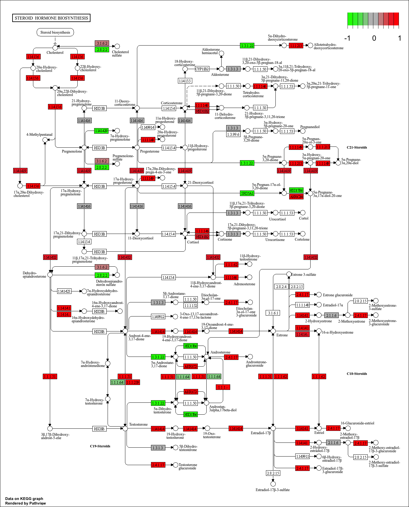
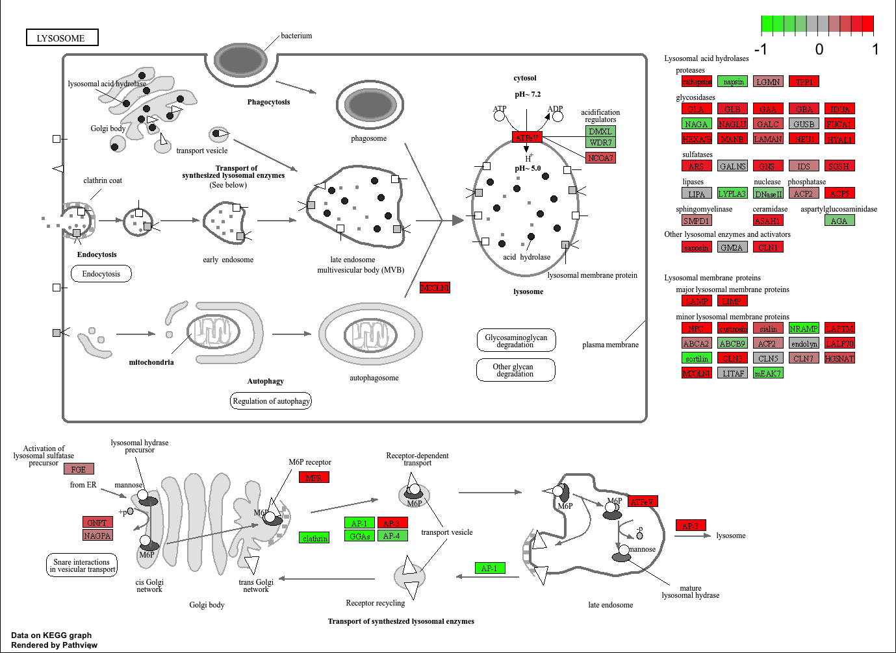
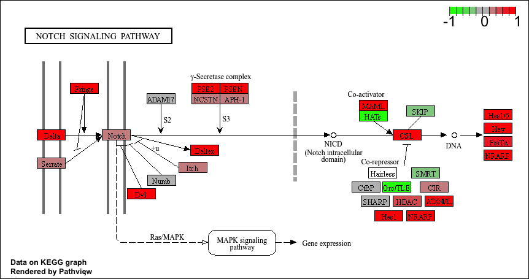
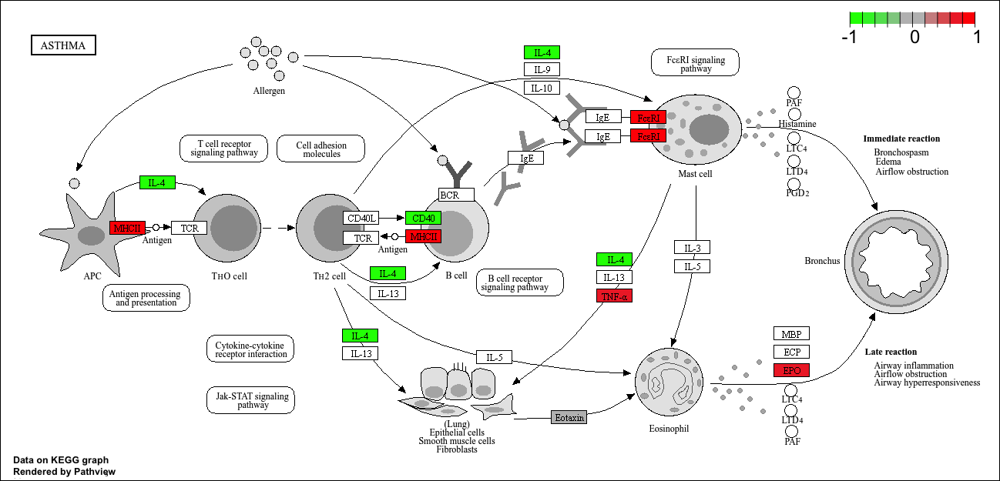
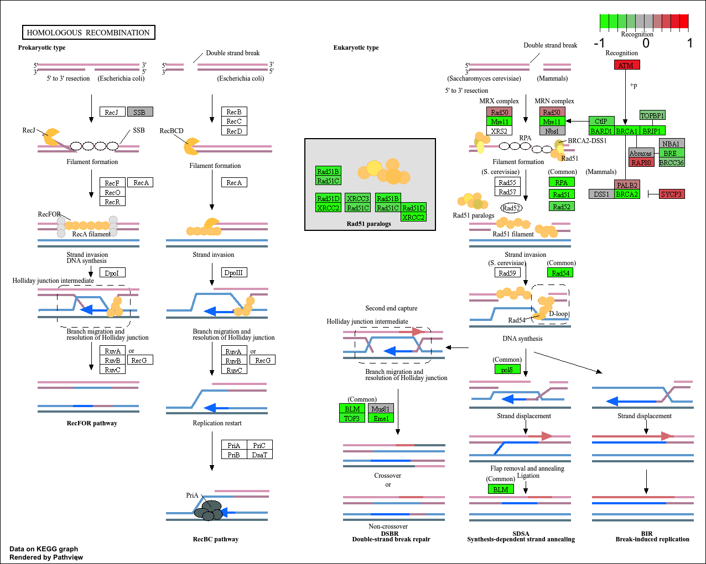
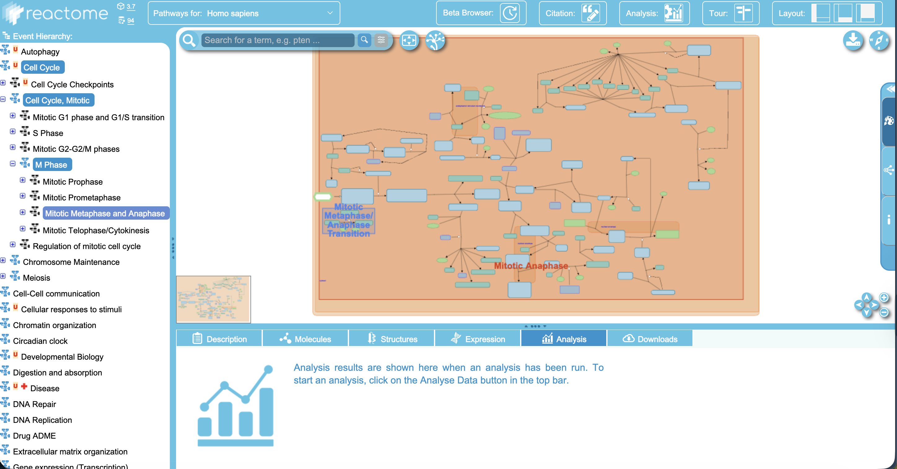
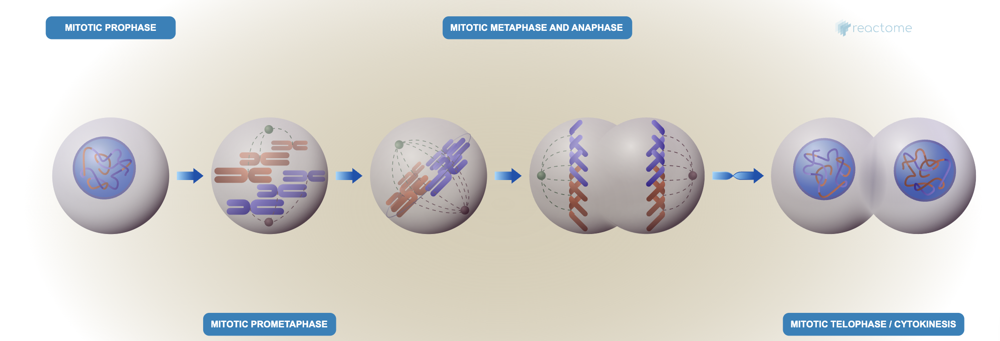

## Background

Today we will run through a complete RNASeq analysis

The data for for hands-on session comes from GEO entry: GSE37704, which is associated with the following publication:

Trapnell C, Hendrickson DG, Sauvageau M, Goff L et al. "Differential analysis of gene regulation at transcript resolution with RNA-seq". Nat Biotechnol 2013 Jan;31(1):46-53. PMID: 23222703

The authors report on differential analysis of lung fibroblasts in response to loss of the developmental transcription factor HOXA1. Their results and others indicate that HOXA1 is required for lung fibroblast and HeLa cell cycle progression. In particular their analysis show that "loss of HOXA1 results in significant expression level changes in thousands of individual transcripts, along with isoform switching events in key regulators of the cell cycle". For our session we have used their Sailfish gene-level estimated counts and hence are restricted to protein-coding genes only.

## Data Import

> Q. Complete the code below to remove the troublesome first column from countData

```{r}
counts <- read.csv("GSE37704_featurecounts.csv", row.names=1)
metadata <- read.csv("GSE37704_metadata.csv")
```

Check correspondence of `metadata` and `counts` (i.e. that columns in `counts` match the rows in `metadata`).

```{r}
metadata
```

```{r}
colnames(counts)
```

```{r}
metadata$id
```

Fix to remove that first length column
```{r}
counts <- counts[,-1]
```

Also let's remove low count genes

> Q. Complete the code below to filter countData to exclude genes (i.e. rows) where we have 0 read count across all samples (i.e. columns).

```{r}
tot.counts <- rowSums(counts)
head(tot.counts)
```

Let's remove all zero count genes

```{r}
zero.inds <- tot.counts == 0
head(zero.inds)
```
```{r}

# no more zero counts!
counts <- counts[!zero.inds,]
```


```{r}
test_cols <- all(colnames(counts) == metadata$id)
```


```{r}
if ( !test_cols ){
  message("Wow.... there is a problem with the metadata counts setup")

}
```

## Setup for DESeq

```{r}
library(DESeq2)
```

```{r}
dds <- DESeqDataSetFromMatrix(countData = counts,
                              colData = metadata,
                              design = ~condition)

#tilda, ~
```


## Run DESeq 

```{r}
dds <- DESeq(dds)
```


## Get Results

```{r}
res <- results(dds)
```

> Call the summary() function on your results to get a sense of how many genes are up or down-regulated at the default 0.1 p-value cutoff.

```{r}
summary(res)
```

```{r}
head(res)
```


## Add annotation

```{r}
library(AnnotationDbi)
library(org.Hs.eg.db)

columns(org.Hs.eg.db)

res$symbol = mapIds(org.Hs.eg.db, 
                    keys=row.names(res),
                    keytype="ENSEMBL",
                    column="SYMBOL",
                    multiVals = "first")

res$entrez= mapIds(org.Hs.eg.db,
       keys=row.names(res),
       keytype="ENSEMBL", # format of our genes
       column="ENTREZID",
       multiVals = "first") # new format we want to add
  

res$name= mapIds(org.Hs.eg.db,
       keys=row.names(res),
       keytype="ENSEMBL", # format of our genes
       column="GENENAME",
       multiVals = "first") # new format we want to add
```


## Visualize Results

```{r}
plot( res$log2FoldChange, -log(res$padj) )
```

```{r}
library(ggplot2)

my_cols <- rep("gray", nrow(res))

# Color red the genes with absolute fold change above 2
my_cols[ abs(res$log2FoldChange) > 2 ] <- "red"

# Color blue the genes with adjusted p-value below 0.01 and absolute fold change more than 2

my_cols[ res$padj < 0.01 & abs(res$log2FoldChange) > 2 ] <- "blue"


ggplot(res) +
  aes(log2FoldChange, -log(padj)) +
  geom_point(col=my_cols) +
  geom_vline(xintercept = c(-2,2), col="red") +
  geom_hline(yintercept = -log(0.05), col="red")
```


## Pathway analysis

> Q. Use the mapIDs() function multiple times to add SYMBOL, ENTREZID and GENENAME annotation to our results by completing the code below.

```{r}
library(gage)
library(gageData)

data(kegg.sets.hs)
data(sigmet.idx.hs)

# Focus on signaling and metabolic pathways only
kegg.sets.hs = kegg.sets.hs[sigmet.idx.hs]

# Examine the first 3 pathways
head(kegg.sets.hs, 3)
```

```{r}
foldchanges = res$log2FoldChange
names(foldchanges) = res$entrez
head(foldchanges)
```
```{r}
keggres = gage(foldchanges, gsets=kegg.sets.hs)
```

```{r}
library(pathview)
pathview(gene.data=foldchanges, pathway.id="hsa04110")
```
```{r}
# A different PDF based output of the same data
pathview(gene.data=foldchanges, pathway.id="hsa04110", kegg.native=FALSE)
```

```{r}
## Focus on top 5 upregulated pathways here for demo purposes only
keggrespathways <- rownames(keggres$greater)[1:5]

# Extract the 8 character long IDs part of each string
keggresids = substr(keggrespathways, start=1, stop=8)
keggresids

```

```{r}
pathview(gene.data=foldchanges, pathway.id=keggresids, species="hsa")
```

```{r}
head(keggres$less)
```

Insert figure for this pathway










> Q. Can you do the same procedure as above to plot the pathview figures for the top 5 down-reguled pathways?

```{r}
## Focus on top 5 upregulated pathways here for demo purposes only
keggrespathways_less <- rownames(keggres$less)[1:5]

# Extract the 8 character long IDs part of each string
keggresids = substr(keggrespathways_less, start=1, stop=8)
keggresids

pathview(gene.data=foldchanges, pathway.id=keggresids, species="hsa")
```





## Save results

> Q. Finally for this section let's reorder these results by adjusted p-value and save them to a CSV file in your current project directory.

```{r}
write.csv(res, file="myresults.csv")
```


## Gene Ontology

Let's try GO analysis and compare to KEGG analysis
```{r}
data(go.sets.hs)
data(go.subs.hs)

# Focus on biological process subset of GO
gobpsets <- go.sets.hs[go.subs.hs$BP]

gobpres <- gage(foldchanges, gsets=gobpsets)

lapply(gobpres, head)
```

```{r}
head(gobpres$less)
```


## Reactome

Some folks really like reactome online rather than the R package of the same name (available from bioconductor).

To use the website viewer we want to upload our set of gene symbols for the genes we want to focus on (here those with a P vlaue below 0.05)

Then, to perform pathway analysis online go to the Reactome website (https://reactome.org/PathwayBrowser/#TOOL=AT). Select “choose file” to upload your significant gene list. Then, select the parameters “Project to Humans”, then click “Analyze”.


```{r}
sig_genes <- res[res$padj <= 0.05 & !is.na(res$padj), "symbol"]
print(paste("Total number of significant genes:", length(sig_genes)))
```

```{r}
write.table(sig_genes, file="significant_genes.txt", row.names=FALSE, col.names=FALSE, quote=FALSE)
```

> Q: What pathway has the most significant “Entities p-value”? Do the most significant pathways listed match your previous KEGG results? What factors could cause differences between the two methods?

The mitosis pathway has the most significant Entities p-value. This matches our previous KEGG results, where the cell cycle pathway was the most significantly downregulated pathway. Both pathways are related to cell division and proliferation. Differences between the two methods could arise from variations in pathway definitions, gene annotations, and statistical approaches used in the analyses.



