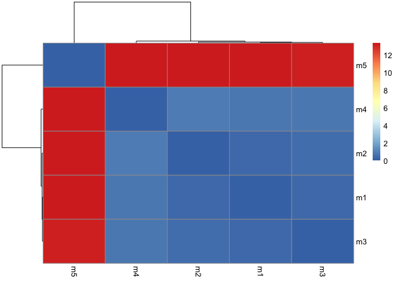
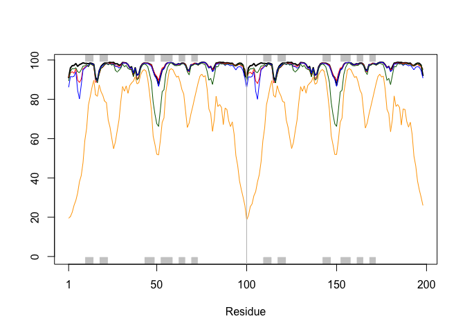
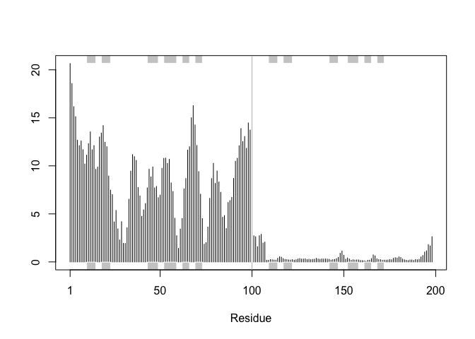

# Class 11: Structural Bioinformatics pt2.
Libby Gilmore (A69047570)

We saw last day that the PDB has 209,886 entries (Oct/Nov 2025).
UniProtKB (i.e. protein sequence database) has 199,579,901 entries

``` r
100 * 209886/199579901
```

    [1] 0.1051639

So the PDB has 0.1% coverage of the main sequence database

Enter AlphaFold data base (AFDB) <https://alphafold.ebi.ac.uk/> that
attemps to provide computed models for all sequences in UniProt.

## AlphaFold

AlphaFold has 3 main outputs

- the predicted coordinates (PDB files)
- A local quality score called **pLDDT** (one for each amino-acid)
- A second quality score **PAE** Predicted Aligned Error (for each pair
  of amino-acid)

We can run alphaFold ourselves if we are not happy with afdb (i.e. no
coverage or poor model)

## Interpreting/ Analyzing AF results in R

``` r
# Change this for YOUR results dir name
results_dir <- "HIVPR_dimer_23119/" 
```

``` r
# File names for all PDB models
pdb_files <- list.files(path=results_dir,
                        pattern="*.pdb",
                        full.names = TRUE)

# Print our PDB file names
basename(pdb_files)
```

    [1] "HIVPR_dimer_23119_unrelaxed_rank_001_alphafold2_multimer_v3_model_2_seed_000.pdb"
    [2] "HIVPR_dimer_23119_unrelaxed_rank_002_alphafold2_multimer_v3_model_4_seed_000.pdb"
    [3] "HIVPR_dimer_23119_unrelaxed_rank_003_alphafold2_multimer_v3_model_1_seed_000.pdb"
    [4] "HIVPR_dimer_23119_unrelaxed_rank_004_alphafold2_multimer_v3_model_5_seed_000.pdb"
    [5] "HIVPR_dimer_23119_unrelaxed_rank_005_alphafold2_multimer_v3_model_3_seed_000.pdb"

``` r
library(bio3d)
library(bio3dview)

# Read all data from Models 
#  and superpose/fit coords
pdbs <- pdbaln(pdb_files, fit=TRUE, exefile="msa")
```

    Reading PDB files:
    HIVPR_dimer_23119//HIVPR_dimer_23119_unrelaxed_rank_001_alphafold2_multimer_v3_model_2_seed_000.pdb
    HIVPR_dimer_23119//HIVPR_dimer_23119_unrelaxed_rank_002_alphafold2_multimer_v3_model_4_seed_000.pdb
    HIVPR_dimer_23119//HIVPR_dimer_23119_unrelaxed_rank_003_alphafold2_multimer_v3_model_1_seed_000.pdb
    HIVPR_dimer_23119//HIVPR_dimer_23119_unrelaxed_rank_004_alphafold2_multimer_v3_model_5_seed_000.pdb
    HIVPR_dimer_23119//HIVPR_dimer_23119_unrelaxed_rank_005_alphafold2_multimer_v3_model_3_seed_000.pdb
    .....

    Extracting sequences

    pdb/seq: 1   name: HIVPR_dimer_23119//HIVPR_dimer_23119_unrelaxed_rank_001_alphafold2_multimer_v3_model_2_seed_000.pdb 
    pdb/seq: 2   name: HIVPR_dimer_23119//HIVPR_dimer_23119_unrelaxed_rank_002_alphafold2_multimer_v3_model_4_seed_000.pdb 
    pdb/seq: 3   name: HIVPR_dimer_23119//HIVPR_dimer_23119_unrelaxed_rank_003_alphafold2_multimer_v3_model_1_seed_000.pdb 
    pdb/seq: 4   name: HIVPR_dimer_23119//HIVPR_dimer_23119_unrelaxed_rank_004_alphafold2_multimer_v3_model_5_seed_000.pdb 
    pdb/seq: 5   name: HIVPR_dimer_23119//HIVPR_dimer_23119_unrelaxed_rank_005_alphafold2_multimer_v3_model_3_seed_000.pdb 

``` r
view.pdbs(pdbs)
```

``` r
rd <- rmsd(pdbs, fit=T)
```

    Warning in rmsd(pdbs, fit = T): No indices provided, using the 198 non NA positions

``` r
range(rd)
```

    [1]  0.000 13.383

``` r
library(pheatmap)

colnames(rd) <- paste0("m",1:5)
rownames(rd) <- paste0("m",1:5)
pheatmap(rd)
```



``` r
# Read a reference PDB structure
pdb <- read.pdb("1hsg")
```

      Note: Accessing on-line PDB file

``` r
plotb3(pdbs$b[1,], typ="l", lwd=2, sse=pdb)
points(pdbs$b[2,], typ="l", col="red")
points(pdbs$b[3,], typ="l", col="blue")
points(pdbs$b[4,], typ="l", col="darkgreen")
points(pdbs$b[5,], typ="l", col="orange")
abline(v=100, col="gray")
```



``` r
core <- core.find(pdbs)
```

     core size 197 of 198  vol = 76.955 
     core size 196 of 198  vol = 71.565 
     core size 195 of 198  vol = 67.163 
     core size 194 of 198  vol = 63.383 
     core size 193 of 198  vol = 61.543 
     core size 192 of 198  vol = 59.997 
     core size 191 of 198  vol = 58.48 
     core size 190 of 198  vol = 57.075 
     core size 189 of 198  vol = 55.366 
     core size 188 of 198  vol = 53.694 
     core size 187 of 198  vol = 52.261 
     core size 186 of 198  vol = 50.655 
     core size 185 of 198  vol = 49.378 
     core size 184 of 198  vol = 48.108 
     core size 183 of 198  vol = 47.022 
     core size 182 of 198  vol = 45.974 
     core size 181 of 198  vol = 45.167 
     core size 180 of 198  vol = 44.387 
     core size 179 of 198  vol = 43.45 
     core size 178 of 198  vol = 42.652 
     core size 177 of 198  vol = 42.015 
     core size 176 of 198  vol = 41.433 
     core size 175 of 198  vol = 41.139 
     core size 174 of 198  vol = 41.106 
     core size 173 of 198  vol = 40.986 
     core size 172 of 198  vol = 41.329 
     core size 171 of 198  vol = 41.389 
     core size 170 of 198  vol = 41.233 
     core size 169 of 198  vol = 40.957 
     core size 168 of 198  vol = 40.842 
     core size 167 of 198  vol = 40.889 
     core size 166 of 198  vol = 40.764 
     core size 165 of 198  vol = 40.562 
     core size 164 of 198  vol = 40.107 
     core size 163 of 198  vol = 39.511 
     core size 162 of 198  vol = 38.759 
     core size 161 of 198  vol = 38.179 
     core size 160 of 198  vol = 37.378 
     core size 159 of 198  vol = 36.853 
     core size 158 of 198  vol = 36.146 
     core size 157 of 198  vol = 35.636 
     core size 156 of 198  vol = 34.62 
     core size 155 of 198  vol = 34.129 
     core size 154 of 198  vol = 33.759 
     core size 153 of 198  vol = 33.278 
     core size 152 of 198  vol = 32.798 
     core size 151 of 198  vol = 32.638 
     core size 150 of 198  vol = 31.411 
     core size 149 of 198  vol = 30.726 
     core size 148 of 198  vol = 30.463 
     core size 147 of 198  vol = 29.999 
     core size 146 of 198  vol = 29.513 
     core size 145 of 198  vol = 29.003 
     core size 144 of 198  vol = 28.605 
     core size 143 of 198  vol = 28.047 
     core size 142 of 198  vol = 27.45 
     core size 141 of 198  vol = 26.83 
     core size 140 of 198  vol = 26.296 
     core size 139 of 198  vol = 25.027 
     core size 138 of 198  vol = 24.308 
     core size 137 of 198  vol = 23.425 
     core size 136 of 198  vol = 22.808 
     core size 135 of 198  vol = 22.055 
     core size 134 of 198  vol = 20.741 
     core size 133 of 198  vol = 19.848 
     core size 132 of 198  vol = 18.924 
     core size 131 of 198  vol = 18.311 
     core size 130 of 198  vol = 17.908 
     core size 129 of 198  vol = 17.148 
     core size 128 of 198  vol = 16.295 
     core size 127 of 198  vol = 15.711 
     core size 126 of 198  vol = 14.902 
     core size 125 of 198  vol = 14.213 
     core size 124 of 198  vol = 13.223 
     core size 123 of 198  vol = 12.44 
     core size 122 of 198  vol = 11.527 
     core size 121 of 198  vol = 10.655 
     core size 120 of 198  vol = 10.118 
     core size 119 of 198  vol = 9.486 
     core size 118 of 198  vol = 8.841 
     core size 117 of 198  vol = 8.175 
     core size 116 of 198  vol = 7.599 
     core size 115 of 198  vol = 7.251 
     core size 114 of 198  vol = 6.921 
     core size 113 of 198  vol = 6.668 
     core size 112 of 198  vol = 6.375 
     core size 111 of 198  vol = 5.942 
     core size 110 of 198  vol = 5.733 
     core size 109 of 198  vol = 5.308 
     core size 108 of 198  vol = 4.945 
     core size 107 of 198  vol = 4.534 
     core size 106 of 198  vol = 4.347 
     core size 105 of 198  vol = 4.215 
     core size 104 of 198  vol = 4.058 
     core size 103 of 198  vol = 3.879 
     core size 102 of 198  vol = 3.772 
     core size 101 of 198  vol = 3.523 
     core size 100 of 198  vol = 3.257 
     core size 99 of 198  vol = 2.949 
     core size 98 of 198  vol = 2.579 
     core size 97 of 198  vol = 2.298 
     core size 96 of 198  vol = 1.967 
     core size 95 of 198  vol = 1.773 
     core size 94 of 198  vol = 1.643 
     core size 93 of 198  vol = 1.454 
     core size 92 of 198  vol = 1.29 
     core size 91 of 198  vol = 1.247 
     core size 90 of 198  vol = 1.088 
     core size 89 of 198  vol = 0.982 
     core size 88 of 198  vol = 0.921 
     core size 87 of 198  vol = 0.831 
     core size 86 of 198  vol = 0.509 
     core size 85 of 198  vol = 0.344 
     FINISHED: Min vol ( 0.5 ) reached

``` r
core.inds <- print(core, vol=0.5)
```

    # 86 positions (cumulative volume <= 0.5 Angstrom^3) 
      start end length
    1     9  47     39
    2    52  78     27
    3    80  97     18

``` r
xyz <- pdbfit(pdbs, core.inds, outpath="corefit_structures")
```

``` r
rf <- rmsf(xyz)

plotb3(rf, sse=pdb)
abline(v=100, col="gray", ylab="RMSF")
```



``` r
library(jsonlite)

# Listing of all PAE JSON files
pae_files <- list.files(path=results_dir,
                        pattern=".*model.*\\.json",
                        full.names = TRUE)
```
