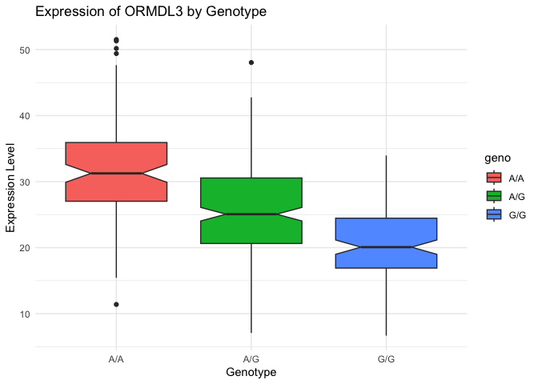

# Class17 HW: RNA-Seq Galaxy
Libby Gilmore (A69047570)

- [Libraries](#libraries)
- [Data Import](#data-import)

## Libraries

``` r
library(tidyverse)
```

    Warning: package 'ggplot2' was built under R version 4.5.2

    Warning: package 'readr' was built under R version 4.5.2

    ── Attaching core tidyverse packages ──────────────────────── tidyverse 2.0.0 ──
    ✔ dplyr     1.1.4     ✔ readr     2.1.6
    ✔ forcats   1.0.1     ✔ stringr   1.6.0
    ✔ ggplot2   4.0.1     ✔ tibble    3.3.0
    ✔ lubridate 1.9.4     ✔ tidyr     1.3.1
    ✔ purrr     1.2.0     
    ── Conflicts ────────────────────────────────────────── tidyverse_conflicts() ──
    ✖ dplyr::filter() masks stats::filter()
    ✖ dplyr::lag()    masks stats::lag()
    ℹ Use the conflicted package (<http://conflicted.r-lib.org/>) to force all conflicts to become errors

``` r
library(ggplot2)
library(readr)
```

## Data Import

``` r
galaxy_data <- read.table("expression_results.txt")
```

> Q13: Read this file into R and determine the sample size for each
> genotype and their corresponding median expression levels for each of
> these genotypes.

``` r
galaxy_data |> 
  group_by(geno) |> 
  summarize(
    Sample_Size = n(),
    Median_Expression = median(exp)
  )
```

    # A tibble: 3 × 3
      geno  Sample_Size Median_Expression
      <chr>       <int>             <dbl>
    1 A/A           108              31.2
    2 A/G           233              25.1
    3 G/G           121              20.1

> Q14: Generate a boxplot with a box per genotype, what could you infer
> from the relative expression value between A/A and G/G displayed in
> this plot? Does the SNP effect the expression of ORMDL3?

The SNP seems to effect the expression of ORMDL3. Individuals with the
A/A genotype show higher expression levels compared to those with the
G/G genotype. This suggests that the presence of the A allele may be
associated with increased expression of the ORMDL3 gene; or that the G
allele could be linked to decreased expression. This could have additive
effects if an individual is heterozygous (A/G), resulting in
intermediate expression levels as seen below.

``` r
ggplot(galaxy_data) +
  geom_boxplot(aes(x = geno, y = exp, fill = geno, notch=TRUE)) +
  labs(
    title = "Expression of ORMDL3 by Genotype",
    x = "Genotype",
    y = "Expression Level"
  ) +
  theme_minimal()
```

    Warning in geom_boxplot(aes(x = geno, y = exp, fill = geno, notch = TRUE)):
    Ignoring unknown aesthetics: notch


