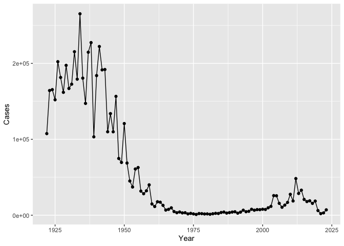
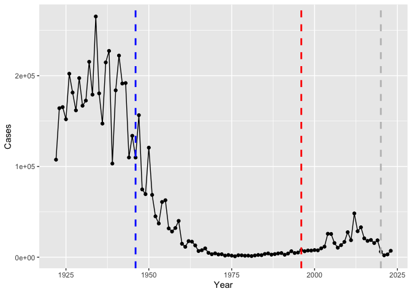
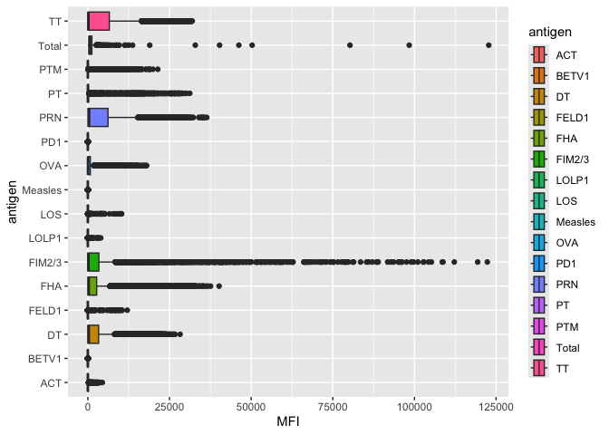
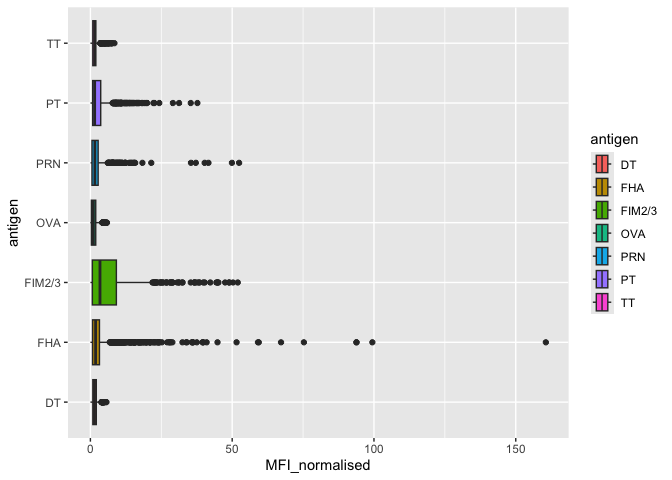
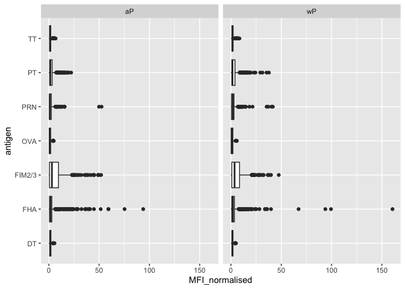
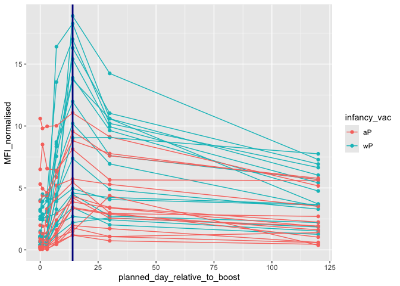

# Class 18: Pertussis and the CMI-PB mini project
Libby Gilmore (pid: A69047570)

- [Background](#background)
  - [Investigating pertussis cases by
    year](#investigating-pertussis-cases-by-year)
  - [A tale of two vaccines (wP and
    aP)](#a-tale-of-two-vaccines-wp-and-ap)
  - [Exploring CMI-PB data](#exploring-cmi-pb-data)
  - [Side-note: working with dates](#side-note-working-with-dates)
  - [Joining multiple tables](#joining-multiple-tables)
  - [Differences between aP and wP](#differences-between-ap-and-wp)
  - [Time course analysis](#time-course-analysis)
- [Time course of PT (Virulence Factor: Pertussis
  toxin)](#time-course-of-pt-virulence-factor-pertussis-toxin)
  - [System setup](#system-setup)

## Background

Pertussis (a.k.a Whooping cough) is a highly contagious lung infects
caused by the bacteria *Bordetella pertussis*.

The CDC tracks case numbers in the US and makes this available online:

    Warning: package 'ggplot2' was built under R version 4.5.2

    Warning: package 'readr' was built under R version 4.5.2

    ── Attaching core tidyverse packages ──────────────────────── tidyverse 2.0.0 ──
    ✔ dplyr     1.1.4     ✔ readr     2.1.6
    ✔ forcats   1.0.1     ✔ stringr   1.6.0
    ✔ lubridate 1.9.4     ✔ tibble    3.3.0
    ✔ purrr     1.2.0     ✔ tidyr     1.3.1
    ── Conflicts ────────────────────────────────────────── tidyverse_conflicts() ──
    ✖ dplyr::filter() masks stats::filter()
    ✖ dplyr::lag()    masks stats::lag()
    ℹ Use the conflicted package (<http://conflicted.r-lib.org/>) to force all conflicts to become errors

    Attaching package: 'jsonlite'


    The following object is masked from 'package:purrr':

        flatten

``` r
# assign the CDC pertussis case number data to a data frame called cdc

# tools > addins > browse addins > paste df
cdc <- data.frame(
                                 Year = c(1922L,1923L,1924L,1925L,
                                          1926L,1927L,1928L,1929L,1930L,1931L,
                                          1932L,1933L,1934L,1935L,1936L,
                                          1937L,1938L,1939L,1940L,1941L,1942L,
                                          1943L,1944L,1945L,1946L,1947L,
                                          1948L,1949L,1950L,1951L,1952L,
                                          1953L,1954L,1955L,1956L,1957L,1958L,
                                          1959L,1960L,1961L,1962L,1963L,
                                          1964L,1965L,1966L,1967L,1968L,1969L,
                                          1970L,1971L,1972L,1973L,1974L,
                                          1975L,1976L,1977L,1978L,1979L,1980L,
                                          1981L,1982L,1983L,1984L,1985L,
                                          1986L,1987L,1988L,1989L,1990L,
                                          1991L,1992L,1993L,1994L,1995L,1996L,
                                          1997L,1998L,1999L,2000L,2001L,
                                          2002L,2003L,2004L,2005L,2006L,2007L,
                                          2008L,2009L,2010L,2011L,2012L,
                                          2013L,2014L,2015L,2016L,2017L,2018L,
                                          2019L,2020L,2021L,2022L,2023L),
         Cases = c(107473,164191,165418,152003,
                                          202210,181411,161799,197371,
                                          166914,172559,215343,179135,265269,
                                          180518,147237,214652,227319,103188,
                                          183866,222202,191383,191890,109873,
                                          133792,109860,156517,74715,69479,
                                          120718,68687,45030,37129,60886,
                                          62786,31732,28295,32148,40005,
                                          14809,11468,17749,17135,13005,6799,
                                          7717,9718,4810,3285,4249,3036,
                                          3287,1759,2402,1738,1010,2177,2063,
                                          1623,1730,1248,1895,2463,2276,
                                          3589,4195,2823,3450,4157,4570,
                                          2719,4083,6586,4617,5137,7796,6564,
                                          7405,7298,7867,7580,9771,11647,
                                          25827,25616,15632,10454,13278,
                                          16858,27550,18719,48277,28639,32971,
                                          20762,17972,18975,15609,18617,
                                          6124,2116,3044,7063)
       )
```

### Investigating pertussis cases by year

> Q1. With the help of the R “addin” package datapasta assign the CDC
> pertussis case number data to a data frame called cdc and use ggplot
> to make a plot of cases numbers over time.

``` r
ggplot(cdc) +
  aes(x=Year, y = Cases) +
  geom_point() +
  geom_line()
```



### A tale of two vaccines (wP and aP)

> Q2. Using the ggplot geom_vline() function add lines to your previous
> plot for the 1946 introduction of the wP (whole cell) vaccine and the
> 1996 switch to aP vaccine. The original wP deployment in 1947 and the
> newer aP (acellular) vaccine rolls out in 1996. What do you notice?

``` r
ggplot(cdc) +
  aes(x=Year, y = Cases) +
  geom_point() +
  geom_line() +
  geom_vline(xintercept = 1946, linetype="dashed", 
             color = "blue", linewidth =1) +
  geom_vline(xintercept = 1996, linetype="dashed", 
             color = "red", linewidth=1) +
  geom_vline(xintercept = 2020, linetype="dashed", 
             color = "grey", linewidth=1)
```



> Q3. Describe what happened after the introduction of the aP vaccine?
> Do you have a possible explanation for the observed trend?

The whole cell vaccine introduction in 1946 led to a dramatic decrease
in pertussis cases over the following decades, with more variationin the
beginning years, probably to get people to adopt it. However, after the
switch to the acellular vaccine in 1996, there appears to be an increase
in pertussis cases, suggesting that the aP vaccine may not be as
effective in controlling the disease as the wP vaccine was, or not as
effective long-term. Or with the need to get boosters, people forgot to
get them which coupled with the short-term protection made cases rise.

### Exploring CMI-PB data

The CMI-Pertusis boost (PB) project focuses on gathering data on this
very topic. What is distinct between aP and wP individuals over time
when they encounter Pertussis again.

They make their data available via a JSON format returning API. We can
read JSON format with the `read_json()` function from the **jsonlitee**
package.

``` r
subject <- read_json("http://cmi-pb.org/api/v5_1/subject", simplifyVector = TRUE)
```

> How many subjects are in the dataset?

``` r
nrow(subject)
```

    [1] 172

> Q4. How many aP and wP infancy vaccinated subjects are in the dataset?

``` r
table(subject$infancy_vac)
```


    aP wP 
    87 85 

> Q5. How many Male and Female subjects/patients are in the dataset?

``` r
table(subject$biological_sex)
```


    Female   Male 
       112     60 

> Q6. What is the breakdown of race and biological sex (e.g. number of
> Asian females, White males etc…)? This is not representative of the US
> population

``` r
table(subject$race, subject$biological_sex)
```

                                               
                                                Female Male
      American Indian/Alaska Native                  0    1
      Asian                                         32   12
      Black or African American                      2    3
      More Than One Race                            15    4
      Native Hawaiian or Other Pacific Islander      1    1
      Unknown or Not Reported                       14    7
      White                                         48   32

Let’s read more tables from the CMI-PB dataset.

``` r
# specimen information
specimen <- read_json("http://cmi-pb.org/api/v5_1/specimen", simplifyVector = TRUE)

# anitbody titer levels
ab_titer <- read_json("http://cmi-pb.org/api/v5_1/plasma_ab_titer", simplifyVector = TRUE)
```

### Side-note: working with dates

> Q7. Using this approach determine (i) the average age of wP
> individuals, (ii) the average age of aP individuals; and (iii) are
> they significantly different?

> Q8. Determine the age of all individuals at time of boost?

> Q9. With the help of a faceted boxplot or histogram (see below), do
> you think these two groups are significantly different?

### Joining multiple tables

Join (or link, or merge) using the `inner_join()` function from
**dplyr**.

> Q9. Complete the code to join specimen and subject tables to make a
> new merged data frame containing all specimen records along with their
> associated subject details

``` r
library(dplyr)

meta <- inner_join(subject, specimen)
```

    Joining with `by = join_by(subject_id)`

> Q10. Now using the same procedure join meta with titer data so we can
> further analyze this data in terms of time of visit aP/wP, male/female
> etc.

``` r
ab_data <- inner_join(meta, ab_titer)
```

    Joining with `by = join_by(specimen_id)`

``` r
head(ab_data)
```

      subject_id infancy_vac biological_sex              ethnicity  race
    1          1          wP         Female Not Hispanic or Latino White
    2          1          wP         Female Not Hispanic or Latino White
    3          1          wP         Female Not Hispanic or Latino White
    4          1          wP         Female Not Hispanic or Latino White
    5          1          wP         Female Not Hispanic or Latino White
    6          1          wP         Female Not Hispanic or Latino White
      year_of_birth date_of_boost      dataset specimen_id
    1    1986-01-01    2016-09-12 2020_dataset           1
    2    1986-01-01    2016-09-12 2020_dataset           1
    3    1986-01-01    2016-09-12 2020_dataset           1
    4    1986-01-01    2016-09-12 2020_dataset           1
    5    1986-01-01    2016-09-12 2020_dataset           1
    6    1986-01-01    2016-09-12 2020_dataset           1
      actual_day_relative_to_boost planned_day_relative_to_boost specimen_type
    1                           -3                             0         Blood
    2                           -3                             0         Blood
    3                           -3                             0         Blood
    4                           -3                             0         Blood
    5                           -3                             0         Blood
    6                           -3                             0         Blood
      visit isotype is_antigen_specific antigen        MFI MFI_normalised  unit
    1     1     IgE               FALSE   Total 1110.21154       2.493425 UG/ML
    2     1     IgE               FALSE   Total 2708.91616       2.493425 IU/ML
    3     1     IgG                TRUE      PT   68.56614       3.736992 IU/ML
    4     1     IgG                TRUE     PRN  332.12718       2.602350 IU/ML
    5     1     IgG                TRUE     FHA 1887.12263      34.050956 IU/ML
    6     1     IgE                TRUE     ACT    0.10000       1.000000 IU/ML
      lower_limit_of_detection
    1                 2.096133
    2                29.170000
    3                 0.530000
    4                 6.205949
    5                 4.679535
    6                 2.816431

> Q11. How many specimens (i.e. entries in ab_data) do we have for each
> isotype?

``` r
unique(ab_data$isotype)
```

    [1] "IgE"  "IgG"  "IgG1" "IgG2" "IgG3" "IgG4"

> How many different Antigens are there in the dataset?

``` r
unique(ab_data$antigen)
```

     [1] "Total"   "PT"      "PRN"     "FHA"     "ACT"     "LOS"     "FELD1"  
     [8] "BETV1"   "LOLP1"   "Measles" "PTM"     "FIM2/3"  "TT"      "DT"     
    [15] "OVA"     "PD1"    

``` r
table(ab_data$antigen)
```


        ACT   BETV1      DT   FELD1     FHA  FIM2/3   LOLP1     LOS Measles     OVA 
       1970    1970    6318    1970    6712    6318    1970    1970    1970    6318 
        PD1     PRN      PT     PTM   Total      TT 
       1970    6712    6712    1970     788    6318 

> Let’s plot antigen MFI levels across the whole dataset

``` r
ggplot(ab_data) +
  aes(x=MFI, y =antigen, fill=antigen) +
  geom_boxplot()
```

    Warning: Removed 1 row containing non-finite outside the scale range
    (`stat_boxplot()`).



IgG is crucial for long-term immunity and responsing to bacterial and
viral infections. Plot an antigen MFI levels for just IgG isotype

``` r
igg <- ab_data |> 
  filter(isotype == "IgG")

ggplot(igg) +
  aes(x=MFI_normalised, y =antigen, fill=antigen) +
  geom_boxplot()
```



### Differences between aP and wP

We can color up by the `infancy_vac` values of `aP` and `wP`

``` r
ggplot(igg) +
  aes(x=MFI_normalised, y =antigen, col=infancy_vac) +
  geom_boxplot()
```


We could also “facet” by the “aP” vs “wP” infancy_vac values

``` r
ggplot(igg) +
  aes(x=MFI_normalised, y =antigen) +
  geom_boxplot() + 
  facet_wrap(~infancy_vac)
```



> Q12. What are the different \$dataset values in abdata and what do you
> notice about the number of rows for the most “recent” dataset?

> Q13. Complete the following code to make a summary boxplot of Ab titer
> levels (MFI) for all antigens:

### Time course analysis

We can use `visit` as a proxy for time here and facet our plots by this
value 1 to 8…

``` r
table(ab_data$visit)
```


       1    2    3    4    5    6    7    8    9   10   11   12 
    8280 8280 8420 8420 8420 8100 7700 2670  770  686  105  105 

``` r
igg |> 
  filter(visit %in% 1:8) |> 
  ggplot() +
  aes(x=MFI_normalised, y =antigen, col=infancy_vac) +
  geom_boxplot() +
  facet_wrap(~visit, nrow=2)
```


## Time course of PT (Virulence Factor: Pertussis toxin)

``` r
pt <- igg |> 
  filter(antigen == "PT") |> 
  filter(dataset=="2021_dataset")
```

``` r
ggplot(pt) +
  aes(x=planned_day_relative_to_boost, 
      y=MFI_normalised, 
      col=infancy_vac,
      group=subject_id) +
  geom_point() +
  geom_line() + # can't just do geom_line() without group because we have multiple subjects, and will not group by individuals
  geom_vline(xintercept=14, col="darkblue", linewidth=1) # they peak at same line but magnitude differs
```



### System setup

``` r
sessionInfo()
```

    R version 4.5.1 (2025-06-13)
    Platform: aarch64-apple-darwin20
    Running under: macOS Tahoe 26.1

    Matrix products: default
    BLAS:   /Library/Frameworks/R.framework/Versions/4.5-arm64/Resources/lib/libRblas.0.dylib 
    LAPACK: /Library/Frameworks/R.framework/Versions/4.5-arm64/Resources/lib/libRlapack.dylib;  LAPACK version 3.12.1

    locale:
    [1] en_US.UTF-8/en_US.UTF-8/en_US.UTF-8/C/en_US.UTF-8/en_US.UTF-8

    time zone: America/Los_Angeles
    tzcode source: internal

    attached base packages:
    [1] stats     graphics  grDevices utils     datasets  methods   base     

    other attached packages:
     [1] jsonlite_2.0.0  lubridate_1.9.4 forcats_1.0.1   stringr_1.6.0  
     [5] dplyr_1.1.4     purrr_1.2.0     readr_2.1.6     tidyr_1.3.1    
     [9] tibble_3.3.0    tidyverse_2.0.0 ggplot2_4.0.1   datapasta_3.1.0

    loaded via a namespace (and not attached):
     [1] gtable_0.3.6       compiler_4.5.1     tidyselect_1.2.1   scales_1.4.0      
     [5] yaml_2.3.10        fastmap_1.2.0      R6_2.6.1           labeling_0.4.3    
     [9] generics_0.1.4     knitr_1.50         pillar_1.11.1      RColorBrewer_1.1-3
    [13] tzdb_0.5.0         rlang_1.1.6        stringi_1.8.7      xfun_0.54         
    [17] S7_0.2.1           timechange_0.3.0   cli_3.6.5          withr_3.0.2       
    [21] magrittr_2.0.4     digest_0.6.39      grid_4.5.1         rstudioapi_0.17.1 
    [25] hms_1.1.4          lifecycle_1.0.4    vctrs_0.6.5        evaluate_1.0.5    
    [29] glue_1.8.0         farver_2.1.2       rmarkdown_2.30     tools_4.5.1       
    [33] pkgconfig_2.0.3    htmltools_0.5.8.1 
